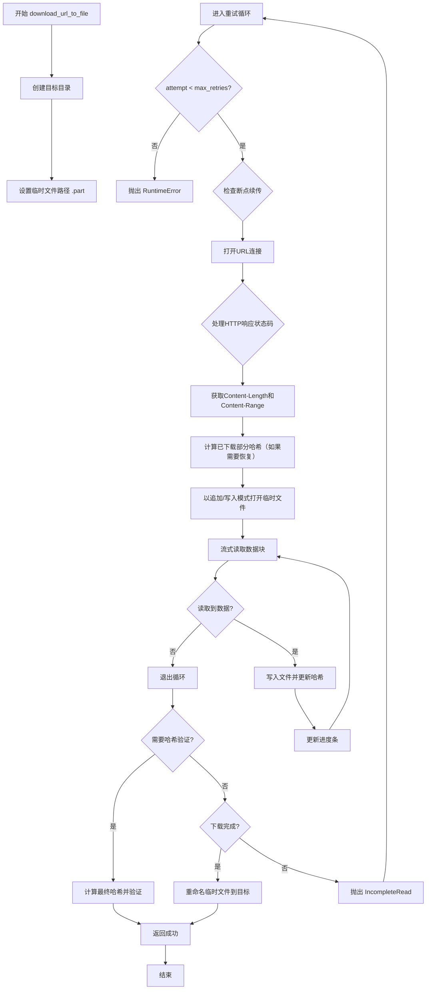
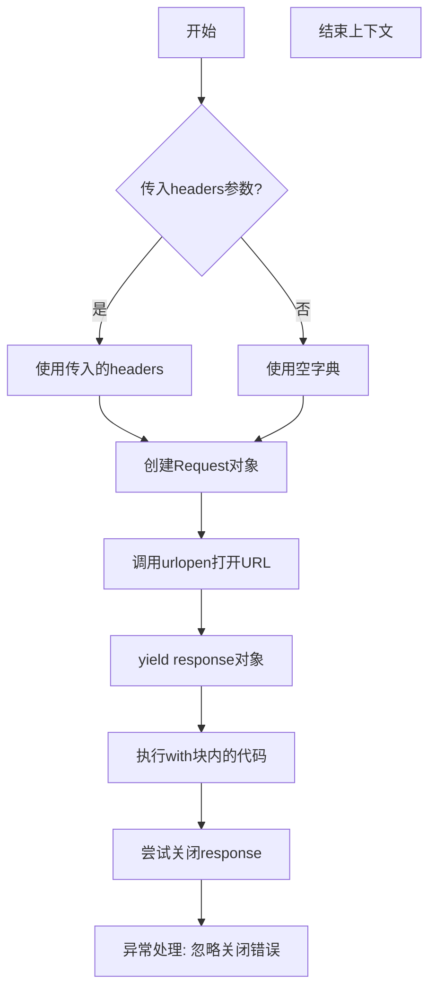
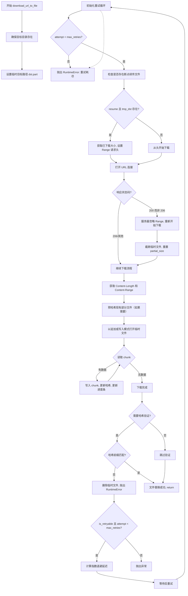

# `comic-translate\modules\utils\download_file.py` 详细设计文档

一个功能完善的HTTP/HTTPS文件下载工具，支持流式下载（恒定内存）、SHA256哈希验证、stderr进度条显示、自动目录创建、指数退避+抖动重试机制以及HTTP Range断点续传功能。

## 整体流程



## 类结构

```
模块级函数 (无类)
├── _open_url (上下文管理器)
├── _format_size (工具函数)
└── download_url_to_file (主函数)
```

## 全局变量及字段


### `CHUNK_SIZE`
    
每次读取的块大小，默认为64KB

类型：`int`
    


    

## 全局函数及方法


### `_open_url`

这是一个内部上下文管理器函数，用于打开HTTP(S) URL并返回响应对象，同时确保响应在使用后被正确关闭。它作为`download_url_to_file`函数的辅助工具，提供统一的URL打开和资源管理逻辑。

参数：

- `url`：`str`，要下载的源HTTP(S) URL地址
- `headers`：`Optional[dict]`，可选的HTTP请求头字典，用于自定义请求头（如User-Agent、Range等）
- `timeout`：`Optional[float]`，可选的socket超时时间（秒），控制请求等待响应的最长时间

返回值：`typing.ContextManager[http.client.HTTPResponse]`，返回一个上下文管理器，yield一个HTTP响应对象（`http.client.HTTPResponse`实例）

#### 流程图



#### 带注释源码

```python
@contextmanager
def _open_url(url: str, *, headers: Optional[dict] = None, timeout: Optional[float] = None):
    """打开URL并返回响应对象的上下文管理器
    
    Args:
        url: 要访问的URL字符串
        headers: 可选的请求头字典
        timeout: 可选的请求超时时间
    
    Yields:
        HTTP响应对象
    """
    # 构建请求对象，合并默认请求头和自定义请求头
    req = urllib.request.Request(url, headers=headers or {})
    
    # 打开URL获取响应（使用timeout控制超时）
    # nosec注释表示此调用仅用于受信任的源
    response = urllib.request.urlopen(req, timeout=timeout)
    
    try:
        # 将响应对象提供给调用者（with语句的as子句）
        yield response
    finally:
        # 确保退出上下文时关闭响应，释放网络连接资源
        try:
            response.close()
        except Exception:
            # 忽略关闭过程中的任何异常（如连接已关闭）
            pass
```


### `_format_size`

该函数用于将字节数转换为人类可读的文件大小字符串表示，支持 B、KB、MB、GB 四种单位的自动换算。

参数：

- `num_bytes`：`int`，要转换的字节数

返回值：`str`，格式化后的文件大小字符串（如 "10.5 MB"）

#### 流程图

```mermaid
flowchart TD
    A[开始: num_bytes] --> B{num_bytes < 1024?}
    B -- 是 --> C[返回 "{num_bytes} B"]
    B -- 否 --> D{num_bytes < 1024²?}
    D -- 是 --> E[返回 "{num_bytes / 1024:.1f} KB"]
    D -- 否 --> F{num_bytes < 1024³?}
    F -- 是 --> G[返回 "{num_bytes / 1024²:.1f} MB"]
    F -- 否 --> H[返回 "{num_bytes / 1024³:.1f} GB"]
    C --> I[结束]
    E --> I
    G --> I
    H --> I
```

#### 带注释源码

```python
def _format_size(num_bytes: int) -> str:
    """将字节数转换为人类可读的文件大小字符串。
    
    Args:
        num_bytes: 要转换的字节数（整数）
    
    Returns:
        格式化后的字符串，自动选择合适的单位（B/KB/MB/GB）
    """
    # 小于 1KB 时，直接显示字节数
    if num_bytes < 1024:
        return f"{num_bytes} B"
    
    # 小于 1MB 时，转换为 KB（保留一位小数）
    if num_bytes < 1024 ** 2:
        return f"{num_bytes / 1024:.1f} KB"
    
    # 小于 1GB 时，转换为 MB（保留一位小数）
    if num_bytes < 1024 ** 3:
        return f"{num_bytes / 1024 ** 2:.1f} MB"
    
    # 大于等于 1GB 时，转换为 GB（保留一位小数）
    return f"{num_bytes / 1024 ** 3:.1f} GB"
```


### `download_url_to_file`

该函数实现了一个健壮的 HTTP(S) 文件下载功能，支持流式下载（恒定内存占用）、SHA256 哈希前缀验证、进度条显示、自动目录创建、指数退避+抖动重试机制以及 HTTP Range 断点续传。

参数：

- `url`：`str`，源 HTTP(S) URL 地址
- `dst`：`str`，目标文件路径
- `hash_prefix`：`Optional[str]`，可选的 SHA256 十六进制摘要前缀（与 torch.hub 相同）
- `progress`：`bool`，是否显示 stderr 进度条
- `max_retries`：`int`（仅限关键字），总尝试次数（首次尝试 + 重试次数）
- `base_delay`：`float`（仅限关键字），指数退避的基准秒数（延迟 = base × 2^(attempt-1) × jitter）
- `timeout`：`float | None`（仅限关键字），每次尝试的套接字超时时间（秒）
- `resume`：`bool`（仅限关键字），是否尝试使用 HTTP Range 恢复部分下载的 .part 文件

返回值：`None`，函数成功执行完毕后返回（成功时通过 `os.replace` 替换文件后直接 return）

#### 流程图



#### 带注释源码

```python
def download_url_to_file(
    url: str,
    dst: str,
    hash_prefix: Optional[str] = None,
    progress: bool = True,
    *,
    max_retries: int = 5,
    base_delay: float = 0.75,
    timeout: float | None = 30.0,
    resume: bool = True,
):  # noqa: D401
    """Download a URL to a local file with optional retries and resume.

    Backwards compatible with the original minimal implementation. Additional
    keyword-only parameters configure robustness.

    Args:
        url: Source HTTP(S) URL.
        dst: Destination file path.
        hash_prefix: Optional SHA256 hex digest *prefix* (as torch.hub does).
        progress: Show stderr progress bar.
        max_retries: Total attempts (initial try + retries).
        base_delay: Base seconds for exponential backoff (delay = base * 2^(attempt-1) * jitter).
        timeout: Per-attempt socket timeout (seconds).
        resume: Try to resume partial .part file using HTTP Range.

    Raises:
        RuntimeError: Hash mismatch or unrecoverable error after retries.
        URLError / OSError: Propagated if non-retryable and not hash related.
    """

    # 确保目标文件所在目录存在，不存在则创建
    os.makedirs(os.path.dirname(os.path.abspath(dst)), exist_ok=True)

    # 临时文件使用 .part 后缀，用于支持断点续传
    tmp_dst = dst + ".part"

    # 定义可重试的 HTTP 状态码集合
    retry_status_codes = {408, 425, 429, 500, 502, 503, 504}

    def is_retryable(exc) -> bool:
        """判断异常是否属于可重试类型"""
        # HTTP 错误且状态码在可重试集合中
        if isinstance(exc, urllib.error.HTTPError):
            return exc.code in retry_status_codes
        # URL 错误、超时错误、连接错误均可重试
        if isinstance(exc, (urllib.error.URLError, TimeoutError, ConnectionError)):
            return True
        # 不完整读取错误可重试
        if isinstance(exc, http.client.IncompleteRead):
            return True
        return False

    # 重试循环入口
    attempt = 0
    while attempt < max_retries:
        attempt += 1
        partial_size = 0  # 已下载的字节数初始为 0
        headers = {}  # HTTP 请求头

        # 检查是否支持断点续传
        if resume and os.path.exists(tmp_dst):
            try:
                partial_size = os.path.getsize(tmp_dst)
            except OSError:
                partial_size = 0
            # 如果存在部分下载文件，设置 Range 请求头
            if partial_size > 0:
                headers["Range"] = f"bytes={partial_size}-"

        # 如果需要哈希验证，初始化 SHA256 对象
        sha256 = hashlib.sha256() if hash_prefix else None
        downloaded = partial_size  # 已下载字节数从断点开始
        total = None  # 文件总大小初始未知

        try:
            # 打开 URL 连接（带可选的请求头和超时）
            with _open_url(url, headers=headers, timeout=timeout) as response:
                # 如果请求了 Range 但服务器返回 200 而非 206，说明服务器不支持断点续传
                if partial_size and getattr(response, 'status', getattr(response, 'code', None)) not in (206,):
                    partial_size = 0
                    downloaded = 0
                    # 截断临时文件，重新开始下载
                    try:
                        with open(tmp_dst, 'wb'):
                            pass
                    except Exception:
                        pass

                # 从响应头获取文件大小信息
                total_str = response.headers.get("Content-Length")
                content_range = response.headers.get("Content-Range")
                if content_range:
                    # Content-Range 格式: bytes start-end/total
                    try:
                        total = int(content_range.split("/")[-1])
                    except Exception:
                        total = None
                elif total_str and total_str.isdigit():
                    t = int(total_str)
                    # 如果有 Range 头，总大小需要加上已下载的部分
                    total = t + partial_size if partial_size and headers.get("Range") else t

                # 如果需要哈希验证且有已下载的部分，预哈希现有内容
                if sha256 and partial_size:
                    try:
                        with open(tmp_dst, 'rb') as existing:
                            for chunk in iter(lambda: existing.read(CHUNK_SIZE), b""):
                                sha256.update(chunk)
                    except Exception:
                        # 如果读取失败，重新开始并重置
                        sha256 = hashlib.sha256() if hash_prefix else None
                        partial_size = 0
                        downloaded = 0

                # 选择文件写入模式：追加或覆盖
                mode = 'ab' if partial_size else 'wb'
                with open(tmp_dst, mode) as f:
                    # 流式读取并写入，避免一次性加载整个文件到内存
                    while True:
                        chunk = response.read(CHUNK_SIZE)
                        if not chunk:
                            break
                        f.write(chunk)
                        downloaded += len(chunk)
                        # 更新哈希
                        if sha256:
                            sha256.update(chunk)
                        # 显示进度条
                        if progress:
                            if total:
                                # 计算百分比和进度条
                                pct = min(downloaded / total * 100, 100)
                                bar_len = 30
                                filled = int(bar_len * downloaded / total)
                                bar = "#" * filled + "-" * (bar_len - filled)
                                if sys.stderr:
                                    sys.stderr.write(
                                        f"\r[{bar}] {pct:5.1f}% ({_format_size(downloaded)}/{_format_size(total)})"
                                    )
                            else:
                                # 大小未知时只显示已下载大小
                                if sys.stderr:
                                    sys.stderr.write(f"\rDownloaded {_format_size(downloaded)}")
                            
                            if sys.stderr:
                                sys.stderr.flush()

            # 下载完成后换行
            if progress:
                if sys.stderr:
                    sys.stderr.write("\n")

            # 哈希验证（如果需要）
            if sha256 and hash_prefix:
                digest = sha256.hexdigest()
                if not digest.startswith(hash_prefix):
                    try:
                        os.remove(tmp_dst)
                    except Exception:
                        pass
                    raise RuntimeError(
                        f"Downloaded file hash mismatch: expected prefix {hash_prefix}, got {digest}."
                    )

            # 如果已知总大小但下载量少于总大小，视为不完整读取并重试
            if total is not None and downloaded < total:
                raise http.client.IncompleteRead(partial=downloaded)

            # 原子性地用临时文件替换目标文件
            os.replace(tmp_dst, dst)
            return  # 成功返回

        except KeyboardInterrupt:
            raise
        except Exception as e:  # 决定重试还是失败
            # 如果不可重试或已达到最大重试次数，抛出异常
            if not is_retryable(e) or attempt >= max_retries:
                # 保持终端输出整洁
                if progress:
                    if sys.stderr:
                        sys.stderr.write("\n")
                raise
            # 指数退避 + 随机抖动
            delay = base_delay * (2 ** (attempt - 1))
            jitter = random.uniform(0.5, 1.0)
            time.sleep(delay * jitter)

    # 如果循环正常退出（未 return），抛出通用错误（理论上不可达）
    raise RuntimeError("Failed to download file after retries without specific exception.")
```

## 关键组件


### 流式下载（Streamed Download）

使用分块读取方式（CHUNK_SIZE = 64KB）实现恒定内存占用的大文件下载，避免将整个文件加载到内存中。

### 哈希验证（Hash Verification）

支持可选的SHA256哈希前缀验证（与torch.hub行为一致），在下载完成后校验文件完整性，校验失败时删除临时文件并抛出RuntimeError。

### 进度条（Progress Bar）

通过stderr输出基于文本的进度条，显示下载百分比、已下载大小和总大小，无额外依赖。

### 自动目录创建（Automatic Directory Creation）

在下载前自动创建目标文件的父目录，使用os.makedirs确保路径存在。

### 重试机制（Retry with Exponential Backoff + Jitter）

对临时性网络/HTTP错误（408, 425, 429, 500, 502, 503, 504状态码）自动重试，采用指数退避算法（base_delay * 2^(attempt-1)）和随机抖动（0.5-1.0倍）避免惊群效应。

### 部分下载恢复（Partial Download Resume）

支持HTTP Range请求头实现断点续传，当服务器支持时从上次中断处继续下载，提高大文件下载的可靠性。

### 临时文件管理

使用.dict文件作为临时下载文件，完成后通过os.replace原子替换为目标文件，确保下载失败时不污染最终文件。


## 问题及建议


### 已知问题

- **异常类型导入不完整**：代码中捕获了 `ConnectionError`，但未显式导入（Python 3.3+ 才内置），可能导致 `NameError`
- **资源泄漏风险**：`_open_url` context manager 在 yield 之前如果发生异常，response 可能不会被正确关闭
- **进度条代码重复**：多次重复检查 `if sys.stderr:` 和调用 `flush()`，代码冗余且容易出错
- **进度条性能问题**：每读取一个 chunk 就刷新 stderr，对于大文件和高延迟网络可能影响性能
- **哈希验证失败后重试缺失**：一旦哈希不匹配直接抛出异常，而不是尝试重新下载
- **resume 截断文件方式不当**：使用 `with open(tmp_dst, 'wb'): pass` 截断文件，不仅效率低且不符合最佳实践
- **临时文件清理不完整**：哈希验证失败后删除 tmp_dst，但如果文件正在被其他进程使用可能失败
- **类型注解一致性**：混用了 `float | None`（Python 3.10+）和 `Optional[float]`，风格不统一
- **超时参数未完全应用**：timeout 传入 `urlopen`，但网络读取操作（`response.read`）无单独超时控制
- **缺少文件锁机制**：多进程同时下载同一文件时可能导致数据损坏

### 优化建议

- 显式导入 `ConnectionError`（从 `builtins` 或 `socket`），或统一使用 `urllib.error.URLError` 的子类判断
- 重构 `_open_url` 使用 try-finally 确保资源释放，或改用 `contextlib.closing`
- 提取进度条逻辑为独立函数，减少重复代码和 if 检查次数
- 考虑批量刷新进度条（如每 100ms 或每 N 个 chunk 刷新一次），平衡性能和体验
- 哈希验证失败时记录日志并触发重试机制，而非直接终止
- 使用 `os.truncate(0)` 或 `os.remove` + 重新创建的方式截断临时文件
- 统一类型注解风格，或使用 `typing.Union` 以兼容旧版 Python
- 为 `response.read(CHUNK_SIZE)` 添加单独的超时控制，防止读取过程中卡死
- 添加文件锁（`fcntl` 或 `portalocker`）防止并发下载冲突

## 其它


### 设计目标与约束

本模块旨在实现一个可靠的HTTP/HTTPS文件下载工具，支持断点续传、SHA256哈希验证、流式下载（恒定内存占用）和网络错误重试。设计约束包括：仅使用Python标准库（无额外依赖），保持与torch.hub下载接口的向后兼容，默认参数保守设置确保现有调用代码无需修改。

### 错误处理与异常设计

异常处理采用分层策略：1）可重试异常（408, 425, 429, 500-504状态码、URLError、TimeoutError、ConnectionError、IncompleteRead）触发指数退避重试；2）不可重试异常直接传播；3）哈希验证失败移除临时文件并抛出RuntimeError；4）键盘中断立即向上抛出。最终所有异常均通过max_retries控制重试次数，超出后统一抛出RuntimeError("Failed to download file after retries without specific exception.")。

### 数据流与状态机

下载流程状态机包含：INIT（初始化）→ CHECK_RESUME（检查断点续传）→ OPEN_CONNECTION（打开连接）→ DOWNLOADING（下载中）→ HASH_VERIFY（哈希验证）→ COMPLETE（完成）。状态转换条件：resume且tmp_dst存在时进入CHECK_RESUME；HTTP 206响应码确认断点续传成功，否则重新开始；下载完成且hash_prefix存在时进入HASH_VERIFY；所有验证通过后执行os.replace原子操作进入COMPLETE。

### 外部依赖与接口契约

外部依赖仅包括Python标准库：hashlib（SHA256）、http.client（异常类）、os/sys/time/random（文件操作和工具）、urllib.request（HTTP请求）、contextlib（上下文管理器）。接口契约：url必须为HTTP(S)协议；dst为目标文件绝对/相对路径；hash_prefix为可选的SHA256十六进制前缀；progress控制进度条显示；max_retries建议1-10；timeout建议5.0-300.0秒；resume启用HTTP Range断点续传。

### 性能考虑

流式下载通过CHUNK_SIZE=64KB分块读取实现恒定内存占用；断点续传避免重复下载大文件；指数退避+随机抖动避免惊群效应；Pre-hash已有分块文件减少下载后验证时间。潜在优化点：支持更块大小的可配置、使用aiohttp实现异步下载、连接复用（HTTPKeep-Alive）。

### 安全性考虑

代码标记# nosec - controlled sources表明信任来源控制；URL参数直接传入urllib.request.Request，调用方需确保URL可信；哈希验证防止中间人篡改；临时文件使用.part后缀，下载完成后原子替换；进度信息仅输出到stderr不泄露敏感数据。

### 可维护性与扩展性

代码结构清晰：工具函数（_format_size）、上下文管理器（_open_url）、主函数（download_url_to_file）分层组织。扩展方向：支持更多哈希算法（MD5、SHA1）需修改hash_prefix参数语义；支持FTP等其他协议需新增协议处理器；支持自定义重试策略可抽象retry_decorator；进度回调可改为可调用对象而非stderr输出。

### 测试策略建议

应覆盖：正常下载成功场景；断点续传场景（模拟206响应）；服务器不支持断点续传回退场景；哈希验证通过/失败场景；各类可重试异常触发重试场景；不可重试异常直接抛出场景；文件写入权限异常场景；网络超时场景；磁盘空间不足场景。建议使用pytest+responses/unittest.mock模拟HTTP响应。

### 并发与线程安全

当前实现为单线程同步下载，不涉及线程间共享状态。os.replace在POSIX系统上原子性保证了多进程并发写入同一目标文件的安全性，但多个进程同时下载同一文件到同一位置可能导致竞争条件，建议调用方通过文件锁协调。

### 资源管理

资源管理通过with语句和try-finally保证：response对象在_open_url上下文管理器中关闭；临时文件在使用后要么原子替换为目标文件，要么在哈希失败时删除；网络超时通过timeout参数控制socket层资源占用；CHUNK_SIZE限制单次内存分配大小。

### 版本兼容性

代码使用from __future__ import annotations实现类型注解前向兼容；Python 3.8+支持f-string格式化和typing.Optional联合类型语法；支持Python 3.7需将float | None改为Optional[float]；URLError/TimeoutError在Python 3.3+可用。


    