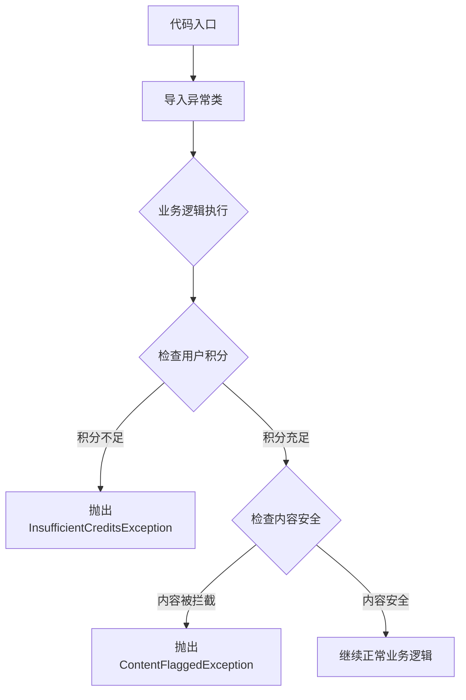

# `comic-translate\modules\utils\exceptions.py` 详细设计文档

该代码定义了两个自定义异常类：InsufficientCreditsException用于处理用户积分不足的情况，ContentFlaggedException用于处理内容被安全过滤器拦截的情况，并提供了上下文信息功能。

## 整体流程



## 类结构

```
Exception (Python内置基类)
├── InsufficientCreditsException
└── ContentFlaggedException
```

## 全局变量及字段


### `ContentFlaggedException.context`
    
A context string indicating the operation or type of content that was flagged.

类型：`str`
    
    

## 全局函数及方法


### `ContentFlaggedException.__init__`

这是ContentFlaggedException类的初始化方法，用于创建内容过滤异常实例。该方法继承自Exception基类，接收异常消息和操作上下文作为参数，并将上下文信息存储为实例属性。

参数：

- `message`：`str`，异常的具体描述信息，说明内容被过滤的原因
- `context`：`str`，默认值"Operation"，表示触发异常的操作上下文或模块名称

返回值：`None`，__init__方法不返回任何值

#### 流程图

```mermaid
flowchart TD
    A[开始 __init__] --> B[调用super().__init__message]
    B --> C[将context参数赋值给self.context属性]
    C --> D[结束]
```

#### 带注释源码

```python
def __init__(self, message, context="Operation"):
    """
    初始化ContentFlaggedException异常实例
    
    参数:
        message: 异常的具体描述信息，说明内容被过滤的原因
        context: 操作上下文，默认为"Operation"，用于标识触发异常的操作或模块
    """
    # 调用父类Exception的初始化方法，传入异常消息
    # 使异常对象能够存储和展示错误信息
    super().__init__(message)
    
    # 将context参数存储为实例属性
    # 用于后续异常处理时获取操作上下文信息
    self.context = context
```


## 关键组件


### InsufficientCreditsException

继承自 Exception 的自定义异常类，用于在用户积分不足时抛出。

### ContentFlaggedException

继承自 Exception 的自定义异常类，用于在内容被安全过滤器阻止时抛出，包含上下文信息。


## 问题及建议


### 已知问题

-   **缺少类级别文档字符串**：两个异常类均未包含 docstring，无法快速了解异常的使用场景和业务含义
-   **异常属性标准化不足**：`ContentFlaggedException` 有 `context` 属性，但 `InsufficientCreditsException` 缺少相应的错误上下文字段（如缺失的信用额度数值）
-   **错误码缺失**：未定义错误码（error_code）属性，不利于前端或下游系统进行精确的错误处理和国际化
-   **字符串表示方法未优化**：未重写 `__str__` 或 `__repr__` 方法，异常输出格式不够友好
-   **缺少日志记录机制**：异常类中未集成日志记录功能，难以追踪异常发生时的调用栈和上下文信息

### 优化建议

-   为两个异常类添加类级别的 docstring，说明具体的业务场景和触发条件
-   统一异常属性设计：为 `InsufficientCreditsException` 添加 `required_credits` 和 `current_credits` 属性，为 `ContentFlaggedException` 添加 `flagged_reason` 或 `filter_category` 等字段
-   引入错误码机制：定义错误码枚举类，为每个异常分配唯一的 error_code，便于错误追踪和国际化处理
-   增强字符串表示：重写 `__str__` 方法，输出格式化的错误信息，例如："Insufficient credits: 需要 {required}，当前仅 {current}"
-   考虑继承关系优化：定义基础业务异常类 `BusinessException`，两个具体异常继承自该基类，统一错误处理接口
-   添加上下文日志：在异常抛出时自动记录日志（可使用自定义 `__init__` 或装饰器实现），记录异常产生的调用堆栈和业务上下文
-   考虑异常序列化：若涉及跨服务通信，建议实现 `to_dict()` 方法，便于将异常信息序列化为 JSON 格式


## 其它


### 设计目标与约束

本代码的设计目标是定义两个业务层面的自定义异常类，用于在特定业务场景下提供清晰的错误信息。设计约束包括：InsufficientCreditsException为简单异常，仅传递异常消息；ContentFlaggedException需要支持上下文信息以提供更详细的错误上下文，便于调试和问题定位。

### 错误处理与异常设计

异常类的设计遵循Python异常处理最佳实践，继承自Python内置Exception类。InsufficientCreditsException采用最小化设计，适用于简单的积分不足场景；ContentFlaggedException通过context参数扩展异常表达能力，允许调用方指定操作上下文（如"上传"、"发布"、"评论"等），便于日志追踪和问题归类。

### 异常使用场景

InsufficientCreditsException应用于需要用户积分才能执行的业务操作场景，例如：资源下载、会员功能调用、API请求限制等。ContentFlaggedException应用于内容审核场景，例如：用户提交文本内容、头像上传、评论发布等需要经过安全过滤器检查的操作。

### 继承层次结构

两个异常类均直接继承自Python内置的Exception基类，形成独立的异常分支。这种设计允许调用方通过except Exception或分别捕获特定异常类型来实现分级处理，既可以统一处理所有业务异常，也可以针对特定异常类型进行差异化处理。

### 上下文信息设计（ContentFlaggedException）

ContentFlaggedException的context参数采用字符串类型，默认为"Operation"。该字段用于描述触发异常的具体操作类型，建议的取值包括但不限于：文本内容审核、图片上传、文件下载、用户评论等。调用方在抛出异常时应传入有意义的上下文信息，以便后续日志分析和问题追踪。

### 潜在优化空间

当前异常类缺少错误码（error code）机制，建议为每个异常类添加唯一的错误码属性，便于前端或API层进行精确的错误处理和国际化。此外，可考虑添加timestamp字段记录异常发生时间，以及添加可序列化的数据结构（如to_dict方法）以便日志系统和监控系统进行统一处理。

### 接口契约

调用方使用InsufficientCreditsException时只需传入错误消息字符串；使用ContentFlaggedException时需传入message参数，context参数可选。建议在项目范围内统一异常抛出规范，包括异常消息格式（建议包含操作名称、失败原因、用户可采取的行动建议）和日志记录级别（建议使用warning或error级别）。


    