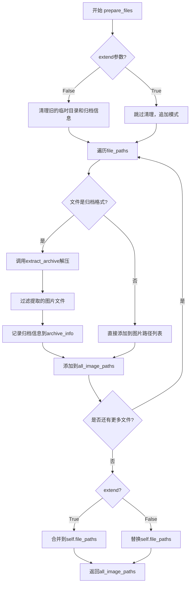
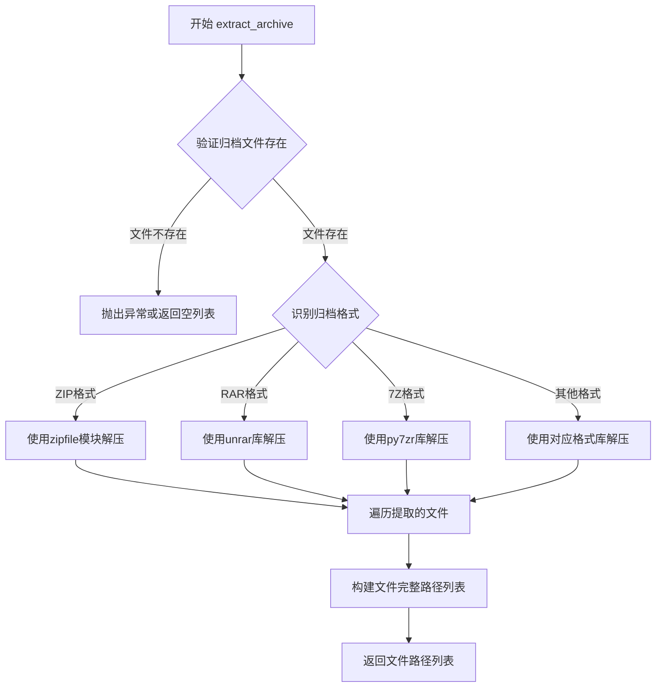
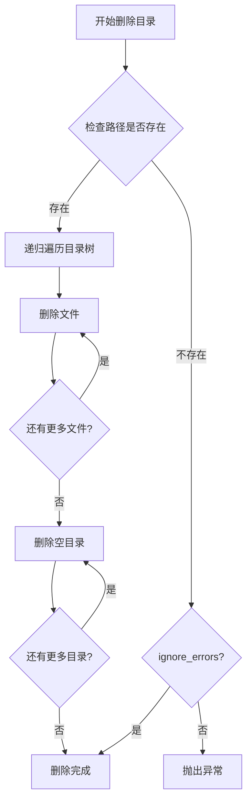
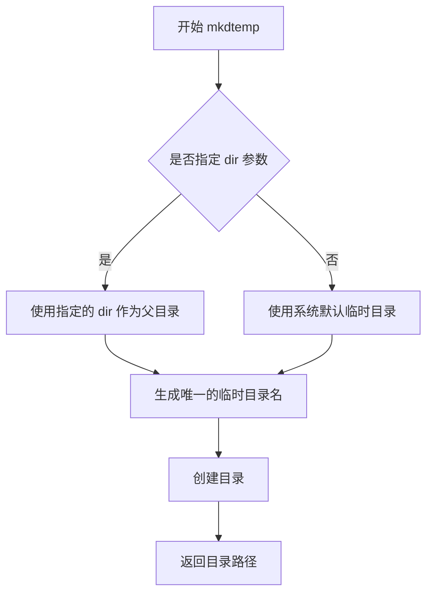
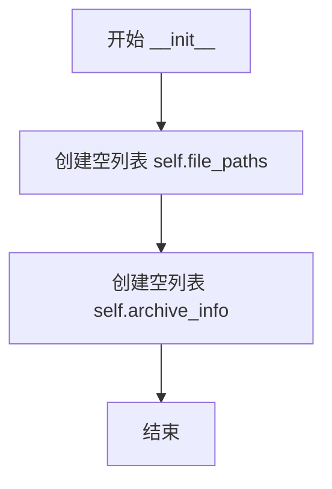
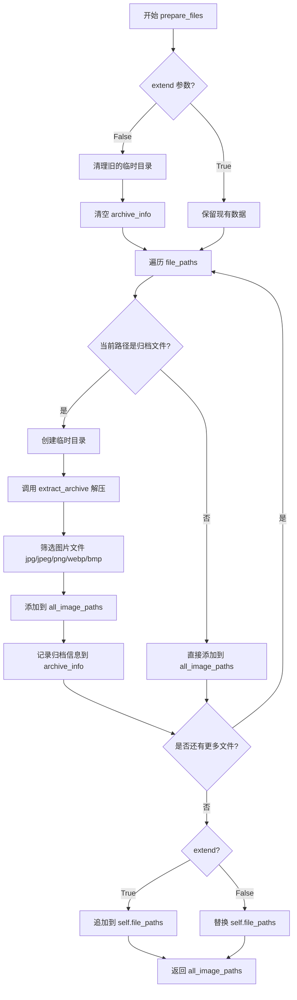

# `comic-translate\modules\utils\file_handler.py` 详细设计文档

FileHandler类负责处理文件路径列表，支持归档文件（如CBR、CBZ、PDF等）的自动解压，并从中提取图片文件（如JPG、PNG、WebP等）的路径。该类通过prepare_files方法实现文件准备工作，支持增量扩展和临时目录管理。

## 整体流程



## 类结构

```
FileHandler (文件处理类)
```

## 全局变量及字段


### `os`
    
Python标准库模块，提供操作系统相关功能

类型：`module`
    


### `shutil`
    
Python标准库模块，提供高级文件和目录操作功能

类型：`module`
    


### `tempfile`
    
Python标准库模块，用于创建临时文件和目录

类型：`module`
    


### `extract_archive`
    
从归档模块导入的函数，用于解压归档文件

类型：`function`
    


### `FileHandler.file_paths`
    
存储所有文件路径的列表

类型：`list`
    


### `FileHandler.archive_info`
    
存储归档文件信息的列表，每个元素包含archive_path、extracted_images和temp_dir

类型：`list`
    
    

## 全局函数及方法


### `extract_archive`

从归档文件（如 ZIP、RAR、7Z、CBR、CBZ 等格式）中提取所有文件到指定的目标目录，并返回提取后文件路径列表的外部函数。

参数：

-  `path`：`str`，归档文件的完整路径（包括文件名和扩展名），支持的格式包括 .cbr、.cbz、.cbt、.cb7、.zip、.rar、.7z、.tar、.pdf、.epub 等
-  `temp_dir`：`str`，目标临时目录的路径，用于存放提取出来的文件

返回值：`list[str]`，提取后的文件完整路径列表

#### 流程图



#### 带注释源码

```python
# 从 archives 模块导入的外部函数
# 用于解压各种格式的归档文件
# 注意：由于 extract_archive 是从外部模块导入，以下为调用示例源码

# 调用方式示例（在 FileHandler.prepare_files 方法中）：
archive_dir = os.path.dirname(path)                    # 获取归档文件所在目录
temp_dir = tempfile.mkdtemp(dir=archive_dir)           # 在归档目录创建临时目录

# 调用 extract_archive 函数进行解压缩
# 参数1: path - 归档文件的完整路径
# 参数2: temp_dir - 提取文件的目标目录
extracted_files = extract_archive(path, temp_dir)

# 返回值说明：
# extracted_files 类型为 list[str]
# 包含从归档文件中提取的所有文件的完整路径
# 例如：['/path/to/archive/temp/image1.jpg', '/path/to/archive/temp/image2.png', ...]

# 后续处理：过滤出图片文件
image_paths = [f for f in extracted_files if f.lower().endswith(('.jpg', '.jpeg', '.png', '.webp', '.bmp'))]
```


### `os.path.exists`

标准库函数，用于检查指定的路径（文件或目录）是否存在，返回布尔值。

参数：

- `path`：str / bytes / PathLike，需要检查的路径，可以是文件路径或目录路径

返回值：`bool`，如果路径存在返回 `True`，如果路径不存在返回 `False`

#### 流程图


#### 带注释源码

```python
# os.path.exists 是 Python 标准库 os.path 模块中的函数
# 由于其是 C 语言实现的核心模块函数，此处展示调用示例

# 在给定代码中的使用方式：
if os.path.exists(temp_dir):  # 检查 temp_dir 路径是否存在
    shutil.rmtree(temp_dir)   # 如果存在，删除该目录树
```

> **注**：`os.path.exists` 底层通过调用操作系统 API（如 `stat()` 系统调用）来检查路径是否存在。在 Python 源码中，它最终调用 `os.stat()` 并捕获 `FileNotFoundError` 异常，如果未抛出异常则返回 `True`。


### `shutil.rmtree`

这是 Python 标准库的函数，用于递归删除指定目录及其所有子目录和文件。

参数：

- `path`：`str`，要删除的目录路径
- `ignore_errors`：`bool`，可选，若设为 True，则忽略删除过程中的错误
- `onerror`：`Callable`，可选，自定义错误处理函数，接收三个参数：function、path 和 excinfo

返回值：`None`，该函数不返回任何值

#### 流程图



#### 带注释源码

```python
# shutil.rmtree 函数原型（标准库）
# 删除整个目录树结构
# 
# 参数说明：
#   path: 要删除的目录路径（字符串）
#   ignore_errors: 如果为 True，则忽略删除错误，不抛出异常
#   onerror: 自定义错误处理函数，接收 (function, path, excinfo) 三个参数
#
# 返回值：None
#
# 使用示例（来自提供的代码）：
shutil.rmtree(temp_dir)  # 删除临时目录及其所有内容
```

#### 在代码中的实际使用

```python
# 上下文：在 prepare_files 方法中
# 功能：清理旧的临时提取目录
for archive in self.archive_info:
    temp_dir = archive['temp_dir']
    if os.path.exists(temp_dir):  # 检查目录是否存在
        shutil.rmtree(temp_dir)   # 递归删除整个目录树
```


### `tempfile.mkdtemp`

创建临时目录并返回其绝对路径

参数：

- `suffix`：str，可选，临时目录名称的后缀
- `prefix`：str，可选，临时目录名称的前缀
- `dir`：str，可选，临时目录的父目录，默认为系统临时目录

返回值：str创建的临时目录的绝对路径

#### 流程图



#### 带注释源码

```python
import tempfile
import os

# 示例：在默认临时目录创建临时目录
temp_dir = tempfile.mkdtemp()
# 返回类似 '/tmp/xyz123' 的路径

# 示例：在指定目录创建临时目录，带前缀和后缀
archive_dir = '/path/to/archive'
temp_dir = tempfile.mkdtemp(
    prefix='extract_',      # 目录名前缀
    suffix='_work',         # 目录名后缀
    dir=archive_dir         # 父目录
)
# 返回类似 '/path/to/archive/extract_abc123_work' 的路径

# 创建后即可使用
print(f"临时目录已创建: {temp_dir}")
# 使用完毕后需手动删除
import shutil
shutil.rmtree(temp_dir)
```

---

### 上下文：`FileHandler.prepare_files` 方法中的使用

在提供的代码中，`tempfile.mkdtemp` 的使用方式如下：

```python
# 从代码中提取的相关片段
archive_dir = os.path.dirname(path)  # 获取归档文件所在目录
temp_dir = tempfile.mkdtemp(dir=archive_dir)  # 在该目录创建临时目录
```

**设计意图**：

- 将临时目录创建在压缩包同一目录下，便于管理和清理
- 临时目录用于存放解压后的图像文件
- 解压后的图像路径被收集到 `all_image_paths` 列表中

---

### 关键组件信息

| 组件名称 | 描述 |
|---------|------|
| `tempfile.mkdtemp` | Python 标准库函数，创建安全的临时目录 |
| `shutil.rmtree` | 用于递归删除目录及其内容（配套清理函数） |
| `extract_archive` | 自定义归档解压函数（依赖外部模块） |

---

### 潜在的技术债务或优化空间

1. **临时目录清理时机**：`prepare_files` 方法仅在 `extend=False` 时清理旧临时目录，若程序异常终止可能导致临时目录残留
2. **无异常处理**：`tempfile.mkdtemp` 可能因权限问题或磁盘空间不足抛出异常，当前代码未做捕获
3. **路径安全性**：未验证 `archive_dir` 是否为有效路径，若 `path` 为空字符串可能导致异常
4. **资源管理建议**：建议使用上下文管理器或 `try-finally` 确保临时目录在使用后被正确清理

---

### 其它项目

#### 设计目标与约束

- **目标**：在归档文件所在目录创建临时工作空间用于解压，避免将大量临时文件散布到系统临时目录
- **约束**：依赖文件系统写权限，跨平台兼容性（Windows/Linux/macOS）

#### 错误处理与异常设计

- `OSError`：磁盘空间不足或权限不足时抛出
- `FileNotFoundError`：当 `dir` 参数指定的父目录不存在时抛出

#### 外部依赖与接口契约

- **输入**：可选的 `dir` 参数需为有效目录路径
- **输出**：返回绝对路径字符串，调用方负责后续管理和清理
- **配套使用**：`shutil.rmtree(temp_dir)` 用于清理


### `FileHandler.__init__`

构造函数，初始化`FileHandler`类的实例，创建两个空列表用于存储文件路径和归档信息。

参数：
- 无显式参数（`self` 为实例本身）

返回值：`None`，无返回值（构造函数）

#### 流程图



#### 带注释源码

```python
def __init__(self):
    """
    构造函数，初始化文件处理器
    
    初始化用于存储文件路径和归档信息的空列表
    """
    self.file_paths = []      # 用于存储所有图像文件路径的列表
    self.archive_info = []    # 用于存储归档提取信息的列表，每个元素包含归档路径、提取的图像列表和临时目录
```


### `FileHandler.prepare_files`

该方法接收文件路径列表，识别归档文件（压缩包、电子书格式）并进行解压提取图片，同时保留普通图片文件路径，最终返回处理后的完整图片路径列表，支持增量扩展或覆盖模式。

#### 参数

- `file_paths`：`list[str]`，输入的待处理文件路径列表
- `extend`：`bool`，可选参数，默认为False；True表示将新处理的文件追加到现有列表，False表示替换现有列表

#### 返回值

`list[str]`，返回处理后的所有图片文件路径列表（包括从归档中提取的图片和直接添加的原有图片文件）

#### 流程图



#### 带注释源码

```python
def prepare_files(self, file_paths: list[str], extend: bool = False):
    """
    处理文件路径列表，支持归档解压和图片提取
    
    参数:
        file_paths: 待处理的文件路径列表，包含图片文件和归档文件
        extend: 是否扩展现有文件列表，默认为False（替换模式）
    
    返回:
        处理后的所有图片文件路径列表
    """
    # 初始化结果列表，用于存储所有图片路径
    all_image_paths = []
    
    # 如果不是扩展模式，则清理之前创建的临时目录
    if not extend:
        # 遍历已保存的归档信息，清理每个临时目录
        for archive in self.archive_info:
            temp_dir = archive['temp_dir']
            # 检查临时目录是否存在，存在则递归删除
            if os.path.exists(temp_dir): 
                shutil.rmtree(temp_dir)  
        # 清空归档信息列表
        self.archive_info = []
    
    # 遍历输入的每个文件路径
    for path in file_paths:
        # 检查文件扩展名是否为归档格式（漫画、电子书、压缩包）
        if path.lower().endswith(('.cbr', '.cbz', '.cbt', '.cb7', 
                                  '.zip', '.rar', '.7z', '.tar',
                                  '.pdf', '.epub')):
            # 打印解压日志信息
            print('Extracting archive:', path)
            # 获取归档文件所在目录
            archive_dir = os.path.dirname(path)
            # 在归档目录创建临时目录用于存放解压文件
            temp_dir = tempfile.mkdtemp(dir=archive_dir)
            
            # 调用外部函数 extract_archive 解压归档文件
            extracted_files = extract_archive(path, temp_dir)
            # 从解压文件中筛选图片格式文件（不区分大小写）
            image_paths = [f for f in extracted_files if f.lower().endswith(('.jpg', '.jpeg', '.png', '.webp', '.bmp'))]
            
            # 将提取的图片路径添加到结果列表
            all_image_paths.extend(image_paths)               
            # 保存归档处理信息，供后续清理使用
            self.archive_info.append({
                'archive_path': path,
                'extracted_images': image_paths,
                'temp_dir': temp_dir
            })
        else:
            # 非归档文件，直接作为图片路径添加
            all_image_paths.append(path)
    
    # 根据extend参数决定如何更新file_paths属性
    self.file_paths = self.file_paths + all_image_paths if extend else all_image_paths
    # 返回处理后的所有图片路径
    return all_image_paths
```

## 关键组件


### 文件处理与存档解压

FileHandler 类负责处理图像文件和多种存档格式的解压，支持 CBR、CBZ、CBT、CB7、ZIP、RAR、7Z、TAR、PDF、EPUB 等格式的提取，并将解压后的图像文件路径进行收集和管理。

### 临时目录管理

使用 tempfile.mkdtemp 创建临时目录存储解压后的文件，并通过 shutil.rmtree 在替换模式（extend=False）下清理旧的临时目录，避免磁盘空间泄漏。

### 图像文件过滤

在解压存档后，通过文件扩展名过滤只保留常见的图像格式（jpg、jpeg、png、webp、bmp），确保只处理图像文件。

### 存档信息追踪

维护 archive_info 列表记录每个存档的原始路径、提取的图像路径和临时目录，支持文件列表的扩展或替换操作。


## 问题及建议


### 已知问题

- **错误处理缺失**：代码没有对文件操作、解压缩过程进行异常捕获和处理，可能导致程序崩溃
- **资源泄漏风险**：`tempfile.mkdtemp` 创建的临时目录没有明确的清理机制（仅在下次调用时删除），且 `shutil.rmtree` 可能失败
- **逻辑错误**：`self.file_paths = self.file_paths + all_image_paths if extend else all_image_paths` 使用 `+` 而非 `extend()`，在 extend 模式下会产生意外结果
- **参数校验缺失**：未对 `file_paths` 参数进行空值、类型、路径有效性校验
- **硬编码扩展名**：图片和归档格式列表硬编码在方法中，扩展性差，难以维护
- **使用 print 调试**：生产代码中使用 `print` 而非日志框架，不利于生产环境运维
- **类型注解不完整**：仅部分参数有类型注解，缺少返回值类型注解
- **缺少文档字符串**：类和方法均无 docstring，无法生成文档
- **外部依赖无接口契约**：`extract_archive` 函数调用无任何错误处理假设
- **状态管理不清晰**：类内部状态（`file_paths`、`archive_info`）的修改逻辑复杂，难以追踪

### 优化建议

- 添加 try-except 块处理文件操作、解压缩异常，提供有意义的错误信息
- 实现上下文管理器 `__enter__`/`__exit__` 或添加 `cleanup()` 方法确保资源释放
- 修正 extend 模式逻辑，使用 `self.file_paths.extend(all_image_paths)` 或 `self.file_paths += all_image_paths`
- 添加参数校验：`isinstance(file_paths, list)`、路径存在性检查、空列表处理
- 将扩展名列表提取为类常量或配置文件，使用枚举或常量类管理
- 替换 `print` 为 `logging` 模块，支持日志级别配置
- 补充完整的类型注解和返回值类型
- 为类和方法添加 docstring，说明功能、参数、返回值、异常
- 定义 `extract_archive` 的接口契约，文档化其参数和返回值
- 考虑线程安全性，若多线程使用需加锁保护状态修改


## 其它


### 设计目标与约束

本模块旨在统一管理多种格式的归档文件（cbr/cbz/cbt/cb7/zip/rar/7z/tar/pdf/epub）和图像文件（jpg/jpeg/png/webp/bmp），提供透明的文件准备机制，使上层业务逻辑无需关心文件类型差异。约束条件包括：仅支持Windows/Linux/macOS三平台、归档文件总大小受临时磁盘空间限制、归档提取后不自动清理需手动或依赖程序退出时清理。

### 错误处理与异常设计

代码中未实现显式异常处理，存在以下风险点：os.path.exists()可能抛出入参为None或非字符串异常；shutil.rmtree()删除目录失败时未捕获异常；extract_archive()调用可能失败但未做try-except包装；tempfile.mkdtemp()创建临时目录失败时直接向上传播。建议增加异常捕获层，为文件访问失败、归档损坏、磁盘空间不足等场景定义自定义异常类（如ArchiveExtractionError、FileAccessError），并向上层传递有意义的错误信息。

### 数据流与状态机

prepare_files()方法的状态转换如下：初始状态（archive_info为空）→遍历输入文件→判定文件类型→若为归档文件则进入提取流程（创建临时目录→extract_archive()→过滤图片→更新archive_info）→若为普通文件则直接追加→最终返回合并后的image_paths列表。状态变更核心依赖self.archive_info列表和self.file_paths列表，extend参数控制是否增量追加或全量替换。

### 外部依赖与接口契约

本模块依赖两个外部组件：标准库os/shutil/tempfile提供文件系统操作能力；同包模块archives.extract_archive()负责实际归档解压缩工作。extract_archive()的接口契约为：接收归档文件路径和目标目录， 返回包含所有提取文件绝对路径的列表。调用方需保证传入的有效文件路径且对目标目录有写权限。archives模块若不可用将导致整体功能失效，应在模块加载时进行可用性检查或提供优雅降级策略。

### 性能考虑

当前实现存在性能瓶颈：每次调用prepare_files()都会重新遍历所有归档文件进行提取操作，即使已有缓存；未对大体积归档文件进行异步处理或进度回调；文件类型判定使用endswith()逐个匹配，频繁调用效率偏低。建议优化方向包括：引入缓存机制记录已提取的归档文件状态，仅在文件修改时重新提取；支持增量提取和进度回调；将文件扩展名集合改为frozenset提升匹配性能。

### 资源管理与生命周期

temp_dir创建后由caller负责清理或程序退出时由系统回收，当前实现仅在extend=False时清理旧的temp_dir，存在资源泄漏风险。建议实现上下文管理器支持（__enter__/__exit__）或提供显式的cleanup()方法，在不再需要处理后的文件时主动释放临时目录资源。临时目录默认创建在与归档文件相同的目录下，可能导致归档所在磁盘空间不足，应考虑支持自定义临时目录位置。

### 并发与线程安全性

本类非线程安全：self.archive_info和self.file_paths作为共享状态，在多线程并发调用prepare_files()时可能导致数据竞争和状态不一致。若需要在多线程环境使用，建议增加线程锁保护或提供无状态的静态方法变体，由调用方负责状态管理。

### 配置与可扩展性

当前支持的归档格式和图片格式硬编码于方法内部，扩展性较差。建议将格式配置提取为类属性或构造函数参数，支持运行时注入自定义文件类型识别逻辑。extract_archive()方法的具体实现被隐藏，假设返回文件路径列表，若实际返回格式不同（如Generator或包含元数据）会导致兼容性问题，应明确定义接口规范。

    