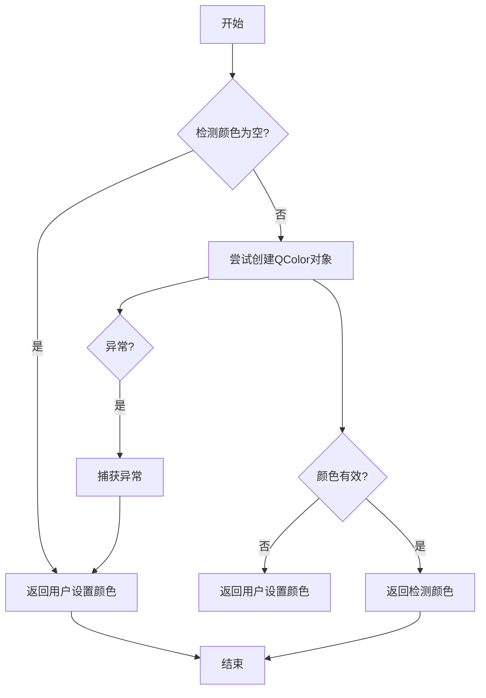

# `comic-translate\modules\utils\image_utils.py` 详细设计文档

该代码提供图像处理工具函数，主要用于文本修复（inpainting）场景的掩码生成。核心功能包括颜色格式转换、图像编码、智能文本颜色选择以及基于文本块的掩码生成算法，支持文本气泡检测、形态学闭运算和多边形填充。

## 整体流程

```mermaid
graph TD
    A[开始 generate_mask] --> B[初始化全零掩码]
    B --> C{LONG_EDGE = 2048}
    C --> D[遍历 blk_list 中的每个 TextBlock]
    D --> E{Block 有文本或翻译?}
    E -- 否 --> D
    E -- 是 --> F[调用 get_inpaint_bboxes 获取 bbox]
    F --> G{bboxes 有效?}
    G -- 否 --> D
    G -- 是 --> H[计算 ROI 区域]
    H --> I[计算下采样因子 ds]
    I --> J[创建小尺寸掩码 small]
    J --> K[在 small 上绘制 bboxes]
    K --> L[形态学闭运算 MORPH_CLOSE]
    L --> M[提取轮廓 contours]
    M --> N{有轮廓?}
    N -- 否 --> D
    N -- 是 --> O[合并轮廓转换为多边形]
    O --> P[创建 block_mask 并填充多边形]
    P --> Q[确定膨胀内核大小 kernel_size]
    Q --> R{文本类型为 text_bubble?}
    R -- 是 --> S[过滤气泡内的多边形并调整 kernel_size]
    R -- 否 --> T[应用膨胀 dilate]
    S --> T
    T --> U[合并到全局 mask]
    U --> V{还有更多 block?]
    V -- 是 --> D
    V -- 否 --> W[返回最终 mask]
```

## 类结构

```
无类定义 (纯函数模块)
└── 全局函数集合
    ├── rgba2hex
    ├── encode_image_array
    ├── get_smart_text_color
    └── generate_mask
```

## 全局变量及字段


### `LONG_EDGE`
    
用于限制掩码尺寸的长边阈值，当ROI宽高超过此值时进行下采样计算

类型：`int`
    


### `KSIZE`
    
形态学闭运算的核大小，用于桥接掩码中相邻区域间的间隙

类型：`int`
    


### `pad_offset`
    
将原始坐标映射到小尺寸掩码时的填充偏移量，保证边界框绘制在有效区域内

类型：`int`
    


    

## 全局函数及方法


### `rgba2hex`

这是一个简单的全局工具函数，用于将包含红、绿、蓝、透明度四个通道值的列表（或元组）转换为一个带有 `#` 前缀的十六进制颜色字符串。

参数：

-  `rgba_list`：`list` 或 `tuple`，包含四个数字（通常为 0-255）的序列，代表 R（红）、G（绿）、B（蓝）、A（透明度）通道。

返回值：`str`，返回格式为 `#RRGGBBAA` 的字符串。

#### 流程图

```mermaid
graph TD
    A[开始: 输入 rgba_list] --> B{解包并转换类型}
    B --> C[提取 r, g, b, a]
    C --> D[使用 int() 将每个分量转为整数]
    D --> E[格式化字符串]
    E --> F[拼接为 #RRGGBBAA]
    F --> G[返回结果]
```

#### 带注释源码

```python
def rgba2hex(rgba_list):
    """
    将 RGBA 颜色值列表转换为十六进制字符串。
    
    参数:
        rgba_list: 包含 [r, g, b, a] 四个数值的列表或元组。
    """
    # 1. 遍历输入列表，将每个元素转换为整数类型（如果是浮点数则取整）
    # 2. 如果输入列表元素不足 4 个，这里会抛出 ValueError
    r, g, b, a = [int(num) for num in rgba_list]
    
    # 3. 使用 format 方法将每个整数转换为 2 位的十六进制字符串（字母小写）
    # 4. 拼接并返回结果，格式例如: #ff000080
    return "#{:02x}{:02x}{:02x}{:02x}".format(r, g, b, a)
```


### `encode_image_array`

该函数接收一个 NumPy 数组形式的图像数据，调用 `imkit` 库将其编码为 PNG 格式的字节流，然后使用 Base64 编码并转换为 UTF-8 字符串返回，常用于将图像数据嵌入到 JSON 响应或 Web 前端中。

参数：

- `img_array`：`np.ndarray`，待编码的图像数组

返回值：`str`，Base64 编码后的 PNG 图像数据字符串

#### 流程图

```mermaid
flowchart TD
    A[开始] --> B[接收 img_array 参数]
    B --> C[调用 imk.encode_image 将图像编码为 PNG 字节流]
    C --> D[调用 base64.b64encode 对字节流进行 Base64 编码]
    D --> E[调用 decode('utf-8') 转换为字符串]
    E --> F[返回 Base64 字符串]
    F --> G[结束]
```

#### 带注释源码

```python
def encode_image_array(img_array: np.ndarray):
    """
    将 NumPy 数组格式的图像编码为 Base64 字符串。
    
    参数:
        img_array: np.ndarray - 待编码的图像数组
        
    返回:
        str - Base64 编码后的 PNG 图像数据
    """
    # 使用 imkit 库将图像数组编码为 PNG 格式的字节流
    img_bytes = imk.encode_image(img_array, ".png")
    
    # 对字节流进行 Base64 编码，然后解码为 UTF-8 字符串返回
    return base64.b64encode(img_bytes).decode('utf-8')
```


### `get_smart_text_color`

该函数根据从图像中检测到的颜色和用户设置的偏好颜色，智能判断最佳文本颜色，优先使用实际像素分析得到的检测颜色，仅在检测失败时回退到用户设置。

参数：

- `detected_rgb`：`tuple`，从图像中检测到的RGB颜色值元组
- `setting_color`：`QColor`，用户偏好的设置颜色

返回值：`QColor`，最终采用的文本颜色

#### 流程图



#### 带注释源码

```python
def get_smart_text_color(detected_rgb: tuple, setting_color: QColor) -> QColor:
    """
    Determines the best text color to use based on the detected color from the image
    and the user's preferred setting color.

    Policy:
      - If detection succeeded, use the detected colour (it came from
        actual pixel analysis and is most likely correct).
      - If detection is empty / invalid, fall back to the user setting.
    """
    # 如果检测颜色为空或为空元组，直接返回用户设置的颜色
    if not detected_rgb:
        return setting_color

    try:
        # 尝试将检测到的RGB元组转换为QColor对象
        detected_color = QColor(*detected_rgb)
        
        # 检查转换后的颜色是否有效（RGB值范围合法）
        if not detected_color.isValid():
            return setting_color

        # 检测成功，返回从图像中分析得到的实际颜色
        return detected_color

    except Exception:
        # 任何异常情况都回退到用户设置颜色
        pass

    # 默认返回用户设置颜色（异常或无效情况）
    return setting_color
```


### `generate_mask`

该函数通过获取每个文本块的修复边界框，在下采样掩码上绘制并执行形态学闭运算以连接相邻区域，然后将多边形填充回原始坐标，创建膨胀的块掩码并最终合并为全局掩码数组。

参数：

- `img`：`np.ndarray`，输入的原始图像数组，用于获取图像尺寸
- `blk_list`：`list[TextBlock]`，文本块列表，每个块包含文本内容和位置信息
- `default_padding`：`int`，默认的膨胀内核大小，默认为5

返回值：`np.ndarray`，生成的二值掩码数组，值为0或255

#### 流程图

```mermaid
flowchart TD
    A[开始] --> B[初始化h, w, mask全零]
    B --> C[设置LONG_EDGE=2048]
    C --> D{遍历blk_list}
    D --> E{检查blk.text和blk.translation}
    E -->|两者都为空| D
    E -->|有内容| F[调用get_inpaint_bboxes获取边界框]
    F --> G{检查bboxes有效性}
    G -->|无效| D
    G -->|有效| H[计算ROI: min_x, max_x, min_y, max_y]
    H --> I[计算下采样因子ds]
    I --> J[创建小掩码small]
    J --> K[在小掩码上绘制带填充偏移的边界框]
    K --> L[执行闭运算morphology_ex]
    L --> M[提取所有轮廓find_contours]
    M --> N{检查contours}
    N -->|无轮廓| D
    N --> O{遍历每个contour]
    O --> P{检查点数>=3}
    P -->|否| O
    P -->|是| Q[转换坐标回原图尺度]
    Q --> O
    O --> R[创建block_mask全零]
    R --> S[填充所有多边形fill_poly]
    S --> T[确定kernel_size]
    T --> U{kernel_size调整逻辑}
    U --> V[执行膨胀dilate]
    V --> W[按位或合并到全局mask]
    W --> D
    D --> X[返回mask]
```

#### 带注释源码

```python
def generate_mask(img: np.ndarray, blk_list: list[TextBlock], default_padding: int = 5) -> np.ndarray:
    """
    Generate a mask by fitting a merged shape around each block's inpaint bboxes,
    then dilating that shape according to padding logic.
    """
    # 1. 获取图像尺寸并初始化全局掩码
    h, w, _ = img.shape
    mask = np.zeros((h, w), dtype=np.uint8)
    LONG_EDGE = 2048  # 长边阈值，用于计算下采样因子

    # 2. 遍历每个文本块
    for blk in blk_list:
        # 跳过既没有文本也没有翻译的块
        if not blk.text and not blk.translation:
            continue
        
        # 获取该块的修复边界框
        bboxes = get_inpaint_bboxes(blk.xyxy, img)
        blk.inpaint_bboxes = bboxes
        if bboxes is None or len(bboxes) == 0:
            continue

        # 3. 计算紧密的块级ROI（感兴趣区域）
        # 收集所有边界框的x和y坐标
        xs = [x for x1, _, x2, _ in bboxes for x in (x1, x2)]
        ys = [y for _, y1, _, y2 in bboxes for y in (y1, y2)]
        min_x, max_x = int(min(xs)), int(max(xs))
        min_y, max_y = int(min(ys)), int(max(ys))
        roi_w, roi_h = max_x - min_x + 1, max_y - min_y + 1

        # 4. 计算下采样因子，限制掩码尺寸
        ds = max(1.0, max(roi_w, roi_h) / LONG_EDGE)
        mw, mh = int(roi_w / ds) + 2, int(roi_h / ds) + 2
        pad_offset = 1  # 填充偏移量

        # 5. 在小掩码上绘制边界框（带偏移）
        small = np.zeros((mh, mw), dtype=np.uint8)
        for x1, y1, x2, y2 in bboxes:
            # 将坐标转换到小掩码空间
            x1i = int((x1 - min_x) / ds) + pad_offset
            y1i = int((y1 - min_y) / ds) + pad_offset
            x2i = int((x2 - min_x) / ds) + pad_offset
            y2i = int((y2 - min_y) / ds) + pad_offset
            # 绘制填充矩形
            small = imk.rectangle(small, (x1i, y1i), (x2i, y2i), 255, -1)

        # 6. 执行闭运算以连接相邻区域
        KSIZE = 15
        kernel = imk.get_structuring_element(imk.MORPH_RECT, (KSIZE, KSIZE))
        closed = imk.morphology_ex(small, imk.MORPH_CLOSE, kernel)

        # 7. 提取所有轮廓
        contours, _ = imk.find_contours(closed)
        if not contours:
            continue

        # 8. 合并轮廓：收集有效多边形并转换到完整图像坐标
        polys = []
        for cnt in contours:
            pts = cnt.squeeze(1)
            if pts.ndim != 2 or pts.shape[0] < 3:
                continue
            # 转换回原始图像坐标
            pts_f = (pts.astype(np.float32) - pad_offset) * ds
            pts_f[:, 0] += min_x
            pts_f[:, 1] += min_y
            polys.append(pts_f.astype(np.int32))
        if not polys:
            continue

        # 9. 创建块掩码并填充所有多边形
        block_mask = np.zeros((h, w), dtype=np.uint8)
        block_mask = imk.fill_poly(block_mask, polys, 255)

        # 10. 确定膨胀内核大小
        kernel_size = default_padding
        # 非日韩语言使用较小的内核
        src_lang = getattr(blk, 'source_lang', None)
        if src_lang and src_lang not in ['ja', 'ko']:
            kernel_size = 3
        
        # 针对文本气泡的特殊处理：根据气泡内轮廓距离调整内核大小
        if getattr(blk, 'text_class', None) == 'text_bubble' and getattr(blk, 'bubble_xyxy', None) is not None:
            bx1, by1, bx2, by2 = blk.bubble_xyxy
            # 过滤完全在气泡边界内的多边形
            valid = [p for p in polys 
                     if (p[:,0] >= bx1).all() and (p[:,0] <= bx2).all() 
                     and (p[:,1] >= by1).all() and (p[:,1] <= by2).all()]
            if valid:
                # 计算每个多边形到气泡边缘的距离
                dists = []
                for p in valid:
                    left   = p[:,0].min() - bx1
                    right  = bx2 - p[:,0].max()
                    top    = p[:,1].min() - by1
                    bottom = by2 - p[:,1].max()
                    dists.extend([left, right, top, bottom])
                min_dist = min(dists)
                if kernel_size >= min_dist:
                    kernel_size = max(1, int(min_dist * 0.8))

        # 11. 膨胀块掩码
        dil_kernel = np.ones((kernel_size, kernel_size), np.uint8)
        dilated = imk.dilate(block_mask, dil_kernel, iterations=4)

        # 12. 与全局掩码合并
        mask = np.bitwise_or(mask, dilated)

    return mask
```

## 关键组件


### 颜色转换模块 (rgba2hex)

将RGBA颜色列表转换为十六进制颜色字符串的辅助函数

### 图像编码模块 (encode_image_array)

将NumPy图像数组编码为Base64字符串的函数，用于图像传输或存储

### 智能文本颜色选择器 (get_smart_text_color)

根据检测到的图像颜色和用户设置颜色智能决定最佳文本颜色的函数，包含检测成功时优先使用检测颜色、失败时回退到用户设置的策略逻辑

### 掩码生成引擎 (generate_mask)

核心功能模块，通过以下步骤生成图像掩码：1)获取每个文本块的修复边界框 2)计算紧凑ROI区域 3)降采样以限制掩码尺寸 4)在小掩码上绘制带填充的边界框 5)形态学闭操作桥接间隙 6)提取并合并轮廓 7)创建块掩码并填充多边形 8)根据语言和文本气泡类型调整膨胀核大小 9)膨胀块掩码 10)与全局掩码合并

### 边界框计算组件 (get_inpaint_bboxes)

从TextBlock的坐标和图像中获取需要修复的区域边界框的外部依赖函数

### 文本块数据结构 (TextBlock)

包含文本内容、翻译、源语言、文本类别、气泡坐标等属性的数据结构，用于描述图像中的文本区域


## 问题及建议


### 已知问题

- **异常捕获过于宽泛且静默失败**：在`get_smart_text_color`函数中使用了空的`except Exception: pass`，会隐藏所有类型的错误，难以调试和追踪问题根因
- **输入验证不足**：`rgba2hex`函数未验证输入列表长度是否为4，当输入不合法时会产生误导性的错误；`get_smart_text_color`中`detected_rgb`的类型检查也不充分
- **魔法数字和硬编码值**：代码中存在多个硬编码的数值如`LONG_EDGE = 2048`、`KSIZE = 15`、`pad_offset = 1`、`iterations=4`等，缺乏说明且难以调整
- **循环内重复计算性能开销**：在`generate_mask`的循环内每次都调用`imk.get_structuring_element`创建相同的kernel，以及重复创建`dil_kernel`，这些可在循环外预计算
- **变量命名可读性差**：大量使用缩写变量名如`ds`、`mw`、`mh`、`roi_w`、`roi_h`等，影响代码可维护性
- **条件判断重复**：在`generate_mask`中先检查`blk.text and not blk.translation`跳过处理，后续又检查`bboxes is None or len(bboxes) == 0`，两处逻辑有一定重叠
- **text_bubble处理逻辑复杂且脆弱**：该部分包含多层嵌套的条件判断和距离计算，代码路径复杂且难以理解，边界情况处理可能不完善

### 优化建议

- 将空的异常捕获改为具体异常类型处理，或至少记录日志以保留错误信息用于调试
- 为所有函数添加输入参数验证，使用明确的类型检查和异常抛出
- 将魔法数字提取为模块级常量或配置参数，并添加注释说明其含义和取值依据
- 将循环不变的部分（如kernel创建）提取到循环外，避免重复计算
- 使用更清晰的变量命名，适当增加代码注释解释关键算法步骤
- 简化text_bubble的处理逻辑，考虑拆分为独立函数以提高可读性和可测试性
- 考虑将`get_inpaint_bboxes`的结果校验提前，避免无效数据进入后续处理流程


## 其它


### 设计目标与约束

本模块的设计目标是提供一个高效的图像掩码生成工具，用于文本块（TextBlock）的检测和掩码创建。主要约束包括：
- 依赖imkit库进行图像处理操作
- 处理图像尺寸限制：长边不超过2048像素（下采样后）
- 掩码生成需支持多种语言（日语、韩语及其他语言有不同处理策略）
- 需要支持文本气泡（text_bubble）的特殊处理逻辑

### 错误处理与异常设计

本模块的错误处理策略如下：
- **rgba2hex**: 无显式异常处理，假设输入为有效的RGBA列表
- **encode_image_array**: 依赖imk.encode_image的内部错误处理
- **get_smart_text_color**: 捕获所有异常并返回用户设置的颜色作为fallback
- **generate_mask**: 关键异常点包括bboxes为None或空数组、contours为空、polys为空等情况，均通过continue跳过处理

### 数据流与状态机

数据流如下：
1. 输入：原始图像(img) + 文本块列表(blk_list)
2. 对每个TextBlock遍历：
   - 获取inpaint_bboxes（由get_inpaint_bboxes生成）
   - 计算ROI区域并下采样
   - 在小mask上绘制矩形
   - 执行形态学闭操作
   - 提取轮廓并转换为多边形
   - 填充多边形到block_mask
   - 根据语言和文本类型调整膨胀核大小
   - 执行膨胀操作
   - 合并到全局mask
3. 输出：完整的掩码数组

### 外部依赖与接口契约

- **numpy**: 数组处理和数值计算
- **base64**: 图像字节编码
- **imkit (imk)**: 图像处理核心库，提供rectangle、morphology_ex、find_contours、fill_poly、dilate等操作
- **PySide6.QtGui.QColor**: 颜色对象处理
- **modules.utils.textblock.TextBlock**: 文本块数据结构
- **modules.detection.utils.content.get_inpaint_bboxes**: 获取文本区域边界框

### 性能考虑与优化策略

- **下采样策略**: 当ROI区域超过LONG_EDGE(2048)时自动下采样，减少计算量
- **形态学闭操作**: 使用15x15矩形核 bridges gaps between contours
- **迭代膨胀**: 固定4次迭代确保充分覆盖
- **多边形过滤**: text_bubble场景下只保留完全在气泡内的多边形，减少无效计算

### 配置参数说明

- **default_padding**: 默认膨胀核大小，默认为5像素
- **LONG_EDGE**: 下采样阈值，固定为2048
- **KSIZE**: 形态学闭操作核大小，固定为15
- **pad_offset**: mask边缘偏移，固定为1

### 使用示例

```python
# 图像掩码生成
img = cv2.imread("input.png")
blk_list = [TextBlock(xyxy=[100,100,200,200], text="Hello")]
mask = generate_mask(img, blk_list, default_padding=10)

# 颜色获取
color = get_smart_text_color((255, 0, 0, 255), QColor("white"))

# 图像编码
encoded = encode_image_array(img_array)
```

### 版本信息

当前版本：v1.0.0
最后更新：2024年
主要功能：图像掩码生成、文本颜色智能识别、图像Base64编码


    