# `comic-translate\modules\utils\inpainting.py` 详细设计文档

该模块是lama-cleaner项目的核心辅助工具，提供模型下载缓存管理、图像加载转换、图像预处理（归一化、缩放、填充）以及图像遮罩处理（边界框提取、轮廓提取）等功能，支持JIT和普通PyTorch模型的加载与验证。

## 整体流程

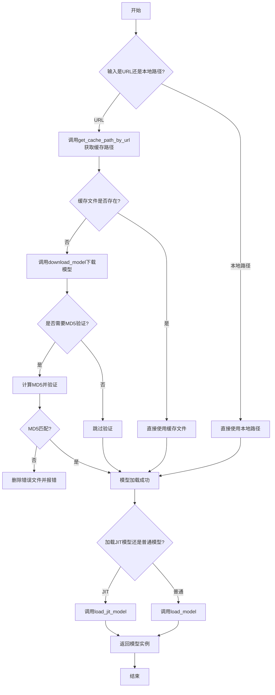

## 类结构

```
helper.py (工具模块，无类)
├── 全局函数
│   ├── md5sum - MD5计算
│   ├── get_cache_path_by_url - URL转缓存路径
 │   ├── download_model - 模型下载
│   ├── ceil_modulo - 向上取整
│   ├── handle_error - 错误处理
│   ├── load_jit_model - JIT模型加载
│   ├── load_model - 普通模型加载
│   ├── numpy_to_bytes - 数组转字节
│   ├── pil_to_bytes - PIL转字节
│   ├── load_img - 图像加载
│   ├── norm_img - 图像归一化
│   ├── resize_max_size - 图像缩放
│   ├── pad_img_to_modulo - 图像填充
│   ├── boxes_from_mask - 遮罩转边界框
│   └── only_keep_largest_contour - 保留最大轮廓
```

## 全局变量及字段


### `logger`
    
模块级日志记录器，用于记录程序运行过程中的日志信息

类型：`logging.Logger`
    


### `models_base_dir`
    
模型基础目录路径，指向模型文件的默认存储根目录

类型：`str`
    


    

## 全局函数及方法


### `md5sum`

该函数用于计算指定文件的 MD5 哈希值，通过分块读取文件内容避免一次性加载大文件到内存，适合处理大型模型文件或数据集的完整性校验。

参数：

- `filename`：`str`，待计算 MD5 值的文件路径

返回值：`str`，返回文件内容的 MD5 十六进制字符串（32 位）

#### 流程图

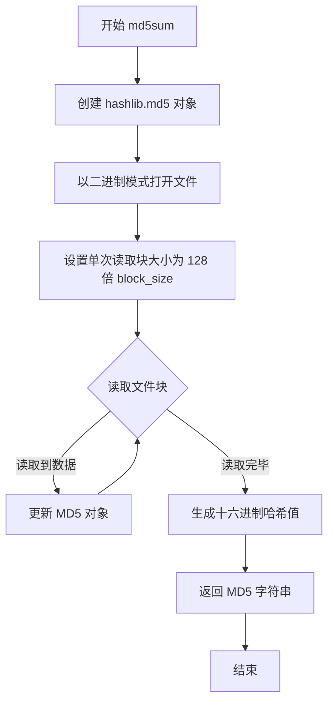

#### 带注释源码

```python
def md5sum(filename):
    """
    计算文件的 MD5 哈希值
    
    Args:
        filename: 要计算 MD5 的文件路径
        
    Returns:
        str: 文件内容的 MD5 十六进制字符串
    """
    # 创建 MD5 哈希对象
    md5 = hashlib.md5()
    
    # 以二进制读取模式打开文件
    with open(filename, "rb") as f:
        # 迭代读取文件块，每次读取 128 * md5.block_size 字节
        # iter() 会持续调用 lambda 直到返回空字节 b"" 为止
        for chunk in iter(lambda: f.read(128 * md5.block_size), b""):
            # 将读取到的数据块更新到 MD5 对象中
            md5.update(chunk)
    
    # 返回 MD5 值的十六进制表示（32 位字符串）
    return md5.hexdigest()
```


### `get_cache_path_by_url(url)`

根据给定的URL解析并构建本地缓存文件的完整路径。该函数主要用于模型下载场景，将远程模型URL映射到本地文件系统路径，确保模型文件缓存到指定的目录中。

参数：

- `url`：`str`，待处理的远程模型文件的URL地址

返回值：`str`，本地缓存文件的完整文件系统路径

#### 流程图

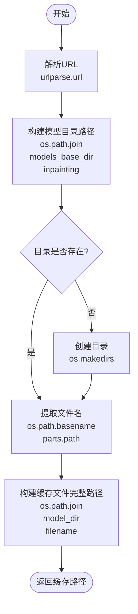

#### 带注释源码

```python
def get_cache_path_by_url(url):
    """
    根据URL获取本地缓存路径
    
    Args:
        url: 远程模型文件的URL地址
        
    Returns:
        本地缓存文件的完整路径
    """
    # 1. 解析URL，获取各个组成部分
    parts = urlparse(url)
    
    # 2. 确定模型缓存的基础目录（基于全局变量 models_base_dir）
    # 统一缓存到 inpainting 子目录下
    model_dir = os.path.join(models_base_dir, "inpainting")
    
    # 3. 确保缓存目录存在，如不存在则创建（递归创建）
    if not os.path.isdir(model_dir):
        os.makedirs(model_dir)
    
    # 4. 从URL路径中提取文件名部分
    # 例如: https://example.com/models/file.pth -> file.pth
    filename = os.path.basename(parts.path)
    
    # 5. 拼接完整的本地缓存文件路径
    cached_file = os.path.join(model_dir, filename)
    
    # 6. 返回完整的本地缓存路径
    return cached_file
```


### `download_model`

该函数用于从给定的URL下载模型文件，并在下载完成后（可选）验证文件的MD5值是否匹配。若文件已存在于缓存目录中，则直接返回缓存路径，避免重复下载。

参数：

- `url`：`str`，模型的下载URL地址
- `model_md5`：`Optional[str]`，可选参数，用于验证下载模型的MD5校验和，确保文件完整性

返回值：`str`，返回模型文件的本地缓存路径

#### 流程图

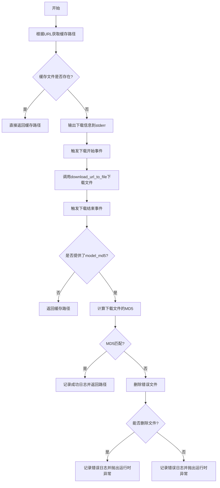

#### 带注释源码

```python
def download_model(url, model_md5: str = None):
    """
    下载模型文件并验证MD5
    
    参数:
        url: 模型文件的下载URL
        model_md5: 可选的MD5校验值，用于验证下载文件的完整性
    
    返回:
        缓存文件的本地路径
    """
    # 1. 根据URL获取本地缓存路径
    cached_file = get_cache_path_by_url(url)
    
    # 2. 检查文件是否已存在于缓存中
    if not os.path.exists(cached_file):
        # 3. 文件不存在，进行下载
        if sys.stderr:
            # 输出下载进度信息到标准错误流
            sys.stderr.write('Downloading: "{}" to {}\n'.format(url, cached_file))
        
        try:
            # 4. 触发下载开始事件（用于UI显示进度等）
            notify_download_event('start', os.path.basename(cached_file))
        except Exception:
            # 忽略事件通知失败
            pass
        
        # 5. 设置hash_prefix为None（不进行哈希前缀验证）
        hash_prefix = None
        # 6. 执行实际的文件下载
        download_url_to_file(url, cached_file, hash_prefix, progress=True)
        
        try:
            # 7. 触发下载结束事件
            notify_download_event('end', os.path.basename(cached_file))
        except Exception:
            # 忽略事件通知失败
            pass
        
        # 8. 如果提供了MD5值，则验证文件完整性
        if model_md5:
            # 计算下载文件的MD5值
            _md5 = md5sum(cached_file)
            
            # 9. MD5匹配检查
            if model_md5 == _md5:
                # 验证成功，记录日志
                logger.info(f"Download model success, md5: {_md5}")
            else:
                # 10. MD5不匹配，尝试删除错误文件
                try:
                    os.remove(cached_file)
                    logger.error(
                        f"Model md5: {_md5}, expected md5: {model_md5}, wrong model deleted. Please restart comic-translate."
                        f"If you still have errors, please try download model manually first.\n"
                    )
                except:
                    # 11. 无法删除文件，记录错误并抛出异常
                    logger.error(
                        f"Model md5: {_md5}, expected md5: {model_md5}, please delete {cached_file} and restart comic-translate."
                    )
                    raise RuntimeError(
                        f"Downloaded model at {cached_file} has md5 {_md5} but expected {model_md5}. File was removed; please re-run or download manually."
                    )

    # 12. 返回缓存文件路径（无论是否重新下载）
    return cached_file
```


### `ceil_modulo`

向上取整到指定倍数的函数，用于将输入数值 x 向上取整到 mod 的最小倍数。当 x 已经是 mod 的倍数时，直接返回 x；否则返回大于 x 的下一个 mod 倍数。

参数：

- `x`：`int` 或 `数值类型`，需要向上取整的数值
- `mod`：`int`，目标模数/倍数

返回值：`int`，返回 x 向上取整到 mod 的倍数的最小值（即大于或等于 x 的最小的 mod 的倍数）

#### 流程图

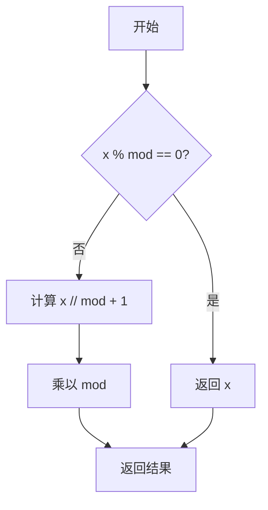

#### 带注释源码

```python
def ceil_modulo(x, mod):
    """
    将 x 向上取整到 mod 的倍数
    
    参数:
        x: 需要取整的数值
        mod: 目标模数
    
    返回:
        大于或等于 x 的最小的 mod 的倍数
    """
    # 如果 x 已经是 mod 的倍数，直接返回
    if x % mod == 0:
        return x
    # 否则计算下一个倍数：(x // mod + 1) * mod
    return (x // mod + 1) * mod
```


### `handle_error`

处理模型加载错误和MD5校验不匹配的函数。当模型加载失败时，该函数会检查模型的MD5值是否与预期值匹配，如果MD5不匹配则尝试删除错误的模型文件，最后都会抛出RuntimeError以通知调用者加载失败。

参数：

- `model_path`：`str`，模型文件的路径
- `model_md5`：`str`，期望的模型文件MD5哈希值
- `e`：`Exception`，模型加载过程中捕获的异常对象

返回值：`None`，该函数不返回正常值，总是抛出RuntimeError异常

#### 流程图

```mermaid
flowchart TD
    A[开始 handle_error] --> B[计算模型文件的MD5: _md5 = md5sum(model_path)]
    B --> C{_md5 != model_md5?}
    C -->|是| D[MD5不匹配]
    D --> E{尝试删除模型文件 os.remove(model_path)}
    E -->|成功| F[记录错误日志: 模型MD5不匹配已删除]
    E -->|失败| G[记录错误日志: 请手动删除模型文件]
    F --> H[抛出RuntimeError异常]
    G --> H
    C -->|否| I[MD5匹配]
    I --> J[记录错误日志: 模型加载失败]
    J --> K[抛出RuntimeError异常]
    H --> L[结束]
    K --> L
```

#### 带注释源码

```python
def handle_error(model_path, model_md5, e):
    """
    处理模型加载错误和MD5不匹配
    
    参数:
        model_path: 模型文件路径
        model_md5: 期望的MD5值
        e: 加载模型时捕获的异常
    """
    # 计算模型文件的实际MD5值
    _md5 = md5sum(model_path)
    
    # 检查MD5是否匹配
    if _md5 != model_md5:
        # MD5不匹配，模型文件可能损坏或被篡改
        try:
            # 尝试删除错误的模型文件
            os.remove(model_path)
            # 构建错误消息
            msg = f"Model md5: {_md5}, expected md5: {model_md5}, wrong model deleted. Please restart comic-translate."
            # 记录错误日志
            logger.error(msg)
            # 抛出运行时错误，通知调用者需要重启
            raise RuntimeError(msg)
        except Exception:
            # 删除失败（例如文件不存在或权限问题）
            msg = f"Model md5: {_md5}, expected md5: {model_md5}, please delete {model_path} and restart comic-translate."
            logger.error(msg)
            raise RuntimeError(msg)
    else:
        # MD5匹配但加载仍然失败，说明是其他问题导致的加载失败
        msg = f"Failed to load model {model_path}: {e}"
        logger.error(msg)
        raise RuntimeError(msg)
```


### `load_jit_model`

加载 TorchScript JIT 模型函数，用于从本地路径加载预编译的 TorchScript 模型并将其移动到指定设备。

参数：

- `model_path`：`str`，TorchScript 模型文件的本地路径
- `device`：`torch.device` 或 `str`，目标设备（如 "cpu"、"cuda"、"mps"）

返回值：`torch.nn.Module`，加载并配置好的 TorchScript 模型对象

#### 流程图

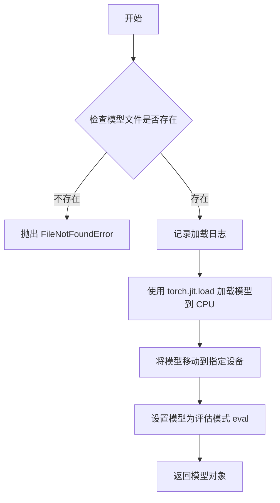

#### 带注释源码

```python
def load_jit_model(model_path: str, device):
    """Load a TorchScript model from an existing local path.
    
    该函数用于加载预先编译好的 TorchScript (.pt) 模型文件，
    并将其移动到指定的计算设备上。
    
    Args:
        model_path: TorchScript 模型文件的路径
        device: 目标设备（'cpu', 'cuda', 'mps' 等）
    
    Returns:
        加载并设置为评估模式的 torch 模型对象
    """
    import torch  # 延迟导入，避免在模块加载时增加不必要的依赖
    
    # 检查模型文件是否存在
    if not os.path.exists(model_path):
        raise FileNotFoundError(f"JIT model file not found: {model_path}")
    
    # 记录模型加载信息
    logger.info(f"Loading model from: {model_path}")
    
    # 1. 使用 torch.jit.load 从文件加载 TorchScript 模型
    # 2. map_location="cpu" 确保模型首先加载到 CPU
    # 3. .to(device) 将模型移动到目标设备
    model = torch.jit.load(model_path, map_location="cpu").to(device)
    
    # 设置为评估模式，禁用 dropout、batch norm 更新等训练特定的行为
    model.eval()
    
    return model
```


### `load_model`

该函数用于加载 PyTorch 模型权重，支持从本地路径或远程 URL 加载模型，并可选进行 MD5 校验以确保模型文件的完整性。函数接收一个预定义的模型结构，然后将权重加载到该模型中并移动到指定设备。

参数：

- `model`：`torch.nn.Module`，需要加载权重的 PyTorch 模型对象
- `url_or_path`：`str`，模型权重文件的本地路径或远程下载 URL
- `device`：`torch.device`，模型加载后要移动到的目标设备（如 CPU、CUDA 等）
- `model_md5`：`str`，可选的 MD5 校验值，用于验证下载的模型文件完整性

返回值：`torch.nn.Module`，加载了权重并设置好评估模式的 PyTorch 模型对象

#### 流程图

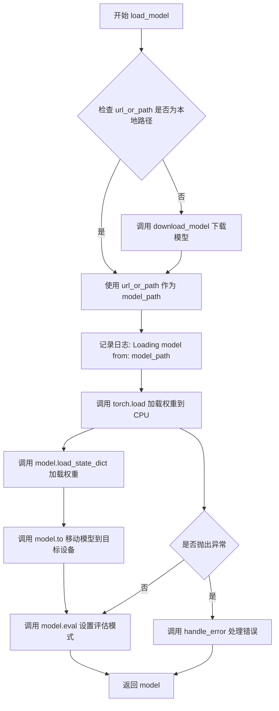

#### 带注释源码

```python
def load_model(model, url_or_path, device, model_md5):
    """加载 PyTorch 模型权重
    
    Args:
        model: 需要加载权重的 PyTorch 模型实例
        url_or_path: 模型文件本地路径或远程 URL
        device: 目标设备 (torch.device)
        model_md5: 可选的 MD5 校验值
    
    Returns:
        加载了权重的模型对象
    """
    import torch
    
    # 判断输入是本地路径还是远程 URL
    if os.path.exists(url_or_path):
        # 本地路径直接使用
        model_path = url_or_path
    else:
        # 远程 URL 需要先下载，返回本地缓存路径
        model_path = download_model(url_or_path, model_md5)

    try:
        # 记录加载日志
        logger.info(f"Loading model from: {model_path}")
        
        # 从本地路径加载模型权重到 CPU 内存
        # map_location="cpu" 确保权重首先加载到 CPU，再移动到目标设备
        state_dict = torch.load(model_path, map_location="cpu")
        
        # 将加载的权重加载到模型中
        # strict=True 表示严格匹配权重键值，不允许缺少或多余的键
        model.load_state_dict(state_dict, strict=True)
        
        # 将模型移动到目标设备 (CPU/CUDA/MPS 等)
        model.to(device)
        
    except Exception as e:
        # 加载失败时调用错误处理函数
        # 可能原因：权重键不匹配、文件损坏、MD5 校验失败等
        handle_error(model_path, model_md5, e)
    
    # 设置模型为评估模式
    # 会关闭 dropout、切换 BatchNorm 为推理模式等
    model.eval()
    
    return model
```


### `numpy_to_bytes`

该函数是一个轻量级的图像编码封装函数，负责将 NumPy 数组格式的图像数据根据指定的文件扩展名编码为对应的字节流，内部委托给 `imkit` 库的 `encode_image` 方法实现具体的编解码逻辑。

参数：

- `image_numpy`：`np.ndarray`，输入的 NumPy 数组格式图像数据，通常为三维数组（高度 × 宽度 × 通道数）
- `ext`：`str`，目标编码格式的扩展名（如 "png"、"jpg"、"jpeg" 等），用于指定输出图像的格式

返回值：`bytes`，编码后的图像字节流，可直接用于网络传输、文件存储或作为 HTTP 响应体

#### 流程图

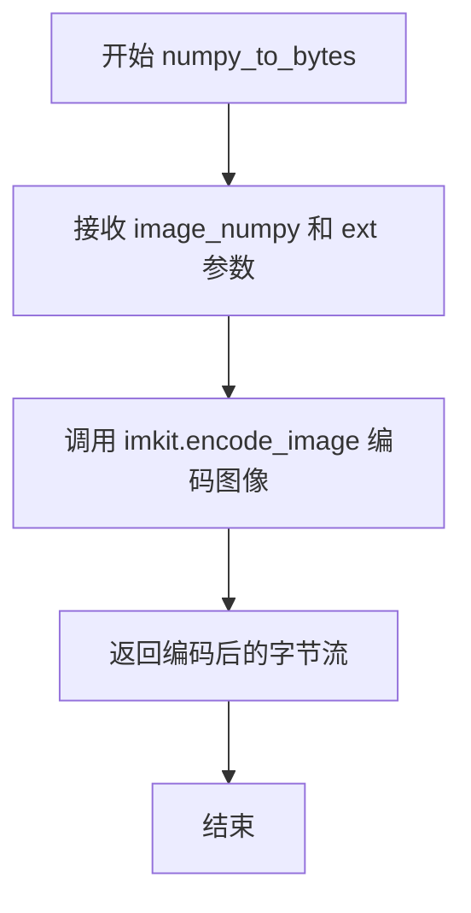

#### 带注释源码

```python
def numpy_to_bytes(image_numpy: np.ndarray, ext: str) -> bytes:
    """
    将 NumPy 数组格式的图像编码为字节流
    
    Args:
        image_numpy: NumPy 数组格式的图像数据，形状通常为 [H, W, C]
        ext: 目标编码格式的扩展名，如 'png', 'jpg', 'jpeg'
    
    Returns:
        编码后的图像字节流，可直接用于文件写入或网络传输
    """
    # 委托给 imkit 库的 encode_image 方法进行实际编码
    # imkit 是一个图像处理库，encode_image 内部会根据 ext 参数
    # 调用对应的图像编码器将 NumPy 数组转换为指定格式的字节
    return imk.encode_image(image_numpy, ext)
```

---

## 补充信息

### 关键组件信息

| 组件名称 | 一句话描述 |
|---------|-----------|
| `imkit` (imk) | 外部图像处理库，提供图像编解码、变换、轮廓检测等功能封装 |
| `encode_image` | imkit 库的核心图像编码函数，根据扩展名选择合适的编码器 |

### 潜在的技术债务或优化空间

1. **缺乏错误处理**：函数直接传递参数给 `imkit.encode_image`，未对无效的图像数据（如空数组、维度不匹配）或不支持的扩展名进行校验，可能导致运行时异常
2. **扩展性受限**：完全依赖 `imkit` 库的实现，无法在不修改源码的情况下切换到底层编码库（如 Pillow、OpenCV）
3. **参数验证缺失**：未对 `ext` 参数进行白名单校验，传入非法扩展名时错误信息可能不够友好

### 其它项目

**设计目标与约束**：
- 设计目标：提供简洁的 NumPy 数组到图像字节的转换接口，隐藏底层编码细节
- 约束：依赖外部库 `imkit`，扩展名必须与该库支持的格式一致

**错误处理与异常设计**：
- 当前实现无显式错误处理，异常由调用方捕获
- 建议：添加对 `image_numpy` 类型、形状的校验，以及对 `ext` 合法性的预检查

**数据流与状态机**：
- 数据流：NumPy 数组（内存） → `imkit.encode_image` → 字节流（内存）
- 状态机：输入验证（可选） → 编码转换 → 返回结果

**外部依赖与接口契约**：
- 外部依赖：`imkit` 库，需确保该库已正确安装并可用
- 接口契约：输入满足 NumPy 数组格式且扩展名合法时，应返回有效的图像字节；否则行为取决于 `imkit` 库的实现


### `pil_to_bytes`

将 PIL 图像对象编码为字节格式，支持多种图像格式（PNG、JPG、JPEG 等），并可嵌入 EXIF 或 PNG 元数据信息。

参数：

- `pil_img`：`PIL.Image`，输入的 PIL 图像对象
- `ext`：`str`，输出图像的格式扩展名（如 "png"、"jpg"、"jpeg"）
- `quality`：`int`，图像质量参数，默认值为 95
- `exif_infos`：`dict`，包含 EXIF 或 PNG 元数据的字典，默认值为空字典

返回值：`bytes`，编码后的图像字节数据

#### 流程图

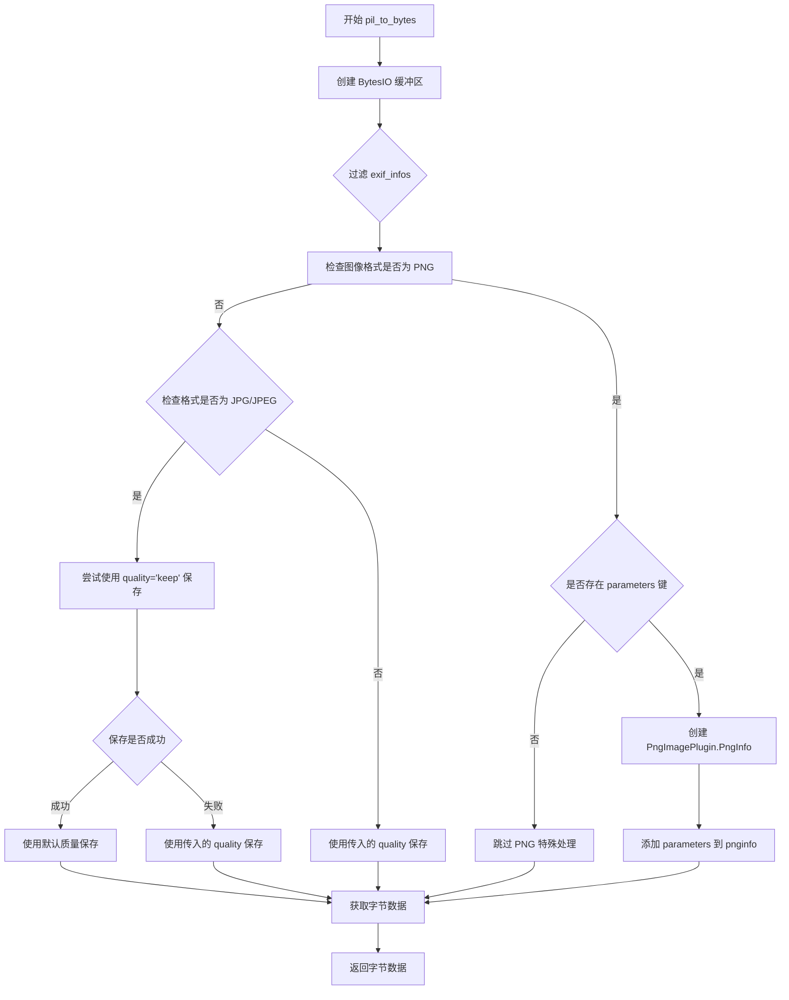

#### 带注释源码

```python
def pil_to_bytes(pil_img, ext: str, quality: int = 95, exif_infos={}) -> bytes:
    """
    将 PIL 图像编码为字节格式
    
    Args:
        pil_img: PIL 图像对象
        ext: 输出格式 (png, jpg, jpeg 等)
        quality: 图像质量 (1-100)
        exif_infos: 包含 EXIF 信息的字典
    
    Returns:
        编码后的图像字节数据
    """
    # 使用 BytesIO 作为内存缓冲区存储图像数据
    with io.BytesIO() as output:
        # 过滤掉值为 None 的参数，避免保存时出错
        kwargs = {k: v for k, v in exif_infos.items() if v is not None}
        
        # 获取小写的格式扩展名用于比较
        ext_lower = ext.lower()
        
        # PNG 格式特殊处理：支持嵌入 parameters 元数据
        if ext_lower == "png" and "parameters" in kwargs:
            # 创建 PNG 元数据对象
            pnginfo_data = PngImagePlugin.PngInfo()
            # 将 parameters 信息添加到 PNG 元数据中
            pnginfo_data.add_text("parameters", kwargs["parameters"])
            # 将 pnginfo 添加到保存参数中
            kwargs["pnginfo"] = pnginfo_data

        # JPG/JPEG 格式处理：尝试保留原始质量
        if ext_lower in {"jpg", "jpeg"}:
            try:
                # 尝试使用 'keep' 关键字保留原始质量
                pil_img.save(output, format=ext, quality="keep", **kwargs)
            except (ValueError, OSError):
                # 如果失败（可能是格式不支持），使用传入的质量参数
                pil_img.save(output, format=ext, **kwargs)
        else:
            # 其他格式（如 PNG、GIF 等）使用传入的 quality 参数保存
            pil_img.save(
                output, 
                format=ext, 
                quality=quality, 
                **kwargs
            )
        
        # 从缓冲区获取编码后的字节数据
        image_bytes = output.getvalue()
    
    # 返回图像字节数据
    return image_bytes
```


### `load_img`

将图像字节数据加载为 NumPy 数组，支持灰度转换、Alpha 通道提取和 EXIF 信息返回。

参数：

- `img_bytes`：`bytes`，图像的原始字节数据（通常为 PNG、JPG 等图像格式的二进制内容）
- `gray`：`bool`，是否将图像转换为灰度图，默认为 `False`
- `return_exif`：`bool`，是否返回图像的 EXIF 元数据，默认为 `False`

返回值：
- 当 `return_exif=True` 时：返回 `(np.ndarray, np.ndarray | None, dict)`，依次为图像数组、Alpha 通道（如有）、EXIF 信息字典
- 当 `return_exif=False` 时：返回 `(np.ndarray, np.ndarray | None)`，依次为图像数组、Alpha 通道（如有）

#### 流程图

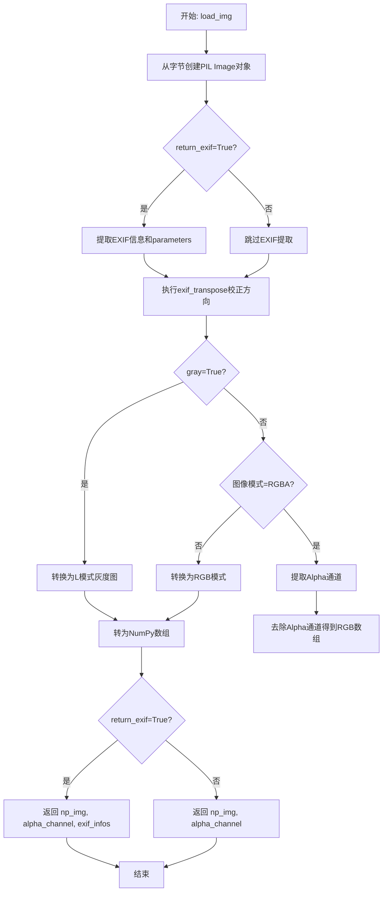

#### 带注释源码

```python
def load_img(img_bytes, gray: bool = False, return_exif: bool = False):
    """从字节加载图像为numpy数组
    
    Args:
        img_bytes: 图像的原始字节数据
        gray: 是否转换为灰度图
        return_exif: 是否返回EXIF信息
    
    Returns:
        根据return_exif参数返回不同数量的值
    """
    alpha_channel = None  # 初始化Alpha通道为None
    
    # 使用io.BytesIO将字节数据转换为文件对象，再用PIL打开
    image = Image.open(io.BytesIO(img_bytes))

    # 如果需要返回EXIF信息，则提前提取
    if return_exif:
        info = image.info or {}
        exif_infos = {"exif": image.getexif(), "parameters": info.get("parameters")}

    # 尝试根据EXIF信息调整图像方向（有些相机拍的图是旋转过的）
    try:
        image = ImageOps.exif_transpose(image)
    except:
        pass

    # 根据gray参数决定处理方式
    if gray:
        # 转换为灰度模式(L模式)
        image = image.convert("L")
        np_img = np.array(image)
    else:
        # 彩色图像处理
        if image.mode == "RGBA":
            # RGBA图像：提取Alpha通道，并将RGB转为numpy数组
            np_img = np.array(image)
            alpha_channel = np_img[:, :, -1]  # 取最后一个通道作为Alpha
            # 转换RGBA为RGB：去除Alpha通道
            np_img = np_img[:, :, :3]
        else:
            # 其他模式（如RGB、RGBX等）统一转为RGB
            image = image.convert("RGB")
            np_img = np.array(image)

    # 根据return_exif决定返回值
    if return_exif:
        return np_img, alpha_channel, exif_infos
    return np_img, alpha_channel
```


### `norm_img`

将输入的numpy图像数组归一化到[0,1]范围，并将图像从HWC（高度×宽度×通道）格式转换为CHW（通道×高度×宽度）格式，以便于深度学习模型处理。

参数：

- `np_img`：`np.ndarray`，输入的图像数据，可以是灰度图（2D数组）或彩色图（3D数组，HWC格式）

返回值：`np.ndarray`，归一化后的图像数组，数据类型为float32，值域为[0,1]，维度为CHW格式

#### 流程图

```mermaid
flowchart TD
    A[开始: 输入np_img] --> B{检查图像维度 len(np_img.shape) == 2?}
    B -- 是 --> C[添加通道维度: np_img[:, :, np.newaxis]
    B -- 否 --> D[跳过添加维度]
    C --> E[转换为CHW格式: np.transpose(np_img, (2, 0, 1))]
    D --> E
    E --> F[类型转换并归一化: np_img.astype('float32') / 255]
    F --> G[返回归一化后的图像]
    G --> H[结束]
```

#### 带注释源码

```python
def norm_img(np_img):
    """
    将图像归一化到[0,1]范围并转换为CHW格式
    
    参数:
        np_img: 输入的numpy图像数组，支持以下格式:
                - 灰度图: 2D数组 [H, W]
                - 灰度图(带通道): 3D数组 [H, W, 1]
                - 彩色图: 3D数组 [H, W, C] (通常C=3)
    
    返回:
        归一化后的图像数组，格式为 [C, H, W]，数据类型float32，值域[0,1]
    """
    # 如果输入是2D灰度图像，添加通道维度使其变为3D [H, W, 1]
    if len(np_img.shape) == 2:
        np_img = np_img[:, :, np.newaxis]
    
    # 将图像从HWC格式转换为CHW格式（通道维度前置）
    # 变换: [H, W, C] -> [C, H, W]
    np_img = np.transpose(np_img, (2, 0, 1))
    
    # 将数据类型转换为float32，并除以255进行归一化
    # 使像素值从 [0, 255] 映射到 [0, 1] 范围
    np_img = np_img.astype("float32") / 255
    
    return np_img
```


### `resize_max_size`

该函数用于将图像的长边缩放到指定大小限制，如果图像的长边大于指定限制则按比例缩放，否则返回原图。

参数：

- `np_img`：`numpy.ndarray`，输入的图像数据，形状为 [H, W, C] 或 [H, W]
- `size_limit`：`int`，目标大小限制，表示图像长边要缩放到的目标像素值
- `interpolation`：`PIL.Image.Resampling`，插值方法，默认为 `Image.Resampling.BICUBIC`

返回值：`numpy.ndarray`，缩放后的图像数组或原始图像数组（当图像尺寸未超过限制时）

#### 流程图

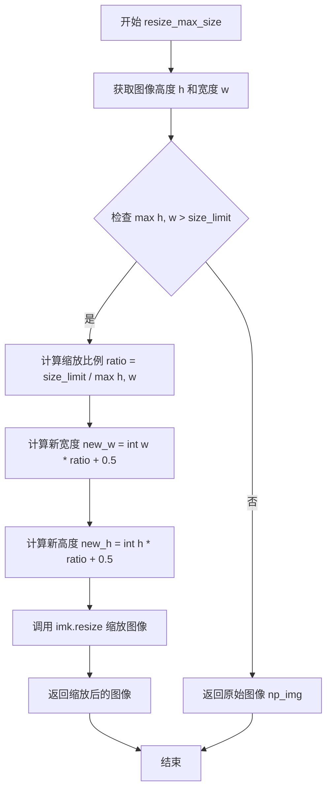

#### 带注释源码

```python
def resize_max_size(
    np_img, size_limit: int, interpolation=Image.Resampling.BICUBIC
) -> np.ndarray:
    """
    将图像的长边缩放到指定大小限制。
    
    如果图像的长边大于指定限制，则按比例缩放图像；
    否则返回原始图像不变。
    
    Args:
        np_img: 输入的图像数组，形状为 [H, W, C] 或 [H, W]
        size_limit: 目标大小限制，图像长边将被缩放到此值
        interpolation: 插值方法，默认为双三次插值
    
    Returns:
        缩放后的图像数组或原始图像（当尺寸未超过限制时）
    """
    # Resize image's longer size to size_limit if longer size larger than size_limit
    # 获取图像的高度和宽度（支持多通道图像）
    h, w = np_img.shape[:2]
    
    # 检查图像的长边是否大于指定的大小限制
    if max(h, w) > size_limit:
        # 计算缩放比例：目标大小除以当前最大边长
        ratio = size_limit / max(h, w)
        
        # 计算新的宽度：原始宽度乘以缩放比例，并四舍五入取整
        new_w = int(w * ratio + 0.5)
        
        # 计算新的高度：原始高度乘以缩放比例，并四舍五入取整
        new_h = int(h * ratio + 0.5)
        
        # 使用 imkit 库的 resize 函数进行图像缩放
        # mode 参数指定插值方法（默认使用双三次插值）
        return imk.resize(np_img, (new_w, new_h), mode=interpolation)
    else:
        # 如果图像尺寸未超过限制，直接返回原始图像
        return np_img
```


### `pad_img_to_modulo`

该函数用于将输入的图像填充（padding）至指定的模数（mod）倍数，以满足模型输入的尺寸要求，支持正方形输出和最小尺寸约束。

参数：

- `img`：`np.ndarray`，输入图像，形状为 [H, W, C] 或 [H, W]
- `mod`：`int`，模数，输出图像的宽高将被填充至该值的倍数
- `square`：`bool`，可选，默认为 `False`，是否将输出图像填充为正方形
- `min_size`：`Optional[int]`，可选，默认为 `None`，输出图像的最小宽高（需为 mod 的倍数）

返回值：`np.ndarray`，填充后的图像，形状为 [out_height, out_width, C]

#### 流程图

```mermaid
flowchart TD
    A[开始] --> B{检查 img 维度}
    B -->|2维| C[扩展为3维: img[:, :, np.newaxis]
    B -->|3维| D[直接使用]
    C --> E[获取 height, width]
    D --> E
    E --> F[计算 out_height = ceil_modulo(height, mod)]
    E --> G[计算 out_width = ceil_modulo(width, mod)]
    F --> H{min_size 是否为 None}
    G --> H
    H -->|否| I[断言 min_size % mod == 0]
    H -->|是| J
    I --> K[out_width = max(min_size, out_width)]
    K --> L[out_height = max(min_size, out_height)]
    L --> J
    J --> M{square 是否为 True}
    M -->|是| N[max_size = max(out_height, out_width)]
    N --> O[out_height = max_size]
    O --> P[out_width = max_size]
    M -->|否| Q
    P --> Q
    Q --> R[使用 np.pad 填充图像]
    R --> S[mode='symmetric']
    S --> T[返回填充后的图像]
```

#### 带注释源码

```python
def pad_img_to_modulo(
    img: np.ndarray, mod: int, square: bool = False, min_size: Optional[int] = None
):
    """
    将图像填充至模数倍数
    
    Args:
        img: 输入图像，形状为 [H, W, C] 或 [H, W]
        mod: 模数，输出图像的宽高将被填充至该值的倍数
        square: 是否为正方形，若为 True，则输出图像的宽高相等
        min_size: 输出图像的最小宽高，若指定则需为 mod 的倍数
    
    Returns:
        填充后的图像，形状为 [out_height, out_width, C]
    """
    # 如果图像是灰度图（2维），扩展为3维 [H, W, 1]
    if len(img.shape) == 2:
        img = img[:, :, np.newaxis]
    
    # 获取图像的高和宽
    height, width = img.shape[:2]
    
    # 计算填充后的高度和宽度（向上取整到 mod 的倍数）
    out_height = ceil_modulo(height, mod)
    out_width = ceil_modulo(width, mod)
    
    # 如果指定了最小尺寸，则确保输出不小于最小尺寸
    if min_size is not None:
        # 断言 min_size 必须是 mod 的倍数，否则无法整除
        assert min_size % mod == 0
        out_width = max(min_size, out_width)
        out_height = max(min_size, out_height)
    
    # 如果需要正方形，则将宽高都设为最大值
    if square:
        max_size = max(out_height, out_width)
        out_height = max_size
        out_width = max_size
    
    # 使用 symmetric 模式填充图像边缘
    # 填充顺序为：高度填充、宽度填充、通道填充（不填充）
    return np.pad(
        img,
        ((0, out_height - height), (0, out_width - width), (0, 0)),
        mode="symmetric",
    )
```


### `boxes_from_mask`

该函数从二值遮罩图像中提取所有轮廓的边界框，返回边界框坐标列表。

参数：

- `mask`：`np.ndarray`，输入的二值遮罩图像，形状为 (h, w, 1)，像素值范围 0~255

返回值：`List[np.ndarray]`，返回边界框坐标列表，每个边界框为 `[x1, y1, x2, y2]` 格式的 numpy 数组

#### 流程图

```mermaid
flowchart TD
    A[开始: 输入 mask] --> B[获取 mask 高度和宽度]
    B --> C[使用阈值127对mask进行二值化]
    C --> D[查找所有轮廓 contours]
    D --> E{遍历每个轮廓}
    E -->|对于每个轮廓| F[计算边界框 x, y, w, h]
    F --> G[转换为 [x, y, x+w, y+h] 格式]
    G --> H[将边界坐标裁剪到图像范围内]
    H --> I[将边界框添加到列表]
    I --> E
    E -->|遍历完成| J[返回边界框列表]
```

#### 带注释源码

```python
def boxes_from_mask(mask: np.ndarray) -> List[np.ndarray]:
    """
    从二值遮罩提取所有轮廓的边界框
    
    Args:
        mask: (h, w, 1)  0~255
        
    Returns:
        边界框列表，每个边界框为 [x1, y1, x2, y2] 格式
    """
    # 获取遮罩图像的高度和宽度
    height, width = mask.shape[:2]
    
    # 使用 imkit 库的 threshold 函数进行二值化处理
    # 将像素值 > 127 的设为 255，否则设为 0
    _, thresh = imk.threshold(mask, 127, 255, 0)
    
    # 在二值图像中查找所有轮廓
    contours, _ = imk.find_contours(thresh)
    
    # 初始化边界框列表
    boxes = []
    
    # 遍历每个轮廓
    for cnt in contours:
        # 计算当前轮廓的边界框（x, y 为左上角坐标，w, h 为宽高）
        x, y, w, h = imk.bounding_rect(cnt)
        
        # 转换为 [x1, y1, x2, y2] 格式（x2=x+w, y2=y+h）
        box = np.array([x, y, x + w, y + h]).astype(int)
        
        # 裁剪边界框坐标，确保不超出图像范围
        # box[::2] 处理 x 坐标（x1, x2）
        box[::2] = np.clip(box[::2], 0, width)
        # box[1::2] 处理 y 坐标（y1, y2）
        box[1::2] = np.clip(box[1::2], 0, height)
        
        # 将边界框添加到列表中
        boxes.append(box)
    
    # 返回所有边界框
    return boxes
```


### `only_keep_largest_contour`

该函数用于从输入的二值掩码中提取所有轮廓，找出面积最大的轮廓，并在新的掩码上绘制填充该轮廓，最终返回只保留最大轮廓的掩码图像。

参数：
- `mask`：`np.ndarray`，输入的二值掩码，形状为 (h, w)，像素值范围 0~255

返回值：`List[np.ndarray]`，返回保留最大轮廓的掩码（实际为单个 numpy 数组）

#### 流程图

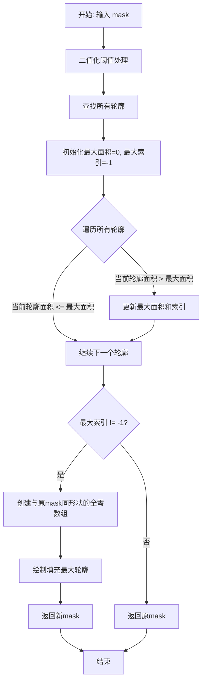

#### 带注释源码

```python
def only_keep_largest_contour(mask: np.ndarray) -> List[np.ndarray]:
    """
    Args:
        mask: (h, w)  0~255

    Returns:

    """
    # 第一步：对输入掩码进行二值化阈值处理
    # 使用 imkit 库的 threshold 函数，将掩码中像素值 >127 的设为 255，其余设为 0
    _, thresh = imk.threshold(mask, 127, 255, 0)
    
    # 第二步：在二值化后的图像上查找所有轮廓
    # 返回轮廓列表和层级信息
    contours, _ = imk.find_contours(thresh)

    # 第三步：遍历所有轮廓，找出面积最大的轮廓
    max_area = 0      # 初始化最大面积为 0
    max_index = -1    # 初始化最大轮廓索引为 -1（表示未找到）
    
    # 遍历每个轮廓，比较面积大小
    for i, cnt in enumerate(contours):
        # 计算当前轮廓的面积
        area = imk.contour_area(cnt)
        # 如果当前面积大于最大面积，则更新
        if area > max_area:
            max_area = area
            max_index = i

    # 第四步：根据最大轮廓索引处理返回结果
    if max_index != -1:
        # 如果找到了有效轮廓（存在至少一个轮廓）
        # 创建一个与原掩码形状相同的全零数组
        new_mask = np.zeros_like(mask)
        # 在新掩码上绘制并填充最大轮廓
        # 参数: 目标图像, 轮廓列表, 轮廓索引, 颜色(255), 厚度(-1表示填充)
        return imk.draw_contours(new_mask, contours, max_index, 255, -1)
    else:
        # 如果没有找到任何轮廓（原掩码为空或全黑），返回原掩码
        return mask
```

## 关键组件


### 模型下载与缓存管理

负责从URL下载模型文件并进行MD5校验，确保模型完整性

### MD5校验

计算文件MD5值用于验证下载模型的完整性

### 图像编码与解码

处理NumPy数组和PIL图像与字节流之间的相互转换，支持多种图像格式

### 图像加载与预处理

加载图像字节数据，支持灰度模式和EXIF信息提取，自动处理RGBA通道和EXIF旋转

### 图像归一化

将图像像素值从0-255范围转换为0-1范围的float32张量，并调整维度顺序为C×H×W

### 图像缩放

将图像较长边缩放到指定尺寸限制以内，保持宽高比

### 图像填充

将图像填充到指定模数的倍数，支持正方形填充和最小尺寸限制

### 遮罩边界框提取

从二值遮罩中提取所有轮廓的边界框坐标，支持裁剪到图像范围内

### 最大轮廓保留

从遮罩中仅保留面积最大的轮廓，用于去噪和简化遮罩

### TorchScript模型加载

从本地路径加载TorchScript格式的模型文件并移至指定设备

### 通用模型加载

统一加载入口，支持从本地路径或URL加载PyTorch模型，包含错误处理和MD5校验

### 错误处理与模型校验

验证模型文件的MD5值，处理加载失败的情况并清理损坏的模型文件


## 问题及建议


### 已知问题

-   **异常处理不当**：多处使用裸`except:`和`except Exception:`捕获所有异常并静默处理，会隐藏真正的错误根源，如`load_img`中的`except: pass`和`download_model`中的空异常块
-   **硬编码路径**：`get_cache_path_by_url`函数中硬编码了`"inpainting"`目录名，降低了代码的可复用性
-   **错误信息不一致**：部分错误信息提到"comic-translate"项目名称，但实际代码来自"lama-cleaner"项目，表明代码可能从其他项目复制而来
-   **类型注解缺失**：`load_jit_model`的`device`参数、`load_model`的`model`参数、`resize_max_size`的`interpolation`参数等缺少完整的类型注解
-   **魔法数字**：多处使用未命名的常量如`127`、`255`、`95`等，应该定义为有意义的常量
-   **逻辑重复**：MD5校验逻辑在`download_model`和`handle_error`函数中重复出现
-   **返回值不一致**：`load_img`函数在`gray=True`时返回的`alpha_channel`始终为`None`，但仍返回该值，可能导致调用者误解

### 优化建议

-   统一异常处理策略，使用具体的异常类型并在必要时重新抛出，移除`except: pass`这种静默处理
-   将`"inpainting"`提取为可配置的参数或常量
-   修正错误信息中的项目名称，或将其改为通用的占位符
-   补充完整的类型注解，使用`typing.Optional`、`typing.Any`等明确标注
-   将魔法数字定义为模块级常量（如`DEFAULT_QUALITY = 95`、`THRESHOLD_VALUE = 127`）并添加注释说明含义
-   抽取公共的MD5校验逻辑为独立函数，减少代码重复
-   考虑在`load_img`函数中针对灰度图返回`None`的行为添加文档说明或返回元组时使用`Optional`类型

## 其它


### 设计目标与约束

本模块主要服务于 lama-cleaner 图像修复项目，提供模型下载加载、图像处理、辅助工具等核心功能。设计目标包括：1) 提供统一的模型下载和缓存机制，支持 MD5 校验确保模型完整性；2) 提供图像格式转换和预处理功能，支持 PIL 和 numpy 数组之间的相互转换；3) 提供图像修补所需的辅助功能如 bounding box 提取、图像填充等。约束条件包括：依赖 PyTorch、PIL、numpy 等基础库；模型加载支持 CPU 和 CUDA 设备；图像处理默认使用 RGB 模式。

### 错误处理与异常设计

本模块涉及多处异常处理设计：1) `download_model` 函数中，当 MD5 校验失败时会删除错误的模型文件并抛出 RuntimeError；2) `handle_error` 函数提供统一的模型加载错误处理逻辑，根据 MD5 是否匹配决定是删除文件还是报告加载失败；3) `load_img` 函数中使用 try-except 包裹 `exif_transpose` 调用以处理 EXIF 读取异常；4) `pil_to_bytes` 函数对 JPEG 格式使用两次保存尝试，首次使用 `quality="keep"` 失败后降级到普通质量。整体采用逐层异常传播策略，底层函数抛出异常由上层调用者捕获处理。

### 数据流与状态机

模块数据流主要分为三条路径：1) 模型加载路径：`url_or_path` -> `download_model` / 直接使用路径 -> `load_jit_model` 或 `load_model` -> 返回模型实例；2) 图像输入路径：`img_bytes` (字节流) -> `load_img` -> `np_img` (numpy数组) -> `norm_img` / `resize_max_size` / `pad_img_to_modulo` 处理 -> 返回处理后的 numpy 数组；3) 图像输出路径：`np_img` / `pil_img` -> `numpy_to_bytes` / `pil_to_bytes` -> `image_bytes` (字节流)。不涉及复杂状态机，主要为顺序数据转换流水线。

### 外部依赖与接口契约

本模块依赖以下外部包和模块：1) `imkit` (imk) - 提供图像处理底层操作包括 encode_image、resize、threshold、find_contours、bounding_rect、contour_area、draw_contours 等；2) `torch` - 用于模型加载和设备管理；3) `PIL` (Pillow) - 图像读写和 EXIF 处理；4) `numpy` - 数值计算和数组操作；5) 本地模块 `.download_file` 和 `.download` - 提供文件下载和事件通知功能。关键接口契约：`download_model` 接受 url 字符串和可选 MD5 校验码，返回本地缓存文件路径；`load_model` 接受模型实例、url或路径、设备和 MD5 校验码，返回加载后的模型；`load_img` 支持灰度模式和 EXIF 信息返回。

### 性能考虑与优化空间

性能优化点包括：1) `md5sum` 函数使用分块读取而非一次性加载整个文件，适合处理大模型文件；2) 模型加载统一使用 `map_location="cpu"` 先加载到内存再移动到目标设备，避免直接加载到 GPU 时的潜在问题；3) `pad_img_to_modulo` 和 `norm_img` 使用 numpy 向量化操作避免 Python 循环。优化空间：可以考虑使用内存映射文件加载大模型；`download_model` 中的 MD5 校验可考虑异步执行；图像处理函数可考虑使用 numba 加速计算密集型操作。

### 资源管理与限制

本模块涉及的资源管理包括：1) 文件系统资源 - 缓存目录创建和模型文件管理，通过 `get_cache_path_by_url` 确保目录存在；2) 内存资源 - 图像数据在 numpy 数组和 PIL Image 之间转换时的内存占用控制，`resize_max_size` 限制图像最大尺寸；3) 网络资源 - 模型下载进度通过 `notify_download_event` 回调通知。限制条件：默认图像尺寸限制需通过 `size_limit` 参数指定；填充模数需为正整数。

### 版本兼容性与平台差异

本模块考虑了以下兼容性：1) `Image.Resampling.BICUBIC` - Pillow 10+ 版本中使用了新的枚举值，旧版本可能需要使用 `Image.BICUBIC`；2) JPEG 质量参数 - 使用 `quality="keep"` 尝试保留原始质量，失败后降级兼容；3) EXIF 处理 - 使用 `ImageOps.exif_transpose` 处理图像方向，同时用 try-except 包裹防止读取失败；4) 设备支持 - 支持 CPU、CUDA 和 MPS 设备（代码中有 MPS 相关注释但未启用）。建议在 requirements.txt 中明确 Pillow>=10.0.0 以确保 API 兼容性。

### 配置与参数说明

关键配置参数包括：1) `models_base_dir` - 来自 `.download` 模块，指定模型缓存根目录；2) `size_limit` (resize_max_size) - 限制图像长边最大值，默认为正整数；3) `mod` (pad_img_to_modulo) - 填充模数，确保输出尺寸能被 mod 整除；4) `square` (pad_img_to_modulo) - 是否将图像填充为正方形；5) `min_size` (pad_img_to_modulo) - 填充后最小尺寸要求；6) `quality` (pil_to_bytes) - 有损格式输出质量，默认95；7) `gray` (load_img) - 是否返回灰度图像；8) `return_exif` (load_img) - 是否返回 EXIF 信息。

### 使用示例与调用流程

典型调用流程示例：1) 模型加载：`model = load_model(model_instance, "https://example.com/model.pth", torch.device("cuda"), "expected_md5")`；2) 图像处理：先 `np_img, alpha = load_img(img_bytes)`，再 `np_img = norm_img(np_img)`，最后 `np_img = pad_img_to_modulo(np_img, 8)`；3) 边界框提取：`boxes = boxes_from_mask(mask_np)`。建议在 Web 服务中使用单例模式缓存已加载模型避免重复加载开销。

### 安全性考虑

安全相关设计：1) MD5 校验用于验证下载模型完整性，防止中间人攻击或下载损坏文件；2) 文件操作使用 `os.path.exists` 和 `os.remove` 进行存在性检查后再操作；3) 异常处理中包含文件删除失败的容错逻辑；4) 用户提供的 URL 通过 `urlparse` 解析后提取文件名，避免路径注入风险。潜在安全风险：MD5 算法存在碰撞攻击可能性，建议生产环境升级到 SHA-256。

### 线程安全与并发考虑

当前模块未显式实现线程安全机制。需要注意的并发场景：1) 多线程同时调用 `download_model` 可能导致重复下载，建议使用线程锁或单例模式；2) 模型加载 `load_model` 和 `load_jit_model` 在多线程环境下应确保模型实例不共享状态；3) 文件缓存检查 `os.path.exists` 存在 TOCTOU 竞态条件。推荐在高并发场景下使用文件锁或分布式锁保护下载和缓存逻辑。


    