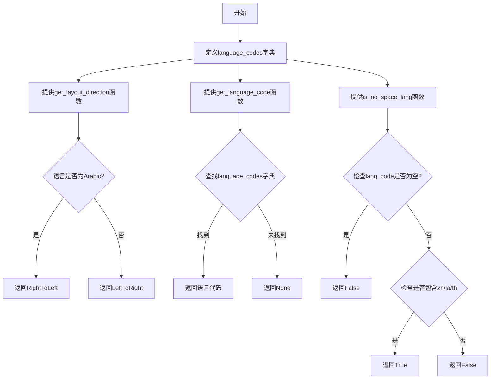
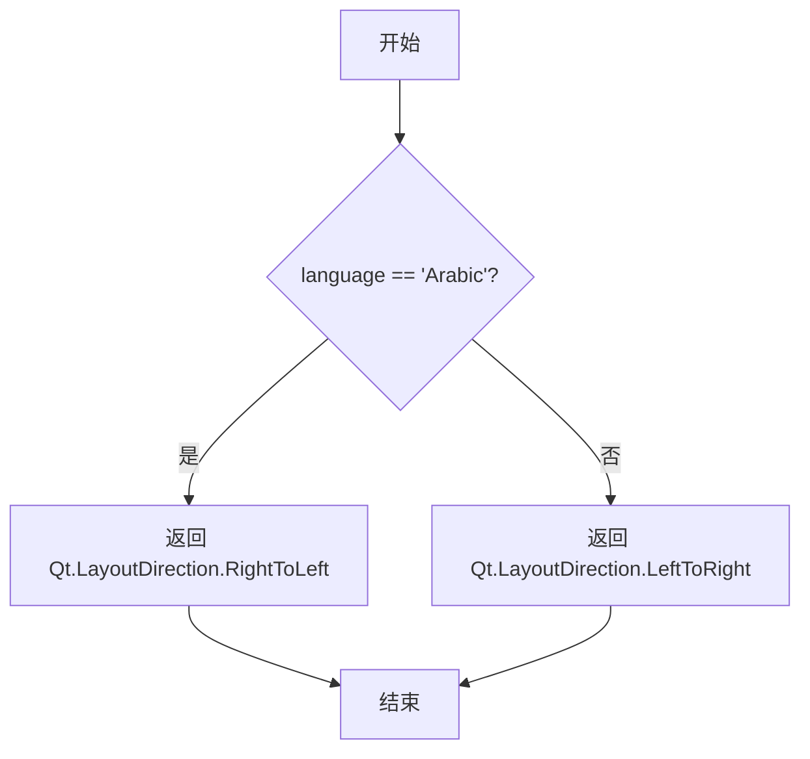
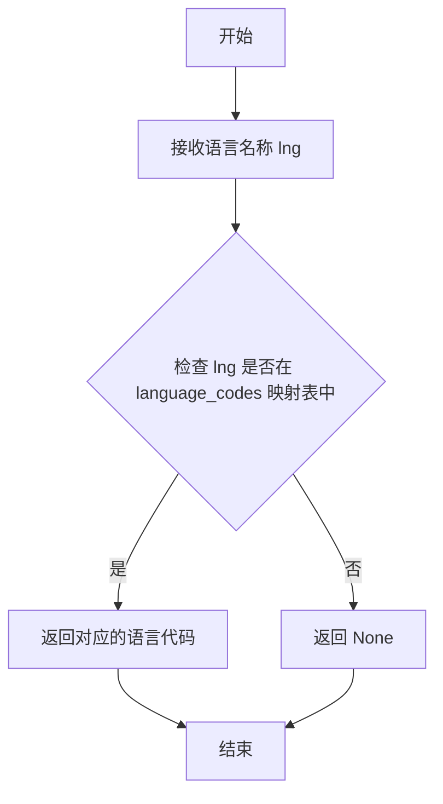
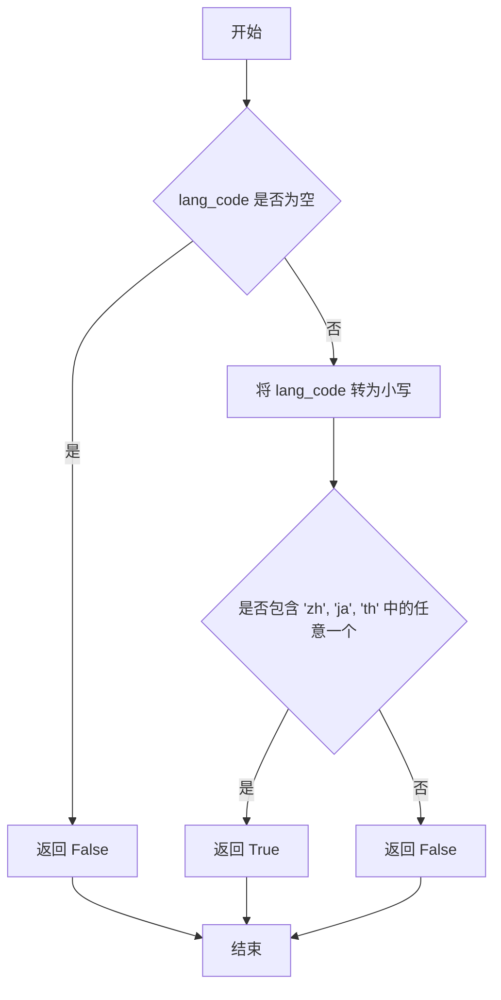

# `comic-translate\modules\utils\language_utils.py` 详细设计文档

一个多语言支持工具模块，提供语言代码映射、布局方向判断和无空格语言检测功能，主要用于支持Qt应用程序的国际化布局和文本处理。

## 整体流程



## 类结构

```
该文件为工具模块，无类定义
├── 全局变量
│   └── language_codes (语言代码映射字典)
└── 全局函数
    ├── get_layout_direction (获取布局方向)
    ├── get_language_code (获取语言代码)
    └── is_no_space_lang (判断是否无空格语言)
```

## 全局变量及字段


### `language_codes`
    
将语言全称映射到对应ISO语言代码的字典，包含30种语言的代码映射

类型：`dict[str, str]`
    


    

## 全局函数及方法


### `get_layout_direction`

根据传入的语言名称判断文本布局方向，如果是阿拉伯语则返回从右到左的布局方向，否则返回从左到右的布局方向。

参数：

- `language`：`str`，语言名称，用于判断布局方向

返回值：`Qt.LayoutDirection`，布局方向（RightToLeft 或 LeftToRight）

#### 流程图



#### 带注释源码

```python
def get_layout_direction(language: str) -> Qt.LayoutDirection:
    """
    根据语言名称返回对应的布局方向。
    
    参数:
        language: str，语言名称，如 'Arabic', 'English' 等
        
    返回值:
        Qt.LayoutDirection，如果是阿拉伯语则返回 RightToLeft，否则返回 LeftToRight
    """
    # 判断语言是否为阿拉伯语
    # 阿拉伯语使用从右到左的阅读顺序
    return Qt.LayoutDirection.RightToLeft if language == 'Arabic' else Qt.LayoutDirection.LeftToRight
```


### `get_language_code`

根据输入的语言名称字符串，从预定义的语言代码映射表中查找并返回对应的 ISO 语言代码；如果未找到对应语言，则返回 None。

参数：

- `lng`：`str`，输入的语言名称，例如 "Korean"、"Japanese"、"Chinese" 等

返回值：`str | None`，返回对应的语言代码（如 "ko"、"ja"、"zh"），如果语言名称不存在于映射表中则返回 `None`

#### 流程图



#### 带注释源码

```python
def get_language_code(lng: str):
    """
    根据语言名称获取对应的语言代码。
    
    参数:
        lng (str): 语言名称，如 "Korean", "Japanese", "Chinese" 等
        
    返回:
        str | None: 对应的语言代码，如 "ko", "ja", "zh" 等；
                    如果未找到对应语言则返回 None
    """
    # 使用字典的 get 方法安全获取值，若键不存在返回 None
    lng_cd = language_codes.get(lng, None)
    return lng_cd
```


### `is_no_space_lang`

检查给定的语言代码是否属于通常不在单词之间使用空格的语言（如中文、日语、泰语等）。

参数：

- `lang_code`：`str | None`，语言代码字符串，例如 "zh"、"ja"、"th" 等

返回值：`bool`，如果该语言通常不使用空格则返回 `True`，否则返回 `False`

#### 流程图



#### 带注释源码

```python
def is_no_space_lang(lang_code: str | None) -> bool:
    """
    Check if the language usually does not use spaces between words.
    Includes: Chinese (zh), Japanese (ja), Thai (th).
    
    Args:
        lang_code: Language code string (e.g., "zh", "ja", "th")
        
    Returns:
        True if the language typically doesn't use spaces between words,
        False otherwise.
    """
    # 如果语言代码为空或None，直接返回False
    if not lang_code:
        return False
    
    # 将语言代码转换为小写进行不区分大小写的比较
    code = lang_code.lower()
    
    # 检查语言代码中是否包含无需空格的语言代码
    # 包含：中文(zh)、日文(ja)、泰文(th)
    return any(lang in code for lang in ['zh', 'ja', 'th'])
```

## 关键组件


### language_codes

一个字典，映射语言名称到ISO语言代码，用于支持多语言的本地化处理。

### get_layout_direction

根据语言返回Qt的布局方向，阿拉伯语返回从右到左，其他语言返回从左到右。

### get_language_code

根据语言名称查找对应的ISO语言代码，如果未找到则返回None。

### is_no_space_lang

检查给定的语言代码是否属于不使用空格分隔词汇的语言（如中文、日文、泰文）。


## 问题及建议


### 已知问题

-   **硬编码语言映射**: `language_codes` 字典完全硬编码，扩展性差，添加新语言需要修改源码
-   **RTL语言判断不完整**: `get_layout_direction` 仅支持 Arabic 一个从右到左语言，遗漏了 Hebrew、Persian、Urdu 等其他 RTL 语言
-   **Magic String 重复**: "Arabic" 字符串在 `language_codes` 字典和 `get_layout_direction` 函数中重复出现，未提取为常量
-   **类型注解缺失**: `get_language_code` 函数缺少返回类型注解 (`-> str | None`)
-   **语言代码大小写不一致**: 字典中部分代码使用小写 (`zh`, `ja`)，部分使用混合大小写 (`pt-br`)，可能导致跨平台或外部系统对接时的行为不一致
-   **非空格语言判断逻辑不够严谨**: `is_no_space_lang` 使用字符串包含判断 (`lang in code`)，会导致 "zh" 错误匹配 "uz"（乌兹别克语）等以 "zh" 开头的语言代码

### 优化建议

-   将语言代码映射改为配置文件或从外部源加载，提高可维护性
-   提取 RTL 语言列表为常量或配置文件，`get_layout_direction` 函数应支持所有 RTL 语言（Arabic, Hebrew, Persian, Urdu 等）
-   使用枚举或常量类定义语言名称常量，避免 Magic String
-   为 `get_language_code` 添加返回类型注解: `-> str | None`
-   统一语言代码的大小写格式，建议全部使用小写（如 `pt-br` 改为 `ptbr` 或统一使用 ISO 标准）
-   改进非空格语言判断逻辑，使用精确匹配或正则表达式: `re.match(r'^(zh|ja|th)', code)`
-   考虑将 `language_codes` 字典反向构建一个代码到语言名的映射，便于双向查询
-   添加类型检查工具的配置，确保类型注解的完整性


## 其它


### 设计目标与约束

本模块的设计目标是提供多语言支持的工具函数，包括语言代码映射、布局方向判断和无空格语言检测。约束条件包括：依赖PySide6的Qt模块，仅支持Python 3.8+（因为使用了类型联合语法str | None），语言代码映射表中的语言为有限集合。

### 错误处理与异常设计

本模块采用保守的错误处理策略：get_language_code函数在找不到对应语言时返回None而不是抛出异常；is_no_space_lang函数在lang_code为None或空字符串时返回False；get_layout_direction函数仅处理Arabic语言为RTL，其他语言默认LTR。模块不主动抛出业务异常，所有错误通过返回值处理。

### 数据流与状态机

数据流方向：输入语言名称（如"Arabic"）→ get_language_code查询映射表 → 返回语言代码（如"ar"） → is_no_space_lang或get_layout_direction根据代码执行相应逻辑。无状态机设计，所有函数均为无状态纯函数。

### 外部依赖与接口契约

外部依赖：PySide6.QtCore.Qt模块（提供LayoutDirection枚举值）。接口契约：get_language_code接受字符串语言名返回字符串或None；get_layout_direction接受字符串返回Qt.LayoutDirection枚举值；is_no_space_lang接受字符串或None返回布尔值。所有函数均为同步函数，无异步调用。

### 性能考虑

language_codes字典在模块加载时一次性创建，查询操作时间复杂度为O(1)。is_no_space_lang函数使用any()进行子串匹配，可能存在多次字符串比较，但在语言代码场景下数据量极小，性能可忽略。模块无缓存机制设计。

### 安全性考虑

本模块不涉及用户输入处理、网络请求或文件操作，安全性风险较低。但需注意：get_language_code和is_no_space_lang未对输入进行严格校验，建议在调用方进行输入验证防止注入攻击。

### 配置管理

语言代码映射表（language_codes字典）硬编码在模块中，缺乏外部配置化能力。如需扩展支持更多语言，需要修改源码。未来可考虑将映射表提取为配置文件或数据库表。

### 版本兼容性

代码使用了Python 3.10+的类型联合语法（str | None），需确保运行环境的Python版本不低于3.10。若需兼容更低版本Python，需将参数类型注解改为Optional[str]写法。

### 测试策略建议

建议编写单元测试覆盖以下场景：正常语言名称映射、未知语言处理、None/空字符串输入处理、阿拉伯语RTL判断、中日泰语无空格判断、其他LTR语言判断。测试用例应包含边界条件和异常输入。

    