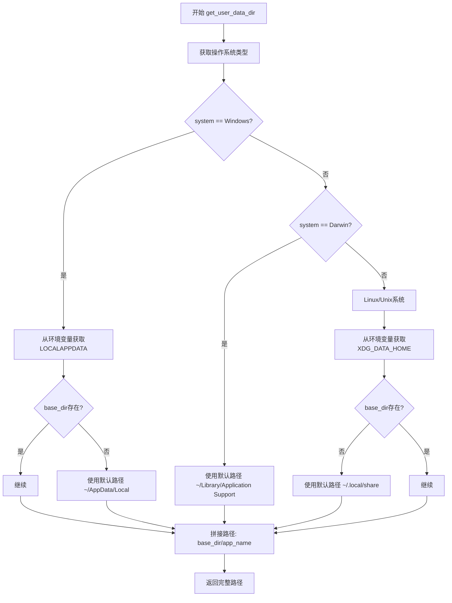

# `comic-translate\modules\utils\paths.py` 详细设计文档

一个跨平台的用户数据目录获取工具函数，根据当前操作系统（Windows/macOS/Linux）返回对应的应用数据存储路径，支持自定义应用名称，默认值为ComicTranslate。

## 整体流程



## 类结构

```
无类结构（纯函数模块）
```

## 全局变量及字段


### `system`
    
操作系统类型标识，通过platform.system()获取

类型：`str`
    


### `base_dir`
    
基础数据目录路径，根据不同操作系统计算

类型：`str`
    


### `app_name`
    
应用名称参数，默认为ComicTranslate

类型：`str`
    


    

## 全局函数及方法


### `get_user_data_dir`

该函数用于获取不同操作系统下的用户数据存储目录，根据当前运行平台（Windows/macOS/Linux）返回对应的应用数据存放路径，默认应用于 ComicTranslate 项目。

参数：

- `app_name`：`str`，应用程序名称，默认为 "ComicTranslate"，用于构建最终目录路径

返回值：`str`，返回平台特定的用户数据目录路径

#### 流程图

```mermaid
flowchart TD
    A([开始]) --> B[获取平台系统类型 platform.system()]
    B --> C{系统类型判断}
    C -->|Windows| D[获取 LOCALAPPDATA 环境变量]
    D --> E{base_dir 是否有值?}
    E -->|是| F[base_dir = LOCALAPPDATA]
    E -->|否| G[base_dir = ~/AppData/Local]
    G --> H[base_dir + app_name 拼接路径]
    C -->|Darwin| I[base_dir = ~/Library/Application Support]
    I --> H
    C -->|其他| J[获取 XDG_DATA_HOME 环境变量]
    J --> K{base_dir 是否有值?}
    K -->|是| L[base_dir = XDG_DATA_HOME]
    K -->|否| M[base_dir = ~/.local/share]
    M --> L
    L --> H
    H --> N([返回最终路径])
```

#### 带注释源码

```python
import os
import platform

def get_user_data_dir(app_name: str = "ComicTranslate") -> str:
    """
    Returns the platform-specific user data directory for the application.
    
    Windows: %LOCALAPPDATA%/<app_name>
    macOS: ~/Library/Application Support/<app_name>
    Linux: $XDG_DATA_HOME/<app_name> or ~/.local/share/<app_name>
    """
    # 获取当前操作系统类型: Windows -> "Windows", macOS -> "Darwin", Linux -> "Linux"
    system = platform.system()
    
    if system == "Windows":
        # Windows 平台：优先使用 LOCALAPPDATA 环境变量
        base_dir = os.getenv('LOCALAPPDATA')
        # 如果环境变量不存在， fallback 到用户主目录下的 AppData/Local
        if not base_dir:
            base_dir = os.path.join(os.path.expanduser("~"), "AppData", "Local")
    elif system == "Darwin":
        # macOS 平台：使用 ~/Library/Application Support 目录
        base_dir = os.path.join(os.path.expanduser("~"), "Library", "Application Support")
    else:
        # Linux/Unix 平台：优先使用 XDG_DATA_HOME 环境变量
        base_dir = os.getenv('XDG_DATA_HOME')
        # 如果环境变量不存在， fallback 到 ~/.local/share
        if not base_dir:
            base_dir = os.path.join(os.path.expanduser("~"), ".local", "share")
            
    # 拼接基础目录与应用名称，返回完整路径
    return os.path.join(base_dir, app_name)
```

---

## 文档扩展

### 整体运行流程

该模块为单函数模块，导入时仅加载函数定义。调用时获取当前系统平台，根据平台差异选择不同的用户数据目录规范，最终拼接应用名称返回完整路径。流程简洁，无外部依赖副作用。

### 关键组件信息

| 组件名称 | 描述 |
|---------|------|
| `platform.system()` | 获取当前操作系统名称，用于平台判断 |
| `os.getenv()` | 获取环境变量值（LOCALAPPDATA、XDG_DATA_HOME） |
| `os.path.expanduser()` | 展开用户主目录路径 ~ |
| `os.path.join()` | 跨平台路径拼接，避免硬编码分隔符 |

### 潜在技术债务与优化空间

1. **缺少目录创建逻辑**：函数仅返回路径，未检查或创建目录，实际使用时需额外处理
2. **异常处理缺失**：若环境变量读取失败或路径权限问题，函数会抛出异常
3. **硬编码默认值**：`app_name` 默认值为 "ComicTranslate"，若改为通用库应支持无默认值或配置注入
4. **多平台覆盖不全**：未覆盖 FreeBSD、Solaris 等类 Unix 系统，默认走 Linux 分支可能不符合预期
5. **单元测试缺失**：建议添加跨平台路径返回值的测试用例

### 设计目标与约束

- **目标**：提供跨平台统一的应用数据存储目录，符合各平台规范
- **约束**：
  - Windows 遵循 %LOCALAPPDATA% 规范
  - macOS 遵循 ~/Library/Application Support 规范
  - Linux 遵循 XDG Base Directory 规范

### 错误处理与异常设计

- 当前实现无 try-except 包装
- 建议在调用处处理 `OSError`（路径权限问题）和 `KeyError`（罕见的环境变量异常）

### 外部依赖与接口契约

- 依赖标准库 `os`、`platform`，无第三方依赖
- 接口契约：输入有效字符串，返回绝对路径字符串

## 关键组件


### 平台检测模块

使用 `platform.system()` 获取当前操作系统类型，根据返回值（"Windows"、"Darwin"、其他）确定用户数据目录的获取策略。这是跨平台路径适配的核心基础。

### Windows 路径解析

从环境变量 `%LOCALAPPDATA%` 获取基础目录，若未设置则回退到 `~/AppData/Local`。这是 Windows 平台应用程序数据存储的标准位置。

### macOS 路径解析

使用 `~/Library/Application Support` 作为基础目录，这是 macOS 平台应用程序数据存储的约定位置。

### Linux 路径解析

优先使用 `$XDG_DATA_HOME` 环境变量，若未设置则回退到 `~/.local/share`，符合 XDG Base Directory 规范。

### 路径拼接模块

使用 `os.path.join()` 将基础目录与应用名称组合，生成完整的用户数据目录路径。确保路径分隔符的正确性。


## 问题及建议


### 已知问题

- **路径遍历风险**：未对 `app_name` 参数进行校验，若传入包含路径分隔符或特殊字符的名称（如 `../../../etc`），可能导致目录遍历漏洞
- **空值处理不完整**：Linux 分支中若 `os.getenv('XDG_DATA_HOME')` 和 `os.path.expanduser("~")` 均失败，`base_dir` 可能为 None，导致后续 `os.path.join` 异常
- **平台判断不够健壮**：`platform.system()` 在某些特殊环境（如 BSD 系列）可能返回非标准值，当前逻辑会将其错误归类为 Linux
- **目录不存在**：函数仅返回路径字符串，不创建目录，使用者需自行处理目录创建逻辑
- **硬编码默认值**：默认应用名称 `"ComicTranslate"` 硬编码在函数签名中，缺乏灵活性

### 优化建议

- 添加 `app_name` 参数校验，拒绝包含非法字符的名称，防止路径注入
- 对 `base_dir` 增加非空断言或默认值回退机制，提升异常环境下的鲁棒性
- 考虑使用 `pathlib.Path` 替代 `os.path` 以获得更现代的路径操作 API
- 提供可选参数支持目录自动创建，或在文档中明确说明调用方需负责目录创建
- 将默认应用名称提取为常量或配置项，提升可维护性

## 其它


### 设计目标与约束

1. **核心目标**：提供跨平台统一的应用数据存储目录获取接口，遵循各操作系统的标准约定
2. **兼容性约束**：支持Windows、macOS、Linux三大主流桌面操作系统
3. **默认行为**：未指定app_name时使用"ComicTranslate"作为默认应用目录名
4. **标准遵循**：
   - Windows：遵循%LOCALAPPDATA%标准
   - macOS：遵循~/Library/Application Support规范
   - Linux：遵循XDG基本目录规范，优先使用$XDG_DATA_HOME

### 错误处理与异常设计

1. **环境变量缺失**：
   - Windows：LOCALAPPDATA未设置时降级到~\AppData\Local
   - Linux：XDG_DATA_HOME未设置时降级到~/.local/share
2. **潜在异常**：
   - os.path.expanduser()在某些特殊用户环境下可能失败
   - 路径拼接在超长路径情况下可能触发OSError
3. **当前处理方式**：采用降级策略而非抛出异常，保证函数总返回有效路径

### 数据流与状态机

1. **数据流**：
   - 输入：app_name (str，默认"ComicTranslate")
   - 处理流程：平台检测 → 环境变量获取 → 路径拼接
   - 输出：完整路径字符串 (str)
2. **状态机**：该函数为纯函数，无状态机概念
3. **平台分支**：
   - Windows分支：检测system=="Windows"
   - macOS分支：检测system=="Darwin"
   - Linux/Unix分支：其他所有情况

### 外部依赖与接口契约

1. **依赖模块**：
   - os：环境变量获取、路径操作
   - platform：操作系统检测
2. **接口契约**：
   - 输入：app_name: str = "ComicTranslate"
   - 输出：str (绝对路径)
   - 异常：不抛出异常，保证返回有效路径
3. **兼容性**：Python 3.6+（使用类型注解）

### 安全性考虑

1. **路径注入风险**：app_name参数未做校验，恶意输入可能导致路径遍历
2. **建议**：添加app_name合法性校验，禁止包含路径分隔符或特殊字符

### 性能特征

1. **时间复杂度**：O(1)，仅包含常数次函数调用和条件判断
2. **空间复杂度**：O(1)，仅使用固定数量局部变量

### 可测试性

1. **测试场景**：
   - Mock platform.system()测试各平台分支
   - Mock os.getenv()测试环境变量缺失场景
   - 测试默认app_name和非默认app_name
2. **建议**：补充单元测试覆盖三个平台分支和降级逻辑

### 版本兼容性

1. **Python版本**：3.6+（支持类型注解）
2. **依赖兼容性**：仅使用Python标准库，无第三方依赖

### 国际化/本地化

1. **说明**：该函数不涉及用户可见文本，无国际化需求
2. **路径编码**：依赖操作系统默认编码，建议确保系统使用UTF-8编码

### 配置与扩展性

1. **扩展性**：
   - 可轻松添加新平台支持（如FreeBSD）
   - 可通过参数扩展更多降级策略
2. **配置化**：当前hardcoded，可考虑提取平台路径映射配置


    