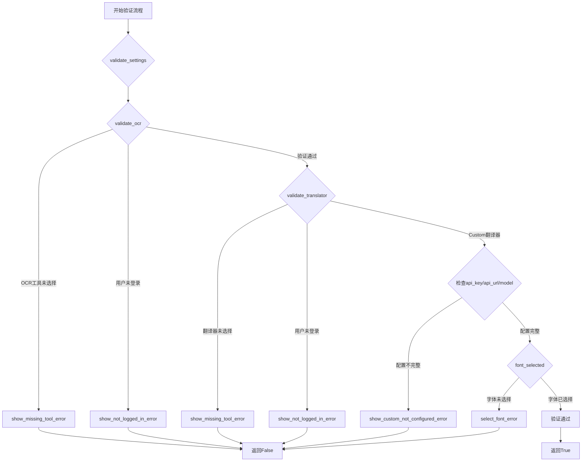
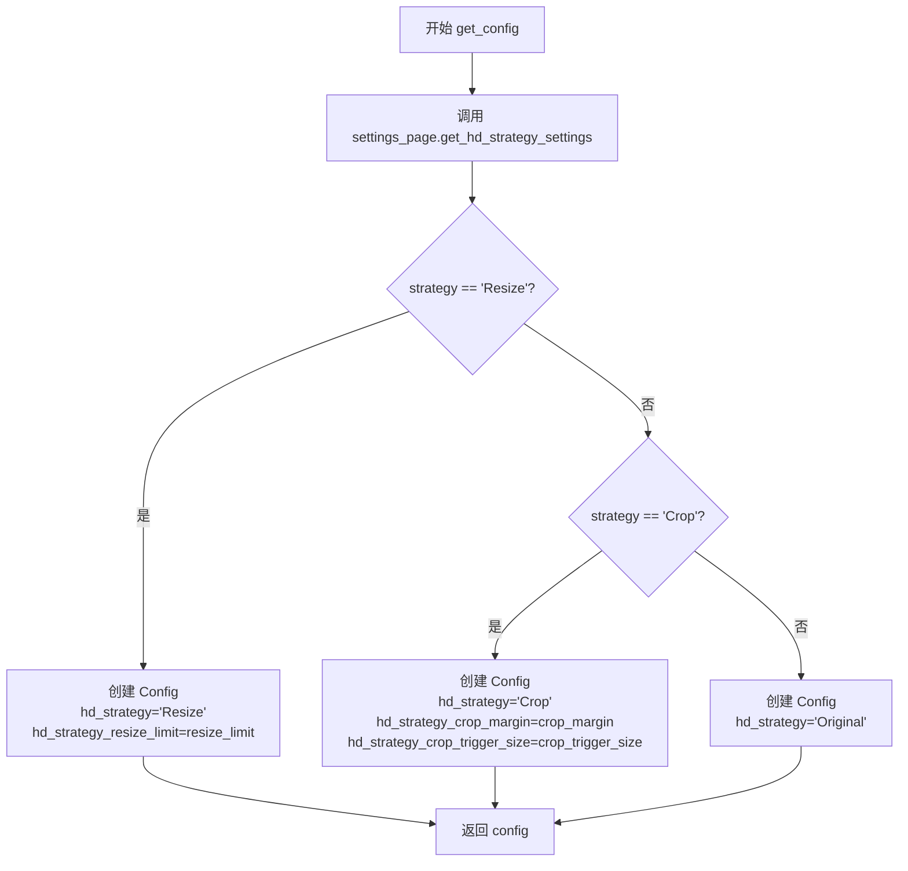
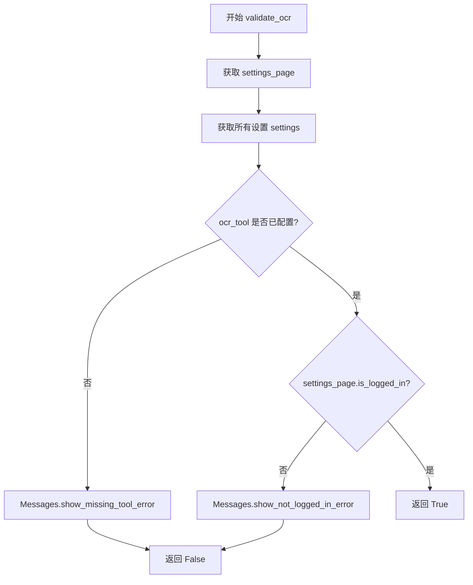
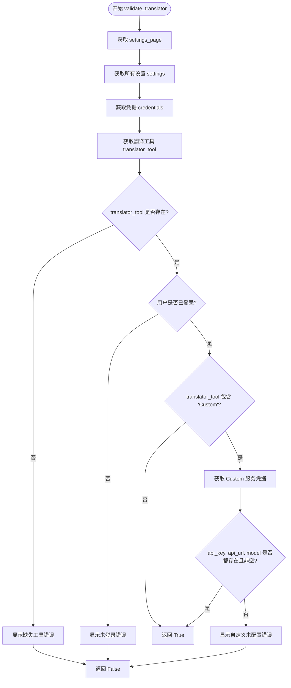
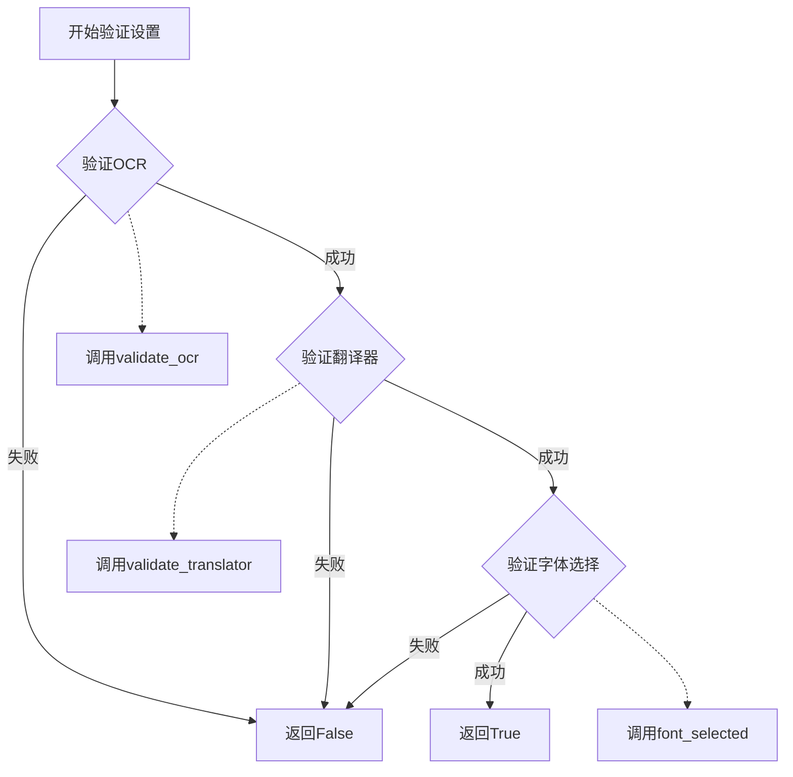

# `comic-translate\modules\utils\pipeline_config.py` 详细设计文档

该代码是漫画翻译应用的核心验证模块，提供图像修复策略配置、OCR工具验证、翻译器认证检查和字体选择验证等功能，确保应用运行前各组件正确配置。

## 整体流程



## 类结构

```
validation (验证模块)
├── inpaint_map (图像修复方法映射)
├── get_config (配置生成函数)
├── validate_ocr (OCR验证函数)
├── validate_translator (翻译器验证函数)
├── font_selected (字体选择验证函数)
└── validate_settings (综合验证函数)
```

## 全局变量及字段


### `inpaint_map`
    
将图像修复模型名称映射到对应类对象的字典，用于动态实例化不同的修复模型

类型：`dict[str, type]`
    


    

## 全局函数及方法


### `get_config`

该函数是一个全局工具函数，用于根据设置页面（SettingsPage）中的高清（HD）策略设置，动态构建并返回一个 `Config` 配置对象。它支持三种策略模式："Resize"（调整大小）、"Crop"（裁剪）和"Original"（原始），并根据所选策略提取相应的参数值。

参数：

- `settings_page`：`SettingsPage`，包含用户界面设置和策略参数的页面对象，通过调用其 `get_hd_strategy_settings()` 方法获取高清策略配置

返回值：`Config`，根据策略设置构建的配置对象，包含高清策略类型及相关参数（resize_limit、crop_margin、crop_trigger_size 等）

#### 流程图



#### 带注释源码

```python
def get_config(settings_page: SettingsPage):
    """
    根据设置页面的高清策略设置生成配置对象。
    
    参数:
        settings_page: SettingsPage - 包含UI设置和策略参数的页面对象
        
    返回:
        Config - 根据策略类型配置的高清策略配置对象
    """
    # 从设置页面获取高清策略相关设置字典
    # 包含 strategy, resize_limit, crop_margin, crop_trigger_size 等键
    strategy_settings = settings_page.get_hd_strategy_settings()
    
    # 判断策略类型：Resize（调整大小策略）
    if strategy_settings['strategy'] == settings_page.ui.tr("Resize"):
        # 构建包含调整大小策略的配置对象
        # hd_strategy_resize_limit 控制图像调整大小的像素限制阈值
        config = Config(
            hd_strategy="Resize", 
            hd_strategy_resize_limit = strategy_settings['resize_limit']
        )
    # 判断策略类型：Crop（裁剪策略）
    elif strategy_settings['strategy'] == settings_page.ui.tr("Crop"):
        # 构建包含裁剪策略的配置对象
        # hd_strategy_crop_margin 控制裁剪边缘 margin 值
        # hd_strategy_crop_trigger_size 控制触发裁剪的图像尺寸阈值
        config = Config(
            hd_strategy="Crop", 
            hd_strategy_crop_margin = strategy_settings['crop_margin'],
            hd_strategy_crop_trigger_size = strategy_settings['crop_trigger_size']
        )
    # 默认策略：Original（保持原始尺寸，不进行任何处理）
    else:
        config = Config(hd_strategy="Original")

    # 返回构建好的配置对象，供后续模块使用
    return config
```


### `validate_ocr`

该函数用于验证 OCR 工具是否已正确配置且用户已登录，确保文本识别功能可以正常运行。

参数：

- `main`：`ComicTranslate`，主控制器实例，用于访问设置页面和显示错误消息

返回值：`bool`，验证成功返回 `True`，否则返回 `False`

#### 流程图



#### 带注释源码

```python
def validate_ocr(main: ComicTranslate):
    """Ensure either API credentials are set or the user is authenticated."""
    # 从主控制器获取设置页面实例
    settings_page = main.settings_page
    # 获取翻译函数（此处未使用，但保留以便后续扩展）
    tr = settings_page.ui.tr
    # 获取所有应用程序设置
    settings = settings_page.get_all_settings()
    # 获取凭据信息（此处未使用，但保留以便后续扩展）
    credentials = settings.get('credentials', {})
    # 获取OCR工具配置
    ocr_tool = settings['tools']['ocr']

    # 检查OCR工具是否已选择/配置
    if not ocr_tool:
        # 如果未配置，显示缺少工具错误消息
        Messages.show_missing_tool_error(main, QCoreApplication.translate("Messages", "Text Recognition model"))
        return False
    
    # 检查用户是否已登录
    if not settings_page.is_logged_in():
        # 如果未登录，显示未登录错误消息
        Messages.show_not_logged_in_error(main)
        return False
        
    # 所有验证通过，返回True
    return True
```


### `validate_translator`

确保翻译工具已选择、用户已登录，并且如果使用自定义翻译服务，则验证必要的凭据（api_key、api_url、model）是否已配置。

参数：

- `main`：`ComicTranslate`，ComicTranslate 实例，包含应用主窗口和设置页面
- `target_lang`：`str`，目标语言标识符（当前函数中未使用，保留用于未来扩展）

返回值：`bool`，验证成功返回 True，验证失败返回 False

#### 流程图



#### 带注释源码

```python
def validate_translator(main: ComicTranslate, target_lang: str):
    """
    确保翻译工具已选择、用户已登录，
    并且如果使用自定义翻译服务，则验证必要的凭据是否已配置。
    
    参数:
        main: ComicTranslate 实例，包含应用主窗口和设置页面
        target_lang: str，目标语言标识符（当前未使用，保留扩展）
    
    返回:
        bool: 验证成功返回 True，验证失败返回 False
    """
    # 从主控制器获取设置页面
    settings_page = main.settings_page
    # 获取翻译函数（用于本地化字符串）
    tr = settings_page.ui.tr
    # 获取所有应用设置
    settings = settings_page.get_all_settings()
    # 从设置中提取凭据字典
    credentials = settings.get('credentials', {})
    # 获取用户选择的翻译工具名称
    translator_tool = settings['tools']['translator']

    # 检查翻译工具是否已选择
    if not translator_tool:
        # 显示缺失工具错误消息
        Messages.show_missing_tool_error(main, QCoreApplication.translate("Messages", "Translator"))
        return False

    # 检查用户是否已登录（API 使用权限）
    if not settings_page.is_logged_in():
        # 显示未登录错误消息
        Messages.show_not_logged_in_error(main)
        return False

    # 额外凭据检查：针对自定义翻译服务
    if "Custom" in translator_tool:
        # Custom 需要在本地配置 api_key, api_url, 和 model
        service = tr('Custom')
        # 获取 Custom 服务的凭据
        creds = credentials.get(service, {})
        # 检查所有必填字段是否存在且非空
        if not all([creds.get('api_key'), creds.get('api_url'), creds.get('model')]):
            # 显示自定义服务未配置错误
            Messages.show_custom_not_configured_error(main)
            return False
        # Custom 凭据验证通过
        return True
    
    # 默认验证通过（非自定义翻译工具）
    return True
```


### `font_selected`

该函数用于验证用户是否已经选择了字体。如果用户未选择字体，则显示错误提示并返回 False；否则返回 True，表示字体已选择。

参数：

- `main`：`ComicTranslate`，主控制器实例，用于访问应用程序的主要功能和设置

返回值：`bool`，如果字体已选择则返回 `True`，否则返回 `False`

#### 流程图

```mermaid
flowchart TD
    A[开始 font_selected] --> B{检查 render_settings().font_family 是否存在}
    B -->|不存在| C[调用 Messages.select_font_error 显示错误]
    C --> D[返回 False]
    B -->|存在| E[返回 True]
    D --> F[结束]
    E --> F
```

#### 带注释源码

```python
def font_selected(main: ComicTranslate):
    """
    验证用户是否已选择字体。
    
    检查主控制器中的渲染设置，确认是否已经设置了字体族。
    如果未设置字体，则显示错误提示并返回 False。
    
    参数:
        main: ComicTranslate 实例，代表主应用程序控制器
        
    返回值:
        bool: True 表示字体已选择，False 表示未选择
    """
    # 获取渲染设置，检查 font_family 是否存在
    if not main.render_settings().font_family:
        # 字体未选择，调用错误消息显示函数提示用户
        Messages.select_font_error(main)
        # 返回 False 表示验证失败
        return False
    # 字体已选择，返回 True 表示验证成功
    return True
```


### `validate_settings`

该函数是设置验证的入口函数，用于依次验证OCR工具、翻译器和字体选择是否已正确配置，确保用户在使用应用前完成所有必要的配置。

参数：

- `main`：`ComicTranslate`，主控制器实例，用于访问设置页面和UI组件
- `target_lang`：`str`，目标语言标识符，用于验证翻译器配置

返回值：`bool`，如果所有验证通过返回 `True`，否则返回 `False`

#### 流程图



#### 带注释源码

```
def validate_settings(main: ComicTranslate, target_lang: str):
    """
    验证所有必要的设置是否已正确配置。
    
    验证流程：
    1. OCR工具是否已选择
    2. 翻译器是否已选择且配置正确
    3. 字体是否已选择
    
    参数：
        main: ComicTranslate - 主控制器实例
        target_lang: str - 目标语言
    
    返回：
        bool - 所有验证通过返回True，否则返回False
    """
    
    # 第一步：验证OCR配置
    # 调用validate_ocr函数检查OCR工具是否已选择且用户已登录
    if not validate_ocr(main):
        return False  # OCR验证失败，立即返回False
    
    # 第二步：验证翻译器配置
    # 调用validate_translator函数检查翻译器是否已选择、
    # 登录状态以及自定义翻译器的凭证配置
    if not validate_translator(main, target_lang):
        return False  # 翻译器验证失败，立即返回False
    
    # 第三步：验证字体选择
    # 检查用户是否已选择字体
    if not font_selected(main):
        return False  # 字体未选择，返回False
    
    # 所有验证均通过，返回True
    return True
```

## 关键组件


### InpaintMap (图像修复算法映射)

存储图像修复算法名称与对应类的映射关系，支持动态选择和加载不同的修复模型（LaMa、MI-GAN、AOT）

### Config (配置策略管理)

管理图像处理的高清策略配置，支持三种模式：Resize（调整大小）、Crop（裁剪）和Original（原图），包含相关参数如resize_limit、crop_margin等

### get_config (配置生成函数)

根据设置页面的高清策略设置动态生成Config对象，支持策略切换和参数传递

### validate_ocr (OCR验证模块)

验证文本识别工具是否可用，包括检查OCR工具是否启用、用户是否登录，返回布尔值确保模型可用

### validate_translator (翻译器验证模块)

验证翻译工具配置是否完整，特殊处理自定义翻译器，检查api_key、api_url和model等凭证信息是否齐全

### font_selected (字体验证模块)

检查渲染设置中是否已选择字体，确保文字渲染前字体可用

### validate_settings (综合设置验证)

整合OCR、翻译器和字体的验证流程，按顺序执行各项检查，任一验证失败则返回False，全部通过返回True

### SettingsPage (设置页面接口)

提供获取HD策略设置、全部设置和登录状态的方法，是配置验证的数据来源

### Messages (消息提示模块)

提供缺失工具、未登录、自定义翻译器未配置等错误提示功能


## 问题及建议


### 已知问题

-   **未使用的全局变量**：`inpaint_map` 字典定义后在整个模块中未被引用，造成代码冗余。
-   **未使用的导入和变量**：`tr` 变量在 `validate_ocr`、`validate_translator` 和 `get_config` 中被赋值但从未使用；`credentials` 变量在 `validate_ocr` 中获取后未使用。
-   **硬编码的翻译字符串**：`get_config` 函数中使用 `settings_page.ui.tr("Resize")` 和 `settings_page.ui.tr("Crop")` 进行字符串匹配，这种方式依赖于翻译文本，翻译变化会导致逻辑失效。
-   **魔法字符串**：代码中散落着 "Resize"、"Crop"、"Original"、"Custom" 等硬编码字符串，缺乏统一的常量定义。
-   **代码重复**：`validate_ocr` 和 `validate_translator` 函数存在大量重复逻辑（检查工具可用性、检查登录状态），违反 DRY 原则。
-   **不完整的验证逻辑**：`validate_translator` 函数中，当 `translator_tool` 不是 "Custom" 时直接返回 `True`，缺少对其他场景的验证。
-   **紧耦合的错误处理**：依赖 `Messages` 类的静态方法进行错误提示，导致错误处理逻辑难以单元测试和复用。
-   **类型注解在运行时失效**：`ComicTranslate` 类型仅在 `TYPE_CHECKING` 块中导入，运行时无实际类型检查，IDE 智能提示受限。

### 优化建议

-   **移除未使用代码**：删除 `inpaint_map` 字典（若确实不需要），清理未使用的 `tr` 和 `credentials` 变量。
-   **提取公共验证逻辑**：将 `validate_ocr` 和 `validate_translator` 中的公共部分（检查工具、检查登录）抽取为独立的辅助函数。
-   **使用枚举或常量类**：创建 `HdStrategy` 枚举类定义 "Resize"、"Crop"、"Original"，创建 `TranslatorType` 常量类定义 "Custom" 等值。
-   **改进配置获取逻辑**：`get_config` 中改用枚举或配置对象进行比较，而非依赖翻译后的字符串。
-   **完善验证逻辑**：补充 `validate_translator` 对非 Custom 类型翻译器的验证逻辑，确保配置完整性。
-   **解耦错误处理**：考虑将错误提示逻辑通过回调或事件系统处理，提高可测试性。
-   **添加运行时类型支持**：若需要更强的类型保障，可使用 `typing_extensions` 或将类型注解改为条件导入（但需权衡性能）。


## 其它


### 设计目标与约束

本代码模块的核心设计目标是提供图像修复(inpainting)模块的配置管理与多层次设置验证机制。主要约束包括：支持三种图像修复算法(LaMa、MI-GAN、AOT)的动态选择；支持三种高清策略(Resize、Crop、Original)的配置；确保OCR工具、翻译器服务、字体配置在使用前已完成正确设置；自定义翻译服务需要完整的本地配置(api_key、api_url、model)。

### 错误处理与异常设计

代码采用错误消息展示与布尔返回值相结合的验证模式。当验证失败时，通过Messages类的静态方法显示具体错误信息，包括：缺失工具错误(show_missing_tool_error)、未登录错误(show_not_logged_in_error)、自定义服务未配置错误(show_custom_not_configured_error)、字体未选择错误(select_font_error)。所有验证函数均返回布尔值，调用方根据返回值决定是否终止后续流程。

### 外部依赖与接口契约

本模块依赖以下外部组件：PySide6.QtCore.QCoreApplication用于Qt应用上下文；modules.inpainting包下的LaMa、MIGAN、AOT三个图像修复算法实现类；modules.inpainting.schema.Config配置数据类；app.ui.messages.Messages消息展示类；app.ui.settings.settings_page.SettingsPage设置页面类；controller.ComicTranslate主控制器类(类型检查用)。其中SettingsPage需提供get_hd_strategy_settings()、get_all_settings()、is_logged_in()、render_settings()等方法；Messages类需提供多个静态错误展示方法。

### 数据流与状态机

数据流向为：SettingsPage → get_config() → Config对象；SettingsPage → validate_ocr/validate_translator/font_selected → 布尔验证结果。验证状态机流程为：validate_settings首先调用validate_ocr检查文字识别工具，若失败则直接返回False；若成功则调用validate_translator检查翻译器配置；若成功则调用font_selected检查字体选择；全部通过返回True。

### 安全性考虑

代码对敏感凭证进行存在性检查。对于自定义翻译服务，验证api_key、api_url、model三个字段均已配置且非空。credentials字典的访问使用.get()方法避免KeyError异常。is_logged_in()方法隐含了用户认证状态的检查。

### 配置参数映射关系

inpaint_map字典建立算法名称与实现类的映射关系，支持运行时动态选择。get_config函数将SettingsPage中的策略设置转换为Config对象的不同构造参数：Resize策略需要resize_limit参数；Crop策略需要crop_margin和crop_trigger_size参数；Original策略不需要额外参数。


    