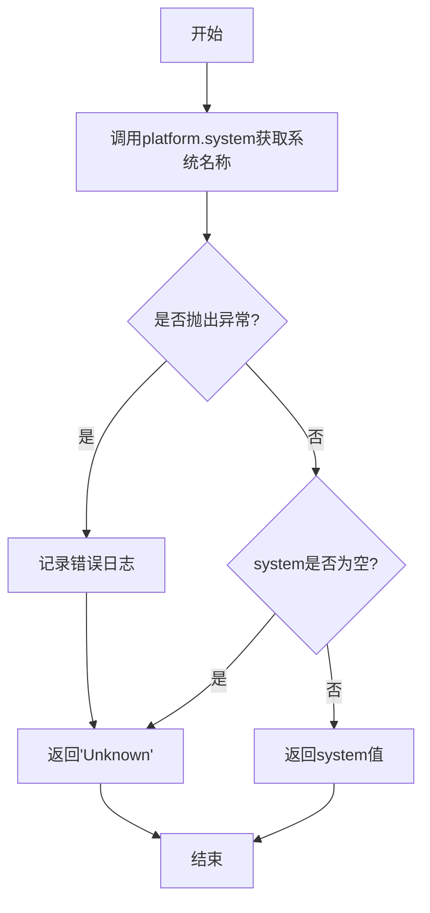
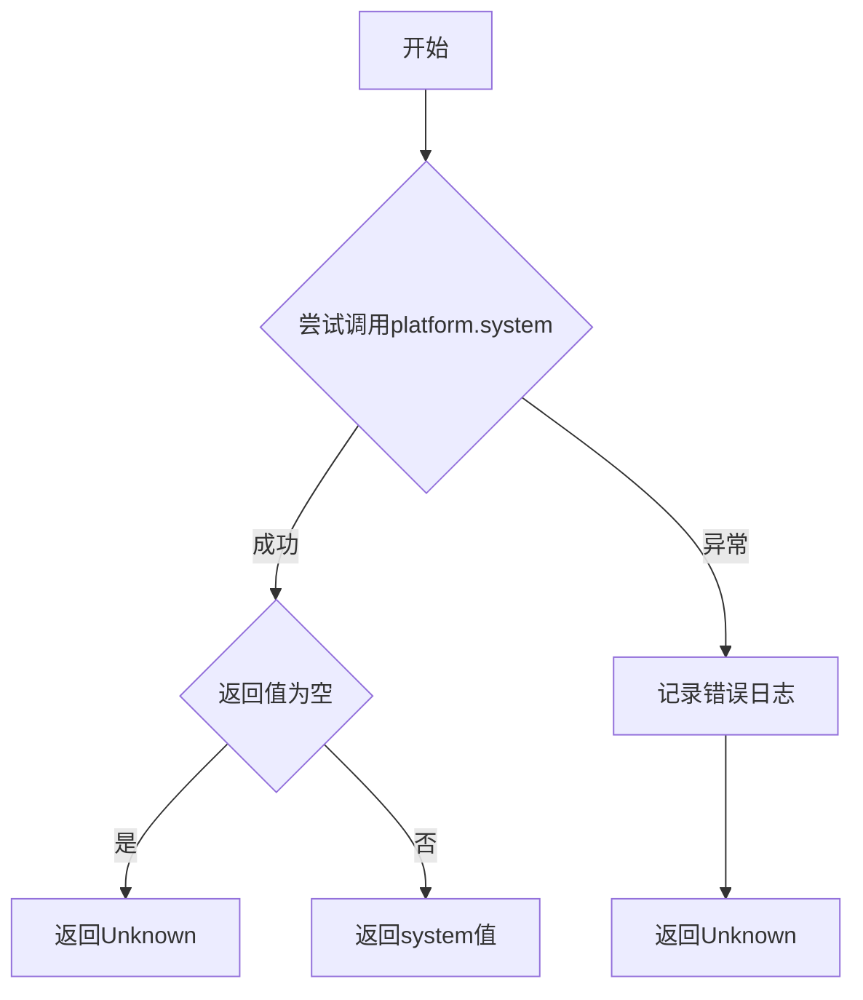

# `comic-translate\modules\utils\platform_utils.py` 详细设计文档

该代码是一个操作系统检测工具模块，通过调用Python标准库platform.system()获取客户端运行的操作系统的名称（如'Windows'、'Darwin'或'Linux'），并在获取失败时返回'Unknown'，同时记录错误日志。

## 整体流程

```mermaid
graph TD
    A[开始] --> B[调用 platform.system()]
    B --> C{捕获异常?}
    C -- 是 --> D[记录错误日志]
    D --> E[返回 'Unknown']
    C -- 否 --> F{system 为空?}
    F -- 是 --> E
    F -- 否 --> G[返回 system 值]
    E --> H[结束]
    G --> H
```

## 类结构

```

```

## 全局变量及字段


### `logger`
    
模块级日志记录器

类型：`logging.Logger`
    


    

## 全局函数及方法


### `get_client_os`

该函数用于检测客户端操作系统名称，通过调用 Python 标准库的 `platform.system()` 方法获取当前运行平台的操作系统标识符（如 'Windows'、'Darwin' 或 'Linux'），并在获取失败或发生异常时返回默认值 "Unknown"。

参数：

- 该函数无参数

返回值：`str`，返回客户端操作系统的名称（如 'Windows'、'Darwin'、'Linux'），若检测失败则返回 "Unknown"

#### 流程图

```mermaid
flowchart TD
    A([开始]) --> B[调用 platform.system 获取系统名称]
    B --> C{系统名称是否为空?}
    C -->|是| D[返回 "Unknown"]
    C -->|否| E[返回系统名称]
    B --> F{是否发生异常?}
    F -->|是| G[记录错误日志]
    G --> H[返回 "Unknown"]
    F -->|否| C
    D --> I([结束])
    E --> I
    H --> I
```

#### 带注释源码

```python
import platform
import logging

# 获取当前模块的日志记录器
logger = logging.getLogger(__name__)

def get_client_os() -> str:
    """
    Returns the operating system name (e.g., 'Windows', 'Darwin' (macOS), 'Linux').
    """
    try:
        # 调用 platform.system() 获取操作系统名称
        # Windows 返回 'Windows', macOS 返回 'Darwin', Linux 返回 'Linux'
        system = platform.system()
        
        # 检查返回值是否为空（防止平台库返回空字符串）
        if not system:
            return "Unknown"
        
        # 返回检测到的操作系统名称
        return system
    except Exception as e:
        # 捕获所有异常并记录错误日志
        logger.error(f"Failed to detect client OS: {e}")
        # 返回默认值 "Unknown"
        return "Unknown"
```

## 关键组件


### 核心功能概述

该代码模块提供了一个跨平台的操作系统检测功能，通过调用Python标准库的`platform.system()`方法获取客户端运行所在的操作系统名称（Windows/Darwin/Linux），并包含基本的异常处理和日志记录机制。

### 文件运行流程

1. 模块导入阶段：加载`platform`和`logging`标准库
2. Logger初始化：创建以模块名为名称的日志记录器
3. 函数调用阶段：当调用`get_client_os()`时，执行系统检测逻辑
4. 异常处理阶段：若发生异常，记录错误日志并返回默认值"Unknown"

### 全局变量和全局函数

#### 全局变量

**logger**
- 类型: `logging.Logger`
- 描述: 模块级日志记录器，用于记录函数执行过程中的错误信息

#### 全局函数

**get_client_os**
- 参数: 无
- 参数类型: 无
- 参数描述: 无
- 返回值类型: `str`
- 返回值描述: 返回操作系统名称字符串，可能值为'Windows'、'Darwin'、'Linux'或'Unknown'



```python
def get_client_os() -> str:
    """
    Returns the operating system name (e.g., 'Windows', 'Darwin' (macOS), 'Linux').
    """
    try:
        system = platform.system()
        if not system:
            return "Unknown"
        return system
    except Exception as e:
        logger.error(f"Failed to detect client OS: {e}")
        return "Unknown"
```

### 关键组件信息

#### platform.system()
系统信息获取组件，调用底层操作系统API返回标准化操作系统名称

#### logging日志系统
错误处理组件，捕获并记录函数执行过程中的异常信息

#### get_client_os函数
核心业务函数，封装操作系统检测逻辑，提供统一的接口返回结果

### 潜在技术债务与优化空间

1. **缺乏单元测试**：没有针对不同操作系统的测试用例覆盖
2. **返回值单一**：异常情况统一返回"Unknown"，无法区分具体失败原因
3. **日志级别单一**：仅使用error级别，缺少warn级别用于业务警告场景
4. **无缓存机制**：每次调用都执行系统检测，高频调用场景存在性能开销

### 其它项目

#### 设计目标与约束
- 目标：提供可靠的跨平台操作系统检测能力
- 约束：依赖Python标准库，无外部依赖

#### 错误处理与异常设计
采用try-except捕获所有Exception类型，确保持续返回有效值而非抛出异常，适用于不可中断的业务流程

#### 外部依赖与接口契约
- 依赖：`platform`、`logging`标准库
- 接口契约：函数无参数输入，返回非空字符串


## 问题及建议


### 已知问题

-   **过度设计的异常处理**：`platform.system()` 是一个非常稳定的系统调用，几乎不会抛出异常，使用 `try-except` 捕获所有异常是过度设计，增加了不必要的性能开销和代码复杂度。
-   **缺乏缓存机制**：函数没有实现缓存，每次调用都会执行 `platform.system()`，在需要频繁获取操作系统信息的场景下会造成重复的系统调用开销。
-   **返回值语义不明确**：函数在两种不同情况下都返回 "Unknown"（`platform.system()` 返回空字符串时和捕获异常时），调用者无法区分这两种情况，导致错误处理逻辑不清晰。
-   **异常类型过于宽泛**：捕获通用的 `Exception` 而不是更具体的异常类型，不利于精确的错误诊断和维护。
-   **缺少缓存装饰器或单例模式**：在复杂应用场景中，可能需要以单例或缓存方式管理操作系统信息，以便在整个应用生命周期内保持一致性。
-   **边界值处理不完善**：代码使用 `if not system` 判断，但 `platform.system()` 理论上可能返回空字符串 "" 而非 `None`，当前逻辑在边界情况下的行为不够明确。

### 优化建议

-   **简化异常处理**：移除不必要的 `try-except`，或者仅在必要时捕获特定异常（如 `OSError`），因为 `platform.system()` 的失败极其罕见。
-   **添加缓存机制**：使用 `@functools.lru_cache` 装饰器或实现单例模式缓存结果，避免重复系统调用。
-   **明确返回值语义**：考虑使用枚举或自定义类型明确区分"正常返回"和"无法检测"的情况，或者返回 `Optional[str]` 并在无法检测时返回 `None`。
-   **添加日志级别选择**：在捕获异常时使用 `logger.warning` 而非 `logger.error`，因为这通常不算严重错误，或者提供更详细的上下文信息。
-   **考虑扩展功能**：添加更多操作系统信息（如版本号、架构等），或提供配置接口以支持模拟测试环境。

## 其它


### 一段话描述

该代码是一个跨平台的操作系统检测模块，通过Python的platform模块获取客户端运行环境的操作系统类型，并返回标准化的操作系统名称字符串（Windows、Darwin、Linux或Unknown）。

### 文件的整体运行流程

该模块导入后，get_client_os()函数可被其他模块调用。当调用发生时，函数首先尝试调用platform.system()获取系统名称，若成功则返回标准化名称；若发生异常则记录错误日志并返回"Unknown"。

### 全局变量信息

| 名称 | 类型 | 描述 |
|------|------|------|
| logger | logging.Logger | 模块级日志记录器，用于记录错误和调试信息 |

### 全局函数信息

#### get_client_os

- **函数名称**: get_client_os
- **参数**: 无
- **返回值类型**: str
- **返回值描述**: 返回操作系统名称字符串，可能值为'Windows'、'Darwin'、'Linux'或'Unknown'
- **mermaid流程图**:



- **带注释源码**:

```python
def get_client_os() -> str:
    """
    Returns the operating system name (e.g., 'Windows', 'Darwin' (macOS), 'Linux').
    """
    try:
        # 调用platform模块获取系统名称
        system = platform.system()
        # 检查返回值是否为空
        if not system:
            return "Unknown"
        # 返回标准化系统名称
        return system
    except Exception as e:
        # 捕获所有异常并记录错误日志
        logger.error(f"Failed to detect client OS: {e}")
        return "Unknown"
```

### 关键组件信息

| 名称 | 描述 |
|------|------|
| platform模块 | Python标准库模块，用于获取平台信息 |
| logging模块 | Python标准库模块，用于日志记录 |

### 潜在的技术债务或优化空间

1. **功能单一性**: 当前仅支持基本的操作系统检测，未来可能需要扩展到版本号检测
2. **异常处理宽泛**: 捕获所有Exception类型，建议更细粒度的异常处理
3. **缺乏缓存机制**: 每次调用都执行系统检测，可考虑添加缓存
4. **返回值标准化**: 返回值未做大小写统一处理，可能存在不一致性
5. **测试覆盖**: 缺少单元测试用例

### 设计目标与约束

- **设计目标**: 提供一个简单、可靠的方式来检测客户端操作系统，为跨平台兼容性判断提供基础支持
- **设计约束**: 
  - 必须使用Python标准库，不引入额外依赖
  - 函数必须是纯函数，无副作用
  - 必须处理所有可能的异常情况，避免程序崩溃

### 错误处理与异常设计

- **异常捕获策略**: 捕获所有Exception类型的异常
- **异常处理方式**: 记录错误日志并返回默认值"Unknown"
- **异常传播**: 不向上传播异常，调用方无需处理
- **日志级别**: 使用error级别记录异常信息，便于问题排查
- **默认值策略**: 任何异常情况都返回"Unknown"，保证函数总是有返回值

### 外部依赖与接口契约

- **依赖模块**:
  - platform: Python标准库，提供system()方法获取操作系统名称
  - logging: Python标准库，提供日志记录功能
- **接口契约**:
  - 函数无参数输入
  - 返回值类型为str
  - 返回值可能的取值:'Windows'、'Darwin'、'Linux'、'Unknown'
  - 函数不抛出异常，总是返回有效值

### 数据流与状态机

- **数据输入**: 无外部数据输入
- **数据处理**: 调用platform.system()获取原始系统名称
- **数据输出**: 返回标准化操作系统名称字符串
- **状态机**: 
  - 正常状态: 成功获取并返回系统名称
  - 空值状态: system()返回空字符串，返回"Unknown"
  - 异常状态: 发生任何异常，记录日志后返回"Unknown"

### 性能考量

- **执行时间**: platform.system()调用开销极小，可忽略
- **资源占用**: 仅使用少量内存存储字符串和logger对象
- **缓存建议**: 对于高频调用场景，可考虑添加lru_cache装饰器缓存结果

### 可测试性设计

- **可测试性**: 高
- **依赖注入**: 未使用依赖注入，但platform和logging可通过monkeypatch模拟
- **测试策略建议**: 
  - 测试不同操作系统返回值
  - 测试空字符串返回值处理
  - 测试异常情况下的返回值和日志记录

### 版本兼容性

- **Python版本**: 兼容Python 3.6+
- **平台支持**: 支持所有主流操作系统（Windows、macOS、Linux）
- **标准库版本**: 无特殊版本要求

### 扩展性建议

1. **添加版本检测**: 增加get_client_os_version()函数获取系统版本
2. **添加架构检测**: 增加get_client_arch()函数获取系统架构
3. **添加缓存机制**: 使用functools.lru_cache装饰器
4. **返回值枚举**: 使用Enum定义可能的返回值，提高类型安全性


    