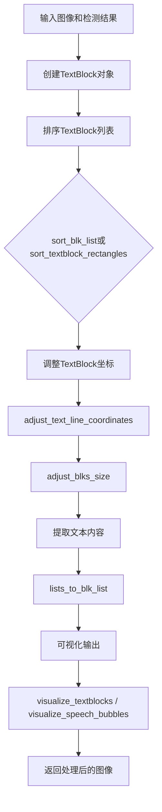
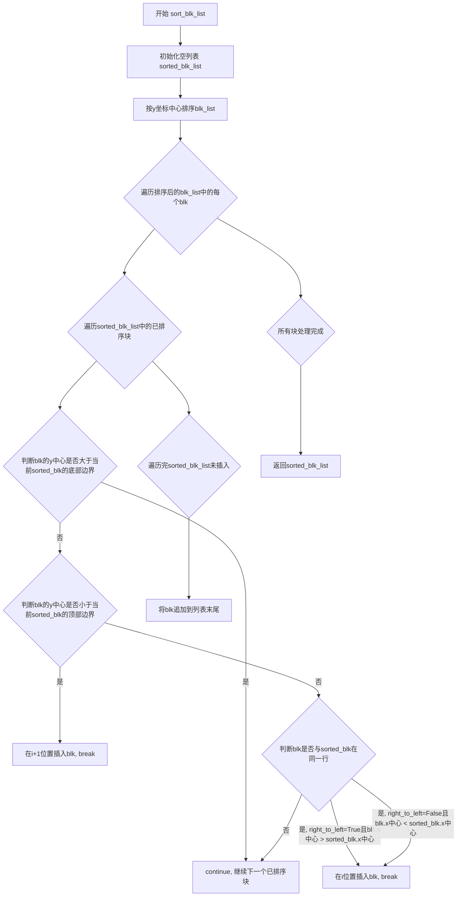
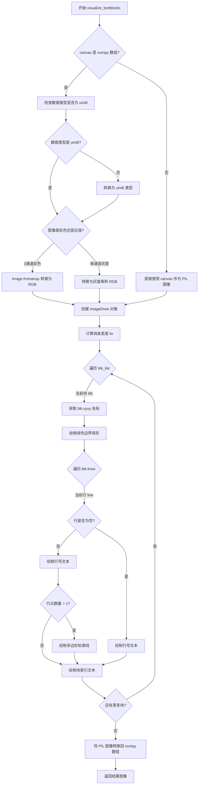
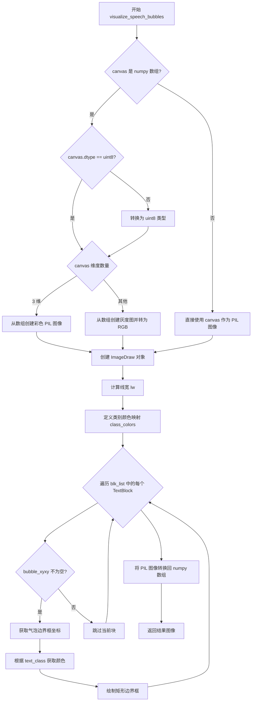
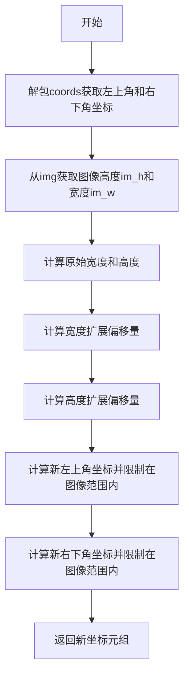
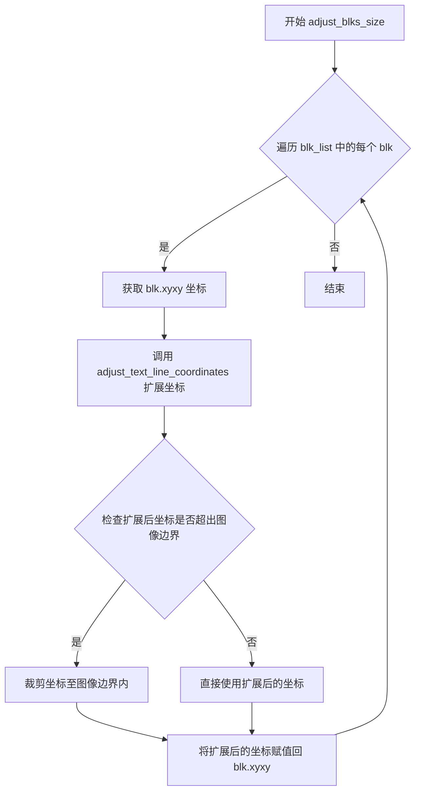
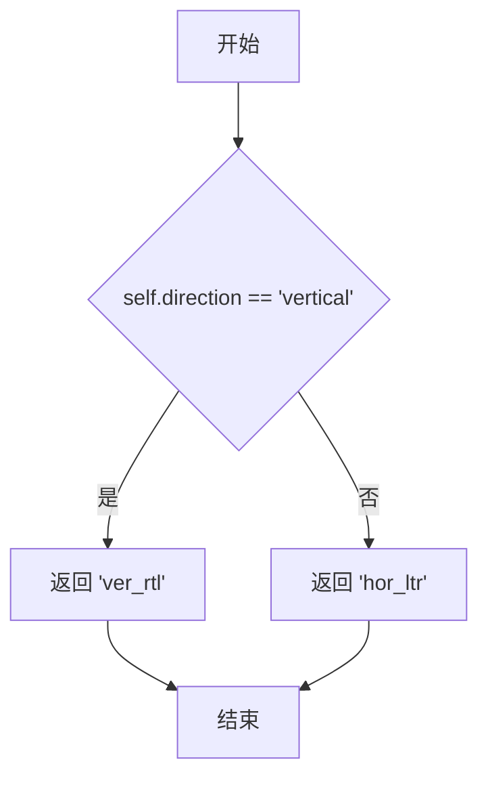
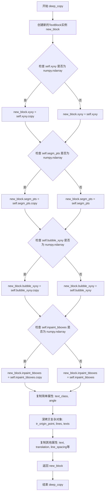

# `comic-translate\modules\utils\textblock.py` 详细设计文档

该代码定义了一个文本块数据结构和相关处理函数，用于文本检测/识别系统中的文本块管理、排序、坐标调整和可视化，支持多语言文本处理和多种阅读方向。

## 整体流程



## 类结构

```
TextBlock (文本块数据类)
├── 属性: xyxy, segm_pts, bubble_xyxy, text_class
├── 属性: angle, tr_origin_point, lines, inpaint_bboxes
├── 属性: texts, text, translation, line_spacing
├── 属性: alignment, source_lang, target_lang
├── 属性: min_font_size, max_font_size, font_color, direction
├── 方法: xywh (property) - 获取xywh格式坐标
├── 方法: center (property) - 获取中心点
├── 方法: source_lang_direction (property) - 获取语言方向
└── 方法: deep_copy() - 深拷贝对象
```

## 全局变量及字段


### `TextBlock.xyxy`
    
文本块边界框坐标，使用(x1, y1, x2, y2)格式存储

类型：`np.ndarray`
    


### `TextBlock.segm_pts`
    
文本分割点坐标，用于文本分割的像素点集合

类型：`np.ndarray`
    


### `TextBlock.bubble_xyxy`
    
气泡框坐标，存储文本气泡的包围盒(x1, y1, x2, y2)

类型：`np.ndarray`
    


### `TextBlock.text_class`
    
文本类别标识，如'text_free'或'text_bubble'

类型：`str`
    


### `TextBlock.angle`
    
文本角度，表示文本块的旋转角度

类型：`int/float`
    


### `TextBlock.tr_origin_point`
    
翻译原点坐标，用于文本翻译时的位置参考

类型：`tuple`
    


### `TextBlock.lines`
    
文本行列表，存储文本块的各行坐标和内容

类型：`List`
    


### `TextBlock.inpaint_bboxes`
    
修复区域边界框，用于图像修复的坐标区域

类型：`np.ndarray`
    


### `TextBlock.texts`
    
文本列表，存储文本块中的多个文本片段

类型：`List[str]`
    


### `TextBlock.text`
    
合并后的文本，将texts列表中的文本用空格或无空格连接

类型：`str`
    


### `TextBlock.translation`
    
翻译文本，存储文本块的翻译结果

类型：`str`
    


### `TextBlock.line_spacing`
    
行间距，控制文本行之间的间距倍数

类型：`float/int`
    


### `TextBlock.alignment`
    
对齐方式，文本的对齐模式如左对齐、居中、右对齐

类型：`str`
    


### `TextBlock.source_lang`
    
源语言，文本块的原始语言代码

类型：`str`
    


### `TextBlock.target_lang`
    
目标语言，翻译目标语言代码

类型：`str`
    


### `TextBlock.min_font_size`
    
最小字体大小，文本块的最小字体尺寸

类型：`int`
    


### `TextBlock.max_font_size`
    
最大字体大小，文本块的最大字体尺寸

类型：`int`
    


### `TextBlock.font_color`
    
字体颜色，RGB格式的字体颜色值

类型：`tuple`
    


### `TextBlock.direction`
    
文本方向，表示文本的流向如水平或垂直

类型：`str`
    
    

## 全局函数及方法


### `sort_blk_list`

该函数对TextBlock列表按阅读顺序进行排序，支持从右到左或从左到右的水平阅读方向，同时保持从上到下的垂直顺序。

参数：

- `blk_list`：`List[TextBlock]`，待排序的TextBlock对象列表
- `right_to_left`：`bool`，控制水平方向的排序方式；True表示从右到左（竖排文本常见），False表示从左到右（横排文本常见），默认为True

返回值：`List[TextBlock]`，返回排序后的TextBlock列表

#### 流程图



#### 带注释源码

```python
def sort_blk_list(blk_list: List[TextBlock], right_to_left=True) -> List[TextBlock]:
    """
    对TextBlock列表按阅读顺序排序（从右到左/从上到下）
    
    排序算法说明：
    1. 首先按y坐标中心对所有块进行初步排序
    2. 然后逐个将块插入到已排序列表中，遵循以下规则：
       - 如果块的y中心在当前已排序块的上方，插入到该块之前
       - 如果块的y中心在当前已排序块的下方，跳过该已排序块
       - 如果块的y中心与当前已排序块在同一水平带内，则按x坐标排序
         （right_to_left=True时x从大到小，False时x从小到大）
    
    参数:
        blk_list: 要排序的TextBlock对象列表
        right_to_left: 水平方向排序标志，True为从右到左，False为从左到右
    
    返回:
        排序后的TextBlock列表
    """
    # 初始化结果列表
    sorted_blk_list = []
    
    # 首先按y坐标中心排序，作为初步排序依据
    for blk in sorted(blk_list, key=lambda blk: blk.center[1]):
        # 遍历已排序的列表，寻找合适的插入位置
        for i, sorted_blk in enumerate(sorted_blk_list):
            # 如果当前块的y中心大于已排序块的底部边界，说明当前块在更下方，继续比较下一个
            if blk.center[1] > sorted_blk.xyxy[3]:
                continue
            
            # 如果当前块的y中心小于已排序块的顶部边界，说明当前块在更上方
            # 插入到当前已排序块之后（i+1位置）
            if blk.center[1] < sorted_blk.xyxy[1]:
                sorted_blk_list.insert(i + 1, blk)
                break

            # y中心在sorted_blk的垂直范围内，说明在同一行/同一水平带
            # 按x坐标进行水平排序
            if right_to_left and blk.center[0] > sorted_blk.center[0]:
                # 从右到左阅读：x坐标大的在前面
                sorted_blk_list.insert(i, blk)
                break
            if not right_to_left and blk.center[0] < sorted_blk.center[0]:
                # 从左到右阅读：x坐标小的在前面
                sorted_blk_list.insert(i, blk)
                break
        else:
            # 如果遍历完整个sorted_blk_list都没有插入，说明当前块应该放在最后
            sorted_blk_list.append(blk)
    
    return sorted_blk_list
```


### `sort_textblock_rectangles`

对边界框和文本元组列表按阅读顺序排序，通过调用 `group_items_into_lines` 实现自适应带宽的行/列分组，并将文本按原始多重性/顺序重新附加到扁平化输出中。

参数：

- `coords_text_list`：`List[Tuple[Tuple[int, int, int, int], str]]`，待排序的(边界框, 文本)元组列表，其中边界框格式为(x1, y1, x2, y2)
- `direction`：`str = 'ver_rtl'`，阅读方向，与 `group_items_into_lines` 的语义相同，支持水平从左到右(hor_ltr)、水平从右到左(hor_rtl)、垂直从右到左(ver_rtl)等
- `band_ratio`：`float = 0.5`，用于自适应带宽的乘数，用于将项目分组到行/列中，基于中位数框大小

返回值：`List[Tuple[Tuple[int, int, int, int], str]]`，按阅读顺序扁平化排序后的(边界框, 文本)列表

#### 流程图

```mermaid
flowchart TD
    A[开始 sort_textblock_rectangles] --> B{coords_text_list 为空?}
    B -->|是| C[返回空列表 []]
    B -->|否| D[初始化 bboxes 列表和 mapping 字典]
    
    D --> E[遍历 coords_text_list]
    E --> F[将 bbox 转换为整数元组]
    F --> G[添加到 bboxes 列表]
    G --> H[将 text 添加到 mapping[bbox_tuple] 的 deque 中]
    H --> I{还有更多项?}
    I -->|是| E
    I -->|否| J[调用 group_items_into_lines 进行行/列分组]
    
    J --> K[初始化输出列表 out]
    K --> L[遍历每一条线 line]
    L --> M[遍历 line 中的每个 bbox]
    M --> N[将 bbox 转换为整数元组]
    N --> O{mapping[bbox_tuple] 有文本?}
    O -->|是| P[从 deque 左侧取出文本]
    O -->|否| Q[使用空字符串]
    P --> R[将 (bbox, text) 元组添加到 out]
    Q --> R
    R --> S{line 中还有更多 bbox?}
    S -->|是| M
    S -->|否| T{lines 中还有更多 line?}
    T -->|是| L
    T -->|否| U[返回排序后的 out 列表]
```

#### 带注释源码

```python
def sort_textblock_rectangles(
    coords_text_list: List[Tuple[Tuple[int, int, int, int], str]],
    direction: str = 'ver_rtl',
    band_ratio: float = 0.5,
) -> List[Tuple[Tuple[int, int, int, int], str]]:
    """
    Sort a list of (bbox, text) tuples into reading order using the
    shared grouping code in `group_items_into_lines`.

    This function now delegates line/column grouping to the detection
    utility which uses an adaptive band based on median box size and a
    `band_ratio` multiplier (instead of a fixed pixel threshold).

    Args:
        coords_text_list: list of (bbox, text) where bbox is (x1,y1,x2,y2)
        direction: reading direction (same semantics as group_items_into_lines)
        band_ratio: multiplier for the adaptive band used to group items

    Returns:
        flattened list of (bbox, text) in reading order
    """
    # 边界条件检查：空列表直接返回空列表
    if not coords_text_list:
        return []

    # 构建 bbox 列表和文本映射字典
    # mapping: 用于保留原始文本顺序和多重性(支持重复文本)
    # 使用 deque 可以高效地从左侧取出元素(O(1)时间复杂度)
    bboxes = []
    mapping = defaultdict(deque)  # bbox_tuple -> deque of texts (preserve duplicates)
    
    # 步骤1: 遍历输入，将 bbox 和 text 分离存储
    # bbox 转换为整数元组以作为字典的键
    for bbox, text in coords_text_list:
        bbox_t = tuple(int(v) for v in bbox)  # 将 bbox 转换为整数元组
        bboxes.append(bbox_t)
        mapping[bbox_t].append(text)  # 使用 deque 保留文本的原始顺序

    # 步骤2: 调用 detection 模块的 group_items_into_lines 进行智能分组
    # 该函数使用自适应带宽(基于中位数框大小 * band_ratio)来将项目分组到行/列
    # 支持多种阅读方向: hor_ltr(水平从左到右), hor_rtl(水平从右到左), ver_rtl(垂直从右到左)等
    lines = group_items_into_lines(bboxes, direction=direction, band_ratio=band_ratio)

    # 步骤3: 扁平化输出，将分组后的结果重新附加文本
    out = []
    for line in lines:  # 遍历每一行/列
        for bbox in line:  # 遍历行内的每个 bbox
            bbox_t = tuple(int(v) for v in bbox)
            # 从 mapping 中取出对应的文本
            if mapping[bbox_t]:
                text = mapping[bbox_t].popleft()  # 从 deque 左侧取出，保留顺序
            else:
                text = ''  # 异常情况：找不到对应文本时使用空字符串
            out.append((bbox_t, text))

    # 返回按阅读顺序排序的扁平化列表
    return out
```


### `visualize_textblocks`

该函数用于将文本块（TextBlock）列表可视化到给定的画布上，通过PIL库绘制每个文本块的边界框、行号、多边形轮廓以及块索引，返回包含可视化结果的NumPy数组。

参数：

- `canvas`：`Union[np.ndarray, Image.Image]`，输入画布，可以是NumPy数组（灰度或彩色图像）或PIL图像对象
- `blk_list`：`List[TextBlock]`，要可视化的文本块列表，每个TextBlock对象包含坐标、行信息等

返回值：`np.ndarray`，返回可视化后的图像，转换为NumPy数组格式

#### 流程图



#### 带注释源码

```python
def visualize_textblocks(canvas, blk_list: List[TextBlock]):
    """Visualize text blocks using PIL."""
    # 将NumPy数组转换为PIL图像，以便使用PIL的绘图功能
    if isinstance(canvas, np.ndarray):
        # 确保数据类型为uint8，这是PIL图像的标准格式
        if canvas.dtype != np.uint8:
            canvas = canvas.astype(np.uint8)
        # 根据图像通道数选择合适的转换方式
        if len(canvas.shape) == 3:
            # 彩色图像（3通道）直接转换为RGB
            pil_image = Image.fromarray(canvas)
        else:
            # 灰度图像（单通道）先转为灰度模式再转RGB
            pil_image = Image.fromarray(canvas, mode='L').convert('RGB')
    else:
        # 已经是PIL图像，直接使用
        pil_image = canvas
    
    # 创建绘图对象，用于在图像上绘制形状和文本
    draw = ImageDraw.Draw(pil_image)
    # 计算线条宽度，基于图像尺寸动态调整，最小为2
    lw = max(round(sum(canvas.shape) / 2 * 0.003), 2)  # line width
    
    # 遍历所有文本块
    for i, blk in enumerate(blk_list):
        # 获取当前文本块的边界框坐标 [x1, y1, x2, y2]
        bx1, by1, bx2, by2 = blk.xyxy
        # 绘制文本块边界矩形，使用绿色outline
        draw.rectangle([bx1, by1, bx2, by2], outline=(127, 255, 127), width=lw)
        
        # 遍历当前块中的每一行，绘制行号和多边形轮廓
        for j, line in enumerate(blk.lines):
            if len(line) > 0:
                # 在行起始点绘制行号，使用橙色文本
                draw.text(line[0], str(j), fill=(255, 127, 0))
                # 如果行有多个顶点，绘制多边形轮廓线
                if len(line) > 1:
                    for k in range(len(line)):
                        # 获取当前点和下一个点（最后一个点连接回第一个点）
                        start_point = tuple(line[k])
                        end_point = tuple(line[(k + 1) % len(line)])
                        # 绘制轮廓线，使用蓝色线条
                        draw.line([start_point, end_point], fill=(0, 127, 255), width=2)
        
        # 在块左上角绘制块索引编号，使用红色文本
        draw.text((bx1, by1 + lw), str(i), fill=(255, 127, 127))
    
    # 将PIL图像转换回NumPy数组并返回
    return np.array(pil_image)
```


### `visualize_speech_bubbles`

该函数用于在图像上可视化文本气泡（speech bubbles），通过PIL库将TextBlock对象中的气泡边界框绘制到画布上，并根据文本类别使用不同的颜色进行区分，最终返回包含可视化气泡的图像数组。

参数：

- `canvas`：Union[np.ndarray, Image.Image]，输入的画布，可以是NumPy数组（灰度或彩色图像）或PIL图像对象
- `blk_list`：List[TextBlock]，文本块列表，每个TextBlock对象包含气泡边界框信息

返回值：`np.ndarray`，返回包含可视化气泡边界框的NumPy数组图像

#### 流程图



#### 带注释源码

```python
def visualize_speech_bubbles(canvas, blk_list: List[TextBlock]):
    """Visualize speech bubbles using PIL."""
    
    # 将输入的 canvas 转换为 PIL Image 对象
    # 支持 numpy 数组和 PIL 图像两种输入格式
    if isinstance(canvas, np.ndarray):
        # 如果是 numpy 数组，确保数据类型为 uint8
        if canvas.dtype != np.uint8:
            canvas = canvas.astype(np.uint8)
        
        # 根据数组维度创建不同模式的 PIL 图像
        if len(canvas.shape) == 3:
            # 3维数组表示彩色图像 (H, W, C)
            pil_image = Image.fromarray(canvas)
        else:
            # 灰度图像转换为 RGB 模式
            pil_image = Image.fromarray(canvas, mode='L').convert('RGB')
    else:
        # 已经是 PIL 图像对象，直接使用
        pil_image = canvas
    
    # 创建绘图对象，用于在图像上绘制形状
    draw = ImageDraw.Draw(pil_image)
    
    # 计算线宽：基于图像尺寸动态确定，最小为2像素
    # 计算公式：sum(shape)/2 * 0.003，然后四舍五入
    lw = max(round(sum(canvas.shape) / 2 * 0.003), 2)  # line width

    # 定义不同文本类别的显示颜色
    class_colors = {
        'text_free': (255, 0, 0),     # 红色 - 表示无文本的气泡
        'text_bubble': (0, 255, 0),   # 绿色 - 表示有文本的气泡
    }

    # 遍历所有文本块，绘制气泡边界框
    for blk in blk_list:
        # 只处理具有气泡边界框的文本块
        if blk.bubble_xyxy is not None:
            # 提取气泡边界框坐标 (x1, y1, x2, y2)
            bx1, by1, bx2, by2 = blk.bubble_xyxy

            # 根据文本类别选择对应的绘制颜色
            # 如果类别不在预定义映射中，使用默认颜色 (127, 255, 127)
            color = class_colors.get(blk.text_class, (127, 255, 127))

            # 在图像上绘制矩形边界框
            draw.rectangle([bx1, by1, bx2, by2], outline=color, width=lw)

    # 将 PIL 图像转换回 numpy 数组格式返回
    return np.array(pil_image)
```


### `adjust_text_line_coordinates`

该函数用于根据指定的宽度和高度扩展/收缩百分比来调整单个文本行的坐标边界，支持扩展（正值）或收缩（负值），并确保坐标始终在图像有效范围内。

参数：

- `coords`：Tuple[int, int, int, int]，原始文本行坐标，格式为 (top_left_x, top_left_y, bottom_right_x, bottom_right_y)
- `width_expansion_percentage`：int，宽度扩展/收缩的百分比，正值表示扩展，负值表示收缩
- `height_expansion_percentage`：int，高度扩展/收缩的百分比，正值表示扩展，负值表示收缩
- `img`：np.ndarray，输入图像数组，用于获取图像尺寸以进行边界限制

返回值：Tuple[int, int, int, int]，调整后的新坐标，格式为 (new_x1, new_y1, new_x2, new_y2)

#### 流程图



#### 带注释源码

```
def adjust_text_line_coordinates(coords, width_expansion_percentage: int, height_expansion_percentage: int, img: np.ndarray):
    # 解包原始坐标：左上角(x1,y1) 和 右下角(x2,y2)
    top_left_x, top_left_y, bottom_right_x, bottom_right_y = coords
    
    # 从图像数组获取高度和宽度通道数
    im_h, im_w, _ = img.shape
    
    # 计算原始矩形的宽度和高度
    width = bottom_right_x - top_left_x
    height = bottom_right_y - top_left_y
    
    # 根据宽度扩展百分比计算宽度偏移量，除以2是因为需要双向扩展（左右各一半）
    width_expansion_offset = int(((width * width_expansion_percentage) / 100) / 2)
    
    # 根据高度扩展百分比计算高度偏移量，除以2是因为需要双向扩展（上下各一半）
    height_expansion_offset = int(((height * height_expansion_percentage) / 100) / 2)

    # 计算新的左上角坐标，同时确保不超出图像左边界和上边界（不能小于0）
    new_x1 = max(top_left_x - width_expansion_offset, 0)
    new_y1 = max(top_left_y - height_expansion_offset, 0)
    
    # 计算新的右下角坐标，同时确保不超出图像右边界和下边界（不能超过图像尺寸）
    new_x2 = min(bottom_right_x + width_expansion_offset, im_w)
    new_y2 = min(bottom_right_y + height_expansion_offset, im_h)

    # 返回调整后的新坐标元组
    return new_x1, new_y1, new_x2, new_y2
```


### `adjust_blks_size`

调整TextBlock列表中所有块的坐标，根据指定的宽度和高度扩展百分比对每个文本块的边界框进行扩展或收缩。

参数：

- `blk_list`：`List[TextBlock]`，需要调整坐标的TextBlock对象列表
- `img`：`np.ndarray`，用于获取图像尺寸以确保扩展后的坐标不超出图像边界
- `w_expan`：`int = 0`，宽度扩展百分比，默认为0，表示不进行宽度扩展
- `h_expan`：`int = 0`，高度扩展百分比，默认为0，表示不进行高度扩展

返回值：`None`，该函数直接修改传入的TextBlock对象的xyxy属性，不返回任何值

#### 流程图



#### 带注释源码

```python
def adjust_blks_size(blk_list: List[TextBlock], img: np.ndarray, w_expan: int = 0, h_expan: int = 0):
    """
    调整TextBlock列表中所有块的坐标，根据指定的宽度和高度扩展百分比
    对每个文本块的边界框进行扩展或收缩。
    
    Args:
        blk_list: TextBlock对象列表，所有块的坐标将被调整
        img: 图像数组，用于获取图像尺寸以确保扩展后不超出边界
        w_expan: 宽度扩展百分比，0表示不扩展
        h_expan: 高度扩展百分比，0表示不扩展
    """
    # 遍历列表中的每个TextBlock对象
    for blk in blk_list:
        # 获取当前块的边界框坐标 [x1, y1, x2, y2]
        coords = blk.xyxy
        
        # 调用辅助函数根据扩展百分比调整坐标
        # 该函数会计算扩展偏移量并确保坐标在图像范围内
        expanded_coords = adjust_text_line_coordinates(coords, w_expan, h_expan, img)
        
        # 使用切片赋值直接修改原始坐标数组
        # 这样可以保持blk.xyxy的引用不变
        blk.xyxy[:] = expanded_coords
```


### `lists_to_blk_list`

该函数将文本边界框（bounding boxes）和对应的文本字符串列表转换为填充好文本内容的 TextBlock 列表，通过检测每个文本边界框是否落在 TextBlock 的范围内（完全包含或大部分包含），然后将匹配的文本行进行排序并根据语言类型决定是否添加空格，最后将合并后的文本赋值给对应的 TextBlock 对象。

参数：

- `blk_list`：`list[TextBlock]`，TextBlock 对象列表，每个 TextBlock 代表一个文本块，用于存储最终的文本内容
- `texts_bboxes`：`list`，文本边界框列表，每个元素为 (x1, y1, x2, y2) 格式的坐标元组
- `texts_string`：`list`，与文本边界框对应的文本字符串列表

返回值：`list[TextBlock]`，返回填充好文本内容的 TextBlock 列表

#### 流程图

```mermaid
flowchart TD
    A[开始: lists_to_blk_list] --> B[将 texts_bboxes 和 texts_string 配对成 group 列表]
    B --> C[遍历 blk_list 中的每个 TextBlock blk]
    C --> D[初始化 blk_entries 为空列表]
    D --> E[遍历 group 中的每个 line, text 元组]
    E --> F{does_rectangle_fit<br>blk.xyxy, line?}
    F -->|是| G[将 line 和 text 添加到 blk_entries]
    F -->|否| H{is_mostly_contained<br>blk.xyxy, line, 0.5?}
    H -->|是| G
    H -->|否| I[继续下一个 line, text]
    G --> I
    I --> E
    E --> J[使用 sort_textblock_rectangles 排序 blk_entries]
    J --> K{is_no_space_lang<br>blk.source_lang?}
    K -->|是| L[使用空字符串连接文本<br>blk.text = ''.join(...)]
    K -->|否| M[使用空格连接文本<br>blk.text = ' '.join(...)]
    L --> N[返回 blk_list]
    M --> N
```

#### 带注释源码

```python
def lists_to_blk_list(blk_list: list[TextBlock], texts_bboxes: list, texts_string: list):
    """
    将文本边界框和文本字符串列表转换为填充好文本内容的 TextBlock 列表
    
    参数:
        blk_list: TextBlock 对象列表，用于存储转换后的文本内容
        texts_bboxes: 文本边界框列表，每个元素为 (x1, y1, x2, y2) 格式
        texts_string: 与边界框对应的文本字符串列表
    
    返回:
        填充好文本内容的 TextBlock 列表
    """
    # 将两个列表配对成 (bbox, text) 元组列表
    group = list(zip(texts_bboxes, texts_string))  

    # 遍历每个 TextBlock 对象
    for blk in blk_list:
        # 用于存储当前 TextBlock 包含的文本条目
        blk_entries = []
        
        # 遍历所有文本边界框和文本字符串的配对
        for line, text in group:
            # 检查文本边界框是否完全包含在 TextBlock 的区域内
            if does_rectangle_fit(blk.xyxy, line):
                blk_entries.append((line, text)) 
            # 或者检查文本边界框是否大部分（50%以上）包含在 TextBlock 内
            elif is_mostly_contained(blk.xyxy, line, 0.5):
                blk_entries.append((line, text)) 

        # 对匹配到的文本条目按照阅读顺序进行排序
        sorted_entries = sort_textblock_rectangles(blk_entries, blk.source_lang_direction)
        
        # 根据源语言类型决定文本连接方式
        # 无空格语言（如中文、日文）直接连接，有空格语言（如英文）用空格分隔
        if is_no_space_lang(blk.source_lang):
            blk.text = ''.join(text for bbox, text in sorted_entries)
        else:
            blk.text = ' '.join(text for bbox, text in sorted_entries)

    # 返回填充好的 TextBlock 列表
    return blk_list
```


### `TextBlock.xywh` (property)

将xyxy格式的边界框坐标（左上角和右下角坐标）转换为xywh格式（原点坐标加宽高），用于统一坐标表示方式。

参数：该属性无需显式参数，通过实例访问。

返回值：`np.ndarray`，返回包含 `[x, y, width, height]` 的numpy数组，其中x、y为左上角坐标，width和height分别为矩形框的宽度和高度，数据类型为int32。

#### 流程图

```mermaid
flowchart TD
    A[开始] --> B[获取self.xyxy]
    B --> C[解包坐标: x1, y1, x2, y2]
    C --> D[计算宽度: width = x2 - x1]
    D --> E[计算高度: height = y2 - y1]
    E --> F[创建numpy数组: [x1, y1, width, height]]
    F --> G[转换为int32类型]
    G --> H[返回xywh坐标数组]
    H --> I[结束]
```

#### 带注释源码

```python
@property
def xywh(self):
    """
    将xyxy格式的边界框转换为xywh格式
    
    xyxy格式: [x1, y1, x2, y2] - 左上角和右下角坐标
    xywh格式: [x, y, width, height] - 原点坐标和宽高
    
    Returns:
        np.ndarray: 转换后的xywh格式坐标数组，类型为int32
    """
    # 从xyxy属性获取边界框坐标
    x1, y1, x2, y2 = self.xyxy
    
    # 计算宽度和高度，并构建xywh数组
    # xywh[0] = x1 (左上角x坐标)
    # xywh[1] = y1 (左上角y坐标)
    # xywh[2] = x2 - x1 (宽度)
    # xywh[3] = y2 - y1 (高度)
    return np.array([x1, y1, x2-x1, y2-y1]).astype(np.int32)
```


### `TextBlock.center`

计算文本块（TextBlock）的中心点坐标。该属性通过将边界框的左上角和右下角坐标相加后除以2来得到中心点位置。

参数：

- `self`：`TextBlock`，TextBlock 实例本身，包含 `xyxy` 属性（边界框坐标 [x1, y1, x2, y2]）

返回值：`np.ndarray`，返回文本块边界框的中心点坐标数组，格式为 `[center_x, center_y]`

#### 流程图

```mermaid
flowchart TD
    A[开始: 获取 self] --> B[读取 self.xyxy 属性]
    B --> C{self.xyxy 是否为 numpy 数组?}
    C -->|是| D[直接使用]
    C -->|否| E[转换为 numpy 数组]
    D --> F[提取左上角坐标: xyxy[:2] = [x1, y1]]
    E --> F
    F --> G[提取右下角坐标: xyxy[2:] = [x2, y2]]
    G --> H[计算中心点: (xyxy[:2] + xyxy[2:]) / 2]
    H --> I[返回: [center_x, center_y]]
```

#### 带注释源码

```python
@property
def center(self) -> np.ndarray:
    """
    计算文本块的中心点坐标。
    
    该属性通过计算边界框左上角和右下角坐标的中点来确定中心位置。
    边界框格式为 [x1, y1, x2, y2]，其中 (x1, y1) 是左上角，(x2, y2) 是右下角。
    
    Returns:
        np.ndarray: 中心点坐标数组 [center_x, center_y]
    """
    # 将边界框坐标转换为 numpy 数组（如果还不是的话）
    xyxy = np.array(self.xyxy)
    
    # 计算中心点: 
    # xyxy[:2] = [x1, y1] (左上角坐标)
    # xyxy[2:] = [x2, y2] (右下角坐标)
    # (xyxy[:2] + xyxy[2:]) = [x1+x2, y1+y2]
    # 除以2得到中心点坐标 [(x1+x2)/2, (y1+y2)/2]
    return (xyxy[:2] + xyxy[2:]) / 2
```


### `TextBlock.source_lang_direction` (property)

获取文本块的语言阅读方向，根据direction属性返回对应的语言方向字符串。如果方向为垂直则返回'ver_rtl'（垂直从右到左），否则返回'hor_ltr'（水平从左到右）。

参数：

- `self`：TextBlock，当前TextBlock实例对象

返回值：`str`，语言方向字符串。当direction属性为'vertical'时返回'ver_rtl'，否则返回'hor_ltr'。

#### 流程图



#### 带注释源码

```python
@property
def source_lang_direction(self):
    """
    获取文本块的语言阅读方向。
    
    根据direction属性返回对应的语言方向：
    - 如果direction为'vertical'，返回'ver_rtl'（垂直从右到左）
    - 否则返回'hor_ltr'（水平从左到右）
    
    Returns:
        str: 语言方向字符串，'ver_rtl'或'hor_ltr'
    """
    # 检查direction属性是否为垂直方向
    if self.direction == 'vertical':
        # 垂直方向返回'ver_rtl'（垂直从右到左）
        return 'ver_rtl'
    else:
        # 其他方向（默认为水平）返回'hor_ltr'（水平从左到右）
        return 'hor_ltr'
```


### `TextBlock.deep_copy`

该方法用于创建当前TextBlock对象的深拷贝，通过创建新的TextBlock实例并复制所有属性（特别是numpy数组和嵌套数据结构），确保原始对象与副本之间相互独立，互不影响。

参数：
- 该方法无显式参数（隐式参数`self`表示当前TextBlock实例）

返回值：`TextBlock`，返回一个新的TextBlock实例，其中包含与原始对象相同的数据，但彼此独立

#### 流程图



#### 带注释源码

```python
def deep_copy(self):
    """
    Create a deep copy of this TextBlock instance.
    
    Returns:
        TextBlock: A new TextBlock instance with copied data
    """
    # 创建新的TextBlock实例，用于存储深拷贝的数据
    new_block = TextBlock()
    
    # ---------- 复制numpy数组 ----------
    # 使用.copy()方法确保新数组与原数组独立，避免共享内存
    new_block.xyxy = self.xyxy.copy() if isinstance(self.xyxy, np.ndarray) else self.xyxy
    new_block.segm_pts = self.segm_pts.copy() if isinstance(self.segm_pts, np.ndarray) else self.segm_pts
    new_block.bubble_xyxy = self.bubble_xyxy.copy() if isinstance(self.bubble_xyxy, np.ndarray) else self.bubble_xyxy
    new_block.inpaint_bboxes = self.inpaint_bboxes.copy() if isinstance(self.inpaint_bboxes, np.ndarray) else self.inpaint_bboxes
    
    # ---------- 复制简单属性 ----------
    # 这些是不可变类型或简单类型，直接赋值即可实现深拷贝效果
    new_block.text_class = self.text_class
    new_block.angle = self.angle
    
    # ---------- 深拷贝复杂嵌套对象 ----------
    # 使用copy.deepcopy确保嵌套对象（如元组、列表）完全独立
    new_block.tr_origin_point = copy.deepcopy(self.tr_origin_point)
    new_block.lines = copy.deepcopy(self.lines)
    new_block.texts = copy.deepcopy(self.texts)
    
    # ---------- 复制其他属性 ----------
    new_block.text = self.text
    new_block.translation = self.translation
    new_block.line_spacing = self.line_spacing
    new_block.alignment = self.alignment
    new_block.source_lang = self.source_lang
    new_block.target_lang = self.target_lang
    new_block.min_font_size = self.min_font_size
    new_block.max_font_size = self.max_font_size
    new_block.font_color = self.font_color
    
    # 返回深拷贝后的新TextBlock实例
    return new_block
```

## 关键组件


### TextBlock类

文本块数据模型，存储图像中检测到的文本区域的所有信息，包括边界框、文本内容、语言信息、字体样式、对齐方式等核心属性。

### 文本块排序模块

包含sort_blk_list和sort_textblock_rectangles两个函数，实现从右到左、从上到下的阅读顺序排序，支持水平和垂直方向的文本排序。

### 文本块可视化模块

visualize_textblocks函数使用PIL库将TextBlock列表渲染到画布上，绘制边界框、线条编号和多边形轮廓；visualize_speech_bubbles函数专门用于可视化气泡区域，根据text_class类型使用不同颜色区分。

### 坐标调整模块

adjust_text_line_coordinates和adjust_blks_size函数实现文本块边界框的扩展和收缩，支持根据图像尺寸动态调整文本区域大小。

### 数据转换模块

lists_to_blk_list函数将原始的边界框和文本列表转换为带有完整信息的TextBlock对象列表，通过矩形拟合和包含关系判断进行文本与文本块的关联。

### 深度复制功能

TextBlock类的deep_copy方法实现对象的深拷贝，妥善处理numpy数组的复制，避免引用共享问题。

## 问题及建议


### 已知问题

- **参数过多**: `TextBlock.__init__` 方法接收19个参数（包括kwargs），违反单一职责原则，导致调用时难以维护
- **类型提示错误**: `lists_to_blk_list`函数使用Python 3.9+的list语法 `list[TextBlock]`，但未导入 `from __future__ import annotations`，会导致类型检查错误
- **属性空值风险**: `center` 属性直接使用 `self.xyxy` 但未检查是否为 `None`，会导致 AttributeError
- **重复代码**: `visualize_textblocks` 和 `visualize_speech_bubbles` 中有大量重复的图像转换逻辑
- **性能低效**: `sort_blk_list` 使用列表 `insert()` 操作（O(n)复杂度），大数据量时性能差
- **魔法数字**: 可视化函数中 `band_ratio=0.5`、`class_colors` 硬编码、图像转换逻辑中的阈值等均未抽取为常量
- **不一致的参数命名**: `adjust_blks_size` 中 `w_expan`/`h_expan` 缩写不明确，应使用 `width_expansion_percentage`/`height_expansion_percentage`
- **缺少异常处理**: 涉及numpy数组操作（如 `xywh` 属性、坐标运算）没有边界检查和异常捕获
- **文档不完整**: `sort_blk_list`、`adjust_blks_size`、`lists_to_blk_list` 等关键函数缺少docstring
- **未使用的属性**: `tr_origin_point` 被初始化但从未实际使用，成为死代码
- **硬编码颜色**: 可视化函数中颜色值硬编码，缺乏灵活性配置
- **重复文本处理逻辑**: `lists_to_blk_list` 中的文本拼接与 `TextBlock.__init__` 中的逻辑重复（处理空格语言 vs 无空格语言）

### 优化建议

- 使用 `dataclass` 或 `attrs` 简化 `TextBlock` 类，减少样板代码
- 统一导入 `from __future__ import annotations` 或改用 `List` 类型提示
- 在 `center`、`xywh` 等属性中添加 `None` 检查或使用 `@property` with lazy evaluation
- 抽取图像转换逻辑为独立工具函数，消除 `visualize_*` 函数中的重复代码
- 重写 `sort_blk_list` 使用更高效的数据结构（如堆排序或索引排序）
- 创建配置类或常量文件集中管理颜色、阈值等配置参数
- 添加参数验证和类型检查，提升函数健壮性
- 完善所有函数的 docstring，保持文档一致性
- 移除未使用的 `tr_origin_point` 或实现其功能
- 将文本拼接逻辑统一到 TextBlock 类中作为方法或属性

## 其它


### 设计目标与约束

本模块旨在提供一套完整的文本块（TextBlock）数据结构和处理流程，用于漫画或图像中文字的检测、排序和可视化。核心设计目标包括：（1）支持多种语言文本块的存储，包括有无空格语言的特殊处理；（2）提供灵活的文本块排序算法，支持从右到左和从左到右的阅读顺序；（3）实现文本块的可视化功能，便于调试和结果展示。设计约束方面，模块依赖于NumPy进行数值计算，依赖PIL进行图像处理，所有坐标使用NumPy数组存储，文本内容支持Unicode编码。

### 错误处理与异常设计

模块在多个位置进行了错误处理。在`__init__`方法中，对`inpaint_bboxes`进行了类型检查，如果不是NumPy数组则尝试转换。`deep_copy`方法中对所有NumPy数组属性使用了`isinstance`检查，确保复制操作的安全性。`sort_textblock_rectangles`函数在空输入时直接返回空列表，避免后续处理出错。`visualize_textblocks`和`visualize_speech_bubbles`函数对输入的canvas进行了类型转换处理，将NumPy数组转为PIL Image。当前模块缺少对None值的全面检查和边界条件的详细验证，建议增加更完善的异常抛出和捕获机制。

### 数据流与状态机

模块的数据流主要分为以下几个阶段：（1）初始化阶段：创建TextBlock对象，设置文本边界框、气泡框、文本内容等属性；（2）排序阶段：使用`sort_blk_list`或`sort_textblock_rectangles`对文本块进行阅读顺序排序；（3）处理阶段：通过`adjust_blks_size`调整块大小，使用`lists_to_blk_list`将文本和边界框关联到块；（4）可视化阶段：调用`visualize_textblocks`或`visualize_speech_bubbles`生成可视化结果。状态机方面，TextBlock对象从创建到可视化经历了"初始态→排序态→处理态→完成态"的转换过程。

### 外部依赖与接口契约

模块依赖以下外部包：`numpy`用于数值数组操作和坐标计算；`PIL`（Pillow）用于图像处理和可视化；`typing`用于类型注解；`copy`用于深拷贝操作；`collections`（defaultdict, deque）用于数据结构管理。内部依赖方面，模块从`..detection.utils.text_lines`导入`group_items_into_lines`用于文本分group，从`modules.detection.utils.geometry`导入`does_rectangle_fit`和`is_mostly_contained`用于矩形关系判断，从`modules.utils.language_utils`导入`is_no_space_lang`用于语言判断。接口契约要求：所有坐标使用(x1, y1, x2, y2)格式的NumPy数组；TextBlock的xyxy属性不应为None；文本块列表应保持有序性。

### 性能考虑

模块在性能方面存在以下优化空间：（1）`deep_copy`方法中对每个属性进行深拷贝，可考虑实现__getstate__和__setstate__方法进行更高效的序列化；（2）`sort_blk_list`使用嵌套循环和列表插入操作，时间复杂度为O(n²)，大数据量时可考虑使用更高效的排序算法；（3）`lists_to_blk_list`中每次调用`does_rectangle_fit`和`is_mostly_contained`进行线性扫描，可预先建立空间索引结构加速查询。`group_items_into_lines`使用了自适应band机制（band_ratio参数），相比固定阈值有一定优化。

### 安全性考虑

模块主要处理图像数据，安全性风险较低。主要关注点包括：（1）坐标边界检查：`adjust_text_line_coordinates`中对扩展后的坐标进行了边界验证，确保不超出图像范围；（2）数据类型转换：多处使用int()进行类型转换，防止浮点数导致的精度问题；（3）深拷贝操作：使用copy.deepcopy避免共享引用导致的数据意外修改。建议在生产环境中增加输入验证，确保传入的坐标值在合理范围内。

### 兼容性考虑

模块使用Python 3.x编写，依赖NumPy和Pillow两个主要库，均为跨平台包。类型注解使用`typing`模块，与Python 3.5+兼容。代码中使用了类型提示如`List`、`Tuple`、`np.ndarray`等，与IDE和静态分析工具兼容。`from __future__ import annotations`未使用，但在Python 3.7+中默认支持向前引用。建议保持Python 3.8+以获得最佳类型检查支持。

    