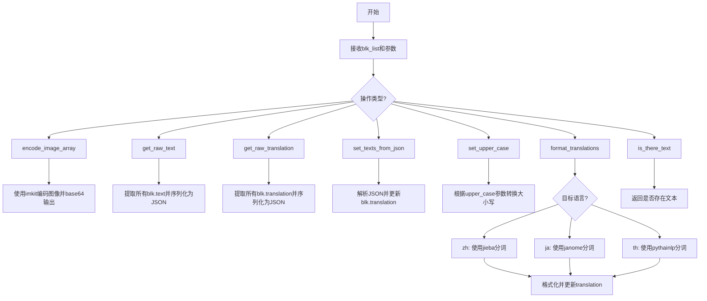
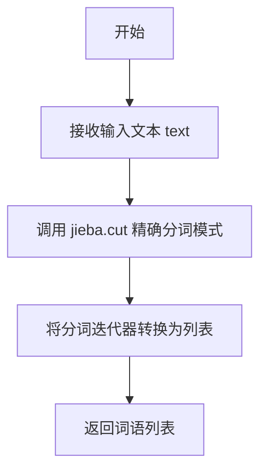
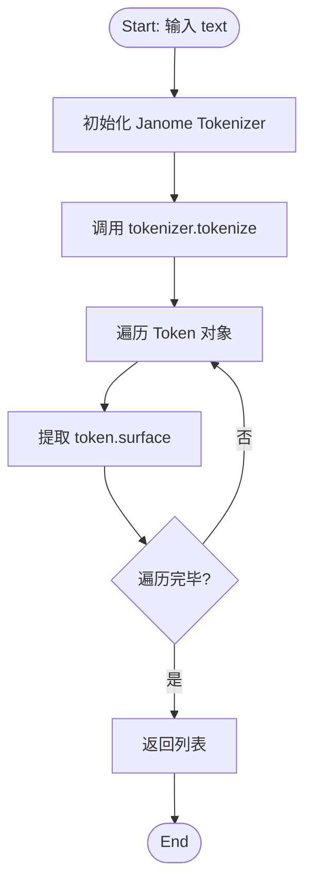
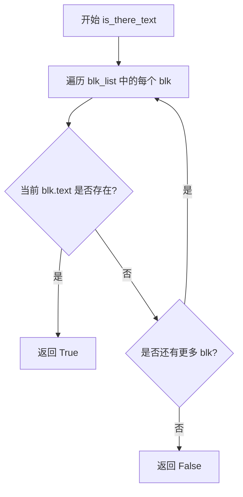

# `comic-translate\modules\utils\translator_utils.py` 详细设计文档

该模块是一个多语言文本处理工具，提供了文本块的序列化、分词（支持中文、日文、泰文）、大小写转换和格式化功能，主要用于翻译文本的后处理和多语言NLP任务。

## 整体流程



## 类结构

```
无类定义（纯函数模块）
依赖: TextBlock (从.textblock模块导入)
```

## 全局变量及字段


### `MODEL_MAP`
    
模型名称到API标识符的映射字典，包含各种AI模型如Deepseek-v3、GPT-4.1、Claude-4.5等的标识符

类型：`dict`
    


### `imk`
    
imkit库的别名，提供图像编码功能，用于将图像数组转换为base64编码

类型：`module`
    


    

## 全局函数及方法


### `encode_image_array`

该函数接收一个numpy数组（图像数据），使用imkit库将数组编码为PNG格式的图像字节，然后对图像字节进行base64编码并解码为UTF-8字符串返回，实现图像数据到base64字符串的转换。

参数：

- `img_array`：`np.ndarray`，输入的numpy数组，表示图像数据

返回值：`str`，base64编码后的PNG图像字符串，可直接用于数据传输或嵌入到HTML/JSON中

#### 流程图

```mermaid
flowchart TD
    A[开始] --> B[接收img_array参数]
    B --> C{调用imk.encode_image}
    C --> D[将numpy数组编码为.png格式的图像字节]
    D --> E[调用base64.b64encode]
    E --> F[对图像字节进行base64编码]
    F --> G[调用.decode('utf-8')]
    G --> H[将base64字节解码为UTF-8字符串]
    H --> I[返回base64字符串]
    I --> J[结束]
```

#### 带注释源码

```python
def encode_image_array(img_array: np.ndarray):
    """
    将numpy数组编码为base64字符串
    
    参数:
        img_array: np.ndarray - 输入的numpy数组,表示图像数据
    
    返回:
        str - base64编码后的PNG图像字符串
    """
    # 使用imkit库的encode_image函数将numpy数组编码为.png格式的字节
    img_bytes = imk.encode_image(img_array, ".png")
    
    # 对图像字节进行base64编码,然后解码为UTF-8字符串返回
    return base64.b64encode(img_bytes).decode('utf-8')
```


### `get_raw_text`

该函数接收一个TextBlock对象列表，遍历列表提取每个文本块的原始文本内容，将其存储在字典中（键名为`block_{索引}`格式），最后将字典序列化为格式化的JSON字符串返回。

参数：

- `blk_list`：`list[TextBlock]`，待处理的文本块列表，每个元素为TextBlock对象

返回值：`str`，包含所有文本块原始文本的JSON字符串（带缩进格式）

#### 流程图

```mermaid
flowchart TD
    A[开始] --> B[初始化空字典 rw_txts_dict]
    B --> C{遍历 blk_list}
    C -->|每次迭代| D[生成 block_key = f'block_{idx}']
    D --> E[获取 blk.text]
    E --> F[存入字典 rw_txts_dict[block_key] = blk.text]
    F --> C
    C -->|遍历完成| G[调用 json.dumps 序列化字典]
    G --> H[返回 JSON 字符串]
    H --> I[结束]
```

#### 带注释源码

```python
def get_raw_text(blk_list: list[TextBlock]):
    """
    提取文本块列表的原始文本并序列化为JSON
    
    参数:
        blk_list: TextBlock对象列表，每个对象包含text属性
        
    返回:
        包含所有文本块原始文本的JSON字符串
    """
    # 初始化用于存储文本块原始文本的字典
    rw_txts_dict = {}
    
    # 遍历文本块列表，索引从0开始
    for idx, blk in enumerate(blk_list):
        # 生成唯一的键名，格式为 block_0, block_1, ...
        block_key = f"block_{idx}"
        # 从TextBlock对象中提取原始文本并存储到字典
        rw_txts_dict[block_key] = blk.text
    
    # 将字典序列化为格式化的JSON字符串
    # ensure_ascii=False: 保留Unicode字符（如中文、日文等）
    # indent=4: 使用4空格缩进格式化输出
    raw_texts_json = json.dumps(rw_txts_dict, ensure_ascii=False, indent=4)
    
    # 返回序列化后的JSON字符串
    return raw_texts_json
```


### `get_raw_translation`

该函数接收一个TextBlock对象列表，遍历列表中的每个文本块，提取其translation属性并构建以block索引为键的字典，最后将该字典序列化为格式化的JSON字符串返回。

参数：

- `blk_list`：`list[TextBlock]`，包含多个TextBlock对象的列表，每个对象包含待提取的translation属性

返回值：`str`，JSON格式的字符串，键为"block_{索引}"，值为对应文本块的translation内容

#### 流程图

```mermaid
flowchart TD
    A[函数开始] --> B[初始化空字典 rw_translations_dict]
    B --> C{遍历 blk_list}
    C -->|每次迭代| D[获取当前索引 idx 和块 blk]
    D --> E[构建块键名: block_{idx}]
    E --> F[将 blk.translation 存入字典]
    F --> G{检查是否还有更多块}
    G -->|是| C
    G -->|否| H[调用 json.dumps 序列化字典]
    H --> I[返回 JSON 字符串]
    I --> J[函数结束]
```

#### 带注释源码

```python
def get_raw_translation(blk_list: list[TextBlock]):
    """
    提取文本块列表的翻译并序列化为JSON
    
    参数:
        blk_list: TextBlock对象列表，每个对象包含translation属性
        
    返回:
        JSON格式的字符串，包含所有文本块的翻译内容
    """
    # 初始化用于存储翻译结果的字典
    rw_translations_dict = {}
    
    # 遍历文本块列表，提取每个块的翻译
    for idx, blk in enumerate(blk_list):
        # 生成块键名，如 block_0, block_1 等
        block_key = f"block_{idx}"
        # 将当前块的翻译内容存入字典
        rw_translations_dict[block_key] = blk.translation
    
    # 将字典转换为格式化的JSON字符串
    # ensure_ascii=False: 保留Unicode字符
    # indent=4: 使用4空格缩进格式化输出
    raw_translations_json = json.dumps(rw_translations_dict, ensure_ascii=False, indent=4)
    
    # 返回序列化后的JSON字符串
    return raw_translations_json
```


### `set_texts_from_json`

该函数通过正则表达式从输入的JSON字符串中提取翻译数据，并将其逐个映射到TextBlock对象的translation属性中，实现批量文本翻译结果的写入。

参数：

- `blk_list`：`list[TextBlock]`，TextBlock对象列表，用于存储文本块及其翻译结果
- `json_string`：`str`，包含JSON数据的字符串，可能包含额外的前后文文本

返回值：`None`，该函数直接修改传入的TextBlock对象的translation属性，无返回值

#### 流程图

```mermaid
flowchart TD
    A[开始] --> B[使用正则表达式匹配JSON字符串]
    B --> C{是否匹配成功?}
    C -->|否| D[打印警告: 未找到JSON]
    C -->|是| E[提取匹配的JSON字符串]
    E --> F[解析JSON为字典 translation_dict]
    F --> G[初始化索引 idx = 0]
    G --> H{idx < len(blk_list)?}
    H -->|是| I[构建 block_key = 'block_{idx}']
    I --> J{block_key 在 translation_dict 中?}
    J -->|是| K[设置 blk.translation = translation_dict[block_key]]
    J -->|否| L[打印警告: block_key 未找到]
    K --> M[idx = idx + 1]
    L --> M
    M --> H
    H -->|否| N[结束]
    D --> N
```

#### 带注释源码

```python
def set_texts_from_json(blk_list: list[TextBlock], json_string: str):
    """
    从JSON字符串解析并设置文本块的翻译
    
    Args:
        blk_list: TextBlock对象列表，用于存储文本块
        json_string: 包含JSON数据的字符串
    
    Returns:
        None: 直接修改TextBlock对象的translation属性
    """
    # 使用正则表达式匹配JSON对象（支持多行JSON）
    match = re.search(r"\{[\s\S]*\}", json_string)
    
    if match:
        # 提取匹配的JSON字符串
        json_string = match.group(0)
        
        # 解析JSON为字典
        translation_dict = json.loads(json_string)
        
        # 遍历所有TextBlock
        for idx, blk in enumerate(blk_list):
            # 构建block键名
            block_key = f"block_{idx}"
            
            # 检查该block是否存在翻译数据
            if block_key in translation_dict:
                # 设置翻译文本
                blk.translation = translation_dict[block_key]
            else:
                # 打印警告信息
                print(f"Warning: {block_key} not found in JSON string.")
    else:
        # 未找到JSON对象
        print("No JSON found in the input string.")
```


### `set_upper_case`

该函数用于批量处理文本块列表，根据布尔参数 `upper_case` 的值，统一将列表中所有 `TextBlock` 对象的翻译文本（`translation`）修改为全大写或首字母大写的格式。

参数：

- `blk_list`：`list[TextBlock]` ，需要处理的文本块对象列表。
- `upper_case`：`bool` ，目标大小写模式。设为 `True` 时，文本将转换为全大写；设为 `False` 时，文本将转换为首字母大写（Capitalize）。

返回值：`None`，该函数直接修改传入列表中对象的属性，不返回新的数据结构。

#### 流程图

```mermaid
flowchart TD
    Start([开始]) --> LoopHeader{遍历 blk_list 中的每个 blk}
    
    %% 循环条件判断
    LoopHeader -- 遍历完毕 --> End([结束])
    LoopHeader -- 当前 blk --> GetTrans[获取 blk.translation]
    
    %% 检查翻译文本是否为空
    GetTrans --> IsNull{translation is None?}
    IsNull -- 是 --> ContinueLoop[继续下一次循环]
    IsNull -- 否 --> CheckParam{upper_case == True?}
    
    %% 分支1：要求转换为大写
    CheckParam -- 是 --> CheckIsUpper{translation.isupper()?}
    CheckIsUpper -- 否 --> SetToUpper[blk.translation = translation.upper()]
    CheckIsUpper -- 是 --> KeepUpper[保持不变]
    
    %% 分支2：要求转换为首字母大写
    CheckParam -- 否 --> CheckNotUpper{translation.isupper()?}
    CheckNotUpper -- 是 --> SetToCapital[blk.translation = translation.lower().capitalize()]
    CheckNotUpper -- 否 --> KeepLower[保持不变]
    
    %% 汇聚点
    SetToUpper --> ContinueLoop
    KeepUpper --> ContinueLoop
    SetToCapital --> ContinueLoop
    KeepLower --> ContinueLoop
    
    ContinueLoop --> LoopHeader
```

#### 带注释源码

```python
def set_upper_case(blk_list: list[TextBlock], upper_case: bool):
    """
    根据参数设置文本块翻译的大小写。
    
    参数:
        blk_list (list[TextBlock]): TextBlock对象列表。
        upper_case (bool): True表示全大写, False表示首字母大写。
    """
    # 遍历列表中的每一个文本块
    for blk in blk_list:
        # 获取当前文本块的翻译属性
        translation = blk.translation
        
        # 如果翻译文本为空 (None)，则跳过该块，不进行处理
        if translation is None:
            continue
            
        # 逻辑分支 1: 要求转换为全大写
        if upper_case and not translation.isupper():
            # 只有当当前文本不是全大写时才进行转换，节省资源
            blk.translation = translation.upper() 
        # 逻辑分支 2: 要求转换为首字母大写 (Title Case)
        elif not upper_case and translation.isupper():
            # 只有当当前文本是全大写时才进行转换
            # 先全部转小写，再将首字母大写
            blk.translation = translation.lower().capitalize()
        else:
            # 其他情况（大小写符合要求或无需转换），保持原样
            blk.translation = translation
```


### `get_chinese_tokens`

使用 jieba 库对中文文本进行精准模式分词，将输入的中文文本切分成独立的词语并返回列表。

参数：

- `text`：`str`，需要进行分词处理的中文文本字符串

返回值：`list[str]`，返回分词后的词语列表，每个元素为一个中文词语

#### 流程图



#### 带注释源码

```python
def get_chinese_tokens(text):
    """
    使用 jieba 对中文文本进行精准模式分词
    
    参数:
        text: str - 需要分词的中文文本
        
    返回:
        list[str] - 分词后的词语列表
    """
    # 使用 jieba 的精确模式进行分词（cut_all=False）
    # 精确模式会尝试将文本切成最合理的片段
    # jieba.cut 返回一个生成器，使用 list() 转换为列表
    return list(jieba.cut(text, cut_all=False))
```


### `get_japanese_tokens`

使用 `janome` 库对输入的日语文本进行分词处理，提取文本中的词汇（Surface）并以列表形式返回，主要用于翻译后的日语文本进行单词级别的格式化（如添加空格）。

参数：
-  `text`：`str`，待分词的日语文本字符串。

返回值：`List[str]`，包含分词结果的字符串列表，每个元素为原文本中的一个词汇（Surface）。

#### 流程图



#### 带注释源码

```python
def get_japanese_tokens(text):
    """
    使用 Janome 库对日语文本进行分词。
    
    参数:
        text (str): 需要分词的日语文本字符串。
        
    返回:
        list: 包含分词结果的字符串列表。
    """
    # 初始化 Janome 分词器
    # 注意：每次调用都会重新实例化 Tokenizer，这会加载词典，消耗较多资源。
    tokenizer = janome.tokenizer.Tokenizer()
    
    # 使用分词器对文本进行分词，返回包含 Token 对象的迭代器
    # tokenizer.tokenize(text) 会将日语文本分割成独立的词语
    token_iter = tokenizer.tokenize(text)
    
    # 列表推导式遍历分词结果
    # 提取每个 token 的 'surface' 属性（即原始文本片段，去除假名等标签信息）
    return [token.surface for token in token_iter]
```

### 关键组件信息

- **Janome Tokenizer**: 来自 `janome.tokenizer` 模块，是核心的分词引擎，负责将连续的日文字符串切分为有意义的词汇单元。
- **Surface 属性**: Janome Token 对象的核心属性，代表词语在原文中的表面形式（原文）。

### 潜在的技术债务或优化空间

1.  **性能瓶颈 (重复初始化)**：
    - **问题**：在函数体内部每次调用 `get_japanese_tokens` 时都会执行 `janome.tokenizer.Tokenizer()`。Janome 的 Tokenizer 在初始化时需要加载字典文件（ lexicon ），这是一个相对昂贵的 I/O 和内存操作。
    - **影响**：如果在批量处理（如 `format_translations` 遍历大量文本块）时频繁调用此函数，会造成显著的性能开销。
    - **优化建议**：将 `tokenizer` 实例提取到模块全局作用域或使用单例模式进行缓存，确保在整个程序运行周期内只初始化一次。

2.  **缺乏输入校验**：
    - **问题**：函数未检查输入 `text` 的类型。如果传入非字符串类型（如 `None` 或数字），`tokenizer.tokenize(text)` 可能会抛出异常或产生意外结果。
    - **优化建议**：增加 `isinstance(text, str)` 检查，确保输入合法。

### 其它项目

1.  **设计目标与约束**：
    - **目标**：为多语言翻译后处理提供统一的分词接口（与 `get_chinese_tokens`, `get_thai_tokens` 保持一致）。
    - **约束**：依赖外部库 `janome`，假定输入文本为日文。

2.  **数据流与状态机**：
    - **上游**：由 `format_translations` 函数调用，接收来自 `TextBlock` 对象的 `translation` 字段（已翻译的日文文本）。
    - **处理**：执行分词（Tokenization）。
    - **下游**：将分词结果列表传递给调用者，由 `format_translations` 重新拼接为带有空格分隔的字符串，赋值回 `blk.translation`。

3.  **错误处理与异常设计**：
    - 当前实现未包含 `try-except` 块，依赖 `janome` 库自身的异常抛出机制。


### `format_translations`

该函数根据目标语言代码对翻译文本进行分词处理和格式化，支持中文、日文和泰文三种语言的分词，并根据 `upper_case` 参数对翻译结果进行大小写转换。

参数：

- `blk_list`：`list[TextBlock]`，包含待处理翻译结果的 TextBlock 对象列表
- `trg_lng_cd`：`str`，目标语言代码（如 "zh"、"zh-CN"、"ja"、"th" 等）
- `upper_case`：`bool`，可选参数，默认为 True，指定是否将翻译文本转换为大写

返回值：`None`，该函数直接修改传入的 `blk_list` 中的 `translation` 属性，不返回任何值

#### 流程图

```mermaid
flowchart TD
    A[开始 format_translations] --> B[遍历 blk_list 中的每个 blk]
    B --> C[获取 blk.translation]
    D{trg_lng_cd 是否包含 'zh'?}
    D -->|是| E[调用 get_chinese_tokens]
    D -->|否| F{trg_lng_cd 是否包含 'ja'?}
    F -->|是| G[调用 get_japanese_tokens]
    F -->|否| H{trg_lng_cd 是否包含 'th'?}
    H -->|是| I[调用 word_tokenize]
    H -->|否| J[seg_result 为空列表]
    E --> K[seg_result 有内容?]
    G --> K
    I --> K
    J --> K
    K -->|是| L[格式化分词结果: 标点符号保持原样, 其他词前加空格]
    K -->|否| M{translation is None?}
    M -->|是| N[继续下一个 blk]
    M -->|否| O{upper_case 为 True 且 translation 不是全大写?]
    O -->|是| P[转换为大写]
    O -->|否| Q{upper_case 为 False 且 translation 是全大写?]
    Q -->|是| R[转换为小写并首字母大写]
    Q -->|否| S[保持原样]
    P --> T[更新 blk.translation]
    R --> T
    S --> T
    L --> T
    T --> U[继续下一个 blk]
    N --> U
    U --> V[遍历结束]
```

#### 带注释源码

```python
def format_translations(blk_list: list[TextBlock], trg_lng_cd: str, upper_case: bool = True):
    """
    根据目标语言对翻译进行分词和格式化
    
    参数:
        blk_list: 包含待处理翻译的 TextBlock 列表
        trg_lng_cd: 目标语言代码 (如 'zh', 'ja', 'th')
        upper_case: 是否转换为大写，默认为 True
    """
    # 遍历所有文本块
    for blk in blk_list:
        translation = blk.translation  # 获取当前块的翻译文本
        trg_lng_code_lower = trg_lng_cd.lower()  # 将语言代码转为小写用于匹配
        seg_result = []  # 初始化分词结果列表

        # 根据目标语言选择分词方式
        if 'zh' in trg_lng_code_lower:
            # 中文分词: 使用 jieba 库进行精确分词
            seg_result = get_chinese_tokens(translation)

        elif 'ja' in trg_lng_code_lower:
            # 日文分词: 使用 janome 库进行分词
            seg_result = get_japanese_tokens(translation)

        elif 'th' in trg_lng_code_lower:
            # 泰文分词: 使用 pythainlp 库进行分词
            seg_result = word_tokenize(translation)

        # 如果分词结果存在，则进行格式化处理
        if seg_result:
            # 格式化: 标点符号('.', ',')保持原位置，其他词前加空格
            # 然后去除字符串前导空格
            blk.translation = ''.join(
                word if word in ['.', ','] else f' {word}' 
                for word in seg_result
            ).lstrip()
        else:
            # 未进行分词时(如非目标语言)，仅应用大小写转换
            if translation is None:
                continue  # 如果翻译为空，跳过当前块
            if upper_case and not translation.isupper():
                blk.translation = translation.upper()  # 转换为大写
            elif not upper_case and translation.isupper():
                # 转换为小写并首字母大写 (Title Case)
                blk.translation = translation.lower().capitalize()
            else:
                blk.translation = translation  # 保持原样
```

#### 关键依赖函数

| 函数名 | 文件来源 | 功能描述 |
|--------|----------|----------|
| `get_chinese_tokens` | 本文件 | 使用 jieba 库对中文文本进行精确分词 |
| `get_japanese_tokens` | 本文件 | 使用 janome 库对日文文本进行分词 |
| `word_tokenize` | pythainlp 库 | 对泰文文本进行分词 |

#### 潜在技术债务与优化空间

1. **语言检测逻辑粗糙**：使用字符串包含判断 (`'zh' in trg_lng_code_lower`) 可能会导致误匹配，例如 "zh-TW" 和 "en-zh" 等情况都可能被错误识别
2. **分词器重复实例化**：`get_japanese_tokens` 函数中每次调用都会创建新的 `janome.tokenizer.Tokenizer()` 实例，建议在模块级别缓存该 tokenizer
3. **大小写转换逻辑重复**：该函数的尾部大小写处理与 `set_upper_case` 函数存在逻辑重复，可考虑提取为独立工具函数
4. **错误处理缺失**：分词操作未进行异常捕获，当分词失败时可能导致整个流程中断
5. **返回值设计**：函数直接修改输入对象而非返回新列表，不符合函数式编程习惯，可能导致调用方难以追踪状态变化


### `is_there_text`

检查文本块列表中是否存在任何包含文本的块。

参数：

- `blk_list`：`list[TextBlock]`，待检查的文本块列表

返回值：`bool`，如果列表中任意一个文本块的 `text` 属性非空则返回 `True`，否则返回 `False`

#### 流程图



#### 带注释源码

```python
def is_there_text(blk_list: list[TextBlock]) -> bool:
    """
    检查文本块列表中是否存在文本。
    
    该函数通过遍历列表中的每个 TextBlock 对象，检查其 text 属性是否非空。
    使用 any() 函数实现短路求值，一旦找到第一个非空文本立即返回 True。
    
    参数:
        blk_list (list[TextBlock]): TextBlock 对象列表
        
    返回值:
        bool: 如果任意一个文本块的 text 属性非空返回 True，否则返回 False
    """
    return any(blk.text for blk in blk_list)
```

## 关键组件


### TextBlock 文本块处理模块

该模块负责文本块（TextBlock）的处理，包括提取原始文本、翻译结果格式化、多语言分词（中文、日文、泰文）以及大小写转换等功能。

### MODEL_MAP 模型映射配置

定义了不同LLM模型与其API标识符的映射关系，用于选择不同的AI模型进行翻译任务。

### encode_image_array 图像数组编码

将NumPy数组格式的图像数据编码为Base64字符串，用于与外部API交互。

### get_raw_text 原始文本提取

从文本块列表中提取所有文本内容，并以JSON格式返回，便于日志记录或调试。

### get_raw_translation 原始翻译提取

从文本块列表中提取所有翻译内容，并以JSON格式返回，用于保存翻译中间结果。

### set_texts_from_json JSON反序列化设置翻译

从包含JSON的字符串中解析翻译结果，并更新对应文本块的translation字段，支持从外部JSON恢复翻译内容。

### set_upper_case 大小写转换

根据upper_case参数将翻译文本转换为全大写或首字母大写格式，支持批量处理文本块。

### get_chinese_tokens 中文分词

使用jieba库对中文文本进行精确模式分词，返回分词后的词语列表。

### get_japanese_tokens 日文分词

使用janome库对日文文本进行分词，返回分词后的词语表面形式列表。

### format_translations 翻译格式化核心函数

根据目标语言代码（trg_lng_cd）选择对应的分词策略，中文使用jieba、日文使用janome、泰文使用pythainlp，并在分词后在标点符号前后添加空格进行格式化，同时支持大小写转换。

### is_there_text 文本存在性检查

遍历文本块列表检查是否存在非空文本，返回布尔值用于判断是否需要进行后续处理。


## 问题及建议


### 已知问题

-   **重复代码（DRY原则违反）**：`set_upper_case` 函数和 `format_translations` 函数中存在大量重复的大小写转换逻辑（if upper_case 判断块），代码冗余且维护困难。
-   **正则表达式解析JSON风险**：`set_texts_from_json` 中使用 `r"\{[\s\S]*\}"` 正则表达式提取JSON过于简单，无法处理输入字符串中包含JSON以外内容的情况，可能匹配到不完整或错误的JSON结构。
-   **分词器重复初始化**：`get_japanese_tokens` 每次调用都创建新的 `janome.tokenizer.Tokenizer()` 实例，在循环处理大量文本时会造成性能开销。
-   **硬编码的魔法字符串**：`"block_{idx}"` 字符串在多个函数中重复出现，应提取为常量以提高可维护性。
-   **错误处理不完善**：`set_texts_from_json` 中 `json.loads()` 可能抛出异常（如JSON格式错误），但未被捕获；且使用 `print()` 输出警告而非标准的日志记录机制。
-   **类型导入不完整**：代码使用了 `list[TextBlock]` 类型注解，但 `TextBlock` 类是从相对导入 `.textblock` 获得的，未在本文件中进行类型检查相关的导入（如 `from typing import List` 或使用 `from __future__ import annotations`）。
-   **全局变量 MODEL_MAP 潜在过期**：MODEL_MAP 中的模型标识符（如 "deepseek-chat"）是硬编码的字符串，可能随API版本更新而失效，缺乏版本管理和动态更新机制。

### 优化建议

-   **提取公共方法**：将大小写转换逻辑提取为 `TextBlock` 类的成员方法或独立的工具函数，消除 `set_upper_case` 和 `format_translations` 中的重复代码。
-   **改进JSON解析**：移除正则表达式匹配，直接尝试解析整个字符串或使用更健壮的提取逻辑（如查找第一个 `{` 和最后一个 `}`），并添加 try-except 块捕获 `json.JSONDecodeError`。
-   **缓存分词器实例**：将 `janome.tokenizer.Tokenizer()` 声明为模块级全局变量或使用 functools.lru_cache 缓存，避免重复初始化。
-   **定义常量**：在模块顶部定义 `BLOCK_KEY_PREFIX = "block_"` 常量，替换所有硬编码的字符串。
-   **规范化日志记录**：使用 Python 标准日志模块 `logging` 替代 print 语句输出警告和错误。
-   **完善类型注解**：添加 `from __future__ import annotations` 或显式使用 `typing.List[TextBlock]`，并确保类型检查工具能正确识别导入的类型。
-   **配置外部化**：将 MODEL_MAP 迁移至独立的配置文件（如 JSON 或 YAML），或实现版本检查机制以支持动态更新。

## 其它


### 设计目标与约束

本模块的核心设计目标是提供一个多语言文本处理工具集，支持中文、日文、泰文等亚洲语言的文本分词、翻译格式化和文本块管理功能。约束条件包括：1）依赖第三方NLP库（jieba、janome、pythainlp）进行分词；2）需要与外部AI模型服务（OpenAI、Google、Anthropic）集成；3）处理流程需支持JSON序列化和反序列化；4）需支持文本的大小写转换功能。

### 错误处理与异常设计

代码中的错误处理主要通过以下方式实现：1）在`set_texts_from_json`函数中，当JSON解析失败或block_key不存在时，使用`print`输出警告信息而非抛出异常；2）在`set_upper_case`和`format_translations`函数中，对`translation`为`None`的情况进行显式检查并跳过处理；3）在`get_raw_text`和`get_raw_translation`函数中，直接访问`blk.text`和`blk.translation`属性，假设传入的`blk_list`不为空且格式正确。潜在改进：应使用正式的日志记录（logging模块）替代print语句，并考虑在关键函数中添加异常捕获机制。

### 数据流与状态机

数据流主要遵循以下路径：1）输入：TextBlock对象列表（包含text和translation属性）；2）处理阶段：提取原始文本/翻译→JSON序列化→JSON反序列化→文本格式化（分词+大小写处理）→写回TextBlock对象；3）输出：格式化后的TextBlock对象列表。状态转换包括：文本提取状态（get_raw_text/get_raw_translation）→JSON存储状态→文本更新状态（set_texts_from_json）→格式化状态（format_translations/set_upper_case）。

### 外部依赖与接口契约

本模块依赖以下外部包：1）base64（标准库）：用于图像Base64编码；2）json（标准库）：JSON序列化/反序列化；3）re（标准库）：正则表达式匹配；4）jieba：中文分词；5）janome：日文分词；6）numpy：图像数组处理；7）pythainlp：泰文分词；8）imkit（imk）：图像编码；9）TextBlock：本地自定义类，需具备text和translation属性。接口契约：所有处理函数接受TextBlock列表作为输入，直接修改列表中对象的属性值，无返回值（除encode_image_array和JSON相关函数外）。

### 性能考虑

当前实现中存在的性能瓶颈：1）`format_translations`函数在每次调用时对每种语言都重新创建分词器对象（如janome.tokenizer.Tokenizer()），建议缓存分词器实例；2）中文分词使用`jieba.cut`，日文分词遍历所有token并提取surface属性，可考虑使用更高效的分词模式；3）在`set_texts_from_json`中每次都编译正则表达式，可预编译正则模式；4）JSON序列化使用`json.dumps`的pretty print（indent=4）会占用更多内存和时间，生产环境应考虑使用紧凑格式。

### 安全性考虑

代码当前未包含显式的安全控制机制：1）`set_texts_from_json`直接使用`json.loads`解析任意字符串，存在潜在的JSON注入风险，建议在解析前验证输入格式；2）正则表达式`r"\{[\s\S]*\}"`使用贪婪匹配，可能导致正则表达式拒绝服务（ReDoS），建议使用更精确的模式或添加匹配限制；3）未对输入的TextBlock对象进行类型验证，传入错误类型可能导致运行时错误。

### 测试策略建议

建议补充以下测试用例：1）单元测试：验证各分词函数对中/日/泰文的分词准确性；2）边界测试：空列表输入、单元素列表、None值处理；3）集成测试：验证从TextBlock提取→JSON序列化→JSON反序列化→写回TextBlock的完整流程；4）性能测试：大规模blk_list（1000+元素）的处理时间；5）异常测试：无效JSON输入、缺失必需属性等情况。

### 配置管理建议

当前代码中的硬编码配置包括：1）MODEL_MAP字典定义模型名称和标识符的映射；2）format_translations中的语言代码判断逻辑。建议将这些配置外部化：1）将MODEL_MAP提取到独立的配置文件；2）将语言代码与分词器的映射关系配置化；3）支持通过参数配置分词模式（如jieba的cut_all参数）。

### 潜在改进建议

1. **日志系统**：使用Python logging模块替代print语句，实现分级日志记录；2. **类型注解增强**：为部分函数添加返回类型注解（如set_texts_from_json返回None可显式声明）；3. **正则表达式优化**：预编译`r"\{[\s\S]*\}"`为全局常量，避免重复编译；4. **分词器缓存**：在模块级别缓存janome.tokenizer.Tokenizer()实例；5. **TextBlock验证**：添加类型检查确保输入为TextBlock对象列表；6. **大小写转换逻辑统一**：set_upper_case和format_translations中存在重复的大小写转换逻辑，可提取为独立函数；7. **国际化扩展**：当前仅支持zh、ja、th三种语言，可考虑添加更多亚洲语言支持（如韩语、越南语等）。

### 代码组织与模块化建议

建议将代码按功能职责进一步拆分为子模块：1）文本提取模块（get_raw_text、get_raw_translation、set_texts_from_json）；2）文本格式化模块（format_translations、set_upper_case）；3）分词模块（get_chinese_tokens、get_japanese_tokens、word_tokenize调用）；4）模型映射模块（MODEL_MAP相关功能）；5）图像处理模块（encode_image_array）。各模块间通过明确的接口交互，提高代码的可维护性和可测试性。


    