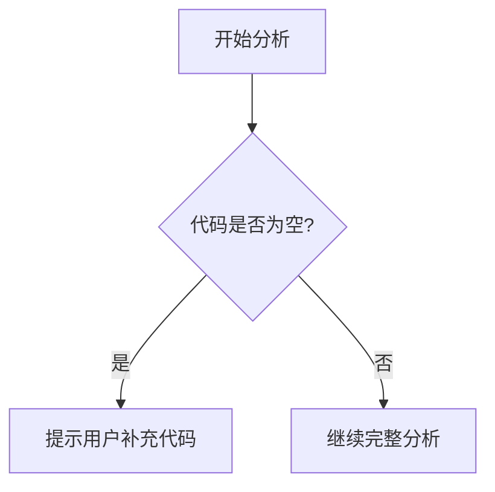

# `comic-translate\pipeline\__init__.py` 详细设计文档

代码文件为空或不完整，仅包含标题注释'# Pipeline modules'，无法进行完整分析。该文件预期为某个数据处理Pipeline的模块集合，但缺少实际代码实现。

## 整体流程



## 类结构

```
无法确定 - 需要实际代码
```

## 全局变量及字段


    

## 全局函数及方法


## 关键组件


## 问题及建议


### 已知问题

- 代码内容为空，仅包含注释标题"# Pipeline modules"，缺乏实际实现代码，无法进行有效的技术分析
- 缺少Pipeline模块的具体实现，包括数据处理逻辑、模块间的数据传递机制
- 没有定义输入输出接口、数据格式说明和错误处理机制
- 缺乏必要的类、函数和全局变量的定义
- 无法确定系统的整体架构设计和模块职责划分

### 优化建议

- 提供完整的Pipeline模块代码实现，包括具体的业务逻辑处理流程
- 明确各模块的输入输出接口，定义清晰的数据结构和格式规范
- 实现完善的错误处理和异常管理机制，确保系统的健壮性
- 添加详细的代码注释和文档说明，包括每个模块的功能描述和使用方式
- 建议补充单元测试和集成测试代码，确保功能的正确性和稳定性
- 考虑添加日志记录和监控机制，便于系统运行时的调试和维护


## 其它


### 设计目标与约束

本文档旨在描述一个模块化的Pipeline（管道）系统，用于数据处理、转换和传输。该系统设计为可扩展、容错、高性能的数据处理框架，支持多种数据类型和处理阶段。设计约束包括：支持水平扩展以处理大规模数据流；保证数据处理的原子性和一致性；提供插件化的模块接口以支持自定义处理逻辑；最小化各阶段之间的耦合度。

### 错误处理与异常设计

Pipeline系统采用分层异常处理机制：对于可恢复的错误（如临时网络中断），系统实现自动重试策略，默认重试3次，间隔指数级增长；对于不可恢复的错误（如数据格式错误），系统捕获异常并将其记录到错误日志，同时将错误记录写入死信队列（Dead Letter Queue）以供后续分析；每个处理模块需要实现异常隔离机制，防止单个模块的异常影响整个Pipeline的运行；系统提供统一的异常基类PipelineException，所有自定义异常都应继承自该基类。

### 数据流与状态机

Pipeline的数据流采用有向无环图（DAG）结构，数据从输入源（Source）开始，依次经过若干处理节点（Processor），最终到达输出端（Sink）。 Pipeline的生命周期包含以下状态：初始化（INIT）→配置加载（CONFIGURED）→启动（RUNNING）→暂停（PAUSED）→停止（STOPPED）→销毁（DESTROYED）。状态转换仅允许按预定路径进行，例如从RUNNING状态可以直接转换到PAUSED或STOPPED，但不能直接转换到DESTROYED。数据在各节点间传递时采用消息队列（如RabbitMQ或Kafka）作为缓冲，确保异步处理和负载均衡。

### 外部依赖与接口契约

Pipeline模块的外部依赖包括：消息中间件（Kafka 2.4+ 或 RabbitMQ 3.8+）用于数据传递；配置管理服务（如Consul或etcd）用于动态配置；监控服务（如Prometheus）用于指标采集；日志服务（如ELK Stack）用于日志收集。核心接口契约包括：ISource接口定义数据源读取方法（read()返回DataRecord）；IProcessor接口定义数据处理方法（process(DataRecord)返回ProcessedRecord）；ISink接口定义数据输出方法（write(ProcessedRecord)）；IPipeline接口定义管道管理方法（start()、stop()、pause()、resume()）。所有接口方法都应该是线程安全的，支持并发调用。

### 性能考虑

为确保高性能处理，Pipeline采用以下策略：使用批处理模式减少IO次数，每个批次默认包含100条记录；实现背压（Back Pressure）机制，当下游处理能力不足时自动降低数据摄入速率；使用连接池复用数据库和网络连接；启用异步处理模式，IO操作不阻塞计算操作；提供并行处理能力，支持多线程或多进程处理。对于内存管理，设置单节点最大缓存容量为512MB，超出阈值时触发Spill-over策略，将数据临时写入磁盘。

### 安全性考虑

Pipeline系统安全设计包括：数据传输加密（TLS 1.3）；敏感数据脱敏处理；基于角色的访问控制（RBAC）；操作审计日志记录所有配置变更和管道操作；模块签名验证防止恶意模块加载；支持数据加密存储（AES-256）。认证机制支持OAuth2.0和API Key两种方式。

### 配置与可扩展性

Pipeline采用声明式配置，支持JSON或YAML格式。核心配置项包括：管道拓扑结构定义；各模块的初始化参数；重试策略和超时设置；资源限制（内存、CPU、并发数）。扩展性设计：支持自定义模块开发，模块需要实现指定接口并注册到模块工厂；支持动态添加/移除管道节点，无需重启系统；支持管道链路的运行时修改。

### 测试策略

测试覆盖包括：单元测试（使用Mockito模拟依赖，测试覆盖率目标>80%）；集成测试（测试Pipeline各组件间的协作）；端到端测试（使用真实数据源和目标进行全链路测试）；性能测试（使用JMeter进行压力测试，目标吞吐量>10000 TPS）；混沌工程测试（模拟节点故障、网络延迟等异常场景）。

### 部署与运维

部署模式支持：单机部署（开发/测试环境）；集群部署（生产环境，典型配置3-5个节点）；Kubernetes部署（支持HPA自动扩缩容）。运维监控指标包括：吞吐量（TPS）；延迟（P50、P95、P99）；错误率；队列堆积深度；资源利用率。提供RESTful API用于运行时管理和监控。

### 版本兼容性

版本策略：主版本号变更表示不兼容的API修改；次版本号变更表示向后兼容的功能新增；修订号变更表示向后兼容的问题修复。兼容性承诺：同一主版本内的接口保持稳定；配置格式支持平滑升级；支持数据格式的版本协商机制。


    