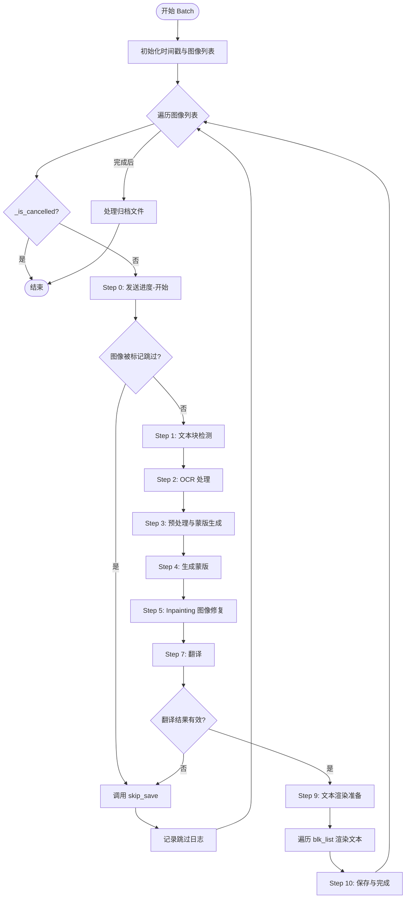
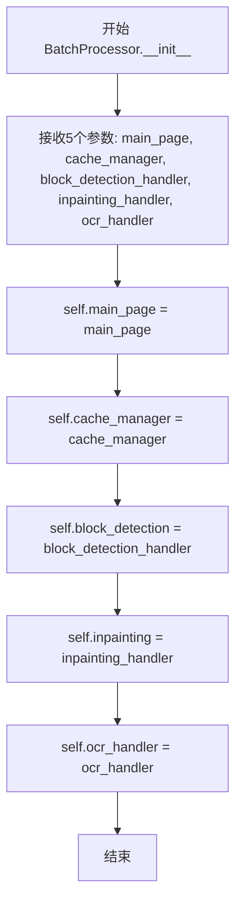
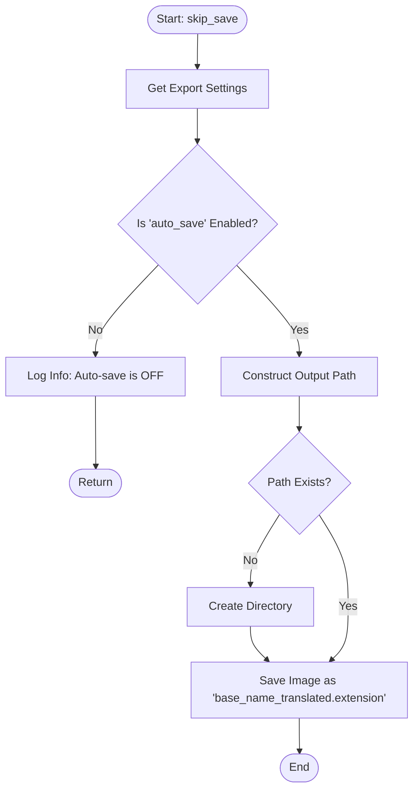
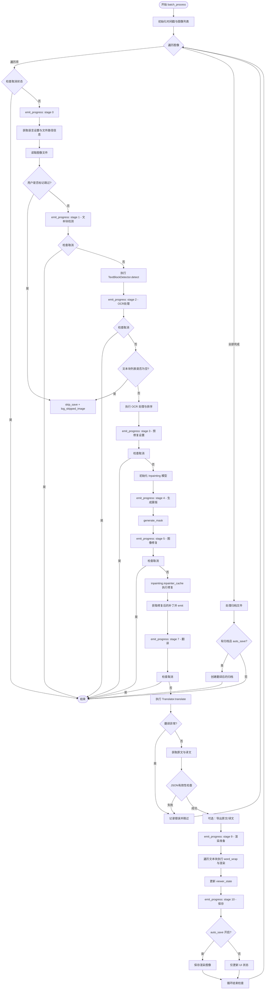

```mermaid
flowchart TD
    A[开始 _is_cancelled] --> B{获取 current_worker}
    B --> C[worker = getattr&#40;self.main_page, 'current_worker', None&#41;]
    C --> D{检查 worker 是否存在}
    D -->|worker 存在| E{检查 is_cancelled}
    D -->|worker 不存在| F[返回 False]
    E -->|is_cancelled 为 True| G[返回 True]
    E -->|is_cancelled 为 False| H[返回 False]
    F --> I[结束]
    G --> I
    H --> I
    
    style A fill:#f9f,color:#000
    style I fill:#9f9,color:#000
```

# `comic-translate\pipeline\batch_processor.py` 详细设计文档

BatchProcessor 是一个核心的批处理引擎，负责协调漫画翻译的完整流程，包括文本块检测、OCR识别、图像修复（Inpainting）、翻译、文本渲染以及最终的文件保存和归档处理。

## 整体流程



## 类结构

```
BatchProcessor (核心协调类)
├── main_page: ComicTranslate (主控制器)
├── cache_manager: CacheManager (缓存管理)
├── block_detection: BlockDetectionHandler (文本块检测处理器)
├── inpainting: InpaintingHandler (图像修复处理器)
└── ocr_handler: OCRHandler (OCR处理器)
```

## 全局变量及字段


### `logger`
    
模块级日志记录器，用于记录批处理过程中的各类日志信息

类型：`logging.Logger`
    


### `BatchProcessor.main_page`
    
主应用程序页面控制器，负责管理整个翻译界面的状态和交互

类型：`ComicTranslate`
    


### `BatchProcessor.cache_manager`
    
缓存管理器，用于存储和管理OCR及翻译结果的缓存数据

类型：`CacheManager`
    


### `BatchProcessor.block_detection`
    
文本块检测处理器，负责在图像中识别和定位文本区域

类型：`BlockDetectionHandler`
    


### `BatchProcessor.inpainting`
    
图像修复处理器，负责移除图像中的原始文本并生成清洁的背景

类型：`InpaintingHandler`
    


### `BatchProcessor.ocr_handler`
    
光学字符识别处理器，负责从文本块中提取原始文本内容

类型：`OCRHandler`
    
    

## 全局函数及方法


### `BatchProcessor.__init__`

该方法是 `BatchProcessor` 类的构造函数，负责初始化批量处理器的核心依赖项，包括主页面、缓存管理器以及文本检测、图像修复和 OCR 处理的共享处理器实例。

参数：

- `main_page`：`ComicTranslate`，主应用程序页面实例，负责管理图像状态、进度更新和UI交互
- `cache_manager`：`CacheManager`，缓存管理器，用于存储和检索 OCR 与翻译结果
- `block_detection_handler`：`BlockDetectionHandler`，文本块检测处理器，提供文本检测功能
- `inpainting_handler`：`InpaintingHandler`，图像修复处理器，负责图像的修复和去除文字
- `ocr_handler`：`OCRHandler`，OCR 处理器，负责从图像中提取文本

返回值：`None`，构造函数不返回任何值

#### 流程图



#### 带注释源码

```python
def __init__(
        self, 
        main_page: ComicTranslate, 
        cache_manager: CacheManager, 
        block_detection_handler: BlockDetectionHandler, 
        inpainting_handler: InpaintingHandler, 
        ocr_handler: OCRHandler 
    ):
    """
    初始化 BatchProcessor 实例。
    
    Args:
        main_page: ComicTranslate 类型，主应用程序页面实例，
                   负责管理图像状态（如 image_files、image_states）以及 UI 交互（如 progress_update、image_skipped 信号）。
        cache_manager: CacheManager 类型，缓存管理器对象，
                       用于存储 OCR 和翻译结果以加速后续处理。
        block_detection_handler: BlockDetectionHandler 类型，文本块检测处理器，
                                 提供文本区域检测功能（通过 TextBlockDetector）。
        inpainting_handler: InpaintingHandler 类型，图像修复处理器，
                            负责移除图像中的文本区域并进行修复。
        ocr_handler: OCRHandler 类型，OCR 处理器，
                    负责从图像中识别和提取文本内容。
    """
    # 存储主页面引用，用于访问全局状态和 UI 更新
    self.main_page = main_page
    
    # 存储缓存管理器引用，用于 OCR 和翻译结果的缓存操作
    self.cache_manager = cache_manager
    
    # 使用从主 pipeline 传入的共享处理器
    # 文本块检测处理器
    self.block_detection = block_detection_handler
    
    # 图像修复（去字）处理器
    self.inpainting = inpainting_handler
    
    # OCR 处理器
    self.ocr_handler = ocr_handler
```


### `BatchProcessor.skip_save`

该方法用于在图像处理流程中被“跳过”时（如用户手动跳过、OCR识别失败或未检测到文本框），将原始图像保存到输出目录的 `translated_images` 文件夹中。它充当一种降级方案，确保即使特定图像未经过翻译处理，也会在最终输出集中保留其副本。

参数：

- `self`：`BatchProcessor`，调用此方法的类实例。
- `directory`：`str`，原始图像所在的目录路径。
- `timestamp`：`str`，当前批处理的唯一时间戳标识符（用于命名输出文件夹）。
- `base_name`：`str`，不带扩展名的图像文件名。
- `extension`：`str`，图像文件的扩展名（例如 ".png"）。
- `archive_bname`：`str`，如果图像来自压缩包，则为压缩包的基础名称，用于构建输出子目录；否则为空字符串。
- `image`：`imkit.Image`，需要保存的图像对象。

返回值：`None`，该方法不返回任何数据，仅执行文件写入操作。

#### 流程图



#### 带注释源码

```python
def skip_save(self, directory, timestamp, base_name, extension, archive_bname, image):
    """
    Saves the original image to the translated_images folder when processing is skipped.
    
    Args:
        directory: The directory where the source image is located.
        timestamp: The timestamp string for the output folder.
        base_name: Base filename of the image.
        extension: File extension (e.g., .png).
        archive_bname: Archive base name for subdirectory structure.
        image: The image object to save.
    """
    # 1. Retrieve export settings to check user preferences
    export_settings = self.main_page.settings_page.get_export_settings()
    
    # 2. Check if automatic saving is enabled
    # If auto_save is False, do not save fallback images and exit
    if not export_settings.get('auto_save', True):
        logger.info("Auto-save is OFF. Skipping fallback image save for '%s'.", base_name)
        return
    
    # 3. Construct the target directory path
    # Structure: .../comic_translate_{timestamp}/translated_images/{archive_bname}/
    path = os.path.join(directory, f"comic_translate_{timestamp}", "translated_images", archive_bname)
    
    # 4. Ensure the directory exists, create if not
    if not os.path.exists(path):
        os.makedirs(path, exist_ok=True)
    
    # 5. Write the image to disk with '_translated' suffix
    imk.write_image(os.path.join(path, f"{base_name}_translated{extension}"), image)
```


### `BatchProcessor.emit_progress`

该方法是一个封装器（Wrapper），主要用于将批处理流水线中的数值型进度步骤（step）转换为人类可读的阶段名称（stage_name），记录详细的进度日志，并向主页面（main_page）发送进度更新信号以驱动 UI 界面的进度条。

参数：

- `index`：`int`，表示当前正在处理的图片在列表中的索引（从 0 开始）。
- `total`：`int`，表示当前批次中需要处理的总图片数量。
- `step`：`int`，表示当前处理流水线所处的步骤编号（例如：0 表示开始，1 表示文本检测，5 表示重绘等）。
- `steps`：`int`，表示整个处理流程的总步骤数（通常为 10 或 3）。
- `change_name`：`bool`，一个标志位，用于指示 UI 是否需要更新当前的标签页或标题名称。

返回值：`None`，该方法不返回任何值，仅通过日志和信号副作用影响外部状态。

#### 流程图

```mermaid
flowchart TD
    A([开始 emit_progress]) --> B{根据 step 参数<br>查询 stage_map}
    B -- 找到对应阶段 --> C[获取 stage_name]
    B -- 未找到对应阶段 --> D[生成默认名称 stage-{step}]
    C --> E
    D --> E
    E[记录日志: logger.info] --> F[发送信号: progress_update.emit]
    F --> G([结束])
    
    subgraph 详细信息
    stage_map
    end
```

#### 带注释源码

```python
def emit_progress(self, index, total, step, steps, change_name):
    """
    封装了 main_page.progress_update.emit，用于记录人类可读的进度阶段。
    
    参数:
        index (int): 当前图片索引。
        total (int): 图片总数。
        step (int): 当前步骤索引 (0-10)。
        steps (int): 总步骤数 (通常为 10)。
        change_name (bool): 是否改变 UI 名称。
    """
    # 定义步骤数字到可读名称的映射
    stage_map = {
        0: 'start-image',
        1: 'text-block-detection',
        2: 'ocr-processing',
        3: 'pre-inpaint-setup',
        4: 'generate-mask',
        5: 'inpainting',
        7: 'translation',
        9: 'text-rendering-prepare',
        10: 'save-and-finish',
    }
    
    # 如果映射表中没有对应的步骤，则使用默认格式 'stage-{step}'
    stage_name = stage_map.get(step, f'stage-{step}')
    
    # 记录关键进度信息到日志，方便调试和监控
    logger.info(f"Progress: image_index={index}/{total} step={step}/{steps} ({stage_name}) change_name={change_name}")
    
    # 发射 Qt 信号，通知 UI 层更新进度条和相关状态
    self.main_page.progress_update.emit(index, total, step, steps, change_name)
```


### `BatchProcessor.log_skipped_image`

该方法用于将处理失败或被用户跳过的图片信息记录到磁盘上的 `skipped_images.txt` 日志文件中，以便用户后续排查。它接收图片路径和原因，并将这些信息追加到指定时间戳的日志文件中。

参数：

- `directory`：`str`，图片所属的工作目录。
- `timestamp`：`str`，批处理任务的时间戳，用于构建日志文件的子目录路径。
- `image_path`：`str`，被跳过或失败处理的图片完整路径。
- `reason`：`str`，描述跳过或失败的具体原因（例如 "User-skipped", "OCR processing failed" 等）。
- `full_traceback`：`str`，（可选）完整的异常堆栈跟踪信息，当前实现中虽然接收了该参数，但未写入文件。

返回值：`None`，该方法执行文件写入操作，不返回任何值。

#### 流程图

```mermaid
flowchart TD
    A([开始]) --> B[构建日志文件路径<br>directory/comic_translate_{timestamp}/skipped_images.txt]
    B --> C{打开文件}
    C -->|成功| D[以追加模式写入图片路径]
    D --> E[写入原因描述]
    E --> F[写入空行分隔符]
    F --> G([结束/关闭文件])
    
    style C fill:#f9f,stroke:#333,stroke-width:2px
    style D fill:#ff9,stroke:#333,stroke-width:1px
    style E fill:#ff9,stroke:#333,stroke-width:1px
    style F fill:#ff9,stroke:#333,stroke-width:1px
```

#### 带注释源码

```python
def log_skipped_image(self, directory, timestamp, image_path, reason="", full_traceback=""):
    """
    将跳过的图片信息记录到日志文件中。
    
    Args:
        directory (str): 图片所在的根目录。
        timestamp (str): 批处理的时间戳，用于形成日志子目录。
        image_path (str): 具体的图片文件路径。
        reason (str): 跳过或失败的原因。
        full_traceback (str): 完整的错误堆栈（当前未使用，但已预留）。
    """
    # 拼接日志文件的完整路径：{directory}/comic_translate_{timestamp}/skipped_images.txt
    skipped_file = os.path.join(directory, f"comic_translate_{timestamp}", "skipped_images.txt")
    
    # 以追加模式('a')打开文件，确保多次运行不会覆盖之前的记录
    # 使用 UTF-8 编码以支持可能存在的特殊字符
    with open(skipped_file, 'a', encoding='UTF-8') as file:
        # 写入图片路径
        file.write(image_path + "\n")
        # 写入失败或跳过原因
        file.write(reason + "\n")
        # 写入空行，使每个记录的日志在文件中分隔清晰
        file.write("\n")
```


### `BatchProcessor._is_cancelled`

这是一个私有方法，用于检查当前批处理操作是否已被用户取消。它通过获取主页面上的 `current_worker` 对象，并检查其 `is_cancelled` 属性来判断操作状态。

参数：

- （无参数，仅包含隐式参数 `self`）

返回值：`bool`，返回 `True` 表示操作已被取消，返回 `False` 表示操作仍在进行中。

#### 流程图



#### 带注释源码

```python
def _is_cancelled(self) -> bool:
    """
    检查当前批处理操作是否已被取消。
    
    通过访问主页面上的 worker 对象来获取当前的取消状态。
    这允许在长时间运行的批处理任务中随时检查用户是否请求取消。
    
    Returns:
        bool: 如果 worker 存在且 is_cancelled 为 True，则返回 True；
              否则返回 False。
    """
    # 从主页面获取当前的工作线程/任务对象
    # 如果不存在该属性，则默认为 None
    worker = getattr(self.main_page, "current_worker", None)
    
    # 使用 bool() 确保返回值是明确的布尔类型
    # 只有当 worker 存在且其 is_cancelled 属性为 True 时才返回 True
    return bool(worker and worker.is_cancelled)
```


### `BatchProcessor.batch_process`

该方法通过遍历用户选定或默认的图像列表，依次执行文本检测、OCR识别、图像修复（清除原文本）、翻译处理及最终文本渲染与保存，完整实现了漫画图像的批量翻译流水线。

参数：
- `selected_paths`：`List[str]`，可选，要处理的图像文件路径列表。默认为 `None`，此时使用 `main_page.image_files` 中的所有图像。

返回值：`None`，该方法通过副作用更新状态和保存文件，不返回任何值。

#### 流程图



#### 带注释源码

```python
def batch_process(self, selected_paths: List[str] = None):
    """
    批量处理漫画图像的翻译流程。
    流程包含：文本检测 -> OCR -> 图像修复(清除原文字) -> 翻译 -> 文本渲染 -> 保存。
    """
    # 1. 初始化：生成时间戳用于文件组织，获取要处理的图像列表
    timestamp = datetime.now().strftime("%b-%d-%Y_%I-%M-%S%p")
    image_list = selected_paths if selected_paths is not None else self.main_page.image_files
    total_images = len(image_list)

    # 2. 主循环：遍历每一张图像进行处理
    for index, image_path in enumerate(image_list):
        # 检查用户是否取消了处理
        if self._is_cancelled():
            return

        # 获取当前显示的文件（用于判断是否需要实时更新UI）
        file_on_display = self.main_page.image_files[self.main_page.curr_img_idx]

        # 3. 发出开始阶段的进度信号
        self.emit_progress(index, total_images, 0, 10, True)

        # 4. 获取当前图像的设置和语言信息
        settings_page = self.main_page.settings_page
        source_lang = self.main_page.image_states[image_path]['source_lang']
        target_lang = self.main_page.image_states[image_path]['target_lang']

        # 映射语言到英文以判断RTL（从右向左）排版
        target_lang_en = self.main_page.lang_mapping.get(target_lang, None)
        trg_lng_cd = get_language_code(target_lang_en)
        
        # 提取文件名和路径信息
        base_name = os.path.splitext(os.path.basename(image_path))[0].strip()
        extension = os.path.splitext(image_path)[1]
        directory = os.path.dirname(image_path)

        # 5. 处理归档文件路径（如果是归档内的图像）
        archive_bname = ""
        for archive in self.main_page.file_handler.archive_info:
            images = archive['extracted_images']
            archive_path = archive['archive_path']

            for img_pth in images:
                if img_pth == image_path:
                    directory = os.path.dirname(archive_path)
                    archive_bname = os.path.splitext(os.path.basename(archive_path))[0].strip()

        # 6. 读取图像
        image = imk.read_image(image_path)

        # 7. 检查并跳过用户标记为跳过的图像
        state = self.main_page.image_states.get(image_path, {})
        if state.get('skip', False):
            self.skip_save(directory, timestamp, base_name, extension, archive_bname, image)
            self.log_skipped_image(directory, timestamp, image_path, "User-skipped")
            continue

        # 8. 阶段1：文本块检测
        self.emit_progress(index, total_images, 1, 10, False)
        if self._is_cancelled():
            return

        # 使用缓存的检测器
        if self.block_detection.block_detector_cache is None:
            self.block_detection.block_detector_cache = TextBlockDetector(settings_page)
        
        blk_list = self.block_detection.block_detector_cache.detect(image)

        # 9. 阶段2：OCR光学字符识别
        self.emit_progress(index, total_images, 2, 10, False)
        if self._is_cancelled():
            return

        if blk_list:
            # 获取OCR缓存键并处理
            ocr_model = settings_page.get_tool_selection('ocr')
            device = resolve_device(settings_page.is_gpu_enabled())
            cache_key = self.cache_manager._get_ocr_cache_key(image, source_lang, ocr_model, device)
            
            # 初始化并运行OCR
            self.ocr_handler.ocr.initialize(self.main_page, source_lang)
            try:
                self.ocr_handler.ocr.process(image, blk_list)
                # 缓存OCR结果
                self.cache_manager._cache_ocr_results(cache_key, self.main_page.blk_list)
                
                # 判断是否需要从右向左排序（如日语）
                source_lang_english = self.main_page.lang_mapping.get(source_lang, source_lang)
                rtl = True if source_lang_english == 'Japanese' else False
                blk_list = sort_blk_list(blk_list, rtl)
                
            except InsufficientCreditsException:
                raise # 额度不足直接抛出
            except Exception as e:
                # 错误处理：网络问题或HTTP错误
                if isinstance(e, requests.exceptions.ConnectionError):
                    err_msg = QCoreApplication.translate("Messages", "Unable to connect to the server.\nPlease check your internet connection.")
                elif isinstance(e, requests.exceptions.HTTPError):
                    try:
                        err_json = e.response.json()
                        err_msg = err_json.get("error_description", str(e))
                    except Exception:
                        err_msg = str(e)
                else:
                    err_msg = str(e)

                logger.exception(f"OCR processing failed: {err_msg}")
                reason = f"OCR: {err_msg}"
                full_traceback = traceback.format_exc()
                self.skip_save(directory, timestamp, base_name, extension, archive_bname, image)
                self.main_page.image_skipped.emit(image_path, "OCR", err_msg)
                self.log_skipped_image(directory, timestamp, image_path, reason, full_traceback)
                continue
        else:
            # 未检测到文本块，跳过
            self.skip_save(directory, timestamp, base_name, extension, archive_bname, image)
            self.main_page.image_skipped.emit(image_path, "Text Blocks", "")
            self.log_skipped_image(directory, timestamp, image_path, "No text blocks detected")
            continue

        # 10. 阶段3：预修复设置（准备图像修复模型）
        self.emit_progress(index, total_images, 3, 10, False)
        if self._is_cancelled():
            return

        export_settings = settings_page.get_export_settings()

        # 初始化或复用修复模型
        if self.inpainting.inpainter_cache is None or self.inpainting.cached_inpainter_key != settings_page.get_tool_selection('inpainter'):
            backend = 'onnx'
            device = resolve_device(settings_page.is_gpu_enabled(), backend=backend)
            inpainter_key = settings_page.get_tool_selection('inpainter')
            InpainterClass = inpaint_map[inpainter_key]
            logger.info("pre-inpaint: initializing inpainter '%s' on device %s", inpainter_key, device)
            t0 = time.time()
            self.inpainting.inpainter_cache = InpainterClass(device, backend=backend)
            self.inpainting.cached_inpainter_key = inpainter_key
            t1 = time.time()
            logger.info("pre-inpaint: inpainter initialized in %.2fs", t1 - t0)

        config = get_config(settings_page)
        
        # 11. 阶段4：生成蒙版
        logger.info("pre-inpaint: generating mask (blk_list=%d blocks)", len(blk_list))
        t0 = time.time()
        mask = generate_mask(image, blk_list)
        t1 = time.time()
        logger.info("pre-inpaint: mask generated in %.2fs (mask shape=%s)", t1 - t0, getattr(mask, 'shape', None))

        self.emit_progress(index, total_images, 4, 10, False)
        if self._is_cancelled():
            return

        # 12. 阶段5：执行图像修复（清除文字区域）
        inpaint_input_img = self.inpainting.inpainter_cache(image, mask, config)
        inpaint_input_img = imk.convert_scale_abs(inpaint_input_img)

        # 保存修复后的补丁供UI预览
        patches = self.inpainting.get_inpainted_patches(mask, inpaint_input_img)
        self.main_page.patches_processed.emit(patches, image_path)

        # 可选导出修复后的图像
        if export_settings['export_inpainted_image']:
            path = os.path.join(directory, f"comic_translate_{timestamp}", "cleaned_images", archive_bname)
            if not os.path.exists(path):
                os.makedirs(path, exist_ok=True)
            imk.write_image(os.path.join(path, f"{base_name}_cleaned{extension}"), inpaint_input_img)

        self.emit_progress(index, total_images, 5, 10, False)
        if self._is_cancelled():
            return

        # 13. 阶段7：翻译处理
        extra_context = settings_page.get_llm_settings()['extra_context']
        translator_key = settings_page.get_tool_selection('translator')
        translator = Translator(self.main_page, source_lang, target_lang)
        
        translation_cache_key = self.cache_manager._get_translation_cache_key(
            image, source_lang, target_lang, translator_key, extra_context
        )
        
        try:
            translator.translate(blk_list, image, extra_context)
            self.cache_manager._cache_translation_results(translation_cache_key, blk_list)
        except InsufficientCreditsException:
            raise
        except Exception as e:
            # 错误处理逻辑（同OCR）
            if isinstance(e, requests.exceptions.ConnectionError):
                err_msg = QCoreApplication.translate("Messages", "Unable to connect to the server.\nPlease check your internet connection.")
            elif isinstance(e, requests.exceptions.HTTPError):
                try:
                    err_json = e.response.json()
                    err_msg = err_json.get("error_description", str(e))
                except Exception:
                    err_msg = str(e)
            else:
                err_msg = str(e)

            logger.exception(f"Translation failed: {err_msg}")
            reason = f"Translator: {err_msg}"
            full_traceback = traceback.format_exc()
            self.skip_save(directory, timestamp, base_name, extension, archive_bname, image)
            self.main_page.image_skipped.emit(image_path, "Translator", err_msg)
            self.log_skipped_image(directory, timestamp, image_path, reason, full_traceback)
            continue

        if self._is_cancelled():
            return

        # 14. 提取并验证翻译结果
        entire_raw_text = get_raw_text(blk_list)
        entire_translated_text = get_raw_translation(blk_list)

        # 解析JSON并检查是否为空
        try:
            raw_text_obj = json.loads(entire_raw_text)
            translated_text_obj = json.loads(entire_translated_text)
            
            if (not raw_text_obj) or (not translated_text_obj):
                self.skip_save(directory, timestamp, base_name, extension, archive_bname, image)
                self.main_page.image_skipped.emit(image_path, "Translator", "")
                self.log_skipped_image(directory, timestamp, image_path, "Translator: empty JSON")
                continue
        except json.JSONDecodeError as e:
            error_message = str(e)
            reason = f"Translator: JSONDecodeError: {error_message}"
            logger.exception(reason)
            full_traceback = traceback.format_exc()
            self.skip_save(directory, timestamp, base_name, extension, archive_bname, image)
            self.main_page.image_skipped.emit(image_path, "Translator", error_message)
            self.log_skipped_image(directory, timestamp, image_path, reason, full_traceback)
            continue

        # 15. 可选导出原文和译文
        if export_settings['export_raw_text']:
            path = os.path.join(directory, f"comic_translate_{timestamp}", "raw_texts", archive_bname)
            if not os.path.exists(path):
                os.makedirs(path, exist_ok=True)
            file = open(os.path.join(path, os.path.splitext(os.path.basename(image_path))[0] + "_raw.txt"), 'w', encoding='UTF-8')
            file.write(entire_raw_text)

        if export_settings['export_translated_text']:
            path = os.path.join(directory, f"comic_translate_{timestamp}", "translated_texts", archive_bname)
            if not os.path.exists(path):
                os.makedirs(path, exist_ok=True)
            file = open(os.path.join(path, os.path.splitext(os.path.basename(image_path))[0] + "_translated.txt"), 'w', encoding='UTF-8')
            file.write(entire_translated_text)

        # 16. 阶段9：文本渲染准备
        self.emit_progress(index, total_images, 7, 10, False)
        if self._is_cancelled():
            return

        # 获取渲染设置
        render_settings = self.main_page.render_settings()
        upper_case = render_settings.upper_case
        outline = render_settings.outline
        format_translations(blk_list, trg_lng_cd, upper_case=upper_case)
        get_best_render_area(blk_list, image, inpaint_input_img)

        font = render_settings.font_family
        setting_font_color = QColor(render_settings.color)
        max_font_size = render_settings.max_font_size
        min_font_size = render_settings.min_font_size
        line_spacing = float(render_settings.line_spacing) 
        outline_width = float(render_settings.outline_width)
        outline_color = QColor(render_settings.outline_color) if outline else None
        bold = render_settings.bold
        italic = render_settings.italic
        underline = render_settings.underline
        alignment_id = render_settings.alignment_id
        alignment = self.main_page.button_to_alignment[alignment_id]
        direction = render_settings.direction
            
        text_items_state = []
        
        # 遍历文本块进行渲染计算
        for blk in blk_list:
            x1, y1, width, height = blk.xywh
            translation = blk.translation
            if not translation or len(translation) == 1:
                continue
            
            # 判断是否竖排文字
            vertical = is_vertical_block(blk, trg_lng_cd)

            # 自动换行处理
            translation, font_size = pyside_word_wrap(
                translation, font, width, height,
                line_spacing, outline_width, bold, italic, underline,
                alignment, direction, max_font_size, min_font_size, vertical
            )
            
            # 如果是当前显示的图像，实时发送渲染信号
            if image_path == file_on_display:
                self.main_page.blk_rendered.emit(translation, font_size, blk, image_path)

            # 无空格语言处理（如日语）
            if is_no_space_lang(trg_lng_cd):
                translation = translation.replace(' ', '')

            # 智能配色
            font_color = get_smart_text_color(blk.font_color, setting_font_color)

            # 构建文本项属性
            text_props = TextItemProperties(
                text=translation, font_family=font, font_size=font_size,
                text_color=font_color, alignment=alignment, line_spacing=line_spacing,
                outline_color=outline_color, outline_width=outline_width,
                bold=bold, italic=italic, underline=underline,
                position=(x1, y1), rotation=blk.angle, scale=1.0,
                transform_origin=blk.tr_origin_point, width=width,
                direction=direction, vertical=vertical,
                selection_outlines=[
                    OutlineInfo(0, len(translation), outline_color, outline_width, OutlineType.Full_Document)
                ] if outline else [],
            )
            text_items_state.append(text_props.to_dict())

        # 更新图像状态
        self.main_page.image_states[image_path]['viewer_state'].update({'text_items_state': text_items_state})
        self.main_page.image_states[image_path]['viewer_state'].update({'push_to_stack': True})
        
        self.emit_progress(index, total_images, 9, 10, False)
        if self._is_cancelled():
            return

        # 保存块列表到历史记录
        self.main_page.image_states[image_path].update({'blk_list': blk_list})
        self.main_page.render_state_ready.emit(image_path)

        if image_path == file_on_display:
            self.main_page.blk_list = blk_list
            
        # 17. 阶段10：保存最终渲染图像
        render_save_dir = os.path.join(directory, f"comic_translate_{timestamp}", "translated_images", archive_bname)
        
        if export_settings['auto_save']:
            if not os.path.exists(render_save_dir):
                os.makedirs(render_save_dir, exist_ok=True)
            sv_pth = os.path.join(render_save_dir, f"{base_name}_translated{extension}")

            renderer = ImageSaveRenderer(image)
            viewer_state = self.main_page.image_states[image_path]['viewer_state'].copy()
            patches = self.main_page.image_patches.get(image_path, [])
            renderer.apply_patches(patches)
            renderer.add_state_to_image(viewer_state)
            renderer.save_image(sv_pth)

        self.emit_progress(index, total_images, 10, 10, False)

    # 18. 处理归档文件
    archive_info_list = self.main_page.file_handler.archive_info
    if self._is_cancelled():
        return
    if archive_info_list and export_settings['auto_save']:
        # ... (归档创建逻辑) ...
        pass
```

## 关键组件


### BatchProcessor

批处理核心控制器，协调漫画翻译的完整流程，包括文本块检测、OCR识别、图像修复、翻译和文本渲染等阶段。

### TextBlockDetector (文本块检测)

使用机器学习模型识别漫画图像中的文字区域，生成文本块列表供后续处理使用。

### OCRHandler (光学字符识别处理器)

调用OCR模型识别文本块中的具体文字内容，支持多语言处理和结果缓存。

### InpaintingHandler (图像修复处理器)

负责清除漫画中原有文字并生成修复后的图像，使用掩码技术确定需要修复的区域。

### Translator (翻译器)

调用翻译API将识别出的原文翻译为目标语言，支持额外的上下文信息配置。

### CacheManager (缓存管理器)

管理OCR识别结果和翻译结果的缓存，避免重复处理，提高批处理效率。

### ImageSaveRenderer (图像保存渲染器)

将翻译后的文本渲染到图像上，生成最终的可视化翻译结果并保存到磁盘。

### 进度与状态管理

通过emit_progress方法向UI层发送详细的处理进度，包括当前步骤、总步骤数和阶段名称。

### 错误处理与图像跳过机制

针对网络错误、HTTP错误和JSON解析错误进行专门处理，并将处理失败的图像记录到skipped_images.txt文件中。

### 存档处理

支持将翻译后的图像打包成存档文件，处理ZIP、CBZ等常见漫画存档格式。


## 问题及建议


### 已知问题

-   **方法过长**：`batch_process` 方法超过500行，违反了单一职责原则，包含过多业务逻辑，难以维护和测试
-   **重复代码**：OCR和翻译的错误处理逻辑几乎完全相同（连接错误处理、HTTP错误解析、跳过保存逻辑），存在明显的代码重复
-   **魔法数字和字符串**：进度阶段映射 `stage_map` 硬编码在 `emit_progress` 中，且步骤总数10和3分散在代码中，缺乏统一管理
- **紧耦合**：直接依赖 `self.main_page` 的多个属性（`image_files`、`image_states`、`blk_list`、`settings_page`等），形成强耦合，降低了类的可测试性
- **目录创建冗余**：每次处理图片时都调用 `os.makedirs`，即使目录可能已存在，没有使用缓存或预检查机制
- **缓存管理不透明**：缓存键生成逻辑（`_get_ocr_cache_key`、`_get_translation_cache_key`）隐藏在CacheManager中，调用方式不直观；缓存结果后但未实际使用缓存数据进行跳过处理
- **状态修改无原子性**：对 `self.main_page.image_states` 的多次更新（`viewer_state`更新、blk_list更新）分散在不同位置，可能导致状态不一致
- **变量命名不清晰**：`archive_bname`、`trg_lng_cd`、`blk_list` 等缩写降低了代码可读性
- **文件操作未关闭**：使用 `open()` 写入文件后未显式关闭（虽然有 `with` 语句但在某些路径遗漏）
- **缺乏资源释放**：inpainter和OCR模型等重型资源在处理完成后没有明确的释放或缓存过期机制

### 优化建议

-   **提取子方法**：将 `batch_process` 拆分为多个独立方法，如 `_process_image`、`_handle_ocr_error`、`_handle_translation_error`、`_save_outputs` 等，每个方法职责单一
-   **提取通用错误处理**：创建 `_handle_processing_error` 通用方法，接受错误类型、模块名等参数，复用错误处理和跳过保存逻辑
-   **配置集中管理**：将魔法数字（步骤数、阶段映射）提取到配置类或枚举中，使用常量代替
-   **依赖注入**：通过构造函数或方法参数传入必要的依赖，而非直接访问 `self.main_page` 的多个属性，考虑创建 `ProcessingContext` 数据类封装上下文信息
-   **目录创建优化**：使用 `exist_ok=True` 替代每次都检查并创建，或在循环开始前预创建所有需要的目录结构
-   **缓存策略完善**：实现缓存命中时的跳过逻辑，避免重复处理；添加缓存大小限制和过期机制
-   **状态更新原子化**：使用事务性更新或在处理开始/结束时使用锁保护 `image_states` 的修改
-   **资源管理**：使用上下文管理器或显式方法管理重型资源（如inpainter、OCR模型）的生命周期
-   **添加日志级别控制**：区分调试信息和关键错误，避免日志噪音
-   **增强异常处理**：对特定异常类型进行更细粒度的捕获和处理，避免过于宽泛的 `except Exception`

## 其它


### 设计目标与约束

**核心目标**：实现漫画图像的批量自动化翻译处理，包括文字区域检测、OCR识别、图像修复、翻译和最终渲染的完整pipeline。

**主要约束**：
1. 支持批量处理多个图像文件，支持归档文件（zip/cb7/cbr等）
2. 支持多种OCR引擎、翻译服务和图像修复工具的切换
3. 需支持GPU加速（CUDA）和CPU降级方案
4. 必须支持用户取消操作（cancellation）
5. 自动保存功能可配置，默认开启
6. 支持RTL语言（日语）特殊处理
7. 目标语言需通过语言代码映射转换

### 错误处理与异常设计

**异常类型与处理策略**：

| 异常类型 | 处理方式 | 恢复策略 |
|---------|---------|---------|
| `InsufficientCreditsException` | 直接向上抛出 | 终止批量处理 |
| `requests.exceptions.ConnectionError` | 记录错误，跳过当前图像 | 继续处理下一张 |
| `requests.exceptions.HTTPError` | 尝试解析error_description字段 | 记录并跳过当前图像 |
| `json.JSONDecodeError` | 捕获JSON解析失败 | 跳过当前图像 |
| `No text blocks detected` | 无文字块检测到 | 跳过当前图像 |
| `User-skipped` | 用户手动跳过 | 跳过当前图像 |

**错误日志记录**：
- 使用Python标准logging模块记录info和exception级别日志
- 跳过的图像记录到 `skipped_images.txt` 文件，包含图像路径、原因和完整堆栈跟踪
- 进度信息通过 `progress_update` 信号实时emit给UI

### 数据流与状态机

**处理流程状态机**：

```
START → [文本块检测] → [OCR处理] → [修复准备] → [生成遮罩] → [图像修复] → [翻译] → [渲染准备] → [保存完成] → END
```

**关键状态管理**：

| 状态对象 | 存储位置 | 内容 |
|---------|---------|------|
| `image_states[image_path]` | 主页面全局字典 | source_lang, target_lang, viewer_state, blk_list |
| `viewer_state` | 每图像独立 | text_items_state, push_to_stack |
| `blk_list` | TextBlock列表 | 坐标、翻译文本、字体信息等 |
| `cache_manager` | 批处理器共享 | OCR缓存、翻译缓存 |

**数据流向**：
1. 输入：selected_paths或main_page.image_files
2. 每图像：读取图像 → 检测文字块 → OCR → 修复 → 翻译 → 渲染 → 保存
3. 输出：翻译后图像、清洗图像、原始文本、翻译文本、归档文件

### 外部依赖与接口契约

**核心依赖模块**：

| 模块/包 | 用途 | 关键接口 |
|--------|------|---------|
| `imkit (imk)` | 图像读写与转换 | `read_image()`, `write_image()`, `convert_scale_abs()` |
| `requests` | HTTP网络请求 | 翻译API调用 |
| `PySide6.QtCore` | Qt信号槽机制 | `QCoreApplication.translate()` |
| `modules.detection.processor.TextBlockDetector` | 文字块检测 | `detect(image)` |
| `modules.translation.processor.Translator` | 翻译处理 | `translate(blk_list, image, extra_context)` |
| `modules.utils.image_utils` | 图像工具 | `generate_mask()`, `get_smart_text_color()` |
| `modules.rendering.render` | 渲染工具 | `get_best_render_area()`, `pyside_word_wrap()` |

**接口契约要点**：
- `TextBlockDetector.detect(image)` → 返回TextBlock列表
- `Translator.translate(blk_list, image, extra_context)` → 修改blk_list中的translation字段
- `generate_mask(image, blk_list)` → 返回二值遮罩图像
- `CacheManager._get_ocr_cache_key()` / `_cache_ocr_results()` → 缓存OCR结果
- `CacheManager._get_translation_cache_key()` / `_cache_translation_results()` → 缓存翻译结果

### 性能考量与优化

**缓存策略**：
- `block_detector_cache`: TextBlockDetector实例缓存，避免重复初始化
- `inpainter_cache`: Inpainting模型缓存，按inpainter类型和设备键值缓存
- OCR结果缓存：基于图像哈希、语言、OCR模型、设备生成缓存键
- 翻译结果缓存：基于图像哈希、语言对、翻译器类型、额外上下文生成缓存键

**性能监控点**：
- 图像修复初始化耗时日志（pre-inpaint阶段）
- 遮罩生成耗时日志
- 每个处理步骤通过emit_progress报告进度

**优化建议**：
1. 当前按序处理，可考虑并行处理独立图像
2. OCR和翻译缓存可持久化到磁盘，跨会话使用
3. 大批量处理时考虑增量保存策略

### 资源管理与清理

**临时资源管理**：
- 归档提取的临时目录在处理完成后检查并删除
- 使用shutil.rmtree清理空的临时目录
- 图像修复后的patches通过信号emit给UI

**内存考虑**：
- 大图像处理时需注意内存占用
- 缓存机制减少重复模型加载
- 处理完成后及时释放不再使用的对象引用

### 并发与线程模型

**主线程模型**：
- 主要处理逻辑在主线程运行，通过信号槽与UI通信
- Worker对象（current_worker）用于支持取消操作检查

**取消机制**：
- 每阶段处理前检查 `_is_cancelled()` 状态
- Worker对象需实现 `is_cancelled` 属性
- 取消后立即返回，不执行后续操作

### 日志策略

**日志级别与用途**：
- `logger.info`: 进度阶段记录、初始化信息、性能时间戳
- `logger.exception`: 错误上下文记录，包含完整堆栈跟踪

**日志输出目标**：
- Python标准logging模块（可配置handler）
- 跳过图像日志文件（skipped_images.txt）

**关键日志点**：
- 处理阶段变更（stage名称映射）
- 各类模型初始化（OCR、inpainter）
- 性能计时（mask生成、inpainter初始化）
- 错误详情记录

### 安全性考虑

**输入验证**：
- 图像路径存在性检查
- 配置文件字段获取使用.get()提供默认值
- JSON解析异常捕获

**文件操作安全**：
- 使用os.path.exists检查后再创建目录
- 使用os.makedirs的exist_ok=True避免冲突
- 文件写入使用with语句确保关闭

**网络请求安全**：
- HTTP错误响应尝试解析JSON获取错误描述
- 异常情况下提供友好错误信息给用户

### 配置与可扩展性

**可配置项（通过settings_page）**：
- `auto_save`: 自动保存开关
- `export_inpainted_image`: 是否导出修复后图像
- `export_raw_text`: 是否导出原始文本
- `export_translated_text`: 是否导出翻译文本
- `archive_save_as`: 归档格式选择
- LLM额外上下文配置
- OCR/翻译/修复工具选择
- 渲染设置（字体、颜色、轮廓、间距等）

**扩展点**：
- inpaint_map字典可添加新的修复算法
- lang_mapping支持扩展新语言
- button_to_alignment映射可添加对齐方式


    