# `comic-translate\pipeline\block_detection.py` 详细设计文档

这是PySide6 Qt应用程序中的文本块检测处理器，负责漫画/网络漫画(webtoon)模式下的文本区域检测、坐标转换、矩形框渲染以及与主页面UI的交互集成。

## 整体流程

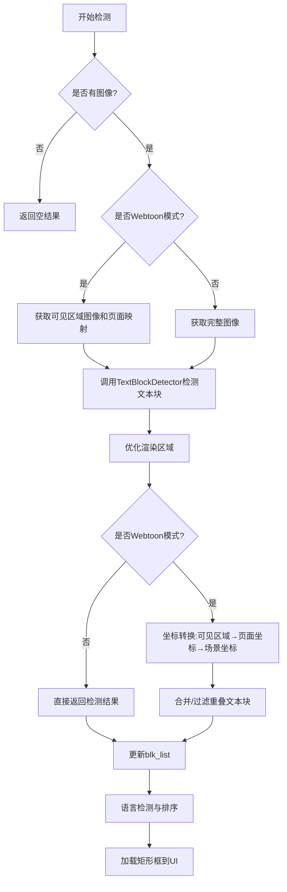

## 类结构

```
BlockDetectionHandler (文本块检测处理器)
    ├── main_page: 主页面引用
    └── block_detector_cache: 检测器缓存
```

## 全局变量及字段


### `logger`
    
模块级日志记录器，用于记录类运行过程中的日志信息

类型：`logging.Logger`
    


### `BlockDetectionHandler.main_page`
    
主页面对象引用，用于访问主页面及其子组件如image_viewer、settings_page等

类型：`MainPage`
    


### `BlockDetectionHandler.block_detector_cache`
    
TextBlockDetector检测器缓存，用于缓存检测器实例以避免重复创建

类型：`TextBlockDetector | None`
    
    

## 全局函数及方法


### `TextBlockDetector`

`TextBlockDetector` 是从 `modules.detection.processor` 模块导入的文本块检测器类，负责对图像中的文本区域进行检测识别。在 `BlockDetectionHandler` 类中通过缓存机制调用该检测器，支持普通图片模式和网页漫画（webtoon）模式的文本检测。

#### 使用方式分析

根据代码中的调用上下文推断：

#### 流程图

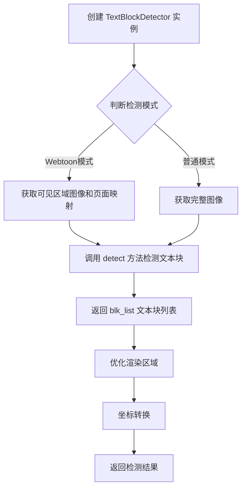

#### 带注释源码

```
# TextBlockDetector 类定义位于: modules.detection.processor
# 以下为根据调用上下文推断的类结构和使用方式

# ------------------------------
# 构造函数调用示例 (在 BlockDetectionHandler 中):
# ------------------------------
self.block_detector_cache = TextBlockDetector(self.main_page.settings_page)

# 参数:
# - settings_page: 从主页面传入的设置页面对象，包含检测器所需的配置参数

# ------------------------------
# detect 方法调用示例 (在 BlockDetectionHandler 中):
# ------------------------------
# 在 Webtoon 模式下的调用:
image, page_mappings = self.main_page.image_viewer.get_visible_area_image()
if image is None:
    return [], load_rects, None
blk_list = self.block_detector_cache.detect(image)

# 在普通模式下的调用:
image = self.main_page.image_viewer.get_image_array()
blk_list = self.block_detector_cache.detect(image)

# 参数:
# - image: QImage 或 numpy.ndarray 类型，需要进行文本检测的图像对象
# 返回值:
# - blk_list: List[TextBlock] 类型，检测到的文本块列表，每个 TextBlock 包含:
#   - xyxy: 文本块的坐标 [x1, y1, x2, y2]
#   - angle: 文本块的角度
#   - tr_origin_point: 变换原点坐标
#   - bubble_xyxy: 气泡框坐标（可选）
```

#### 详细信息

| 组件 | 类型 | 描述 |
|------|------|------|
| `TextBlockDetector` | 类 | 文本块检测器，用于识别图像中的文本区域 |
| `settings_page` | 对象 | 设置页面实例，包含检测器配置参数 |
| `detect()` | 方法 | 核心检测方法，接收图像返回文本块列表 |
| `image` | QImage/numpy.ndarray | 待检测的输入图像 |
| `blk_list` | List[TextBlock] | 检测结果，包含坐标和属性信息的文本块列表 |

#### 潜在优化空间

1. **缓存机制**：当前使用 `block_detector_cache` 缓存检测器实例，但未缓存检测结果，相同图像重复检测时会有性能损耗
2. **批量检测**：当前每次调用 `detect` 处理单张图像，可考虑支持批量处理提升效率
3. **Webtoon 模式优化**：坐标转换逻辑复杂，可提取为独立工具类

> **注意**：由于 `TextBlockDetector` 类的完整源代码未在提供的代码中给出，以上信息基于调用上下文的推断。实际实现可能包含更多方法和配置选项。


### `BlockDetectionHandler.load_box_coords`

该方法负责将检测到的文本块（TextBlock）坐标加载到图像查看器的UI中，根据是否为Webtoon模式选择性地清除矩形，并在图像上绘制文本块的边界框，同时自动选中第一个文本块。

参数：

- `blk_list`：`List[TextBlock]`，要加载的文本块列表，每个文本块包含坐标信息

返回值：`None`，该方法直接操作UI元素，不返回任何值

#### 流程图

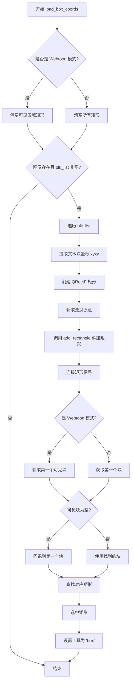

#### 带注释源码

```
def load_box_coords(self, blk_list: List[TextBlock]):
    # 根据模式清除矩形：Webtoon模式清空可见区域，普通模式清空所有
    if self.main_page.webtoon_mode:
        self.main_page.image_viewer.clear_rectangles_in_visible_area()
    else:
        self.main_page.image_viewer.clear_rectangles()
        
    # 检查图像是否存在且文本块列表非空
    if self.main_page.image_viewer.hasPhoto() and blk_list:
        # 遍历所有文本块，添加到图像查看器
        for blk in blk_list:
            # 提取文本块的坐标 [x1, y1, x2, y2]
            x1, y1, x2, y2 = blk.xyxy
            # 创建基于宽高的矩形
            rect = QtCore.QRectF(0, 0, x2 - x1, y2 - y1)
            # 获取旋转变换原点，如果存在则使用，否则为None
            transform_origin = QtCore.QPointF(*blk.tr_origin_point) if blk.tr_origin_point else None
            
            # 使用新的 add_rectangle 方法添加矩形，保持一致的处理方式
            # 参数：矩形对象、位置点、角度、变换原点
            rect_item = self.main_page.image_viewer.add_rectangle(
                rect, QtCore.QPointF(x1, y1), blk.angle, transform_origin
            )
            # 连接矩形的信号到处理函数
            self.main_page.connect_rect_item_signals(rect_item)

        # 在Webtoon模式下，使用第一个可见块而不是简单地第一个块
        if self.main_page.webtoon_mode:
            # 获取第一个可见的文本块
            first_block = get_first_visible_block(self.main_page.blk_list, self.main_page.image_viewer)
            # 如果没有可见块，回退到列表中的第一个块
            if first_block is None:
                first_block = self.main_page.blk_list[0]
        else:
            # 普通模式直接使用第一个块
            first_block = self.main_page.blk_list[0]
        
        # 查找与第一个块对应的矩形项并选中
        rect = self.main_page.rect_item_ctrl.find_corresponding_rect(first_block, 0.5)
        self.main_page.image_viewer.select_rectangle(rect)
        # 设置当前工具为'box'（框选工具）
        self.main_page.set_tool('box')
```

---

### `BlockDetectionHandler.detect_blocks`

该方法执行文本块检测操作，根据Webtoon模式选择不同的检测策略：在Webtoon模式下仅检测当前可见区域的文本块并将坐标转换为场景坐标，而在普通模式下则对整个图像进行检测，同时优化渲染区域并返回检测到的文本块列表。

参数：

- `load_rects`：`bool`，是否在检测完成后加载矩形到UI，默认为`True`

返回值：`tuple`，返回三元组 `(blk_list, load_rects, page_mappings_or_current_page)`，其中`blk_list`是检测到的`TextBlock`列表，`load_rects`是传入的加载标志，`page_mappings_or_current_page`在Webtoon模式下是页面映射列表，普通模式下是`None`

#### 流程图

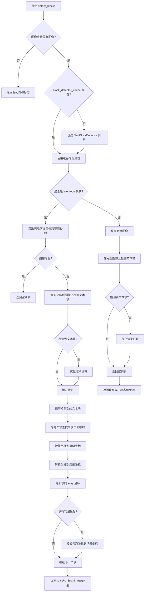

#### 带注释源码

```
def detect_blocks(self, load_rects=True):
    # 检查图像查看器是否有图像
    if self.main_page.image_viewer.hasPhoto():
        # 如果检测器缓存为空，创建新的检测器实例
        if self.block_detector_cache is None:
            self.block_detector_cache = TextBlockDetector(self.main_page.settings_page)
        
        # 在Webtoon模式下，仅在当前可见区域检测文本
        if self.main_page.webtoon_mode:
            # 获取可见区域图像及其页面映射关系
            image, page_mappings = self.main_page.image_viewer.get_visible_area_image()
            # 如果没有获取到图像，直接返回
            if image is None:
                return [], load_rects, None
            
            # 在可见区域图像上运行文本块检测
            blk_list = self.block_detector_cache.detect(image)

            # 检测后立即在本地可见坐标上优化渲染区域
            if blk_list:
                get_best_render_area(blk_list, image)
            
            # 将坐标从可见区域转换到场景坐标
            for blk in blk_list:
                x1, y1, x2, y2 = blk.xyxy
                
                # 查找该文本块属于哪个页面映射
                for mapping in page_mappings:
                    # 检查块的上边Y坐标是否在当前映射的组合Y范围内
                    if mapping['combined_y_start'] <= y1 < mapping['combined_y_end']:
                        # 从组合图像坐标转换到页面坐标
                        page_y1 = y1 - mapping['combined_y_start'] + mapping['page_crop_top']
                        page_y2 = y2 - mapping['combined_y_start'] + mapping['page_crop_top']
                        
                        # 从页面坐标转换到场景坐标
                        page_index = mapping['page_index']
                        # 获取左上角和右下角在场景中的位置
                        scene_pos_tl = self.main_page.image_viewer.page_to_scene_coordinates(
                            page_index, QtCore.QPointF(x1, page_y1)
                        )
                        scene_pos_br = self.main_page.image_viewer.page_to_scene_coordinates(
                            page_index, QtCore.QPointF(x2, page_y2)
                        )
                        
                        # 更新块的坐标为场景坐标
                        blk.xyxy = [scene_pos_tl.x(), scene_pos_tl.y(), scene_pos_br.x(), scene_pos_br.y()]
                        
                        # 同时更新气泡坐标 bubble_xyxy（如果存在）
                        if blk.bubble_xyxy is not None:
                            bx1, by1, bx2, by2 = blk.bubble_xyxy
                            bubble_page_y1 = by1 - mapping['combined_y_start'] + mapping['page_crop_top']
                            bubble_page_y2 = by2 - mapping['combined_y_start'] + mapping['page_crop_top']
                            bubble_scene_pos_tl = self.main_page.image_viewer.page_to_scene_coordinates(
                                page_index, QtCore.QPointF(bx1, bubble_page_y1)
                            )
                            bubble_scene_pos_br = self.main_page.image_viewer.page_to_scene_coordinates(
                                page_index, QtCore.QPointF(bx2, bubble_page_y2)
                            )
                            # 更新气泡坐标为场景坐标
                            blk.bubble_xyxy = [
                                bubble_scene_pos_tl.x(), bubble_scene_pos_tl.y(),
                                bubble_scene_pos_br.x(), bubble_scene_pos_br.y()
                            ]
                        break
            
            # 返回检测到的块列表、加载标志和页面映射
            return blk_list, load_rects, page_mappings
        else:
            # 普通单图像模式
            current_page = None
            # 获取完整图像数组
            image = self.main_page.image_viewer.get_image_array()
            # 在完整图像上检测文本块
            blk_list = self.block_detector_cache.detect(image)
            # 如果检测到块，优化渲染区域
            if blk_list:
                get_best_render_area(blk_list, image)
            # 返回块列表、加载标志和当前页面（None）
            return blk_list, load_rects, current_page
```

---

### `BlockDetectionHandler.on_blk_detect_complete`

该方法是文本块检测完成后的回调处理函数，负责将检测结果整合到现有的文本块列表中，在Webtoon模式下进行坐标去重和合并，最后对文本块进行排序并根据需要加载矩形到UI。

参数：

- `result`：`tuple`，检测结果元组，包含 `(blk_list, load_rects, page_mappings_or_current_page)`

返回值：`None`，该方法更新实例状态，不返回任何值

#### 流程图

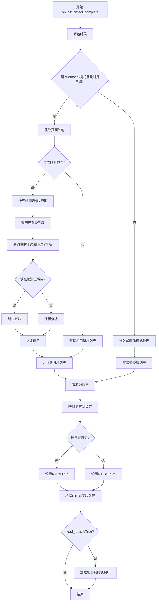

#### 带注释源码

```
def on_blk_detect_complete(self, result): 
    # 解包检测结果：块列表、是否加载矩形、页面映射或当前页面
    blk_list, load_rects, page_mappings_or_current_page = result
    
    # 处理Webtoon模式下可见区域检测的情况
    if self.main_page.webtoon_mode and isinstance(page_mappings_or_current_page, list):
        # page_mappings_or_current_page 实际上是可见区域检测的页面映射
        page_mappings = page_mappings_or_current_page
        
        # 坐标已在detect_blocks中转换为场景坐标
        # 只需与现有块合并并过滤重叠部分
        
        if page_mappings:
            # 获取检测到的场景Y坐标范围
            scene_y_min = min(mapping['scene_y_start'] for mapping in page_mappings)
            scene_y_max = max(mapping['scene_y_end'] for mapping in page_mappings)
            
            # 移除落在检测区域内的现有块以避免重复
            filtered_blocks = []
            for existing_blk in self.main_page.blk_list:
                blk_y = existing_blk.xyxy[1]  # 上边Y坐标
                blk_bottom = existing_blk.xyxy[3]  # 下边Y坐标
                
                # 保留不与检测区域重叠的块
                if not (blk_y >= scene_y_min and blk_bottom <= scene_y_max):
                    filtered_blocks.append(existing_blk)
            
            # 将新块添加到过滤后的列表
            self.main_page.blk_list = filtered_blocks + blk_list
        else:
            # 没有页面映射时直接使用新块列表
            self.main_page.blk_list = blk_list
    else:
        # 单图像模式下完全替换
        self.main_page.blk_list = blk_list
    
    # 获取当前选中的源语言
    source_lang = self.main_page.s_combo.currentText()
    # 映射语言到英文名称
    source_lang_english = self.main_page.lang_mapping.get(source_lang, source_lang)
    # 判断是否为RTL语言（如日语）
    rtl = True if source_lang_english == 'Japanese' else False
    # 根据语言方向对文本块进行排序
    self.main_page.blk_list = sort_blk_list(self.main_page.blk_list, rtl)
    
    # 如果需要加载矩形到UI
    if load_rects:
        # 对于可见区域检测，仅传递检测到的块用于加载矩形
        blocks_to_load = blk_list
        self.load_box_coords(blocks_to_load)
```

---

### `TextBlock`（导入）

`TextBlock` 是从 `modules.utils.textblock` 模块导入的文本块数据模型类，用于表示图像中检测到的文本区域，包含边界框坐标、旋转角度、气泡坐标等属性。

参数：（该类为数据模型，构造函数参数需参考源码）

返回值：（该类为数据模型，返回值需参考源码）

#### 流程图

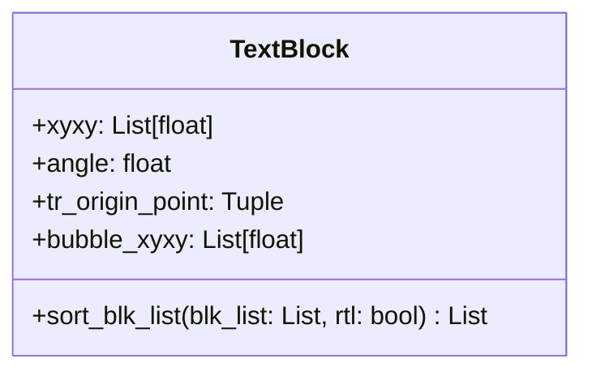

#### 带注释源码

```
# TextBlock 数据模型类（需参考 modules/utils/textblock.py）
from modules.utils.textblock import TextBlock, sort_blk_list

# TextBlock 常用属性：
# - xyxy: 文本块边界框坐标 [x1, y1, x2, y2]
# - angle: 文本块的旋转角度
# - tr_origin_point: 旋转变换的原点坐标
# - bubble_xyxy: 气泡框的边界坐标（如果有）

# sort_blk_list 是模块级函数，用于根据语言方向对文本块列表排序
# 参数：
#   - blk_list: List[TextBlock]，要排序的文本块列表
#   - rtl: bool，是否为从右到左的语言（如日语）
# 返回值：排序后的 List[TextBlock]
```


### `sort_blk_list`

该函数用于对文本块（TextBlock）列表进行排序，支持从左到右（LTR）和从右到左（RTL）两种排序模式，常用于日语等RTL语言的文本块排序场景。

参数：

- `blk_list`：`List[TextBlock]`，需要排序的文本块列表
- `rtl`：`bool`，是否从右到左排序（True 表示 RTL 模式，如日语；False 表示 LTR 模式）

返回值：`List[TextBlock]`，排序后的文本块列表

#### 流程图

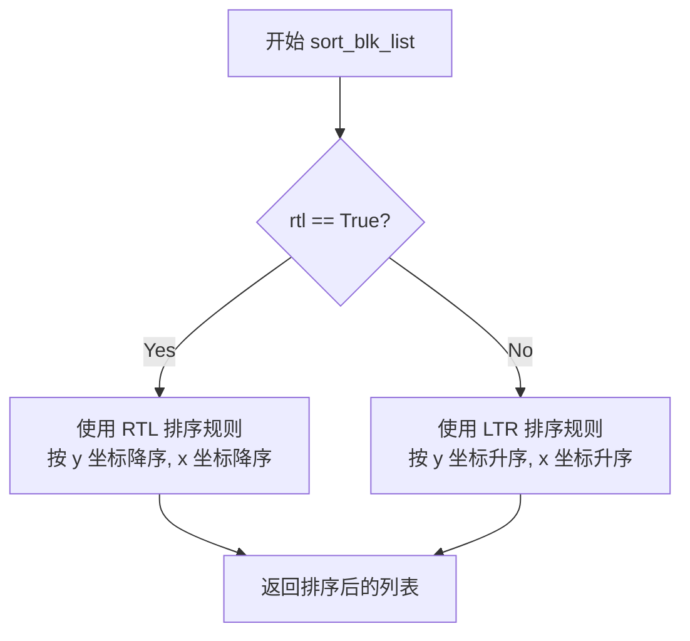

#### 带注释源码

```
# sort_blk_list 函数源码（基于模块路径 modules.utils.textblock 推断）
# 注意：以下为基于使用方式的推测实现，实际实现可能有所不同

def sort_blk_list(blk_list: List[TextBlock], rtl: bool = False) -> List[TextBlock]:
    """
    对文本块列表进行排序。
    
    参数:
        blk_list: 要排序的 TextBlock 对象列表
        rtl: 是否从右到左排序（日语等 RTL 语言为 True）
    
    返回:
        排序后的文本块列表
    """
    if rtl:
        # RTL 模式：先按 Y 坐标降序，再按 X 坐标降序
        # 这样可以实现从右到左、从上到下的阅读顺序
        sorted_list = sorted(blk_list, key=lambda blk: (blk.xyxy[1], blk.xyxy[0]), reverse=False)
        # 注：实际 RTL 排序逻辑可能更复杂，需要考虑行合并等
    else:
        # LTR 模式：先按 Y 坐标升序，再按 X 坐标升序
        # 实现从左到右、从上到下的阅读顺序
        sorted_list = sorted(blk_list, key=lambda blk: (blk.xyxy[1], blk.xyxy[0]))
    
    return sorted_list
```

> **注意**：由于提供的代码片段仅包含 `sort_blk_list` 的导入和使用，未包含其具体实现，以上源码为基于函数签名和使用方式的合理推断。实际实现可能包含更复杂的排序逻辑（如多行文本块处理、边界情况处理等）。建议查阅 `modules/utils/textblock.py` 文件获取完整实现。


### `get_best_render_area`

获取最佳渲染区域函数，用于在文本块检测后计算并优化渲染区域。该函数接收文本块列表和对应的图像数据，计算出适合渲染文本块的区域。

参数：

- `blk_list`：`List[TextBlock]`，文本块列表，包含检测到的文本块的坐标信息（xyxy格式）
- `image`：图像数据类型（来自 `get_visible_area_image()` 或 `get_image_array()` 的返回值），用于计算渲染区域的图像数据

返回值：`无返回值（None）`，该函数直接修改 `blk_list` 中的文本块属性来设置最佳渲染区域

#### 流程图

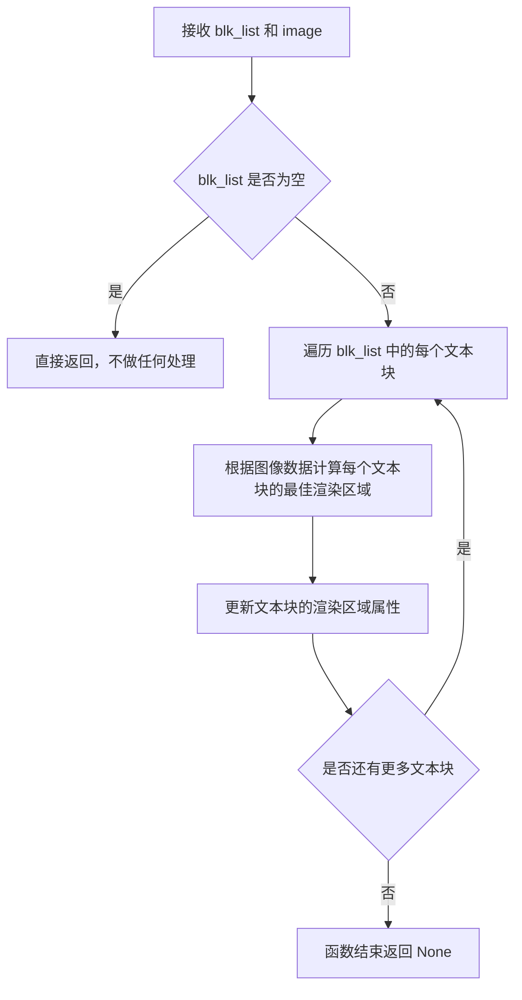

#### 带注释源码

```python
# 注意：以下为基于调用方式的推断源码，实际定义在 modules.rendering.render 模块中

def get_best_render_area(blk_list: List[TextBlock], image):
    """
    获取最佳渲染区域函数
    
    Args:
        blk_list: TextBlock 对象列表，每个对象包含 xyxy 坐标信息
        image: 图像数据（numpy array 或 QImage）
    
    Returns:
        None（直接修改 blk_list 中的对象属性）
    """
    
    # 遍历所有检测到的文本块
    for blk in blk_list:
        # 获取文本块的坐标
        x1, y1, x2, y2 = blk.xyxy
        
        # 基于图像数据计算最佳渲染区域
        # 可能涉及：
        # - 计算文本块的有效渲染区域
        # - 过滤掉超出图像边界的区域
        # - 根据图像特性调整渲染区域
        ...
        
        # 更新文本块的渲染区域属性（如果有的话）
        # blk.render_area = calculated_area
        ...
    
    # 函数直接修改 blk_list 中的对象，不返回任何值
    return None
```

> **注意**：该函数的实际定义位于 `modules.rendering.render` 模块中，用户提供的代码仅包含导入和调用语句。上述源码是基于函数调用方式和名称进行的合理推断。


# 函数分析结果

根据提供的代码，我需要提取 `get_first_visible_block` 函数的信息。

## 分析

经过仔细检查提供的代码，我发现：

1. **函数导入来源**：该函数从 `pipeline.webtoon_utils` 模块导入：
   ```python
   from pipeline.webtoon_utils import get_first_visible_block
   ```

2. **函数调用位置**：在 `BlockDetectionHandler` 类的 `load_box_coords` 方法中被调用：
   ```python
   first_block = get_first_visible_block(self.main_page.blk_list, self.main_page.image_viewer)
   ```

3. **问题**：函数 `get_first_visible_block` 的**实际实现代码并未包含在提供的代码片段中**。提供的代码只包含导入语句和在类中的调用，但没有该函数的具体实现。

---

### `get_first_visible_block`

（该函数定义位于 `pipeline/webtoon_utils.py` 模块中，但在当前提供的代码片段中未找到实际实现）

参数：

- `blk_list`：`List[TextBlock]`，文本块列表
- `image_viewer`：`ImageViewer`，图像查看器对象，用于获取可见区域信息

返回值：`TextBlock`，返回第一个可见的文本块，如果没有找到则返回 None

#### 流程图

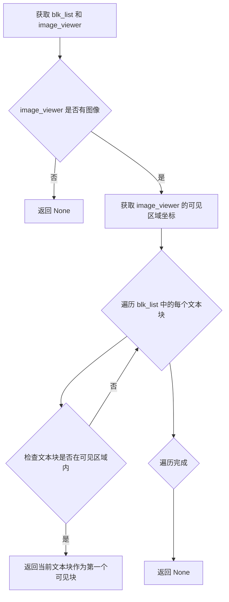

#### 带注释源码

```
# 该函数源码未在提供的代码片段中显示
# 位于 pipeline/webtoon_utils.py 模块中
# 从调用方式推断的预期实现逻辑：

def get_first_visible_block(blk_list, image_viewer):
    """
    获取第一个可见文本块
    
    参数:
        blk_list: 文本块列表 (List[TextBlock])
        image_viewer: 图像查看器对象
    
    返回:
        第一个可见的 TextBlock 对象，如果没有则返回 None
    """
    # 1. 检查图像查看器是否有图像
    if not image_viewer.hasPhoto():
        return None
    
    # 2. 获取当前可见区域（viewport）的边界
    visible_rect = image_viewer.get_visible_rect()
    
    # 3. 遍历文本块列表，找到第一个完全或部分在可见区域内的块
    for blk in blk_list:
        blk_rect = blk.get_rect()  # 获取文本块的矩形区域
        if visible_rect.intersects(blk_rect):
            return blk  # 返回第一个可见的文本块
    
    # 4. 如果没有找到可见的文本块，返回 None
    return None
```

---

## 补充说明

由于 `get_first_visible_block` 函数的实际源码未包含在提供的代码片段中，以上信息是基于：
1. 导入语句确定的模块位置（`pipeline/webtoon_utils`）
2. 函数调用时传递的参数推断出的函数签名
3. 函数名称和上下文推断出的功能逻辑

如需获取完整的函数实现，请提供 `pipeline/webtoon_utils.py` 文件的内容。


### `BlockDetectionHandler.__init__`

初始化文本块检测处理器，建立与主页面的关联并准备检测器缓存。

参数：

- `main_page`：`object`，主页面实例，包含图像查看器、设置页面、块列表等属性

返回值：`None`，无返回值，仅完成初始化操作

#### 流程图

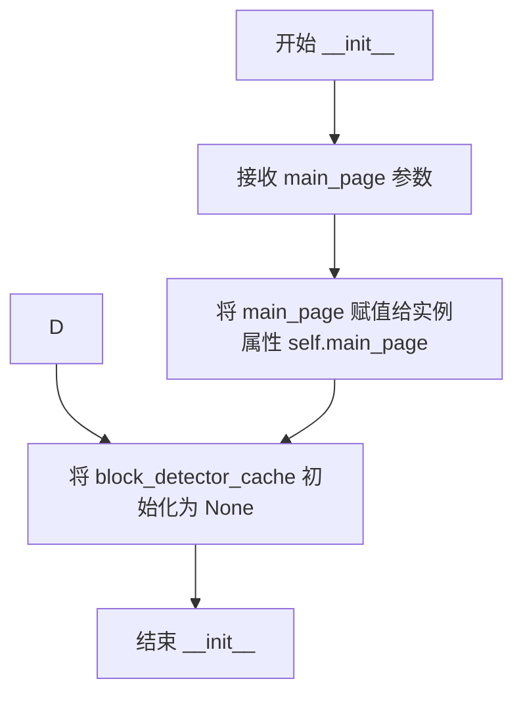

#### 带注释源码

```python
def __init__(self, main_page):
    """初始化文本块检测处理器
    
    Args:
        main_page: 主页面对象，包含图像查看器、设置页面、块列表等子组件
    """
    # 存储对主页面对象的引用，用于后续访问其属性和方法
    self.main_page = main_page
    
    # 初始化文本块检测器缓存为 None
    # 延迟初始化策略：实际检测时才创建 TextBlockDetector 实例
    self.block_detector_cache = None
```


### `BlockDetectionHandler.load_box_coords`

加载文本块坐标到UI界面，根据是否处于Webtoon模式执行不同的矩形清除逻辑，然后为每个文本块创建对应的矩形框，选中第一个文本块并切换工具为"box"。

参数：

- `blk_list`：`List[TextBlock]`，待加载到UI的文本块列表，每个元素包含文本块的坐标信息

返回值：`None`，该方法无返回值，主要通过修改UI状态（添加矩形框、选中矩形）来呈现结果

#### 流程图

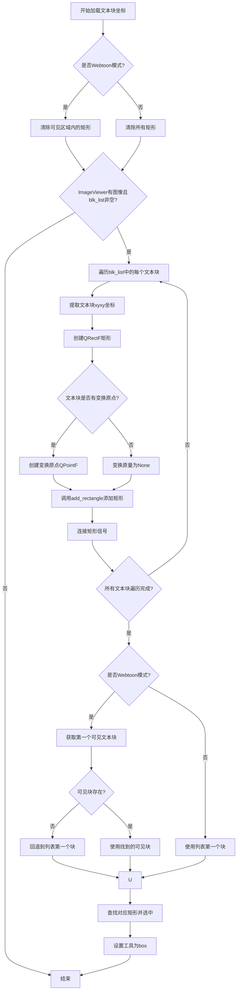

#### 带注释源码

```python
def load_box_coords(self, blk_list: List[TextBlock]):
    """
    将文本块坐标加载到UI界面显示
    
    Args:
        blk_list: TextBlock对象列表，每个对象包含xyxy坐标、angle角度、
                 tr_origin_point变换原点等信息
    """
    # 根据模式清除矩形框
    if self.main_page.webtoon_mode:
        # Webtoon模式下只清除可见区域内的矩形
        self.main_page.image_viewer.clear_rectangles_in_visible_area()
    else:
        # 普通模式下清除所有矩形
        self.main_page.image_viewer.clear_rectangles()
    
    # 检查是否有图像且有待显示的文本块
    if self.main_page.image_viewer.hasPhoto() and blk_list:
        # 遍历每个文本块，创建对应的矩形框
        for blk in blk_list:
            # 提取文本块的坐标信息 [x1, y1, x2, y2]
            x1, y1, x2, y2 = blk.xyxy
            
            # 创建相对矩形（宽高）
            rect = QtCore.QRectF(0, 0, x2 - x1, y2 - y1)
            
            # 处理变换原点（用于旋转等变换）
            transform_origin = QtCore.QPointF(*blk.tr_origin_point) if blk.tr_origin_point else None
            
            # 调用add_rectangle方法添加矩形到图像查看器
            # 参数: 相对矩形, 绝对位置坐标, 旋转角度, 变换原点
            rect_item = self.main_page.image_viewer.add_rectangle(
                rect, QtCore.QPointF(x1, y1), blk.angle, transform_origin
            )
            
            # 连接矩形的信号槽（如点击、选中等事件）
            self.main_page.connect_rect_item_signals(rect_item)

        # 根据模式确定要选中的第一个块
        if self.main_page.webtoon_mode:
            # Webtoon模式下使用第一个可见块（而非第一个块）
            first_block = get_first_visible_block(
                self.main_page.blk_list, 
                self.main_page.image_viewer
            )
            # 如果没有可见块，回退使用列表第一个块
            if first_block is None:
                first_block = self.main_page.blk_list[0]
        else:
            # 普通模式直接使用列表第一个块
            first_block = self.main_page.blk_list[0]
        
        # 查找对应的矩形项并选中
        rect = self.main_page.rect_item_ctrl.find_corresponding_rect(first_block, 0.5)
        self.main_page.image_viewer.select_rectangle(rect)
        
        # 切换工具为box（框选模式）
        self.main_page.set_tool('box')
```


### `BlockDetectionHandler.detect_blocks`

该方法负责执行文本块检测，根据是否为 Webtoon 模式采用不同的检测策略——在 Webtoon 模式下检测当前可见区域的文本，而在普通模式下检测整张图像，并返回检测到的文本块列表、是否加载矩形的标志以及页面映射信息。

参数：

- `load_rects`：`bool`，控制检测完成后是否加载矩形框，默认为 `True`

返回值：`(List[TextBlock], bool, Any)`，返回检测到的文本块列表、load_rects 参数值、以及页面映射信息（在 Webtoon 模式下为 `page_mappings`，在普通模式下为 `None`

#### 流程图

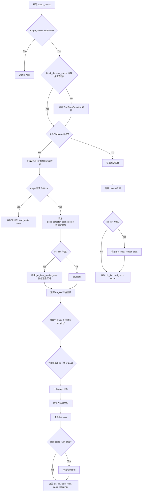

#### 带注释源码

```python
def detect_blocks(self, load_rects=True):
    """
    执行文本块检测，根据模式处理可见区域或整张图像
    
    参数:
        load_rects: bool, 检测完成后是否加载矩形框，默认True
        
    返回:
        tuple: (blk_list, load_rects, page_mappings_or_current_page)
            - blk_list: 检测到的TextBlock列表
            - load_rects: 传入的load_rects参数
            - page_mappings_or_current_page: Webtoon模式下的页面映射列表，普通模式下为None
    """
    # 检查图像查看器中是否有照片
    if self.main_page.image_viewer.hasPhoto():
        # 初始化或复用文本块检测器缓存
        if self.block_detector_cache is None:
            self.block_detector_cache = TextBlockDetector(self.main_page.settings_page)
        
        # Webtoon模式：仅在当前可见区域检测文本
        if self.main_page.webtoon_mode:
            # 获取可见区域图像及其页面映射关系
            image, page_mappings = self.main_page.image_viewer.get_visible_area_image()
            if image is None:
                return [], load_rects, None
            
            # 在可见区域图像上检测文本块
            blk_list = self.block_detector_cache.detect(image)

            # 检测到文本块后立即优化渲染区域（基于局部可见坐标）
            if blk_list:
                get_best_render_area(blk_list, image)
            
            # 将坐标从可见区域转换到场景坐标
            for blk in blk_list:
                x1, y1, x2, y2 = blk.xyxy
                
                # 查找该文本块属于哪个页面映射
                for mapping in page_mappings:
                    if mapping['combined_y_start'] <= y1 < mapping['combined_y_end']:
                        # 从组合图像坐标转换到页面坐标
                        page_y1 = y1 - mapping['combined_y_start'] + mapping['page_crop_top']
                        page_y2 = y2 - mapping['combined_y_start'] + mapping['page_crop_top']
                        
                        # 从页面坐标转换到场景坐标
                        page_index = mapping['page_index']
                        scene_pos_tl = self.main_page.image_viewer.page_to_scene_coordinates(
                            page_index, QtCore.QPointF(x1, page_y1)
                        )
                        scene_pos_br = self.main_page.image_viewer.page_to_scene_coordinates(
                            page_index, QtCore.QPointF(x2, page_y2)
                        )
                        
                        # 更新文本块的坐标
                        blk.xyxy = [scene_pos_tl.x(), scene_pos_tl.y(), scene_pos_br.x(), scene_pos_br.y()]
                        
                        # 同时更新气泡坐标（如果存在）
                        if blk.bubble_xyxy is not None:
                            bx1, by1, bx2, by2 = blk.bubble_xyxy
                            bubble_page_y1 = by1 - mapping['combined_y_start'] + mapping['page_crop_top']
                            bubble_page_y2 = by2 - mapping['combined_y_start'] + mapping['page_crop_top']
                            bubble_scene_pos_tl = self.main_page.image_viewer.page_to_scene_coordinates(
                                page_index, QtCore.QPointF(bx1, bubble_page_y1)
                            )
                            bubble_scene_pos_br = self.main_page.image_viewer.page_to_scene_coordinates(
                                page_index, QtCore.QPointF(bx2, bubble_page_y2)
                            )
                            blk.bubble_xyxy = [
                                bubble_scene_pos_tl.x(), bubble_scene_pos_tl.y(),
                                bubble_scene_pos_br.x(), bubble_scene_pos_br.y()
                            ]
                        break
            
            return blk_list, load_rects, page_mappings
        else:
            # 普通单图像模式
            current_page = None
            # 获取整张图像进行检测
            image = self.main_page.image_viewer.get_image_array()
            blk_list = self.block_detector_cache.detect(image)
            if blk_list:
                get_best_render_area(blk_list, image)
            return blk_list, load_rects, current_page
```


### `BlockDetectionHandler.on_blk_detect_complete`

处理检测完成回调，根据检测结果更新文本块列表，处理 Webtoon 模式下的坐标转换和块合并，最后根据需要加载矩形框。

参数：

- `result`：`Tuple[List[TextBlock], bool, Union[List[dict], Any]]`，检测结果元组，包含检测到的文本块列表(blk_list)、是否加载矩形标志(load_rects)、页面映射或当前页面信息(page_mappings_or_current_page)

返回值：`None`，无返回值

#### 流程图

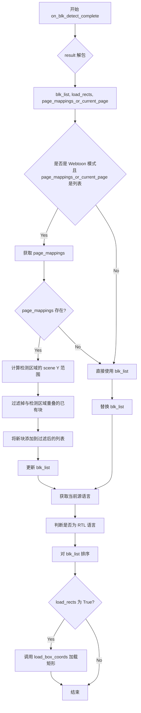

#### 带注释源码

```python
def on_blk_detect_complete(self, result): 
    # 解包检测结果：包含文本块列表、是否加载矩形标志、页面映射信息
    blk_list, load_rects, page_mappings_or_current_page = result
    
    # Handle webtoon mode with visible area detection
    # 判断是否处于 Webtoon 模式且包含页面映射列表
    if self.main_page.webtoon_mode and isinstance(page_mappings_or_current_page, list):
        # page_mappings_or_current_page 实际上是来自可见区域检测的 page_mappings
        page_mappings = page_mappings_or_current_page
        
        # 坐标已在 detect_blocks 中转换为场景坐标
        # 只需与现有块合并并过滤重叠的块
        
        if page_mappings:
            # 获取检测区域的场景 Y 坐标范围
            scene_y_min = min(mapping['scene_y_start'] for mapping in page_mappings)
            scene_y_max = max(mapping['scene_y_end'] for mapping in page_mappings)
            
            # 移除与检测区域重叠的现有块以避免重复
            filtered_blocks = []
            for existing_blk in self.main_page.blk_list:
                blk_y = existing_blk.xyxy[1]  # 获取顶部 Y 坐标
                blk_bottom = existing_blk.xyxy[3]  # 获取底部 Y 坐标
                
                # 保留不与检测区域重叠的块
                if not (blk_y >= scene_y_min and blk_bottom <= scene_y_max):
                    filtered_blocks.append(existing_blk)
            
            # 将新块添加到过滤后的列表
            self.main_page.blk_list = filtered_blocks + blk_list
        else:
            # 无页面映射时直接使用检测到的块
            self.main_page.blk_list = blk_list
    else:
        # 单图模式下完全替换文本块列表
        self.main_page.blk_list = blk_list
    
    # 获取当前选择的源语言
    source_lang = self.main_page.s_combo.currentText()
    # 映射语言名称到英文以判断是否为 RTL 语言
    source_lang_english = self.main_page.lang_mapping.get(source_lang, source_lang)
    # 判断是否为日语（RTL 语言）
    rtl = True if source_lang_english == 'Japanese' else False
    # 对文本块列表进行排序（根据语言方向）
    self.main_page.blk_list = sort_blk_list(self.main_page.blk_list, rtl)
    
    if load_rects:
        # 对于可见区域检测，只传递检测到的块用于矩形加载
        blocks_to_load = blk_list
        self.load_box_coords(blocks_to_load)
```

## 关键组件


### 张量索引与惰性加载

该组件通过`block_detector_cache`属性实现`TextBlockDetector`的惰性加载，只有在首次调用`detect_blocks`方法时才创建检测器实例，避免了不必要的资源占用。

### 反量化支持

该组件负责将检测到的文本块坐标从可见区域图像坐标转换为场景坐标。代码中实现了从combined_y坐标到page坐标再到scene坐标的两级转换过程，并同步更新`bubble_xyxy`气泡坐标。

### 量化策略

该组件实现了针对Webtoon模式的可见区域检测策略，通过`get_visible_area_image()`获取当前可见区域图像，仅对该区域进行文本块检测，并在检测后立即优化渲染区域。

### 矩形渲染与信号连接

该组件使用`add_rectangle`方法创建统一的矩形项，通过`connect_rect_item_signals`建立信号连接，实现了文本块的可视化展示与交互功能。

### 块列表管理与去重

该组件在`on_blk_detect_complete`中实现了块列表的合并与去重逻辑，通过计算场景Y坐标范围过滤掉与检测区域重叠的已有块，避免重复检测。

### 坐标排序与RTL支持

该组件根据语言设置（日语启用RTL）调用`sort_blk_list`对文本块进行排序，确保文本块的处理顺序符合语言阅读方向。


## 问题及建议


### 已知问题

-   **坐标转换逻辑复杂且重复**：在`detect_blocks`方法的webtoon模式分支中，坐标转换代码（从combined_y到page再到scene）出现多次，存在大量重复逻辑，缺乏提取为独立方法的抽象
-   **缓存机制不完善**：`block_detector_cache`在初始化后一直缓存，但在webtoon模式和普通图像模式之间切换时，检测器配置可能需要不同，缓存未考虑模式切换的场景
-   **违反迪米特法则**：`BlockDetectionHandler`直接访问`main_page`的多个属性（如`webtoon_mode`、`blk_list`、`image_viewer`、`settings_page`等），形成强耦合，类职责不清晰
-   **缺少异常处理**：`get_first_visible_block`可能返回`None`，后续直接访问`blk_list[0]`未做充分保护；`page_mappings`遍历时若未找到匹配的mapping，块坐标将不会被更新
-   **魔法数字**：`find_corresponding_rect`调用中的参数`0.5`未解释含义，后续维护困难
-   **类型注解不完整**：`on_blk_detect_complete`方法的`result`参数类型仅标注为`Any`，`load_box_coords`方法缺少返回类型注解
-   **日志记录缺失**：关键操作路径（如检测完成、坐标加载）没有logger记录，线上问题难以追踪

### 优化建议

-   **提取坐标转换方法**：将webtoon模式下的坐标转换逻辑封装为独立的私有方法（如`_convert_block_coords_to_scene`），提高可读性和可测试性
-   **重构依赖注入**：通过构造函数或方法参数传入必要的依赖（如`image_viewer`、`settings_page`），而非直接访问`main_page`属性，降低类间耦合
-   **完善缓存策略**：在缓存检测器时考虑配置变化，或提供`invalidate_cache`方法以支持手动刷新
-   **添加防御性编程**：在访问`blk_list[0]`前进行`None`检查；在遍历`page_mappings`时添加`else`分支处理未匹配情况
-   **补充类型注解和文档**：为所有方法添加完整的类型注解，特别是复杂参数和返回值；为关键逻辑添加docstring说明
-   **增加日志记录**：在关键路径添加`logger.debug`或`logger.info`记录，便于问题排查和性能监控
-   **消除魔法数字**：将`0.5`等常量提取为类常量或枚举，并添加有意义的名称注释

## 其它


### 设计目标与约束

本模块的设计目标是在Webtoon（条漫）和单页图像两种模式下实现高效、准确的文本框检测与坐标管理。核心约束包括：1）必须在Webtoon模式下仅检测当前可见区域内的文本，以优化性能；2）检测到的坐标必须从图像坐标转换为场景坐标，以正确渲染在UI上；3）支持RTL语言（如日语）的文本框排序逻辑；4）必须维护与现有文本框的兼容性，避免重复检测。

### 错误处理与异常设计

本模块采用防御式编程策略，主要错误处理包括：1）在`detect_blocks`方法中，当`get_visible_area_image()`返回None时直接返回空结果，避免空指针异常；2）在`load_box_coords`方法中，当`get_first_visible_block`返回None时fallback到列表第一个元素；3）所有Qt对象操作前均检查有效性（如`hasPhoto()`）；4）异常主要通过Python内置异常机制向上抛出，由调用方统一处理。

### 数据流与状态机

数据流如下：1）用户触发检测 → `detect_blocks()`被调用；2）根据`webtoon_mode`选择不同检测路径；3）Webtoon模式：获取可见区域图像和页面映射 → `TextBlockDetector.detect()` → 坐标转换（图像坐标→场景坐标） → 合并到现有文本框列表；4）单页模式：直接检测全图 → 返回文本框列表；5）`on_blk_detect_complete()`回调处理结果 → 排序 → `load_box_coords()`渲染矩形。状态转换通过`blk_list`列表和`block_detector_cache`缓存管理。

### 外部依赖与接口契约

本模块依赖以下外部组件：1）`TextBlockDetector`（`modules.detection.processor`）：图像文本检测器，接收numpy图像数组，返回TextBlock列表；2）`TextBlock`（`modules.utils.textblock`）：文本框数据结构，包含xyxy坐标、angle旋转角度、tr_origin_point变换原点、bubble_xyxy气泡坐标等属性；3）`get_best_render_area`（`modules.rendering.render`）：优化渲染区域的工具函数；4）`get_first_visible_block`（`pipeline.webtoon_utils`）：获取当前可见区域内的第一个文本框；5）`main_page`：主页面控制器，提供image_viewer、settings_page、blk_list等属性及信号连接方法；6）`image_viewer`：图像查看器，提供`add_rectangle`、`select_rectangle`、`page_to_scene_coordinates`等坐标转换和UI操作方法。

### 性能优化与缓存策略

本模块实现了以下性能优化：1）`block_detector_cache`成员变量缓存`TextBlockDetector`实例，避免重复创建；2）在Webtoon模式下仅处理可见区域图像，减少检测范围；3）坐标转换使用批量处理而非逐个转换；4）使用`filtered_blocks`预过滤避免重复合并。

### 并发与线程安全考虑

本模块本身为同步执行，但通过`on_blk_detect_complete`回调机制与异步检测流程集成。需注意：1）`blk_list`的读写操作需在主线程完成；2）`image_viewer`的UI操作必须在主线程调用；3）`TextBlockDetector`的检测操作应在后台线程执行以避免阻塞UI。

### 配置与参数说明

关键配置参数包括：1）`main_page.webtoon_mode`（布尔）：是否为Webtoon模式，决定检测范围和坐标处理逻辑；2）`main_page.settings_page`：检测器配置参数来源；3）`source_lang`（字符串）：当前源语言，用于决定RTL排序；4）`blk.xyxy`（List[float]）：文本框坐标[x1,y1,x2,y2]；5）`blk.angle`（float）：文本框旋转角度；6）`blk.tr_origin_point`（Tuple）：变换原点坐标。

### 可测试性与单元测试建议

本模块适合进行以下单元测试：1）`detect_blocks`在Webtoon模式和单页模式下的输出验证；2）坐标转换逻辑的正确性验证；3）`load_box_coords`在有无文本框情况下的行为验证；4）空图像和无效输入的异常处理测试；5）语言切换时RTL排序逻辑的正确性验证。

### 版本兼容性与迁移说明

本模块使用PySide6 QtCore模块，需确保Qt版本兼容性。`QRectF`、`QPointF`等类型用于跨平台坐标表示。`TextBlock`数据结构需保持与`modules.utils.textblock`模块的版本兼容，特别是`xyxy`、`angle`、`tr_origin_point`、`bubble_xyxy`等属性的存在性。


    