# `comic-translate\pipeline\cache_manager.py` 详细设计文档

CacheManager类管理OCR识别和翻译结果的缓存，通过图像哈希、模型键、语言对等参数生成缓存键，并支持精确和模糊匹配（坐标容差）来检索缓存结果，以提高pipeline的效率和避免重复计算。

## 整体流程

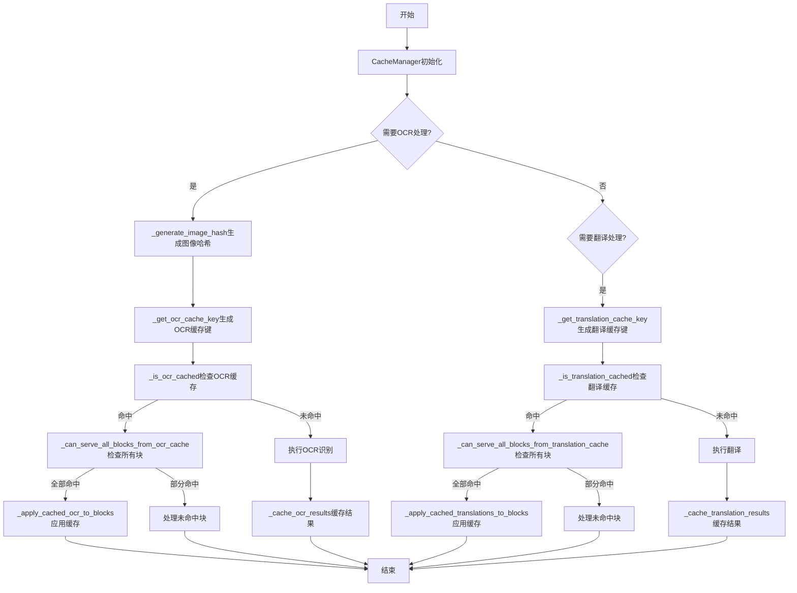

## 类结构

```
CacheManager
```

## 全局变量及字段


### `logger`
    
模块级日志记录器，用于记录缓存管理过程中的信息、警告和错误

类型：`logging.Logger`
    


### `CacheManager.ocr_cache`
    
OCR结果缓存字典，键为(image_hash, ocr_model, source_lang, device)元组，值为{block_id: text}字典，用于存储文本识别结果

类型：`dict`
    


### `CacheManager.translation_cache`
    
翻译结果缓存字典，键为(image_hash, translator_key, source_lang, target_lang, context_hash)元组，值为{block_id: {source_text, translation}}字典，用于存储翻译结果及对应的源文本

类型：`dict`
    
    

## 全局函数及方法


### `CacheManager.__init__`

初始化缓存管理器，创建用于存储OCR识别结果和翻译结果的缓存字典。

参数：
- 无（`__init__` 方法仅接收 `self` 参数）

返回值：`None`，该方法为构造函数，不返回任何值，仅初始化实例属性。

#### 流程图

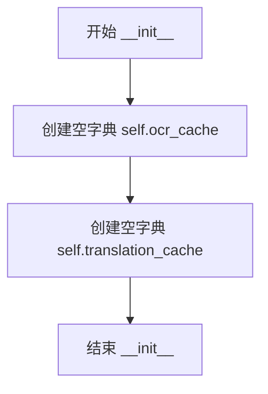

#### 带注释源码

```python
def __init__(self):
    """Initialize the cache manager with empty caches for OCR and translation results."""
    # OCR results cache: {(image_hash, model_key, source_lang, device): {block_id: text}}
    self.ocr_cache = {}
    
    # Translation results cache: {(image_hash, translator_key, source_lang, target_lang, context_hash): {block_id: {source_text: str, translation: str}}}
    self.translation_cache = {}
```


### `CacheManager.clear_ocr_cache`

清除 OCR 缓存，该方法手动清空 `ocr_cache` 字典并记录日志，用于在需要强制重新进行 OCR 识别时重置缓存。

参数：无

返回值：`None`，无返回值描述

#### 流程图

```mermaid
flowchart TD
    A[开始 clear_ocr_cache] --> B[将 self.ocr_cache 设为空字典 {}]
    B --> C[记录日志: 'OCR cache manually cleared']
    C --> D[结束]
```

#### 带注释源码

```python
def clear_ocr_cache(self):
    """Clear the OCR cache. Note: Cache now persists across image and model changes automatically."""
    # 将 ocr_cache 字典重置为空字典，实现缓存清除
    self.ocr_cache = {}
    # 记录操作日志，便于调试和追踪缓存清除事件
    logger.info("OCR cache manually cleared")
```


### `CacheManager.clear_translation_cache`

清除翻译缓存，将 `translation_cache` 字典重置为空字典，并记录日志信息。

参数：

- （无参数，仅 `self` 隐式参数）

返回值：`None`，无返回值描述（Python 中默认返回 `None`）

#### 流程图

```mermaid
flowchart TD
    A[开始 clear_translation_cache] --> B[将 self.translation_cache 设置为空字典 {}]
    B --> C[记录日志: Translation cache manually cleared]
    C --> D[结束 - 返回 None]
```

#### 带注释源码

```python
def clear_translation_cache(self):
    """Clear the translation cache. Note: Cache now persists across image and model changes automatically."""
    # 将翻译缓存字典重置为空字典，释放所有缓存的翻译结果
    self.translation_cache = {}
    # 记录手动清除翻译缓存的操作日志，用于调试和审计
    logger.info("Translation cache manually cleared")
```


### `CacheManager._generate_image_hash`

生成图像的唯一哈希值，用于作为缓存键。通过对图像进行降采样（每10个像素取1个）来提高哈希计算效率，同时保持唯一性。若采样失败，则回退使用图像的形状和类型信息生成哈希。

参数：

- `image`：图像对象，需要具有切片操作和 `tobytes()` 方法（通常为 NumPy 数组），待生成哈希的图像数据

返回值：`str`，返回 MD5 哈希值的十六进制字符串，用于标识图像唯一性

#### 流程图

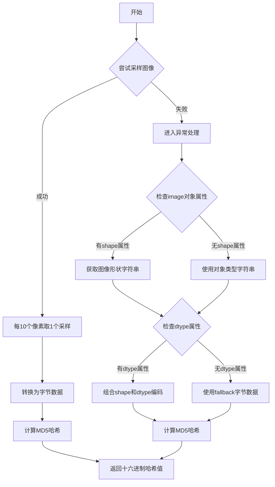

#### 带注释源码

```python
def _generate_image_hash(self, image):
    """Generate a hash for the image to use as cache key"""
    try:
        # Use a small portion of the image data to generate hash for efficiency
        # Take every 10th pixel to reduce computation while maintaining uniqueness
        # 使用切片操作 [::10, ::10] 对图像进行降采样，只保留每10个像素
        # 这样可以大幅减少需要处理的数据量，同时仍能保持图像的唯一性标识
        sample_data = image[::10, ::10].tobytes()
        # 使用 MD5 算法生成哈希值，返回十六进制字符串形式
        return hashlib.md5(sample_data).hexdigest()
    except Exception as e:
        # Fallback: use the full image shape and first few bytes if sampling fails
        # 如果采样失败（例如图像不支持切片操作或tobytes方法），使用备用方案
        # 获取图像的形状信息（如 (height, width, channels)）
        shape_str = str(image.shape) if hasattr(image, 'shape') else str(type(image))
        # 获取图像的数据类型信息（如 uint8, float32 等）
        fallback_data = shape_str.encode() + str(image.dtype).encode() if hasattr(image, 'dtype') else b'fallback'
        # 使用备用数据生成 MD5 哈希
        return hashlib.md5(fallback_data).hexdigest()
```


### `CacheManager._get_ocr_cache_key`

生成用于OCR结果缓存的唯一键值，该键值由图像哈希、OCR模型标识符、源语言和设备信息组合而成，确保相同输入参数下的OCR结果可被正确缓存和检索。

参数：

- `image`：输入的图像数据（numpy数组或其他图像对象），用于生成图像哈希值
- `source_lang`：字符串，源语言代码（如"en"、"zh"等），用于区分不同语言的OCR结果
- `ocr_model`：字符串，OCR模型的标识符（如"tesseract"、"paddleocr"等），用于区分不同模型的OCR结果
- `device`：字符串，可选参数，默认为None，执行OCR的设备类型（如"cpu"、"cuda"等）

返回值：`tuple`，返回一个包含四个元素的元组 `(image_hash, ocr_model, source_lang, device)`，作为OCR缓存的唯一标识键。

#### 流程图

```mermaid
flowchart TD
    A[开始 _get_ocr_cache_key] --> B[调用 _generate_image_hash 传入 image]
    B --> C{图像哈希生成成功?}
    C -->|是| D[获取 image_hash]
    C -->|否| E[使用 fallback 方式生成哈希]
    E --> D
    D --> F{device 参数是否为 None?}
    F -->|是| G[设置 device = 'unknown']
    F -->|否| H[保持原有 device 值]
    G --> I[返回元组 (image_hash, ocr_model, source_lang, device)]
    H --> I
```

#### 带注释源码

```python
def _get_ocr_cache_key(self, image, source_lang, ocr_model, device=None):
    """Generate cache key for OCR results
    
    该方法生成一个唯一的缓存键，用于标识特定图像、OCR模型、源语言
    和设备组合下的OCR结果。通过使用图像哈希而非完整图像数据作为
    缓存键的一部分，可以有效减少内存占用并提高缓存查找效率。
    
    Args:
        image: 输入的图像数据（通常为numpy数组）
        source_lang: 源语言代码，用于区分不同语言的OCR结果
        ocr_model: OCR模型的标识符，用于区分不同OCR引擎的结果
        device: 可选参数，执行OCR的设备类型，默认为None
    
    Returns:
        tuple: 缓存键元组，格式为 (image_hash, ocr_model, source_lang, device)
               image_hash: 图像数据的MD5哈希值
               ocr_model: OCR模型标识符
               source_lang: 源语言代码
               device: 设备类型字符串
    """
    # Step 1: 生成图像哈希值作为缓存键的第一部分
    # 使用图像哈希而非完整图像数据，可大幅减少内存占用
    image_hash = self._generate_image_hash(image)
    
    # Step 2: 处理设备参数为空的情况
    # 当device为None时，使用"unknown"作为默认值，确保缓存键始终包含四个元素
    if device is None:
        device = "unknown"
    
    # Step 3: 返回完整的缓存键元组
    # 元组包含四个元素：图像哈希、OCR模型、源语言、设备
    # 这种组合方式确保了缓存键的唯一性：相同图像+相同模型+相同语言+相同设备 = 相同缓存键
    return (image_hash, ocr_model, source_lang, device)
```


### `CacheManager._get_block_id`

生成块唯一标识符，根据文本块的位置信息（边界框坐标和角度）创建一个唯一的字符串标识符。

参数：

- `block`：`object`，文本块对象，需包含 `xyxy`（边界框坐标元组）和 `angle`（角度属性）

返回值：`str`，基于坐标和角度生成的唯一标识符字符串，格式为 `{x1}_{y1}_{x2}_{y2}_{angle}`；若获取属性失败则返回对象的 `id` 字符串作为后备方案

#### 流程图

```mermaid
flowchart TD
    A[Start _get_block_id] --> B{尝试获取 block.xyxy 和 block.angle}
    B -->|成功| C[提取坐标 x1, y1, x2, y2 和 angle]
    C --> D[格式化为字符串: f"{int(x1)}_{int(y1)}_{int(x2)}_{int(y2)}_{int(angle)}"]
    D --> E[返回格式化的标识符字符串]
    B -->|失败: AttributeError / ValueError / TypeError| F[调用后备方案: str(id(block))]
    F --> E
```

#### 带注释源码

```python
def _get_block_id(self, block):
    """Generate a unique identifier for a text block based on its position"""
    try:
        # 尝试从 block 对象中提取边界框坐标和角度信息
        # block.xyxy 应该是一个包含 (x1, y1, x2, y2) 的元组，表示左上角和右下角坐标
        x1, y1, x2, y2 = block.xyxy
        # 获取文本块的角度信息，用于区分不同方向或倾斜的块
        angle = block.angle
        # 组合坐标和角度生成唯一标识符，格式: x1_y1_x2_y2_angle
        # 使用 int() 转换以减少字符串长度并提高缓存键的一致性
        return f"{int(x1)}_{int(y1)}_{int(x2)}_{int(y2)}_{int(angle)}"
    except (AttributeError, ValueError, TypeError):
        # 后备方案：当 block 对象缺少必要属性或属性类型不匹配时
        # 使用 Python 对象的内置 id() 作为唯一标识符
        # 注意：这种方式生成的 ID 在不同运行期间可能不同，仅用于保底
        return str(id(block))
```


### `CacheManager._find_matching_block_id`

该方法用于在OCR缓存中查找与目标文本块匹配的块ID，支持精确匹配和基于坐标与角度容差的模糊匹配（坐标容差5像素，角度容差1度），以应对OCR检测框微小变化导致的缓存未命中问题。

参数：

- `cache_key`：元组 `(image_hash, ocr_model, source_lang, device)`，缓存键，用于定位OCR缓存条目
- `target_block`：对象，具有 `xyxy` 属性（边界框坐标）和 `angle` 属性（旋转角度），目标文本块

返回值：元组 `(matched_id, result)`，其中 `matched_id` 为字符串（匹配的缓存块ID，未找到时为 `None`），`result` 为字符串（对应块ID的OCR文本，未找到时为空字符串 `""`）

#### 流程图

```mermaid
flowchart TD
    A[开始 _find_matching_block_id] --> B[获取目标块ID: target_id = _get_block_id(target_block)]
    B --> C{缓存中是否存在 target_id?}
    C -->|是| D[返回精确匹配: (target_id, cached_results[target_id])]
    C -->|否| E[提取目标块坐标和角度]
    E --> F[设置容差: tolerance = 5.0像素, angle_tolerance = 1.0度]
    F --> G[遍历缓存中的所有块ID]
    G --> H{解析成功且坐标数量足够?}
    H -->|否| I[继续下一个缓存ID]
    H -->|是| J{所有坐标和角度在容差范围内?}
    J -->|是| K[返回模糊匹配: (cached_id, cached_results[cached_id])]
    J -->|否| I
    G --> L{所有缓存ID遍历完成?}
    L -->|否| G
    L -->|是| M[无匹配: 返回 (None, "")]
    K --> N[结束]
    D --> N
    M --> N
```

#### 带注释源码

```python
def _find_matching_block_id(self, cache_key, target_block):
    """Find a matching block ID in cache, allowing for small coordinate differences"""
    # Step 1: 生成目标块的唯一标识符（基于边界框坐标和角度）
    target_id = self._get_block_id(target_block)
    # Step 2: 根据cache_key获取对应的OCR缓存结果字典
    cached_results = self.ocr_cache.get(cache_key, {})
    
    # Step 3: 优先尝试精确匹配
    # 直接使用目标块的ID在缓存字典中查找
    if target_id in cached_results:
        return target_id, cached_results[target_id]
    
    # Step 4: 精确匹配失败，启用模糊匹配逻辑
    # 适用于OCR检测框因图像处理略有偏差的情况
    try:
        # 提取目标块的边界框坐标 (x1, y1, x2, y2) 和旋转角度
        target_x1, target_y1, target_x2, target_y2 = target_block.xyxy
        target_angle = getattr(target_block, 'angle', 0)
        
        # 定义坐标匹配容差（单位：像素）
        tolerance = 5.0
        
        # 遍历缓存中所有已存储的块ID，尝试找到满足容差条件的匹配
        for cached_id in cached_results.keys():
            try:
                # 解析缓存ID格式: "x1_y1_x2_y2_angle"
                parts = cached_id.split('_')
                if len(parts) >= 5:
                    # 提取缓存中块的四角坐标和角度
                    cached_x1 = float(parts[0])
                    cached_y1 = float(parts[1])
                    cached_x2 = float(parts[2])
                    cached_y2 = float(parts[3])
                    cached_angle = float(parts[4])
                    
                    # 检查所有坐标和角度是否都在容差范围内
                    # 坐标允许5像素偏差，角度允许1度偏差
                    if (abs(target_x1 - cached_x1) <= tolerance and
                        abs(target_y1 - cached_y1) <= tolerance and
                        abs(target_x2 - cached_x2) <= tolerance and
                        abs(target_y2 - cached_y2) <= tolerance and
                        abs(target_angle - cached_angle) <= 1.0):  # 1 degree tolerance for angle
                        
                        # 记录模糊匹配成功日志（仅显示ID前20字符）
                        logger.debug(f"Fuzzy match found for OCR: {target_id[:20]}... -> {cached_id[:20]}...")
                        # 返回模糊匹配的ID及其缓存结果
                        return cached_id, cached_results[cached_id]
            except (ValueError, IndexError):
                # 解析失败时跳过当前缓存ID，继续尝试下一个
                continue
                    
    except (AttributeError, ValueError, TypeError):
        # 目标块缺少必要属性或类型错误时，静默放弃模糊匹配
        pass
    
    # Step 5: 精确匹配和模糊匹配均未找到有效结果
    # 返回空标识符和空字符串，表示缓存未命中
    return None, ""
```


### `CacheManager._find_matching_translation_block_id`

查找匹配的翻译块ID（支持模糊匹配），允许在缓存中查找与目标块坐标相近的翻译结果，用于处理由于图像处理微小差异导致的块坐标不完全匹配情况。

参数：

- `cache_key`：元组 `(image_hash, translator_key, source_lang, target_lang, context_hash)`，缓存键，用于定位缓存中的翻译结果集
- `target_block`：对象，具有 `xyxy` 属性（边界框坐标）和 `angle` 属性（旋转角度），目标文本块，用于匹配缓存中的块

返回值：元组 `(匹配到的块ID或None, 缓存的翻译结果或空字符串)`，返回缓存中匹配块的ID和对应的翻译结果，如果找不到匹配则返回 `(None, "")`

#### 流程图

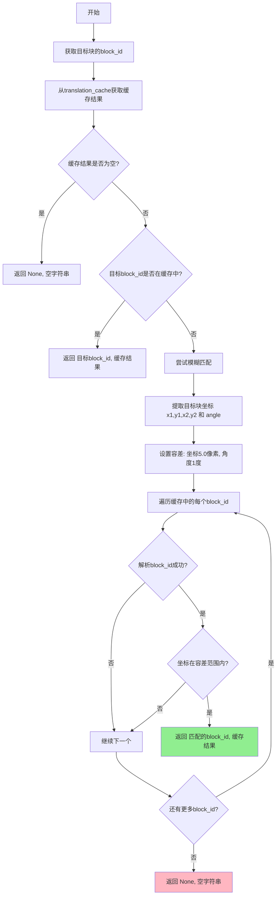

#### 带注释源码

```python
def _find_matching_translation_block_id(self, cache_key, target_block):
    """Find a matching block ID in translation cache, allowing for small coordinate differences"""
    # 步骤1: 生成目标块的唯一标识符
    target_id = self._get_block_id(target_block)
    
    # 步骤2: 获取该缓存键下的所有翻译缓存结果
    cached_results = self.translation_cache.get(cache_key, {})
    
    # 步骤3: 首先尝试精确匹配
    # 如果目标block_id完全匹配缓存中的某个block_id，直接返回
    if target_id in cached_results:
        return target_id, cached_results[target_id]
    
    # 步骤4: 如果没有精确匹配，尝试模糊匹配（容差匹配）
    # 这用于处理由于图像处理微小差异导致的坐标不完全匹配
    try:
        # 提取目标块的边界框坐标和角度
        target_x1, target_y1, target_x2, target_y2 = target_block.xyxy
        target_angle = getattr(target_block, 'angle', 0)
        
        # 设置容差值：坐标容差5.0像素，角度容差1度
        tolerance = 5.0
        
        # 遍历缓存中所有的block_id，尝试找到匹配
        for cached_id in cached_results.keys():
            try:
                # 解析缓存ID，提取坐标信息（格式: x1_y1_x2_y2_angle）
                parts = cached_id.split('_')
                if len(parts) >= 5:
                    cached_x1 = float(parts[0])
                    cached_y1 = float(parts[1])
                    cached_x2 = float(parts[2])
                    cached_y2 = float(parts[3])
                    cached_angle = float(parts[4])
                    
                    # 检查所有坐标和角度是否在容差范围内
                    if (abs(target_x1 - cached_x1) <= tolerance and
                        abs(target_y1 - cached_y1) <= tolerance and
                        abs(target_x2 - cached_x2) <= tolerance and
                        abs(target_y2 - cached_y2) <= tolerance and
                        abs(target_angle - cached_angle) <= 1.0):  # 1度角度容差
                        
                        # 找到模糊匹配，记录日志并返回结果
                        logger.debug(f"Fuzzy match found for translation: {target_id[:20]}... -> {cached_id[:20]}...")
                        return cached_id, cached_results[cached_id]
            except (ValueError, IndexError):
                # 解析失败，跳过当前block_id，继续尝试下一个
                continue
                
    except (AttributeError, ValueError, TypeError):
        # 目标块没有xyxy属性或angle属性，无法进行模糊匹配
        pass
    
    # 步骤5: 未找到任何匹配（精确匹配和模糊匹配都失败）
    return None, ""
```


### `CacheManager._is_ocr_cached`

检查OCR结果是否已缓存，用于判断给定cache_key是否在OCR缓存中存在

参数：

-  `cache_key`：`tuple`，缓存键，格式为(image_hash, ocr_model, source_lang, device)，用于在OCR缓存中查找对应的缓存记录

返回值：`bool`，返回True表示该cache_key已存在于ocr_cache中（已缓存），返回False表示不存在（未缓存）

#### 流程图

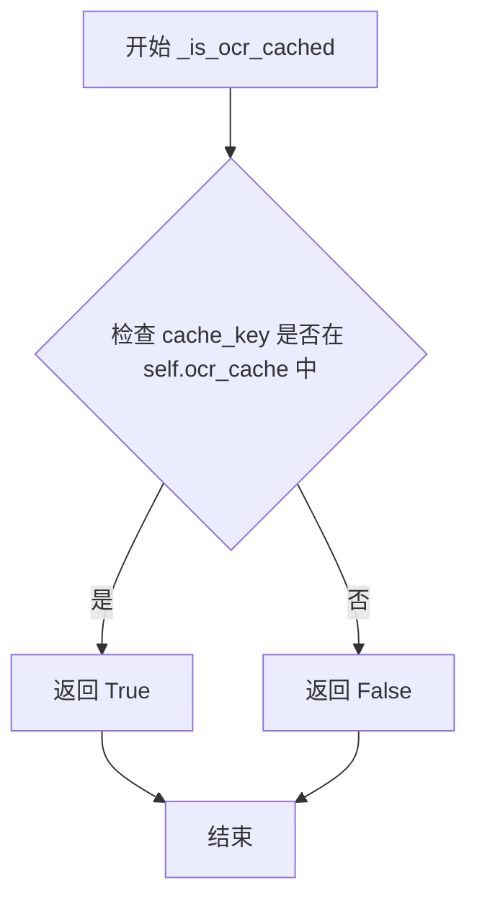

#### 带注释源码

```python
def _is_ocr_cached(self, cache_key):
    """Check if OCR results are cached for this image/model/language combination"""
    # 使用 Python 的 in 操作符检查 cache_key 是否作为键存在于 ocr_cache 字典中
    # self.ocr_cache 是一个字典，键为 cache_key，值为该图像/模型/语言组合的OCR结果
    return cache_key in self.ocr_cache
```


### `CacheManager._cache_ocr_results`

该方法负责将OCR识别结果缓存到内存字典中，支持原始块和处理后块的分离存储，仅保存包含有效文本的块，并在缓存失败时优雅处理异常。

参数：

- `cache_key`：`tuple`，缓存键，包含图像哈希、OCR模型、源语言和设备信息，用于唯一标识一组OCR结果
- `blk_list`：`list`，原始文本块列表，从中提取块ID用于缓存索引
- `processed_blk_list`：`list`，可选参数，包含OCR识别后文本的处理后块列表，用于提取实际识别的文本内容

返回值：`None`，该方法无返回值，通过修改 `self.ocr_cache` 字典实现缓存

#### 流程图

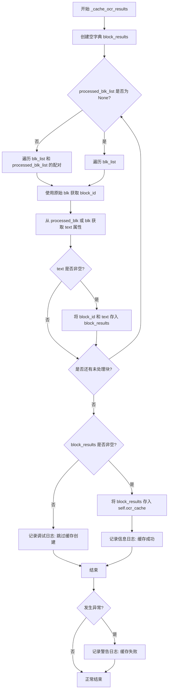

#### 带注释源码

```python
def _cache_ocr_results(self, cache_key, blk_list, processed_blk_list=None):
    """Cache OCR results for all blocks"""
    try:
        # 初始化存储块结果的字典
        block_results = {}
        
        # 判断是否有单独的处理后块列表
        # 如果有，使用处理后的块提取文本，但用原始块保持ID一致性
        if processed_blk_list is not None:
            # 配对遍历原始块和处理后的块
            for original_blk, processed_blk in zip(blk_list, processed_blk_list):
                # 使用原始块生成块ID，确保缓存索引的稳定性
                block_id = self._get_block_id(original_blk)
                # 从处理后的块获取OCR识别的文本内容
                text = getattr(processed_blk, 'text', '') or ''
                
                # 仅保存包含实际OCR文本的块，避免空文本占用缓存空间
                if text:
                    block_results[block_id] = text
        else:
            # 标准情况：使用同一块列表进行ID生成和文本提取
            for blk in blk_list:
                block_id = self._get_block_id(blk)
                text = getattr(blk, 'text', '') or ''
                
                # 仅包含有实际OCR文本的块
                if text:
                    block_results[block_id] = text
        
        # 只有当存在有效块结果时才创建缓存条目
        if block_results:
            # 将块结果字典存入OCR缓存，使用cache_key作为索引
            self.ocr_cache[cache_key] = block_results
            # 记录缓存成功的块数量，便于调试和监控
            logger.info(f"Cached OCR results for {len(block_results)} blocks")
        else:
            # 无OCR文本时跳过缓存创建，避免存储空结果
            logger.debug("No OCR text found in blocks; skipping OCR cache creation")
            
    except Exception as e:
        # 捕获所有异常，避免因缓存失败影响主流程
        logger.warning(f"Failed to cache OCR results: {e}")
        # 不抛出异常，仅跳过缓存操作
```


### `CacheManager.update_ocr_cache_for_block`

更新或添加单个块的OCR结果到缓存。该方法接收缓存键和文本块，从块中提取文本内容，如果文本非空则将其存储到对应的缓存键下，支持增量更新OCR缓存。

参数：

- `cache_key`：`tuple`，缓存键，用于定位OCR缓存条目，通常由(image_hash, ocr_model, source_lang, device)组成
- `block`：对象，文本块对象，需包含`text`属性和可用于`_get_block_id`方法的坐标信息

返回值：`None`，该方法无返回值，仅执行缓存更新操作

#### 流程图

```mermaid
flowchart TD
    A[开始 update_ocr_cache_for_block] --> B[调用 _get_block_id 获取 block_id]
    B --> C[获取 block.text 属性]
    C --> D{文本是否为空?}
    D -->|是| E[记录调试日志并直接返回]
    D -->|否| F{cache_key 是否在缓存中?}
    F -->|否| G[创建空字典 self.ocr_cache[cache_key] = {}]
    F -->|是| H[直接继续]
    G --> I[将 text 存入缓存: self.ocr_cache[cache_key][block_id] = text]
    H --> I
    I --> J[记录调试日志]
    J --> K[结束]
```

#### 带注释源码

```python
def update_ocr_cache_for_block(self, cache_key, block):
    """Update or add a single block's OCR result to the cache."""
    # 使用内部方法获取块的唯一标识符
    block_id = self._get_block_id(block)
    # 从block对象获取text属性，如果不存在或为None则为空字符串
    text = getattr(block, 'text', '') or ''

    # 空文本不创建或更新缓存条目，避免存储无意义数据
    if not text:
        logger.debug(f"Skipping OCR cache update for empty text for block ID {block_id}")
        return

    # 如果缓存键不存在，则初始化对应的缓存字典
    if cache_key not in self.ocr_cache:
        self.ocr_cache[cache_key] = {}

    # 将单个块的OCR结果存储到缓存中，键为block_id，值为OCR文本
    self.ocr_cache[cache_key][block_id] = text
    logger.debug(f"Updated OCR cache for block ID {block_id}")
```


### `CacheManager._get_cached_text_for_block`

该方法是CacheManager类的私有方法，用于从OCR缓存中检索特定文本块的缓存文本。它通过调用`_find_matching_block_id`方法在缓存中查找与给定块匹配的ID，如果找到匹配则返回缓存的文本（可能是空字符串），如果未找到则返回None表示该块需要处理。

参数：

- `self`：CacheManager实例本身
- `cache_key`：tuple，缓存键，包含图像哈希、OCR模型、源语言和设备信息，用于定位OCR缓存记录
- `block`：object，文本块对象，通常包含xyxy坐标和angle属性，用于在缓存中匹配对应的块

返回值：`str | None`，如果找到匹配的块则返回缓存的文本（可能是空字符串），如果未找到匹配的块则返回None表示该块需要OCR处理

#### 流程图

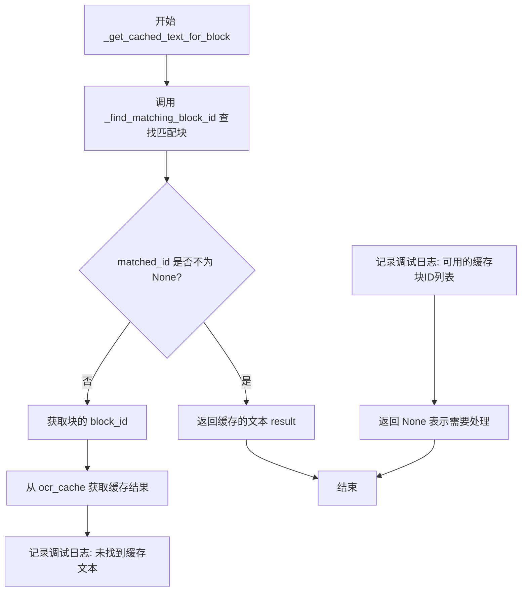

#### 带注释源码

```python
def _get_cached_text_for_block(self, cache_key, block):
    """Retrieve cached text for a specific block"""
    # 调用_find_matching_block_id方法，在缓存中查找与给定块匹配的ID
    # 该方法支持精确匹配和模糊匹配（坐标在容差范围内）
    matched_id, result = self._find_matching_block_id(cache_key, block)
    
    # 检查是否在缓存中找到了匹配的块
    if matched_id is not None:  # Block found in cache
        # 返回缓存的文本，可能返回空字符串（表示块已被处理但无文本）
        return result  # Return the cached text (could be empty string)
    else:
        # 块在缓存中完全未找到，需要进行OCR处理
        # 以下是调试日志，帮助识别缓存问题（仅在块未找到时记录）
        block_id = self._get_block_id(block)  # 获取块的唯一标识符
        cached_results = self.ocr_cache.get(cache_key, {})  # 获取该cache_key下的所有缓存结果
        
        # 记录调试信息：未找到该块的缓存文本
        logger.debug(f"No cached text found for block ID {block_id}")
        # 记录调试信息：列出缓存中所有可用的块ID，便于排查问题
        logger.debug(f"Available block IDs in cache: {list(cached_results.keys())}")
        
        # 返回None表示该块需要OCR处理
        return None  # Indicate block needs processing
```


### `CacheManager._get_translation_cache_key`

该方法用于生成翻译结果的缓存键，通过对图像进行哈希处理并结合翻译器配置、语言对以及额外上下文信息，创建一个唯一的元组键，以便在缓存中存储和检索翻译结果。

参数：

- `self`：`CacheManager`，CacheManager 类的实例，方法的调用者
- `image`：`Any`，待翻译的图像对象，用于生成图像哈希值
- `source_lang`：`str`，源语言代码，标识待翻译文本的原始语言
- `target_lang`：`str`，目标语言代码，标识翻译后的目标语言
- `translator_key`：`str`，翻译器标识键，用于区分不同的翻译模型或服务
- `extra_context`：`str`，额外的上下文信息，可能影响翻译结果（如领域特定词汇表）

返回值：`Tuple[str, str, str, str, str]`，包含五个元素的元组，依次为图像哈希值、翻译器键、源语言、目标语言和上下文哈希值，组合形成唯一的缓存键

#### 流程图

```mermaid
flowchart TD
    A[开始 _get_translation_cache_key] --> B[接收参数: image, source_lang, target_lang, translator_key, extra_context]
    B --> C[调用 _generate_image_hash 生成图像哈希]
    C --> D{extra_context 是否存在?}
    D -->|是| E[使用 hashlib.md5 生成 context_hash]
    D -->|否| F[设置 context_hash = "no_context"]
    E --> G[组装元组: (image_hash, translator_key, source_lang, target_lang, context_hash)]
    F --> G
    G --> H[返回缓存键元组]
```

#### 带注释源码

```python
def _get_translation_cache_key(self, image, source_lang, target_lang, translator_key, extra_context):
    """Generate cache key for translation results"""
    # 第一步：生成图像的哈希值，用于唯一标识该图像
    # 哈希算法对图像数据进行采样以提高效率
    image_hash = self._generate_image_hash(image)
    
    # 第二步：处理额外上下文信息
    # 如果提供了 extra_context，将其哈希化后纳入缓存键
    # 这样相同的图像和语言组合但不同上下文会生成不同的缓存键
    # 如果没有额外上下文，使用固定字符串 "no_context" 作为占位符
    context_hash = hashlib.md5(extra_context.encode()).hexdigest() if extra_context else "no_context"
    
    # 第三步：组合所有信息形成完整的缓存键
    # 缓存键包含：
    # - image_hash：标识图像内容
    # - translator_key：标识使用的翻译器
    # - source_lang：源语言
    # - target_lang：目标语言
    # - context_hash：额外上下文信息的哈希
    return (image_hash, translator_key, source_lang, target_lang, context_hash)
```


### `CacheManager._is_translation_cached`

检查翻译结果是否已缓存，用于判断是否可以跳过重复的翻译计算，直接从缓存中获取结果。

参数：

-  `cache_key`：`tuple`，缓存键，包含图像哈希、翻译器键、源语言、目标语言和上下文哈希的元组

返回值：`bool`，如果给定缓存键的翻译结果存在于缓存中则返回 `True`，否则返回 `False`

#### 流程图

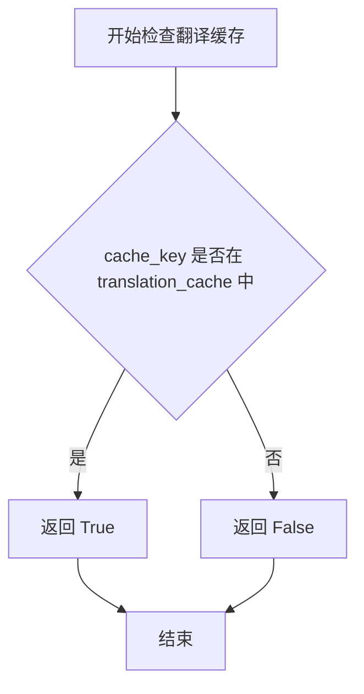

#### 带注释源码

```python
def _is_translation_cached(self, cache_key):
    """Check if translation results are cached for this image/translator/language combination"""
    # 使用 in 操作符检查 cache_key 是否作为键存在于 translation_cache 字典中
    # translation_cache 结构: {cache_key: {block_id: {'source_text': str, 'translation': str}}}
    return cache_key in self.translation_cache
```

---

#### 潜在的技术债务或优化空间

1. **缓存命中判断粒度**：当前方法仅检查缓存键是否存在，但未验证缓存数据是否为最新版本。当翻译模型或上下文参数更新时，旧缓存可能被错误命中。
2. **缓存键生成复杂性**：`_get_translation_cache_key` 中包含 `extra_context` 的哈希值，但 `_is_translation_cached` 未提供对部分匹配的支持（如仅源语言/目标语言变化时）。
3. **缺乏过期机制**：缓存无时间戳或版本控制，长期运行可能导致内存持续增长，且无法区分过期数据。

#### 其它项目

**设计目标与约束：**

- 该方法作为缓存查询的入口点，遵循"快速失败"原则，通过字典键查找实现 O(1) 时间复杂度。
- 设计假设：`translation_cache` 字典由类内部维护，外部调用者不应直接修改。

**错误处理与异常设计：**

- 本方法无显式异常处理，依赖 Python 字典的键查找行为。
- 若 `cache_key` 为 `None` 或不可哈希类型，将抛出 `TypeError`，调用方需保证参数有效性。

**数据流与状态机：**

- 调用链：`CacheManager._can_serve_all_blocks_from_translation_cache` → `_is_translation_cached` → 判断是否可从缓存服务。
- 状态依赖：依赖 `self.translation_cache` 已被正确初始化（`__init__` 中为空字典）。

**外部依赖与接口契约：**

- 依赖 `self.translation_cache` 字典属性，由类实例化时创建。
- 调用方需通过 `_get_translation_cache_key` 生成一致的 `cache_key`，否则会导致缓存未命中。


### `CacheManager._cache_translation_results`

该方法用于将翻译结果缓存到 `translation_cache` 字典中，支持两种模式：使用分离的原始块和已处理块（用于ID生成和文本获取），或使用同一块列表。它会遍历所有文本块，提取有翻译内容的块，将其源文本和翻译结果存储到缓存中，如果缓存成功则记录日志，失败时仅记录警告而不抛出异常。

参数：

- `self`：隐式参数，`CacheManager` 类实例本身
- `cache_key`：`tuple`，缓存键，包含图像哈希、翻译器密钥、源语言、目标语言和上下文哈希，用于唯一标识一组翻译结果
- `blk_list`：列表，原文本块列表，包含待缓存翻译的原始块对象，用于生成块 ID 和获取源文本
- `processed_blk_list`：`可选参数`，列表，已处理的文本块列表，包含翻译结果，用于获取翻译文本；默认为 `None`，此时与 `blk_list` 共用

返回值：`None`，该方法无返回值，仅执行缓存存储操作

#### 流程图

```mermaid
flowchart TD
    A[开始 _cache_translation_results] --> B{processed_blk_list is not None?}
    B -->|Yes| C[遍历 blk_list 和 processed_blk_list 配对]
    B -->|No| D[遍历 blk_list]
    
    C --> E[从 original_blk 获取 block_id]
    C --> F[从 processed_blk 获取 translation 属性]
    C --> G[从 original_blk 获取 source_text]
    
    D --> H[从 blk 获取 block_id]
    D --> I[获取 translation 属性]
    D --> J[获取 text 作为 source_text]
    
    E --> K{translation 非空?}
    F --> K
    H --> K
    I --> K
    
    K -->|Yes| L[构建 block_results 字典<br/>包含 source_text 和 translation]
    K --> No
    
    L --> M{还有更多块?}
    M -->|Yes| C
    M -->|No| N{block_results 非空?}
    
    N -->|Yes| O[设置 self.translation_cache[cache_key] = block_results]
    N -->|No| P[记录 debug 日志: 跳过缓存创建]
    
    O --> Q[记录 info 日志: 缓存成功]
    P --> Q
    Q --> R[结束]
    
    subgraph 异常处理
    S[发生异常] --> T[记录 warning 日志: 缓存失败]
    T --> R
    end
    
    L -.-> S
    O -.-> S
```

#### 带注释源码

```
def _cache_translation_results(self, cache_key, blk_list, processed_blk_list=None):
    """Cache translation results for all blocks"""
    try:
        block_results = {}
        # If we have separate processed blocks (with translation results), use them for translation
        # but use original blocks for consistent IDs
        if processed_blk_list is not None:
            # 遍历原始块和已处理块的配对
            for original_blk, processed_blk in zip(blk_list, processed_blk_list):
                # 使用原始块生成块 ID，确保 ID 一致性
                block_id = self._get_block_id(original_blk)
                # 从已处理块获取翻译结果
                translation = getattr(processed_blk, 'translation', '') or ''
                # 从原始块获取源文本
                source_text = getattr(original_blk, 'text', '') or ''
                # Only include blocks that actually have a translation
                if translation:
                    # Store both source text and translation to validate cache validity
                    block_results[block_id] = {
                        'source_text': source_text,
                        'translation': translation
                    }
        else:
            # Standard case: use the same blocks for both ID and translation
            for blk in blk_list:
                block_id = self._get_block_id(blk)
                translation = getattr(blk, 'translation', '') or ''
                source_text = getattr(blk, 'text', '') or ''
                # Only include blocks that actually have a translation
                if translation:
                    block_results[block_id] = {
                        'source_text': source_text,
                        'translation': translation
                    }
        # Do not create a translation cache entry if no translations were present
        if block_results:
            # 将翻译结果存入缓存字典
            self.translation_cache[cache_key] = block_results
            # 记录成功缓存的块数量
            logger.info(f"Cached translation results for {len(block_results)} blocks")
        else:
            logger.debug("No translations found in blocks; skipping translation cache creation")
    except Exception as e:
        # 异常处理：仅记录警告，不抛出异常影响主流程
        logger.warning(f"Failed to cache translation results: {e}")
```


### `CacheManager.update_translation_cache_for_block`

该方法用于更新单个文本块的翻译结果到翻译缓存中，通过块ID作为索引存储翻译文本和源文本，支持增量缓存更新。

参数：

- `cache_key`：`tuple`，翻译缓存键，包含图像哈希、翻译器密钥、源语言、目标语言和上下文哈希的元组
- `block`：`object`，文本块对象，需包含 `translation`（翻译结果）和 `text`（源文本）属性

返回值：`None`，无返回值，仅执行缓存更新操作

#### 流程图

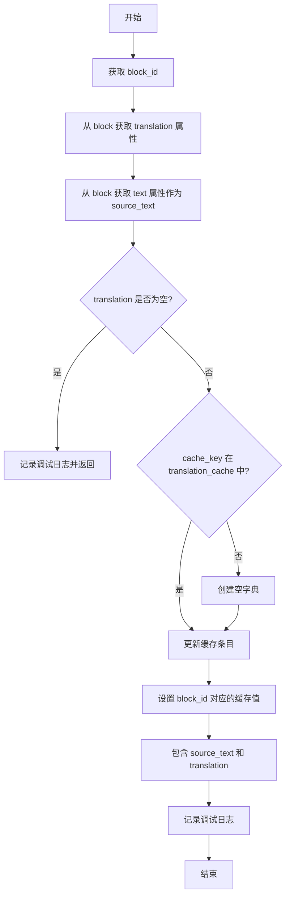

#### 带注释源码

```python
def update_translation_cache_for_block(self, cache_key, block):
    """Update or add a single block's translation result to the cache.
    
    对单个文本块的翻译结果进行缓存更新。
    
    Args:
        cache_key: 翻译缓存键，用于标识特定的图像/翻译器/语言组合
        block: 文本块对象，需包含 translation 和 text 属性
    
    Returns:
        None: 无返回值，直接修改实例的 translation_cache 字典
    """
    # 根据块的坐标信息生成唯一标识符
    block_id = self._get_block_id(block)
    # 从块对象中获取翻译结果，优先使用属性值，默认为空字符串
    translation = getattr(block, 'translation', '') or ''
    # 从块对象中获取源文本
    source_text = getattr(block, 'text', '') or ''

    # 检查翻译结果是否为空，避免缓存空翻译
    if not translation:
        logger.debug(f"Skipping translation cache update for empty translation for block ID {block_id}")
        return

    # 检查缓存键是否存在，不存在则初始化空字典
    if cache_key not in self.translation_cache:
        self.translation_cache[cache_key] = {}

    # 更新缓存：以 block_id 为键，存储源文本和翻译结果的字典
    self.translation_cache[cache_key][block_id] = {
        'source_text': source_text,
        'translation': translation
    }
    logger.debug(f"Updated translation cache for block ID {block_id}")
```


### `CacheManager._get_cached_translation_for_block`

获取单个块的缓存翻译，通过匹配块ID并在返回前验证源文本是否发生变化来确保缓存有效性。

参数：

- `cache_key`：元组，缓存键，包含图像哈希、翻译器密钥、源语言、目标语言和上下文哈希
- `block`：对象，文本块，需包含 `text` 属性以供源文本验证

返回值：`str | None`，返回缓存的翻译文本（字符串），如果块无内容返回空字符串，如果缓存未命中或源文本已变化则返回 `None`

#### 流程图

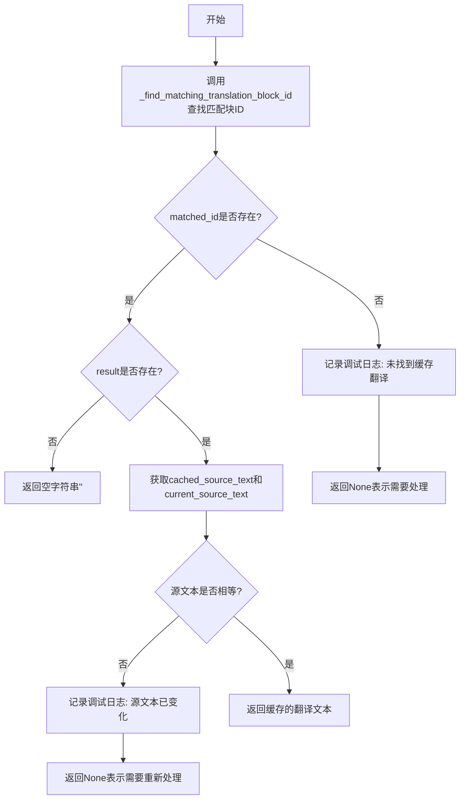

#### 带注释源码

```python
def _get_cached_translation_for_block(self, cache_key, block):
    """Retrieve cached translation for a specific block, validating source text matches"""
    # 步骤1: 尝试在翻译缓存中查找与目标块ID匹配的缓存记录
    # 使用模糊匹配(允许小范围坐标差异)来提高缓存命中率
    matched_id, result = self._find_matching_translation_block_id(cache_key, block)

    # 步骤2: 判断是否找到匹配的块ID
    if matched_id is not None:  
        # 步骤3: 判断缓存结果是否为空(块曾被处理但无内容)
        if result: 
            # 步骤4: 获取缓存中的源文本与当前块的源文本进行比对
            # 这是关键验证步骤: 如果源文本发生变化,缓存的翻译可能不再准确
            cached_source_text = result.get('source_text', '')
            current_source_text = getattr(block, 'text', '') or ''
            
            # 步骤5: 源文本匹配,返回缓存的翻译结果
            if cached_source_text == current_source_text:
                return result.get('translation', '')
            else:
                # 源文本已变化,缓存失效,需要重新翻译
                logger.debug(f"Cache invalid: source text changed from '{cached_source_text}' to '{current_source_text}'")
                return None  # Indicate cache is invalid, needs reprocessing
        else:
            # 块曾被处理但没有内容(空结果),返回空字符串
            return ''
    else:
        # 步骤6: 缓存中完全未找到该块
        # 记录调试日志帮助排查缓存问题
        block_id = self._get_block_id(block)
        cached_results = self.translation_cache.get(cache_key, {})
        logger.debug(f"No cached translation found for block ID {block_id}")
        logger.debug(f"Available block IDs in cache: {list(cached_results.keys())}")
        return None  # Indicate block needs processing
```


### `CacheManager._can_serve_all_blocks_from_ocr_cache`

检查是否可以从OCR缓存为块列表中的所有块提供服务，即验证所有块是否都已在OCR缓存中存在且可读取。

参数：

- `cache_key`：`tuple`，缓存键，用于查找OCR缓存（包含图像哈希、OCR模型、源语言和设备信息）
- `block_list`：`list`，需要检查的块列表，每个块包含位置信息和文本属性

返回值：`bool`，如果所有块都可以从OCR缓存提供服务则返回 `True`，否则返回 `False`

#### 流程图

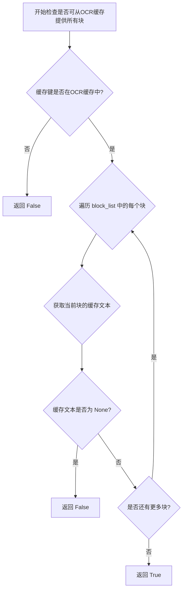

#### 带注释源码

```python
def _can_serve_all_blocks_from_ocr_cache(self, cache_key, block_list):
    """Check if all blocks in the list can be served from OCR cache
    
    该方法用于批量验证一组块是否全部可以从OCR缓存中获取结果。
    如果所有块都已缓存，则可以跳过OCR处理步骤，提高处理效率。
    
    Args:
        cache_key: 缓存键，标识特定的图像/模型/语言组合
        block_list: 需要检查的文本块列表
    
    Returns:
        bool: 如果所有块都可以从缓存提供服务返回True，否则返回False
    """
    # 第一步：检查整个缓存键是否存在于OCR缓存中
    # 如果缓存键本身不存在，则所有块都无法从缓存获取
    if not self._is_ocr_cached(cache_key):
        return False
    
    # 第二步：遍历列表中的每个块，检查每个块是否都有缓存
    for block in block_list:
        # 尝试从缓存获取特定块的文本内容
        # 如果块不存在于缓存中或无法匹配，会返回None
        cached_text = self._get_cached_text_for_block(cache_key, block)
        
        # 如果任何一个块无法从缓存获取，则整体检查失败
        if cached_text is None:
            return False
    
    # 第三步：所有块都成功从缓存获取，返回True
    return True
```


### `CacheManager._can_serve_all_blocks_from_translation_cache`

检查是否所有给定块都可以从翻译缓存中获取有效翻译（同时验证源文本是否匹配）

参数：

- `cache_key`：`tuple`，翻译缓存键，包含图像哈希、翻译器键、源语言、目标语言和额外上下文信息
- `block_list`：`list`，待检查的文本块对象列表，每个块应包含 `text` 属性

返回值：`bool`，如果所有块都能从缓存中获取到有效翻译则返回 `True`，否则返回 `False`

#### 流程图

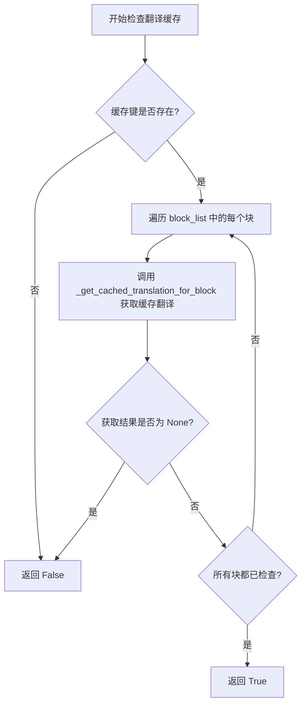

#### 带注释源码

```python
def _can_serve_all_blocks_from_translation_cache(self, cache_key, block_list):
    """Check if all blocks in the list can be served from translation cache with matching source text"""
    # 第一步：检查翻译缓存键是否存在（即是否有任何翻译结果被缓存过）
    if not self._is_translation_cached(cache_key):
        return False  # 缓存不存在，无法从缓存提供任何块
    
    # 第二步：遍历所有块，逐一检查是否都能从缓存获取有效翻译
    for block in block_list:
        # 获取当前块的缓存翻译，同时验证源文本是否与缓存中的源文本匹配
        # 如果源文本发生变化或块不存在于缓存中，将返回 None
        cached_translation = self._get_cached_translation_for_block(cache_key, block)
        if cached_translation is None:  # 块未在缓存中或源文本已更改
            return False  # 缓存无法完全满足所有块的需求
    
    # 第三步：所有块都能从缓存获取有效翻译
    return True
```


### `CacheManager._apply_cached_ocr_to_blocks`

该方法用于将缓存中的OCR结果批量应用到块列表中的每个块。它遍历传入的块列表，尝试为每个块检索缓存的OCR文本，如果找到匹配则将缓存的文本赋值给块的`text`属性。

参数：

- `cache_key`：`tuple`，缓存键，用于查找OCR结果缓存，包含了图像哈希、OCR模型、源语言和设备信息
- `block_list`：`list`，文本块列表，每个块包含位置信息（xyxy坐标和角度），方法会尝试为每个块匹配并应用缓存的OCR文本

返回值：`None`，该方法直接修改`block_list`中的块对象，不返回任何值

#### 流程图

```mermaid
flowchart TD
    A[开始 _apply_cached_ocr_to_blocks] --> B{遍历 block_list}
    B -->|还有未处理块| C[取出一个 block]
    C --> D[调用 _get_cached_text_for_block 查找缓存文本]
    D --> E{ cached_text is not None?}
    E -->|是| F[将 cached_text 赋值给 block.text]
    E -->|否| G[跳过该块，不修改]
    F --> B
    G --> B
    B -->|全部处理完毕| H[结束]
    
    style A fill:#f9f,color:#333
    style H fill:#9f9,color:#333
    style F fill:#ff9,color:#333
```

#### 带注释源码

```python
def _apply_cached_ocr_to_blocks(self, cache_key, block_list):
    """
    Apply cached OCR results to all blocks in the list
    
    遍历块列表，为每个块尝试从OCR缓存中检索匹配的文本结果。
    如果找到缓存（精确匹配或模糊匹配），则将该文本赋值给块的text属性。
    这样可以避免对已处理过的块进行重复的OCR识别，提升处理效率。
    
    Args:
        cache_key: 缓存键元组，包含(image_hash, ocr_model, source_lang, device)
        block_list: 需要应用缓存OCR结果的块对象列表
        
    Returns:
        None: 直接修改传入的block_list中的块对象，不返回任何值
    """
    # 遍历传入的每一个文本块
    for block in block_list:
        # 调用内部方法尝试获取该块对应的缓存OCR文本
        # 该方法会先尝试精确匹配，失败后尝试模糊匹配（坐标容差范围内）
        cached_text = self._get_cached_text_for_block(cache_key, block)
        
        # 仅当缓存中存在有效文本时才更新块内容
        # 如果cached_text为None表示该块没有缓存记录，需要重新OCR处理
        # 如果cached_text为空字符串表示该块曾被处理但无文本内容
        if cached_text is not None: 
            # 将缓存的OCR识别结果应用到块的text属性
            block.text = cached_text  
```


### `CacheManager._apply_cached_translations_to_blocks`

该方法将缓存中的翻译结果应用到块列表中的各个块，通过遍历块列表并查询翻译缓存，对每个存在有效缓存翻译结果的块设置其 translation 属性。

参数：

-  `cache_key`：元组 `(image_hash, translator_key, source_lang, target_lang, context_hash)`，缓存键，用于定位翻译缓存条目
-  `block_list`：列表 `List[Block]`，待应用翻译结果的块对象列表，每个块对象需具有 `text` 属性用于缓存验证，可设置 `translation` 属性

返回值：`None`，该方法无返回值，直接修改块对象的 `translation` 属性

#### 流程图

```mermaid
flowchart TD
    A[开始: _apply_cached_translations_to_blocks] --> B[遍历 block_list 中的每个 block]
    B --> C{还有更多 block}
    C -->|是| D[调用 _get_cached_translation_for_block 获取缓存翻译]
    C -->|否| H[结束]
    D --> E{返回值不为 None}
    E -->|是| F[将 block.translation 设置为缓存翻译]
    E -->|否| B
    F --> B
```

#### 带注释源码

```
def _apply_cached_translations_to_blocks(self, cache_key, block_list):
    """Apply cached translation results to all blocks in the list"""
    # 遍历待处理的块列表
    for block in block_list:
        # 从缓存中获取该块的翻译结果
        # _get_cached_translation_for_block 内部会验证 source_text 是否匹配
        # 返回值: 翻译字符串 '' / None (缓存无效) / 翻译文本
        cached_translation = self._get_cached_translation_for_block(cache_key, block)
        
        # 仅当缓存有效时（返回值非 None）才应用翻译结果
        # 若返回 None 表示：块不在缓存中 或 源文本已变化（缓存失效）
        if cached_translation is not None: 
            # 将缓存的翻译结果写入块的 translation 属性
            block.translation = cached_translation  
```

## 关键组件


### CacheManager 类

核心管理类，负责整个OCR和翻译缓存系统的生命周期管理，包含缓存存储、查询、更新和清除功能。

### OCR 缓存 (ocr_cache)

存储OCR识别结果的字典缓存，键为(image_hash, ocr_model, source_lang, device)元组，值为{block_id: text}字典，用于避免重复OCR计算。

### 翻译缓存 (translation_cache)

存储翻译结果的字典缓存，键为(image_hash, translator_key, source_lang, target_lang, context_hash)元组，值为{block_id: {source_text, translation}}字典，支持翻译结果的复用。

### 图像哈希生成 (_generate_image_hash)

通过对图像进行降采样后计算MD5哈希值，生成高效且唯一的图像标识符，用于缓存键的生成。

### 块ID生成 (_get_block_id)

基于文本块的坐标位置(x1, y1, x2, y2)和角度信息生成唯一块标识符，支持精确匹配和后续的模糊匹配查找。

### OCR缓存键生成 (_get_ocr_cache_key)

组合图像哈希、OCR模型、源语言和设备信息生成完整的OCR缓存键，确保不同配置下的缓存隔离。

### 翻译缓存键生成 (_get_translation_cache_key)

组合图像哈希、翻译器密钥、源语言、目标语言和额外上下文生成翻译缓存键，包含上下文哈希以确保翻译准确性。

### 模糊块匹配 (_find_matching_block_id)

支持OCR缓存的模糊查找，允许坐标在5像素容差和角度在1度容差范围内的匹配，提高缓存命中率。

### 翻译模糊块匹配 (_find_matching_translation_block_id)

支持翻译缓存的模糊查找，机制与OCR缓存类似，允许小的坐标和角度差异。

### OCR缓存校验 (_is_ocr_cached)

检查指定缓存键是否存在OCR结果，用于快速判断是否可以跳过OCR处理。

### OCR结果缓存 (_cache_ocr_results)

将OCR识别结果批量写入缓存，支持原始块和处理后块的分离存储，仅缓存非空文本结果。

### OCR单块更新 (update_ocr_cache_for_block)

增量更新单个文本块的OCR结果到缓存，适用于流式处理场景。

### OCR缓存读取 (_get_cached_text_for_block)

从缓存中检索特定块的OCR文本，支持模糊匹配，返回None表示需要重新处理。

### 翻译缓存校验 (_is_translation_cached)

检查指定缓存键是否存在翻译结果，用于快速判断是否可以跳过翻译处理。

### 翻译结果缓存 (_cache_translation_results)

将翻译结果批量写入缓存，同时存储源文本和翻译文本以支持后续的缓存有效性验证。

### 翻译单块更新 (update_translation_cache_for_block)

增量更新单个文本块的翻译结果到缓存。

### 翻译缓存读取 (_get_cached_translation_for_block)

从缓存中检索特定块的翻译结果，同时验证源文本是否发生变化，确保缓存有效性。

### 缓存完整性检查 (_can_serve_all_blocks_from_ocr_cache)

批量检查所有块是否都能从OCR缓存中获取，避免部分缓存导致的混合处理。

### 翻译缓存完整性检查 (_can_serve_all_blocks_from_translation_cache)

批量检查所有块是否都能从翻译缓存中获取，并验证源文本匹配。

### 缓存应用 (_apply_cached_ocr_to_blocks)

将缓存的OCR结果批量应用到文本块对象上，避免重复识别。

### 翻译缓存应用 (_apply_cached_translations_to_blocks)

将缓存的翻译结果批量应用到文本块对象上，设置translation属性。

### 缓存清除 (clear_ocr_cache / clear_translation_cache)

手动清除OCR或翻译缓存的方法，支持缓存的完全重置。


## 问题及建议


### 已知问题

-   **代码重复**：`_find_matching_block_id` 和 `_find_matching_translation_block_id` 方法实现几乎完全相同，造成代码重复，增加维护成本。
-   **缓存键长度不一致**：`_get_ocr_cache_key` 返回4元素元组，`_get_translation_cache_key` 返回5元素元组，这种不一致可能导致缓存查找逻辑混乱。
-   **图像哈希采样策略简单**：使用 `image[::10, ::10]` 采样可能对某些图像格式（如不同通道顺序、灰度图）不兼容，且可能产生哈希碰撞。
-   **模糊匹配性能差**：`_find_matching_block_id` 遍历所有缓存键进行解析和比较，时间复杂度 O(n)，当缓存条目增多时性能急剧下降。
-   **异常处理过于宽泛**：多处使用 `except Exception as e` 仅记录日志后静默跳过，可能隐藏潜在错误，难以定位问题根因。
-   **缺乏缓存淘汰机制**：缓存使用 Python 字典无限增长，没有实现 LRU、TTL 或最大容量限制，可能导致内存持续膨胀。
-   **数据类型不一致**：OCR 缓存存储 `{block_id: text}`（字符串），翻译缓存存储 `{block_id: {source_text, translation}}`（字典），增加理解成本。
-   **缺少类型注解**：方法参数和返回值缺乏类型提示，降低代码可读性和静态分析能力。

### 优化建议

-   **提取公共模糊匹配逻辑**：将 `_find_matching_block_id` 和 `_find_matching_translation_block_id` 合并为一个通用方法，参数化缓存字典和匹配阈值。
-   **统一缓存键结构**：定义 dataclass 或命名元组作为缓存键，统一 OCR 和翻译缓存的键格式。
-   **改进图像哈希**：增加对图像 shape、dtype 的校验，支持不同图像类型；可考虑使用更鲁棒的哈希算法（如 xxhash）提升性能。
-   **优化模糊匹配**：使用空间索引（如 R-tree）或预建坐标映射表，将 O(n) 查询降低到 O(log n) 或 O(1)。
-   **细化异常处理**：区分不同异常类型（AttributeError、ValueError 等），对可恢复错误记录警告，对严重错误考虑抛出或返回明确状态码。
-   **实现缓存淘汰策略**：引入 `functools.lru_cache` 或自定义 LRU 缓存，限制缓存最大条目数；或增加 TTL 机制自动过期旧缓存。
-   **统一数据结构**：定义统一的缓存值结构（如 dataclass），或使用相同的数据结构存储 OCR 和翻译结果。
-   **添加类型注解**：为所有方法添加 Python type hints，提升代码可维护性和 IDE 支持。

## 其它


### 设计目标与约束

**设计目标**：为OCR识别和翻译结果提供高效、可复用的缓存机制，通过图像哈希、模型参数和语言信息生成缓存键，避免重复计算，提升整体pipeline的执行效率。**约束条件**：缓存键基于图像采样哈希（每10个像素采样一次）生成，可能存在哈希碰撞风险；块ID匹配支持精确匹配和坐标模糊匹配（容差5像素、角度1度），适用于图像轻微变化的场景；缓存为内存存储，不持久化，重启后丢失。

### 错误处理与异常设计

代码中采用异常捕获与降级处理相结合的方式。**图像哈希生成**时，若采样失败则回退使用图像shape和dtype的编码作为哈希值；**缓存操作**（如`_cache_ocr_results`、`_cache_translation_results`）中使用try-except捕获异常，仅记录警告而不抛出，避免单次缓存失败影响主流程；**块ID解析**时使用try-except捕获`AttributeError`、`ValueError`、`IndexError`，解析失败时返回`str(id(block))`作为兜底标识。缓存未命中时返回`None`表示需要重新处理，返回空字符串表示有结果但内容为空。

### 数据流与状态机

**OCR缓存数据流**：图像→`_generate_image_hash`生成哈希→`_get_ocr_cache_key`构建缓存键→`_is_ocr_cached`检查缓存→`_can_serve_all_blocks_from_ocr_cache`批量验证→`_get_cached_text_for_block`单块获取（支持模糊匹配）→`_apply_cached_ocr_to_blocks`应用到块列表。**翻译缓存数据流**：类似OCR，新增`_get_translation_cache_key`包含`extra_context`哈希，且`_get_cached_translation_for_block`额外验证source_text一致性。**状态转换**：缓存键不存在→未缓存状态；缓存键存在但块ID不匹配→部分缓存状态；所有块均命中→完全缓存状态；source_text变化→缓存失效状态。

### 外部依赖与接口契约

**依赖项**：`hashlib`（MD5哈希计算）、`logging`（日志记录）。**接口契约**：调用方需传入`image`（支持numpy数组，需有`shape`和`dtype`属性）、`block`对象（需有`xyxy`属性返回坐标元组、可选`angle`属性、`text`和`translation`属性）。缓存键生成函数`_get_ocr_cache_key`和`_get_translation_cache_key`返回元组作为唯一标识。块ID生成`_get_block_id`返回字符串，格式为`{x1}_{y1}_{x2}_{y2}_{angle}`。

### 性能考虑与优化空间

**当前优化**：图像哈希仅采样1/100像素（每10个像素取1个），显著降低计算量；模糊匹配使用解析后的坐标而非重新计算块ID。**潜在优化空间**：缓存使用内存字典存储，大图像多块场景下内存占用较高，可考虑LRU缓存或磁盘缓存；模糊匹配为O(n)遍历，可考虑空间索引（如R-tree）优化；`_find_matching_block_id`和`_find_matching_translation_block_id`代码重复，可抽象为通用函数；缓存键使用MD5，可考虑更快的xxhash但需权衡安全性。

### 并发与线程安全

当前实现**无线程安全机制**。多线程场景下，`ocr_cache`和`translation_cache`字典的读写操作可能导致竞态条件。建议使用`threading.RLock`保护缓存操作，或使用线程安全的数据结构（如`concurrent.futures`下的线程局部存储）。若用于异步环境，需评估asyncio兼容性。

### 配置与可扩展性

**可配置项**（硬编码，可提取为初始化参数）：采样步长`image[::10, ::10]`（当前为10）、模糊匹配容差`tolerance=5.0`和角度容差`1.0`。**扩展方向**：缓存存储可扩展为Redis或文件系统；缓存策略可增加TTL过期机制；支持多种哈希算法（通过策略模式）；可接入监控指标（缓存命中率等）。

### 测试策略建议

**单元测试**：覆盖`_generate_image_hash`的各种输入（正常numpy数组、无shape属性对象）；`_get_block_id`覆盖正常坐标和异常情况；模糊匹配逻辑测试（边界容差、超过容差）；缓存存取一致性测试。**集成测试**：模拟完整OCR/翻译pipeline，验证缓存命中与未命中的行为一致性；测试缓存清除功能。**边界条件**：空block列表、block无text/translation属性、cache_key冲突处理。

### 使用示例

```python
# 初始化
cache_manager = CacheManager()

# 模拟OCR流程
image = ...  # numpy array
source_lang = "zh"
ocr_model = "paddleocr"
cache_key = cache_manager._get_ocr_cache_key(image, source_lang, ocr_model)

# 检查缓存
if cache_manager._can_serve_all_blocks_from_ocr_cache(cache_key, block_list):
    cache_manager._apply_cached_ocr_to_blocks(cache_key, block_list)
else:
    # 执行OCR...
    cache_manager._cache_ocr_results(cache_key, block_list)

# 模拟翻译流程
translator_key = "google"
target_lang = "en"
extra_context = ""
trans_cache_key = cache_manager._get_translation_cache_key(image, source_lang, target_lang, translator_key, extra_context)

# 缓存翻译结果
cache_manager._cache_translation_results(trans_cache_key, block_list)
```

    