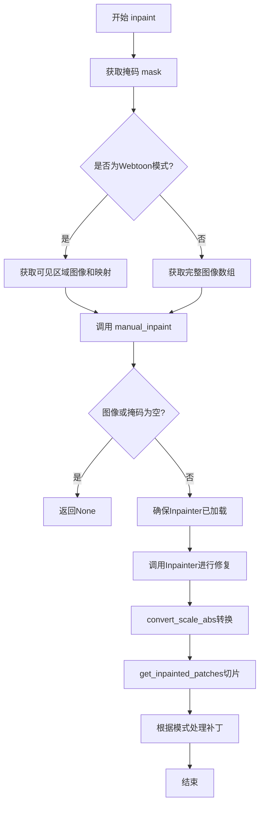
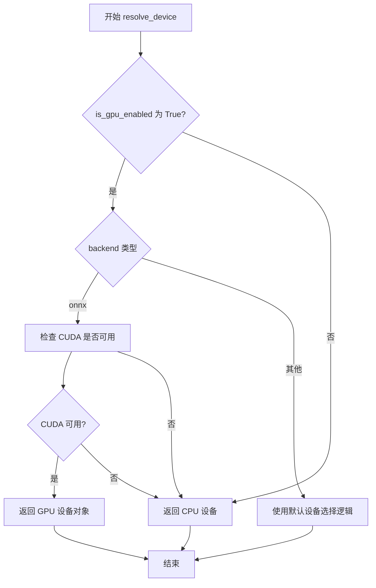
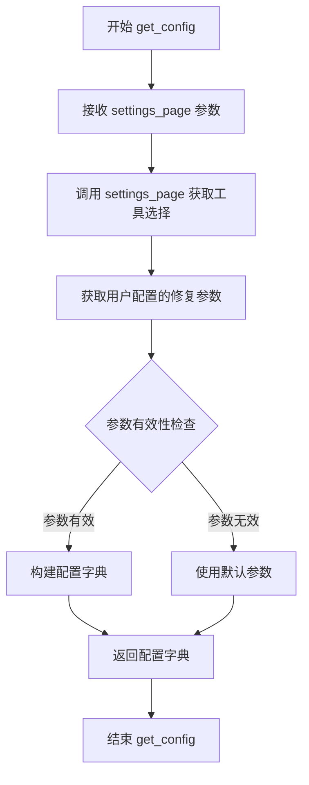
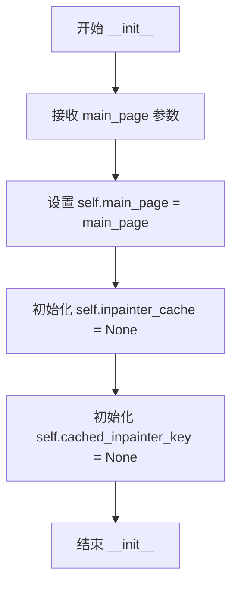
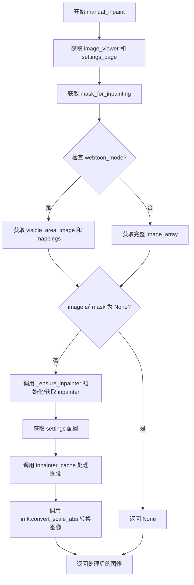
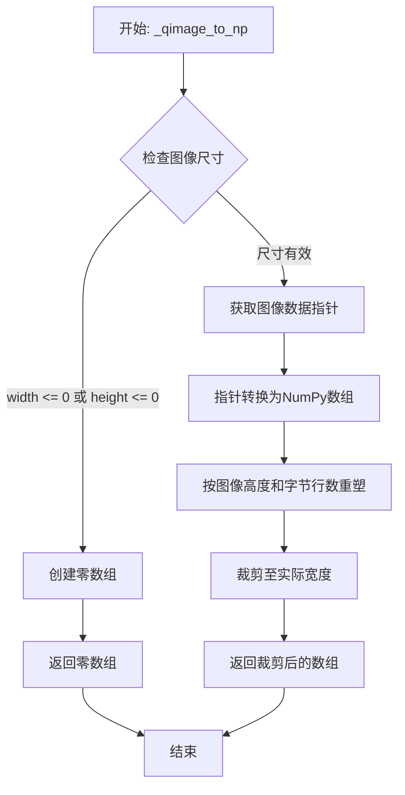
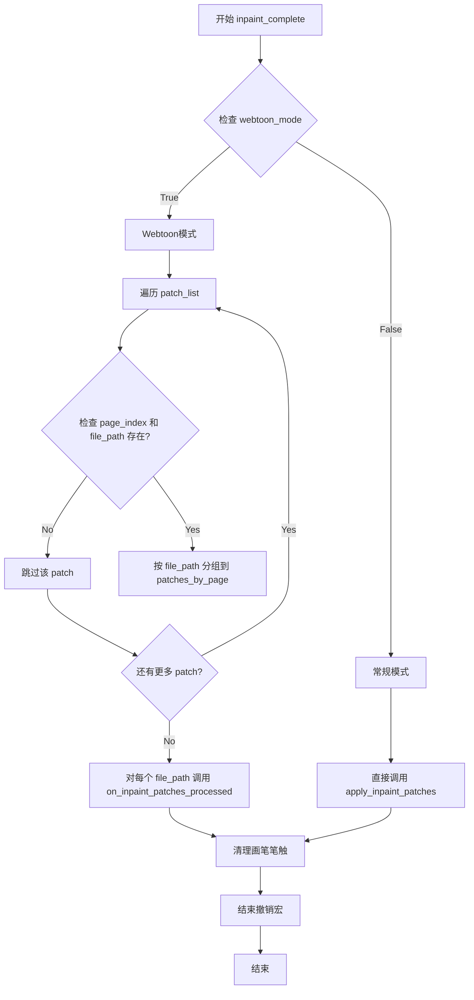
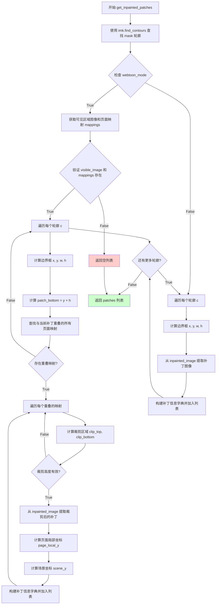
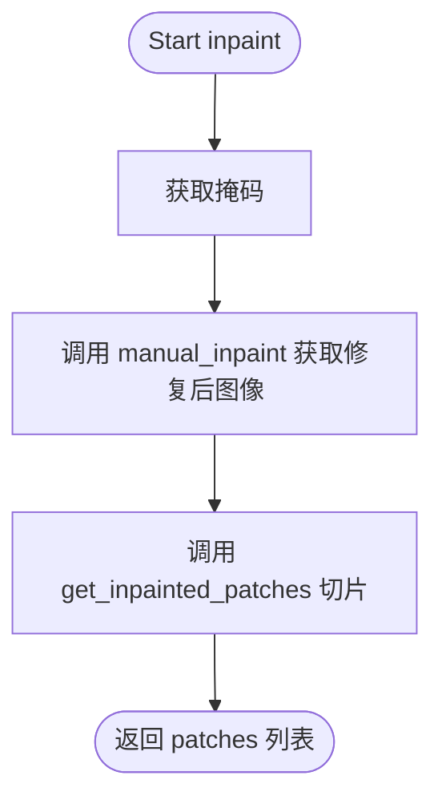

# `comic-translate\pipeline\inpainting.py` 详细设计文档

这是一个图像修复(Inpainting)处理程序，封装了基于Qt的图像查看器和后端AI修复模型之间的交互逻辑，支持普通模式和网页漫画(webtoon)模式，能够从笔触生成掩码、调用ONNX后端进行图像修复，并将修复后的图像块正确映射回原始图像的对应位置。

## 整体流程



## 类结构

```
InpaintingHandler (图像修复处理器)
```

## 全局变量及字段


### `logger`
    
模块级日志记录器，用于记录类运行过程中的日志信息

类型：`logging.Logger`
    


### `InpaintingHandler.main_page`
    
主页面引用，包含图像查看器、设置页面和图像控制器等核心组件

类型：`MainPage`
    


### `InpaintingHandler.inpainter_cache`
    
修复器实例缓存，存储当前使用的图像修复算法对象以避免重复创建

类型：`InpainterBase`
    


### `InpaintingHandler.cached_inpainter_key`
    
当前缓存的修复器键名，用于标识缓存的修复器类型以支持动态切换

类型：`str`
    
    

## 全局函数及方法


### `resolve_device`

根据GPU启用状态和后端类型，解析并返回适合的设备对象，用于后续的模型推理计算。

参数：

-  `is_gpu_enabled`：`bool`，表示是否启用GPU加速，通常从设置页面获取
-  `backend`：`str`，指定推理后端类型（如 'onnx'、'tensorrt' 等）

返回值：`Any`，返回适配特定后端的设备对象（如 `torch.device`、`onnxruntime.Device` 等），用于模型加载和推理

#### 流程图



#### 带注释源码

```python
# 注意：此源码为基于调用上下文的推断实现，实际实现可能有所不同
# 实际源码位于 modules/utils/device.py 文件中

def resolve_device(is_gpu_enabled: bool, backend: str):
    """
    根据GPU启用状态和后端类型解析合适的设备
    
    参数:
        is_gpu_enabled: 布尔值，指示是否启用GPU加速
        backend: 推理后端类型字符串，如 'onnx'
    
    返回:
        设备对象，用于后续模型推理
    """
    # 如果用户未启用GPU，直接返回CPU设备
    if not is_gpu_enabled:
        return 'cpu'
    
    # 根据不同后端处理设备选择逻辑
    if backend == 'onnx':
        # 对于ONNX后端，检查CUDA是否可用
        try:
            import onnxruntime as ort
            # 尝试获取可用的providers，优先使用GPU
            providers = ort.get_available_providers()
            if 'CUDAExecutionProvider' in providers:
                # 返回包含设备信息的元组或对象
                return 'cuda'  # 或返回 (True, 'CUDAExecutionProvider')
            else:
                return 'cpu'
        except ImportError:
            logger.warning("onnxruntime not available, falling back to CPU")
            return 'cpu'
    
    # 其他后端使用通用的设备选择逻辑
    # 可能包括TensorFlow、PyTorch等后端
    try:
        import torch
        if torch.cuda.is_available():
            return 'cuda'
    except ImportError:
        pass
    
    # 默认返回CPU设备
    return 'cpu'
```

#### 补充说明

该函数在 `InpaintingHandler` 类中的 `_ensure_inpainter` 方法被调用：

```python
def _ensure_inpainter(self):
    settings_page = self.main_page.settings_page
    inpainter_key = settings_page.get_tool_selection('inpainter')
    if self.inpainter_cache is None or self.cached_inpainter_key != inpainter_key:
        backend = 'onnx'
        device = resolve_device(settings_page.is_gpu_enabled(), backend)  # <-- 调用点
        InpainterClass = inpaint_map[inpainter_key]
        self.inpainter_cache = InpainterClass(device, backend=backend)
        self.cached_inpainter_key = inpainter_key
    return self.inpainter_cache
```

**关键设计意图：**
- 解耦设备选择逻辑与具体的Inpainter实现
- 支持多种后端（onnx、tensorrt等）的设备解析
- 提供灵活的GPU/CPU切换能力
- 通过缓存机制避免重复创建Inpainter对象


### `inpaint_map`

`inpaint_map` 是一个全局字典变量，用于映射不同的图像修复（inpainting）工具名称到对应的修复器类（InpainterClass），使得系统能够根据用户选择动态加载相应的图像修复实现。

参数： 无（全局字典变量，无需调用参数）

返回值：`dict`，返回一个键值对映射，其中键为修复工具标识符（字符串），值为对应的修复器类（class）

#### 流程图

```mermaid
flowchart TD
    A[模块导入] --> B{检查 inpaint_map 是否已定义}
    B -->|否| C[从 pipeline_config 导入 inpaint_map]
    B -->|是| D[使用 inpaint_map[key] 获取修复器类]
    C --> D
    D --> E[实例化修复器]
    E --> F[返回 Inpainter 实例]
```

#### 带注释源码

```python
# 从 pipeline_config 模块导入 inpaint_map 字典和 get_config 函数
from modules.utils.pipeline_config import inpaint_map, get_config

# inpaint_map 的典型使用方式（在 InpaintingHandler 类中）
def _ensure_inpainter(self):
    """确保已缓存当前选定的修复器实例"""
    settings_page = self.main_page.settings_page
    # 获取用户选择的修复器工具标识符（如 'default', 'webtoon' 等）
    inpainter_key = settings_page.get_tool_selection('inpainter')
    
    # 检查缓存是否需要更新
    if self.inpainter_cache is None or self.cached_inpainter_key != inpainter_key:
        backend = 'onnx'  # 指定后端类型
        device = resolve_device(settings_page.is_gpu_enabled(), backend)
        
        # 从 inpaint_map 字典中获取对应的修复器类
        InpainterClass = inpaint_map[inpainter_key]
        
        # 实例化修复器并缓存
        self.inpainter_cache = InpainterClass(device, backend=backend)
        self.cached_inpainter_key = inpainter_key
    
    return self.inpainter_cache
```

#### 补充说明

`inpaint_map` 的具体结构取决于 `modules.utils.pipeline_config` 模块的实现，通常为：

```python
# pipeline_config.py 中的典型定义（推断）
inpaint_map = {
    'default': DefaultInpainter,
    'webtoon': WebtoonInpainter,
    'sd': StableDiffusionInpainter,
    # ... 其他修复器
}
```

该变量允许系统通过配置文件或运行时选择来切换不同的图像修复算法实现，实现了插件式的修复器扩展机制。


### `get_config`

该函数为图像修复（Inpainting）流程获取配置参数，基于设置页面（settings_page）中的参数生成一个包含模型推理所需各项配置（如提示词、步数、图像尺寸等）的字典对象，供修复器后端在执行修复操作时使用。

参数：

-  `settings_page`：对象，一个包含应用程序设置和工具选项的页面对象，用于获取用户配置的修复参数（如提示词、步数、采样器等）

返回值：`dict`，返回包含修复配置参数的字典，通常包括提示词（prompt）、负面提示词（negative_prompt）、步数（steps）、图像尺寸（width/height）、采样器（sampler_name）等键值对，供 `InpainterClass` 在推理时使用

#### 流程图



#### 带注释源码

```
# 注：此函数定义不在当前文件中，
# 而是从 modules.utils.pipeline_config 模块导入
# 以下为基于使用方式的推断

def get_config(settings_page):
    """
    从设置页面获取图像修复配置参数
    
    参数:
        settings_page: 包含应用程序设置和工具选项的页面对象
        
    返回:
        dict: 包含修复模型推理所需参数的配置字典
    """
    # 根据使用示例，该函数被调用如下:
    # config = get_config(settings_page)
    # config = get_config(self.main_page.settings_page)
    
    # 推断实现逻辑可能包括:
    # 1. 从 settings_page 获取用户选择的修复工具
    # 2. 获取相关的配置参数（如提示词、步数、采样器等）
    # 3. 验证并处理参数
    # 4. 返回配置字典
    
    # 注意: 完整定义需参考 modules.utils.pipeline_config 模块
    pass
```


### `InpaintingHandler.__init__`

初始化 InpaintingHandler 实例，接收主页面对象引用，并初始化图像修复相关的缓存属性，用于后续图像修复功能的调用。

参数：

- `main_page`：`object`，主页面对象，包含图像查看器、设置页面等核心组件的引用，用于在修复过程中获取图像、掩码和配置信息

返回值：`None`，该方法为初始化方法，不返回任何值

#### 流程图



#### 带注释源码

```python
def __init__(self, main_page):
    """初始化 InpaintingHandler 实例
    
    Args:
        main_page: 主页面对象，包含图像查看器、设置页面等核心组件
    """
    # 存储对主页面的引用，用于后续访问图像查看器和设置页面
    self.main_page = main_page
    
    # 初始化修复器缓存为 None，首次使用时再创建
    # 用于缓存当前使用的 Inpainter 实例以提高性能
    self.inpainter_cache = None
    
    # 初始化缓存键为 None，用于跟踪当前缓存的修复器类型
    # 当修复器类型变化时需要重新创建实例
    self.cached_inpainter_key = None
```


### `InpaintingHandler._ensure_inpainter`

该方法负责确保存在一个可用的图像修复（inpainting）处理实例。它从设置页面获取当前选择的修复工具类型，如果缓存中没有实例或缓存的实例类型与当前选择不匹配，则根据设备配置创建新的修复器实例，否则直接返回缓存的实例。

参数：
- 无参数（除隐式参数 `self`）

返回值：`Any`（修复器实例对象），返回当前缓存的图像修复器实例

#### 流程图

```mermaid
flowchart TD
    A[开始 _ensure_inpainter] --> B[获取 settings_page]
    B --> C[通过 get_tool_selection 获取 inpainter_key]
    C --> D{检查缓存: inpainter_cache is None<br/>或 cached_inpainter_key != inpainter_key?}
    D -->|是| E[设置 backend = 'onnx']
    E --> F[调用 resolve_device 获取设备]
    F --> G[从 inpaint_map 获取 InpainterClass]
    G --> H[创建新实例: InpainterClass(device, backend=backend)]
    H --> I[更新缓存: inpainter_cache = 新实例]
    I --> J[更新缓存键: cached_inpainter_key = inpainter_key]
    J --> K[返回 inpainter_cache]
    D -->|否| K
```

#### 带注释源码

```python
def _ensure_inpainter(self):
    """
    确保存在可用的图像修复器实例，如果当前缓存的修复器类型
    与设置中选择的类型不匹配，则创建新的实例。
    """
    # 从主页面获取设置页面
    settings_page = self.main_page.settings_page
    
    # 获取当前选择的修复工具类型（如 'LaMa'、'MAT' 等）
    inpainter_key = settings_page.get_tool_selection('inpainter')
    
    # 检查是否需要创建新的修复器实例
    # 条件：缓存为空 或 缓存的修复器类型与当前选择不同
    if self.inpainter_cache is None or self.cached_inpainter_key != inpainter_key:
        # 设置后端为 ONNX 运行时
        backend = 'onnx'
        
        # 根据设置页面的是否启用 GPU 来解析计算设备
        device = resolve_device(settings_page.is_gpu_enabled(), backend)
        
        # 从配置映射中获取对应类型的修复器类
        InpainterClass = inpaint_map[inpainter_key]
        
        # 使用指定设备和后端创建修复器实例
        self.inpainter_cache = InpainterClass(device, backend=backend)
        
        # 更新缓存键，记录当前使用的修复器类型
        self.cached_inpainter_key = inpainter_key
    
    # 返回缓存的修复器实例（新建或已有的）
    return self.inpainter_cache
```


### `InpaintingHandler.manual_inpaint`

该方法执行图像的手动修复（inpainting）操作，根据当前模式（webtoon模式或普通模式）获取相应的图像和掩码，调用缓存的inpainter模型处理图像，并返回处理后的图像数据。

参数：

- 该方法无外部参数，依赖实例属性 `self.main_page`

返回值：`np.ndarray` 或 `None`，返回经过inpainting处理后的图像，如果图像或掩码无效则返回None

#### 流程图



#### 带注释源码

```python
def manual_inpaint(self):
    """
    执行手动图像修复（inpainting）操作。
    
    根据当前模式（webtoon模式或普通模式）获取相应的图像和掩码，
    调用缓存的inpainter模型处理图像，并返回处理后的图像数据。
    """
    # 获取主页面中的图像查看器对象
    image_viewer = self.main_page.image_viewer
    # 获取主页面中的设置页面对象
    settings_page = self.main_page.settings_page
    # 从图像查看器获取用于inpainting的掩码
    mask = image_viewer.get_mask_for_inpainting()
    
    # 根据webtoon模式区分处理方式
    if self.main_page.webtoon_mode:
        # 在webtoon模式下，使用可见区域图像进行inpainting
        # 获取当前可见区域的图像和映射信息
        image, mappings = image_viewer.get_visible_area_image()
    else:
        # 普通模式 - 获取完整图像
        image = image_viewer.get_image_array()

    # 检查图像和掩码是否有效
    if image is None or mask is None:
        return None

    # 确保inpainter已初始化（根据设置选择合适的inpainter模型）
    self._ensure_inpainter()
    # 从设置页面获取配置参数
    config = get_config(settings_page)
    # 调用缓存的inpainter处理图像和掩码
    inpaint_input_img = self.inpainter_cache(image, mask, config)
    # 使用imkit库转换图像比例（确保图像值在有效范围内）
    inpaint_input_img = imk.convert_scale_abs(inpaint_input_img) 

    # 返回处理后的图像
    return inpaint_input_img
```


### `InpaintingHandler._qimage_to_np`

该方法负责将 Qt 框架的 QImage 对象转换为 NumPy 多维数组，以便在图像处理流水线中进行后续操作。函数首先验证图像尺寸有效性，然后通过内存指针直接读取图像数据并重塑为 NumPy 数组格式。

参数：

- `self`：`InpaintingHandler`，调用此方法的类实例本身
- `qimg`：`QImage`，Qt 框架的图像对象，包含待转换的图像数据

返回值：`np.ndarray`，转换后的 NumPy 数组，数据类型为 `uint8`，形状为 (高度, 宽度)

#### 流程图



#### 带注释源码

```python
def _qimage_to_np(self, qimg: QImage):
    """
    将 QImage 对象转换为 NumPy 数组。
    
    Args:
        qimg: Qt QImage 对象，包含图像数据
        
    Returns:
        NumPy 数组，dtype=np.uint8，形状为 (height, width)
    """
    # 检查图像宽度和高度是否有效（大于0）
    # 如果无效则返回空的白噪声零数组，防止后续处理崩溃
    if qimg.width() <= 0 or qimg.height() <= 0:
        # 使用 max(1, ...) 确保数组维度至少为1，避免创建空数组
        return np.zeros((max(1, qimg.height()), max(1, qimg.width())), dtype=np.uint8)
    
    # 获取 QImage 的底层数据指针（const 表示只读访问）
    ptr = qimg.constBits()
    
    # 将指针数据转换为 NumPy 数组，并按图像高度和每行字节数重塑
    # bytesPerLine 可能大于 width * bytes_per_pixel（由于内存对齐填充）
    arr = np.array(ptr).reshape(qimg.height(), qimg.bytesPerLine())
    
    # 裁剪数组至实际图像宽度，去除可能的内存填充字节
    # 返回只包含有效像素数据的数组
    return arr[:, :qimg.width()]
```


### `InpaintingHandler._generate_mask_from_saved_strokes`

该方法根据保存的笔触 strokes 数据生成用于图像修复（inpainting）的二值掩码。它区分"人工笔触"和"AI生成笔触"（通过特定的 brush 颜色 `#80ff0000` 识别），分别使用不同的线宽绘制到两个独立的掩码图像上，进行膨胀操作后合并为一个统一的掩码。

参数：

- `self`：`InpaintingHandler`，方法所属的类实例
- `strokes`：`list[dict]`（`list[dict]`），包含笔触信息的字典列表，每个字典应包含 `path`（QPainterPath 对象）、`brush`（笔触颜色，十六进制字符串）、`width`（笔触宽度，整数）等键
- `image`：`np.ndarray`，输入的图像数组，用于获取掩码的尺寸（高度和宽度）

返回值：`np.ndarray` 或 `None`，返回生成的二值掩码（uint8 类型，0 或 255），如果输入无效、图像尺寸无效、没有有效笔触或掩码全为零则返回 `None`

#### 流程图

```mermaid
flowchart TD
    A[开始] --> B{image 是否为 None 或 strokes 为空}
    B -->|是| C[返回 None]
    B -->|否| D[获取图像高度和宽度]
    D --> E{宽高是否有效}
    E -->|否| C
    E -->|是| F[创建两个 QImage 灰度图: human_qimg 和 gen_qimg]
    F --> G[填充黑色背景 0]
    G --> H[创建 QPainter 对象]
    H --> I[设置画笔和画刷属性]
    I --> J{遍历每个 stroke}
    J -->|无更多 stroke| K{has_any 为真?}
    J -->|还有 stroke| L[获取 path]
    L --> M{path 为 None?}
    M -->|是| J
    M -->|否| N{brush 颜色是否为 #80ff0000]
    N -->|是| O[绘制到 gen_qimg, has_any=True]
    N -->|否| P[根据 stroke width 创建画笔]
    P --> O
    O --> J
    K -->|否| C
    K -->|是| Q[将 QImage 转换为 numpy 数组]
    Q --> R[定义 5x5 膨胀核]
    R --> S[human_mask 膨胀 2 次, gen_mask 膨胀 3 次]
    S --> T[合并掩码: 任意一个大于0则为255]
    T --> U{掩码非零像素数量为0?}
    U -->|是| C
    U -->|否| V[返回掩码]
```

#### 带注释源码

```python
def _generate_mask_from_saved_strokes(self, strokes: list[dict], image: np.ndarray):
    """
    根据保存的笔触生成修复掩码。
    区分人工笔触（正常宽度）和生成笔触（颜色 #80ff0000，较粗宽度），
    分别绘制后合并为统一掩码。
    """
    # 基础验证：检查图像和笔触是否有效
    if image is None or not strokes:
        return None
    
    # 从图像获取尺寸信息
    height, width = image.shape[:2]
    if width <= 0 or height <= 0:
        return None

    # 创建两个灰度 QImage 用于分别绘制人工笔触和 AI 生成笔触的掩码
    # Format_Grayscale8 表示 8 位灰度图像
    human_qimg = QImage(width, height, QImage.Format_Grayscale8)
    gen_qimg = QImage(width, height, QImage.Format_Grayscale8)
    # 初始化填充为黑色（掩码背景为 0）
    human_qimg.fill(0)
    gen_qimg.fill(0)

    # 创建 QPainter 对象用于在 QImage 上绘制路径
    human_painter = QPainter(human_qimg)
    gen_painter = QPainter(gen_qimg)

    # 设置通用画笔属性：白色，用于勾勒路径轮廓
    # 人工笔触线宽为 1，生成笔触线宽为 2
    human_painter.setPen(QPen(QColor(255, 255, 255), 1, Qt.SolidLine, Qt.RoundCap, Qt.RoundJoin))
    gen_painter.setPen(QPen(QColor(255, 255, 255), 2, Qt.SolidLine, Qt.RoundCap, Qt.RoundJoin))
    # 设置画刷：白色，用于填充路径内部
    human_painter.setBrush(QBrush(QColor(255, 255, 255)))
    gen_painter.setBrush(QBrush(QColor(255, 255, 255)))

    has_any = False  # 标记是否有任何有效笔触被处理
    
    # 遍历所有笔触
    for stroke in strokes:
        path = stroke.get('path')
        if path is None:
            continue
        
        # 获取笔触颜色并转换为 HexARGB 格式
        brush_hex = QColor(stroke.get('brush', '#00000000')).name(QColor.HexArgb)
        
        # 特殊处理：颜色 #80ff0000 被识别为 AI 生成的笔触
        # 绘制到 gen_qimg（使用较粗的线宽 2）
        if brush_hex == "#80ff0000":
            gen_painter.drawPath(path)
            has_any = True
            continue

        # 人工笔触处理：根据 stroke 中的 width 字段设置画笔宽度
        # 默认宽度为 25 像素，最小为 1 像素
        width_px = max(1, int(stroke.get('width', 25)))
        human_pen = QPen(QColor(255, 255, 255), width_px, Qt.SolidLine, Qt.RoundCap, Qt.RoundJoin)
        human_painter.setPen(human_pen)
        human_painter.drawPath(path)
        has_any = True

    # 绘制完成，释放 QPainter 资源
    human_painter.end()
    gen_painter.end()

    # 如果没有任何有效笔触，返回 None
    if not has_any:
        return None

    # 将 QImage 转换为 numpy 数组
    human_mask = self._qimage_to_np(human_qimg)
    gen_mask = self._qimage_to_np(gen_qimg)
    
    # 定义 5x5 的膨胀核，用于扩展掩码边界
    kernel = np.ones((5, 5), np.uint8)
    # 人工掩码膨胀 2 次，生成掩码膨胀 3 次（生成笔触需要更大的修复区域）
    human_mask = imk.dilate(human_mask, kernel, iterations=2)
    gen_mask = imk.dilate(gen_mask, kernel, iterations=3)
    
    # 合并两个掩码：任一掩码中有像素的区域则合并后为 255
    mask = np.where((human_mask > 0) | (gen_mask > 0), 255, 0).astype(np.uint8)
    
    # 最终检查：确保掩码非空
    if np.count_nonzero(mask) == 0:
        return None
    
    return mask
```


### `InpaintingHandler._get_regular_patches`

该方法接收掩码数组和修复后的图像数组，通过查找掩码中的轮廓来识别需要修复的区域，然后从修复后的图像中提取对应的图像块，最后返回包含所有补丁信息的列表。

参数：

- `mask`：`np.ndarray`，用于查找轮廓的掩码数组
- `inpainted_image`：`np.ndarray`，已完成图像修复的数组

返回值：`list[dict]`，返回包含补丁边界框和图像数据的字典列表，每个元素结构为 `{'bbox': [x, y, w, h], 'image': np.ndarray}`

#### 流程图

```mermaid
flowchart TD
    A[开始 _get_regular_patches] --> B[调用 imkit.find_contours 查找掩码轮廓]
    B --> C{轮廓是否存在?}
    C -->|否| D[返回空列表]
    C -->|是| E[遍历每个轮廓 c]
    E --> F[调用 imkit.bounding_rect 获取边界框 x, y, w, h]
    F --> G[从 inpainted_image 裁剪对应区域 patch]
    G --> H[构建补丁字典: bbox=[x,y,w,h], image=patch.copy]
    H --> I[将补丁添加到 patches 列表]
    I --> E
    E --> J[返回 patches 列表]
    J --> K[结束]
```

#### 带注释源码

```python
def _get_regular_patches(self, mask: np.ndarray, inpainted_image: np.ndarray):
    """
    从修复后的图像中提取规则补丁块。
    
    参数:
        mask: 二值掩码数组，用于定位需要修复的区域轮廓
        inpainted_image: 已完成修复操作的图像数组
    
    返回:
        包含补丁信息的字典列表，每个字典包含边界框和对应的图像切片
    """
    # 使用 imkit 库的 find_contours 函数从掩码中提取轮廓
    # 返回轮廓点列表和层级信息（层级信息被丢弃）
    contours, _ = imk.find_contours(mask)
    
    # 初始化空列表用于存储提取出的补丁
    patches = []
    
    # 遍历掩码中的每个轮廓
    for c in contours:
        # 从轮廓点计算最小外接矩形边界框
        # 返回: x, y 为左上角坐标; w, h 为宽度和高度
        x, y, w, h = imk.bounding_rect(c)
        
        # 使用 NumPy 切片从修复后的图像中提取对应区域
        # y:y+h 表示垂直范围, x:x+w 表示水平范围
        patch = inpainted_image[y:y + h, x:x + w]
        
        # 构建补丁字典，包含边界框坐标和图像副本
        # 使用 copy() 避免后续操作修改原始数据
        patches.append({'bbox': [x, y, w, h], 'image': patch.copy()})
    
    # 返回包含所有补丁的列表
    return patches
```


### `InpaintingHandler.inpaint_page_from_saved_strokes`

该方法接收输入图像和笔触列表，通过 `_generate_mask_from_saved_strokes` 将笔触转换为掩码，然后调用缓存的 inpainter 模型对图像进行修复，最后通过 `_get_regular_patches` 从修复后的图像中提取补丁并返回。

#### 参数

- `image`：`np.ndarray`，输入的原始图像数组
- `strokes`：`list[dict]`，保存的笔触列表，每个字典包含路径、画笔等信息

#### 返回值

- `list[dict]`：修复后的补丁列表，每个补丁包含边界框 `bbox` 和图像数据 `image`

#### 流程图

```mermaid
flowchart TD
    A[开始 inpaint_page_from_saved_strokes] --> B[调用 _generate_mask_from_saved_strokes 生成掩码]
    B --> C{掩码是否存在?}
    C -->|否| D[返回空列表 []]
    C -->|是| E[调用 _ensure_inpainter 确保修复器已初始化]
    E --> F[获取配置 get_config]
    F --> G[调用 inpainter_cache 对图像进行修复]
    G --> H[使用 imk.convert_scale_abs 转换图像]
    H --> I[调用 _get_regular_patches 提取补丁]
    I --> J[返回补丁列表]
```

#### 带注释源码

```python
def inpaint_page_from_saved_strokes(self, image: np.ndarray, strokes: list[dict]):
    """
    从保存的笔触对图像进行修复并提取补丁。
    
    参数:
        image: np.ndarray - 输入的原始图像数组
        strokes: list[dict] - 笔触列表，每个字典包含路径、画笔等信息
    
    返回:
        list[dict]: 修复后的补丁列表，每个补丁包含边界框和图像数据
    """
    # 步骤1: 从笔触生成掩码
    # 调用内部方法 _generate_mask_from_saved_strokes，将笔触转换为二值掩码
    mask = self._generate_mask_from_saved_strokes(strokes, image)
    
    # 步骤2: 检查掩码是否有效
    # 如果掩码为 None（没有有效的笔触或图像），直接返回空列表
    if mask is None:
        return []
    
    # 步骤3: 确保修复器已初始化
    # 检查缓存的 inpainter 是否存在，如不存在或工具选项已更改则重新创建
    self._ensure_inpainter()
    
    # 步骤4: 获取修复配置
    # 从设置页面获取当前配置参数（如模型路径、参数等）
    config = get_config(self.main_page.settings_page)
    
    # 步骤5: 执行图像修复
    # 使用缓存的 inpainter 对输入图像和掩码进行修复处理
    inpainted = self.inpainter_cache(image, mask, config)
    
    # 步骤6: 转换图像格式
    # 使用 imkit 库将修复后的图像转换为合适的格式和范围
    inpainted = imk.convert_scale_abs(inpainted)
    
    # 步骤7: 提取补丁并返回
    # 从修复后的图像中，根据掩码的轮廓提取各个补丁区域
    return self._get_regular_patches(mask, inpainted)
```


### `InpaintingHandler.inpaint_complete`

该方法负责将图像修复（inpainting）处理后的补丁（patches）应用到图像上。根据运行模式（webtoon模式或常规模式）的不同，它会将补丁分组并调用相应的处理接口，最后清理画笔笔触并结束撤销宏。

参数：

- `patch_list`：`list[dict]`，包含图像修复补丁的列表，每个字典包含边界框（bbox）、图像数据、以及webtoon模式下的页面索引和文件路径等信息

返回值：`None`，该方法无返回值，主要通过副作用完成图像更新

#### 流程图



#### 带注释源码

```
def inpaint_complete(self, patch_list):
    """
    将图像修复后的补丁应用到图像上。
    
    处理两种模式：
    1. Webtoon模式：按页面分组补丁，分别应用到各个页面
    2. 常规模式：直接应用所有补丁
    
    最后清理画笔状态并结束撤销操作。
    """
    
    # 根据模式选择不同的处理分支
    if self.main_page.webtoon_mode:
        # --- Webtoon模式处理 ---
        
        # 创建字典用于按文件路径分组补丁
        patches_by_page = {}
        
        # 遍历所有补丁，按页面分组
        for patch in patch_list:
            # 只处理包含页面索引和文件路径信息的补丁
            if 'page_index' in patch and 'file_path' in patch:
                file_path = patch['file_path']
                
                # 如果该文件路径尚无分组，则创建新列表
                if file_path not in patches_by_page:
                    patches_by_page[file_path] = []
                
                # 清理补丁数据，移除页面特定键
                # 保留 bbox 和 image 用于修复命令
                clean_patch = {
                    'bbox': patch['bbox'],
                    'image': patch['image']
                }
                
                # 为webtoon模式添加场景位置信息
                if 'scene_pos' in patch:
                    clean_patch['scene_pos'] = patch['scene_pos']
                    clean_patch['page_index'] = patch['page_index']
                
                # 将清理后的补丁添加到对应页面的列表中
                patches_by_page[file_path].append(clean_patch)
        
        # 遍历每个页面文件，应用该页面的所有补丁
        for file_path, patches in patches_by_page.items():
            # 调用图像控制器处理修复后的补丁
            self.main_page.image_ctrl.on_inpaint_patches_processed(patches, file_path)
    else:
        # --- 常规模式处理 ---
        
        # 直接将补丁列表应用到主页面
        self.main_page.apply_inpaint_patches(patch_list)
    
    # 清理画笔笔触，移除所有未保存的绘制操作
    self.main_page.image_viewer.clear_brush_strokes() 
    
    # 结束当前的撤销宏，将操作合并为一个整体撤销步骤
    self.main_page.undo_group.activeStack().endMacro()  
    
    # 注释：原代码可能用于获取最佳渲染区域
    # get_best_render_area(self.main_page.blk_list, original_image, inpainted)    
```


### `InpaintingHandler.get_inpainted_patches`

该方法负责将修复后的图像（inpainted image）根据掩码（mask）切割成多个独立的补丁块（patches）。在 Webtoon 模式下，它会处理跨页面的补丁，将每个补丁映射回其对应的原始页面，并转换局部坐标；而在普通模式下，则直接按轮廓边界框切割图像并返回补丁列表。

参数：

- `mask`：`np.ndarray`，用于定位需要提取补丁的区域，通过 find_contours 查找连通域来确定边界
- `inpainted_image`：`np.ndarray`，已经完成图像修复（inpainting）处理的图像数据，从中提取补丁像素

返回值：`List[Dict]`，返回包含所有补丁信息的列表。每个字典包含 `bbox`（边界框坐标 `[x, y, w, h]`）和 `image`（补丁图像数据），Webtoon 模式下额外包含 `page_index`、`file_path` 和 `scene_pos` 用于定位原始页面位置。

#### 流程图



#### 带注释源码

```python
def get_inpainted_patches(self, mask: np.ndarray, inpainted_image: np.ndarray):
    """
    将修复后的图像根据掩码切割成补丁块。
    
    参数:
        mask: np.ndarray - 用于定位需要提取补丁区域的掩码图像
        inpainted_image: np.ndarray - 已经完成图像修复处理的图像数据
    
    返回:
        List[Dict] - 包含所有补丁信息的列表，每个字典包含 bbox 和 image 字段
    """
    # slice mask into bounding boxes: 使用 OpenCV 或 imkit 库查找掩码中的轮廓
    contours, _ = imk.find_contours(mask)
    patches = []
    
    # Handle webtoon mode vs regular mode: 根据模式选择不同的处理逻辑
    if self.main_page.webtoon_mode:
        # In webtoon mode, we need to map patches back to their respective pages
        # Webtoon 模式下需要将补丁映射回对应的原始页面
        visible_image, mappings = self.main_page.image_viewer.get_visible_area_image()
        
        # 验证获取到的可见图像和页面映射是否有效
        if visible_image is None or not mappings:
            return patches  # 返回空列表
            
        # 遍历每个轮廓（每个轮廓代表一个需要提取的补丁区域）
        for i, c in enumerate(contours):
            # 获取当前轮廓的边界框
            x, y, w, h = imk.bounding_rect(c)
            # 计算补丁底部边界
            patch_bottom = y + h

            # Find all pages that this patch overlaps with
            # 查找所有与当前补丁有重叠的页面映射
            overlapping_mappings = []
            for mapping in mappings:
                # 检查补丁是否与当前页面映射有垂直方向的重叠
                if (y < mapping['combined_y_end'] and patch_bottom > mapping['combined_y_start']):
                    overlapping_mappings.append(mapping)
            
            # 如果没有重叠的映射，跳过当前轮廓
            if not overlapping_mappings:
                continue
                
            # If patch spans multiple pages, clip and redistribute
            # 如果补丁跨越多个页面，需要裁剪并重新分配到各个页面
            for mapping in overlapping_mappings:
                # Calculate the intersection with this page
                # 计算当前补丁与页面的交叉区域
                clip_top = max(y, mapping['combined_y_start'])
                clip_bottom = min(patch_bottom, mapping['combined_y_end'])
                
                # 验证裁剪区域是否有效
                if clip_bottom <= clip_top:
                    continue
                    
                # Extract the portion of the patch for this page
                # 从修复后的图像中提取当前页面对应的补丁区域
                clipped_patch = inpainted_image[clip_top:clip_bottom, x:x+w]
                
                # Convert coordinates back to page-local coordinates
                # 将坐标转换回页面局部坐标系统
                page_local_y = clip_top - mapping['combined_y_start'] + mapping['page_crop_top']
                clipped_height = clip_bottom - clip_top
                
                # Calculate the correct scene position by converting from visible area coordinates to scene coordinates
                # 计算正确的场景位置坐标（从可见区域坐标转换到场景坐标）
                scene_y = mapping['scene_y_start'] + (clip_top - mapping['combined_y_start'])
                
                # 构建补丁信息字典，包含边界框、图像数据、页面索引、文件路径和场景位置
                patches.append({
                    'bbox': [x, int(page_local_y), w, clipped_height],
                    'image': clipped_patch.copy(),
                    'page_index': mapping['page_index'],
                    'file_path': self.main_page.image_files[mapping['page_index']],
                    'scene_pos': [x, scene_y]  # Store correct scene position for webtoon mode
                })
    else:
        # Regular mode - original behavior
        # 普通模式下直接按边界框提取补丁，不涉及页面映射
        for c in contours:
            x, y, w, h = imk.bounding_rect(c)
            patch = inpainted_image[y:y+h, x:x+w]
            patches.append({
                'bbox': [x, y, w, h],
                'image': patch.copy(),
            })
                
    return patches
```


### `InpaintingHandler.inpaint`

这是 `InpaintingHandler` 类的核心入口方法，负责执行图像修复（Inpainting）的完整流程。它首先获取当前图像上的掩码（Mask），随后调用 `manual_inpaint` 方法执行实际的修复推理，最后将修复后的图像通过 `get_inpainted_patches` 分割成多个补丁（Patches）并返回。该方法屏蔽了底层实现细节，统一向上层提供修复结果。

参数：

- `self`：`InpaintingHandler`，调用此方法的类实例本身。

返回值：`list[dict]`，返回一个包含补丁信息的列表。每个字典包含 `bbox` (边界框 `[x, y, w, h]`) 和 `image` (图像数据)。在 Webtoon 模式下，还可能包含 `page_index`、`file_path`、`scene_pos` 等页面定位信息。

#### 流程图



#### 带注释源码

```python
def inpaint(self):
    """
    执行图像 inpainting 的主流程。
    1. 获取用户绘制的掩码。
    2. 调用 manual_inpaint 进行模型推理生成修复图。
    3. 将修复图切分为独立的补丁块返回。
    """
    # 1. 从图像查看器获取当前操作的掩码
    mask = self.main_page.image_viewer.get_mask_for_inpainting()
    
    # 2. 执行实际的修复操作（包含模型推理和图像处理）
    #    返回修复后的图像 (painted)
    painted = self.manual_inpaint()              
    
    # 3. 根据掩码轮匝将修复图切分为一个个补丁块 (patches)
    #    并处理 Webtoon 模式下的坐标映射
    patches = self.get_inpainted_patches(mask, painted)
    
    # 返回补丁列表供 UI 层使用
    return patches         
```

## 关键组件


### InpaintingHandler类

主处理类，负责图像修复（inpainting）的核心逻辑，包括管理inpainter缓存、处理webtoon模式和普通模式、生成掩码、提取修复区域等。

### 张量索引与惰性加载

`_ensure_inpainter()` 方法实现了惰性加载机制，仅在首次调用或工具选择变化时创建Inpainter实例，使用缓存机制避免重复实例化，提高性能。

### 反量化支持

使用 `imk.convert_scale_abs()` 函数对修复后的图像进行反量化/格式转换，确保输出图像数据类型和值范围符合后续处理要求。

### 量化策略

通过 `get_config(settings_page)` 动态获取量化配置，支持不同Inpainter后端（当前为onnx）的参数配置。

### 掩码生成组件

`_generate_mask_from_saved_strokes()` 方法从保存的笔触（strokes）生成修复掩码，区分人工绘制区域（human）和生成区域（gen），并应用膨胀操作（dilate）扩展掩码边界。

### Webtoon模式支持

针对漫画/网页漫画的特殊处理逻辑，支持跨页面patch的分割与定位，通过 `get_visible_area_image()` 获取可见区域并处理页面边界情况。

### 图像格式转换

`_qimage_to_np()` 方法将Qt的QImage对象转换为numpy数组，处理不同尺寸和字节对齐情况。

### Patch提取与分发

`_get_regular_patches()` 和 `get_inpainted_patches()` 方法从修复后的图像中提取感兴趣区域（ROI），支持普通模式和webtoon模式的不同处理逻辑。

### 主入口方法

`inpaint()` 方法作为图像修复的主入口，协调获取掩码、执行修复、提取patch的完整流程。


## 问题及建议


### 已知问题

-   **异常处理不足**：`inpaint_map[inpainter_key]` 直接访问字典，未检查 key 是否存在，会抛出 KeyError；`manual_inpaint()` 中对 `get_visible_area_image()` 返回值的解包未做 None 检查
-   **缓存失效问题**：`_ensure_inpainter()` 的缓存仅基于 `inpainter_key`，但 `device` 依赖于 `settings_page.is_gpu_enabled()` 的状态，GPU 设置改变后缓存的 inpainter 可能不再适用
-   **内存效率问题**：`_qimage_to_np()` 中 `bytesPerLine()` 可能大于实际宽度，导致创建了比实际需求更大的数组；多次调用 `convert_scale_abs()` 可能产生不必要的内存开销
-   **代码重复**：`get_inpainted_patches()` 和 `_get_regular_patches()` 实现了类似的轮廓提取和 bounding box 计算逻辑，存在代码重复
-   **硬编码后端**：`backend = 'onnx'` 在 `_ensure_inpainter()` 中硬编码，缺乏灵活性
-   **日志记录缺失**：关键操作如 inpainter 初始化、修复失败等场景没有日志记录，不利于问题排查
-   **类型注解不完整**：多处方法缺少参数类型和返回类型注解，降低了代码可维护性
-   **魔数问题**：代码中存在多个魔数（如迭代次数 2/3、笔刷宽度默认值 25、kernel 大小 5x5），缺乏解释性

### 优化建议

-   添加 `try-except` 块处理 `inpaint_map` 的 KeyError，检查并提示用户有效的 inpainter 选项
-   在 `InpaintingHandler` 中实现缓存失效机制，或在 settings 变化时主动清空缓存
-   优化 `_qimage_to_np()` 使用 `arr[:, :qimg.width()]` 前先检查 bytesPerLine 是否等于 width，或使用更高效的转换方法
-   抽取 `_get_regular_patches` 的逻辑到工具函数中，避免 `get_inpainted_patches` 中的重复代码
-   将 backend 改为可配置项，或从 settings_page 中获取
-   在关键路径添加 `logger.info()` 或 `logger.warning()` 记录操作状态和异常情况
-   为所有公共方法添加完整的类型注解
-   将魔数提取为类常量或配置文件，如 `MAX_ITERATIONS`、`DEFAULT_BRUSH_WIDTH`、`KERNEL_SIZE` 等

## 其它


### 设计目标与约束

设计目标：实现图像修补（Inpainting）功能，支持普通模式和网页漫画（webtoon）模式两种工作流程，能够根据用户绘制的笔触生成遮罩并调用后端ONNX模型进行图像修复，同时将修复后的图像块正确映射回原图或分页图像中。
约束条件：依赖ONNX后端进行推理；仅支持PySide6图形环境；需要image_viewer和settings_page等主页面组件配合工作；修补操作需要在内存中保持较大图像数据。

### 错误处理与异常设计

图像或遮罩为空时返回None或空列表；QImage尺寸无效时返回空数组；笔触列表为空或不包含有效路径时返回None；inpaint_map中找不到对应inpainter_key时可能抛出KeyError；模型推理失败时可能抛出后端异常，当前未做捕获处理；webtoon模式下mappings为空或visible_image为None时返回空patches列表。

### 数据流与状态机

普通模式流程：获取遮罩→获取完整图像→调用inpainter进行修补→convert_scale_abs转换→调用get_inpainted_patches获取图像块→apply_inpaint_patches应用修补块→clear_brush_strokes清除笔触→结束宏。
Webtoon模式流程：获取遮罩→获取可见区域图像及映射→调用inpainter→按页分组patches→调用on_inpaint_patches_processed分发到各页→清除笔触→结束宏。
状态转换：初始化状态→确保inpainter缓存→修补执行状态→修补完成状态。

### 外部依赖与接口契约

依赖imkit(imk)模块的convert_scale_abs、dilate、find_contours、bounding_rect函数；依赖modules.utils.device的resolve_device函数；依赖modules.utils.pipeline_config的inpaint_map和get_config函数；依赖main_page对象的image_viewer、settings_page、image_ctrl、apply_inpaint_patches、image_files等属性和方法；依赖QImage、QPainter、QPen、QBrush等Qt图形类；输入图像格式为numpy.ndarray(uint8)，遮罩格式为numpy.ndarray(uint8)。

### 配置与参数

inpainter_key通过settings_page.get_tool_selection获取；backend固定为'onnx'；device通过resolve_device根据is_gpu_enabled动态解析；config通过get_config从settings_page获取；webtoon_mode布尔标志控制两种模式分支；笔触宽度默认25像素；膨胀核大小为5x5，human_mask迭代2次，gen_mask迭代3次。

### 并发与线程模型

当前为同步执行模式，未显式创建线程；图像修补操作在主线程执行可能导致UI阻塞；建议在后台线程执行manual_inpaint和inpainter_cache的推理操作。

### 内存管理

缓存Inpainter实例以避免重复创建；patches列表中的image使用copy()避免引用原数组；QImage使用后未显式释放，应确保Painter正确end()；大图像处理时注意内存占用。

    