# `comic-translate\pipeline\main_pipeline.py` 详细设计文档

ComicTranslatePipeline是漫画翻译流水线的主协调器，通过整合缓存管理、文本块检测、图像修复、OCR识别、翻译和分割等多个处理组件，实现漫画图像的自动化翻译工作流，支持常规批处理和网络漫画的特殊滑动窗口批处理模式。

## 整体流程

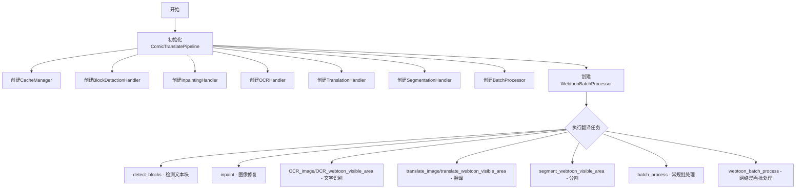

## 类结构

```
ComicTranslatePipeline (主协调器)
├── CacheManager (缓存管理)
├── BlockDetectionHandler (文本块检测)
├── InpaintingHandler (图像修复)
├── OCRHandler (光学字符识别)
├── TranslationHandler (翻译处理)
├── SegmentationHandler (分割处理)
├── BatchProcessor (常规批处理器)
└── WebtoonBatchProcessor (网络漫画批处理器)
```

## 全局变量及字段


### `ComicTranslatePipeline.main_page`
    
主页面对象

类型：`object`
    


### `ComicTranslatePipeline.cache_manager`
    
缓存管理器实例

类型：`CacheManager`
    


### `ComicTranslatePipeline.block_detection`
    
文本块检测处理器

类型：`BlockDetectionHandler`
    


### `ComicTranslatePipeline.inpainting`
    
图像修复处理器

类型：`InpaintingHandler`
    


### `ComicTranslatePipeline.ocr_handler`
    
OCR识别处理器

类型：`OCRHandler`
    


### `ComicTranslatePipeline.translation_handler`
    
翻译处理器

类型：`TranslationHandler`
    


### `ComicTranslatePipeline.segmentation_handler`
    
分割处理器

类型：`SegmentationHandler`
    


### `ComicTranslatePipeline.batch_processor`
    
常规批处理器

类型：`BatchProcessor`
    


### `ComicTranslatePipeline.webtoon_batch_processor`
    
网络漫画批处理器

类型：`WebtoonBatchProcessor`
    
    

## 全局函数及方法


### `ComicTranslatePipeline.__init__`

初始化主流水线类，创建并注入所有核心组件（缓存管理、文本块检测、图像修复、OCR识别、翻译、分批处理等），建立组件间的依赖关系和状态共享机制。

参数：

- `main_page`：`object`，主页面对象，包含图像查看器（image_viewer）和矩形项控制器（rect_item_ctrl）等UI组件，用于在各处理器中访问和操作图像及选区

返回值：`None`，该方法为构造函数，不返回任何值

#### 流程图

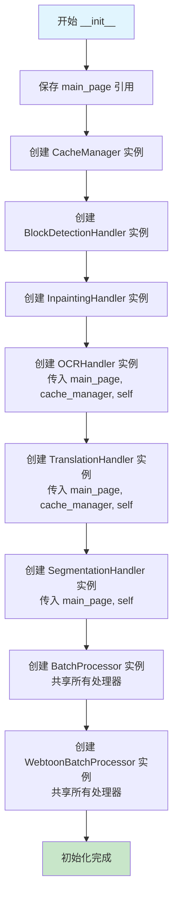

#### 带注释源码

```python
def __init__(self, main_page):
    """
    初始化主流水线及所有组件
    
    Args:
        main_page: 主页面对象，包含图像查看器和UI控件
    """
    # 保存主页面引用，用于后续各组件访问UI元素
    self.main_page = main_page
    
    # ========== 核心组件初始化 ==========
    
    # 缓存管理器：负责处理图像和文本的缓存，提升重复操作的效率
    self.cache_manager = CacheManager()
    
    # 文本块检测处理器：检测图像中的文字区域
    self.block_detection = BlockDetectionHandler(main_page)
    
    # 图像修复处理器：移除文字区域并进行图像修复
    self.inpainting = InpaintingHandler(main_page)
    
    # OCR识别处理器：识别文字内容，依赖缓存管理器和主流水线
    self.ocr_handler = OCRHandler(main_page, self.cache_manager, self)
    
    # 翻译处理器：翻译识别出的文字，依赖缓存管理器和主流水线
    self.translation_handler = TranslationHandler(main_page, self.cache_manager, self)
    
    # 分割处理器：用于Webtoon模式的区域分割，依赖主流水线
    self.segmentation_handler = SegmentationHandler(main_page, self)
    
    # ========== 批处理组件初始化 ==========
    
    # 批处理器：处理普通漫画的批量翻译
    # 将共享的处理器传入，确保状态和缓存一致
    self.batch_processor = BatchProcessor(
        main_page, 
        self.cache_manager, 
        self.block_detection, 
        self.inpainting, 
        self.ocr_handler
    )
    
    # Webtoon批处理器：处理Webtoon漫画的批量翻译（带重叠滑动窗口）
    # 同样传入共享处理器以保持一致性
    self.webtoon_batch_processor = WebtoonBatchProcessor(
        main_page,
        self.cache_manager,
        self.block_detection,
        self.inpainting,
        self.ocr_handler
    )
```


### `ComicTranslatePipeline.load_box_coords`

加载边界框坐标。该方法是委托给 `block_detection` 组件的代理方法，用于将边界框列表加载到块检测处理器中。

参数：

- `blk_list`：参数类型取决于 `BlockDetectionHandler.load_box_coords` 的实现，通常为边界框列表（List 或类似结构），表示要加载的文本块坐标列表

返回值：`None`，该方法直接修改内部状态，不返回任何值

#### 流程图

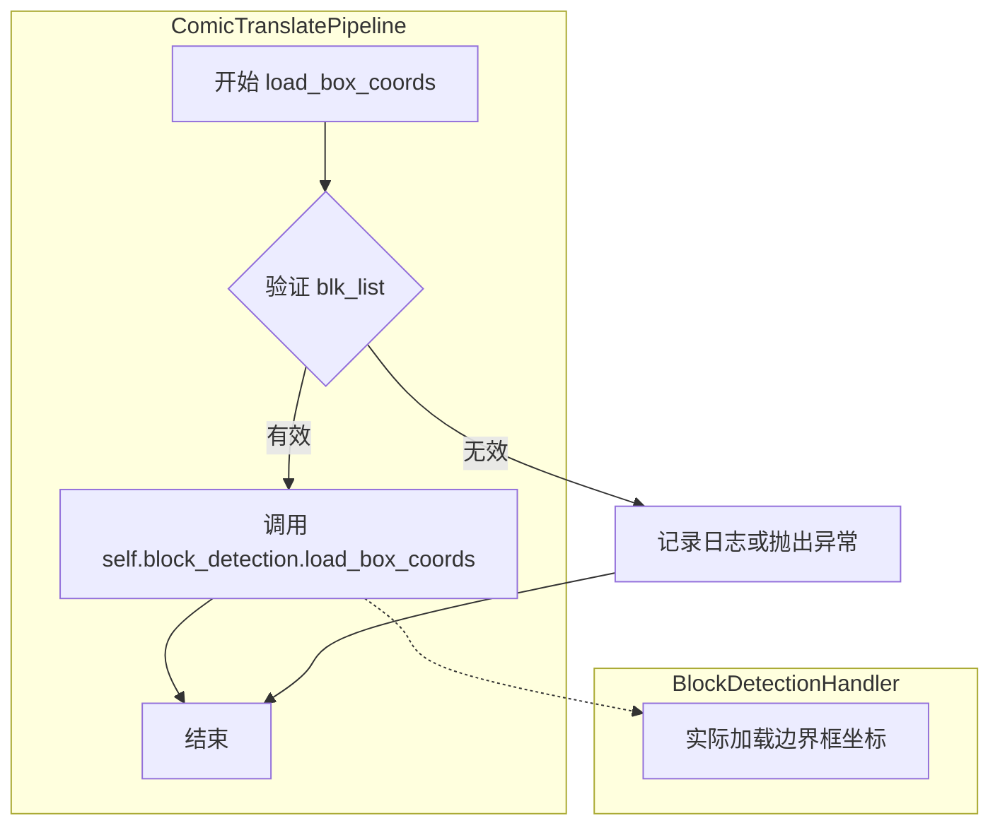

#### 带注释源码

```python
def load_box_coords(self, blk_list):
    """Load bounding box coordinates.
    
    这是一个委托方法，将边界框加载的职责传递给 block_detection 组件。
    该方法本身不直接处理坐标，而是调用内部 block_detection 对象的相应方法。
    
    Args:
        blk_list: 边界框列表，包含文本块的坐标信息。
                 具体类型取决于 BlockDetectionHandler 的实现。
    """
    # 委托给 block_detection 组件处理边界框加载
    # 这遵循了单一职责原则，将块检测相关逻辑封装在专门的处理器中
    self.block_detection.load_box_coords(blk_list)
```


### `ComicTranslatePipeline.detect_blocks`

该方法是一个委托方法，用于检测图像中的文本块。它内部调用 `BlockDetectionHandler` 实例的 `detect_blocks` 方法来执行实际的文本块检测工作。

参数：

- `load_rects`：`bool`，可选参数，指定是否加载已存在的矩形框坐标，默认为 `True`

返回值：取决于 `BlockDetectionHandler.detect_blocks` 的具体实现，通常返回检测到的文本块列表或相关结果对象

#### 流程图

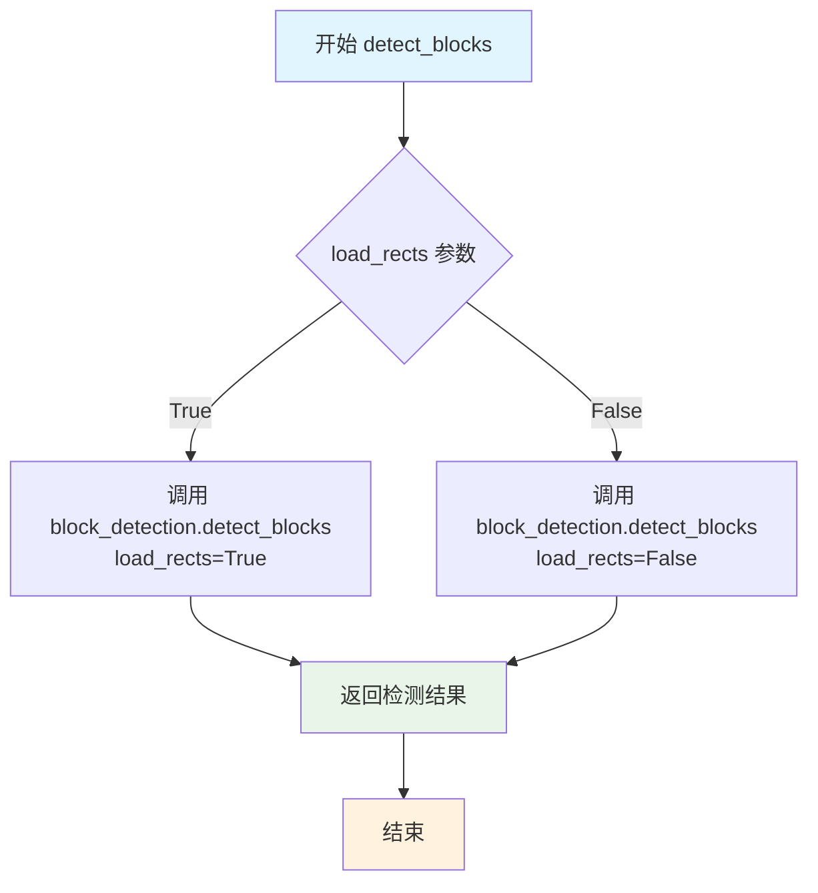

#### 带注释源码

```python
def detect_blocks(self, load_rects=True):
    """Detect text blocks in the image.
    
    该方法是 ComicTranslatePipeline 类对 BlockDetectionHandler 的委托封装。
    它将文本块检测的请求转发给内部持有的 block_detection 处理器来执行实际逻辑。
    
    Args:
        load_rects (bool): 布尔值参数，指示是否需要加载已有的矩形框坐标。
                          当为 True 时，会加载预定义的文本块坐标；
                          当为 False 时，会执行全新的文本块检测流程。
    
    Returns:
        任意类型: 返回 BlockDetectionHandler.detect_blocks() 的执行结果，
                典型情况下是检测到的文本块列表或包含检测结果的字典对象。
    """
    # 委托给 block_detection 处理器执行实际的文本块检测
    # self.block_detection 是 BlockDetectionHandler 的实例
    return self.block_detection.detect_blocks(load_rects)
```


### `ComicTranslatePipeline.on_blk_detect_complete`

处理文本块检测完成事件的方法，当文本块检测完成时调用此方法，将检测结果传递给 `BlockDetectionHandler` 进行后续处理。

参数：

- `result`：`Any`，文本块检测的结果对象，包含检测到的文本块坐标和相关信息

返回值：`None`，无返回值，仅执行委托调用

#### 流程图

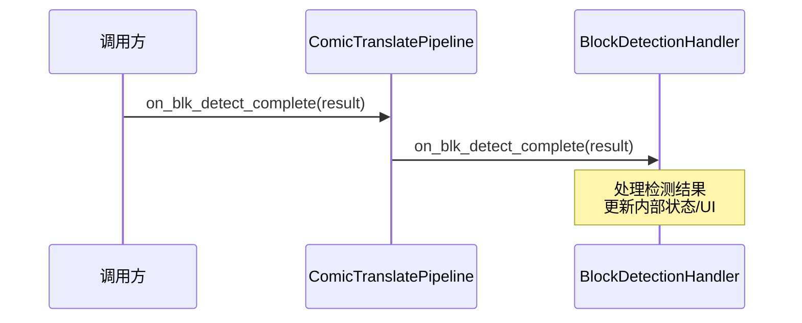

#### 带注释源码

```python
def on_blk_detect_complete(self, result):
    """Handle completion of block detection.
    
    当文本块检测完成时，此方法被调用。
    该方法是一个委托方法，将处理逻辑转发给 BlockDetectionHandler。
    
    参数:
        result: 文本块检测的结果，包含检测到的文本块坐标、
                置信度、掩码等信息
        
    返回:
        None: 此方法不返回任何值
    """
    # 委托给 block_detection 处理器执行实际的处理逻辑
    # BlockDetectionHandler 负责更新内部状态、通知UI等后续操作
    self.block_detection.on_blk_detect_complete(result)
```


### `ComicTranslatePipeline.manual_inpaint`

该方法是 `ComicTranslatePipeline` 类的委托方法，用于执行手动图像修复（inpainting）操作，通过委托给 `InpaintingHandler` 组件来实现具体功能。

参数：此方法无显式参数（隐式参数 `self` 为类实例自身）

返回值：`Any`，返回 `InpaintingHandler.manual_inpaint()` 的执行结果，具体类型取决于底层图像修复组件的实现，通常为图像修复结果或操作状态

#### 流程图

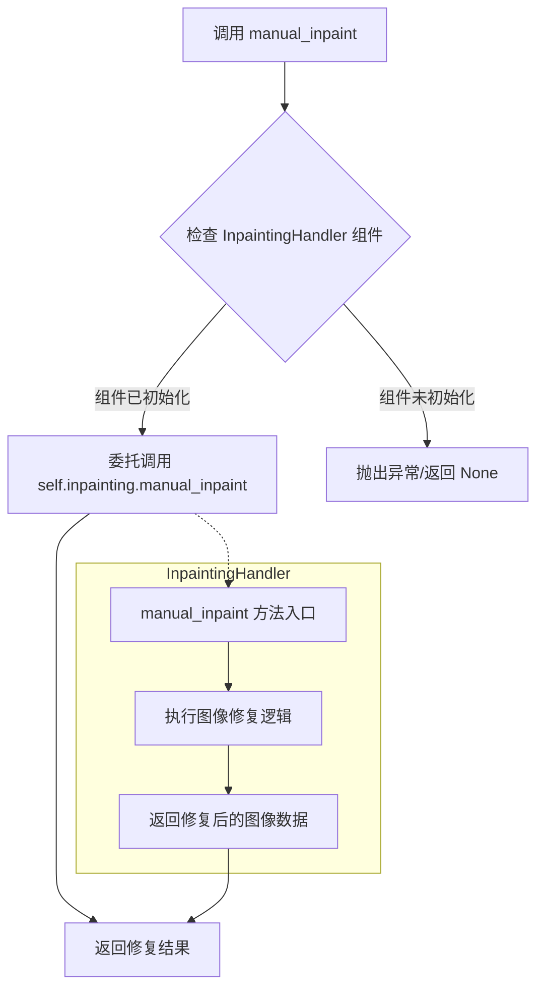

#### 带注释源码

```python
def manual_inpaint(self):
    """Perform manual inpainting."""
    # 委托模式：将手动图像修复的请求转发给 InpaintingHandler 组件
    # self.inpainting 是 InpaintingHandler 的实例，在 __init__ 中初始化
    # 该方法允许用户手动选择图像区域进行修复填充
    return self.inpainting.manual_inpaint()
```

#### 补充说明

**设计模式**：该方法采用了**委托模式（Delegate Pattern）**，将图像修复的具体实现委托给独立的 `InpaintingHandler` 组件处理，`ComicTranslatePipeline` 仅作为 orchestrator 负责协调各组件工作。

**调用链**：
```
用户界面 → ComicTranslatePipeline.manual_inpaint() → InpaintingHandler.manual_inpaint() → 底层图像修复算法
```

**依赖关系**：
- 依赖 `self.inpainting`（`InpaintingHandler` 实例）
- 依赖 `main_page`（主页面实例，用于获取图像上下文）

**注意事项**：由于 `InpaintingHandler` 的具体实现代码未提供，返回值类型需根据 `InpaintingHandler.manual_inpaint()` 的实际签名确定。


### `ComicTranslatePipeline.inpaint_complete`

处理图像修复完成事件，当图像修复（inpainting）操作完成后，此方法接收修复后的补丁列表，并将其传递给内部的 `InpaintingHandler` 进行后续处理。

参数：

- `patch_list`：`list`，修复完成的补丁列表，包含从图像修复结果中提取的补丁数据

返回值：`None`，无返回值，此方法通过委托调用 `InpaintingHandler` 的 `inpaint_complete` 方法完成处理

#### 流程图

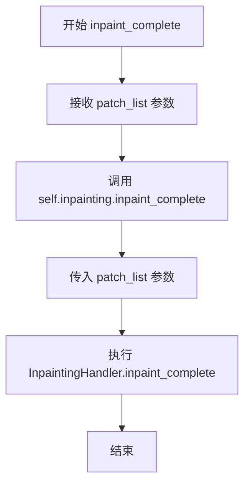

#### 带注释源码

```python
def inpaint_complete(self, patch_list):
    """Handle completion of inpainting."""
    # 委托给 InpaintingHandler 处理修复完成事件
    # patch_list: 包含从修复后的图像中提取的补丁列表
    self.inpainting.inpaint_complete(patch_list)
```


### `ComicTranslatePipeline.get_inpainted_patches`

获取修复后的图像块，该方法是一个委托方法，将获取图像块的逻辑转发给 `InpaintingHandler` 组件进行处理。

参数：

- `mask`：`numpy.ndarray` 或其他图像类型，表示用于定位图像块的掩码矩阵
- `inpainted_image`：`numpy.ndarray` 或其他图像类型，表示已完成修复的图像

返回值：`list` 或其他图像块集合类型，包含从掩码指定区域提取的修复后图像块

#### 流程图

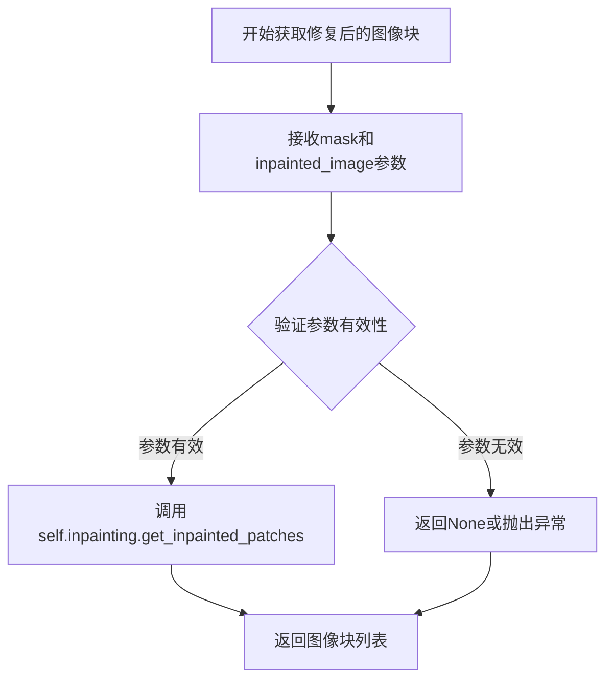

#### 带注释源码

```python
def get_inpainted_patches(self, mask, inpainted_image):
    """Get inpainted patches from mask and image.
    
    这是一个委托方法，将获取修复后图像块的请求转发给 InpaintingHandler 组件。
    该方法在漫画翻译流水线中用于从已完成修复的图像中提取指定区域的图像块，
    以便后续进行 OCR 识别或翻译处理。
    
    Args:
        mask: 用于定位图像块的掩码矩阵，指示需要提取的区域
        inpainted_image: 已完成图像修复的图像数据
    
    Returns:
        包含提取出的图像块列表，每个图像块对应掩码指定的一个区域
    """
    return self.inpainting.get_inpainted_patches(mask, inpainted_image)
```


### `ComicTranslatePipeline.inpaint`

该方法是一个委托方法，负责执行图像修复（inpainting）操作。它调用 `InpaintingHandler` 的 `inpaint` 方法来处理图像并返回生成的补丁列表，用于填充图像中的指定区域。

参数：

- 该方法无显式参数（`self` 为实例自身）

返回值：`任意类型`，返回 InpaintingHandler 处理后的补丁列表，用于后续的图像融合或替换操作

#### 流程图

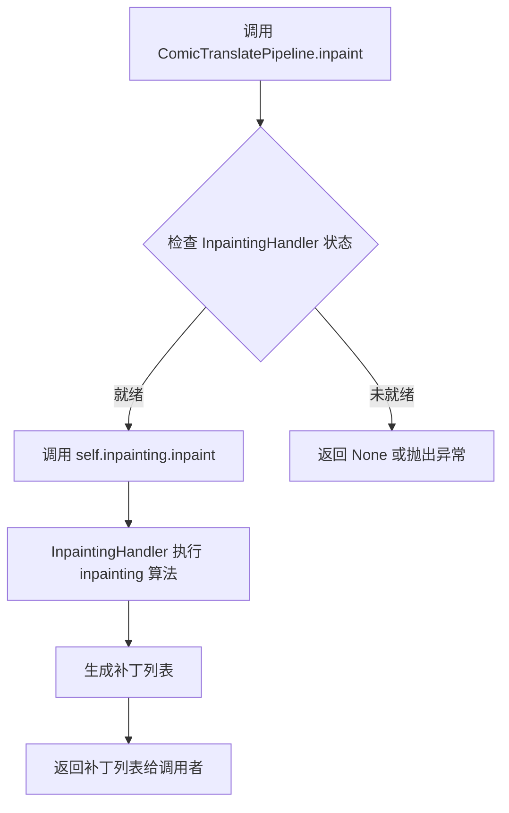

#### 带注释源码

```python
def inpaint(self):
    """Perform inpainting and return patches.
    
    该方法是一个委托方法，将图像修复操作委托给 InpaintingHandler 实例。
    它调用内部 inpainting 组件的 inpaint 方法来执行实际的图像修复逻辑。
    
    Returns:
        任意类型: InpaintingHandler.inpaint() 返回的补丁列表，
                 通常包含修复后的图像区域坐标和对应的图像数据
    """
    return self.inpainting.inpaint()
```


### `ComicTranslatePipeline.get_selected_block`

获取当前选中的文本块，如果存在选中的矩形区域，则将其映射到场景坐标并查找对应的文本块；否则返回 None。

参数：

- （无参数，仅包含隐式参数 `self`）

返回值：`object | None`，返回当前选中的文本块对象，如果未选中任何矩形则返回 `None`

#### 流程图

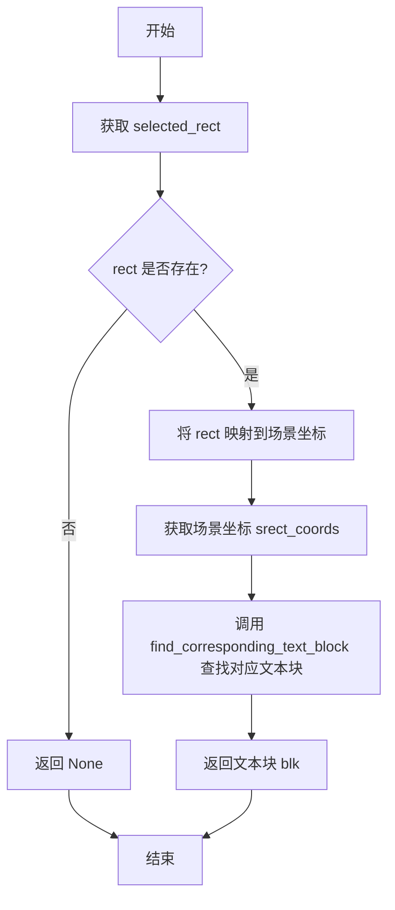

#### 带注释源码

```python
def get_selected_block(self):
    """Get the currently selected text block."""
    # 从主页面的图像查看器获取当前选中的矩形区域
    rect = self.main_page.image_viewer.selected_rect
    
    # 检查是否选中了矩形区域
    if not rect:
        # 如果没有选中任何区域，返回 None
        return None
    
    # 将矩形坐标从视图坐标系映射到场景坐标系
    srect = rect.mapRectToScene(rect.rect())
    
    # 获取场景坐标系下的矩形坐标 [x, y, width, height]
    srect_coords = srect.getCoords()
    
    # 通过矩形坐标查找对应的文本块对象
    blk = self.main_page.rect_item_ctrl.find_corresponding_text_block(srect_coords)
    
    # 返回找到的文本块，如果没有找到则返回 None
    return blk
```


### `ComicTranslatePipeline.OCR_image`

对图像或单个块执行OCR识别。该方法是 ComicTranslatePipeline 类提供的 OCR 功能的委托入口，通过将请求转发给内部的 `ocr_handler` 对象来完成实际的 OCR 处理工作，支持对整个图像或单个文本块进行识别。

参数：

- `single_block`：`bool`，可选参数，默认为 `False`。当设置为 `True` 时，仅对当前选中的单个文本块执行 OCR；当设置为 `False` 时，对整个图像进行 OCR 识别。

返回值：`None`，该方法直接调用 `ocr_handler.OCR_image()` 并通过其内部机制处理结果，不返回任何值。

#### 流程图

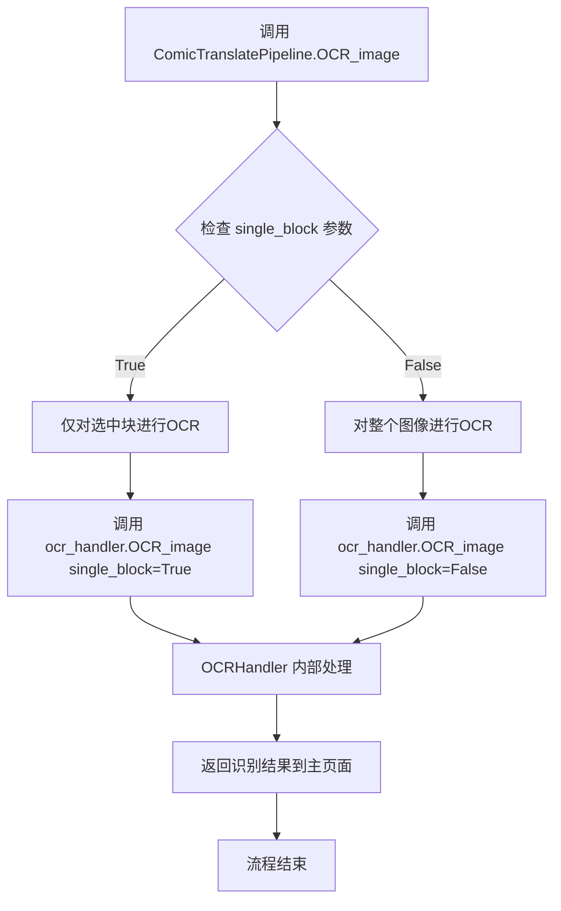

#### 带注释源码

```python
# OCR methods (delegate to ocr_handler)
def OCR_image(self, single_block=False):
    """Perform OCR on image or single block.
    
    该方法是OCR处理的委托入口，将OCR请求转发给内部的OCRHandler处理。
    支持两种模式：单块识别和全图识别。
    
    Args:
        single_block: 布尔值，指定是否仅对当前选中的文本块进行OCR。
                      True表示仅识别选中块，False表示识别整个图像。
    
    Returns:
        None: 该方法不直接返回值，结果通过ocr_handler内部机制处理和存储。
    """
    # 将OCR请求委托给 ocr_handler 对象执行实际的处理逻辑
    # ocr_handler 初始化时传入了 main_page、cache_manager 和 self(pipeline) 引用
    self.ocr_handler.OCR_image(single_block)
```


### `ComicTranslatePipeline.OCR_webtoon_visible_area`

对网络漫画（Webtoon）的可见区域执行光学字符识别（OCR），通过委托给内部的 OCRHandler 处理可见区域内的文本识别任务。

参数：

- `single_block`：`bool`，可选参数，指定是否只对单个文本块执行 OCR，默认为 `False`

返回值：`None`，该方法不返回任何值，直接在内部处理 OCR 结果

#### 流程图

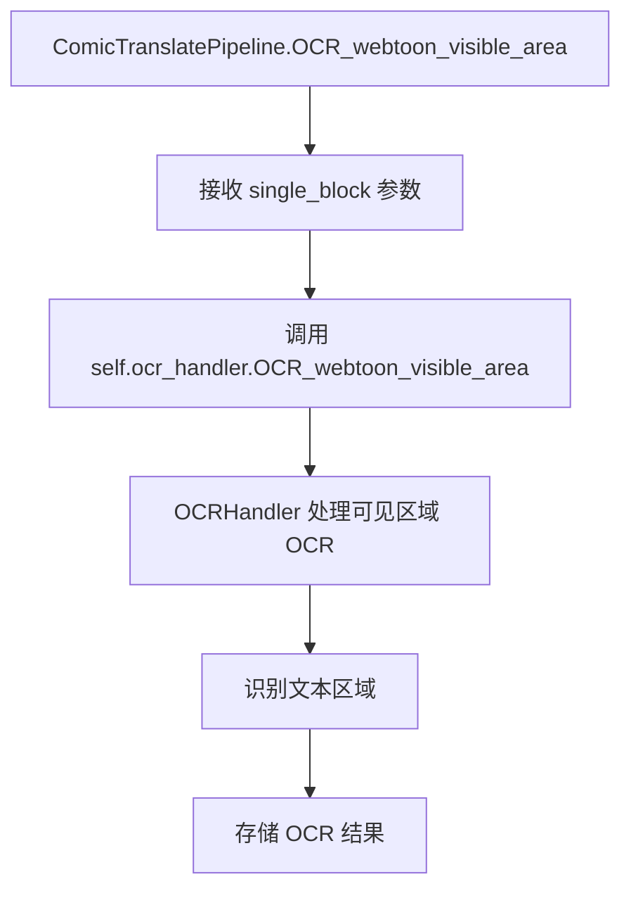

#### 带注释源码

```python
def OCR_webtoon_visible_area(self, single_block=False):
    """Perform OCR on visible area in webtoon mode."""
    # 委托给 OCRHandler 处理 Webtoon 可见区域的 OCR 任务
    # 参数 single_block 传递到 OCRHandler，决定是处理单个块还是整个可见区域
    self.ocr_handler.OCR_webtoon_visible_area(single_block)
```


### `ComicTranslatePipeline.translate_image`

该方法是漫画翻译管道中的翻译核心方法，通过委托模式将图像或单个文本块的翻译任务转发给 TranslationHandler 处理，支持普通漫画和 Webtoon 漫画的翻译流程。

参数：

- `self`：`ComicTranslatePipeline`，管道主类的实例，隐式参数
- `single_block`：`bool`，默认为 False，指定是否仅翻译当前选中的单个文本块，True 表示只翻译选中的块，False 表示翻译整个图像的所有块

返回值：`None`，该方法为委托方法，内部调用 TranslationHandler 的同名方法，当前实现中无显式返回值

#### 流程图

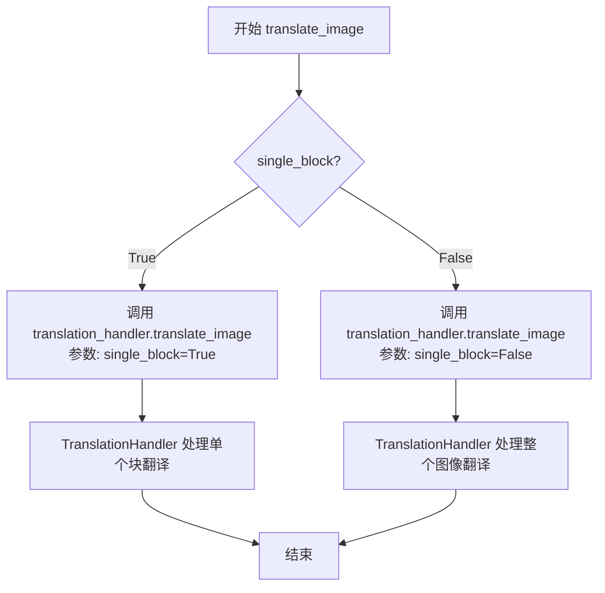

#### 带注释源码

```python
def translate_image(self, single_block=False):
    """Translate image or single block.
    
    此方法是委托方法，将翻译任务转发给 TranslationHandler。
    根据 single_block 参数决定是翻译整个图像还是仅翻译选中的单个文本块。
    
    参数:
        single_block: 布尔值，默认为 False。
                     True - 仅翻译当前选中的文本块
                     False - 翻译图像中的所有文本块
    
    返回值:
        无返回值（None），具体返回值由 TranslationHandler.translate_image 处理
    """
    # 委托给 translation_handler 进行实际的翻译处理
    # single_block 参数控制是单块翻译还是全图翻译
    self.translation_handler.translate_image(single_block)
```


### `ComicTranslatePipeline.translate_webtoon_visible_area`

该方法是一个委托方法，用于在网络漫画（webtoon）模式下翻译当前可见区域的文本内容。它接收一个布尔参数 `single_block` 来决定是翻译单个文本块还是翻译整个可见区域，并将实际翻译工作委托给内部的 `translation_handler` 对象处理。

参数：

- `single_block`：`bool`，可选参数，默认为 `False`。当设置为 `True` 时，仅翻译当前选中的单个文本块；当设置为 `False` 时，翻译可见区域内的所有文本块。

返回值：`None`，该方法直接调用 `translation_handler` 的对应方法，不返回任何值。

#### 流程图

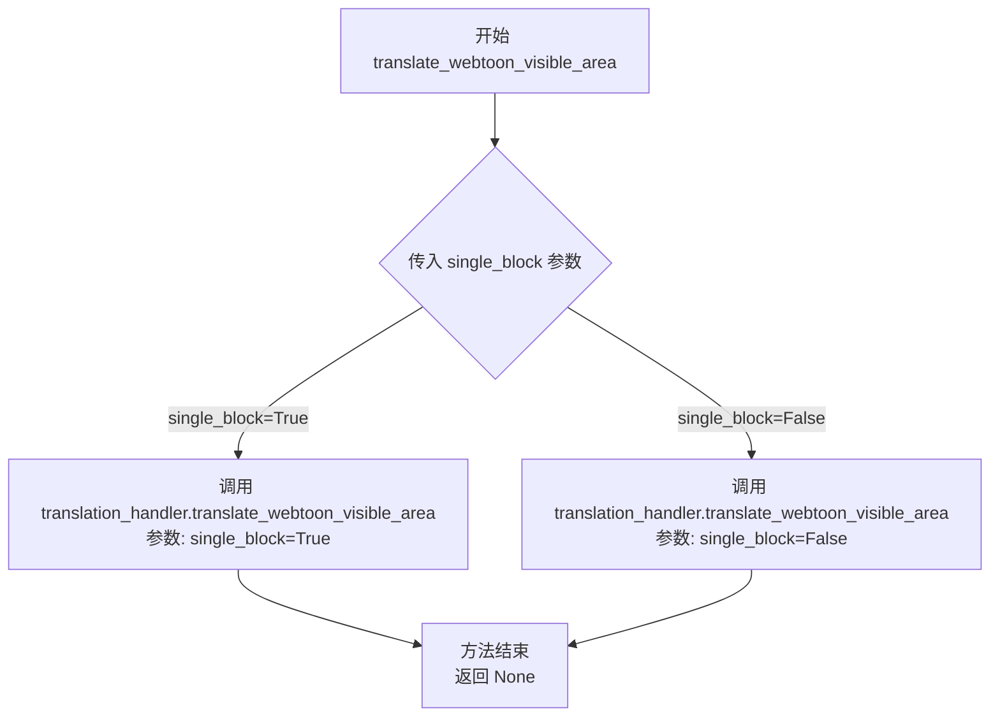

#### 带注释源码

```python
def translate_webtoon_visible_area(self, single_block=False):
    """Translate visible area in webtoon mode.
    
    委托翻译处理器执行网络漫画模式的可见区域翻译。
    该方法是门面模式的应用，将具体的翻译逻辑委托给 translation_handler。
    
    参数:
        single_block: 布尔值，指定是否仅翻译单个文本块。
                      True - 仅翻译选中的块
                      False - 翻译整个可见区域的所有块
    """
    # 委托给 translation_handler 的同名方法执行实际翻译逻辑
    self.translation_handler.translate_webtoon_visible_area(single_block)
```

---

### 补充信息

#### 1. 类的整体运行流程

`ComicTranslatePipeline` 是漫画翻译管道的主协调器，采用**委托模式**将不同功能分配给专门的处理器：

```
┌─────────────────────────────────────────────────────────────┐
│                   ComicTranslatePipeline                    │
├─────────────────────────────────────────────────────────────┤
│  初始化阶段:                                                 │
│  - 创建 CacheManager 实例管理缓存                          │
│  - 创建 BlockDetectionHandler 处理文本块检测               │
│  - 创建 InpaintingHandler 处理图像修复                     │
│  - 创建 OCRHandler 处理光学字符识别                        │
│  - 创建 TranslationHandler 处理翻译                        │
│  - 创建 SegmentationHandler 处理分割                       │
│  - 创建 BatchProcessor 处理批量处理                        │
│  - 创建 WebtoonBatchProcessor 处理网络漫画批量处理         │
└─────────────────────────────────────────────────────────────┘
                              │
                              ▼
┌─────────────────────────────────────────────────────────────┐
│  翻译流程 (translate_webtoon_visible_area):                 │
│  ComicTranslatePipeline.translate_webtoon_visible_area()   │
│          │                                                  │
│          ▼                                                  │
│  TranslationHandler.translate_webtoon_visible_area()        │
└─────────────────────────────────────────────────────────────┘
```

#### 2. 关键组件信息

| 组件名称 | 描述 |
|---------|------|
| `ComicTranslatePipeline` | 主管道协调器，负责整合所有处理模块，采用委托模式将不同功能分配给专门的处理器 |
| `translation_handler` | 翻译处理器，负责执行实际的翻译逻辑，包括网络漫画模式的可见区域翻译 |
| `CacheManager` | 缓存管理器，负责存储和管理翻译结果缓存，避免重复翻译 |
| `BlockDetectionHandler` | 文本块检测处理器，负责在图像中定位和识别文本区域 |
| `OCRHandler` | 光学字符识别处理器，负责从图像中提取文本内容 |
| `InpaintingHandler` | 图像修复处理器，负责在翻译后修复文本覆盖的区域 |

#### 3. 潜在的技术债务或优化空间

1. **无返回值的委托方法**：该方法直接调用 `translation_handler` 的方法但不返回任何结果，这可能导致调用者无法获取翻译状态或结果。建议考虑返回翻译结果或至少返回操作状态。

2. **重复代码模式**：该方法与 `translate_image` 方法结构几乎完全相同，都是简单的委托调用。可以考虑使用更通用的基类或混合类来减少代码重复。

3. **缺少错误处理**：该方法没有对 `translation_handler` 可能抛出的异常进行处理，如果翻译失败会导致调用栈向上传播。

4. **参数命名不够明确**：`single_block` 参数的语义不够直观，建议使用更明确的命名如 `translate_single_block_only` 或使用枚举类型。

#### 4. 其它项目

**设计模式应用**：
- **Facade（门面）模式**：`ComicTranslatePipeline` 作为 facade，为调用者提供统一的接口，隐藏底层处理器的复杂性
- **委托模式**：该方法体现了委托模式，将具体业务逻辑委托给 `translation_handler` 处理

**错误处理设计**：
- 当前实现没有错误处理机制，异常会直接向上传播
- 建议添加 try-except 块来捕获并处理可能的异常，提供更友好的错误信息

**数据流**：
- 输入：用户触发翻译操作，传入 `single_block` 参数
- 处理：通过 `translation_handler` 执行翻译
- 输出：无返回值（当前设计），建议改为返回翻译结果或状态


### `ComicTranslatePipeline.batch_process`

执行常规批处理，将处理任务委托给内部的 BatchProcessor 进行处理。

参数：

- `selected_paths`：`Optional[List[str]]`，待处理的文件路径列表，默认为 None，表示处理所有路径

返回值：`Any`，返回 BatchProcessor 的处理结果，通常为处理成功的文件数量或处理结果列表

#### 流程图

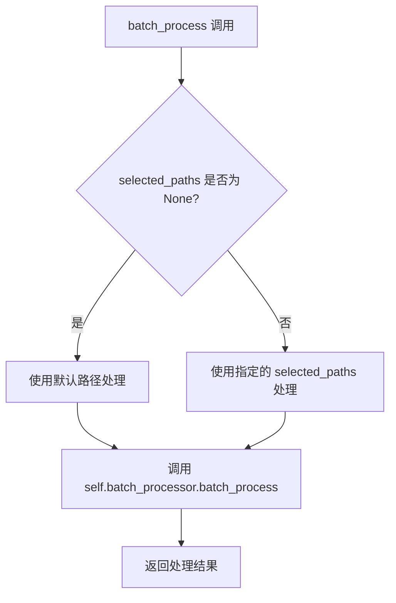

#### 带注释源码

```python
def batch_process(self, selected_paths=None):
    """Regular batch processing.
    
    委托给 BatchProcessor 执行常规批处理操作。
    该方法将处理请求转发到底层的 BatchProcessor 实例，
    由其完成实际的批量图像处理工作。
    
    Args:
        selected_paths: 可选的文件路径列表。
                       如果为 None，则 BatchProcessor 将使用默认路径。
    
    Returns:
        BatchProcessor.batch_process() 的返回值，通常为处理结果。
    """
    return self.batch_processor.batch_process(selected_paths)
```


### `ComicTranslatePipeline.webtoon_batch_process`

执行网络漫画（Webtoon）批处理功能，通过重叠滑动窗口方式对多个图像文件进行批量翻译处理。该方法是 `WebtoonBatchProcessor` 的委托包装器，实现网络漫画特有的分区域批处理逻辑。

参数：

- `self`：`ComicTranslatePipeline`，当前管道实例的隐式参数，表示调用该方法的对象本身
- `selected_paths`：`List[str]` 或 `None`，可选参数，要批量处理的文件路径列表，默认为 `None` 表示处理所有可用文件

返回值：取决于 `WebtoonBatchProcessor.webtoon_batch_process` 的返回类型，通常为批处理结果对象或处理状态信息

#### 流程图

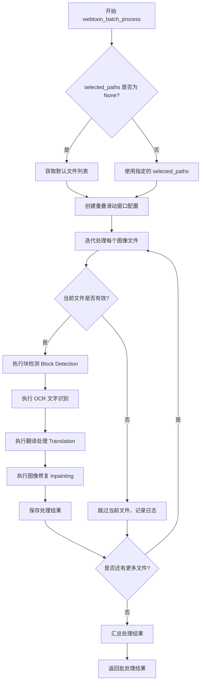

#### 带注释源码

```python
def webtoon_batch_process(self, selected_paths=None):
    """
    执行网络漫画批处理，使用重叠滑动窗口技术处理漫画页面。
    
    该方法是 ComicTranslatePipeline 类对 WebtoonBatchProcessor 的委托包装，
    专门用于处理网络漫画特有的长页面格式，通过滑动窗口将大页面分割为
    多个重叠区域进行处理，以准确识别和翻译跨区域的文字。
    
    参数:
        selected_paths (List[str] | None): 要批量处理的图像文件路径列表。
                                           如果为 None，则使用默认文件列表。
    
    返回:
        任意: 返回 WebtoonBatchProcessor.webtoon_batch_process 的执行结果，
              通常包含处理状态和结果摘要信息。
    
    示例:
        # 处理选定的文件
        pipeline = ComicTranslatePipeline(main_page)
        result = pipeline.webtoon_batch_process(['page1.png', 'page2.png'])
        
        # 处理所有可用文件
        result = pipeline.webtoon_batch_process()
    """
    # 委托给 WebtoonBatchProcessor 实例执行实际批处理逻辑
    # WebtoonBatchProcessor 在 __init__ 中被初始化，接收了共享的
    # cache_manager、block_detection、inpainting 和 ocr_handler
    return self.webtoon_batch_processor.webtoon_batch_process(selected_paths)
```


### `ComicTranslatePipeline.segment_webtoon_visible_area`

对网络漫画（Webtoon）模式下的可见区域进行分割处理，通过委托的方式调用 `SegmentationHandler` 来完成实际的分割操作。

参数：

- 无（仅接收实例自身 `self`）

返回值：`Unknown`（返回 `SegmentationHandler.segment_webtoon_visible_area()` 的执行结果，具体类型取决于 `SegmentationHandler` 的实现）

#### 流程图

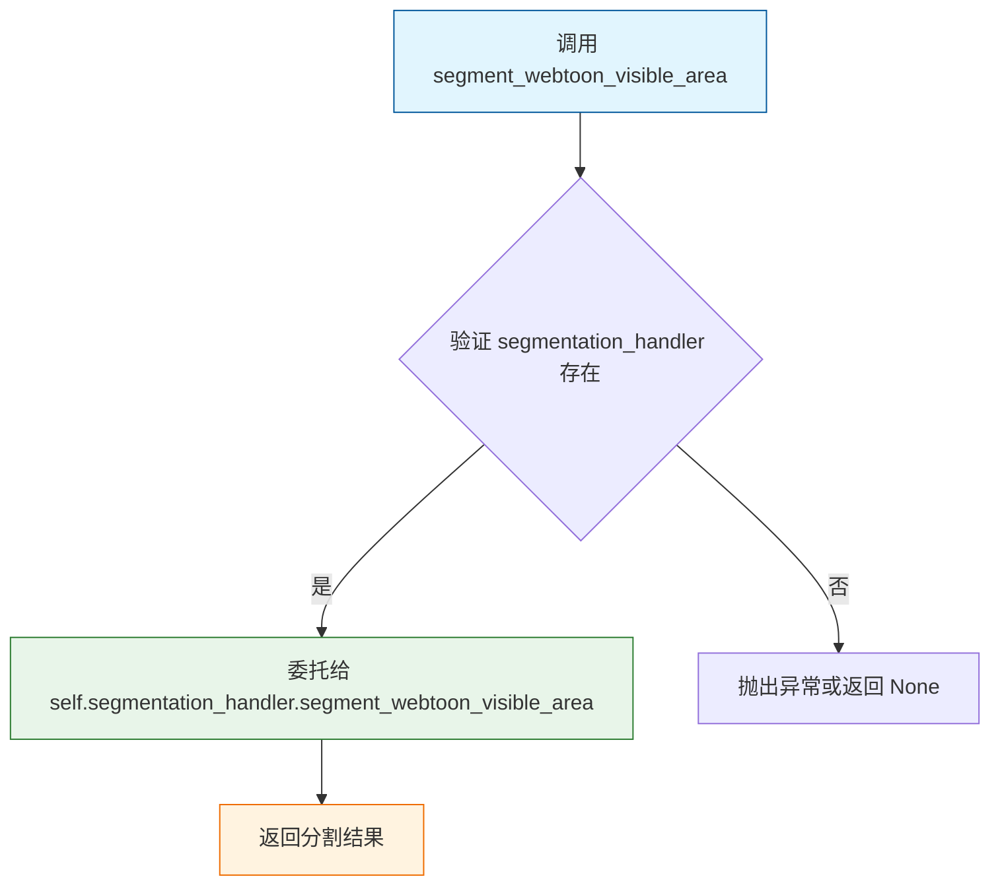

#### 带注释源码

```python
def segment_webtoon_visible_area(self):
    """Perform segmentation on visible area in webtoon mode.
    
    该方法是漫画翻译流水线中用于处理网络漫画（Webtoon）分割的入口点。
    采用了委托模式，将实际的分割逻辑转发给 self.segmentation_handler 对象处理。
    这种设计实现了职责分离，使得 ComicTranslatePipeline 专注于流程编排，
    而具体的分割实现可以独立变化。
    
    Returns:
        返回 SegmentationHandler.segment_webtoon_visible_area() 的执行结果，
        具体类型取决于 SegmentationHandler 的具体实现，通常为分割后的区域数据。
    """
    return self.segmentation_handler.segment_webtoon_visible_area()
```

## 关键组件


### CacheManager

缓存管理器，负责管理流水线中的数据缓存，确保各组件之间状态和缓存共享。

### BlockDetectionHandler

文本块检测处理器，负责在图像中检测文字区域并加载边界框坐标。

### InpaintingHandler

图像修复处理器，负责移除图像中的文字并生成修复后的补丁。

### OCRHandler

光学字符识别处理器，负责从图像中提取文字内容。

### TranslationHandler

翻译处理器，负责将识别出的文字翻译成目标语言。

### SegmentationHandler

分割处理器，负责在网络漫画模式下进行图像分割。

### BatchProcessor

批量处理器，负责协调常规漫画的批量翻译流程。

### WebtoonBatchProcessor

网络漫画批量处理器，负责使用重叠滑动窗口方式处理网络漫画的批量翻译。


## 问题及建议


### 已知问题

-   **委托方法过多**：类中存在超过20个简单的委托方法，导致`ComicTranslatePipeline`变成了一个“转发器”类，违背了单一职责原则，使类变得臃肿且难以维护。
-   **循环引用风险**：在初始化时，`OCRHandler`、`TranslationHandler`等处理器接收`self`（即`ComicTranslatePipeline`实例），而这些处理器又被`ComicTranslatePipeline`持有，形成了潜在的循环引用，可能导致内存泄漏或垃圾回收问题。
-   **所有组件预初始化**：在`__init__`中一次性创建所有处理器组件，即使某些功能（如webtoon_batch_processor）可能根本不会被使用，造成不必要的资源开销和启动延迟。
-   **缺乏抽象接口**：各处理器直接实例化具体类而非通过接口或抽象基类，导致替换实现困难，违反了依赖倒置原则，不利于单元测试和扩展。
-   **无错误处理机制**：代码中看不到任何异常捕获、参数校验或错误处理逻辑，任何组件的失败都可能导致整个流水线崩溃。
-   **直接依赖具体类**：在类内部直接`import`具体实现类（如`BatchProcessor`），而非通过工厂或依赖注入，增加了模块间的耦合度。
-   **参数验证缺失**：委托方法（如`batch_process`、`webtoon_process`）接受`selected_paths`参数但没有任何校验，可能传入非法值导致下游组件出错。
-   **日志记录不足**：虽然初始化了logger，但整个类中几乎没有任何日志输出，无法追踪流水线执行状态和问题排查。

### 优化建议

-   **引入门面模式或抽象接口**：定义统一的处理器接口，将委托方法收敛，或考虑使用`__getattr__`动态委托，减少显式的委托方法定义。
-   **实现懒加载/按需初始化**：将组件的创建延迟到首次使用时，而非在`__init__`中全部初始化，采用工厂模式或惰性属性实现。
-   **解除循环引用**：重构组件间的依赖关系，避免处理器持有父pipeline的引用，或使用弱引用（weakref）。
-   **依赖注入改造**：通过构造函数或Setter注入依赖，便于单元测试和替换实现，可引入DI容器或简单的依赖注入框架。
-   **添加异常处理与参数校验**：在关键方法入口添加参数校验，捕获并处理可能的异常，提供有意义的错误信息。
-   **增加日志覆盖**：在关键路径（初始化、方法调用、异常）添加适当的日志记录，便于监控和调试。
-   **提取配置与常量**：将组件初始化相关的硬编码参数提取到配置文件中，提高可维护性。
-   **考虑异步支持**：如果批量处理是耗时操作，考虑将其改为异步执行，提升用户体验。


## 其它


### 设计目标与约束

本流水线的核心设计目标是提供一个统一的漫画翻译处理框架，通过协调多个专用处理器（块检测、OCR、翻译、修复、分割）来实现自动化的漫画本地化。主要约束包括：1) 各处理器之间需要共享缓存管理器和状态以提高效率；2) 需要同时支持普通漫画和Webtoon两种模式的批量处理；3) main_page作为主控制器必须贯穿整个处理流程。

### 错误处理与异常设计

当前代码中错误处理机制较少，主要依赖各子组件的异常处理。建议在关键方法中添加异常捕获：1) `detect_blocks`应在块检测失败时返回空列表并记录日志；2) `OCR_image`和`translate_image`应在识别/翻译失败时保留原文本；3) `inpaint`应在修复失败时跳过当前区域继续处理；4) 批量处理方法应收集各步骤的错误信息并生成完整报告，而非立即终止。

### 数据流与状态机

流水线的数据流如下：1) 用户加载图像后通过`detect_blocks`进行文本块检测；2) 检测完成后通过`on_blk_detect_complete`触发OCR；3) OCR结果传递给翻译模块；4) 翻译完成后可选择进行修复(Inpainting)消除原文；5) Webtoon模式下还可通过分割(Segmentation)处理重叠文本。状态转换由main_page的事件驱动，各Handler通过回调函数通知完成状态。

### 外部依赖与接口契约

本类依赖以下外部组件：1) **CacheManager** - 提供翻译结果缓存，接口方法包括`get`、`set`等；2) **BlockDetectionHandler** - 文本块检测，核心方法`detect_blocks(load_rects)`返回块坐标列表；3) **InpaintingHandler** - 图像修复，核心方法`inpaint()`返回修复后的图像块；4) **OCRHandler** - 文本识别，需要main_page、cache_manager和pipeline实例；5) **TranslationHandler** - 翻译服务，接口与OCRHandler类似；6) **SegmentationHandler** - 区域分割，用于Webtoon模式；7) **BatchProcessor/WebtoonBatchProcessor** - 批量处理器，均需要共享cache和handler实例。

### 并发与同步机制

BatchProcessor和WebtoonBatchProcessor可能涉及多线程处理。需要关注：1) CacheManager的线程安全性，确保多线程读写缓存不会产生竞争条件；2) 各Handler的状态隔离，批量处理时需要防止状态污染；3) main_page的image_viewer在多线程访问时需要加锁保护。建议使用Python的threading.Lock或queue实现同步。

### 配置与参数设计

主要配置通过构造函数传入：1) **main_page** - 主页面控制器，包含图像查看器(image_viewer)和矩形项控制器(rect_item_ctrl)；2) 可扩展的配置项包括：OCR语言设置、翻译目标语言、修复算法参数、批处理并发数等，这些可由main_page统一管理或通过单独的配置文件传入。

### 性能考虑

性能优化策略包括：1) **缓存机制** - CacheManager存储OCR和翻译结果避免重复计算；2) **批量处理** - BatchProcessor和WebtoonBatchProcessor支持批量处理多张图像；3) **状态共享** - 通过构造函数共享handler实例减少对象创建开销；4) **Webtoon滑动窗口** - WebtoonBatchProcessor使用重叠滑动窗口策略提高大面积翻译的效率。建议进一步优化：添加结果预取、图像缓存和懒加载机制。

### 安全性考虑

当前代码安全性考虑较少。建议：1) 对外部输入（如文件路径）进行验证和清理，防止路径遍历攻击；2) 如果涉及网络翻译API，应妥善保管API密钥，避免硬编码；3) 添加操作日志审计，记录关键操作的时间戳和操作者信息。

### 测试策略

测试建议包括：1) **单元测试** - 针对各Handler组件独立测试，验证输入输出的正确性；2) **集成测试** - 测试ComicTranslatePipeline与各组件的交互；3) **Mock测试** - 使用mock替代main_page和外部依赖进行隔离测试；4) **端到端测试** - 用样本漫画图像测试完整流程；5) 重点测试边界情况：空图像、无文本图像、多语言混合等情况。

### 版本兼容性

依赖版本要求：1) Python标准库（logging、threading等）；2) 外部处理器模块需与本类接口匹配，特别是`detect_blocks`、`inpaint`、`OCR_image`等核心方法的签名必须一致；3) main_page对象需要具备image_viewer.selected_rect、rect_item_ctrl.find_corresponding_text_block等属性和方法。建议在文档中明确各组件的版本要求和接口契约。


    