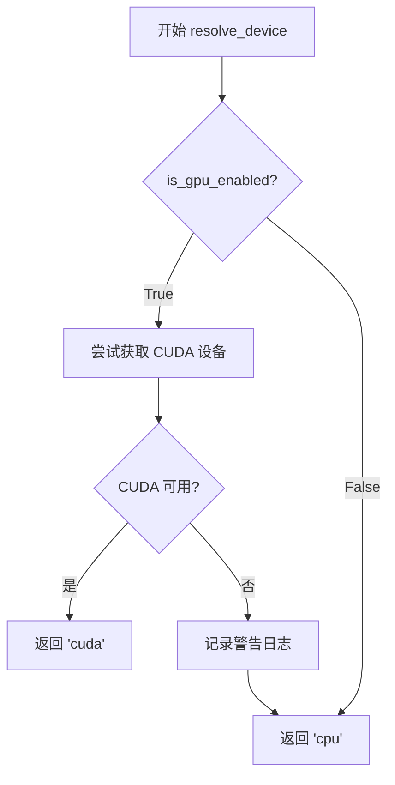
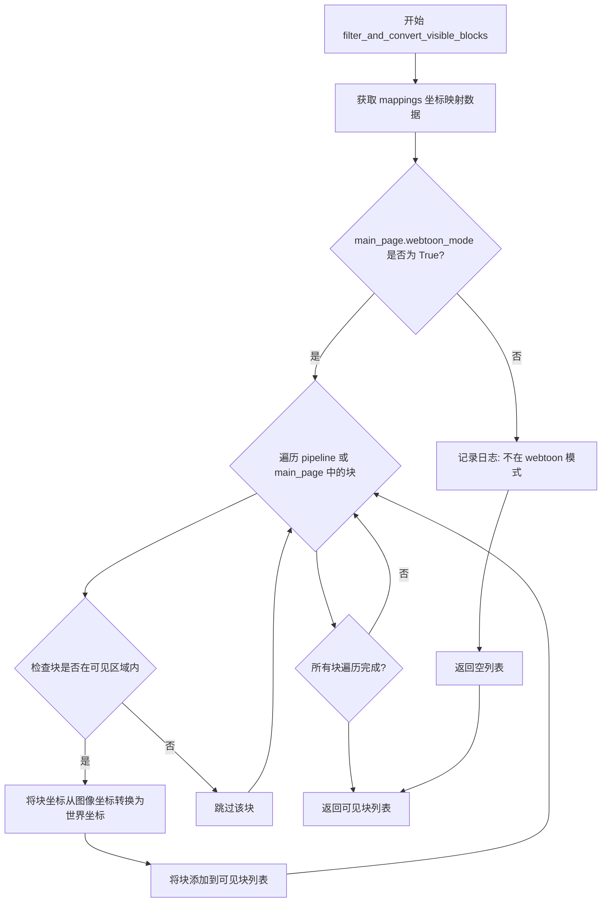
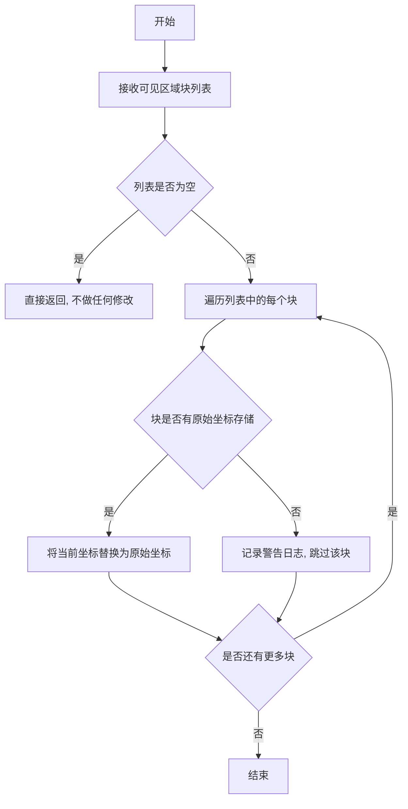
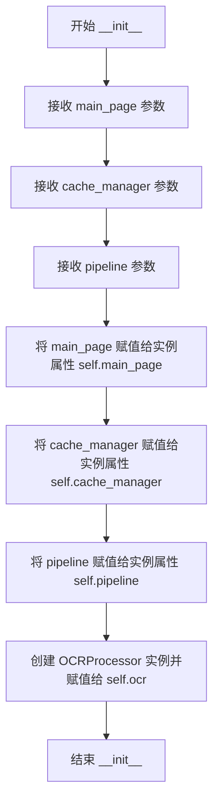
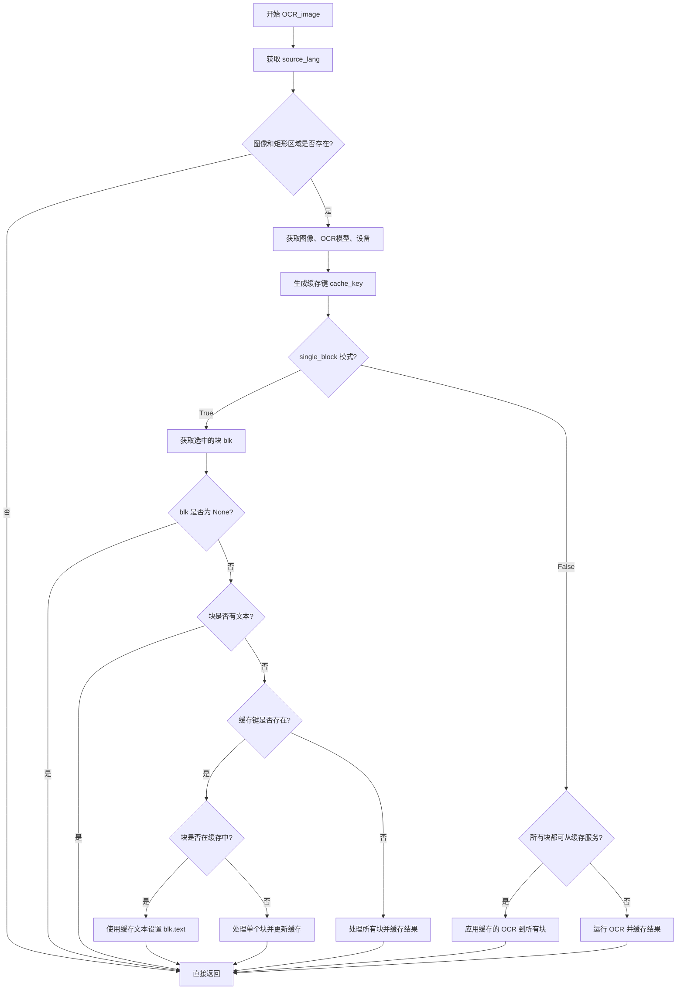
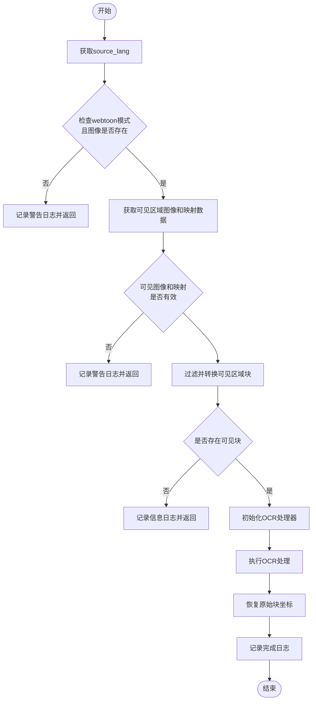

```mermaid
graph TD
    A[调用 logging.getLogger&#40;__name__&#41;] --> B{Logger 是否已存在于<br/>logging.manager.loggerDict}
    B -->|是| C[返回缓存的 Logger 实例]
    B -->|否| D[创建新的 Logger 对象]
    D --> E[设置 Logger 名称为 __name__]
    E --> F[设置默认日志级别为 WARNING]
    F --> G[添加默认 NullHandler]
    G --> H[将 Logger 添加到缓存]
    H --> I[返回 Logger 实例]
```

# `comic-translate\pipeline\ocr_handler.py` 详细设计文档

OCR处理模块，负责图像文字识别、缓存管理和Webtoon模式下可见区域的OCR处理，支持单块识别和全页识别两种模式，并利用缓存避免重复识别。

## 整体流程

```mermaid
graph TD
A[开始 OCR_image] --> B{是否有图像且有矩形区域?}
B -- 否 --> B1[返回空]
B -- 是 --> C[获取源语言]
C --> D[获取OCR模型和设备]
D --> E[生成缓存键]
E --> F{single_block模式?}
F -- 是 --> G{选中块是否有文本?}
G -- 是 --> G1[返回 - 避免重复处理]
G -- 否 --> H{缓存中是否有结果?}
H -- 是 --> H1[从缓存读取并更新块文本]
H -- 否 --> I[处理单个块并更新缓存]
F -- 否 --> J{能否从缓存服务所有块?]
J -- 是 --> J1[应用缓存的OCR结果到所有块]
J -- 否 --> K[运行OCR并缓存结果]
L[开始 OCR_webtoon_visible_area] --> M{是否Webtoon模式?}
M -- 否 --> M1[记录警告并返回]
M -- 是 --> N[获取可见区域图像和映射]
N --> O{是否有可见区域?}
O -- 否 --> O1[记录警告并返回]
O -- 是 --> P[过滤并转换可见区域块]
P --> Q{是否有可见块?}
Q -- 否 --> Q1[记录日志并返回]
Q -- 是 --> R[对可见图像执行OCR]
R --> S[恢复原始块坐标]
```

## 类结构

```
OCRHandler (OCR处理类)
├── __init__ (构造函数)
├── OCR_image (图像OCR主方法)
└── OCR_webtoon_visible_area (Webtoon可见区域OCR)
```

## 全局变量及字段


### `logging`
    
Python标准日志模块，用于记录程序运行信息

类型：`module`
    


### `OCRProcessor`
    
OCR处理器类，负责执行实际的OCR识别操作

类型：`class`
    


### `resolve_device`
    
设备解析函数，根据设置确定使用CPU或GPU进行OCR处理

类型：`function`
    


### `filter_and_convert_visible_blocks`
    
Webtoon工具函数，过滤并转换可见区域的块坐标

类型：`function`
    


### `restore_original_block_coordinates`
    
Webtoon工具函数，恢复块的原始坐标

类型：`function`
    


### `logger`
    
模块级日志记录器，用于输出运行日志

类型：`logging.Logger`
    


### `OCRHandler.main_page`
    
主页面对象，包含UI组件和设置，如s_combo、image_viewer、settings_page、blk_list等

类型：`object (MainPage)`
    


### `OCRHandler.cache_manager`
    
缓存管理器，处理OCR结果缓存，提供缓存键生成、缓存检查、缓存读写等方法

类型：`object (CacheManager)`
    


### `OCRHandler.pipeline`
    
处理管道，包含块操作方法，如get_selected_block()等

类型：`object (Pipeline)`
    


### `OCRHandler.ocr`
    
OCRProcessor实例，执行实际OCR识别，调用底层OCR模型处理图像

类型：`OCRProcessor`
    
    

## 全局函数及方法


### `logging.getLogger`

获取一个与当前模块关联的日志记录器（Logger）实例，用于在模块内记录程序运行时的日志信息，支持不同级别的日志输出（如 DEBUG、INFO、WARNING、ERROR 等）。

参数：

-  `name`：`str`，模块的名称，通常使用 Python 内置的 `__name__` 变量，表示当前模块的全限定名（如 `modules.handlers.ocr_handler`）

返回值：`logging.Logger`，返回一个 Logger 对象实例，用于记录日志信息

#### 流程图



#### 带注释源码

```python
import logging  # 导入 Python 标准库的 logging 模块

# 使用当前模块的名称作为 Logger 的名称
# __name__ 是 Python 的内置变量，会自动替换为当前模块的全限定名
# 例如：如果这个文件是 modules/handlers/ocr_handler.py，则 __name__ 为 'modules.handlers.ocr_handler'
logger = logging.getLogger(__name__)
```

#### 说明

`logging.getLogger(__name__)` 是 Python 日志系统中最常用的模式，其特点如下：

1. **自动命名**：每个模块使用 `__name__` 作为 Logger 名称，可以方便地在日志中识别来源模块
2. **层级查找**：Python logging 采用层级命名（如 `parent.child`），子 Logger 会继承父 Logger 的配置
3. **单例模式**：相同名称的 Logger 只会创建一次，后续调用会返回缓存的实例
4. **零配置可用**：默认情况下 Logger 级别为 WARNING，会丢弃 DEBUG 和 INFO 级别的日志，需要配置 Handler 才能输出到控制台或文件


### `resolve_device`

解析计算设备（CPU/GPU），根据 GPU 设置返回合适的设备标识符，用于 OCR 处理。

参数：

- `is_gpu_enabled`：`bool`，表示是否启用 GPU，通过 `self.main_page.settings_page.is_gpu_enabled()` 获取

返回值：`str`，返回设备标识符，如 `'cpu'`、`'cuda'` 或 `'gpu'`

#### 流程图



#### 带注释源码

```
# 从 modules.utils.device 模块导入 resolve_device 函数
# 此函数定义在 modules/utils/device.py 中
from modules.utils.device import resolve_device

# 在 OCRHandler 类中的调用方式：
device = resolve_device(
    self.main_page.settings_page.is_gpu_enabled()
)

# 函数原型（基于调用推断）:
def resolve_device(is_gpu_enabled: bool) -> str:
    """
    根据 GPU 设置解析计算设备
    
    参数:
        is_gpu_enabled: 是否启用 GPU
        
    返回:
        设备标识符字符串 ('cpu', 'cuda', 'gpu' 等)
    """
    # 实现逻辑根据实际 modules/utils/device.py 而定
```

#### 补充说明

| 项目 | 说明 |
|------|------|
| **函数位置** | `modules.utils.device` 模块 |
| **调用场景** | 在 `OCRHandler.OCR_image()` 方法中，为 OCR 处理选择合适的计算设备 |
| **设计目的** | 根据用户设置动态选择 CPU 或 GPU 进行 OCR 推理，GPU 可加速处理 |
| **异常处理** | 当 GPU 不可用时应回退到 CPU，并记录警告日志 |
| **依赖项** | 需确保 `modules.utils.device` 模块正确安装/存在 |


### `filter_and_convert_visible_blocks`

该函数用于在 Webtoon 模式下过滤出可见区域内的块，并将图像坐标转换为块的世界坐标。

参数：

- `main_page`：`<class 'MainWindow'>` 或类似的主页面对象，包含图像查看器和块列表等信息
- `pipeline`：`<class 'Pipeline'>` 或类似管道对象，用于获取和管理块
- `mappings`：`<class 'list'>` 或 `<class 'dict'>`，可见区域图像与原始图像之间的坐标映射关系
- `single_block`：`<class 'bool'>`，是否仅处理单个选中块

返回值：`<class 'list'>`，过滤后的可见区域块列表

#### 流程图



#### 带注释源码

```
# 注意：此函数定义在 pipeline.webtoon_utils 模块中
# 以下为基于调用点的推断实现

def filter_and_convert_visible_blocks(main_page, pipeline, mappings, single_block):
    """
    过滤并转换可见区域块。
    
    参数:
        main_page: 主窗口对象，包含 webtoon 模式和块列表
        pipeline: 管道对象，用于获取块
        mappings: 可见区域图像与原始图像的坐标映射
        single_block: 是否仅处理单个块
    
    返回:
        list: 可见区域内的块列表
    """
    visible_blocks = []
    
    # 获取需要处理的块
    if single_block:
        # 仅处理选中的单个块
        blk = pipeline.get_selected_block()
        if blk is not None:
            blocks_to_check = [blk]
        else:
            blocks_to_check = []
    else:
        # 处理所有块
        blocks_to_check = getattr(main_page, 'blk_list', [])
    
    # 遍历块并检查是否在可见区域内
    for blk in blocks_to_check:
        # 检查块坐标是否在 mappings 定义的可见区域内
        if is_block_in_visible_area(blk, mappings):
            # 转换坐标：从图像坐标转换为世界坐标
            converted_blk = convert_block_coordinates(blk, mappings)
            visible_blocks.append(converted_blk)
    
    return visible_blocks

def is_block_in_visible_area(blk, mappings):
    """检查块是否在可见区域内"""
    # 块的坐标需要通过 mappings 进行转换后判断
    # ...
    pass

def convert_block_coordinates(blk, mappings):
    """转换块的坐标从图像坐标到世界坐标"""
    # 使用 mappings 中的坐标映射进行转换
    # ...
    pass
```

#### 使用示例（来自 OCRHandler）

```python
# 在 OCRHandler.OCR_webtoon_visible_area 方法中的调用
visible_blocks = filter_and_convert_visible_blocks(
    self.main_page, self.pipeline, mappings, single_block
)
if not visible_blocks:
    logger.info("No blocks found in visible area")
    return
```

#### 关联函数

| 名称 | 描述 |
|------|------|
| `restore_original_block_coordinates` | 恢复块到原始坐标系统 |
| `OCRProcessor.process` | 执行 OCR 识别处理 |
| `get_visible_area_image` | 获取可见区域图像和坐标映射 |


### `restore_original_block_coordinates`

该函数用于在 Webtoon 模式下执行 OCR 后，将已转换坐标的可见区域块恢复为原始坐标。由于 OCR 是在裁剪的可见区域图像上进行的，块的坐标是相对于可见区域的，需要恢复为相对于原始完整图像的坐标。

参数：

- `visible_blocks`：列表（List），需要恢复原始坐标的块对象列表

返回值：`无`（None），该函数直接修改传入的块列表，不返回任何值

#### 流程图



#### 带注释源码

```
# 该函数定义于 pipeline/webtoon_utils.py
# 注意：由于原始代码中未提供此函数的实现，以下为基于函数调用的推断实现

def restore_original_block_coordinates(visible_blocks):
    """
    恢复块的原始坐标。
    
    在 Webtoon 模式下，OCR 是在裁剪的可见区域图像上执行的，
    块的坐标是相对于可见区域左上角的。需要将坐标恢复到
    相对于原始完整图像的位置。
    
    参数:
        visible_blocks: list - 需要恢复坐标的块对象列表
        
    返回:
        None - 直接修改传入的列表，不返回值
    """
    
    # 检查输入列表是否为空
    if not visible_blocks:
        logger.debug("No blocks to restore coordinates for")
        return
    
    # 遍历每个块并恢复其原始坐标
    for block in visible_blocks:
        # 检查块是否有原始坐标的存储属性
        if hasattr(block, '_original_coords') or hasattr(block, 'original_coordinates'):
            # 从存储的属性中获取原始坐标
            original_x = getattr(block, '_original_coords', {}).get('x', block.x)
            original_y = getattr(block, '_original_coords', {}).get('y', block.y)
            original_w = getattr(block, '_original_coords', {}).get('w', block.w)
            original_h = getattr(block, '_original_coords', {}).get('h', block.h)
            
            # 恢复坐标值
            block.x = original_x
            block.y = original_y
            block.w = original_w
            block.h = original_h
            
            logger.debug(f"Restored coordinates for block {getattr(block, 'id', 'unknown')}")
        else:
            # 如果没有原始坐标存储，记录警告
            logger.warning(f"Block {getattr(block, 'id', 'unknown')} has no stored original coordinates")
    
    logger.info(f"Restored original coordinates for {len(visible_blocks)} blocks")
```

---

**注意**：由于提供的代码片段中未包含 `restore_original_block_coordinates` 函数的实际实现，以上内容是基于函数名称、调用上下文以及 Webtoon OCR 流程的逻辑推断得出的。实际的函数实现可能略有不同，建议查阅 `pipeline/webtoon_utils.py` 文件获取完整源码。


### `OCRHandler.__init__`

初始化 OCR 处理器，建立与页面、缓存管理器和流程管道的关联，并创建 OCR 处理器实例。

参数：

- `main_page`：`object`，主页面对象，包含 UI 组件（如下拉框、图像查看器、设置页面和块列表）
- `cache_manager`：`object`，缓存管理器，用于管理 OCR 结果的缓存
- `pipeline`：`object`，流程管道，用于获取选中的块和执行处理流程

返回值：`None`，该方法为构造函数，不返回任何值

#### 流程图



#### 带注释源码

```
def __init__(self, main_page, cache_manager, pipeline):
    """
    初始化 OCR 处理器
    
    参数:
        main_page: 主页面对象，提供 UI 组件和设置
        cache_manager: 缓存管理器，用于存储和检索 OCR 结果
        pipeline: 流程管道，用于获取选中的块和处理流程
    """
    # 将主页面对象保存为实例属性，供后续 OCR 方法使用
    self.main_page = main_page
    
    # 将缓存管理器保存为实例属性，用于 OCR 结果的缓存管理
    self.cache_manager = cache_manager
    
    # 将流程管道保存为实例属性，用于获取选中的块等信息
    self.pipeline = pipeline
    
    # 创建 OCR 处理器实例，用于执行实际的 OCR 识别操作
    self.ocr = OCRProcessor()
```


### `OCRHandler.OCR_image`

该方法执行图像OCR处理，支持单块模式和全页模式两种运行方式，并实现了多层缓存机制以避免重复OCR计算，提升性能。

参数：

- `single_block`：`bool`，可选参数，默认为 False。当为 True 时，仅对当前选中的单个文本块进行 OCR 处理；为 False 时，对页面所有文本块进行全页 OCR。

返回值：`None`，该方法直接修改块对象的 `text` 属性，不返回任何值。

#### 流程图



#### 带注释源码

```python
def OCR_image(self, single_block: bool = False):
    """
    执行图像OCR，支持单块和全页模式，带缓存机制
    
    参数:
        single_block: bool, 是否只处理选中的单个块
    """
    # 从UI获取当前选择的源语言
    source_lang = self.main_page.s_combo.currentText()
    
    # 检查图像查看器是否有照片且存在文本块矩形区域
    if self.main_page.image_viewer.hasPhoto() and self.main_page.image_viewer.rectangles:
        # 获取当前图像的numpy数组表示
        image = self.main_page.image_viewer.get_image_array()
        
        # 从设置页面获取选定的OCR模型（如Tesseract、PaddleOCR等）
        ocr_model = self.main_page.settings_page.get_tool_selection('ocr')
        
        # 根据GPU设置解析计算设备（CPU或GPU）
        device = resolve_device(
            self.main_page.settings_page.is_gpu_enabled()
        )
        
        # 构建缓存键，包含图像哈希、语言、模型和设备信息
        cache_key = self.cache_manager._get_ocr_cache_key(image, source_lang, ocr_model, device)
        
        # ==================== 单块模式 ====================
        if single_block:
            # 获取当前Pipeline中选中的文本块
            blk = self.pipeline.get_selected_block()
            if blk is None:
                return  # 无选中块，直接返回
            
            # 检查块是否已有文本，避免重复OCR处理
            if hasattr(blk, 'text') and blk.text and blk.text.strip():
                return
            
            # 检查是否有该图像/模型/语言的缓存结果
            if self.cache_manager._is_ocr_cached(cache_key):
                # 检查当前块是否在缓存中（即使文本为空也表示曾处理过）
                cached_text = self.cache_manager._get_cached_text_for_block(cache_key, blk)
                if cached_text is not None:
                    # 命中缓存，直接使用缓存结果
                    blk.text = cached_text
                    logger.info(f"Using cached OCR result for block: '{cached_text}'")
                    return
                else:
                    # 块不在缓存中，需要处理这个单独块
                    logger.info("Block not found in cache, processing single block...")
                    # 初始化OCR引擎
                    self.ocr.initialize(self.main_page, source_lang)
                    # 创建单块列表进行处理
                    single_block_list = [blk]
                    self.ocr.process(image, single_block_list)
                    
                    # 将新结果更新到缓存
                    self.cache_manager.update_ocr_cache_for_block(cache_key, blk)
                    
                    logger.info(f"Processed single block and updated cache: '{blk.text}'")
            else:
                # 无缓存，需要对整个页面运行OCR
                logger.info("No cached OCR results found, running OCR on entire page...")
                self.ocr.initialize(self.main_page, source_lang)
                
                # 创建原始块到副本的映射，用于保持ID一致性
                original_to_copy = {}
                all_blocks_copy = []
                
                # 遍历所有原始块，创建深拷贝用于OCR处理
                for original_blk in self.main_page.blk_list:
                    copy_blk = original_blk.deep_copy()
                    all_blocks_copy.append(copy_blk)
                    # 使用原始块的ID作为映射键
                    original_id = self.cache_manager._get_block_id(original_blk)
                    original_to_copy[original_id] = copy_blk
                
                # 如果存在块，运行OCR处理
                if all_blocks_copy:
                    self.ocr.process(image, all_blocks_copy)
                    # 使用原始块列表缓存，保持一致的ID
                    self.cache_manager._cache_ocr_results(cache_key, self.main_page.blk_list, all_blocks_copy)
                    # 从缓存中获取目标块的OCR结果
                    cached_text = self.cache_manager._get_cached_text_for_block(cache_key, blk)
                    blk.text = cached_text
                    logger.info(f"Cached OCR results and extracted text for block: {cached_text}")
        
        # ==================== 全页模式 ====================
        else:
            # 检查是否可以从缓存服务所有块
            if self.cache_manager._can_serve_all_blocks_from_ocr_cache(cache_key, self.main_page.blk_list):
                # 缓存命中，直接应用缓存结果到所有块
                self.cache_manager._apply_cached_ocr_to_blocks(cache_key, self.main_page.blk_list)
                logger.info(f"Using cached OCR results for all {len(self.main_page.blk_list)} blocks")
            else:
                # 缓存未命中，需要运行OCR
                self.ocr.initialize(self.main_page, source_lang)
                if self.main_page.blk_list:
                    self.ocr.process(image, self.main_page.blk_list)
                    # 将结果缓存
                    self.cache_manager._cache_ocr_results(cache_key, self.main_page.blk_list)
                    logger.info("OCR completed and cached for %d blocks", len(self.main_page.blk_list))
```


### `OCRHandler.OCR_webtoon_visible_area`

执行Webtoon模式下的可见区域OCR处理，对当前可视范围内的图像区域进行文字识别，并恢复原始块坐标。

参数：

- `single_block`：`bool`，可选参数，默认为False。当设置为True时，仅处理选中的单个块；否则处理所有可见区域内的块。

返回值：`None`，该方法直接修改块对象的text属性，不返回任何值。

#### 流程图



#### 带注释源码

```python
def OCR_webtoon_visible_area(self, single_block: bool = False):
    """Perform OCR on the visible area in webtoon mode."""
    # 获取当前选择的源语言
    source_lang = self.main_page.s_combo.currentText()
    
    # 检查是否处于webtoon模式且图像查看器中有照片
    if not (self.main_page.image_viewer.hasPhoto() and 
            self.main_page.webtoon_mode):
        logger.warning("OCR_webtoon_visible_area called but not in webtoon mode")
        return
    
    # 从图像查看器获取可见区域图像和块映射数据
    visible_image, mappings = self.main_page.image_viewer.get_visible_area_image()
    
    # 验证可见区域数据有效性
    if visible_image is None or not mappings:
        logger.warning("No visible area found for OCR")
        return
    
    # 过滤出可见区域内的块并转换坐标系统
    visible_blocks = filter_and_convert_visible_blocks(
        self.main_page, self.pipeline, mappings, single_block
    )
    
    # 如果没有找到可见区域内的块，提前返回
    if not visible_blocks:
        logger.info("No blocks found in visible area")
        return
    
    # 使用当前语言设置初始化OCR处理器
    self.ocr.initialize(self.main_page, source_lang)
    
    # 对可见图像执行OCR处理
    self.ocr.process(visible_image, visible_blocks)
    
    # OCR文本已设置在块对象上，只需恢复原始坐标
    restore_original_block_coordinates(visible_blocks)
    
    # 记录完成的块数量
    logger.info(f"OCR completed for {len(visible_blocks)} blocks in visible area")
```

#### 关键组件信息

| 组件名称 | 描述 |
|---------|------|
| `filter_and_convert_visible_blocks` | 全局函数，过滤并转换可见区域内的块坐标 |
| `restore_original_block_coordinates` | 全局函数，恢复块的原始坐标系统 |
| `OCRProcessor` | OCR处理核心类，负责实际文字识别 |
| `image_viewer.get_visible_area_image` | 获取当前可视区域图像和块映射数据的方法 |

#### 潜在技术债务与优化空间

1. **缺少缓存机制**：与`OCR_image`方法不同，`OCR_webtoon_visible_area`没有实现缓存逻辑，每次调用都会重新执行OCR，可能导致性能问题和重复计算。

2. **错误处理不完善**：当前仅记录警告日志后返回，缺乏对特定错误类型的处理（如OCR初始化失败、图像处理异常等）。

3. **返回值不明确**：方法无返回值，调用者无法得知执行结果或失败原因，建议添加状态码或异常抛出机制。

4. **参数验证缺失**：未对`single_block`参数的具体行为进行文档说明，且当`single_block=True`时的处理逻辑依赖于外部`pipeline`的状态。

## 关键组件


### OCRHandler 类

负责OCR处理的核心类，提供图像文本识别功能，支持缓存机制、单块处理和Webtoon模式下的可见区域OCR。

### 缓存管理模块

通过cache_manager实现OCR结果的缓存，包括缓存键生成、缓存检查、缓存结果应用等功能，避免重复OCR处理。

### 单块OCR处理机制

支持对单个文本块进行OCR识别，通过single_block参数控制，包含缓存检查、块ID映射和增量更新逻辑。

### Webtoon模式OCR

OCR_webtoon_visible_area方法实现Webtoon模式下的可见区域OCR，包含可见块过滤、坐标转换和原始坐标恢复功能。

### 设备解析

resolve_device函数根据GPU设置确定OCR使用的计算设备（CPU或GPU）。

### 可见块过滤与坐标转换

filter_and_convert_visible_blocks函数和restore_original_block_coordinates函数负责将块坐标映射到可见区域坐标系，并在OCR完成后恢复原始坐标。


## 问题及建议


### 已知问题

-   **方法过长且复杂度高**：`OCR_image`方法超过120行，包含多个嵌套的条件分支，违反单一职责原则，难以维护和测试
-   **紧耦合的缓存管理**：直接调用`cache_manager`的私有方法（如`_get_ocr_cache_key`、`_is_ocr_cached`、`_cache_ocr_results`等），违反封装原则，导致OCRHandler与缓存实现细节强耦合
-   **重复代码**：在`single_block`两种分支中，大量重复的OCR初始化、缓存检查和结果应用逻辑
-   **缺少异常处理**：OCR处理、图像获取、缓存读写等关键操作均无try-except保护，可能导致程序崩溃
-   **命名不规范**：`OCR_image`方法名使用混合命名风格（驼峰式），不符合Python的snake_case规范
-   **类型注解缺失**：方法参数和返回值缺少类型提示，降低代码可读性和IDE支持
-   **日志级别不一致**：部分使用`logger.info`部分使用`logger.warning`，且部分成功操作也使用warning级别
-   **潜在的内存问题**：`deep_copy()`创建所有块的副本可能在大文档下导致内存压力
-   **缓存键生成依赖私有方法**：`_get_block_id`是私有方法，调用链脆弱

### 优化建议

-   **重构OCR_image方法**：将方法拆分为多个子方法，如`_check_cache_and_apply`、`_process_single_block`、`_process_all_blocks`、`_run_ocr_and_cache`等
-   **引入缓存策略模式**：将缓存逻辑抽象为接口或策略类，通过依赖注入方式使用，降低类之间的耦合度
-   **统一命名规范**：将`OCR_image`重命名为`ocr_image`，`OCR_webtoon_visible_area`重命名为`ocr_webtoon_visible_area`
-   **添加完整的类型注解**：为所有方法参数和返回值添加类型提示
-   **增强错误处理**：在OCR处理、图像获取、缓存操作等关键路径添加try-except并提供有意义的错误信息
-   **统一日志级别**：根据操作结果使用合适的日志级别，如缓存命中用debug，OCR完成用info，异常用warning或error
-   **优化内存使用**：对于大图像处理，考虑使用生成器或分批处理，避免一次性加载所有块副本
-   **提取常量**：将缓存相关的字符串键、配置值提取为常量类
-   **考虑使用缓存装饰器**：对于缓存检查逻辑，可以考虑使用装饰器模式简化代码

## 其它


### 设计目标与约束

本模块的设计目标是为应用提供高效的OCR文字识别能力，支持单块识别和全页识别两种模式，通过缓存机制避免重复识别操作，提升性能。在webtoon模式下支持可见区域识别，仅处理当前可视范围内的区块。约束条件包括：需要依赖外部OCR模型、识别结果受图片质量和语言设置影响、缓存策略需要合理管理内存占用。

### 错误处理与异常设计

OCR处理过程中主要涉及以下异常情况：图片为空或无法获取时记录警告日志并返回；未启用webtoon模式时调用OCR_webtoon_visible_area会记录警告并提前返回；无可见区域或无映射数据时记录警告并返回；选中的block为空时直接返回避免空指针；模型初始化失败或识别异常时由底层OCRProcessor捕获处理。对于缓存相关操作，提供了缓存命中和未命中的日志记录，便于追踪缓存状态。

### 数据流与状态机

OCRHandler的数据流主要包括：用户触发OCR请求 → 获取当前语言设置 → 检查图片是否存在 → 根据single_block参数决定处理模式（单块/全页/webtoon可见区域）→ 调用OCRProcessor执行识别 → 将结果写入block对象或更新缓存。对于单块识别流程：检查block是否有现有文本 → 检查缓存是否命中 → 如无缓存则处理单块并更新缓存。对于全页识别流程：检查是否所有block均可从缓存服务 → 如否则执行全页OCR并缓存结果。webtoon模式流程：获取可见区域图片和坐标映射 → 过滤并转换坐标到可见区域 → 执行OCR → 恢复原始坐标。

### 外部依赖与接口契约

OCRHandler依赖以下外部组件：OCRProcessor（modules.ocr.processor）：提供initialize()初始化方法和process()执行识别方法；CacheManager：提供_get_ocr_cache_key、_is_ocr_cached、_get_cached_text_for_block、update_ocr_cache_for_block、_cache_ocr_results、_can_serve_all_blocks_from_ocr_cache、_apply_cached_ocr_to_blocks等缓存管理方法；resolve_device（modules.utils.device）：根据GPU设置返回计算设备；filter_and_convert_visible_blocks和restore_original_block_coordinates（pipeline.webtoon_utils）：webtoon模式专用工具函数。主页面对象需提供image_viewer（图片查看器）、settings_page（设置页面）、s_combo（语言选择器）、blk_list（块列表）、webtoon_mode（webtoon模式标志）等属性。Pipeline对象需提供get_selected_block()方法获取选中块。

### 性能考虑

本模块通过多级缓存策略优化性能：单块处理时优先检查该块是否已有文本避免重复处理；缓存命中时直接使用缓存结果无需重新识别；全页处理前检查是否所有块均可从缓存服务，如是则跳过OCR执行。缓存键由图片、源语言、OCR模型和计算设备共同生成，确保不同配置下的结果隔离。webtoon模式下仅处理可见区域图片和块，显著减少识别量和内存占用。

### 线程与并发模型

OCRProcessor的初始化和process方法可能在主线程或后台线程执行，具体取决于调用上下文。缓存操作（读写）需要考虑线程安全性，CacheManager应提供线程安全的实现。当前代码中未显式使用异步机制，建议在大量块处理时考虑后台线程执行以保持UI响应。

### 配置与参数

OCR处理涉及以下可配置项：OCR模型选择通过settings_page.get_tool_selection('ocr')获取；计算设备通过is_gpu_enabled()控制；源语言通过s_combo.currentText()获取。缓存策略由CacheManager内部实现，包括缓存键生成规则和缓存有效期管理。

### 监控与日志

模块使用Python标准logging模块记录关键操作：info级别记录处理开始、缓存命中、识别完成等正常流程；warning级别记录条件不满足（如无图片、非webtoon模式、无可见区域等）的提前返回；建议增加error级别日志记录识别失败等异常情况。当前日志包含处理块数量、缓存状态、识别文本内容等信息，便于问题排查和性能监控。

### 测试策略建议

建议为OCRHandler编写单元测试，测试场景包括：单块识别缓存命中时直接返回不调用OCR；单块识别缓存未命中时正确调用OCR并更新缓存；全页识别所有块缓存命中时跳过OCR执行；全页识别部分块缺失时仅处理缺失块；webtoon模式正确过滤可见区域块；各种异常情况（无图片、无块、无选中块）的正确处理。Mock CacheManager和OCRProcessor以隔离测试目标。

    