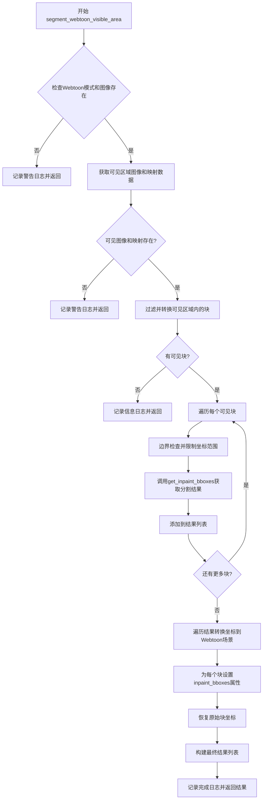
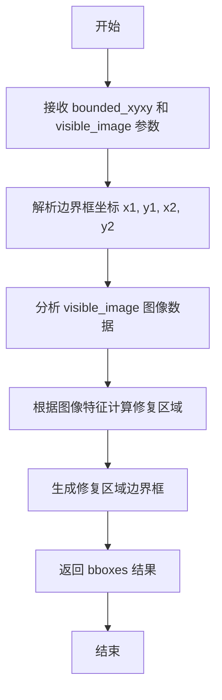
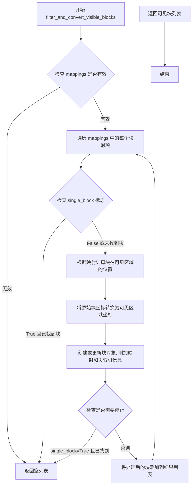
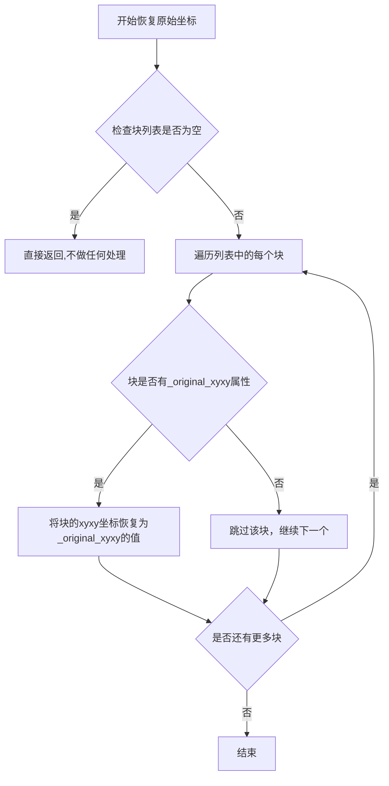
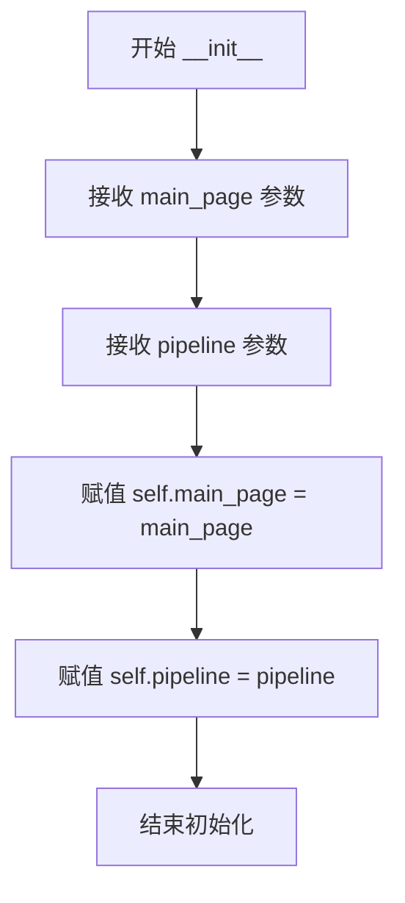
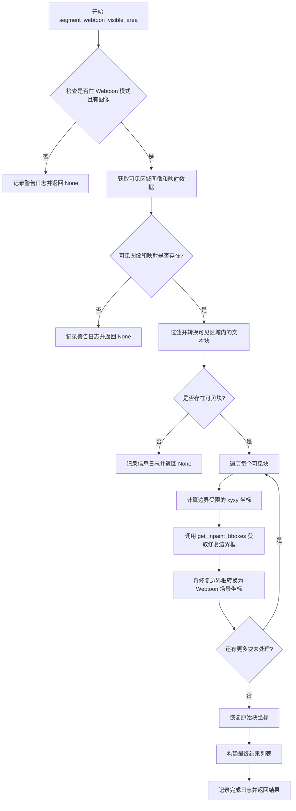

# `comic-translate\pipeline\segmentation_handler.py` 详细设计文档

这是一个Webtoon模式下的文本分割处理器，负责对可见区域内的图像块进行分割处理，将分割结果转换为Webtoon场景坐标，并维护原始块坐标的一致性。

## 整体流程



## 类结构

```
SegmentationHandler (分割处理类)
```

## 全局变量及字段


### `logger`
    
模块级日志记录器，用于记录分割处理过程中的信息、警告和错误

类型：`logging.Logger`
    


### `visible_image`
    
从图像查看器获取的可见区域图像数据

类型：`numpy.ndarray`
    


### `mappings`
    
可见区域图像与原始页面之间的坐标映射数据

类型：`dict/list`
    


### `visible_blocks`
    
经过坐标转换后位于可见区域内的文本块列表

类型：`list[Block]`
    


### `results`
    
存储每个块的分割结果的列表，每项包含块对象和对应的边界框

类型：`list[tuple]`
    


### `image_height`
    
可见区域图像的高度像素值

类型：`int`
    


### `image_width`
    
可见区域图像的宽度像素值

类型：`int`
    


### `blk`
    
当前正在处理的文本块对象

类型：`Block`
    


### `bounded_xyxy`
    
经过边界限制处理后的块坐标 [x1, y1, x2, y2]

类型：`list[int]`
    


### `bboxes`
    
分割算法返回的图像修复区域边界框

类型：`list/numpy.ndarray`
    


### `webtoon_manager`
    
Webtoon模式下的管理器对象，负责坐标转换和场景管理

类型：`WebtoonManager`
    


### `converted_bboxes`
    
从图像坐标转换到Webtoon场景坐标后的边界框

类型：`list/numpy.ndarray`
    


### `processed_blocks`
    
已完成分割处理的所有块对象列表

类型：`list[Block]`
    


### `final_results`
    
返回给调用者的最终结果，包含块对象和转换后的边界框

类型：`list[tuple]`
    


### `SegmentationHandler.main_page`
    
主页面对象，包含图像查看器和Webtoon管理器等组件

类型：`MainPage`
    


### `SegmentationHandler.pipeline`
    
处理管道对象，用于执行分割算法的实际处理流程

类型：`Pipeline`
    
    

## 全局函数及方法


### `get_inpaint_bboxes`

该函数用于根据给定的边界框坐标和可见区域图像，计算需要修复（inpaint）的区域边界框。它接收原始文本块的边界框坐标和对应的图像数据，返回修复区域的具体边界框坐标，用于后续的图像修复处理。

参数：

- `bounded_xyxy`：`List[int]`，边界框坐标列表，包含 [x1, y1, x2, y2]，分别表示边界框的左上角和右下角坐标
- `visible_image`：`numpy.ndarray`，可见区域的图像数据，用于分析图像特征以确定修复区域

返回值：`numpy.ndarray` 或 `List`，修复区域的边界框坐标数组，包含需要修复的区域坐标信息

#### 流程图



#### 带注释源码

```python
# 从 modules.detection.utils.content 模块导入该函数
# 该函数的具体实现未在当前代码文件中展示
# 以下为调用处的源码分析：

# 1. 准备边界框坐标
x1 = max(0, min(blk.xyxy[0], image_width - 1))
y1 = max(0, min(blk.xyxy[1], image_height - 1))
x2 = max(x1 + 1, min(blk.xyxy[2], image_width))
y2 = max(y1 + 1, min(blk.xyxy[3], image_height))

# 2. 构建有边界的坐标列表，确保坐标在图像范围内
bounded_xyxy = [x1, y1, x2, y2]

# 3. 调用 get_inpaint_bboxes 函数获取修复区域边界框
# 参数1: bounded_xyxy - 边界框坐标列表
# 参数2: visible_image - 可见区域图像数据
bboxes = get_inpaint_bboxes(bounded_xyxy, visible_image)

# 4. 函数返回修复区域的边界框，用于后续的图像修复处理
# 返回值可能包含一个或多个修复区域的坐标
```

#### 补充信息

**潜在技术债务与优化空间：**

1. **缺乏函数实现文档**：当前代码中只导入了该函数但未展示其具体实现，建议在`modules.detection.utils.content`模块中补充详细的函数文档和注释
2. **坐标边界检查**：调用处已经做了边界检查，但函数内部可能也需要额外的参数验证

**设计目标与约束：**

- 函数设计应支持批量处理多个修复区域
- 应能处理不同尺寸和类型的图像输入
- 返回值格式应与后续的坐标转换函数（如`convert_bboxes_to_webtoon_coordinates`）兼容

**错误处理建议：**

- 当`visible_image`为空或格式不正确时应返回`None`
- 当`bounded_xyxy`坐标无效（如x1>=x2或y1>=y2）时应抛出明确的异常或返回`None`
- 应处理图像数据类型不匹配的情况


### `filter_and_convert_visible_blocks`

过滤并转换可见块函数，用于在 Webtoon 模式下根据可见区域映射数据过滤出位于可见区域内的块，并进行坐标转换。

参数：

- `main_page`：对象，主页面对象，包含图像查看器和 Webtoon 管理器等信息
- `pipeline`：对象，处理管道，用于执行分割等操作
- `mappings`：列表或字典，可见区域的映射数据，描述了原始坐标到可见区域坐标的映射关系
- `single_block`：布尔值，指定是否只处理单个块，默认为 `False`（处理所有可见块）

返回值：列表，过滤并转换后的可见块列表，每个块包含转换后的坐标和映射信息

#### 流程图



#### 带注释源码

```
# 该函数定义在 webtoon_utils 模块中，当前代码段仅展示其导入和使用方式
# 函数签名（根据调用推断）:
# def filter_and_convert_visible_blocks(main_page, pipeline, mappings, single_block=False):
#     """
#     过滤并转换可见块
#     
#     参数:
#         main_page: 页面对象，包含图像查看器等
#         pipeline: 处理管道
#         mappings: 可见区域映射数据
#         single_block: 是否只处理单个块
#     
#     返回:
#         可见块列表
#     """
#     ...  # 函数实现未在当前代码段中展示
```

#### 使用示例源码（在 `SegmentationHandler.segment_webtoon_visible_area` 中）

```python
# 在 SegmentationHandler 类中的调用方式:
# 获取可见区域图像和映射数据
visible_image, mappings = self.main_page.image_viewer.get_visible_area_image()

# 调用过滤并转换函数
# 注意: Segmentation 始终处理所有可见块, 所以 single_block=False
visible_blocks = filter_and_convert_visible_blocks(
    self.main_page,  # 页面对象
    self.pipeline,   # 处理管道
    mappings,        # 可见区域映射
    single_block=False  # 处理所有可见块
)

# 如果没有可见块则记录日志并返回
if not visible_blocks:
    logger.info("No blocks found in visible area for segmentation")
    return
```

---

**注意**：当前提供的代码段中只包含 `filter_and_convert_visible_blocks` 函数的导入语句和调用方式，**并未包含该函数的具体实现源码**。该函数定义在 `modules.detection.utils.webtoon_utils` 模块中。如需获取完整的函数实现，请提供 `webtoon_utils.py` 文件的内容。


### `restore_original_block_coordinates`

恢复在Webtoon模式分割过程中被临时修改的块坐标，将其恢复到原始状态。该函数用于清理在分割处理期间对块坐标所做的临时转换，确保块对象保持其原始坐标系统。

参数：

- `processed_blocks`：`List`，需要恢复原始坐标的块对象列表，这些块在分割过程中坐标可能被临时修改

返回值：`None`，该函数直接修改传入的块对象，不返回任何值

#### 流程图



#### 带注释源码

```
def restore_original_block_coordinates(processed_blocks):
    """
    恢复原始块坐标
    
    在Webtoon分割过程中,块的坐标可能被临时转换为webtoon场景坐标。
    此函数将块的坐标恢复到分割前的原始状态,以便后续处理或显示。
    
    参数:
        processed_blocks: 包含分割结果的块对象列表,每个块应该具有
                        _original_xyxy属性用于恢复原始坐标
    
    返回:
        None: 直接修改传入的块对象,不返回新对象
    """
    # 遍历所有处理过的块
    for blk in processed_blocks:
        # 检查块是否具有_original_xyxy属性
        # 该属性在分割前由filter_and_convert_visible_blocks保存
        if hasattr(blk, '_original_xyxy'):
            # 将当前坐标恢复为原始坐标
            blk.xyxy = blk._original_xyxy
            # 可选: 删除临时属性以释放内存
            # delattr(blk, '_original_xyxy')
```


```json
[
  {
    "name": "convert_bboxes_to_webtoon_coordinates",
    "description": "将分割得到的边界框坐标从可见区域（裁剪后的图像）坐标系转换回Webtoon场景的原始坐标系。该函数接收在可见图像上检测到的边界框，结合块的映射信息和页面索引，通过webtoon_manager进行坐标逆变换，最终得到在原始Webtoon场景中的真实坐标位置。",
    "parameters": [
      {
        "name": "bboxes",
        "type": "任意类型",
        "description": "在可见区域图像上检测到的边界框坐标，通常是裁剪后图像中的坐标"
      },
      {
        "name": "mapping",
        "type": "任意类型",
        "description": "块的映射信息（来自blk._mapping），包含从原始图像到可见区域的坐标变换映射数据"
      },
      {
        "name": "page_idx",
        "type": "整数 (int)",
        "description": "页面索引（来自blk._page_index），标识当前处理的是哪一个页面的块"
      },
      {
        "name": "webtoon_manager",
        "type": "任意类型",
        "description": "Webtoon管理器对象，负责管理和协调Webtoon模式下的坐标转换操作"
      }
    ],
    "return_type": "任意类型",
    "return_description": "转换后的边界框坐标，坐标系从可见区域图像坐标变换回Webtoon场景的原始图像坐标",
    "mermaid_flowchart": "```mermaid\\nflowchart TD\\n    A[开始转换坐标] --> B[接收可见区域边界框 bboxes]\\n    B --> C[获取块的映射信息 mapping]\\n    C --> D[获取页面索引 page_idx]\\n    D --> E[获取 webtoon_manager]\\n    E --> F{执行坐标逆变换}\\n    F -->|使用mapping进行逆映射| G[计算原始场景坐标]\\n    G --> H[结合 page_idx 确认页面上下文]\\n    H --> I[通过 webtoon_manager 验证转换]\\n    I --> J[返回转换后的 Webtoon 场景坐标]\\n    J --> K[结束]\\n```",
    "source_code": "```python\\ndef convert_bboxes_to_webtoon_coordinates(bboxes, mapping, page_idx, webtoon_manager):\\n    \\\"\\\"\\\"\\n    将边界框坐标从可见区域坐标系转换回Webtoon场景原始坐标系\\n    \\n    参数:\\n        bboxes: 在可见图像上检测到的边界框\\n        mapping: 块的坐标映射信息\\n        page_idx: 页面索引\\n        webtoon_manager: Webtoon管理器实例\\n    \\n    返回:\\n        转换到Webtoon场景坐标系的边界框\\n    \\\"\\\"\\\"\\n    # 1. 使用mapping将坐标从可见区域逆映射回原始位置\\n    # 2. 结合page_idx确认正确的页面上下文\\n    # 3. 通过webtoon_manager进行最终的坐标验证和转换\\n    # 4. 返回在Webtoon场景中的实际坐标\\n    pass  # 具体实现依赖于webtoon_utils模块\\n```"
  }
]
```


### `SegmentationHandler.__init__`

`SegmentationHandler`的构造函数，负责初始化处理程序的核心依赖对象，包括主页面对象和处理管道。

参数：

- `main_page`：`<主页面对象>`，主页面实例，包含图像查看器、webtoon模式状态等，用于访问图像数据和webtoon管理器
- `pipeline`：`<管道对象>`，处理管道实例，用于执行文本分割等处理任务

返回值：`None`，无返回值（Python构造函数默认返回None）

#### 流程图



#### 带注释源码

```python
def __init__(self, main_page, pipeline):
    """
    初始化 SegmentationHandler 实例。
    
    参数:
        main_page: 主页面对象，包含图像查看器和webtoon模式状态
        pipeline: 处理管道对象，用于执行文本分割处理
    
    返回:
        无返回值
    """
    # 存储主页面引用，用于后续访问图像查看器和webtoon管理器
    self.main_page = main_page
    
    # 存储处理管道引用，用于执行分割等处理任务
    self.pipeline = pipeline
```


### `SegmentationHandler.segment_webtoon_visible_area`

在 Webtoon 模式下对可见区域执行文本分割处理，通过过滤可见区域内的文本块、计算修复边界框、转换坐标系并恢复原始坐标，最终返回处理后的块及其对应的修复边界框。

参数：

- `self`：`SegmentationHandler`，类实例自身

返回值：`List[Tuple[Block, Optional[List]]]`，返回包含文本块及其修复边界框的列表，每个元素为 (blk, inpaint_bboxes) 的元组；若未在 Webtoon 模式或无可见区域则返回 None

#### 流程图



#### 带注释源码

```python
def segment_webtoon_visible_area(self):
    """Perform segmentation on the visible area in webtoon mode."""
    
    # 检查是否处于 Webtoon 模式且当前有图像加载
    # 如果不满足条件，记录警告日志并提前返回，避免无效处理
    if not (self.main_page.image_viewer.hasPhoto() and 
            self.main_page.webtoon_mode):
        logger.warning("segment_webtoon_visible_area called but not in webtoon mode")
        return
    
    # 获取当前可见区域的图像数据以及页面映射信息
    # visible_image: 可见区域的图像矩阵 (H, W, C)
    # mappings: 页面坐标映射关系列表
    visible_image, mappings = self.main_page.image_viewer.get_visible_area_image()
    
    # 验证获取的可见图像和映射数据有效性
    # 若无效则记录警告并返回，避免后续处理崩溃
    if visible_image is None or not mappings:
        logger.warning("No visible area found for segmentation")
        return
    
    # 过滤仅保留可见区域内的文本块，并转换坐标系
    # single_block=False 表示处理所有可见块，非单一目标块
    visible_blocks = filter_and_convert_visible_blocks(
        self.main_page, self.pipeline, mappings, single_block=False
    )
    
    # 检查是否存在符合条件的可见块
    # 若无可见块，记录信息日志并返回
    if not visible_blocks:
        logger.info("No blocks found in visible area for segmentation")
        return
    
    # 初始化结果列表，获取可见图像的尺寸用于边界校验
    results = []
    image_height, image_width = visible_image.shape[:2]
    
    # 遍历每个可见文本块，计算其修复边界框
    for blk in visible_blocks:
        # 坐标已在 filter_and_convert_visible_blocks 中转换为整数
        # 此处进行边界约束，确保坐标不超出图像范围
        x1 = max(0, min(blk.xyxy[0], image_width - 1))
        y1 = max(0, min(blk.xyxy[1], image_height - 1))
        x2 = max(x1 + 1, min(blk.xyxy[2], image_width))
        y2 = max(y1 + 1, min(blk.xyxy[3], image_height))
        
        # 生成边界受限的 xyxy 坐标列表
        bounded_xyxy = [x1, y1, x2, y2]
        
        # 调用工具函数获取该区域内的修复边界框
        # bboxes: 修复区域的边界框列表
        bboxes = get_inpaint_bboxes(bounded_xyxy, visible_image)
        results.append((blk, bboxes))
    
    # 获取 Webtoon 管理器实例，用于坐标转换
    webtoon_manager = self.main_page.image_viewer.webtoon_manager
    
    # 遍历处理结果，将边界框坐标转换回 Webtoon 场景坐标系
    for blk, bboxes in results:
        # 检查块是否具有原始坐标属性
        if not hasattr(blk, '_original_xyxy'):
            continue
        
        # 如果存在修复边界框，执行坐标转换
        if bboxes is not None:
            mapping = blk._mapping          # 页面映射关系
            page_idx = blk._page_index      # 页面索引
            # 转换边界框到 Webtoon 坐标系
            converted_bboxes = convert_bboxes_to_webtoon_coordinates(
                bboxes, mapping, page_idx, webtoon_manager
            )
            blk.inpaint_bboxes = converted_bboxes
        else:
            blk.inpaint_bboxes = None
    
    # 提取已处理的块列表，用于坐标恢复
    processed_blocks = [blk for blk, _ in results]
    
    # 恢复原始块坐标并清理临时数据
    restore_original_block_coordinates(processed_blocks)
    
    # 构建最终返回结果，包含块及其对应的 Webtoon 坐标边界框
    final_results = []
    for blk, _ in results:
        final_results.append((blk, blk.inpaint_bboxes))
    
    # 记录分割完成信息
    logger.info(f"Segmentation completed for {len(visible_blocks)} blocks in visible area")
    
    # 返回最终结果列表
    return final_results
```

## 关键组件


### SegmentationHandler 类

负责处理 Webtoon 模式下的文本分割处理，接收主页面和管道作为初始化参数，协调各模块完成可见区域的分割任务。

### segment_webtoon_visible_area 方法

在 Webtoon 模式下对可见区域执行分割处理的核心方法，包含图像获取、块过滤、坐标转换和结果聚合等完整流程。

### 可见区域图像惰性加载

通过 `image_viewer.get_visible_area_image()` 按需获取当前视口内的图像数据和映射数据，避免处理整个页面图像，提升大尺寸漫画的处理效率。

### 可见块过滤与坐标转换

使用 `filter_and_convert_visible_blocks` 函数过滤出位于可见区域内的文本块，并将坐标从视图坐标转换为 Webtoon 场景坐标，支持单块和多块处理模式。

### 反绘制边界框计算

调用 `get_inpaint_bboxes` 函数根据文本块边界和可见图像计算需要反绘制的区域边界框，支持边界约束检查确保坐标在图像范围内。

### Webtoon 坐标转换

使用 `convert_bboxes_to_webtoon_coordinates` 函数将图像坐标系的边界框转换为 Webtoon 场景坐标，支持映射表和页索引处理。

### 原始块坐标恢复

使用 `restore_original_block_coordinates` 函数处理完分割后将块坐标恢复到原始状态，用于后续渲染或进一步处理。

### 坐标边界约束处理

在遍历可见块时对坐标进行边界检查，确保 x1、y1、x2、y2 均在图像尺寸范围内，防止越界访问。


## 问题及建议


### 已知问题

- **异常处理不完善**：多处使用 `logger.warning` 记录问题但未抛出异常，调用者无法感知处理失败（如 `visible_image` 为 None、`visible_blocks` 为空时的处理方式不一致）
- **返回值类型不一致**：方法在某些情况下返回 `None`，某些情况下返回列表，可能导致调用方处理困难
- **魔法数字和硬编码**：坐标边界检查中的 `-1`、`+1` 等数值缺乏明确含义，边界值未抽取为常量
- **代码重复**：`final_results` 的构建与 `results` 存在逻辑重复，可以简化
- **属性依赖未校验**：多处使用 `hasattr` 检查属性（如 `blk._original_xyxy`、`blk._mapping`、`blk._page_index`），说明数据结构不统一，存在隐式依赖
- **循环内调用开销**：在循环中逐个调用 `convert_bboxes_to_webtoon_coordinates`，未进行批量优化
- **变量获取时机**：`webtoon_manager` 在循环外部获取，但在循环内每次都使用，可能存在状态变更风险

### 优化建议

- 统一返回值规范：定义明确的返回值类型（建议始终返回列表，失败时返回空列表）或抛出异常
- 抽取边界检查逻辑为工具函数：如 `clamp(value, min_val, max_val)`，提升可读性
- 消除代码重复：直接使用 `results` 构建 `final_results`，或改造为生成器模式
- 增加数据校验：在处理前对 `blk` 对象的必要属性进行预校验，提前过滤不合规数据
- 批量处理优化：考虑将 `convert_bboxes_to_webtoon_coordinates` 改为批量接口，减少函数调用开销
- 提取魔法数字为具名常量：如 `MIN_BBOX_SIZE = 1`，增强代码可维护性
- 增加类型注解：完善方法参数和返回值的类型注解，提升代码可读性和 IDE 支持
- 考虑异常替代日志：对于关键路径的错误，考虑抛出自定义异常而非仅记录日志
</think>

## 其它


### 设计目标与约束

该模块的核心设计目标是实现Webtoon模式下可见区域的文本分割处理，支持在漫画图像中对文本区域进行精确的分割和坐标转换。设计约束包括：1) 仅在Webtoon模式下运行，需要主页面处于Webtoon模式且图像查看器包含照片；2) 分割处理仅针对可见区域内的文本块，不处理不可见区域；3) 坐标转换需要保持原始块坐标与Webtoon场景坐标的一致性；4) 所有坐标必须在图像边界内进行约束，防止越界访问。

### 错误处理与异常设计

代码采用日志记录作为主要错误处理方式，使用Python标准logging模块进行错误级别区分。当不满足执行条件时（如非Webtoon模式或无可见区域），记录warning级别日志并提前返回；当处理过程中出现异常情况（如缺少_mapping或_page_index属性），通过hasattr检查跳过该块的处理。返回值设计为None或空列表，调用方需要自行处理空结果的情况。建议增强错误处理：1) 为关键失败场景抛出自定义异常；2) 添加重试机制处理临时性失败；3) 建立统一的异常基类便于上层捕获。

### 数据流与状态机

数据流遵循以下路径：1) 从image_viewer获取可见区域图像和映射数据；2) 通过filter_and_convert_visible_blocks过滤可见块并转换坐标；3) 对每个可见块调用get_inpaint_bboxes执行分割；4) 将分割结果的bbox坐标从图像坐标转换为Webtoon场景坐标；5) 更新原始块的inpaint_bboxes属性；6) 恢复原始块的坐标并返回最终结果。状态机方面，该处理流程依赖main_page.webtoon_mode状态，当状态为True时进入Webtoon分割流程，状态为False时直接返回不执行处理。

### 外部依赖与接口契约

主要外部依赖包括：1) modules.detection.utils.content.get_inpaint_bboxes函数，执行实际的文本分割；2) webtoon_utils模块中的filter_and_convert_visible_blocks、restore_original_block_coordinates、convert_bboxes_to_webtoon_coordinates函数，分别负责可见块过滤、坐标恢复和坐标转换；3) main_page对象，需要具备image_viewer（包含hasPhoto方法、get_visible_area_image方法、webtoon_manager属性）和webtoon_mode属性；4) pipeline对象，用于传递给过滤函数；5) logging模块，用于运行时日志记录。

### 性能考虑与优化空间

当前实现对每个可见块串行执行分割操作，当可见块数量较多时可能存在性能瓶颈。优化方向：1) 考虑使用多线程或异步处理并行执行多个块的分割；2) 对于坐标边界检查逻辑可以提取为独立函数减少重复计算；3) 批量处理bboxes而非逐个转换可能提升效率；4) 可以添加缓存机制避免重复处理相同块。内存方面需要注意visible_image可能占用较大内存，长列表的results和final_results在块数量多时也需要关注。

### 并发与线程安全

代码本身未实现任何线程同步机制。需要评估：1) main_page和pipeline对象在多线程环境下的安全性；2) image_viewer的get_visible_area_image方法是否为线程安全；3) 多个SegmentationHandler实例对共享webtoon_manager的并发访问是否会引发竞态条件。建议在多线程场景下添加锁保护或使用线程局部变量。

### 配置与参数

该组件可通过SegmentationHandler构造函数接收两个参数：main_page和pipeline，均为必需参数。内部处理参数single_block=False固定为False，表示始终处理所有可见块。坐标边界处理参数使用max/min函数确保坐标在[0, width-1]和[0, height-1]范围内。日志级别可通过logging配置进行控制。

### 测试策略建议

建议针对以下场景编写单元测试：1) 非Webtoon模式下的早期返回行为；2) 无可见图像或映射数据时的处理；3) 可见块为空列表时的行为；4) 正常流程下返回结果的数量和类型；5) 坐标边界约束的正确性；6) 缺少_original_xyxy属性的块被正确跳过；7) bboxes为None时的处理逻辑。可使用mock对象模拟main_page和pipeline及其方法进行隔离测试。

    