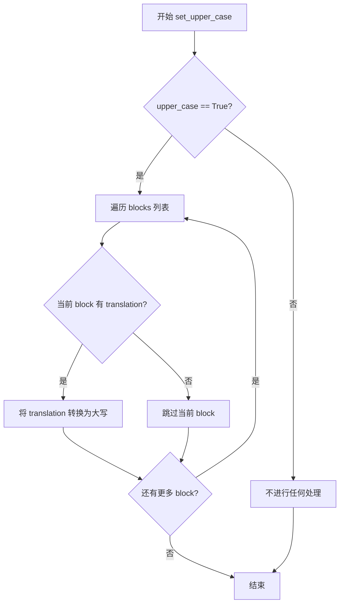
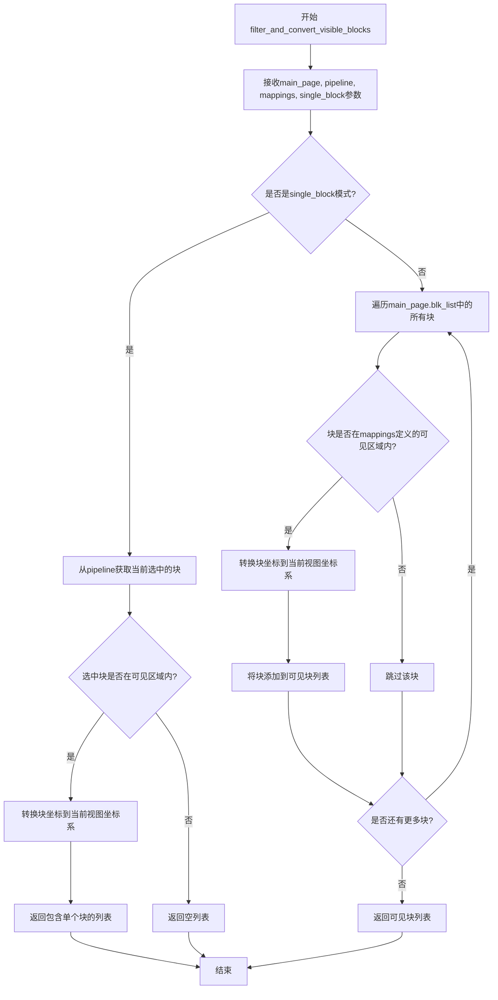
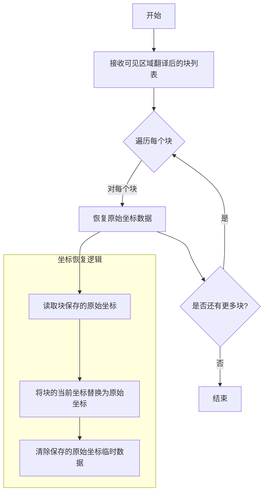
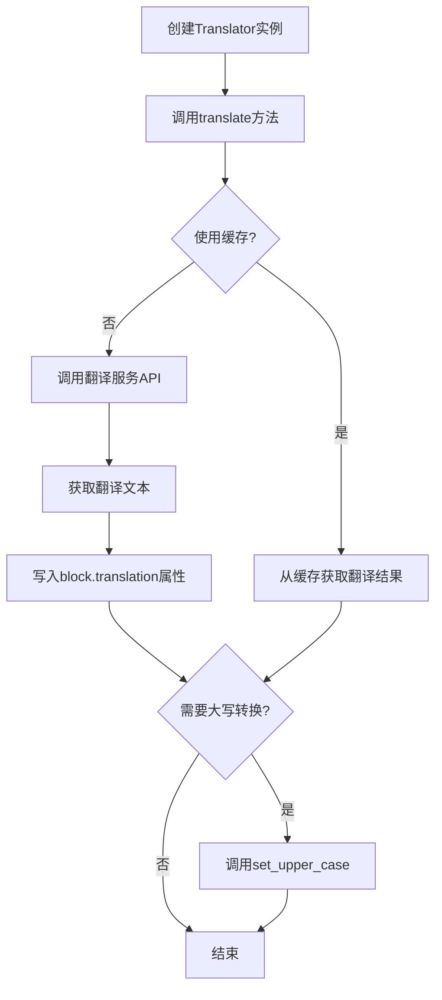
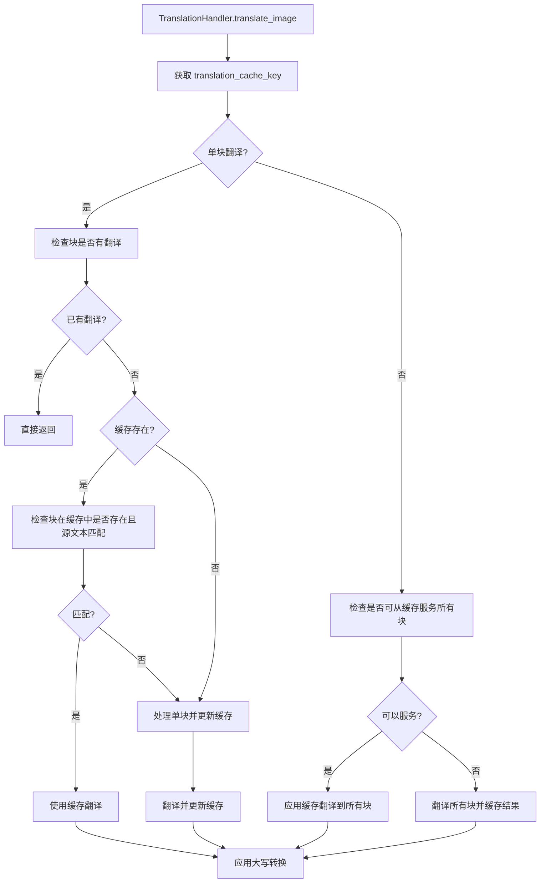
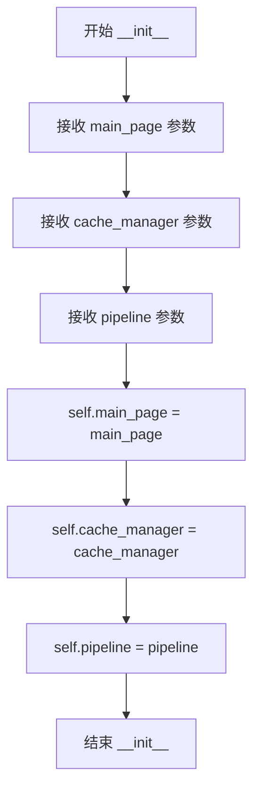
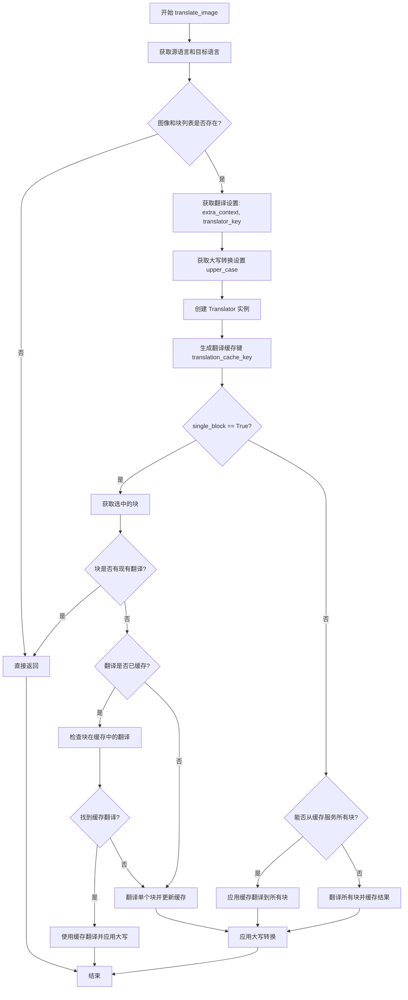
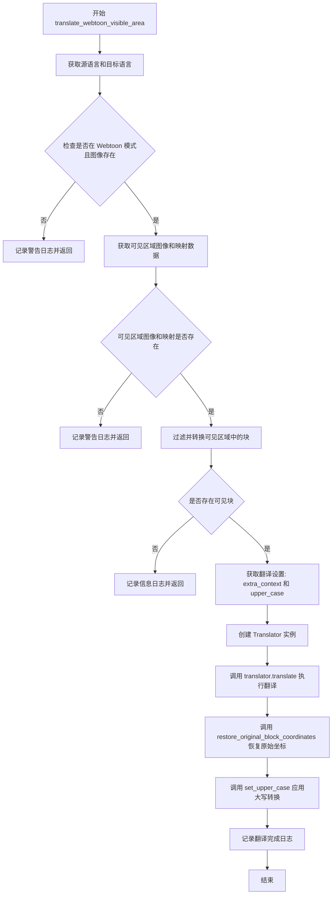

# `comic-translate\pipeline\translation_handler.py` 详细设计文档

该代码是一个漫画翻译应用的核心组件，负责处理图像文本块的翻译工作，支持单块翻译和整页翻译两种模式，并集成了缓存管理器以避免重复翻译。代码还特别支持Webtoon模式的可见区域翻译，通过过滤和坐标转换来处理分块文本的翻译需求。

## 整体流程

```mermaid
graph TD
A[开始翻译] --> B{是否单块翻译?}
B -- 是 --> C{块已有翻译?}
C -- 是 --> D[返回，不处理]
C -- 否 --> E{缓存存在?}
E -- 是 --> F{缓存中块匹配?}
F -- 是 --> G[使用缓存翻译]
F -- 否 --> H[处理单块翻译]
E -- 否 --> I[运行整页翻译并缓存]
B -- 否 --> J{所有块可从缓存获取?}
J -- 是 --> K[应用缓存翻译]
J -- 否 --> L[运行全页翻译并缓存]
H --> M[更新单块缓存]
I --> N[缓存整页翻译结果]
K --> O[应用大写转换]
L --> P[缓存翻译结果]
M --> O
N --> O
P --> O
G --> O
O --> Q[结束]

graph TD
R[Webtoon可见区域翻译] --> S{是否Webtoon模式?}
S -- 否 --> T[记录警告并返回]
S -- 是 --> U{获取可见区域?}
U -- 否 --> V[记录警告并返回]
U -- 是 --> W[过滤可见区域块]
W --> X{有可见块?}
X -- 否 --> Y[记录信息并返回]
X -- 是 --> Z[翻译可见块]
Z --> AA[恢复原始坐标]
AA --> AB[应用大写转换]
AB --> AC[结束]
```

## 类结构

```
TranslationHandler (翻译处理器)
├── __init__ (构造函数)
├── translate_image (图像翻译主方法)
└── translate_webtoon_visible_area (Webtoon可见区域翻译)
```

## 全局变量及字段


### `Translator`
    
翻译器类，用于执行文本翻译操作

类型：`class (from modules.translation.processor)`
    


### `set_upper_case`
    
将翻译结果转换为大写的工具函数

类型：`function (from modules.utils.translator_utils)`
    


### `filter_and_convert_visible_blocks`
    
过滤并转换可见区域的漫画块坐标

类型：`function (from pipeline.webtoon_utils)`
    


### `restore_original_block_coordinates`
    
将翻译后的块坐标恢复为原始坐标

类型：`function (from pipeline.webtoon_utils)`
    


### `CacheManager`
    
缓存管理器类，用于管理翻译结果的缓存

类型：`class (from .cache_manager)`
    


### `TranslationHandler.main_page`
    
主页面控制器实例，提供UI交互和图像查看功能

类型：`ComicTranslate`
    


### `TranslationHandler.cache_manager`
    
缓存管理器实例，用于缓存和检索翻译结果

类型：`CacheManager`
    


### `TranslationHandler.pipeline`
    
漫画翻译管道实例，管理翻译流程和块处理

类型：`ComicTranslatePipeline`
    
    

## 全局函数及方法


### `set_upper_case`

将翻译结果转换为大写，根据 `upper_case` 参数决定是否对文本进行大写处理。

参数：

- `blocks`：`List[Block]`，包含要处理的块对象的列表（如 `[blk]`、`self.main_page.blk_list` 或 `visible_blocks`）
- `upper_case`：`bool`，布尔值，指定是否将翻译结果转换为大写（从 `settings_page.ui.uppercase_checkbox.isChecked()` 获取）

返回值：`None`，该函数直接修改传入的块对象的 `translation` 属性，不返回任何值

#### 流程图



#### 带注释源码

```
# 从 translator_utils 模块导入 set_upper_case 函数
# 该函数定义在 modules.utils.translator_utils 中
from modules.utils.translator_utils import set_upper_case

# 使用示例 1: 处理单个 block
# upper_case = settings_page.ui.uppercase_checkbox.isChecked()  # 获取复选框状态
set_upper_case([blk], upper_case)

# 使用示例 2: 处理所有 blocks (全页翻译)
set_upper_case(self.main_page.blk_list, upper_case)

# 使用示例 3: 处理可见区域的 blocks (Webtoon 模式)
set_upper_case(visible_blocks, upper_case)
```

#### 备注

由于 `set_upper_case` 函数的实现源码未在提供的代码中显示，以上信息基于其调用方式进行推断：

- 该函数是一个工具函数，属于 `modules.utils.translator_utils` 模块
- 主要功能是根据用户设置（大小写转换选项）来统一翻译文本的格式
- 直接修改传入的块对象的 `translation` 属性，属于副作用操作
- 在 `TranslationHandler` 类中被多次调用，用于确保翻译结果符合用户的大小写偏好设置


### `filter_and_convert_visible_blocks`

该函数用于过滤并转换漫画可见区域内的块坐标，将原始块坐标映射到当前视图坐标系中，并返回位于可见区域内的块列表。

参数：

-  `main_page`：`ComicTranslate`，主页面控制器对象，包含图像查看器和块列表信息
-  `pipeline`：`ComicTranslatePipeline`，漫画翻译管道对象，用于获取选中的块
-  `mappings`：字典或列表，可见区域图像与原始图像之间的坐标映射关系数据
-  `single_block`：`bool`，是否为单块翻译模式

返回值：`list`，过滤后的可见区域块列表，如果无可见块则返回空列表

#### 流程图



#### 带注释源码

```python
# 该函数定义在 pipeline/webtoon_utils.py 模块中
# 以下是基于调用方式和上下文的推断实现

def filter_and_convert_visible_blocks(main_page, pipeline, mappings, single_block):
    """
    过滤并转换可见区域块坐标
    
    参数:
        main_page: ComicTranslate - 主页面控制器
        pipeline: ComicTranslatePipeline - 管道对象
        mappings: dict/list - 可见区域映射数据
        single_block: bool - 是否单块模式
    
    返回:
        list: 可见区域内的块列表
    """
    visible_blocks = []
    
    if single_block:
        # 单块模式：只处理当前选中的块
        selected_blk = pipeline.get_selected_block()
        if selected_blk is None:
            return []
        
        # 检查块是否在可见区域内
        if _is_block_in_visible_area(selected_blk, mappings):
            # 转换坐标到视图坐标系
            converted_blk = _convert_block_coordinates(selected_blk, mappings)
            visible_blocks.append(converted_blk)
    else:
        # 全局模式：遍历所有块
        for blk in main_page.blk_list:
            # 检查块是否在可见区域内
            if _is_block_in_visible_area(blk, mappings):
                # 转换坐标到视图坐标系
                converted_blk = _convert_block_coordinates(blk, mappings)
                visible_blocks.append(converted_blk)
    
    return visible_blocks


def _is_block_in_visible_area(blk, mappings):
    """
    检查块是否在可见区域内
    
    参数:
        blk: Block - 漫画块对象
        mappings: dict - 坐标映射数据
    
    返回:
        bool: 是否在可见区域内
    """
    # 获取块的坐标
    blk_x = blk.x
    blk_y = blk.y
    blk_width = blk.width
    blk_height = blk.height
    
    # 从mappings获取可见区域边界
    visible_bounds = mappings.get('visible_bounds', {})
    vx = visible_bounds.get('x', 0)
    vy = visible_bounds.get('y', 0)
    vwidth = visible_bounds.get('width', 0)
    vheight = visible_bounds.get('height', 0)
    
    # 检查块是否与可见区域重叠
    return (blk_x < vx + vwidth and 
            blk_x + blk_width > vx and
            blk_y < vy + vheight and 
            blk_y + blk_height > vy)


def _convert_block_coordinates(blk, mappings):
    """
    转换块坐标到视图坐标系
    
    参数:
        blk: Block - 原始块对象
        mappings: dict - 坐标映射数据
    
    返回:
        Block: 坐标转换后的块对象
    """
    # 获取映射偏移量
    offset_x = mappings.get('offset_x', 0)
    offset_y = mappings.get('offset_y', 0)
    
    # 创建块的副本以避免修改原始数据
    converted_blk = blk.deep_copy()
    
    # 应用坐标转换
    converted_blk.x = blk.x - offset_x
    converted_blk.y = blk.y - offset_y
    
    return converted_blk
```


### `restore_original_block_coordinates`

该函数用于在Webtoon模式的可见区域翻译完成后，将被转换坐标的块恢复为其原始坐标位置。由于源代码中仅导入了该函数而未提供具体实现，以下信息基于函数名和调用方式的合理推断。

参数：

-  `blocks`：`List[Block]` 或类似类型，可见区域翻译后需要恢复原始坐标的块列表

返回值：`None`，该函数直接修改传入的块对象，不返回任何值

#### 流程图



#### 带注释源码

```python
# 从 pipeline.webtoon_utils 模块导入
# 注意：以下为基于函数调用方式的合理推测实现
from typing import List

def restore_original_block_coordinates(blocks: List) -> None:
    """
    恢复块的原始坐标
    
    在Webtoon可见区域翻译过程中，块的坐标可能被临时转换为相对于
    可见图像的坐标。翻译完成后，需要将坐标恢复到原始图像的坐标系。
    
    参数：
        blocks: 可见区域翻译后的块列表
        
    返回值：None，直接修改块对象
    """
    
    for block in blocks:
        # 检查块是否保存了原始坐标信息
        if hasattr(block, '_original_coords'):
            # 恢复原始坐标
            block.x = block._original_coords['x']
            block.y = block._original_coords['y']
            block.width = block._original_coords['width']
            block.height = block._original_coords['height']
            
            # 清除临时保存的原始坐标数据
            delattr(block, '_original_coords')
        
        # 处理坐标转换后的相对坐标恢复
        if hasattr(block, '_translated_coords'):
            block.x = block._translated_coords['x']
            block.y = block._translated_coords['y']
            delattr(block, '_translated_coords')
```

#### 备注

**重要提示**：由于提供的源代码中未包含 `restore_original_block_coordinates` 函数的具体实现，以上信息基于：
1. 函数的导入位置 (`pipeline.webtoon_utils`)
2. 在 `translate_webtoon_visible_area` 方法中的调用方式
3. 函数名称的语义分析

如需获取该函数的完整实现细节，请查阅 `pipeline/webtoon_utils.py` 源文件。


### Translator

外部导入的翻译器类，负责执行实际的文本翻译工作。该类封装了与翻译服务（可能是LLM或其他翻译API）的交互逻辑，接受源语言和目标语言配置，并将翻译结果写入到文本块对象中。

参数：

- `main_page`：`ComicTranslate`，主页面控制器对象，提供UI交互和配置访问
- `source_lang`：`str`，源语言，从UI组合框获取（如"英文"、"日文"等）
- `target_lang`：`str`，目标语言，从UI组合框获取（如"中文"、"英文"等）

#### Translator.translate 方法

参数：

- `blocks`：`list`，文本块列表，每个块包含待翻译的文本和翻译结果存储属性
- `image`：`ndarray` 或 `numpy.ndarray`，当前页面/区域的图像数据，用于提供视觉上下文
- `extra_context`：`str`，额外的上下文信息，来自LLM设置配置

返回值：`None`，翻译结果直接写入到 `blocks` 中每个块的 `translation` 属性

#### 流程图



#### 带注释源码

```python
# 以下为基于TranslationHandler中对Translator使用方式的推断

class Translator:
    """
    翻译器类 - 封装翻译逻辑
    注意：此类为外部导入（modules.translation.processor.Translator）
    源代码不在当前文件中，以下为基于使用方式的推断
    """
    
    def __init__(self, main_page: ComicTranslate, source_lang: str, target_lang: str):
        """
        初始化翻译器
        
        Args:
            main_page: ComicTranslate实例，提供页面上下文和配置
            source_lang: 源语言代码或名称
            target_lang: 目标语言代码或名称
        """
        self.main_page = main_page
        self.source_lang = source_lang
        self.target_lang = target_lang
        # 可能的实现：加载翻译服务配置、初始化API客户端等
    
    def translate(self, blocks: list, image, extra_context: str) -> None:
        """
        执行翻译操作
        
        Args:
            blocks: 文本块列表，每个块应包含source_text属性
            image: 图像数组，用于视觉上下文增强翻译质量
            extra_context: 额外上下文，可能用于few-shot提示或背景信息
        """
        # 可能的实现逻辑：
        # 1. 提取blocks中的source_text
        # 2. 构建翻译prompt，可能包含image作为视觉上下文
        # 3. 调用LLM API或翻译服务
        # 4. 解析响应并将结果写入block.translation
        pass
```

#### 关键组件信息

| 组件名称 | 一句话描述 |
|---------|-----------|
| Translator | 外部导入的翻译核心类，封装与LLM/翻译服务的交互逻辑 |
| TranslationHandler | 翻译处理器，协调翻译流程并管理缓存 |
| CacheManager | 缓存管理器，存储和检索翻译结果 |

#### 潜在的技术债务或优化空间

1. **Translator类源码缺失**：由于Translator是从外部模块导入的，无法在当前项目中直接查看和修改其实现，建议获取其源码以便更好地理解和优化
2. **缓存键生成逻辑**：translation_cache_key的生成涉及多个参数，需确保其唯一性和一致性
3. **异常处理**：代码中缺少对translator.translate()调用可能失败的异常处理
4. **重复代码**：translate_image和translate_webtoon_visible_area中存在部分重复的翻译流程，可考虑抽象公共方法

#### 其它项目

- **设计目标**：实现带缓存的漫画/网页翻译功能，支持单块翻译和全页翻译
- **约束**：依赖外部Translator类实现实际翻译逻辑，本模块负责流程编排和缓存管理
- **错误处理**：当前代码在blk为None时提前返回，但缺少对翻译服务调用失败的容错处理
- **外部依赖**：modules.translation.processor.Translator（外部翻译服务）、CacheManager（缓存服务）


### CacheManager

CacheManager 是从 `cache_manager` 模块导入的缓存管理类，负责管理和维护翻译结果的缓存。在 `TranslationHandler` 类中通过依赖注入的方式使用，主要用于存储、检索和更新翻译结果，以避免重复翻译相同的内容，提升性能和用户体验。

由于 CacheManager 类为外部导入模块（`.cache_manager`），当前代码文件中仅展示了其使用方式，未包含该类的完整源码。以下信息基于 `TranslationHandler` 中对 CacheManager 实例方法的调用推断得出。

---

#### 流程图



---

#### 使用的方法清单

基于 `TranslationHandler.translate_image` 方法中的调用，CacheManager 提供以下方法：

| 方法名称 | 调用场景 | 功能描述 |
|---------|---------|---------|
| `_get_translation_cache_key` | 翻译开始前 | 根据图片、源语言、目标语言、翻译器和额外上下文生成唯一缓存键 |
| `_is_translation_cached` | 单块翻译时 | 检查指定缓存键是否有缓存的翻译结果 |
| `_get_cached_translation_for_block` | 单块翻译时 | 根据缓存键和块对象获取该块对应的缓存翻译结果 |
| `update_translation_cache_for_block` | 单块翻译后 | 更新指定块的翻译缓存 |
| `_cache_translation_results` | 翻译完成后 | 将翻译结果批量缓存，支持原始块和翻译后块的映射 |
| `_can_serve_all_blocks_from_translation_cache` | 全页翻译前 | 检查所有块是否都可以从缓存获取（源文本匹配） |
| `_apply_cached_translations_to_blocks` | 全页翻译时 | 将缓存的翻译结果批量应用到对应块对象 |

---

#### 使用示例源码（来自 TranslationHandler）

```python
# 获取翻译缓存键
translation_cache_key = self.cache_manager._get_translation_cache_key(
    image, source_lang, target_lang, translator_key, extra_context
)

# 检查翻译是否已缓存
if self.cache_manager._is_translation_cached(translation_cache_key):
    # 获取单个块的缓存翻译
    cached_translation = self.cache_manager._get_cached_translation_for_block(
        translation_cache_key, blk
    )
    if cached_translation is not None:
        blk.translation = cached_translation
        # ... 后续处理

# 更新单个块的缓存
self.cache_manager.update_translation_cache_for_block(translation_cache_key, blk)

# 缓存翻译结果
self.cache_manager._cache_translation_results(
    translation_cache_key, 
    self.main_page.blk_list,  # 原始块
    all_blocks_copy           # 翻译后的块副本
)

# 检查是否可从缓存服务所有块
if self.cache_manager._can_serve_all_blocks_from_translation_cache(
    translation_cache_key, 
    self.main_page.blk_list
):
    # 应用缓存翻译到所有块
    self.cache_manager._apply_cached_translations_to_blocks(
        translation_cache_key, 
        self.main_page.blk_list
    )
```

---

#### 潜在问题与优化建议

1. **私有方法直接调用**：TranslationHandler 直接调用了多个以 `_` 开头的私有方法（如 `_get_translation_cache_key`、`_cache_translation_results` 等），这暴露了 CacheManager 的内部实现细节。建议通过公共接口封装这些功能，提高类的封装性。

2. **缓存键生成逻辑**：缓存键的生成依赖于多个参数（image、source_lang、target_lang、translator_key、extra_context），需确保这些参数的一致性，否则可能导致缓存未命中。

3. **缓存一致性**：在单块翻译和全页翻译之间切换时，需要确保缓存数据的一致性，特别是当源文本发生变化时能够正确更新缓存。

4. **源码缺失**：由于 CacheManager 类为外部导入，建议提供完整的类定义源码以便进行更详细的分析和文档化。


### `TranslationHandler.__init__`

这是 `TranslationHandler` 类的构造函数，负责初始化翻译处理器的核心依赖组件，包括主页面控制器、缓存管理器和处理管道。

参数：

- `main_page`：`ComicTranslate`，主页面控制器实例，提供UI组件访问（如语言选择下拉框、图像查看器、块列表等）
- `cache_manager`：`CacheManager`，缓存管理器实例，负责翻译结果的缓存和检索
- `pipeline`：`ComicTranslatePipeline`，处理管道实例，提供对选中块等 pipeline 操作的访问

返回值：`None`，构造函数无显式返回值，仅通过实例属性存储传入的依赖对象

#### 流程图



#### 带注释源码

```python
def __init__(
        self, 
        main_page: ComicTranslate, 
        cache_manager: CacheManager, 
        pipeline: ComicTranslatePipeline,
    ):
    """
    初始化 TranslationHandler 实例。
    
    参数:
        main_page: ComicTranslate 类型，主页面控制器，提供UI交互和图像/块数据访问
        cache_manager: CacheManager 类型，缓存管理器，用于存储和检索翻译结果
        pipeline: ComicTranslatePipeline 类型，处理管道，提供pipeline级别的操作接口
    
    返回值:
        None
    """
    # 存储主页面控制器引用，用于后续访问UI组件和业务数据
    self.main_page = main_page
    
    # 存储缓存管理器引用，用于翻译结果的缓存管理
    self.cache_manager = cache_manager
    
    # 存储处理管道引用，用于获取选中的块等pipeline操作
    self.pipeline = pipeline
```


### `TranslationHandler.translate_image`

该方法负责处理图像文本翻译的核心逻辑，支持单块翻译和全页翻译两种模式，并利用缓存机制避免重复翻译相同内容。

参数：

- `single_block`：`bool`，默认为 `False`，指示是否仅翻译当前选中的单个文本块

返回值：`None`，该方法通过直接修改块对象的 `translation` 属性来返回结果，无显式返回值

#### 流程图



#### 带注释源码

```python
def translate_image(self, single_block=False):
    """翻译图像中的文本内容，支持单块或全页翻译模式"""
    
    # 1. 从UI获取源语言和目标语言
    source_lang = self.main_page.s_combo.currentText()
    target_lang = self.main_page.t_combo.currentText()
    
    # 2. 检查图像和块列表是否存在，若不存在则直接返回
    if self.main_page.image_viewer.hasPhoto() and self.main_page.blk_list:
        # 3. 获取设置页面和翻译相关配置
        settings_page = self.main_page.settings_page
        image = self.main_page.image_viewer.get_image_array()
        extra_context = settings_page.get_llm_settings()['extra_context']
        translator_key = settings_page.get_tool_selection('translator')

        # 4. 获取是否需要转换为大写
        upper_case = settings_page.ui.uppercase_checkbox.isChecked()

        # 5. 创建翻译器实例
        translator = Translator(self.main_page, source_lang, target_lang)
        
        # 6. 生成翻译缓存键，用于唯一标识本次翻译请求
        translation_cache_key = self.cache_manager._get_translation_cache_key(
            image, source_lang, target_lang, translator_key, extra_context
        )
        
        # 7. 根据 single_block 参数决定处理逻辑
        if single_block:
            # === 单块翻译模式 ===
            blk = self.pipeline.get_selected_block()
            if blk is None:
                return
            
            # 检查块是否已有翻译，避免重复处理
            if hasattr(blk, 'translation') and blk.translation and blk.translation.strip():
                return
            
            # 检查是否有该图像/翻译器/语言的缓存结果
            if self.cache_manager._is_translation_cached(translation_cache_key):
                # 检查块是否在缓存中且源文本匹配
                cached_translation = self.cache_manager._get_cached_translation_for_block(
                    translation_cache_key, blk
                )
                if cached_translation is not None:
                    # 缓存命中，直接使用缓存的翻译结果
                    blk.translation = cached_translation
                    logger.info(f"Using cached translation result for block: '{cached_translation}'")
                    set_upper_case([blk], upper_case)
                    return
                else:
                    logger.info("Block not found in cache or source text changed, processing single block...")
            
            # 需要处理该块：翻译并更新缓存
            single_block_list = [blk]
            translator.translate(single_block_list, image, extra_context)
            
            # 使用缓存管理器的方法更新该块的缓存
            self.cache_manager.update_translation_cache_for_block(translation_cache_key, blk)
            
            logger.info(f"Processed single block and updated cache: '{blk.translation}'")
            set_upper_case([blk], upper_case)
        else:
            # === 全页翻译模式 ===
            # 检查是否可以从缓存服务所有块（源文本匹配）
            if self.cache_manager._can_serve_all_blocks_from_translation_cache(
                translation_cache_key, self.main_page.blk_list
            ):
                # 所有块都可以从缓存提供，使用缓存翻译
                self.cache_manager._apply_cached_translations_to_blocks(
                    translation_cache_key, self.main_page.blk_list
                )
                logger.info(f"Using cached translation results for all {len(self.main_page.blk_list)} blocks")
            else:
                # 需要运行翻译并缓存结果
                translator.translate(self.main_page.blk_list, image, extra_context)
                self.cache_manager._cache_translation_results(
                    translation_cache_key, self.main_page.blk_list
                )
                logger.info("Translation completed and cached for %d blocks", len(self.main_page.blk_list))
            
            # 8. 应用大写转换设置
            set_upper_case(self.main_page.blk_list, upper_case)
```


### `TranslationHandler.translate_webtoon_visible_area`

在 Webtoon 模式下对用户可见区域内的漫画块执行翻译处理的核心方法，通过获取当前可见图像区域、筛选对应的文本块、调用翻译器完成翻译，并最终恢复原始坐标和应用大小写转换。

参数：

- `single_block`：`bool`，默认为 False，表示是否仅翻译单个选中的块（True 时仅处理选中的块，False 时处理所有可见块）

返回值：`None`，该方法直接修改传入的块对象的 translation 属性，不返回任何值

#### 流程图



#### 带注释源码

```python
def translate_webtoon_visible_area(self, single_block=False):
    """Perform translation on the visible area in webtoon mode."""
    
    # Step 1: 获取当前选择的源语言和目标语言
    source_lang = self.main_page.s_combo.currentText()
    target_lang = self.main_page.t_combo.currentText()
    
    # Step 2: 验证是否处于 Webtoon 模式且图像已加载
    # 如果不满足条件，记录警告并提前返回，避免无效处理
    if not (self.main_page.image_viewer.hasPhoto() and 
            self.main_page.webtoon_mode):
        logger.warning("translate_webtoon_visible_area called but not in webtoon mode")
        return
    
    # Step 3: 获取当前可见区域的图像和坐标映射数据
    # visible_image: 可见区域的图像数据
    # mappings: 图像坐标与块坐标的映射关系
    visible_image, mappings = self.main_page.image_viewer.get_visible_area_image()
    
    # Step 4: 检查是否成功获取到可见区域数据
    if visible_image is None or not mappings:
        logger.warning("No visible area found for translation")
        return
    
    # Step 5: 根据映射关系过滤出可见区域内的块，并转换坐标
    # filter_and_convert_visible_blocks 负责:
    #   - 根据 mappings 筛选出在可见范围内的块
    #   - 将块的坐标转换为相对于可见区域的坐标
    #   - single_block=True 时仅处理选中的块
    visible_blocks = filter_and_convert_visible_blocks(
        self.main_page, self.pipeline, mappings, single_block
    )
    
    # Step 6: 检查是否有需要翻译的块
    if not visible_blocks:
        logger.info("No blocks found in visible area")
        return
    
    # Step 7: 获取翻译相关的设置参数
    settings_page = self.main_page.settings_page
    extra_context = settings_page.get_llm_settings()['extra_context']  # 额外的上下文信息
    upper_case = settings_page.ui.uppercase_checkbox.isChecked()  # 是否需要转换为大写
    
    # Step 8: 创建翻译器实例并执行翻译
    # Translator 类封装了与翻译服务(如 LLM)的交互逻辑
    translator = Translator(self.main_page, source_lang, target_lang)
    translator.translate(visible_blocks, visible_image, extra_context)
    
    # Step 9: 翻译完成后，恢复块到原始坐标系统
    # 因为在翻译过程中块坐标可能被转换为相对于可见区域
    restore_original_block_coordinates(visible_blocks)
    
    # Step 10: 根据设置决定是否将翻译结果转换为大写
    set_upper_case(visible_blocks, upper_case)
    
    # Step 11: 记录翻译完成的日志信息
    logger.info(f"Translation completed for {len(visible_blocks)} blocks in visible area")
```

## 关键组件


### TranslationHandler

处理翻译处理和缓存支持的核心类，负责协调翻译流程、管理缓存以及应用翻译结果到漫画块。

### 张量索引与块处理

通过 `blk_list` 管理漫画块的集合，支持单个块和全页翻译两种模式，通过 `get_selected_block()` 获取单个块进行精确翻译处理。

### 缓存键生成

`_get_translation_cache_key` 方法基于图像、源语言、目标语言、翻译器选择和额外上下文生成唯一缓存键，确保不同参数组合的翻译结果被正确区分。

### 单块翻译缓存检查

`_is_translation_cached` 和 `_get_cached_translation_for_block` 协作检查单个块的翻译缓存，通过比对源文本确保缓存有效性，避免源文本变更后的过期翻译被应用。

### 全页翻译缓存服务

`_can_serve_all_blocks_from_translation_cache` 判断是否可从缓存为所有块提供翻译结果，`_apply_cached_translations_to_blocks` 批量应用缓存翻译到块列表。

### 翻译结果缓存更新

`_cache_translation_results` 将翻译结果与原始块和翻译后块副本关联存储，`update_translation_translation_cache_for_block` 增量更新单块的缓存结果。

### Webtoon可见区域过滤

`filter_and_convert_visible_blocks` 从完整的块列表中筛选位于可见区域内的块，并进行坐标转换以适配当前视图。

### 坐标恢复机制

`restore_original_block_coordinates` 在翻译完成后将块的坐标恢复到原始状态，确保翻译层与原始图像正确对齐。

### 大小写转换

`set_upper_case` 根据用户设置将翻译文本转换为大写或保持原始大小写，提供符合目标语言习惯的输出格式。


## 问题及建议


### 已知问题

-   **缓存键设计不当**：`_get_translation_cache_key` 方法直接使用 `image`（numpy数组）作为缓存键参数，numpy数组作为字典键会导致不可预期的行为，且每次调用时图像数组内容可能不同（即使视觉上相同），导致缓存命中率低。
-   **违反封装性原则**：在 `TranslationHandler` 中大量直接调用 `CacheManager` 的私有方法（以 `_` 开头），如 `_is_translation_cached`、`_get_cached_translation_for_block`、`_cache_translation_results` 等，这些方法本应属于内部实现细节，不应在其他类中直接使用。
-   **代码重复**：方法 `translate_image` 和 `translate_webtoon_visible_area` 包含大量重复代码（获取语言设置、获取LLM设置、创建Translator实例、应用upper_case等），违反了DRY原则。
-   **深层拷贝性能开销**：在单块翻译流程中对 `blk_list` 中的每个块调用 `deep_copy()`，当块数量较多时会产生显著的性能开销和内存消耗。
-   **Translator实例重复创建**：每次调用翻译方法都会创建新的 `Translator` 实例，没有考虑复用。
-   **缺少异常处理**：`Translator.translate()` 调用、缓存读写操作均未进行异常捕获，若翻译服务失败或缓存损坏可能导致程序崩溃。
-   **返回值未利用**：`translate_image` 和 `translate_webtoon_visible_area` 方法均无返回值，调用方无法判断翻译是否成功。
-   **日志格式不统一**：部分使用f-string，部分使用 `%` 格式化，降低了代码可维护性。

### 优化建议

-   **重构缓存键生成逻辑**：使用图像的哈希值（如MD5或SHA256）替代直接使用numpy数组作为缓存键，或者预先计算图像指纹，确保相同图像内容生成相同的缓存键。
-   **设计公共API**：在 `CacheManager` 中添加公开的缓存查询和更新方法（如 `get_cached_translation`、`save_translation`），隐藏内部实现细节，增强类的封装性。
-   **提取公共方法**：将获取语言设置、获取LLM配置、创建Translator实例、应用upper_case等逻辑提取为私有辅助方法，减少代码重复。
-   **优化拷贝策略**：评估是否可以对单块翻译流程进行优化，例如使用引用而非拷贝，或实现更高效的增量更新机制。
-   **实现 Translator 复用**：考虑将 Translator 实例作为类属性或通过依赖注入方式复用。
-   **添加异常处理**：为所有外部调用（翻译服务、缓存操作）添加 try-except 块，记录错误日志并向用户提供友好的错误提示。
-   **统一日志格式**：统一使用 f-string 或 % 格式化中的一种，保持代码风格一致。

## 其它


### 设计目标与约束

该模块的核心设计目标是实现一个高效的漫画翻译处理模块，支持单块翻译和全页翻译两种模式，并通过缓存机制避免重复翻译，提高整体翻译效率。约束条件包括：1) 必须依赖CacheManager提供的缓存功能；2) 必须使用Translator进行实际翻译操作；3) 仅在Webtoon模式下才能调用translate_webtoon_visible_area方法；4) 翻译过程中必须保持原始块坐标的完整性。

### 错误处理与异常设计

代码中主要通过返回值（None）和日志记录（logger.warning/info）来处理异常情况。对于空值情况（如image_viewer无图片、blk_list为空、可见区域无数据）均采用直接返回并记录警告日志的方式。对于缓存未命中情况，通过分支处理执行完整翻译流程。潜在异常包括：Translator.translate()可能抛出翻译失败异常、deep_copy()可能抛出复制失败异常、缓存相关方法可能抛出缓存操作异常。建议增加显式的异常捕获和处理机制。

### 数据流与状态机

翻译处理的数据流如下：1) 获取源语言和目标语言；2) 检查图片和块列表是否存在；3) 构建翻译缓存键；4) 根据single_block参数选择分支：单块模式先检查缓存，命中则直接应用，未命中则翻译并更新缓存；全页模式检查是否可从缓存服务所有块，可则直接应用缓存结果，否则执行翻译并缓存。Webtoon模式额外包含：获取可见区域图像和映射数据、过滤可见块、执行翻译、恢复原始坐标等步骤。

### 外部依赖与接口契约

该模块依赖以下外部组件：1) Translator类（modules.translation.processor）：实际执行翻译操作，接收blocks列表、image数组、extra_context参数；2) CacheManager类（.cache_manager）：提供缓存查询和更新功能，包括_get_translation_cache_key、_is_translation_cached、_get_cached_translation_for_block等方法；3) ComicTranslate主控制器：提供image_viewer、blk_list、settings_page、s_combo、t_combo等属性；4) ComicTranslatePipeline管道：提供get_selected_block方法；5) 工具函数：filter_and_convert_visible_blocks、restore_original_block_coordinates、set_upper_case。

### 性能考虑与优化空间

当前代码存在以下性能优化点：1) 全页翻译时创建所有块的深拷贝（deep_copy），当块数量较多时会产生较大开销，建议评估是否可复用原块对象；2) 缓存命中检查在全页翻译时需要遍历所有块进行匹配，可能影响性能；3) 单块翻译时若缓存不存在会触发全页翻译，可能导致不必要的计算；4) 可考虑添加翻译任务的异步处理，避免阻塞UI线程。

### 并发与线程安全

代码中未包含显式的线程同步机制。潜在并发问题包括：1) 多线程同时访问main_page.blk_list可能导致数据竞争；2) 缓存管理器可能被多个翻译任务并发访问；3) image_viewer的get_image_array()在多线程环境下可能不安全。建议评估并发使用场景并添加适当的锁机制或使用线程安全的数据结构。

### 缓存策略与一致性

缓存策略通过translation_cache_key实现，该键由image、source_lang、target_lang、translator_key、extra_context共同构建，确保相同翻译参数使用同一缓存。缓存一致性通过检查源文本是否匹配来保证，若源文本改变则重新翻译。缓存更新采用主动更新模式，在翻译完成后立即调用缓存更新方法。缓存数据包括原始块和翻译后块的映射关系。

### 安全性考虑

代码中不涉及敏感数据处理，但建议注意：1) extra_context可能包含用户输入，需进行适当的输入验证和消毒；2) 翻译结果（blk.translation）应视为不可信内容，在显示前进行适当处理；3) 文件路径和图像数据的读取应进行安全检查。

### 可测试性设计

当前代码的可测试性存在一定限制，因为大量依赖外部对象（main_page、cache_manager、pipeline）。建议：1) 将核心翻译逻辑提取为独立函数，便于单元测试；2) 增加接口/抽象层以支持Mock；3) 为translate_webtoon_visible_area等复杂方法添加更细粒度的日志，便于问题定位；4) 考虑添加配置开关以禁用缓存，便于测试缓存逻辑。

    