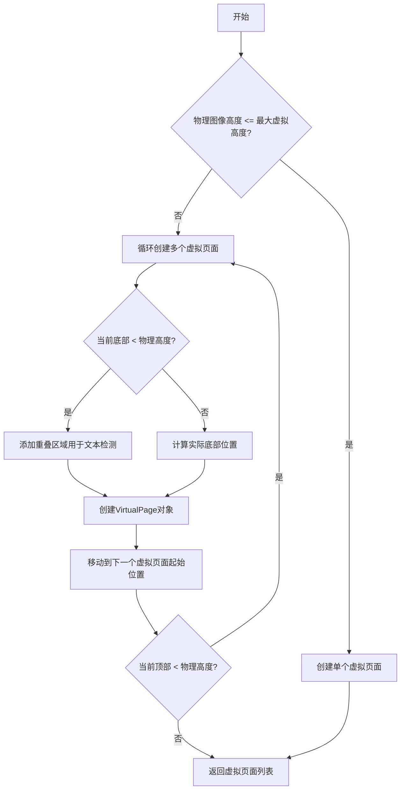
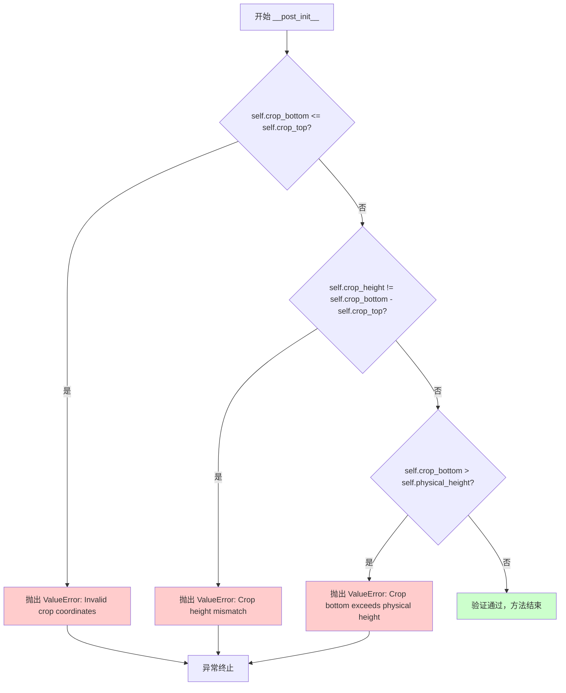
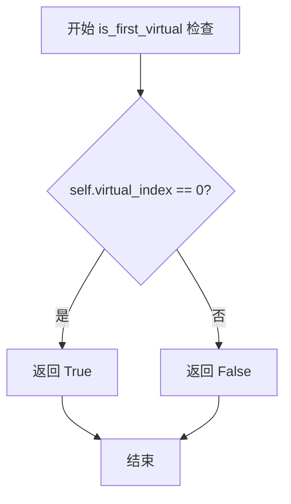
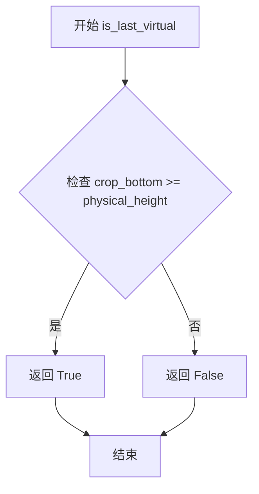
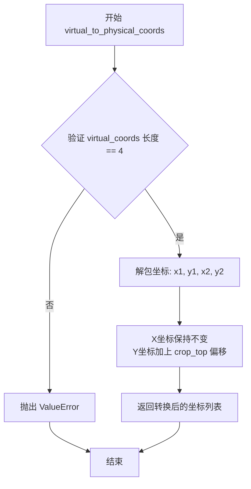
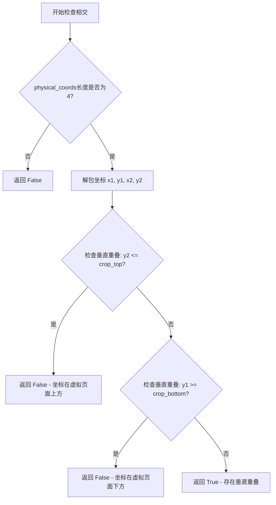
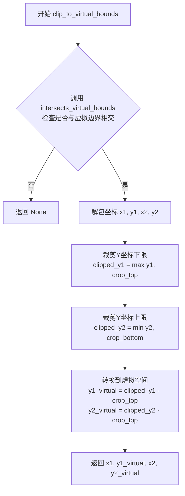
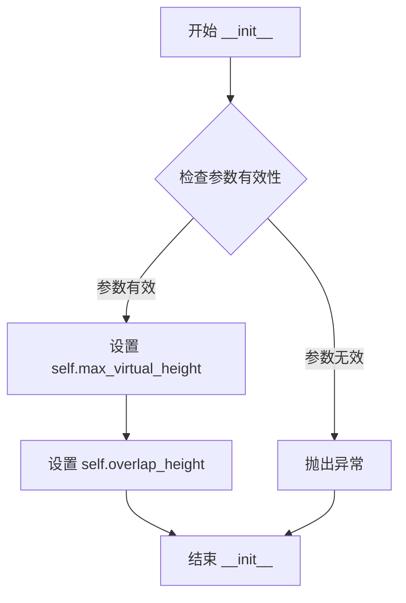

# `comic-translate\pipeline\virtual_page.py` 详细设计文档

该代码实现了一个虚拟页面系统，用于处理超长的网络漫画图像。它通过将物理页面分割成多个重叠的虚拟页面来管理大型图像，同时保持文本边界检测的完整性。核心包括VirtualPage类（表示虚拟页面实体）和VirtualPageCreator类（负责创建和管理虚拟页面）。

## 整体流程



## 类结构

```
PageStatus (枚举类)
├── UNPROCESSED
├── DATA_FINALIZED
├── RENDERED
└── LIVE_DATA_FINALIZED
VirtualPage (数据类)
├── 字段: physical_page_index, physical_page_path, virtual_index, crop_top, crop_bottom, crop_height, physical_width, physical_height, virtual_id
└── 方法: __post_init__, is_first_virtual, is_last_virtual, extract_virtual_image, virtual_to_physical_coords, physical_to_virtual_coords, intersects_virtual_bounds, clip_to_virtual_bounds, __str__, __repr__
VirtualPageCreator (创建器类)
├── 字段: max_virtual_height, overlap_height
└── 方法: __init__, create_virtual_pages, get_virtual_chunk_pairs
```

## 全局变量及字段


### `logger`
    
模块级日志记录器，用于记录虚拟页面处理过程中的信息

类型：`logging.Logger`
    


### `PageStatus`
    
页面状态枚举类，定义虚拟页面的处理状态

类型：`Enum`
    


### `PageStatus.UNPROCESSED`
    
未处理状态，表示虚拟页面尚未进行任何处理

类型：`PageStatus`
    


### `PageStatus.DATA_FINALIZED`
    
数据最终化状态，表示虚拟页面的数据已完成处理

类型：`PageStatus`
    


### `PageStatus.RENDERED`
    
已渲染状态，表示虚拟页面已完成渲染

类型：`PageStatus`
    


### `PageStatus.LIVE_DATA_FINALIZED`
    
实时数据最终化状态，表示虚拟页面的实时数据已完成处理

类型：`PageStatus`
    


### `VirtualPage`
    
虚拟页面数据类，表示物理网页漫画页面的虚拟子划分

类型：`dataclass`
    


### `VirtualPageCreator`
    
虚拟页面创建器类，用于从物理网页漫画页面创建虚拟页面

类型：`class`
    


### `VirtualPage.physical_page_index`
    
原始物理页面的索引

类型：`int`
    


### `VirtualPage.physical_page_path`
    
原始图像文件路径

类型：`str`
    


### `VirtualPage.virtual_index`
    
物理页面内的虚拟页面索引

类型：`int`
    


### `VirtualPage.crop_top`
    
裁剪区域顶部坐标

类型：`int`
    


### `VirtualPage.crop_bottom`
    
裁剪区域底部坐标

类型：`int`
    


### `VirtualPage.crop_height`
    
裁剪区域高度

类型：`int`
    


### `VirtualPage.physical_width`
    
完整物理页面宽度

类型：`int`
    


### `VirtualPage.physical_height`
    
完整物理页面高度

类型：`int`
    


### `VirtualPage.virtual_id`
    
虚拟页面唯一标识符

类型：`str`
    


### `VirtualPageCreator.max_virtual_height`
    
虚拟页面的最大高度（像素）

类型：`int`
    


### `VirtualPageCreator.overlap_height`
    
连续虚拟页面之间的重叠高度

类型：`int`
    
    

## 全局函数及方法


### `VirtualPage.__post_init__`

验证虚拟页面参数的合法性，在 dataclass 对象初始化后自动调用，确保虚拟页面的裁剪坐标和尺寸参数符合业务规则。

参数：
- `self`：`VirtualPage`，当前虚拟页面实例（隐式参数，无需显式传递）

返回值：`None`，该方法不返回值，仅通过抛出 `ValueError` 异常来处理验证失败的情况

#### 流程图



#### 带注释源码

```python
def __post_init__(self):
    """
    Validate virtual page parameters.
    在 dataclass 初始化后自动调用，验证虚拟页面参数的合法性。
    """
    
    # 验证裁剪底边大于裁剪顶边
    # 确保裁剪区域有有效的高度（不能为零或负数）
    if self.crop_bottom <= self.crop_top:
        raise ValueError(f"Invalid crop coordinates: bottom ({self.crop_bottom}) <= top ({self.crop_top})")
    
    # 验证显式传入的 crop_height 与计算得到的裁剪高度一致
    # 确保数据一致性，防止手动设置错误的高度值
    if self.crop_height != (self.crop_bottom - self.crop_top):
        raise ValueError(f"Crop height mismatch: {self.crop_height} != {self.crop_bottom - self.crop_top}")
    
    # 验证裁剪底边不超过物理页面的总高度
    # 确保裁剪区域不会超出原始图像的边界
    if self.crop_bottom > self.physical_height:
        raise ValueError(f"Crop bottom ({self.crop_bottom}) exceeds physical height ({self.physical_height})")
```


### `VirtualPage.is_first_virtual`

检查当前虚拟页面是否为所属物理页面的第一个虚拟页面（即 virtual_index 是否为 0）。

参数： 无

返回值：`bool`，如果是物理页面的第一个虚拟页面则返回 True，否则返回 False

#### 流程图



#### 带注释源码

```python
@property
def is_first_virtual(self) -> bool:
    """
    Check if this is the first virtual page of the physical page.
    
    通过比较 virtual_index 属性与 0 是否相等来判断当前虚拟页面
    是否为物理页面中的第一个虚拟页面。
    
    Returns:
        bool: True if this is the first virtual page (virtual_index == 0),
              False otherwise
    """
    return self.virtual_index == 0  # 如果 virtual_index 为 0，表示这是第一个虚拟页面
```


### `VirtualPage.is_last_virtual`

检查当前虚拟页面是否为所属物理页面的最后一个虚拟页面。通过比较虚拟页面的底部裁剪坐标与物理页面的总高度来判断。

参数：

- （无显式参数，`self` 为隐式参数）

返回值：`bool`，返回 `True` 表示当前虚拟页面是物理页面的最后一个虚拟页面，返回 `False` 表示不是最后一个。

#### 流程图



#### 带注释源码

```python
@property
def is_last_virtual(self) -> bool:
    """
    Check if this is the last virtual page of the physical page.
    
    判断逻辑：当虚拟页面的底部裁剪坐标 (crop_bottom) 大于等于
    物理页面的总高度 (physical_height) 时，表示该虚拟页面延伸到了
    物理页面的底部，即为最后一个虚拟页面。
    
    Returns:
        bool: True if this is the last virtual page, False otherwise
    """
    # 比较裁剪底部坐标与物理页面高度
    # 如果裁剪底部已达到或超过物理页面高度，则是最后一个虚拟页面
    return self.crop_bottom >= self.physical_height
```


### `VirtualPage.extract_virtual_image`

从物理图像中提取虚拟页面区域，根据当前虚拟页面的裁剪坐标（crop_top 和 crop_bottom）从完整的物理页面图像中提取对应的区域，并返回裁剪后的图像副本。

参数：

- `physical_image`：`np.ndarray`，完整的物理页面图像

返回值：`np.ndarray`，裁剪后的图像，用于当前虚拟页面处理

#### 流程图

```mermaid
flowchart TD
    A[开始提取虚拟图像] --> B{检查 physical_image 高度是否匹配}
    B -->|不匹配| C[记录警告日志]
    B -->|匹配| D[执行裁剪操作]
    C --> D
    D --> E[从 physical_image 裁剪区域: physical_image[ crop_top : crop_bottom, :]]
    E --> F[返回裁剪图像的副本 .copy()]
    F --> G[结束]
```

#### 带注释源码

```python
def extract_virtual_image(self, physical_image: np.ndarray) -> np.ndarray:
    """
    Extract the virtual page region from the physical image.
    
    Args:
        physical_image: The full physical page image
        
    Returns:
        Cropped image for this virtual page
    """
    # 检查传入的物理图像高度是否与记录的物理页面高度一致
    # 如果不一致，记录警告日志（可能存在图像加载错误或尺寸不匹配）
    if physical_image.shape[0] != self.physical_height:
        logger.warning(f"Physical image height mismatch: expected {self.physical_height}, got {physical_image.shape[0]}")
    
    # 执行图像裁剪操作：
    # - 垂直方向：从 crop_top 裁剪到 crop_bottom
    # - 水平方向：保留全部列（: 表示所有列）
    # - 使用 .copy() 确保返回独立副本，避免共享内存问题
    return physical_image[self.crop_top:self.crop_bottom, :].copy()
```


### `VirtualPage.virtual_to_physical_coords`

将虚拟页面坐标系中的坐标值转换为物理页面坐标系中的等效坐标值，通过对Y轴坐标添加crop_top偏移量来实现转换，而X轴坐标保持不变。

参数：

- `self`：`VirtualPage`，VirtualPage实例本身，包含虚拟页面的裁剪信息（crop_top等属性）
- `virtual_coords`：`List[float]`，虚拟页面坐标，格式为`[x1, y1, x2, y2]`，其中x1、y1为左上角坐标，x2、y2为右下角坐标

返回值：`List[float]`，物理页面坐标，格式为`[x1, y1, x2, y2]`，Y轴坐标已根据虚拟页面在物理页面中的裁剪起始位置进行偏移

#### 流程图



#### 带注释源码

```python
def virtual_to_physical_coords(self, virtual_coords: List[float]) -> List[float]:
    """
    将虚拟页面坐标转换为物理页面坐标。
    
    Args:
        virtual_coords: 虚拟页面坐标系中的坐标 [x1, y1, x2, y2]
        
    Returns:
        物理页面坐标系中的坐标 [x1, y1, x2, y2]
    """
    # 验证输入坐标格式，必须为4个元素的列表 [x1, y1, x2, y2]
    if len(virtual_coords) != 4:
        raise ValueError("Coordinates must be [x1, y1, x2, y2]")
    
    # 解包虚拟页面坐标
    x1, y1, x2, y2 = virtual_coords
    
    # X坐标保持不变（虚拟页面没有水平裁剪）
    # Y坐标需要加上 crop_top 偏移量，以转换为物理页面坐标系
    # crop_top 表示虚拟页面顶部在物理页面中的像素位置
    return [x1, y1 + self.crop_top, x2, y2 + self.crop_top]
```


### `VirtualPage.physical_to_virtual_coords`

将物理页面坐标系统中的边界框坐标转换为虚拟页面坐标系统中的对应坐标，通过抵消虚拟页面在物理页面中的垂直偏移量来实现。

参数：

- `physical_coords`：`List[float]`，物理页面坐标系中的坐标，格式为 [x1, y1, x2, y2]

返回值：`List[float]`，虚拟页面坐标系中的对应坐标，格式为 [x1, y1, x2, y2]

#### 流程图

```mermaid
flowchart TD
    A([开始]) --> B[输入 physical_coords]
    B --> C{len == 4?}
    C -->|否| D[抛出 ValueError]
    C -->|是| E[解包坐标 x1, y1, x2, y2]
    E --> F[计算虚拟坐标]
    F --> G[返回 [x1, y1 - crop_top, x2, y2 - crop_top]]
    G --> H([结束])
    
    style D fill:#ffcccc
    style G fill:#ccffcc
```

#### 带注释源码

```python
def physical_to_virtual_coords(self, physical_coords: List[float]) -> List[float]:
    """
    Convert coordinates from physical page space to virtual page space.
    
    Args:
        physical_coords: [x1, y1, x2, y2] in physical page coordinates
        
    Returns:
        [x1, y1, x2, y2] in virtual page coordinates
    """
    # 检查坐标列表长度是否为4（必须包含两个点的x,y坐标）
    if len(physical_coords) != 4:
        raise ValueError("Coordinates must be [x1, y1, x2, y2]")
    
    # 将坐标解包为两个点的坐标
    x1, y1, x2, y2 = physical_coords
    
    # X坐标保持不变，因为虚拟页面在水平方向上没有裁剪
    # Y坐标需要减去crop_top的偏移量，以转换到虚拟页面坐标系
    return [x1, y1 - self.crop_top, x2, y2 - self.crop_top]
```


### `VirtualPage.intersects_virtual_bounds`

检查给定的物理页面坐标是否与当前虚拟页面的边界相交。该方法通过比较物理坐标的垂直范围与虚拟页面的裁剪区域来确定是否存在重叠。

参数：

- `physical_coords`：`List[float]`，物理页面坐标系中的坐标，格式为 [x1, y1, x2, y2]

返回值：`bool`，如果坐标与该虚拟页面边界相交则返回 True，否则返回 False

#### 流程图



#### 带注释源码

```python
def intersects_virtual_bounds(self, physical_coords: List[float]) -> bool:
    """
    Check if physical coordinates intersect with this virtual page bounds.
    
    Args:
        physical_coords: [x1, y1, x2, y2] in physical page coordinates
        
    Returns:
        True if the coordinates intersect with this virtual page
    """
    # 首先验证坐标列表长度是否正确
    # 必须包含4个元素: [x1, y1, x2, y2]
    if len(physical_coords) != 4:
        return False
    
    # 解包坐标值
    # x1, y1: 坐标左上角
    # x2, y2: 坐标右下角
    x1, y1, x2, y2 = physical_coords
    
    # 检查垂直方向是否有重叠
    # 逻辑: 如果坐标的底部(y2)小于等于虚拟页面顶部(crop_top)，则完全在上方，无重叠
    #       如果坐标的顶部(y1)大于等于虚拟页面底部(crop_bottom)，则完全在下方，无重叠
    #       只有当两个条件都不满足时，才存在重叠
    return not (y2 <= self.crop_top or y1 >= self.crop_bottom)
```


### `VirtualPage.clip_to_virtual_bounds`

该方法用于将物理页面坐标裁剪到虚拟页面边界内，并将坐标从物理空间转换到虚拟空间。如果物理坐标与虚拟页面边界没有交集，则返回 None。

参数：

- `physical_coords`：`List[float]`，物理页面坐标，格式为 [x1, y1, x2, y2]

返回值：`Optional[List[float]]`，裁剪并转换后的虚拟空间坐标，格式为 [x1, y1_virtual, x2, y2_virtual]；如果无交集则返回 None

#### 流程图



#### 带注释源码

```python
def clip_to_virtual_bounds(self, physical_coords: List[float]) -> Optional[List[float]]:
    """
    Clip physical coordinates to virtual page bounds and convert to virtual space.
    
    Args:
        physical_coords: [x1, y1, x2, y2] in physical page coordinates
        
    Returns:
        Clipped coordinates in virtual space, or None if no intersection
    """
    # Step 1: 首先检查物理坐标是否与虚拟页面边界相交
    # 如果不相交，直接返回 None，避免不必要的计算
    if not self.intersects_virtual_bounds(physical_coords):
        return None
    
    # Step 2: 解包物理坐标
    x1, y1, x2, y2 = physical_coords
    
    # Step 3: 将 Y 坐标裁剪到虚拟页面边界范围内
    # clipped_y1 取物理坐标 y1 和虚拟页面上边界 crop_top 的较大值
    # 确保裁剪后的坐标不低于虚拟页面的顶部
    clipped_y1 = max(y1, self.crop_top)
    
    # clipped_y2 取物理坐标 y2 和虚拟页面下边界 crop_bottom 的较小值
    # 确保裁剪后的坐标不超出虚拟页面的底部
    clipped_y2 = min(y2, self.crop_bottom)
    
    # Step 4: 将裁剪后的坐标从物理空间转换到虚拟空间
    # X 坐标保持不变（因为没有水平裁剪）
    # Y 坐标需要减去虚拟页面的顶部偏移量 crop_top
    # 这样得到的坐标是相对于虚拟页面左上角的坐标
    return [x1, clipped_y1 - self.crop_top, x2, clipped_y2 - self.crop_top]
```


### `VirtualPage.__str__`

返回虚拟页面的字符串表示，便于调试和日志输出。

参数： 无（该方法为实例方法，`self` 为隐式参数）

返回值：`str`，返回虚拟页面的字符串表示，格式为 `VirtualPage({virtual_id}, crop={crop_top}:{crop_bottom})`

#### 流程图

```mermaid
flowchart TD
    A[开始 __str__] --> B[获取 self.virtual_id]
    B --> C[获取 self.crop_top]
    C --> D[获取 self.crop_bottom]
    D --> E[格式化字符串: VirtualPage(virtual_id, crop_top:crop_bottom)]
    E --> F[返回字符串]
```

#### 带注释源码

```python
def __str__(self) -> str:
    """
    返回虚拟页面的字符串表示。
    
    Returns:
        str: 格式化的字符串，格式为 'VirtualPage({virtual_id}, crop={crop_top}:{crop_bottom})'
             例如：'VirtualPage(p0_v0, crop=0:2000)'
    """
    return f"VirtualPage({self.virtual_id}, crop={self.crop_top}:{self.crop_bottom})"
```


### `VirtualPage.__repr__`

该方法返回虚拟页面对象的详细字符串表示，包含物理页索引、虚拟页索引、裁剪坐标和虚拟页标识符等核心属性，用于调试、日志记录和对象信息展示。

参数：

- `self`：`VirtualPage`，当前虚拟页面实例本身

返回值：`str`，包含虚拟页面关键属性的详细字符串表示

#### 流程图

```mermaid
flowchart TD
    A[开始 __repr__] --> B{执行方法}
    B --> C[构建物理页索引字符串: physical_page_index={self.physical_page_index}]
    C --> D[构建虚拟页索引字符串: virtual_index={self.virtual_index}]
    D --> E[构建顶部裁剪坐标字符串: crop_top={self.crop_top}]
    E --> F[构建底部裁剪坐标字符串: crop_bottom={self.crop_bottom}]
    F --> G[构建虚拟页标识符字符串: virtual_id='{self.virtual_id}']
    G --> H[拼接所有组件为完整字符串]
    H --> I[返回格式化字符串]
    I --> J[结束 __repr__]
```

#### 带注释源码

```python
def __repr__(self) -> str:
    """
    返回虚拟页面的详细字符串表示。
    
    Returns:
        str: 包含所有关键属性的调试字符串，格式为:
             VirtualPage(physical_page_index=X, virtual_index=Y, 
                        crop_top=A, crop_bottom=B, virtual_id='C')
    """
    # 使用 f-string 拼接各属性值，构建可读性好的调试字符串
    return (f"VirtualPage(physical_page_index={self.physical_page_index}, "  # 物理页索引
            f"virtual_index={self.virtual_index}, "                           # 虚拟页索引
            f"crop_top={self.crop_top}, "                                     # 裁剪顶部坐标
            f"crop_bottom={self.crop_bottom}, "                               # 裁剪底部坐标
            f"virtual_id='{self.virtual_id}')")                               # 虚拟页唯一标识符
```


### `VirtualPageCreator.__init__`

初始化虚拟页面创建器，用于将超长的网页漫画页面分割成多个虚拟页面进行处理，同时保留文本边界检测能力。

参数：

- `max_virtual_height`：`int`，单个虚拟页面的最大高度（像素），默认为 2000
- `overlap_height`：`int`，连续虚拟页面之间的重叠高度，用于文本检测，默认为 200

返回值：`None`，无返回值（`__init__` 方法隐式返回 `None`）

#### 流程图



#### 带注释源码

```
def __init__(self, max_virtual_height: int = 2000, overlap_height: int = 200):
    """
    初始化虚拟页面创建器。
    
    Args:
        max_virtual_height: 单个虚拟页面的最大高度（像素）
        overlap_height: 连续虚拟页面之间的重叠高度，用于文本检测
    """
    # 设置虚拟页面的最大高度限制
    # 该值决定了单个虚拟页面能够处理的图像高度上限
    self.max_virtual_height = max_virtual_height
    
    # 设置虚拟页面之间的重叠区域高度
    # 重叠区域用于确保跨虚拟页面的文本能被正确检测和完整识别
    self.overlap_height = overlap_height
```


### `VirtualPageCreator.create_virtual_pages`

该方法接收物理页面的索引、路径和图像数据，通过计算图像高度与最大虚拟页面高度的对比，将过长的物理页面分割为多个重叠的虚拟页面（最后一片除外），以支持对超长网络漫画图像的分块处理和文本边界检测。

参数：

- `physical_page_index`：`int`，物理页面在原始文档中的索引值，用于标识和追踪虚拟页面的来源
- `physical_page_path`：`str`，物理页面图像文件的磁盘路径，VirtualPage对象将保留此引用
- `physical_image`：`np.ndarray`，物理页面的完整图像数据（NumPy数组），用于获取图像尺寸

返回值：`List[VirtualPage]`，返回由物理页面拆分而成的所有VirtualPage对象列表，每个对象包含裁剪坐标、尺寸信息和虚拟页面唯一标识符

#### 流程图

```mermaid
flowchart TD
    A[开始创建虚拟页面] --> B[获取物理图像尺寸: physical_height, physical_width]
    B --> C{physical_height <= max_virtual_height?}
    
    C -->|是| D[创建单个虚拟页面]
    D --> E[crop_top=0, crop_bottom=physical_height]
    E --> F[设置virtual_id为p{physical_page_index}_v0]
    F --> G[返回包含单个VirtualPage的列表]
    
    C -->|否| H[初始化: virtual_index=0, current_top=0]
    H --> I{current_top < physical_height?}
    
    I -->|是| J[计算current_bottom = min(current_top + max_virtual_height, physical_height)]
    J --> K{current_bottom < physical_height?}
    
    K -->|是| L[extended_bottom = min(current_bottom + overlap_height, physical_height)]
    K -->|否| M[extended_bottom = current_bottom]
    
    L --> N[创建VirtualPage对象]
    M --> N
    N --> O[添加到virtual_pages列表]
    O --> P[current_top = current_bottom]
    P --> Q[virtual_index += 1]
    Q --> I
    
    I -->|否| R[记录日志: 创建的虚拟页面数量]
    R --> G
    
    G --> Z[结束]
```

#### 带注释源码

```python
def create_virtual_pages(self, physical_page_index: int, physical_page_path: str, 
                       physical_image: np.ndarray) -> List[VirtualPage]:
    """
    Create virtual pages from a physical page.
    
    Args:
        physical_page_index: Index of the physical page
        physical_page_path: Path to the physical image file
        physical_image: The physical page image
        
    Returns:
        List of VirtualPage objects
    """
    # 从物理图像数组中提取高度和宽度维度
    # 假设图像格式为 (height, width, channels) 或 (height, width)
    physical_height, physical_width = physical_image.shape[:2]
    
    # 场景1: 图像高度在允许范围内，无需拆分
    # 直接创建一个覆盖完整物理页面的虚拟页面
    if physical_height <= self.max_virtual_height:
        virtual_page = VirtualPage(
            physical_page_index=physical_page_index,
            physical_page_path=physical_page_path,
            virtual_index=0,                  # 虚拟索引从0开始
            crop_top=0,                        # 从图像顶部开始裁剪
            crop_bottom=physical_height,      # 裁剪到底部
            crop_height=physical_height,      # 裁剪高度等于物理高度
            physical_width=physical_width,
            physical_height=physical_height,
            virtual_id=f"p{physical_page_index}_v0"  # 生成唯一标识符: p{index}_v0
        )
        return [virtual_page]  # 返回单元素列表
    
    # 场景2: 图像高度超出限制，需要拆分为多个虚拟页面
    virtual_pages = []       # 存储所有创建的虚拟页面
    virtual_index = 0        # 当前虚拟页面的索引
    current_top = 0          # 当前裁剪区域的顶部位置
    
    # 循环迭代: 从顶部开始，每次向下移动max_virtual_height像素
    # 直至到达图像底部
    while current_top < physical_height:
        # 计算当前虚拟页面的底部边界
        # 取(当前位置 + 最大高度)和(图像总高度)的较小值
        current_bottom = min(current_top + self.max_virtual_height, physical_height)
        
        # 如果不是最后一个虚拟页面，则扩展底部区域以包含重叠部分
        # 重叠区域用于确保跨边界文本能被正确检测
        if current_bottom < physical_height:
            # 向下扩展overlap_height像素，但不超过图像底部
            extended_bottom = min(current_bottom + self.overlap_height, physical_height)
        else:
            # 最后一个页面不需要重叠区，直接使用计算出的底部
            extended_bottom = current_bottom
        
        # 构建VirtualPage对象
        virtual_page = VirtualPage(
            physical_page_index=physical_page_index,
            physical_page_path=physical_page_path,
            virtual_index=virtual_index,       # 当前虚拟页面序号
            crop_top=current_top,              # 裁剪起始Y坐标
            crop_bottom=extended_bottom,       # 裁剪结束Y坐标（含重叠区）
            crop_height=extended_bottom - current_top,  # 实际裁剪高度
            physical_width=physical_width,
            physical_height=physical_height,
            virtual_id=f"p{physical_page_index}_v{virtual_index}"  # 唯一标识
        )
        
        # 将创建的虚拟页面添加到结果列表
        virtual_pages.append(virtual_page)
        
        # 更新下一次迭代的起始位置
        # 移动到current_bottom（非extended_bottom），实现滑动窗口效果
        # 这样相邻虚拟页面之间存在overlap_height的重叠区域
        current_top = current_bottom
        virtual_index += 1
    
    # 记录日志，包含创建的虚拟页面数量，便于调试和监控
    logger.info(f"Created {len(virtual_pages)} virtual pages for physical page {physical_page_index}")
    return virtual_pages
```


### `VirtualPageCreator.get_virtual_chunk_pairs`

该方法用于生成分块处理所需的虚拟页面重叠对，确保在虚拟页面边界处能够进行双重检查，维持文本检测的连续性和完整性。

参数：

- `virtual_pages`：`List[VirtualPage]`，所有已创建的虚拟页面列表

返回值：`List[Tuple[VirtualPage, VirtualPage]]`，由相邻虚拟页面组成的元组列表，用于后续的并行或顺序分块处理；当仅有一个虚拟页面时返回该页面与自身的配对

#### 流程图

```mermaid
flowchart TD
    A[开始: 获取 virtual_pages] --> B{len < 1?}
    B -->|是| C[返回空列表 []]
    B -->|否| D{len == 1?}
    D -->|是| E[获取单个虚拟页面 vpage]
    D -->|否| F[遍历 virtual_pages[:-1]]
    E --> G[创建自配对: (vpage, vpage)]
    G --> H[返回包含单个配对的列表]
    F --> I[创建相邻页面对: (vpages[i], vpages[i+1])]
    I --> J[添加到 chunk_pairs]
    J --> F
    F --> K{遍历完成?}
    K -->|否| F
    K -->|是| L[返回 chunk_pairs]
    C --> M[结束]
    H --> M
    L --> M
```

#### 带注释源码

```python
def get_virtual_chunk_pairs(self, virtual_pages: List[VirtualPage]) -> List[Tuple[VirtualPage, VirtualPage]]:
    """
    Generate overlapping pairs of virtual pages for chunk processing.
    This maintains the dual-checking approach across virtual page boundaries.
    
    Args:
        virtual_pages: List of all virtual pages
        
    Returns:
        List of (virtual_page1, virtual_page2) tuples for processing
    """
    # 空列表检查：若没有虚拟页面，直接返回空列表避免无效处理
    if len(virtual_pages) < 1:
        return []
    
    # 初始化分块配对列表，用于存储生成的虚拟页面对
    chunk_pairs = []
    
    # 单页特殊情况：仅有一个虚拟页面时创建自配对
    # 这样可保证处理逻辑的一致性，无需额外分支判断
    if len(virtual_pages) == 1:
        single_vpage = virtual_pages[0]
        chunk_pairs.append((single_vpage, single_vpage))
    else:
        # 多页情况：遍历相邻虚拟页面创建配对
        # 配对策略确保每个相邻区域都被双重检查
        for i in range(len(virtual_pages) - 1):
            current_vpage = virtual_pages[i]
            next_vpage = virtual_pages[i + 1]
            
            # 仅创建连续虚拟页面之间的配对
            # 这确保检查所有相邻虚拟区域之间的边界
            chunk_pairs.append((current_vpage, next_vpage))
    
    # 返回构建完成的分块配对列表
    return chunk_pairs
```

## 关键组件


### VirtualPage 数据类

表示物理网页漫画页面的虚拟细分，允许在维护文本边界检测的同时处理非常长的网页漫画图像

### VirtualPageCreator 类

从物理网页漫画页面创建虚拟页面，处理超长图像的分块和重叠区域管理

### PageStatus 枚举

定义虚拟页面的处理状态，包括未处理、数据最终化、渲染中和实时数据最终化

### 坐标转换系统

在虚拟页面空间和物理页面空间之间转换坐标，支持双向转换并保持图像位置的准确性

### 边界检测与裁剪

检查物理坐标是否与虚拟页面边界相交，并将坐标裁剪到虚拟页面范围内，返回虚拟空间坐标

### 虚拟图像提取

从物理图像中提取虚拟页面区域，支持高度验证和图像裁剪

### 虚拟页面创建流程

将物理页面分割为多个虚拟页面，支持最大高度限制和重叠区域以确保跨边界文本检测的连续性

### 虚拟页面对生成

生成重叠的虚拟页面对用于分块处理，维持跨虚拟页面边界的双重检查方法

### crop_top 与 crop_bottom 字段

定义虚拟页面在物理页面中的垂直裁剪范围

### overlap_height 参数

控制连续虚拟页面之间的重叠高度，用于文本检测的边界连续性处理


## 问题及建议


### 已知问题

-   **坐标类型不一致**：方法 `virtual_to_physical_coords`、`physical_to_virtual_coords` 等使用 `List[float]` 作为坐标类型，但像素坐标本质上是整数（int），使用浮点数可能导致精度问题和意外舍入
-   **is_last_virtual 逻辑缺陷**：`is_last_virtual` 属性使用 `self.crop_bottom >= self.physical_height` 判断是否为最后一个虚拟页面，但由于存在 overlap_height，最后一个虚拟页面的 `crop_bottom` 可能超出 `physical_height`，导致判断不准确
-   **边界验证缺失**：坐标转换方法仅检查列表长度是否为4，未验证坐标值是否在有效范围内（如负值、坐标顺序颠倒等）
-   **extract_virtual_image 警告后仍继续**：方法检测到图像高度不匹配时仅记录警告，仍返回裁剪结果，可能导致后续处理使用错误数据
-   **代码重复**：`intersects_virtual_bounds` 和 `clip_to_virtual_bounds` 都包含 `len(physical_coords) != 4` 的检查，存在重复逻辑
-   **不支持水平分割**：当前实现仅支持垂直分割虚拟页面，对于超宽图像无法处理，缺乏灵活性

### 优化建议

-   **修正坐标类型**：将所有坐标相关参数和返回值类型从 `List[float]` 改为 `List[int]`，更符合像素坐标的本质
-   **修复 is_last_virtual 逻辑**：改为 `self.crop_bottom >= self.physical_height and self.crop_top <= 0` 或直接判断 `self.virtual_index` 是否为该物理页面的最后一个
-   **增强输入验证**：在坐标转换方法中添加坐标有效性检查，包括非负检查、坐标顺序验证（x2 > x1, y2 > y1）等
-   **extract_virtual_image 错误处理**：当图像尺寸不匹配时抛出异常而非仅记录警告，或返回 Optional 类型让调用者处理
-   **提取公共验证逻辑**：将坐标长度和有效性检查抽取为私有方法，减少重复代码
-   **增加配置灵活性**：VirtualPageCreator 可考虑添加水平分割选项，或将分割策略抽象为可插拔的策略模式
-   **添加类型注解完善**：部分方法如 `__str__`、`__repr__` 可添加返回类型注解
-   **考虑使用 __slots__**：对于 VirtualPage 数据类，如需大量实例化，可考虑添加 `__slots__` 优化内存使用

## 其它


### 设计目标与约束

本模块的设计目标是将超长的webtoon漫画页面分割成可管理的虚拟页面块，同时保持文本边界检测的完整性。核心约束包括：1) 虚拟页面最大高度默认为2000像素；2) 相邻虚拟页面间保持200像素重叠区域用于文本检测；3) 仅支持垂直分割，不支持水平分割；4) 坐标系统仅处理Y轴偏移，X坐标保持不变。

### 错误处理与异常设计

代码采用显式验证和异常抛出机制。VirtualPage.__post_init__方法在初始化时进行三项关键校验：crop_bottom必须大于crop_top、crop_height必须与实际计算值一致、crop_bottom不能超过physical_height。坐标转换方法virtual_to_physical_coords和physical_to_virtual_coords均要求输入为4元素列表，否则抛出ValueError。intersects_virtual_bounds方法对无效输入返回False而非抛出异常，体现了防御性编程原则。日志记录使用Python标准logging模块，在物理图像高度不匹配时输出warning级别日志。

### 数据流与状态机

PageStatus枚举定义了虚拟页面的四种状态流转：UNPROCESSED（未处理）→ DATA_FINALIZED（数据定稿）→ RENDERED（已渲染）→ LIVE_DATA_FINALIZED（实时数据定稿）。虽然当前代码中未实现状态转换逻辑，但枚举定义为后续状态机实现预留了扩展空间。VirtualPageCreator.create_virtual_pages方法的数据流为：输入物理图像→计算分割点→生成VirtualPage对象列表→输出虚拟页面集合。

### 外部依赖与接口契约

核心依赖包括：1) dataclasses模块提供数据类功能；2) typing模块提供类型标注（List、Tuple、Optional）；3) numpy库提供图像数组处理能力；4) logging模块提供日志记录；5) enum模块提供枚举定义。外部接口契约包括：create_virtual_pages方法接受physical_page_index（int）、physical_page_path（str）、physical_image（np.ndarray）三个参数，返回List[VirtualPage]；get_virtual_chunk_pairs方法接受List[VirtualPage]参数，返回List[Tuple[VirtualPage, VirtualPage]]。

### 性能考量与优化建议

当前实现中每次调用extract_virtual_image都会执行copy()操作创建新数组，在大规模处理时可能造成内存压力。建议：1) 对于只读场景可考虑返回视图而非副本；2) 虚拟页面创建时的循环计算可考虑缓存机制；3) overlap_height的固定值200可能需要根据实际文本检测效果调整为可配置参数。

### 扩展性设计

VirtualPage类通过virtual_id字段支持唯一标识追踪，format为"p{physical_page_index}_v{virtual_index}"。VirtualPageCreator的max_virtual_height和overlap_height参数可灵活配置以适应不同场景。坐标转换方法（virtual_to_physical_coords、physical_to_virtual_coords、clip_to_virtual_bounds）形成了完整的坐标空间转换API，便于后续扩展支持更复杂的坐标系统。

### 边界条件处理

代码对多个边界场景进行了处理：1) 当物理图像高度小于等于max_virtual_height时，创建单个虚拟页面；2) 最后一块虚拟页面不使用重叠区域（extended_bottom等于current_bottom）；3) clip_to_virtual_bounds在无交集时返回None而非空列表；4) intersects_virtual_bounds对坐标数量不足的情况返回False而非抛出异常。

### 测试考虑

建议针对以下边界场景编写单元测试：1) 极端矮胖图像（宽度远大于高度）；2) 极端瘦高图像（高度远大于宽度）；3) 正好等于max_virtual_height的图像；4) 坐标转换的精度问题（浮点数处理）；5) 空列表输入的get_virtual_chunk_pairs行为。


    