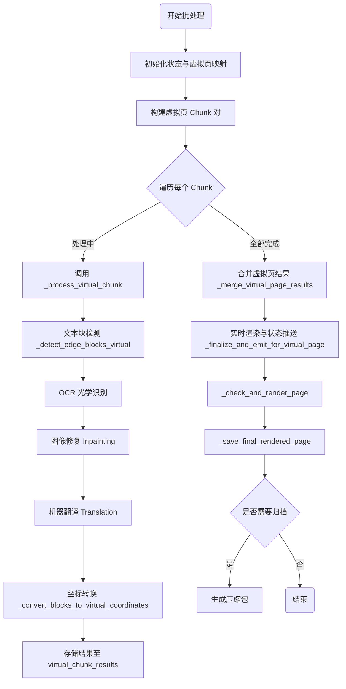
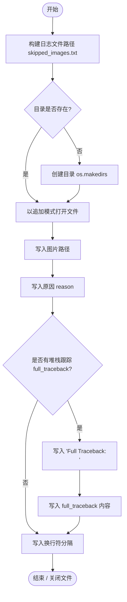
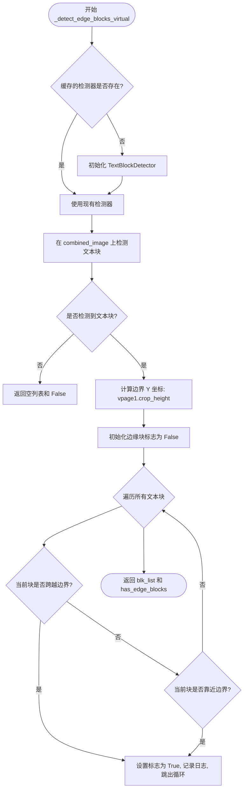
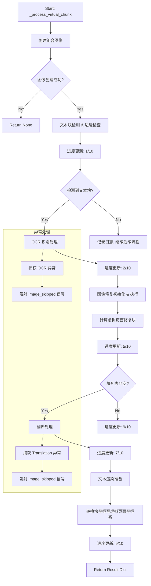
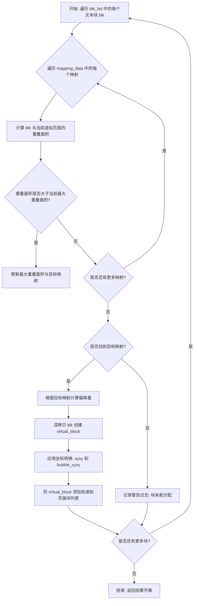
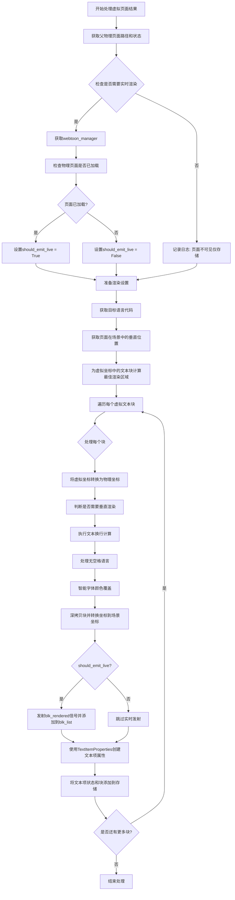
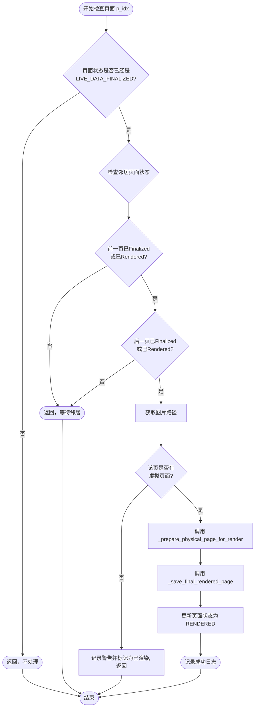
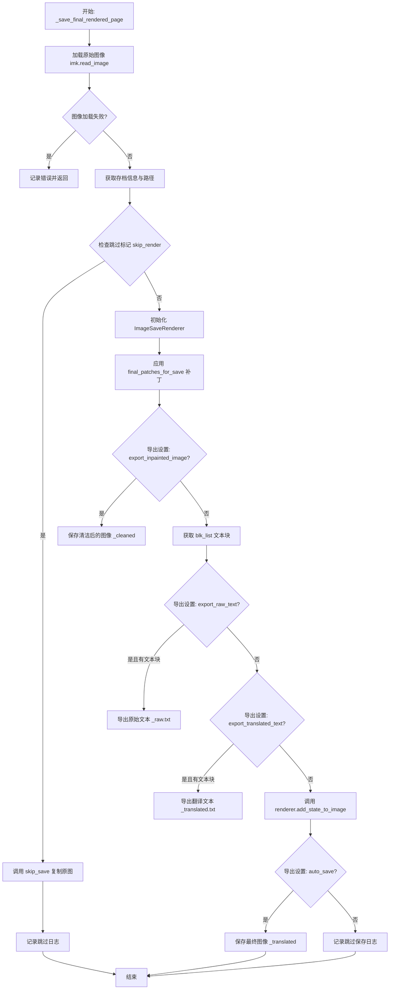
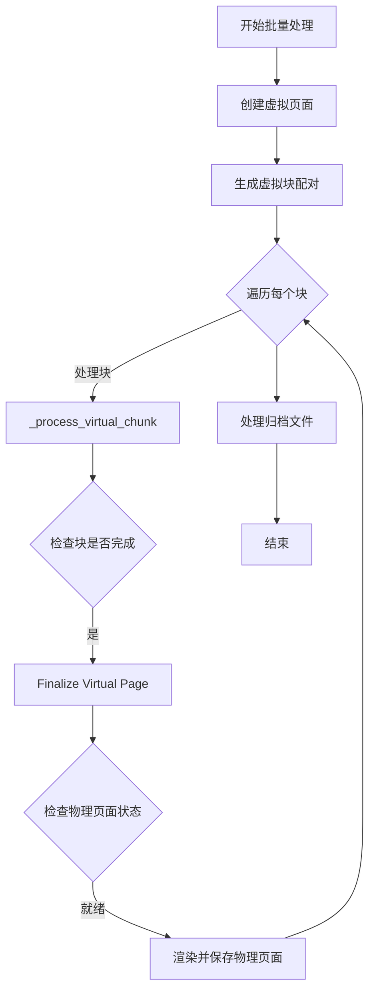

# `comic-translate\pipeline\webtoon_batch_processor.py` 详细设计文档

WebtoonBatchProcessor 类是 Webtoon 漫画批量翻译的核心管理器，通过虚拟页面（Virtual Pages）分块技术处理超长图像，协调检测、OCR、修复、翻译及最终渲染保存的完整流程。

## 整体流程



## 类结构

```
WebtoonBatchProcessor (主处理类)
├── VirtualPage (依赖: 虚拟页模型)
├── VirtualPageCreator (依赖: 虚拟页工厂)
├── TextBlockDetector (依赖: 检测模块)
├── Translator (依赖: 翻译模块)
└── ImageSaveRenderer (依赖: 渲染模块)
```

## 全局变量及字段


### `logger`
    
模块级日志记录器，用于记录类和方法执行过程中的日志信息

类型：`logging.Logger`
    


### `WebtoonBatchProcessor.main_page`
    
主应用程序页面对象，包含图像状态、设置、进度更新信号和渲染配置

类型：`Any`
    


### `WebtoonBatchProcessor.cache_manager`
    
缓存管理器，用于管理处理过程中的缓存数据

类型：`Any`
    


### `WebtoonBatchProcessor.block_detection`
    
文本块检测处理器，负责检测图像中的文本区域

类型：`Any`
    


### `WebtoonBatchProcessor.inpainting`
    
图像修复处理器，负责去除图像中的文本区域

类型：`Any`
    


### `WebtoonBatchProcessor.ocr_handler`
    
OCR处理器，负责识别图像中的文字内容

类型：`Any`
    


### `WebtoonBatchProcessor.max_virtual_height`
    
虚拟页面的最大高度，用于将长图像分割成可管理的块

类型：`int`
    


### `WebtoonBatchProcessor.overlap_height`
    
虚拟页面之间的重叠高度，用于处理跨边界的文本块

类型：`int`
    


### `WebtoonBatchProcessor.virtual_page_creator`
    
虚拟页面创建器，用于将物理页面分割成虚拟页面

类型：`VirtualPageCreator`
    


### `WebtoonBatchProcessor.virtual_chunk_results`
    
存储虚拟块处理结果的字典，键为chunk_id，值为处理结果列表

类型：`defaultdict`
    


### `WebtoonBatchProcessor.virtual_page_processing_count`
    
记录每个虚拟页面被处理次数的字典

类型：`defaultdict`
    


### `WebtoonBatchProcessor.finalized_virtual_pages`
    
已完成的虚拟页面ID集合，用于跟踪已处理的虚拟页面

类型：`set`
    


### `WebtoonBatchProcessor.physical_page_results`
    
存储物理页面合并结果的字典，键为物理页面索引

类型：`defaultdict`
    


### `WebtoonBatchProcessor.physical_page_status`
    
存储物理页面处理状态的字典，状态包括未处理、实时数据已最终确定、已渲染

类型：`defaultdict`
    


### `WebtoonBatchProcessor.final_patches_for_save`
    
存储最终保存的图像修复补丁的字典，用于最终渲染

类型：`defaultdict`
    


### `WebtoonBatchProcessor.edge_threshold`
    
边缘检测阈值（像素），用于判断文本块是否靠近虚拟页面边界

类型：`int`
    


### `WebtoonBatchProcessor.processed_chunks`
    
已处理的虚拟块ID集合，用于跟踪处理进度

类型：`set`
    


### `WebtoonBatchProcessor.virtual_page_to_chunks`
    
虚拟页面到处理块ID的映射字典，用于查找每个虚拟页面关联的块

类型：`defaultdict`
    
    

## 全局函数及方法


### `WebtoonBatchProcessor.skip_save`

该方法负责将翻译后的图像保存到磁盘。它首先检查导出设置中的 `auto_save` 开关。如果启用，它会构建包含时间戳和归档名的目标路径，创建必要的目录，并将图像写入文件（添加 `_translated` 后缀）。

参数：

- `self`：`WebtoonBatchProcessor` 实例本身。
- `directory`：`str`，原始图像所在的目录或归档所在的目录。
- `timestamp`：`str`，用于命名输出文件夹的时间戳字符串（例如 `"Nov-25-2024_03-30-00PM"`）。
- `base_name`：`str`，图像文件的原始文件名（不含扩展名）。
- `extension`：`str`，文件的扩展名（例如 `".png"`, `".jpg"`）。
- `archive_bname`：`str`，归档的基本名称（如果图像来自归档文件），用于在 `translated_images` 下创建子文件夹；如果不是来自归档，则可能为空字符串。
- `image`：`np.ndarray`，要保存的翻译后的图像数据。

返回值：`None`，该方法没有返回值，主要执行文件写入操作。

#### 流程图

```mermaid
flowchart TD
    A([Start skip_save]) --> B[Get Export Settings]
    B --> C{Auto-save Enabled?}
    C -- No --> D[Log Info: Skipping fallback save]
    D --> E([Return None])
    C -- Yes --> F[Construct Save Path]
    F --> G{Path Exists?}
    G -- No --> H[Create Directory: comic_translate_{timestamp}/translated_images/{archive_bname}]
    H --> I
    G -- Yes --> I[Construct Full File Path]
    I --> J[Write Image using imk.write_image]
    J --> K([End])
```

#### 带注释源码

```python
def skip_save(self, directory, timestamp, base_name, extension, archive_bname, image):
    # 获取导出设置，检查是否开启了自动保存
    export_settings = self.main_page.settings_page.get_export_settings()
    if not export_settings.get('auto_save', True):
        # 如果自动保存关闭，记录日志并直接返回，不保存文件
        logger.info("Auto-save is OFF. Skipping fallback image save for '%s'.", base_name)
        return
    
    # 构建保存路径：directory/comic_translate_{timestamp}/translated_images/{archive_bname}/
    path = os.path.join(directory, f"comic_translate_{timestamp}", "translated_images", archive_bname)
    
    # 如果目录不存在，则创建目录（exist_ok=True 确保不会报错）
    if not os.path.exists(path):
        os.makedirs(path, exist_ok=True)
        
    # 写入图像文件，文件名格式为 {base_name}_translated{extension}
    imk.write_image(os.path.join(path, f"{base_name}_translated{extension}"), image)
```


### `WebtoonBatchProcessor.log_skipped_image`

该方法负责将处理失败的图片信息记录到文本文件中，以便用户后续排查。它通过构建特定的时间戳目录结构，将图片路径、失败原因以及（可选的）完整堆栈跟踪信息追加写入 `skipped_images.txt`。

参数：

- `self`：`WebtoonBatchProcessor`，当前类的实例。
- `directory`：`str`，项目输出的基础目录，用于构建日志文件的父目录。
- `timestamp`：`str`，时间戳字符串，用于构建以时间命名的子目录（例如 `comic_translate_...`）。
- `image_path`：`str`，被跳过或处理失败的图片的完整路径。
- `reason`：`str`，描述跳过或失败原因的字符串，默认为空字符串。
- `full_traceback`：`str`，（可选）完整的异常堆栈跟踪信息，默认为空字符串。

返回值：`None`，该方法为过程式方法，不返回任何数据，仅执行文件写入操作。

#### 流程图



#### 带注释源码

```python
def log_skipped_image(self, directory, timestamp, image_path, reason="", full_traceback=""):
    # 1. 构造日志文件的完整路径：{directory}/comic_translate_{timestamp}/skipped_images.txt
    skipped_file = os.path.join(directory, f"comic_translate_{timestamp}", "skipped_images.txt")
    
    # 2. 确保目录存在，如果不存在则创建（exist_ok=True 防止并发冲突）
    os.makedirs(os.path.dirname(skipped_file), exist_ok=True)
    
    # 3. 以追加模式打开文件，指定 UTF-8 编码以支持多语言
    with open(skipped_file, 'a', encoding='UTF-8') as file:
        # 4. 写入失败的图片路径
        file.write(image_path + "\n")
        
        # 5. 写入失败原因
        file.write(reason + "\n")
        
        # 6. 如果提供了完整的堆栈跟踪，则写入堆栈信息
        if full_traceback:
            file.write("Full Traceback:\n")
            file.write(full_traceback + "\n")
        
        # 7. 写入空行，作为记录之间的分隔符
        file.write("\n")
```


### `WebtoonBatchProcessor._create_virtual_chunk_image`

该方法用于将两个虚拟页面（VirtualPage）合并为一个组合图像，以便在批量处理长图Webtoon时能够同时处理多个虚拟页面区域。当两个虚拟页面属于同一个物理页面时，直接返回该虚拟页面区域；否则，将两个虚拟页面垂直拼接成一个组合图像，并生成相应的坐标映射数据。

参数：

- `vpage1`：`VirtualPage`，第一个虚拟页面对象，包含虚拟页面的物理页面路径、裁剪高度、虚拟ID等属性
- `vpage2`：`VirtualPage`，第二个虚拟页面对象，包含虚拟页面的物理页面路径、裁剪高度、虚拟ID等属性

返回值：`Tuple[np.ndarray, List[Dict]]`，返回一个元组，包含组合后的图像（numpy数组）和映射数据列表。组合图像为uint8类型的RGB图像，映射数据包含每个虚拟页面在组合图像中的位置信息以及对应的物理页面索引和路径。

#### 流程图

```mermaid
flowchart TD
    A[开始: _create_virtual_chunk_image] --> B{判断: vpage1.virtual_id == vpage2.virtual_id?}
    B -->|是| C[加载物理图像]
    C --> D{img is None?}
    D -->|是| E[记录错误日志并返回None, []]
    D -->|否| F[提取虚拟页面区域]
    F --> G[创建单虚拟页面映射数据]
    G --> H[返回虚拟图像和映射数据]
    B -->|否| I[加载两个物理图像]
    I --> J{img1 or img2 is None?}
    J -->|是| E
    J -->|否| K[提取两个虚拟页面区域]
    K --> L[计算组合图像尺寸]
    L --> M[创建白色背景组合图像]
    M --> N[放置第一个虚拟页面]
    N --> O[放置第二个虚拟页面]
    O --> P[创建双虚拟页面映射数据]
    P --> H
    H --> Q[结束]
```

#### 带注释源码

```python
def _create_virtual_chunk_image(self, vpage1: VirtualPage, vpage2: VirtualPage) -> Tuple[np.ndarray, List[Dict]]:
    """
    Create a combined image from two virtual pages.
    
    Args:
        vpage1: First virtual page
        vpage2: Second virtual page
        
    Returns:
        Tuple of (combined_image, mapping_data)
    """
    # 处理自配对的虚拟页面（单个虚拟页面处理）
    # 当两个虚拟页面ID相同时，表示处理同一个物理页面的单个虚拟页面
    if vpage1.virtual_id == vpage2.virtual_id:
        # 加载物理图像
        img = imk.read_image(vpage1.physical_page_path)
        
        # 检查图像是否加载成功
        if img is None:
            logger.error(f"Failed to load image: {vpage1.physical_page_path}")
            return None, []
        
        # 从完整物理图像中提取当前虚拟页面区域
        virtual_img = vpage1.extract_virtual_image(img)
        
        # 创建单个虚拟页面的映射数据
        h, w = virtual_img.shape[:2]
        mapping_data = [
            {
                'virtual_page': vpage1,                    # 虚拟页面对象引用
                'physical_page_index': vpage1.physical_page_index,  # 物理页面索引
                'physical_page_path': vpage1.physical_page_path,    # 物理页面文件路径
                'combined_y_start': 0,                      # 在组合图像中的起始Y坐标
                'combined_y_end': h,                        # 在组合图像中的结束Y坐标
                'x_offset': 0,                              # X轴偏移量（居中放置）
                'virtual_width': w,                         # 虚拟页面宽度
                'virtual_height': h                        # 虚拟页面高度
            }
        ]
        
        return virtual_img, mapping_data
    
    # 处理不同虚拟页面的情况（原始逻辑）
    # 加载两个物理图像
    img1 = imk.read_image(vpage1.physical_page_path)
    img2 = imk.read_image(vpage2.physical_page_path)
    
    # 验证两个图像是否都加载成功
    if img1 is None or img2 is None:
        logger.error(f"Failed to load images: {vpage1.physical_page_path}, {vpage2.physical_page_path}")
        return None, []
    
    # 从两个物理图像中分别提取虚拟页面区域
    virtual_img1 = vpage1.extract_virtual_image(img1)
    virtual_img2 = vpage2.extract_virtual_image(img2)
    
    # 计算组合图像的尺寸：取最大宽度，两个高度相加
    max_width = max(virtual_img1.shape[1], virtual_img2.shape[1])
    total_height = virtual_img1.shape[0] + virtual_img2.shape[0]
    
    # 创建组合图像，使用白色背景（RGB=255）
    combined_image = np.zeros((total_height, max_width, 3), dtype=np.uint8)
    combined_image.fill(255)  # 白色背景
    
    # 放置第一个虚拟页面（位于组合图像顶部）
    h1, w1 = virtual_img1.shape[:2]
    x1_offset = (max_width - w1) // 2  # 水平居中偏移
    combined_image[0:h1, x1_offset:x1_offset + w1] = virtual_img1
    
    # 放置第二个虚拟页面（位于组合图像底部，在第一个页面下方）
    h2, w2 = virtual_img2.shape[:2]
    x2_offset = (max_width - w2) // 2  # 水平居中偏移
    combined_image[h1:h1 + h2, x2_offset:x2_offset + w2] = virtual_img2
    
    # 创建两个虚拟页面的映射数据列表
    # 记录每个虚拟页面在组合图像中的位置信息，便于后续坐标转换
    mapping_data = [
        {
            'virtual_page': vpage1,
            'physical_page_index': vpage1.physical_page_index,
            'physical_page_path': vpage1.physical_page_path,
            'combined_y_start': 0,              # 第一个页面从组合图像顶部开始
            'combined_y_end': h1,               # 结束于第一个页面的高度处
            'x_offset': x1_offset,              # 水平偏移量
            'virtual_width': w1,
            'virtual_height': h1
        },
        {
            'virtual_page': vpage2,
            'physical_page_index': vpage2.physical_page_index,
            'physical_page_path': vpage2.physical_page_path,
            'combined_y_start': h1,             # 第二个页面从第一个页面结束处开始
            'combined_y_end': h1 + h2,          # 结束于总高度处
            'x_offset': x2_offset,              # 水平偏移量
            'virtual_width': w2,
            'virtual_height': h2
        }
    ]
    
    return combined_image, mapping_data
```


### `WebtoonBatchProcessor._detect_edge_blocks_virtual`

该方法负责在合并后的虚拟页面图像上执行文本块检测，并判断是否存在“边缘块”（即跨越虚拟页面边界或位于边界附近的文本块）。这对于处理长条漫画在切割成虚拟页面时文本被意外切断的情况至关重要。

参数：

- `combined_image`：`np.ndarray`，由两个虚拟页面拼接而成的合并图像。
- `vpage1`：`VirtualPage`，参与合并的第一个虚拟页面对象。
- `vpage2`：`VirtualPage`，参与合并的第二个虚拟页面对象。

返回值：`Tuple[List[TextBlock], bool]`，返回检测到的 `TextBlock` 对象列表，以及一个布尔值 `has_edge_blocks`，用于指示是否发现了跨越或紧邻虚拟页面边界的文本块。

#### 流程图



#### 带注释源码

```python
def _detect_edge_blocks_virtual(self, combined_image: np.ndarray, vpage1: VirtualPage, vpage2: VirtualPage) -> Tuple[List[TextBlock], bool]:
    """
    Detect text blocks on virtual page chunk and check for edge blocks.
    
    Args:
        combined_image: Combined image of two virtual pages
        vpage1: First virtual page
        vpage2: Second virtual page
        
    Returns:
        Tuple of (detected_blocks, has_edge_blocks)
    """
    # 运行文本块检测，如果缓存中没有检测器，则创建一个新的
    if self.block_detection.block_detector_cache is None:
        self.block_detection.block_detector_cache = TextBlockDetector(self.main_page.settings_page)
    
    # 在合并图像上检测文本块
    blk_list = self.block_detection.block_detector_cache.detect(combined_image)
    
    # 如果没有检测到块，直接返回空列表和 False
    if not blk_list:
        return [], False
    
    # 检查虚拟页面边界处的边缘块
    # boundary_y 是合并图像中第一个虚拟页面的高度，即两页的分界线
    boundary_y = vpage1.crop_height  
    
    has_edge_blocks = False
    for blk in blk_list:
        # 检查块是否跨越虚拟页面边界 (上界在边界之上，下界在边界之下)
        if (blk.xyxy[1] < boundary_y and blk.xyxy[3] > boundary_y):
            has_edge_blocks = True
            logger.info(f"Detected text block spanning virtual page boundary: {blk.xyxy}")
            break
        
        # 或者检查块是否非常靠近边界 (距离小于阈值)
        elif (abs(blk.xyxy[3] - boundary_y) < self.edge_threshold or 
              abs(blk.xyxy[1] - boundary_y) < self.edge_threshold):
            has_edge_blocks = True
            logger.info(f"Detected text block near virtual page boundary: {blk.xyxy}")
            break
    
    return blk_list, has_edge_blocks
```


### `WebtoonBatchProcessor._process_virtual_chunk`

该方法是大批量处理 Webtoon（网络漫画）翻译的核心执行单元。它负责处理由两个虚拟页面（Virtual Page）组成的“块”（Chunk），在组合后的图像上完成文本检测、OCR 识别、图像修复（Inpainting）、翻译以及坐标转换，最终将结果映射回原始的虚拟页面坐标系。

参数：

- `vpage1`：`VirtualPage`，第一个虚拟页面对象，包含从物理页面裁剪出的图像区域信息。
- `vpage2`：`VirtualPage`，第二个虚拟页面对象，通常与第一个相邻或有重叠，用于处理跨页长图。
- `chunk_id`：`str`，当前处理块（Chunk）的唯一标识符，用于日志和结果存储。
- `timestamp`：`str`，时间戳，用于构建输出文件的目录路径。
- `physical_pages_in_chunk`：`set`，该块涉及的所有物理页面索引集合，用于进度更新。
- `total_images`：`int`，待处理的物理页面总数，用于计算进度百分比。

返回值：`Optional[Dict]`，返回包含处理结果的字典。字典包含两个键：
- `blocks` (`Dict[str, List[TextBlock]]`)：按虚拟页面 ID 组织的文本块列表，坐标已转换至虚拟页面坐标系。
- `patches` (`Dict[str, List[Dict]]`)：按虚拟页面 ID 组织的图像修复块（Patches），用于后续的图像融合。
- 若处理过程中发生严重错误（如图像加载失败）或任务被取消，则返回 `None`。

#### 流程图



#### 带注释源码

```python
def _process_virtual_chunk(self, vpage1: VirtualPage, vpage2: VirtualPage,
                            chunk_id: str, timestamp: str, physical_pages_in_chunk: set, total_images: int) -> Optional[Dict]:
    """
    处理一个由两个虚拟页面组成的块。
    返回一个字典，其中包含按 virtual_page_id 键入的 blocks 和 patches。

    Args:
        vpage1: 第一个虚拟页面
        vpage2: 第二个虚拟页面
        chunk_id: 此块的唯一标识符
        timestamp: 输出目录的时间戳

    Returns:
        包含处理后的 'blocks' 和 'patches' 的字典，或 None。
    """
    logger.info(f"Processing virtual chunk {chunk_id}: {vpage1.virtual_id} + {vpage2.virtual_id}")
    
    # 1. 创建组合图像：将两个虚拟页面合并为一个图像，以便统一处理
    #    同时生成映射数据，用于后续将结果坐标映射回原始虚拟页面
    combined_image, mapping_data = self._create_virtual_chunk_image(vpage1, vpage2)
    if combined_image is None:
        return None

    # 2. 检测文本块并检查是否有跨越虚拟页面边界的块（边缘块）
    blk_list, has_edge_blocks = self._detect_edge_blocks_virtual(combined_image, vpage1, vpage2)

    # 进度更新：文本检测完成
    # 使用物理页面的最小索引来更新进度条
    current_physical_page = min(physical_pages_in_chunk)
    self.main_page.progress_update.emit(current_physical_page, total_images, 1, 10, False)
    
    # 检查是否取消
    if self.main_page.current_worker and self.main_page.current_worker.is_cancelled:
        return None

    # 3. OCR 处理：仅在存在文本块时执行
    if blk_list:
        # 获取源语言并初始化 OCR
        source_lang = self.main_page.image_states[vpage1.physical_page_path]['source_lang']
        self.ocr_handler.ocr.initialize(self.main_page, source_lang)
        try:
            self.ocr_handler.ocr.process(combined_image, blk_list)
            # 判断是否需要 RTL (从右向左) 排序
            source_lang_english = self.main_page.lang_mapping.get(source_lang, source_lang)
            rtl = True if source_lang_english == 'Japanese' else False
            blk_list = sort_blk_list(blk_list, rtl)
        except InsufficientCreditsException:
            raise # 积分不足异常需直接抛出
        except Exception as e:
            # 处理网络或HTTP错误
            if isinstance(e, requests.exceptions.ConnectionError):
                err_msg = QCoreApplication.translate("Messages", "Unable to connect to the server.\nPlease check your internet connection.")
            elif isinstance(e, requests.exceptions.HTTPError):
                try:
                    err_msg = e.response.json().get("error_description", str(e))
                except Exception:
                    err_msg = str(e)
            else:
                err_msg = str(e)
            
            logger.exception(f"OCR failed for virtual chunk {chunk_id}: {err_msg}")
            # 通知 UI 跳过相关页面
            self.main_page.image_skipped.emit(vpage1.physical_page_path, "OCR Chunk Failed", err_msg)
            self.main_page.image_skipped.emit(vpage2.physical_page_path, "OCR Chunk Failed", err_msg)
            blk_list = [] # 清空块列表，以便继续进行无文本的修复

    # 进度更新：OCR 处理完成
    self.main_page.progress_update.emit(current_physical_page, total_images, 2, 10, False)
    if self.main_page.current_worker and self.main_page.current_worker.is_cancelled:
        return None

    # 4. 图像修复 (Inpainting) 处理
    # 初始化或复用 Inpainter
    if self.inpainting.inpainter_cache is None or self.inpainting.cached_inpainter_key != self.main_page.settings_page.get_tool_selection('inpainter'):
        backend = 'onnx'
        device = resolve_device(
            self.main_page.settings_page.is_gpu_enabled(),
            backend=backend
        )
        inpainter_key = self.main_page.settings_page.get_tool_selection('inpainter')
        InpainterClass = inpaint_map[inpainter_key]
        self.inpainting.inpainter_cache = InpainterClass(device, backend=backend)
        self.inpainting.cached_inpainter_key = inpainter_key
    
    # 进度更新：Inpainting 设置完成
    self.main_page.progress_update.emit(current_physical_page, total_images, 3, 10, False)
    if self.main_page.current_worker and self.main_page.current_worker.is_cancelled:
        return None
    
    config = get_config(self.main_page.settings_page)
    # 生成蒙版并应用修复
    mask = generate_mask(combined_image, blk_list)
    inpaint_input_img = self.inpainting.inpainter_cache(combined_image, mask, config)
    inpaint_input_img = imk.convert_scale_abs(inpaint_input_img)
    
    # 进度更新：Inpainting 执行完成
    self.main_page.progress_update.emit(current_physical_page, total_images, 4, 10, False)
    if self.main_page.current_worker and self.main_page.current_worker.is_cancelled:
        return None
    
    # 计算虚拟页面的修复块（但不发射，存储在返回值中）
    virtual_page_patches = self._calculate_virtual_inpaint_patches(mask, inpaint_input_img, mapping_data)

    # 进度更新：修复块计算完成
    self.main_page.progress_update.emit(current_physical_page, total_images, 5, 10, False)
    if self.main_page.current_worker and self.main_page.current_worker.is_cancelled:
        return None

    # 进度更新：翻译前期准备完成
    self.main_page.progress_update.emit(current_physical_page, total_images, 6, 10, False)
    if self.main_page.current_worker and self.main_page.current_worker.is_cancelled:
        return None

    # 5. 翻译处理：仅在存在文本块时执行
    if blk_list:
        target_lang = self.main_page.image_states[vpage1.physical_page_path]['target_lang']
        extra_context = self.main_page.settings_page.get_llm_settings()['extra_context']
        translator = Translator(self.main_page, source_lang, target_lang)
        try:
            translator.translate(blk_list, combined_image, extra_context)
        except InsufficientCreditsException:
            raise
        except Exception as e:
            # 错误处理逻辑同上
            if isinstance(e, requests.exceptions.ConnectionError):
                err_msg = QCoreApplication.translate("Messages", "Unable to connect to the server.\nPlease check your internet connection.")
            elif isinstance(e, requests.exceptions.HTTPError):
                try:
                    err_msg = e.response.json().get("error_description", str(e))
                except Exception:
                    err_msg = str(e)
            else:
                err_msg = str(e)
                
            logger.exception(f"Translation failed for virtual chunk {chunk_id}: {err_msg}")
            self.main_page.image_skipped.emit(vpage1.physical_page_path, "Translation Chunk Failed", err_msg)
            self.main_page.image_skipped.emit(vpage2.physical_page_path, "Translation Chunk Failed", err_msg)
            # 翻译失败时清空翻译文本
            for blk in blk_list:
                blk.translation = ""

    # 进度更新：翻译处理完成
    self.main_page.progress_update.emit(current_physical_page, total_images, 7, 10, False)
    if self.main_page.current_worker and self.main_page.current_worker.is_cancelled:
        return None

    # 进度更新：文本渲染准备完成
    self.main_page.progress_update.emit(current_physical_page, total_images, 8, 10, False)
    if self.main_page.current_worker and self.main_page.current_worker.is_cancelled:
        return None

    # 6. 坐标转换：将组合图像中的块坐标转换回虚拟页面坐标
    virtual_page_blocks = self._convert_blocks_to_virtual_coordinates(blk_list, mapping_data)
    
    # 进度更新：块坐标转换完成
    self.main_page.progress_update.emit(current_physical_page, total_images, 9, 10, False)
    if self.main_page.current_worker and self.main_page.current_worker.is_cancelled:
        return None
    
    # 7. 检查是否有结果
    if not virtual_page_blocks and not virtual_page_patches:
        logger.info(f"No results (blocks or patches) for virtual chunk {chunk_id}")
        return None

    # 返回处理结果，包含虚拟页面级别的块和修复块
    return {
        'blocks': virtual_page_blocks,
        'patches': virtual_page_patches
    }
```


### `WebtoonBatchProcessor._convert_blocks_to_virtual_coordinates`

该方法负责将组合图像（由两个虚拟页面合并而成）中的文本块坐标转换回各个虚拟页面的坐标系中。它通过计算每个文本块与各虚拟页面的重叠面积，选择重叠面积最大的虚拟页面作为归属目标，并对坐标进行相应的偏移调整。

参数：

- `blk_list`：`List[TextBlock]`，待转换坐标的文本块列表，这些块当前处于组合图像的坐标系中。
- `mapping_data`：`List[Dict]`，虚拟页面映射信息列表，包含每个虚拟页面在组合图像中的起始位置（y_start, y_end）和 x 轴偏移量（x_offset）等关键数据，用于坐标转换计算。

返回值：`Dict[str, List[TextBlock]]`，返回字典，键为虚拟页面 ID (`vpage.virtual_id`)，值为分配给该虚拟页面的文本块列表。

#### 流程图



#### 带注释源码

```python
def _convert_blocks_to_virtual_coordinates(self, blk_list: List[TextBlock], 
                                         mapping_data: List[Dict]) -> Dict[str, List[TextBlock]]:
    """
    将块从组合图像坐标转换回虚拟页面坐标。
    每个块只会被分配给与其重叠面积最大的那个虚拟页面。

    Args:
        blk_list: 检测到的文本块列表
        mapping_data: 虚拟块创建时的映射信息
        
    Returns:
        键为 virtual_page_id，值为块列表的字典
    """
    # 使用 defaultdict 存储结果，便于按 virtual_page_id 分类添加
    virtual_page_blocks = defaultdict(list)
    
    # 遍历组合图像中的每一个文本块
    for blk in blk_list:
        # 分配块到重叠面积最大的单一虚拟页面
        target_mapping = None
        max_overlap_area = -1

        # 遍历所有涉及的虚拟页面映射（通常是两个：vpage1 和 vpage2）
        for mapping in mapping_data:
            vpage = mapping['virtual_page']
            y_start = mapping['combined_y_start']  # 该虚拟页面在组合图中的起始Y坐标
            y_end = mapping['combined_y_end']      # 该虚拟页面在组合图中的结束Y坐标
            
            # 计算与该虚拟页面的垂直重叠
            # 块的下边缘和虚拟页面的起始Y比较，取较大值
            overlap_y_start = max(blk.xyxy[1], y_start)
            # 块的上边缘和虚拟页面的结束Y比较，取较小值
            overlap_y_end = min(blk.xyxy[3], y_end)
            # 重叠高度必须是正数
            vertical_overlap = max(0, overlap_y_end - overlap_y_start)
            
            # 计算重叠面积 (假设块完全在水平范围内，仅计算垂直重叠带来的面积)
            block_width = blk.xyxy[2] - blk.xyxy[0]
            overlap_area = block_width * vertical_overlap

            # 寻找重叠面积最大的映射目标
            if overlap_area > max_overlap_area:
                max_overlap_area = overlap_area
                target_mapping = mapping

        # 如果找到了归属的虚拟页面（通常一定能找到，除非块在画面外）
        if target_mapping:
            vpage = target_mapping['virtual_page']
            y_start = target_mapping['combined_y_start']
            x_offset = target_mapping['x_offset']

            # 为该虚拟页面创建一个块的副本（深拷贝）
            virtual_block = blk.deep_copy()

            # 坐标转换逻辑：
            # 组合图坐标 - 该虚拟页在组合图中的起始偏移量 = 虚拟页面内的相对坐标
            virtual_block.xyxy = [
                blk.xyxy[0] - x_offset,
                blk.xyxy[1] - y_start,
                blk.xyxy[2] - x_offset,
                blk.xyxy[3] - y_start
            ]
            
            # 同样转换气泡框坐标（如果存在）
            if virtual_block.bubble_xyxy is not None:
                virtual_block.bubble_xyxy = [
                    blk.bubble_xyxy[0] - x_offset,
                    blk.bubble_xyxy[1] - y_start,
                    blk.bubble_xyxy[2] - x_offset,
                    blk.bubble_xyxy[3] - y_start
                ]
            
            # 将转换后的块添加到对应虚拟页面的列表中
            virtual_page_blocks[vpage.virtual_id].append(virtual_block)
        else:
            logger.warning(f"Block {blk.xyxy} could not be assigned to any virtual page")
            
    # 将 defaultdict 转换为普通字典返回
    return dict(virtual_page_blocks)
```


### `WebtoonBatchProcessor._calculate_virtual_inpaint_patches`

该方法负责处理虚拟页合并块（Chunk）的修复结果。它接收合并图像的蒙版和修复后的图像，通过查找蒙版中的轮廓（轮廓代表需要去除的文字区域）来提取补丁（patches）。随后，根据映射数据（mapping_data），将这些补丁映射回其原始的虚拟页，并将坐标从合并图像的局部坐标系转换为物理页面坐标系（考虑场景中的垂直偏移）。最终返回一个以 `virtual_page_id` 为键的字典，包含所有需要应用到物理页面上的补丁数据。

#### 参数

- `mask`：`np.ndarray`，来自合并虚拟图像的修复蒙版（inpainting mask）。
- `inpainted_image`：`np.ndarray`，已经完成修复的合并虚拟图像。
- `mapping_data`：`List[Dict]`（字典列表），包含虚拟页映射信息（如每个虚拟页在合并图像中的起始位置、偏移量、物理页索引等）。

#### 返回值

`Dict[str, List[Dict]]`，返回一个嵌套字典。
- **键**：`virtual_page_id` (str)，字符串类型的虚拟页唯一标识符。
- **值**：`List[Dict]`（字典列表），每个字典包含该虚拟页对应的补丁数据，包括图像数据 (`image`)、边界框 (`bbox`)、页面索引 (`page_index`)、文件路径 (`file_path`) 以及场景坐标 (`scene_pos`)。

#### 流程图

```mermaid
flowchart TD
    Start([开始]) --> Input[输入: mask, inpainted_image, mapping_data]
    Input --> FindContours[在 mask 中查找轮廓]
    FindContours --> IsContoursEmpty{是否有轮廓?}
    
    IsContoursEmpty -- 否 --> ReturnEmpty[返回空字典 {}]
    IsContoursEmpty -- 是 --> LoopContours[遍历每个轮廓 c]
    
    LoopContours --> BoundingRect[获取轮廓 c 的外接矩形 x, y, w, h]
    BoundingRect --> LoopMappings[遍历 mapping_data]
    
    LoopMappings --> CheckOverlap{矩形是否与当前虚拟页重叠?}
    CheckOverlap -- 否 --> LoopMappings
    
    CheckOverlap -- 是 --> ClipPatch[根据虚拟页边界裁剪补丁区域]
    ClipPatch --> ExtractPatch[从 inpainted_image 提取裁剪后的补丁图像]
    
    ExtractPatch --> ConvertCoords[转换坐标: 虚拟页坐标 -> 物理页坐标 -> 场景坐标]
    ConvertCoords --> CreatePatchData[构建补丁数据字典]
    
    CreatePatchData --> AddToList[将补丁数据加入对应虚拟页的列表中]
    AddToList --> LoopMappings
    
    LoopContours --> FinishLoop[结束轮廓循环]
    ReturnEmpty --> FinishLoop
    FinishLoop --> End([返回结果字典])
```

#### 带注释源码

```python
def _calculate_virtual_inpaint_patches(self, mask: np.ndarray, inpainted_image: np.ndarray,
                                       mapping_data: List[Dict]) -> Dict[str, List[Dict]]:
    """
    Create inpaint patches for virtual pages and convert to physical page coordinates.
    This version returns the patches instead of emitting them.

    Args:
        mask: Inpainting mask from combined virtual image
        inpainted_image: Inpainted combined virtual image
        mapping_data: Virtual page mapping information
        
    Returns:
        Dictionary mapping virtual_page_id -> list of patch data dictionaries
    """
    # 1. 在蒙版中查找轮廓（这些轮廓通常对应需要修复的文字区域）
    contours, _ = imk.find_contours(mask)

    # 如果没有轮廓，直接返回空字典
    if not contours:
        return {}

    # 2. 按虚拟页分组补丁
    patches_by_virtual_page = defaultdict(list)

    # 3. 遍历每个轮廓（每个轮廓代表一个补丁区域）
    for i, c in enumerate(contours):
        x, y, w, h = imk.bounding_rect(c)
        patch_bottom = y + h

        # 4. 遍历映射数据，检查该补丁属于哪个虚拟页
        for mapping in mapping_data:
            vpage = mapping['virtual_page']
            y_start = mapping['combined_y_start']
            y_end = mapping['combined_y_end']
            x_offset = mapping['x_offset']

            # 检查补丁是否与该虚拟页区域重叠
            if not (patch_bottom <= y_start or y >= y_end):
                # 5. 裁剪补丁以适应虚拟页边界
                clip_y_start = max(y, y_start)
                clip_y_end = min(patch_bottom, y_end)

                if clip_y_end <= clip_y_start:
                    continue

                # 从修复后的图像中提取补丁图像
                clipped_patch = inpainted_image[clip_y_start:clip_y_end, x:x + w]

                # 6. 转换为虚拟页坐标
                virtual_y = clip_y_start - y_start
                virtual_x = x - x_offset
                virtual_height = clip_y_end - clip_y_start

                # 7. 转换为物理页坐标
                # 调用 VirtualPage 的方法将坐标从虚拟页转换回原始物理页
                physical_coords = vpage.virtual_to_physical_coords([
                    virtual_x, virtual_y, virtual_x + w, virtual_y + virtual_height
                ])

                physical_x = int(physical_coords[0])
                physical_y = int(physical_coords[1])
                physical_width = w
                physical_height = int(physical_coords[3] - physical_coords[1])

                # 获取页面在 Webtoon 场景中的垂直位置偏移
                webtoon_manager = self.main_page.image_viewer.webtoon_manager
                page_y_position_in_scene = 0
                if (webtoon_manager and
                        vpage.physical_page_index < len(webtoon_manager.image_positions)):
                    page_y_position_in_scene = webtoon_manager.image_positions[vpage.physical_page_index]

                # 8. 计算场景坐标（物理坐标 + 场景偏移）
                scene_x = physical_x
                scene_y = physical_y + page_y_position_in_scene

                # 9. 创建补丁数据结构
                patch_data = {
                    'bbox': [physical_x, physical_y, physical_width, physical_height],
                    'image': clipped_patch.copy(),
                    'page_index': vpage.physical_page_index,
                    'file_path': vpage.physical_page_path,
                    'scene_pos': [scene_x, scene_y]
                }

                # 按虚拟页 ID 添加到结果列表
                patches_by_virtual_page[vpage.virtual_id].append(patch_data)

    return dict(patches_by_virtual_page)
```


### `WebtoonBatchProcessor._merge_virtual_page_results`

该函数负责合并来自不同虚拟块（Virtual Chunk）的文本块结果，并根据空间重叠进行去重处理。它从所有处理过特定虚拟页面的块数据中收集文本块，通过计算重叠面积来识别重复块，最终返回一个去重且合并后的文本块列表。

参数：
- `virtual_page_id`：`str`，指定要合并结果的虚拟页面ID。

返回值：`List[TextBlock]`，返回合并和去重后的 `TextBlock` 对象列表。如果没有任何块，则返回空列表。

#### 流程图

```mermaid
graph TD
    A([开始 _merge_virtual_page_results]) --> B[根据 virtual_page_id 获取对应的 Chunk ID 列表]
    B --> C[初始化 all_blocks 列表]
    C --> D{遍历 chunk_id 列表}
    D --> E[从 virtual_chunk_results 获取 chunk_data]
    E --> F{检查 chunk_data 是否有效且包含 blocks?}
    F -->|是| G[将该虚拟页面的 blocks 添加到 all_blocks]
    F -->|否| D
    G --> D
    D --> H{遍历结束?}
    H -->|是| I{all_blocks 是否为空?}
    H -->|否| D
    I -->|是| J[返回空列表]
    I -->|否| K[初始化 merged_blocks 列表]
    K --> L{遍历 all_blocks 中的 block}
    L --> M[假设 block 为非重复 is_duplicate = False]
    M --> N{遍历 merged_blocks 中的 existing_block}
    N --> O[计算两个 block 的重叠面积 overlap_area]
    O --> P[计算各自的面积]
    P --> Q{overlap_area > 阈值 * min(两面积)?}
    Q -->|是| R[标记为重复 is_duplicate = True]
    R --> S{当前 block 翻译更长?}
    S -->|是| T[用当前 block 信息更新 existing_block]
    S -->|否| U[跳出内层循环]
    Q -->|否| N
    N --> V{内层循环结束?}
    V -->|否| N
    V -->|是| W{is_duplicate 为假?}
    W -->|是| X[将 block 加入 merged_blocks]
    W -->|否| Y[跳过 block]
    X --> L
    Y --> L
    L --> Z{外层循环结束?}
    Z -->|否| L
    Z -->|是| AA[返回 merged_blocks]
```

#### 带注释源码

```python
def _merge_virtual_page_results(self, virtual_page_id: str) -> List[TextBlock]:
    """
    合并所有处理过该虚拟页面的 Chunk 结果。
    适配了新的 Chunk 结果结构。

    Args:
        virtual_page_id: 要合并结果的虚拟页面 ID

    Returns:
        合并去重后的文本块列表
    """
    all_blocks = []

    # 遍历所有处理过该虚拟页面的 Chunk ID
    # self.virtual_page_to_chunks 是 virtual_page_id -> [chunk_id_1, chunk_id_2, ...] 的映射
    for chunk_id in self.virtual_page_to_chunks.get(virtual_page_id, []):
        # 从虚拟块结果字典中获取该 Chunk 的数据
        chunk_data = self.virtual_chunk_results.get(chunk_id)
        
        # 检查数据是否存在且包含该虚拟页面的块
        if chunk_data and 'blocks' in chunk_data and virtual_page_id in chunk_data['blocks']:
            # 将该虚拟页面的所有块取出并加入到总列表中
            all_blocks.extend(chunk_data['blocks'][virtual_page_id])

    # 如果没有任何块，直接返回空列表
    if not all_blocks:
        return []
    
    # 去重逻辑：基于重叠面积进行合并
    merged_blocks = []
    for block in all_blocks:
        is_duplicate = False
        
        # 与当前已合并的块进行比较
        for existing_block in merged_blocks:
            # 计算 X 轴重叠量
            overlap_x = max(0, min(block.xyxy[2], existing_block.xyxy[2]) - max(block.xyxy[0], existing_block.xyxy[0]))
            # 计算 Y 轴重叠量
            overlap_y = max(0, min(block.xyxy[3], existing_block.xyxy[3]) - max(block.xyxy[1], existing_block.xyxy[1]))
            overlap_area = overlap_x * overlap_y
            
            # 计算当前块和现有块的面积
            block_area = (block.xyxy[2] - block.xyxy[0]) * (block.xyxy[3] - block.xyxy[1])
            existing_area = (existing_block.xyxy[2] - existing_block.xyxy[0]) * (existing_block.xyxy[3] - existing_block.xyxy[1])
            
            # 重叠阈值：50%
            overlap_threshold = 0.5
            
            # 如果重叠面积超过阈值的最小面积，认为是重复块
            if overlap_area > overlap_threshold * min(block_area, existing_area):
                is_duplicate = True
                # 如果当前 block 的翻译文本更长（信息更丰富），则用它覆盖旧的 block
                if len(block.translation or "") > len(existing_block.translation or ""):
                    existing_block.text = block.text
                    existing_block.translation = block.translation
                    existing_block.xyxy = block.xyxy
                    existing_block.bubble_xyxy = block.bubble_xyxy
                    existing_block.angle = block.angle
                    existing_block.tr_origin_point = block.tr_origin_point
                break
        
        # 如果不是重复块，则添加到最终列表中
        if not is_duplicate:
            merged_blocks.append(block)
    
    return merged_blocks
```


### `WebtoonBatchProcessor._deduplicate_physical_blocks`

在批量处理漫画页面时，该方法负责在物理页面层级对来自不同虚拟页面的文本块进行最终的去重处理。它通过计算块之间的重叠面积，并使用严格的重叠阈值（0.7）来过滤掉重复的块，最终确保每个物理页面上只保留唯一的文本块列表。

参数：

-  `blocks`：`List[TextBlock]`，待去重的文本块列表，这些块已经处于物理坐标系下（完成了虚拟坐标到物理坐标的转换）。

返回值：`List[TextBlock]`，经过去重处理后的文本块列表。

#### 流程图

```mermaid
flowchart TD
    A([开始 _deduplicate_physical_blocks]) --> B{输入的 blocks 是否为空?}
    B -- 是 --> C[直接返回空列表 []]
    B -- 否 --> D[计算每个 TextBlock 的面积]
    D --> E[按面积从大到小排序 blocks]
    E --> F[初始化 final_blocks 列表]
    F --> G[遍历排序后的 block 和其面积]
    G --> H[假设当前 block 不重复 is_duplicate = False]
    H --> I{遍历 final_blocks 中的已有块}
    I --> J[计算当前 block 与已有块的重叠面积 overlap_area]
    J --> K{overlap_area > 0.7 * min(block_area, existing_area)?}
    K -- 是 --> L[标记 is_duplicate = True 并跳出内层循环]
    K -- 否 --> I
    L --> M{is_duplicate 为真?}
    M -- 是 --> N[跳过当前 block，继续下一个]
    M -- 否 --> O[将 block 添加到 final_blocks]
    O --> N
    N --> P{blocks 是否全部遍历完毕?}
    P -- 否 --> G
    P -- 是 --> Q([返回 final_blocks])
```

#### 带注释源码

```python
def _deduplicate_physical_blocks(self, blocks: List[TextBlock]) -> List[TextBlock]:
    """
    在物理页面层级对文本块进行最终去重。
    
    Args:
        blocks: 物理坐标下的文本块列表
        
    Returns:
        去重后的文本块列表
    """
    # 1. 边界检查：如果没有块，直接返回空列表
    if not blocks:
        return []
    
    # 2. 计算每个块的面积： (x2 - x1) * (y2 - y1)
    #    并将块和其面积打包，以便后续排序
    blocks_with_area = [(blk, (blk.xyxy[2] - blk.xyxy[0]) * (blk.xyxy[3] - blk.xyxy[1])) for blk in blocks]
    
    # 3. 核心去重策略：按面积降序排序
    #    优先保留较大的块，假设大块包含的信息更完整
    blocks_with_area.sort(key=lambda x: x[1], reverse=True)
    
    # 4. 初始化最终结果列表
    final_blocks = []
    
    # 5. 遍历每一个块（从大到小）
    for block, block_area in blocks_with_area:
        is_duplicate = False # 默认认为不重复
        
        # 6. 与已经确认保留的块进行比较
        for existing_block in final_blocks:
            # 计算x轴重叠宽度
            overlap_x = max(0, min(block.xyxy[2], existing_block.xyxy[2]) - max(block.xyxy[0], existing_block.xyxy[0]))
            # 计算y轴重叠高度
            overlap_y = max(0, min(block.xyxy[3], existing_block.xyxy[3]) - max(block.xyxy[1], existing_block.xyxy[1]))
            # 计算重叠面积
            overlap_area = overlap_x * overlap_y
            
            # 计算现有块的面积
            existing_area = (existing_block.xyxy[2] - existing_block.xyxy[0]) * (existing_block.xyxy[3] - existing_block.xyxy[1])
            
            # 7. 判定逻辑：使用严格的 0.7 重叠阈值
            #    如果重叠面积超过较小块面积的 70%，则判定为重复
            overlap_threshold = 0.7
            
            if overlap_area > overlap_threshold * min(block_area, existing_area):
                is_duplicate = True
                # 既然已经确定是重复的，就没必要继续比较了
                break
        
        # 8. 如果经过比对确定不是重复块，则加入最终结果集
        if not is_duplicate:
            final_blocks.append(block)
    
    # 9. 返回去重后的列表
    return final_blocks
```


### `WebtoonBatchProcessor._prepare_physical_page_for_render`

该方法负责为物理页面计算最终完整的文本块列表并将其存储。它合并来自所有虚拟页面的结果，将虚拟坐标转换为物理坐标，执行最终的去重处理，并格式化翻译文本以供后续渲染使用。

参数：

- `physical_page_index`：`int`，物理页面的索引，用于标识正在处理的页面
- `image_path`：`str`，物理页面的图像文件路径，用于状态存储和检索
- `virtual_pages`：`List[VirtualPage]`，属于该物理页面的虚拟页面列表，从中合并块结果

返回值：`None`，该方法直接修改 `self.main_page.image_states` 中的状态数据，不返回任何值

#### 流程图

```mermaid
flowchart TD
    A[开始准备物理页面渲染] --> B[遍历所有虚拟页面]
    B --> C[合并虚拟页面的块结果]
    C --> D[将虚拟坐标转换为物理坐标]
    D --> E{还有更多虚拟页面?}
    E -->|是| B
    E --> F[对所有物理块进行最终去重]
    F --> G{存在最终块?}
    G -->|否| H[记录警告并标记跳过渲染]
    G -->|是| I[清除跳过标记]
    I --> J[获取渲染设置和目标语言]
    J --> K[格式化翻译文本]
    K --> L{目标语言是无空格语言?]
    L -->|是| M[移除翻译中的空格]
    L -->|否| N[存储最终块列表到页面状态]
    M --> N
    N --> O[设置推送堆栈标志]
    O --> P[结束]
    H --> P
```

#### 带注释源码

```python
def _prepare_physical_page_for_render(self, physical_page_index: int, image_path: str,
                                      virtual_pages: List[VirtualPage]):
    """
    计算物理页面的最终完整块列表并将其存储。
    它不再处理渲染或文本项创建，因为那是现在实时完成的。
    """
    logger.info(f"Preparing final block list for physical page {physical_page_index}")
    
    # 从所有属于此物理页面的虚拟页面合并结果
    all_physical_blocks = []
    for vpage in virtual_pages:
        # 合并处理此虚拟页面的块
        merged_virtual_blocks = self._merge_virtual_page_results(vpage.virtual_id)
        
        # 将这些虚拟块转换为物理坐标
        for block in merged_virtual_blocks:
            physical_block = block.deep_copy()
            physical_block.xyxy = vpage.virtual_to_physical_coords(block.xyxy)
            if block.bubble_xyxy:
                physical_block.bubble_xyxy = vpage.virtual_to_physical_coords(block.bubble_xyxy)
            all_physical_blocks.append(physical_block)
    
    # 在物理页面级别进行最终去重
    final_blocks = self._deduplicate_physical_blocks(all_physical_blocks)
    
    if not final_blocks:
        logger.warning(f"No final blocks found for physical page {physical_page_index}. Marking for skip.")
        # 存储空块列表并标记需要跳过渲染
        self.main_page.image_states[image_path]['blk_list'] = []
        self.main_page.image_states[image_path]['skip_render'] = True
        return # 停止此页面的进一步处理

    # 如果有块，则清除跳过标志以防之前已设置
    self.main_page.image_states[image_path]['skip_render'] = False

    logger.info(f"Prepared physical page {physical_page_index} with {len(final_blocks)} final blocks.")

    # 为完整块列表格式化翻译
    render_settings = self.main_page.render_settings()
    target_lang = self.main_page.image_states[image_path]['target_lang']
    target_lang_en = self.main_page.lang_mapping.get(target_lang, None)
    trg_lng_cd = get_language_code(target_lang_en)
    format_translations(final_blocks, trg_lng_cd, upper_case=render_settings.upper_case)

    # 语言特定格式化 
    if is_no_space_lang(trg_lng_cd):
        for blk in final_blocks:
            if blk.translation:
                blk.translation = blk.translation.replace(' ', '')

    # 存储最终完整的块列表并设置撤销堆栈标志
    self.main_page.image_states[image_path].update({'blk_list': final_blocks})
    if 'viewer_state' in self.main_page.image_states[image_path]:
        self.main_page.image_states[image_path]['viewer_state']['push_to_stack'] = True
```


### `WebtoonBatchProcessor._emit_and_store_virtual_page_results`

该方法负责处理已确认的虚拟页面的文本块，主要执行两个操作：如果父级页面可见，则向场景查看器发射实时渲染信号（`blk_rendered`）；否则，仅在页面状态中创建和存储最终的文本项数据供后续保存使用。这是网络漫画模式下文本项创建的单一数据源。

参数：

- `vpage`：`VirtualPage`，虚拟页面对象，包含物理页面的路径、索引以及虚拟坐标转换方法
- `blk_list_virtual`：`List[TextBlock]`，虚拟页面坐标中的文本块列表

返回值：`None`，无返回值描述

#### 流程图



#### 带注释源码

```python
def _emit_and_store_virtual_page_results(self, vpage: VirtualPage, blk_list_virtual: List[TextBlock]):
    """
    处理已确认虚拟页面的块。执行两个操作：
    1. 如果父页面可见，向场景查看器发射实时渲染信号（blk_rendered）。
    2. 在页面状态中创建并存储最终的文本项数据，以便最终保存。
    现在这是文本项创建的单一数据源。
    """
    # 获取父物理页面的状态，如果不存在则创建
    image_path = vpage.physical_page_path
    page_state = self.main_page.image_states[image_path]
    viewer_state = page_state.setdefault('viewer_state', {})
    text_items_state = viewer_state.setdefault('text_items_state', [])
    page_blk_list = page_state.setdefault('blk_list', [])

    # 检查是否应该渲染到实时场景
    should_emit_live = False
    webtoon_manager = None
    if self.main_page.webtoon_mode:
        webtoon_manager = self.main_page.image_viewer.webtoon_manager
        # 只有当物理页面在webtoon视图中可见时才实时渲染
        if vpage.physical_page_index in webtoon_manager.loaded_pages:
            should_emit_live = True

    if should_emit_live:
        logger.info(f"为已确认虚拟页面 {vpage.virtual_id} 发射并存储文本项")
    else:
        logger.info(f"为已确认虚拟页面 {vpage.virtual_id} 存储文本项（父页面不可见）")

    # 准备渲染设置
    render_settings = self.main_page.render_settings()
    font, font_color = render_settings.font_family, QColor(render_settings.color)
    max_font_size, min_font_size = render_settings.max_font_size, render_settings.min_font_size
    line_spacing, outline_width = float(render_settings.line_spacing), float(render_settings.outline_width)
    outline = render_settings.outline
    outline_color = QColor(render_settings.outline_color) if outline else None
    bold, italic, underline = render_settings.bold, render_settings.italic, render_settings.underline
    alignment = self.main_page.button_to_alignment[render_settings.alignment_id]
    direction = render_settings.direction
    
    # 获取目标语言代码以进行格式化
    target_lang = self.main_page.image_states[image_path]['target_lang']
    target_lang_en = self.main_page.lang_mapping.get(target_lang, None)
    trg_lng_cd = get_language_code(target_lang_en)
    
    # 获取页面在webtoon场景中的垂直位置
    page_y_position_in_scene = 0
    if webtoon_manager and vpage.physical_page_index < len(webtoon_manager.image_positions):
        page_y_position_in_scene = webtoon_manager.image_positions[vpage.physical_page_index]

    # 确保块在虚拟坐标中使用最佳（气泡感知）渲染边界
    # 这是网络漫画模式下执行的唯一正确位置：合并/去重之后
    # 换行和状态创建之前
    virtual_img = SimpleNamespace(shape=(vpage.crop_height, vpage.physical_width, 3))
    get_best_render_area(blk_list_virtual, virtual_img)

    # 处理每个块
    for blk_virtual in blk_list_virtual:
        # 将虚拟坐标转换为物理坐标
        physical_coords = vpage.virtual_to_physical_coords(blk_virtual.xyxy)
        x1, y1, x2, y2 = physical_coords
        width, height = x2 - x1, y2 - y1

        translation = blk_virtual.translation
        if not translation or len(translation) < 1:
            continue

        # 确定此块是否应使用垂直渲染
        vertical = is_vertical_block(blk_virtual, trg_lng_cd)

        # 执行PySide文本换行计算
        translation, font_size = pyside_word_wrap(
            translation, 
            font, 
            width, 
            height,
            line_spacing, 
            outline_width, 
            bold, 
            italic, 
            underline,
            alignment, 
            direction, 
            max_font_size, 
            min_font_size,
            vertical
        )
        
        # 处理无空格语言（如日语）的翻译文本
        if is_no_space_lang(trg_lng_cd):
            translation = translation.replace(' ', '')

        # 智能颜色覆盖：根据检测到的原始字体颜色调整
        font_color = get_smart_text_color(blk_virtual.font_color, font_color)

        # 创建用于渲染的块副本，并转换到物理坐标
        render_blk = blk_virtual.deep_copy()
        render_blk.xyxy = list(physical_coords)
        if render_blk.bubble_xyxy:
            render_blk.bubble_xyxy = vpage.virtual_to_physical_coords(render_blk.bubble_xyxy)
        
        # 转换到场景坐标以进行正确放置
        render_blk.xyxy[1] += page_y_position_in_scene
        render_blk.xyxy[3] += page_y_position_in_scene
        if render_blk.bubble_xyxy:
            render_blk.bubble_xyxy[1] += page_y_position_in_scene
            render_blk.bubble_xyxy[3] += page_y_position_in_scene

        render_blk.translation = translation

        # 如果应该发射到实时场景，则发射信号
        if should_emit_live:
            self.main_page.blk_rendered.emit(translation, font_size, render_blk, image_path)
            self.main_page.blk_list.append(render_blk)

        # 为最终保存存储数据（始终执行）
        # 使用TextItemProperties进行一致的文本项创建
        text_props = TextItemProperties(
            text=translation,
            font_family=font,
            font_size=font_size,
            text_color=font_color,
            alignment=alignment,
            line_spacing=line_spacing,
            outline_color=outline_color,
            outline_width=outline_width,
            bold=bold,
            italic=italic,
            underline=underline,
            position=(x1, y1),
            rotation=blk_virtual.angle,
            scale=1.0,
            transform_origin=blk_virtual.tr_origin_point if blk_virtual.tr_origin_point else (0, 0),
            width=width,
            direction=direction,
            vertical=vertical,
            selection_outlines=[
                OutlineInfo(
                    0, 
                    len(translation), 
                    outline_color, 
                    outline_width, 
                    OutlineType.Full_Document
                )
            ] if outline else [],
        )
        # 存储到状态列表
        text_items_state.append(text_props.to_dict())
        page_blk_list.append(render_blk)
```


### `WebtoonBatchProcessor._finalize_and_emit_for_virtual_page`

该方法用于合并特定虚拟页面（Virtual Page）的处理结果。它会从多个处理块（chunks）中收集并合并文本块（Blocks）和修补区域（Patches），然后将这些数据发射（emit）到实时场景查看器或存储以供后续保存。

参数：

-  `vpage`：`VirtualPage`，待最终确定的虚拟页面对象，包含其物理页面的索引和路径信息。

返回值：`None`，该方法主要执行副作用（更新状态，发射信号），不直接返回值。

#### 流程图

```mermaid
start
: 开始;
: 获取 virtual_page_id;
: 调用 _merge_virtual_page_results 合并文本块;
: 遍历关联的 Chunk 收集修补块 (Patches);
if "是否存在修补块 (Patches)?" then
    :[是] 发射 patches_processed 信号;
    : 将修补块存入 final_patches_for_save;
    : 记录日志;
else
    :[否];
endif

if "是否存在文本块 (Blocks)?" then
    :[是] 调用 _emit_and_store_virtual_page_results;
    : 发射文本渲染信号并保存状态;
else
    :[否];
endif
end
```

#### 带注释源码

```python
def _finalize_and_emit_for_virtual_page(self, vpage: VirtualPage):
    """
    Merges results for a confirmed virtual page and emits its patches and
    text items to the live scene viewer.
    """
    virtual_page_id = vpage.virtual_id

    # 1. Merge Blocks for this virtual page
    # 合并该虚拟页面在所有处理块中的文本检测结果
    merged_blocks = self._merge_virtual_page_results(virtual_page_id)

    # 2. Merge Patches for this virtual page
    # 收集所有处理过该虚拟页面的块中的图像修补数据
    all_patches = []
    for chunk_id in self.virtual_page_to_chunks.get(virtual_page_id, []):
        chunk_data = self.virtual_chunk_results.get(chunk_id)
        if chunk_data and 'patches' in chunk_data and virtual_page_id in chunk_data['patches']:
            all_patches.extend(chunk_data['patches'][virtual_page_id])

    # 3. Emit Patches to the scene
    # 如果存在修补数据，发射信号更新实时画面，并保存用于最终保存
    if all_patches:
        logger.info(f"Emitting {len(all_patches)} inpaint patches for confirmed VP {virtual_page_id}")
        self.main_page.patches_processed.emit(all_patches, vpage.physical_page_path)
        self.final_patches_for_save[vpage.physical_page_path].extend(all_patches)

    # 4. Handle and Emit Text Items using the new single source of truth
    # 如果存在翻译后的文本块，发射渲染信号并保存文本项状态
    if merged_blocks:
        self._emit_and_store_virtual_page_results(vpage, merged_blocks)
```


### `WebtoonBatchProcessor._check_and_render_page`

该方法负责检查物理页面及其邻居页面的处理状态，当确认页面数据已最终化且邻居页面也已准备好时，触发最终的渲染和保存流程。这是“渴望型”（Eager）渲染策略的关键环节，确保了跨页文本的正确处理。

参数：

-  `p_idx`：`int`，当前待检查的物理页面索引。
-  `total_images`：`int`，批次中包含的图片总数，用于判断边界。
-  `image_list`：`List[str]`，所有待处理图片的路径列表，用于通过索引获取图片路径。
-  `timestamp`：`str`，时间戳字符串，用于构建输出文件的目录结构。
-  `physical_to_virtual_mapping`：`Dict`，映射表，键为物理页面索引，值为该物理页面对应的 `VirtualPage` 对象列表。

返回值：`None`，该方法直接修改实例状态并保存文件，不返回数据。

#### 流程图



#### 带注释源码

```python
def _check_and_render_page(self, p_idx: int, total_images: int, image_list: List[str], timestamp: str, physical_to_virtual_mapping: Dict):
    """
    Checks if a page and its neighbors are ready, and if so, prepares, renders, and saves the page.
    """
    # A page is ready to be rendered if its own live data is final, and it hasn't already been rendered.
    # 如果当前页面的状态不是 LIVE_DATA_FINALIZED，则直接返回，不进行渲染
    if self.physical_page_status.get(p_idx) != PageStatus.LIVE_DATA_FINALIZED:
        return

    # Check neighbor readiness. Neighbors must have at least had their live data finalized.
    # A page at the boundary of the comic (first or last) doesn't need a neighbor on that side.
    # 检查前一个页面是否就绪（如果是第一页，则忽略）
    prev_page_ready = (p_idx == 0) or (self.physical_page_status.get(p_idx - 1) in [PageStatus.LIVE_DATA_FINALIZED, PageStatus.RENDERED])
    # 检查后一个页面是否就绪（如果是最后一页，则忽略）
    next_page_ready = (p_idx == total_images - 1) or (self.physical_page_status.get(p_idx + 1) in [PageStatus.LIVE_DATA_FINALIZED, PageStatus.RENDERED])

    # If both the page and its neighbors are ready, we can proceed with the final render.
    if prev_page_ready and next_page_ready:
        logger.info(f"Page {p_idx} and its neighbors' states are ready. Proceeding with final render.")
        # 根据索引获取图片路径
        image_path = image_list[p_idx]
        
        # Ensure virtual pages exist for this index before proceeding.
        # 获取该物理页面对应的虚拟页面列表
        virtual_pages = physical_to_virtual_mapping.get(p_idx)
        if not virtual_pages:
            # 如果没有虚拟页面（例如该图片被跳过），则标记为已渲染，避免重复检查
            logger.warning(f"Skipping render for page {p_idx} as it has no virtual pages (might have been skipped).")
            self.physical_page_status[p_idx] = PageStatus.RENDERED # Mark as done to avoid re-checking.
            return

        # Prepare the final, consolidated block list needed for the inpainting mask.
        # 准备最终的文本块列表，用于后续的图像修复和文本渲染
        self._prepare_physical_page_for_render(p_idx, image_path, virtual_pages)
        
        # Call the function that handles the final rendering and saving.
        # 执行最终的图像渲染和保存操作
        self._save_final_rendered_page(p_idx, image_path, timestamp)

        # Mark the page as fully rendered and saved.
        # 更新状态为已渲染
        self.physical_page_status[p_idx] = PageStatus.RENDERED
        logger.info(f"Successfully rendered and saved physical page {p_idx}.")
```


### `WebtoonBatchProcessor._save_final_rendered_page`

这是一个**最终渲染与保存**的核心方法。它负责加载原始图像，应用预先计算好的图像修复（Inpainting）补丁，通过渲染器将文本块绘制到图像上，并根据用户配置导出最终的高清图像、清洁图像（仅去除文字底稿）以及文本文件（原文与译文）。

#### 参数

- `self`：隐式参数，类实例本身。
- `page_idx`：`int`，当前正在处理的物理页面在图像列表中的索引。
- `image_path`：`str`，原始图像文件的磁盘路径。
- `timestamp`：`str`，批处理任务的时间戳，用于构建输出目录结构。

#### 返回值

`None`（无返回值）。该方法主要通过副作用（写入磁盘文件、修改UI状态）完成工作。

#### 流程图



#### 带注释源码

```python
def _save_final_rendered_page(self, page_idx: int, image_path: str, timestamp: str):
    """
    一个综合性的函数，从原始图像开始，应用预计算的图像修复补丁，
    渲染文本（包括跨页文本项），并保存最终输出文件。
    仅当页面及其邻居的数据准备就绪时才会调用此函数。
    """
    logger.info(f"Starting final render process for page {page_idx} at path: {image_path}")

    # 1. 加载原始的、未处理的图像
    image = imk.read_image(image_path)

    if image is None:
        logger.error(f"Failed to load physical image for rendering: {image_path}")
        return

    # 2. 首先确定正确的保存路径和名称，以便所有操作使用
    base_name = os.path.splitext(os.path.basename(image_path))[0].strip()
    extension = os.path.splitext(image_path)[1]
    directory = os.path.dirname(image_path)
    
    archive_bname = ""
    # 处理档案模式（如果是档案中的图片，需要还原档案路径结构）
    for archive in self.main_page.file_handler.archive_info:
        if image_path in archive['extracted_images']:
            archive_path = archive['archive_path']
            directory = os.path.dirname(archive_path)
            archive_bname = os.path.splitext(os.path.basename(archive_path))[0].strip()
            break
    
    # 3. 检查是否应该跳过此页面的渲染（通常是因为没有检测到文本块）
    if self.main_page.image_states[image_path].get('skip_render'):
        logger.info(f"Skipping final render for page {page_idx}, copying original.")
        reason = "No text blocks detected or processed successfully."
        # 调用通用的跳过保存逻辑
        self.skip_save(directory, timestamp, base_name, extension, archive_bname, image)
        self.log_skipped_image(directory, timestamp, image_path, reason)
        return
    
    # 4. 初始化渲染器并应用图像修复补丁
    renderer = ImageSaveRenderer(image)
    patches = self.final_patches_for_save.get(image_path, [])
    renderer.apply_patches(patches)

    # 获取导出设置
    settings_page = self.main_page.settings_page
    export_settings = settings_page.get_export_settings()

    # 5. 导出清洁图像（仅包含修复痕迹，无文字）
    if export_settings['export_inpainted_image']:
        path = os.path.join(directory, f"comic_translate_{timestamp}", "cleaned_images", archive_bname)
        if not os.path.exists(path):
            os.makedirs(path, exist_ok=True)
        # 此时渲染器中的图像已修复但尚无文字，是保存的大好时机
        cleaned_image_rgb = renderer.render_to_image()  
        imk.write_image(os.path.join(path, f"{base_name}_cleaned{extension}"), cleaned_image_rgb)

    # 6. 获取最终的文本块列表用于文本导出
    blk_list = self.main_page.image_states[image_path].get('blk_list', [])

    # 7. 导出原始文本
    if export_settings['export_raw_text'] and blk_list:
        path = os.path.join(directory, f"comic_translate_{timestamp}", "raw_texts", archive_bname)
        if not os.path.exists(path):
            os.makedirs(path, exist_ok=True)
        raw_text = get_raw_text(blk_list)
        with open(os.path.join(path, f"{base_name}_raw.txt"), 'w', encoding='UTF-8') as f:
            f.write(raw_text)

    # 8. 导出翻译文本
    if export_settings['export_translated_text'] and blk_list:
        path = os.path.join(directory, f"comic_translate_{timestamp}", "translated_texts", archive_bname)
        if not os.path.exists(path):
            os.makedirs(path, exist_ok=True)
        translated_text = get_raw_translation(blk_list)
        with open(os.path.join(path, f"{base_name}_translated.txt"), 'w', encoding='UTF-8') as f:
            f.write(translated_text)

    # 9. 继续图像渲染：将文本状态（viewer_state）渲染到图像上
    # 这会根据之前存储的 TextItemProperties 生成最终的文字图层
    viewer_state = self.main_page.image_states[image_path].get('viewer_state', {}).copy()
    renderer.add_state_to_image(viewer_state, page_idx, self.main_page)
    
    # 10. 条件保存：最终渲染图像（由 auto_save 控制）
    if export_settings['auto_save']:
        render_save_dir = os.path.join(directory, f"comic_translate_{timestamp}", "translated_images", archive_bname)
        if not os.path.exists(render_save_dir):
            os.makedirs(render_save_dir, exist_ok=True)
        sv_pth = os.path.join(render_save_dir, f"{base_name}_translated{extension}")
        renderer.save_image(sv_pth)
        logger.info(f"Saved final rendered page: {sv_pth}")
    else:
        logger.info(f"Auto-save is OFF. Skipping final image save for page {page_idx}.")
```


### `WebtoonBatchProcessor.webtoon_batch_process`

#### 描述

这是 Webtoon 批处理的核心入口方法。它通过“虚拟页面（Virtual Page）”技术将长条漫图像分割为重叠的块进行并行或顺序处理，并在处理过程中实时检查物理页面及其邻居的状态。一旦页面数据准备完毕（例如涉及跨页文本时），该方法会立即触发渲染和保存操作（Eager 策略），从而支持对超长漫画的高效翻译和导出。

#### 参数

- `self`：实例方法，隐含参数。
- `selected_paths`：`List[str]`，需要处理的图像文件路径列表。如果为 `None`，则默认使用 `self.main_page.image_files` 中的所有图像。

#### 返回值

`None`。该方法主要通过 Qt 信号（如 `progress_update`, `image_skipped`）与主线程通信，并通过文件系统保存处理后的图像。

#### 流程图

```mermaid
flowchart TD
    A([Start webtoon_batch_process]) --> B[初始化时间戳与图像列表]
    B --> C[重置内部状态变量]
    C --> D[遍历物理图像创建虚拟页面]
    D --> E[生成虚拟块对 virtual_chunk_pairs]
    E --> F{遍历每个虚拟块 (Chunk)}
    F --> G[调用 _process_virtual_chunk 处理块]
    G --> H{检查虚拟页是否完成处理}
    H -- 是 --> I[调用 _finalize_and_emit_for_virtual_page]
    H -- 否 --> J{物理页数据是否就绪}
    I --> J
    J -- 是且邻居就绪 --> K[调用 _check_and_render_page 渲染保存]
    J -- 否 --> L{是否为该物理页的最后一个块}
    K --> L
    L -- 是 --> M[更新进度条至100%]
    L -- 否 --> F
    M --> F
    F --> N{所有块处理完毕?}
    N -- 否 --> F
    N -- 是 --> O[处理归档文件 Creation]
    O --> P([End])
```

#### 带注释源码

```python
def webtoon_batch_process(self, selected_paths: List[str] = None):
    """
    Main webtoon batch processing method. Saves physical pages as soon as they
    and their neighbors' live data is finalized, allowing for correct handling
    of spanning text items.
    """
    # 1. 初始化：获取时间戳和图像列表
    timestamp = datetime.now().strftime("%b-%d-%Y_%I-%M-%S%p")
    # 如果传入了指定路径则使用，否则使用主页面维护的图像文件列表
    image_list = selected_paths if selected_paths is not None else self.main_page.image_files
    total_images = len(image_list)

    if total_images < 1:
        logger.warning("No images to process")
        return

    logger.info(f"Starting EAGER webtoon batch processing for {total_images} images with spanning item support.")

    # 2. 重置状态：清空之前批处理留下的数据缓存和状态标记
    self.virtual_chunk_results.clear()
    self.virtual_page_processing_count.clear()
    self.finalized_virtual_pages.clear()
    self.physical_page_status.clear()
    self.processed_chunks = set()
    self.virtual_page_to_chunks = defaultdict(list)

    # 3. Step 1: 为所有物理页面创建虚拟页面
    # 虚拟页面机制允许将高分辨率长图切割为 2000px 高的块，并保留 200px 重叠以处理边缘文本
    all_virtual_pages = []
    physical_to_virtual_mapping = {}
    for physical_idx, image_path in enumerate(image_list):
        # 检查是否被用户手动跳过
        state = self.main_page.image_states.get(image_path, {})
        if state.get('skip', False):
            # ... [跳过处理逻辑] ...
            continue
        
        image = imk.read_image(image_path)
        if image is None:
            logger.error(f"Failed to load image: {image_path}")
            continue
        
        # 创建该图像对应的虚拟页面列表
        virtual_pages = self.virtual_page_creator.create_virtual_pages(physical_idx, image_path, image)
        all_virtual_pages.extend(virtual_pages)
        physical_to_virtual_mapping[physical_idx] = virtual_pages

    if not all_virtual_pages:
        logger.error("No virtual pages were created from the provided images.")
        return

    # 4. Step 2: 创建虚拟块对
    # 策略：通常是将相邻的虚拟页面配对进行处理，以处理跨虚拟页的文本
    virtual_chunk_pairs = self.virtual_page_creator.get_virtual_chunk_pairs(all_virtual_pages)
    # 建立虚拟页到其所属块的映射，便于后续状态追踪
    for chunk_idx, (vpage1, vpage2) in enumerate(virtual_chunk_pairs):
        chunk_id = f"chunk_{chunk_idx}_{vpage1.virtual_id}_{vpage2.virtual_id}"
        self.virtual_page_to_chunks[vpage1.virtual_id].append(chunk_id)
        if vpage1.virtual_id != vpage2.virtual_id:
            self.virtual_page_to_chunks[vpage2.virtual_id].append(chunk_id)
    
    total_chunks = len(virtual_chunk_pairs)
    logger.info(f"Created {len(all_virtual_pages)} virtual pages and {total_chunks} chunks to process.")

    # 5. Step 3: 主循环 - 遍历并处理每个虚拟块
    for chunk_idx, (vpage1, vpage2) in enumerate(virtual_chunk_pairs):
        # 检查是否被用户取消
        if self.main_page.current_worker and self.main_page.current_worker.is_cancelled:
            break
        
        chunk_id = f"chunk_{chunk_idx}_{vpage1.virtual_id}_{vpage2.virtual_id}"
        physical_pages_in_chunk = {vpage1.physical_page_index, vpage2.physical_page_index}
        
        # ... [进度更新逻辑：如果是某个物理页的第一个块，显示进度] ...

        try:
            # 执行块处理：包含检测、OCR、翻译、修复(Inpainting)
            chunk_results = self._process_virtual_chunk(vpage1, vpage2, chunk_id, timestamp, physical_pages_in_chunk, total_images)
            if chunk_results:
                self.virtual_chunk_results[chunk_id] = results
            self.processed_chunks.add(chunk_id)
        except Exception as e:
            logger.exception(f"Error processing virtual chunk {chunk_id}: {e}", exc_info=True)
            self.processed_chunks.add(chunk_id)

        # 6. 状态检查与“急切”渲染
        # 检查是否有虚拟页面已经完成处理（其所有关联的块都已处理完毕）
        unique_vpages = {vpage1.virtual_id: vpage1, vpage2.virtual_id: vpage2}
        for vpage in unique_vpages.values():
            if vpage.virtual_id in self.finalized_virtual_pages:
                continue
            
            required_chunks = self.virtual_page_to_chunks[vpage.virtual_id]
            if all(c_id in self.processed_chunks for c_id in required_chunks):
                # 发出该虚拟页面的最终结果，更新UI
                self._finalize_and_emit_for_virtual_page(vpage)
                self.finalized_virtual_pages.add(vpage.virtual_id)

                # 检查该虚拟页所属的物理页面是否现在“就绪”
                # “就绪”意味着：该物理页的所有虚拟页都处理完了，且（对于边缘文本）邻居物理页也处理完了
                p_idx = vpage.physical_page_index
                if self.physical_page_status.get(p_idx, PageStatus.UNPROCESSED) == PageStatus.UNPROCESSED:
                    vpages_for_physical = physical_to_virtual_mapping.get(p_idx, [])
                    if all(vp.virtual_id in self.finalized_virtual_pages for vp in vpages_for_physical):
                        logger.info(f"All live data for physical page {p_idx} is now finalized.")
                        self.physical_page_status[p_idx] = PageStatus.LIVE_DATA_FINALIZED
                        self.main_page.render_state_ready.emit(image_list[p_idx])

        # 7. 触发渲染检查
        # 如果有物理页刚刚就绪，检查它及其邻居是否可以开始最终渲染（渲染通常需要邻居页的数据来处理跨页文本）
        # 调用 _check_and_render_page，如果条件满足（自己和邻居都 finalized），则保存文件
        for p_idx in sorted(list(pages_to_check)):
            self._check_and_render_page(p_idx, total_images, image_list, timestamp, physical_to_virtual_mapping)

        # ... [处理最后的块进度更新] ...

    # 8. Step 4: 最终清理与归档
    # 强制检查是否有遗漏的页面（安全网）
    for p_idx in range(total_images):
        if self.physical_page_status.get(p_idx) == PageStatus.LIVE_DATA_FINALIZED:
            self._check_and_render_page(p_idx, total_images, image_list, timestamp, physical_to_virtual_mapping)

    # 处理 ZIP/RAR 等归档文件的重新打包
    # ... [Archive creation logic] ...
    
    logger.info("Eager webtoon batch processing completed.")
```

## 关键组件


### WebtoonBatchProcessor (Webtoon批量处理器)
核心功能：通过虚拟分页（Virtual Pages）与重叠滑动窗口技术，将长幅Webtoon图像分割为可管理的块进行OCR识别、图像修复（Inpainting）和翻译渲染，从而实现超长图像的端到端自动化处理。

### 文件的整体运行流程
1.  **虚拟页面生成**：为每一张物理图像创建多个垂直方向的虚拟页面，并设置重叠高度（Overlap Height）以处理边界文本。
2.  **虚拟块配对**：生成虚拟页面的组合对（Chunk），每次处理两个页面以利用上下文信息。
3.  **块级处理循环**：
    -   合并虚拟页图像。
    -   检测文本块并识别边界跨越情况（Edge Detection）。
    -   执行OCR与翻译。
    -   执行图像修复（Inpainting）。
    -   将结果坐标映射回原始物理页面坐标系。
4.  **结果合并与去重**：合并不同块处理的结果，消除重叠区域的重复文本。
5.  **Eager渲染与保存**：当物理页面及其相邻页面的数据均准备完毕后，触发最终渲染并保存图像。

### 类的详细信息

#### 类：WebtoonBatchProcessor

**字段 (Fields)**
- `main_page`: *MainWindow* - 主窗口实例，用于获取设置和发射UI信号。
- `virtual_page_creator`: *VirtualPageCreator* - 负责将物理图像切分为虚拟页面的管理器。
- `block_detection`: *Handler* - 文本块检测处理器（含缓存）。
- `inpainting`: *Handler* - 图像修复处理器（含缓存）。
- `ocr_handler`: *Handler* - OCR识别处理器。
- `max_virtual_height`: *int* (2000) - 单个虚拟页面的最大像素高度。
- `overlap_height`: *int* (200) - 虚拟页面之间的重叠像素高度，用于边界处理。
- `virtual_chunk_results`: *defaultdict* - 存储每个虚拟块的处理结果（块、补丁）。
- `physical_page_status`: *defaultdict* - 跟踪物理页面的处理状态（未处理、Live数据终结、已渲染）。

**方法 (Methods)**

##### 1. webtoon_batch_process
- **参数**: `selected_paths: List[str]` - 可选的指定图像路径列表。
- **描述**: 批量处理的主入口方法，负责协调整个虚拟页面处理流程。
- **返回值**: `None`
- **流程图**:


##### 2. _process_virtual_chunk
- **参数**: 
    - `vpage1: VirtualPage` - 第一个虚拟页。
    - `vpage2: VirtualPage` - 第二个虚拟页。
    - `chunk_id: str` - 块唯一ID。
    - `timestamp: str` - 时间戳。
    - `physical_pages_in_chunk: set` - 涉及的物理页索引。
    - `total_images: int` - 总图像数。
- **描述**: 处理单个虚拟块的核心逻辑，包含图像合并、检测、OCR、翻译、修复和坐标转换。
- **返回值**: `Optional[Dict]` - 包含 'blocks' 和 'patches' 的结果字典。
- **源码片段**:
```python
def _process_virtual_chunk(self, vpage1: VirtualPage, vpage2: VirtualPage,
                          chunk_id: str, timestamp: str, physical_pages_in_chunk: set, total_images: int) -> Optional[Dict]:
    # 1. 创建合并图像
    combined_image, mapping_data = self._create_virtual_chunk_image(vpage1, vpage2)
    
    # 2. 检测与边缘处理
    blk_list, has_edge_blocks = self._detect_edge_blocks_virtual(combined_image, vpage1, vpage2)
    
    # 3. OCR 处理 (仅当有块时)
    if blk_list:
        # ... 调用 OCR ...
        pass
        
    # 4. 修复处理
    # ... 生成掩码并修复 ...
    
    # 5. 翻译处理
    if blk_list:
        # ... 调用翻译 ...
        pass
        
    # 6. 坐标转换
    virtual_page_blocks = self._convert_blocks_to_virtual_coordinates(blk_list, mapping_data)
    
    return {'blocks': virtual_page_blocks, 'patches': virtual_page_patches}
```

### 关键组件信息

1.  **虚拟分页与滑动窗口 (Virtual Paging & Sliding Window)**
    - **描述**: 将长图切分为固定高度（2000px）+ 重叠（200px）的切片。这是解决长幅Webtoon内存瓶颈的核心策略，类似于深度学习中的“惰性加载”思路，即不在内存中一次性加载整张大图，而是按需分块处理。

2.  **跨边界块检测 (Edge Block Detection)**
    - **描述**: 在 `_detect_edge_blocks_virtual` 中实现，检测文本块是否跨越虚拟页面的边界。如果发现边界块，系统会记录日志以供后续分析，确保文本不会因切分而断裂。

3.  **图像修复管线 (Inpainting Pipeline)**
    - **描述**: 利用 `generate_mask` 生成文本区域的掩码，并调用 ONNX 运行时进行修复。代码中包含缓存机制（`inpainter_cache`）以避免重复初始化模型。

4.  **坐标映射系统 (Coordinate Mapping)**
    - **描述**: 实现了从“合并虚拟块坐标系”到“单个虚拟页面坐标系”再到“物理页面坐标系”的多级转换。确保了在各个处理阶段文本位置的一致性。

### 潜在的技术债务或优化空间

1.  **UI紧耦合**: `WebtoonBatchProcessor` 直接依赖于 `MainWindow` 实例 (`self.main_page`)，这使得核心处理逻辑难以脱离GUI独立运行（单元测试困难）。建议抽取纯业务处理引擎。
2.  **缺乏高级推理优化**: 代码使用了ONNX后端进行图像修复，但未实现显式的**量化策略**（如INT8量化）或**张量索引**优化。对于大规模批处理，可能存在性能提升空间。
3.  **错误处理粒度**: OCR和翻译失败时主要采取“跳过页面”或“清空文本”的策略，缺乏基于重试机制的细粒度恢复能力。
4.  **状态管理复杂性**: 使用了大量的 `defaultdict` 和集合来跟踪虚拟块与物理页面的映射关系，逻辑较为复杂，易产生状态同步BUG。

### 其它项目

-   **设计目标**: 实现超长Webtoon图像（数千像素高度）的无缝翻译，支持自动化端到端流程。
-   **约束条件**: 受限于 `max_virtual_height` 参数，过大的单张图像仍可能超出内存；依赖外部API（Translator, OCR）进行语义处理。
-   **数据流**: Image -> Virtual Pages -> Chunks -> [Detection -> OCR -> Inpainting -> Translation] -> Merge -> Physical Render -> Save。

## 问题及建议


### 已知问题

1.  **紧耦合与单一职责问题 (God Class)**: `WebtoonBatchProcessor` 承担了过重的职责，包括虚拟页面管理、批处理流程编排、坐标转换、图像渲染以及部分 UI 交互（Signal/Slot）。这导致代码难以维护和测试，任何逻辑修改都可能影响多个模块。
2.  **串行执行性能瓶颈**: `webtoon_batch_process` 方法中的主循环是严格串行执行的。虽然通过“邻居页面必须就绪”的逻辑保证了跨页文本（Spanning Text）的正确性，但这阻止了不同物理页面之间的并行处理，无法充分利用多核 CPU。
3.  **坐标系统复杂且易错**: 代码中存在大量的坐标转换（物理坐标 -> 虚拟坐标 -> 合并图坐标 -> 虚拟坐标 -> 物理坐标），特别是 `_convert_blocks_to_virtual_coordinates` 和 `_detect_edge_blocks_virtual` 中的边界检测逻辑。虽然通过 `edge_threshold` 进行了处理，但这种隐式的坐标映射极易引入 Off-by-One 错误或边界文本遗漏。
4.  **图像重复 I/O**: 在 `_create_virtual_chunk_image` 和 `_save_final_rendered_page` 中，原始物理图像会被多次从磁盘读取（例如在合并虚拟页面时和最终保存时），这在处理大量高分辨率 Webtoon 图片时会造成不必要的性能开销和潜在的 I/O 阻塞。
5.  **异常处理不够健壮**: 在 `_process_virtual_chunk` 中使用宽泛的 `except Exception` 捕获了大部分错误。如果某个 Chunk 处理失败（例如 OCR 或翻译失败），代码只是将其标记为已处理并记录日志，可能导致对应的物理页面数据不完整（缺少某些块的翻译或修复），但流程仍会继续，最终可能产生“半成品”页面或导致页面状态永远停留在 `UNPROCESSED`（如果依赖 `all` 判断），尽管逻辑上有一定的容错（跳过空块），但缺乏明确的失败状态反馈。
6.  **硬编码与魔法数字**: 像是 `max_virtual_height` (2000), `overlap_height` (200), `edge_threshold` (50) 等参数直接硬编码在类中，缺乏灵活的配置接口。

### 优化建议

1.  **引入并行处理机制**: 重新设计批处理架构。可以将物理页面按照依赖关系（图结构）进行分层或分区。对于没有跨页文本依赖的页面（或者其邻居已处理完毕），将其提交到线程池中并行处理_detection、OCR和Inpainting，最后汇总到主线程进行合并渲染。
2.  **模块化拆分**: 将 `WebtoonBatchProcessor` 拆分为更小的组件。例如：
    *   `VirtualPageManager`: 专门负责虚拟页面的创建、坐标映射和状态追踪。
    *   `PageRenderCoordinator`: 专门负责最终页面的渲染和保存。
    *   `ImageCache`: 作为一个独立的缓存服务，预先加载图像并在整个 pipeline 中共享，避免重复读取。
3.  **配置与依赖注入**: 将 `max_virtual_height`, `edge_threshold` 等参数提取到 `PipelineConfig` 中。将 `TextBlockDetector`, `Translator`, `Inpainter` 等处理器的初始化通过构造函数注入，而不是在循环内部检查并初始化，提高代码可读性和模块化程度。
4.  **改进错误处理与状态机**: 引入明确的 `PageStatus.FAILED` 状态。当 Chunk 处理失败时，应该设置该状态并通知上层，而不是静默忽略或继续执行。此外，可以增加“重试机制”或“降级处理”（如 OCR 失败后尝试无 OCR 模式）。
5.  **优化内存使用**: 当前代码在 `virtual_chunk_results` 中保存了所有处理结果（块和补丁）。对于极长的 Webtoon，这可能导致内存峰值过高。建议在处理完一个物理页面的所有相关 Chunk 后，立即释放或清理对应的中间结果，只保留最终合并后的数据。

## 其它


### 设计目标与约束

**设计目标**：实现一个高效、可扩展的Webtoon批量翻译处理系统，支持处理超长漫画图像，通过虚拟页面技术将大图像分割成可管理的块进行处理，同时正确处理跨边界的文本块，实现实时预览和最终渲染保存。

**核心约束**：
- 虚拟页面最大高度限制为2000像素
- 虚拟页面重叠区域为200像素
- 边缘检测阈值50像素
- 必须保持文本块跨虚拟页面边界时的完整性
- 必须按顺序处理物理页面及其邻居才能完成最终渲染

### 错误处理与异常设计

**异常类型**：
- `InsufficientCreditsException`：积分不足异常，从translator_utils导入
- `requests.exceptions.ConnectionError`：网络连接异常
- `requests.exceptions.HTTPError`：HTTP请求异常
- `OSError`：文件读写异常（如图像加载失败）

**错误处理策略**：
- 图像加载失败：记录错误日志并跳过该页面
- OCR失败：发射`image_skipped`信号，清除文本块但继续进行inpainting处理
- 翻译失败：记录异常信息并发射`image_skipped`信号，清除翻译文本
- 虚拟页面处理失败：记录错误日志，继续处理其他块
- 网络异常：转换并显示用户友好的错误信息

### 数据流与状态机

**处理流程状态机**：
1. `PageStatus.UNPROCESSED`：初始状态，页面未被处理
2. `PageStatus.LIVE_DATA_FINALIZED`：页面的所有虚拟页面数据已最终化
3. `PageStatus.RENDERED`：页面已完成渲染和保存

**关键数据流**：
- 输入：物理页面图像列表 → 创建虚拟页面 → 创建虚拟块对
- 处理：块检测 → OCR → Inpainting → 翻译 → 文本渲染
- 输出：实时渲染信号 + 最终保存的翻译图像

### 外部依赖与接口契约

**外部模块依赖**：
- `modules.detection.processor.TextBlockDetector`：文本块检测
- `modules.translation.processor.Translator`：翻译处理
- `modules.utils.image_utils`：图像处理工具（generate_mask, get_smart_text_color）
- `modules.rendering.render`：渲染相关函数（is_vertical_block, get_best_render_area, pyside_word_wrap）
- `app.ui.canvas.save_renderer.ImageSaveRenderer`：图像保存渲染器
- `modules.utils.translator_utils`：翻译工具（format_translations, get_raw_text, get_raw_translation）

**主要接口契约**：
- `main_page.progress_update.emit(current_physical_page, total_images, step, total_steps, name_change)`：进度更新信号
- `main_page.image_skipped.emit(image_path, reason, error_msg)`：图像跳过信号
- `main_page.blk_rendered.emit(translation, font_size, block, image_path)`：块渲染信号
- `main_page.patches_processed.emit(patches, image_path)`：补丁处理完成信号
- `main_page.render_state_ready.emit(image_path)`：渲染状态就绪信号

### 关键组件信息

| 组件名称 | 描述 |
|---------|------|
| VirtualPage | 表示一个虚拟页面，包含物理页面坐标到虚拟坐标的转换方法 |
| VirtualPageCreator | 创建虚拟页面并生成虚拟块对的工厂类 |
| TextBlock | 文本块数据结构，包含位置、翻译、字体等信息 |
| ImageSaveRenderer | 最终图像渲染和保存器 |
| TextItemProperties | 文本项属性类，用于创建一致的文本项 |
| PageStatus | 枚举类型，表示物理页面的处理状态 |

### 潜在技术债务与优化空间

1. **重复代码**：`_merge_virtual_page_results`和`_deduplicate_physical_blocks`中重叠检测逻辑相似，可提取为通用函数

2. **进度计算**：物理页面的进度计算基于第一个块，可能不够精确

3. **缓存管理**：`block_detection`和`inpainting`的缓存机制可以更精细地控制

4. **错误恢复**：当前遇到错误会跳过页面，可以考虑增加重试机制

5. **性能优化**：虚拟页面图像在`_create_virtual_chunk_image`中重复加载，可以考虑缓存已加载的图像

6. **内存使用**：所有虚拟块结果存储在内存中，对于极长漫画可能存在内存压力

### 重要设计模式

1. **虚拟页面模式**：将大图像分割成重叠的小块处理，解决内存限制问题

2. **流水线处理**：文本检测 → OCR → Inpainting → 翻译 → 渲染的清晰流水线

3. **结果合并策略**：多级合并（虚拟块内合并、虚拟页面内合并、物理页面内合并）确保跨边界文本正确处理

4. **延迟保存**：采用"急切"处理策略，一旦页面及其邻居数据就绪就立即保存，实现流式处理
    