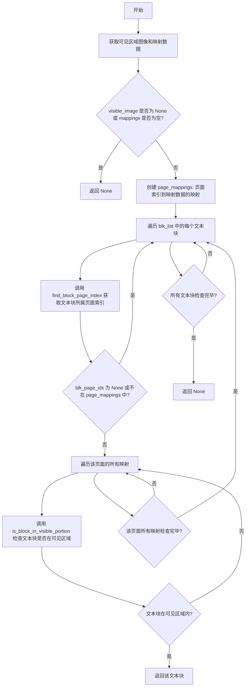
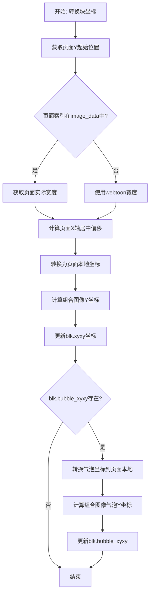
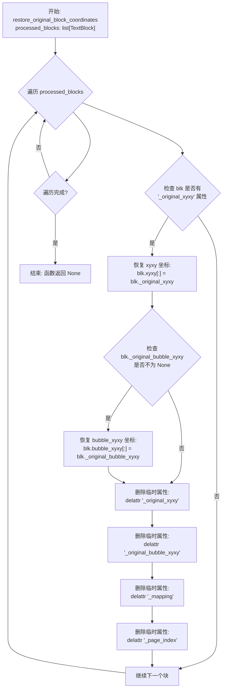
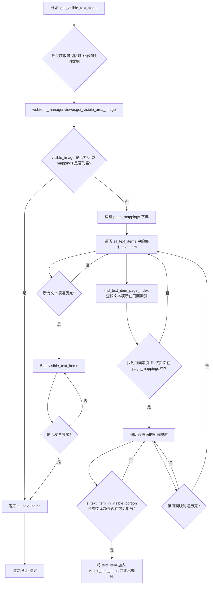

# `comic-translate\pipeline\webtoon_utils.py` 详细设计文档

该模块处理webtoon（网络漫画）模式下的文本块(TextBlock)坐标转换和可见性检测，通过识别文本块所属页面、判断其在可见区域中的位置，在webtoon场景坐标系和合并后的可见图像坐标系之间进行双向坐标转换，以支持文本编辑和选择功能。

## 整体流程

```mermaid
graph TD
    A[开始] --> B[获取TextBlock列表或选中块]
    B --> C[遍历每个文本块]
    C --> D{块是否与页面相交?}
    D -- 否 --> E[跳过该块]
    D -- 是 --> F{块是否在可见区域内?}
    F -- 否 --> E
    F -- 是 --> G[保存原始坐标到临时属性]
    G --> H[调用convert_block_to_visible_coordinates]
    H --> I[将块坐标转换为可见图像空间]
    I --> J[添加到可见块列表]
    J --> K{还有更多块?]
    K -- 是 --> C
    K -- 否 --> L[返回可见块列表]
    L --> M[用户操作完成后]
    M --> N[调用restore_original_block_coordinates]
    N --> O[恢复原始坐标并清理临时属性]
    O --> P[结束]
```

## 类结构

```
无类定义（纯函数模块）
├── 导入依赖
│   ├── logging
│   ├── typing.Optional
│   └── modules.utils.textblock.TextBlock
└── 函数集合（共11个全局函数）
    ├── 坐标查询函数
    │   ├── find_block_page_index
    │   ├── find_block_intersecting_pages
    │   └── find_text_item_page_index
    ├── 可见性判断函数
    │   ├── is_block_in_visible_portion
    │   ├── is_text_item_in_visible_portion
    │   └── get_first_visible_block
    ├── 坐标转换函数
    │   ├── convert_block_to_visible_coordinates
    │   ├── convert_bboxes_to_webtoon_coordinates
    │   └── get_visible_text_items
    ├── 过滤与处理函数
    │   └── filter_and_convert_visible_blocks
    └── 恢复函数
        └── restore_original_block_coordinates
```

## 全局变量及字段


### `logging`
    
Python标准库日志模块，用于记录程序运行日志

类型：`module`
    


### `typing`
    
Python标准库类型提示模块，提供Optional等类型注解支持

类型：`module`
    


### `TextBlock`
    
从modules.utils.textblock模块导入的文本块类，表示Webtoon中的文本区域

类型：`class`
    


### `logger`
    
模块级日志记录器，用于输出当前模块的日志信息

类型：`logging.Logger`
    


    

## 全局函数及方法


### `find_block_page_index`

根据文本块的 Y 坐标在场景空间中的位置，确定该文本块属于哪一页，并返回对应的页索引。如果文本块不在任何页面的范围内，则返回 `None`。

参数：

- `blk`：`TextBlock`，包含文本块的坐标信息（`xyxy` 属性，格式为 `[x1, y1, x2, y2]`），用于计算文本块在场景空间中的中心 Y 坐标
- `webtoon_manager`：网络漫画管理器对象，提供页面位置信息，包含 `image_positions`（各页面起始 Y 坐标列表）和 `image_heights`（各页面高度列表）属性

返回值：`Optional[int]`，返回文本块所属页面的索引（从 0 开始），若文本块未落在任何页面范围内则返回 `None`

#### 流程图

```mermaid
flowchart TD
    A[开始] --> B[计算文本块中心 Y 坐标<br/>block_center_y = (blk.xyxy[1] + blk.xyxy[3]) / 2]
    B --> C[初始化索引 i = 0]
    C --> D{遍历页面<br/>i, (page_y, page_height) from zip<br/>(webtoon_manager.image_positions,<br/>webtoon_manager.image_heights)}
    D --> E{判断条件<br/>page_y ≤ block_center_y ≤<br/>page_y + page_height}
    E -->|是| F[返回当前页面索引 i]
    E -->|否| G[i = i + 1]
    G --> D
    D -->|遍历完毕| H[返回 None]
    F --> I[结束]
    H --> I
```

#### 带注释源码

```python
def find_block_page_index(blk: TextBlock, webtoon_manager) -> Optional[int]:
    """Find which page index this block belongs to based on its coordinates."""
    
    # 计算文本块在场景空间中的中心 Y 坐标
    # blk.xyxy 格式为 [x1, y1, x2, y2]，其中 xyxy[1] 为上边界 Y，xyxy[3] 为下边界 Y
    block_center_y = (blk.xyxy[1] + blk.xyxy[3]) / 2
    
    # 遍历所有页面，找出中心 Y 坐标落在哪个页面的范围内
    # webtoon_manager.image_positions: 存储各页面起始 Y 坐标的列表
    # webtoon_manager.image_heights: 存储各页面高度的列表
    for i, (page_y, page_height) in enumerate(zip(webtoon_manager.image_positions, webtoon_manager.image_heights)):
        # 判断文本块中心是否在该页面的垂直范围内
        # 页面范围为 [page_y, page_y + page_height]
        if page_y <= block_center_y <= page_y + page_height:
            return i  # 返回找到的页面索引
    
    # 如果文本块不在任何页面范围内，返回 None
    return None
```


### `find_block_intersecting_pages`

查找给定文本块所跨越的所有页面索引。该函数通过比较文本块的垂直边界与每个页面的垂直位置，确定文本块与哪些页面存在空间交集。

参数：

- `blk`：`TextBlock`，需要检查页面交集的文本块对象，包含 `xyxy` 属性存储其边界框坐标
- `webtoon_manager`：WebtoonManager，管理网络漫画的页面信息，包含 `image_positions`（页面垂直位置列表）和 `image_heights`（页面高度列表）

返回值：`list[int]`，返回与文本块有交集的所有页面索引列表

#### 流程图

```mermaid
flowchart TD
    A[开始] --> B[初始化空列表 intersecting_pages]
    B --> C[获取块的垂直边界: blk_y1 = blk.xyxy[1], blk_y2 = blk.xyxy[3]]
    C --> D{遍历所有页面 i, page_y, page_height}
    D --> E[计算页面底部位置: page_bottom = page_y + page_height]
    E --> F{判断交集: blk_y2 > page_y 且 blk_y1 < page_bottom}
    F -->|是| G[将页面索引 i 添加到 intersecting_pages]
    F -->|否| H[跳过]
    G --> D
    H --> D
    D --> I[返回 intersecting_pages 列表]
    I --> J[结束]
```

#### 带注释源码

```python
def find_block_intersecting_pages(blk: TextBlock, webtoon_manager) -> list[int]:
    """Find all page indices that this block intersects with."""
    # 初始化一个空列表，用于存储与当前块有交集的页面索引
    intersecting_pages = []
    
    # 获取文本块在场景空间中的垂直边界
    # xyxy 格式: [x1, y1, x2, y2]，其中 y1 是顶部边界，y3 是底部边界
    blk_y1 = blk.xyxy[1]  # 块的顶部 y 坐标
    blk_y2 = blk.xyxy[3]  # 块的底部 y 坐标
    
    # 遍历所有页面，检查块是否与每个页面有交集
    # image_positions 存储每个页面的起始 y 坐标
    # image_heights 存储每个页面的高度
    for i, (page_y, page_height) in enumerate(zip(webtoon_manager.image_positions, webtoon_manager.image_heights)):
        # 计算页面的底部 y 坐标
        page_bottom = page_y + page_height
        
        # 检查块是否与当前页面有空间交集
        # 交集条件：块的底部高于页面顶部 AND 块的顶部低于页面底部
        if blk_y2 > page_y and blk_y1 < page_bottom:
            # 满足交集条件，将页面索引添加到结果列表
            intersecting_pages.append(i)
    
    # 返回所有与块有交集的页面索引
    return intersecting_pages
```


### `is_block_in_visible_portion`

检查文本块是否与页面的可见部分相交（overlap）。

参数：

- `blk`：`TextBlock`，文本块对象，包含 `xyxy` 边界框坐标
- `mapping`：`dict`，页面映射数据，包含 `page_crop_top`、`page_crop_bottom` 等裁剪和坐标映射信息
- `page_idx`：`int`，页面索引，用于定位页面在 Webtoon 场景中的位置
- `webtoon_manager`：webtoon 管理器对象，提供 `image_positions` 等页面位置信息

返回值：`bool`，如果文本块与页面的可见区域有交集则返回 `True`，否则返回 `False`

#### 流程图

```mermaid
flowchart TD
    A[开始: is_block_in_visible_portion] --> B[获取页面在场景中的Y坐标: page_y = webtoon_manager.image_positions[page_idx]]
    B --> C[计算块在页面局部坐标系中的Y坐标]
    C --> C1[blk_y1_local = blk.xyxy[1] - page_y]
    C --> C2[blk_y2_local = blk.xyxy[3] - page_y]
    C1 --> D[从mapping获取可见区域的裁剪边界]
    C2 --> D
    D --> D1[crop_top = mapping['page_crop_top']]
    D --> D2[crop_bottom = mapping['page_crop_bottom']]
    D1 --> E{检查块是否与可见区域相交}
    E -->|是| F[返回 True]
    E -->|否| G[返回 False]
```

#### 带注释源码

```python
def is_block_in_visible_portion(blk: TextBlock, mapping: dict, page_idx: int, webtoon_manager) -> bool:
    """Check if block intersects with the visible portion of the page."""
    # 获取指定页面在 Webtoon 场景中的 Y 轴起始位置
    page_y = webtoon_manager.image_positions[page_idx]
    
    # 将块在全局场景空间中的 Y 坐标转换为页面局部坐标系（相对于页面顶部）
    # blk.xyxy 格式: [x1, y1, x2, y2]，其中 y1 是顶部，y3 是底部
    blk_y1_local = blk.xyxy[1] - page_y  # 块顶边在页面局部坐标中的 Y
    blk_y2_local = blk.xyxy[3] - page_y  # 块底边在页面局部坐标中的 Y
    
    # 从 mapping 中获取该页面在组合图像中的可见区域裁剪范围
    # 这些值定义了页面局部坐标中可见区域的上下边界
    crop_top = mapping['page_crop_top']    # 可见区域顶部（页面局部坐标）
    crop_bottom = mapping['page_crop_bottom']  # 可见区域底部（页面局部坐标）
    
    # 判断块是否与可见区域有交集
    # 条件解释：
    # - blk_y2_local > crop_top：块的底部在可见区域顶部之下（块没有完全在可见区域上方）
    # - blk_y1_local < crop_bottom：块的顶部在可见区域底部之上（块没有完全在可见区域下方）
    # 两项同时满足表示块与可见区域存在垂直方向的重叠
    return blk_y2_local > crop_top and blk_y1_local < crop_bottom
```


### `get_first_visible_block`

该函数用于在 Webtoon 模式下获取第一个可见的文本块。它通过检查文本块的坐标是否与当前可见的页面区域相交来确定可见性，并返回第一个匹配的文本块。

参数：

- `blk_list`：`list[TextBlock]`，需要检查的文本块列表
- `image_viewer`：图像查看器对象，用于获取可见区域图像和 Webtoon 管理器

返回值：`Optional[TextBlock]`，第一个可见的文本块；如果没有找到可见的文本块则返回 `None`

#### 流程图



#### 带注释源码

```python
def get_first_visible_block(blk_list: list[TextBlock], image_viewer) -> Optional[TextBlock]:
    """获取 Webtoon 模式下第一个可见的文本块。
    
    参数:
        blk_list: TextBlock 对象列表,表示需要检查的文本块
        image_viewer: 图像查看器对象,包含 webtoon_manager 和获取可见区域的方法
        
    返回:
        第一个可见的 TextBlock 对象,如果没有找到则返回 None
    """
    # 获取 Webtoon 管理器
    webtoon_manager = image_viewer.webtoon_manager
    
    # 获取可见区域图像和映射数据
    # visible_image: 可见区域的图像数据
    # mappings: 包含页面裁剪信息和坐标转换信息的字典列表
    visible_image, mappings = image_viewer.get_visible_area_image()
    
    # 如果没有可见图像或映射数据,直接返回 None
    if visible_image is None or not mappings:
        return None
    
    # 创建从页面索引到映射数据的映射字典,便于快速查找
    # 结构: {page_index: [mapping1, mapping2, ...]}
    page_mappings = {}
    for mapping in mappings:
        page_idx = mapping['page_index']
        if page_idx not in page_mappings:
            page_mappings[page_idx] = []
        page_mappings[page_idx].append(mapping)
    
    # 遍历所有文本块,寻找第一个可见的文本块
    for blk in blk_list:
        # 根据文本块的坐标找到它所属的页面索引
        # 通过检查文本块中心点的 Y 坐标来确定所属页面
        blk_page_idx = find_block_page_index(blk, webtoon_manager)
        
        # 如果找不到所属页面或该页面不在可见映射中,跳过此文本块
        if blk_page_idx is None or blk_page_idx not in page_mappings:
            continue
        
        # 检查文本块是否在该页面的任何可见部分中
        for mapping in page_mappings[blk_page_idx]:
            # is_block_in_visible_portion 检查文本块是否与页面的可见区域相交
            if is_block_in_visible_portion(blk, mapping, blk_page_idx, webtoon_manager):
                return blk
    
    # 遍历完所有文本块都没有找到可见的,返回 None
    return None
```


### `convert_block_to_visible_coordinates`

该函数将文本块（TextBlock）的坐标从 Webtoon 场景空间（scene space）转换到可见图像空间（visible image space），实现多页漫画合并显示时的坐标映射，同时处理文本块及其关联气泡框的坐标转换。

参数：

- `blk`：`TextBlock`，需要转换坐标的文本块对象，包含 `xyxy`（边界框）和 `bubble_xyxy`（气泡框，可选）属性
- `mapping`：`dict`，页面裁剪映射数据，包含 `page_crop_top`（页面裁剪顶部）和 `combined_y_start`（组合图像中的起始 Y 坐标）
- `page_idx`：`int`，文本块所在页面的索引
- `webtoon_manager`：Webtoon 管理器对象，提供页面位置数据（`image_positions`）和页面图像数据（`image_data`）

返回值：`None`，函数直接修改传入的 `blk` 对象的坐标属性，不返回新对象

#### 流程图



#### 带注释源码

```
def convert_block_to_visible_coordinates(blk: TextBlock, mapping: dict, page_idx: int, webtoon_manager):
    """Convert block coordinates from webtoon scene space to visible image space."""
    # 获取指定页面的Y轴起始位置（场景坐标）
    page_y = webtoon_manager.image_positions[page_idx]
    
    # 获取页面宽度和居中偏移
    if page_idx in webtoon_manager.image_data:
        # 从实际图像数据中获取页面宽度
        page_width = webtoon_manager.image_data[page_idx].shape[1]
    else:
        # 降级使用默认webtoon宽度
        page_width = webtoon_manager.webtoon_width
    # 计算页面在webtoon画布中的水平居中偏移量
    page_x_offset = (webtoon_manager.webtoon_width - page_width) / 2
    
    # 第一步：转换坐标到页面本地坐标系（相对于页面左上角）
    # 减去页面偏移量（x方向居中偏移，y方向页面起始位置）
    x1_local = blk.xyxy[0] - page_x_offset
    y1_local = blk.xyxy[1] - page_y
    x2_local = blk.xyxy[2] - page_x_offset
    y2_local = blk.xyxy[3] - page_y
    
    # 第二步：从页面本地坐标转换到合并图像坐标
    # mapping提供了页面裁剪区域到合并图像的映射关系
    crop_top = mapping['page_crop_top']        # 页面可见区域顶部（裁剪后）
    combined_y_start = mapping['combined_y_start']  # 该页在合并图像中的起始Y
    
    # 应用裁剪偏移并加上合并图像的起始位置
    y1_combined = (y1_local - crop_top) + combined_y_start
    y2_combined = (y2_local - crop_top) + combined_y_start
    
    # 更新文本块的边界框坐标（直接修改原对象）
    # X坐标保持不变（相对页面），Y坐标转换到合并图像空间
    blk.xyxy[0] = int(max(0, x1_local))
    blk.xyxy[1] = int(max(0, y1_combined))
    blk.xyxy[2] = int(x2_local)
    blk.xyxy[3] = int(y2_combined)
    
    # 同时转换气泡框坐标（如果存在）
    if blk.bubble_xyxy is not None:
        # 同样的转换流程：场景空间 -> 页面本地 -> 合并图像空间
        bubble_x1_local = blk.bubble_xyxy[0] - page_x_offset
        bubble_y1_local = blk.bubble_xyxy[1] - page_y
        bubble_x2_local = blk.bubble_xyxy[2] - page_x_offset
        bubble_y2_local = blk.bubble_xyxy[3] - page_y
        
        # 应用相同的转换到气泡坐标
        bubble_y1_combined = (bubble_y1_local - crop_top) + combined_y_start
        bubble_y2_combined = (bubble_y2_local - crop_top) + combined_y_start
        
        # 更新气泡框坐标
        blk.bubble_xyxy[0] = int(max(0, bubble_x1_local))
        blk.bubble_xyxy[1] = int(max(0, bubble_y1_combined))
        blk.bubble_xyxy[2] = int(bubble_x2_local)
        blk.bubble_xyxy[3] = int(bubble_y2_combined)
```


### `filter_and_convert_visible_blocks`

该函数用于过滤出可见区域内的文本块，并将它们的坐标从网页漫画场景空间转换到可见图像空间。函数支持单块模式和全块模式两种处理方式。

参数：

- `main_page`：对象，主页面对象，包含 `blk_list` 和 `image_viewer` 属性
- `pipeline`：对象，处理管道，用于获取选中的块
- `mappings`：`list[dict]`，页面映射数据列表，包含每个可见页面的裁剪和位置信息
- `single_block`：`bool`，默认为 `False`，是否仅处理当前选中的单个块

返回值：`list[TextBlock]`，返回可见区域内且坐标已转换的文本块列表

#### 流程图

```mermaid
flowchart TD
    A([开始]) --> B[初始化空列表 visible_blocks]
    B --> C{single_block?}
    C -->|Yes| D[调用 pipeline.get_selected_block 获取选中块]
    D --> E{selected_block 存在?}
    E -->|No| F[返回空列表]
    E -->|Yes| G[blocks_to_check = [selected_block]]
    C -->|No| H[blocks_to_check = main_page.blk_list]
    G --> I[获取 webtoon_manager]
    H --> I
    I --> J[从 mappings 构建 page_mappings 字典<br/>键: page_index, 值: 该页的映射列表]
    J --> K[遍历 blocks_to_check 中的每个 blk]
    K --> L[调用 find_block_intersecting_pages<br/>获取块相交的所有页面索引]
    L --> M{intersecting_pages 非空?}
    M -->|No| N[继续下一个块]
    M -->|Yes| O[遍历 intersecting_pages]
    O --> P{page_idx 在 page_mappings 中?}
    P -->|No| Q[继续下一个 page_idx]
    P -->|Yes| R[遍历该 page_idx 的所有映射]
    R --> S{调用 is_block_in_visible_portion<br/>检查块是否在可见区域内?}
    S -->|No| T[继续下一个映射]
    S -->|Yes| U[保存原始坐标到临时属性<br/>_original_xyxy, _original_bubble_xyxy<br/>_mapping, _page_index]
    U --> V[调用 convert_block_to_visible_coordinates<br/>转换块坐标到可见图像空间]
    V --> W[将块添加到 visible_blocks]
    W --> X[标记 found_visible_portion = True]
    X --> Y{找到可见部分?}
    Y -->|Yes| Z[跳出循环]
    Y -->|No| N
    Z --> AA[返回 visible_blocks]
    N --> K
    K --> BB([结束])
```

#### 带注释源码

```python
def filter_and_convert_visible_blocks(main_page, pipeline, mappings: list[dict], single_block: bool = False) -> list[TextBlock]:
    """
    Filter blocks to visible area and convert their coordinates to visible image space.
    
    此函数是 Webtoon 模式下的核心函数，用于:
    1. 过滤出当前可见区域内的文本块
    2. 将文本块的坐标从场景空间转换到组合图像空间
    
    参数:
        main_page: 主页面对象，包含 blk_list 和 image_viewer
        pipeline: 处理管道，用于获取当前选中的块
        mappings: 页面映射列表，包含 page_index, page_crop_top, 
                  page_crop_bottom, combined_y_start 等信息
        single_block: 是否仅处理单个选中块
    
    返回:
        可见且坐标已转换的 TextBlock 列表
    """
    visible_blocks = []
    
    # 获取要处理的块列表
    # 根据 single_block 参数决定是处理单个选中块还是所有块
    if single_block:
        selected_block = pipeline.get_selected_block()
        if not selected_block:
            return []  # 无选中块时返回空列表
        blocks_to_check = [selected_block]
    else:
        blocks_to_check = main_page.blk_list

    # 从 image_viewer 获取 webtoon_manager
    # webtoon_manager 管理所有页面的位置、高度和图像数据
    webtoon_manager = main_page.image_viewer.webtoon_manager
    
    # 构建页面索引到映射数据的快速查找字典
    # 目的: 避免在循环中重复搜索相同的页面索引
    # 格式: {page_index: [mapping1, mapping2, ...]}
    page_mappings = {}
    for mapping in mappings:
        page_idx = mapping['page_index']
        if page_idx not in page_mappings:
            page_mappings[page_idx] = []
        page_mappings[page_idx].append(mapping)
    
    # 遍历每个待检查的块
    for blk in blocks_to_check:
        # 查找该块相交的所有页面
        # 一个块可能跨越多个页面(尤其是大块文本)
        intersecting_pages = find_block_intersecting_pages(blk, webtoon_manager)
        if not intersecting_pages:
            continue  # 块不在任何页面内，跳过
        
        # 检查块是否在可见页面部分的可见区域内
        found_visible_portion = False
        for blk_page_idx in intersecting_pages:
            if blk_page_idx not in page_mappings:
                continue
                
            # 检查该块是否在该页面的可见部分内
            # 一个页面可能有多个可见部分(分页滚动时)
            for mapping in page_mappings[blk_page_idx]:
                if is_block_in_visible_portion(blk, mapping, blk_page_idx, webtoon_manager):
                    # === 保存原始坐标 ===
                    # 在转换坐标之前保存原始场景坐标
                    # 便于后续恢复和坐标逆向转换
                    blk._original_xyxy = blk.xyxy.copy()
                    blk._original_bubble_xyxy = blk.bubble_xyxy.copy() if blk.bubble_xyxy is not None else None
                    blk._mapping = mapping
                    blk._page_index = blk_page_idx
                    
                    # === 坐标转换 ===
                    # 将块坐标从 Webtoon 场景空间转换到组合可见图像空间
                    # 转换涉及: 页面偏移、裁剪偏移、组合图像起始位置
                    convert_block_to_visible_coordinates(blk, mapping, blk_page_idx, webtoon_manager)
                    
                    # 添加到可见块列表
                    visible_blocks.append(blk)
                    found_visible_portion = True
                    break  # 已找到可见部分，无需继续检查其他映射
            
            if found_visible_portion:
                break  # 已找到可见部分，无需继续检查其他页面
    
    return visible_blocks
```


### `restore_original_block_coordinates`

恢复文本块的原始场景坐标，并清理临时添加的属性。该函数是 `filter_and_convert_visible_blocks` 的逆操作，用于在处理完可见区域的文本块后，将它们的坐标恢复到原始的 Webtoon 场景空间坐标系统。

参数：

- `processed_blocks`：`list[TextBlock]` ，需要恢复原始坐标的文本块列表，这些块在之前调用 `filter_and_convert_visible_blocks` 时被转换了坐标

返回值：`None` ，该函数直接修改传入列表中的 TextBlock 对象，不返回任何值

#### 流程图



#### 带注释源码

```python
def restore_original_block_coordinates(processed_blocks: list[TextBlock]):
    """Restore original scene coordinates to blocks and clean up temporary attributes."""
    # 遍历所有需要恢复坐标的文本块
    for blk in processed_blocks:
        # 检查该块是否保存了原始坐标信息
        # 如果没有 '_original_xyxy' 属性，说明该块不需要恢复
        if not hasattr(blk, '_original_xyxy'):
            continue
        
        # 恢复原始的场景空间坐标（xyxy）
        # 使用切片赋值 [:] 来修改原地列表，而不是替换引用
        blk.xyxy[:] = blk._original_xyxy
        
        # 如果存在气泡框（bubble）的原始坐标，也一并恢复
        if blk._original_bubble_xyxy is not None:
            blk.bubble_xyxy[:] = blk._original_bubble_xyxy
        
        # 清理临时添加的属性，释放内存
        # 这些属性是在 filter_and_convert_visible_blocks 中临时添加的
        delattr(blk, '_original_xyxy')
        delattr(blk, '_original_bubble_xyxy')
        delattr(blk, '_mapping')
        delattr(blk, '_page_index')
```


### `is_text_item_in_visible_portion`

检查文本项是否与页面的可见部分相交（重叠）。

参数：

- `text_item`：任意对象（通常为 Qt 文本项），需支持 `pos()` 方法获取位置、`boundingRect()` 方法获取边界矩形，用于获取文本项在场景空间中的坐标和尺寸
- `mapping`：`dict`，包含页面裁剪信息的字典，必须包含 `page_crop_top`（可见区域顶部裁剪值）和 `page_crop_bottom`（可见区域底部裁剪值）
- `page_idx`：`int`，页面索引，用于从 `webtoon_manager` 中获取对应页面的位置信息
- `webtoon_manager`：任意对象，漫画管理器，需包含 `image_positions` 属性（列表，存储各页面的 Y 坐标位置）

返回值：`bool`，如果文本项的垂直范围与页面的可见垂直范围有交集则返回 `True`，否则返回 `False`

#### 流程图

```mermaid
flowchart TD
    A[开始: is_text_item_in_visible_portion] --> B[获取页面Y坐标: page_y = webtoon_manager.image_positions[page_idx]]
    B --> C[获取文本项位置: item_x, item_y = text_item.pos().x, y]
    C --> D[获取文本项边界矩形: item_rect = text_item.boundingRect]
    D --> E[计算页面局部坐标: item_y1_local = item_y - page_y]
    E --> F[计算页面局部坐标: item_y2_local = item_y + item_rect.height - page_y]
    F --> G[获取可见区域裁剪值: crop_top, crop_bottom = mapping中的对应值]
    G --> H{判断重叠: item_y2_local > crop_top<br/>且 item_y1_local < crop_bottom}
    H -->|是| I[返回 True]
    H -->|否| J[返回 False]
```

#### 带注释源码

```python
def is_text_item_in_visible_portion(text_item, mapping: dict, page_idx: int, webtoon_manager) -> bool:
    """Check if text item intersects with the visible portion of the page."""
    # 根据页面索引获取该页面在场景空间中的起始 Y 坐标
    page_y = webtoon_manager.image_positions[page_idx]
    
    # 获取文本项在场景空间中的位置坐标
    # text_item.pos() 返回一个 QPoint 对象，包含 x() 和 y() 方法
    item_x = text_item.pos().x()
    item_y = text_item.pos().y()
    # 获取文本项的边界矩形，用于计算高度
    item_rect = text_item.boundingRect()
    
    # 将文本项的 Y 坐标从场景空间转换为页面局部坐标系
    # 页面局部坐标系以页面顶部为 Y=0
    item_y1_local = item_y - page_y
    item_y2_local = (item_y + item_rect.height()) - page_y
    
    # 从映射字典中获取页面的可见区域裁剪边界
    # page_crop_top: 可见区域顶部的裁剪偏移量
    # page_crop_bottom: 可见区域底部的裁剪偏移量
    crop_top = mapping['page_crop_top']
    crop_bottom = mapping['page_crop_bottom']
    
    # 判断文本项是否与可见区域有垂直方向的重叠
    # 条件解释：
    # - item_y2_local > crop_top: 文本项底部在可见区域顶部之下（即未完全在可见区域上方）
    # - item_y1_local < crop_bottom: 文本项顶部在可见区域底部之上（即未完全在可见区域下方）
    # 两条件同时满足说明文本项与可见区域有交集
    return item_y2_local > crop_top and item_y1_local < crop_bottom
```


### `find_text_item_page_index`

根据文本项的位置坐标，计算并返回该文本项所属的页面索引。函数通过获取文本项的中心Y坐标，然后遍历所有页面的位置和高度信息，确定文本项位于哪个页面中。

参数：

- `text_item`：对象，文本项对象，通常为 Qt 中的文本控件（如 `QGraphicsTextItem`），包含位置和边界矩形信息
- `webtoon_manager`：对象，Webtoon 管理器实例，提供页面位置（`image_positions`）和页面高度（`image_heights`）等属性

返回值：`Optional[int]`，返回文本项所属的页面索引（从 0 开始），如果未找到对应的页面则返回 `None`

#### 流程图

```mermaid
flowchart TD
    A[开始] --> B[获取文本项的 Y 坐标]
    B --> C[获取文本项的边界矩形]
    C --> D[计算文本项中心 Y 坐标<br/>item_center_y = item_y + item_rect.height / 2]
    D --> E{遍历页面列表<br/>for i, (page_y, page_height) in enumerate zip}
    E --> F{判断页面范围<br/>page_y <= item_center_y <= page_y + page_height}
    F -->|是| G[返回页面索引 i]
    F -->|否| H{还有更多页面?}
    H -->|是| E
    H -->|否| I[返回 None]
    G --> J[结束]
    I --> J
```

#### 带注释源码

```python
def find_text_item_page_index(text_item, webtoon_manager) -> Optional[int]:
    """Find which page index this text item belongs to based on its position."""
    # 获取文本项在场景空间中的 Y 坐标
    item_y = text_item.pos().y()
    
    # 获取文本项的边界矩形，用于计算中心点
    item_rect = text_item.boundingRect()
    
    # 计算文本项的中心 Y 坐标（场景空间）
    # 中心点 = 顶部 Y 坐标 + 高度的一半
    item_center_y = item_y + (item_rect.height() / 2)
    
    # 遍历所有页面，通过 zip 组合页面位置和高度信息
    # image_positions: 各页面在场景中的起始 Y 坐标列表
    # image_heights: 各页面的高度列表
    for i, (page_y, page_height) in enumerate(zip(webtoon_manager.image_positions, webtoon_manager.image_heights)):
        # 判断文本项的中心 Y 坐标是否在当前页面范围内
        # 页面范围: [page_y, page_y + page_height]
        if page_y <= item_center_y <= page_y + page_height:
            # 找到匹配页面，返回页面索引
            return i
    
    # 遍历完所有页面均未找到匹配，返回 None
    return None
```


### `get_visible_text_items`

该函数用于在 Webtoon 模式下筛选出当前可见区域内的文本项目，通过获取可见区域图像和映射数据，结合页面索引定位和可视区域检测，实现对文本项目的过滤，返回位于可见 portions 中的文本项列表；若处理过程中发生任何异常，则回退返回所有文本项目。

参数：

- `all_text_items`：`list`，所有待筛选的文本项列表
- `webtoon_manager`：Webtoon 管理器对象，提供页面位置、图像数据、查看器等核心管理功能

返回值：`list`，当前可见的文本项列表

#### 流程图



#### 带注释源码

```python
def get_visible_text_items(all_text_items: list, webtoon_manager) -> list:
    """Get text items that are currently visible in webtoon mode."""
    try:
        # Step 1: 获取当前可见区域图像和映射数据
        # 调用 webtoon 管理器的 viewer 对象获取可见区域图像和页面映射信息
        visible_image, mappings = webtoon_manager.viewer.get_visible_area_image()
        
        # Step 2: 边界检查 - 如果没有可见图像或映射为空，直接返回所有文本项
        if visible_image is None or not mappings:
            return all_text_items
        
        # Step 3: 构建页面索引到映射数据的快速查找字典
        # 将 mappings 列表转换为以 page_index 为键的字典结构，便于后续快速定位
        page_mappings = {}
        for mapping in mappings:
            page_idx = mapping['page_index']
            if page_idx not in page_mappings:
                page_mappings[page_idx] = []
            page_mappings[page_idx].append(mapping)
        
        # Step 4: 遍历所有文本项，筛选出位于可见区域的项
        visible_text_items = []
        for text_item in all_text_items:
            # Step 4.1: 根据文本项的位置坐标找到其所属的页面索引
            # 调用辅助函数基于文本项中心点 y 坐标确定所在页面
            item_page_idx = find_text_item_page_index(text_item, webtoon_manager)
            
            # Step 4.2: 如果未找到页面索引或该页面不在可见映射中，跳过该文本项
            if item_page_idx is None or item_page_idx not in page_mappings:
                continue
            
            # Step 4.3: 检查文本项是否在可见页面portion中
            # 遍历该页面的所有映射（一个页面可能有多个可见portion）
            for mapping in page_mappings[item_page_idx]:
                if is_text_item_in_visible_portion(text_item, mapping, item_page_idx, webtoon_manager):
                    # 找到可见位置，将文本项添加到结果列表并跳出该页面的映射循环
                    visible_text_items.append(text_item)
                    break
        
        # Step 5: 返回可见文本项列表
        return visible_text_items
        
    except Exception:
        # 异常处理: 如果 Webtoon 处理过程中发生任何错误，回退返回所有文本项
        # 确保功能降级而非崩溃，提升系统健壮性
        return all_text_items
```


### `convert_bboxes_to_webtoon_coordinates`

该函数负责将bounding box坐标从可见图像空间（combined image space）转换回Webtoon场景空间（scene space），实现坐标系的逆向映射，以便在原始Webtoon场景中正确定位文本块或检测框。

参数：

- `bboxes`：`list`，待转换的边界框列表，每个边界框为 `[x1, y1, x2, y2]` 格式的坐标列表
- `mapping`：`dict`，页面映射数据，包含 `page_crop_top`（页面裁剪顶部）和 `combined_y_start`（组合图像起始Y坐标）
- `page_idx`：`int`，目标页面的索引，用于获取页面在Webtoon场景中的位置信息
- `webtoon_manager`：`object`，Webtoon管理器对象，提供页面位置、图像数据、宽度等全局信息

返回值：`list`，转换后的边界框列表，坐标已从可见图像空间映射回Webtoon场景空间

#### 流程图

```mermaid
flowchart TD
    A[开始: convert_bboxes_to_webtoon_coordinates] --> B{检查 bboxes 是否为空}
    B -->|是| C[直接返回空列表 bboxes]
    B -->|否| D[获取页面在场景中的 Y 坐标: page_y = webtoon_manager.image_positions[page_idx]]
    D --> E{检查页面索引是否在 image_data 中}
    E -->|是| F[获取实际页面宽度: page_width = webtoon_manager.image_data[page_idx].shape[1]]
    E -->|否| G[使用 Webtoon 宽度: page_width = webtoon_manager.webtoon_width]
    F --> H[计算页面水平居中偏移: page_x_offset = (webtoon_width - page_width) / 2]
    G --> H
    H --> I[提取映射参数: crop_top, combined_y_start]
    I --> J[遍历每个 bbox]
    J --> K[计算页面相对坐标: y1_relative = bbox[1] - combined_y_start]
    K --> L[计算页面局部坐标: y1_local = y1_relative + crop_top]
    L --> M[计算场景坐标: y1_scene = y1_local + page_y]
    M --> N[添加水平偏移: x1_scene = x1_local + page_x_offset]
    N --> O[将转换后的坐标添加到 converted_bboxes]
    O --> P{是否还有更多 bbox}
    P -->|是| J
    P -->|否| Q[返回转换后的边界框列表]
```

#### 带注释源码

```python
def convert_bboxes_to_webtoon_coordinates(bboxes: list, mapping: dict, page_idx: int, webtoon_manager) -> list:
    """Convert bounding boxes from visible image space back to webtoon scene space."""
    # 如果输入为空列表，直接返回空列表，避免无效处理
    if not bboxes:
        return bboxes
    
    # 获取目标页面在Webtoon场景空间中的Y坐标起始位置
    # Webtoon由多个页面垂直拼接，image_positions存储各页面的起始Y坐标
    page_y = webtoon_manager.image_positions[page_idx]
    
    # 获取页面宽度用于计算水平居中偏移
    if page_idx in webtoon_manager.image_data:
        # 从实际图像数据中获取页面宽度（高度优先）
        page_width = webtoon_manager.image_data[page_idx].shape[1]
    else:
        # 如果页面图像数据不可用，使用Webtoon默认宽度
        page_width = webtoon_manager.webtoon_width
    
    # 计算页面水平居中偏移量
    # Webtoon模式下页面可能比画布窄，需要居中显示
    page_x_offset = (webtoon_manager.webtoon_width - page_width) / 2
    
    # 从映射字典中提取坐标转换所需的参数
    # page_crop_top: 页面可见区域的顶部裁剪偏移（相对于页面本地坐标）
    # combined_y_start: 该页面在组合可见图像中的起始Y坐标
    crop_top = mapping['page_crop_top']
    combined_y_start = mapping['combined_y_start']
    
    # 用于存储转换后的边界框结果
    converted_bboxes = []
    
    # 遍历每个待转换的边界框
    for bbox in bboxes:
        # ===== 步骤1: 从组合可见图像坐标转换为页面相对坐标 =====
        # X坐标在页面间保持不变（因为是水平拼接）
        x1_page_relative = bbox[0]
        y1_page_relative = bbox[1] - combined_y_start  # 减去组合图像起始位置
        x2_page_relative = bbox[2]
        y2_page_relative = bbox[3] - combined_y_start
        
        # ===== 步骤2: 从页面相对坐标转换为页面局部坐标 =====
        # 加上裁剪偏移量，还原到完整页面坐标系
        x1_local = x1_page_relative
        y1_local = y1_page_relative + crop_top  # 加回裁剪偏移
        x2_local = x2_page_relative
        y2_local = y2_page_relative + crop_top
        
        # ===== 步骤3: 从页面局部坐标转换为Webtoon场景坐标 =====
        # 加上页面在Webtoon中的位置偏移和水平居中偏移
        x1_scene = x1_local + page_x_offset
        y1_scene = y1_local + page_y  # 加上页面在场景中的起始Y坐标
        x2_scene = x2_local + page_x_offset
        y2_scene = y2_local + page_y
        
        # 将转换后的场景坐标添加到结果列表
        converted_bboxes.append([x1_scene, y1_scene, x2_scene, y2_scene])
    
    # 返回转换后的边界框列表（已从可见图像空间映射回Webtoon场景空间）
    return converted_bboxes
```

## 关键组件


### 页面索引查找与坐标映射系统

负责根据文本块的坐标找到其所属的页面索引，包含 find_block_page_index（通过中心点坐标定位页面）和 find_block_page_index（通过文本项位置定位页面）两个核心函数。

### 可见性判断系统

判断文本块或文本项是否位于页面可见区域内的逻辑，包括 is_block_in_visible_portion 和 is_text_item_in_visible_portion，通过比较块坐标与页面裁剪边界来确定可见性。

### 跨页块处理系统

处理跨越多个页面的文本块的函数 find_block_intersecting_pages，能够识别与多个页面相交的情况，确保跨页文本块能被正确处理。

### 坐标系转换引擎

实现Webtoon场景坐标与可见图像空间坐标双向转换的函数集，包括 convert_block_to_visible_coordinates（场景坐标→可见图像坐标）和 convert_bboxes_to_webtoon_coordinates（可见图像坐标→场景坐标），处理页面居中偏移和裁剪映射。

### 可见块过滤与恢复系统

filter_and_convert_visible_blocks 负责过滤出可见的文本块并转换其坐标，restore_original_block_coordinates 用于处理完成后恢复原始坐标并清理临时属性，确保不破坏原始数据。

### 可见文本项获取系统

get_visible_text_items 和 get_first_visible_block 分别用于获取当前视口中所有可见的文本项和第一个可见的文本块，提供Webtoon模式下文本项的实时可见性检测。

### 页面布局信息管理

通过 webtoon_manager 的 image_positions、image_heights、image_data 等属性管理各页面的位置、高度和图像数据，为坐标计算提供基础数据支撑。


## 问题及建议


### 已知问题

-   **代码重复**：多处存在重复的逻辑模式，如`find_block_page_index`与`find_text_item_page_index`、`is_block_in_visible_portion`与`is_text_item_in_visible_portion`功能高度相似，应抽取通用函数
-   **可变对象直接修改**：直接修改`blk.xyxy`和`blk.bubble_xyxy`原数组，可能导致调用方数据被意外污染，后续需通过`restore_original_block_coordinates`手动恢复
-   **临时属性滥用**：使用`blk._original_xyxy`、`blk._mapping`等下划线开头的私有属性存储状态，违反了Python封装约定，容易与其他代码产生属性冲突
-   **异常处理不当**：`get_visible_text_items`中捕获所有异常后返回全部文本_items，掩盖了真实错误，降低了代码的可调试性
-   **缺少输入校验**：多个函数未对`webtoon_manager`、`blk`、`mapping`等关键参数进行None或类型校验，可能引发隐藏的运行时错误
-   **浮点数边界处理**：使用`<=`比较浮点数坐标（如`page_y <= block_center_y <= page_y + page_height`），可能导致边界情况下的不确定行为
-   **重复构建映射字典**：`page_mappings`字典在多个函数中被重复构建，应考虑缓存或传入参数

### 优化建议

-   **抽取通用逻辑**：将`find_page_index`、`is_in_visible_portion`、`build_page_mappings`等通用逻辑抽取为独立函数或封装到工具类中
-   **采用不可变操作**：将`convert_block_to_visible_coordinates`改为返回新的坐标对象而非直接修改原对象，或使用深拷贝避免副作用
-   **设计状态管理方案**：使用上下文管理器或装饰器处理坐标的临时转换和恢复，或在TextBlock类中设计专用的状态栈
-   **细化异常处理**：根据具体错误类型进行分层捕获，优先记录日志而非静默返回默认值
-   **增加防御性校验**：在函数入口处添加参数类型检查和必需属性验证，提供明确的错误信息
-   **考虑性能优化**：对于频繁调用的函数，可引入缓存机制或使用lru_cache装饰器存储映射结果

## 其它


### 设计目标与约束

本模块主要用于Webtoon（网络漫画）模式下文本块的坐标转换和可见性处理。核心目标是将Webtoon场景空间中的文本块坐标转换为合并后的可见图像空间坐标，以便正确显示和交互。主要约束包括：依赖`webtoon_manager`对象必须包含`image_positions`、`image_heights`、`image_data`、`webtoon_width`等属性；坐标转换过程中不能修改原始块对象的引用关系；需要支持单个块和批量块的处理模式。

### 错误处理与异常设计

代码采用了防御性编程风格。主要错误处理策略包括：1）`get_visible_text_items`函数使用try-except捕获所有异常并回退到返回所有文本项；2）坐标转换时对索引访问进行边界检查；3）使用`hasattr`检查对象属性是否存在。当前存在的问题：异常捕获过于宽泛（`except Exception`），可能掩盖真实错误；部分函数缺少参数有效性验证。

### 数据流与状态机

数据流主要分为三个阶段：第一阶段是可见性判断，通过`find_block_page_index`或`find_text_item_page_index`确定文本元素所属页面；第二阶段是可见区域检测，使用`is_block_in_visible_portion`或`is_text_item_in_visible_portion`判断是否与可见区域重叠；第三阶段是坐标转换，通过`convert_block_to_visible_coordinates`将场景坐标转换为合并图像坐标。处理完成后可调用`restore_original_block_coordinates`恢复原始坐标。

### 外部依赖与接口契约

本模块依赖以下外部组件：1）`TextBlock`类（来自modules.utils.textblock），需具备`xyxy`和`bubble_xyxy`属性；2）`webtoon_manager`对象，需包含`image_positions`（页面Y坐标列表）、`image_heights`（页面高度列表）、`image_data`（页面图像字典）、`webtoon_width`（画布宽度）、`viewer`（图像查看器）等属性；3）`image_viewer`对象，需提供`get_visible_area_image()`方法和`webtoon_manager`属性；4）`pipeline`对象，需提供`get_selected_block()`方法。

### 坐标系统与空间转换

代码涉及三种坐标系统的转换：1）Webtoon场景坐标（原始坐标，blk.xyxy）；2）页面局部坐标（减去页面偏移和居中偏移）；3）合并图像坐标（可见图像空间坐标）。转换过程中需要考虑页面裁剪（crop_top/crop_bottom）和合并起始位置（combined_y_start）的偏移补偿。x坐标需要处理页面居中带来的x_offset偏移。

### 边界条件与特殊情况处理

代码处理了多种边界情况：1）文本块跨越多个页面时，使用`find_block_intersecting_pages`查找所有相交页面；2）坐标可能为负值，使用`max(0, ...)`确保非负；3）`bubble_xyxy`可能为None，需要进行None检查；4）当`image_data`中不存在页面索引时，使用`webtoon_width`作为默认值。

### 性能考量与优化建议

当前实现存在以下性能瓶颈：1）`get_first_visible_block`和`filter_and_convert_visible_blocks`中存在重复的页面映射构建逻辑；2）遍历所有块检查可见性的时间复杂度为O(n*m)，其中n为块数量，m为页面数量；3）频繁的列表拷贝和属性访问。优化建议：将页面映射构建提取为独立函数；考虑使用空间索引结构加速可见性判断；对于频繁访问的属性考虑缓存。

### 模块职责边界

本模块定位为Webtoon坐标转换工具模块，不负责：1）TextBlock对象的创建和销毁；2）图像的加载和渲染；3）用户交互处理；4）页面数据的持久化。模块仅提供纯函数式的坐标转换和可见性判断功能，与主业务逻辑通过`main_page`、`pipeline`、`image_viewer`等对象进行协作。

### 潜在改进方向

1）可考虑使用数据类或命名元组替代字典存储mapping数据，提高类型安全性；2）坐标转换逻辑可提取为TextBlock类的方法，实现更好的封装；3）可添加日志记录便于调试；4）全局函数可考虑封装为WebtoonCoordinateHandler类，统一管理状态；5）常量如裁剪边界值可提取为配置常量。

    