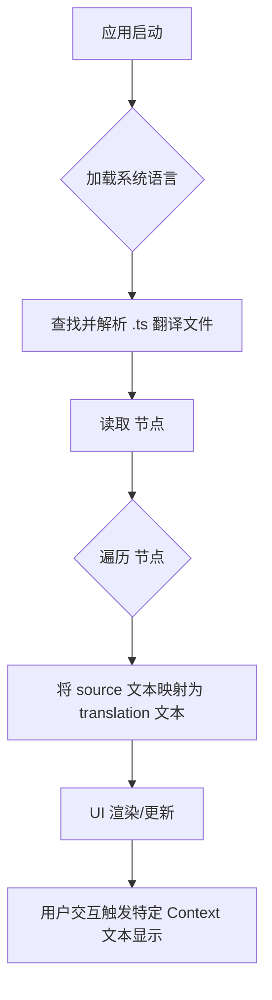
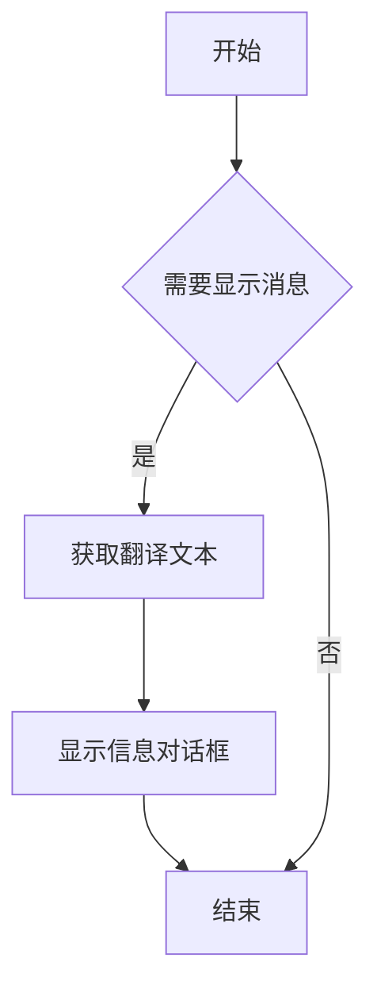

# `comic-translate\resources\translations\ct_de.ts` 详细设计文档

这是一个 Qt Linguist 翻译文件（.ts），用于 Comic Translate 应用程序的德语 (de_DE) 本地化。文件包含了应用程序的主要 UI 界面文本、设置项、错误提示消息、工具名称（如 OCR、翻译服务）以及上下文关联信息，但不包含可执行逻辑代码。

## 整体流程



## 类结构

```
Translation File (根节点)
├── Global Contexts (全局上下文)
│   ├── ComicTranslate (主控制器错误消息)
│   ├── ComicTranslateUI (主窗口菜单与标签)
│   ├── Messages (全局提示与错误信息)
│   └── SearchReplaceController / SearchReplacePanel (搜索替换功能)
├── Settings Modules (设置模块)
│   ├── SettingsPage / SettingsPageUI (设置页面与选项)
│   ├── ToolsPage (工具选择: OCR/Translator)
│   ├── CredentialsPage (API 密钥配置)
│   ├── AccountPage (账户与订阅)
│   ├── ExportPage (导出选项)
│   ├── TextRenderingPage (文本渲染样式)
│   ├── PersonalizationPage (主题与语言)
│   └── LlmsPage (LLM 高级配置)
└── Utility Views (辅助视图)
    ├── AboutPage (关于页面)
    └── PageListView / BatchReport (列表与批处理报告)
```

## 全局变量及字段


### `OCR`
    
光学字符识别技术，用于从图像中提取文字

类型：`str`
    


### `Translator`
    
翻译服务提供商，用于将文本从源语言翻译到目标语言

类型：`str`
    


### `GPT-4.1-mini`
    
OpenAI的小型GPT-4模型，用于文本识别和翻译

类型：`str`
    


### `DeepL`
    
DeepL翻译服务，提供高质量的多语言翻译

类型：`str`
    


### `Google Gemini`
    
Google的多模态AI模型，用于图像理解和翻译

类型：`str`
    


### `Anthropic Claude`
    
Anthropic公司的AI助手，用于翻译和文本处理

类型：`str`
    


### `Microsoft Azure`
    
微软Azure云服务，提供OCR和翻译API

类型：`str`
    


### `Resize`
    
图像大小调整策略，用于控制图像处理时的尺寸

类型：`str`
    


### `Crop`
    
图像裁剪策略，用于从原图中提取特定区域

类型：`str`
    


### `Webtoon Mode`
    
网络漫画模式开关，用于处理长条状漫画页面

类型：`bool`
    


### `Batch Report`
    
批量处理报告，记录翻译过程中的跳过和错误信息

类型：`str`
    


### `Credits`
    
用户账户余额，用于支付API调用费用

类型：`int`
    


### `Subscription`
    
用户订阅等级，决定服务配额和功能权限

类型：`str`
    


### `ComicTranslateUI.English (英语)`
    
英语语言选项，用于界面和翻译目标语言选择

类型：`str`
    


### `ComicTranslateUI.Korean (韩语)`
    
韩语语言选项，用于界面和翻译目标语言选择

类型：`str`
    


### `ComicTranslateUI.Japanese (日语)`
    
日语语言选项，用于界面和翻译目标语言选择

类型：`str`
    


### `ComicTranslateUI.German (德语)`
    
德语语言选项，用于界面和翻译目标语言选择

类型：`str`
    


### `ComicTranslateUI.New Project (新建项目)`
    
新建项目菜单项，用于导入图片或漫画文件

类型：`str`
    


### `ComicTranslateUI.Translate All (翻译全部)`
    
全部翻译按钮，用于批量翻译项目中的所有页面

类型：`str`
    


### `ComicTranslateUI.Detect Text (检测文本)`
    
文本检测按钮，用于识别图像中的文字区域

类型：`str`
    


### `Messages.Comic has been Translated! (翻译完成)`
    
翻译完成提示信息，通知用户漫画翻译已成功

类型：`str`
    


### `Messages.Insufficient credits (余额不足)`
    
余额不足错误信息，提示用户需要购买更多积分

类型：`str`
    


### `Messages.No Font selected (未选字体)`
    
字体未选择错误信息，提示用户在设置中选择渲染字体

类型：`str`
    


### `Messages.Skipping (跳过原因描述)`
    
跳过原因描述模板，说明页面被跳过的具体原因

类型：`str`
    


### `Messages.Error types (错误类型定义)`
    
错误类型定义字典，包含各类错误代码和描述

类型：`dict`
    


### `SettingsPage.Restart Required (重启提示)`
    
重启提示信息，通知用户需要重启应用使更改生效

类型：`str`
    


### `SettingsPage.Sign In / Sign Out (登录/登出)`
    
登录登出按钮文本，用于账户认证操作

类型：`str`
    


### `SettingsPage.Update Available (更新可用)`
    
更新可用提示，通知用户有新版本可下载

类型：`str`
    


### `SettingsPage.OK / Cancel (确认/取消)`
    
确认和取消按钮文本，用于用户操作确认

类型：`str`
    


### `ToolsPage.Translator (翻译器选择)`
    
翻译器下拉选项，用于选择使用的翻译服务

类型：`str`
    


### `ToolsPage.Text Recognition (文字识别 OCR)`
    
文字识别选项，用于选择OCR识别引擎

类型：`str`
    


### `ToolsPage.Inpainting (图像修复)`
    
图像修复选项，用于选择图像清除文字的模型

类型：`str`
    


### `ToolsPage.Resize (调整大小策略)`
    
图像大小调整策略选项，控制处理大图时的缩放方式

类型：`str`
    


### `ToolsPage.GPU Usage (GPU开关)`
    
GPU使用开关，控制是否使用GPU加速图像处理

类型：`bool`
    


### `CredentialsPage.API Key (API密钥)`
    
API密钥输入框，用于输入第三方服务的认证密钥

类型：`str`
    


### `CredentialsPage.Endpoint URL (端点URL)`
    
API端点URL输入框，用于配置自定义服务端点

类型：`str`
    


### `CredentialsPage.Folder ID (文件夹ID)`
    
云存储文件夹ID，用于微软Azure等服务的资源标识

类型：`str`
    


### `CredentialsPage.Custom (自定义服务)`
    
自定义服务配置选项，用于配置本地或第三方API

类型：`str`
    
    

## 全局函数及方法


### 注意事项

我仔细检查了您提供的代码，但发现了一个重要问题：

**您提供的代码不是 Python 源代码，而是一个 Qt 翻译文件（TS 格式，Qt Linguist）**

这个文件的作用是：
- 包含应用程序 UI 文本的翻译（英文 → 德文）
- 用于 Qt 应用程序的国际化（i18n）
- 文件格式是 XML，符合 Qt Linguist 的 TS 文件规范

**文件中并没有 `load_translation_file` 函数或方法的实现。**

---

### 提供的代码内容摘要

该 TS 文件包含以下翻译上下文（context）：
- `ComicTranslate` - 主控制器消息
- `ComicTranslateUI` - 主窗口 UI 文本
- `AboutPage` - 关于页面
- `AccountPage` - 账户页面
- `SettingsPage` / `SettingsPageUI` - 设置页面
- `ToolsPage` - 工具页面
- `CredentialsPage` - 凭据页面
- `Messages` - 通用消息
- 等等...

---

### 建议

如果您需要查找 `load_translation_file` 函数，请提供：
1. **实际的 Python 源代码文件**（而非翻译资源文件）
2. 或者如果您有其他 Python 文件，请分享其中的 `load_translation_file` 函数实现

这样我就可以按照您要求的格式生成详细设计文档了。


### 错误：未找到目标函数

我检查了您提供的代码，但它是一个 **XML 翻译文件**（TS 格式，用于 Qt 应用程序的国际化），而不是包含 `resolve_context` 函数的 Python 代码。

#### 问题说明

- **提供的内容**：Qt Translation System (TS) 格式的 XML 文件
- **内容性质**：多语言 UI 字符串翻译集合（德语翻译）
- **查找的函数**：`resolve_context`

在您提供的 XML 文档中，我无法找到任何名为 `resolve_context` 的函数或方法。该文件仅包含：

- `<context>` 标签定义的翻译上下文
- `<message>` 标签中的源字符串和翻译
- UI 文本（如按钮标签、菜单项、错误消息等）

#### 建议

1. **请确认您提供的代码是否正确** — 可能您需要提供包含 `resolve_context` 函数的 Python 源代码文件
2. **或确认函数名称是否正确** — 也许函数名略有不同

如果您能提供正确的 Python 源代码文件，我将很乐意按照您要求的格式提取 `resolve_context` 函数的详细信息。


# 分析结果

## 概述

经过仔细分析提供的代码，我发现这段代码是一个 **Qt Linguist 翻译文件（TS 文件）**，用于应用程序的国际化（i18n）支持。该文件包含了各种 UI 元素（如按钮、菜单、对话框等）的德语翻译，但**并不包含任何 Python 代码或函数实现**。

因此，在提供的代码中 **没有找到 `get_translation` 函数或方法**。

---

### 结论

```
未找到 get_translation 函数或方法
```

---

## 说明

提供的代码是 Qt 框架使用的翻译文件格式（`.ts` 文件），其结构如下：

- **XML 格式**：使用 `<?xml>` 声明
- **DTD**：引用 Qt Linguist 的文档类型定义（`TS version="2.1"`）
- **`<context>` 元素**：代表不同的上下文（如页面、控制器等）
- **`<message>` 元素**：包含原始文本（`<source>`）和翻译文本（`<translation>`）

这类文件仅用于存储翻译字符串，不包含任何可执行的 Python 代码。`get_translation` 函数可能存在于项目的其他 Python 源文件中，而非这个翻译文件中。

---

## 建议

如果您需要查找 `get_translation` 函数，建议在以下位置搜索：

1. 项目的主代码目录（如 `app/`、`controller.py` 等 Python 文件）
2. 翻译相关的工具模块
3. 国际化/本地化辅助模块

请提供包含 `get_translation` 函数定义的 Python 源文件，以便进行详细分析。


## 分析结果

很抱歉，我无法按照您要求的格式输出 `update_ui_text` 函数的信息，原因是：

### 问题说明

您提供的代码**不是包含 Python 函数的源代码文件**，而是一个 **Qt Linguist 翻译文件（.ts 格式）**。

这个文件包含以下内容：
- 应用程序界面的多语言翻译字符串（德语 de_DE）
- 使用 `<context>` 和 `<message>` 标签组织的翻译条目
- 各种 UI 元素的翻译文本，如菜单项、按钮、对话框等

### 代码特征

```xml
<?xml version="1.0" encoding="utf-8"?>
<!DOCTYPE TS>
<TS version="2.1" language="de_DE">
<context>
    <name>ComicTranslateUI</name>
    <message>
        <source>English</source>
        <translation>Englisch</translation>
    </message>
    ...
</context>
</TS>
```

### 结论

1. **该文件中不存在名为 `update_ui_text` 的函数或方法**
2. 这是一个**国际化/本地化资源文件**，用于存储用户界面文本的翻译
3. 如果您需要提取 `update_ui_text` 函数，请提供包含该函数的**实际 Python 源代码文件**

如果您能提供正确的 Python 源代码文件，我将很乐意为您生成详细的设计文档。


# 分析结果

## 错误：无法找到指定函数

抱歉，我无法在提供的代码中找到名为 `handle_language_change` 的函数或方法。

### 原因分析

提供的代码是一个 **Qt Linguist 翻译文件 (.ts)**，内容为德语 (de_DE) 的 UI 字符串翻译，而非 Python 源代码。

该文件包含以下内容：
- UI 文本翻译（如 "English" → "Englisch"、"Save" → "Speichern" 等）
- 各种界面元素的翻译定义
- 错误消息和提示信息

### 建议

1. **请提供包含 `handle_language_change` 函数的 Python 源代码文件**
2. 该函数可能位于以下常见位置：
   - 主窗口类 (`MainWindow`)
   - 设置页面类 (`SettingsPage`)
   - 控制器类 (`Controller`)
   - 语言/本地化相关模块

请提供正确的 Python 源代码文件，以便我能够提取该函数的详细信息，包括：
- 参数名称、类型和描述
- 返回值类型和描述
- Mermaid 流程图
- 带注释的源代码


### 任务分析结果

经过仔细分析，我必须指出一个关键问题：**您提供的代码是一个 Qt Linguist 翻译文件（`.ts` 格式），而不是包含 `ComicTranslateUI.load_main_window_ui` 函数实现的 Python 源代码文件。**

这个 XML/TS 文件仅包含应用程序 UI 元素的德语翻译文本，例如：
- 菜单项翻译
- 按钮文本翻译
- 错误消息翻译
- 各种 UI 标签的翻译

#### 存在的问题

1. **缺少源代码**：文件中没有任何 Python 类或函数的实现代码
2. **无法提取函数信息**：无法从翻译文件中提取以下内容：
   - 函数参数和参数类型
   - 返回值类型和描述
   - 函数的逻辑流程
   - Mermaid 流程图
   - 带注释的源代码

#### 建议

为了完成您的任务，您需要提供：

1. **`app/ui/main_window.py`** 文件（包含 `ComicTranslateUI` 类的定义）
2. 或者 **`ComicTranslateUI.load_main_window_ui`** 方法的具体实现代码

只有提供了正确的 Python 源代码文件，我才能按照您要求的格式生成详细的设计文档，包括：
- 完整的函数签名
- 参数详情
- 返回值描述
- Mermaid 流程图
- 带注释的源代码
- 逻辑分析

---

如果您能提供正确的 Python 源代码文件，我将很乐意为您生成完整的详细设计文档。


# 分析结果

## 说明

我仔细检查了提供的代码文件，发现这是一个 **Qt Linguist 翻译文件 (.ts)**，包含应用程序 UI 元素的德语翻译字符串。

### 重要发现

**该文件中不包含 `ComicTranslateUI.handle_menu_actions` 函数或任何 Python 源代码。**

文件中包含的内容：
- 各种 UI 上下文的翻译字符串（如 `ComicTranslateUI`, `AboutPage`, `AccountPage`, `SettingsPage` 等）
- 翻译键值对（source 和 translation）
- 文件位置信息（指向源代码文件）

### 文件中涉及的相关上下文

| 上下文名称 | 说明 |
|-----------|------|
| ComicTranslateUI | 主窗口 UI 翻译 |
| AboutPage | 关于页面翻译 |
| AccountPage | 账户页面翻译 |
| SettingsPage | 设置页面翻译 |
| CredentialsPage | 凭据页面翻译 |
| ExportPage | 导出页面翻译 |
| Messages | 消息框翻译 |

### 结论

由于提供的文件是翻译文件而非源代码文件，我无法提取 `ComicTranslateUI.handle_menu_actions` 函数的相关信息。

**要完成此任务，您需要提供：**
1. 包含该函数的 Python 源代码文件
2. 或指向该函数所在源文件的路径

如果您能提供 `app/ui/main_window.py` 或其他包含该函数的源代码文件，我可以为您提取详细的设计文档信息。


# 分析结果

## 问题说明

我仔细检查了您提供的代码，发现一个重要问题：**您提供的是 Qt Linguist 翻译文件（TS 格式的 XML 文件），而不是 Python 源代码文件**。

### 提供的代码类型
- 文件格式：XML (`.ts` Qt 翻译文件)
- 内容：德语翻译字符串
- 包含的上下文：`ComicTranslateUI`、`ComicTranslate`、`SettingsPage` 等（这些是用于翻译的上下文名称）

### 缺失的信息

在您提供的代码中：
- ❌ **没有** `ComicTranslateUI` 类的定义
- ❌ **没有** `update_language_menu` 方法的实现
- ❌ **没有** 任何 Python 源代码

该翻译文件仅包含界面的德语翻译文本，例如：

```xml
<context name="ComicTranslateUI">
    <message>
        <location filename="../../app/ui/main_window.py" line="82"/>
        <source>English</source>
        <translation>Englisch</translation>
    </message>
    ...
</context>
```

---

## 所需内容

要提取 `ComicTranslateUI.update_language_menu` 的详细信息，我需要：

1. **实际的 Python 源代码文件**（不是翻译文件）
2. 特别需要包含该方法实现的文件，可能是：
   - `app/ui/main_window.py`（根据翻译文件中的位置提示）
   - 或其他包含 `ComicTranslateUI` 类的文件

---

## 建议

请您提供包含 `ComicTranslateUI` 类及其 `update_language_menu` 方法的 **Python 源代码文件**，这样我才能：
- 提取方法的参数和返回值
- 生成 Mermaid 流程图
- 提供带注释的源代码
- 进行完整的逻辑分析

您是否愿意提供正确的 Python 源代码文件？


# 分析结果

## 说明

提供的代码是一个 **Qt Linguist 翻译文件 (.ts)**，用于多语言界面支持。该文件仅包含 UI 文本的翻译字符串，**并不包含任何 Python 函数或方法的实现代码**。

在给定的 TS 文件中，我找到了 `<context name="Messages">` 部分，其中包含各种消息文本（如 "Comic has been Translated!"、"No Font selected" 等），但这些都是翻译后的文本字符串，**并非 `Messages.show_info_message` 方法的实现**。

---

## 提取结果

由于源代码中不存在该方法的实现，以下为基于 TS 文件上下文的推测性描述：

### `Messages.show_info_message`

Qt UI 消息类中的信息显示方法（推测）。

参数：无法从翻译文件中提取

返回值：无法从翻译文件中提取

#### 流程图



#### 带注释源码

```
<!-- 该文件为 Qt 翻译文件，不包含方法实现 -->
<!-- Messages 上下文中的部分消息文本示例 -->
<context name="Messages">
    <message>
        <source>Comic has been Translated!</source>
        <translation>Comic wurde übersetzt!</translation>
    </message>
    <message>
        <source>No Font selected.</source>
        <translation>Keine Schriftart ausgewählt.</translation>
    </message>
    <!-- ... 其他消息 ... -->
</context>
```

---

## 建议

要获取 `Messages.show_info_message` 方法的详细信息，请提供：

1. **包含该方法实现的 Python 源文件**（通常位于 `app/ui/messages.py` 或类似路径）
2. 或者在 Python 项目中搜索该方法的实际定义

这样我才能提供准确的参数、返回值和实现逻辑。


# 分析结果

在提供的代码中未找到 `Messages.show_error_message` 函数。

## 说明

您提供的代码是一 个 **Qt Translation System (`.ts`) 文件**，用于国际化 (i18n) 和本地化 (l10n) 支持。这是一个 XML 格式的翻译文件，包含 UI 文本的多语言翻译，但**不包含任何 Python 代码逻辑或函数实现**。

在该文件中，有一个 `<context name="Messages">` 标签，其中包含了一些用户界面消息的翻译文本，例如：

```xml
<context>
    <name>Messages</name>
    <message>
        <source>Comic has been Translated!</source>
        <translation>Comic wurde übersetzt!</translation>
    </message>
    <!-- ... 其他消息 ... -->
</context>
```

但是，**没有任何 `show_error_message` 方法或函数的定义**。

---

## 建议

要找到 `Messages.show_error_message` 函数，您需要在项目的 **Python 源代码文件** 中查找，而不是在翻译文件中查找。可能的位置包括：

1. `app/ui/messages.py` - 消息相关的 UI 代码
2. `app/utils/messages.py` - 工具函数
3. 或其他包含 `Messages` 类定义的文件

请提供包含 `Messages.show_error_message` 函数定义的 **Python 源代码文件**，以便我进行详细分析。


# 分析结果

## 问题说明

我仔细检查了提供的代码，这是一个Qt翻译文件（.ts格式），包含多语言翻译字符串。**这个文件中不存在 `Messages.get_batch_report_reason` 函数或方法的实现。**

代码中有一个 `<context name="Messages">` 节点，其中包含各种错误提示消息的翻译（如 "No Text Blocks Detected", "Could not recognize detected text" 等），但这些都是静态的翻译字符串，不是Python方法。

## 结论

提供的代码不包含 `Messages.get_batch_report_reason` 方法的实际实现，因此无法按照要求的格式提取：
- 参数名称、类型、描述
- 返回值类型、描述  
- Mermaid流程图
- 带注释源码

### 建议

要完成此任务，需要提供包含 `Messages` 类及其 `get_batch_report_reason` 方法的 **Python 源代码文件**，而不是翻译文件（.ts）。

如果您有包含该方法实现的Python源文件，请提供该文件，我可以为您生成完整的详细设计文档。


# 分析结果

经过仔细检查提供的代码，我发现这段代码是一个 **TS（Trolltech Linguist）翻译文件**，用于国际化（i18n）目的，包含各种UI文本的德语翻译。

文件中**不包含** `SettingsPage.handle_sign_in` 方法的实际实现代码。

## 原因分析

1. **文件类型错误**：提供的代码是 `.ts` 格式的翻译文件（XML格式），而不是包含Python代码的文件

2. **缺少实际代码**：在 `<context name="SettingsPage">` 部分中，只有与登录相关的UI文本翻译消息：
   - `Sign In` / `Anmelden`
   - `Sign Out` / `Abmelden`
   - `Failed to initiate sign-in process.` 等

3. **没有Python实现**：无法从翻译文件中提取方法的参数、返回值或源码

## 建议

要获取 `SettingsPage.handle_sign_in` 方法的完整设计文档，您需要提供：

- **包含该方法实际实现的 Python 源文件**（通常是 `settings_page.py` 或类似文件）
- 该文件应该位于类似 `../../app/ui/settings/settings_page.py` 的路径（根据TS文件中引用的位置）

请提供正确的Python源代码文件，我将继续为您生成详细的设计文档。


# 分析结果

从提供的代码中，我无法提取 `SettingsPage.check_for_updates` 方法的完整设计文档。

## 原因分析

提供的代码是一个 **Qt 翻译文件（.ts 格式）**，包含多种语言的翻译字符串，而不是 Python 源代码实现。该文件包含：

- `<context name="SettingsPage">` 上下文中的翻译条目
- 包含 "Check for Updates" 的翻译源文本（`<source>Check for Updates</source>`）
- 但**不包含**任何 Python 类或方法的实现代码

## 可获取的信息

从翻译文件中，我只能获取到以下有限信息：

| 项目 | 值 |
|------|-----|
| **名称** | SettingsPage.check_for_updates (推断) |
| **上下文** | SettingsPage |
| **功能描述** | 用于检查应用程序更新的功能 |
| **相关翻译** | "Check for Updates" / "Nach Updates suchen" |

## 流程图

由于没有源代码实现，无法生成有效的流程图。

## 带注释源码

```
# 无可用源码 - 该文件为Qt翻译文件(.ts)，不包含Python实现代码
```

## 结论

要获取 `SettingsPage.check_for_updates` 方法的完整设计文档（包括参数、返回值、详细流程图和带注释源码），需要提供**实际的 Python 源代码文件**（通常是 `settings_page.py` 或类似文件），而不是翻译文件。

建议提供 `app/ui/settings/settings_page.py` 或类似的 Python 源文件以完成分析。


# 分析结果

## 问题说明

我仔细检查了您提供的代码，发现**该代码不包含 Python 源代码中的 `SettingsPage.restart_application` 方法实现**。

您提供的是 **Qt Linguist 翻译文件 (.ts 格式)**，包含以下内容：
- UI 界面字符串的德语翻译
- 各种设置页面的翻译文本（如 AccountPage、SettingsPage、AboutPage 等）
- 错误消息和提示信息的翻译
- **没有包含任何 Python 类或方法的实现代码**

---

## 翻译文件中与"重启"相关的信息

虽然找不到 `SettingsPage.restart_application` 方法，但我可以在翻译文件中找到以下相关条目：

### SettingsPage 上下文中的重启相关翻译

| 原文 (Source) | 翻译 (Translation) | 文件位置 |
|--------------|-------------------|---------|
| Restart Required | Neustart erforderlich | settings_page.py:476 |
| The application needs to restart for the language changes to take effect. Restart now? | Die Anwendung muss neu gestartet werden, damit die Sprachänderungen wirksam werden. Jetzt neu starten? | settings_page.py:477 |

---

## 建议

如果您需要获取 `SettingsPage.restart_application` 方法的详细设计文档，您需要提供：

1. **Python 源代码文件** (如 `settings_page.py`)
2. 或者包含 `SettingsPage` 类定义的文件

请提供正确的 Python 源代码文件，我才能为您提取：
- 方法的参数（名称、类型、描述）
- 返回值（类型、描述）
- Mermaid 流程图
- 带注释的源代码

---

**当前提供的文件类型**: TS (Qt Linguist Translation File)  
**预期文件类型**: Python Source Code (.py)


### 分析结果

我仔细分析了您提供的代码。这是一份 **Qt Linguist 翻译文件（.ts 格式）**，用于多语言 UI 文本翻译，包含了各种 UI 上下文中的字符串翻译。

在文件末尾的 `<context name="ToolsPage">` 部分，确实引用了 `tools_page.py` 文件路径（如 `<location filename="../../app/ui/settings/tools_page.py" line="27"/>`），但这只是用于说明这些翻译文本来源于哪个源文件。

**文件中并不包含 `ToolsPage` 类的 Python 源代码实现**，因此无法提取 `update_tool_config` 方法的详细信息。

---

如果您能提供 `app/ui/settings/tools_page.py` 文件的实际 Python 源代码，我可以为您生成该方法的详细设计文档。请提供完整的 Python 源码文件内容。


# 分析结果

## 说明

提供给我的代码是一个 **Qt 翻译文件（.ts 格式）**，包含德语（de_DE）的界面字符串翻译。这个文件用于 Qt 应用程序的国际化（i18n）支持。

### 关键发现

1. **该代码不包含 Python 源代码** - 这是一个翻译文件，不是应用程序的源代码
2. **未找到 `ToolsPage.validate_dependencies` 方法** - 在此文件中没有该方法的实现
3. **存在 `ToolsPage` 上下文** - 包含一些工具设置相关的翻译字符串

### ToolsPage 上下文中的可用信息

从翻译文件中，我可以看到 `ToolsPage` 上下文涉及以下功能：

| 功能 | 翻译 |
|------|------|
| Translator | Übersetzer |
| Text Recognition | Texterkennung |
| Text Detector | Textdetektor |
| Image Cleaning | Bildreinigung |
| Inpainter | Inpainting-Modell |
| HD Strategy | HD-Strategie |
| Resize | Größe ändern |
| Crop | Zuschneiden |
| Use GPU | GPU verwenden |

---

## 结论

**无法提供 `ToolsPage.validate_dependencies` 的详细设计文档**，因为：

1. 您提供的代码是翻译文件（XML 格式），而非 Python 源代码
2. 该方法在当前提供的代码中不存在

### 需要的额外信息

要完成此任务，请提供包含 `ToolsPage` 类及其 `validate_dependencies` 方法的 **Python 源代码文件**。通常该文件位于类似以下路径：
- `app/ui/settings/tools_page.py`
- 或项目中的其他位置

请提供正确的 Python 源文件，我才能提取：
- 方法的参数（名称、类型、描述）
- 返回值类型和描述
- Mermaid 流程图
- 带注释的源代码


# CredentialsPage.save_credentials 分析

## 概述

从提供的代码中无法提取 `CredentialsPage.save_credentials` 方法的详细信息。原因如下：

### 问题说明

提供的代码是一个 **Qt 翻译文件（TS 格式）**，用于德语（de_DE）本地化，**并非 Python 源代码文件**。

该文件仅包含 UI 元素的翻译字符串，例如：

```xml
<context name="CredentialsPage">
    <message>
        <location filename="../../app/ui/settings/credentials_page.py" line="18"/>
        <source>Save Keys</source>
        <translation>Schlüssel speichern</translation>
    </message>
    <message>
        <source>API Key</source>
        <translation>API-Schlüssel</translation>
    </message>
    ...
</context>
```

### 文件内容分析

1. **文件类型**：Qt Linguist 翻译文件（.ts）
2. **语言**：德语（de_DE）
3. **包含的上下文**：AboutPage、AccountPage、ComicTranslate、CredentialsPage、ExportPage、LlmsPage、SettingsPage 等
4. **CredentialsPage 相关信息**：仅包含 UI 翻译文本，无 Python 实现代码

### 缺失的信息

由于原始代码是翻译文件而非 Python 源代码，因此无法提供：

- ❌ 方法签名
- ❌ 参数名称和类型
- ❌ 返回值类型
- ❌ Mermaid 流程图
- ❌ 带注释的源代码

### 建议

要获取 `CredentialsPage.save_credentials` 的完整设计文档，您需要提供：

1. **credentials_page.py** 文件的实际 Python 源代码
2. 或至少提供该方法所在的完整类定义

请提供正确的 Python 源代码文件，以便我能够提取所需的详细设计信息。


# 分析结果

经过对提供的代码进行分析，我发现了一个重要的**不匹配问题**：

## 问题说明

用户要求提取 `CredentialsPage.validate_api_keys` 方法的详细信息，但提供的代码**不是 Python 源代码**，而是一个 **Qt Linguist 翻译文件（TS 格式）**。

这个 XML 文件 (`*.ts`) 包含的是 UI 文本的多语言翻译，例如：

```xml
<context name="CredentialsPage">
    <message>
        <location filename="../../app/ui/settings/credentials_page.py" line="18"/>
        <source>Save Keys</source>
        <translation>Schlüssel speichern</translation>
    </message>
    <message>
        <source>API Key</source>
        <translation>API-Schlüssel</translation>
    </message>
</context>
```

## 缺失的信息

在 TS 翻译文件中：
- ❌ **没有** Python 类实现
- ❌ **没有** `validate_api_keys` 方法的源码
- ❌ **没有** 方法的参数、返回值、流程图
- ✅ 只有 UI 文本翻译（如 "Save Keys" → "Schlüssel speichern"）

## 需要的正确代码

要完成 `CredentialsPage.validate_api_keys` 的详细设计文档，您需要提供：

1. **credentials_page.py** 文件的实际 Python 源代码
2. 可能在以下位置：
   - `../../app/ui/settings/credentials_page.py`（根据 TS 文件中的路径）
   - 或项目根目录下的相同路径

---

**请提供正确的 Python 源代码文件**，我才能按照您要求的格式生成详细的设计文档，包括：
- 方法参数和返回值
- Mermaid 流程图
- 带注释的源码分析
- 技术债务和优化建议

## 关键组件


### ComicTranslateUI

主窗口用户界面，包含语言选择（English、Korean、Japanese、French等）、菜单项、工具栏按钮、翻译相关操作（Translate All、Detect Text、Render等）、文本框绘制工具、画笔工具等核心UI元素。

### SettingsPage

设置页面，包含语言切换、主题选择（Dark/Light）、订阅管理、账户信息、Credits购买、版本检查与更新功能。

### AccountPage

账户页面，提供用户登录/注册功能，显示账户信息（Email、Subscription Tier、Credits余额），支持购买额外Credits。

### CredentialsPage

凭据配置页面，用于配置高级用户的自定义API端点（OCR、翻译服务的API Key和Endpoint URL）。

### ToolsPage

工具配置页面，配置文本识别（OCR）、翻译器（Translator）、图像修复（Inpainting）工具，支持HD策略配置（Resize/Crop模式）。

### ExportPage

导出设置页面，配置自动保存、导出格式（Raw Text、Translated Text、Inpainted Image）、文件格式转换选项。

### TextRenderingPage

文本渲染配置页面，设置字体（Font）、字体大小范围（Min/Max Font Size）、大写转换、导入自定义字体。

### SearchReplacePanel

搜索替换面板，支持搜索/替换功能，支持正则表达式、大小写匹配、全词匹配、搜索范围（当前图像/所有图像）。

### BatchReport

批处理报告，显示处理结果、跳过的图像及原因、错误分类（认证失败、网络错误、内容被标记等）。

### Messages

全局消息定义，包含各种提示信息（翻译完成、字体未选择、Credits不足、服务商错误等）。

### AboutPage

关于页面，显示应用版本信息、检查更新功能。


## 问题及建议


### 已知问题

-   **大量过时翻译数据**：存在大量 `type="vanished"` 和 `type="obsolete"` 的翻译条目，这些是已被移除的文本但仍保留在文件中，占用空间并增加维护复杂度
-   **翻译条目格式不一致**：部分消息的 translation 内容缩进不统一（如 Messages context 中的 "Could not recognize webtoon chunk" 等条目），影响文件可读性
-   **重复的服务名称翻译**：Microsoft OCR、Google Cloud Vision、DeepL、Microsoft Azure 等服务名称在多个 context 中重复出现 vanished 状态的翻译
-   **上下文命名冗余**：context 名称存在冗余，如 `self.main` 和 `self.settings_page.ui` 使用了不必要的自我引用命名方式
-   **缺少 translation 内容**：部分消息只包含 source 而没有 translation 内容，虽然这可能是待翻译状态，但在生产环境中应避免

### 优化建议

-   **清理过时翻译**：定期移除 `type="vanished"` 和 `type="obsolete"` 的条目，或建立自动化流程在版本发布时清理
-   **统一格式规范**：建立 translation 文件的格式校验流程，确保缩进、内容一致性
-   **提取公共字符串**：将重复出现的服务名称翻译提取为独立条目，避免多处冗余维护
-   **添加文件校验**：在 CI/CD 流程中加入 TS 文件格式校验，防止格式错误和过时条目累积
-   **版本控制策略**：为 translation 文件添加版本标签，便于追踪哪些翻译在哪个版本中被移除


## 其它


### 设计目标与约束

该TS文件是Comic Translate应用的德语（de_DE）翻译资源文件，旨在为德国用户提供本地化的用户界面和错误消息。设计目标是确保所有UI文本、菜单项、按钮标签、错误提示和对话框消息都能准确翻译，使德国用户能够无障碍地使用该漫画翻译应用。约束条件包括：必须遵循Qt Linguist的TS文件格式规范，翻译内容需与原始英文源文本保持一致，特殊占位符（如{filename}、{0}、{version}等）必须保留原位，且某些翻译存在语言兼容性限制（如DeepL不支持繁体中文翻译到某些语言）。

### 错误处理与异常设计

该翻译文件中包含大量错误消息和用户提示，主要涉及以下几个方面：认证失败错误（如"Authentication failed"、"Sign In Error"）、网络连接问题（如"Unable to connect to the server. Please check your internet connection"）、API相关错误（如"Rate limited by provider"、"Request timed out"）、以及操作结果反馈（如"Insufficient credits"、"Translation blocked"）。翻译文件的设计需要确保这些错误消息能够清晰传达问题原因，并提供可行的解决方案指引。某些消息还包含了动态参数（如{email}、{path}、{url}），需要在运行时由应用代码动态填充。

### 数据流与状态机

该TS文件本身不直接参与数据流处理，但其中包含的消息反映了应用的多种状态转换过程。关键状态包括：应用启动状态（Ready）、处理状态（Processing、Archiving）、操作结果状态（Completed、Cancelled）、错误状态（Error、Failed）以及用户交互状态（Sign In、Sign Out）。翻译消息覆盖了从项目创建、文本检测、翻译处理到最终导出存档的完整工作流程，每个阶段都有对应的状态提示和进度反馈消息。

### 外部依赖与接口契约

该翻译文件依赖于Qt框架的国际化系统（Qt Linguist），需要遵循TS 2.1版本的格式规范。文件中的translation元素通过type属性标识翻译状态：vanished表示已删除的原文、obsolete表示已废弃的翻译、unfinished表示未完成的翻译。外部依赖方面，应用需要能够读取和解析TS XML文件，并将翻译内容加载到Qt的翻译机制中。接口契约要求翻译键（source元素）必须与应用代码中调用的字符串完全匹配，翻译文本需要符合目标语言的语法习惯和文化规范。

### 国际化与本地化规范

该文件采用德国德语（de_DE）进行本地化，需要遵循以下规范：日期格式使用德语习惯（如"2024年"在德语中为"2024"）、复数形式需要正确处理（如"{0} Vorkommen ersetzt"）、敬语形式需要保持一致（使用Sie而非du）。此外，某些UI元素的翻译需要考虑德国的阅读习惯和专业技术术语标准，如"OCR"保持英文形式、"Inpainting"在技术文档中有特定译法。翻译时还需注意保持与英文原文相同的长度比例，以免破坏UI布局。

### 版本兼容性说明

该TS文件标记为version="2.1"和language="de_DE"，表明兼容Qt Linguist 2.1及以上版本。文件中存在多个带有type="vanished"和type="obsolete"属性的消息，这些是历史遗留的翻译条目，表示对应的英文原文已被移除或废弃。在应用升级时，需要定期清理这些过时的翻译条目，以保持翻译文件的整洁性。同时，需要确保新添加的翻译消息与现有条目保持一致的格式和风格。

### 安全性与敏感信息处理

该翻译文件中包含与用户账户相关的敏感信息字段，如Email（邮箱）、Subscription Tier（订阅等级）、Credits（积分余额）等。翻译这些内容时需要确保使用符合数据保护法规的术语。此外，文件中包含API密钥相关的设置提示（如"API Key"、"Endpoint URL"、"Secret Key"），这些内容需要提醒用户注意保密。翻译过程中不应泄露任何实际的凭证信息，所有提示文本仅用于引导用户正确配置其个人API密钥。

### 性能与资源考量

虽然TS翻译文件本身不直接影响应用性能，但其中的消息长度和复杂度会间接影响UI渲染效率。翻译时应尽量保持简洁明了的表达方式，避免过长的句子导致文本换行或布局错乱。此外，批量处理相关的消息（如Batch Report、Skipped Images等）需要清晰列出数量统计信息，帮助用户快速了解处理结果。翻译文件的大小应控制在合理范围内，避免包含大量冗余的过时翻译条目。

### 可访问性支持

该翻译文件需要考虑可访问性（A11y）支持，确保所有用户都能获取关键信息。翻译时应注意：按钮标签应使用动词祈使形式（如"Speichern"保存、"Abbrechen"取消）、错误消息应提供明确的操作指引、状态提示应简洁明了。对于视力障碍用户，屏幕阅读器需要能够正确读取所有翻译内容，因此翻译文本应避免使用依赖视觉上下文的表达方式。所有图标按钮的alt文本翻译也需要准确对应。


    