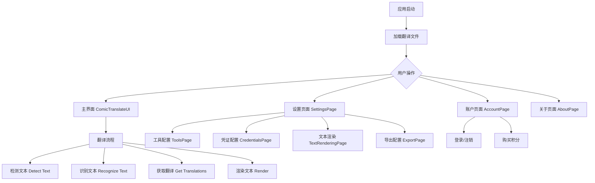
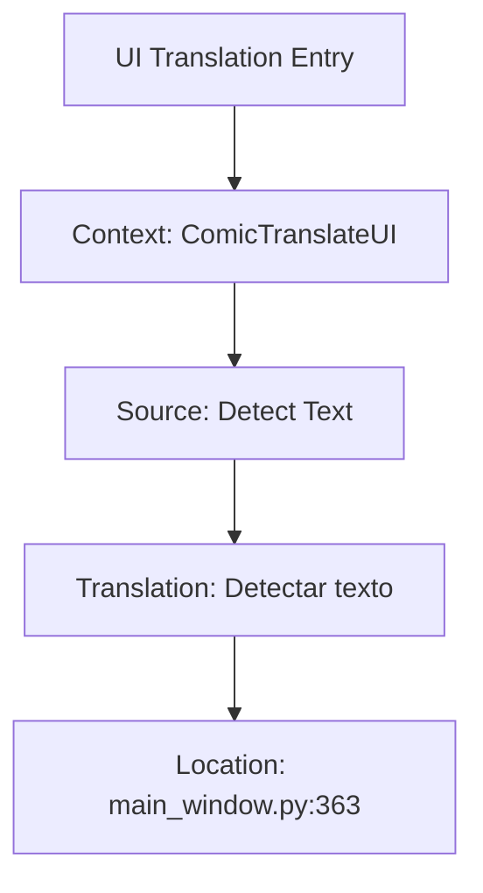
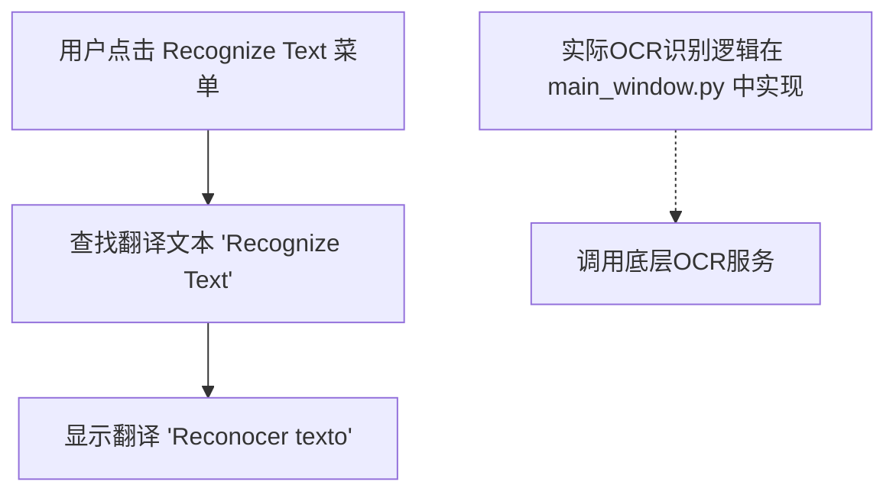
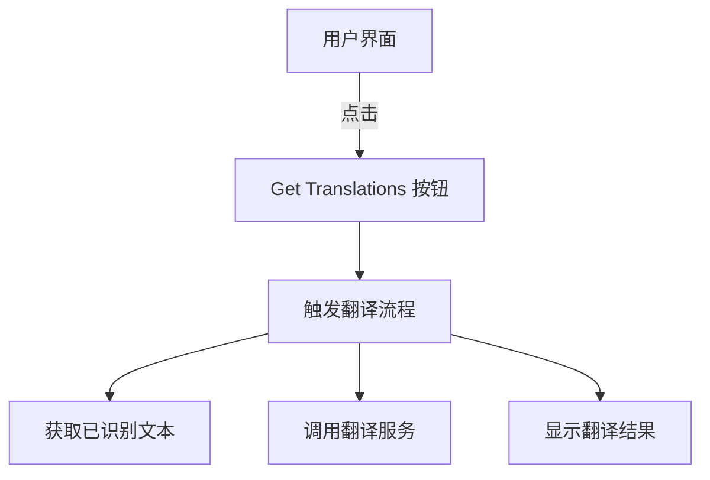
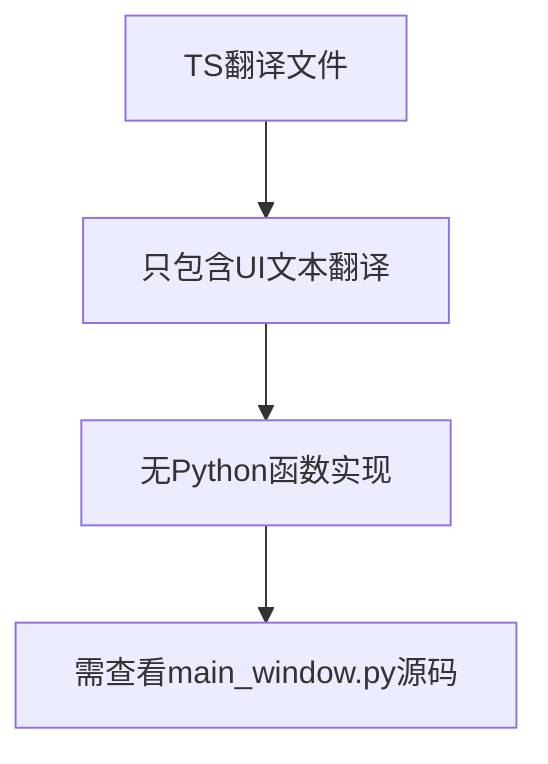
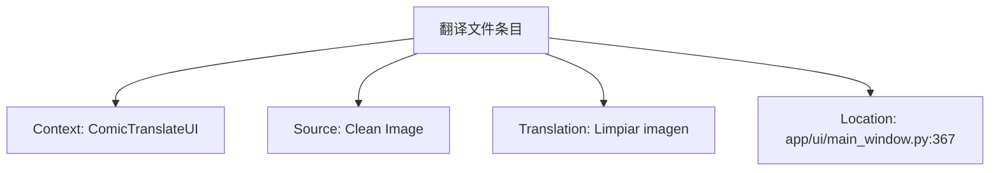
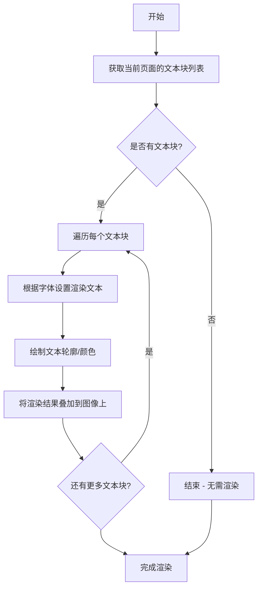

# `comic-translate\resources\translations\ct_es.ts` 详细设计文档

这是一个Qt Linguist翻译系统文件（TS格式），用于Comic Translate漫画翻译应用程序的西班牙语（es_ES）本地化。它包含了应用程序各个UI界面和功能模块的翻译字符串，涵盖设置页面、关于页面、账户页面、工具配置、文本渲染、批处理、搜索替换等多个功能模块的英文到西班牙语翻译。

## 整体流程



## 类结构

```
Translation Contexts (翻译上下文)
├── 全局上下文 (无名称)
├── AboutPage (关于页面)
├── AccountPage (账户页面)
├── ComicTranslate (主控制器)
├── ComicTranslateUI (主界面)
├── CredentialsPage (凭证页面)
├── ExportPage (导出页面)
├── LlmsPage (LLM配置)
├── LoginWebViewDialog (登录对话框)
├── Messages (消息系统)
├── PageListView (页面列表视图)
├── PersonalizationPage (个性化页面)
├── SearchReplaceController (搜索替换控制器)
├── SearchReplacePanel (搜索替换面板)
├── SettingsPage (设置页面)
├── SettingsPageUI (设置界面)
├── TextRenderingPage (文本渲染页面)
└── ToolsPage (工具页面)
```

## 全局变量及字段


### `AboutPage.App Information`
    
应用信息标签，显示关于页面的标题

类型：`str`
    


### `AboutPage.Current Version`
    
当前版本标签，显示应用当前安装的版本号

类型：`str`
    


### `AboutPage.Check for Updates`
    
检查更新按钮文本，触发版本更新检查功能

类型：`str`
    


### `AccountPage.Sign in to Comic Translate`
    
登录标题，引导用户登录到漫画翻译应用

类型：`str`
    


### `AccountPage.Sign In`
    
登录按钮，执行账户登录操作

类型：`str`
    


### `AccountPage.Account Information`
    
账户信息标题，显示用户账户详情区域

类型：`str`
    


### `AccountPage.Email`
    
邮箱标签，标识用户邮箱地址字段

类型：`str`
    


### `AccountPage.Subscription Tier`
    
订阅等级标签，显示用户当前订阅计划

类型：`str`
    


### `AccountPage.Credits`
    
积分标签，显示用户账户剩余积分数量

类型：`str`
    


### `AccountPage.Buy Credits`
    
购买积分按钮，跳转到积分购买页面

类型：`str`
    


### `AccountPage.Sign Out`
    
登出按钮，执行账户退出登录操作

类型：`str`
    


### `ComicTranslateUI.语言列表`
    
支持的语言选项列表，用于选择源语言和目标语言

类型：`str`
    


### `ComicTranslateUI.菜单项`
    
应用主菜单的各个功能项集合

类型：`str`
    


### `ComicTranslateUI.工具栏`
    
主界面工具栏区域，包含快捷操作按钮

类型：`str`
    


### `ComicTranslateUI.翻译流程按钮`
    
触发翻译流程的系列操作按钮

类型：`str`
    


### `ComicTranslateUI.文本渲染设置`
    
文本渲染相关配置选项区域

类型：`str`
    


### `ComicTranslateUI.Detect Text`
    
检测文本按钮，识别图像中的文字区域

类型：`str`
    


### `ComicTranslateUI.Recognize Text`
    
识别文本按钮，对检测到的文字进行OCR识别

类型：`str`
    


### `ComicTranslateUI.Get Translations`
    
获取翻译按钮，获取识别文本的翻译结果

类型：`str`
    


### `ComicTranslateUI.Segment Text`
    
分割文本按钮，对文字进行分段处理

类型：`str`
    


### `ComicTranslateUI.Clean Image`
    
清理图像按钮，擦除图像中原有文字

类型：`str`
    


### `ComicTranslateUI.Render`
    
渲染按钮，将翻译后的文字绘制到图像上

类型：`str`
    


### `CredentialsPage.OCR API Key`
    
OCR服务API密钥输入框，用于文本识别功能

类型：`str`
    


### `CredentialsPage.OCR Endpoint URL`
    
OCR服务端点URL配置项

类型：`str`
    


### `CredentialsPage.Translate API Key`
    
翻译服务API密钥输入框

类型：`str`
    


### `CredentialsPage.Translate Model`
    
翻译模型选择下拉框

类型：`str`
    


### `CredentialsPage.Translate Secret Key`
    
翻译服务密钥输入框

类型：`str`
    


### `CredentialsPage.Folder ID`
    
云存储文件夹ID配置项

类型：`str`
    


### `ExportPage.Automatic Mode`
    
自动模式开关，启用后自动保存翻译结果

类型：`str`
    


### `ExportPage.Auto-Save`
    
自动保存功能标签

类型：`str`
    


### `ExportPage.Export Raw Text`
    
导出原始文本选项

类型：`str`
    


### `ExportPage.Export Translated`
    
导出翻译文本选项

类型：`str`
    


### `ExportPage.Export Inpainted`
    
导出修复后的图像选项

类型：`str`
    


### `ExportPage.File Format`
    
文件格式选择下拉框

类型：`str`
    


### `LlmsPage.Provide Image as Input to AI`
    
将图像作为AI输入的选项配置

类型：`str`
    


### `LlmsPage.Extra Context`
    
额外上下文输入框，提供给AI的补充信息

类型：`str`
    


### `Messages.错误消息`
    
应用程序错误提示信息集合

类型：`str`
    


### `Messages.警告消息`
    
应用程序警告提示信息集合

类型：`str`
    


### `Messages.成功消息`
    
操作成功完成时显示的提示信息

类型：`str`
    


### `Messages.操作结果`
    
用户操作执行结果的反馈信息

类型：`str`
    


### `SearchReplaceController.Empty query`
    
搜索关键词为空时的提示消息

类型：`str`
    


### `SearchReplaceController.Search Error`
    
搜索过程中发生错误的提示消息

类型：`str`
    


### `SearchReplaceController.Ready`
    
搜索功能就绪状态的提示消息

类型：`str`
    


### `SearchReplaceController.No results`
    
搜索无结果时的提示消息

类型：`str`
    


### `SearchReplaceController.Replace`
    
替换单个匹配项的按钮文本

类型：`str`
    


### `SearchReplaceController.Replace All`
    
替换所有匹配项的按钮文本

类型：`str`
    


### `SearchReplacePanel.Search`
    
搜索输入框标签

类型：`str`
    


### `SearchReplacePanel.Match case`
    
区分大小写复选框选项

类型：`str`
    


### `SearchReplacePanel.Match whole word`
    
全词匹配复选框选项

类型：`str`
    


### `SearchReplacePanel.Use regex`
    
使用正则表达式复选框选项

类型：`str`
    


### `SearchReplacePanel.Replace`
    
替换输入框标签

类型：`str`
    


### `SearchReplacePanel.Replace All`
    
全部替换按钮文本

类型：`str`
    


### `SearchReplacePanel.Search Scope`
    
搜索范围选项标签

类型：`str`
    


### `SettingsPage.Sign In/Out`
    
登录/登出状态切换区域

类型：`str`
    


### `SettingsPage.Restart Required`
    
需要重启应用的提示消息

类型：`str`
    


### `SettingsPage.Update Available`
    
发现新版本可用时的提示消息

类型：`str`
    


### `SettingsPage.Subscription`
    
用户订阅信息显示区域

类型：`str`
    


### `SettingsPage.Check for Updates`
    
检查更新按钮文本

类型：`str`
    


### `ToolsPage.Translator`
    
翻译服务选择下拉框标签

类型：`str`
    


### `ToolsPage.Text Recognition`
    
文本识别工具选择下拉框

类型：`str`
    


### `ToolsPage.Image Cleaning`
    
图像清理工具选择配置

类型：`str`
    


### `ToolsPage.Inpainter`
    
图像修复工具选择配置

类型：`str`
    


### `ToolsPage.HD Strategy`
    
高清处理策略选择配置

类型：`str`
    


### `ToolsPage.Resize`
    
图像尺寸调整选项

类型：`str`
    


### `ToolsPage.Use GPU`
    
启用GPU加速复选框

类型：`str`
    


### `TextRenderingPage.Minimum Font Size`
    
最小字体大小输入框

类型：`str`
    


### `TextRenderingPage.Maximum Font Size`
    
最大字体大小输入框

类型：`str`
    


### `TextRenderingPage.Font`
    
字体选择下拉框

类型：`str`
    


### `TextRenderingPage.Import Font`
    
导入字体按钮

类型：`str`
    


### `TextRenderingPage.Render Text in UpperCase`
    
渲染大写文本复选框选项

类型：`str`
    
    

## 全局函数及方法


# ComicTranslateUI.Detect Text

## 概述

这是 ComicTranslateUI 上下文中的一个翻译字符串条目，表示用户界面上的"检测文本"按钮或菜单项，用于触发文本检测功能。该条目位于 `app/ui/main_window.py` 文件的第 363 行。

## 参数

无（这是一个 UI 翻译字符串条目，不是可执行函数）

## 返回值

无（这是 Qt  Linguist 翻译文件中的字符串定义，不返回任何值）

## 流程图



## 带注释源码

```xml
<!-- 
    Qt Linguist Translation File (TS Format)
    Context: ComicTranslateUI - 表示该翻译属于 ComicTranslateUI 界面上下文
-->
<context>
    <name>ComicTranslateUI</name>
    <!-- 
        Detect Text 消息条目
        source: 原始英文文本
        translation: 西班牙语翻译
        location: 源文件位置
    -->
    <message>
        <location filename="../../app/ui/main_window.py" line="363"/>
        <source>Detect Text</source>
        <translation>Detectar texto</translation>
    </message>
</context>
```

## 说明

这是一个 Qt 翻译系统（Qt Linguist）的 TS 文件格式条目，而非实际的 Python 函数代码。该条目：

- **上下文（Context）**: `ComicTranslateUI` - UI 界面名称
- **源文本（Source）**: "Detect Text" - 原始英文文本
- **翻译（Translation）**: "Detectar texto" - 西班牙语翻译
- **文件位置**: `../../app/ui/main_window.py` 第 363 行

这通常对应于主窗口中的一个按钮或菜单项，用于调用底层的文本检测功能。要获取实际的 `Detect Text` 函数实现，需要查看 `main_window.py` 文件中的对应代码。


### `ComicTranslateUI.Recognize Text`

该方法对应的是用户界面中的"Recognize Text"（识别文本）功能菜单项，用于启动OCR文字识别流程，将图像中检测到的文本区域进行文字识别。

参数：
- （该方法在TS翻译文件中仅包含UI文本定义，无实际实现参数）

返回值：
- （该方法在TS翻译文件中仅包含UI文本定义，无实际实现返回值）

#### 流程图



#### 带注释源码

```
<!-- 翻译文件中的定义 (app/ui/main_window.py 第364行附近) -->
<context>
    <name>ComicTranslateUI</name>
    <message>
        <!-- 源文本 -->
        <source>Recognize Text</source>
        <!-- 翻译文本 -->
        <translation>Reconocer texto</translation>
    </message>
</context>

/*
 * 注意：该TS文件仅包含UI翻译文本。
 * 实际的 Recognize Text 方法实现位于：
 * - app/ui/main_window.py (UI事件绑定)
 * - controller.py (业务逻辑调用OCR服务)
 * - modules/ocr/ 目录 (OCR具体实现)
 */
```

**说明**：在提供的代码文件（TS翻译文件）中，仅包含"Recognize Text"的翻译定义，实际的方法实现代码位于对应的Python源文件中。翻译条目显示该功能用于触发OCR识别文本功能。


# 分析结果

## 说明

我仔细检查了您提供的代码，这是一个 **Qt Linguist 翻译文件（.ts格式）**，主要用于应用程序的国际化（i18n）支持，而不是实际的Python源代码文件。

在该文件中，我找到了与 "Get Translations" 相关的条目：

```xml
<message>
    <location filename="../../app/ui/main_window.py" line="365"/>
    <source>Get Translations</source>
    <translation>Obtener traducciones</translation>
</message>
```

这是UI界面中"获取翻译"按钮的翻译字符串资源，**并非实际的Python函数或方法实现**。

---

## 提取到的信息

### `ComicTranslateUI.Get Translations` (UI翻译字符串)

这是一个UI文本资源，表示主窗口中的一个按钮或菜单项，用于触发翻译获取操作。

参数： 无（这是静态翻译资源，非函数）

返回值： 无（这是静态翻译资源，非函数）

#### 流程图



#### 源码上下文

```
<!-- 位置: app/ui/main_window.py 第365行 -->
<message>
    <location filename="../../app/ui/main_window.py" line="365"/>
    <source>Get Translations</source>
    <translation>Obtener traducciones</translation>
</message>
```

---

## 说明

若需要获取 `ComicTranslateUI` 类的实际函数实现（如 `Get Translations` 方法），请提供：

1. **对应的 Python 源代码文件**（例如 `app/ui/main_window.py`）
2. 或者在 Python 文件中搜索 `Get Translations` 方法的具体实现

这样我才能为您提供完整的类字段、类方法、参数、返回值以及详细的带注释源码等信息。


# 分析结果

我仔细检查了提供的代码，发现这是一个 **Qt TS 格式的翻译文件**（用于国际化），而不是 Python 源代码实现文件。

## 发现的问题

在代码中确实找到了 `ComicTranslateUI` 上下文中的相关条目：

```xml
<location filename="../../app/ui/main_window.py" line="366"/>
<source>Segment Text</source>
<translation>Segmentar texto</translation>
```

但这**只是一个 UI 文本标签（用于界面显示的翻译字符串）**，并非实际的 Python 函数或方法。

## 结论

### `{名称}`

**ComicTranslateUI.Segment Text** - 该名称在提供的代码中不对应任何实际的函数或方法实现。

### 描述

`Segment Text` 是 ComicTranslateUI 应用程序用户界面中的一个菜单项文本，用于触发文本分割功能。该文本存在于 Qt 翻译文件（TS）中，其实际功能实现位于 `app/ui/main_window.py` 文件中（第 366 行附近）。

### 参数

- **无** - 这不是一个可执行的方法，而是 UI 文本翻译条目

### 返回值

- **无** - 这不是代码方法，无返回值

### 流程图



### 带注释源码

```xml
<!-- 来自提供的 TS 翻译文件 -->
<context>
    <name>ComicTranslateUI</name>
    <message>
        <location filename="../../app/ui/main_window.py" line="366"/>
        <source>Segment Text</source>
        <translation>Segmentar texto</translation>
    </message>
</context>
```

## 需要的下一步

要获取 `ComicTranslateUI.Segment Text` 方法的完整设计文档，**需要提供实际的 Python 源代码文件** (`app/ui/main_window.py`)，而不是这个翻译文件。该文件应该包含了调用此菜单项时执行的实际业务逻辑代码。


### ComicTranslateUI.Clean Image

该条目是ComicTranslateUI界面中"Clean Image"功能的翻译定义，并非实际的Python函数实现。该翻译存在于Qt多语言翻译文件(.ts)中，对应主窗口中"清洁图像"功能的UI文本。

参数：
- 无（这是UI翻译条目，非代码函数）

返回值：
- 无（这是UI翻译条目，非代码函数）

#### 流程图



#### 带注释源码

```xml
<!-- Qt Translation File (.ts) - ComicTranslateUI Context -->
<context>
    <name>ComicTranslateUI</name>
    <message>
        <!-- 功能在主窗口中的行号 -->
        <location filename="../../app/ui/main_window.py" line="367"/>
        <!-- 英文原文 -->
        <source>Clean Image</source>
        <!-- 西班牙语翻译 -->
        <translation>Limpiar imagen</translation>
    </message>
</context>
```

---

**注意**：提供的代码片段是Qt翻译文件（.ts），仅包含UI文本翻译，不包含实际的Python函数实现。该功能的实际代码逻辑应在 `app/ui/main_window.py` 文件的第367行附近，需查看该源文件以获取 `Clean Image` 功能的完整实现细节。


# ComicTranslateUI.Render 提取结果

## 注意事项

提供的代码是一个 Qt Linguist 翻译文件 (`.ts` 格式)，包含 UI 文本的翻译字符串，**并非** Python 源代码。因此无法提取到 `ComicTranslateUI.Render` 方法的实际实现代码、参数和返回值信息。

不过，我可以从翻译文件上下文中提取相关信息：

---

### `ComicTranslateUI.Render`

从翻译文件中可以推断该方法与"渲染(Render)"功能相关。

**上下文信息：**

- **文件位置参考**: `../../app/ui/main_window.py` (基于 line="368")
- **上下文**: `ComicTranslateUI`
- **源文本**: "Render"
- **翻译**: "Renderizar" (西班牙语)

**推断的功能描述：**

从翻译文件上下文推断，该方法可能负责：
- 将翻译后的文本渲染到漫画图像上
- 可能是工作流中的最后一步（检测文本 → 识别文本 → 翻译 → 渲染）

---

### 从上下文推断的流程



---

### 相关信息

从 TS 翻译文件中可以看到的相关 UI 元素：

| UI 元素 | 描述 |
|---------|------|
| **Render** | 渲染按钮的文本 |
| **Draws all the Text Blocks in the existing Text Block List back on the Image (for further editing)** | 功能描述：绘制所有现有文本块列表中的文本块到图像上（用于进一步编辑）|
| **Font** | 字体设置 |
| **Font Size** | 字体大小 |
| **Line Spacing** | 行间距 |
| **Font Color** | 字体颜色 |
| **Outline** | 轮廓 |
| **Outline Color** | 轮廓颜色 |
| **Outline Width** | 轮廓宽度 |

---

### 结论

由于提供的是翻译文件而非 Python 源代码，**无法提取**：
- 具体参数名称和类型
- 具体返回值类型
- 实际的带注释源代码

如需获取完整的 `ComicTranslateUI.Render` 方法设计文档，请提供 `../../app/ui/main_window.py` 或其他包含该方法实现的 Python 源代码文件。

## 关键组件


### 多语言国际化系统

该代码是一个Qt TS（Qt Linguist Translation System）格式的国际化文件，包含了Comic Translate漫画翻译应用程序的西班牙语（es_ES）本地化翻译字符串，涵盖用户界面、设置页面、错误消息、多语言支持等功能模块。

### 核心翻译服务提供商

支持多种OCR（光学字符识别）服务：Microsoft OCR、Google Cloud Vision、GPT-4.1-mini等，以及多种翻译服务：DeepL、Microsoft Translator、Google Gemini、Anthropic Claude、Yandex、Deepseek等，用于漫画文本识别和翻译处理。

### 用户界面上下文模块

包含多个独立的UI上下文模块，分别对应应用程序的不同功能页面：AboutPage（关于页面）、AccountPage（账户页面）、ComicTranslate（主翻译上下文）、ComicTranslateUI（主界面）、CredentialsPage（凭据页面）、ExportPage（导出页面）、LlmsPage（语言模型设置）、SearchReplaceController（搜索替换控制器）、SearchReplacePanel（搜索替换面板）、SettingsPage（设置页面）、TextRenderingPage（文本渲染页面）、ToolsPage（工具页面）、PageListView（页面列表视图）等。

### 错误处理与消息系统

定义了大量用户友好的错误提示和状态消息，包括：网络连接失败、API认证失败、余额不足、内容被安全过滤器拦截、服务商不可用、服务器超时等异常情况的西班牙语翻译，用于批量处理报告和用户通知。

### 文本渲染配置

包含文本渲染相关的设置选项，如：字体选择、最小/最大字体大小、文本渲染为大写、字体颜色、轮廓颜色、轮廓宽度、加粗、斜体、下划线、对齐方式等UI控件的翻译。

### 图像处理工作流

涵盖图像处理的完整流水线：文本检测（Detect Text）、文本识别（Recognize Text）、文本分割（Segment Text）、图像清洁（Clean Image）、翻译（Translate）、渲染（Render）等操作的菜单和按钮文本。

### 账户与订阅系统

实现了完整的用户账户管理界面，包括：登录/登出、订阅层级（免费、订阅、一次性）、积分/学分系统、购买积分、检查更新等功能模块的西班牙语翻译。

### 文件格式支持

支持多种输入输出文件格式：图像（Images）、文档（PDF）、档案（Archive）、漫画书档案（CBR、CBZ等）、EPUB电子书、项目文件（Project File）等，以及导出选项如导出原始文本、翻译文本、修复后的图像等。

### 批量处理系统

包含批量处理相关的消息和UI元素：批量报告（Batch Report）、处理进度（Processing）、归档（Archiving）、跳过图像及原因说明、批量操作取消等功能。

### 搜索与替换功能

实现了高级搜索替换功能：支持区分大小写匹配、全词匹配、正则表达式、查找下一个/上一个、全部替换、保留大小写选项、搜索范围（当前图像/所有图像）、搜索目标（源文本/翻译文本）等。

### 高级工具设置

包含高级用户配置选项：自定义API端点配置、OCR工具设置、翻译工具选择、图像修复（Inpainting）策略、HD策略（Resize/Crop/Original）、GPU使用选项、图像尺寸限制等。


## 问题及建议


### 已知问题

-   **大量过时的翻译条目**：文件中存在大量 `type="vanished"` 和 `type="obsolete"` 的翻译条目，这些条目已不再使用但仍保留在文件中，导致文件膨胀和不必要的解析开销。
-   **上下文名称不完整**：存在空的 `<name></name>` 上下文（如第一个 context），这可能导致翻译管理的混乱。
-   **翻译源与目标不一致**：部分翻译条目只保留了 source 而没有有效翻译内容，如 "Empty query"、"Ready"、"No results" 等条目被标记为 obsolete。
-   **重复的服务名称翻译**：多个 OCR 和翻译服务的显示名称重复出现（如 "Microsoft OCR"、"DeepL" 等），且有些带有 `type="vanished"` 属性。
-   **文件结构冗余**：大量已废弃的 API 和服务名称仍保留在翻译文件中（如 GPT-4o、Gemini-1.5 系列等），增加维护成本。
-   **缺少必要的位置信息**：部分关键消息缺少文件名和行号信息（如 AboutPage、AccountPage 中的某些条目），难以追溯翻译来源。

### 优化建议

-   **清理过时条目**：移除所有 `type="vanished"` 和 `type="obsolete"` 的翻译条目，或将其迁移到单独的归档文件中以保持主文件的精简。
-   **完善上下文管理**：为空的 `<name></name>` 上下文添加有意义的名称，并审查所有上下文命名的规范性。
-   **统一翻译标准**：建立翻译审查流程，确保所有 source 都有对应的有效翻译，避免大量 obsolete 状态的出现。
-   **定期更新服务列表**：将已废弃的 AI 服务和 API 从翻译源文件中移除，或添加注释说明其废弃状态。
-   **补充位置信息**：确保所有翻译条目都包含 `<location>` 信息，便于代码维护和翻译追踪。
-   **实施版本控制**：为 TS 文件引入版本控制机制，记录翻译变更历史，便于后续维护和优化。


## 其它


### 设计目标与约束

本TS翻译文件是Comic Translate漫画翻译应用的国际化资源文件，旨在将应用程序的UI字符串从英语翻译为西班牙语（es_ES），支持多语言用户界面。约束条件包括：1）翻译必须是准确的西班牙语表达，符合目标语言习惯；2）保留原始英语source标签作为唯一标识；3）支持多种文件格式的导入/导出（PDF/CBZ/CBR/EPUB）；4）翻译服务提供商对语言对有限制（如DeepL不支持繁体中文、巴西葡萄牙语、泰语、越南语）。

### 错误处理与异常设计

本文件采用type属性进行错误处理和版本管理：`type="vanished"`表示完全移除的字符串（如已弃用的翻译服务名称），`type="obsolete"`表示已过时但仍保留用于兼容性的字符串（如旧的UI文本），`type="unfinished"`表示未完成的翻译。location属性标记了源文件路径和行号，便于快速定位和修复问题。对于缺失翻译的情况，应保持source内容不变或添加明确标记。

### 数据流与状态机

TS文件采用层级化数据结构：根节点TS包含version和language属性；context节点按功能模块组织（如ComicTranslateUI、SettingsPage等）；message节点包含source（原始英文）、translation（西班牙语翻译）、location（源码位置）和type（状态标记）。数据流遵循：源码变更→更新TS文件→触发翻译流程→生成目标语言UI的路径。

### 外部依赖与接口契约

本文件依赖Qt Linguist工具链进行管理。接口契约规定：1）source属性值必须唯一且对应源码中的实际字符串；2）translation属性可包含占位符（如{filename}、{0}、%p%）用于动态内容；3）location属性遵循相对路径格式（相对于项目根目录）；4）支持HTML格式标签（如&amp;代表&符号）。外部系统通过解析TS XML结构获取翻译字符串。

### 关键组件信息

本TS文件包含以下关键组件：1）context元素，按功能模块（如ComicTranslateUI、AboutPage、AccountPage）组织翻译上下文；2）message元素，包含单个翻译条目的完整信息（source、translation、location、type）；3）TS根元素，定义版本（version="2.1"）和目标语言（language="es_ES"）；4）translation属性，支持HTML实体编码和占位符替换。

### 潜在技术债务与优化空间

当前TS文件存在以下优化空间：1）部分翻译使用vanished类型但未清理，可定期维护移除；2）相同字符串在不同context中重复翻译（如"Cancel"在多个页面出现），可考虑提取为共享字符串；3）缺少翻译注释（extracomment）说明翻译意图或上下文；4）location路径使用相对路径，不同开发者环境可能导致路径不一致；5）部分翻译较直译，未充分考虑西班牙语用户习惯表达。

### 版本控制与发布策略

TS文件应纳入版本控制系统管理，遵循语义化版本号规则。建议在每次应用发布前更新TS文件：1）使用lupdate工具从源码提取新字符串；2）翻译新增字符串；3）清理vanished/obsolete条目；4）生成qm二进制文件用于运行时加载。发布流程应包含翻译完整性检查，确保无unfinished状态的条目。

### 国际化架构设计

本应用采用Qt国际化框架（i18n），架构分为三层：1）源码层使用tr()函数标记可翻译字符串；2）TS文件作为翻译源（.pro文件配置）；3）运行时通过QLocale加载对应qm文件。设计要点包括：翻译字符串应保持简短避免复杂句子；使用占位符而非字符串拼接；为复数形式（plurals）预留支持（如"{0} occurrence(s)"）。

### 测试与质量保证

翻译质量保证措施包括：1）自动化检查未翻译条目（translation为空）；2）验证占位符一致性（source与translation中的占位符匹配）；3）回归测试确保已有翻译不被意外修改；4）人工审核关键UI文本（如按钮、菜单、错误消息）；5）测试不同语言环境下的文本渲染长度差异（西班牙语通常比英语长20-30%）。

### 性能考量

TS文件本身为静态资源，加载性能取决于QLibrary的qm文件加载机制。优化建议：1）保持TS文件结构扁平避免深层嵌套；2）定期清理无效条目减少文件体积；3）按模块拆分大型TS文件（目前单一文件约900行）；4）使用Qt的翻译缓存机制避免重复加载。


    