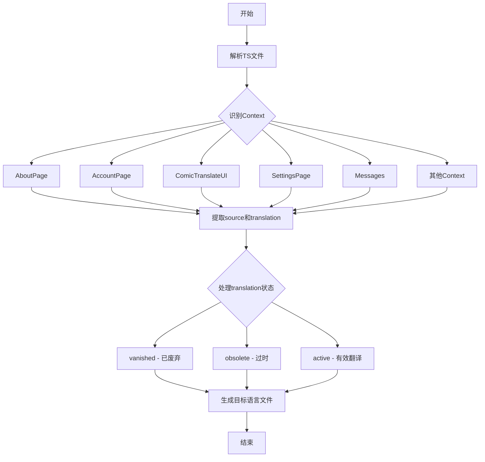

# `comic-translate\resources\translations\ct_it.ts` 详细设计文档

这是一个Qt Linguist翻译文件（.ts格式），包含了ComicTranslate应用程序的意大利语（it_IT）本地化翻译，涵盖了UI界面文本、菜单项、按钮标签、错误消息、设置选项等所有用户可见文本的翻译。

## 整体流程



## 类结构

```
TS (根元素)
├── context (AboutPage)
│   └── message (应用信息、版本、检查更新)
├── context (AccountPage)
│   └── message (登录、账户信息、订阅、积分)
├── context (ComicTranslate)
│   └── message (错误处理、下载、对话框)
├── context (ComicTranslateUI)
│   └── message (主窗口UI、多语言选项、工具栏)
├── context (CredentialsPage)
│   └── message (API密钥配置)
├── context (ExportPage)
│   └── message (导出设置)
├── context (LlmsPage)
│   └── message (LLM模型设置)
├── context (Messages)
│   └── message (系统消息、错误提示)
├── context (PageListView)
│   └── message (页面列表操作)
├── context (SearchReplaceController)
│   └── message (搜索替换控制器)
├── context (SearchReplacePanel)
│   └── message (搜索替换面板)
├── context (SettingsPage)
│   └── message (设置页面)
├── context (SettingsPageUI)
│   └── message (设置UI选项)
├── context (TextRenderingPage)
│   └── message (文本渲染设置)
├── context (ToolsPage)
│   └── message (工具选择设置)
└── context (self.main)
    └── message (批处理报告)
```

## 全局变量及字段


    

## 全局函数及方法


## 关键组件


### 翻译管理系统

Qt Linguist 国际化翻译文件，支持多语言 UI 本地化，包含源文本与翻译的映射关系

### OCR 文本识别服务

支持多种文本识别后端，包括 Microsoft OCR、Google Cloud Vision、以及基于 GPT 系列的 AI 文本识别

### 翻译服务提供商

支持 DeepL、Microsoft Translator、Google Translate、Yandex、Google Gemini、Anthropic Claude、OpenAI GPT、Deepseek 等多个翻译引擎

### 账户与认证系统

用户登录、订阅管理、积分信用系统，用于付费翻译服务

### API 凭证管理

高级用户可配置自定义 API 端点，支持本地语言模型的集成

### 漫画文件处理

支持导入和导出 Images、PDFs、ePub、CBR/CBZ 等漫画档案格式

### 文本检测与识别流程

检测文本框、OCR 识别、文本分割、翻译获取的完整 pipeline

### Webtoon 模式处理

针对长纵向漫画的特殊阅读模式和处理方式

### 批处理系统

批量翻译处理、进度报告、错误跳过与重试机制

### 文本渲染引擎

字体选择、大小控制、颜色配置、轮廓描边、字间距调整等渲染参数

### 图像修复（Inpainting）

支持 Resize、Crop、Original 等 HD 策略，用于清除漫画中的原始文本

### 搜索替换功能

支持正则表达式、大小写匹配、整词匹配等高级搜索功能

### 错误处理与状态消息

网络连接错误、API 认证失败、服务商限流、内容安全拦截等各类异常处理


## 问题及建议


### 已知问题

- **翻译文本重复错误**：第14行 `Fornisci immagine come input all&apos;IAcome input all&apos;IAcome input all&apos;IA` 存在明显的文本重复错误，应为 "Fornisci immagine come input all'IA"
- **格式错误**：第52行 `Salva archivi come:::` 包含多余的冒号
- **大量过时翻译未清理**：文件中存在大量 `type="vanished"` 和 `type="obsolete"` 的翻译条目，这些已失效的条目未及时清理，增加了文件体积和维护成本
- **翻译不一致**：部分概念使用意大利语翻译（如"Personalizzato"），而另一些保留英语原文（如"Custom"、"Deepseek"），同一系统内翻译风格不统一
- **硬编码文本问题**：从 `filename` 属性可以看出大量UI文本硬编码在Python源码中（如 controller.py、main_window.py），而非完全通过翻译系统管理
- **版本遗留问题**：存在多个同义词的版本更替（如 GPT-4.1-mini、GPT-4.1、GPT-4o 等OCR/翻译选项），旧版本翻译未清理
- **路径引用变更**：部分 `filename` 指向的文件路径已变更（如 `../../modules/utils/pipeline_config.py`），但仍保留旧的翻译条目

### 优化建议

- 修复文本重复和格式错误，验证所有翻译条目的完整性
- 定期清理 `type="vanished"` 和 `type="obsolete"` 的过时条目，或建立自动清理机制
- 统一翻译风格，确定专业术语的固定译法（如"Custom"统一译为"Personalizzato"）
- 逐步将硬编码的UI文本移至翻译系统，减少源码中的字符串字面量
- 建立翻译审核流程，在发布前校验翻译文件的语法正确性
- 考虑将静态翻译文件（TS）转换为更易于版本控制的格式（如JSON PO）


## 其它


### 设计目标与约束

本翻译文件为Comic Translate应用的Qt Linguist翻译资源文件（TS格式），主要用于支持应用的国际化（i18n）功能。设计目标包括：1）实现应用UI的意大利语本地化；2）支持多语言切换功能；3）管理翻译状态（已翻译、已废弃、已过时等）。约束条件包括：TS文件需遵循Qt Linguist规范、翻译字符串需与源代码中的context和source匹配、文件名编码必须为UTF-8。

### 错误处理与异常设计

翻译文件本身不涉及代码级别的错误处理，但存在翻译状态管理机制：type="vanished"表示翻译已被删除；type="obsolete"表示翻译已过时；缺失translation属性表示未翻译。翻译缺失时Qt会回退到source原始文本。建议添加翻译验证流程，检查未翻译条目和过时的translation属性。

### 数据流与状态机

翻译数据流：源代码提取待翻译字符串→生成TS模板文件→翻译人员使用Qt Linguist编辑→生成QM二进制文件→运行时加载。翻译状态转换：New（新增）→Translated（已翻译）→Obsolete（已过时）→Vanished（已删除）。context元素作为命名空间区分不同UI模块的翻译条目。

### 外部依赖与接口契约

依赖Qt框架的翻译系统（Qt Linguist工具链），运行时依赖Qt5/6的QTranslator加载QM文件。接口契约：TS文件需包含version="2.1"声明、language="it_IT"指定目标语言、每个message元素需包含source和translation属性（除非是未翻译条目）。

### 关键数据结构

TS文件采用DOM树结构：TS根节点包含多个context子节点，每个context对应一个翻译上下文（如AboutPage、AccountPage等），每个context包含多个message元素。message元素包含source（原始英文）、translation（翻译内容）、location（源码位置）、type（状态属性）等属性。

### 潜在技术债务

存在翻译不一致问题：部分条目translation属性缺失；多个context中存在重复的翻译字符串（如"Custom"、"Error"等）；某些translation包含冗余文本（如"Personalizzato"出现多次）；LlmsPage中"come input all&apos;IA"重复三次；ExportPage中"Salva archivi come:::"包含多余冒号。

### 版本兼容性说明

本文件声明version="2.1"，兼容Qt 5.15+和Qt 6.x版本。language属性"it_IT"遵循RFC 3066语言标签规范。部分条目使用HTML实体编码（如&quot;、&apos;、&amp;）以确保XML兼容性。


    