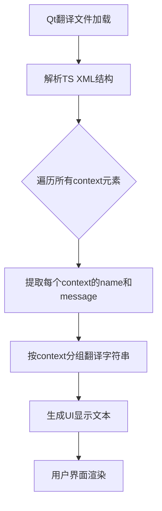

# `comic-translate\resources\translations\ct_ko.ts` 详细设计文档

这是一个Qt国际化翻译文件(.ts)，用于Comic Translate漫画翻译应用的韩语本地化。该文件包含了应用程序所有UI字符串的韩语翻译，涵盖主窗口、设置页面(账户、凭证、导出、LLM、个人化、文本渲染、工具、关于)、搜索替换面板、批处理报告以及各种消息提示等用户界面元素。

## 整体流程



## 类结构

```
TranslationContext (翻译上下文根节点)
├── General (通用设置)
│   ├── ToolsPage (工具设置)
│   ├── CredentialsPage (凭证设置)
│   ├── ExportPage (导出设置)
│   └── ... 
├── UI (用户界面)
│   ├── MainWindow (主窗口)
│   ├── SearchReplacePanel (搜索替换面板)
│   └── ... 
├── Messages (消息)
│   ├── ErrorMessages (错误消息)
│   ├── SuccessMessages (成功消息)
│   └── ... 
└── Settings (设置页面)
    ├── SettingsPage (设置主页)
    ├── AccountPage (账户页面)
    └── ... 
```

## 全局变量及字段


### `TS_VERSION`
    
Translation Source 文件版本，值为 2.1

类型：`string`
    


### `LANGUAGE`
    
目标语言代码，值为 ko_KR（韩语）

类型：`string`
    


### `ENCODING`
    
文件编码格式，值为 utf-8

类型：`string`
    


### `DOCTYPE`
    
文档类型定义，值为 TS

类型：`string`
    


    

## 全局函数及方法


## 关键组件


### OCR服务与文本识别

支持多种光学字符识别服务，包括Microsoft OCR、Google Cloud Vision以及基于GPT的文本识别功能，用于从漫画图像中检测和识别文字。

### 翻译服务与多语言支持

集成了多种翻译引擎，包括Open AI GPT、Google Gemini、DeepL、Microsoft Translator、Yandex、Anthropic Claude等，支持超过20种语言的翻译功能。

### 用户界面与设置系统

包含完整的UI组件体系，如AccountPage（账户页面）、SettingsPage（设置页面）、ToolsPage（工具页面）、TextRenderingPage（文本渲染页面）、ExportPage（导出页面）、AboutPage（关于页面）等，提供个性化配置体验。

### 账户与认证系统

提供用户登录、订阅管理、积分购买功能，支持通过OAuth进行身份验证，包含账户信息展示和积分余额查询。

### 批处理与流水线

实现批量图像处理能力，包括batch_processor和webtoon_batch_processor，用于处理多页漫画翻译，支持处理报告生成。

### 错误处理与消息系统

建立完善的错误提示机制，包括连接失败、认证错误、积分不足、翻译失败等多种场景的消息通知。

### 搜索与替换功能

在SearchReplaceController和SearchReplacePanel中实现，支持在源文本和翻译文本中进行大小写匹配、全词匹配、正则表达式匹配等高级搜索功能。

### 图像渲染与文本绘制

包含文本渲染配置，支持字体选择、大小调整、颜色设置、轮廓线绘制，以及行间距等排版参数的配置。

### 导出与保存功能

支持多种导出模式，包括自动保存、原始文本导出、翻译文本导出、修复后的图像导出，以及PDF/CBZ/CBR/EPUB等漫画格式的转换。

### 图像处理工具

包含图像清理和修复（Inpainting）功能，支持多种HD处理策略（Resize、Crop、Original），以及画笔和橡皮擦工具用于手动编辑。


## 问题及建议


### 已知问题

-   **大量过时翻译条目**：文件中存在大量`type="vanished"`（已删除）和`type="obsolete"`（已过时）的翻译条目，这些是源代码中已不存在但仍保留在翻译文件中的内容，会导致翻译文件膨胀和不必要的维护负担
-   **重复翻译未整合**：同一个源文本（如"Cancel"、"Replace"、"Save"等）在不同位置出现多次独立翻译，增加了翻译不一致的风险和维护成本
-   **转义字符处理不当**：部分文本中使用了HTML实体编码（如`&apos;`），而有些地方直接使用Unicode字符（如`'save'`），格式不统一
-   **翻译质量参差不齐**：某些翻译过于冗长或不够准确，如"Provide Image as Input to AI"的翻译可更精炼，" Translation blocked: The AI provider flagged this content. Please try a different translator."翻译可更流畅
-   **缺乏版本控制信息**：TS文件缺少对翻译版本、翻译人员、日期等元数据的记录，不利于团队协作和版本追踪
-   **翻译上下文信息不完整**：虽然部分条目有`filename`和`line`信息，但大量条目缺少定位信息，导致无法追溯翻译来源

### 优化建议

-   **定期清理过时翻译**：建立定期审查机制，移除所有`type="vanished"`和`type="obsolete"`的条目，保持翻译文件精简
-   **合并重复翻译**：将同一源文本的多次翻译合并为一条，使用单一权威翻译，避免维护重复内容
-   **统一格式标准**：制定翻译风格指南，统一使用Unicode字符或HTML实体编码，确保格式一致性
-   **完善翻译流程**：在TS文件中添加注释字段记录翻译日期、翻译者、版本等信息，便于团队协作
-   **补充位置信息**：为所有翻译条目添加源文件位置信息，便于翻译修改时追溯和定位
-   **使用翻译管理系统**：考虑使用专业的翻译管理工具（如Qt Linguist、Poedit）来更好地管理翻译流程和版本控制


## 其它


### 设计目标与约束

本翻译系统旨在为Comic Translate漫画翻译应用提供完整的多语言UI本地化支持，支持包括韩语、英语、日语、法语、中文(简/繁)、俄语、德语、荷兰语、西班牙语、意大利语、土耳其语、波兰语、葡萄牙语、泰语、越南语、印尼语、匈牙利语、芬兰语、阿拉伯语、捷克语、波斯语、罗马尼亚语、蒙古语等20余种语言的翻译。设计约束包括：1) 所有用户可见字符串必须通过TS翻译文件管理，不得硬编码；2) 翻译键必须保持唯一性，便于维护和更新；3) 支持Qt的context机制以实现上下文相关的翻译；4) 兼容Qt Linguist的翻译工具链，支持翻译状态的追踪（type="vanished"表示已删除，type="obsolete"表示已过时）。

### 错误处理与异常设计

翻译文件中的错误处理主要体现在翻译状态的管理上。当源代码中的字符串被删除或修改时，旧翻译通过type="vanished"标记为已失效，翻译人员可据此清理不再需要的翻译条目。当翻译内容不再使用时，使用type="obsolete"标记为已过时，保留历史记录以便追溯。此外，通过context分组机制，不同UI页面（如AboutPage、AccountPage、SettingsPage等）的同名字符串可被区分处理，避免翻译冲突。系统应定期检测未翻译的source字符串，并通过翻译状态字段追踪翻译进度。

### 数据流与状态机

翻译数据流从源代码中的用户可见字符串开始，经过Qt的lupdate工具提取至TS文件，翻译人员使用Qt Linguist进行翻译，最后通过lrelease工具生成二进制QM文件供应用程序加载使用。翻译状态机包含三种主要状态：1) 新增状态（source存在但无translation）— 需要翻译；2) 活跃状态（source存在且有有效translation）— 正常使用；3) 废弃状态（type="vanished"或type="obsolete"）— 不再使用但保留历史。状态转换规则：源代码新增字符串时自动创建新条目，源代码删除字符串时标记为vanished，翻译人员确认删除时标记为obsolete。

### 外部依赖与接口契约

本翻译系统的外部依赖主要包括：1) Qt框架的翻译系统（Qt Linguist、lupdate、lrelease工具链）；2) 翻译管理系统或协作平台（用于团队翻译协作）；3) 源代码管理工具（用于翻译文件的版本控制）。接口契约方面，翻译文件必须遵循TS 2.1规范，context元素用于分组管理，location属性用于追踪源码位置，translation元素包含实际翻译文本。应用程序通过QTranslator加载翻译文件，使用QCoreApplication::translate()或tr()方法进行动态翻译。翻译键（source字符串）必须与源代码中的实际字符串完全匹配，包括空格和标点符号。

### 国际化与本地化策略

本系统采用完整的国际化(i18n)和本地化(l10n)策略。语言代码遵循ISO 639-1标准（如ko_KR表示韩语-韩国），支持区域变体（如巴西葡萄牙语pt_BR）。翻译内容包括UI文本、错误消息、对话框内容、工具提示等所有用户可见文本。系统支持实时语言切换（部分功能可能需要重启生效），并提供默认回退机制——当指定语言翻译缺失时，回退至英语或其他可用语言。字体渲染需考虑目标语言的字符集支持，如韩语需考虑Hangul字符、中文需支持CJK统一表意文字。

### 翻译质量保证

翻译质量保证机制包括：1) 占位符一致性检查——确保{0}、{1}等参数占位符的数量和顺序与原文一致；2) 格式标记保留——HTML/XML标签、Qt格式化字符串等必须保持一致；3) 长度限制检查——某些UI元素有空间限制，翻译文本不应超出设计范围；4) 上下文验证——通过context和location信息确保翻译符合实际使用场景；5) 自动化测试——应用程序应包含翻译回归测试，验证所有翻译字符串可正常加载且无运行时错误。建议建立翻译审核流程，由具备目标语言母语能力的人员进行审核。

    