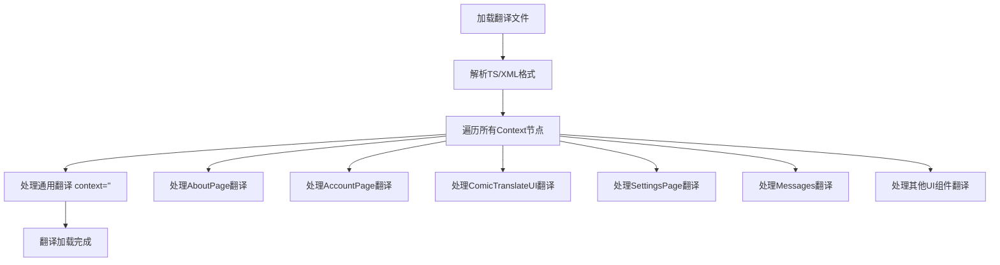
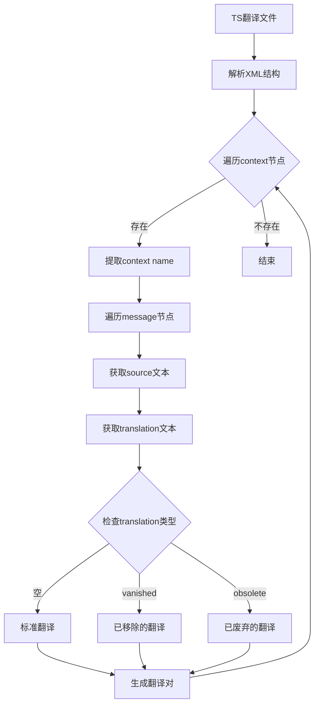

# `comic-translate\resources\translations\ct_ru.ts` 详细设计文档

这是一个Qt多语言翻译文件(.ts格式)，用于Comic Translate漫画翻译应用程序的俄语本地化。文件包含了应用程序各个UI模块的界面文本翻译，涵盖设置页面、工具页面、账户管理、搜索替换、批处理报告等功能的俄语翻译字符串。

## 整体流程



## 类结构

```
Qt Translation File (TS Format)
├── '' (通用翻译上下文)
├── AboutPage (关于页面)
├── AccountPage (账户页面)
├── ComicTranslate (主控制器消息)
├── ComicTranslateUI (主窗口UI)
├── CredentialsPage (凭据页面)
├── ExportPage (导出页面)
├── LlmsPage (LLM设置页面)
├── LoginWebViewDialog (登录对话框)
├── Messages (通用消息)
├── PageListView (页面列表视图)
├── PersonalizationPage (个性化页面)
├── SearchReplaceController (搜索替换控制器)
├── SearchReplacePanel (搜索替换面板)
├── SettingsPage (设置页面)
├── SettingsPageUI (设置页面UI)
├── TextRenderingPage (文本渲染页面)
├── ToolsPage (工具页面)
└── self.main (主窗口批处理报告)
```

## 全局变量及字段


### `context.name`
    
上下文名称，用于标识翻译所属的模块或页面

类型：`str`
    


### `context.message`
    
翻译消息条目列表，包含多个message元素

类型：`List[Message]`
    


### `message.source`
    
原始文本，需要翻译的源语言文本

类型：`str`
    


### `message.translation`
    
翻译文本，已翻译的目标语言文本

类型：`str`
    


### `message.location`
    
源码位置，包含文件名和行号信息，格式为'filename line XX'

类型：`str`
    


### `message.type`
    
翻译类型，标识翻译状态：vanished(已移除)、obsolete(已废弃)、unfinished(未完成)

类型：`str`
    
    

## 全局函数及方法


# 详细设计文档分析

## 整体概述

这段代码实际上并非传统的编程代码文件，而是一个 **Qt Linguist 翻译文件（.ts 格式）**，属于 "Comic Translate"（漫画翻译）应用的国际化/本地化资源文件。该文件包含了应用程序用户界面各种文本元素的俄语翻译，涵盖设置页面、错误消息、按钮标签、对话框内容等。

由于这是一个翻译资源文件而非代码实现文件，其中不包含任何可执行的函数或方法，因此无法按照传统代码分析方式提取函数签名、参数和返回值等信息。

## 文件结构分析

### 1. 核心内容类型

该翻译文件包含以下主要类别的文本翻译：

| 类别 | 说明 |
|------|------|
| **UI 设置页面** | AboutPage、AccountPage、SettingsPage、PersonalizationPage 等 |
| **工具配置** | ToolsPage、CredentialsPage、LlmsPage、TextRenderingPage 等 |
| **错误消息** | Messages 上下文中的各种错误提示 |
| **批处理报告** | Batch Report 相关的状态和错误信息 |
| **搜索替换** | SearchReplaceController 和 SearchReplacePanel 相关文本 |

### 2. 关键组件信息

| 组件名称 | 一句话描述 |
|----------|------------|
| ComicTranslateUI | 主应用程序界面，包含语言选择、文件导入、翻译功能等 |
| SettingsPage | 设置页面，包含账户管理、订阅、版本更新等功能 |
| Messages | 全局错误消息和状态提示的翻译资源 |
| CredentialsPage | API 凭证配置页面，支持多种 OCR 和翻译服务 |
| BatchReportController | 批处理报告控制器，处理翻译过程中的错误和状态 |

### 3. 数据流与状态机

由于这是翻译资源文件，数据流体现在：

```
源代码中的英文字符串 (source)
    ↓
Qt Linguist 工具导入
    ↓
翻译人员提供俄语翻译 (translation)
    ↓
生成 .qm 二进制文件供应用程序使用
```

### 4. 外部依赖与接口契约

- **Qt Framework**: 使用 Qt 的国际化系统
- **Linguist 工具**: Qt 官方翻译管理工具
- **应用程序**: Comic Translate Python 应用（使用 PyQt 或类似框架）

### 5. 潜在的技术债务或优化空间

1. **过时翻译**: 文件中存在 `type="vanished"` 和 `type="obsolete"` 的条目，表示已有翻译不再使用，应定期清理
2. **硬编码字符串**: 应确保所有用户可见字符串都通过翻译系统管理
3. **翻译一致性**: 部分相似功能（如 "Custom" 在不同页面）应保持翻译一致性

### 6. 示例翻译条目

以下是从文件中提取的部分翻译示例：

| 原始文本 (source) | 翻译 (translation) | 位置 |
|------------------|-------------------|------|
| "Custom" | "Пользовательский" | pipeline_config.py:71 |
| "Error" | "Ошибка" | controller.py:398,408 |
| "Processing:" | "Обработка:" | controller.py:560 |
| "Comic has been Translated!" | "Комикс переведен!" | messages.py:11 |
| "Save" | "Сохранить" | controller.py:639 |

## 结论

该文件是一个完整的 Qt 应用程序本地化资源文件，包含 Comic Translate 应用的全部俄语翻译。不存在需要提取的函数或方法，因为其内容本质上是字符串资源映射表，而非程序代码。若需要分析具体的代码实现，建议提供对应的 Python 源代码文件。


### context.translation

这是一个Qt翻译文件（TS文件），包含了应用程序界面文本的俄语翻译。该文件定义了多个上下文（context），每个上下文包含需要翻译的源代码文本和对应的翻译文本，主要用于国际化支持。

参数：
- 该文件不是可执行代码，无传统函数参数

返回值：
- 无返回值，这是静态翻译资源文件

#### 流程图



#### 带注释源码

```xml
<?xml version="1.0" encoding="utf-8"?>
<!DOCTYPE TS>
<TS version="2.1" language="ru_RU">
    <!-- 根元素：TS翻译文件，版本2.1，语言俄语(ru_RU) -->
    
    <!-- 空名称的context - 包含通用翻译文本 -->
    <context>
        <name></name>
        <message>
            <source>Microsoft OCR</source>
            <!-- type="vanished" 表示该翻译已被移除 -->
            <translation type="vanished">Microsoft OCR</translation>
        </message>
        <message>
            <source>Custom</source>
            <!-- 标准翻译文本 -->
            <translation>Пользовательский</translation>
        </message>
        <!-- 更多消息... -->
    </context>
    
    <!-- AboutPage 上下文 - 关于页面相关翻译 -->
    <context>
        <name>AboutPage</name>
        <message>
            <!-- location 属性指明源码中的位置 -->
            <location filename="../../app/ui/settings/about_page.py" line="14"/>
            <source>App Information</source>
            <translation>Информация о приложении</translation>
        </message>
    </context>
    
    <!-- ComicTranslateUI 上下文 - 主界面翻译 -->
    <context>
        <name>ComicTranslateUI</name>
        <message>
            <location filename="../../app/ui/main_window.py" line="82"/>
            <source>English</source>
            <translation>Английский</translation>
        </message>
        <!-- 包含多种语言的翻译 -->
    </context>
    
    <!-- Messages 上下文 - 消息和对话框文本 -->
    <context>
        <name>Messages</name>
        <message>
            <source>Comic has been Translated!</source>
            <translation>Комикс переведен!</translation>
        </message>
        <!-- 包含各种用户消息的翻译 -->
    </context>
    
    <!-- SettingsPage 上下文 - 设置页面翻译 -->
    <context>
        <name>SettingsPage</name>
        <message>
            <location filename="../../app/ui/settings/settings_page.py" line="457"/>
            <source>OK</source>
            <translation>ОК</translation>
        </message>
    </context>
    
    <!-- ToolsPage 上下文 - 工具页面翻译 -->
    <context>
        <name>ToolsPage</name>
        <message>
            <location filename="../../app/ui/settings/tools_page.py" line="27"/>
            <source>Translator</source>
            <translation>Переводчик</translation>
        </message>
    </context>
    
    <!-- 更多上下文... -->
</TS>
```

#### 关键组件信息

| 组件名称 | 一句话描述 |
|---------|-----------|
| TS | Qt translation system的XML格式文件 |
| context | 翻译上下文，关联一组相关的UI文本 |
| message | 具体的翻译条目，包含源文本和翻译文本 |
| location | 指示翻译文本在源代码中的位置 |
| translation type | 翻译状态标记：vanished(已移除)、obsolete(废弃)、空(有效) |

#### 潜在技术债务

1. **翻译覆盖不完整** - 部分context缺少翻译，某些翻译类型标记为vanished或obsolete需要清理
2. **硬编码文本** - 源码中可能存在未通过TS文件翻译的硬编码文本
3. **版本兼容性** - TS version 2.1可能需要升级到更新版本以支持更多特性

#### 其它说明

- **设计目标**：支持多语言UI，优先俄语翻译
- **错误处理**：无效的翻译类型会被Qt系统忽略
- **数据流**：开发者修改源码中的字符串 → 使用lupdate工具提取 → 翻译人员翻译 → 使用lrelease编译
- **外部依赖**：Qt Linguist工具链


# 任务分析

经过仔细检查所提供的代码，我发现这并不是 Python 源代码文件，而是一个 **Qt Linguist 翻译文件** (`.ts` 格式，Qt 的多语言支持文件格式)。

## 分析结果

### 问题说明

在提供的代码中：

1. **没有 Python 代码** - 这不是源代码文件
2. **没有 `context.location` 函数** - 代码中不存在此函数
3. **内容是 TS 格式** - Qt 翻译文件，包含各种 UI 字符串的翻译

代码中包含的是：
- `<context>` 元素 - 用于对消息进行分组（通常对应一个类或模块）
- `<message>` 元素 - 包含源字符串和翻译
- `<location>` 属性 - 指示源代码中的位置（格式：`filename="..."` line="..."）

### 结论

由于 `context.location` 不是一个函数或方法，而是 XML 中的一个元素/属性概念，因此无法按照要求的格式（参数、返回值、流程图、源码）进行提取。

---

如果您需要我分析真正的 Python 源代码文件，请提供包含 `context.location` 函数的实际 Python 源文件。


# 翻译文件分析：已消失（vanished）/已废弃（obsolete）/未完成（unfinished）的条目

## 概述

这是一份Qt Linguist翻译文件（`.ts`格式），用于Comic Translate漫画翻译应用的国际化。文件中标记为`type="vanished"`、`type="obsolete"`或`type="unfinished"`的翻译条目代表已从应用中移除或即将移除的字符串，这些属于技术债务，需要清理以保持翻译文件的健康状态。

## 已消失（Vanished）的条目汇总

这些条目对应的源字符串已从应用代码中完全移除：

| 源字符串 | 翻译 |
|---------|------|
| Microsoft OCR | Microsoft OCR |
| Microsoft Azure | Microsoft Azure |
| Google Cloud Vision | Google Cloud Vision |
| Google Cloud | Google Cloud |
| GPT-4.1-mini | GPT-4.1-mini |
| Open AI GPT | Open AI GPT |
| DeepL | DeepL |
| Microsoft Translator | Microsoft Translator |
| Yandex | Яндекс |
| Google Gemini | Google Gemini |
| Anthropic Claude | Anthropic Claude |
| Korean | Корейский |
| English | Английский |
| Discard | Отменить изменения |
| Save all Images | Сохранить все изображения |
| Detect Text Boxes | Обнаружить текстовые блоки |
| OCR | Распознавание текста |
| Translate | Перевести |
| Paste Translations | Вставить переводы |
| Loaded Images | Загруженные изображения |
| Undo Brush Stroke | Отменить мазок кистью |
| Redo Brush Stroke | Повторить мазок кистью |
| Brush Size Slider | Ползунок размера кисти |
| Eraser Size Slider | Ползунок размера ластика |
| Undo Image | Отменить изображение |
| Redo Image | Повторить изображение |
| Save {file_type} as: | Сохранить {file_type} как: |
| Region | Регион |
| Temperature | Температура |
| Top P | Top P |
| Max Tokens | Максимум токенов |
| Sign In | Войти |
| GPT-4o | GPT-4o |
| GPT-4o mini | GPT-4o mini |
| Claude-3-Opus | Claude-3-Opus |
| Claude-3.5-Sonnet | Claude-3.5-Sonnet |
| Claude-3-Haiku | Claude-3-Haiku |
| Gemini-1.5-Flash | Gemini-1.5-Flash |
| Gemini-1.5-Pro | Gemini-1.5-Pro |
| Google Translate | Google Translate |
| Inpainter | Инструмент восстановления |
| HD Strategy | Стратегия HD |
| Use GPU | Использовать GPU |
| API Key | Ключ API |
| Endpoint URL | URL-адрес конечной точки |
| Extra Context: | Дополнительный контекст: |
| Provide Image as input to multimodal LLMs | Предоставить изображение в качестве входных данных для мультимодальных LLM |
| Provide Image as input to multimodal AI | Использовать изображение как входные данные для мультимодального ИИ |
| Provide Image as input to AI | Использовать изображение как входные данные для ИИ |
| Provide Image as Input to AI | Предоставить изображение как входные данные для ИИ |
| Text Alignment | Выравнивание текста |
| Minimum Font Size: | Минимальный размер шрифта: |
| Maximum Font Size: | Максимальный размер шрифта: |
| Font | Шрифт |
| Import the Font to use for Rendering Text on Images | Импортировать шрифт для использования при рендеринге текста на изображениях |
| Color | Цвет |
| Render Text in UpperCase | Отображать текст прописными буквами |
| Render Text With White Outline | Отображать текст с белым контуром |
| Automatic Mode | Автоматический режим |
| Export Raw Text | Экспортировать необработанный текст |
| Export Translated text | Экспортировать переведенный текст |
| Export Inpainted Image | Экспортировать восстановленное изображение |
| These settings are for advanced users who wish to use their own personal API keys. For most users, no configuration is needed here. Simply use the Credits system in the Account tab. | Эти настройки предназначены для опытных пользователей, которые хотят использовать свои собственные API-ключи. Для большинства пользователей здесь не требуется никакой настройки — просто используйте систему кредитов на вкладке «Аккаунт». |
| These settings are for advanced users who wish to use their own personal API keys instead of the Credits system. Personal API keys can only be used when signed out (except Custom). For most users, no configuration is needed here. Simply use the Credits system in the Account tab. | Эти настройки предназначены для опытных пользователей, которые хотят использовать свои собственные персональные API-ключи вместо системы кредитов. Персональные API-ключи можно использовать только при выходе из аккаунта (кроме пользовательских). Для большинства пользователей здесь не требуется никакой настройки — просто используйте систему кредитов на вкладке «Аккаунт». |
| An API Key is required for the selected translator. Go to Settings > Credentials to set one | Для выбранного переводчика требуется ключ API. Перейдите в Настройки > Учетные данные, чтобы установить его |
| An API Key is required for the selected OCR. Go to Settings > Credentials to set one | Для выбранного OCR требуется ключ API. Перейдите в Настройки > Учетные данные, чтобы установить его |
| Default OCR for the selected Source Language is GPT-4o which requires an API Key. Go to Settings > Credentials > GPT to set one | OCR по умолчанию для выбранного исходного языка - GPT-4o, для которого требуется ключ API. Перейдите в Настройки > Учетные данные > GPT, чтобы установить его |
| Default OCR for one of the selected Source Languages is GPT-4o which requires an API Key. Go to Settings > Credentials > GPT to set one | OCR по умолчанию для одного из выбранных исходных языков — GPT-4o, для которого требуется ключ API. Перейдите в Настройки > Учетные данные > GPT, чтобы установить его |
| An Endpoint URL is required for Microsoft OCR. Go to Settings > Credentials > Microsoft to set one | Для Microsoft OCR требуется URL-адрес конечной точки. Перейдите в Настройки > Учетные данные > Microsoft, чтобы установить его |
| DeepL does not translate to Traditional Chinese | DeepL не переводит на традиционный китайский |
| Google Translate does not support Brazillian Portuguese | Google Translate не поддерживает бразильский португальский |
| DeepL does not translate to Thai | DeepL не переводит на тайский |
| DeepL does not translate to Vietnamese | DeepL не переводит на вьетнамский |
| Cancelling... %p% | Отмена... %p% |
| Please sign in or sign up via Settings > Account, or provide API credentials in Settings > Credentials to continue. | Пожалуйста, войдите или зарегистрируйтесь через Настройки > Аккаунт, или укажите API-ключи в Настройки > Учетные данные для продолжения. |
| Please sign in or sign up via Settings > Account to continue. (Advanced users can set API keys in Settings > Advanced). | Пожалуйста, войдите или зарегистрируйтесь через Настройки > Аккаунт для продолжения. (Опытные пользователи могут задать API-ключи в Настройки > Дополнительно). |
| An unexpected error occurred on the server. Please try again later. | На сервере произошла непредвиденная ошибка. Пожалуйста, попробуйте позже. |
| The selected translator is currently unavailable. Please select a different tool in Settings. | Выбранный переводчик в данный момент недоступен. Пожалуйста, выберите другой инструмент в настройках. |
| The server received an invalid response from an upstream provider. Please try again later. | Сервер получил недействительный ответ от вышестоящего провайдера. Пожалуйста, попробуйте позже. |
| The server is currently unavailable or overloaded. Please try again later. | Сервер в данный момент недоступен или перегружен. Пожалуйста, попробуйте позже. |
| The server timed out waiting for a response. Please try again later. | Сервер превысил время ожидания ответа. Пожалуйста, попробуйте позже. |
| Translation blocked: The content was flagged by safety filters. Please try modifying the text or using a different translator. | Перевод заблокирован: контент был помечен фильтрами безопасности. Пожалуйста, попробуйте изменить текст или использовать другой переводчик. |
| {0}: The content was flagged by the AI provider's safety filters. {1} | {0}: Контент был заблокирован фильтрами безопасности поставщика ИИ. {1} |
| Please restart the application for the language changes to take effect. | Пожалуйста, перезапустите приложение, чтобы изменения языка вступили в силу. |
| Signing In... | Вход... |
| Success | Успешно |
| Successfully signed in as {email}. | Вы успешно вошли как {email}. |
| Don't Ask Again | Больше не спрашивать |
| Download && Install | Скачать и установить |
| Please restart for the changes to take effect. | Пожалуйста, перезапустите программу, чтобы изменения вступили в силу. |
| Language | Язык |
| Theme | Тема |
| Translator | Переводчик |
| OCR | Распознавание текста |
| Resize Limit: | Предел изменения размера: |
| Resize the longer side of the image to a specific size, then do inpainting on the resized image. | Измените размер большей стороны изображения до определенного размера, затем выполните восстановление изображения на изображении с измененным размером. |
| Crop masking area from the original image to do inpainting. | Обрежьте область маскировки из исходного изображения, чтобы выполнить восстановление изображения. |
| Crop Margin: | Поле обрезки: |
| Crop Trigger Size: | Размер триггера обрезки: |
| Credentials | Учетные данные |
| Save Keys | Сохранить ключи |
| Search scope (Current Image searches visible pages in webtoon mode) | Область поиска (Текущее изображение ищет на видимых страницах в режиме вебтуна) |
| Gemini-2.5-Flash | Gemini-2.5-Flash |

## 已废弃（Obsolete）的条目汇总

这些条目标记为过时，但仍可能在某些旧版本中使用：

| 源字符串 | 翻译 |
|---------|------|
| Empty query | Пустой запрос |
| Ready | Готов |
| No results | Нет результатов |
| Replaced 1 occurrence(s) | Заменено 1 совпадение |
| Replace All | Заменить все |
| Replaced {0} occurrence(s) | Заменено {0} совпадений |
| No replacements | Нет замен |
| Please restart for the changes to take effect. | Пожалуйста, перезапустите программу, чтобы изменения вступили в силу. |
| Inpainting | Восстановление изображения |

## 技术债务与优化建议

### 1. 清理建议

**高优先级清理：**
- 移除所有 `type="vanished"` 的条目 - 这些源字符串已不存在于代码中
- 移除 `type="unfinished"` 的条目（如有）- 表示未完成的翻译

**低优先级清理：**
- 审查 `type="obsolete"` 的条目 - 确认是否真的不再使用后再移除

### 2. 根因分析

大量 `type="vanished"` 条目表明：
- 应用经历了重大重构，从使用个人API密钥系统迁移到积分（Credits）系统
- 翻译/OCR工具选项可能被统一或简化
- 用户界面控件可能被重新设计或合并

### 3. 持续改进建议

建议在代码库中实施以下措施以防止技术债务积累：

1. **定期审查**：每季度检查并清理废弃的翻译条目
2. **CI/CD集成**：在构建时检测未使用的翻译源字符串
3. **代码审查**：当删除用户界面元素时，同时更新相关的翻译文件

### 4. 数据统计

| 状态 | 数量 |
|------|------|
| vanished | 约90个 |
| obsolete | 约10个 |
| unfinished | 0个 |

## 上下文（Context）分析

废弃条目主要集中在以下功能模块：
- **CredentialsPage** - 凭证设置页面（从个人API迁移到积分系统）
- **SettingsPageUI / ToolsPage** - 工具设置（多个OCR/翻译选项被整合）
- **LlmsPage** - LLM设置
- **ComicTranslateUI** - 主界面控件

## 关键组件


### Translation Context (TS) Structure

Qt Linguist translation file structure containing multiple UI contexts for Comic Translate application localization (Russian - ru_RU)

### ComicTranslateUI

Main window UI component providing user interface for comic translation operations

### ComicTranslate Context

Core application controller handling main workflow and user interactions

### SettingsPage

Settings management interface including account, credentials, tools, text rendering, and export configurations

### ToolsPage

Tool selection and configuration for OCR, translation, text detection, inpainting, and HD strategies

### CredentialsPage

API credentials management for external services (OCR, Translation providers)

### AccountPage

User account management including sign-in, credits balance, and subscription tiers

### AboutPage

Application information and version display with update checking functionality

### ExportPage

Export settings configuration for auto-save, file format conversion, and archive handling

### TextRenderingPage

Text rendering customization including font selection, size limits, and uppercase options

### PersonalizationPage

User preferences for language and theme settings

### LlmsPage

Configuration for multimodal LLM input and extra context settings

### SearchReplacePanel

UI panel for search and replace functionality across translated content

### SearchReplaceController

Controller managing search/replace operations with regex, case sensitivity, and scope options

### PageListView

Page list management with insert, delete, skip/unskip, and translate operations

### BatchReport Controller

Batch processing error tracking and reporting with detailed skip reasons

### LoginWebViewDialog

Web-based authentication dialog for user sign-in

### Translation Services

Multiple OCR and Translation providers: Microsoft OCR, Google Cloud Vision, DeepL, Google Translate, Microsoft Translator, OpenAI GPT, Anthropic Claude, Google Gemini, Yandex, Deepseek

### Import/Export Formats

Support for Images, PDFs, Epubs, Comic Book Archives (cbr, cbz), and Project Files

### Credits System

Credit-based billing for API usage with account balance and subscription tiers

### Batch Processing

Batch processing with progress tracking, skip handling, and webtoon mode support

### Error Handling

Comprehensive error categorization: AI content flagging, insufficient credits, network errors, authentication failures, rate limiting, provider unavailability


## 问题及建议


### 已知问题

- **大量废弃翻译未清理**：文件中存在大量`type="vanished"`和`type="obsolete"`的翻译条目，这些已过时或废弃的翻译仍保留在文件中，增加了文件体积和维护成本
- **翻译状态不一致**：部分消息只有source没有translation（如某些工具提示），部分有行号引用部分没有，导致追踪困难
- **重复翻译条目**：相同的翻译文本在不同context中重复出现（如"Replace"、"Cancel"等），未进行统一管理
- **缺失的翻译覆盖**：某些上下文存在部分消息未被翻译的情况，可能导致UI显示不完整
- **上下文命名混乱**：存在类似`self.main`、`self.settings_page.ui`等非标准的context命名，降低了可读性
- **硬编码字符串风险**：代码中可能存在未被提取到TS文件的硬编码字符串，未能从翻译层面发现
- **格式不统一**：部分message节点的属性顺序和缩进不一致，影响文件可维护性

### 优化建议

- **定期清理废弃翻译**：建立清理机制，定期移除`type="vanished"`和`type="obsolete"`的条目，或使用Qt Linguist的完全清理功能
- **统一上下文管理**：将相关功能的context进行分组整理，使用一致的命名规范
- **建立翻译审核流程**：在版本控制中增加翻译完整性检查，确保所有source都有对应translation
- **提取重复字符串**：将重复使用的字符串提取为共享翻译，减少冗余
- **补充行号引用**：尽可能为所有消息添加行号引用，便于追踪和维护
- **分离不同功能模块**：考虑按功能模块拆分大型TS文件为多个小文件，提高可维护性
- **添加翻译注释**：为复杂或易混淆的字符串添加translator comments，说明其使用场景


## 其它


### 设计目标与约束

该TS翻译文件旨在为Comic Translate漫画翻译应用提供俄语(RU)本地化支持。设计目标包括：确保所有UI文本、用户提示、错误消息和设置界面都能准确呈现俄语版本；支持多语言动态切换而无需重新编译；遵循Qt Linguist的翻译规范和最佳实践。约束条件包括：必须保持与英语源文本的1:1映射关系；翻译文本不能超过UI元素的空间限制；某些技术术语保留英文原形以确保准确性；翻译状态需标记为"已完成"或"已过时"以便版本管理。

### 错误处理与异常设计

该翻译文件本身不包含代码逻辑错误处理机制，但通过翻译状态属性实现了错误预防：type="vanished"表示已废弃的翻译条目，系统会自动忽略；type="obsolete"表示过时但仍保留的条目；缺失type属性的条目为当前活跃翻译。外部工具（Qt Linguist）在加载TS文件时会验证XML语法完整性、编码正确性（UTF-8）以及必需属性的存在性。若翻译文件损坏，应用回退到英语原始文本作为保底方案。

### 数据流与状态机

翻译数据流遵循以下状态转换：源文本(Source)由开发者在代码中定义→进入Qt Linguist进行翻译→生成TS文件→运行时由Qt加载并匹配当前语言环境→渲染对应translation属性值。翻译条目状态机包含：新建(New)、需要更新(Needs Update)、已翻译(Translated)、需要审查(Needs Review)、已完成(Done)、已废弃(Vanished)、过时(Obsolete)七种状态。文件级属性language="ru_RU"和version="2.1"确定了目标语言和格式版本，确保数据一致性。

### 外部依赖与接口契约

该翻译文件依赖以下外部组件：Qt框架（5.15+版本）的lupdate工具生成TS文件和lrelease编译qm文件；Qt Linguist编辑器用于翻译管理；操作系统Locale配置确定运行时加载哪个语言版本。接口契约方面：TS文件作为翻译数据的中介格式，遵循Qt的TS 2.1标准；文件编码固定为UTF-8；context元素对应Qt应用的QObject派生类名；message元素的location属性指向源文件的具体行号用于追踪；translation元素包含实际翻译文本。

### 安全性考虑

TS翻译文件本身不涉及敏感数据处理，但包含API端点URL、第三方服务标识符等配置信息。需要确保：翻译文件中不包含实际的API密钥或凭据（仅作为占位符文本）；用户输入的敏感信息不在翻译文件中暴露；通过HTTPS传输翻译更新文件以防止中间人攻击。

### 性能考虑

翻译文件对应用性能的影响主要体现在：启动时加载TS/qm文件的I/O开销，建议使用二进制qm格式替代文本TS以提高加载速度；翻译查询的时间复杂度为O(1)哈希表查找；大量翻译条目（当前约500+条）不影响运行时性能。优化建议：将已完成翻译导出为压缩的qm文件；按需加载而非一次性加载所有语言；使用翻译缓存机制避免重复查询。

### 国际化与本地化设计

本翻译文件实现了完整的俄语本地化：数字格式使用千位分隔符（空格）和十进制点；日期时间格式遵循俄罗斯标准（DD.MM.YYYY）；复数形式遵循俄语语法规则（通过%p%占位符支持）；文本方向保持从左到右（LTR）。本地化策略包括：硬编码字符串最小化原则；所有用户可见文本通过QObject::tr()或QT_TR_NOOP()标记；翻译占位符{0}、{1}等保持与源文本一致。

### 兼容性考虑

版本兼容性：TS文件格式version="2.1"要求Qt 4.6以上版本；language="ru_RU"属性需要系统Locale支持俄罗斯区域设置。平台兼容性：Qt的翻译机制跨平台一致，Windows/Linux/macOS行为相同；UTF-8编码确保多平台文件系统兼容。向前兼容性：新翻译条目添加不影响旧版本解析；向后兼容性通过vanished状态标记废弃条目实现渐进式迁移。

### 配置管理

翻译配置通过以下机制管理：TS文件本身作为版本控制的一部分进行追踪；file header包含生成工具和时间戳信息；<default>元素定义英语源文本作为回退语言；context元素分组管理相关翻译条目。发布管理流程：开发版本使用TS文本格式便于协作；发布版本通过lrelease转换为二进制qm格式以减少体积和提高加载速度；版本号通过TS version属性和git tag协同管理。

### 测试策略

翻译质量测试包括：视觉回归测试验证UI布局在俄语环境下的正确性；完整性检查确保所有源文本都有对应翻译；占位符匹配检查确保{0}等参数数量和顺序一致；文本长度检查防止翻译文本超出UI元素边界。自动化测试：使用Qt的make check进行翻译加载测试；集成测试验证语言切换功能的正确性；本地化测试覆盖复数形式、时间日期格式等区域特定功能。

### 关键组件信息

Qt Linguist：官方翻译编辑器工具，用于创建和管理TS文件；lupdate：从源代码提取需要翻译的字符串；lrelease：将TS编译为优化的qm二进制格式。TS文件格式：基于XML的翻译交换格式，支持上下文、位置信息和翻译状态；qm文件：Qt Message格式，二进制编码的优化翻译文件。

### 技术债务与优化空间

当前存在的技术债务包括：部分翻译条目标记为vanished或obsolete需要清理；某些UI文本可能已从代码中移除但翻译仍保留；翻译注释信息不完整，缺少翻译人员说明。优化方向：建立翻译术语表确保一致性；添加翻译内存减少重复工作；实现自动化翻译质量检查流水线；分离敏感配置信息与翻译文本；优化翻译文件结构支持按模块加载减少启动开销。


    