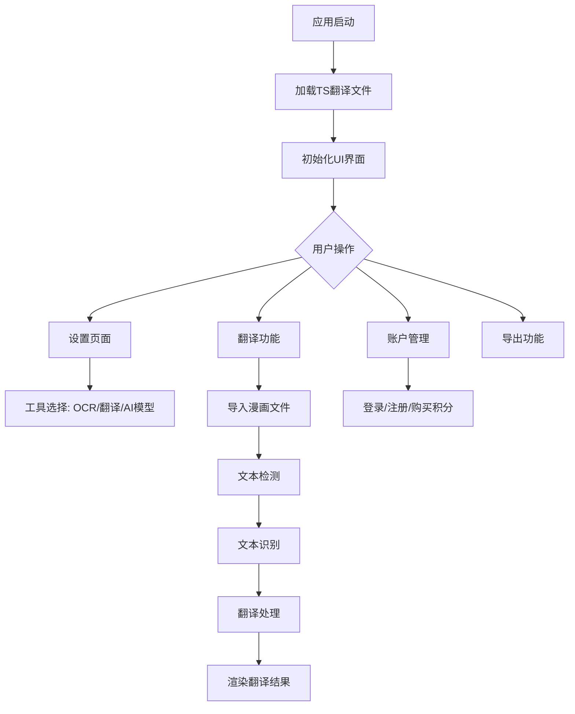

# `comic-translate\resources\translations\ct_tr.ts` 详细设计文档

这是一个漫画翻译应用的 Qt 多语言翻译源文件（TS格式），包含了用户界面的多语言支持字符串，涵盖从英语到土耳其语等多种语言的界面文本翻译，以及OCR工具、翻译服务、账户管理、设置面板等功能的UI文本。

## 整体流程



## 类结构

```
TS文件结构 (Translation Source)
├── Context: 空名称 (全局设置)
├── Context: AboutPage (关于页面)
├── Context: AccountPage (账户页面)
├── Context: ComicTranslate (主控制器消息)
├── Context: ComicTranslateUI (主界面UI)
├── Context: CredentialsPage (凭证设置页)
├── Context: ExportPage (导出设置页)
├── Context: LlmsPage (LLM设置页)
├── Context: LoginWebViewDialog (登录对话框)
├── Context: Messages (全局消息)
├── Context: PageListView (页面列表视图)
├── Context: PersonalizationPage (个性化设置)
├── Context: SearchReplaceController (搜索替换控制器)
├── Context: SearchReplacePanel (搜索替换面板)
├── Context: SettingsPage (设置页面)
├── Context: SettingsPageUI (设置界面UI)
├── Context: TextRenderingPage (文本渲染设置)
├── Context: ToolsPage (工具设置页)
└── Context: self.main (批处理报告)
```

## 全局变量及字段


    

## 全局函数及方法


## 关键组件


### ComicTranslate 应用

这是一个漫画翻译桌面应用程序的 Qt Linguist 翻译文件（.ts），用于将 UI 文本从英语翻译为土耳其语。该文件并非源代码，而是国际化/本地化资源文件。

### 上下文（Context）组件

包含多个独立的翻译上下文，每个对应应用程序的不同界面模块：
- `AboutPage`: 关于页面
- `AccountPage`: 账户页面  
- `ComicTranslateUI`: 主窗口 UI
- `CredentialsPage`: 凭证设置页面
- `ExportPage`: 导出设置页面
- `LlmsPage`: LLM（大语言模型）设置页面
- `Messages`: 应用程序消息和对话框文本
- `SearchReplaceController`: 搜索替换控制器
- `SettingsPage`: 设置页面
- `ToolsPage`: 工具设置页面
- `PageListView`: 页面列表视图

### 工具服务组件

应用程序集成的外部 AI 服务：
- **OCR/Text Recognition**: Microsoft OCR, Google Cloud Vision
- **Translation**: DeepL, Microsoft Translator, Google Gemini, Anthropic Claude, OpenAI GPT, Yandex, DeepSeek
- **Image Processing**: Inpainting（图像修复）

### 用户界面组件

- 文本渲染设置（字体、大小、颜色、描边）
- 项目管理（新建、打开、保存、导出）
- 批处理翻译功能
- 搜索和替换功能

### 消息与错误处理

包含各种用户提示和错误消息的翻译，用于：
- 网络连接错误
- 认证失败
- 积分不足
- 翻译失败
- 服务商错误

### 注意

该文件是国际化资源文件，不包含实际的程序源代码、算法实现或机器学习模型配置。如需获取代码设计文档，需要提供实际的 Python/C++/JavaScript 等源代码文件。


## 问题及建议


### 已知问题

-   **翻译状态不一致**：部分消息使用 `type="vanished"`，部分使用 `type="obsolete"`，部分没有 `type` 属性，状态管理不统一
-   **废弃翻译未清理**：大量已标记为 `type="vanished"` 和 `type="obsolete"` 的翻译条目仍然保留在文件中，增加了文件体积和维护成本
-   **冗余翻译存在**：多个 `source` 和 `translation` 完全相同（如 "Microsoft OCR"、"DeepL" 等），这些条目没有实际翻译价值
-   **上下文名称不统一**：部分 `context` 名称使用完整路径（如 `../../app/ui/settings/about_page.py`），部分使用简短的名称（如 `Messages`、`ComicTranslateUI`），缺乏一致的命名规范
-   **位置信息不完整**：部分消息有 `<location>` 标签标明文件位置，部分缺失，不利于代码与翻译的追踪维护
-   **占位符使用不一致**：部分消息使用 `{0}`、`{1}` 形式的占位符，部分使用 `{filename}`、`{version}` 等命名占位符，格式不统一

### 优化建议

-   **建立翻译生命周期管理流程**：定期清理 `vanished` 和 `obsolete` 状态的翻译条目，或使用版本控制系统管理翻译变更
-   **统一上下文命名规范**：建议所有 `context` 使用简洁的逻辑名称（如 `AboutPage`、`AccountPage`），避免暴露文件路径
-   **移除无意义翻译条目**：对于 source 和 translation 完全相同的条目进行清理，除非是用于多语言测试或保留原始品牌名称
-   **标准化占位符格式**：统一使用 `{parameter_name}` 形式的命名占位符，提高可读性和可维护性
-   **补充缺失的位置信息**：为所有用户可见的字符串添加 `<location>` 标签，便于翻译更新和错误定位
-   **考虑引入翻译管理工具**：使用 Qt Linguist 或专业的翻译管理系统（ TMS ）来自动化处理翻译状态和生命周期


## 其它


### 设计目标与约束

本翻译文件旨在为Comic Translate漫画翻译应用提供土耳其语（tr_TR）的本地化支持，确保所有用户界面文本、错误消息、菜单项和对话框文本能够正确显示为土耳其语。约束条件包括：必须保持与英文原文一致的占位符格式（如{filename}、{0}、{version}等），确保应用运行时能够正确替换动态参数；翻译文本需符合土耳其语的语法习惯和表达方式；同时需要处理一些特殊字符的转义问题（如&apos;代表单引号）。

### 错误处理与异常设计

翻译文件中通过特定的type属性处理不同状态的翻译项："vanished"表示已删除不再使用的文本，"obsolete"表示已废弃但仍保留用于参考的文本。在应用运行时，如果遇到缺失的翻译键，应回退到默认语言（英语）显示。对于包含动态占位符的翻译文本，应用层需要确保传递正确数量和类型的参数，避免因参数不匹配导致的格式化错误。

### 数据流与状态机

翻译数据流从TS源文件开始，通过Qt的翻译系统加载到应用程序中。应用程序启动时读取当前语言设置，加载对应的TS文件并构建翻译字典。用户切换语言时，系统触发翻译重新加载流程，需要重启应用以使语言变更生效（见SettingsPage中的"Restart Required"消息）。翻译文本的呈现遵循以下状态：正常显示、参数替换、缺失回退。

### 外部依赖与接口契约

本翻译文件依赖于Qt Linguist工具进行管理和编译。TS文件作为源文件，通过lrelease工具编译为QM格式的二进制翻译文件供应用程序使用。翻译文本的格式需遵循Qt的翻译规范，包括上下文名称（context）用于标识文本所属的界面模块，位置信息（location）用于追踪源码中的引用位置。应用程序通过QCoreApplication::translate()或QObject::tr()方法调用翻译文本，传入上下文名称和源文本作为标识。

### 安全性考虑

翻译文件中不包含任何敏感信息，但需要注意用户输入相关的文本翻译，例如API密钥输入提示、账户信息等。翻译文本中不应包含可能被恶意利用的可执行内容或特殊格式化指令。所有显示给用户的消息都经过适当转义处理（如使用&apos;转义单引号）。

### 性能要求与优化策略

翻译文件的加载性能直接影响应用启动速度。建议将翻译文件编译为QM二进制格式以加快加载速度。对于包含大量文本的界面（如批处理报告页面），应确保翻译文本长度适合界面布局，避免文本截断或布局错乱。翻译缓存机制可在应用启动时预加载常用翻译项。

### 国际化与本地化设计

本应用支持超过20种语言，翻译文件按照语言和地区组织（tr_TR表示土耳其-土耳其）。除文本翻译外，还需要考虑土耳其语的特殊字符（如ş、ğ、ı、ö、ü）、数字格式、日期格式等本地化需求。某些UI元素（如"Custom"、"Default"等专有名词）保留英文形式以保持一致性。

### 可扩展性与模块化设计

翻译文件按功能模块划分不同的context，便于维护和更新。新的界面功能只需在对应的context中添加新的message条目。不同语言的翻译文件可独立更新，支持增量发布。翻译文本的source属性用于标识英文原文，translation属性存储目标语言译文。

### 测试策略

翻译文件需要通过以下测试：完整性测试（确保所有源文本都有对应翻译）、参数匹配测试（验证占位符数量和顺序一致）、界面布局测试（验证翻译文本在UI中的显示效果）、语言质量测试（确保翻译符合目标语言的语法和表达习惯）。自动化测试脚本应检查TS文件的XML格式有效性和必需属性的完整性。

### 版本兼容性与迁移策略

当应用版本升级引入新的UI文本或修改现有文本时，翻译文件需要相应更新。"vanished"和"obsolete"属性用于处理已废弃的文本，确保旧版本翻译文件的向后兼容性。翻译文件的版本应与应用版本保持同步发布，建议在发布说明中包含翻译更新的相关说明。


    