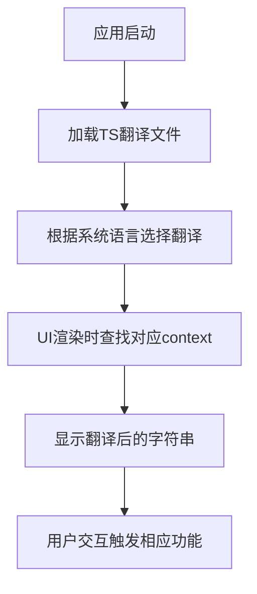

# `comic-translate\resources\translations\ct_zh-CN.ts` 详细设计文档

这是Comic Translate漫画翻译应用的简体中文翻译资源文件（Qt TS格式），包含了应用程序所有UI界面的字符串翻译，涵盖设置页面（账户、凭证、大模型、文本渲染、导出、高级、关于）、主界面、搜索替换功能、批处理报告等多种模块的界面文本翻译。

## 整体流程



## 类结构

```
Translation Source File (TS)
├── 全局/通用 (无context名称)
├── AboutPage (关于页面)
├── AccountPage (账户页面)
├── ComicTranslate (主控制器消息)
├── ComicTranslateUI (主界面)
├── CredentialsPage (凭证/API密钥设置)
├── ExportPage (导出设置)
├── LlmsPage (大模型设置)
├── LoginWebViewDialog (登录对话框)
├── Messages (各种消息提示)
├── PageListView (页面列表视图)
├── PersonalizationPage (个性化设置)
├── SearchReplaceController (搜索替换控制器)
├── SearchReplacePanel (搜索替换面板)
├── SettingsPage (设置页面)
├── SettingsPageUI (设置页面UI)
├── TextRenderingPage (文本渲染设置)
└── ToolsPage (工具/服务设置)
```

## 全局变量及字段


    

## 全局函数及方法


## 关键组件


### ComicTranslate (主控制器)

应用程序的核心控制器，处理翻译流程和用户交互逻辑

### ComicTranslateUI (主窗口)

应用程序主界面，提供多语言支持、文件导入导出和项目管理功能

### AccountPage (账户页面)

用户账户管理界面，支持登录、积分查询和购买功能

### SettingsPage (设置页面)

应用程序设置中心，管理工具选择、API凭证、文本渲染和导出配置

### Messages (消息系统)

统一的用户提示和错误消息管理，包含操作反馈和异常提示

### Batch Report (批处理报告)

批量翻译任务的状态追踪和错误报告功能

### TextRenderingPage (文本渲染设置)

字体选择、大小配置和文本渲染效果设置

### ToolsPage (工具配置页面)

OCR识别、翻译器、图像清理和修复工具的配置界面

### ExportPage (导出设置)

自动保存模式、文件格式转换和归档导出配置

### CredentialsPage (API凭证管理)

用户自定义API密钥和端点配置界面

### LlmsPage (大语言模型配置)

多模态AI模型输入和额外上下文配置

### PersonalizationPage (个性化设置)

界面主题和语言选择功能

### SearchReplacePanel (搜索替换面板)

文本搜索、替换和范围选择功能

### PageListView (页面列表视图)

项目管理中的页面插入、删除和翻译状态管理

### AboutPage (应用信息)

版本信息和更新检查功能


## 问题及建议


### 已知问题

-   存在大量 `type="vanished"` 的翻译条目，这些是已被删除但仍保留在文件中的旧翻译，会造成文件冗余
-   存在多个 `type="obsolete"` 的翻译条目，这些是已过时的翻译，应该被清理或更新
-   某些 `<context>` 中存在重复的 `<message>` 节点，部分带有 `type="obsolete"` 属性，部分没有，导致翻译状态不一致
-   翻译文件中有大量供应商名称翻译（如 Microsoft OCR、Google Cloud Vision 等），但这些翻译在 UI 中实际未被使用（显示为 vanished 状态）
-   部分翻译消息缺少对应的源文本或翻译文本为空
-   文件中存在一些冗余的上下文（context），如 `LoginWebViewDialog` 只有 vanished 状态的翻译

### 优化建议

-   清理所有 `type="vanished"` 和 `type="obsolete"` 的翻译条目，以减小文件体积并提高可维护性
-   统一翻译状态管理，对于仍在使用的翻译移除过时状态标记
-   合并重复的 `<message>` 节点，保留最新的有效翻译
-   移除完全不使用的翻译上下文（如供应商名称的旧翻译）
-   定期审查翻译文件，移除不再需要的翻译内容，保持翻译库的精简
-   考虑为翻译条目添加注释说明其用途或废弃原因，便于后续维护


## 其它


### 设计目标与约束

本翻译文件旨在为Comic Translate漫画翻译应用提供完整的中文（简体）本地化支持。核心设计目标包括：确保所有用户界面文本、错误提示、操作指引等均能被准确翻译为中文；支持多语言扩展，预留其他语言翻译的接口；维护翻译上下文的一致性，通过context标签区分不同模块的同名消息。约束条件方面，需遵循Qt Linguist的TS文件规范，支持TS version 2.1；翻译文本长度需适配原有UI布局，避免文本溢出；部分专业术语（如API名称、模型名称）保持英文原样。

### 错误处理与异常设计

本翻译文件涉及两类错误处理场景。第一类是翻译状态标记：通过type属性区分不同状态的翻译消息，包括"vanished"（已废弃）、"obsolete"（已过时）和空值（正常翻译）。第二类是错误提示的本地化：系统在controller.py、batch_processor.py等模块中定义了多种错误情况，包括网络连接失败、API认证失败、积分不足、内容被安全过滤器拦截等，每种错误均有对应的中文翻译版本，供UI层直接调用展示给用户。

### 数据流与状态机

翻译数据流主要涉及TS文件的解析和加载过程。Qt应用启动时读取TS文件，将翻译内容加载到字符串翻译表中，供UI组件在显示文本时查询使用。翻译状态机包含三种状态转换路径：正常翻译（无type属性）→已过时翻译（type="obsolete"）→已废弃翻译（type="vanished"），这一演进过程反映了应用功能的迭代变化。部分消息的translation元素为空，表示该文本在当前版本中尚未被翻译。

### 外部依赖与接口契约

本翻译文件依赖Qt框架的国际化系统，具体接口契约为：必须遵循TS 2.1规范编写XML结构；每个<message>元素需包含<source>子元素定义源文本，<translation>子元素定义目标翻译；context属性用于区分不同模块的同名消息；location属性标注翻译文本在源代码中的位置，便于翻译人员定位。所有翻译键值（source内容）不可随意修改，否则将导致已翻译内容失效。

### 国际化与本地化设计

本项目采用标准的Qt国际化架构，支持21种语言的UI文本翻译。翻译粒度按context分组，同一功能模块的翻译消息归入同一context，便于管理。翻译文本支持占位符（如{filename}、{version}、{0}等），通过Qt的tr()机制实现动态参数替换。部分翻译包含换行符（\n）以适配多行显示需求。翻译风格保持简洁中性，符合技术文档的语言规范。

### 关键术语表

为保证翻译一致性，本文件定义了关键术语的翻译规范："OCR"保持英文；"GPT"、"Gemini"、"Claude"等模型名称保留英文；"Credits"译为"积分"；"Webtoon"译为"条漫"；"Inpainting"译为"修复填充"；"Batch"译为"批处理"。技术参数名称（如Temperature、Max Tokens等）保留英文，因其已在开发者社区形成通用术语。

### 版本兼容性说明

本TS文件指定version="2.1"，需配合Qt 5.14及以上版本使用。部分翻译使用了type="vanished"和type="obsolete"属性，表明这些文本已在新版本中被替换或废弃。翻译文件本身的编码格式为UTF-8，确保中文字符的正确解析。应用在加载翻译文件时需处理缺失翻译的降级策略，即当某条翻译不存在时回退显示源文本。

    