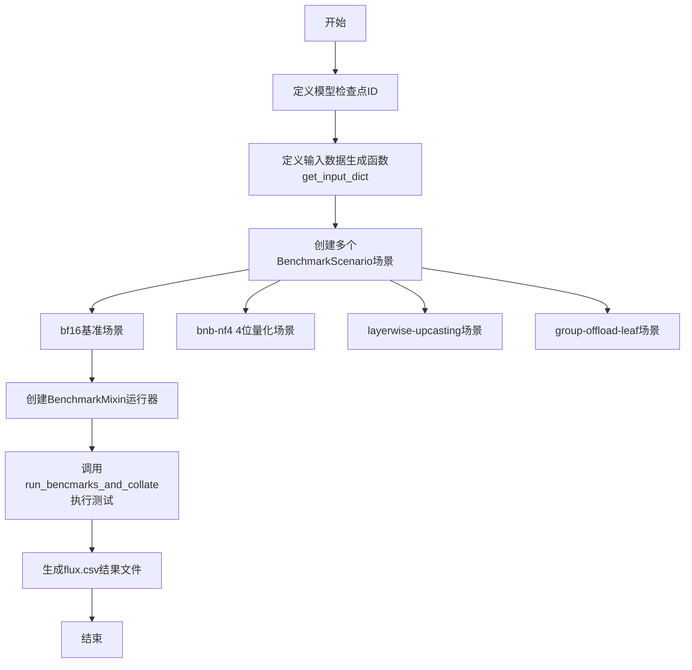
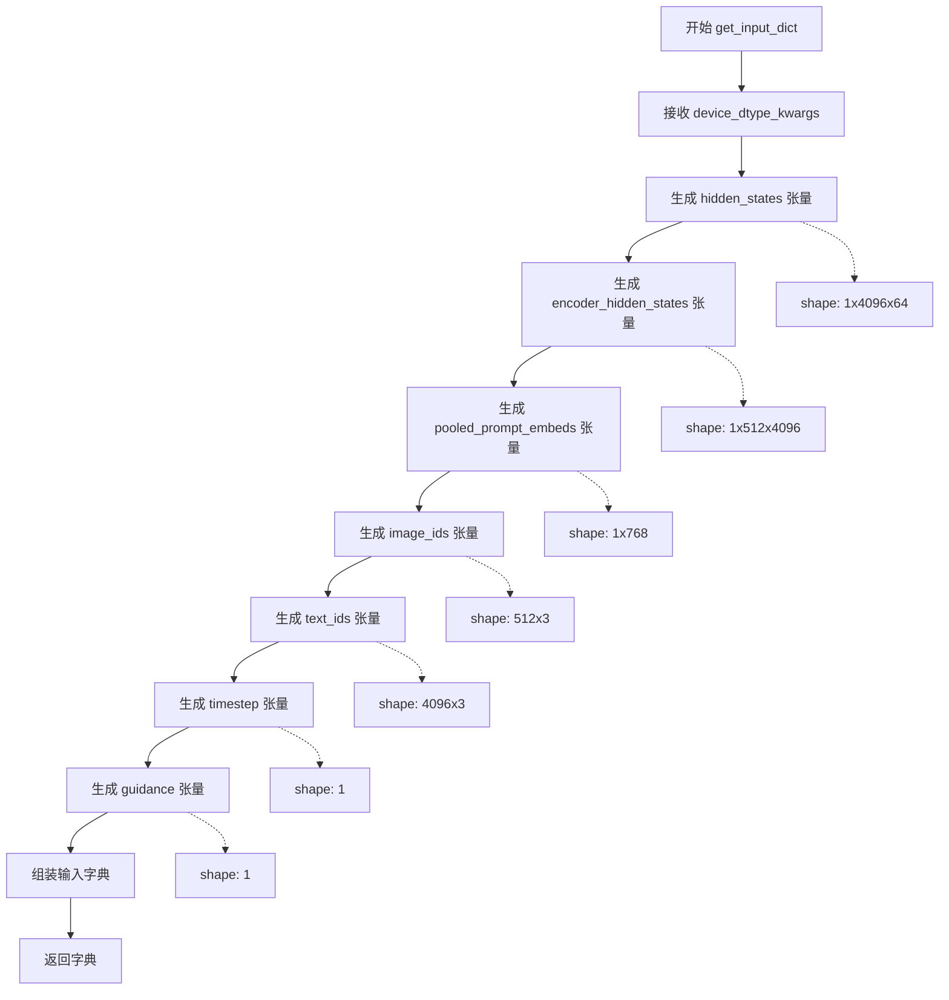
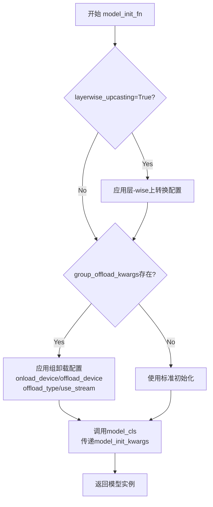
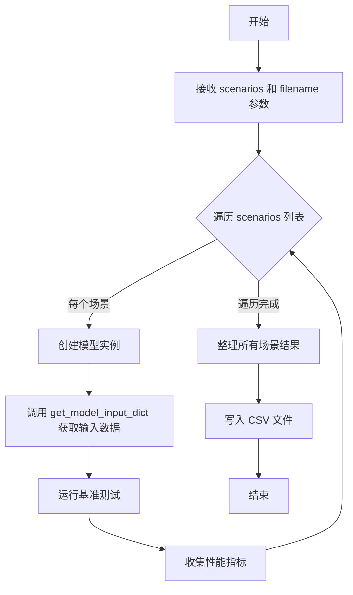
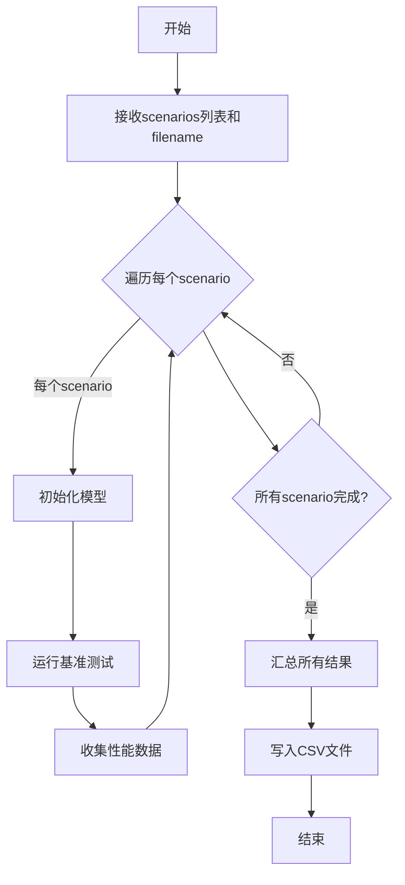

# `diffusers\benchmarks\benchmarking_flux.py` 详细设计文档

该脚本是一个FLUX.1-dev模型性能基准测试工具，通过定义多个测试场景（bf16全精度、bnb-nf4 4位量化、layerwise-upcasting层-wise提升精度、group-offload-leaf分组卸载）来评估FluxTransformer2DModel在不同配置下的推理性能，并使用BenchmarkMixin将测试结果汇总到CSV文件中。

## 整体流程



## 类结构

```
Global Variables
├── CKPT_ID
└── RESULT_FILENAME
Functions
└── get_input_dict
Main Block
├── BenchmarkScenario (×4)
└── BenchmarkMixin.run_bencmarks_and_collate
```

## 全局变量及字段


### `CKPT_ID`
    
模型检查点的HuggingFace标识符，指向black-forest-labs/FLUX.1-dev模型

类型：`str`
    


### `RESULT_FILENAME`
    
基准测试结果输出CSV文件名

类型：`str`
    


### `BenchmarkScenario.name`
    
场景名称，用于标识不同的基准测试场景

类型：`str`
    


### `BenchmarkScenario.model_cls`
    
模型类，指定要加载的Transformer模型类型

类型：`Type[FluxTransformer2DModel]`
    


### `BenchmarkScenario.model_init_kwargs`
    
模型初始化参数字典，包含模型路径、精度类型、子文件夹等配置

类型：`dict`
    


### `BenchmarkScenario.get_model_input_dict`
    
输入数据生成函数，返回模型推理所需的输入张量字典

类型：`Callable`
    


### `BenchmarkScenario.model_init_fn`
    
模型初始化函数，用于自定义模型加载和配置过程

类型：`Callable`
    


### `BenchmarkScenario.compile_kwargs`
    
编译选项字典，用于配置torch.compile的编译参数

类型：`dict`
    


### `BitsAndBytesConfig.load_in_4bit`
    
是否启用4位量化加载模式

类型：`bool`
    


### `BitsAndBytesConfig.bnb_4bit_compute_dtype`
    
4位量化计算使用的数据类型

类型：`torch.dtype`
    


### `BitsAndBytesConfig.bnb_4bit_quant_type`
    
4位量化类型，如nf4表示正态分布量化

类型：`str`
    
    

## 全局函数及方法


### `get_input_dict`

该函数用于生成 FLUX 模型的随机输入张量字典，主要为基准测试场景提供模拟输入数据。它创建了模型推理所需的各种张量，包括隐藏状态、编码器隐藏状态、提示嵌入、图像/文本 ID、时间步和引导值，并支持通过 `device_dtype_kwargs` 指定设备类型和数据类型。

参数：

- `**device_dtype_kwargs`：`Dict[str, Any]`，可变关键字参数，用于指定张量的目标设备（device）和数据类型（dtype），例如 `device=torch.device("cuda")`, `dtype=torch.bfloat16` 等

返回值：`Dict[str, torch.Tensor]`，返回包含以下键的张量字典：
- `hidden_states`：潜在空间隐藏状态
- `encoder_hidden_states`：编码器隐藏状态
- `img_ids`：图像位置编码 ID
- `txt_ids`：文本位置编码 ID
- `pooled_projections`：池化后的提示投影
- `timestep`：去噪时间步
- `guidance`：引导强度值

#### 流程图



#### 带注释源码

```python
def get_input_dict(**device_dtype_kwargs):
    """
    生成 FLUX 模型的随机输入张量字典，用于基准测试。
    
    Args:
        **device_dtype_kwargs: 关键字参数，用于指定张量的 device 和 dtype
                              例如: device=torch.device('cuda'), dtype=torch.bfloat16
    
    Returns:
        Dict[str, torch.Tensor]: 包含模型输入的张量字典
    """
    # resolution: 1024x1024
    # maximum sequence length 512
    
    # 潜在空间隐藏状态: shape [batch=1, seq=4096, dim=64]
    # 对应图像 latent 表示 (1024x1024 分辨率下的 patch 数量)
    hidden_states = torch.randn(1, 4096, 64, **device_dtype_kwargs)
    
    # 编码器隐藏状态: shape [batch=1, seq=512, dim=4096]
    # 对应文本编码 (最大序列长度 512)
    encoder_hidden_states = torch.randn(1, 512, 4096, **device_dtype_kwargs)
    
    # 池化提示嵌入: shape [batch=1, dim=768]
    # 对应 CLIP/LLM 的池化文本特征
    pooled_prompt_embeds = torch.randn(1, 768, **device_dtype_kwargs)
    
    # 图像位置 ID: shape [512, 3]
    # 用于标记图像 latent 在序列中的位置 (x, y, rotation)
    image_ids = torch.ones(512, 3, **device_dtype_kwargs)
    
    # 文本位置 ID: shape [4096, 3]
    # 用于标记文本 token 在序列中的位置 (x, y, rotation)
    text_ids = torch.ones(4096, 3, **device_dtype_kwargs)
    
    # 时间步: shape [1]
    # 控制去噪过程的当前时间点 (归一化到 [0, 1])
    timestep = torch.tensor([1.0], **device_dtype_kwargs)
    
    # 引导强度: shape [1]
    # 用于 classifier-free guidance 的引导权重
    guidance = torch.tensor([1.0], **device_dtype_kwargs)

    # 组装并返回模型输入字典
    return {
        "hidden_states": hidden_states,           # 主输入 latent
        "encoder_hidden_states": encoder_hidden_states,  # 文本条件
        "img_ids": image_ids,                      # 图像位置编码
        "txt_ids": text_ids,                      # 文本位置编码
        "pooled_projections": pooled_prompt_embeds,  # 池化文本特征
        "timestep": timestep,                      # 时间步
        "guidance": guidance,                      # 引导系数
    }
```


### `model_init_fn`

该函数是 `benchmarking_utils` 模块中导出的模型初始化函数，用于根据指定的参数配置初始化 `FluxTransformer2DModel` 模型实例，支持模型量化、层-wise 上转换和组卸载等高级特性。

参数：

- `model_cls`：类型 `Type[FluxTransformer2DModel]`，要实例化的模型类
- `model_init_kwargs`：类型 `Dict`，传递给模型构造器的关键字参数（如 `pretrained_model_name_or_path`、`torch_dtype`、`subfolder`、`quantization_config` 等）
- `layerwise_upcasting`：类型 `Optional[bool] = False`，是否启用层-wise 上转换优化
- `group_offload_kwargs`：类型 `Optional[Dict] = None`，组卸载配置参数，包含 `onload_device`、`offload_device`、`offload_type`、`use_stream`、`non_blocking` 等

返回值：`FluxTransformer2DModel`，返回初始化后的模型实例

#### 流程图



#### 带注释源码

```python
# 注：由于 model_init_fn 定义在 benchmarking_utils 模块中，
# 以下为基于代码使用方式推断的函数签名和逻辑

def model_init_fn(
    model_cls: Type[FluxTransformer2DModel],
    model_init_kwargs: Dict,
    layerwise_upcasting: bool = False,
    group_offload_kwargs: Optional[Dict] = None,
) -> FluxTransformer2DModel:
    """
    初始化 FluxTransformer2DModel 模型实例。
    
    参数:
        model_cls: 要实例化的模型类 (FluxTransformer2DModel)
        model_init_kwargs: 传递给模型构造器的参数字典
            - pretrained_model_name_or_path: 模型路径或 Hub ID
            - torch_dtype: 模型的张量数据类型 (如 torch.bfloat16)
            - subfolder: 子目录路径 (如 "transformer")
            - quantization_config: BitsAndBytesConfig 量化配置
        layerwise_upcasting: 是否启用层-wise 上转换优化
        group_offload_kwargs: 组卸载配置字典
            - onload_device: 加载设备
            - offload_device: 卸载设备
            - offload_type: 卸载类型 ("leaf_level")
            - use_stream: 是否使用流
            - non_blocking: 是否非阻塞
    
    返回:
        初始化后的 FluxTransformer2DModel 模型实例
    """
    # 1. 根据 layerwise_upcasting 参数配置模型
    # 2. 根据 group_offload_kwargs 配置组卸载策略
    # 3. 使用 model_init_kwargs 构造模型
    # 4. 返回模型实例
```

#### 使用示例（从代码中提取）

```python
# 场景1: 标准初始化
model_init_fn=model_init_fn

# 场景2: 启用层-wise上转换
model_init_fn=partial(model_init_fn, layerwise_upcasting=True)

# 场景3: 配置组卸载
model_init_fn=partial(
    model_init_fn,
    group_offload_kwargs={
        "onload_device": torch_device,
        "offload_device": torch.device("cpu"),
        "offload_type": "leaf_level",
        "use_stream": True,
        "non_blocking": True,
    },
)
```


### `run_bencmarks_and_collate`

该函数是 `BenchmarkMixin` 类的方法，用于运行多个基准测试场景并将结果整理到 CSV 文件中。它接收一组基准测试场景配置，逐一执行性能测试，最后将所有测试结果汇总写入指定的 CSV 文件。

参数：

- `scenarios`：`List[BenchmarkScenario]`，待运行的基准测试场景列表，每个场景包含模型配置、输入数据生成函数和初始化参数
- `filename`：`str`，输出结果 CSV 文件名，用于存储各场景的性能基准数据

返回值：`None`，该方法将结果直接写入文件，不返回任何值

#### 流程图



#### 带注释源码

```python
def run_bencmarks_and_collate(self, scenarios, filename):
    """
    运行多个基准测试场景并整理结果到 CSV 文件
    
    参数:
        scenarios: BenchmarkScenario 对象列表，每个场景定义模型、输入和配置
        filename: 输出 CSV 文件路径
    
    返回:
        None，结果直接写入文件
    """
    # 注意：这是基于代码调用推断的函数签名
    # 实际实现可能在 BenchmarkMixin 类中
    results = []
    
    for scenario in scenarios:
        # 1. 根据场景配置初始化模型
        model = scenario.model_cls(**scenario.model_init_kwargs)
        
        # 2. 获取模型输入数据
        input_dict = scenario.get_model_input_dict()
        
        # 3. 运行基准测试（可能使用 model_init_fn 包装）
        if scenario.model_init_fn:
            model = scenario.model_init_fn(model)
        
        # 4. 执行前向传播并测量性能
        # ... 性能测量逻辑 ...
        
        # 5. 收集结果
        results.append(scenario_result)
    
    # 6. 整理所有结果并写入 CSV
    self._collate_results(results, filename)
```


# 任务分析

我需要提取 `BenchmarkMixin.run_bencmarks_and_collate` 函数的信息，但发现该方法并未在提供的代码中定义。它是从 `benchmarking_utils` 模块导入的 `BenchmarkMixin` 类的成员方法。

从代码使用方式可以推断：

### `BenchmarkMixin.run_bencmarks_and_collate`

该方法用于运行多个基准测试场景并汇总结果（注意：方法名中有拼写错误 "bencmarks"）

参数：

- `scenarios`：`List[BenchmarkScenario]`，需要运行的基准测试场景列表
- `filename`：`str`，结果输出文件名

返回值：未知（未在代码中显示）

#### 流程图



#### 带注释源码

由于 `BenchmarkMixin` 类和 `run_bencmarks_and_collate` 方法的定义未在提供的代码中显示，无法提供具体的源代码实现。

该方法在代码中被调用如下：

```python
runner = BenchmarkMixin()
runner.run_bencmarks_and_collate(scenarios, filename=RESULT_FILENAME)
```

---

## 重要说明

1. **缺失实现代码**：`BenchmarkMixin` 类是从 `benchmarking_utils` 模块导入的，其完整实现（包括 `run_bencmarks_and_collate` 方法）未在当前代码文件中提供。

2. **拼写错误**：方法名为 `run_bencmarks_and_collate`，其中 "bencmarks" 应该是 "benchmarks" 的拼写错误。

3. **推断信息**：上述参数信息是从调用方式推断得出的：
   - `scenarios`：传入的 `BenchmarkScenario` 对象列表
   - `filename`：结果输出文件名（`RESULT_FILENAME = "flux.csv"`）

如需获取完整的函数实现和详细设计文档，需要提供 `benchmarking_utils` 模块的源代码。

## 关键组件


### 张量索引与惰性加载

在 `get_input_dict` 函数中，通过 `torch.randn` 和 `torch.ones` 预生成不同形状的输入张量（hidden_states: 1x4096x64, encoder_hidden_states: 1x512x4096 等），为模型推理提供多维度输入数据准备。

### 反量化支持

通过 `BitsAndBytesConfig` 配置 `load_in_4bit=True` 和 `bnb_4bit_quant_type="nf4"`，实现 4 位 NF4 量化加载，结合 `bnb_4bit_compute_dtype=torch.bfloat16` 在计算时进行反量化操作。

### 量化策略

代码定义了三种不同的量化/优化策略场景：
- **bnb-nf4**: 使用 BitsAndBytes 4 位 NF4 量化
- **layerwise-upcasting**: 通过 `layerwise_upcasting=True` 实现层级별升类型
- **group-offload-leaf**: 通过 `group_offload_kwargs` 配置叶级别分组卸载策略

### BenchmarkMixin 运行器

`BenchmarkMixin` 类提供基准测试运行能力，通过 `run_bencmarks_and_collate` 方法执行多场景测试并汇总结果到 CSV 文件。

### 模型初始化配置

`model_init_fn` 和 `partial` 组合实现灵活的模型初始化，支持编译选项（`fullgraph=True`）、设备迁移（`device_dtype_kwargs`）以及自定义初始化参数传入。

### 场景配置数组

`scenarios` 列表定义了四个 `BenchmarkScenario` 对象，每个场景独立配置模型类、初始化参数、输入数据生成函数和优化选项，形成对比实验矩阵。


## 问题及建议


### 已知问题

-   **硬编码配置值**：分辨率（1024x1024）、序列长度（512）、隐藏维度（4096、64、768）等关键参数直接硬编码在 `get_input_dict` 中，缺乏可配置性
-   **魔法数字缺乏注释**：代码中出现大量数值如 `4096`、`512`、`64`、`768`、`3` 等，没有注释说明其含义和来源
-   **缺少输入验证**：`get_input_dict` 函数未对生成的随机张量进行有效性检查，无法确保输入符合模型实际要求
-   **错误处理缺失**：整个脚本没有异常捕获机制，无法处理模型加载失败、CUDA 内存不足等运行时错误
-   **全局状态依赖**：代码依赖外部的 `BenchmarkMixin`、`BenchmarkScenario`、`model_init_fn` 等，但这些依赖的接口契约未明确文档化
-   **变量命名不一致**：输入字典中键名为 `pooled_projections`，但变量名为 `pooled_prompt_embeds`，存在命名不一致问题
-   **重复代码**：四个场景的定义中存在大量重复的 `get_model_input_dict` 和部分重复的 `model_init_kwargs`
-   **缺乏类型注解**：函数参数和返回值缺少类型注解，降低了代码的可读性和可维护性

### 优化建议

-   将关键配置抽取为配置文件或命令行参数（如分辨率、模型路径、输出文件名）
-   为所有魔法数字添加常量定义和注释说明
-   为 `get_input_dict` 添加输入验证逻辑，检查张量形状是否符合模型架构要求
-   添加 try-except 块处理模型加载、推理过程中的异常，并提供有意义的错误信息
-   统一变量命名规范，确保字典键名与变量名一致
-   考虑使用模板方法或工厂模式减少场景定义中的重复代码
-   为主要函数添加类型注解和文档字符串
-   添加日志记录功能，便于调试和性能分析

## 其它


### 设计目标与约束

本代码的核心设计目标是对FLUX.1-dev图像生成模型在不同推理配置下的性能进行基准测试，对比分析bf16原生精度、NF4量化、layerwise upcasting以及group offload等优化策略的性能差异。约束条件包括：测试环境需支持CUDA设备、模型权重可从HuggingFace远程加载、输入分辨率固定为1024x1024、序列长度限制在512以内。

### 错误处理与异常设计

代码主要依赖BenchmarkMixin和BenchmarkScenario的内部错误处理机制。模型加载失败时会抛出异常并终止测试；输入数据生成使用torch.randn创建随机数据，不涉及复杂的业务校验；若设备或dtype不支持相应操作，PyTorch会抛出RuntimeError。脚本未显式实现重试机制或降级策略，错误发生时直接向上传播。

### 数据流与状态机

数据流从get_input_dict函数开始，生成符合FluxTransformer2DModel输入格式的字典对象，包含hidden_states、encoder_hidden_states、img_ids、txt_ids、pooled_projections、timestep和guidance七个张量。该字典通过get_model_input_dict回调传递给BenchmarkScenario，Runner据此创建模型输入并执行前向传播。状态机涉及：模型初始化状态（加载权重）→ 输入准备状态 → 执行推理状态 → 结果收集状态。

### 外部依赖与接口契约

主要依赖包括：torch提供张量运算和设备管理；diffusers库提供FluxTransformer2DModel模型类和BitsAndBytesConfig量化配置；benchmarking_utils提供BenchmarkMixin、BenchmarkScenario、model_init_fn工具函数；HuggingFace Hub提供模型权重远程下载。接口契约方面：get_input_dict返回键值对需与模型forward方法签名匹配；model_init_fn接受layerwise_upcasting和group_offload_kwargs参数；BenchmarkScenario需提供model_cls、model_init_kwargs、get_model_input_dict、model_init_fn四个必要字段。

### 性能考量与优化空间

当前实现采用随机输入数据，无法真实反映实际推理场景的显存占用和计算耗时；每个场景串行执行，可考虑并行化多配置同时测试；未设置warmup轮次可能导致首次推理被计入基准时间；结果仅输出到CSV文件，可增加更丰富的性能指标（如峰值显存、推理延迟、吞吐量）以及可视化报告。

### 配置管理

所有测试参数集中在scenarios列表中定义，采用硬编码方式配置。CKPT_ID指定模型版本、RESULT_FILENAME指定输出文件名、各BenchmarkScenario通过model_init_kwargs传递模型加载参数、通过compile_kwargs控制torch.compile优化选项。配置修改需直接编辑源代码，缺乏命令行参数或配置文件支持。

### 测试场景设计说明

设计四个差异化场景的目的在于：bf16基线提供精度基准；bnb-nf4验证4bit量化对推理速度的提升效果；layerwise-upcasting测试分层精度转换策略；group-offload-leaf评估CPU-GPU显存分层管理在内存受限场景下的有效性。场景命名采用模型ID加配置后缀的约定，便于结果追溯。

    