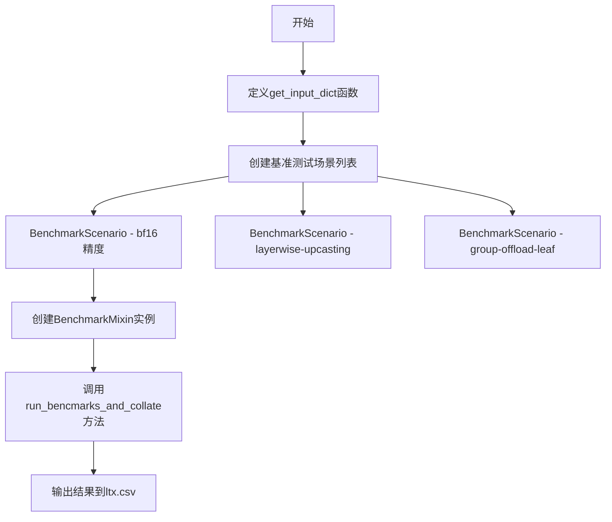
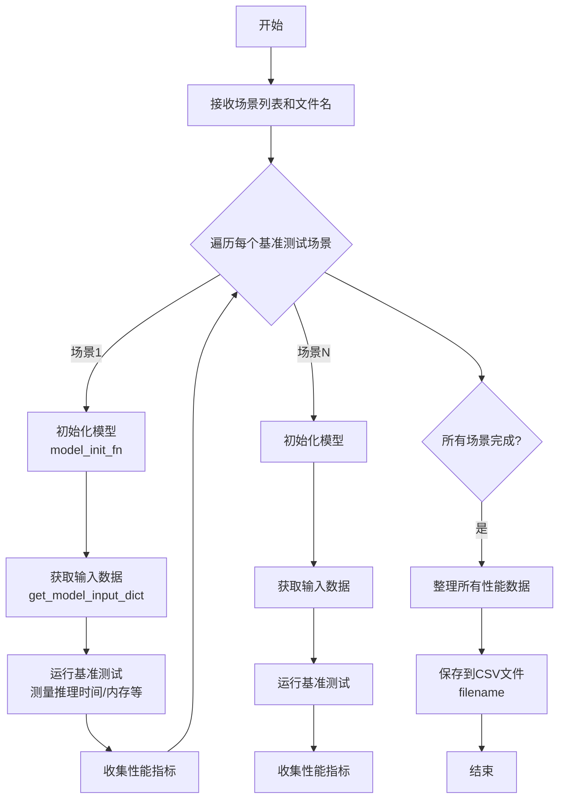

# `diffusers\benchmarks\benchmarking_ltx.py` 详细设计文档

该脚本是一个基准测试工具，用于评估和比较LTXVideoTransformer3DModel在不同配置下（bf16精度、layerwise-upcasting、group-offload-leaf）的性能表现，通过生成多个测试场景并运行基准测试来收集性能数据。

## 整体流程



## 类结构

```
无自定义类定义
主要使用外部库类:
├── BenchmarkMixin (基准测试运行器)
├── BenchmarkScenario (场景配置)
├── LTXVideoTransformer3DModel (被测模型)
└── model_init_fn (模型初始化函数)
```

## 全局变量及字段


### `CKPT_ID`
    
模型检查点标识符，值为'Lightricks/LTX-Video-0.9.7-dev'

类型：`str`
    


### `RESULT_FILENAME`
    
输出结果文件名，值为'ltx.csv'

类型：`str`
    


### `scenarios`
    
存储多个BenchmarkScenario对象的列表

类型：`list`
    


### `runner`
    
基准测试运行器实例

类型：`BenchmarkMixin`
    


    

## 全局函数及方法


### `get_input_dict`

该函数用于生成模型推理所需的输入张量字典，为 LTX-Video Transformer 3D 模型提供 hidden_states、encoder_hidden_states、encoder_attention_mask、timestep 和 video_coords 等张量，主要用于基准测试场景。

参数：

- `**device_dtype_kwargs`：关键字参数，用于指定张量的设备（device）和数据类型（dtype），通常包含 `device` 和 `torch.dtype` 等参数

返回值：`Dict[str, torch.Tensor]`，返回包含以下键值对的字典：
- `hidden_states`：torch.Tensor，形状 (1, 7392, 128)，输入的潜在状态张量
- `encoder_hidden_states`：torch.Tensor，形状 (1, 256, 4096)，编码器的隐藏状态
- `encoder_attention_mask`：torch.Tensor，形状 (1, 256)，编码器注意力掩码（全1）
- `timestep`：torch.Tensor，形状 (1,)，时间步张量，值为 1.0
- `video_coords`：torch.Tensor，形状 (1, 3, 7392)，视频坐标张量

#### 流程图

```mermaid
flowchart TD
    A[开始 get_input_dict] --> B[接收 device_dtype_kwargs 参数]
    B --> C[生成 hidden_states: torch.randn(1, 7392, 128)]
    C --> D[生成 encoder_hidden_states: torch.randn(1, 256, 4096)]
    D --> E[生成 encoder_attention_mask: torch.ones(1, 256)]
    E --> F[生成 timestep: torch.tensor([1.0])]
    F --> G[生成 video_coords: torch.randn(1, 3, 7392)]
    G --> H[组装字典并返回]
    H --> I[结束]
```

#### 带注释源码

```python
def get_input_dict(**device_dtype_kwargs):
    """
    生成模型输入张量字典，用于 LTX-Video Transformer 3D 模型的基准测试。
    
    参数:
        **device_dtype_kwargs: 关键字参数，用于指定张量的设备和数据类型。
                              通常包含 'device' 和 'dtype' 参数。
    
    返回:
        Dict[str, torch.Tensor]: 包含模型所需输入的字典，包括:
            - hidden_states: 输入潜在状态 (batch=1, seq=7392, dim=128)
            - encoder_hidden_states: 编码器隐藏状态 (batch=1, seq=256, dim=4096)
            - encoder_attention_mask: 编码器注意力掩码 (batch=1, seq=256)
            - timestep: 时间步 (batch=1,)
            - video_coords: 视频坐标 (batch=1, coord_dim=3, seq=7392)
    """
    
    # 512x704 分辨率，161 帧
    # `max_sequence_length`: 256
    
    # 生成随机初始隐藏状态张量，形状 (1, 7392, 128)
    # 7392 = 512 * 704 / 49 (patch 分割后的序列长度), 128 是隐藏维度
    hidden_states = torch.randn(1, 7392, 128, **device_dtype_kwargs)
    
    # 生成编码器隐藏状态，形状 (1, 256, 4096)
    # 256 是最大序列长度，4096 是文本编码器维度
    encoder_hidden_states = torch.randn(1, 256, 4096, **device_dtype_kwargs)
    
    # 生成编码器注意力掩码，形状 (1, 256)，全1表示全部位置可见
    encoder_attention_mask = torch.ones(1, 256, **device_dtype_kwargs)
    
    # 生成时间步张量，形状 (1,)，值为 1.0
    timestep = torch.tensor([1.0], **device_dtype_kwargs)
    
    # 生成视频坐标张量，形状 (1, 3, 7392)
    # 3 表示 (x, y, t) 坐标维度
    video_coords = torch.randn(1, 3, 7392, **device_dtype_kwargs)

    # 返回包含所有输入张量的字典
    return {
        "hidden_states": hidden_states,
        "encoder_hidden_states": encoder_hidden_states,
        "encoder_attention_mask": encoder_attention_mask,
        "timestep": timestep,
        "video_coords": video_coords,
    }
```


由于 `BenchmarkMixin` 类和 `run_bencmarks_and_collate` 方法是从外部模块 `benchmarking_utils` 导入的，在当前代码文件中没有提供其完整实现。以下信息是基于代码调用方式进行的分析和推断。

### BenchmarkMixin.run_bencmarks_and_collate

运行多个基准测试场景并整理结果数据到CSV文件中

参数：

- `scenarios`：`List[BenchmarkScenario]`，要运行的基准测试场景列表，每个场景包含模型类、初始化参数和输入数据配置
- `filename`：`str`，结果输出文件名，用于保存基准测试结果

返回值：未知（取决于 `benchmarking_utils` 模块的实现，可能是 `None` 或包含测试结果的字典）

#### 流程图



#### 带注释源码

```python
# 注意：此源码为基于调用方式的推断，实际实现来自 benchmark_utils 模块
def run_bencmarks_and_collate(self, scenarios: List[BenchmarkScenario], filename: str) -> Any:
    """
    运行多个基准测试场景并整理结果
    
    参数:
        scenarios: BenchmarkScenario对象列表，每个场景定义:
            - name: 场景名称
            - model_cls: 模型类 (如 LTXVideoTransformer3DModel)
            - model_init_kwargs: 模型初始化参数
            - get_model_input_dict: 获取输入数据的函数
            - model_init_fn: 模型初始化函数
            - compile_kwargs: 编译优化选项 (可选)
        
        filename: 结果输出CSV文件名
    
    返回:
        基准测试结果数据
    """
    results = []
    
    # 遍历每个测试场景
    for scenario in scenarios:
        # 1. 根据场景配置初始化模型
        model = scenario.model_init_fn(
            model_cls=scenario.model_cls,
            **scenario.model_init_kwargs
        )
        
        # 2. 获取测试输入数据
        input_dict = scenario.get_model_input_dict()
        
        # 3. 运行基准测试 (测量推理时间、内存占用等)
        metrics = self._run_single_benchmark(
            model=model,
            input_dict=input_dict,
            compile_kwargs=scenario.compile_kwargs
        )
        
        # 4. 记录场景名称和指标
        result = {"scenario": scenario.name, **metrics}
        results.append(result)
    
    # 5. 整理所有结果数据
    collated_results = self._collate_results(results)
    
    # 6. 保存到CSV文件
    self._save_to_csv(collated_results, filename)
    
    return collated_results
```

---

## 补充说明

由于 `BenchmarkMixin` 类来自外部 `benchmarking_utils` 模块，当前代码文件仅展示了其**使用方式**而非**实现细节**。以下是基于调用上下文提供的额外信息：

### 关键组件信息

| 组件名称 | 一句话描述 |
|---------|-----------|
| `BenchmarkMixin` | 基准测试运行器，提供统一的基准测试执行和结果整理功能 |
| `BenchmarkScenario` | 基准测试场景配置类，封装模型类、初始化参数、输入数据获取函数等 |
| `LTXVideoTransformer3DModel` | LTX-Video 3D变换器模型，用于视频生成任务 |
| `model_init_fn` | 模型初始化函数，支持不同优化策略（如layerwise upcasting、group offload） |
| `get_input_dict` | 生成模型输入数据的函数，返回hidden_states、encoder_hidden_states等张量 |

### 测试场景配置分析

代码定义了三个基准测试场景：

1. **`{CKPT_ID}-bf16`**: 使用 bf16 精度 + `fullgraph=True` 编译
2. **`{CKPT_ID}-layerwise-upcasting`**: 使用 layerwise upcasting 优化策略
3. **`{CKPT_ID}-group-offload-leaf`**: 使用 leaf-level group offload 优化

### 潜在技术债务

1. **拼写错误**: `run_bencmarks_and_collate` 方法名中 "bencmarks" 应为 "benchmarks"
2. **外部依赖**: `benchmarking_utils` 模块实现不可见，难以进行深度定制和调试
3. **硬编码配置**: 场景配置直接在 `__main__` 中定义，缺乏配置文件的灵活性

## 关键组件


### LTXVideoTransformer3DModel

LTX-Video 3D视频变换器模型类，用于处理视频生成任务的核心模型组件。

### BenchmarkScenario

基准测试场景配置类，用于定义不同的模型测试配置和初始化参数。

### get_input_dict

生成模型输入字典的函数，包含hidden_states、encoder_hidden_states、encoder_attention_mask、timestep和video_coords等张量。

### BenchmarkMixin

基准测试混入类，提供运行基准测试和整理结果的功能。

### 量化策略 (bf16)

使用bfloat16精度进行模型推理的量化策略，用于减少内存占用并提高推理速度。

### layerwise-upcasting

逐层上转换策略，在模型初始化时启用layerwise_upcasting参数进行层次级别的精度转换。

### group-offload-leaf

分组卸载策略，使用leaf_level级别的卸载方式，将模型权重卸载到CPU并在需要时流式加载回GPU。

### 输入张量配置

包含7392帧的hidden_states (1,7392,128)、256序列长度的encoder_hidden_states (1,256,4096)以及对应的attention mask和timestep。

### 模型编译配置

使用fullgraph=True进行PyTorch编译优化，确保完整计算图以获得最佳性能。


## 问题及建议


### 已知问题

-   **拼写错误**：代码中`run_bencmarks_and_collate`方法名存在拼写错误，应为`run_benchmarks_and_collate`，这可能导致未来维护和搜索时的混淆。
-   **硬编码的Magic Numbers**：输入字典的维度参数（7392、256、4096、3等）直接硬编码在代码中，没有任何解释或常量定义，降低了代码可读性和可维护性。
-   **配置缺乏灵活性**：`get_input_dict`函数参数完全硬编码，无法适应不同的模型配置或输入尺寸，扩展性差。
-   **缺失错误处理**：代码没有对模型加载失败、设备不可用、磁盘空间不足等异常情况进行处理，可能导致程序以不友好的方式崩溃。
-   **缺少类型注解**：所有函数和变量都缺乏类型注解，降低了代码的可读性和静态检查工具的有效性。
-   **模块化不足**：基准测试场景的定义逻辑与配置混在一起，没有将配置抽取为独立的数据结构或配置文件。
-   **全局变量暴露**：`CKPT_ID`和`RESULT_FILENAME`作为全局常量，但没有文档说明其用途和取值范围。

### 优化建议

-   **修正拼写错误**：将`run_bencmarks_and_collate`修正为`run_benchmarks_and_collate`以保持代码一致性。
-   **提取配置常量**：将所有Magic Numbers定义为具名常量或配置类，添加注释说明其含义（如hidden_dim、sequence_length、latent_dim等）。
-   **参数化配置**：重构`get_input_dict`函数，接受配置参数或配置对象，使函数可复用于不同的测试场景。
-   **添加类型注解**：为所有函数参数和返回值添加类型注解，提升代码可读性和IDE支持。
-   **实现错误处理**：添加try-except块处理模型下载失败、GPU内存不足、设备不支持等常见异常情况，并输出友好的错误信息。
-   **模块化设计**：将测试场景定义抽取为单独的数据结构或配置文件，与执行逻辑解耦。
-   **添加文档字符串**：为模块级变量和函数添加docstring，说明其用途、参数和返回值。

## 其它


### 设计目标与约束

本基准测试脚本旨在评估LTXVideoTransformer3DModel在不同运行配置下的性能表现，主要目标包括：1) 对比bf16精度、layerwise-upcasting和group-offload-leaf三种配置的执行效率；2) 使用torch.compile的fullgraph模式进行优化测试；3) 通过标准化的BenchmarkMixin框架确保测试结果的可重复性和可比性。约束条件包括：仅支持CUDA设备运行、模型权重需要从HuggingFace远程加载、测试输入固定为512x704分辨率161帧的视频数据。

### 错误处理与异常设计

代码中错误处理机制较为薄弱，缺乏显式的异常捕获逻辑。主要潜在错误场景包括：1) 模型加载失败（网络问题或模型ID无效）会导致程序终止；2) 设备兼容性检查不足，torch_device可能不支持某些操作；3) 输入维度不匹配时会抛出torch维度错误。建议添加try-except块捕获模型加载异常、验证CUDA可用性、对输入进行维度验证。

### 数据流与状态机

数据流如下：get_input_dict生成随机输入张量 → 通过partial绑定device和dtype → 传递给BenchmarkScenario → 由BenchmarkMixin.run_bencmarks_and_collate执行推理 → 结果写入CSV文件。状态机转换：初始化状态（加载模型）→ 编译状态（torch.compile）→ 推理状态（执行前向传播）→ 结果收集状态（写入文件）。

### 外部依赖与接口契约

核心依赖包括：torch（张量计算）、diffusers（LTXVideoTransformer3DModel模型）、benchmarking_utils（基准测试框架）。接口契约方面：model_init_fn需返回可调用的模型初始化函数、BenchmarkScenario需提供name/model_cls/model_init_kwargs/get_model_input_dict/model_init_fn/compile_kwargs属性、get_model_input_dict返回包含hidden_states/encoder_hidden_states/encoder_attention_mask/timestep/video_coords的字典。

### 配置管理

CKPT_ID指定模型来源为"Lightricks/LTX-Video-0.9.7-dev"，RESULT_FILENAME定义输出文件名为"ltx.csv"。每个场景通过model_init_kwargs传递torch_dtype为bf16、subfolder为"transformer"，compile_kwargs中fullgraph=True强制完整图编译以优化性能。

### 性能指标定义

测试主要关注推理耗时指标，通过BenchmarkMixin收集各场景的执行时间并写入CSV。输入规模：hidden_states为(1, 7392, 128)、encoder_hidden_states为(1, 256, 4096)、max_sequence_length为256。

### 资源需求分析

模型加载需要足够的GPU显存（约数GB）、bf16精度降低显存占用、group-offload策略将部分权重卸载至CPU以支持更大模型。测试数据全部驻留在GPU内存中，video_coords张量形状为(1, 3, 7392)占用约33MB显存。

### 可扩展性设计

当前支持三种场景配置，新增场景只需创建新的BenchmarkScenario对象并添加到scenarios列表。layerwise_upcasting和group_offload_kwargs参数化设计便于测试不同优化策略。get_input_dict函数支持修改输入维度以测试不同分辨率和帧数的场景。

    