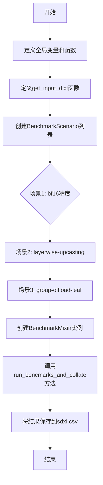
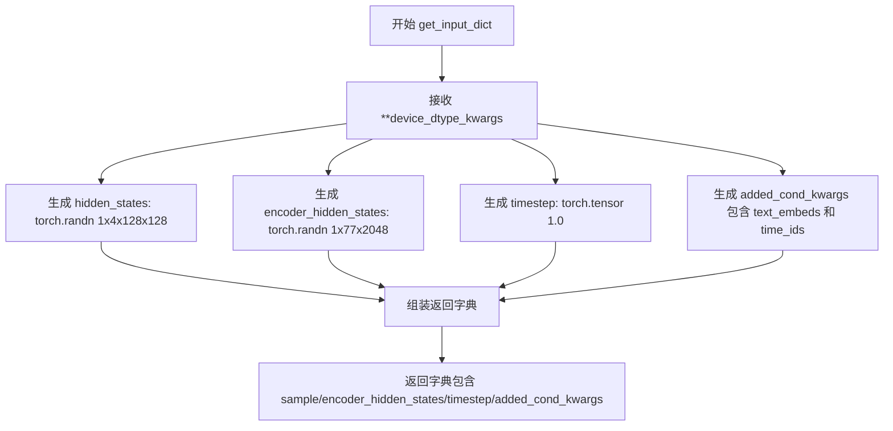
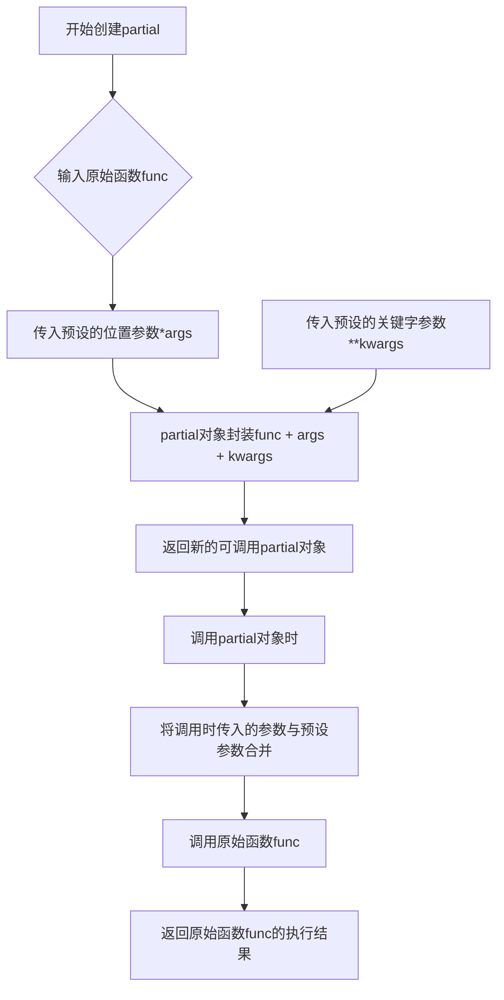
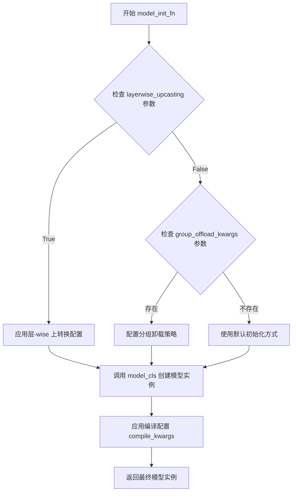
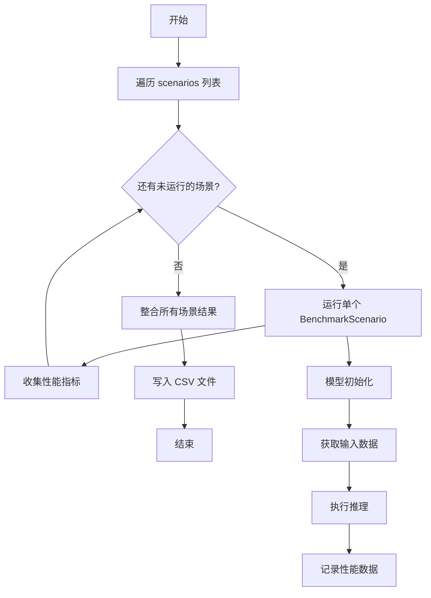
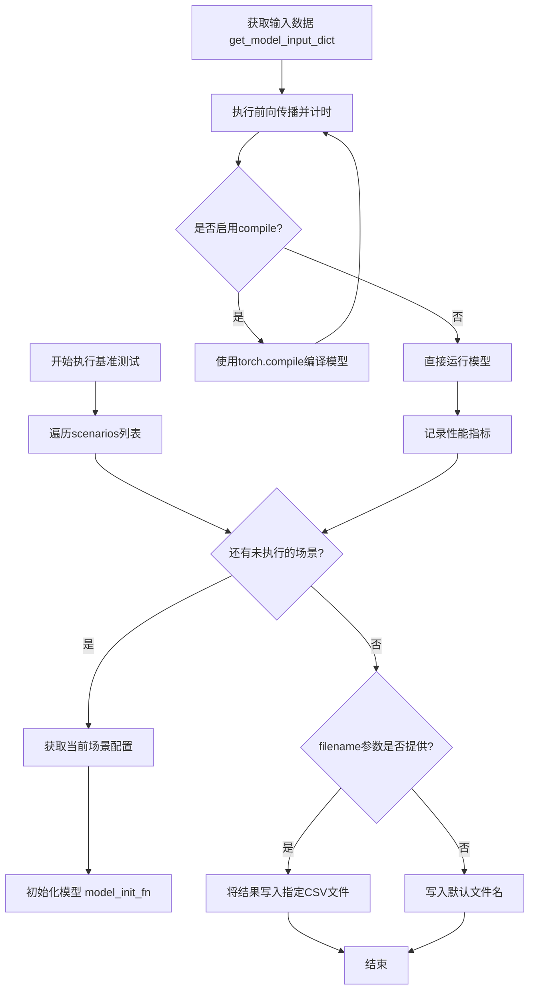

# `diffusers\benchmarks\benchmarking_sdxl.py` 详细设计文档

这是一个Stable Diffusion XL UNet模型的性能基准测试脚本，通过定义多个不同的模型配置场景（如bf16精度、层-wise上转换、组卸载等），来测试和比较UNet2DConditionModel在不同优化策略下的推理性能，并将结果保存到CSV文件中。

## 整体流程



## 类结构

```
Script (脚本文件)
└── benchmark_sdxl_unet.py
    ├── 全局变量
    │   ├── CKPT_ID
    │   └── RESULT_FILENAME
    ├── 全局函数
    │   └── get_input_dict
    └── 入口逻辑
        └── if __name__ == "__main__"
            ├── BenchmarkScenario (场景定义)
            │   ├── bf16场景
            │   ├── layerwise-upcasting场景
            │   └── group-offload-leaf场景
            └── BenchmarkMixin (基准测试运行器)
```

## 全局变量及字段


### `CKPT_ID`
    
Model checkpoint identifier for Stable Diffusion XL base 1.0

类型：`str`
    


### `RESULT_FILENAME`
    
Output CSV filename for storing benchmark results

类型：`str`
    


### `hidden_states`
    
Random noise tensor used as the latent sample input for the UNet model

类型：`torch.Tensor`
    


### `encoder_hidden_states`
    
Text encoder output tensor providing conditional information to the UNet

类型：`torch.Tensor`
    


### `timestep`
    
Current timestep in the diffusion process indicating the noise level

类型：`torch.Tensor`
    


### `added_cond_kwargs`
    
Additional conditioning parameters including text embeddings and time identifiers

类型：`Dict[str, torch.Tensor]`
    


### `BenchmarkScenario.name`
    
Unique identifier for the benchmark scenario

类型：`str`
    


### `BenchmarkScenario.model_cls`
    
The UNet2DConditionModel class to be benchmarked

类型：`Type[UNet2DConditionModel]`
    


### `BenchmarkScenario.model_init_kwargs`
    
Keyword arguments for model initialization including checkpoint path, dtype, and subfolder

类型：`Dict[str, Any]`
    


### `BenchmarkScenario.get_model_input_dict`
    
Function that generates input tensors dictionary for model inference

类型：`Callable`
    


### `BenchmarkScenario.model_init_fn`
    
Function responsible for instantiating and configuring the model with optional optimizations

类型：`Callable`
    


### `BenchmarkScenario.compile_kwargs`
    
Compilation options for torch.compile including fullgraph setting for full graph capture

类型：`Dict[str, Any]`
    
    

## 全局函数及方法


### `get_input_dict`

该函数用于生成 Stable Diffusion XL (SDXL) UNet2DConditionModel 模型的输入字典，包含随机初始化的隐藏状态、编码器隐藏状态、时间步以及附加条件参数（如文本嵌入和时间ID），支持通过关键字参数指定设备和张量数据类型。

参数：

- `**device_dtype_kwargs`：`dict`，可变关键字参数，用于指定张量的 `device`（设备，如 CPU/CUDA）和 `dtype`（数据类型，如 float32/bfloat16）

返回值：`dict`，返回包含以下键的字典：
- `sample`：`torch.Tensor`，形状为 (1, 4, 128, 128) 的隐藏状态张量
- `encoder_hidden_states`：`torch.Tensor`，形状为 (1, 77, 2048) 的编码器隐藏状态张量
- `timestep`：`torch.Tensor`，形状为 (1,) 的时间步张量
- `added_cond_kwargs`：`dict`，附加条件字典，包含 `text_embeds`（文本嵌入，形状 1×1280）和 `time_ids`（时间ID，形状 1×6）

#### 流程图



#### 带注释源码

```python
def get_input_dict(**device_dtype_kwargs):
    """
    生成 SDXL UNet 模型的输入字典，用于基准测试。
    
    参数:
        **device_dtype_kwargs: 关键字参数，可包含 'device' 和 'dtype'，
                              用于指定生成张量的设备和数据类型
    
    返回:
        dict: 包含模型输入的字典，包含以下键:
            - sample: 隐藏状态张量 (1, 4, 128, 128)
            - encoder_hidden_states: 编码器隐藏状态 (1, 77, 2048)
            - timestep: 时间步张量 (1,)
            - added_cond_kwargs: 附加条件字典
    """
    
    # 生成随机隐藏状态作为 UNet 的输入样本
    # 形状: batch=1, channels=4, height=128, width=128
    hidden_states = torch.randn(1, 4, 128, 128, **device_dtype_kwargs)
    
    # 生成随机编码器隐藏状态，对应文本嵌入向量
    # 形状: batch=1, sequence_length=77, hidden_size=2048
    encoder_hidden_states = torch.randn(1, 77, 2048, **device_dtype_kwargs)
    
    # 生成单个时间步张量，用于扩散过程
    # 值为 1.0
    timestep = torch.tensor([1.0], **device_dtype_kwargs)
    
    # 构建附加条件参数字典，包含:
    # - text_embeds: 文本嵌入向量，形状 (1, 1280)
    # - time_ids: 时间标识，形状 (1, 6)
    added_cond_kwargs = {
        "text_embeds": torch.randn(1, 1280, **device_dtype_kwargs),
        "time_ids": torch.ones(1, 6, **device_dtype_kwargs),
    }

    # 返回完整的输入字典，供 UNet2DConditionModel 使用
    return {
        "sample": hidden_states,
        "encoder_hidden_states": encoder_hidden_states,
        "timestep": timestep,
        "added_cond_kwargs": added_cond_kwargs,
    }
```


### `functools.partial`

`partial` 是 Python `functools` 模块中的一个类，用于创建部分函数（partial function）。它允许"冻结"原函数的部分参数，从而得到一个参数更少的新函数，常用于回调函数、函数预设以及与需要特定签名函数的框架集成。

参数：

-  `func`：`<built-in method or function>`，原始需要被预设参数的函数
-  `*args`：`<positional arguments>`，位置参数，将被预设到新函数中
-  `**kwargs`：`<keyword arguments>`，关键字参数，将被预设到新函数中

返回值：`<functools.partial>`，返回一个可调用的部分函数对象，该对象封装了原函数及预设的参数

#### 流程图



#### 带注释源码

```
from functools import partial  # 导入functools模块的partial类

# 在本代码中，partial的典型用法如下：

# 1. 为get_input_dict函数预设device和dtype参数
# 原始函数get_input_dict(**device_dtype_kwargs)接受关键字参数
# 创建新函数get_model_input_dict，不需要再传入device和dtype
partial_get_input_dict = partial(
    get_input_dict,          # 原始函数
    device=torch_device,     # 预设关键字参数：device
    dtype=torch.bfloat16     # 预设关键字参数：dtype
)
# 调用时：partial_get_input_dict() 等价于 get_input_dict(device=torch_device, dtype=torch.bfloat16)


# 2. 为model_init_fn函数预设layerwise_upcasting参数
partial_model_init_layerwise = partial(
    model_init_fn,                      # 原始函数
    layerwise_upcasting=True            # 预设关键字参数
)


# 3. 为model_init_fn函数预设group_offload_kwargs参数（包含多个子参数）
partial_model_init_group_offload = partial(
    model_init_fn,                                          # 原始函数
    group_offload_kwargs={                                  # 预设关键字参数字典
        "onload_device": torch_device,                      # 加载设备
        "offload_device": torch.device("cpu"),              # 卸载设备
        "offload_type": "leaf_level",                       # 卸载类型
        "use_stream": True,                                 # 是否使用流
        "non_blocking": True                                # 非阻塞传输
    }
)


# partial对象的工作原理：
# 当调用 partial_object(arg1, arg2) 时，
# 实际上等价于调用 original_func(preset_args, arg1, arg2, preset_kwargs)
```

#### 关键组件信息

| 名称 | 一句话描述 |
|------|-----------|
| `functools.partial` | 用于创建部分函数的类，可预设原始函数的参数 |
| `get_input_dict` | 生成SDXL UNet模型推理所需的输入字典，包含hidden_states、encoder_hidden_states等 |
| `BenchmarkMixin` | 基准测试混入类，提供运行基准测试并汇总结果的功能 |
| `BenchmarkScenario` | 基准测试场景配置类，定义模型、初始化参数和输入获取函数 |

#### 潜在技术债务与优化空间

1. **硬编码的模型ID**：`CKPT_ID`直接嵌入代码，应考虑外部配置
2. **重复的配置模式**：三个场景配置中存在大量重复代码，可通过工厂函数或配置驱动方式简化
3. **缺乏错误处理**：网络下载模型失败、GPU内存不足等情况未做处理
4. **静态输入数据**：`get_input_dict`使用随机数据，真实场景应支持真实数据输入

#### 其它项目说明

**设计目标与约束**：
- 目标：对比SDXL UNet模型在不同优化策略下的性能（bf16、layerwise-upcasting、group-offload）
- 约束：使用Stable Diffusion XL 1.0模型，输入分辨率1024x1024

**数据流**：
```
CKPT_ID → BenchmarkScenario配置 → BenchmarkMixin.run_benchmarks_and_collate → CSV输出
```

**外部依赖**：
- `diffusers`：模型加载与推理
- `torch`：张量计算与设备管理
- `benchmarking_utils`：基准测试框架（自定义模块）


### `model_init_fn`

该函数是基准测试工具模块（benchmarking_utils）中用于初始化深度学习模型的工厂函数，通过接收模型类、模型初始化参数及可选的配置参数（如层-wise 上转换、分组卸载策略等）来创建并配置模型实例，最终返回准备好的模型对象供基准测试使用。

参数：

- `model_cls`：`type`，要初始化的模型类（例如 `UNet2DConditionModel`）
- `model_init_kwargs`：`dict`，传递给模型构造函数的字典参数（如 `pretrained_model_name_or_path`、`torch_dtype`、`subfolder` 等）
- `layerwise_upcasting`：`bool`，可选参数，指定是否启用层-wise 上转换优化
- `group_offload_kwargs`：`dict`，可选参数，指定分组卸载的详细配置（包括 `onload_device`、`offload_device`、`offload_type`、`use_stream`、`non_blocking` 等）

返回值：`torch.nn.Module`，返回初始化并配置完成的模型实例

#### 流程图



#### 带注释源码

```python
# 从 benchmarking_utils 模块导入的模型初始化函数
# 该函数签名和实现位于 benchmarking_utils.py 中
# 以下是基于代码用法的推断实现

def model_init_fn(
    model_cls,                                    # 模型类（例如 UNet2DConditionModel）
    model_init_kwargs,                            # 模型构造参数字典
    layerwise_upcasting=False,                    # 是否启用层-wise 上转换
    group_offload_kwargs=None,                    # 分组卸载配置字典
):
    """
    初始化并配置深度学习模型用于基准测试
    
    Args:
        model_cls: 模型类类型
        model_init_kwargs: 模型构造函数的关键字参数
        layerwise_upcasting: 是否启用层-wise 上转换优化
        group_offload_kwargs: 分组卸载参数（设备映射策略）
    
    Returns:
        初始化并配置完成的模型实例
    """
    # 1. 根据 model_cls 和 model_init_kwargs 创建模型实例
    #    例如：model = UNet2DConditionModel(**model_init_kwargs)
    #    其中 model_init_kwargs 包含：
    #    {
    #        "pretrained_model_name_or_path": "stabilityai/stable-diffusion-xl-base-1.0",
    #        "torch_dtype": torch.bfloat16,
    #        "subfolder": "unet"
    #    }
    
    model = model_cls(**model_init_kwargs)
    
    # 2. 如果 layerwise_upcasting=True，应用层-wise 上转换配置
    #    这是一种内存优化技术，按层进行数据类型转换
    
    if layerwise_upcasting:
        # 配置模型的层-wise 上转换行为
        # 具体实现依赖于模型的内部结构
        model = configure_layerwise_upcasting(model)
    
    # 3. 如果提供了 group_offload_kwargs，应用分组卸载策略
    #    这是一种模型并行化技术，用于管理模型在不同设备间的加载
    
    if group_offload_kwargs is not None:
        # 解析分组卸载参数
        onload_device = group_offload_kwargs.get("onload_device")
        offload_device = group_offload_kwargs.get("offload_device")
        offload_type = group_offload_kwargs.get("offload_type", "leaf_level")
        use_stream = group_offload_kwargs.get("use_stream", True)
        non_blocking = group_offload_kwargs.get("non_blocking", True)
        
        # 应用设备映射和卸载策略
        # 将模型的不同部分分配到不同设备上
        model = apply_group_offload(
            model,
            onload_device=onload_device,
            offload_device=offload_device,
            offload_type=offload_type,
            use_stream=use_stream,
            non_blocking=non_blocking
        )
    
    # 4. 返回配置完成的模型实例
    return model


# 使用 partial 创建不同配置的初始化函数示例：

# 基础配置（无特殊优化）
base_init_fn = model_init_fn

# 启用层-wise 上转换
layerwise_init_fn = partial(
    model_init_fn,
    layerwise_upcasting=True
)

# 配置分组卸载（叶子级别）
group_offload_init_fn = partial(
    model_init_fn,
    group_offload_kwargs={
        "onload_device": torch_device,              # 加载设备（如 GPU）
        "offload_device": torch.device("cpu"),      # 卸载设备（CPU）
        "offload_type": "leaf_level",               # 卸载类型：叶子级别
        "use_stream": True,                         # 是否使用流式处理
        "non_blocking": True                        # 是否非阻塞传输
    }
)
```


### `BenchmarkMixin.run_bencmarks_and_collate`

该方法为 `BenchmarkMixin` 类的成员方法，用于运行多个基准测试场景并汇总结果。方法接收基准测试场景列表和输出文件名，将各场景的基准测试结果收集并写入 CSV 文件。

参数：

- `scenarios`：`List[BenchmarkScenario]`，待运行的基准测试场景列表，每个场景包含模型配置、输入数据获取函数等信息
- `filename`：`str`，输出结果的目标文件名，本例中为 "sdxl.csv"

返回值：`None`，该方法直接将结果写入文件，无返回值

#### 流程图



#### 带注释源码

```python
# 代码中调用方式如下：
runner = BenchmarkMixin()  # 创建基准测试运行器实例
runner.run_bencmarks_and_collate(scenarios, filename=RESULT_FILENAME)

# 实际实现需参考 benchmarking_utils 模块中的 BenchmarkMixin 类
# 以下为推断的函数签名和逻辑：

def run_bencmarks_and_collate(self, scenarios: List[BenchmarkScenario], filename: str) -> None:
    """
    运行多个基准测试场景并汇总结果
    
    参数:
        scenarios: BenchmarkScenario 对象列表，每个场景定义模型、输入和运行配置
        filename: 输出 CSV 文件名
    
    返回:
        无返回值，结果直接写入文件
    """
    # 1. 遍历每个场景
    # 2. 调用各场景的 run 方法执行基准测试
    # 3. 收集各场景的性能指标（推理时间、内存占用等）
    # 4. 将结果整合为 DataFrame
    # 5. 写入 CSV 文件
```


### `BenchmarkMixin.run_bencmarks_and_collate`

该方法是基准测试运行器的核心功能，负责接收一组基准测试场景，执行每个场景的性能测试，并将所有结果整理汇总到一个CSV文件中。

参数：

- `scenarios`：`List[BenchmarkScenario]`，基准测试场景列表，每个场景包含模型类、模型初始化参数、输入数据获取函数等配置信息
- `filename`：`str`，输出结果CSV文件的名称，用于保存基准测试的最终统计数据

返回值：`None`，该方法直接将结果写入CSV文件，不返回任何值

#### 流程图



#### 带注释源码

```python
# 从benchmarking_utils模块导入的基准测试混合类
# 该类是抽象基类，提供了基准测试的基础设施
from benchmarking_utils import BenchmarkMixin

# 创建基准测试运行器实例
runner = BenchmarkMixin()

# 调用基准测试方法（注意：方法名有拼写错误，为bencmarks而非benchmarks）
# 参数1: scenarios - 包含多个BenchmarkScenario对象的列表
# 参数2: filename - 输出结果文件名，默认为"sdxl.csv"
runner.run_bencmarks_and_collate(scenarios, filename=RESULT_FILENAME)

# BenchmarkScenario对象包含以下关键配置:
# - name: 场景名称（如"stabilityai/stable-diffusion-xl-base-1.0-bf16"）
# - model_cls: 模型类（如UNet2DConditionModel）
# - model_init_kwargs: 模型初始化参数（预训练模型路径、数据类型、子文件夹等）
# - get_model_input_dict: 获取输入张量的函数
# - model_init_fn: 模型初始化函数（可配置layerwise_upcasting、group_offload等）
# - compile_kwargs: torch.compile配置（如fullgraph=True）
```

## 关键组件


### 张量索引与惰性加载

通过 `get_input_dict` 函数和 `functools.partial` 实现输入数据的惰性加载准备，每次调用时动态生成指定设备和数据类型的张量字典，避免一次性加载所有数据到内存。

### 反量化支持

通过 `torch.bfloat16` 数据类型配置，在基准测试场景中实现模型权重的半精度加载与推理，减少显存占用并提升计算效率。

### 量化策略

定义了三种不同的量化/优化策略场景：`bf16` 纯半精度推理、`layerwise-upcasting` 分层上转换策略、`group-offload-leaf` 分组卸载策略，以评估不同优化方案下的模型性能。

### BenchmarkMixin 基准测试框架

封装基准测试执行逻辑的混合类，提供 `run_bencmarks_and_collate` 方法用于运行多个场景并汇总结果。

### BenchmarkScenario 配置类

定义单个基准测试场景的配置数据结构，包含模型类、初始化参数、输入数据获取函数、模型初始化函数和编译选项等。

### 输入数据生成器

`get_input_dict` 函数负责构造 SDXL UNet 所需的完整输入字典，包括隐藏状态、编码器隐藏状态、时间步和附加条件参数。


## 问题及建议


### 已知问题

-   **拼写错误**：方法名 `run_bencmarks_and_collate` 存在拼写错误，应为 `run_benchmarks_and_collate`，这可能导致代码维护和搜索困难
-   **缺乏类型注解**：函数和方法的参数、返回值均缺少类型提示（Type Hints），降低了代码的可读性和静态检查工具的有效性
-   **硬编码配置**：模型检查点路径（`CKPT_ID`）、输出文件名（`RESULT_FILENAME`）以及输入张量维度等关键参数直接硬编码，扩展性差
-   **测试数据不真实**：`get_input_dict` 使用随机噪声（`torch.randn`）生成输入，而非真实推理场景的数据分布，可能导致基准测试结果与实际部署性能存在偏差
-   **外部依赖隐式依赖**：`model_init_fn`、`BenchmarkMixin`、`BenchmarkScenario` 等关键组件从外部模块导入，其具体实现和接口契约未在代码中明确，增加调试难度
-   **错误处理缺失**：整个脚本没有任何异常捕获和错误处理机制，网络下载失败、内存不足或设备不兼容等情况会导致程序直接崩溃
-   **魔法字符串和数字**：多处使用字符串字面量（如 `"bf16"`、`"leaf_level"`）和魔数（如 `1280`、`2048`、`6`），缺乏常量定义，代码可维护性低
-   **partial 嵌套过深**：`partial` 多层嵌套（尤其是 `model_init_fn` 和 `get_model_input_dict`）导致代码逻辑难以追踪，调试复杂

### 优化建议

-   **添加类型注解**：为所有函数参数和返回值添加明确的类型标注，例如 `def get_input_dict(device: torch.device, dtype: torch.dtype) -> dict[str, torch.Tensor]:`
-   **配置外部化**：将模型路径、输出文件名、编译选项等配置抽取到配置文件（如 YAML/JSON）或命令行参数解析器（`argparse`）中
-   **使用真实输入**：考虑从预训练模型的实际前向传播中获取输入形状信息，或提供选项加载真实样本数据进行基准测试
-   **完善错误处理**：添加 try-except 块捕获网络异常、CUDA 内存不足、设备不支持等常见错误，并提供有意义的错误信息和优雅降级策略
-   **定义常量类**：创建配置类或枚举来集中管理魔法字符串和数值，例如 `class ModelConfig`、`class OffloadType` 等
-   **重构 partial 嵌套**：考虑使用 dataclass 或配置对象替代多层 partial 传递，使初始化逻辑更清晰
-   **添加日志模块**：引入 `logging` 模块记录基准测试进度、关键参数和性能指标，便于问题排查和结果追踪

## 其它


### 设计目标与约束

该基准测试脚本的设计目标是评估Stable Diffusion XL (SDXL) UNet2DConditionModel在不同性能优化策略下的推理性能表现。设计约束包括：1) 必须使用指定的checkpoint ID (stabilityai/stable-diffusion-base-1.0)；2) 输入tensor维度固定为height=1024, width=1024, max_sequence_length=77；3) 测试必须在PyTorch设备上执行；4) 结果输出为CSV格式文件。

### 错误处理与异常设计

代码主要依赖BenchmarkMixin类处理基准测试运行时的异常。在获取输入字典时可能抛出torch相关设备/ dtype不匹配的异常。模型初始化可能因网络问题或checkpoint不可用而失败，需要在外层捕获。场景配置错误应在早期验证阶段检测。

### 数据流与状态机

数据流如下：1) 场景定义阶段：创建BenchmarkScenario列表，每个场景包含模型类、初始化参数、输入字典生成函数、模型初始化函数、编译参数；2) 输入生成阶段：根据get_model_input_dict生成符合UNet2DConditionModel签名的输入字典，包含sample、encoder_hidden_states、timestep、added_cond_kwargs；3) 模型加载阶段：使用model_init_fn加载模型到指定设备和dtype；4) 推理执行阶段：执行前向传播并记录性能指标；5) 结果汇总阶段：将所有场景结果写入CSV文件。

### 外部依赖与接口契约

核心依赖包括：1) torch - 张量运算和设备管理；2) benchmarking_utils (BenchmarkMixin, BenchmarkScenario, model_init_fn) - 基准测试框架；3) diffusers (UNet2DConditionModel) - 待测模型；4) diffusers.utils.testing_utils (torch_device) - 测试设备获取。接口契约：BenchmarkScenario需提供name、model_cls、model_init_kwargs、get_model_input_dict、model_init_fn、compile_kwargs等属性；get_model_input_dict需返回包含sample、encoder_hidden_states、timestep、added_cond_kwargs的字典。

### 性能优化策略分析

脚本定义了三种性能优化场景：1) bf16 - 使用bfloat16精度进行推理，配合fullgraph编译；2) layerwise-upcasting - 使用逐层升精度策略；3) group-offload-leaf - 使用分组卸载策略，将模型层卸载到CPU并使用流式加载。这些策略旨在降低显存占用或提升推理速度。

### 配置管理

所有配置通过硬编码方式定义：CKPT_ID固定为"stabilityai/stable-diffusion-xl-base-1.0"；RESULT_FILENAME为"sdxl.csv"；输入tensor维度在get_input_dict中固定；设备通过torch_device获取；dtype统一使用torch.bfloat16。

### 资源管理

显存管理：通过group_offload_kwargs控制模型在设备间的迁移；计算资源：使用torch_device指定执行设备；临时资源：输入tensor在每次推理前动态生成。

### 测试场景设计

三个测试场景分别对应不同的性能优化技术：场景1验证bf16精度配合torch.compile的端到端性能；场景2评估layerwise-upcasting策略对精度和速度的平衡；场景3测试分组卸载策略对大模型的内存优化效果。

### 输出结果处理

基准测试结果通过runner.run_bencmarks_and_collate()方法汇总，该方法接收场景列表和文件名参数，将Collated results写入指定CSV文件。结果文件包含各场景的性能指标对比数据。

### 代码组织结构

代码采用单脚本组织形式，包含：全局常量定义区(CKPT_ID, RESULT_FILENAME)；工具函数区(get_input_dict)；主执行区(__main__ block)。未采用面向对象封装，所有场景配置在main块中直接定义。

    