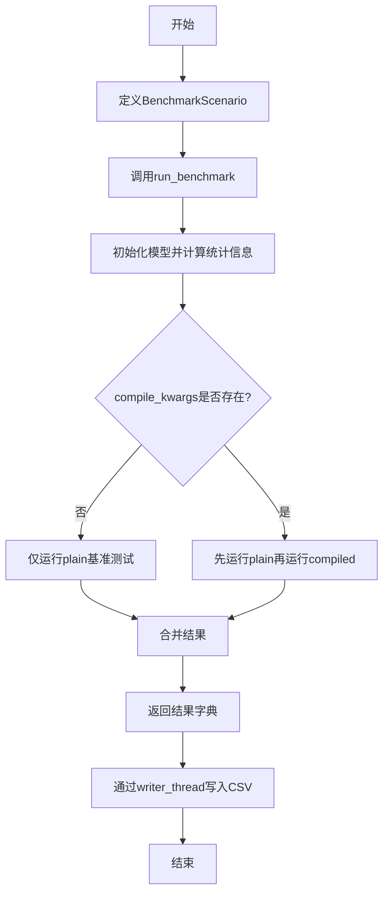
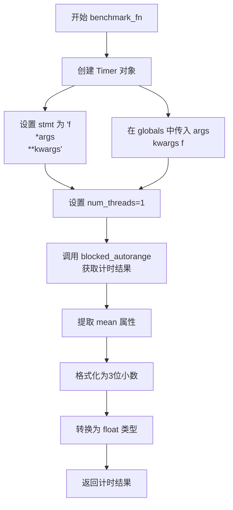
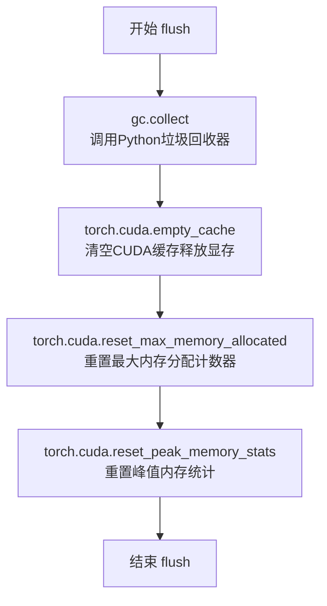
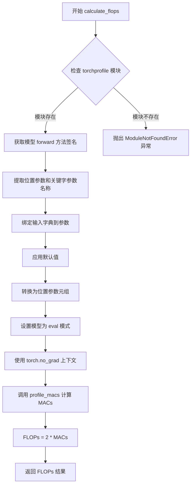
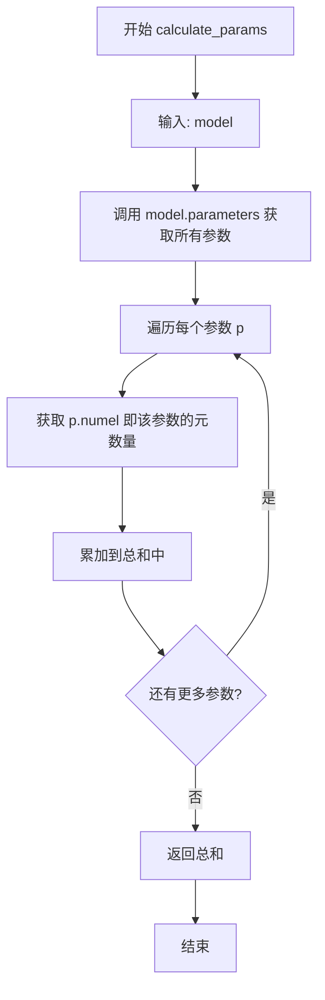
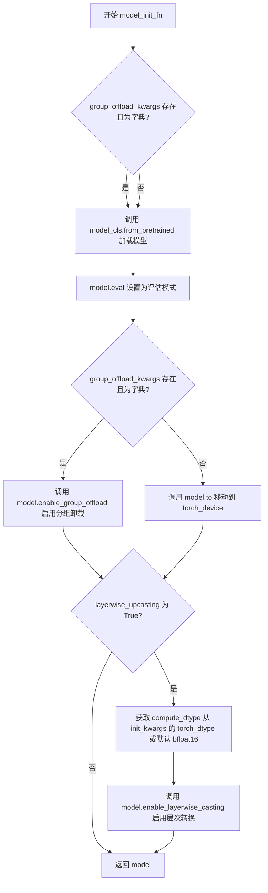
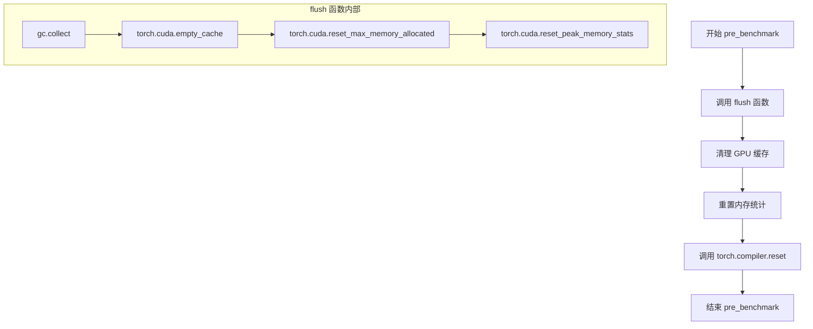
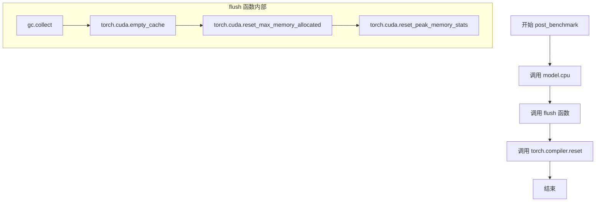
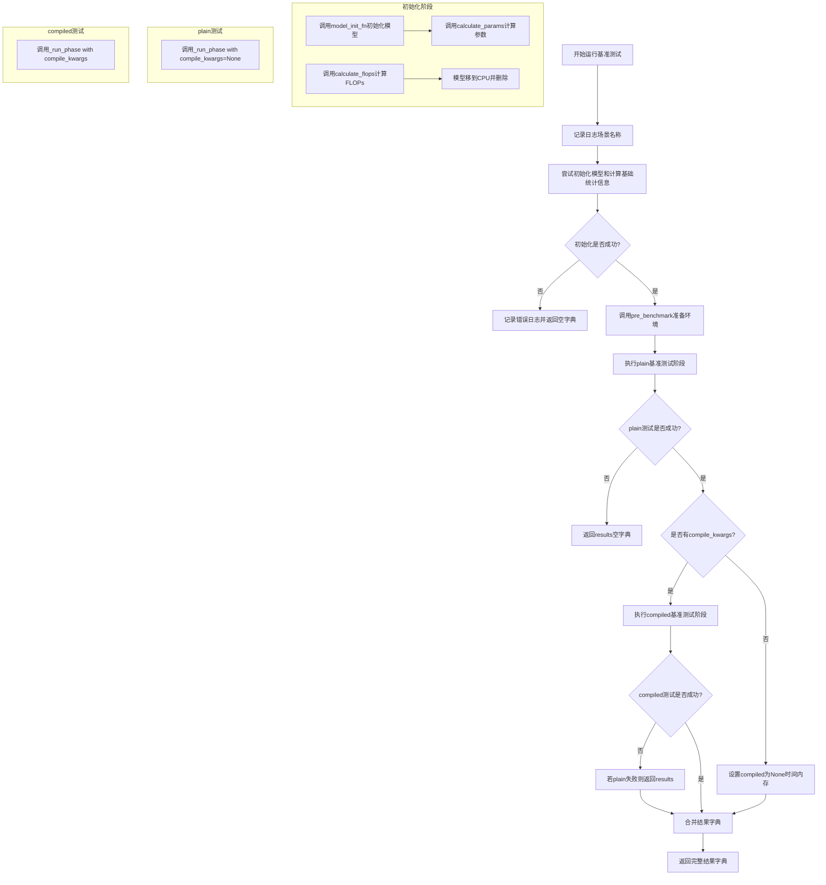
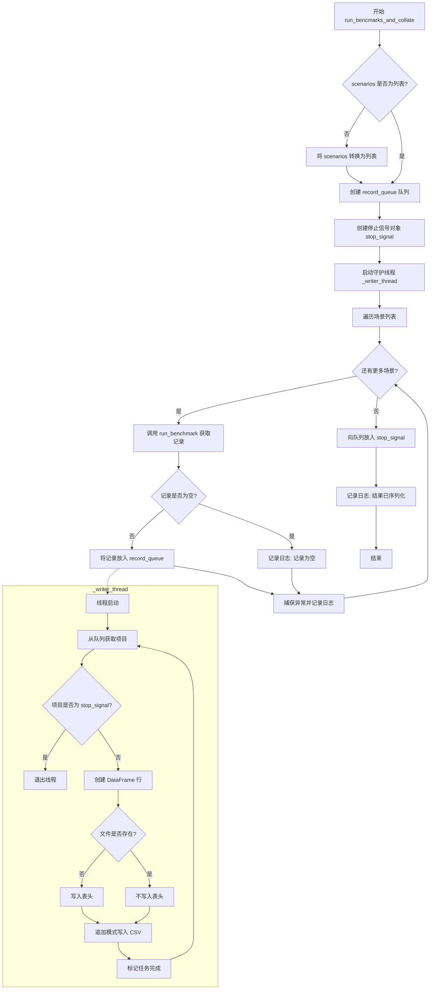

# `diffusers\benchmarks\benchmarking_utils.py` 详细设计文档

一个用于深度学习模型性能基准测试的框架，支持测量模型的FLOPs、参数量、内存占用和推理时间，并支持torch.compile编译优化对比测试，结果可输出到CSV文件。

## 整体流程



## 类结构

```
Global Functions
├── benchmark_fn
├── flush
├── calculate_flops
├── calculate_params
└── model_init_fn
├── BenchmarkScenario (dataclass)
└── BenchmarkMixin (class)
```

## 全局变量及字段


### `NUM_WARMUP_ROUNDS`
    
预热轮数常量，值为5

类型：`int`
    


### `logger`
    
日志记录器

类型：`logging.Logger`
    


### `logging`
    
logging模块

类型：`module`
    


### `gc`
    
垃圾回收模块

类型：`module`
    


### `inspect`
    
检查模块

类型：`module`
    


### `os`
    
操作系统模块

类型：`module`
    


### `queue`
    
队列模块

类型：`module`
    


### `threading`
    
线程模块

类型：`module`
    


### `pd`
    
pandas模块

类型：`module`
    


### `torch`
    
PyTorch模块

类型：`module`
    


### `benchmark`
    
torch.utils.benchmark模块

类型：`module`
    


### `ModelMixin`
    
diffusers模型基类

类型：`type`
    


### `torch_device`
    
测试设备

类型：`str`
    


### `benchmark_fn`
    
基准测试函数，用于测量函数执行时间

类型：`Callable`
    


### `flush`
    
刷新GPU内存函数，清除缓存并重置内存统计

类型：`Callable`
    


### `calculate_flops`
    
计算模型FLOPs函数

类型：`Callable`
    


### `calculate_params`
    
计算模型参数量函数

类型：`Callable`
    


### `model_init_fn`
    
模型初始化函数，可选地应用group_offload和layerwise_upcasting

类型：`Callable`
    


### `BenchmarkScenario.name`
    
场景名称

类型：`str`
    


### `BenchmarkScenario.model_cls`
    
模型类

类型：`ModelMixin`
    


### `BenchmarkScenario.model_init_kwargs`
    
模型初始化参数

类型：`dict[str, Any]`
    


### `BenchmarkScenario.model_init_fn`
    
模型初始化函数

类型：`Callable`
    


### `BenchmarkScenario.get_model_input_dict`
    
获取模型输入的函数

类型：`Callable`
    


### `BenchmarkScenario.compile_kwargs`
    
torch.compile配置参数

类型：`dict[str, Any] | None`
    
    

## 全局函数及方法


### `benchmark_fn`

计时函数，用于测量函数执行时间。该函数接受一个可调用对象及其参数，使用 PyTorch 的 `torch.utils.benchmark.Timer` 通过 `blocked_autorange` 方法多次运行函数以获取稳定的计时测量值，并返回以秒为单位的平均执行时间（保留3位小数）。

参数：

- `f`：`Callable`，要基准测试的可调用对象（函数或方法）
- `*args`：`tuple`，位置参数列表，传递给被测函数 `f`
- `**kwargs`：`dict`，关键字参数字典，传递给被测函数 `f`

返回值：`float`，函数执行的平均时间（秒），保留3位小数

#### 流程图



#### 带注释源码

```python
def benchmark_fn(f, *args, **kwargs):
    """
    计时函数，用于测量函数执行时间
    
    参数:
        f: 要基准测试的可调用对象
        *args: 传递给 f 的位置参数
        **kwargs: 传递给 f 的关键字参数
    
    返回:
        float: 函数执行的平均时间（秒），保留3位小数
    """
    # 创建 PyTorch benchmark Timer 对象
    # stmt: 要执行的语句模板，使用 f(*args, **kwargs) 调用函数
    # globals: 传递全局变量，使 Timer 可以访问 f, args, kwargs
    # num_threads: 使用的线程数，设为1以获得更稳定的单线程基准测试结果
    t0 = benchmark.Timer(
        stmt="f(*args, **kwargs)",
        globals={"args": args, "kwargs": kwargs, "f": f},
        num_threads=1,
    )
    
    # blocked_autorange() 会自动运行函数足够多次以获得稳定的平均值
    # .mean 获取所有运行时间的平均值
    # 格式化为3位小数，然后转换为 float 类型返回
    return float(f"{(t0.blocked_autorange().mean):.3f}")
```


### `flush`

清理GPU内存缓存并重置PyTorch CUDA内存统计信息，确保在基准测试前释放显存并获得准确的内存测量值。

参数：none

返回值：`None`，无返回值

#### 流程图



#### 带注释源码

```python
def flush():
    """
    清理GPU内存和重置内存统计
    
    该函数执行以下操作：
    1. 调用Python垃圾回收器清理未引用的对象
    2. 清空CUDA缓存释放未使用的显存
    3. 重置最大内存分配统计计数器
    4. 重置峰值内存统计数据
    """
    gc.collect()                                # 触发Python垃圾回收，释放Python层内存
    torch.cuda.empty_cache()                    # 清空CUDA缓存块，释放PyTorch保留的显存
    torch.cuda.reset_max_memory_allocated()     # 重置.cuda.max_memory_allocated()的返回值
    torch.cuda.reset_peak_memory_stats()        # 重置CUDA峰值内存统计信息
```


### `calculate_flops`

该函数用于计算给定深度学习模型的FLOPs（浮点运算次数）。它通过调用`torchprofile`库的`profile_macs`方法统计模型的MACs（乘累加运算次数），然后将MACs乘以2得到FLOPs（因为1个MAC操作等于2个FLOPs：1次乘法+1次加法）。函数通过`inspect`模块动态获取模型的forward方法签名，将输入字典转换为位置参数格式，以适配`profile_macs`的要求。

参数：

- `model`：`torch.nn.Module`，待计算FLOPs的深度学习模型实例
- `input_dict`：`dict[str, Any]`，包含模型输入数据的字典，键为参数名，值为对应的输入张量

返回值：`int`，返回计算得到的FLOPs值（整数类型）

#### 流程图



#### 带注释源码

```python
def calculate_flops(model, input_dict):
    """
    计算给定模型的 FLOPs（浮点运算次数）
    
    通过 profile_macs 获取 MACs（乘累加运算），然后乘以 2 得到 FLOPs
    （因为 1 个 MAC = 1 次乘法 + 1 次加法 = 2 FLOPs）
    
    参数:
        model: torch.nn.Module - 待计算的深度学习模型
        input_dict: dict - 模型输入参数字典
    
    返回:
        int - 计算得到的 FLOPs 值
    """
    # 尝试导入 torchprofile 库的 profile_macs 函数
    # 如果未安装则抛出 ModuleNotFoundError 异常
    try:
        from torchprofile import profile_macs
    except ModuleNotFoundError:
        raise

    # 这是一种变通方法：将 kwargs 转换为 args
    # 因为 profile_macs 不支持 kwargs 形式的输入
    # 获取模型 forward 方法的函数签名
    sig = inspect.signature(model.forward)
    
    # 提取 forward 方法的参数名（排除 self 和 kwargs/*args）
    param_names = [
        p.name
        for p in sig.parameters.values()
        if p.kind
        in (
            inspect.Parameter.POSITIONAL_ONLY,
            inspect.Parameter.POSITIONAL_OR_KEYWORD,
        )
        and p.name != "self"
    ]
    
    # 将输入字典绑定到函数签名
    bound = sig.bind_partial(**input_dict)
    # 应用参数的默认值
    bound.apply_defaults()
    # 提取位置参数元组
    args = tuple(bound.arguments[name] for name in param_names)

    # 设置模型为评估模式
    model.eval()
    
    # 使用 no_grad 上下文管理器，禁用梯度计算以提高效率
    with torch.no_grad():
        # 调用 profile_macs 统计模型的 MACs
        macs = profile_macs(model, args)
    
    # 将 MACs 转换为 FLOPs
    # 1 MAC operation = 2 FLOPs (1 multiplication + 1 addition)
    flops = 2 * macs
    
    return flops
```


### `calculate_params`

该函数用于计算神经网络模型的参数量，通过遍历模型的所有参数并对每个参数的 `numel()`（元素个数）求和来得到模型的總参数量。

参数：

- `model`：`torch.nn.Module`，需要计算参数量的 PyTorch 模型对象

返回值：`int`，模型中所有参数的总数量

#### 流程图



#### 带注释源码

```python
def calculate_params(model):
    """
    计算模型的参数量。
    
    该函数通过遍历模型的所有参数，并使用 PyTorch Tensor 的 numel() 方法
    获取每个参数的元素个数，最后求和得到模型的總参数量。
    
    参数:
        model: torch.nn.Module 实例，需要计算参数量的 PyTorch 模型
        
    返回:
        int: 模型中所有参数的总数量
    """
    return sum(p.numel() for p in model.parameters())
```


### `model_init_fn`

模型初始化函数，支持从预训练模型加载并可选地启用分组卸载（Group Offload）和层次转换（Layerwise Upcasting）功能，以优化显存使用和计算性能。

#### 参数

- `model_cls`：`Type[ModelMixin]`，要初始化的模型类，必须是 `ModelMixin` 的子类
- `group_offload_kwargs`：`dict | None`，可选的分 group_offload 配置参数，用于启用模型分组卸载功能，传入字典时才会启用
- `layerwise_upcasting`：`bool`，是否启用层次转换，默认值为 `False`
- `**init_kwargs`：`Any`，传递给 `model_cls.from_pretrained()` 的其他初始化参数，如 `pretrained_model_name_or_path`、`torch_dtype` 等

#### 返回值

- `ModelMixin`，初始化并配置好的模型实例

#### 流程图



#### 带注释源码

```python
def model_init_fn(model_cls, group_offload_kwargs=None, layerwise_upcasting=False, **init_kwargs):
    # 1. 从预训练模型加载模型，使用 init_kwargs 中的参数（如 pretrained_model_name_or_path）
    # 2. 设置为评估模式 (eval)，禁用 Dropout 等训练层
    model = model_cls.from_pretrained(**init_kwargs).eval()
    
    # 3. 判断是否启用分组卸载
    #    - group_offload_kwargs 必须存在且是字典类型
    if group_offload_kwargs and isinstance(group_offload_kwargs, dict):
        # 启用分组卸载，用于在多 GPU 环境下优化显存使用
        model.enable_group_offload(**group_offload_kwargs)
    else:
        # 未启用分组卸载时，将模型移动到默认设备（如 GPU）
        model.to(torch_device)
    
    # 4. 判断是否启用层次转换（Layerwise Upcasting）
    #    - 将模型参数从存储类型转换为计算类型
    #    - 存储类型: torch.float8_e4m3fn (8位浮点，节省显存)
    #    - 计算类型: 从 init_kwargs 获取的 torch_dtype，默认 bfloat16
    if layerwise_upcasting:
        model.enable_layerwise_casting(
            storage_dtype=torch.float8_e4m3fn,  # 存储精度：8位浮点
            compute_dtype=init_kwargs.get("torch_dtype", torch.bfloat16)  # 计算精度：默认 bfloat16
        )
    
    # 5. 返回初始化完成的模型
    return model
```


### `BenchmarkMixin.pre_benchmark`

基准测试前准备方法，用于清理GPU内存并重置PyTorch编译器缓存，确保基准测试环境处于干净状态。

参数：

- `self`：`BenchmarkMixin`，调用此方法的类实例本身（隐式参数）

返回值：`None`，该方法不返回任何值

#### 流程图



#### 带注释源码

```python
@require_torch_gpu
class BenchmarkMixin:
    def pre_benchmark(self):
        """
        基准测试前准备方法。
        
        执行两项关键清理操作：
        1. 调用 flush() 清理 GPU 内存缓存并重置内存统计
        2. 调用 torch.compiler.reset() 重置 PyTorch 编译器状态
        
        确保每次基准测试开始时处于干净的运行环境，避免前一次测试的残留状态影响结果。
        """
        # 调用 flush 函数执行 GPU 内存清理和统计重置
        flush()
        
        # 重置 PyTorch torch.compile 编译器的缓存和状态
        # 这确保了编译后的代码不会影响新的基准测试
        torch.compiler.reset()
```


### `BenchmarkMixin.post_benchmark`

该方法执行基准测试后的清理操作，主要功能是将模型从GPU移回CPU、清理内存（GC）、清空CUDA缓存并重置PyTorch编译器状态，以确保基准测试之间不会相互干扰并释放GPU资源。

参数：

- `model`：`torch.nn.Module`，需要执行清理的模型对象，通常是已完成基准测试的模型实例。

返回值：`None`，该方法无返回值，仅执行副作用操作（状态清理）。

#### 流程图



#### 带注释源码

```python
@require_torch_gpu  # 装饰器：确保测试环境有GPU可用
def post_benchmark(self, model):
    """
    基准测试后清理方法
    
    执行必要的后处理操作以清理基准测试期间使用的资源，
    确保后续基准测试不受之前状态的影响。
    """
    
    # 将模型从GPU移回CPU，释放GPU显存
    model.cpu()
    
    # 执行内存清理操作：
    # 1. gc.collect() - 强制进行Python垃圾回收，释放未引用的对象
    # 2. torch.cuda.empty_cache() - 清空CUDA缓存，使未使用的显存可供系统其他部分使用
    # 3. torch.cuda.reset_max_memory_allocated() - 重置最大显存分配统计
    # 4. torch.cuda.reset_peak_memory_stats() - 重置峰值显存统计
    flush()
    
    # 重置PyTorch编译器状态，清除可能存在的编译缓存
    # 这对于确保后续基准测试使用全新编译状态很重要
    torch.compiler.reset()
```


### `BenchmarkMixin.run_benchmark`

运行单个基准测试场景，初始化模型并计算参数和FLOPs，然后分别执行未编译和编译版本的性能测试，最终返回包含时间、内存等关键指标的结果字典。

参数：

-  `scenario`：`BenchmarkScenario`，包含测试场景的名称、模型类、模型初始化参数、初始化函数、输入数据生成函数及编译选项的综合配置对象

返回值：`dict[str, Any]`，返回包含场景名、模型类名、参数数量(十亿)、FLOPs(十亿)、未编译运行时间(秒)、未编译内存(GB)、编译运行时间(秒)、编译内存(GB)、fullgraph模式和mode的字典；若初始化或运行失败返回空字典

#### 流程图



#### 带注释源码

```python
@torch.no_grad()  # 禁用梯度计算以减少内存开销
def run_benchmark(self, scenario: BenchmarkScenario):
    # 0) Basic stats - 基础统计信息获取阶段
    logger.info(f"Running scenario: {scenario.name}.")  # 记录当前场景名称
    
    # 尝试初始化模型并计算参数和FLOPs
    try:
        # 使用提供的初始化函数和参数创建模型实例
        model = model_init_fn(scenario.model_cls, **scenario.model_init_kwargs)
        
        # 计算模型参数量（单位：十亿，保留两位小数）
        num_params = round(calculate_params(model) / 1e9, 2)
        
        try:
            # 获取模型输入并计算FLOPs（单位：十亿，保留两位小数）
            flops = round(
                calculate_flops(model, input_dict=scenario.get_model_input_dict()) / 1e9, 
                2
            )
        except Exception as e:
            # FLOPs计算失败时记录日志并设为None
            logger.info(f"Problem in calculating FLOPs:\n{e}")
            flops = None
        
        # 释放模型内存（移到CPU并删除）
        model.cpu()
        del model
    except Exception as e:
        # 模型初始化失败时记录错误并返回空字典
        logger.info(f"Error while initializing the model and calculating FLOPs:\n{e}")
        return {}
    
    # 预基准测试清理：清空缓存、重置编译器
    self.pre_benchmark()

    # 1) plain stats - 执行未编译版本的基准测试
    results = {}
    plain = None
    try:
        # 运行未编译版本，compile_kwargs传None
        plain = self._run_phase(
            model_cls=scenario.model_cls,
            init_fn=scenario.model_init_fn,
            init_kwargs=scenario.model_init_kwargs,
            get_input_fn=scenario.get_model_input_dict,
            compile_kwargs=None,
        )
    except Exception as e:
        # plain测试失败时记录错误并返回空results
        logger.info(f"Benchmark could not be run with the following error:\n{e}")
        return results

    # 2) compiled stats (if any) - 执行编译版本的基准测试（如果提供了compile_kwargs）
    compiled = {"time": None, "memory": None}  # 初始化为None
    if scenario.compile_kwargs:  # 检查是否需要运行编译测试
        try:
            # 运行编译版本，传入compile_kwargs配置
            compiled = self._run_phase(
                model_cls=scenario.model_cls,
                init_fn=scenario.model_init_fn,
                init_kwargs=scenario.model_init_kwargs,
                get_input_fn=scenario.get_model_input_dict,
                compile_kwargs=scenario.compile_kwargs,
            )
        except Exception as e:
            # 编译测试失败时记录错误，若plain也失败则返回空results
            logger.info(f"Compilation benchmark could not be run with the following error\n: {e}")
            if plain is None:
                return results

    # 3) merge - 合并所有结果到最终字典
    result = {
        "scenario": scenario.name,                      # 场景名称
        "model_cls": scenario.model_cls.__name__,       # 模型类名
        "num_params_B": num_params,                     # 参数数量（十亿）
        "flops_G": flops,                               # FLOPs（十亿）
        "time_plain_s": plain["time"],                  # 未编译运行时间（秒）
        "mem_plain_GB": plain["memory"],                # 未编译内存（GB）
        "time_compile_s": compiled["time"],             # 编译运行时间（秒）
        "mem_compile_GB": compiled["memory"],           # 编译内存（GB）
    }
    
    # 根据是否有compile_kwargs添加编译相关配置信息
    if scenario.compile_kwargs:
        result["fullgraph"] = scenario.compile_kwargs.get("fullgraph", False)
        result["mode"] = scenario.compile_kwargs.get("mode", "default")
    else:
        result["fullgraph"], result["mode"] = None, None
    
    return result  # 返回完整的结果字典
```


### `BenchmarkMixin.run_bencmarks_and_collate`

该方法用于运行多个基准测试场景并将结果汇总到CSV文件中，通过队列和守护线程实现异步写入，支持单个场景或场景列表的处理。

参数：

- `scenarios`：`BenchmarkScenario | list[BenchmarkScenario]`，要运行的基准测试场景，可以是单个场景对象或场景列表
- `filename`：`str`，输出CSV文件的路径，用于持久化基准测试结果

返回值：`None`，该方法无返回值，结果直接写入CSV文件

#### 流程图



#### 带注释源码

```python
def run_bencmarks_and_collate(self, scenarios: BenchmarkScenario | list[BenchmarkScenario], filename: str):
    """
    运行多个基准测试场景并将结果汇总到CSV文件
    
    参数:
        scenarios: 单个 BenchmarkScenario 或 BenchmarkScenario 列表
        filename: 输出 CSV 文件路径
    """
    # 1) 将单个场景转换为列表，统一处理方式
    if not isinstance(scenarios, list):
        scenarios = [scenarios]
    
    # 2) 创建线程安全的队列用于生产者-消费者模式
    # 生产者: 主线程执行基准测试
    # 消费者: 守护线程写入CSV
    record_queue = queue.Queue()
    
    # 3) 创建停止信号对象，用于通知写入线程退出
    stop_signal = object()

    def _writer_thread():
        """
        守护线程函数: 从队列读取记录并写入CSV文件
        使用线程实现异步写入，避免阻塞基准测试
        """
        while True:
            # 获取队列中的记录（阻塞直到有数据或收到停止信号）
            item = record_queue.get()
            
            # 检查是否收到停止信号
            if item is stop_signal:
                break
            
            # 将单条记录转换为 DataFrame 行
            df_row = pd.DataFrame([item])
            
            # 判断是否需要写入表头（仅在文件不存在时写入）
            write_header = not os.path.exists(filename)
            
            # 追加模式写入 CSV
            df_row.to_csv(filename, mode="a", header=write_header, index=False)
            
            # 标记任务完成
            record_queue.task_done()

        # 处理停止信号的任务完成通知
        record_queue.task_done()

    # 4) 启动守护线程（daemon=True 确保主程序退出时自动终止）
    writer = threading.Thread(target=_writer_thread, daemon=True)
    writer.start()

    # 5) 遍历执行每个场景的基准测试
    for s in scenarios:
        try:
            # 调用 run_benchmark 执行单个场景，返回结果字典
            record = self.run_benchmark(s)
            
            # 如果记录非空，则放入队列供写入线程消费
            if record:
                record_queue.put(record)
            else:
                # 记录为空时记录警告日志
                logger.info(f"Record empty from scenario: {s.name}.")
        except Exception as e:
            # 捕获运行时的异常并记录日志，不中断其他场景
            logger.info(f"Running scenario ({s.name}) led to error:\n{e}")
    
    # 6) 发送停止信号通知写入线程退出
    record_queue.put(stop_signal)
    
    # 7) 记录完成日志
    logger.info(f"Results serialized to {filename=}.")
```


### `BenchmarkMixin._run_phase`

执行具体的基准测试阶段，包括模型初始化、可选编译、预热、计时和内存测量。

参数：

- `model_cls`：`ModelMixin`，要基准测试的模型类
- `init_fn`：`Callable`，模型初始化函数
- `init_kwargs`：`dict[str, Any]`，传递给初始化函数的参数
- `get_input_fn`：`Callable`，用于获取模型输入的函数
- `compile_kwargs`：`dict[str, Any] | None = None`，可选的 torch.compile 编译参数

返回值：`dict[str, float]`，包含基准测试结果，键为 "time"（执行时间，单位秒）和 "memory"（GPU 内存峰值，单位 GB）

#### 流程图

```mermaid
flowchart TD
    A[开始 _run_phase] --> B[调用 pre_benchmark 准备基准测试]
    B --> C[使用 init_fn 初始化模型]
    C --> D{compile_kwargs 是否存在?}
    D -->|是| E[调用 model.compile 编译模型]
    D -->|否| F[跳过编译]
    E --> F
    F --> G[调用 get_input_fn 获取模型输入]
    G --> H[创建 fresh_inductor_cache 或 nullcontext]
    H --> I[进入上下文管理器]
    I --> J[预热循环: 重复 NUM_WARMUP_ROUNDS 次]
    J --> K[调用 benchmark_fn 测量执行时间]
    K --> L[获取 GPU 最大内存分配]
    L --> M[调用 post_benchmark 清理模型]
    M --> N[删除模型释放内存]
    N --> O[返回 {'time': time_s, 'memory': mem_gb}]
```

#### 带注释源码

```python
def _run_phase(
    self,
    *,
    model_cls: ModelMixin,
    init_fn: Callable,
    init_kwargs: dict[str, Any],
    get_input_fn: Callable,
    compile_kwargs: dict[str, Any] | None = None,
) -> dict[str, float]:
    # 步骤1: 准备基准测试环境
    # 调用 pre_benchmark 执行 flush 和 torch.compiler.reset
    self.pre_benchmark()

    # 步骤2: 初始化模型
    # 使用传入的 init_fn 和 init_kwargs 初始化模型实例
    model = init_fn(model_cls, **init_kwargs)
    
    # 步骤3: 可选的模型编译
    # 如果提供了 compile_kwargs，则使用 torch.compile 编译模型以优化性能
    if compile_kwargs:
        model.compile(**compile_kwargs)

    # 步骤4: 构建输入
    # 调用 get_input_fn 获取模型输入数据
    inp = get_input_fn()

    # 步骤5: 测量准备
    # 为编译模式创建 fresh_inductor_cache 以确保缓存隔离
    # 对于非编译模式使用 nullcontext 作为空上下文管理器
    run_ctx = torch._inductor.utils.fresh_inductor_cache() if compile_kwargs else nullcontext()
    
    # 步骤6: 执行基准测试
    with run_ctx:
        # 预热阶段: 运行 NUM_WARMUP_ROUNDS 次以预热 GPU 和缓存
        for _ in range(NUM_WARMUP_ROUNDS):
            _ = model(**inp)
        
        # 正式测量: 使用 benchmark_fn 测量模型执行时间
        time_s = benchmark_fn(lambda m, d: m(**d), model, inp)
    
    # 步骤7: 内存测量
    # 获取基准测试过程中的最大 GPU 内存分配
    mem_gb = torch.cuda.max_memory_allocated() / (1024**3)
    mem_gb = round(mem_gb, 2)

    # 步骤8: 清理阶段
    # 调用 post_benchmark 将模型移至 CPU 并释放 GPU 内存
    self.post_benchmark(model)
    
    # 删除模型对象以彻底释放内存
    del model
    
    # 步骤9: 返回结果
    # 返回包含执行时间和内存使用情况的字典
    return {"time": time_s, "memory": mem_gb}
```

## 关键组件


### 张量索引与惰性加载

通过`fresh_inductor_cache()`实现PyTorch编译器的缓存管理，确保每次基准测试使用新鲜的inductor缓存，避免缓存干扰测量结果。

### 反量化支持

在`model_init_fn`中通过`enable_layerwise_casting`启用层级别类型转换，支持`torch.float8_e4m3fn`存储类型与`torch.bfloat16`计算类型的组合，实现反量化功能。

### 量化策略

模型初始化支持float8量化（`torch.float8_e4m3fn`），通过`layerwise_upcasting`参数控制，可将模型权重以float8存储而以bfloat16计算，提升推理性能。

### 基准测试框架核心

`BenchmarkMixin`类提供完整的基准测试流程，包括模型初始化、预热、计时、内存测量和结果记录，支持plain和compiled两种模式的性能对比。

### 异步结果写入

通过`queue.Queue`和独立写入线程实现CSV文件的异步写入，避免IO操作阻塞基准测试主流程，提高大规模测试效率。

### FLOPs计算

`calculate_flops`函数使用torchprofile库计算MACs，并转换为FLOPs（1 MAC = 2 FLOPs），支持任意forward签名模型的FLOPs估算。

### 模型编译支持

在`_run_phase`中通过`model.compile(**compile_kwargs)`集成torch.compile，支持fullgraph模式和多种编译模式，评估PyTorch编译优化效果。

### 内存管理

`flush`函数执行gc.collect、cuda.empty_cache和内存统计重置，确保每次基准测试开始时内存状态干净，测量结果准确。


## 问题及建议


### 已知问题

- **异常处理过于宽泛**：多处使用 `except Exception as e` 仅记录日志后继续执行，可能隐藏关键错误导致调试困难
- **GPU 设备检查缺失**：`flush()` 函数直接调用 CUDA 相关方法，未检查是否有可用 GPU，可能导致在无 GPU 环境下运行时崩溃
- **线程安全风险**：`record_queue` 多线程写入 CSV 文件时没有加锁机制，可能导致文件损坏或数据丢失
- **拼写错误**：方法名 `run_bencmarks_and_collate` 拼写错误（应为 `run_benchmarks_and_collate`）
- **类型注解不完整**：`model_init_fn` 返回类型缺失，`_writer_thread` 缺少类型注解
- **设计缺陷**：`BenchmarkScenario.compile_kwargs` 允许为 `None`，但在 `run_benchmark` 中直接检查 `if scenario.compile_kwargs:` 后传递可能存在边界问题
- **资源泄漏风险**：线程设置为 `daemon=True`，主程序异常退出时 writer 线程可能来不及完成写入
- **硬编码值**：`NUM_WARMUP_ROUNDS = 5` 和内存计算中的 `1024**3` 应提取为配置常量
- **条件逻辑问题**：`model_init_fn` 中当 `group_offload_kwargs` 为空字典时不会传递给模型，但逻辑判断可能不符合预期

### 优化建议

- 添加 GPU 可用性检查，在无 GPU 时使用 `nullcontext()` 或跳过 CUDA 相关操作
- 为 CSV 写入添加文件锁或使用线程安全的队列批量写入模式
- 修复拼写错误，统一方法命名规范
- 完善类型注解，特别是泛型类型的精确标注
- 将硬编码数值提取为可配置参数或类属性
- 将 daemon 线程改为非 daemon 或添加显式的等待机制确保写入完成
- 统一异常处理策略，关键错误应重新抛出或使用更具体的异常类型
- 考虑使用 `torch.cuda.is_available()` 包装 GPU 相关的所有操作
</think>

## 其它


### 设计目标与约束

本代码实现了一个用于衡量Diffusers模型性能的基准测试框架，支持对模型进行plain（未编译）和compiled（torch.compile编译后）的性能对比测试。设计目标包括：1）支持灵活的场景配置，可自定义模型类、初始化参数、输入生成函数和编译选项；2）自动计算模型参数量和FLOPs；3）通过多轮预热消除编译器干扰，测量稳定状态下的推理时间和GPU内存占用；4）结果自动持久化到CSV文件。约束条件包括：需要GPU环境（通过@require_torch_gpu装饰器强制），依赖torchprofile库进行FLOPs计算，且当前仅支持单线程测量（num_threads=1）。

### 错误处理与异常设计

代码采用分层异常处理策略。在`run_benchmark`方法中，模型初始化和FLOPs计算被包裹在try-except块中，任何异常都会记录日志并返回空字典，确保单个场景的失败不影响整体测试流程。`_run_phase`方法同样捕获异常，上层调用者可通过返回值判断是否成功。`calculate_flops`函数中特别处理了`ModuleNotFoundError`异常，当torchprofile未安装时主动抛出提示。日志记录使用Python标准logging模块，按INFO级别输出时间戳、级别、模块名和消息内容，便于问题追溯。设计缺陷是异常信息较为笼统，缺乏细粒度的错误分类和恢复机制。

### 数据流与状态机

基准测试流程呈现清晰的三阶段状态机：1）初始化态（INIT）：创建模型实例并计算基础统计信息；2）测量态（MEASURE）：执行预热轮次后进行实际性能测量，包含plain和compiled两个子阶段；3）清理态（CLEANUP）：将模型移至CPU、释放GPU内存、重置编译器缓存。数据流转方面，场景配置（`BenchmarkScenario`对象）作为输入，经过`run_benchmark`解析后生成包含时间、内存、FLOPs等指标的字典record，该record通过线程安全的queue队列传递给写线程，最终追加到CSV文件。输入数据通过用户提供的`get_model_input_dict`函数动态生成，支持任意模型输入格式。

### 外部依赖与接口契约

核心依赖包括：1）PyTorch生态（torch, torch.utils.benchmark, torch._inductor.utils）用于计时和内存测量；2）diffusers库（ModelMixin, testing_utils）提供模型加载和GPU检测；3）torchprofile库（可选）用于MACs/FLOPs统计；4）pandas库用于CSV序列化；5）标准库（gc, inspect, logging, os, queue, threading, contextlib, dataclasses, typing）支撑基础功能。关键接口契约：模型类须继承`ModelMixin`并实现`from_pretrained`类方法；`model_init_fn`默认实现要求返回eval模式的模型对象；`get_model_input_dict`须返回字典格式的模型输入；`compile_kwargs`接受torch.compile的任意有效参数（如mode、fullgraph、backend等）。

### 并发模型与线程交互

代码采用生产者-消费者模式实现结果写入的异步化。主线程遍历场景列表并执行基准测试，将结果record放入`queue.Queue`；后台写线程（daemon=True）持续从队列消费数据并追加到CSV文件。队列大小无界，理论上可缓存大量待写入记录，但实际受内存限制。写文件时使用`os.path.exists`判断是否需要写入表头，实现方式是每次写入单行DataFrame（而非批量），可能导致频繁的文件打开/关闭操作。线程同步仅依赖队列的put/get操作，未使用显式锁或条件变量，设计简洁但缺乏超时机制和队列满时的降级策略。

### 性能优化建议与测量限制

当前实现存在以下可优化空间：1）CSV写入应改为批量缓冲（如每10条或每秒批量写入一次），减少I/O次数；2）`calculate_flops`每次调用都重新绑定signature，可缓存param_names以减少inspect开销；3）GPU内存测量仅记录峰值（max_memory_allocated），未区分不同阶段的内存使用；4）编译缓存fresh_inductor_cache()仅在compiled阶段生效，plain阶段未做隔离；5）缺少对多次测量取平均/标准差的支持，单次测量结果波动可能影响判断。测量限制方面：num_threads固定为1，无法评估多线程推理性能；未考虑模型加载时间（初始化在测量外完成）；FLOPs计算依赖torchprofile，对自定义层可能失效。

    