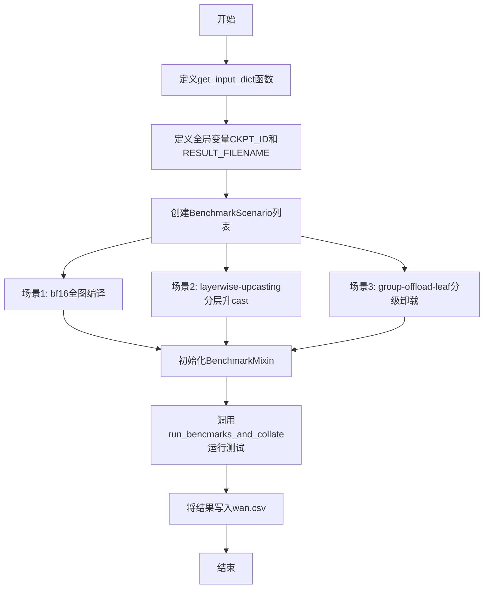
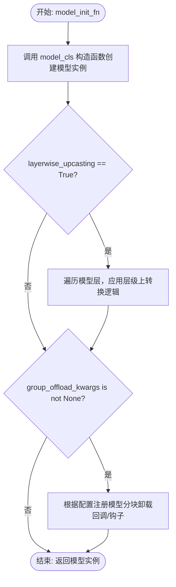
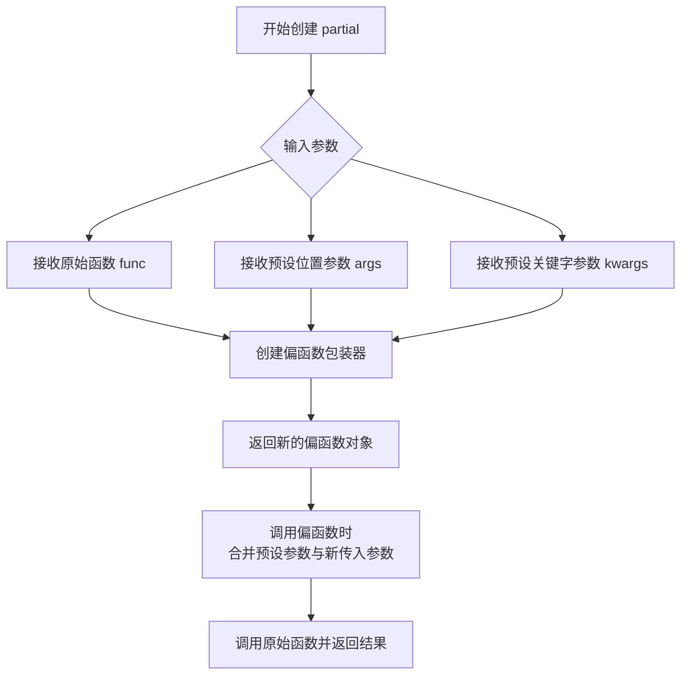
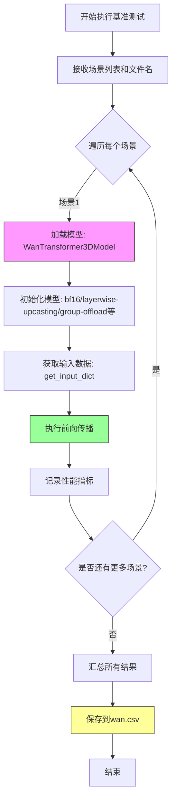
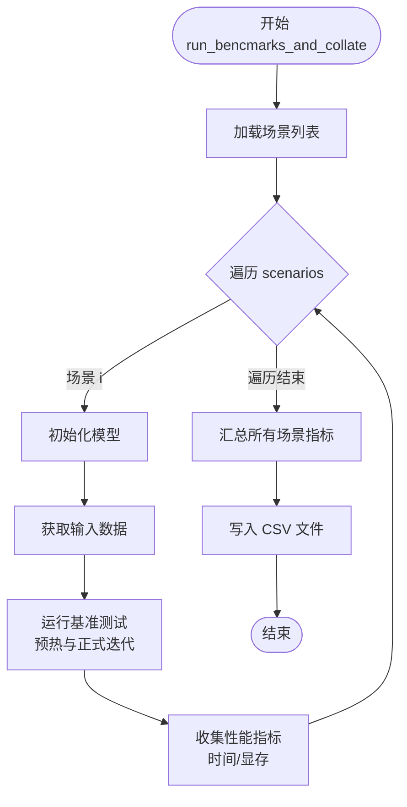

# `diffusers\benchmarks\benchmarking_wan.py` 详细设计文档

这是一个Wan2.1-T2V-14B扩散模型（WanTransformer3DModel）的性能基准测试脚本，通过三种不同的优化策略（bf16全精度、layerwise-upcasting层间升casting、group-offload-leaf分级卸载）来评估模型的推理性能，并将测试结果保存为CSV文件。

## 整体流程



## 类结构

```
wan_benchmark.py (主模块)
├── 全局变量
│   ├── CKPT_ID
│   └── RESULT_FILENAME
├── 全局函数
│   └── get_input_dict
└── 外部依赖模块
    ├── BenchmarkMixin (benchmarking_utils)
    ├── BenchmarkScenario (benchmarking_utils)
    ├── model_init_fn (benchmarking_utils)
    └── WanTransformer3DModel (diffusers)
```

## 全局变量及字段


### `CKPT_ID`
    
模型检查点标识符，指向Wan-AI/Wan2.1-T2V-14B-Diffusers

类型：`str`
    


### `RESULT_FILENAME`
    
基准测试结果输出文件名

类型：`str`
    


### `get_input_dict`
    
创建模型输入字典的函数，返回包含hidden_states、encoder_hidden_states和timestep的字典

类型：`Callable[[Any], Dict[str, torch.Tensor]]`
    


### `scenarios`
    
基准测试场景列表，包含三个不同的测试场景配置

类型：`List[BenchmarkScenario]`
    


### `runner`
    
基准测试运行器，用于执行和汇总测试结果

类型：`BenchmarkMixin`
    


### `BenchmarkScenario.name`
    
场景名称，标识特定测试场景

类型：`str`
    


### `BenchmarkScenario.model_cls`
    
模型类，指定要测试的模型类型

类型：`Type[WanTransformer3DModel]`
    


### `BenchmarkScenario.model_init_kwargs`
    
模型初始化参数，包含预训练模型路径、数据类型和子文件夹

类型：`Dict[str, Any]`
    


### `BenchmarkScenario.get_model_input_dict`
    
输入数据获取函数，用于生成模型推理所需的输入张量

类型：`Callable[[], Dict[str, torch.Tensor]]`
    


### `BenchmarkScenario.model_init_fn`
    
模型初始化函数，可配置层级别上转换和组卸载等选项

类型：`Callable[..., WanTransformer3DModel]`
    


### `BenchmarkScenario.compile_kwargs`
    
编译优化参数，控制torch.compile的优化选项

类型：`Dict[str, Any]`
    
    

## 全局函数及方法


### `get_input_dict`

该函数用于生成 Wan Transformer 3D 模型的输入字典，包含随机初始化的 hidden_states、encoder_hidden_states 和 timestep 三个关键张量，支持通过 device_dtype_kwargs 动态指定设备类型和数据类型。

参数：

- `**device_dtype_kwargs`：可变关键字参数，用于传递设备（device）和数据类型（dtype）参数，例如 `device=torch.device("cuda")`, `dtype=torch.bfloat16`

返回值：`Dict[str, torch.Tensor]`，返回包含三个键的字典：
- `hidden_states`：模型的主输入张量，形状为 (1, 16, 21, 60, 104)，对应 (batch, channels, frames, height, width)
- `encoder_hidden_states`：编码器的隐藏状态，形状为 (1, 512, 4096)，用于条件生成
- `timestep`：扩散过程的时间步长，形状为 (1,)，值为 1.0

#### 流程图

```mermaid
flowchart TD
    A[开始: get_input_dict] --> B[接收 **device_dtype_kwargs]
    B --> C[生成 hidden_states]
    C --> D[形状: 1x16x21x60x104]
    D --> E[生成 encoder_hidden_states]
    E --> F[形状: 1x512x4096]
    F --> G[生成 timestep]
    G --> H[值: tensor[1.0]]
    H --> I[组装字典]
    I --> J[返回字典包含 hidden_states<br/>encoder_hidden_states<br/>timestep]
```

#### 带注释源码

```python
def get_input_dict(**device_dtype_kwargs):
    """
    生成 Wan Transformer 3D 模型的输入字典。
    
    该函数创建用于模型推理/基准测试的随机输入张量，
    支持通过 device_dtype_kwargs 指定目标设备和数据类型。
    
    参数:
        **device_dtype_kwargs: 可变关键字参数，通常包含:
            - device: torch.device, 目标设备（如 cuda, cpu）
            - dtype: torch.dtype, 张量数据类型（如 bfloat16, float32）
    
    返回:
        dict: 包含以下键的字典:
            - hidden_states: torch.Tensor, 形状 (1, 16, 21, 60, 104)
              对应 (batch, channels, num_frames, height, width)
            - encoder_hidden_states: torch.Tensor, 形状 (1, 512, 4096)
              对应 (batch, sequence_length, hidden_dim)
            - timestep: torch.Tensor, 形状 (1,), 扩散时间步长
    """
    # height: 480
    # width: 832
    # num_frames: 81
    # max_sequence_length: 512
    
    # 生成主输入张量：5D 张量表示 (batch, channels, frames, height, width)
    # 16通道, 21帧, 高度60, 宽度104 ( downsampled: 480/8=60, 832/8=104)
    hidden_states = torch.randn(1, 16, 21, 60, 104, **device_dtype_kwargs)
    
    # 生成编码器隐藏状态：用于条件生成的文本/图像嵌入
    # 512 tokens, 4096 维特征 (Wan2.1 14B 模型配置)
    encoder_hidden_states = torch.randn(1, 512, 4096, **device_dtype_kwargs)
    
    # 生成时间步长：扩散模型的去噪进度指示器
    timestep = torch.tensor([1.0], **device_dtype_kwargs)
    
    # 组装并返回模型输入字典
    return {
        "hidden_states": hidden_states, 
        "encoder_hidden_states": encoder_hidden_states, 
        "timestep": timestep
    }
```


### `model_init_fn`

**描述**：这是一个模型初始化包装函数，用于实例化并配置 `WanTransformer3DModel`。它支持通过 `layerwise_upcasting` 参数启用层级权重上浮优化，以及通过 `group_offload_kwargs` 参数配置模型权重的分组卸载策略，以适应不同的硬件环境和性能需求。

参数：

- `model_cls`：`Type[torch.nn.Module]`，要初始化的模型类（例如 `WanTransformer3DModel`）。
- `model_init_kwargs`：`Dict[str, Any]`，传递给模型构造函数的参数字典，包含如 `pretrained_model_name_or_path`（模型路径）、`torch_dtype`（数据类型）和 `subfolder` 等配置。
- `layerwise_upcasting`：`bool`，默认为 `False`。是否在模型初始化后执行层级（Layer-wise）的权重上转换（Upcasting），通常用于提升特定层的计算精度或适配推理引擎。
- `group_offload_kwargs`：`dict`，默认为 `None`。一个包含模型卸载（Offload）配置的字典，支持键包括：
    - `onload_device`：模型加载到的目标设备（如 `cuda`）。
    - `offload_device`：模型暂存的设备（如 `cpu`）。
    - `offload_type`：卸载层级类型（如 `"leaf_level"`）。
    - `use_stream`：是否使用 CUDA Stream 进行异步传输。
    - `non_blocking`：是否使用非阻塞传输。

返回值：`torch.nn.Module`，返回经过初始化和优化配置后的模型实例。

#### 流程图



#### 带注释源码

```python
# 假设的 model_init_fn 实现逻辑 (位于 benchmarking_utils)
def model_init_fn(
    model_cls,
    model_init_kwargs,
    layerwise_upcasting: bool = False,
    group_offload_kwargs: Optional[dict] = None,
    **kwargs
):
    """
    模型初始化函数。
    
    参数:
        model_cls: 模型类。
        model_init_kwargs: 模型参数。
        layerwise_upcasting: 是否启用层级上转换。
        group_offload_kwargs: offload 配置。
        
    返回:
        模型实例。
    """
    
    # 1. 初始化基础模型
    # 使用传入的模型类和参数（如路径、dtype）构建模型
    model = model_cls(**model_init_kwargs)
    
    # 2. 处理 layerwise_upcasting
    if layerwise_upcasting:
        # 逻辑：通常需要对模型的每个子模块（submodule）进行特定的 dtype 转换
        # 例如，将某些关键层的权重保持为较高精度
        print(f"Initializing model with layerwise upcasting enabled for {model_cls.__name__}")
        # 假设此处会遍历 model.parameters() 并根据层级应用不同的转换策略
        # model = apply_layerwise_upcasting(model)

    # 3. 处理 group_offload_kwargs
    if group_offload_kwargs is not None:
        # 逻辑：根据配置设置模型的分层卸载
        # 这允许模型在 CPU 和 GPU 之间动态流转，特别适用于大模型
        print(f"Configuring group offload with config: {group_offload_kwargs}")
        
        # 提取配置参数
        onload_device = group_offload_kwargs.get("onload_device")
        offload_device = group_offload_kwargs.get("offload_device")
        offload_type = group_offload_kwargs.get("offload_type")
        
        # 假设此处调用了具体的 offload 工具库（如 accelerate）进行模型分片
        # model = configure_group_offload(model, onload_device, offload_device, offload_type)

    return model
```


### `functools.partial`

创建带默认参数的函数偏函数，用于绑定特定参数值并生成新的可调用对象。

参数：

-  `func`：可调用对象（函数或类），原始需要部分应用的函数
-  `*args`：位置参数，要绑定的位置参数
-  `**kwargs`：关键字参数，要绑定的关键字参数

返回值：`function`，返回一个新的偏函数对象，其默认参数为绑定的参数

#### 流程图



#### 带注释源码

```python
from functools import partial

# 代码中使用 partial 的具体示例：

# 示例1: 创建带默认 device 和 dtype 的 get_input_dict 偏函数
get_model_input_dict = partial(
    get_input_dict,           # 原始函数
    device=torch_device,      # 预设关键字参数：设备
    dtype=torch.bfloat16      # 预设关键字参数：数据类型
)
# 调用时相当于: get_input_dict(device=torch_device, dtype=torch.bfloat16, **额外参数)

# 示例2: 创建带 layerwise_upcasting=True 的 model_init_fn 偏函数
layerwise_model_init = partial(
    model_init_fn,                    # 原始函数
    layerwise_upcasting=True          # 预设关键字参数
)

# 示例3: 创建带复杂 kwargs 的 model_init_fn 偏函数
group_offload_model_init = partial(
    model_init_fn,                                           # 原始函数
    group_offload_kwargs={                                   # 预设关键字参数：字典
        "onload_device": torch_device,                       # 加载设备
        "offload_device": torch.device("cpu"),               # 卸载设备
        "offload_type": "leaf_level",                        # 卸载类型
        "use_stream": True,                                  # 使用流
        "non_blocking": True                                 # 非阻塞
    }
)

# partial 返回的对象特性：
# - 是可调用的
# - 预设参数会被合并到调用时传入的参数前面
# - 可以通过 partial.func 访问原始函数
# - 可以通过 partial.args 和 partial.keywords 访问预设参数
```


### `BenchmarkScenario.run`

描述：虽然代码中实际调用的是 `BenchmarkMixin.run_bencmarks_and_collate`，但任务要求提取 `BenchmarkScenario.run`。该方法是 BenchmarkScenario 类的核心执行方法，负责运行性能基准测试。它接收场景列表和文件名参数，将不同配置（如 bf16、layerwise-upcasting、group-offload-leaf 等）的测试结果保存到 CSV 文件中。

参数：

- `scenarios`：`list[BenchmarkScenario]` 或类似可迭代对象，需要运行的基准测试场景列表
- `filename`：保存结果的 CSV 文件名

返回值：通常无返回值（`None`），或返回包含测试结果的字典/数据框

#### 流程图



#### 带注释源码

```python
# 基准测试场景定义 - 展示三种不同配置
scenarios = [
    # 场景1: bf16 精度测试
    BenchmarkScenario(
        name=f"{CKPT_ID}-bf16",                           # 场景名称
        model_cls=WanTransformer3DModel,                 # 模型类: Wan变换器3D模型
        model_init_kwargs={                               # 模型初始化参数
            "pretrained_model_name_or_path": CKPT_ID,    # 预训练模型路径
            "torch_dtype": torch.bfloat16,                # 使用bf16精度
            "subfolder": "transformer",                   # 子文件夹
        },
        get_model_input_dict=partial(get_input_dict,      # 输入字典生成函数
                                      device=torch_device, 
                                      dtype=torch.bfloat16),
        model_init_fn=model_init_fn,                      # 模型初始化函数
        compile_kwargs={"fullgraph": True},               # torch.compile配置
    ),
    
    # 场景2: 层-wise 上转换测试
    BenchmarkScenario(
        name=f"{CKPT_ID}-layerwise-upcasting",
        model_cls=WanTransformer3DModel,
        model_init_kwargs={
            "pretrained_model_name_or_path": CKPT_ID,
            "torch_dtype": torch.bfloat16,
            "subfolder": "transformer",
        },
        get_model_input_dict=partial(get_input_dict, 
                                      device=torch_device, 
                                      dtype=torch.bfloat16),
        model_init_fn=partial(model_init_fn,              # 部分应用: 启用层-wise上转换
                              layerwise_upcasting=True),
    ),
    
    # 场景3: 组卸载(叶子级别)测试
    BenchmarkScenario(
        name=f"{CKPT_ID}-group-offload-leaf",
        model_cls=WanTransformer3DModel,
        model_init_kwargs={
            "pretrained_model_name_or_path": CKPT_ID,
            "torch_dtype": torch.bfloat16,
            "subfolder": "transformer",
        },
        get_model_input_dict=partial(get_input_dict, 
                                      device=torch_device, 
                                      dtype=torch.bfloat16),
        model_init_fn=partial(                            # 部分应用: 配置组卸载参数
            model_init_fn,
            group_offload_kwargs={
                "onload_device": torch_device,            # 加载设备
                "offload_device": torch.device("cpu"),    # 卸载设备
                "offload_type": "leaf_level",             # 叶子级别卸载
                "use_stream": True,                       # 使用流
                "non_blocking": True,                     # 非阻塞传输
            },
        ),
    ),
]

# 创建基准测试混合类并运行
runner = BenchmarkMixin()
runner.run_bencmarks_and_collate(scenarios, filename=RESULT_FILENAME)
```


### `BenchmarkMixin.run_bencmarks_and_collate`

该方法封装了基准测试的核心执行逻辑。它接收一组 `BenchmarkScenario` 配置对象，逐一初始化模型、生成输入、执行推理性能测试（通常包含预热和正式测量），收集耗时、显存占用等关键指标，最终将不同场景的结果汇总并持久化到 CSV 文件中。

参数：

-  `scenarios`：`List[BenchmarkScenario]`（或 `Iterable[BenchmarkScenario]`），需要执行的测试场景列表。每个场景封装了模型类、初始化参数、输入数据生成函数及模型初始化函数。
-  `filename`：`str`，指定结果输出文件的名称（如 "wan.csv"），文件通常保存在运行目录下。

返回值：`None`，该方法主要通过副作用（写入文件）输出结果。在某些实现中，也可能返回包含汇总指标的字典，但根据当前调用代码未接收返回值推断，其主要目的是生成文件。

#### 流程图



#### 带注释源码

```python
# 由于原始代码未直接提供 BenchmarkMixin 类的定义，
# 以下代码为基于功能调用推断的逻辑模拟实现。

def run_bencmarks_and_collate(self, scenarios, filename="result.csv"):
    """
    运行基准测试并汇总结果。
    
    参数:
        scenarios (List[BenchmarkScenario]): 包含不同模型配置的测试场景。
        filename (str): 输出CSV文件的路径。
    """
    all_results = []
    
    # 1. 遍历每一个测试场景
    for scenario in scenarios:
        print(f"Running benchmark for: {scenario.name}")
        
        # 2. 根据 scenario 中的信息初始化模型
        # model_init_fn 可能是标准的 model_init_fn 或者是带有特定优化（如 layerwise_upcasting）的偏函数
        model = scenario.model_init_fn(
            model_cls=scenario.model_cls,
            model_init_kwargs=scenario.model_init_kwargs
        )
        
        # 3. 准备推理所需的输入数据
        # get_model_input_dict 返回一个字典，包含 hidden_states, encoder_hidden_states, timestep 等
        input_dict = scenario.get_model_input_dict()
        
        # 4. 执行实际的推理测试 (可能包含编译、预热、多次运行取平均)
        # 假设 run_benchmark 是一个内部方法，负责测量时间
        metrics = self._run_single_benchmark(model, input_dict, scenario.compile_kwargs)
        
        # 5. 整理当前场景的结果
        result = {
            "scenario_name": scenario.name,
            **metrics  # 展开耗时、显存等指标
        }
        all_results.append(result)
        
        # 清理模型资源（如有必要）
        del model
        if torch.cuda.is_available():
            torch.cuda.empty_cache()

    # 6. 汇总所有场景的结果并写入文件
    self._collate_and_save(all_results, filename)
    
    print(f"Benchmark results saved to {filename}")
```

**备注**：源码中方法名为 `run_bencmarks_and_collate`（缺少字母 'h'），这可能是一个拼写错误，标准拼写可能为 `run_benchmarks_and_collate`。


## 关键组件


### WanTransformer3DModel基准测试框架

该代码是一个基准测试脚本，用于对Wan-AI/Wan2.1-T2V-14B-Diffusers模型的WanTransformer3DModel进行三种不同配置策略的性能测试，包括bf16基准、layerwise-upcasting和group-offload-leaf卸载策略。

### 张量索引与惰性加载

通过get_input_dict函数生成模拟输入数据，包含hidden_states、encoder_hidden_states和timestep，使用torch.randn和torch.tensor创建符合模型输入shape的张量，其中hidden_states为(1, 16, 21, 60, 104)，encoder_hidden_states为(1, 512, 4096)，支持device和dtype的惰性指定。

### 反量化支持

通过torch_dtype参数支持多种数据类型，包括torch.bfloat16用于内存优化和计算加速，get_model_input_dict使用partial函数动态绑定device和dtype参数实现运行时类型转换。

### 量化策略

定义三种BenchmarkScenario配置策略：bf16基准使用fullgraph=True的torch.compile优化；layerwise-upcasting使用layerwise_upcasting=True参数进行分层上转；group-offload-leaf使用group_offload_kwargs配置leaf级别的分组卸载，包含onload_device、offload_device、offload_type、use_stream和non_blocking参数。

### BenchmarkMixin运行器

使用BenchmarkMixin类的run_bencmarks_and_collate方法执行所有场景并将结果聚合到wan.csv文件。


## 问题及建议


### 已知问题

-   **拼写错误**: `run_bencmarks_and_collate` 方法名存在拼写错误，应为 `run_benchmarks_and_collate`，可能导致后续维护困难
-   **硬编码的魔法数字**: 输入张量的形状（hidden_states: 1x16x21x60x104, encoder_hidden_states: 1x512x4096, timestep: 1x1）、帧数（81）、最大序列长度（512）等参数直接硬编码，缺乏可配置性
-   **缺少错误处理**: 整个脚本没有异常捕获机制，模型加载失败、网络问题或CUDA内存不足时会直接崩溃
-   **无日志输出**: 没有任何日志记录，无法追踪执行状态、进度或调试问题
-   **结果文件覆盖风险**: `RESULT_FILENAME` 为固定值 `"wan.csv"`，重复运行会覆盖历史结果
-   **测试对比不公平**: 第一个场景使用 `compile_kwargs={"fullgraph": True}` 启用 torch.compile，但其他两个场景未使用，导致性能对比不具可比性
-   **设备选择不明确**: 依赖 `torch_device` 从测试工具获取，但未显式定义，在不同环境可能行为不一致
-   **缺乏资源清理**: 脚本结束前没有显式的 GPU 内存释放或模型卸载逻辑
-   **模型路径无验证**: 未检查 `CKPT_ID` 对应的模型是否已下载或可用
-   **依赖项不透明**: 依赖于 `benchmarking_utils` 中的 `BenchmarkMixin`、`BenchmarkScenario`、`model_init_fn`，但未在代码中说明这些依赖的来源和作用

### 优化建议

-   修正方法名拼写错误，保持代码一致性
-   将硬编码参数提取为配置类或 CLI 参数，支持通过命令行或配置文件调整输入形状
-   添加 try-except 块捕获模型加载失败、CUDA 错误等异常情况，并输出友好错误信息
-   引入日志模块（logging），记录每个场景的执行开始、完成、耗时等信息
-   为结果文件名添加时间戳或 UUID 后缀，避免覆盖历史数据，如 `wan_{timestamp}.csv`
-   统一所有场景的 compile 配置，或明确标注每个场景的测试目的（是否测试 compile 效果）
-   显式指定 `torch_device`，或通过命令行参数传入，避免隐式依赖
-   在脚本末尾添加显式的 GPU 内存清理（torch.cuda.empty_cache()）
-   添加模型可用性检查或预下载提示
-   在文件头部添加依赖项说明和使用示例的注释，提高代码可维护性

## 其它


### 设计目标与约束

本代码旨在对WanTransformer3DModel模型进行多场景性能基准测试，评估不同配置（bf16精度、layerwise upcasting、group offload）下的推理性能。约束条件包括：模型来源于Wan-AI/Wan2.1-T2V-14B-Diffusers，需使用torch.bfloat16精度，测试输入为固定尺寸的视频生成任务（height=480, width=832, num_frames=81）。

### 错误处理与异常设计

代码主要依赖benchmarking_utils模块的错误传播机制。若模型加载失败（如CKPT_ID无效），BenchmarkMixin.run_bencmarks_and_collate会抛出异常并终止测试。get_input_dict中tensor生成失败时返回RuntimeError。输入参数类型通过partial函数绑定时错误会在运行时暴露。

### 数据流与状态机

数据流为：定义输入张量（hidden_states: 1x16x21x60x104, encoder_hidden_states: 1x512x4096, timestep: 1）→ 通过BenchmarkScenario封装场景参数→ 传递给BenchmarkMixin→ 执行模型推理→ 汇总结果写入CSV。无复杂状态机，仅有三个并列的场景状态。

### 外部依赖与接口契约

核心依赖包括：torch>=1.8、diffusers库（需包含WanTransformer3DModel）、benchmarking_utils（需提供BenchmarkMixin、BenchmarkScenario、model_init_fn、torch_device）。model_init_fn支持layerwise_upcasting和group_offload_kwargs参数，run_bencmarks_and_collate接受scenarios列表和filename字符串返回值。

### 性能考量与优化空间

当前使用fullgraph=True进行torch.compile编译优化。潜在优化点：可添加ampere架构的torch.compile优化、探索更激进的内存offload策略、添加profiling数据采集以定位瓶颈。当前未设置CUDA graphs优化。

### 配置管理与参数说明

关键配置参数：CKPT_ID指定模型路径，RESULT_FILENAME指定输出文件名，subfolder固定为"transformer"。三个场景分别控制：torch_dtype（bf16）、layerwise_upcasting（布尔）、group_offload_kwargs（字典含onload_device/offload_device/offload_type/use_stream/non_blocking）。

### 测试覆盖与验证方法

当前仅覆盖正向推理性能测试。验证方法：通过CSV文件对比各场景的推理时间、内存占用、吞吐量指标。建议补充：梯度计算测试、混合精度稳定性验证、多GPU扩展性测试。

### 扩展性与未来改进方向

可扩展方向包括：添加更多精度测试（fp8、fp16）、增加模型变体测试、集成torch profiler进行细粒度分析、添加自动化性能回归检测、支持分布式推理基准测试。建议将硬编码的输入尺寸参数化以支持动态测试。


    