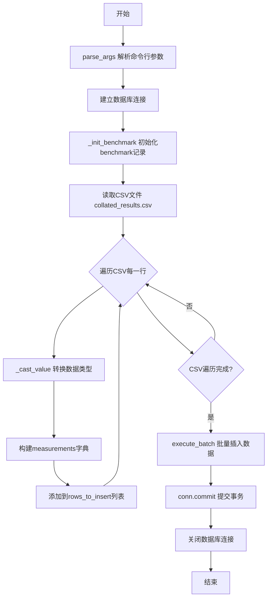
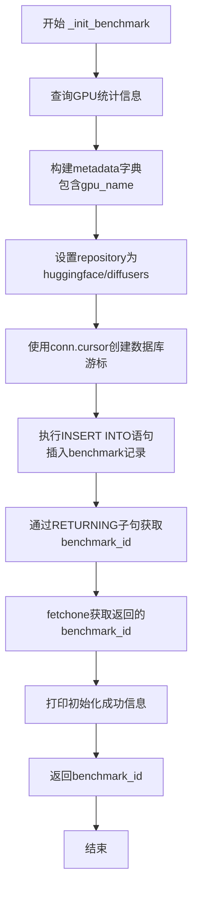
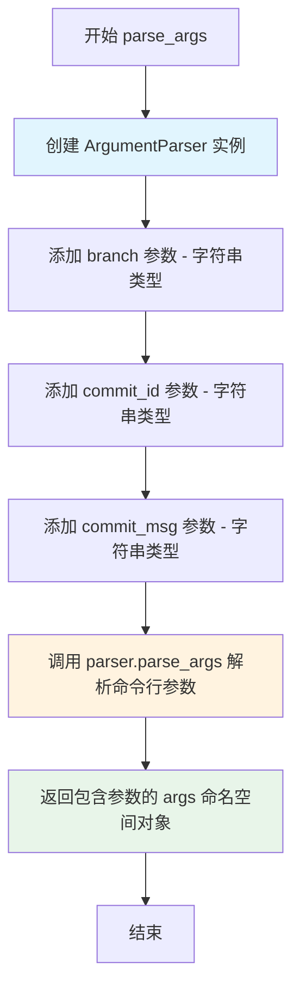

# `diffusers\benchmarks\populate_into_db.py` 详细设计文档

该脚本用于将机器学习模型（如Diffusers）的基准测试结果从CSV文件批量导入到PostgreSQL数据库中，包括初始化benchmark记录、读取CSV数据、类型转换和批量插入测量数据。

## 整体流程



## 类结构

```
Module (init_db.py)
└── 全局函数
    ├── _init_benchmark
    ├── parse_args
    └── _cast_value (内部函数)
```

## 全局变量及字段


### `FINAL_CSV_FILENAME`
    
最终合并的CSV文件名，包含待导入数据库的基准测试结果。

类型：`str`
    


### `BENCHMARKS_TABLE_NAME`
    
数据库表名，用于存储基准测试的元数据（如分支、提交、GPU信息）。

类型：`str`
    


### `MEASUREMENTS_TABLE_NAME`
    
数据库表名，用于存储模型测量数据，关联到对应的基准测试记录。

类型：`str`
    


    

## 全局函数及方法


### `_init_benchmark`

该函数负责在数据库中初始化一个新的基准测试记录。它首先查询当前GPU信息构建元数据，然后向benchmarks表中插入一条包含仓库名、分支、提交ID、提交信息和GPU元数据的记录，并返回新创建的基准测试ID。

参数：

- `conn`：`psycopg2.connection`，数据库连接对象，用于执行SQL操作
- `branch`：`str`，执行基准测试的分支名称
- `commit_id`：`str`，基准测试对应的提交哈希值
- `commit_msg`：`str`，与该提交关联的提交信息

返回值：`int`，新创建的基准测试记录的唯一标识符（benchmark_id）

#### 流程图



#### 带注释源码

```python
def _init_benchmark(conn, branch, commit_id, commit_msg):
    """
    在数据库中初始化一个新的基准测试记录
    
    参数:
        conn: 数据库连接对象
        branch: 分支名称
        commit_id: 提交哈希
        commit_msg: 提交信息
    
    返回:
        benchmark_id: 新创建的基准测试ID
    """
    # 查询GPU统计信息，用于获取当前GPU型号
    gpu_stats = gpustat.GPUStatCollection.new_query()
    
    # 构建元数据字典，包含GPU名称信息
    metadata = {"gpu_name": gpu_stats[0]["name"]}
    
    # 设置代码仓库地址
    repository = "huggingface/diffusers"
    
    # 使用上下文管理器创建数据库游标，确保资源正确释放
    with conn.cursor() as cur:
        # 向benchmarks表插入新记录，使用RETURNING子句获取新生成的benchmark_id
        cur.execute(
            f"INSERT INTO {BENCHMARKS_TABLE_NAME} (repository, branch, commit_id, commit_message, metadata) VALUES (%s, %s, %s, %s, %s) RETURNING benchmark_id",
            (repository, branch, commit_id, commit_msg, metadata),
        )
        
        # 获取新创建的benchmark_id（RETURNING子句返回的值）
        benchmark_id = cur.fetchone()[0]
        
        # 打印初始化成功的提示信息
        print(f"Initialised benchmark #{benchmark_id}")
        
        # 返回新创建的基准测试ID，供后续插入测量数据使用
        return benchmark_id
```


### `parse_args`

该函数是命令行参数解析器，用于解析脚本执行时传入的三个必需参数（branch、commit_id、commit_msg），并返回包含这些参数值的命名空间对象，供后续代码使用。

参数：此函数无显式参数（内部使用 `argparse.ArgumentParser` 和 `sys.argv` 进行隐式参数解析）

返回值：`argparse.Namespace`，返回一个命名空间对象，包含以下属性：
- `branch`：字符串类型，基准测试所在的分支名称
- `commit_id`：字符串类型，基准测试对应的提交哈希值
- `commit_msg`：字符串类型，提交相关的信息

#### 流程图



#### 带注释源码

```python
def parse_args():
    """
    解析命令行参数。
    
    该函数创建一个 ArgumentParser 实例，定义并添加三个必需的位参数：
    branch（分支名）、commit_id（提交哈希值）和 commit_msg（提交信息），
    然后解析 sys.argv 中的命令行参数并返回包含这些参数的命名空间对象。
    
    Returns:
        argparse.Namespace: 包含解析后的命令行参数的命名空间对象，
                          属性包括 branch, commit_id, commit_msg
    """
    # 创建 ArgumentParser 实例，用于解析命令行参数
    parser = argparse.ArgumentParser()
    
    # 添加第一个位置参数：branch - 基准测试所在的分支名称
    parser.add_argument(
        "branch",           # 参数名称（位置参数）
        type=str,           # 参数类型为字符串
        help="The branch name on which the benchmarking is performed."
    )

    # 添加第二个位置参数：commit_id - 基准测试对应的提交哈希值
    parser.add_argument(
        "commit_id",        # 参数名称（位置参数）
        type=str,           # 参数类型为字符串
        help="The commit hash on which the benchmarking is performed."
    )

    # 添加第三个位置参数：commit_msg - 提交相关的信息
    parser.add_argument(
        "commit_msg",       # 参数名称（位置参数）
        type=str,           # 参数类型为字符串
        help="The commit message associated with the commit, truncated to 70 characters."
    )
    
    # 解析命令行参数（默认使用 sys.argv）
    args = parser.parse_args()
    
    # 返回包含解析结果的命名空间对象
    return args
```


### `_cast_value`

这是一个在主程序代码块内部定义的局部辅助函数，用于将 CSV 读取的原始值根据指定的数据类型（text、float、bool）进行清洗和转换，同时处理空值（NaN）的情况，确保数据符合数据库插入的要求。

参数：

- `val`：任意类型（`Any`），需要转换的原始值，可以是 CSV 单元格的数据
- `dtype`：`str`，目标数据类型，指定要将值转换为的类型（支持 "text"、"float"、"bool"）

返回值：任意类型（`Any`），转换后的值。如果转换失败或值为空，则返回 `None`

#### 流程图

```mermaid
flowchart TD
    A[开始 _cast_value] --> B{pd.isna(val)?}
    B -->|是| C[返回 None]
    B -->|否| D{dtype == 'text'?}
    D -->|是| E[返回 str(val).strip()]
    D -->|否| F{dtype == 'float'?}
    F -->|是| G{尝试转换 float(val)}
    G -->|成功| H[返回 float 值]
    G -->|失败| I[返回 None]
    F -->|否| J{dtype == 'bool'?}
    J -->|是| K{str(val).strip().lower() in<br/>('true','t','yes','1')?}
    K -->|是| L[返回 True]
    K -->|否| M{str(val).strip().lower() in<br/>('false','f','no','0')?}
    M -->|是| N[返回 False]
    M -->|否| O{val in (1, 1.0)?}
    O -->|是| P[返回 True]
    O -->|否| Q{val in (0, 0.0)?}
    Q -->|是| R[返回 False]
    Q -->|否| S[返回 None]
    J -->|否| T[返回原始 val]
    E --> U[结束]
    H --> U
    I --> U
    L --> U
    N --> U
    P --> U
    R --> U
    S --> U
    T --> U
```

#### 带注释源码

```python
def _cast_value(val, dtype: str):
    """
    将给定的值根据指定的数据类型进行转换和清洗。
    
    参数:
        val: 需要转换的原始值
        dtype: 目标数据类型 ("text", "float", "bool")
    
    返回:
        转换后的值，转换失败或空值时返回 None
    """
    # 检查值是否为空（NaN），如果是则返回 None
    if pd.isna(val):
        return None

    # 处理文本类型：去除首尾空格
    if dtype == "text":
        return str(val).strip()

    # 处理浮点数类型：尝试转换为 float，失败则返回 None
    if dtype == "float":
        try:
            return float(val)
        except ValueError:
            return None

    # 处理布尔类型：支持多种字符串和数字表示形式
    if dtype == "bool":
        s = str(val).strip().lower()
        # 字符串形式的 True
        if s in ("true", "t", "yes", "1"):
            return True
        # 字符串形式的 False
        if s in ("false", "f", "no", "0"):
            return False
        # 数字形式的 True (1 或 1.0)
        if val in (1, 1.0):
            return True
        # 数字形式的 False (0 或 0.0)
        if val in (0, 0.0):
            return False
        # 无法识别为布尔值，返回 None
        return None

    # 对于未知类型，直接返回原始值
    return val
```

## 关键组件


### 命令行参数解析模块

负责解析脚本执行时传入的三个必要参数：branch（分支名）、commit_id（提交哈希值）和commit_msg（提交信息），为基准测试初始化提供必要的元数据。

### 数据库连接管理模块

负责建立和管理与PostgreSQL数据库的连接，从环境变量（PGHOST、PGDATABASE、PGUSER、PGPASSWORD）读取连接凭证，并在连接失败时打印错误信息并退出程序。

### 基准测试初始化模块

负责在数据库中创建新的基准测试记录，收集当前GPU信息作为元数据，并将分支、提交ID、提交信息及GPU信息存入benchmarks表，返回新创建的benchmark_id供后续测量数据关联使用。

### GPU信息收集模块

利用gpustat库获取当前GPU状态信息，提取GPU型号名称并封装为字典格式，用于记录基准测试执行环境的硬件信息。

### CSV数据读取模块

使用pandas库读取名为"collated_results.csv"的文件，将CSV内容转换为DataFrame结构供后续数据处理使用。

### 数据类型转换模块

提供类型安全的值转换功能，支持将CSV读取的原始值转换为数据库所需的特定类型（text文本、float浮点数、bool布尔值），处理空值和各类格式变体（如布尔值的"true"/"false"/"1"/"0"等表示形式）。

### 批量数据插入模块

负责将处理后的测量数据批量插入数据库，使用psycopg2.extras.execute_batch进行高效批量操作，将每行CSV数据与对应的benchmark_id关联后插入model_measurements表，并提交事务确保数据持久化。

### 异常处理与错误恢复模块

在数据库连接、基准测试初始化、数据插入等关键操作点实现try-except捕获机制，确保任何阶段发生错误时都能打印详细错误信息并以非零状态码退出程序。


## 问题及建议


### 已知问题

-   **SQL注入风险**：代码使用 f-string 拼接表名构建 SQL 语句（`BENCHMARKS_TABLE_NAME` 和 `MEASUREMENTS_TABLE_NAME`），虽然当前为常量，但这种写法存在潜在 SQL 注入风险
-   **GPU 访问缺乏异常处理**：直接通过 `gpu_stats[0]` 访问 GPU 信息，未检查 GPU 是否存在或查询是否成功，可能导致索引越界或空指针异常
-   **硬编码的 repository 名称**：repository = "huggingface/diffusers" 硬编码在代码中，缺乏灵活性
-   **环境变量未验证**：数据库连接所需的环境变量（PGHOST、PGDATABASE、PGUSER、PGPASSWORD）未做存在性验证，连接失败时的错误信息不够明确
-   **缺少 commit_msg 截断处理**：参数说明中提到 commit_msg 应截断至 70 字符，但代码中未实现该逻辑
-   **游标资源管理不规范**：在 `finally` 块中未确保游标和连接正确关闭，异常发生时可能造成资源泄漏
-   **CSV 字段缺乏验证**：读取 CSV 后未验证必要字段是否存在，直接使用 `.get()` 方法获取值可能导致隐藏的数据问题
-   **Bool 类型转换逻辑复杂且易混淆**：`_cast_value` 函数的 bool 类型转换包含多个分支，逻辑冗余且难以维护

### 优化建议

-   将 SQL 表名通过参数化方式传递或使用白名单验证，避免 f-string 拼接
-   添加 GPU 查询的异常处理，使用 `try-except` 捕获 `gpustat` 相关异常，并在 GPU 不可用时提供默认值或退出
-   将 repository 名称提取为配置项或环境变量，提高代码可配置性
-   在读取环境变量后添加验证逻辑，确保必要的环境变量存在，不存在时给出明确提示
-   在 `parse_args` 中添加 `commit_msg` 截断逻辑：`args.commit_msg = args.commit_msg[:70]`
-   使用上下文管理器（`with` 语句）管理数据库连接和游标，确保资源正确释放
-   在迭代 CSV 行之前，验证必需的列名是否存在，缺失时给出警告或报错
-   简化 bool 类型转换逻辑，使用统一的映射表或 `pandas` 的类型转换方法
-   引入结构化日志记录（如 `logging` 模块）替代 `print` 语句，便于问题排查
-   考虑添加数据验证步骤，确保插入的数值在合理范围内（如 `num_params_B` 应为正数）

## 其它


### 设计目标与约束

本代码的核心目标是将benchmark测试结果（存储在CSV文件中）批量导入到PostgreSQL数据库中，并建立与对应commit的关联关系。设计约束包括：1) 依赖环境变量（PGHOST, PGDATABASE, PGUSER, PGPASSWORD）进行数据库连接；2) CSV文件必须包含特定的列结构（scenario, model_cls, num_params_B, flops_G等）；3) 采用批量插入策略以提高性能；4) 必须先通过_init_benchmark创建benchmark记录才能插入测量数据。

### 错误处理与异常设计

代码采用分层异常处理机制。在数据库连接阶段，使用try-except捕获连接失败并输出错误信息后以sys.exit(1)退出；在benchmark初始化阶段，捕获异常并打印具体错误后退出；在数据导入阶段，使用嵌套的try-except块处理CSV解析、数据转换和批量插入过程中的异常。当前错误处理较为基础，缺少细粒度的错误分类和恢复策略，建议区分可重试错误（如临时网络问题）与不可重试错误（如数据格式问题）。

### 数据流与状态机

程序执行流程如下：1) 解析命令行参数；2) 建立数据库连接；3) 创建benchmark记录并获取benchmark_id；4) 读取CSV文件并逐行转换；5) 构建待插入的元组列表；6) 执行批量插入；7) 提交事务并关闭连接。状态转换路径为：参数解析 → DB连接 → Benchmark创建 → 数据转换 → 批量插入 → 资源释放。任何阶段的异常都会导致程序以exit code 1终止。

### 外部依赖与接口契约

主要外部依赖包括：1) psycopg2 - PostgreSQL数据库适配器；2) pandas - CSV文件读取和数据处理；3) gpustat - GPU信息查询；4) argparse - 命令行参数解析。接口契约方面：CSV输入文件必须存在且可读，列名必须包含scenario、model_cls、num_params_B、flops_G、time_plain_s、mem_plain_GB、time_compile_s、mem_compile_GB、fullgraph、mode，可选列包括github_sha；数据库必须存在benchmarks和model_measurements两张表，且表结构需匹配INSERT语句中的字段。

### 性能考虑与优化

代码使用psycopg2.extras.execute_batch进行批量插入，相比单行插入显著提升性能。建议进一步优化：1) 使用execute_values替代execute_batch可获得更高吞吐量；2) 考虑使用COPY命令进行超大数据集的导入；3) 当前逐行迭代CSV可考虑使用pandas的chunk参数分块处理；4) 可以在批量插入前进行数据验证以提前过滤无效行，减少数据库端错误回滚开销。

### 安全性考虑

当前代码存在以下安全风险：1) 数据库连接凭据通过环境变量传入，存在环境变量被意外暴露的风险；2) 使用f-string构建SQL语句存在SQL注入风险（虽然当前参数化查询正确使用了%s占位符，但表名直接拼接在f-string中）；3) commit_msg和测量数据中的文本字段未进行充分的输入验证和清理。建议：1) 使用连接池管理数据库连接；2) 对所有用户输入进行验证；3) 考虑加密存储敏感信息；4) 添加审计日志记录数据变更。

### 配置管理

配置通过以下方式管理：1) 命令行参数（branch, commit_id, commit_msg）；2) 环境变量（PGHOST, PGDATABASE, PGUSER, PGPASSWORD）；3) 硬编码常量（FINAL_CSV_FILENAME, BENCHMARKS_TABLE_NAME, MEASUREMENTS_TABLE_NAME）。建议将更多配置项（如CSV文件名、表名、GPU信息收集策略等）提取到配置文件或环境变量中，以提高代码的可维护性和灵活性。

### 监控与日志

当前代码仅使用print语句进行基本的状态输出，缺少结构化日志和监控能力。建议：1) 使用Python的logging模块替代print，实现分级日志（DEBUG、INFO、WARNING、ERROR）；2) 记录关键指标如处理行数、插入耗时、benchmark_id等；3) 可集成Prometheus或OpenTelemetry进行指标收集；4) 添加性能剖析点以识别瓶颈。

### 测试策略

代码缺少单元测试和集成测试。建议：1) 为_cast_value函数编写单元测试，覆盖各种数据类型转换边界情况；2) 模拟数据库连接和CSV文件，测试数据流逻辑；3) 添加集成测试验证与真实数据库的交互；4) 使用pytest框架组织测试，并引入mock对象隔离外部依赖。

### 部署 considerations

部署时需确保：1) 数据库服务器可访问且网络连通；2) 环境变量正确配置；3) CSV文件路径正确或可通过配置指定；4) 运行用户具有数据库表的写入权限；5) 考虑在容器化环境中运行时的资源限制。建议添加健康检查脚本验证所有前置条件，并在失败时提供清晰的错误信息。

    