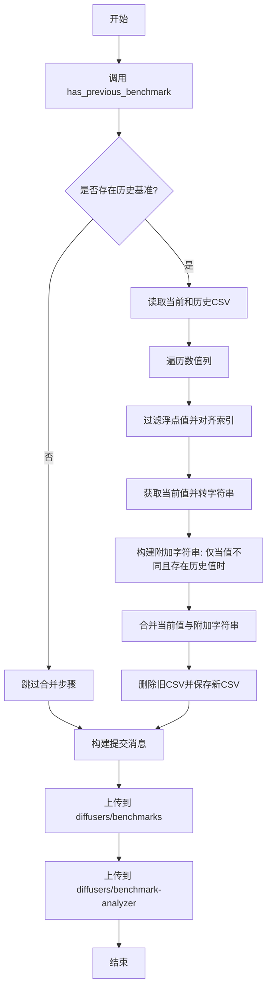
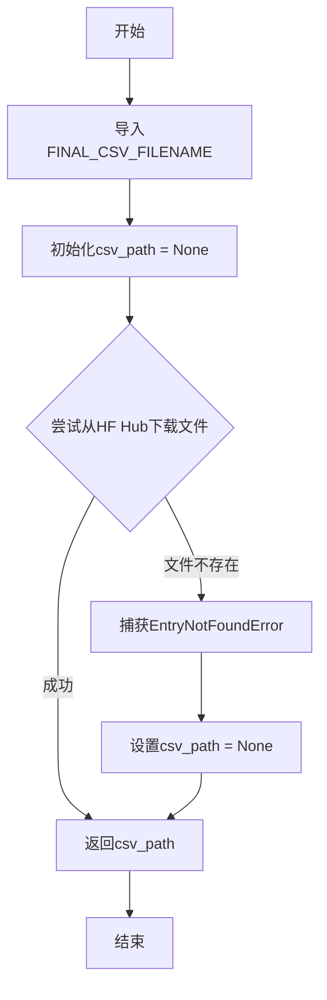
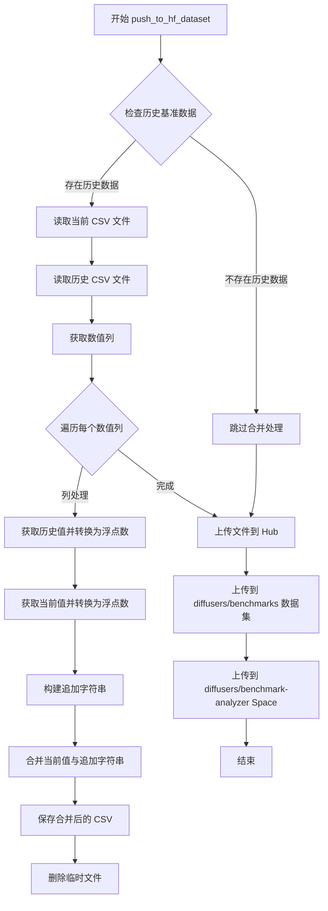

# `diffusers\benchmarks\push_results.py` 详细设计文档

该脚本将本地基准测试结果上传到HuggingFace Hub数据集，包括与之前的基准测试结果合并功能。它会读取当前CSV文件，若存在之前的基准测试结果，则将数值列与历史数据对比并在差异处附加历史值，最后将合并后的结果上传到两个HuggingFace仓库。

## 整体流程



## 类结构

```
无类层次结构 (脚本文件)
└── 模块级函数
    ├── has_previous_benchmark
    ├── filter_float
    └── push_to_hf_dataset
```

## 全局变量及字段


### `REPO_ID`
    
Hugging Face数据集仓库ID，用于存储基准测试结果

类型：`str`
    


    

## 全局函数及方法


### `has_previous_benchmark`

该函数用于检查HuggingFace Hub的datasets仓库中是否存在之前的基准测试CSV文件。如果存在则返回该文件的本地路径，否则返回None。

参数： 无

返回值：`str`，如果存在之前的基准测试文件则返回本地缓存的文件路径，否则返回None

#### 流程图



#### 带注释源码

```python
def has_previous_benchmark() -> str:
    """
    检查HuggingFace Hub上是否存在之前的基准测试CSV文件。
    
    Returns:
        str: 如果存在则返回文件本地路径,否则返回None
    """
    # 动态导入常量，避免循环依赖
    from run_all import FINAL_CSV_FILENAME

    # 初始化路径为None
    csv_path = None
    try:
        # 尝试从HF Hub的dataset仓库下载基准测试CSV文件
        csv_path = hf_hub_download(
            repo_id=REPO_ID,           # 仓库ID: "diffusers/benchmarks"
            repo_type="dataset",       # 仓库类型: dataset
            filename=FINAL_CSV_FILENAME  # 要下载的文件名
        )
    except EntryNotFoundError:
        # 如果文件不存在（首次运行或文件被删除），捕获异常并保持csv_path为None
        csv_path = None
    
    # 返回文件路径（如果存在）或None（如果不存在）
    return csv_path
```


### `filter_float`

该函数用于将输入值转换为浮点数。如果输入是字符串，则提取字符串的第一个单词（以空格分割）并转换为浮点数；如果输入已经是数值类型，则直接返回原值。此函数主要用于处理包含数字的字符串列，确保在数值比较时能正确解析。

参数：

- `value`：`任意类型`，需要过滤和转换的值，可以是字符串或数值类型

返回值：`任意类型`，如果输入是字符串则返回转换后的 float，否则返回原值

#### 流程图

```mermaid
flowchart TD
    A[开始: value] --> B{value 是否为字符串?}
    B -->|是| C[提取第一个单词: value.split[0]]
    C --> D[转换为浮点数: float(value.split()[0])]
    D --> E[返回 float 值]
    B -->|否| F[直接返回原 value]
    E --> G[结束]
    F --> G
```

#### 带注释源码

```
def filter_float(value):
    """
    将值转换为浮点数。
    
    如果值是字符串，提取第一个空格分隔的token并转换为float。
    如果值已经是数值类型，则直接返回。
    
    参数:
        value: 任意类型，需要处理的值
        
    返回:
        转换后的float值或原始值
    """
    # 检查输入值是否为字符串类型
    if isinstance(value, str):
        # 如果是字符串，按空格分割并取第一个元素
        # 例如: "123.45 some text" -> "123.45" -> 123.45
        return float(value.split()[0])
    
    # 如果不是字符串（原样返回，可能是int、float或其他类型）
    return value
```


### `push_to_hf_dataset`

将本地生成的基准测试结果 CSV 文件上传至 Hugging Face Hub 的数据集和 Space 仓库，同时如果存在历史基准数据，则将当前结果与历史结果进行合并比较，在数值发生变化时保留历史值作为参考。

参数：

- 无参数

返回值：`None`，无返回值描述

#### 流程图



#### 带注释源码

```python
def push_to_hf_dataset():
    """
    将基准测试结果上传到 Hugging Face Hub。
    包含与历史基准数据的合并比较逻辑。
    """
    # 导入必要的常量和配置
    from run_all import FINAL_CSV_FILENAME, GITHUB_SHA

    # 1. 检查是否存在历史基准测试数据
    csv_path = has_previous_benchmark()
    
    # 2. 如果存在历史数据，则进行合并处理
    if csv_path is not None:
        # 读取当前生成的基准测试结果
        current_results = pd.read_csv(FINAL_CSV_FILENAME)
        
        # 读取从 Hugging Face Hub 下载的历史基准测试结果
        previous_results = pd.read_csv(csv_path)

        # 选择数值类型的列（float64 和 int64）
        numeric_columns = current_results.select_dtypes(include=["float64", "int64"]).columns

        # 遍历每个数值列进行处理
        for column in numeric_columns:
            # 获取历史值并转换为浮点数，对齐到当前结果的索引
            prev_vals = previous_results[column].map(filter_float).reindex(current_results.index)

            # 获取当前值并转换为浮点数
            curr_vals = current_results[column].astype(float)

            # 将当前值转换为字符串形式
            curr_str = curr_vals.map(str)

            # 构建追加字符串：当历史值存在且与当前值不同时，添加历史值
            # 如果值相同或历史值为空，则返回空字符串
            append_str = prev_vals.where(prev_vals.notnull() & (prev_vals != curr_vals), other=pd.NA).map(
                lambda x: f" ({x})" if pd.notnull(x) else ""
            )

            # 合并当前值和追加字符串，形成 "当前值 (历史值)" 的格式
            current_results[column] = curr_str + append_str
        
        # 删除旧的本地 CSV 文件
        os.remove(FINAL_CSV_FILENAME)
        
        # 将合并后的结果保存到 CSV 文件
        current_results.to_csv(FINAL_CSV_FILENAME, index=False)

    # 3. 准备提交信息，包含 Git commit SHA
    commit_message = f"upload from sha: {GITHUB_SHA}" if GITHUB_SHA is not None else "upload benchmark results"
    
    # 4. 上传文件到 Hugging Face Hub 的数据集仓库
    upload_file(
        repo_id=REPO_ID,  # "diffusers/benchmarks"
        path_in_repo=FINAL_CSV_FILENAME,
        path_or_fileobj=FINAL_CSV_FILENAME,
        repo_type="dataset",
        commit_message=commit_message,
    )
    
    # 5. 同时上传到 benchmark-analyzer Space 仓库
    upload_file(
        repo_id="diffusers/benchmark-analyzer",
        path_in_repo=FINAL_CSV_FILENAME,
        path_or_fileobj=FINAL_CSV_FILENAME,
        repo_type="space",
        commit_message=commit_message,
    )
```

## 关键组件


### 张量索引与惰性加载

代码中使用 `reindex` 方法实现了类似惰性加载的索引对齐机制，确保前一次基准测试结果与当前结果按索引对齐，避免数据错位。

### 反量化支持

`filter_float` 函数和 `where` 条件逻辑实现了类似反量化的数据转换，将字符串形式的数值提取为浮点数，并在数值发生变化时保留历史值作为注释。

### 量化策略

代码采用增量式量化策略，通过字符串拼接方式将当前值与历史值合并（curr_str + append_str），实现基准测试结果的可视化版本控制。

### 基准测试结果比较与合并

`push_to_hf_dataset` 函数实现了完整的基准测试结果比较流程，包括读取前后两次结果、对齐索引、计算差异、生成带注释的CSV并上传至HuggingFace。

### HuggingFace Hub 集成

使用 `hf_hub_download` 和 `upload_file` 实现与HuggingFace Hub的交互，支持从数据集仓库下载历史基准并同时上传到数据集和Space两个仓库。

### 错误处理机制

通过 `try-except` 捕获 `EntryNotFoundError` 异常处理可能不存在的历史基准文件，采用防御式编程避免文件不存在时的崩溃。


## 问题及建议


### 已知问题

-   **循环导入（函数内导入）**：`has_previous_benchmark()`和`push_to_hf_dataset()`函数内部使用`from run_all import`进行导入，这种做法会导致循环导入风险，且影响代码可维护性，应将imports移到文件顶部。
-   **类型提示不一致**：`has_previous_benchmark()`函数返回类型声明为`str`，但实际可能返回`None`，应使用`Optional[str]`。
-   **硬编码的仓库ID**：`REPO_ID`和`"diffusers/benchmark-analyzer"`被硬编码在代码中，缺乏灵活性和可配置性。
-   **缺乏完整的异常处理**：代码只捕获了`EntryNotFoundError`，但对文件读写、网络上传失败、CSV解析错误等没有处理，可能导致程序崩溃。
-   **数据丢失风险**：在`os.remove(FINAL_CSV_FILENAME)`删除文件后，如果`to_csv`写入失败，会导致原始数据丢失。
-   **职责过重**：`push_to_hf_dataset()`函数承担了读取数据、比较数据、处理数据、上传文件等多个职责，违反单一职责原则。
-   **缺少日志记录**：没有任何日志输出，难以追踪执行过程和调试问题。
-   **GITHUB_SHA未做默认值处理**：虽然代码中有`if GITHUB_SHA is not None`的判断，但在构建commit_message时仍直接使用，可能导致不一致的行为。
-   **性能效率问题**：使用Python循环遍历列而非pandas向量化操作，对于大规模数据处理效率较低。

### 优化建议

-   将所有`from run_all import`语句移至文件顶部进行导入，或使用动态导入+缓存机制。
-   修正`has_previous_benchmark()`的返回类型为`Optional[str]`。
-   将仓库ID提取为配置文件或环境变量，提高可配置性。
-   添加完整的try-except异常处理块，捕获IOError、NetworkError、pd.errors等，并实现数据备份机制或事务性操作。
-   考虑使用pandas的向量化操作替代显式循环，提升性能。
-   拆分`push_to_hf_dataset()`为多个独立函数：`load_csv_data()`、`compare_benchmarks()`、`save_and_upload()`等。
-   引入logging模块记录关键步骤和错误信息。
-   对`GITHUB_SHA`提供明确的默认值处理逻辑。

## 其它


### 设计目标与约束

该模块的设计目标是将本地生成的基准测试结果CSV文件上传到HuggingFace Hub，并支持与历史基准数据进行对比和合并。主要约束包括：依赖HuggingFace Hub的API进行文件操作，需要网络连接；CSV文件格式必须符合预期的列结构；仅支持数值列的历史对比。

### 错误处理与异常设计

代码中的异常处理主要体现在`has_previous_benchmark`函数中使用try-except捕获`EntryNotFoundError`，当远程不存在历史CSV时返回None。`push_to_hf_dataset`函数未进行额外的异常捕获，文件上传失败时会导致整个脚本终止。建议增加对网络超时、文件读写错误、CSV解析错误等情况的处理。

### 数据流与状态机

数据流为：检查远程是否存在历史CSV → 如存在则下载并读取 → 读取当前CSV → 对数值列进行遍历对比 → 生成带历史值标注的新CSV → 删除本地临时文件 → 上传到两个HuggingFace仓库（diffusers/benchmarks和diffusers/benchmark-analyzer）。状态转换：无历史数据时直接上传，有历史数据时先合并再上传。

### 外部依赖与接口契约

主要依赖包括：os模块用于文件操作；pandas库用于CSV读取和处理；huggingface_hub库用于Hub交互（hf_hub_download下载、upload_file上传）。接口契约：`has_previous_benchmark`返回字符串路径或None；`filter_float`返回浮点数或原值；`push_to_hf_dataset`无返回值但可能抛出异常。

### 性能考虑

当前实现逐列处理数值数据，对于大型CSV可能存在性能瓶颈。建议：使用向量化操作替代逐列循环；考虑增量更新而非全量重写；对大文件采用流式处理。

### 安全性考虑

代码直接使用硬编码的REPO_ID（diffusers/benchmarks和diffusers/benchmark-analyzer），未实现认证凭证的安全管理。建议使用环境变量或HuggingFace token进行认证，避免在代码中硬编码敏感信息。

### 配置管理

当前配置通过硬编码和外部导入（run_all模块的FINAL_CSV_FILENAME和GITHUB_SHA）获取。建议将可配置项（如仓库ID、文件路径）统一管理，支持配置文件或环境变量注入。

### 版本兼容性

代码依赖pandas和huggingface_hub，需确保兼容的版本。pandas的版本差异可能导致API（如reindex、where、map行为）变化；huggingface_hub的更新可能影响文件上传接口。

### 监控与日志

当前代码缺乏日志记录。建议添加：下载/上传操作的进度日志；文件处理过程中的关键节点日志；错误发生时的详细堆栈信息；性能指标记录（如处理行数、耗时）。

    