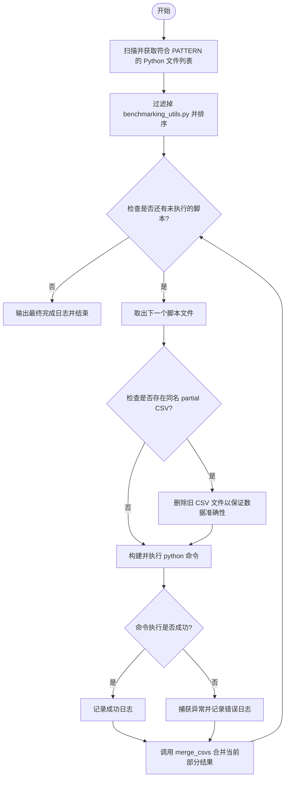
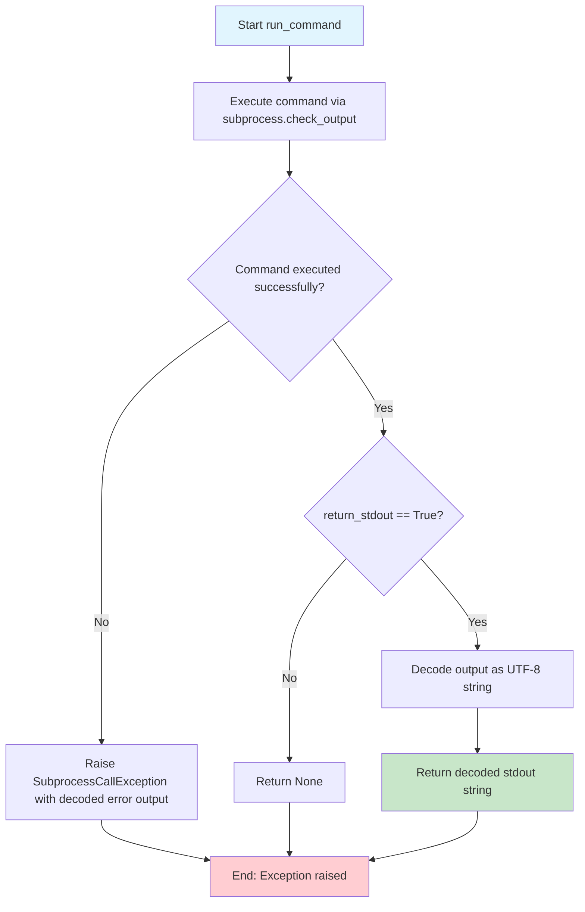
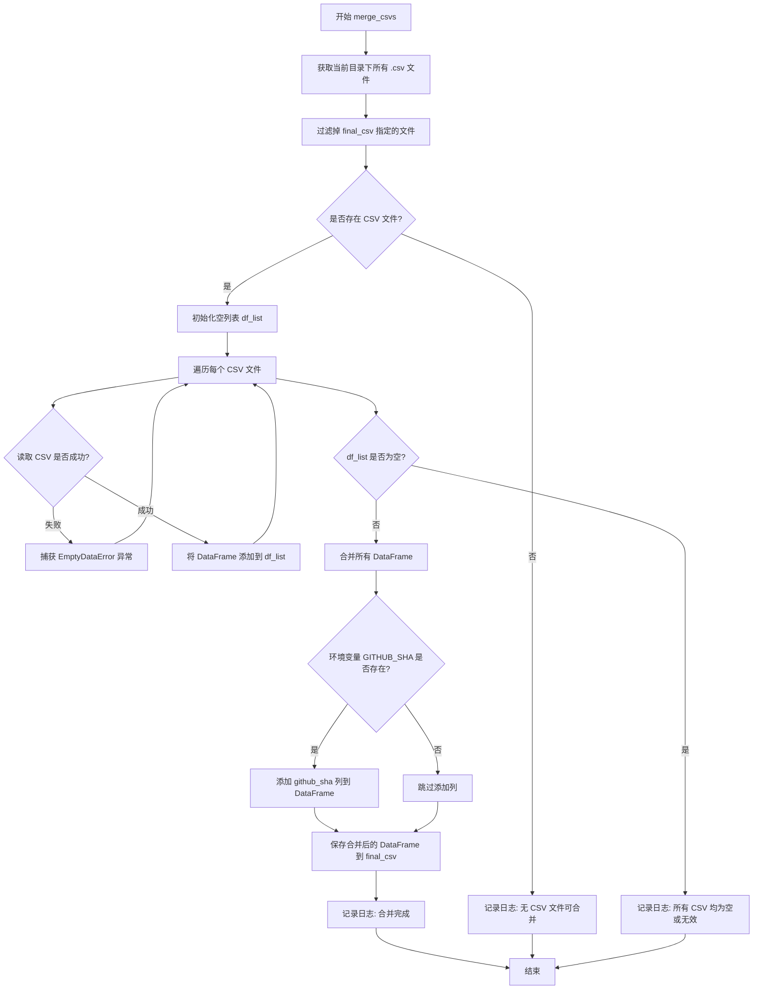

# `diffusers\benchmarks\run_all.py` 详细设计文档

这是一个自动化基准测试运行脚本，用于自动发现并顺序执行符合 `benchmarking_*.py` 模式的Python脚本，捕获并合并它们生成的CSV结果文件为单一的汇总报告，同时记录Git提交SHA以实现结果可追溯性。

## 整体流程



## 类结构

```
Script: benchmark_runner.py (模块根)
├── Exception: SubprocessCallException (子进程调用异常)
├── Global Function: run_command (执行外部命令)
├── Global Function: merge_csvs (CSV合并逻辑)
└── Global Function: run_scripts (主控制流)
```

## 全局变量及字段


### `PATTERN`
    
全局字符串，用于匹配待执行的基准测试脚本文件名模式 'benchmarking_*.py'

类型：`str`
    


### `FINAL_CSV_FILENAME`
    
全局字符串，最终合并后的CSV文件名 'collated_results.csv'

类型：`str`
    


### `GITHUB_SHA`
    
全局字符串/None，从环境变量获取的Git提交SHA，用于标记结果版本

类型：`str | None`
    


### `logger`
    
模块级日志记录器，用于输出程序运行时的日志信息

类型：`logging.Logger`
    


### `Exception.SubprocessCallException`
    
自定义异常类，继承自Exception，用于表示子进程命令执行失败的情况

类型：`Exception subclass`
    
    

## 全局函数及方法


### `run_command`

执行shell命令，捕获输出，失败时抛出自定义异常。该函数接受一个命令列表作为输入，可选地返回标准输出，并在命令执行失败时引发 `SubprocessCallException` 异常。

参数：

- `command`：`list[str]`，要执行的命令，以字符串列表形式传入（例如 `["python", "script.py"]`）
- `return_stdout`：`bool`，可选参数，默认为 `False`。当设为 `True` 时，函数返回命令的标准输出字符串；否则返回 `None`

返回值：`str | None`，当 `return_stdout=True` 时返回解码后的标准输出（UTF-8格式），否则返回 `None`

#### 流程图



#### 带注释源码

```python
def run_command(command: list[str], return_stdout=False):
    """
    执行shell命令，捕获输出，失败时抛出自定义异常
    
    Args:
        command: 要执行的命令列表，例如 ["python", "script.py"]
        return_stdout: 是否返回标准输出，默认为False
    
    Returns:
        当return_stdout=True时返回解码后的标准输出字符串，否则返回None
    
    Raises:
        SubprocessCallException: 当命令执行失败时抛出，包含错误详情
    """
    try:
        # 使用subprocess.check_output执行命令
        # stderr=subprocess.STDOUT 将标准错误合并到标准输出中
        output = subprocess.check_output(command, stderr=subprocess.STDOUT)
        
        # 检查是否需要返回标准输出
        # hasattr(output, "decode") 确保输出对象可以被解码（字节类型）
        if return_stdout and hasattr(output, "decode"):
            # 将字节输出解码为UTF-8字符串并返回
            return output.decode("utf-8")
    except subprocess.CalledProcessError as e:
        # 当命令返回非零退出码时捕获异常
        # 尝试解码错误输出的字节内容为字符串，用于异常信息
        error_message = e.output.decode() if e.output else "No output available"
        
        # 抛出自定义异常，包含命令信息和失败原因
        # 使用 "from e" 保留原始异常堆栈信息
        raise SubprocessCallException(
            f"Command `{' '.join(command)}` failed with:\n{error_message}"
        ) from e
```

#### 关键设计说明

1. **异常传递**：使用 `from e` 保留原始异常堆栈，便于调试
2. **输出解码**：假设输出为UTF-8编码，在处理二进制输出时做了类型检查
3. **静默成功**：当 `return_stdout=False` 时，成功执行返回 `None`，符合"无返回值即成功"的Unix习惯


### `merge_csvs`

扫描当前目录下的所有CSV文件，排除指定的最终合并文件，读取所有有效的CSV并合并为一个DataFrame，如果环境变量中存在GITHUB_SHA则添加为新列，最后保存为最终CSV文件。

参数：

- `final_csv`：`str`，最终输出的CSV文件名，默认为 `"collated_results.csv"`

返回值：`None`，该函数没有返回值（隐式返回 None）

#### 流程图



#### 带注释源码

```python
def merge_csvs(final_csv: str = "collated_results.csv"):
    """
    扫描当前目录下的 CSV 文件，排除最终文件，读取并合并为 DataFrame，
    添加 SHA 并保存为最终 CSV 文件。
    
    参数:
        final_csv: str, 最终输出的 CSV 文件名，默认为 "collated_results.csv"
    """
    # 使用 glob 获取当前目录下所有 .csv 文件
    all_csvs = glob.glob("*.csv")
    # 过滤掉最终要输出的合并文件，避免将该文件自身纳入合并
    all_csvs = [f for f in all_csvs if f != final_csv]
    
    # 如果没有找到任何 CSV 文件，直接返回并记录日志
    if not all_csvs:
        logger.info("No result CSVs found to merge.")
        return

    # 用于存储所有读取成功的 DataFrame
    df_list = []
    # 遍历每个 CSV 文件并尝试读取
    for f in all_csvs:
        try:
            d = pd.read_csv(f)
        except pd. EmptyDataError:
            # 如果文件存在但是零字节或损坏，跳过该文件继续处理下一个
            continue
        df_list.append(d)

    # 如果所有 CSV 文件都为空或无效，则直接返回
    if not df_list:
        logger.info("All result CSVs were empty or invalid; nothing to merge.")
        return

    # 使用 pandas.concat 合并所有 DataFrame，ignore_index=True 重新生成连续索引
    final_df = pd.concat(df_list, ignore_index=True)
    
    # 如果环境变量中设置了 GITHUB_SHA，则添加为新列
    if GITHUB_SHA is not None:
        final_df["github_sha"] = GITHUB_SHA
    
    # 将合并后的 DataFrame 写入 CSV 文件，不包含索引列
    final_df.to_csv(final_csv, index=False)
    logger.info(f"Merged {len(all_csvs)} partial CSVs → {final_csv}.")
```


### `run_scripts`

**描述**  
主入口函数，负责遍历当前目录下符合 `PATTERN`（即 `benchmarking_*.py`）的脚本，排除工具文件 `benchmarking_utils.py`，依次执行每个脚本并在 `finally` 块中触发 CSV 合并流程；异常会被捕获并记录日志，整个过程完成后输出最终的合并结果文件名。

#### 参数

- （无）——该函数不接受任何显式参数，使用全局常量 `PATTERN`、`FINAL_CSV_FILENAME` 等进行配置。

#### 返回值

- `None`——该函数不返回任何值，仅通过日志和副作用（执行脚本、合并 CSV）完成业务。

#### 流程图

```mermaid
flowchart TD
    Start((开始)) --> GetScripts[获取匹配的 Python 脚本列表 <br>sorted(glob.glob(PATTERN))]
    GetScripts --> FilterUtils[过滤掉 <code>benchmarking_utils.py</code>]
    FilterUtils --> LoopStart{遍历每个脚本}
    LoopStart --> ExtractName[提取脚本名 <br>script_name = file.split(".py")[0].split("_")[-1]]
    ExtractName --> LogFile[记录日志: 运行文件 <br>logger.info(...)]
    LogFile --> CheckCSV[若已存在同名 <code>.csv</code> 则删除]
    CheckCSV --> BuildCmd[构造执行命令 <br>command = ["python", file]]
    BuildCmd --> TryBlock[尝试执行 <code>run_command(command)</code>]
    TryBlock -->|成功| LogSuccess[记录日志: 脚本正常结束]
    TryBlock -->|异常| LogError[捕获 <code>SubprocessCallException</code> 并记录错误]
    LogSuccess --> FinallyBlock[finally: 调用 <code>merge_csvs(final_csv=FINAL_CSV_FILENAME)</code>]
    LogError --> FinallyBlock
    FinallyBlock --> LoopEnd{是否还有下一个脚本}
    LoopEnd -->|是| LoopStart
    LoopEnd -->|否| FinalLog[记录最终完成日志 <br>logger.info(...)]
    FinalLog --> End((结束))
```

#### 带注释源码

```python
def run_scripts():
    """
    主入口函数：遍历符合 PATTERN 的所有 benchmark 脚本，
    逐个执行并在 finally 块中合并产生的 CSV 文件。
    """
    # 1. 依据全局模式获取所有匹配的 Python 脚本文件
    python_files = sorted(glob.glob(PATTERN))

    # 2. 排除工具脚本，防止对 utils 文件执行
    python_files = [f for f in python_files if f != "benchmarking_utils.py"]

    # 3. 逐个运行脚本
    for file in python_files:
        # 3.1 提取脚本名（不含路径和后缀），用于生成中间 CSV 文件名
        script_name = file.split(".py")[0].split("_")[-1]  # e.g. "benchmarking_foo.py" -> "foo"
        logger.info(f"\n****** Running file: {file} ******")

        # 3.2 中间结果文件名（脚本名 + .csv）
        partial_csv = f"{script_name}.csv"

        # 3.3 若已有旧的 partial CSV，为防止重复或脏数据先删除
        if os.path.exists(partial_csv):
            logger.info(f"Found {partial_csv}. Removing for safer numbers and duplication.")
            os.remove(partial_csv)

        # 3.4 构造执行命令：使用系统默认的 Python 解释器运行脚本
        command = ["python", file]

        try:
            # 3.5 正常执行脚本
            run_command(command)
            logger.info(f"→ {file} finished normally.")
        except SubprocessCallException as e:
            # 3.6 捕获执行异常并记录日志（不影响后续脚本继续执行）
            logger.info(f"Error running {file}:\n{e}")
        finally:
            # 3.7 无论成功还是失败，都在此刻合并当前已产生的 CSV 文件
            logger.info(f"→ Merging partial CSVs after {file} …")
            merge_csvs(final_csv=FINAL_CSV_FILENAME)

    # 4. 所有脚本尝试完毕后，输出最终合并后的 CSV 路径
    logger.info(f"\nAll scripts attempted. Final collated CSV: {FINAL_CSV_FILENAME}")
```

## 关键组件


### PATTERN

全局变量，定义了要匹配的基准测试文件名模式（benchmarking_*.py）

### FINAL_CSV_FILENAME

全局变量，指定最终合并后的CSV输出文件名（collated_results.csv）

### GITHUB_SHA

全局变量，从环境变量获取GitHub提交SHA，用于在最终CSV中记录版本信息

### SubprocessCallException

自定义异常类，用于封装子进程调用失败时的错误信息

### run_command

全局函数，执行指定的命令行指令，支持返回标准输出，失败时抛出SubprocessCallException异常

### merge_csvs

全局函数，将当前目录下所有CSV文件（除最终输出文件外）合并为一个CSV文件，并可选地添加GitHub SHA标识

### run_scripts

全局函数，主入口函数，负责查找并按序执行所有匹配的基准测试脚本，每执行完一个脚本后调用merge_csvs进行中间结果合并，最终生成完整的汇总CSV文件


## 问题及建议


### 已知问题

- **异常处理不完整**：`run_command`函数中，当`return_stdout=True`时，虽然检查了`hasattr(output, "decode")`，但`subprocess.check_output`返回的字节串必定有decode方法，该判断逻辑冗余且可能掩盖其他类型错误
- **错误恢复机制薄弱**：`run_scripts`函数中捕获`SubprocessCallException`后仅记录日志继续执行，导致单个脚本失败时后续仍尝试运行，但失败脚本对应的CSV可能未生成，造成合并结果不完整
- **硬编码字符串缺乏灵活性**：脚本过滤条件`python_files = [f for f in python_files if f != "benchmarking_utils.py"]`使用硬编码字符串，若工具脚本命名变更则需修改代码
- **全局变量污染**：PATTERN、FINAL_CSV_FILENAME、GITHUB_SHA作为模块级全局变量，降低了函数的可测试性和复用性
- **重复文件I/O操作**：每次运行单个benchmarking脚本后都调用`merge_csvs`重新读取并合并所有CSV文件，当文件数量多时效率低下
- **日志级别使用不当**：错误信息使用`logger.info`记录，违反了日志级别规范，应使用`logger.error`或`logger.warning`
- **类型注解缺失**：部分函数如`merge_csvs`缺少返回值类型注解
- **环境兼容性考虑不足**：`run_command`中使用`subprocess.check_output`直接执行命令，未考虑Windows平台下Python解释器的路径差异
- **文件覆盖风险**：在运行脚本前删除已存在的partial CSV文件，若脚本执行中断会导致历史数据丢失，无法恢复

### 优化建议

- **重构为配置类或参数传递**：将全局配置变量封装到配置类或通过函数参数传递，提升可测试性
- **优化合并策略**：改为在所有脚本执行完成后一次性合并，或使用增量写入方式避免重复读取
- **统一错误处理**：对关键失败场景（如脚本执行失败）使用合适的日志级别，并考虑是否需要中断执行流程
- **增强类型注解**：为所有函数添加完整的类型注解，包括返回值类型
- **添加环境适配**：使用`sys.executable`获取当前Python解释器路径，增强跨平台兼容性
- **改进文件清理逻辑**：可改为备份或跳过已存在的文件，而非直接删除

## 其它


### 设计目标与约束

该工具的设计目标是自动化运行多个基准测试脚本并汇总结果。约束条件包括：1）仅处理CSV格式的结果文件；2）脚本命名必须符合"benchmarking_*.py"模式；3）依赖Python标准库及pandas库；4）每个基准测试脚本需自行生成CSV文件；5）需要设置适当的环境变量（如GITHUB_SHA）以支持结果追踪。

### 错误处理与异常设计

代码采用分层异常处理策略。定义了SubprocessCallException用于封装子进程调用失败的情况，run_command函数通过try-except捕获subprocess.CalledProcessError并转换为自定义异常向上传递。merge_csvs函数中针对CSV读取异常（EmptyDataError）进行捕获并跳过损坏文件，避免因单个文件问题导致整个流程中断。run_scripts函数中采用try-except-finally结构确保每个脚本执行后都会触发CSV合并操作，即使某个脚本运行失败也不影响后续脚本的执行。

### 数据流与状态机

程序数据流如下：首先通过glob.glob扫描当前目录获取符合模式的Python文件列表（状态：文件扫描阶段）；然后按排序顺序依次执行每个基准脚本（状态：脚本执行阶段）；每个脚本运行过程中可能生成对应的CSV文件（状态：结果生成阶段）；脚本执行完成后立即调用merge_csvs进行中间结果合并（状态：结果聚合阶段）；所有脚本执行完毕后，最终生成的collated_results.csv包含所有基准测试的汇总数据（状态：完成阶段）。若设置了GITHUB_SHA环境变量，会在最终CSV中添加github_sha列用于版本追踪。

### 外部依赖与接口契约

外部依赖包括：1）glob模块 - 用于文件路径匹配；2）logging模块 - 用于日志记录；3）os模块 - 用于环境变量读取和文件操作；4）subprocess模块 - 用于执行Python脚本；5）pandas库 - 用于CSV文件的读取和合并。接口契约方面：run_command函数接受命令列表参数，可选返回stdout内容；merge_csvs函数接受最终CSV文件名参数，默认值为"collated_results.csv"，返回None；run_scripts函数无参数，返回None；每个基准测试脚本需在当前目录生成以脚本名（不含.py后缀）命名的CSV文件。

### 配置管理

配置通过全局常量集中管理：PATTERN定义基准脚本的文件名匹配模式（"benchmarking_*.py"）；FINAL_CSV_FILENAME指定最终汇总CSV的文件名（"collated_results.csv"）；GITHUB_SHA从环境变量读取GitHub提交SHA值，用于结果溯源。这种设计允许在模块级别统一调整配置，无需修改核心逻辑代码。

### 安全性考虑

代码存在以下安全考量：1）使用subprocess.check_output执行命令时未设置超时机制，可能导致脚本挂起；2）通过os.remove直接删除已存在的CSV文件而非追加写入，可能导致数据丢失；3）命令参数未进行白名单校验，理论上存在注入风险；4）CSV合并时未校验数据Schema一致性，可能产生格式混乱的汇总结果。

### 性能优化建议

当前实现的主要性能瓶颈在于每个脚本执行后都重新读取并合并所有CSV文件，时间复杂度为O(n²)。可优化方向：1）采用增量合并策略，仅追加新脚本生成的数据；2）对于大规模基准测试，考虑使用数据库替代CSV作为中间存储；3）添加并行执行支持以充分利用多核CPU资源；4）对CSV读取操作添加缓存机制减少重复IO。

    