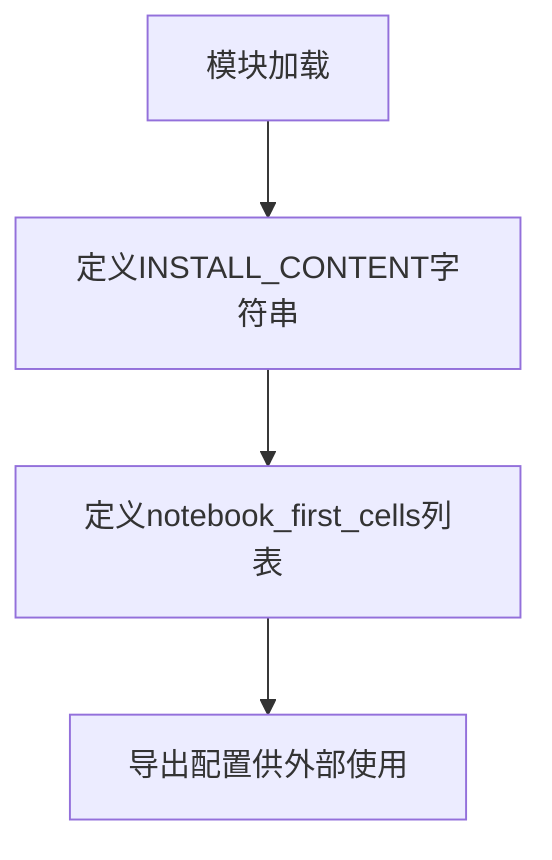

# `diffusers\docs\source\_config.py` 详细设计文档

该代码定义了一个Jupyter notebook初始化配置模块，包含Diffusers库的安装命令和notebook首个代码单元的配置，用于在Jupyter环境中自动安装所需的机器学习依赖包。

## 整体流程



## 类结构

```
该代码不包含任何类定义，仅为模块级配置代码
```

## 全局变量及字段


### `INSTALL_CONTENT`
    
包含Diffusers库安装命令的多行字符串，包含pip install指令以及从源码安装的注释说明

类型：`str`
    


### `notebook_first_cells`
    
Jupyter Notebook的初始单元格配置列表，包含一个type为code的单元格，其content为INSTALL_CONTENT安装命令

类型：`list[dict]`
    


    

## 全局函数及方法


## 关键组件


### 全局变量

本段代码的核心功能是配置 Jupyter Notebook 环境的初始安装命令，定义了 diffusers 库的依赖安装指令，并将其封装为 notebook 单元格的数据结构，用于自动化环境初始化流程。

### 文件的整体运行流程

该代码文件不涉及复杂的运行流程，其主要用途是在 Jupyter Notebook 环境中作为配置数据使用。执行时，Python 解释器会定义两个全局变量：`INSTALL_CONTENT` 和 `notebook_first_cells`，这些变量随后可被其他模块导入并用于生成或执行 Notebook 单元格。

### 关键组件信息

### INSTALL_CONTENT

字符串变量，存储 diffusers 库的安装命令，包含 pip 安装指令及源码安装的备选方案

### notebook_first_cells

列表变量，作为 Notebook 单元格的数据结构容器，用于存储要插入到 Notebook 首个单元格的配置信息

### 潜在的技术债务或优化空间

1. **硬编码依赖**：依赖版本未指定，可能导致未来兼容性风险
2. **缺少错误处理**：安装命令执行失败时无降级策略
3. **静态配置**：无法根据运行时环境动态调整安装选项
4. **文档缺失**：缺少模块级文档字符串说明用途

### 其它项目

**设计目标与约束**：本代码仅作为 Notebook 元数据配置，不执行实际安装操作，遵循配置与执行分离的原则

**错误处理与异常设计**：当前实现不涉及运行时错误处理，假设使用方会妥善管理安装命令的执行环境

**数据流与状态机**：数据流为静态定义的单向流动，无状态机设计

**外部依赖与接口契约**：无外部依赖，仅定义数据结构和字符串常量


## 问题及建议


### 已知问题

-   硬编码的安装依赖内容，缺乏灵活性，无法动态适配不同项目或环境需求
-   注释掉的源码安装选项被永久禁用，无法通过配置切换到源码安装模式
-   缺少类型注解（Type Hints），降低代码可读性和静态分析工具的效能
-   未使用文档字符串（Docstring）说明模块用途和关键变量含义
-   `notebook_first_cells` 列表设计为单元素固定结构，扩展性差，难以添加多个单元格或不同类型的单元格
-   缺乏输入验证机制，无法确保生成的notebook单元格内容符合预期格式
-   `# docstyle-ignore` 注释表明存在意在规避的代码规范问题

### 优化建议

-   将 `INSTALL_CONTENT` 改为可配置的结构，例如使用配置类或配置文件管理不同安装选项（稳定版/源码版）
-   为关键变量和函数添加类型注解，提升代码健壮性
-   使用 dataclass 或 TypedDict 定义 `notebook_first_cells` 的数据结构，确保类型安全和字段完整性
-   封装为函数或类，支持参数化生成不同内容的安装单元格
-   添加必要的文档字符串说明模块功能、依赖和用途
-   考虑将硬编码的依赖列表提取为常量或配置，便于维护和扩展

## 其它


### 设计目标与约束

本代码的设计目标是为Jupyter notebook环境提供一个标准化的Diffusers库安装初始化单元格。约束包括：仅支持pip安装方式，不包含conda或其他包管理器的安装命令；安装内容为预定义的固定版本依赖包；仅生成单个代码单元格。

### 错误处理与异常设计

本代码为纯数据定义代码，不涉及运行时错误处理。若安装命令执行失败，错误将由Jupyter notebook环境捕获并展示，不在本代码范围内处理。建议在notebook执行时确保网络连接正常。

### 外部依赖与接口契约

本代码不直接依赖外部Python库或模块。接口契约方面：notebook_first_cells变量必须为列表类型，列表中每个元素必须为字典，字典必须包含type字段（值为"code"）和content字段（值为字符串）。

### 版本兼容性说明

本代码兼容Python 3.7及以上版本，兼容Jupyter Notebook 5.0及以上版本及JupyterLab环境。INSTALL_CONTENT中的依赖包版本由pip自动解析为最新兼容版本。

### 安全性考虑

本代码使用pip从PyPI安装包，属于标准可信来源。代码本身不涉及敏感操作，不存在安全漏洞风险。但执行pip install命令会修改当前Python环境，建议在虚拟环境中运行。

### 配置与扩展性

当前代码的扩展性体现在：可修改INSTALL_CONTENT变量内容以添加更多依赖包或更换为其他库的安装命令；可在notebook_first_cells列表中添加更多单元格字典以生成多个初始化单元格；支持通过修改content字段内容定制安装命令。

### 执行前提条件

代码执行前需要满足：已安装Jupyter Notebook或JupyterLab；网络连接正常以访问PyPI；当前环境具有网络访问权限以下载依赖包。

### 使用示例与调用方式

本代码通常作为notebook的初始配置代码使用。notebook_first_cells变量可被notebook生成工具（如nbformat、nbdev等）读取并转换为实际的Jupyter notebook文件。调用方式为直接导入该模块并访问notebook_first_cells变量。

### 维护建议与演进方向

未来可能的演进方向包括：支持指定具体版本号而非最新版本；添加可选的conda安装命令；支持自定义额外依赖包；添加环境验证逻辑确保安装成功。


    