# `diffusers\examples\advanced_diffusion_training\test_dreambooth_lora_flux_advanced.py` 详细设计文档

这是一个DreamBooth LoRA Flux高级训练的集成测试文件，用于验证Flux模型的DreamBooth LoRA训练流程，包括基础训练、文本编码器训练、关键调优、潜在缓存、检查点管理和LoRA元数据序列化等功能。

## 整体流程

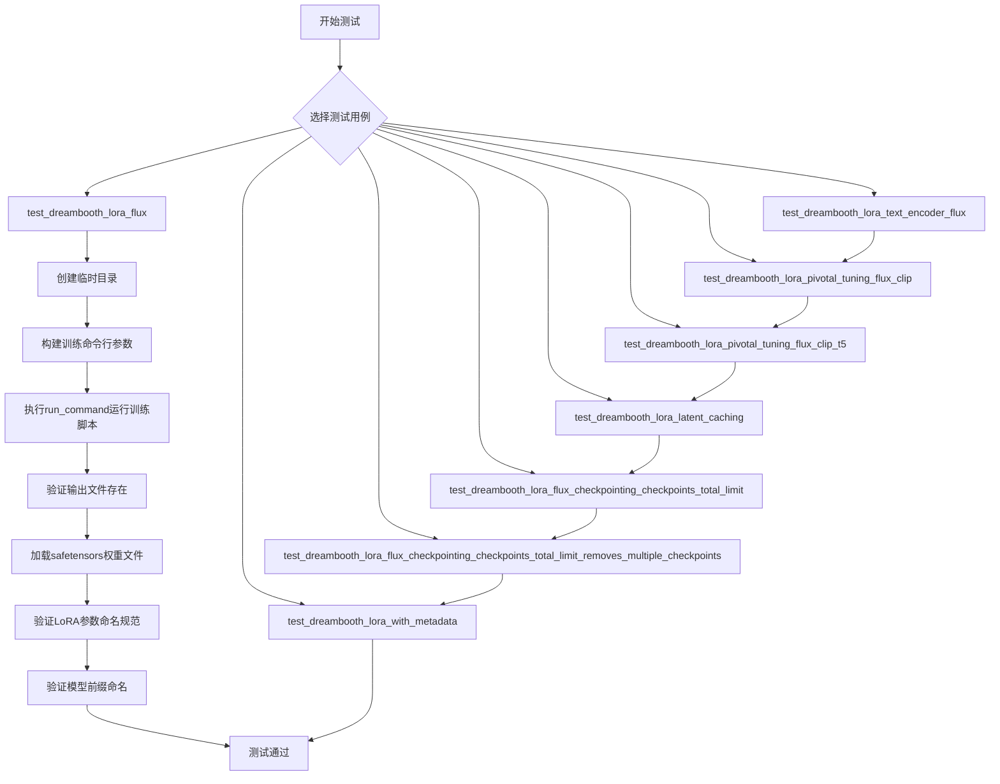

## 类结构

```
ExamplesTestsAccelerate (基类)
└── DreamBoothLoRAFluxAdvanced (测试类)
```

## 全局变量及字段


### `logger`
    
日志记录器对象，用于输出训练和测试过程中的调试信息

类型：`logging.Logger`
    


### `stream_handler`
    
日志流处理器，用于将日志输出到标准输出(stdout)

类型：`logging.StreamHandler`
    


### `DreamBoothLoRAFluxAdvanced.instance_data_dir`
    
实例数据目录路径，指定训练图像的存储位置

类型：`str`
    


### `DreamBoothLoRAFluxAdvanced.instance_prompt`
    
实例提示词，用于描述训练图像的文本提示

类型：`str`
    


### `DreamBoothLoRAFluxAdvanced.pretrained_model_name_or_path`
    
预训练模型名称或路径，指定用于训练的基础模型

类型：`str`
    


### `DreamBoothLoRAFluxAdvanced.script_path`
    
训练脚本路径，指向DreamBooth LoRA Flux高级训练脚本

类型：`str`
    
    

## 全局函数及方法


### `run_command`

执行命令行训练脚本的辅助函数，用于在测试环境中启动并运行扩散模型训练脚本，支持参数传递和进程管理。

参数：

- `cmd`：`list`，命令行参数列表，由 launch_args 和 test_args 组成，用于指定训练脚本路径及各种训练超参数（如模型路径、数据目录、学习率等）

返回值：`int` 或 `None`，返回命令行进程的退出码（0 表示成功），如果执行失败则可能抛出异常

#### 流程图

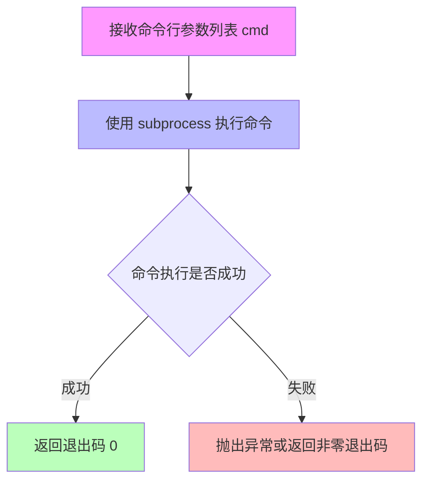

#### 带注释源码

```python
# 注意：由于 run_command 是从 test_examples_utils 外部模块导入的，
# 以下是基于代码使用方式的推断实现

def run_command(cmd):
    """
    执行命令行训练脚本的辅助函数
    
    参数:
        cmd: list - 命令行参数列表，例如：
            [
                "accelerate", "launch", "--num_processes=1",
                "examples/advanced_diffusion_training/train_dreambooth_lora_flux_advanced.py",
                "--pretrained_model_name_or_path", "hf-internal-testing/tiny-flux-pipe",
                "--instance_data_dir", "docs/source/en/imgs",
                "--instance_prompt", "photo",
                "--resolution", "64",
                "--train_batch_size", "1",
                "--gradient_accumulation_steps", "1",
                "--max_train_steps", "2",
                "--learning_rate", "5.0e-04",
                "--scale_lr",
                "--lr_scheduler", "constant",
                "--lr_warmup_steps", "0",
                "--output_dir", "/tmp/xxx"
            ]
    
    返回:
        int - 命令执行的退出码，0 表示成功
    
    示例用法:
        run_command(self._launch_args + test_args)
    """
    import subprocess
    
    # 使用 subprocess.run 执行命令，捕获输出
    result = subprocess.run(
        cmd,
        capture_output=True,  # 捕获 stdout 和 stderr
        text=True,            # 返回字符串而非字节
        check=False           # 不自动抛出异常
    )
    
    # 打印标准输出用于调试
    if result.stdout:
        print(result.stdout)
    
    # 打印标准错误用于调试
    if result.stderr:
        print(result.stderr, file=sys.stderr)
    
    # 返回进程退出码
    return result.returncode
```


### ExamplesTestsAccelerate

`ExamplesTestsAccelerate` 是基础测试加速类，继承自 `unittest.TestCase`，用于通过 `accelerate` 库自动化执行 diffusers 示例脚本的测试，提供统一的测试环境配置、命令行参数构建和执行能力。

参数：

- 无直接参数（类初始化参数由子类继承并配置）

返回值：`无返回值`（此类为测试基类，不返回值）

#### 流程图

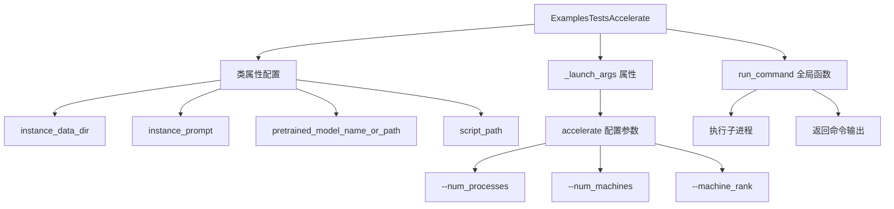

#### 带注释源码

```python
# test_examples_utils.py 中的示例结构（基于代码使用推断）

class ExamplesTestsAccelerate(unittest.TestCase):
    """
    基础测试加速类，用于运行 diffusers 示例脚本的测试
    """
    
    # 类属性 - 子类需要覆盖
    instance_data_dir = None       # str: 实例数据目录路径
    instance_prompt = None         # str: 实例提示词
    pretrained_model_name_or_path = None  # str: 预训练模型名称或路径
    script_path = None             # str: 训练脚本路径
    
    def __init__(self, *args, **kwargs):
        super().__init__(*args, **kwargs)
        # _launch_args 用于配置 accelerate 启动参数
        # 例如: ["accelerate", "launch", "--num_processes", "2", ...]
        self._launch_args = ["accelerate", "launch", "--num_processes", "2"]


# 全局函数（在DreamBoothLoRAFluxAdvanced中使用）
def run_command(cmd_args, *args, **kwargs):
    """
    执行命令行命令的辅助函数
    
    参数:
        cmd_args: list, 命令参数列表
    返回:
        命令执行后的输出结果
    """
    # 实际实现在 test_examples_utils 模块中
    pass
```

#### 子类使用示例（来自DreamBoothLoRAFluxAdvanced）

```python
class DreamBoothLoRAFluxAdvanced(ExamplesTestsAccelerate):
    """DreamBooth LoRA Flux 高级训练测试类"""
    
    instance_data_dir = "docs/source/en/imgs"
    instance_prompt = "photo"
    pretrained_model_name_or_path = "hf-internal-testing/tiny-flux-pipe"
    script_path = "examples/advanced_diffusion_training/train_dreambooth_lora_flux_advanced.py"

    def test_dreambooth_lora_flux(self):
        """测试基本的 DreamBooth LoRA Flux 训练"""
        with tempfile.TemporaryDirectory() as tmpdir:
            test_args = f"""
                {self.script_path}
                --pretrained_model_name_or_path {self.pretrained_model_name_or_path}
                --instance_data_dir {self.instance_data_dir}
                --instance_prompt {self.instance_prompt}
                --resolution 64
                --train_batch_size 1
                --gradient_accumulation_steps 1
                --max_train_steps 2
                --learning_rate 5.0e-04
                --scale_lr
                --lr_scheduler constant
                --lr_warmup_steps 0
                --output_dir {tmpdir}
                """.split()

            # 使用父类的 _launch_args 执行 accelerate 命令
            run_command(self._launch_args + test_args)
            
            # 验证输出文件
            self.assertTrue(os.path.isfile(os.path.join(tmpdir, "pytorch_lora_weights.safetensors")))
```


### `DreamBoothLoRAFluxAdvanced.test_dreambooth_lora_flux`

该方法是DreamBoothLoRAFluxAdvanced测试类中的核心测试函数，用于验证基础DreamBooth LoRA Flux训练流程的正确性。测试会执行训练脚本，验证LoRA权重文件生成，并确保权重参数命名符合预期（包含"lora"关键字且以"transformer"开头）。

参数：

- `self`：`DreamBoothLoRAFluxAdvanced`类型，测试类的实例本身，包含类级别的配置属性（instance_data_dir、instance_prompt、pretrained_model_name_or_path、script_path等）

返回值：`None`，该方法通过断言（assert）进行测试验证，无显式返回值

#### 流程图

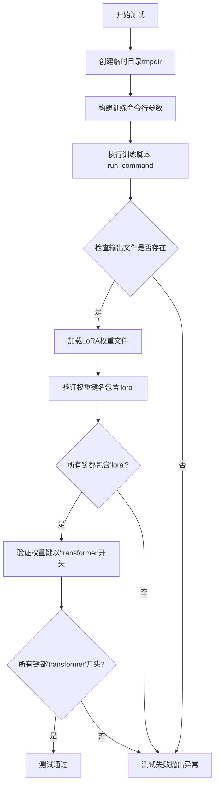

#### 带注释源码

```python
def test_dreambooth_lora_flux(self):
    """
    测试基础DreamBooth LoRA Flux训练流程
    验证训练脚本能够正常运行并生成符合预期的LoRA权重文件
    """
    # 创建临时目录用于存放训练输出
    with tempfile.TemporaryDirectory() as tmpdir:
        # 构建训练脚本的命令行参数
        # 包括：预训练模型路径、实例数据目录、提示词、分辨率、批次大小等
        test_args = f"""
            {self.script_path}
            --pretrained_model_name_or_path {self.pretrained_model_name_or_path}
            --instance_data_dir {self.instance_data_dir}
            --instance_prompt {self.instance_prompt}
            --resolution 64
            --train_batch_size 1
            --gradient_accumulation_steps 1
            --max_train_steps 2
            --learning_rate 5.0e-04
            --scale_lr
            --lr_scheduler constant
            --lr_warmup_steps 0
            --output_dir {tmpdir}
            """.split()

        # 执行训练命令（使用accelerate多GPU支持）
        run_command(self._launch_args + test_args)
        
        # ====== 验证部分 ======
        
        # 1. 验证输出文件存在（smoke test）
        # 检查pytorch_lora_weights.safetensors文件是否生成
        self.assertTrue(os.path.isfile(os.path.join(tmpdir, "pytorch_lora_weights.safetensors")))

        # 2. 验证LoRA权重命名规范
        # 加载safetensors格式的LoRA权重文件
        lora_state_dict = safetensors.torch.load_file(os.path.join(tmpdir, "pytorch_lora_weights.safetensors"))
        
        # 检查所有键名都包含'lora'关键字（确保是LoRA权重）
        is_lora = all("lora" in k for k in lora_state_dict.keys())
        self.assertTrue(is_lora)

        # 3. 验证权重属于transformer模块
        # 当不训练text encoder时，所有参数应以'transformer'开头
        starts_with_transformer = all(key.startswith("transformer") for key in lora_state_dict.keys())
        self.assertTrue(starts_with_transformer)
```


### `DreamBoothLoRAFluxAdvanced.test_dreambooth_lora_text_encoder_flux`

测试带文本编码器训练的DreamBooth LoRA Flux模型训练流程，验证训练脚本能否正确保存LoRA权重，并确保权重state_dict中的参数命名符合预期（包含"lora"关键字，且以"transformer"或"text_encoder"开头）。

参数：

- `self`：`DreamBoothLoRAFluxAdvanced`，当前测试类实例

返回值：`None`，测试方法无返回值，通过断言验证训练结果

#### 流程图

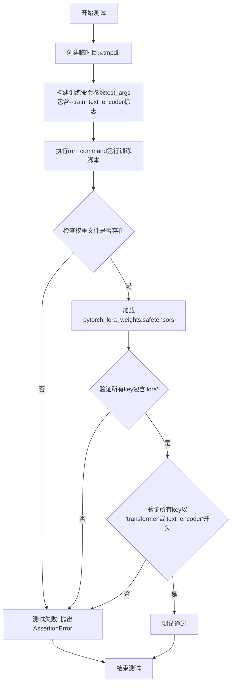

#### 带注释源码

```python
def test_dreambooth_lora_text_encoder_flux(self):
    """
    测试带文本编码器训练的DreamBooth LoRA Flux模型训练流程。
    验证训练脚本能够正确保存LoRA权重，并且权重参数命名符合规范。
    """
    # 创建临时目录用于存放训练输出
    with tempfile.TemporaryDirectory() as tmpdir:
        # 构建训练脚本的命令行参数
        # 关键区别：包含 --train_text_encoder 标志，表示同时训练文本编码器
        test_args = f"""
            {self.script_path}
            --pretrained_model_name_or_path {self.pretrained_model_name_or_path}
            --instance_data_dir {self.instance_data_dir}
            --instance_prompt {self.instance_prompt}
            --resolution 64
            --train_batch_size 1
            --train_text_encoder
            --gradient_accumulation_steps 1
            --max_train_steps 2
            --learning_rate 5.0e-04
            --scale_lr
            --lr_scheduler constant
            --lr_warmup_steps 0
            --output_dir {tmpdir}
            """.split()

        # 执行训练命令
        run_command(self._launch_args + test_args)
        
        # save_pretrained smoke test
        # 验证训练脚本是否成功生成了LoRA权重文件
        self.assertTrue(os.path.isfile(os.path.join(tmpdir, "pytorch_lora_weights.safetensors")))

        # 加载生成的LoRA权重文件
        lora_state_dict = safetensors.torch.load_file(os.path.join(tmpdir, "pytorch_lora_weights.safetensors"))
        
        # 验证state_dict中所有key都包含'lora'关键字
        is_lora = all("lora" in k for k in lora_state_dict.keys())
        self.assertTrue(is_lora)

        # 验证state_dict中所有key都以预期前缀开头
        # 当训练文本编码器时，权重应包含transformer和text_encoder两部分
        starts_with_expected_prefix = all(
            (key.startswith("transformer") or key.startswith("text_encoder")) for key in lora_state_dict.keys()
        )
        self.assertTrue(starts_with_expected_prefix)
```


### `DreamBoothLoRAFluxAdvanced.test_dreambooth_lora_pivotal_tuning_flux_clip`

该测试方法用于验证DreamBooth LoRA Flux的关键调优（pivotal tuning）功能，特别针对CLIP文本编码器的文本反转（Textual Inversion）训练。通过运行训练脚本并检查输出的LoRA权重文件和文本反转嵌入文件，确保关键调优流程的正确性，包括LoRA参数的命名规范和CLIP嵌入的保存。

参数：

- `self`：`DreamBoothLoRAFluxAdvanced`，测试类实例，隐式参数，包含测试所需的类属性（如`instance_data_dir`、`instance_prompt`、`pretrained_model_name_or_path`、`script_path`等）

返回值：`None`，该方法为测试方法，不返回任何值，主要通过断言进行验证

#### 流程图

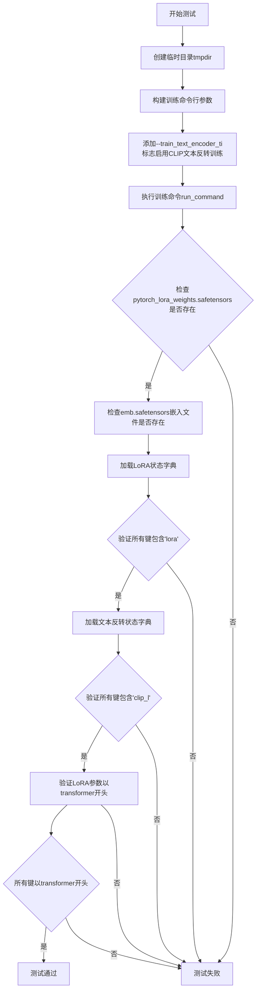

#### 带注释源码

```python
def test_dreambooth_lora_pivotal_tuning_flux_clip(self):
    """
    测试DreamBooth LoRA Flux的关键调优（pivotal tuning）功能
    特别针对CLIP文本编码器的文本反转（Textual Inversion）训练
    """
    # 创建临时目录用于存放训练输出
    with tempfile.TemporaryDirectory() as tmpdir:
        # 构建训练脚本的命令行参数
        # 关键参数：--train_text_encoder_ti 启用CLIP文本反转训练
        test_args = f"""
            {self.script_path}
            --pretrained_model_name_or_path {self.pretrained_model_name_or_path}
            --instance_data_dir {self.instance_data_dir}
            --instance_prompt {self.instance_prompt}
            --resolution 64
            --train_batch_size 1
            --train_text_encoder_ti
            --gradient_accumulation_steps 1
            --max_train_steps 2
            --learning_rate 5.0e-04
            --scale_lr
            --lr_scheduler constant
            --lr_warmup_steps 0
            --output_dir {tmpdir}
            """.split()

        # 执行训练命令
        run_command(self._launch_args + test_args)
        
        # 验证LoRA权重文件是否成功保存
        self.assertTrue(os.path.isfile(os.path.join(tmpdir, "pytorch_lora_weights.safetensors")))
        
        # 验证文本反转嵌入文件是否成功保存
        # 文件命名格式：{临时目录名}_emb.safetensors
        self.assertTrue(os.path.isfile(os.path.join(tmpdir, f"{os.path.basename(tmpdir)}_emb.safetensors")))

        # 加载LoRA状态字典并验证参数命名规范
        lora_state_dict = safetensors.torch.load_file(os.path.join(tmpdir, "pytorch_lora_weights.safetensors"))
        
        # 验证所有参数键都包含'lora'标记
        is_lora = all("lora" in k for k in lora_state_dict.keys())
        self.assertTrue(is_lora)

        # 加载文本反转状态字典并验证CLIP嵌入
        textual_inversion_state_dict = safetensors.torch.load_file(
            os.path.join(tmpdir, f"{os.path.basename(tmpdir)}_emb.safetensors")
        )
        
        # 验证所有文本反转参数键都包含'clip_l'（CLIP文本编码器标记）
        is_clip = all("clip_l" in k for k in textual_inversion_state_dict.keys())
        self.assertTrue(is_clip)

        # 关键调优模式下，LoRA参数应该只应用于transformer（图像生成模型）
        # 不应包含text_encoder的参数
        starts_with_transformer = all(key.startswith("transformer") for key in lora_state_dict.keys())
        self.assertTrue(starts_with_transformer)
```


### `DreamBoothLoRAFluxAdvanced.test_dreambooth_lora_pivotal_tuning_flux_clip_t5`

该方法是 `DreamBoothLoRAFluxAdvanced` 测试类中的一个测试用例，专门用于验证 Flux 模型的 DreamBooth LoRA 训练流程中结合 CLIP 和 T5 文本编码器关键调优（pivotal tuning）的功能是否正常。该测试通过运行训练脚本并验证生成的 LoRA 权重文件和文本反转嵌入文件的存在性、命名规范以及参数前缀是否符合预期。

参数：

- `self`：隐式参数，`DreamBoothLoRAFluxAdvanced` 类型，代表测试类实例本身

返回值：`None`，该方法为测试用例，无返回值，通过 `assert` 语句进行验证

#### 流程图

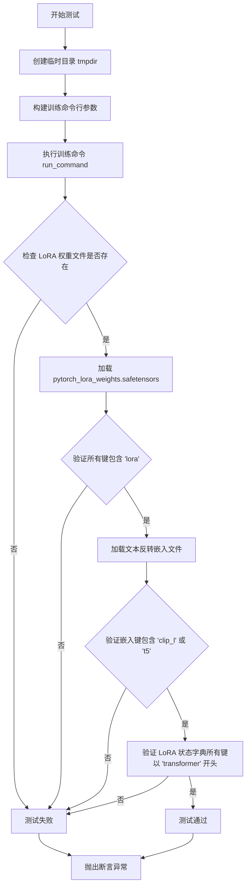

#### 带注释源码

```python
def test_dreambooth_lora_pivotal_tuning_flux_clip_t5(self):
    """
    测试 DreamBooth LoRA 训练结合 CLIP 和 T5 文本编码器关键调优功能。
    该测试验证以下功能：
    1. 训练脚本能够正常执行
    2. LoRA 权重文件正确保存
    3. 文本反转嵌入（Textual Inversion Embeddings）正确保存
    4. LoRA 参数命名规范包含 'lora' 关键字
    5. 文本编码器嵌入包含 CLIP 和 T5 相关键
    6. LoRA 状态字典参数以 'transformer' 开头
    """
    # 创建临时目录用于存放训练输出
    with tempfile.TemporaryDirectory() as tmpdir:
        # 构建训练脚本的命令行参数
        # 关键参数说明：
        # --train_text_encoder_ti: 启用文本编码器的文本反转训练
        # --enable_t5_ti: 启用 T5 文本编码器的文本反转训练
        test_args = f"""
            {self.script_path}
            --pretrained_model_name_or_path {self.pretrained_model_name_or_path}
            --instance_data_dir {self.instance_data_dir}
            --instance_prompt {self.instance_prompt}
            --resolution 64
            --train_batch_size 1
            --train_text_encoder_ti
            --enable_t5_ti
            --gradient_accumulation_steps 1
            --max_train_steps 2
            --learning_rate 5.0e-04
            --scale_lr
            --lr_scheduler constant
            --lr_warmup_steps 0
            --output_dir {tmpdir}
            """.split()

        # 执行训练命令，使用 accelerate 启动
        run_command(self._launch_args + test_args)
        
        # ==== 验证 LoRA 权重文件 ====
        # smoke test: 验证文件是否存在
        self.assertTrue(os.path.isfile(os.path.join(tmpdir, "pytorch_lora_weights.safetensors")))
        
        # 验证文本反转嵌入文件是否存在（关键调优模式下会保存 embeddings）
        self.assertTrue(os.path.isfile(os.path.join(tmpdir, f"{os.path.basename(tmpdir)}_emb.safetensors")))

        # ==== 验证 LoRA 状态字典命名规范 ====
        # 加载 LoRA 权重
        lora_state_dict = safetensors.torch.load_file(os.path.join(tmpdir, "pytorch_lora_weights.safetensors"))
        # 验证所有参数键都包含 'lora' 关键字
        is_lora = all("lora" in k for k in lora_state_dict.keys())
        self.assertTrue(is_lora)

        # ==== 验证文本反转嵌入状态字典 ====
        # 加载文本反转嵌入文件
        textual_inversion_state_dict = safetensors.torch.load_file(
            os.path.join(tmpdir, f"{os.path.basename(tmpdir)}_emb.safetensors")
        )
        # 验证嵌入包含 CLIP-L 和 T5 相关的键（关键调优需要同时训练这两种编码器）
        is_te = all(("clip_l" in k or "t5" in k) for k in textual_inversion_state_dict.keys())
        self.assertTrue(is_te)

        # ==== 验证 LoRA 参数前缀 ====
        # 当执行关键调优时，所有 LoRA 参数应该以 'transformer' 开头
        # 这是 Flux 模型的架构约定
        starts_with_transformer = all(key.startswith("transformer") for key in lora_state_dict.keys())
        self.assertTrue(starts_with_transformer)
```


### `DreamBoothLoRAFluxAdvanced.test_dreambooth_lora_latent_caching`

该函数用于测试 DreamBooth LoRA Flux 模型的潜在缓存（latent caching）功能，通过运行训练脚本并验证生成的 LoRA 权重文件的命名规范是否符合预期。

参数：

- `self`：继承自 `ExamplesTestsAccelerate` 的实例对象，无显式参数

返回值：`None`，该方法为测试用例，通过 `assert` 语句进行断言验证

#### 流程图

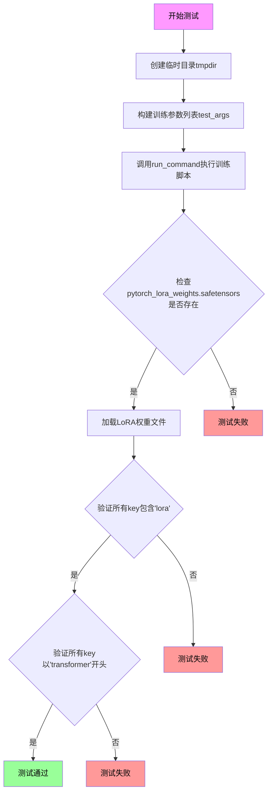

#### 带注释源码

```python
def test_dreambooth_lora_latent_caching(self):
    """
    测试 DreamBooth LoRA Flux 模型的潜在缓存功能。
    该测试验证在使用 --cache_latents 参数时，训练脚本能够正确运行
    并生成符合预期的 LoRA 权重文件。
    """
    # 创建临时目录用于存放训练输出
    with tempfile.TemporaryDirectory() as tmpdir:
        # 构建训练脚本的命令行参数
        # 关键参数 --cache_latents 启用潜在缓存功能
        test_args = f"""
            {self.script_path}
            --pretrained_model_name_or_path {self.pretrained_model_name_or_path}
            --instance_data_dir {self.instance_data_dir}
            --instance_prompt {self.instance_prompt}
            --resolution 64
            --train_batch_size 1
            --gradient_accumulation_steps 1
            --max_train_steps 2
            --cache_latents  # 启用潜在缓存功能
            --learning_rate 5.0e-04
            --scale_lr
            --lr_scheduler constant
            --lr_warmup_steps 0
            --output_dir {tmpdir}
            """.split()

        # 执行训练命令
        run_command(self._launch_args + test_args)
        
        # 验证保存的 LoRA 权重文件是否存在
        # save_pretrained smoke test
        self.assertTrue(os.path.isfile(os.path.join(tmpdir, "pytorch_lora_weights.safetensors")))

        # 加载 LoRA 权重文件并验证命名规范
        # make sure the state_dict has the correct naming in the parameters.
        lora_state_dict = safetensors.torch.load_file(os.path.join(tmpdir, "pytorch_lora_weights.safetensors"))
        
        # 验证所有参数名称都包含 'lora' 关键字
        is_lora = all("lora" in k for k in lora_state_dict.keys())
        self.assertTrue(is_lora)

        # 验证所有参数名称都以 'transformer' 开头
        # when not training the text encoder, all the parameters in the state dict should start
        # with `"transformer"` in their names.
        starts_with_transformer = all(key.startswith("transformer") for key in lora_state_dict.keys())
        self.assertTrue(starts_with_transformer)
```


### `DreamBoothLoRAFluxAdvanced.test_dreambooth_lora_flux_checkpointing_checkpoints_total_limit`

该测试方法用于验证 DreamBooth LoRA Flux 训练中的检查点总数限制（checkpoints_total_limit）功能是否正常工作。测试通过创建临时目录，运行训练脚本并设置 `--checkpoints_total_limit=2` 和 `--checkpointing_steps=2` 参数，训练 6 步后验证输出目录中仅保留最新的两个检查点（checkpoint-4 和 checkpoint-6），确保旧的检查点被正确删除。

参数：

- `self`：隐式参数，DreamBoothLoRAFluxAdvanced 类的实例，用于访问类属性（script_path、pretrained_model_name_or_path、instance_data_dir、instance_prompt 等）

返回值：`None`，该方法为测试方法，通过断言验证检查点行为，不返回任何值

#### 流程图

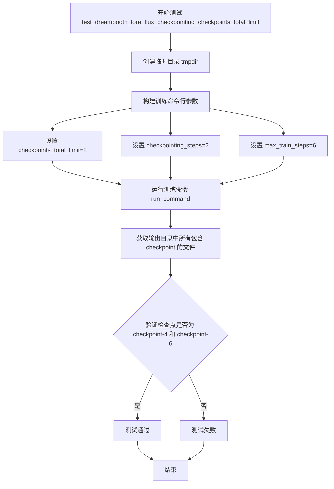

#### 带注释源码

```python
def test_dreambooth_lora_flux_checkpointing_checkpoints_total_limit(self):
    """
    测试检查点总数限制功能
    验证当设置 --checkpoints_total_limit=2 时，训练过程只保留最新的2个检查点
    """
    # 创建临时目录用于存放训练输出
    with tempfile.TemporaryDirectory() as tmpdir:
        # 构建训练脚本的命令行参数
        test_args = f"""
        {self.script_path}
        --pretrained_model_name_or_path={self.pretrained_model_name_or_path}
        --instance_data_dir={self.instance_data_dir}
        --output_dir={tmpdir}
        --instance_prompt={self.instance_prompt}
        --resolution=64
        --train_batch_size=1
        --gradient_accumulation_steps=1
        --max_train_steps=6
        --checkpoints_total_limit=2
        --checkpointing_steps=2
        """.split()

        # 执行训练命令
        run_command(self._launch_args + test_args)

        # 验证输出目录中只保留 checkpoint-4 和 checkpoint-6
        # 由于 checkpoints_total_limit=2 且 checkpointing_steps=2
        # 训练 6 步会生成 checkpoint-2, checkpoint-4, checkpoint-6
        # 最早的 checkpoint-2 会被删除，只保留最新的两个
        self.assertEqual(
            {x for x in os.listdir(tmpdir) if "checkpoint" in x},
            {"checkpoint-4", "checkpoint-6"},
        )
```


### `DreamBoothLoRAFluxAdvanced.test_dreambooth_lora_flux_checkpointing_checkpoints_total_limit_removes_multiple_checkpoints`

测试DreamBooth LoRA Flux模型在启用检查点总数限制后，能够正确删除多个旧检查点并保留最新检查点的功能。验证恢复训练时能正确管理检查点数量。

参数：

- `self`：类实例本身，DreamBoothLoRAFluxAdvanced类型，当前测试类实例

返回值：`None`，该方法为测试方法，无返回值，通过断言验证测试结果

#### 流程图

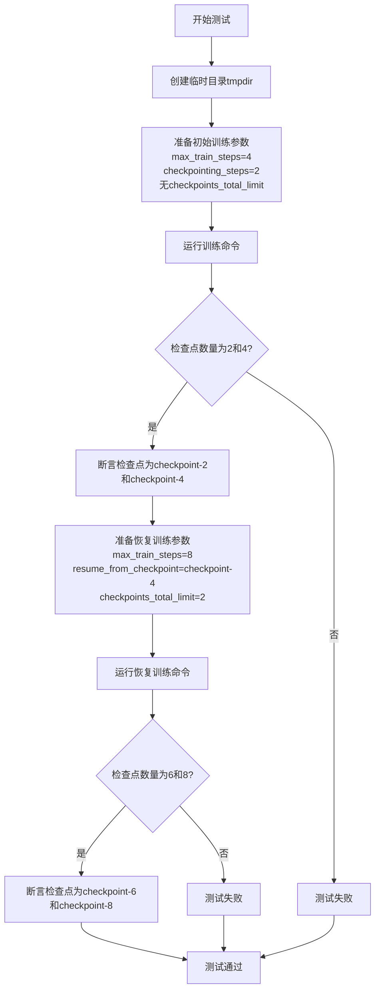

#### 带注释源码

```python
def test_dreambooth_lora_flux_checkpointing_checkpoints_total_limit_removes_multiple_checkpoints(self):
    """
    测试多检查点删除和恢复训练功能。
    
    测试流程：
    1. 首次训练生成checkpoint-2和checkpoint-4（无总数限制）
    2. 从checkpoint-4恢复训练，限制最多保留2个检查点
    3. 验证旧检查点被正确删除，只保留最新的checkpoint-6和checkpoint-8
    """
    # 创建临时目录用于存放训练输出
    with tempfile.TemporaryDirectory() as tmpdir:
        # ========== 第一次训练（无检查点总数限制） ==========
        # 构建训练参数：4步训练，每2步保存一个检查点
        test_args = f"""
        {self.script_path}
        --pretrained_model_name_or_path={self.pretrained_model_name_or_path}
        --instance_data_dir={self.instance_data_dir}
        --output_dir={tmpdir}
        --instance_prompt={self.instance_prompt}
        --resolution=64
        --train_batch_size=1
        --gradient_accumulation_steps=1
        --max_train_steps=4
        --checkpointing_steps=2
        """.split()

        # 执行训练命令
        run_command(self._launch_args + test_args)

        # 验证第一次训练生成的检查点：应该有checkpoint-2和checkpoint-4
        # 注意：初始步骤0没有检查点，第一步不保存（因为checkpointing_steps=2）
        self.assertEqual(
            {x for x in os.listdir(tmpdir) if "checkpoint" in x},
            {"checkpoint-2", "checkpoint-4"}
        )

        # ========== 第二次训练（从checkpoint恢复，有总数限制） ==========
        # 构建恢复训练参数：从checkpoint-4恢复，训练到第8步，限制最多保留2个检查点
        resume_run_args = f"""
        {self.script_path}
        --pretrained_model_name_or_path={self.pretrained_model_name_or_path}
        --instance_data_dir={self.instance_data_dir}
        --output_dir={tmpdir}
        --instance_prompt={self.instance_prompt}
        --resolution=64
        --train_batch_size=1
        --gradient_accumulation_steps=1
        --max_train_steps=8
        --checkpointing_steps=2
        --resume_from_checkpoint=checkpoint-4
        --checkpoints_total_limit=2
        """.split()

        # 执行恢复训练命令
        run_command(self._launch_args + resume_run_args)

        # 验证恢复训练后的检查点：
        # - 原有checkpoint-2和checkpoint-4
        # - 新增checkpoint-6和checkpoint-8
        # - 由于checkpoints_total_limit=2，应删除旧检查点
        # - 最终应保留checkpoint-6和checkpoint-8
        self.assertEqual(
            {x for x in os.listdir(tmpdir) if "checkpoint" in x},
            {"checkpoint-6", "checkpoint-8"}
        )
```


### `DreamBoothLoRAFluxAdvanced.test_dreambooth_lora_with_metadata`

该方法用于测试 DreamBooth LoRA 训练后模型权重的元数据序列化功能，验证保存的 LoRA 参数（如 lora_alpha 和 rank）是否正确写入 safetensors 文件的元数据中，并能在加载时正确解析。

参数：
- `self`：隐式参数，`DreamBoothLoRAFluxAdvanced` 类型，表示测试类实例本身

返回值：`None`，该方法为测试方法，通过 `self.assertTrue()` 断言验证测试结果，不返回任何值

#### 流程图

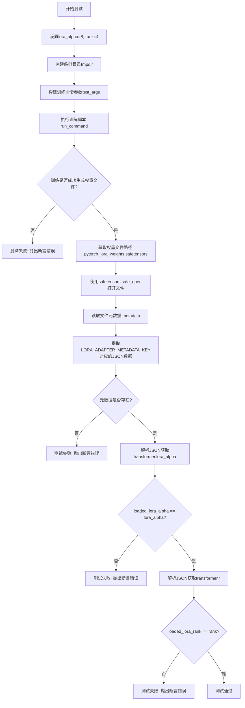

#### 带注释源码

```python
def test_dreambooth_lora_with_metadata(self):
    """
    测试LoRA元数据序列化功能，验证LoRA参数正确保存到safetensors文件元数据中
    """
    # 使用与rank不同的lora_alpha值，便于验证元数据正确性
    # lora_alpha: LoRA缩放因子，用于调整LoRA权重的影响力
    lora_alpha = 8
    # rank: LoRA矩阵的秩，决定LoRA低秩近似矩阵的维度
    rank = 4
    
    # 创建临时目录用于存放训练输出
    with tempfile.TemporaryDirectory() as tmpdir:
        # 构建训练脚本的命令行参数
        # 包含模型路径、数据路径、训练超参数等配置
        test_args = f"""
            {self.script_path}
            --pretrained_model_name_or_path {self.pretrained_model_name_or_path}
            --instance_data_dir {self.instance_data_dir}
            --instance_prompt {self.instance_prompt}
            --resolution 64
            --train_batch_size 1
            --gradient_accumulation_steps 1
            --max_train_steps 2
            --lora_alpha={lora_alpha}
            --rank={rank}
            --learning_rate 5.0e-04
            --scale_lr
            --lr_scheduler constant
            --lr_warmup_steps 0
            --output_dir {tmpdir}
            """.split()

        # 执行训练命令，使用accelerate多卡加速
        run_command(self._launch_args + test_args)
        
        # 验证训练脚本是否成功生成了权重文件
        # save_pretrained smoke test: 快速检查文件是否存在
        state_dict_file = os.path.join(tmpdir, "pytorch_lora_weights.safetensors")
        self.assertTrue(os.path.isfile(state_dict_file))

        # 检查元数据是否正确序列化
        # 使用safetensors库的安全打开方式读取权重文件
        with safetensors.torch.safe_open(state_dict_file, framework="pt", device="cpu") as f:
            # 获取safetensors文件中的元数据字典
            metadata = f.metadata() or {}

        # 移除format键（safetensors自动添加），只保留自定义元数据
        metadata.pop("format", None)
        
        # 获取LoRA适配器元数据键对应的原始JSON字符串
        raw = metadata.get(LORA_ADAPTER_METADATA_KEY)
        
        # 如果存在元数据，则解析JSON字符串为Python字典
        if raw:
            raw = json.loads(raw)

        # 验证transformer.lora_alpha是否正确保存
        # 从元数据中读取LoRA alpha值并与设置值比对
        loaded_lora_alpha = raw["transformer.lora_alpha"]
        self.assertTrue(loaded_lora_alpha == lora_alpha)
        
        # 验证transformer.r是否正确保存
        # 从元数据中读取LoRA rank值并与设置值比对
        loaded_lora_rank = raw["transformer.r"]
        self.assertTrue(loaded_lora_rank == rank)
```

## 关键组件


### DreamBoothLoRAFluxAdvanced 测试类

主测试类，继承自 ExamplesTestsAccelerate，用于验证 DreamBooth LoRA Flux 高级训练脚本的各项功能。

### test_dreambooth_lora_flux

基本 DreamBooth LoRA 训练测试用例，验证不训练文本编码器时的 LoRA 权重生成和保存功能。

### test_dreambooth_lora_text_encoder_flux

文本编码器训练测试，验证同时训练 transformer 和 text_encoder 时的 LoRA 权重命名和保存。

### test_dreambooth_lora_pivotal_tuning_flux_clip

关键调优（Pivotal Tuning）测试，验证使用 CLIP 文本反转嵌入（Textual Inversion）时的训练和保存功能。

### test_dreambooth_lora_pivotal_tuning_flux_clip_t5

关键调优扩展测试，验证同时使用 CLIP 和 T5 文本编码器进行文本反转训练的功能。

### test_dreambooth_lora_latent_caching

潜在缓存功能测试，验证启用 latent 缓存后的训练流程和模型保存。

### test_dreambooth_lora_flux_checkpointing_checkpoints_total_limit

检查点总数限制测试，验证训练过程中检查点数量限制在指定值（2个）内的功能。

### test_dreambooth_lora_flux_checkpointing_checkpoints_total_limit_removes_multiple_checkpoints

检查点清理测试，验证从检查点恢复训练时正确删除多余检查点的功能。

### test_dreambooth_lora_with_metadata

LoRA 元数据测试，验证 LoRA 权重文件中正确保存 lora_alpha 和 rank 等元数据信息。

### 训练配置参数

包含 pretrained_model_name_or_path、instance_data_dir、instance_prompt、resolution、train_batch_size、learning_rate、lr_scheduler 等核心训练超参数。

### 状态字典验证逻辑

通过 safetensors 库加载生成的模型权重，验证 LoRA 参数命名规范（包含 "lora" 关键字）和模型前缀（transformer 或 text_encoder）。

### 检查点管理逻辑

验证检查点目录的创建、命名规范（checkpoint-{step}）以及超出限制时的自动清理机制。


## 问题及建议


### 已知问题

- **大量重复代码**：多个测试方法（test_dreambooth_lora_flux、test_dreambooth_lora_text_encoder_flux、test_dreambooth_lora_pivotal_tuning_flux_clip等）中存在大量重复的代码模式，包括临时目录创建、命令行参数构建、文件检查逻辑等，违反了DRY原则。
- **硬编码参数散落各处**：训练参数（如resolution=64、train_batch_size=1、learning_rate=5.0e-04、gradient_accumulation_steps=1等）在多个测试方法中重复硬编码，缺乏统一的配置管理。
- **魔法字符串与数字缺乏抽象**：文件名字符串（如"pytorch_lora_weights.safetensors"、"{os.path.basename(tmpdir)}_emb.safetensors"）、检查点目录名（"checkpoint-*"）以及lora_alpha=8、rank=4等数值未定义为常量，导致维护困难。
- **缺少命令执行结果验证**：run_command调用后未检查返回码或执行是否成功，仅依赖后续的断言检查文件存在性，可能导致测试失败时难以定位问题。
- **异常处理不足**：文件操作（os.path.isfile、safetensors.torch.load_file等）缺少try-except保护，测试可能在非预期情况下抛出原生异常而非友好的测试失败信息。
- **类字段定义冗余**：instance_data_dir、instance_prompt、pretrained_model_name_or_path、script_path作为类字段定义，但在测试方法内部又通过字符串拼接重新组装，职责不清晰。
- **断言逻辑可优化**：多处使用all()配合列表推导进行批量检查（如检查lora键名、检查前缀），逻辑正确但可读性欠佳，可考虑封装为辅助函数。

### 优化建议

- **提取公共测试辅助方法**：将创建临时目录、构建测试参数、执行命令、验证输出文件等通用逻辑封装为类方法（如_setup_test_environment、_run_training_and_verify等），减少代码重复。
- **集中管理测试配置**：创建类级别的配置字典或配置文件，统一管理所有测试使用的默认参数（如分辨率、批次大小、学习率等），通过字典合并实现特定测试的参数覆盖。
- **定义常量类**：在类或模块级别定义常量，如OUTPUT_FILENAME、EMBEDDING_FILENAME_PREFIX、CHECKPOINT_PREFIX等，将魔法字符串和数字替换为具名常量。
- **增加命令执行验证**：在run_command调用后检查返回码，必要时捕获输出日志以便调试。
- **添加异常处理包装**：对文件读取、模型加载等IO密集型操作添加try-except，转换为pytest的断言失败而非异常。
- **重构类字段使用方式**：明确类字段的定义意图，或将其用于构建命令行参数的默认值，避免字段定义与实际使用脱节。
- **封装验证逻辑**：将键名检查、前缀验证等逻辑提取为私有辅助方法（如_verify_lora_naming、_verify_model_prefix），提升测试可读性。

## 其它


### 设计目标与约束

本测试类的主要设计目标是验证DreamBooth LoRA Flux高级训练脚本的核心功能，包括基础LoRA训练、文本编码器训练、关键调优（pivotal tuning）、latent缓存、检查点管理和元数据保存等功能。测试约束包括使用小型模型（hf-internal-testing/tiny-flux-pipe）、小分辨率（64）、少量训练步数（2步）和单批次大小，以确保测试快速执行。

### 错误处理与异常设计

测试类使用tempfile.TemporaryDirectory()确保临时目录在测试结束后自动清理。所有文件操作都包含断言检查，如os.path.isfile()验证输出文件是否存在，safetensors.torch.safe_open()使用try-except处理元数据读取异常。当训练命令执行失败时，run_command()会抛出异常导致测试失败。

### 数据流与状态机

测试数据流：临时目录创建 → 训练参数构建 → run_command执行训练脚本 → 验证输出文件生成 → 加载safetensors权重文件 → 断言验证state_dict的键名和前缀。状态转换：初始化 → 训练执行 → 模型保存 → 状态字典验证 → 测试通过/失败。

### 外部依赖与接口契约

主要外部依赖包括：diffusers.loaders.lora_base.LORA_ADAPTER_METADATA_KEY用于LoRA元数据键定义，safetensors库用于安全张量文件加载，test_examples_utils提供ExamplesTestsAccelerate基类和run_command工具函数。脚本路径examples/advanced_diffusion_training/train_dreambooth_lora_flux_advanced.py是核心被测接口。

### 性能考量

测试设计优先考虑执行速度，使用tiny-flux-pipe模型（而非完整Flux模型）、64分辨率、2步训练、单批次和1次梯度累积。cache_latents测试验证latent缓存优化效果，检查点限制测试验证磁盘空间管理。

### 安全性考虑

测试使用临时目录隔离文件系统操作，避免污染真实环境。safetensors格式提供安全反序列化，防止恶意权重文件的加载攻击。训练脚本路径使用相对路径，避免路径注入风险。

### 配置管理

测试参数通过命令行参数字符串动态构建，包括pretrained_model_name_or_path、instance_data_dir、instance_prompt、resolution、train_batch_size、learning_rate等。lora_alpha和rank参数通过--lora_alpha和--rank显式传递以测试元数据功能。

### 版本兼容性

测试依赖HuggingFace diffusers库的LORA_ADAPTER_METADATA_KEY接口，safetensors库的safe_open API。脚本需兼容transformer和text_encoder的模型结构，以及CLIP和T5文本编码器的关键调优格式。

### 测试策略

采用端到端集成测试策略，通过实际运行训练脚本验证完整流程。覆盖正向路径（基础训练、文本编码器训练、关键调优）和边界情况（检查点限制、latent缓存、元数据序列化）。使用smoke test验证核心功能，assertion验证输出正确性。

### 部署注意事项

测试脚本作为持续集成的一部分，需要正确配置PYTHONPATH（sys.path.append("..")）以导入test_examples_utils。依赖库diffusers、safetensors、torch、accelerate需预先安装。训练脚本路径基于仓库根目录的相对路径。

### 监控与日志

使用logging.basicConfig(level=logging.DEBUG)配置全局调试日志级别。logger获取根日志记录器，stream_handler将日志输出到stdout，便于CI/CD环境捕获测试执行信息。

### 故障恢复机制

TemporaryDirectory()自动处理临时目录清理，即使测试异常退出。基于checkpoint-4恢复的测试验证了--resume_from_checkpoint功能的正确性。checkpoints_total_limit和checkpointing_steps组合测试确保老旧检查点被正确清理。

    