# `diffusers\examples\advanced_diffusion_training\train_dreambooth_lora_flux_advanced.py` 详细设计文档

这是一个Flux DreamBooth LoRA训练脚本，用于通过DreamBooth方法微调Flux文本到图像扩散模型。该脚本支持LoRA训练、文本编码器微调、文本反转(Textual Inversion)/关键调优(Pivotal Tuning)、prior preservation loss等功能，可生成定制化的概念图像。

## 整体流程

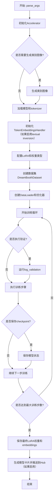

## 类结构

```
TokenEmbeddingsHandler (文本编码器嵌入处理器)
├── __init__
├── initialize_new_tokens
├── save_embeddings
├── retract_embeddings
├── dtype (property)
└── device (property)

DreamBoothDataset (训练数据集)
├── __init__
├── __len__
└── __getitem__

PromptDataset (类别图像生成数据集)
├── __init__
├── __len__
└── __getitem__
```

## 全局变量及字段


### `logger`
    
Logger instance for tracking training progress and debugging

类型：`logging.Logger`
    


### `args`
    
Parsed command-line arguments containing all training configuration

类型：`argparse.Namespace`
    


### `TokenEmbeddingsHandler.text_encoders`
    
List of text encoder models (CLIP and optionally T5) for token embedding management

类型：`List[CLIPTextModel | T5EncoderModel]`
    


### `TokenEmbeddingsHandler.tokenizers`
    
List of tokenizers corresponding to the text encoders

类型：`List[CLIPTokenizer | T5TokenizerFast]`
    


### `TokenEmbeddingsHandler.train_ids`
    
Tensor containing token IDs for CLIP text encoder training tokens

类型：`Optional[torch.Tensor]`
    


### `TokenEmbeddingsHandler.train_ids_t5`
    
Tensor containing token IDs for T5 text encoder training tokens

类型：`Optional[torch.Tensor]`
    


### `TokenEmbeddingsHandler.inserting_toks`
    
List of special tokens to be inserted into tokenizers for textual inversion

类型：`Optional[List[str]]`
    


### `TokenEmbeddingsHandler.embeddings_settings`
    
Dictionary storing original embeddings, std values, and update indices for token management

类型：`dict`
    


### `DreamBoothDataset.size`
    
Target resolution size for input images (e.g., 512 or 1024)

类型：`int`
    


### `DreamBoothDataset.instance_prompt`
    
Prompt template used for instance images in DreamBooth training

类型：`str`
    


### `DreamBoothDataset.custom_instance_prompts`
    
Custom prompts from dataset captions, None if not provided

类型：`Optional[List[str]]`
    


### `DreamBoothDataset.class_prompt`
    
Prompt used for generating or describing class images for prior preservation

类型：`Optional[str]`
    


### `DreamBoothDataset.token_abstraction_dict`
    
Dictionary mapping placeholder tokens to new special tokens for textual inversion

类型：`Optional[Dict[str, List[str]]]`
    


### `DreamBoothDataset.train_text_encoder_ti`
    
Flag indicating whether textual inversion training is enabled for text encoder

类型：`bool`
    


### `DreamBoothDataset.instance_images`
    
List of PIL Image objects containing instance training images

类型：`List[Image.Image]`
    


### `DreamBoothDataset.pixel_values`
    
List of normalized image tensors ready for model input

类型：`List[torch.Tensor]`
    


### `DreamBoothDataset.num_instance_images`
    
Number of unique instance images in the dataset

类型：`int`
    


### `DreamBoothDataset._length`
    
Total length of dataset accounting for instance and class images

类型：`int`
    


### `DreamBoothDataset.class_data_root`
    
Path to directory containing class images for prior preservation

类型：`Optional[Path]`
    


### `DreamBoothDataset.class_images_path`
    
List of paths to class images for prior preservation

类型：`Optional[List[Path]]`
    


### `DreamBoothDataset.num_class_images`
    
Number of class images available for prior preservation loss

类型：`int`
    


### `DreamBoothDataset.image_transforms`
    
Composable transforms for preprocessing class images

类型：`torchvision.transforms.Compose`
    


### `PromptDataset.prompt`
    
Text prompt used for generating class images on multiple GPUs

类型：`str`
    


### `PromptDataset.num_samples`
    
Number of samples to generate for the given prompt

类型：`int`
    
    

## 全局函数及方法


### `save_model_card`

该函数用于在训练完成后生成并保存 HuggingFace Hub 的模型卡片（README.md），包含训练元数据、示例代码、触发词等信息，并将验证图像保存到仓库文件夹中。

参数：

- `repo_id`：`str`，HuggingFace Hub 上的仓库标识符
- `images`：`Optional[List[PIL.Image]]`，训练过程中生成的验证图像列表，默认为 None
- `base_model`：`Optional[str]，基础预训练模型的名称或路径，默认为 None
- `train_text_encoder`：`bool`，是否训练了文本编码器的 LoRA，默认为 False
- `train_text_encoder_ti`：`bool`，是否启用了文本反转（Pivotal Tuning），默认为 False
- `enable_t5_ti`：`bool`，是否对 T5 编码器也启用了文本反转，默认为 False
- `pure_textual_inversion`：`bool`，是否仅使用纯文本反转（不训练 LoRA），默认为 False
- `token_abstraction_dict`：`Optional[Dict[str, List[str]]]`，token 抽象字典，用于文本反转训练，默认为 None
- `instance_prompt`：`Optional[str]，实例提示词，用于标识训练主体，默认为 None
- `validation_prompt`：`Optional[str]，验证时使用的提示词，默认为 None
- `repo_folder`：`Optional[str]`，本地仓库文件夹路径，用于保存模型卡片和图像，默认为 None

返回值：`None`，该函数无返回值，直接将模型卡片保存到磁盘

#### 流程图

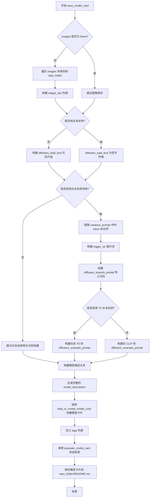

#### 带注释源码

```python
def save_model_card(
    repo_id: str,
    images=None,
    base_model: str = None,
    train_text_encoder=False,
    train_text_encoder_ti=False,
    enable_t5_ti=False,
    pure_textual_inversion=False,
    token_abstraction_dict=None,
    instance_prompt=None,
    validation_prompt=None,
    repo_folder=None,
):
    """
    生成并保存 HuggingFace 模型卡片（README.md）
    
    参数:
        repo_id: 仓库标识符
        images: 验证图像列表
        base_model: 基础模型名称
        train_text_encoder: 是否训练了文本编码器
        train_text_encoder_ti: 是否启用文本反转
        enable_t5_ti: 是否启用 T5 文本反转
        pure_textual_inversion: 是否为纯文本反转
        token_abstraction_dict: token 抽象字典
        instance_prompt: 实例提示词
        validation_prompt: 验证提示词
        repo_folder: 仓库文件夹路径
    """
    widget_dict = []  # 用于 HuggingFace Hub widget 展示的字典列表
    # 构建触发词提示字符串
    trigger_str = f"You should use {instance_prompt} to trigger the image generation."

    # 如果有验证图像，保存到本地并添加到 widget_dict
    if images is not None:
        for i, image in enumerate(images):
            image.save(os.path.join(repo_folder, f"image_{i}.png"))
            widget_dict.append(
                {"text": validation_prompt if validation_prompt else " ", "output": {"url": f"image_{i}.png"}}
            )
    
    # 初始化各个代码片段为空字符串
    diffusers_load_lora = ""
    diffusers_imports_pivotal = ""
    diffusers_example_pivotal = ""
    
    # 如果不是纯文本反转，构建 LoRA 加载代码
    if not pure_textual_inversion:
        diffusers_load_lora = (
            f"""pipeline.load_lora_weights('{repo_id}', weight_name='pytorch_lora_weights.safetensors')"""
        )
    
    # 如果启用了文本反转训练，构建相关代码
    if train_text_encoder_ti:
        # 生成 embedding 文件名
        embeddings_filename = f"{repo_folder}_emb"
        # 使用正则提取 instance_prompt 中的 token 标识符 <s0>, <s1> 等
        ti_keys = ", ".join(f'"{match}"' for match in re.findall(r"<s\d+>", instance_prompt))
        # 构建触发词说明
        trigger_str = (
            "To trigger image generation of trained concept(or concepts) replace each concept identifier "
            "in you prompt with the new inserted tokens:\n"
        )
        # 构建 pivotal tuning 所需的导入代码
        diffusers_imports_pivotal = """from huggingface_hub import hf_hub_download
    from safetensors.torch import load_file
            """
        
        # 根据是否启用 T5 文本反转，构建不同的加载示例
        if enable_t5_ti:
            # T5 文本反转需要加载 CLIP 和 T5 的 embedding
            diffusers_example_pivotal = f"""embedding_path = hf_hub_download(repo_id='{repo_id}', filename='{embeddings_filename}.safetensors', repo_type="model")
    state_dict = load_file(embedding_path)
    pipeline.load_textual_inversion(state_dict["clip_l"], token=[{ti_keys}], text_encoder=pipeline.text_encoder, tokenizer=pipeline.tokenizer)
    pipeline.load_textual_inversion(state_dict["t5"], token=[{ti_keys}], text_encoder=pipeline.text_encoder_2, tokenizer=pipeline.tokenizer_2)
            """
        else:
            # 仅 CLIP 文本反转
            diffusers_example_pivotal = f"""embedding_path = hf_hub_download(repo_id='{repo_id}', filename='{embeddings_filename}.safetensors', repo_type="model")
    state_dict = load_file(embedding_path)
    pipeline.load_textual_inversion(state_dict["clip_l"], token=[{ti_keys}], text_encoder=pipeline.text_encoder, tokenizer=pipeline.tokenizer)
            """
        
        # 如果有 token 抽象字典，添加概念映射说明
        if token_abstraction_dict:
            for key, value in token_abstraction_dict.items():
                tokens = "".join(value)
                trigger_str += f"""
    to trigger concept `{key}` → use `{tokens}` in your prompt \n
    """

    # 构建完整的模型描述文档
    model_description = f"""
# Flux DreamBooth LoRA - {repo_id}

<Gallery />

## Model description

These are {repo_id} DreamBooth LoRA weights for {base_model}.

The weights were trained using [DreamBooth](https://dreambooth.github.io/) with the [Flux diffusers trainer](https://github.com/huggingface/diffusers/blob/main/examples/dreambooth/README_flux.md).

Was LoRA for the text encoder enabled? {train_text_encoder}.

Pivotal tuning was enabled: {train_text_encoder_ti}.

## Trigger words

{trigger_str}

## Download model

[Download the *.safetensors LoRA]({repo_id}/tree/main) in the Files & versions tab.

## Use it with the [🧨 diffusers library](https://github.com/huggingface/diffusers)

```py
from diffusers import AutoPipelineForText2Image
import torch
{diffusers_imports_pivotal}
pipeline = AutoPipelineForText2Image.from_pretrained("black-forest-labs/FLUX.1-dev", torch_dtype=torch.bfloat16).to('cuda')
{diffusers_load_lora}
{diffusers_example_pivotal}
image = pipeline('{validation_prompt if validation_prompt else instance_prompt}').images[0]
```

For more details, including weighting, merging and fusing LoRAs, check the [documentation on loading LoRAs in diffusers](https://huggingface.co/docs/diffusers/main/en/using-diffusers/loading_adapters)

## License

Please adhere to the licensing terms as described [here](https://huggingface.co/black-forest-labs/FLUX.1-dev/blob/main/LICENSE.md).
"""
    # 加载或创建模型卡片
    model_card = load_or_create_model_card(
        repo_id_or_path=repo_id,
        from_training=True,
        license="other",
        base_model=base_model,
        prompt=instance_prompt,
        model_description=model_description,
        widget=widget_dict,
    )
    
    # 定义标签列表
    tags = [
        "text-to-image",
        "diffusers-training",
        "diffusers",
        "lora",
        "flux",
        "flux-diffusers",
        "template:sd-lora",
    ]

    # 填充标签并保存模型卡片
    model_card = populate_model_card(model_card, tags=tags)
    model_card.save(os.path.join(repo_folder, "README.md"))
```


### `load_text_encoders`

加载预训练的文本编码器模型（CLIP 和 T5）

参数：

- `class_one`：`type`，第一个文本编码器的类（通常是 CLIPTextModel）
- `class_two`：`type`，第二个文本编码器的类（通常是 T5EncoderModel）

返回值：`Tuple[CLIPTextModel, T5EncoderModel]`，返回两个文本编码器实例

#### 流程图

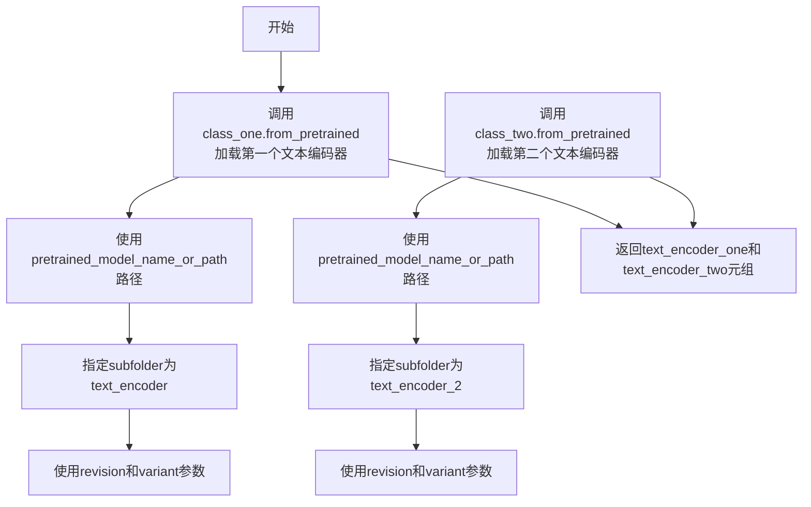

#### 带注释源码

```python
def load_text_encoders(class_one, class_two):
    """
    加载预训练的文本编码器模型
    
    该函数使用transformers库的from_pretrained方法从预训练模型中加载
    两个文本编码器：第一个是CLIP文本编码器，第二个是T5文本编码器。
    这些编码器用于将文本提示转换为嵌入向量，供Flux扩散模型使用。
    
    参数:
        class_one: 第一个文本编码器的类（从import_model_class_from_model_name_or_path返回）
        class_two: 第二个文本编码器的类（从import_model_class_from_model_name_or_path返回）
    
    返回:
        Tuple: (text_encoder_one, text_encoder_two) - 两个预训练的文本编码器实例
    """
    
    # 加载第一个文本编码器（通常是CLIP）
    # subfolder="text_encoder" 指定从模型目录的text_encoder子文件夹加载
    # revision指定要加载的模型版本
    # variant指定模型变体（如fp16等）
    text_encoder_one = class_one.from_pretrained(
        args.pretrained_model_name_or_path, 
        subfolder="text_encoder", 
        revision=args.revision, 
        variant=args.variant
    )
    
    # 加载第二个文本编码器（通常是T5）
    # subfolder="text_encoder_2" 指定从模型目录的text_encoder_2子文件夹加载
    text_encoder_two = class_two.from_pretrained(
        args.pretrained_model_name_or_path, 
        subfolder="text_encoder_2", 
        revision=args.revision, 
        variant=args.variant
    )
    
    # 返回两个文本编码器供后续训练使用
    return text_encoder_one, text_encoder_two
```


### `log_validation`

该函数负责在训练过程中运行验证，生成指定数量的图像并将其记录到跟踪器（TensorBoard或WandB）中，用于监控模型性能。

参数：

- `pipeline`：`FluxPipeline`，用于生成图像的扩散管道对象
- `args`：包含训练配置参数的命名空间对象，包括验证提示词、生成图像数量等
- `accelerator`：`Accelerator`，分布式训练加速器，提供设备管理和同步功能
- `pipeline_args`：`dict`，传递给管道的参数字典，通常包含 `prompt` 键
- `epoch`：`int`，当前训练轮次，用于记录日志
- `torch_dtype`：`torch.dtype`，用于管道运行的数据类型（fp16/bf16/fp32）
- `is_final_validation`：`bool`，标识是否为最终验证的标志，默认为 `False`

返回值：`List[PIL.Image]`，生成的图像列表

#### 流程图

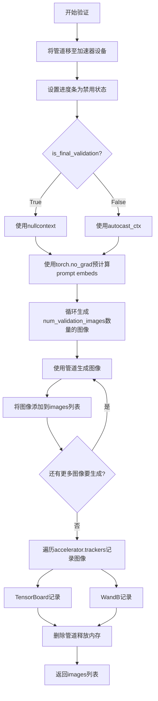

#### 带注释源码

```python
def log_validation(
    pipeline,          # FluxPipeline: 用于图像生成的扩散管道
    args,              # Namespace: 训练参数，包含validation_prompt等配置
    accelerator,       # Accelerator: 分布式训练加速器
    pipeline_args,    # dict: 传递给管道的参数，如prompt
    epoch,            # int: 当前训练轮次
    torch_dtype,      # torch.dtype: 运行管道用的数据类型
    is_final_validation=False,  # bool: 是否为最终验证
):
    # 记录验证开始信息，包括验证提示词和生成图像数量
    logger.info(
        f"Running validation... \n Generating {args.num_validation_images} images with prompt:"
        f" {args.validation_prompt}."
    )
    
    # 将管道移动到加速器设备并转换为指定数据类型
    pipeline = pipeline.to(accelerator.device, dtype=torch_dtype)
    # 禁用进度条以避免验证期间显示进度
    pipeline.set_progress_bar_config(disable=True)

    # 创建随机数生成器，用于可重复的图像生成
    # 如果设置了seed则使用固定种子，否则为None
    generator = torch.Generator(device=accelerator.device).manual_seed(args.seed) if args.seed is not None else None
    
    # 根据是否为最终验证决定是否使用自动混合精度
    # 最终验证时使用nullcontext()以避免精度问题
    autocast_ctx = torch.autocast(accelerator.device.type) if not is_final_validation else nullcontext()

    # 预计算prompt embeddings，因为T5不支持autocast
    # 使用no_grad上下文避免计算梯度
    with torch.no_grad():
        prompt_embeds, pooled_prompt_embeds, text_ids = pipeline.encode_prompt(
            pipeline_args["prompt"], prompt_2=pipeline_args["prompt"]
        )
    
    images = []  # 存储生成的图像
    
    # 循环生成指定数量的验证图像
    for _ in range(args.num_validation_images):
        with autocast_ctx:  # 使用自动混合精度上下文
            image = pipeline(
                prompt_embeds=prompt_embeds, 
                pooled_prompt_embeds=pooled_prompt_embeds, 
                generator=generator
            ).images[0]
            images.append(image)

    # 遍历所有跟踪器记录验证结果
    for tracker in accelerator.trackers:
        # 确定阶段名称：最终验证为"test"，中间验证为"validation"
        phase_name = "test" if is_final_validation else "validation"
        
        # TensorBoard跟踪器：记录图像矩阵
        if tracker.name == "tensorboard":
            # 将PIL图像转换为numpy数组并堆叠
            np_images = np.stack([np.asarray(img) for img in images])
            tracker.writer.add_images(phase_name, np_images, epoch, dataformats="NHWC")
        
        # WandB跟踪器：记录图像及标题
        if tracker.name == "wandb":
            tracker.log(
                {
                    phase_name: [
                        wandb.Image(image, caption=f"{i}: {args.validation_prompt}") for i, image in enumerate(images)
                    ]
                }
            )

    # 清理：删除管道对象并释放GPU内存
    del pipeline
    free_memory()

    # 返回生成的图像列表供后续使用（如保存到模型卡片）
    return images
```


### `import_model_class_from_model_name_or_path`

该函数根据预训练模型的配置文件动态获取并返回对应的文本编码器类（CLIPTextModel 或 T5EncoderModel），用于后续加载文本编码器模型。

参数：

- `pretrained_model_name_or_path`：`str`，预训练模型的名称或路径（可以是 HuggingFace Hub 上的模型 ID 或本地路径）
- `revision`：`str`，预训练模型在 Hub 上的版本号（commit hash 或分支名）
- `subfolder`：`str`，默认为 `"text_encoder"`，配置文件所在的子文件夹路径

返回值：`type`，返回对应的文本编码器类（`CLIPTextModel` 或 `T5EncoderModel`），如果不支持则抛出 `ValueError` 异常

#### 流程图

```mermaid
flowchart TD
    A[开始: import_model_class_from_model_name_or_path] --> B[加载 PretrainedConfig]
    B --> C{PretrainedConfig.from_pretrained}
    C --> D[获取 model_class = config.architectures[0]]
    D --> E{model_class == 'CLIPTextModel'?}
    E -->|是| F[导入 CLIPTextModel]
    F --> G[返回 CLIPTextModel 类]
    E -->|否| H{model_class == 'T5EncoderModel'?}
    H -->|是| I[导入 T5EncoderModel]
    I --> J[返回 T5EncoderModel 类]
    H -->|否| K[抛出 ValueError 异常]
    G --> L[结束]
    J --> L
    K --> L
```

#### 带注释源码

```python
def import_model_class_from_model_name_or_path(
    pretrained_model_name_or_path: str,  # 预训练模型名称或路径
    revision: str,                        # 模型版本/分支
    subfolder: str = "text_encoder"       # 子文件夹路径，默认为 text_encoder
):
    """
    根据预训练模型配置动态获取文本编码器类。
    
    该函数首先加载模型的配置文件，从配置中读取 architectuers 字段，
    然后根据架构名称返回对应的 transformers 库中的模型类。
    这样可以支持不同类型的文本编码器（如 CLIP 和 T5）。
    """
    # 从预训练模型路径加载文本编码器的配置
    # PretrainedConfig 是 HuggingFace Transformers 库中的配置类
    text_encoder_config = PretrainedConfig.from_pretrained(
        pretrained_model_name_or_path,  # 模型路径或 Hub ID
        subfolder=subfolder,             # 指定子文件夹（如 text_encoder 或 text_encoder_2）
        revision=revision               # 指定版本/分支
    )
    
    # 从配置中获取模型架构名称
    # architectures 是一个列表，通常第一个元素就是模型架构名
    model_class = text_encoder_config.architectures[0]
    
    # 根据架构名称判断并返回对应的模型类
    if model_class == "CLIPTextModel":
        # CLIP 文本编码器模型（如用于 FLUX 等模型的 CLIP ViT-L/14）
        from transformers import CLIPTextModel
        return CLIPTextModel
    
    elif model_class == "T5EncoderModel":
        # T5 编码器模型（如用于 FLUX 等模型的 T5 XXL）
        from transformers import T5EncoderModel
        return T5EncoderModel
    
    else:
        # 如果遇到不支持的架构类型，抛出明确的错误信息
        raise ValueError(f"{model_class} is not supported.")
```


### `parse_args`

该函数是Flux DreamBooth LoRA训练脚本的命令行参数解析器，通过argparse定义并验证所有训练相关参数，包括模型路径、数据集配置、训练超参数、LoRA设置、优化器选项等，最终返回解析后的命名空间对象。

参数：

- `input_args`：`Optional[List[str]]`，可选，用于测试目的的命令行参数列表，默认为None

返回值：`argparse.Namespace`，包含所有解析后的命令行参数对象

#### 流程图

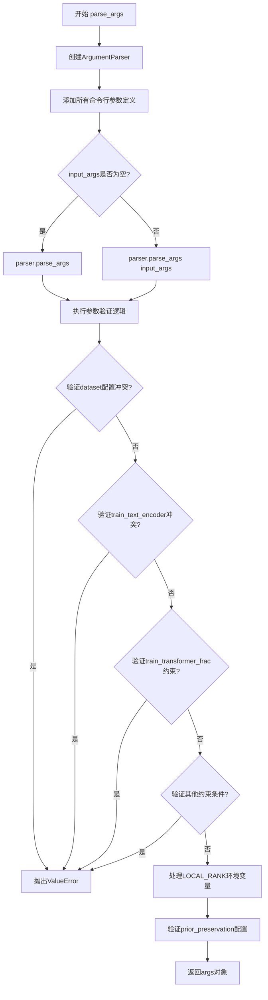

#### 带注释源码

```python
def parse_args(input_args=None):
    """
    解析命令行参数并返回配置对象。
    
    参数:
        input_args: 可选的参数列表，用于测试目的。如果为None，则从sys.argv解析。
    
    返回:
        包含所有训练配置的命名空间对象。
    """
    # 创建ArgumentParser实例，设置描述信息
    parser = argparse.ArgumentParser(description="Simple example of a training script.")
    
    # ========== 模型相关参数 ==========
    parser.add_argument(
        "--pretrained_model_name_or_path",
        type=str,
        default=None,
        required=True,
        help="Path to pretrained model or model identifier from huggingface.co/models.",
    )
    parser.add_argument(
        "--revision",
        type=str,
        default=None,
        required=False,
        help="Revision of pretrained model identifier from huggingface.co/models.",
    )
    parser.add_argument(
        "--variant",
        type=str,
        default=None,
        help="Variant of the model files of the pretrained model identifier from huggingface.co/models, 'e.g.' fp16",
    )
    
    # ========== 数据集相关参数 ==========
    parser.add_argument(
        "--dataset_name",
        type=str,
        default=None,
        help="The name of the Dataset (from the HuggingFace hub) containing the training data...",
    )
    parser.add_argument(
        "--dataset_config_name",
        type=str,
        default=None,
        help="The config of the Dataset, leave as None if there's only one config.",
    )
    parser.add_argument(
        "--instance_data_dir",
        type=str,
        default=None,
        help="A folder containing the training data.",
    )
    parser.add_argument(
        "--cache_dir",
        type=str,
        default=None,
        help="The directory where the downloaded models and datasets will be stored.",
    )
    parser.add_argument(
        "--image_column",
        type=str,
        default="image",
        help="The column of the dataset containing the target image.",
    )
    parser.add_argument(
        "--caption_column",
        type=str,
        default=None,
        help="The column of the dataset containing the instance prompt for each image",
    )
    parser.add_argument("--repeats", type=int, default=1, help="How many times to repeat the training data.")
    
    # ========== Prompt相关参数 ==========
    parser.add_argument(
        "--class_data_dir",
        type=str,
        default=None,
        required=False,
        help="A folder containing the training data of class images.",
    )
    parser.add_argument(
        "--instance_prompt",
        type=str,
        default=None,
        required=True,
        help="The prompt with identifier specifying the instance, e.g. 'photo of a TOK dog'",
    )
    parser.add_argument(
        "--token_abstraction",
        type=str,
        default="TOK",
        help="identifier specifying the instance(or instances) as used in instance_prompt...",
    )
    parser.add_argument(
        "--num_new_tokens_per_abstraction",
        type=int,
        default=None,
        help="number of new tokens inserted to the tokenizers per token_abstraction identifier...",
    )
    parser.add_argument(
        "--initializer_concept",
        type=str,
        default=None,
        help="the concept to use to initialize the new inserted tokens when training with textual inversion...",
    )
    parser.add_argument(
        "--class_prompt",
        type=str,
        default=None,
        help="The prompt to specify images in the same class as provided instance images.",
    )
    parser.add_argument(
        "--max_sequence_length",
        type=int,
        default=512,
        help="Maximum sequence length to use with with the T5 text encoder",
    )
    
    # ========== 验证相关参数 ==========
    parser.add_argument(
        "--validation_prompt",
        type=str,
        default=None,
        help="A prompt that is used during validation to verify that the model is learning.",
    )
    parser.add_argument(
        "--num_validation_images",
        type=int,
        default=4,
        help="Number of images that should be generated during validation with `validation_prompt`.",
    )
    parser.add_argument(
        "--validation_epochs",
        type=int,
        default=50,
        help="Run dreambooth validation every X epochs...",
    )
    
    # ========== LoRA相关参数 ==========
    parser.add_argument(
        "--rank",
        type=int,
        default=4,
        help="The dimension of the LoRA update matrices.",
    )
    parser.add_argument(
        "--lora_alpha",
        type=int,
        default=4,
        help="LoRA alpha to be used for additional scaling.",
    )
    parser.add_argument("--lora_dropout", type=float, default=0.0, help="Dropout probability for LoRA layers")
    parser.add_argument(
        "--lora_layers",
        type=str,
        default=None,
        help="The transformer modules to apply LoRA training on...",
    )
    
    # ========== Prior Preservation相关 ==========
    parser.add_argument(
        "--with_prior_preservation",
        default=False,
        action="store_true",
        help="Flag to add prior preservation loss.",
    )
    parser.add_argument("--prior_loss_weight", type=float, default=1.0, help="The weight of prior preservation loss.")
    parser.add_argument(
        "--num_class_images",
        type=int,
        default=100,
        help="Minimal class images for prior preservation loss...",
    )
    
    # ========== 训练输出目录 ==========
    parser.add_argument(
        "--output_dir",
        type=str,
        default="flux-dreambooth-lora",
        help="The output directory where the model predictions and checkpoints will be written.",
    )
    parser.add_argument("--seed", type=int, default=None, help="A seed for reproducible training.")
    
    # ========== 图像处理参数 ==========
    parser.add_argument(
        "--resolution",
        type=int,
        default=512,
        help="The resolution for input images, all the images in the train/validation dataset will be resized...",
    )
    parser.add_argument(
        "--center_crop",
        default=False,
        action="store_true",
        help="Whether to center crop the input images to the resolution...",
    )
    parser.add_argument(
        "--random_flip",
        action="store_true",
        help="whether to randomly flip images horizontally",
    )
    parser.add_argument(
        "--image_interpolation_mode",
        type=str,
        default="lanczos",
        choices=[...],
        help="The image image interpolation method to use for resizing images.",
    )
    
    # ========== 训练策略参数 ==========
    parser.add_argument(
        "--train_text_encoder",
        action="store_true",
        help="Whether to train the text encoder. If set, the text encoder should be float32 precision.",
    )
    parser.add_argument(
        "--train_text_encoder_ti",
        action="store_true",
        help="Whether to use pivotal tuning / textual inversion",
    )
    parser.add_argument(
        "--enable_t5_ti",
        action="store_true",
        help="Whether to use pivotal tuning / textual inversion for the T5 encoder...",
    )
    parser.add_argument(
        "--train_text_encoder_ti_frac",
        type=float,
        default=0.5,
        help="The percentage of epochs to perform textual inversion",
    )
    parser.add_argument(
        "--train_text_encoder_frac",
        type=float,
        default=1.0,
        help="The percentage of epochs to perform text encoder tuning",
    )
    parser.add_argument(
        "--train_transformer_frac",
        type=float,
        default=1.0,
        help="The percentage of epochs to perform transformer tuning",
    )
    
    # ========== Batch Size和Epochs ==========
    parser.add_argument(
        "--train_batch_size", type=int, default=4, help="Batch size (per device) for the training dataloader."
    )
    parser.add_argument(
        "--sample_batch_size", type=int, default=4, help="Batch size (per device) for sampling images."
    )
    parser.add_argument("--num_train_epochs", type=int, default=1)
    parser.add_argument(
        "--max_train_steps",
        type=int,
        default=None,
        help="Total number of training steps to perform. If provided, overrides num_train_epochs.",
    )
    
    # ========== Checkpoint相关 ==========
    parser.add_argument(
        "--checkpointing_steps",
        type=int,
        default=500,
        help="Save a checkpoint of the training state every X updates...",
    )
    parser.add_argument(
        "--checkpoints_total_limit",
        type=int,
        default=None,
        help="Max number of checkpoints to store.",
    )
    parser.add_argument(
        "--resume_from_checkpoint",
        type=str,
        default=None,
        help="Whether training should be resumed from a previous checkpoint...",
    )
    
    # ========== 梯度相关 ==========
    parser.add_argument(
        "--gradient_accumulation_steps",
        type=int,
        default=1,
        help="Number of updates steps to accumulate before performing a backward/update pass.",
    )
    parser.add_argument(
        "--gradient_checkpointing",
        action="store_true",
        help="Whether or not to use gradient checkpointing to save memory...",
    )
    parser.add_argument("--max_grad_norm", default=1.0, type=float, help="Max gradient norm.")
    
    # ========== 学习率相关 ==========
    parser.add_argument(
        "--learning_rate",
        type=float,
        default=1e-4,
        help="Initial learning rate (after the potential warmup period) to use.",
    )
    parser.add_argument(
        "--guidance_scale",
        type=float,
        default=3.5,
        help="the FLUX.1 dev variant is a guidance distilled model",
    )
    parser.add_argument(
        "--text_encoder_lr",
        type=float,
        default=5e-6,
        help="Text encoder learning rate to use.",
    )
    parser.add_argument(
        "--scale_lr",
        action="store_true",
        default=False,
        help="Scale the learning rate by the number of GPUs, gradient accumulation steps, and batch size.",
    )
    parser.add_argument(
        "--lr_scheduler",
        type=str,
        default="constant",
        help="The scheduler type to use. Choose between [linear, cosine, cosine_with_restarts, polynomial, constant, constant_with_warmup]",
    )
    parser.add_argument(
        "--lr_warmup_steps", type=int, default=500, help="Number of steps for the warmup in the lr scheduler."
    )
    parser.add_argument(
        "--lr_num_cycles",
        type=int,
        default=1,
        help="Number of hard resets of the lr in cosine_with_restarts scheduler.",
    )
    parser.add_argument("--lr_power", type=float, default=1.0, help="Power factor of the polynomial scheduler.")
    
    # ========== DataLoader相关 ==========
    parser.add_argument(
        "--dataloader_num_workers",
        type=int,
        default=0,
        help="Number of subprocesses to use for data loading...",
    )
    
    # ========== 采样权重方案 ==========
    parser.add_argument(
        "--weighting_scheme",
        type=str,
        default="none",
        choices=["sigma_sqrt", "logit_normal", "mode", "cosmap", "none"],
        help='We default to the "none" weighting scheme for uniform sampling and uniform loss',
    )
    parser.add_argument(
        "--logit_mean", type=float, default=0.0, help="mean to use when using the logit_normal weighting scheme."
    )
    parser.add_argument(
        "--logit_std", type=float, default=1.0, help="std to use when using the logit_normal weighting scheme."
    )
    parser.add_argument(
        "--mode_scale",
        type=float,
        default=1.29,
        help="Scale of mode weighting scheme. Only effective when using the mode as the weighting_scheme.",
    )
    
    # ========== 优化器相关 ==========
    parser.add_argument(
        "--optimizer",
        type=str,
        default="AdamW",
        help='The optimizer type to use. Choose between [AdamW, prodigy]',
    )
    parser.add_argument(
        "--use_8bit_adam",
        action="store_true",
        help="Whether or not to use 8-bit Adam from bitsandbytes. Ignored if optimizer is not set to AdamW",
    )
    parser.add_argument(
        "--adam_beta1", type=float, default=0.9, help="The beta1 parameter for the Adam and Prodigy optimizers."
    )
    parser.add_argument(
        "--adam_beta2", type=float, default=0.999, help="The beta2 parameter for the Adam and Prodigy optimizers."
    )
    parser.add_argument(
        "--prodigy_beta3",
        type=float,
        default=None,
        help="coefficients for computing the Prodigy stepsize using running averages...",
    )
    parser.add_argument("--prodigy_decouple", type=bool, default=True, help="Use AdamW style decoupled weight decay")
    parser.add_argument(
        "--adam_weight_decay", type=float, default=1e-04, help="Weight decay to use for transformer params"
    )
    parser.add_argument(
        "--adam_weight_decay_text_encoder", type=float, default=1e-03, help="Weight decay to use for text_encoder"
    )
    parser.add_argument(
        "--adam_epsilon",
        type=float,
        default=1e-08,
        help="Epsilon value for the Adam optimizer and Prodigy optimizers.",
    )
    parser.add_argument(
        "--prodigy_use_bias_correction",
        type=bool,
        default=True,
        help="Turn on Adam's bias correction. True by default. Ignored if optimizer is adamW",
    )
    parser.add_argument(
        "--prodigy_safeguard_warmup",
        type=bool,
        default=True,
        help="Remove lr from the denominator of D estimate to avoid issues during warm-up stage...",
    )
    
    # ========== Hub相关 ==========
    parser.add_argument("--push_to_hub", action="store_true", help="Whether or not to push the model to the Hub.")
    parser.add_argument("--hub_token", type=str, default=None, help="The token to use to push to the Model Hub.")
    parser.add_argument(
        "--hub_model_id",
        type=str,
        default=None,
        help="The name of the repository to keep in sync with the local output_dir.",
    )
    
    # ========== 日志和精度相关 ==========
    parser.add_argument(
        "--logging_dir",
        type=str,
        default="logs",
        help="TensorBoard log directory...",
    )
    parser.add_argument(
        "--allow_tf32",
        action="store_true",
        help="Whether or not to allow TF32 on Ampere GPUs...",
    )
    parser.add_argument(
        "--cache_latents",
        action="store_true",
        default=False,
        help="Cache the VAE latents",
    )
    parser.add_argument(
        "--report_to",
        type=str,
        default="tensorboard",
        help='The integration to report the results and logs to. Supported platforms are "tensorboard", "wandb", "comet_ml"...',
    )
    parser.add_argument(
        "--mixed_precision",
        type=str,
        default=None,
        choices=["no", "fp16", "bf16"],
        help="Whether to use mixed precision...",
    )
    parser.add_argument(
        "--upcast_before_saving",
        action="store_true",
        default=False,
        help="Whether to upcast the trained transformer layers to float32 before saving...",
    )
    parser.add_argument(
        "--prior_generation_precision",
        type=str,
        default=None,
        choices=["no", "fp32", "fp16", "bf16"],
        help="Choose prior generation precision between fp32, fp16 and bf16...",
    )
    parser.add_argument("--local_rank", type=int, default=-1, help="For distributed training: local_rank")
    
    # ========== 解析参数 ==========
    if input_args is not None:
        args = parser.parse_args(input_args)
    else:
        args = parser.parse_args()
    
    # ========== 验证逻辑 ==========
    
    # 验证数据集配置：dataset_name和instance_data_dir不能同时指定
    if args.dataset_name is None and args.instance_data_dir is None:
        raise ValueError("Specify either `--dataset_name` or `--instance_data_dir`")
    if args.dataset_name is not None and args.instance_data_dir is not None:
        raise ValueError("Specify only one of `--dataset_name` or `--instance_data_dir`")
    
    # 验证文本编码器训练策略：train_text_encoder和train_text_encoder_ti不能同时启用
    if args.train_text_encoder and args.train_text_encoder_ti:
        raise ValueError(
            "Specify only one of `--train_text_encoder` or `--train_text_encoder_ti`..."
        )
    
    # 验证transformer训练比例约束
    if args.train_transformer_frac < 1 and not args.train_text_encoder_ti:
        raise ValueError("--train_transformer_frac must be == 1 if text_encoder training is not enabled.")
    if args.train_transformer_frac < 1 and args.train_text_encoder_ti_frac < 1:
        raise ValueError("--train_transformer_frac and --train_text_encoder_ti_frac are identical and smaller than 1...")
    
    # 警告：enable_t5_ti需要train_text_encoder_ti
    if args.enable_t5_ti and not args.train_text_encoder_ti:
        logger.warning("You need not use --enable_t5_ti without --train_text_encoder_ti.")
    
    # 警告：initializer_concept会忽略num_new_tokens_per_abstraction
    if args.train_text_encoder_ti and args.initializer_concept and args.num_new_tokens_per_abstraction:
        logger.warning("When specifying --initializer_concept, the number of tokens per abstraction is detrimned by the initializer token...")
    
    # 处理环境变量LOCAL_RANK
    env_local_rank = int(os.environ.get("LOCAL_RANK", -1))
    if env_local_rank != -1 and env_local_rank != args.local_rank:
        args.local_rank = env_local_rank
    
    # 验证prior preservation配置
    if args.with_prior_preservation:
        if args.class_data_dir is None:
            raise ValueError("You must specify a data directory for class images.")
        if args.class_prompt is None:
            raise ValueError("You must specify prompt for class images.")
    else:
        if args.class_data_dir is not None:
            logger.warning("You need not use --class_data_dir without --with_prior_preservation.")
        if args.class_prompt is not None:
            logger.warning("You need not use --class_prompt without --with_prior_preservation.")
    
    return args
```


### `tokenize_prompt`

该函数用于将文本提示（prompt）转换为模型可处理的token IDs序列，通过tokenizer对文本进行分词、填充、截断等处理，并返回包含input_ids的Tensor。

参数：

- `tokenizer`：`CLIPTokenizer` 或 `T5TokenizerFast`，用于对文本进行分词和编码
- `prompt`：`str`，需要分词的提示文本
- `max_sequence_length`：`int`，分词后的最大序列长度
- `add_special_tokens`：`bool`，是否添加特殊标记（如CLS、SEP等），默认为False

返回值：`torch.Tensor`，返回分词后的输入ID张量，形状为 `(1, max_sequence_length)`

#### 流程图

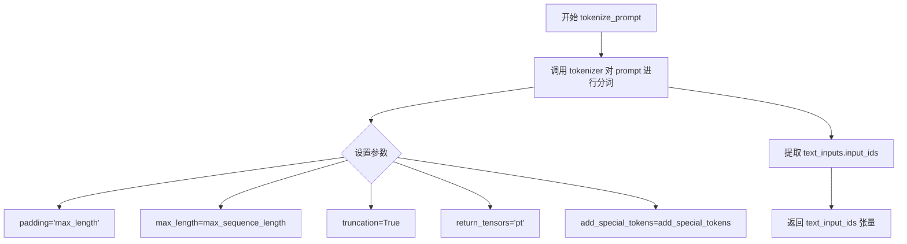

#### 带注释源码

```python
def tokenize_prompt(tokenizer, prompt, max_sequence_length, add_special_tokens=False):
    """
    将文本提示转换为token IDs张量
    
    参数:
        tokenizer: 分词器对象 (CLIPTokenizer 或 T5TokenizerFast)
        prompt: 要分词的文本提示
        max_sequence_length: 最大序列长度
        add_special_tokens: 是否添加特殊标记 (如 CLS, SEP 等)
    
    返回:
        包含input_ids的PyTorch张量
    """
    # 使用tokenizer对prompt进行编码
    # padding="max_length": 填充到最大长度
    # max_length: 限制最大序列长度
    # truncation: 超过最大长度的部分进行截断
    # return_length: 不返回长度信息
    # return_overflowing_tokens: 不返回溢出的token
    # add_special_tokens: 是否添加特殊标记
    # return_tensors="pt": 返回PyTorch张量
    text_inputs = tokenizer(
        prompt,
        padding="max_length",
        max_length=max_sequence_length,
        truncation=True,
        return_length=False,
        return_overflowing_tokens=False,
        add_special_tokens=add_special_tokens,
        return_tensors="pt",
    )
    
    # 从分词结果中提取input_ids
    text_input_ids = text_inputs.input_ids
    
    # 返回token IDs张量
    return text_input_ids
```


### `_encode_prompt_with_t5`

该函数用于将文本提示词（prompt）通过T5文本编码器编码为向量表示（embeddings）。它支持批量处理多个提示词，并为每个提示词生成多个图像的嵌入（通过复制实现）。该函数是FluxPipeline中T5编码路径的核心组成部分，主要用于生成Flux模型的文本条件输入。

参数：

- `text_encoder`：`torch.nn.Module`，T5文本编码器模型，用于将token IDs转换为向量表示
- `tokenizer`：`transformers.T5Tokenizer` 或 `T5TokenizerFast`，T5分词器，用于将文本提示词转换为token IDs，可为None
- `max_sequence_length`：`int`，最大序列长度，默认为512，控制tokenizer的最大长度和编码输出的序列维度
- `prompt`：`str` 或 `List[str]`，要编码的文本提示词，可以是单个字符串或字符串列表
- `num_images_per_prompt`：`int`，每个提示词生成的图像数量，默认为1，用于决定是否需要复制嵌入向量
- `device`：`torch.device`，计算设备（CPU/CUDA），用于将tensor移动到指定设备，若为None则使用编码器的设备
- `text_input_ids`：`torch.Tensor`，预分词的文本输入IDs，当tokenizer为None时必须提供

返回值：`torch.Tensor`，编码后的文本提示词嵌入向量，形状为 `(batch_size * num_images_per_prompt, seq_len, hidden_size)`

#### 流程图

```mermaid
flowchart TD
    A[开始: _encode_prompt_with_t5] --> B{检查prompt类型}
    B -->|字符串| C[将prompt转换为单元素列表]
    B -->|列表| D[保持原样]
    C --> E
    D --> E
    E[计算batch_size = len(prompt)] --> F{检查tokenizer是否为空}
    F -->|不为None| G[使用tokenizer分词prompt]
    F -->|为None| H{检查text_input_ids是否提供}
    H -->|未提供| I[抛出ValueError异常]
    H -->|已提供| J[使用提供的text_input_ids]
    G --> K
    J --> K
    K[调用text_encoder编码text_input_ids] --> L[获取text_encoder的dtype]
    L --> M[将prompt_embeds转换为正确dtype和device]
    M --> N[获取seq_len = prompt_embeds.shape[1]]
    N --> O[重复prompt_embeds num_images_per_prompt次]
    O --> P[reshape为batch_size * num_images_per_prompt, seq_len, -1]
    P --> Q[返回prompt_embeds]
```

#### 带注释源码

```python
def _encode_prompt_with_t5(
    text_encoder,
    tokenizer,
    max_sequence_length=512,
    prompt=None,
    num_images_per_prompt=1,
    device=None,
    text_input_ids=None,
):
    """
    使用T5文本编码器对提示词进行编码，生成文本嵌入向量。

    参数:
        text_encoder: T5编码器模型
        tokenizer: T5分词器
        max_sequence_length: 最大序列长度
        prompt: 提示词文本
        num_images_per_prompt: 每个提示词生成的图像数量
        device: 计算设备
        text_input_ids: 预分词的输入IDs

    返回:
        prompt_embeds: 编码后的文本嵌入
    """
    # 将prompt标准化为列表格式，便于批量处理
    # 如果是单个字符串，转换为单元素列表；如果是列表则保持不变
    prompt = [prompt] if isinstance(prompt, str) else prompt
    # 获取批大小
    batch_size = len(prompt)

    # 文本分词处理
    if tokenizer is not None:
        # 使用tokenizer将prompt转换为token IDs
        # padding="max_length"：填充到最大长度
        # truncation=True：截断超过最大长度的序列
        # return_tensors="pt"：返回PyTorch tensor
        text_inputs = tokenizer(
            prompt,
            padding="max_length",
            max_length=max_sequence_length,
            truncation=True,
            return_length=False,
            return_overflowing_tokens=False,
            return_tensors="pt",
        )
        # 提取input IDs
        text_input_ids = text_inputs.input_ids
    else:
        # 如果没有tokenizer，则必须提供预分词的text_input_ids
        if text_input_ids is None:
            raise ValueError("text_input_ids must be provided when the tokenizer is not specified")

    # 使用T5编码器进行前向传播，获取文本嵌入
    # text_encoder接受token IDs并输出隐藏状态
    prompt_embeds = text_encoder(text_input_ids.to(device))[0]

    # 处理分布式训练场景下的模型包装器
    # 如果模型被DataParallel/ParallelWrapper包装，需要访问module属性
    if hasattr(text_encoder, "module"):
        dtype = text_encoder.module.dtype
    else:
        dtype = text_encoder.dtype

    # 将嵌入向量转换为正确的dtype和device
    # 这是为了确保与模型权重的数据类型一致
    prompt_embeds = prompt_embeds.to(dtype=dtype, device=device)

    # 获取序列长度
    _, seq_len, _ = prompt_embeds.shape

    # 为每个提示词生成的多个图像复制文本嵌入和attention mask
    # 使用MPS友好的方法（与torch.repeat兼容）
    # 首先在序列维度上重复，然后reshape以匹配批量大小
    prompt_embeds = prompt_embeds.repeat(1, num_images_per_prompt, 1)
    prompt_embeds = prompt_embeds.view(batch_size * num_images_per_prompt, seq_len, -1)

    # 返回最终的文本嵌入，形状为 (batch_size * num_images_per_prompt, seq_len, hidden_size)
    return prompt_embeds
```


### `_encode_prompt_with_clip`

该函数是 Flux DreamBooth LoRA 训练脚本中的一个核心辅助函数，用于使用 CLIP 文本编码器将文本提示（prompt）编码为嵌入向量（embeddings）。它处理文本标记化、编码、类型转换以及批量生成时的嵌入复制，是 `encode_prompt` 函数的组成部分。

参数：

- `text_encoder`：CLIPTextModel，CLIP 文本编码器模型，用于将文本标记转换为嵌入向量
- `tokenizer`：CLIPTokenizer，CLIP 分词器，用于将文本字符串分词为标记 ID
- `prompt`：str，要编码的文本提示，可以是单个字符串或字符串列表
- `device`：torch.device（可选），指定计算设备，默认为 None
- `text_input_ids`：torch.Tensor（可选），预计算的文本标记 ID，若提供则可跳过分词步骤
- `num_images_per_prompt`：int = 1，每个提示要生成的图像数量，用于复制嵌入向量

返回值：`torch.Tensor`，形状为 `(batch_size * num_images_per_prompt, hidden_size)` 的文本嵌入张量

#### 流程图

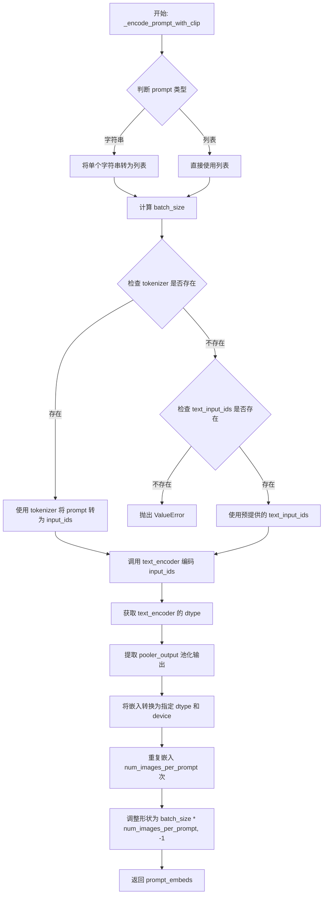

#### 带注释源码

```python
def _encode_prompt_with_clip(
    text_encoder,           # CLIP 文本编码器模型
    tokenizer,              # CLIP 分词器
    prompt: str,             # 要编码的文本提示
    device=None,             # 计算设备
    text_input_ids=None,     # 预计算的文本标记 ID
    num_images_per_prompt: int = 1,  # 每个提示生成的图像数量
):
    # 统一将 prompt 转为列表格式，便于批处理
    prompt = [prompt] if isinstance(prompt, str) else prompt
    # 计算批处理大小
    batch_size = len(prompt)

    # 如果提供了分词器，则对 prompt 进行分词
    if tokenizer is not None:
        text_inputs = tokenizer(
            prompt,
            padding="max_length",         # 填充到最大长度
            max_length=77,                 # CLIP 模型最大序列长度
            truncation=True,               # 截断超长序列
            return_overflowing_tokens=False,
            return_length=False,
            return_tensors="pt",           # 返回 PyTorch 张量
        )
        # 获取分词后的标记 ID
        text_input_ids = text_inputs.input_ids
    else:
        # 如果没有分词器，则必须提供预计算的 text_input_ids
        if text_input_ids is None:
            raise ValueError("text_input_ids must be provided when the tokenizer is not specified")

    # 使用 CLIP 文本编码器获取嵌入表示
    # output_hidden_states=False 表示只获取最后的隐藏状态，不获取所有层的隐藏状态
    prompt_embeds = text_encoder(text_input_ids.to(device), output_hidden_states=False)

    # 处理分布式训练情况，获取正确的 dtype
    if hasattr(text_encoder, "module"):
        dtype = text_encoder.module.dtype
    else:
        dtype = text_encoder.dtype
    
    # 提取 CLIPTextModel 的池化输出 (pooled output)
    # 这是用于表示整个序列的单一向量表示
    prompt_embeds = prompt_embeds.pooler_output
    
    # 将嵌入向量转换到指定的 dtype 和设备上
    prompt_embeds = prompt_embeds.to(dtype=dtype, device=device)

    # 为每个提示生成多个图像时，复制文本嵌入
    # 这种方法对 MPS 设备友好
    prompt_embeds = prompt_embeds.repeat(1, num_images_per_prompt, 1)
    # 调整形状: (batch_size, num_images_per_prompt, hidden_size) -> (batch_size * num_images_per_prompt, hidden_size)
    prompt_embeds = prompt_embeds.view(batch_size * num_images_per_prompt, -1)

    return prompt_embeds
```


### `encode_prompt`

该函数是 Flux DreamBooth LoRA 训练脚本中的核心提示编码函数，用于将文本提示编码为模型所需的嵌入向量。它同时调用 CLIP 和 T5 两种文本编码器，生成用于 Flux 管道推理的提示嵌入、池化嵌入和文本 ID。

参数：

- `text_encoders`：List[CLIPTextModel, T5EncoderModel]，文本编码器列表，包含 CLIP 和 T5 两种编码器
- `tokenizers`：List[CLIPTokenizer, T5TokenizerFast]，分词器列表，用于对提示进行分词
- `prompt`：str，待编码的文本提示
- `max_sequence_length`：int，T5 编码器的最大序列长度
- `device`：torch.device，可选，指定计算设备，默认为编码器所在设备
- `num_images_per_prompt`：int，每个提示生成的图像数量，用于批量生成时复制嵌入
- `text_input_ids_list`：List[torch.Tensor]，可选，预分词的文本输入 ID 列表

返回值：Tuple[torch.Tensor, torch.Tensor, torch.Tensor]，包含三个元素：
- `prompt_embeds`：T5 编码器生成的提示嵌入，形状为 (batch_size * num_images_per_prompt, seq_len, hidden_dim)
- `pooled_prompt_embeds`：CLIP 编码器池化后的提示嵌入，形状为 (batch_size * num_images_per_prompt, hidden_dim)
- `text_ids`：用于 Flux 管道的文本 ID 张量，形状为 (seq_len, 3)

#### 流程图

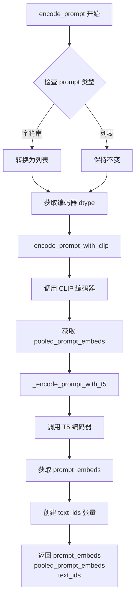

#### 带注释源码

```python
def encode_prompt(
    text_encoders,
    tokenizers,
    prompt: str,
    max_sequence_length,
    device=None,
    num_images_per_prompt: int = 1,
    text_input_ids_list=None,
):
    """
    编码文本提示为嵌入向量，同时使用 CLIP 和 T5 两种编码器。

    参数:
        text_encoders: 包含 CLIP 和 T5 文本编码器的列表
        tokenizers: 包含对应分词器的列表
        prompt: 要编码的文本提示
        max_sequence_length: T5 编码的最大序列长度
        device: 可选的计算设备
        num_images_per_prompt: 每个提示生成的图像数量
        text_input_ids_list: 可选的预分词输入 ID 列表
    """
    # 将字符串提示转换为列表，保持处理一致性
    prompt = [prompt] if isinstance(prompt, str) else prompt
    
    # 获取文本编码器的数据类型，支持分布式训练中的 DDP 包装
    if hasattr(text_encoders[0], "module"):
        dtype = text_encoders[0].module.dtype
    else:
        dtype = text_encoders[0].dtype

    # 使用 CLIP 编码器编码提示，获取池化后的嵌入向量
    # CLIP 编码器通常用于获取全局池化的文本表示
    pooled_prompt_embeds = _encode_prompt_with_clip(
        text_encoder=text_encoders[0],
        tokenizer=tokenizers[0],
        prompt=prompt,
        device=device if device is not None else text_encoders[0].device,
        num_images_per_prompt=num_images_per_prompt,
        text_input_ids=text_input_ids_list[0] if text_input_ids_list else None,
    )

    # 使用 T5 编码器编码提示，获取完整的序列嵌入
    # T5 编码器可以处理更长的序列，提供更丰富的文本表示
    prompt_embeds = _encode_prompt_with_t5(
        text_encoder=text_encoders[1],
        tokenizer=tokenizers[1],
        max_sequence_length=max_sequence_length,
        prompt=prompt,
        num_images_per_prompt=num_images_per_prompt,
        device=device if device is not None else text_encoders[1].device,
        text_input_ids=text_input_ids_list[1] if text_input_ids_list else None,
    )

    # 创建文本 ID 张量，用于 Flux 管道的位置编码
    # 形状为 (seq_len, 3)，其中 3 代表 x, y, position 维度
    text_ids = torch.zeros(prompt_embeds.shape[1], 3).to(device=device, dtype=dtype)

    # 返回三个关键组件：提示嵌入、池化嵌入和文本 ID
    return prompt_embeds, pooled_prompt_embeds, text_ids
```


### `collate_fn`

该函数是 DreamBooth 数据集的自定义批处理函数，用于将数据加载器返回的样本列表整理成训练所需的批次数据。它从每个样本中提取图像像素值和文本提示，并根据是否启用先验保留（prior preservation）来决定是否合并类别图像和提示。

参数：

- `examples`：`List[Dict]`（或 `List[dict]`），从 `DreamBoothDataset` 返回的样本列表，每个字典包含 `"instance_images"`（实例图像的像素值 tensor）、`"instance_prompt"`（实例提示字符串）等键，若启用先验保留还包含 `"class_images"` 和 `"class_prompt"`。
- `with_prior_preservation`：`bool`，默认为 `False`，标志位，指示是否在批处理中包含类别图像和类别提示以实现先验保留损失。

返回值：`Dict`，返回一个字典，包含键 `"pixel_values"`（`torch.Tensor`，形状为 `[batch_size, channels, height, width]`）和 `"prompts"`（`List[str]`，批处理中所有图像对应的文本提示列表）。

#### 流程图

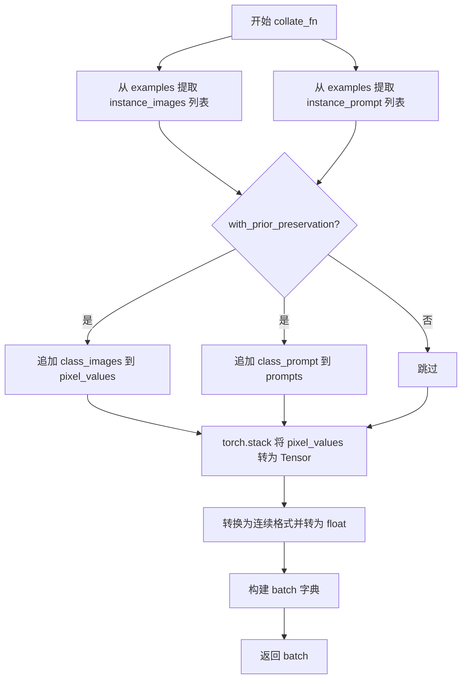

#### 带注释源码

```python
def collate_fn(examples, with_prior_preservation=False):
    """
    将数据加载器返回的样本列表整理为训练所需的批次。
    
    参数:
        examples: 从 DreamBoothDataset 获取的样本列表，每个样本是一个字典，
                  包含 'instance_images'（图像 tensor）和 'instance_prompt'（文本提示）等键。
        with_prior_preservation: 是否启用先验保留（Prior Preservation）模式。
    
    返回:
        包含 'pixel_values'（图像 tensor 批次）和 'prompts'（文本提示列表）的字典。
    """
    # 从所有样本中提取实例图像的像素值列表
    pixel_values = [example["instance_images"] for example in examples]
    # 从所有样本中提取实例提示字符串列表
    prompts = [example["instance_prompt"] for example in examples]

    # 如果启用先验保留，则将类别图像和类别提示也加入到批次中
    # 这样做可以避免进行两次前向传播，从而提高训练效率
    if with_prior_preservation:
        pixel_values += [example["class_images"] for example in examples]
        prompts += [example["class_prompt"] for example in examples]

    # 将像素值列表堆叠为 4D Tensor，形状: [batch_size, channels, height, width]
    pixel_values = torch.stack(pixel_values)
    # 转换为内存连续存储格式，并确保数据类型为 float32
    # 这样可以优化 GPU 访问性能
    pixel_values = pixel_values.to(memory_format=torch.contiguous_format).float()

    # 构建最终的训练批次字典
    batch = {"pixel_values": pixel_values, "prompts": prompts}
    return batch
```


### `main`

这是 DreamBooth Flux LoRA 训练脚本的核心函数，负责整个训练流程的协调与执行。该函数首先进行参数验证和安全检查，然后依次完成分布式训练环境设置、模型加载与配置、LoRA 适配器添加、优化器创建、数据集构建、训练循环执行以及最终模型保存与验证。

参数：

-  `args`：命令行参数对象（Namespace 类型），通过 `parse_args()` 解析得到，包含所有训练配置参数

返回值：`None`，该函数执行完整的训练流程并在训练结束后自动退出

#### 流程图

```mermaid
flowchart TD
    A[开始 main 函数] --> B{检查 wandb 和 hub_token}
    B --> C{检查 MPS + bf16 支持}
    C --> D[创建 Accelerator 分布式训练环境]
    D --> E[设置日志系统]
    E --> F[设置随机种子]
    F --> G{启用 prior preservation?}
    G -->|Yes| H[生成类图像]
    H --> I
    G -->|No| I
    I[创建输出目录和 Hub 仓库]
    I --> J[加载 CLIP 和 T5 Tokenizer]
    J --> K[导入文本编码器类]
    K --> L[加载 Scheduler、VAE、Transformer 模型]
    L --> M{启用 Textual Inversion?}
    M -->|Yes| N[初始化新 Token 和 Embedding Handler]
    N --> O
    M -->|No| O
    O[冻结不需要训练的模型参数]
    O --> P[设置混合精度训练权重类型]
    P --> Q[启用梯度检查点（可选）]
    Q --> R[配置 LoRA 目标模块]
    R --> S[添加 LoRA 适配器到 Transformer]
    S --> T{启用 Text Encoder 训练?}
    T -->|Yes| U[添加 Text Encoder LoRA]
    T -->|No| V
    U --> V
    V[注册模型保存/加载 Hook]
    W[创建 DreamBooth 数据集]
    W --> X[创建 DataLoader]
    X --> Y[配置优化器参数]
    Y --> Z[计算训练步数]
    Z --> AA[创建学习率调度器]
    AA --> AB[准备模型和优化器]
    AB --> AC[初始化训练 trackers]
    AC --> AD[训练循环开始]
    AD --> AE{检查 checkpoint 恢复}
    AE -->|Yes| AF[加载 checkpoint 状态]
    AE -->|No| AG
    AF --> AG
    AG[遍历每个 epoch]
    AG --> AH{当前 epoch < 总 epoch 数}
    AH -->|Yes| AI[设置模型为训练模式]
    AI --> AJ[遍历训练数据]
    AJ --> AK{启用梯度累积}
    AK -->|Yes| AL[累积多个 batch]
    AK -->|No| AM
    AL --> AM[编码 prompt]
    AM --> AN[将图像编码到 latent 空间]
    AN --> AO[采样噪声和时间步]
    AO --> AP[添加噪声到 latents]
    AP --> AQ[预测噪声残差]
    AQ --> AR[计算损失]
    AR --> AS{启用 Prior Preservation?}
    AS -->|Yes| AT[添加先验损失]
    AT --> AU
    AS -->|No| AU
    AU[反向传播]
    AU --> AV[梯度裁剪]
    AV --> AW[优化器更新]
    AW --> AX[学习率调度器更新]
    AX --> AY{启用 Textual Inversion?}
    AY -->|Yes| AZ[重置 embeddings]
    AZ --> BA
    AY -->|No| BA
    BA{同步梯度?}
    BA -->|Yes| BB[更新进度条]
    BB --> BC[保存 checkpoint]
    BC --> BD
    BA -->|No| BD
    BD{达到最大训练步数?}
    BD -->|Yes| BE
    BD -->|No| AJ
    BE{启用验证?}
    BE -->|Yes| BF[执行验证]
    BF --> BG
    BE -->|No| BG
    BG[等待所有进程]
    BH[保存 LoRA 权重]
    BH --> BI[保存 Textual Inversion embeddings]
    BI --> BJ[加载 pipeline 进行最终推理]
    BJ --> BK[保存模型卡片]
    BK --> BL[推送到 Hub（可选）]
    BL --> BM[结束训练]
    BM --> BN[输出训练完成信息]
```

#### 带注释源码

```python
def main(args):
    # ==========================================
    # 第一阶段：环境检查与初始化
    # ==========================================
    
    # 验证 wandb 和 hub_token 不能同时使用（安全风险）
    if args.report_to == "wandb" and args.hub_token is not None:
        raise ValueError(
            "You cannot use both --report_to=wandb and --hub_token due to a security risk of exposing your token."
            " Please use `hf auth login` to authenticate with the Hub."
        )

    # 检查 MPS 设备是否支持 bfloat16
    if torch.backends.mps.is_available() and args.mixed_precision == "bf16":
        raise ValueError(
            "Mixed precision training with bfloat16 is not supported on MPS. Please use fp16 (recommended) or fp32 instead."
        )

    # ==========================================
    # 第二阶段：Accelerator 分布式训练配置
    # ==========================================
    
    # 设置日志输出目录
    logging_dir = Path(args.output_dir, args.logging_dir)

    # 创建 Accelerator 项目配置
    accelerator_project_config = ProjectConfiguration(project_dir=args.output_dir, logging_dir=logging_dir)
    # 分布式数据并行参数
    kwargs = DistributedDataParallelKwargs(find_unused_parameters=True)
    # 初始化 Accelerator
    accelerator = Accelerator(
        gradient_accumulation_steps=args.gradient_accumulation_steps,
        mixed_precision=args.mixed_precision,
        log_with=args.report_to,
        project_config=accelerator_project_config,
        kwargs_handlers=[kwargs],
    )

    # MPS 设备禁用 AMP
    if torch.backends.mps.is_available():
        accelerator.native_amp = False

    # 检查 wandb 可用性
    if args.report_to == "wandb":
        if not is_wandb_available():
            raise ImportError("Make sure to install wandb if you want to use it for logging during training.")

    # ==========================================
    # 第三阶段：日志系统配置
    # ==========================================
    
    logging.basicConfig(
        format="%(asctime)s - %(levelname)s - %(name)s - %(message)s",
        datefmt="%m/%d/%Y %H:%M:%S",
        level=logging.INFO,
    )
    logger.info(accelerator.state, main_process_only=False)
    # 主进程设置详细日志，子进程设置错误日志
    if accelerator.is_local_main_process:
        transformers.utils.logging.set_verbosity_warning()
        diffusers.utils.logging.set_verbosity_info()
    else:
        transformers.utils.logging.set_verbosity_error()
        diffusers.utils.logging.set_verbosity_error()

    # 设置随机种子
    if args.seed is not None:
        set_seed(args.seed)

    # ==========================================
    # 第四阶段：Prior Preservation 类图像生成
    # ==========================================
    
    if args.with_prior_preservation:
        class_images_dir = Path(args.class_data_dir)
        if not class_images_dir.exists():
            class_images_dir.mkdir(parents=True)
        cur_class_images = len(list(class_images_dir.iterdir()))

        # 如果类图像不足，生成更多
        if cur_class_images < args.num_class_images:
            # 确定精度类型
            has_supported_fp16_accelerator = torch.cuda.is_available() or torch.backends.mps.is_available()
            torch_dtype = torch.float16 if has_supported_fp16_accelerator else torch.float32
            if args.prior_generation_precision == "fp32":
                torch_dtype = torch.float32
            elif args.prior_generation_precision == "fp16":
                torch_dtype = torch.float16
            elif args.prior_generation_precision == "bf16":
                torch_dtype = torch.bfloat16

            # 加载 FluxPipeline
            pipeline = FluxPipeline.from_pretrained(
                args.pretrained_model_name_or_path,
                torch_dtype=torch_dtype,
                revision=args.revision,
                variant=args.variant,
            )
            pipeline.set_progress_bar_config(disable=True)

            num_new_images = args.num_class_images - cur_class_images
            logger.info(f"Number of class images to sample: {num_new_images}.")

            # 创建数据加载器生成类图像
            sample_dataset = PromptDataset(args.class_prompt, num_new_images)
            sample_dataloader = torch.utils.data.DataLoader(sample_dataset, batch_size=args.sample_batch_size)
            sample_dataloader = accelerator.prepare(sample_dataloader)
            pipeline.to(accelerator.device)

            # 生成并保存类图像
            for example in tqdm(
                sample_dataloader, desc="Generating class images", disable=not accelerator.is_local_main_process
            ):
                with torch.autocast(device_type=accelerator.device.type, dtype=torch_dtype):
                    images = pipeline(prompt=example["prompt"]).images

                for i, image in enumerate(images):
                    hash_image = insecure_hashlib.sha1(image.tobytes()).hexdigest()
                    image_filename = class_images_dir / f"{example['index'][i] + cur_class_images}-{hash_image}.jpg"
                    image.save(image_filename)

            del pipeline
            free_memory()

    # ==========================================
    # 第五阶段：输出目录和 Hub 仓库创建
    # ==========================================
    
    if accelerator.is_main_process:
        if args.output_dir is not None:
            os.makedirs(args.output_dir, exist_ok=True)

        model_id = args.hub_model_id or Path(args.output_dir).name
        repo_id = None
        if args.push_to_hub:
            repo_id = create_repo(
                repo_id=model_id,
                exist_ok=True,
            ).repo_id

    # ==========================================
    # 第六阶段：加载 Tokenizers
    # ==========================================
    
    tokenizer_one = CLIPTokenizer.from_pretrained(
        args.pretrained_model_name_or_path,
        subfolder="tokenizer",
        revision=args.revision,
    )
    tokenizer_two = T5TokenizerFast.from_pretrained(
        args.pretrained_model_name_or_path,
        subfolder="tokenizer_2",
        revision=args.revision,
    )

    # ==========================================
    # 第七阶段：导入 Text Encoder 类
    # ==========================================
    
    text_encoder_cls_one = import_model_class_from_model_name_or_path(
        args.pretrained_model_name_or_path, args.revision
    )
    text_encoder_cls_two = import_model_class_from_model_name_or_path(
        args.pretrained_model_name_or_path, args.revision, subfolder="text_encoder_2"
    )

    # ==========================================
    # 第八阶段：加载 Scheduler 和模型
    # ==========================================
    
    noise_scheduler = FlowMatchEulerDiscreteScheduler.from_pretrained(
        args.pretrained_model_name_or_path, subfolder="scheduler"
    )
    noise_scheduler_copy = copy.deepcopy(noise_scheduler)
    text_encoder_one, text_encoder_two = load_text_encoders(text_encoder_cls_one, text_encoder_cls_two)
    vae = AutoencoderKL.from_pretrained(
        args.pretrained_model_name_or_path,
        subfolder="vae",
        revision=args.revision,
        variant=args.variant,
    )
    transformer = FluxTransformer2DModel.from_pretrained(
        args.pretrained_model_name_or_path, subfolder="transformer", revision=args.revision, variant=args.variant
    )

    # ==========================================
    # 第九阶段：Textual Inversion Token 初始化
    # ==========================================
    
    if args.train_text_encoder_ti:
        # 解析 token abstraction 列表
        token_abstraction_list = [place_holder.strip() for place_holder in re.split(r",\s*", args.token_abstraction)]
        logger.info(f"list of token identifiers: {token_abstraction_list}")

        # 计算每个 abstraction 的 token 数量
        if args.initializer_concept is None:
            num_new_tokens_per_abstraction = (
                2 if args.num_new_tokens_per_abstraction is None else args.num_new_tokens_per_abstraction
            )
        else:
            token_ids = tokenizer_one.encode(args.initializer_concept, add_special_tokens=False)
            num_new_tokens_per_abstraction = len(token_ids)
            if args.enable_t5_ti:
                token_ids_t5 = tokenizer_two.encode(args.initializer_concept, add_special_tokens=False)
                num_new_tokens_per_abstraction = max(len(token_ids), len(token_ids_t5))

        # 构建 token abstraction 字典
        token_abstraction_dict = {}
        token_idx = 0
        for i, token in enumerate(token_abstraction_list):
            token_abstraction_dict[token] = [f"<s{token_idx + i + j}>" for j in range(num_new_tokens_per_abstraction)]
            token_idx += num_new_tokens_per_abstraction - 1

        # 替换 prompt 中的 token
        for token_abs, token_replacement in token_abstraction_dict.items():
            new_instance_prompt = args.instance_prompt.replace(token_abs, "".join(token_replacement))
            if args.instance_prompt == new_instance_prompt:
                logger.warning(
                    "Note! the instance prompt provided in --instance_prompt does not include the token abstraction specified "
                    "--token_abstraction. This may lead to incorrect optimization of text embeddings during pivotal tuning"
                )
            args.instance_prompt = new_instance_prompt
            if args.with_prior_preservation:
                args.class_prompt = args.class_prompt.replace(token_abs, "".join(token_replacement))
            if args.validation_prompt:
                args.validation_prompt = args.validation_prompt.replace(token_abs, "".join(token_replacement))

        # 初始化新 tokens
        text_encoders = [text_encoder_one, text_encoder_two] if args.enable_t5_ti else [text_encoder_one]
        tokenizers = [tokenizer_one, tokenizer_two] if args.enable_t5_ti else [tokenizer_one]
        embedding_handler = TokenEmbeddingsHandler(text_encoders, tokenizers)
        inserting_toks = []
        for new_tok in token_abstraction_dict.values():
            inserting_toks.extend(new_tok)
        embedding_handler.initialize_new_tokens(inserting_toks=inserting_toks)

    # ==========================================
    # 第十阶段：冻结模型参数
    # ==========================================
    
    transformer.requires_grad_(False)
    vae.requires_grad_(False)
    text_encoder_one.requires_grad_(False)
    text_encoder_two.requires_grad_(False)

    # 设置权重数据类型
    weight_dtype = torch.float32
    if accelerator.mixed_precision == "fp16":
        weight_dtype = torch.float16
    elif accelerator.mixed_precision == "bf16":
        weight_dtype = torch.bfloat16

    # 检查 bf16 在 MPS 上的支持
    if torch.backends.mps.is_available() and weight_dtype == torch.bfloat16:
        raise ValueError(
            "Mixed precision training with bfloat16 is not supported on MPS. Please use fp16 (recommended) or fp32 instead."
        )

    # 将模型移到设备
    vae.to(accelerator.device, dtype=weight_dtype)
    transformer.to(accelerator.device, dtype=weight_dtype)
    text_encoder_one.to(accelerator.device, dtype=weight_dtype)
    text_encoder_two.to(accelerator.device, dtype=weight_dtype)

    # 梯度检查点
    if args.gradient_checkpointing:
        transformer.enable_gradient_checkpointing()
        if args.train_text_encoder:
            text_encoder_one.gradient_checkpointing_enable()

    # ==========================================
    # 第十一阶段：LoRA 配置
    # ==========================================
    
    if args.lora_layers is not None:
        target_modules = [layer.strip() for layer in args.lora_layers.split(",")]
    else:
        target_modules = [
            "attn.to_k", "attn.to_q", "attn.to_v", "attn.to_out.0",
            "attn.add_k_proj", "attn.add_q_proj", "attn.add_v_proj", "attn.to_add_out",
            "ff.net.0.proj", "ff.net.2", "ff_context.net.0.proj", "ff_context.net.2",
        ]

    # Transformer LoRA 配置
    transformer_lora_config = LoraConfig(
        r=args.rank,
        lora_alpha=args.lora_alpha,
        lora_dropout=args.lora_dropout,
        init_lora_weights="gaussian",
        target_modules=target_modules,
    )
    transformer.add_adapter(transformer_lora_config)

    # Text Encoder LoRA（可选）
    if args.train_text_encoder:
        text_lora_config = LoraConfig(
            r=args.rank,
            lora_alpha=args.lora_alpha,
            lora_dropout=args.lora_dropout,
            init_lora_weights="gaussian",
            target_modules=["q_proj", "k_proj", "v_proj", "out_proj"],
        )
        text_encoder_one.add_adapter(text_lora_config)

    # ==========================================
    # 第十二阶段：保存/加载 Hook 注册
    # ==========================================
    
    def unwrap_model(model):
        model = accelerator.unwrap_model(model)
        model = model._orig_mod if is_compiled_module(model) else model
        return model

    def save_model_hook(models, weights, output_dir):
        if accelerator.is_main_process:
            transformer_lora_layers_to_save = None
            text_encoder_one_lora_layers_to_save = None
            modules_to_save = {}
            for model in models:
                if isinstance(model, type(unwrap_model(transformer))):
                    transformer_lora_layers_to_save = get_peft_model_state_dict(model)
                    modules_to_save["transformer"] = model
                elif isinstance(model, type(unwrap_model(text_encoder_one))):
                    if args.train_text_encoder:
                        text_encoder_one_lora_layers_to_save = get_peft_model_state_dict(model)
                        modules_to_save["text_encoder"] = model

            # 保存 LoRA 权重
            FluxPipeline.save_lora_weights(
                output_dir,
                transformer_lora_layers=transformer_lora_layers_to_save,
                text_encoder_lora_layers=text_encoder_one_lora_layers_to_save,
                **_collate_lora_metadata(modules_to_save),
            )
        
        # 保存 Textual Inversion embeddings
        if args.train_text_encoder_ti:
            embedding_handler.save_embeddings(f"{args.output_dir}/{Path(args.output_dir).name}_emb.safetensors")

    def load_model_hook(models, input_dir):
        # ... 加载逻辑（省略详细实现）
        pass

    accelerator.register_save_state_pre_hook(save_model_hook)
    accelerator.register_load_state_pre_hook(load_model_hook)

    # ==========================================
    # 第十三阶段：优化器配置
    # ==========================================
    
    # 学习率缩放
    if args.scale_lr:
        args.learning_rate = (
            args.learning_rate * args.gradient_accumulation_steps * args.train_batch_size * accelerator.num_processes
        )

    # 确保可训练参数为 float32
    if args.mixed_precision == "fp16":
        models = [transformer]
        if args.train_text_encoder:
            models.extend([text_encoder_one])
        cast_training_params(models, dtype=torch.float32)

    # 获取可训练参数
    transformer_lora_parameters = list(filter(lambda p: p.requires_grad, transformer.parameters()))
    if args.train_text_encoder:
        text_lora_parameters_one = list(filter(lambda p: p.requires_grad, text_encoder_one.parameters()))
    elif args.train_text_encoder_ti:
        # Textual Inversion 只训练 token embeddings
        text_lora_parameters_one = []
        for name, param in text_encoder_one.named_parameters():
            if "token_embedding" in name:
                if args.mixed_precision == "fp16":
                    param.data = param.to(dtype=torch.float32)
                param.requires_grad = True
                text_lora_parameters_one.append(param)
            else:
                param.requires_grad = False

    # 确定是否冻结 text encoder
    freeze_text_encoder = not (args.train_text_encoder or args.train_text_encoder_ti)
    pure_textual_inversion = args.train_text_encoder_ti and args.train_transformer_frac == 0

    # 构建优化器参数
    transformer_parameters_with_lr = {"params": transformer_lora_parameters, "lr": args.learning_rate}
    if not freeze_text_encoder:
        text_parameters_one_with_lr = {
            "params": text_lora_parameters_one,
            "weight_decay": args.adam_weight_decay_text_encoder or args.adam_weight_decay,
            "lr": args.text_encoder_lr,
        }
        # 根据不同训练模式构建参数列表（省略详细分支）
        params_to_optimize = [transformer_parameters_with_lr, text_parameters_one_with_lr]
    else:
        params_to_optimize = [transformer_parameters_with_lr]

    # 创建优化器
    if args.optimizer.lower() == "adamw":
        if args.use_8bit_adam:
            import bitsandbytes as bnb
            optimizer_class = bnb.optim.AdamW8bit
        else:
            optimizer_class = torch.optim.AdamW
        optimizer = optimizer_class(
            params_to_optimize,
            betas=(args.adam_beta1, args.adam_beta2),
            weight_decay=args.adam_weight_decay,
            eps=args.adam_epsilon,
        )
    elif args.optimizer.lower() == "prodigy":
        import prodigyopt
        optimizer = prodigyopt.Prodigy(
            params_to_optimize,
            betas=(args.adam_beta1, args.adam_beta2),
            weight_decay=args.adam_weight_decay,
            eps=args.adam_epsilon,
        )

    # ==========================================
    # 第十四阶段：数据集与 DataLoader
    # ==========================================
    
    train_dataset = DreamBoothDataset(
        args=args,
        instance_data_root=args.instance_data_dir,
        instance_prompt=args.instance_prompt,
        train_text_encoder_ti=args.train_text_encoder_ti,
        token_abstraction_dict=token_abstraction_dict if args.train_text_encoder_ti else None,
        class_prompt=args.class_prompt,
        class_data_root=args.class_data_dir if args.with_prior_preservation else None,
        class_num=args.num_class_images,
        size=args.resolution,
        repeats=args.repeats,
    )

    train_dataloader = torch.utils.data.DataLoader(
        train_dataset,
        batch_size=args.train_batch_size,
        shuffle=True,
        collate_fn=lambda examples: collate_fn(examples, args.with_prior_preservation),
        num_workers=args.dataloader_num_workers,
    )

    # 预计算 text embeddings（如果 text encoder 被冻结）
    if freeze_text_encoder and not train_dataset.custom_instance_prompts:
        # 预计算 instance 和 class prompt embeddings
        instance_prompt_hidden_states, instance_pooled_prompt_embeds, instance_text_ids = compute_text_embeddings(
            args.instance_prompt, text_encoders, tokenizers
        )

    # 缓存 latents（可选）
    if args.cache_latents:
        latents_cache = []
        for batch in tqdm(train_dataloader, desc="Caching latents"):
            with torch.no_grad():
                batch["pixel_values"] = batch["pixel_values"].to(
                    accelerator.device, non_blocking=True, dtype=weight_dtype
                )
                latents_cache.append(vae.encode(batch["pixel_values"]).latent_dist)

    # ==========================================
    # 第十五阶段：学习率调度器
    # ==========================================
    
    num_warmup_steps_for_scheduler = args.lr_warmup_steps * accelerator.num_processes
    if args.max_train_steps is None:
        len_train_dataloader_after_sharding = math.ceil(len(train_dataloader) / accelerator.num_processes)
        num_update_steps_per_epoch = math.ceil(len_train_dataloader_after_sharding / args.gradient_accumulation_steps)
        num_training_steps_for_scheduler = (
            args.num_train_epochs * accelerator.num_processes * num_update_steps_per_epoch
        )
    else:
        num_training_steps_for_scheduler = args.max_train_steps * accelerator.num_processes

    lr_scheduler = get_scheduler(
        args.lr_scheduler,
        optimizer=optimizer,
        num_warmup_steps=num_warmup_steps_for_scheduler,
        num_training_steps=num_training_steps_for_scheduler,
        num_cycles=args.lr_num_cycles,
        power=args.lr_power,
    )

    # ==========================================
    # 第十六阶段：准备模型
    # ==========================================
    
    if not freeze_text_encoder:
        if args.enable_t5_ti:
            transformer, text_encoder_one, text_encoder_two, optimizer, train_dataloader, lr_scheduler = accelerator.prepare(
                transformer, text_encoder_one, text_encoder_two, optimizer, train_dataloader, lr_scheduler
            )
        else:
            transformer, text_encoder_one, optimizer, train_dataloader, lr_scheduler = accelerator.prepare(
                transformer, text_encoder_one, optimizer, train_dataloader, lr_scheduler
            )
    else:
        transformer, optimizer, train_dataloader, lr_scheduler = accelerator.prepare(
            transformer, optimizer, train_dataloader, lr_scheduler
        )

    # 重新计算训练步数
    num_update_steps_per_epoch = math.ceil(len(train_dataloader) / args.gradient_accumulation_steps)
    if args.max_train_steps is None:
        args.max_train_steps = args.num_train_epochs * num_update_steps_per_epoch

    # 初始化 trackers
    if accelerator.is_main_process:
        tracker_name = "dreambooth-flux-dev-lora-advanced"
        accelerator.init_trackers(tracker_name, config=vars(args))

    # ==========================================
    # 第十七阶段：训练循环
    # ==========================================
    
    total_batch_size = args.train_batch_size * accelerator.num_processes * args.gradient_accumulation_steps

    logger.info("***** Running training *****")
    logger.info(f"  Num examples = {len(train_dataset)}")
    logger.info(f"  Num batches each epoch = {len(train_dataloader)}")
    logger.info(f"  Num Epochs = {args.num_train_epochs}")
    logger.info(f"  Instantaneous batch size per device = {args.train_batch_size}")
    logger.info(f"  Total train batch size = {total_batch_size}")
    logger.info(f"  Gradient Accumulation steps = {args.gradient_accumulation_steps}")
    logger.info(f"  Total optimization steps = {args.max_train_steps}")

    global_step = 0
    first_epoch = 0

    # 从 checkpoint 恢复（可选）
    if args.resume_from_checkpoint:
        # 加载 checkpoint 逻辑...
        pass

    progress_bar = tqdm(
        range(0, args.max_train_steps),
        initial=initial_global_step,
        desc="Steps",
        disable=not accelerator.is_local_main_process,
    )

    # 训练循环
    for epoch in range(first_epoch, args.num_train_epochs):
        transformer.train()
        
        for step, batch in enumerate(train_dataloader):
            with accelerator.accumulate(models_to_accumulate):
                # 编码 prompt
                prompts = batch["prompts"]
                
                # 将图像编码到 latent 空间
                if args.cache_latents:
                    model_input = latents_cache[step].sample()
                else:
                    pixel_values = batch["pixel_values"].to(dtype=vae.dtype)
                    model_input = vae.encode(pixel_values).latent_dist.sample()
                
                model_input = (model_input - vae_config_shift_factor) * vae_config_scaling_factor
                model_input = model_input.to(dtype=weight_dtype)

                # 准备 latent image IDs
                latent_image_ids = FluxPipeline._prepare_latent_image_ids(...)

                # 采样噪声和时间步
                noise = torch.randn_like(model_input)
                u = compute_density_for_timestep_sampling(...)
                indices = (u * noise_scheduler_copy.config.num_train_timesteps).long()
                timesteps = noise_scheduler_copy.timesteps[indices].to(device=model_input.device)

                # 添加噪声
                sigmas = get_sigmas(timesteps, ...)
                noisy_model_input = (1.0 - sigmas) * model_input + sigmas * noise

                # 预测噪声残差
                model_pred = transformer(
                    hidden_states=packed_noisy_model_input,
                    timestep=timesteps / 1000,
                    guidance=guidance,
                    pooled_projections=pooled_prompt_embeds,
                    encoder_hidden_states=prompt_embeds,
                    txt_ids=text_ids,
                    img_ids=latent_image_ids,
                    return_dict=False,
                )[0]

                # 计算损失
                weighting = compute_loss_weighting_for_sd3(...)
                target = noise - model_input
                loss = torch.mean((weighting.float() * (model_pred.float() - target.float()) ** 2).reshape(target.shape[0], -1), 1)
                loss = loss.mean()

                # Prior preservation loss（可选）
                if args.with_prior_preservation:
                    loss = loss + args.prior_loss_weight * prior_loss

                # 反向传播
                accelerator.backward(loss)
                
                # 梯度裁剪
                if accelerator.sync_gradients:
                    accelerator.clip_grad_norm_(params_to_clip, args.max_grad_norm)

                # 优化器更新
                optimizer.step()
                lr_scheduler.step()
                optimizer.zero_grad()

                # Textual Inversion embedding 重置
                if args.train_text_encoder_ti:
                    embedding_handler.retract_embeddings()

            # 梯度同步时保存 checkpoint
            if accelerator.sync_gradients:
                progress_bar.update(1)
                global_step += 1

                if accelerator.is_main_process and global_step % args.checkpointing_steps == 0:
                    save_path = os.path.join(args.output_dir, f"checkpoint-{global_step}")
                    accelerator.save_state(save_path)

                accelerator.log({"loss": loss.detach().item(), "lr": lr_scheduler.get_last_lr()[0]}, step=global_step)

            if global_step >= args.max_train_steps:
                break

    # ==========================================
    # 第十八阶段：最终保存与验证
    # ==========================================
    
    accelerator.wait_for_everyone()
    if accelerator.is_main_process:
        # 保存 LoRA 权重
        transformer_lora_layers = get_peft_model_state_dict(transformer)
        FluxPipeline.save_lora_weights(...)

        # 保存 Textual Inversion embeddings
        if args.train_text_encoder_ti:
            embedding_handler.save_embeddings(embeddings_path)

        # 最终推理验证
        pipeline = FluxPipeline.from_pretrained(...)
        if not pure_textual_inversion:
            pipeline.load_lora_weights(args.output_dir)

        if args.validation_prompt:
            images = log_validation(...)

        # 保存模型卡片
        save_model_card(...)

        # 推送到 Hub
        if args.push_to_hub:
            upload_folder(...)

    accelerator.end_training()
```


### `TokenEmbeddingsHandler.initialize_new_tokens`

该方法用于在文本倒排（Textual Inversion）或关键调优（pivotal tuning）训练过程中，初始化新添加的特殊token。它将这些token添加到tokenizer，调整text encoder的embedding层大小，并根据配置使用随机初始化或基于给定概念词（initializer_concept）初始化新token的embedding向量。

参数：

- `inserting_toks`：`List[str]`，需要插入的特殊token列表，例如 `["<s0>", "<s1>"]`

返回值：`None`，该方法无返回值，直接修改对象内部状态

#### 流程图

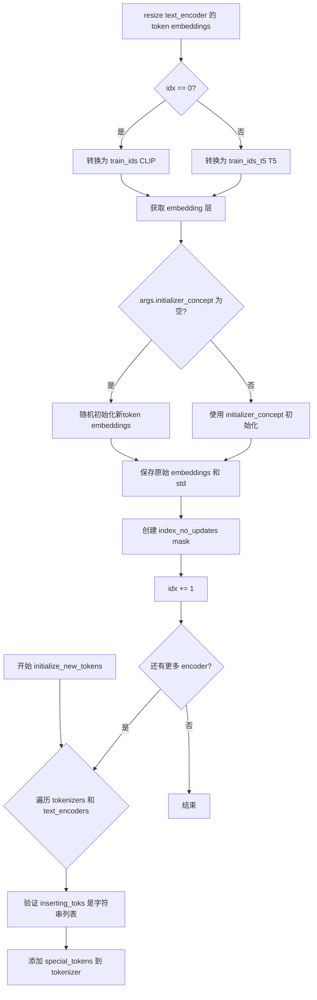

#### 带注释源码

```python
def initialize_new_tokens(self, inserting_toks: List[str]):
    """
    初始化新添加的特殊token：
    1. 将token添加到tokenizer
    2. 扩展text encoder的embedding层
    3. 初始化新token的embeddings
    4. 保存原始embeddings用于后续恢复
    """
    idx = 0  # 索引用于区分CLIP(0)和T5(1) encoder
    
    # 遍历所有的tokenizer和text_encoder对（CLIP和可能启用的T5）
    for tokenizer, text_encoder in zip(self.tokenizers, self.text_encoders):
        # 参数校验：确保inserting_toks是字符串列表
        assert isinstance(inserting_toks, list), "inserting_toks should be a list of strings."
        assert all(isinstance(tok, str) for tok in inserting_toks), (
            "All elements in inserting_toks should be strings."
        )

        # 保存要插入的tokens列表
        self.inserting_toks = inserting_toks
        
        # 创建特殊token字典并添加到tokenizer
        special_tokens_dict = {"additional_special_tokens": self.inserting_toks}
        tokenizer.add_special_tokens(special_tokens_dict)
        
        # 调整text encoder的token embeddings大小以匹配tokenizer新增的token
        text_encoder.resize_token_embeddings(len(tokenizer))

        # 将token abstractions转换为对应的token ids
        if idx == 0:
            # CLIP encoder的token ids
            self.train_ids = tokenizer.convert_tokens_to_ids(self.inserting_toks)
        else:
            # T5 encoder的token ids
            self.train_ids_t5 = tokenizer.convert_tokens_to_ids(self.inserting_toks)

        # 获取对应encoder的embedding层
        # CLIP使用text_model.embeddings.token_embedding
        # T5使用encoder.embed_tokens
        embeds = (
            text_encoder.text_model.embeddings.token_embedding if idx == 0 else text_encoder.encoder.embed_tokens
        )
        
        # 计算现有token embeddings的标准差，用于新token初始化
        std_token_embedding = embeds.weight.data.std()

        logger.info(f"{idx} text encoder's std_token_embedding: {std_token_embedding}")

        # 根据索引选择对应的train_ids
        train_ids = self.train_ids if idx == 0 else self.train_ids_t5
        
        # 如果没有提供initializer_concept，则使用随机初始化
        if args.initializer_concept is None:
            # 获取对应encoder的hidden_size
            hidden_size = (
                text_encoder.text_model.config.hidden_size if idx == 0 else text_encoder.encoder.config.hidden_size
            )
            # 使用随机初始化，保持与原有embedding相同的标准差
            embeds.weight.data[train_ids] = (
                torch.randn(len(train_ids), hidden_size).to(device=self.device).to(dtype=self.dtype)
                * std_token_embedding
            )
        else:
            # 将initializer_concept转换为token ids用于初始化
            initializer_token_ids = tokenizer.encode(args.initializer_concept, add_special_tokens=False)
            # 使用initializer_concept的embedding初始化新token
            for token_idx, token_id in enumerate(train_ids):
                # 循环使用initializer_token_ids如果数量不够
                embeds.weight.data[token_id] = (embeds.weight.data)[
                    initializer_token_ids[token_idx % len(initializer_token_ids)]
                ].clone()

        # 保存原始embeddings用于后续恢复/回缩
        self.embeddings_settings[f"original_embeddings_{idx}"] = embeds.weight.data.clone()
        self.embeddings_settings[f"std_token_embedding_{idx}"] = std_token_embedding

        # 创建mask：标记哪些token不应该被更新（除了新添加的token）
        # 默认为True（不更新），将新token位置设为False（允许更新）
        index_no_updates = torch.ones((len(tokenizer),), dtype=torch.bool)
        index_no_updates[train_ids] = False

        self.embeddings_settings[f"index_no_updates_{idx}"] = index_no_updates

        logger.info(self.embeddings_settings[f"index_no_updates_{idx}"].shape)

        idx += 1
```


### `TokenEmbeddingsHandler.save_embeddings`

该方法用于将文本编码器中新添加的 token（用于文本反转/关键调优）的 embeddings 保存到 safetensors 文件中。它遍历所有文本编码器（CLIP 和 T5），提取新 token 对应的 embedding 向量，并以键名 "clip_l" 和 "t5" 分别保存。

参数：

- `file_path`：`str`，要保存的 safetensors 文件路径

返回值：`None`，无返回值（直接将 embeddings 写入文件）

#### 流程图

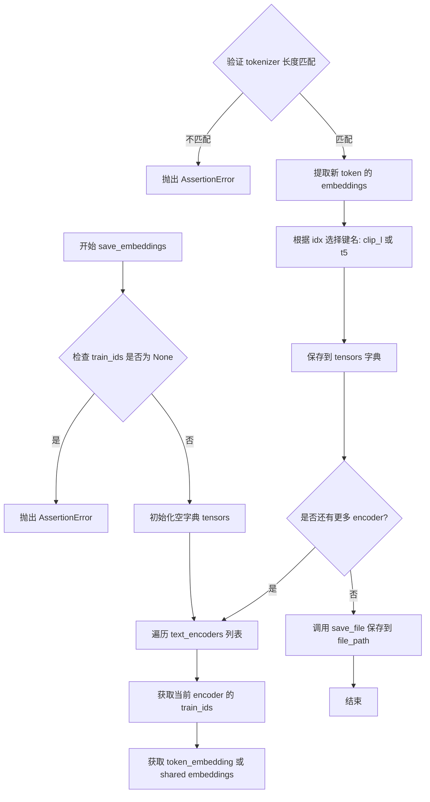

#### 带注释源码

```python
def save_embeddings(self, file_path: str):
    """
    将新添加的 token embeddings 保存到 safetensors 文件中。
    
    参数:
        file_path: str - 保存路径，例如 'embeddings.safetensors'
    """
    # 断言确保已经初始化了新 tokens
    assert self.train_ids is not None, "Initialize new tokens before saving embeddings."
    
    # 用于存储 embeddings 的字典
    tensors = {}
    
    # 映射 text encoder 索引到名称: idx==0 是 CLIP (clip_l), idx==1 是 T5 (t5)
    idx_to_text_encoder_name = {0: "clip_l", 1: "t5"}
    
    # 遍历所有文本编码器 (CLIP 和 T5)
    for idx, text_encoder in enumerate(self.text_encoders):
        # 获取对应 encoder 的 train_ids (CLIP 用 train_ids, T5 用 train_ids_t5)
        train_ids = self.train_ids if idx == 0 else self.train_ids_t5
        
        # 获取 embeddings: CLIP 使用 token_embedding, T5 使用 shared
        embeds = text_encoder.text_model.embeddings.token_embedding if idx == 0 else text_encoder.shared
        
        # 验证 tokenizer 长度与 embedding 维度匹配
        assert embeds.weight.data.shape[0] == len(self.tokenizers[idx]), "Tokenizers should be the same."
        
        # 提取新添加 token 的 embedding 向量
        new_token_embeddings = embeds.weight.data[train_ids]

        # 使用约定的键名保存: "clip_l" (CLIP) 或 "t5" (T5)
        # 注意: 使用 diffusers 加载时，键名可以自定义，只需在推理时指定
        tensors[idx_to_text_encoder_name[idx]] = new_token_embeddings
        # 也可以使用备用键名: tensors[f"text_encoders_{idx}"] = new_token_embeddings

    # 使用 safetensors 格式保存到文件
    save_file(tensors, file_path)
```


### `TokenEmbeddingsHandler.retract_embeddings`

该方法用于在训练过程中将文本编码器的Token嵌入恢复到原始状态，并对更新的嵌入进行标准化调整，以确保嵌入向量的标准差与训练前一致。

参数：
- 无显式参数（仅使用 `self`）

返回值：`None`，该方法无返回值，直接修改对象内部状态

#### 流程图

```mermaid
flowchart TD
    A([开始 retract_embeddings]) --> B[遍历 self.text_encoders]
    B --> C{遍历结束?}
    C -->|否| D[获取当前索引 idx 和 text_encoder]
    D --> E{idx == 0?}
    E -->|是| F[获取 CLIP text_encoder 的 token_embedding]
    E -->|否| G[获取 T5 text_encoder 的 shared 嵌入]
    F --> H[获取 index_no_updates 索引]
    G --> H
    H --> I[恢复未更新位置的嵌入权重<br/>使用 original_embeddings]
    I --> J[获取 std_token_embedding]
    J --> K[计算更新位置的索引: index_updates = ~index_no_updates]
    K --> L[获取更新后的嵌入向量]
    L --> M[计算标准差比率: off_ratio = std / new_std]
    M --> N[应用调整: new_embeddings * (off_ratio^0.1)]
    N --> O[保存调整后的嵌入权重]
    O --> B
    C -->|是| P([结束])
```

#### 带注释源码

```python
@torch.no_grad()  # 禁用梯度计算，减少内存占用
def retract_embeddings(self):
    """
    恢复文本编码器的token嵌入到原始状态，并对更新的嵌入进行标准化。
    该方法在每个训练步骤后调用，以确保嵌入权重的稳定性。
    """
    # 遍历所有文本编码器（CLIP 和 T5）
    for idx, text_encoder in enumerate(self.text_encoders):
        # 根据索引选择对应的嵌入层
        # idx==0: CLIP ViT-L/14 文本编码器
        # idx==1: T5 XXL 文本编码器
        embeds = text_encoder.text_model.embeddings.token_embedding if idx == 0 else text_encoder.shared
        
        # 获取不应被更新的token索引（新增的token除外）
        index_no_updates = self.embeddings_settings[f"index_no_updates_{idx}"]
        
        # 将未更新的嵌入恢复为原始值
        # 原始嵌入在 initialize_new_tokens 时被保存
        embeds.weight.data[index_no_updates] = (
            self.embeddings_settings[f"original_embeddings_{idx}"][index_no_updates]
            .to(device=text_encoder.device)  # 确保设备一致
            .to(dtype=text_encoder.dtype)    # 确保数据类型一致
        )

        # 获取训练前的token嵌入标准差
        std_token_embedding = self.embeddings_settings[f"std_token_embedding_{idx}"]

        # 获取需要更新的token索引（新增的token）
        index_updates = ~index_no_updates
        new_embeddings = embeds.weight.data[index_updates]
        
        # 计算当前标准差与原始标准差的比率
        # 用于归一化更新后的嵌入
        off_ratio = std_token_embedding / new_embeddings.std()

        # 应用调整系数 (off_ratio^0.1) 来平滑地调整标准差
        # 0.1 是一个经验值，用于避免过大的变化
        new_embeddings = new_embeddings * (off_ratio**0.1)
        
        # 保存调整后的嵌入权重
        embeds.weight.data[index_updates] = new_embeddings
```


### `TokenEmbeddingsHandler.dtype`

该属性是 `TokenEmbeddingsHandler` 类的一个只读属性，用于获取文本编码器的数据类型（dtype）。它返回第一个文本编码器（CLIP 文本编码器）的数据类型，通常用于确保新插入的 token embedding 与模型其他部分的数据类型保持一致。

参数：无（这是一个属性，不接受参数）

返回值：`torch.dtype`，第一个文本编码器（`text_encoders[0]`，即 CLIP 文本编码器）的数据类型

#### 流程图

```mermaid
flowchart TD
    A[访问 TokenEmbeddingsHandler.dtype 属性] --> B{获取 text_encoders 列表}
    B --> C[返回 text_encoders[0].dtype]
    C --> D[返回类型: torch.dtype]
    
    style A fill:#f9f,stroke:#333
    style C fill:#9f9,stroke:#333
    style D fill:#9ff,stroke:#333
```

#### 带注释源码

```python
@property
def dtype(self):
    """
    获取第一个文本编码器（CLIP 文本编码器）的数据类型（dtype）。
    
    此属性用于确保新插入的 token embeddings 与模型其他部分
    保持一致的精度（如 float32、float16 或 bfloat16）。
    
    Returns:
        torch.dtype: 第一个文本编码器（CLIP 文本编码器）的数据类型
    """
    return self.text_encoders[0].dtype
```

#### 使用场景说明

该属性在 `TokenEmbeddingsHandler` 类中的 `initialize_new_tokens` 方法中被使用，用于初始化新插入 token 的 embeddings：

```python
# 代码中使用 dtype 属性的示例（来自 initialize_new_tokens 方法）
embeds.weight.data[train_ids] = (
    torch.randn(len(train_ids), hidden_size).to(device=self.device).to(dtype=self.dtype)
    * std_token_embedding
)
```

这确保了新生成的随机 embedding 与文本编码器模型使用相同的数据类型，从而避免精度不匹配导致的训练问题。


### `TokenEmbeddingsHandler.device`

该属性是 `TokenEmbeddingsHandler` 类的一个只读属性，用于获取文本编码器所在的计算设备（device）。它通过 `@property` 装饰器实现，返回第一个文本编码器（`text_encoders[0]`）所关联的设备，通常是 CUDA 设备或 CPU。

参数：

- （无参数，这是一个属性而非方法）

返回值：`torch.device`，返回文本编码器所在的设备（如 `cuda:0`、`cpu` 等）

#### 流程图

```mermaid
flowchart TD
    A[访问 device 属性] --> B{检查 text_encoders 是否存在}
    B -->|是| C[返回 text_encoders[0].device]
    B -->|否| D[可能抛出异常]
```

#### 带注释源码

```python
@property
def device(self):
    """
    属性：获取文本编码器所在的设备
    
    返回第一个文本编码器 (text_encoders[0]) 所关联的设备。
    这是一个便捷属性，用于在训练过程中获取模型所在的计算设备，
    避免在多处直接访问 text_encoders[0].device。
    
    Returns:
        torch.device: 文本编码器所在的设备 (如 cuda:0, cpu 等)
    """
    return self.text_encoders[0].device
```


### `DreamBoothDataset.__init__`

该方法是 DreamBoothDataset 类的初始化函数，用于准备 DreamBooth 训练所需的实例图像和类别图像，并进行图像预处理（调整大小、裁剪、翻转、归一化）。

参数：

-  `args`：命令行参数对象，包含数据集名称、配置、缓存目录、图像列名、标题列名、是否中心裁剪、随机翻转、图像插值模式等配置。
-  `instance_data_root`：`str`，实例图像所在的本地目录路径。
-  `instance_prompt`：`str`，用于描述实例的提示词。
-  `class_prompt`：`str`，用于描述类别图像的提示词。
-  `train_text_encoder_ti`：`bool`，是否启用文本编码器的文本反转（Textual Inversion）训练。
-  `token_abstraction_dict`：`Optional[Dict]`，令牌抽象字典，用于将提示词中的占位符替换为训练的新令牌（仅在 `train_text_encoder_ti` 为 True 时使用）。
-  `class_data_root`：`Optional[str]`，类别图像所在的目录路径（当启用 prior preservation 时使用）。
-  `class_num`：`Optional[int]`，类别图像的最大数量。
-  `size`：`int`，图像的目标分辨率，默认为 1024。
-  `repeats`：`int`，训练数据重复次数，默认为 1。

返回值：`None`，该方法不返回任何值，仅初始化实例属性。

#### 流程图

```mermaid
flowchart TD
    A[开始 __init__] --> B[设置基础属性<br/>size, instance_prompt, class_prompt, token_abstraction_dict, train_text_encoder_ti]
    B --> C{args.dataset_name<br/>是否为空}
    C -->|否| D[从本地目录加载实例图像]
    C -->|是| E[使用 datasets 库加载数据集]
    E --> F[获取 image_column 和 caption_column]
    F --> G{caption_column<br/>是否存在}
    G -->|是| H[加载自定义提示词并根据 repeats 扩展]
    G -->|否| I[设置 custom_instance_prompts 为 None]
    D --> J[根据 repeats 扩展实例图像列表]
    H --> J
    I --> J
    J --> K[构建图像变换 pipeline<br/>Resize, Crop, Flip, ToTensor, Normalize]
    K --> L[遍历实例图像进行预处理]
    L --> M[图像 EXIF 转置<br/>RGB 转换<br/>Resize<br/>Flip<br/>Crop<br/>ToTensor + Normalize]
    M --> N[将处理后的像素值添加到 pixel_values 列表]
    N --> O[设置 num_instance_images 和 _length]
    O --> P{class_data_root<br/>是否提供}
    P -->|是| Q[加载类别图像路径列表<br/>设置 num_class_images]
    P -->|否| R[设置 class_data_root 为 None]
    Q --> S[更新 _length 为 max(num_class_images, num_instance_images)]
    R --> S
    S --> T[构建图像变换用于类别图像<br/>image_transforms]
    T --> U[结束 __init__]
```

#### 带注释源码

```python
def __init__(
    self,
    args,
    instance_data_root,
    instance_prompt,
    class_prompt,
    train_text_encoder_ti,
    token_abstraction_dict=None,  # token mapping for textual inversion
    class_data_root=None,
    class_num=None,
    size=1024,
    repeats=1,
):
    # 1. 设置基础属性
    self.size = size
    self.instance_prompt = instance_prompt
    self.custom_instance_prompts = None
    self.class_prompt = class_prompt
    self.token_abstraction_dict = token_abstraction_dict
    self.train_text_encoder_ti = train_text_encoder_ti

    # 2. 根据数据来源加载实例图像和提示词
    # 如果提供了 --dataset_name，则使用 huggingface datasets 库加载
    if args.dataset_name is not None:
        try:
            from datasets import load_dataset
        except ImportError:
            raise ImportError(
                "You are trying to load your data using the datasets library. If you wish to train using custom "
                "captions please install the datasets library: `pip install datasets`. If you wish to load a "
                "local folder containing images only, specify --instance_data_dir instead."
            )
        
        # 下载并加载数据集
        dataset = load_dataset(
            args.dataset_name,
            args.dataset_config_name,
            cache_dir=args.cache_dir,
        )
        
        # 获取数据集列名
        column_names = dataset["train"].column_names

        # 确定图像列名
        if args.image_column is None:
            image_column = column_names[0]
            logger.info(f"image column defaulting to {image_column}")
        else:
            image_column = args.image_column
            if image_column not in column_names:
                raise ValueError(
                    f"`--image_column` value '{args.image_column}' not found in dataset columns. Dataset columns are: {', '.join(column_names)}"
                )
        
        # 加载实例图像
        instance_images = dataset["train"][image_column]

        # 确定提示词列名
        if args.caption_column is None:
            logger.info(
                "No caption column provided, defaulting to instance_prompt for all images. If your dataset "
                "contains captions/prompts for the images, make sure to specify the "
                "column as --caption_column"
            )
            self.custom_instance_prompts = None
        else:
            if args.caption_column not in column_names:
                raise ValueError(
                    f"`--caption_column` value '{args.caption_column}' not found in dataset columns. Dataset columns are: {', '.join(column_names)}"
                )
            # 加载自定义提示词
            custom_instance_prompts = dataset["train"][args.caption_column]
            # 根据 repeats 扩展提示词列表
            self.custom_instance_prompts = []
            for caption in custom_instance_prompts:
                self.custom_instance_prompts.extend(itertools.repeat(caption, repeats))
    else:
        # 从本地目录加载实例图像
        self.instance_data_root = Path(instance_data_root)
        if not self.instance_data_root.exists():
            raise ValueError("Instance images root doesn't exists.")

        instance_images = [Image.open(path) for path in list(Path(instance_data_root).iterdir())]
        self.custom_instance_prompts = None

    # 3. 根据 repeats 扩展实例图像列表
    self.instance_images = []
    for img in instance_images:
        self.instance_images.extend(itertools.repeat(img, repeats))

    # 4. 构建图像预处理 pipeline
    self.pixel_values = []
    
    # 获取插值模式
    interpolation = getattr(transforms.InterpolationMode, args.image_interpolation_mode.upper(), None)
    if interpolation is None:
        raise ValueError(f"Unsupported interpolation mode {interpolation=}.")
    
    # 定义图像变换操作
    train_resize = transforms.Resize(size, interpolation=interpolation)
    train_crop = transforms.CenterCrop(size) if args.center_crop else transforms.RandomCrop(size)
    train_flip = transforms.RandomHorizontalFlip(p=1.0)
    train_transforms = transforms.Compose(
        [
            transforms.ToTensor(),
            transforms.Normalize([0.5], [0.5]),
        ]
    )

    # 5. 遍历实例图像进行预处理
    for image in self.instance_images:
        # 处理图像方向（EXIF）
        image = exif_transpose(image)
        
        # 转换为 RGB 模式
        if not image.mode == "RGB":
            image = image.convert("RGB")
        
        # 调整大小
        image = train_resize(image)
        
        # 随机翻转
        if args.random_flip and random.random() < 0.5:
            image = train_flip(image)
        
        # 裁剪
        if args.center_crop:
            y1 = max(0, int(round((image.height - self.size) / 2.0)))
            x1 = max(0, int(round((image.width - self.size) / 2.0)))
            image = train_crop(image)
        else:
            y1, x1, h, w = train_crop.get_params(image, (self.size, self.size))
            image = crop(image, y1, x1, h, w)
        
        # 转换为张量并归一化
        image = train_transforms(image)
        self.pixel_values.append(image)

    # 6. 设置数据集长度
    self.num_instance_images = len(self.instance_images)
    self._length = self.num_instance_images

    # 7. 处理类别图像（用于 prior preservation）
    if class_data_root is not None:
        self.class_data_root = Path(class_data_root)
        self.class_data_root.mkdir(parents=True, exist_ok=True)
        self.class_images_path = list(self.class_data_root.iterdir())
        
        if class_num is not None:
            self.num_class_images = min(len(self.class_images_path), class_num)
        else:
            self.num_class_images = len(self.class_images_path)
        
        # 更新数据集长度为实例图像和类别图像中的较大者
        self._length = max(self.num_class_images, self.num_instance_images)
    else:
        self.class_data_root = None

    # 8. 构建类别图像的变换 pipeline
    self.image_transforms = transforms.Compose(
        [
            transforms.Resize(size, interpolation=interpolation),
            transforms.CenterCrop(size) if args.center_crop else transforms.RandomCrop(size),
            transforms.ToTensor(),
            transforms.Normalize([0.5], [0.5]),
        ]
    )
```


### `DreamBoothDataset.__len__`

返回 DreamBooth 数据集的长度。该长度在初始化时确定：如果提供了类数据（先验保留），则返回实例图像数和类图像数中的最大值；否则返回实例图像数。这确保了数据集在训练期间可以遍历所有需要的样本。

参数：无（Python 的特殊方法 `__len__` 不需要额外参数）

返回值：`int`，返回数据集中的样本总数

#### 流程图

```mermaid
flowchart TD
    A[调用 __len__] --> B{检查 _length}
    B --> C[返回 self._length]
    
    subgraph 初始化时的设置
    D[初始化] --> E{是否有 class_data_root?}
    E -->|是| F[设置 _length = max(num_class_images, num_instance_images)]
    E -->|否| G[设置 _length = num_instance_images]
    end
```

#### 带注释源码

```python
def __len__(self):
    """
    返回数据集的样本数量。
    
    _length 在 __init__ 中被设置：
    - 如果提供了 class_data_root（先验保留），_length = max(num_class_images, num_instance_images)
    - 否则，_length = num_instance_images
    
    这样确保了在先验保留训练时，数据集可以遍历所有实例和类图像。
    
    返回:
        int: 数据集中的总样本数
    """
    return self._length
```


### DreamBoothDataset.__getitem__

该方法是 DreamBooth 数据集类的核心方法，负责根据索引返回训练样本。它从预处理后的像素值数组中获取实例图像，并根据是否提供自定义提示词或启用文本倒置训练来处理提示词。如果启用了先验保留（prior preservation），还会返回类别图像和对应的提示词。

参数：

- `index`：`int`，数据集中的样本索引，用于从预处理后的图像和提示词缓存中检索对应的训练样本

返回值：`Dict`，包含以下键的字典：
  - `instance_images`：预处理后的实例图像张量
  - `instance_prompt`：实例提示词字符串
  - `class_images`（可选）：如果启用了先验保留，则包含预处理后的类别图像张量
  - `class_prompt`（可选）：如果启用了先验保留，则包含类别提示词字符串

#### 流程图

```mermaid
flowchart TD
    A[开始 __getitem__] --> B[创建空字典 example]
    B --> C[获取实例图像: instance_image = pixel_values[index % num_instance_images]]
    C --> D{是否有自定义提示词?}
    D -->|是| E[获取自定义提示词 caption]
    E --> F{caption 存在且非空?}
    F -->|是| G{是否启用文本倒置训练?}
    G -->|是| H[替换 token_abstraction 为新的嵌入标记]
    G -->|否| I[直接使用 caption]
    H --> J[设置 instance_prompt = 处理后的 caption]
    F -->|否| K[设置 instance_prompt = 默认 instance_prompt]
    D -->|否| L[设置 instance_prompt = 默认 instance_prompt]
    J --> M{是否有类别数据根目录?}
    K --> M
    L --> M
    M -->|是| N[打开类别图像并转换]
    N --> O[设置 class_images 和 class_prompt]
    M -->|否| P[返回 example 字典]
    O --> P
```

#### 带注释源码

```python
def __getitem__(self, index):
    """
    根据索引获取训练样本。
    
    参数:
        index: 数据集中的样本索引
        
    返回:
        包含图像和提示词的字典，用于模型训练
    """
    # 1. 创建空字典用于存储样本数据
    example = {}
    
    # 2. 获取实例图像 - 使用模运算处理循环数据集
    # 索引可能大于实例图像数量，使用 index % num_instance_images 实现循环
    instance_image = self.pixel_values[index % self.num_instance_images]
    example["instance_images"] = instance_image

    # 3. 处理提示词
    if self.custom_instance_prompts:
        # 如果有自定义提示词（来自数据集的 caption_column）
        caption = self.custom_instance_prompts[index % self.num_instance_images]
        
        if caption:
            # 如果caption非空
            if self.train_text_encoder_ti:
                # 如果启用文本倒置训练，需要将提示词中的token_abstraction
                # 替换为新学习到的嵌入标记，如 "<s0><s1>" 等
                for token_abs, token_replacement in self.token_abstraction_dict.items():
                    caption = caption.replace(token_abs, "".join(token_replacement))
            example["instance_prompt"] = caption
        else:
            # caption为空时使用默认的instance_prompt
            example["instance_prompt"] = self.instance_prompt
    else:
        # 没有自定义提示词时，所有图像使用相同的instance_prompt
        example["instance_prompt"] = self.instance_prompt

    # 4. 处理类别图像（先验保留）
    if self.class_data_root:
        # 打开类别图像并应用EXIF转换（处理相机方向问题）
        class_image = Image.open(self.class_images_path[index % self.num_class_images])
        class_image = exif_transpose(class_image)

        # 确保图像为RGB模式
        if not class_image.mode == "RGB":
            class_image = class_image.convert("RGB")
        
        # 应用图像变换并添加到样本字典
        example["class_images"] = self.image_transforms(class_image)
        example["class_prompt"] = self.class_prompt

    # 5. 返回包含所有训练数据的字典
    return example
```


### `PromptDataset.__init__`

该方法用于初始化一个简单的提示词数据集，用于在多个GPU上生成类图像。它存储提示词和要生成的样本数量，为后续的数据加载提供基础。

参数：

- `prompt`：`str`，用于生成类图像的提示词（prompt）
- `num_samples`：`int`，要生成的样本数量

返回值：`None`，该方法不返回任何值，仅初始化实例属性

#### 流程图

```mermaid
flowchart TD
    A[开始 __init__] --> B[接收参数: prompt, num_samples]
    B --> C[设置 self.prompt = prompt]
    C --> D[设置 self.num_samples = num_samples]
    D --> E[结束 __init__, 返回 None]
```

#### 带注释源码

```python
class PromptDataset(Dataset):
    "A simple dataset to prepare the prompts to generate class images on multiple GPUs."

    def __init__(self, prompt, num_samples):
        # 参数 prompt: str类型，存储用于生成类图像的提示词
        self.prompt = prompt
        # 参数 num_samples: int类型，存储要生成的样本数量
        self.num_samples = num_samples

    def __len__(self):
        # 返回数据集的样本数量，供DataLoader使用
        return self.num_samples

    def __getitem__(self, index):
        # 根据索引获取单个样本
        example = {}
        example["prompt"] = self.prompt  # 将提示词放入样本字典
        example["index"] = index          # 将索引放入样本字典
        return example                    # 返回包含提示词和索引的字典
```


### `PromptDataset.__len__`

返回数据集中样本的数量，使得数据集可以被 PyTorch DataLoader 使用。

参数：无

返回值：`int`，返回数据集中配置的样本数量（`num_samples`）

#### 流程图

```mermaid
flowchart TD
    A[__len__ 被调用] --> B{self.num_samples}
    B --> C[返回 self.num_samples]
```

#### 带注释源码

```python
def __len__(self):
    """
    返回数据集中样本的数量。
    
    该方法是 Python 协议的一部分，使得数据集对象可以直接使用 len() 函数，
    从而让 PyTorch DataLoader 能够确定数据集的大小并正确分批。
    
    Returns:
        int: 数据集中配置的样本数量，即 self.num_samples
    """
    return self.num_samples
```


### `PromptDataset.__getitem__`

该方法用于从 `PromptDataset` 数据集中检索单个样本。它接收一个索引参数，返回一个包含提示词（prompt）和样本索引的字典，用于在多个 GPU 上生成类别图像。

参数：

- `self`：`PromptDataset` 类实例，代表当前数据集对象
- `index`：`int`，要检索的样本索引

返回值：`Dict[str, Union[str, int]]`，返回包含以下键的字典：
  - `"prompt"`：字符串，数据集中存储的提示词
  - `"index"`：整数，输入的索引值

#### 流程图

```mermaid
flowchart TD
    A[__getitem__ 被调用] --> B[创建空字典 example]
    B --> C[将 self.prompt 赋值给 example['prompt']]
    D[将输入 index 赋值给 example['index']] --> E[返回 example 字典]
    C --> D
```

#### 带注释源码

```python
def __getitem__(self, index):
    """
    获取数据集中指定索引位置的样本
    
    参数:
        index: int - 样本的索引位置
    
    返回:
        dict: 包含 'prompt' 和 'index' 键的字典
    """
    # 初始化一个空字典，用于存储样本数据
    example = {}
    
    # 将数据集中保存的提示词（prompt）存入字典
    # 这个 prompt 用于生成类别图像
    example["prompt"] = self.prompt
    
    # 将当前样本的索引也存入字典
    # 这个索引在生成图像时用于命名文件
    example["index"] = index
    
    # 返回包含 prompt 和 index 的字典
    return example
```

## 关键组件


### Flux DreamBooth LoRA 训练脚本

这是一个用于训练 Flux DreamBooth LoRA 的完整脚本，支持 LoRA 微调、文本编码器训练、文本反转（pivotal tuning）和 prior preservation 等功能。

### TokenEmbeddingsHandler

处理文本编码器的新增 token 嵌入，支持文本反转训练。包括初始化新 token、保存嵌入和回退嵌入的功能。

### DreamBoothDataset

数据加载类，负责加载实例图像和类图像，进行图像预处理（Resize、Crop、Flip、Normalize），支持自定义提示词和 token abstraction。

### 训练流程 (main 函数)

核心训练逻辑，包含：
- 模型和分词器加载
- LoRA 配置和适配器添加
- 优化器设置
- 训练循环（前向传播、损失计算、梯度更新）
- 检查点保存和验证

### 张量索引与惰性加载

通过 `latents_cache` 实现 VAE latents 的缓存，减少重复计算。当启用 `--cache_latents` 时，会预先计算并缓存所有训练数据的 latents。

### 量化策略

通过 `mixed_precision` 参数支持 fp16 和 bf16 量化训练，通过 `weight_dtype` 控制模型权重的精度。

### 验证流程 (log_validation)

在验证集上生成图像，记录到 TensorBoard 或 W&B，支持最终验证。

### 模型保存与加载

包含自定义的 save_model_hook 和 load_model_hook，用于正确保存和加载 LoRA 权重和文本嵌入。


## 问题及建议


### 已知问题

- **主函数过于庞大**: `main()` 函数代码量接近 2000 行，包含过多职责，导致代码难以维护和理解
- **硬编码的魔法数字**: `timesteps / 1000` 缩放因子在代码中硬编码，注释提到"divide it by 1000 for now because we scale it by 1000 in the transformer model"，表明这是临时解决方案
- **重复代码模式**: `text_encoder_one` 和 `text_encoder_two` 的加载、处理逻辑存在大量重复，如 `load_text_encoders` 函数与后续加载逻辑重复
- **变量命名不清晰**: `pivoted_te`, `pivoted_tr` 等缩写变量名难以理解其实际用途；`token_abstraction_dict` 的处理逻辑嵌套过深
- **缺少类型提示**: 多个函数参数和返回值缺少完整的类型注解，特别是 `collate_fn`、`DreamBoothDataset.__init__` 等关键函数
- **内存管理风险**: `latents_cache` 在启用时可能占用大量 GPU 内存，没有实现分批缓存或流式处理机制
- **正则表达式解析脆弱**: `token_abstraction` 的解析 `re.split(r",\s*", args.token_abstraction)` 可能无法正确处理边界情况
- **验证循环无缓存**: 验证时每次都重新编码 prompt `encode_prompt`，导致重复计算
- **缺乏输入验证**: 许多命令行参数缺少边界检查和有效性验证，如 `--rank`, `--learning_rate` 等
- **错误处理不足**: 文件 I/O 操作（模型保存/加载）缺少适当的异常捕获和处理

### 优化建议

- **模块化重构**: 将 `main()` 拆分为独立模块，如 `model_loader.py`, `dataset_builder.py`, `trainer.py`, `checkpoint_manager.py` 等
- **移除魔法数字**: 将 `1000` 因子提取为配置常量或从模型配置中读取
- **提取重复逻辑**: 将 text_encoder 的加载、处理逻辑封装为通用函数或类
- **改进变量命名**: 使用更描述性的变量名替代 `pivoted_te`/`pivoted_tr`，如 `text_encoder_training_active`
- **添加完整类型提示**: 为所有函数参数和返回值添加类型注解
- **优化内存使用**: 实现 latent 缓存的分批处理或采用生成器模式
- **添加验证缓存**: 对验证 prompt 的编码结果进行缓存
- **增强输入验证**: 添加参数范围检查和合法性验证
- **完善错误处理**: 为文件操作添加 try-except 块和重试机制
- **添加单元测试**: 为核心逻辑添加测试用例

## 其它


### 设计目标与约束

本代码旨在实现Flux DreamBooth LoRA训练流程，支持对预训练Flux扩散模型进行轻量级微调。设计目标包括：(1) 通过LoRA技术实现参数高效微调；(2) 支持DreamBooth训练范式以保留模型生成特定实例的能力；(3) 支持可选的文本编码器训练和文本反转( textual inversion)；(4) 支持分布式训练和混合精度训练。约束条件包括：需要NVIDIA Ampere或更高GPU架构以支持bf16混合精度；MPS后端不支持bf16；文本编码器训练时需要float32精度；训练过程中需要足够的显存来容纳模型副本。

### 错误处理与异常设计

代码在多个关键点实现了错误处理和参数校验。在参数解析阶段(parse_args函数)，对互斥参数进行了强制校验，例如不能同时指定dataset_name和instance_data_dir，不能同时启用train_text_encoder和train_text_encoder_ti等。异常处理包括：(1) ImportError用于提示缺少可选依赖如datasets、bitsandbytes、prodigyopt；(2) ValueError用于参数校验失败的情况，如未指定数据集路径、prior preservation配置不完整等；(3) MPS设备的bf16支持检查会抛出明确错误。建议补充：网络下载失败时的重试机制、磁盘空间不足的预检查、梯度累积步数与训练轮次的兼容性校验。

### 数据流与状态机

训练流程的核心数据流如下：1) 初始化阶段：解析参数→创建Accelerator→加载tokenizers和text encoders→初始化VAE和Transformer→配置LoRA adapter；2) 数据准备：DreamBoothDataset加载实例图像→collate_fn合并batch→prior preservation时合并类图像；3) 前向传播：VAE编码图像到latent空间→文本编码器编码prompt→添加噪声到latents→Transformer预测噪声残差；4) 损失计算：flow matching loss + optional prior preservation loss；5) 反向传播与优化：梯度累积→梯度裁剪→优化器更新→学习率调度；6) 检查点保存与验证。关键状态转换包括：训练模式切换(transformer.train/eval)、文本编码器pivoting(阶段性冻结)、textual inversion时token embeddings的动态调整与回缩。

### 外部依赖与接口契约

核心依赖包括：diffusers>=0.37.0.dev0(FluxPipeline、FlowMatchEulerDiscreteScheduler等)，torch>=2.0.0，transformers>=4.41.2(CLIPTokenizer、T5TokenizerFast)，accelerate>=0.31.0，peft>=0.11.1(LoraConfig)。可选依赖：bitsandbytes(8-bit Adam优化器)，prodigyopt(Prodigy优化器)，wandb(日志记录)，datasets(从HF Hub加载数据集)。接口契约方面，FluxPipeline.from_pretrained需要提供pretrained_model_name_or_path及可选的variant和revision；save_model_card生成兼容HuggingFace Hub的模型卡片；LoRA权重保存采用safetensors格式，通过FluxPipeline.save_lora_weights/load_lora_weights进行序列化。

### 性能优化策略

代码实现了多项性能优化：(1) 混合精度训练(fp16/bf16)通过Accelerator的mixed_precision参数控制；(2) 梯度累积通过gradient_accumulation_steps配置；(3) 梯度检查点(gradient_checkpointing)减少显存占用；(4) 文本编码器缓存：当freeze_text_encoder且无自定义prompt时，预先编码instance_prompt避免每个batch重复编码；(5) VAE latents缓存(cache_latents)减少重复编码开销；(6) TF32加速在Ampere GPU上启用；(7) 数据加载使用dataloader_num_workers并行；(8) prior preservation时合并类图像和实例图像到单次前向传播。建议补充：CPU offload策略、DeepSpeed集成、xFormers内存优化。

### 安全性考虑

代码涉及的安全考量包括：(1) hub_token使用限制：report_to=wandb时不允许使用hub_token，要求使用hf auth login认证；(2) 模型权重保存前根据upcast_before_saving参数决定是否转换为float32；(3) 文本编码器训练时确保可训练参数为float32，非训练参数保持weight_dtype；(4) 分布式训练时通过accelerator.is_main_process控制仅主进程执行IO操作如创建目录、保存模型、生成类图像等。潜在安全风险：训练过程中生成的图像可能包含敏感信息，建议在推理阶段添加内容过滤；模型卡片中会暴露validation_prompt，需确保不包含私有信息。

### 可扩展性设计

代码设计了一定的可扩展性：(1) 通过target_modules参数可自定义LoRA应用的Transformer层；(2) weight_loss_scheme支持多种采样策略(sigma_sqrt、logit_normal、mode、cosmap、none)；(3) 支持多种优化器(AdamW、Prodigy)并可通过use_8bit_adam启用8-bit变体；(4) lr_scheduler支持多种学习率调度策略；(5) 通过registry机制支持添加自定义训练hooks(save_model_hook、load_model_hook)；(6) TokenEmbeddingsHandler支持扩展到多个token abstraction。扩展建议：添加更多文本编码器支持、集成其他LoRA变体(如LoRA+、DoRA)、支持多概念训练的情绪分离。

### 配置文件与参数说明

关键训练参数说明：rank(默认4)控制LoRA更新矩阵维度；lora_alpha(默认4)用于LoRA缩放；learning_rate(默认1e-4)控制Transformer LoRA学习率；text_encoder_lr(默认5e-6)控制文本编码器学习率；train_text_encoder_ti启用textual inversion时需要配合token_abstraction参数；with_prior_preservation启用先验 preservation loss需要配合class_data_dir和class_prompt；gradient_accumulation_steps(默认1)用于大batch训练；max_grad_norm(默认1.0)控制梯度裁剪阈值。建议补充：参数配置文件(YAML/TOML)支持、环境变量映射文档。

### 测试策略

当前代码缺少显式的单元测试。建议补充的测试策略包括：(1) 参数解析测试：验证parse_args对各种参数组合的正确解析；(2) 数据集测试：验证DreamBoothDataset的图像预处理流程、token mapping；(3) 模型加载测试：验证各种pretrained_model_name_or_path组合的加载；(4) 前向传播测试：验证小batch下的前向计算不报错；(5) 训练步骤测试：验证单个训练步骤的梯度计算和参数更新；(6) 检查点保存/加载测试：验证训练中断后的恢复；(7) 分布式训练测试：验证多GPU环境下的训练一致性。测试数据可使用小型合成数据集或公开的测试数据集。

### 部署与运维

部署考虑包括：(1) 环境要求：Python 3.10+，PyTorch 2.0+，CUDA 11.8+；(2) 推荐的硬件配置：单GPU至少24GB显存(如A100-40GB)；(3) 分布式训练需要NCCL兼容的网络；(4) 监控指标：loss、学习率、梯度范数通过TensorBoard或wandb记录；(5) 检查点管理：checkpointing_steps控制保存频率，checkpoints_total_limit限制保留数量；(6) 日志输出：使用accelerate的logging机制，支持分布式环境下的统一日志；(7) 资源清理：每个训练阶段结束后调用free_memory()释放GPU内存。运维建议：使用tmux/screen保持训练进程、配置自动重试机制、设置合理的验证频率以平衡验证开销和训练时间。

    