# `diffusers\examples\advanced_diffusion_training\train_dreambooth_lora_sd15_advanced.py` 详细设计文档

这是一个用于Stable Diffusion 1.5的DreamBooth LoRA训练脚本，支持LoRA微调、文本编码器训练、文本反转(Textual Inversion)、先验保持损失(prior preservation)、DoRA等多种高级训练技术，可用于个性化图像生成。

## 整体流程

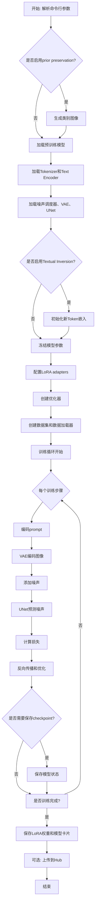

## 类结构

```
main (主模块)
├── parse_args (命令行参数解析)
├── save_model_card (模型卡片生成)
├── import_model_class_from_model_name_or_path (模型类导入)
├── TokenEmbeddingsHandler (Token嵌入处理器)
│   ├── __init__
│   ├── initialize_new_tokens
│   ├── save_embeddings
│   ├── retract_embeddings
│   ├── dtype (property)
│   └── device (property)
├── DreamBoothDataset (训练数据集)
│   ├── __init__
│   ├── __len__
│   └── __getitem__
├── PromptDataset (提示词数据集)
│   ├── __init__
│   ├── __len__
│   └── __getitem__
├── collate_fn (数据整理)
├── tokenize_prompt (分词)
├── encode_prompt (编码prompt)
└── main (主训练函数)
```

## 全局变量及字段


### `logger`
    
日志记录器，用于记录训练过程中的信息

类型：`logging.Logger`
    


### `args`
    
命令行参数，包含所有训练配置选项

类型：`argparse.Namespace`
    


### `TokenEmbeddingsHandler.text_encoders`
    
Text encoder列表，用于处理文本输入

类型：`List[torch.nn.Module]`
    


### `TokenEmbeddingsHandler.tokenizers`
    
Tokenizer列表，用于将文本转换为token

类型：`List[transformers.PreTrainedTokenizer]`
    


### `TokenEmbeddingsHandler.train_ids`
    
新训练token的IDs，用于标识需要训练的token

类型：`Optional[torch.Tensor]`
    


### `TokenEmbeddingsHandler.inserting_toks`
    
要插入的token列表，包含新添加的特殊token

类型：`Optional[List[str]]`
    


### `TokenEmbeddingsHandler.embeddings_settings`
    
嵌入设置字典，用于保存原始嵌入和训练相关设置

类型：`dict`
    


### `DreamBoothDataset.size`
    
图像尺寸，训练图像的目标尺寸

类型：`int`
    


### `DreamBoothDataset.center_crop`
    
是否中心裁剪，控制图像预处理方式

类型：`bool`
    


### `DreamBoothDataset.instance_prompt`
    
实例提示词，用于描述目标实例

类型：`str`
    


### `DreamBoothDataset.class_prompt`
    
类别提示词，用于描述类别图像

类型：`str`
    


### `DreamBoothDataset.token_abstraction_dict`
    
Token映射字典，将抽象token映射到具体token序列

类型：`dict`
    


### `DreamBoothDataset.train_text_encoder_ti`
    
是否训练文本反转，标识是否使用文本反转训练

类型：`bool`
    


### `DreamBoothDataset.instance_images`
    
实例图像列表，包含所有训练实例图像

类型：`List[Image]`
    


### `DreamBoothDataset.class_images_path`
    
类别图像路径，类别图像的文件路径列表

类型：`List[Path]`
    


### `DreamBoothDataset.image_transforms`
    
图像变换组合，定义图像预处理流程

类型：`transforms.Compose`
    


### `PromptDataset.prompt`
    
提示词，用于生成类别图像的文本提示

类型：`str`
    


### `PromptDataset.num_samples`
    
样本数量，需要生成的样本数量

类型：`int`
    
    

## 全局函数及方法


### `save_model_card`

该函数用于在 DreamBooth LoRA 训练完成后，生成并保存模型卡片（Model Card）到 HuggingFace Hub。模型卡片包含模型的描述、使用说明、示例代码、触发词等关键信息，以便其他用户了解和使用该模型。

**参数：**

- `repo_id`：`str`，HuggingFace Hub 上的仓库 ID，用于标识模型仓库
- `use_dora`：`bool`，是否使用 DoRA（Weight-Decomposed Low-Rank Adaptation）训练，影响标签和描述中的 LoRA 类型说明
- `images`：`list`，可选，验证时生成的图片列表，用于在模型卡片中展示效果
- `base_model`：`str`，基础预训练模型的名称或路径，如 `stable-diffusion-v1-5`
- `train_text_encoder`：`bool`，是否训练了 Text Encoder 的 LoRA，影响描述中的说明
- `train_text_encoder_ti`：`bool`，是否启用了 Textual Inversion（文本反转），影响触发词和示例代码
- `token_abstraction_dict`：`dict`，可选，token 抽象映射字典，用于 Textual Inversion 时定义新 token
- `instance_prompt`：`str`，实例提示词，用于触发训练概念的关键词
- `validation_prompt`：`str`，可选，验证时使用的提示词，用于生成展示图片
- `repo_folder`：`str`，本地仓库文件夹路径，用于保存图片和 README.md
- `vae_path`：`str`，可选，训练时使用的 VAE 模型路径

**返回值：** `None`，该函数无返回值，直接将模型卡片保存为 `README.md` 文件

#### 流程图

```mermaid
flowchart TD
    A[开始 save_model_card] --> B{use_dora?}
    B -->|True| C[设置 lora_type = "dora"]
    B -->|False| D[设置 lora_type = "lora"]
    
    C --> E{images 是否存在?}
    D --> E
    
    E -->|是| F[遍历图片并保存到 repo_folder]
    F --> G[构建 widget_dict 包含 validation_prompt]
    E -->|否| H[构建基础 widget_dict 包含 instance_prompt]
    
    G --> I[生成 embeddings 文件名]
    H --> I
    
    I --> J[处理 instance_prompt 提取 ti_keys]
    J --> K{是否启用 train_text_encoder_ti?}
    
    K -->|是| L[构建 pivotal tuning 触发字符串]
    L --> M[构建 diffusers 和 webui 示例代码]
    K -->|否| N[构建默认触发字符串]
    
    M --> O[遍历 token_abstraction_dict 添加触发词]
    N --> O
    
    O --> P[构建 model_description 字符串]
    P --> Q[调用 load_or_create_model_card 创建模型卡片对象]
    Q --> R[定义 tags 列表]
    R --> S[调用 populate_model_card 添加标签]
    S --> T[保存 README.md 到 repo_folder]
    T --> U[结束]
```

#### 带注释源码

```python
def save_model_card(
    repo_id: str,
    use_dora: bool,
    images: list = None,
    base_model: str = None,
    train_text_encoder=False,
    train_text_encoder_ti=False,
    token_abstraction_dict=None,
    instance_prompt=None,
    validation_prompt=None,
    repo_folder=None,
    vae_path=None,
):
    """
    生成并保存 DreamBooth LoRA 训练的模型卡片到本地文件夹
    
    该函数执行以下主要任务：
    1. 处理验证图片并保存到本地
    2. 构建模型描述文档（包含使用说明、示例代码、触发词等）
    3. 创建 HuggingFace 格式的模型卡片对象
    4. 添加适当的标签
    5. 保存为 README.md 文件
    """
    
    # 1. 确定 LoRA 类型字符串（lora 或 dora）
    lora = "lora" if not use_dora else "dora"

    # 2. 处理验证图片，构建 widget_dict 用于 HuggingFace Hub 的 Widget 展示
    widget_dict = []
    if images is not None:
        # 遍历图片列表，保存到指定文件夹
        for i, image in enumerate(images):
            image.save(os.path.join(repo_folder, f"image_{i}.png"))
            # 构建 widget 条目，包含提示词和图片 URL
            widget_dict.append(
                {"text": validation_prompt if validation_prompt else " ", "output": {"url": f"image_{i}.png"}}
            )
    else:
        # 无图片时，只包含提示词
        widget_dict.append({"text": instance_prompt})
    
    # 3. 处理 Textual Inversion 相关的 token abstraction
    # 生成 embeddings 文件名（用于保存和加载 textual inversion embeddings）
    embeddings_filename = f"{repo_folder}_emb"
    
    # 处理 instance_prompt 中的特殊 token 标记
    # 将 <s0>, <s1> 等替换为实际的 embeddings 文件名
    instance_prompt_webui = re.sub(r"<s\d+>", "", re.sub(r"<s\d+>", embeddings_filename, instance_prompt, count=1))
    
    # 提取所有 <s\d+> 格式的 token 供后续使用
    ti_keys = ", ".join(f'"{match}"' for match in re.findall(r"<s\d+>", instance_prompt))
    
    # 如果替换后与原文件名不同，生成示例句子
    if instance_prompt_webui != embeddings_filename:
        instance_prompt_sentence = f"For example, `{instance_prompt_webui}`"
    else:
        instance_prompt_sentence = ""
    
    # 4. 构建默认的触发词说明
    trigger_str = f"You should use {instance_prompt} to trigger the image generation."
    
    # 初始化 pivotal tuning 相关的字符串变量
    diffusers_imports_pivotal = ""
    diffusers_example_pivotal = ""
    webui_example_pivotal = ""
    
    # 5. 如果启用了 Textual Inversion (train_text_encoder_ti)，构建特殊的触发说明
    if train_text_encoder_ti:
        # 覆盖默认触发词说明
        trigger_str = (
            "To trigger image generation of trained concept(or concepts) replace each concept identifier "
            "in you prompt with the new inserted tokens:\n"
        )
        
        # 构建 diffusers 库的导入语句
        diffusers_imports_pivotal = """from huggingface_hub import hf_hub_download
from safetensors.torch import load_file
        """
        
        # 构建 diffusers 的加载 textual inversion embeddings 的示例代码
        diffusers_example_pivotal = f"""embedding_path = hf_hub_download(repo_id='{repo_id}', filename='{embeddings_filename}.safetensors', repo_type="model")
state_dict = load_file(embedding_path)
pipeline.load_textual_inversion(state_dict["clip_l"], token=[{ti_keys}], text_encoder=pipeline.text_encoder, tokenizer=pipeline.tokenizer)
        """
        
        # 构建 WebUI (AUTOMATIC1111) 的使用说明
        webui_example_pivotal = f"""- *Embeddings*: download **[`{embeddings_filename}.safetensors` here 💾](/{repo_id}/blob/main/{embeddings_filename}.safetensors)**.
    - Place it on it on your `embeddings` folder
    - Use it by adding `{embeddings_filename}` to your prompt. {instance_prompt_sentence}
    (you need both the LoRA and the embeddings as they were trained together for this LoRA)
    """
        
        # 遍历 token_abstraction_dict，添加每个概念的触发说明
        if token_abstraction_dict:
            for key, value in token_abstraction_dict.items():
                tokens = "".join(value)
                trigger_str += f"""
to trigger concept `{key}` → use `{tokens}` in your prompt \n
"""
    
    # 6. 构建完整的模型描述文档 (Markdown 格式)
    model_description = f"""
# SD1.5 LoRA DreamBooth - {repo_id}

<Gallery />

## Model description

### These are {repo_id} LoRA adaption weights for {base_model}.

## Download model

### Use it with UIs such as AUTOMATIC1111, Comfy UI, SD.Next, Invoke

- **LoRA**: download **[`{repo_folder}.safetensors` here 💾](/{repo_id}/blob/main/{repo_folder}.safetensors)**.
    - Place it on your `models/Lora` folder.
    - On AUTOMATIC1111, load the LoRA by adding `<lora:{repo_folder}:1>` to your prompt. On ComfyUI just [load it as a regular LoRA](https://comfyanonymous.github.io/ComfyUI_examples/lora/).
{webui_example_pivotal}

## Use it with the [🧨 diffusers library](https://github.com/huggingface/diffusers)

```py
from diffusers import AutoPipelineForText2Image
import torch
{diffusers_imports_pivotal}
pipeline = AutoPipelineForText2Image.from_pretrained('stable-diffusion-v1-5/stable-diffusion-v1-5', torch_dtype=torch.float16).to('cuda')
pipeline.load_lora_weights('{repo_id}', weight_name='pytorch_lora_weights.safetensors')
{diffusers_example_pivotal}
image = pipeline('{validation_prompt if validation_prompt else instance_prompt}').images[0]
```

For more details, including weighting, merging and fusing LoRAs, check the [documentation on loading LoRAs in diffusers](https://huggingface.co/docs/diffusers/main/en/using-diffusers/loading_adapters)

## Trigger words

{trigger_str}

## Details
All [Files & versions](/{repo_id}/tree/main).

The weights were trained using [🧨 diffusers Advanced Dreambooth Training Script](https://github.com/huggingface/diffusers/blob/main/examples/advanced_diffusion_training/train_dreambooth_lora_sd15_advanced.py).

LoRA for the text encoder was enabled. {train_text_encoder}.

Pivotal tuning was enabled: {train_text_encoder_ti}.

Special VAE used for training: {vae_path}.

"""
    
    # 7. 调用 diffusers 工具函数加载或创建模型卡片
    # from_training=True 表示这是从训练脚本生成的卡片
    model_card = load_or_create_model_card(
        repo_id_or_path=repo_id,
        from_training=True,
        license="openrail++",
        base_model=base_model,
        prompt=instance_prompt,
        model_description=model_description,
        inference=True,
        widget=widget_dict,
    )

    # 8. 定义模型标签，用于 Hub 上的分类和搜索
    tags = [
        "text-to-image",
        "diffusers",
        "diffusers-training",
        lora,              # "lora" 或 "dora"
        "template:sd-lora",
        "stable-diffusion",
        "stable-diffusion-diffusers",
    ]
    
    # 9. 将标签添加到模型卡片
    model_card = populate_model_card(model_card, tags=tags)

    # 10. 最终保存 README.md 文件到本地仓库文件夹
    model_card.save(os.path.join(repo_folder, "README.md"))
```


### `import_model_class_from_model_name_or_path`

根据预训练模型路径和配置，动态导入并返回对应的 Text Encoder 类（CLIPTextModel 或 CLIPTextModelWithProjection）。

参数：

- `pretrained_model_name_or_path`：`str`，预训练模型的名称或 HuggingFace 模型标识符
- `revision`：`str`，预训练模型的版本号（git commit hash）
- `subfolder`：`str`（默认值为 `"text_encoder"`），模型子文件夹路径

返回值：`type`，返回对应的 Text Encoder 类（`CLIPTextModel` 或 `CLIPTextModelWithProjection`），如果不支持则抛出 `ValueError`

#### 流程图

```mermaid
flowchart TD
    A[开始] --> B[加载 PretrainedConfig]
    B --> C[从配置中获取 architectures[0]]
    C --> D{model_class == CLIPTextModel?}
    D -->|是| E[导入 CLIPTextModel]
    E --> F[返回 CLIPTextModel 类]
    D -->|否| G{model_class == CLIPTextModelWithProjection?}
    G -->|是| H[导入 CLIPTextModelWithProjection]
    H --> I[返回 CLIPTextModelWithProjection 类]
    G -->|否| J[抛出 ValueError]
    F --> Z[结束]
    I --> Z
    J --> Z
```

#### 带注释源码

```python
def import_model_class_from_model_name_or_path(
    pretrained_model_name_or_path: str,  # 预训练模型的名称或路径
    revision: str,                       # 模型的 git revision
    subfolder: str = "text_encoder"      # 子文件夹，默认指向 text_encoder
):
    """
    根据预训练模型配置，动态导入对应的 Text Encoder 类。
    
    该函数通过读取模型配置文件中的 architecture 字段，
    来确定需要加载的 Text Encoder 类型。
    """
    # 1. 从预训练模型路径加载 Text Encoder 的配置
    text_encoder_config = PretrainedConfig.from_pretrained(
        pretrained_model_name_or_path,  # 模型路径或标识符
        subfolder=subfolder,             # 子文件夹路径
        revision=revision                # 版本号
    )
    
    # 2. 获取模型配置中定义的架构名称
    #    例如: "CLIPTextModel" 或 "CLIPTextModelWithProjection"
    model_class = text_encoder_config.architectures[0]
    
    # 3. 根据架构名称动态导入并返回对应的类
    if model_class == "CLIPTextModel":
        # 标准 CLIP 文本编码器
        from transformers import CLIPTextModel
        
        return CLIPTextModel
    
    elif model_class == "CLIPTextModelWithProjection":
        # 带投影层的 CLIP 文本编码器（通常用于 SDXL）
        from transformers import CLIPTextModelWithProjection
        
        return CLIPTextModelWithProjection
    
    else:
        # 4. 不支持的架构类型，抛出异常
        raise ValueError(f"{model_class} is not supported.")
```


### `parse_args`

该函数是训练脚本的命令行参数解析器，负责定义并解析所有训练相关的配置选项，包括模型路径、数据集配置、训练超参数、优化器设置等，同时进行参数合法性校验和环境变量处理。

参数：

- `input_args`：`Optional[List[str]]`，可选，要解析的参数列表。若为 `None`，则从系统命令行 (`sys.argv`) 读取；否则解析指定列表。

返回值：`argparse.Namespace`，包含所有解析后的命令行参数对象，可通过 `args.属性名` 访问。

#### 流程图

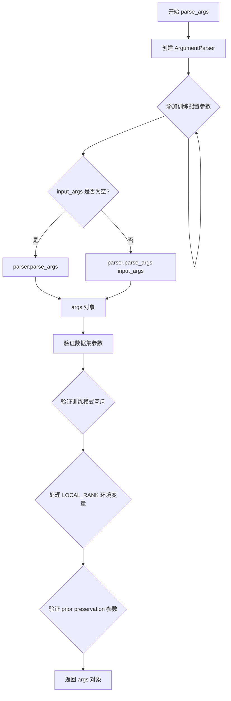

#### 带注释源码

```python
def parse_args(input_args=None):
    """
    解析命令行参数，用于配置 DreamBooth LoRA 训练脚本。
    
    参数:
        input_args: 可选的参数列表，若为 None 则从 sys.argv 解析
        
    返回:
        argparse.Namespace: 包含所有训练配置参数的命名空间对象
    """
    
    # 1. 创建 ArgumentParser 实例，添加程序描述
    parser = argparse.ArgumentParser(description="Simple example of a training script.")
    
    # =====================================================
    # 模型相关参数
    # =====================================================
    parser.add_argument(
        "--pretrained_model_name_or_path",
        type=str,
        default=None,
        required=True,
        help="Path to pretrained model or model identifier from huggingface.co/models.",
    )
    parser.add_argument(
        "--pretrained_vae_model_name_or_path",
        type=str,
        default=None,
        help="Path to pretrained VAE model with better numerical stability.",
    )
    parser.add_argument(
        "--revision",
        type=str,
        default=None,
        required=False,
        help="Revision of pretrained model identifier from huggingface.co/models.",
    )
    parser.add_argument(
        "--variant",
        type=str,
        default=None,
        help="Variant of the model files of the pretrained model identifier.",
    )
    
    # =====================================================
    # 数据集相关参数
    # =====================================================
    parser.add_argument(
        "--dataset_name",
        type=str,
        default=None,
        help="The name of the Dataset from HuggingFace hub or local path.",
    )
    parser.add_argument(
        "--dataset_config_name",
        type=str,
        default=None,
        help="The config of the Dataset.",
    )
    parser.add_argument(
        "--instance_data_dir",
        type=str,
        default=None,
        help="A path to local folder containing the training data of instance images.",
    )
    parser.add_argument(
        "--cache_dir",
        type=str,
        default=None,
        help="The directory where the downloaded models and datasets will be stored.",
    )
    parser.add_argument(
        "--image_column",
        type=str,
        default="image",
        help="The column of the dataset containing the target image.",
    )
    parser.add_argument(
        "--caption_column",
        type=str,
        default=None,
        help="The column of the dataset containing the instance prompt for each image",
    )
    parser.add_argument("--repeats", type=int, default=1, help="How many times to repeat the training data.")
    
    # =====================================================
    # Prompt 相关参数
    # =====================================================
    parser.add_argument(
        "--class_data_dir",
        type=str,
        default=None,
        required=False,
        help="A folder containing the training data of class images.",
    )
    parser.add_argument(
        "--instance_prompt",
        type=str,
        default=None,
        required=True,
        help="The prompt with identifier specifying the instance, e.g. 'photo of a TOK dog'",
    )
    parser.add_argument(
        "--token_abstraction",
        type=str,
        default="TOK",
        help="identifier specifying the instance as used in instance_prompt.",
    )
    parser.add_argument(
        "--num_new_tokens_per_abstraction",
        type=int,
        default=2,
        help="number of new tokens inserted to the tokenizers per token_abstraction identifier.",
    )
    parser.add_argument(
        "--class_prompt",
        type=str,
        default=None,
        help="The prompt to specify images in the same class as provided instance images.",
    )
    parser.add_argument(
        "--validation_prompt",
        type=str,
        default=None,
        help="A prompt that is used during validation to verify that the model is learning.",
    )
    parser.add_argument(
        "--num_validation_images",
        type=int,
        default=4,
        help="Number of images that should be generated during validation.",
    )
    parser.add_argument(
        "--validation_epochs",
        type=int,
        default=50,
        help="Run dreambooth validation every X epochs.",
    )
    
    # =====================================================
    # Prior Preservation 损失参数
    # =====================================================
    parser.add_argument(
        "--with_prior_preservation",
        default=False,
        action="store_true",
        help="Flag to add prior preservation loss.",
    )
    parser.add_argument("--prior_loss_weight", type=float, default=1.0, help="The weight of prior preservation loss.")
    parser.add_argument(
        "--num_class_images",
        type=int,
        default=100,
        help="Minimal class images for prior preservation loss.",
    )
    
    # =====================================================
    # 输出和随机种子
    # =====================================================
    parser.add_argument(
        "--output_dir",
        type=str,
        default="lora-dreambooth-model",
        help="The output directory where the model predictions and checkpoints will be written.",
    )
    parser.add_argument("--seed", type=int, default=None, help="A seed for reproducible training.")
    parser.add_argument(
        "--resolution",
        type=int,
        default=512,
        help="The resolution for input images.",
    )
    parser.add_argument(
        "--center_crop",
        default=False,
        action="store_true",
        help="Whether to center crop the input images to the resolution.",
    )
    parser.add_argument(
        "--train_text_encoder",
        action="store_true",
        help="Whether to train the text encoder.",
    )
    
    # =====================================================
    # 训练批处理参数
    # =====================================================
    parser.add_argument(
        "--train_batch_size", type=int, default=4, help="Batch size (per device) for the training dataloader."
    )
    parser.add_argument(
        "--sample_batch_size", type=int, default=4, help="Batch size (per device) for sampling images."
    )
    parser.add_argument("--num_train_epochs", type=int, default=1)
    parser.add_argument(
        "--max_train_steps",
        type=int,
        default=None,
        help="Total number of training steps to perform.",
    )
    parser.add_argument(
        "--checkpointing_steps",
        type=int,
        default=500,
        help="Save a checkpoint of the training state every X updates.",
    )
    parser.add_argument(
        "--checkpoints_total_limit",
        type=int,
        default=None,
        help="Max number of checkpoints to store.",
    )
    parser.add_argument(
        "--resume_from_checkpoint",
        type=str,
        default=None,
        help="Whether training should be resumed from a previous checkpoint.",
    )
    parser.add_argument(
        "--gradient_accumulation_steps",
        type=int,
        default=1,
        help="Number of updates steps to accumulate before performing a backward/update pass.",
    )
    parser.add_argument(
        "--gradient_checkpointing",
        action="store_true",
        help="Whether or not to use gradient checkpointing to save memory.",
    )
    
    # =====================================================
    # 学习率相关参数
    # =====================================================
    parser.add_argument(
        "--learning_rate",
        type=float,
        default=1e-4,
        help="Initial learning rate (after the potential warmup period) to use.",
    )
    parser.add_argument(
        "--text_encoder_lr",
        type=float,
        default=5e-6,
        help="Text encoder learning rate to use.",
    )
    parser.add_argument(
        "--scale_lr",
        action="store_true",
        default=False,
        help="Scale the learning rate by the number of GPUs, gradient accumulation steps, and batch size.",
    )
    parser.add_argument(
        "--lr_scheduler",
        type=str,
        default="constant",
        help='The scheduler type to use. Choose between ["linear", "cosine", "cosine_with_restarts", "polynomial", "constant", "constant_with_warmup"]',
    )
    parser.add_argument(
        "--snr_gamma",
        type=float,
        default=None,
        help="SNR weighting gamma to be used if rebalancing the loss.",
    )
    parser.add_argument(
        "--lr_warmup_steps", type=int, default=500, help="Number of steps for the warmup in the lr scheduler."
    )
    parser.add_argument(
        "--lr_num_cycles",
        type=int,
        default=1,
        help="Number of hard resets of the lr in cosine_with_restarts scheduler.",
    )
    parser.add_argument("--lr_power", type=float, default=1.0, help="Power factor of the polynomial scheduler.")
    parser.add_argument(
        "--dataloader_num_workers",
        type=int,
        default=0,
        help="Number of subprocesses to use for data loading.",
    )
    
    # =====================================================
    # Textual Inversion 相关参数
    # =====================================================
    parser.add_argument(
        "--train_text_encoder_ti",
        action="store_true",
        help="Whether to use textual inversion",
    )
    parser.add_argument(
        "--train_text_encoder_ti_frac",
        type=float,
        default=0.5,
        help="The percentage of epochs to perform textual inversion",
    )
    parser.add_argument(
        "--train_text_encoder_frac",
        type=float,
        default=1.0,
        help="The percentage of epochs to perform text encoder tuning",
    )
    
    # =====================================================
    # 优化器参数
    # =====================================================
    parser.add_argument(
        "--optimizer",
        type=str,
        default="adamW",
        help='The optimizer type to use. Choose between ["AdamW", "prodigy"]',
    )
    parser.add_argument(
        "--use_8bit_adam",
        action="store_true",
        help="Whether or not to use 8-bit Adam from bitsandbytes.",
    )
    parser.add_argument(
        "--adam_beta1", type=float, default=0.9, help="The beta1 parameter for the Adam and Prodigy optimizers."
    )
    parser.add_argument(
        "--adam_beta2", type=float, default=0.999, help="The beta2 parameter for the Adam and Prodigy optimizers."
    )
    parser.add_argument(
        "--prodigy_beta3",
        type=float,
        default=None,
        help="coefficients for computing the Prodigy stepsize using running averages.",
    )
    parser.add_argument("--prodigy_decouple", type=bool, default=True, help="Use AdamW style decoupled weight decay")
    parser.add_argument("--adam_weight_decay", type=float, default=1e-04, help="Weight decay to use for unet params")
    parser.add_argument(
        "--adam_weight_decay_text_encoder", type=float, default=None, help="Weight decay to use for text_encoder"
    )
    parser.add_argument(
        "--adam_epsilon",
        type=float,
        default=1e-08,
        help="Epsilon value for the Adam optimizer and Prodigy optimizers.",
    )
    parser.add_argument(
        "--prodigy_use_bias_correction",
        type=bool,
        default=True,
        help="Turn on Adam's bias correction.",
    )
    parser.add_argument(
        "--prodigy_safeguard_warmup",
        type=bool,
        default=True,
        help="Remove lr from the denominator of D estimate to avoid issues during warm-up stage.",
    )
    parser.add_argument("--max_grad_norm", default=1.0, type=float, help="Max gradient norm.")
    
    # =====================================================
    # 推送至 Hub 相关参数
    # =====================================================
    parser.add_argument("--push_to_hub", action="store_true", help="Whether or not to push the model to the Hub.")
    parser.add_argument("--hub_token", type=str, default=None, help="The token to use to push to the Model Hub.")
    parser.add_argument(
        "--hub_model_id",
        type=str,
        default=None,
        help="The name of the repository to keep in sync with the local `output_dir`.",
    )
    parser.add_argument(
        "--logging_dir",
        type=str,
        default="logs",
        help="TensorBoard log directory.",
    )
    
    # =====================================================
    # 精度和加速相关参数
    # =====================================================
    parser.add_argument(
        "--allow_tf32",
        action="store_true",
        help="Whether or not to allow TF32 on Ampere GPUs.",
    )
    parser.add_argument(
        "--report_to",
        type=str,
        default="tensorboard",
        help='The integration to report the results and logs to.',
    )
    parser.add_argument(
        "--mixed_precision",
        type=str,
        default=None,
        choices=["no", "fp16", "bf16"],
        help="Whether to use mixed precision.",
    )
    parser.add_argument(
        "--prior_generation_precision",
        type=str,
        default=None,
        choices=["no", "fp32", "fp16", "bf16"],
        help="Choose prior generation precision between fp32, fp16 and bf16.",
    )
    parser.add_argument("--local_rank", type=int, default=-1, help="For distributed training: local_rank")
    parser.add_argument(
        "--enable_xformers_memory_efficient_attention", action="store_true", help="Whether or not to use xformers."
    )
    parser.add_argument("--noise_offset", type=float, default=0, help="The scale of noise offset.")
    
    # =====================================================
    # LoRA 相关参数
    # =====================================================
    parser.add_argument(
        "--rank",
        type=int,
        default=4,
        help="The dimension of the LoRA update matrices.",
    )
    parser.add_argument("--lora_dropout", type=float, default=0.0, help="Dropout probability for LoRA layers")
    parser.add_argument(
        "--use_dora",
        action="store_true",
        default=False,
        help="Whether to train a DoRA as proposed in DoRA: Weight-Decomposed Low-Rank Adaptation.",
    )
    parser.add_argument(
        "--cache_latents",
        action="store_true",
        default=False,
        help="Cache the VAE latents",
    )
    parser.add_argument(
        "--image_interpolation_mode",
        type=str,
        default="lanczos",
        choices=[
            f.lower() for f in dir(transforms.InterpolationMode) if not f.startswith("__") and not f.endswith("__")
        ],
        help="The image interpolation method to use for resizing images.",
    )
    
    # =====================================================
    # 参数解析
    # =====================================================
    
    # 2. 解析参数：根据 input_args 是否为空决定解析方式
    if input_args is not None:
        args = parser.parse_args(input_args)
    else:
        args = parser.parse_args()
    
    # =====================================================
    # 参数验证与校验
    # =====================================================
    
    # 验证数据集配置：必须指定 dataset_name 或 instance_data_dir 之一
    if args.dataset_name is None and args.instance_data_dir is None:
        raise ValueError("Specify either `--dataset_name` or `--instance_data_dir`")
    
    # 验证不能同时指定两者
    if args.dataset_name is not None and args.instance_data_dir is not None:
        raise ValueError("Specify only one of `--dataset_name` or `--instance_data_dir`")
    
    # 验证文本编码器训练模式互斥
    if args.train_text_encoder and args.train_text_encoder_ti:
        raise ValueError(
            "Specify only one of `--train_text_encoder` or `--train_text_encoder_ti. "
            "For full LoRA text encoder training check --train_text_encoder, for textual "
            "inversion training check `--train_text_encoder_ti`"
        )
    
    # 处理分布式训练环境变量
    env_local_rank = int(os.environ.get("LOCAL_RANK", -1))
    if env_local_rank != -1 and env_local_rank != args.local_rank:
        args.local_rank = env_local_rank
    
    # 验证 Prior Preservation 相关参数
    if args.with_prior_preservation:
        if args.class_data_dir is None:
            raise ValueError("You must specify a data directory for class images.")
        if args.class_prompt is None:
            raise ValueError("You must specify prompt for class images.")
    else:
        # logger 尚未可用，使用 warnings
        if args.class_data_dir is not None:
            warnings.warn("You need not use --class_data_dir without --with_prior_preservation.")
        if args.class_prompt is not None:
            warnings.warn("You need not use --class_prompt without --with_prior_preservation.")
    
    # 3. 返回解析后的参数对象
    return args
```


### `collate_fn`

该函数是 DreamBooth 数据加载器的批处理整理函数，用于将数据集中的多个样本（examples）整理成一个训练批次（batch）。它负责提取图像像素值和文本提示词，并根据是否启用先验保存（prior preservation）来决定是否同时包含实例图像和类别图像，以在单次前向传播中计算损失。

**参数：**

- `examples`：`List[Dict]`，从数据集获取的样本列表，每个样本是一个包含 "instance_images"、"instance_prompt"、"class_images"（可选）和 "class_prompt"（可选）的字典。
- `with_prior_preservation`：`bool`，标志位，指示是否启用先验保存。若为 `True`，则将类别图像和类别提示词也添加到批次中，以避免进行两次前向传播。

**返回值：** `Dict`，包含以下键的字典：

- `pixel_values`：`torch.Tensor`，形状为 `(batch_size, channels, height, width)` 的图像像素值张量。
- `prompts`：`List[str]`，对应于批次中每张图像的文本提示词列表。

#### 流程图

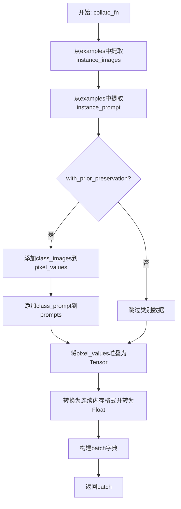

#### 带注释源码

```python
def collate_fn(examples, with_prior_preservation=False):
    """
    整理训练批次数据。
    
    参数:
        examples: 数据集中的一批样本列表。
        with_prior_preservation: 是否包含类别图像以进行先验保存损失计算。
    
    返回:
        包含图像像素值和提示词的字典。
    """
    # 从每个样本字典中提取实例图像
    pixel_values = [example["instance_images"] for example in examples]
    # 从每个样本字典中提取实例提示词
    prompts = [example["instance_prompt"] for example in examples]

    # 如果启用先验保存，则将类别图像和类别提示词也添加到批次中。
    # 这样做是为了避免进行两次前向传播（在一次前向传播中同时计算实例和类别的损失）。
    if with_prior_preservation:
        pixel_values += [example["class_images"] for example in examples]
        prompts += [example["class_prompt"] for example in examples]

    # 将图像列表堆叠成一个4D张量 (B, C, H, W)
    pixel_values = torch.stack(pixel_values)
    # 确保内存布局连续，并转换为浮点类型（PyTorch训练通常要求）
    pixel_values = pixel_values.to(memory_format=torch.contiguous_format).float()

    # 构建最终的批次字典
    batch = {"pixel_values": pixel_values, "prompts": prompts}
    return batch
```


### `tokenize_prompt`

该函数用于将文本提示词（prompt）通过指定的分词器（tokenizer）转换为模型可处理的 token ID 序列。它支持配置是否添加特殊 token（如 [CLS]、[SEP] 等），并返回分词后的 input_ids 张量。

参数：

- `tokenizer`：`PreTrainedTokenizer`，Hugging Face Transformers 库中的分词器对象，负责将文本编码为 token ID
- `prompt`：`str`，需要进行分处理的文本提示词
- `add_special_tokens`：`bool`，可选参数，默认为 `False`，控制在编码结果中是否包含特殊 token（如起始符、结束符等）

返回值：`torch.Tensor`，形状为 `(1, seq_len)` 的张量，包含分词后的 token ID 序列

#### 流程图

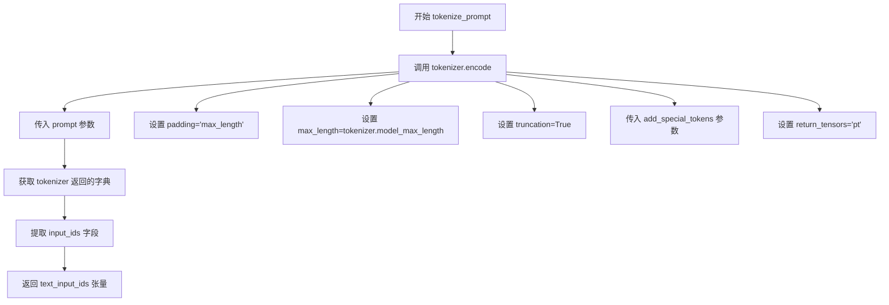

#### 带注释源码

```python
def tokenize_prompt(tokenizer, prompt, add_special_tokens=False):
    """
    将文本提示词分词为 token ID 序列
    
    参数:
        tokenizer: 分词器对象 (PreTrainedTokenizer)
        prompt: 待分词的文本
        add_special_tokens: 是否添加特殊 token (如 [CLS], [SEP])
    
    返回:
        包含 token ID 的张量
    """
    # 使用 tokenizer 对 prompt 进行编码
    # padding="max_length": 填充到最大长度
    # max_length: 使用 tokenizer 的最大长度限制
    # truncation: 超过最大长度时截断
    # add_special_tokens: 控制是否添加特殊 token
    # return_tensors="pt": 返回 PyTorch 张量
    text_inputs = tokenizer(
        prompt,
        padding="max_length",
        max_length=tokenizer.model_max_length,
        truncation=True,
        add_special_tokens=add_special_tokens,
        return_tensors="pt",
    )
    
    # 从分词结果中提取 input_ids
    text_input_ids = text_inputs.input_ids
    
    # 返回 token ID 张量
    return text_input_ids
```


### `encode_prompt`

该函数是 Stable Diffusion LoRA Dreambooth 训练脚本中的提示词编码函数，用于将文本提示（prompt）转换为文本嵌入（text embeddings），供 UNet 在扩散过程中使用。该函数支持单文本编码器或多文本编码器（如 SDXL 的 CLIP-L 和 CLIP-G），并处理分词（tokenization）和编码（encoding）的完整流程。

参数：

- `text_encoders`：`List[PreTrainedModel]`，文本编码器列表，例如 CLIPTextModel 或 CLIPTextModelWithProjection
- `tokenizers`：`List[PreTrainedTokenizer]`，分词器列表，用于将文本提示转换为 token IDs；若为 None，则必须提供 text_input_ids_list
- `prompt`：`str`，要编码的文本提示
- `text_input_ids_list`：`Optional[List[torch.Tensor]]`，预计算好的 token IDs 列表；当 tokenizers 为 None 时使用

返回值：`torch.Tensor`，文本嵌入向量，形状为 `(batch_size, seq_len, hidden_size)`

#### 流程图

```mermaid
flowchart TD
    A[开始 encode_prompt] --> B{tokenizers is not None?}
    B -->|是| C[获取当前分词器 tokenizer[i]]
    C --> D[调用 tokenize_prompt]
    D --> E[将 prompt 转换为 token IDs]
    E --> F[使用 text_encoder 编码 token IDs]
    F --> G[output_hidden_states=True 获取隐藏层]
    B -->|否| H[使用预计算的 text_input_ids_list[i]]
    H --> F
    G --> I{是否还有更多 text_encoders?}
    I -->|是| B
    I -->|否| J[返回 prompt_embeds[0]]
    J --> K[结束]
```

#### 带注释源码

```python
def tokenize_prompt(tokenizer, prompt, add_special_tokens=False):
    """
    将文本提示 token 化（分词）为 token IDs
    
    参数:
        tokenizer: 分词器对象
        prompt: 要分词的文本
        add_special_tokens: 是否添加特殊 token（如 <bos>, <eos>）
    
    返回:
        text_input_ids: token IDs 张量
    """
    text_inputs = tokenizer(
        prompt,
        padding="max_length",  # 填充到最大长度
        max_length=tokenizer.model_max_length,  # 使用分词器最大长度
        truncation=True,  # 截断超长文本
        add_special_tokens=add_special_tokens,  # 添加特殊 token
        return_tensors="pt",  # 返回 PyTorch 张量
    )
    text_input_ids = text_inputs.input_ids
    return text_input_ids


# Adapted from pipelines.StableDiffusionXLPipeline.encode_prompt
def encode_prompt(text_encoders, tokenizers, prompt, text_input_ids_list=None):
    """
    将文本提示编码为文本嵌入向量
    
    流程:
        1. 遍历所有文本编码器
        2. 对每个编码器，使用分词器将提示转为 token IDs（或使用预计算的 IDs）
        3. 调用编码器获取隐藏状态
        4. 返回第一层隐藏状态（prompt embeddings）
    
    参数:
        text_encoders: 文本编码器列表（如 CLIPTextModel）
        tokenizers: 分词器列表；若为 None 则使用 text_input_ids_list
        prompt: 要编码的文本提示
        text_input_ids_list: 预计算的 token IDs 列表（可选）
    
    返回:
        prompt_embeds[0]: 文本嵌入张量，形状 (batch_size, seq_len, hidden_size)
    """
    # 遍历每个文本编码器（SDXL 有两个：clip_l 和 clip_g）
    for i, text_encoder in enumerate(text_encoders):
        if tokenizers is not None:
            # 使用分词器将提示转为 token IDs
            tokenizer = tokenizers[i]
            text_input_ids = tokenize_prompt(tokenizer, prompt)
        else:
            # 使用预计算的 token IDs（训练时优化路径）
            assert text_input_ids_list is not None
            text_input_ids = text_input_ids_list[i]

        # 使用文本编码器进行编码，获取隐藏状态
        # output_hidden_states=True 确保返回所有隐藏层
        prompt_embeds = text_encoder(
            text_input_ids.to(text_encoder.device),  # 将输入移到编码器设备
            output_hidden_states=True,
        )

    # 返回第一层隐藏状态（即 prompt embeddings）
    # 对于 SDXL，通常使用最后一层的 hidden states
    return prompt_embeds[0]
```


### `main(args)`

这是DreamBooth LoRA训练脚本的主函数，负责模型的完整训练流程，包括环境初始化、模型加载、数据准备、训练循环执行、验证以及模型保存与上传。

参数：

- `args`：命令行参数对象（`argparse.Namespace`），包含所有训练配置，如模型路径、数据路径、学习率、LoRA参数、训练步数等。

返回值：无返回值（`None`），该函数执行完整的训练流程并保存模型到指定目录。

#### 流程图

```mermaid
flowchart TD
    A[开始] --> B[验证参数安全性]
    B --> C[初始化Accelerator分布式训练环境]
    C --> D[设置日志和随机种子]
    D --> E{是否启用Prior Preservation}
    E -->|是| F[生成类别图像]
    E -->|否| G[跳过类别图像生成]
    F --> G
    G --> H[创建输出目录]
    H --> I[加载Tokenizers和Text Encoders]
    I --> J[加载Scheduler和基础模型]
    J --> K{是否启用Textual Inversion}
    K -->|是| L[初始化新Token embeddings]
    K -->|否| M[跳过TI初始化]
    L --> M
    M --> N[冻结不需要训练的模型参数]
    N --> O[设置混合精度训练]
    O --> P[配置LoRA适配器]
    P --> Q{是否训练Text Encoder}
    Q -->|是| R[添加Text Encoder LoRA]
    Q -->|否| S[跳过Text Encoder LoRA]
    R --> S
    S --> T[注册模型保存/加载钩子]
    T --> U[创建优化器和学习率调度器]
    U --> V[创建数据集和DataLoader]
    V --> W{是否需要编码Text Embeddings}
    W -->|是| X[预计算Text Embeddings]
    W -->|否| Y[跳过预计算]
    X --> Y
    Y --> Z{是否缓存Latents}
    Z -->|是| AA[缓存VAE latents]
    Z -->|否| AB[跳过latent缓存]
    AA --> AB
    AB --> AC[准备训练组件]
    AC --> AD[初始化训练跟踪器]
    AD --> AE[开始训练循环 - 外层epoch循环]
    AE --> AF{是否训练Text Encoder}
    AF -->|是| AG[设置Text Encoder训练阶段]
    AF -->|否| AH[保持Text Encoder冻结]
    AG --> AH
    AH --> AI[开始训练循环 - 内层step循环]
    AI --> AJ[获取batch数据]
    AJ --> AK{是否缓存Latents}
    AK -->|是| AL[从缓存获取latent]
    AK -->|否| AM[实时编码pixel值]
    AL --> AN[添加噪声到latent]
    AM --> AN
    AN --> AO[编码prompt获取text embeddings]
    AO --> AP[UNet预测噪声残差]
    AP --> AQ[计算MSE损失]
    AQ --> AR{是否启用Prior Preservation}
    AR -->|是| AS[计算prior loss]
    AR -->|否| AT[跳过prior loss]
    AS --> AT
    AT --> AU[反向传播和梯度裁剪]
    AU --> AV[优化器更新参数]
    AV --> AW[更新学习率调度器]
    AW --> AX{是否启用Textual Inversion}
    AX -->|是| AY[重置embeddings到原始值]
    AX -->|否| AZ[跳过embedding重置]
    AY --> AZ
    AZ --> BA{是否到达checkpoint保存点}
    BA -->|是| BB[保存训练状态]
    BA -->|否| BC[跳过保存]
    BB --> BC
    BC --> BD[记录训练日志]
    BD --> BE{是否完成所有训练步骤}
    BE -->|否| AI
    BE -->|是| BF{是否启用验证}
    BF -->|是| BG[运行验证生成图像]
    BF -->|否| BH[跳过验证]
    BG --> BH
    BH --> BI{是否到达下一个epoch}
    BI -->|是| AE
    BI -->|否| BJ[结束训练]
    BJ --> BK[保存最终LoRA权重]
    BK --> BL[保存Textual Inversion embeddings]
    BL --> BM[运行最终推理生成样本]
    BM --> BN[转换为WebUI格式]
    BN --> BO[生成Model Card]
    BO --> BP{是否推送到Hub}
    BP -->|是| BQ[上传模型到Hub]
    BP -->|否| BR[结束]
    BQ --> BR
```

#### 带注释源码

```python
def main(args):
    """
    DreamBooth LoRA训练主函数
    
    该函数执行完整的DreamBooth LoRA训练流程:
    1. 初始化分布式训练环境(Accelerator)
    2. 加载预训练的Stable Diffusion模型组件
    3. 配置LoRA适配器和可选的Textual Inversion
    4. 准备数据集和数据加载器
    5. 执行多epoch训练循环,包括:
       - 前向传播和噪声预测
       - 损失计算(MSE + 可选的prior preservation loss)
       - 反向传播和参数更新
       - 检查点保存
    6. 保存训练好的LoRA权重和embeddings
    7. 可选的验证推理和模型上传
    
    参数:
        args: 包含所有训练配置的argparse.Namespace对象
              包括: pretrained_model_name_or_path, instance_data_dir, 
              learning_rate, rank, num_train_epochs等
    
    返回:
        None: 函数通过副作用保存模型到output_dir
    """
    
    # ========== 阶段1: 环境初始化和验证 ==========
    
    # 安全检查: wandb和hub_token不能同时使用(安全风险)
    if args.report_to == "wandb" and args.hub_token is not None:
        raise ValueError(
            "You cannot use both --report_to=wandb and --hub_token due to a security risk of exposing your token."
            " Please use `hf auth login` to authenticate with the Hub."
        )

    # 构建日志目录路径
    logging_dir = Path(args.output_dir, args.logging_dir)

    # 初始化Accelerator分布式训练配置
    accelerator_project_config = ProjectConfiguration(
        project_dir=args.output_dir, 
        logging_dir=logging_dir
    )
    # 配置分布式训练参数,find_unused_parameters=True用于处理LoRA等部分参数训练
    kwargs = DistributedDataParallelKwargs(find_unused_parameters=True)
    accelerator = Accelerator(
        gradient_accumulation_steps=args.gradient_accumulation_steps,
        mixed_precision=args.mixed_precision,
        log_with=args.report_to,
        project_config=accelerator_project_config,
        kwargs_handlers=[kwargs],
    )

    # 导入wandb(如果使用)
    if args.report_to == "wandb":
        if not is_wandb_available():
            raise ImportError("Make sure to install wandb if you want to use it for logging during training.")
        import wandb

    # 配置日志格式
    logging.basicConfig(
        format="%(asctime)s - %(levelname)s - %(name)s - %(message)s",
        datefmt="%m/%d/%Y %H:%M:%S",
        level=logging.INFO,
    )
    logger.info(accelerator.state, main_process_only=False)
    
    # 主进程设置详细日志,其他进程设置简洁日志
    if accelerator.is_local_main_process:
        transformers.utils.logging.set_verbosity_warning()
        diffusers.utils.logging.set_verbosity_info()
    else:
        transformers.utils.logging.set_verbosity_error()
        diffusers.utils.logging.set_verbosity_error()

    # 设置随机种子(如果指定)
    if args.seed is not None:
        set_seed(args.seed)

    # ========== 阶段2: Prior Preservation类别图像生成 ==========
    
    # 如果启用prior preservation,需要生成类别图像用于保留损失
    if args.with_prior_preservation:
        class_images_dir = Path(args.class_data_dir)
        if not class_images_dir.exists():
            class_images_dir.mkdir(parents=True)
        
        # 检查已存在的类别图像数量
        cur_class_images = len(list(class_images_dir.iterdir()))

        # 如果类别图像不足,使用SD pipeline生成
        if cur_class_images < args.num_class_images:
            # 根据GPU和精度设置确定数据类型
            torch_dtype = torch.float16 if accelerator.device.type == "cuda" else torch.float32
            if args.prior_generation_precision == "fp32":
                torch_dtype = torch.float32
            elif args.prior_generation_precision == "fp16":
                torch_dtype = torch.float16
            elif args.prior_generation_precision == "bf16":
                torch_dtype = torch.bfloat16
            
            # 加载SD pipeline用于生成类别图像
            pipeline = StableDiffusionPipeline.from_pretrained(
                args.pretrained_model_name_or_path,
                torch_dtype=torch_dtype,
                revision=args.revision,
                variant=args.variant,
            )
            pipeline.set_progress_bar_config(disable=True)

            num_new_images = args.num_class_images - cur_class_images
            logger.info(f"Number of class images to sample: {num_new_images}.")

            # 创建数据集和dataloader
            sample_dataset = PromptDataset(args.class_prompt, num_new_images)
            sample_dataloader = torch.utils.data.DataLoader(
                sample_dataset, 
                batch_size=args.sample_batch_size
            )

            sample_dataloader = accelerator.prepare(sample_dataloader)
            pipeline.to(accelerator.device)

            # 生成类别图像并保存
            for example in tqdm(
                sample_dataloader, 
                desc="Generating class images", 
                disable=not accelerator.is_local_main_process
            ):
                images = pipeline(example["prompt"]).images

                for i, image in enumerate(images):
                    # 使用图像内容的hash作为文件名的一部分
                    hash_image = hashlib.sha1(image.tobytes()).hexdigest()
                    image_filename = class_images_dir / f"{example['index'][i] + cur_class_images}-{hash_image}.jpg"
                    image.save(image_filename)

            del pipeline
            if torch.cuda.is_available():
                torch.cuda.empty_cache()

    # ========== 阶段3: 输出目录和仓库创建 ==========
    
    # 主进程创建输出目录和可选的HF repo
    if accelerator.is_main_process:
        if args.output_dir is not None:
            os.makedirs(args.output_dir, exist_ok=True)

        model_id = args.hub_model_id or Path(args.output_dir).name
        repo_id = None
        if args.push_to_hub:
            repo_id = create_repo(
                repo_id=model_id, 
                exist_ok=True, 
                token=args.hub_token
            ).repo_id

    # ========== 阶段4: 加载模型组件 ==========
    
    # 加载tokenizer
    tokenizer_one = AutoTokenizer.from_pretrained(
        args.pretrained_model_name_or_path,
        subfolder="tokenizer",
        revision=args.revision,
        variant=args.variant,
        use_fast=False,
    )

    # 导入正确的text encoder类
    text_encoder_cls_one = import_model_class_from_model_name_or_path(
        args.pretrained_model_name_or_path, 
        args.revision
    )

    # 加载scheduler
    noise_scheduler = DDPMScheduler.from_pretrained(
        args.pretrained_model_name_or_path, 
        subfolder="scheduler"
    )
    
    # 加载text encoder
    text_encoder_one = text_encoder_cls_one.from_pretrained(
        args.pretrained_model_name_or_path, 
        subfolder="text_encoder", 
        revision=args.revision, 
        variant=args.variant
    )
    
    # 加载VAE(使用指定路径或默认路径)
    vae_path = (
        args.pretrained_model_name_or_path
        if args.pretrained_vae_model_name_or_path is None
        else args.pretrained_vae_model_name_or_path
    )
    vae = AutoencoderKL.from_pretrained(
        vae_path,
        subfolder="vae" if args.pretrained_vae_model_name_or_path is None else None,
        revision=args.revision,
        variant=args.variant,
    )
    vae_scaling_factor = vae.config.scaling_factor
    
    # 加载UNet
    unet = UNet2DConditionModel.from_pretrained(
        args.pretrained_model_name_or_path, 
        subfolder="unet", 
        revision=args.revision, 
        variant=args.variant
    )

    # ========== 阶段5: Textual Inversion初始化 ==========
    
    # 如果启用Textual Inversion,初始化新的token embeddings
    if args.train_text_encoder_ti:
        # 解析token abstraction列表
        token_abstraction_list = "".join(args.token_abstraction.split()).split(",")
        logger.info(f"list of token identifiers: {token_abstraction_list}")

        # 构建token到新embedding的映射字典
        token_abstraction_dict = {}
        token_idx = 0
        for i, token in enumerate(token_abstraction_list):
            token_abstraction_dict[token] = [
                f"<s{token_idx + i + j}>" 
                for j in range(args.num_new_tokens_per_abstraction)
            ]
            token_idx += args.num_new_tokens_per_abstraction - 1

        # 替换instance_prompt和class_prompt中的token
        for token_abs, token_replacement in token_abstraction_dict.items():
            args.instance_prompt = args.instance_prompt.replace(
                token_abs, 
                "".join(token_replacement)
            )
            if args.with_prior_preservation:
                args.class_prompt = args.class_prompt.replace(
                    token_abs, 
                    "".join(token_replacement)
                )

        # 初始化新的token embeddings
        embedding_handler = TokenEmbeddingsHandler(
            [text_encoder_one], 
            [tokenizer_one]
        )
        inserting_toks = []
        for new_tok in token_abstraction_dict.values():
            inserting_toks.extend(new_tok)
        embedding_handler.initialize_new_tokens(inserting_toks=inserting_toks)

    # ========== 阶段6: 冻结不需要训练的模型 ==========
    
    # 冻结VAE和text encoder,只训练LoRA参数
    vae.requires_grad_(False)
    text_encoder_one.requires_grad_(False)
    unet.requires_grad_(False)

    # 设置混合精度训练的数据类型
    weight_dtype = torch.float32
    if accelerator.mixed_precision == "fp16":
        weight_dtype = torch.float16
    elif accelerator.mixed_precision == "bf16":
        weight_dtype = torch.bfloat16

    # 将模型移动到设备并转换数据类型
    unet.to(accelerator.device, dtype=weight_dtype)
    # VAE始终使用float32以避免NaN损失
    vae.to(accelerator.device, dtype=torch.float32)
    text_encoder_one.to(accelerator.device, dtype=weight_dtype)

    # ========== 阶段7: 配置xFormers和Gradient Checkpointing ==========
    
    # 启用xFormers高效注意力(如果可用)
    if args.enable_xformers_memory_efficient_attention:
        if is_xformers_available():
            import xformers

            xformers_version = version.parse(xformers.__version__)
            if xformers_version == version.parse("0.0.16"):
                logger.warning(
                    "xFormers 0.0.16 cannot be used for training in some GPUs..."
                )
            unet.enable_xformers_memory_efficient_attention()
        else:
            raise ValueError("xformers is not available...")

    # 启用gradient checkpointing以节省显存
    if args.gradient_checkpointing:
        unet.enable_gradient_checkpointing()
        if args.train_text_encoder:
            text_encoder_one.gradient_checkpointing_enable()

    # ========== 阶段8: 添加LoRA适配器 ==========
    
    # 为UNet添加LoRA适配器
    unet_lora_config = LoraConfig(
        r=args.rank,
        lora_alpha=args.rank,
        lora_dropout=args.lora_dropout,
        use_dora=args.use_dora,
        init_lora_weights="gaussian",
        target_modules=["to_k", "to_q", "to_v", "to_out.0"],
    )
    unet.add_adapter(unet_lora_config)

    # 可选:为Text Encoder添加LoRA适配器
    if args.train_text_encoder:
        text_lora_config = LoraConfig(
            r=args.rank,
            lora_alpha=args.rank,
            lora_dropout=args.lora_dropout,
            use_dora=args.use_dora,
            init_lora_weights="gaussian",
            target_modules=["q_proj", "k_proj", "v_proj", "out_proj"],
        )
        text_encoder_one.add_adapter(text_lora_config)
    # 可选:使用Textual Inversion(冻结除token embeddings外的所有参数)
    elif args.train_text_encoder_ti:
        text_lora_parameters_one = []
        for name, param in text_encoder_one.named_parameters():
            if "token_embedding" in name:
                # 确保dtype为float32
                param = param.to(dtype=torch.float32)
                param.requires_grad = True
                text_lora_parameters_one.append(param)
            else:
                param.requires_grad = False

    # 确保可训练参数为float32
    if args.mixed_precision == "fp16":
        models = [unet]
        if args.train_text_encoder:
            models.extend([text_encoder_one])
        for model in models:
            for param in model.parameters():
                if param.requires_grad:
                    param.data = param.to(torch.float32)

    # ========== 阶段9: 注册模型保存/加载钩子 ==========
    
    # 自定义保存钩子:将LoRA权重转换为diffusers格式并保存
    def save_model_hook(models, weights, output_dir):
        if accelerator.is_main_process:
            unet_lora_layers_to_save = None
            text_encoder_one_lora_layers_to_save = None

            for model in models:
                if isinstance(model, type(accelerator.unwrap_model(unet))):
                    unet_lora_layers_to_save = convert_state_dict_to_diffusers(
                        get_peft_model_state_dict(model)
                    )
                elif isinstance(model, type(accelerator.unwrap_model(text_encoder_one))):
                    if args.train_text_encoder:
                        text_encoder_one_lora_layers_to_save = convert_state_dict_to_diffusers(
                            get_peft_model_state_dict(model)
                        )
                else:
                    raise ValueError(f"unexpected save model: {model.__class__}")

                weights.pop()

            StableDiffusionPipeline.save_lora_weights(
                output_dir,
                unet_lora_layers=unet_lora_layers_to_save,
                text_encoder_lora_layers=text_encoder_one_lora_layers_to_save,
            )
        
        # 保存Textual Inversion embeddings
        if args.train_text_encoder_ti:
            embedding_handler.save_embeddings(
                f"{args.output_dir}/{Path(args.output_dir).name}_emb.safetensors"
            )

    # 自定义加载钩子:从检查点恢复LoRA权重
    def load_model_hook(models, input_dir):
        unet_ = None
        text_encoder_one_ = None

        while len(models) > 0:
            model = models.pop()

            if isinstance(model, type(accelerator.unwrap_model(unet))):
                unet_ = model
            elif isinstance(model, type(accelerator.unwrap_model(text_encoder_one))):
                text_encoder_one_ = model
            else:
                raise ValueError(f"unexpected save model: {model.__class__}")

        # 加载LoRA状态字典
        lora_state_dict, network_alphas = StableDiffusionPipeline.lora_state_dict(input_dir)

        # 处理UNet LoRA权重
        unet_state_dict = {
            f"{k.replace('unet.', '')}": v 
            for k, v in lora_state_dict.items() 
            if k.startswith("unet.")
        }
        unet_state_dict = convert_unet_state_dict_to_peft(unet_state_dict)
        incompatible_keys = set_peft_model_state_dict(
            unet_, 
            unet_state_dict, 
            adapter_name="default"
        )
        
        # 处理Text Encoder LoRA权重
        if args.train_text_encoder:
            _set_state_dict_into_text_encoder(
                lora_state_dict, 
                prefix="text_encoder.", 
                text_encoder=text_encoder_one_
            )
            _set_state_dict_into_text_encoder(
                lora_state_dict, 
                prefix="text_encoder_2.", 
                text_encoder=text_encoder_one_
            )

        # 确保可训练参数为float32
        if args.mixed_precision == "fp16":
            models = [unet_]
            if args.train_text_encoder:
                models.extend([text_encoder_one_])
            cast_training_params(models)
        
        # 重新加载并应用LoRA权重
        lora_state_dict, network_alphas = StableDiffusionLoraLoaderMixin.lora_state_dict(input_dir)
        StableDiffusionLoraLoaderMixin.load_lora_into_unet(
            lora_state_dict, 
            network_alphas=network_alphas, 
            unet=unet_
        )

        text_encoder_state_dict = {
            k: v 
            for k, v in lora_state_dict.items() 
            if "text_encoder." in k
        }
        StableDiffusionLoraLoaderMixin.load_lora_into_text_encoder(
            text_encoder_state_dict, 
            network_alphas=network_alphas, 
            text_encoder=text_encoder_one_
        )

    # 注册钩子
    accelerator.register_save_state_pre_hook(save_model_hook)
    accelerator.register_load_state_pre_hook(load_model_hook)

    # ========== 阶段10: 优化器配置 ==========
    
    # 启用TF32加速(如果允许)
    if args.allow_tf32:
        torch.backends.cuda.matmul.allow_tf32 = True

    # 缩放学习率(如果启用)
    if args.scale_lr:
        args.learning_rate = (
            args.learning_rate 
            * args.gradient_accumulation_steps 
            * args.train_batch_size 
            * accelerator.num_processes
        )

    # 获取可训练的LoRA参数
    unet_lora_parameters = list(filter(lambda p: p.requires_grad, unet.parameters()))

    if args.train_text_encoder:
        text_lora_parameters_one = list(
            filter(lambda p: p.requires_grad, text_encoder_one.parameters())
        )

    # 确定是否冻结text encoder
    freeze_text_encoder = not (args.train_text_encoder or args.train_text_encoder_ti)

    # 配置优化参数
    unet_lora_parameters_with_lr = {
        "params": unet_lora_parameters, 
        "lr": args.learning_rate
    }
    
    if not freeze_text_encoder:
        # text encoder使用不同的学习率
        text_lora_parameters_one_with_lr = {
            "params": text_lora_parameters_one,
            "weight_decay": args.adam_weight_decay_text_encoder
            if args.adam_weight_decay_text_encoder
            else args.adam_weight_decay,
            "lr": args.text_encoder_lr if args.text_encoder_lr else args.learning_rate,
        }
        params_to_optimize = [
            unet_lora_parameters_with_lr, 
            text_lora_parameters_one_with_lr
        ]
    else:
        params_to_optimize = [unet_lora_parameters_with_lr]

    # 创建优化器
    if not (args.optimizer.lower() == "prodigy" or args.optimizer.lower() == "adamw"):
        logger.warning(
            f"Unsupported choice of optimizer: {args.optimizer}..."
        )
        args.optimizer = "adamw"

    if args.use_8bit_adam and not args.optimizer.lower() == "adamw":
        logger.warning(f"use_8bit_adam is ignored when optimizer is not set to 'AdamW'...")

    if args.optimizer.lower() == "adamw":
        if args.use_8bit_adam:
            try:
                import bitsandbytes as bnb
            except ImportError:
                raise ImportError(
                    "To use 8-bit Adam, please install the bitsandbytes library..."
                )
            optimizer_class = bnb.optim.AdamW8bit
        else:
            optimizer_class = torch.optim.AdamW

        optimizer = optimizer_class(
            params_to_optimize,
            betas=(args.adam_beta1, args.adam_beta2),
            weight_decay=args.adam_weight_decay,
            eps=args.adam_epsilon,
        )

    if args.optimizer.lower() == "prodigy":
        try:
            import prodigyopt
        except ImportError:
            raise ImportError("To use Prodigy, please install the prodigyopt library...")

        optimizer_class = prodigyopt.Prodigy
        
        # 调整学习率警告
        if args.learning_rate <= 0.1:
            logger.warning("Learning rate is too low. When using prodigy...")
        
        if args.train_text_encoder and args.text_encoder_lr:
            logger.warning(f"Learning rates were provided both for the unet and the text encoder...")
            params_to_optimize[1]["lr"] = args.learning_rate

        optimizer = optimizer_class(
            params_to_optimize,
            betas=(args.adam_beta1, args.adam_beta2),
            beta3=args.prodigy_beta3,
            weight_decay=args.adam_weight_decay,
            eps=args.adam_epsilon,
            decouple=args.prodigy_decouple,
            use_bias_correction=args.prodigy_use_bias_correction,
            safeguard_warmup=args.prodigy_safeguard_warmup,
        )

    # ========== 阶段11: 数据集和DataLoader创建 ==========
    
    train_dataset = DreamBoothDataset(
        instance_data_root=args.instance_data_dir,
        instance_prompt=args.instance_prompt,
        class_prompt=args.class_prompt,
        dataset_name=args.dataset_name,
        dataset_config_name=args.dataset_config_name,
        cache_dir=args.cache_dir,
        image_column=args.image_column,
        train_text_encoder_ti=args.train_text_encoder_ti,
        caption_column=args.caption_column,
        class_data_root=args.class_data_dir if args.with_prior_preservation else None,
        token_abstraction_dict=token_abstraction_dict if args.train_text_encoder_ti else None,
        class_num=args.num_class_images,
        size=args.resolution,
        repeats=args.repeats,
        center_crop=args.center_crop,
    )

    train_dataloader = torch.utils.data.DataLoader(
        train_dataset,
        batch_size=args.train_batch_size,
        shuffle=True,
        collate_fn=lambda examples: collate_fn(
            examples, 
            args.with_prior_preservation
        ),
        num_workers=args.dataloader_num_workers,
    )

    # 如果不训练text encoder,预计算text embeddings以节省计算
    if not args.train_text_encoder:
        tokenizers = [tokenizer_one]
        text_encoders = [text_encoder_one]

        def compute_text_embeddings(prompt, text_encoders, tokenizers):
            with torch.no_grad():
                prompt_embeds = encode_prompt(text_encoders, tokenizers, prompt)
                prompt_embeds = prompt_embeds.to(accelerator.device)
            return prompt_embeds

    # 预计算instance prompt的embeddings(如果冻结text encoder且使用统一prompt)
    if freeze_text_encoder and not train_dataset.custom_instance_prompts:
        instance_prompt_hidden_states = compute_text_embeddings(
            args.instance_prompt, 
            text_encoders, 
            tokenizers
        )

    # 预计算class prompt的embeddings(如果使用prior preservation)
    if args.with_prior_preservation:
        if freeze_text_encoder:
            class_prompt_hidden_states = compute_text_embeddings(
                args.class_prompt, 
                text_encoders, 
                tokenizers
            )

    # 清理内存
    if freeze_text_encoder and not train_dataset.custom_instance_prompts:
        del tokenizers, text_encoders
        gc.collect()
        torch.cuda.empty_cache()

    # 设置特殊token标志
    add_special_tokens = True if args.train_text_encoder_ti else False

    # 准备prompt embeddings
    if not train_dataset.custom_instance_prompts:
        if freeze_text_encoder:
            prompt_embeds = instance_prompt_hidden_states
            if args.with_prior_preservation:
                prompt_embeds = torch.cat(
                    [prompt_embeds, class_prompt_hidden_states], 
                    dim=0
                )
        else:
            tokens_one = tokenize_prompt(
                tokenizer_one, 
                args.instance_prompt, 
                add_special_tokens
            )
            if args.with_prior_preservation:
                class_tokens_one = tokenize_prompt(
                    tokenizer_one, 
                    args.class_prompt, 
                    add_special_tokens
                )
                tokens_one = torch.cat([tokens_one, class_tokens_one], dim=0)

    # 处理validation prompt中的token abstraction
    if args.train_text_encoder_ti and args.validation_prompt:
        for token_abs, token_replacement in train_dataset.token_abstraction_dict.items():
            args.validation_prompt = args.validation_prompt.replace(
                token_abs, 
                "".join(token_replacement)
            )
    print("validation prompt:", args.validation_prompt)

    # ========== 阶段12: Latents缓存(可选) ==========
    
    if args.cache_latents:
        latents_cache = []
        for batch in tqdm(train_dataloader, desc="Caching latents"):
            with torch.no_grad():
                batch["pixel_values"] = batch["pixel_values"].to(
                    accelerator.device, 
                    non_blocking=True, 
                    dtype=torch.float32
                )
                latents_cache.append(vae.encode(batch["pixel_values"]).latent_dist)

        # 如果没有validation prompt,删除VAE节省显存
        if args.validation_prompt is None:
            del vae
            if torch.cuda.is_available():
                torch.cuda.empty_cache()

    # ========== 阶段13: 学习率调度器配置 ==========
    
    num_warmup_steps_for_scheduler = args.lr_warmup_steps * accelerator.num_processes
    
    if args.max_train_steps is None:
        len_train_dataloader_after_sharding = math.ceil(
            len(train_dataloader) / accelerator.num_processes
        )
        num_update_steps_per_epoch = math.ceil(
            len_train_dataloader_after_sharding / args.gradient_accumulation_steps
        )
        num_training_steps_for_scheduler = (
            args.num_train_epochs 
            * num_update_steps_per_epoch 
            * accelerator.num_processes
        )
    else:
        num_training_steps_for_scheduler = args.max_train_steps * accelerator.num_processes

    lr_scheduler = get_scheduler(
        args.lr_scheduler,
        optimizer=optimizer,
        num_warmup_steps=num_warmup_steps_for_scheduler,
        num_training_steps=num_training_steps_for_scheduler,
        num_cycles=args.lr_num_cycles,
        power=args.lr_power,
    )

    # ========== 阶段14: 准备训练组件 ==========
    
    if not freeze_text_encoder:
        unet, text_encoder_one, optimizer, train_dataloader, lr_scheduler = accelerator.prepare(
            unet, text_encoder_one, optimizer, train_dataloader, lr_scheduler
        )
    else:
        unet, optimizer, train_dataloader, lr_scheduler = accelerator.prepare(
            unet, optimizer, train_dataloader, lr_scheduler
        )

    # 重新计算训练步数(因为dataloader大小可能改变)
    num_update_steps_per_epoch = math.ceil(
        len(train_dataloader) / args.gradient_accumulation_steps
    )
    if args.max_train_steps is None:
        args.max_train_steps = args.num_train_epochs * num_update_steps_per_epoch
    
    if num_training_steps_for_scheduler != args.max_train_steps * accelerator.num_processes:
        logger.warning(
            f"The length of the 'train_dataloader' after 'accelerator.prepare'..."
        )
    
    args.num_train_epochs = math.ceil(args.max_train_steps / num_update_steps_per_epoch)

    # 初始化跟踪器
    if accelerator.is_main_process:
        accelerator.init_trackers("dreambooth-lora-sd-15", config=vars(args))

    # ========== 阶段15: 训练循环 ==========
    
    total_batch_size = (
        args.train_batch_size 
        * accelerator.num_processes 
        * args.gradient_accumulation_steps
    )

    logger.info("***** Running training *****")
    logger.info(f"  Num examples = {len(train_dataset)}")
    logger.info(f"  Num batches each epoch = {len(train_dataloader)}")
    logger.info(f"  Num Epochs = {args.num_train_epochs}")
    logger.info(f"  Instantaneous batch size per device = {args.train_batch_size}")
    logger.info(f"  Total train batch size = {total_batch_size}")
    logger.info(f"  Gradient Accumulation steps = {args.gradient_accumulation_steps}")
    logger.info(f"  Total optimization steps = {args.max_train_steps}")
    
    global_step = 0
    first_epoch = 0

    # 检查点恢复
    if args.resume_from_checkpoint:
        if args.resume_from_checkpoint != "latest":
            path = os.path.basename(args.resume_from_checkpoint)
        else:
            dirs = os.listdir(args.output_dir)
            dirs = [d for d in dirs if d.startswith("checkpoint")]
            dirs = sorted(dirs, key=lambda x: int(x.split("-")[1]))
            path = dirs[-1] if len(dirs) > 0 else None

        if path is None:
            accelerator.print(f"Checkpoint '{args.resume_from_checkpoint}' does not exist...")
            args.resume_from_checkpoint = None
            initial_global_step = 0
        else:
            accelerator.print(f"Resuming from checkpoint {path}")
            accelerator.load_state(os.path.join(args.output_dir, path))
            global_step = int(path.split("-")[1])
            initial_global_step = global_step
            first_epoch = global_step // num_update_steps_per_epoch
    else:
        initial_global_step = 0

    # 进度条
    progress_bar = tqdm(
        range(0, args.max_train_steps),
        initial=initial_global_step,
        desc="Steps",
        disable=not accelerator.is_local_main_process,
    )

    # 计算text encoder训练轮数
    if args.train_text_encoder:
        num_train_epochs_text_encoder = int(
            args.train_text_encoder_frac * args.num_train_epochs
        )
    elif args.train_text_encoder_ti:
        num_train_epochs_text_encoder = int(
            args.train_text_encoder_ti_frac * args.num_train_epochs
        )

    # ========== 外层循环: Epoch ==========
    for epoch in range(first_epoch, args.num_train_epochs):
        # 处理text encoder训练阶段的切换
        if args.train_text_encoder or args.train_text_encoder_ti:
            if epoch == num_train_epochs_text_encoder:
                print("PIVOT HALFWAY", epoch)
                # 停止优化text encoder参数
                optimizer.param_groups[1]["lr"] = 0.0
            else:
                # 继续训练text encoder
                text_encoder_one.train()
                if args.train_text_encoder:
                    text_encoder_one.text_model.embeddings.requires_grad_(True)

        unet.train()
        
        # ========== 内层循环: Step ==========
        for step, batch in enumerate(train_dataloader):
            with accelerator.accumulate(unet):
                prompts = batch["prompts"]
                
                # 如果使用自定义prompts,编码它们
                if train_dataset.custom_instance_prompts:
                    if freeze_text_encoder:
                        prompt_embeds = compute_text_embeddings(
                            prompts, 
                            text_encoders, 
                            tokenizers
                        )
                    else:
                        tokens_one = tokenize_prompt(
                            tokenizer_one, 
                            prompts, 
                            add_special_tokens
                        )

                # 获取模型输入
                if args.cache_latents:
                    model_input = latents_cache[step].sample()
                else:
                    pixel_values = batch["pixel_values"].to(dtype=vae.dtype)
                    model_input = vae.encode(pixel_values).latent_dist.sample()

                model_input = model_input * vae_scaling_factor
                if args.pretrained_vae_model_name_or_path is None:
                    model_input = model_input.to(weight_dtype)

                # 采样噪声
                noise = torch.randn_like(model_input)
                if args.noise_offset:
                    noise += args.noise_offset * torch.randn(
                        (model_input.shape[0], model_input.shape[1], 1, 1),
                        device=model_input.device
                    )
                
                bsz = model_input.shape[0]
                
                # 随机采样timestep
                timesteps = torch.randint(
                    0, 
                    noise_scheduler.config.num_train_timesteps, 
                    (bsz,), 
                    device=model_input.device
                )
                timesteps = timesteps.long()

                # 前向扩散过程
                noisy_model_input = noise_scheduler.add_noise(
                    model_input, 
                    noise, 
                    timesteps
                )

                # 确定需要重复的text embeddings数量
                if not train_dataset.custom_instance_prompts:
                    elems_to_repeat_text_embeds = (
                        bsz // 2 
                        if args.with_prior_preservation 
                        else bsz
                    )
                else:
                    elems_to_repeat_text_embeds = 1

                # 预测噪声残差
                if freeze_text_encoder:
                    prompt_embeds_input = prompt_embeds.repeat(
                        elems_to_repeat_text_embeds, 
                        1, 
                        1
                    )
                    model_pred = unet(
                        noisy_model_input, 
                        timesteps, 
                        prompt_embeds_input
                    ).sample
                else:
                    prompt_embeds = encode_prompt(
                        text_encoders=[text_encoder_one],
                        tokenizers=None,
                        prompt=None,
                        text_input_ids_list=[tokens_one],
                    )
                    prompt_embeds_input = prompt_embeds.repeat(
                        elems_to_repeat_text_embeds, 
                        1, 
                        1
                    )
                    model_pred = unet(
                        noisy_model_input, 
                        timesteps, 
                        prompt_embeds_input
                    ).sample

                # 获取损失目标
                if noise_scheduler.config.prediction_type == "epsilon":
                    target = noise
                elif noise_scheduler.config.prediction_type == "v_prediction":
                    target = noise_scheduler.get_velocity(
                        model_input, 
                        noise, 
                        timesteps
                    )
                else:
                    raise ValueError(
                        f"Unknown prediction type {noise_scheduler.config.prediction_type}"
                    )

                # Prior preservation loss
                if args.with_prior_preservation:
                    model_pred, model_pred_prior = torch.chunk(model_pred, 2, dim=0)
                    target, target_prior = torch.chunk(target, 2, dim=0)
                    prior_loss = F.mse_loss(
                        model_pred_prior.float(), 
                        target_prior.float(), 
                        reduction="mean"
                    )

                # 计算损失
                if args.snr_gamma is None:
                    loss = F.mse_loss(
                        model_pred.float(), 
                        target.float(), 
                        reduction="mean"
                    )
                else:
                    # SNR加权损失
                    if args.with_prior_preservation:
                        snr_timesteps, _ = torch.chunk(timesteps, 2, dim=0)
                    else:
                        snr_timesteps = timesteps

                    snr = compute_snr(noise_scheduler, snr_timesteps)
                    base_weight = (
                        torch.stack(
                            [snr, args.snr_gamma * torch.ones_like(snr_timesteps)], 
                            dim=1
                        ).min(dim=1)[0] / snr
                    )

                    if noise_scheduler.config.prediction_type == "v_prediction":
                        mse_loss_weights = base_weight + 1
                    else:
                        mse_loss_weights = base_weight

                    loss = F.mse_loss(
                        model_pred.float(), 
                        target.float(), 
                        reduction="none"
                    )
                    loss = loss.mean(dim=list(range(1, len(loss.shape)))) * mse_loss_weights
                    loss = loss.mean()

                # 添加prior loss
                if args.with_prior_preservation:
                    loss = loss + args.prior_loss_weight * prior_loss

                # 反向传播
                accelerator.backward(loss)
                
                # 梯度裁剪
                if accelerator.sync_gradients:
                    params_to_clip = (
                        itertools.chain(
                            unet_lora_parameters, 
                            text_lora_parameters_one
                        )
                        if (args.train_text_encoder or args.train_text_encoder_ti)
                        else unet_lora_parameters
                    )
                    accelerator.clip_grad_norm_(
                        params_to_clip, 
                        args.max_grad_norm
                    )
                
                # 优化器更新
                optimizer.step()
                lr_scheduler.step()
                optimizer.zero_grad()

                # 重置embeddings(对于Textual Inversion)
                if args.train_text_encoder_ti:
                    for idx, text_encoder in enumerate(text_encoders):
                        embedding_handler.retract_embeddings()

            # 同步和检查点保存
            if accelerator.sync_gradients:
                progress_bar.update(1)
                global_step += 1

                if accelerator.is_main_process:
                    if global_step % args.checkpointing_steps == 0:
                        # 检查检查点数量限制
                        if args.checkpoints_total_limit is not None:
                            checkpoints = os.listdir(args.output_dir)
                            checkpoints = [
                                d 
                                for d in checkpoints 
                                if d.startswith("checkpoint")
                            ]
                            checkpoints = sorted(
                                checkpoints, 
                                key=lambda x: int(x.split("-")[1])
                            )

                            if len(checkpoints) >= args.checkpoints_total_limit:
                                num_to_remove = (
                                    len(checkpoints) 
                                    - args.checkpoints_total_limit 
                                    + 1
                                )
                                removing_checkpoints = checkpoints[0:num_to_remove]

                                logger.info(
                                    f"{len(checkpoints)} checkpoints already exist..."
                                )

                                for removing_checkpoint in removing_checkpoints:
                                    removing_checkpoint = os.path.join(
                                        args.output_dir, 
                                        removing_checkpoint
                                    )
                                    shutil.rmtree(removing_checkpoint)

                        save_path = os.path.join(
                            args.output_dir, 
                            f"checkpoint-{global_step}"
                        )
                        accelerator.save_state(save_path)
                        logger.info(f"Saved state to {save_path}")

                # 记录日志
                logs = {
                    "loss": loss.detach().item(), 
                    "lr": lr_scheduler.get_last_lr()[0]
                }
                progress_bar.set_postfix(**logs)
                accelerator.log(logs, step=global_step)

                # 检查是否完成训练
                if global_step >= args.max_train_steps:
                    break

        # ========== 验证阶段 ==========
        if accelerator.is_main_process:
            if args.validation_prompt is not None and epoch % args.validation_epochs == 0:
                logger.info(
                    f"Running validation... \n Generating {args.num_validation_images} images..."
                )
                
                # 创建pipeline
                if freeze_text_encoder:
                    text_encoder_one = text_encoder_cls_one.from_pretrained(
                        args.pretrained_model_name_or_path,
                        subfolder="text_encoder",
                        revision=args.revision,
                        variant=args.variant,
                    )
                
                pipeline = StableDiffusionPipeline.from_pretrained(
                    args.pretrained_model_name_or_path,
                    vae=vae,
                    tokenizer=tokenizer_one,
                    text_encoder=accelerator.unwrap_model(text_encoder_one),
                    unet=accelerator.unwrap_model(unet),
                    revision=args.revision,
                    variant=args.variant,
                    torch_dtype=weight_dtype,
                )

                # 配置scheduler
                scheduler_args = {}
                if "variance_type" in pipeline.scheduler.config:
                    variance_type = pipeline.scheduler.config.variance_type
                    if variance_type in ["learned", "learned_range"]:
                        variance_type = "fixed_small"
                    scheduler_args["variance_type"] = variance_type

                pipeline.scheduler = DPMSolverMultistepScheduler.from_config(
                    pipeline.scheduler.config, 
                    **scheduler_args
                )

                pipeline = pipeline.to(accelerator.device)
                pipeline.set_progress_bar_config(disable=True)

                # 运行推理
                generator = (
                    torch.Generator(device=accelerator.device).manual_seed(args.seed)
                    if args.seed is not None
                    else None
                )
                pipeline_args = {"prompt": args.validation_prompt}

                # 处理MPS设备
                if torch.backends.mps.is_available():
                    autocast_ctx = nullcontext()
                else:
                    autocast_ctx = torch.autocast(accelerator.device.type)

                with autocast_ctx:
                    images = [
                        pipeline(**pipeline_args, generator=generator).images[0]
                        for _ in range(args.num_validation_images)
                    ]

                # 记录验证图像
                for tracker in accelerator.trackers:
                    if tracker.name == "tensorboard":
                        np_images = np.stack([np.asarray(img) for img in images])
                        tracker.writer.add_images(
                            "validation", 
                            np_images, 
                            epoch, 
                            dataformats="NHWC"
                        )
                    if tracker.name == "wandb":
                        tracker.log(
                            {
                                "validation": [
                                    wandb.Image(
                                        image, 
                                        caption=f"{i}: {args.validation_prompt}"
                                    )
                                    for i, image in enumerate(images)
                                ]
                            }
                        )
                
                del pipeline
                torch.cuda.empty_cache()

    # ========== 阶段16: 保存最终模型 ==========
    
    accelerator.wait_for_everyone()
    if accelerator.is_main_process:
        # 解包并保存UNet LoRA权重
        unet = accelerator.unwrap_model(unet)
        unet = unet.to(torch.float32)
        unet_lora_layers = convert_state_dict_to_diffusers(
            get_peft_model_state_dict(unet)
        )

        # 保存Text Encoder LoRA权重
        if args.train_text_encoder:
            text_encoder_one = accelerator.unwrap_model(text_encoder_one)
            text_encoder_lora_layers = convert_state_dict_to_diffusers(
                get_peft_model_state_dict(text_encoder_one.to(torch.float32))
            )
        else:
            text_encoder_lora_layers = None

        # 保存LoRA权重
        StableDiffusionPipeline.save_lora_weights(
            save_directory=args.output_dir,
            unet_lora_layers=unet_lora_layers,
            text_encoder_lora_layers=text_encoder_lora_layers,
        )

        # 保存Textual Inversion embeddings
        if args.train_text_encoder_ti:
            embeddings_path = (
                f"{args.output_dir}/{args.output_dir}_emb.safetensors"
            )
            embedding_handler.save_embeddings(embeddings_path)

        images = []
        
        # 最终推理
        if args.validation_prompt and args.num_validation_images > 0:
            # 加载VAE
            vae = AutoencoderKL.from_pretrained(
                vae_path,
                subfolder="vae" if args.pretrained_vae_model_name_or_path is None else None,
                revision=args.revision,
                variant=args.variant,
                torch_dtype=weight_dtype,
            )
            
            pipeline = StableDiffusionPipeline.from_pretrained(
                args.pretrained_model_name_or_path,
                vae=vae,
                revision=args.revision,
                variant=args.variant,
                torch_dtype=weight_dtype,
            )

            # 配置scheduler
            scheduler_args = {}
            if "variance_type" in pipeline.scheduler.config:
                variance_type = pipeline.scheduler.config.variance_type
                if variance_type in ["learned", "learned_range"]:
                    variance_type = "fixed_small"
                scheduler_args["variance_type"] = variance_type

            pipeline.scheduler = DPMSolverMultistepScheduler.from_config(
                pipeline.scheduler.config, 
                **scheduler_args
            )

            # 加载LoRA权重
            pipeline.load_lora_weights(args.output_dir)

            # 加载新的tokens
            if args.train_text_encoder_ti:
                state_dict = load_file(embeddings_path)
                all_new_tokens = []
                for key, value in token_abstraction_dict.items():
                    all_new_tokens.extend(value)
                pipeline.load_textual_inversion(
                    state_dict["clip_l"],
                    token=all_new_tokens,
                    text_encoder=pipeline.text_encoder,
                    tokenizer=pipeline.tokenizer,
                )

            # 运行推理
            pipeline = pipeline.to(accelerator.device)
            generator = (
                torch.Generator(device=accelerator.device).manual_seed(args.seed)
                if args.seed is not None
                else None
            )
            images = [
                pipeline(
                    args.validation_prompt, 
                    num_inference_steps=25, 
                    generator=generator
                ).images[0]
                for _ in range(args.num_validation_images)
            ]

            # 记录测试图像
            for tracker in accelerator.trackers:
                if tracker.name == "tensorboard":
                    np_images = np.stack([np.asarray(img) for img in images])
                    tracker.writer.add_images(
                        "test", 
                        np_images, 
                        epoch, 
                        dataformats="NHWC"
                    )
                if tracker.name == "wandb":
                    tracker.log(
                        {
                            "test": [
                                wandb.Image(
                                    image, 
                                    caption=f"{i}: {args.validation_prompt}"
                                )
                                for i, image in enumerate(images)
                            ]
                        }
                    )

        # 转换为WebUI格式
        lora_state_dict = load_file(
            f"{args.output_dir}/pytorch_lora_weights.safetensors"
        )
        peft_state_dict = convert_all_state_dict_to_peft(lora_state_dict)
        kohya_state_dict = convert_state_dict_to_kohya(peft_state_dict)
        save_file(
            kohya_state_dict, 
            f"{args.output_dir}/{Path(args.output_dir).name}.safetensors"
        )

        # 保存Model Card
        save_model_card(
            model_id if not args.push_to_hub else repo_id,
            use_dora=args.use_dora,
            images=images,
            base_model=args.pretrained_model_name_or_path,
            train_text_encoder=args.train_text_encoder,
            train_text_encoder_ti=args.train_text_encoder_ti,
            token_abstraction_dict=train_dataset.token_abstraction_dict,
            instance_prompt=args.instance_prompt,
            validation_prompt=args.validation_prompt,
            repo_folder=args.output_dir,
            vae_path=args.pretrained_vae_model_name_or_path,
        )
        
        # 上传到Hub
        if args.push_to_hub:
            upload_folder(
                repo_id=repo_id,
                folder_path=args.output_dir,
                commit_message="End of training",
                ignore_patterns=["step_*", "epoch_*"],
            )

    accelerator.end_training()
```


### `TokenEmbeddingsHandler.initialize_new_tokens`

该方法用于在文本编码器的tokenizer中添加新的特殊token（如"\<s0\>"、"\<s1\>"等），并随机初始化这些新token的嵌入向量，同时保存原始嵌入信息以支持后续的回滚操作。

参数：

- `inserting_toks`：`List[str]`，要插入的新token字符串列表，例如 ["\<s0\>", " \<s1\>"]

返回值：`None`，该方法直接修改对象状态，不返回任何值

#### 流程图

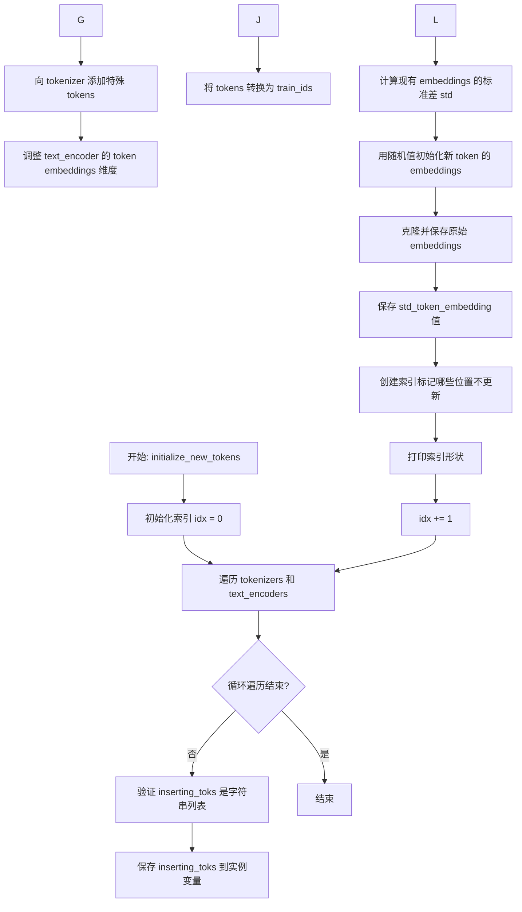

#### 带注释源码

```python
def initialize_new_tokens(self, inserting_toks: List[str]):
    """
    初始化新token，将它们添加到tokenizer并随机初始化其嵌入向量
    
    参数:
        inserting_toks: 要插入的新token列表，如 ["<s0>", "<s1>"]
    """
    idx = 0  # 用于追踪当前处理的text_encoder索引
    
    # 遍历所有的tokenizer和text_encoder（通常是CLIP ViT-L/14和CLIP ViT-G/14）
    for tokenizer, text_encoder in zip(self.tokenizers, self.text_encoders):
        # 参数校验：确保inserting_toks是字符串列表
        assert isinstance(inserting_toks, list), "inserting_toks should be a list of strings."
        assert all(isinstance(tok, str) for tok in inserting_toks), (
            "All elements in inserting_toks should be strings."
        )

        # 保存要插入的tokens
        self.inserting_toks = inserting_toks
        
        # 创建特殊token字典并添加到tokenizer
        special_tokens_dict = {"additional_special_tokens": self.inserting_toks}
        tokenizer.add_special_tokens(special_tokens_dict)
        
        # 调整text_encoder的token embeddings以匹配新的tokenizer大小
        text_encoder.resize_token_embeddings(len(tokenizer))

        # 将token字符串转换为token ID（用于训练）
        self.train_ids = tokenizer.convert_tokens_to_ids(self.inserting_toks)

        # 获取现有token embeddings的标准差，用于保持初始化分布一致
        std_token_embedding = text_encoder.text_model.embeddings.token_embedding.weight.data.std()

        print(f"{idx} text encoder's std_token_embedding: {std_token_embedding}")

        # 随机初始化新token的embeddings，保持与原有embeddings相似的分布
        # 使用与模型相同设备和数据类型
        text_encoder.text_model.embeddings.token_embedding.weight.data[self.train_ids] = (
            torch.randn(len(self.train_ids), text_encoder.text_model.config.hidden_size)
            .to(device=self.device)
            .to(dtype=self.dtype)
            * std_token_embedding  # 乘以标准差保持分布一致
        )
        
        # 保存原始embeddings的副本，用于后续可能的回滚操作
        self.embeddings_settings[f"original_embeddings_{idx}"] = (
            text_encoder.text_model.embeddings.token_embedding.weight.data.clone()
        )
        
        # 保存标准差供retract_embeddings时使用
        self.embeddings_settings[f"std_token_embedding_{idx}"] = std_token_embedding

        # 创建布尔索引：标记哪些embeddings不需要更新
        # 初始化为全True（新token位置设为False）
        inu = torch.ones((len(tokenizer),), dtype=torch.bool)
        inu[self.train_ids] = False

        # 保存索引设置
        self.embeddings_settings[f"index_no_updates_{idx}"] = inu

        print(self.embeddings_settings[f"index_no_updates_{idx}"].shape)

        idx += 1
```


### `TokenEmbeddingsHandler.save_embeddings`

该方法用于将训练后的文本编码器新 token（用于 Textual Inversion）的嵌入向量保存到 safetensors 格式的文件中，以便后续推理时加载使用。

参数：

- `file_path`：`str`，指定保存嵌入向量的目标文件路径（.safetensors 格式）

返回值：`None`，无返回值（直接写入文件）

#### 流程图

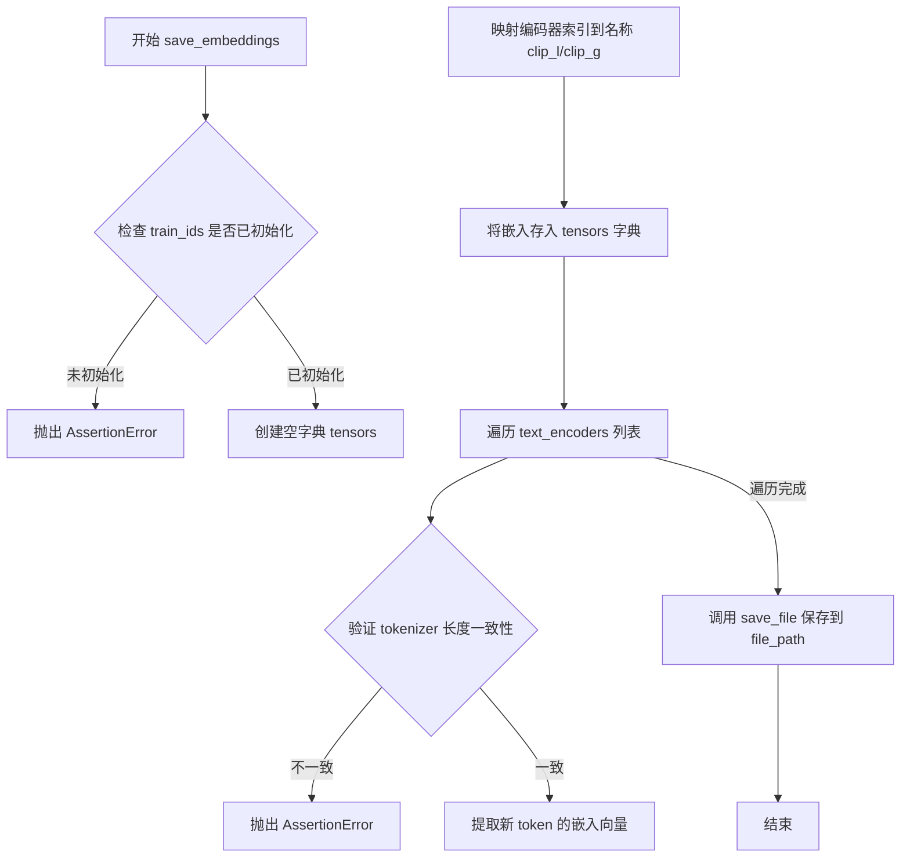

#### 带注释源码

```python
def save_embeddings(self, file_path: str):
    """
    将文本编码器的新 token 嵌入保存到 safetensors 文件中
    
    参数:
        file_path: str - 保存路径，格式为 .safetensors
    返回:
        None
    """
    # 断言检查：确保已经初始化了新 token（通过 initialize_new_tokens 方法）
    # 如果未初始化，抛出 AssertionError 并提示需要先初始化
    assert self.train_ids is not None, "Initialize new tokens before saving embeddings."
    
    # 创建字典用于存储各文本编码器的嵌入向量
    tensors = {}
    
    # 定义文本编码器索引到名称的映射
    # text_encoder_0 对应 CLIP ViT-L/14 (clip_l)
    # text_encoder_1 对应 CLIP ViT-G/14 (clip_g)
    idx_to_text_encoder_name = {0: "clip_l", 1: "clip_g"}
    
    # 遍历所有文本编码器（支持单文本编码器和双文本编码器如 SDXL）
    for idx, text_encoder in enumerate(self.text_encoders):
        # 验证所有 tokenizer 长度一致，确保嵌入对齐正确
        assert text_encoder.text_model.embeddings.token_embedding.weight.data.shape[0] == len(
            self.tokenizers[0]
        ), "Tokenizers should be the same."
        
        # 从文本编码器的 token_embedding 层提取新添加 token 的嵌入向量
        # self.train_ids 存储了新 token 的 token ID 列表
        new_token_embeddings = text_encoder.text_model.embeddings.token_embedding.weight.data[self.train_ids]

        # 为保持与生态系统的兼容性，新 token 按 "clip_l"（text_encoder 0）和 "clip_g"（text_encoder 1）保存
        # 注意：使用 diffusers 加载时可以使用任意名称，只需在推理时指定即可
        tensors[idx_to_text_encoder_name[idx]] = new_token_embeddings
        # 也可以使用以下方式保存（已注释）:
        # tensors[f"text_encoders_{idx}"] = new_token_embeddings

    # 使用 safetensors 库将嵌入向量保存到指定文件
    save_file(tensors, file_path)
```


### `TokenEmbeddingsHandler.retract_embeddings`

该方法用于在训练过程中将文本编码器的token嵌入恢复为原始状态。对于未更新的token嵌入，直接恢复为初始化时保存的原始嵌入；对于训练过程中更新的token嵌入，通过标准化处理使其恢复到与原始嵌入相似的标准差水平，以确保嵌入向量的数值分布一致性。

参数：
- 无显式参数（仅使用实例属性 `self.text_encoders` 和 `self.embeddings_settings`）

返回值：`None`，该方法直接修改文本编码器的嵌入权重，不返回任何值

#### 流程图

```mermaid
flowchart TD
    A[开始 retract_embeddings] --> B[遍历 text_encoders 列表]
    B --> C[获取当前 text_encoder 的索引 idx]
    C --> D[获取 index_no_updates 布尔掩码]
    D --> E{遍历每个 text_encoder}
    
    E --> F[恢复未更新的嵌入: 将 original_embeddings 复制回 token_embedding]
    F --> G[获取原始标准差 std_token_embedding]
    G --> H[计算更新索引的掩码: index_updates = ~index_no_updates]
    H --> I[获取更新后的嵌入向量]
    
    I --> J[计算标准差偏移比率: off_ratio = std_token_embedding / new_embeddings.std]
    J --> K[应用缩放因子: new_embeddings * (off_ratio ** 0.1)]
    K --> L[将标准化后的嵌入写回 token_embedding]
    
    L --> M{是否还有更多 text_encoder?}
    M -->|是| B
    M -->|否| N[结束]
```

#### 带注释源码

```python
@torch.no_grad()  # 禁用梯度计算，减少内存占用
def retract_embeddings(self):
    """
    恢复文本编码器的token嵌入到原始状态，并对训练中更新的嵌入进行标准化处理。
    该方法在每个训练步骤后调用，用于将嵌入权重重置为基准状态。
    """
    # 遍历所有文本编码器（通常为1个或2个，取决于模型架构）
    for idx, text_encoder in enumerate(self.text_encoders):
        # 从 embeddings_settings 字典中获取索引掩码
        # index_no_updates 为 True 表示该位置的嵌入未被训练更新（保持原始状态）
        index_no_updates = self.embeddings_settings[f"index_no_updates_{idx}"]
        
        # 步骤1: 恢复未更新的嵌入到原始状态
        # 从保存的 original_embeddings 中复制未被训练修改的嵌入权重
        text_encoder.text_model.embeddings.token_embedding.weight.data[index_no_updates] = (
            self.embeddings_settings[f"original_embeddings_{idx}"][index_no_updates]
            .to(device=text_encoder.device)   # 确保设备一致性
            .to(dtype=text_encoder.dtype)     # 确保数据类型一致性
        )

        # 步骤2: 对训练过程中更新的嵌入进行标准化处理
        # 获取原始嵌入的标准差，用于后续标准化
        std_token_embedding = self.embeddings_settings[f"std_token_embedding_{idx}"]

        # 计算更新索引的掩码（取反未更新索引）
        index_updates = ~index_no_updates
        
        # 获取训练过程中被更新的嵌入向量
        new_embeddings = text_encoder.text_model.embeddings.token_embedding.weight.data[index_updates]
        
        # 计算标准差偏移比率：新标准差与原始标准差的比值
        off_ratio = std_token_embedding / new_embeddings.std()

        # 应用缩放因子（0.1次方作为平滑因子，避免过度调整）
        # 这确保更新后的嵌入具有与原始嵌入相似的数值分布
        new_embeddings = new_embeddings * (off_ratio**0.1)
        
        # 将标准化后的嵌入写回模型
        text_encoder.text_model.embeddings.token_embedding.weight.data[index_updates] = new_embeddings
```


### `TokenEmbeddingsHandler.dtype`

获取第一个文本编码器的数据类型（dtype），用于在训练过程中获取模型权重的精度类型（如 float32、float16、bfloat16 等）。

参数：

- 此属性无需参数（`self` 为隐式参数）

返回值：`torch.dtype`，返回第一个文本编码器（`text_encoders[0]`）的权重数据类型。

#### 流程图

```mermaid
flowchart TD
    A[调用 dtype 属性] --> B{获取 self.text_encoders}
    B --> C[访问 text_encoders[0]]
    C --> D[读取 .dtype 属性]
    D --> E[返回 torch.dtype 类型]
    
    style A fill:#f9f,stroke:#333
    style E fill:#9f9,stroke:#333
```

#### 带注释源码

```python
@property
def dtype(self):
    """
    获取第一个文本编码器的数据类型。
    
    该属性用于在训练过程中动态获取文本编码器的精度类型，
    以确保在初始化新token embeddings时使用正确的数据类型。
    
    Returns:
        torch.dtype: 第一个文本编码器的权重数据类型（如 torch.float32, torch.float16 等）
    """
    return self.text_encoders[0].dtype
```

---

**设计说明：**

| 项目 | 说明 |
|------|------|
| **所属类** | `TokenEmbeddingsHandler` |
| **位置** | 代码第 618-620 行 |
| **依赖** | 依赖 `self.text_encoders` 列表非空 |
| **调用场景** | 在 `initialize_new_tokens` 方法中使用，用于将新 token 的 embeddings 转换为正确的 dtype |
| **设计意图** | 提供一个统一的接口获取文本编码器的数据类型，确保 embeddings 与模型精度保持一致 |


### `TokenEmbeddingsHandler.device`

获取第一个文本编码器所在的设备（CPU 或 CUDA），用于确保所有文本编码操作在同一设备上执行。

参数：

- 无参数（该方法为属性访问器）

返回值：`torch.device`，第一个文本编码器所在的设备

#### 流程图

```mermaid
flowchart TD
    A[访问 device 属性] --> B{获取 text_encoders}
    B --> C[获取 text_encoders[0]]
    C --> D[返回 text_encoders[0].device]
    D --> E[返回 torch.device 对象]
```

#### 带注释源码

```python
@property
def device(self):
    """
    获取第一个文本编码器所在的设备。
    
    该属性用于确保 TokenEmbeddingsHandler 的所有操作
    （如嵌入初始化、保存等）都在正确的设备上执行。
    
    Returns:
        torch.device: 第一个文本编码器所在的设备 (cpu/cuda)
    """
    return self.text_encoders[0].device
```


### `DreamBoothDataset.__init__`

初始化DreamBooth数据集，用于准备Fine-tuning Stable Diffusion模型的实例图像和类别图像及其对应的提示词。该方法支持从HuggingFace数据集或本地文件夹加载图像数据，并进行图像预处理（大小调整、裁剪、归一化）。

参数：

- `instance_data_root`：`str`，本地实例图像文件夹路径，当不指定`dataset_name`时使用
- `instance_prompt`：`str`，实例提示词，用于描述实例图像
- `class_prompt`：`str`，类别提示词，用于描述类别图像（用于先验保留损失）
- `dataset_name`：`str`，HuggingFace数据集名称，若指定则从Hub加载数据集
- `dataset_config_name`：`str`，数据集配置名称
- `cache_dir`：`str`，数据集缓存目录
- `image_column`：`str`，数据集中图像列的名称，默认为"image"
- `caption_column`：`str`，数据集中提示词/描述列的名称
- `train_text_encoder_ti`：`bool`，是否训练文本编码器的文本反转token
- `class_data_root`：`str`，类别图像文件夹路径（可选），用于先验保留
- `class_num`：`int`，类别图像数量限制（可选）
- `token_abstraction_dict`：`dict`，token映射字典，用于文本反转训练时将抽象token映射到具体的新token
- `size`：`int`，图像目标尺寸，默认为1024
- `repeats`：`int`，数据重复次数，默认为1
- `center_crop`：`bool`，是否中心裁剪，默认为False（随机裁剪）

返回值：`None`，该方法为构造函数，不返回值

#### 流程图

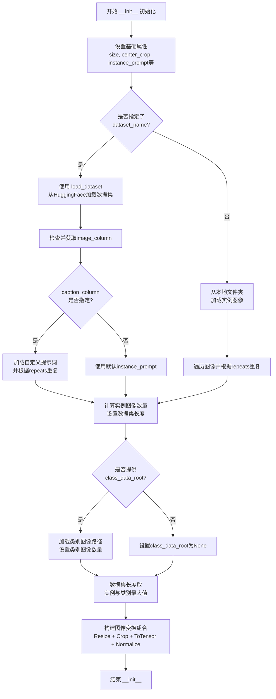

#### 带注释源码

```python
def __init__(
    self,
    instance_data_root,
    instance_prompt,
    class_prompt,
    dataset_name,
    dataset_config_name,
    cache_dir,
    image_column,
    caption_column,
    train_text_encoder_ti,
    class_data_root=None,
    class_num=None,
    token_abstraction_dict=None,  # token映射字典，用于文本反转训练
    size=1024,
    repeats=1,
    center_crop=False,
):
    """
    初始化DreamBooth数据集
    
    参数:
        instance_data_root: 本地实例图像文件夹路径
        instance_prompt: 实例提示词
        class_prompt: 类别提示词，用于先验保留损失
        dataset_name: HuggingFace数据集名称
        dataset_config_name: 数据集配置名称
        cache_dir: 缓存目录
        image_column: 图像列名
        caption_column: 提示词列名
        train_text_encoder_ti: 是否训练文本反转
        class_data_root: 类别图像目录（可选）
        class_num: 类别图像最大数量（可选）
        token_abstraction_dict: token映射字典（可选）
        size: 目标图像尺寸
        repeats: 数据重复次数
        center_crop: 是否中心裁剪
    """
    # 1. 设置基础属性
    self.size = size
    self.center_crop = center_crop

    self.instance_prompt = instance_prompt
    self.custom_instance_prompts = None  # 自定义提示词，初始为None
    self.class_prompt = class_prompt
    self.token_abstraction_dict = token_abstraction_dict
    self.train_text_encoder_ti = train_text_encoder_ti
    
    # 2. 根据dataset_name决定数据加载方式
    # 如果指定了dataset_name，从HuggingFace Hub加载
    if dataset_name is not None:
        try:
            from datasets import load_dataset
        except ImportError:
            raise ImportError(
                "You are trying to load your data using the datasets library. If you wish to train using custom "
                "captions please install the datasets library: `pip install datasets`. If you wish to load a "
                "local folder containing images only, specify --instance_data_dir instead."
            )
        
        # 使用load_dataset下载并加载数据集
        dataset = load_dataset(
            dataset_name,
            dataset_config_name,
            cache_dir=cache_dir,
        )
        
        # 获取训练集的列名
        column_names = dataset["train"].column_names

        # 3. 处理image_column
        if image_column is None:
            image_column = column_names[0]  # 默认为第一列
            logger.info(f"image column defaulting to {image_column}")
        else:
            if image_column not in column_names:
                raise ValueError(
                    f"`--image_column` value '{image_column}' not found in dataset columns. Dataset columns are: {', '.join(column_names)}"
                )
        
        # 获取实例图像
        instance_images = dataset["train"][image_column]

        # 4. 处理caption_column（自定义提示词）
        if caption_column is None:
            logger.info(
                "No caption column provided, defaulting to instance_prompt for all images. If your dataset "
                "contains captions/prompts for the images, make sure to specify the "
                "column as --caption_column"
            )
            self.custom_instance_prompts = None
        else:
            if caption_column not in column_names:
                raise ValueError(
                    f"`--caption_column` value '{caption_column}' not found in dataset columns. Dataset columns are: {', '.join(column_names)}"
                )
            
            # 获取自定义提示词并根据repeats重复
            custom_instance_prompts = dataset["train"][caption_column]
            self.custom_instance_prompts = []
            for caption in custom_instance_prompts:
                self.custom_instance_prompts.extend(itertools.repeat(caption, repeats))
    else:
        # 5. 从本地文件夹加载图像
        self.instance_data_root = Path(instance_data_root)
        if not self.instance_data_root.exists():
            raise ValueError("Instance images root doesn't exists.")

        # 打开文件夹中所有图像文件
        instance_images = [Image.open(path) for path in list(Path(instance_data_root).iterdir())]
        self.custom_instance_prompts = None

    # 6. 处理实例图像，根据repeats重复
    self.instance_images = []
    for img in instance_images:
        self.instance_images.extend(itertools.repeat(img, repeats))
    
    self.num_instance_images = len(self.instance_images)
    self._length = self.num_instance_images  # 数据集长度

    # 7. 获取插值模式
    interpolation = getattr(transforms.InterpolationMode, args.image_interpolation_mode.upper(), None)
    if interpolation is None:
        raise ValueError(f"Unsupported interpolation mode {interpolation=}.")

    # 8. 处理类别图像（用于先验保留）
    if class_data_root is not None:
        self.class_data_root = Path(class_data_root)
        self.class_data_root.mkdir(parents=True, exist_ok=True)
        self.class_images_path = list(self.class_data_root.iterdir())
        
        # 根据class_num限制类别图像数量
        if class_num is not None:
            self.num_class_images = min(len(self.class_images_path), class_num)
        else:
            self.num_class_images = len(self.class_images_path)
        
        # 数据集长度取实例与类别图像数量的最大值
        self._length = max(self.num_class_images, self.num_instance_images)
    else:
        self.class_data_root = None

    # 9. 构建图像变换 pipeline
    self.image_transforms = transforms.Compose(
        [
            transforms.Resize(size, interpolation=interpolation),  # 调整大小
            transforms.CenterCrop(size) if center_crop else transforms.RandomCrop(size),  # 裁剪方式
            transforms.ToTensor(),  # 转换为张量
            transforms.Normalize([0.5], [0.5]),  # 归一化到[-1, 1]
        ]
    )
```


### `DreamBoothDataset.__len__`

该方法返回 DreamBoothDataset 数据集的长度，用于 PyTorch DataLoader 确定数据集大小。

参数：

- 无（仅包含隐式参数 `self`）

返回值：`int`，返回数据集的长度，即 `self._length` 的值。该值在数据集初始化时设置为 `max(self.num_class_images, self.num_instance_images)`，确保数据加载器可以遍历所有数据。

#### 流程图

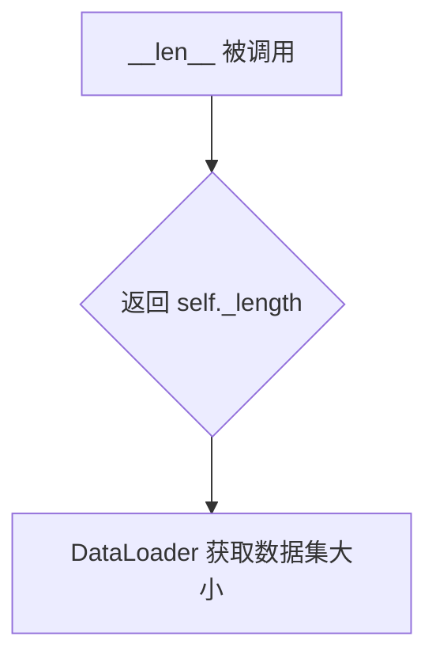

#### 带注释源码

```python
def __len__(self):
    """
    返回数据集的长度。
    
    该方法实现了 PyTorch Dataset 类的 __len__ 协议，使 DataLoader 
    能够确定数据集的大小。返回值是 self._length，它在初始化时根据
    实例图像数量和类图像数量（如果有）中较大的那个来确定。
    
    Returns:
        int: 数据集中的样本数量
    """
    return self._length
```


### `DreamBoothDataset.__getitem__`

获取指定索引处的训练数据项，包括实例图像和类别图像（如果存在），并返回包含图像tensor和对应文本提示的字典。

参数：

-  `index`：`int`，数据集中的索引位置，用于获取对应的图像和提示

返回值：`dict`，包含以下键值对：
  - `"instance_images"`：`torch.Tensor`，经转换后的实例图像tensor
  - `"instance_prompt"`：`str`，实例图像对应的文本提示
  - `"class_images"`：`torch.Tensor`（可选），经转换后的类别图像tensor（当启用prior preservation时存在）
  - `"class_prompt"`：`str`（可选），类别图像对应的文本提示（当启用prior preservation时存在）

#### 流程图

```mermaid
flowchart TD
    A[开始 __getitem__] --> B[创建空字典 example]
    C[获取实例图像] --> D[exif_transpose 校正图像方向]
    D --> E{图像模式是否为RGB?}
    E -->|否| F[转换为RGB模式]
    E -->|是| G[直接使用]
    F --> G
    G --> H[使用 image_transforms 转换图像为tensor]
    H --> I[将转换后的tensor存入 example['instance_images']]
    
    I --> J{是否存在自定义提示?}
    J -->|是| K[获取自定义提示 caption]
    K --> L{caption是否存在且非空?}
    L -->|是| M{是否训练文本编码器TI?}
    M -->|是| N[替换token_abstraction为新token]
    M -->|否| O[直接使用caption]
    N --> O
    L -->|否| P[使用默认 instance_prompt]
    O --> Q[保存到 example['instance_prompt']]
    P --> Q
    J -->|否| R[使用默认 instance_prompt]
    R --> Q
    
    Q --> S{是否存在 class_data_root?}
    S -->|是| T[打开类别图像]
    T --> U[exif_transpose 校正图像方向]
    U --> V{图像模式是否为RGB?}
    V -->|否| W[转换为RGB模式]
    V -->|是| X[直接使用]
    W --> X
    X --> Y[转换类别图像]
    Y --> Z[保存到 example['class_images'] 和 example['class_prompt']]
    S -->|否| AA[返回 example]
    Z --> AA
    
    style A fill:#f9f,color:#333
    style AA fill:#9f9,color:#333
```

#### 带注释源码

```python
def __getitem__(self, index):
    """
    获取指定索引处的训练数据项
    
    参数:
        index: 数据集中的索引位置
        
    返回:
        包含图像tensor和文本提示的字典
    """
    example = {}  # 创建用于返回的字典
    
    # 1. 获取实例图像（通过取模处理循环索引）
    instance_image = self.instance_images[index % self.num_instance_images]
    
    # 2. 校正图像方向（根据EXIF信息）
    instance_image = exif_transpose(instance_image)
    
    # 3. 确保图像为RGB模式（PIL图像可能是RGBA或灰度图）
    if not instance_image.mode == "RGB":
        instance_image = instance_image.convert("RGB")
    
    # 4. 使用预定义的图像转换pipeline进行处理
    # - Resize到指定尺寸
    # - 中心裁剪或随机裁剪
    # - 转换为tensor并归一化到[-1, 1]
    example["instance_images"] = self.image_transforms(instance_image)
    
    # 5. 处理文本提示
    if self.custom_instance_prompts:
        # 如果有自定义提示（每个图像有对应的描述）
        caption = self.custom_instance_prompts[index % self.num_instance_images]
        if caption:
            if self.train_text_encoder_ti:
                # 如果使用文本反转训练，用新token替换token_abstraction标识符
                # 例如: "a TOK dog" -> "a <s0><s1> dog"
                for token_abs, token_replacement in self.token_abstraction_dict.items():
                    caption = caption.replace(token_abs, "".join(token_replacement))
            example["instance_prompt"] = caption
        else:
            # caption为空时使用默认instance_prompt
            example["instance_prompt"] = self.instance_prompt
    else:
        # 没有自定义提示时，使用统一的instance_prompt
        example["instance_prompt"] = self.instance_prompt
    
    # 6. 处理类别图像（用于prior preservation loss）
    if self.class_data_root:
        # 打开并加载类别图像
        class_image = Image.open(self.class_images_path[index % self.num_class_images])
        class_image = exif_transpose(class_image)
        
        # 确保类别图像为RGB模式
        if not class_image.mode == "RGB":
            class_image = class_image.convert("RGB")
        
        # 转换类别图像
        example["class_images"] = self.image_transforms(class_image)
        example["class_prompt"] = self.class_prompt
    
    return example
```


### `PromptDataset.__init__`

这是 `PromptDataset` 类的初始化方法，用于创建一个简单的数据集，以准备在多个GPU上生成类图像的提示词。

参数：

- `prompt`：`str`，用于生成类图像的提示词（prompt）
- `num_samples`：`int`，要生成的样本数量

返回值：无（`None`），构造函数不返回值，仅初始化对象状态

#### 流程图

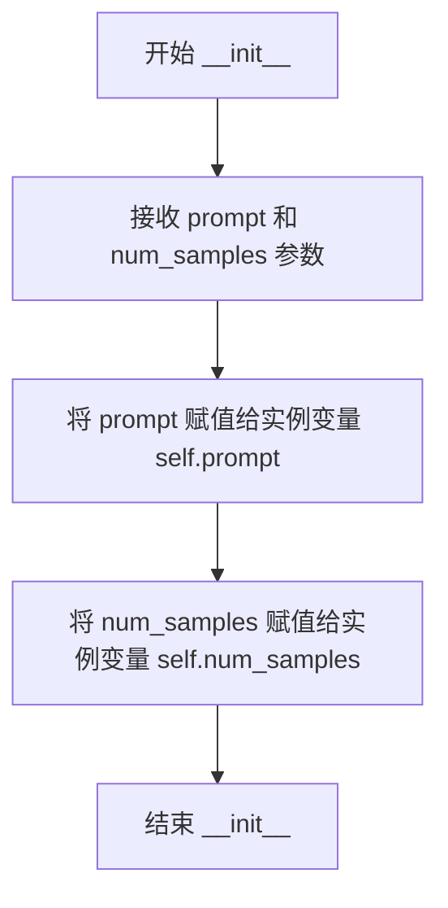

#### 带注释源码

```python
class PromptDataset(Dataset):
    """A simple dataset to prepare the prompts to generate class images on multiple GPUs."""

    def __init__(self, prompt, num_samples):
        """
        初始化 PromptDataset 实例。

        Args:
            prompt (str): 用于生成类图像的文本提示词。
            num_samples (int): 要生成的样本数量。

        Returns:
            None: 构造函数不返回值。
        """
        self.prompt = prompt  # 存储提示词
        self.num_samples = num_samples  # 存储样本数量

    def __len__(self):
        """返回数据集中的样本数量。"""
        return self.num_samples

    def __getitem__(self, index):
        """
        根据索引获取数据集中的单个样本。

        Args:
            index (int): 样本的索引。

        Returns:
            dict: 包含 'prompt' 和 'index' 的字典。
        """
        example = {}
        example["prompt"] = self.prompt
        example["index"] = index
        return example
```


### `PromptDataset.__len__`

返回数据集中样本的数量，用于支持 Python 的 `len()` 函数，使数据集能够与 PyTorch 的 DataLoader 兼容。

参数：

- `self`：`PromptDataset` 实例，隐式参数，表示当前对象本身

返回值：`int`，返回 `num_samples` 属性值，即要生成的样本总数

#### 流程图

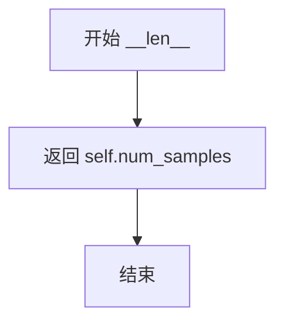

#### 带注释源码

```python
def __len__(self):
    """
    返回数据集中样本的数量。
    
    这个方法实现了 Python 的魔术方法 __len__，使得可以调用 len(dataset)
    来获取数据集中的样本数量。PyTorch 的 DataLoader 会使用这个方法来确定
    迭代的 epoch 数量。
    
    Returns:
        int: 数据集中的样本数量，等于初始化时传入的 num_samples 参数。
    """
    return self.num_samples
```


### `PromptDataset.__getitem__`

获取指定索引位置的样本数据，返回包含提示词和索引的字典。

参数：

-  `index`：`int`，要获取的样本索引

返回值：`dict`，包含 "prompt"（提示词字符串）和 "index"（索引值）的字典

#### 流程图

```mermaid
flowchart TD
    A[__getitem__ 方法被调用] --> B[创建空字典 example]
    B --> C[将 self.prompt 存入 example['prompt']]
    C --> D[将 index 存入 example['index']]
    D --> E[返回 example 字典]
```

#### 带注释源码

```python
def __getitem__(self, index):
    """
    根据给定的索引获取一个样本。
    
    参数:
        index (int): 样本的索引位置
        
    返回:
        dict: 包含 'prompt' 和 'index' 键的字典，用于生成类别图像
    """
    example = {}  # 初始化空字典用于存放样本数据
    example["prompt"] = self.prompt  # 将预设的提示词存入字典
    example["index"] = index  # 将当前索引存入字典
    return example  # 返回包含提示词和索引的字典
```


## 关键组件


### TokenEmbeddingsHandler

文本嵌入处理器，负责管理Textual Inversion训练中的新token初始化、保存和回滚。核心功能包括：为文本编码器添加新的特殊token、随机初始化嵌入向量、保存训练后的embeddings到safetensors文件、以及在训练每步后回滚非训练token的嵌入。

### DreamBoothDataset

DreamBooth训练数据集类，负责加载实例图像和类别图像进行微调。核心功能包括：支持从HuggingFace Hub或本地文件夹加载数据、图像预处理（resize、crop、normalize）、自定义caption支持、token abstraction映射处理。

### LoraConfig & LoRA训练配置

LoRA训练的核心配置模块，使用peft库实现低秩适配。配置参数包括：rank（LoRA维度）、lora_alpha、lora_dropout、target_modules（注意力层目标模块）、use_dora（是否使用DoRA权重分解方法）。

### 混合精度训练策略

代码支持fp16和bf16混合精度训练，通过accelerator实现。权重类型转换逻辑：训练时将非训练权重（VAE、非LoRA的text_encoder和unet）转换为半精度以节省显存，LoRA参数保持fp32以保证训练稳定性。

### 噪声调度器 (DDPMScheduler)

扩散模型噪声调度器，负责在训练过程中添加噪声和计算目标噪声。使用DDPMScheduler实现前向扩散过程，支持epsilon和v_prediction两种预测类型。

### 文本编码器训练策略

支持三种文本编码器训练模式：完整LoRA训练（train_text_encoder）、Textual Inversion训练（train_text_encoder_ti）、冻结文本编码器。通过不同的参数组配置和学习率调度实现不同训练策略的切换。

### Prior Preservation Loss

先验 preservation 损失实现，用于保持类别先验。通过同时训练实例图像和类别图像，计算实例损失和先验损失的加权组合，确保模型不会忘记类别的通用特征。

### 验证流程模块

训练过程中的验证模块，定期生成验证图像。使用DPMSolverMultistepScheduler进行推理，支持TensorBoard和WandB日志记录，包含图像生成、缓存清理和pipeline管理。

### 检查点管理

检查点保存和加载机制，支持定期保存训练状态、恢复训练、限制最大检查点数量。包含save_model_hook和load_model_hook自定义钩子，用于正确序列化LoRA权重和Textual Inversion embeddings。

### 优化器配置

支持AdamW和Prodigy两种优化器，包含8-bit Adam选项。参数组配置支持unet和text_encoder使用不同的学习率和权重衰减，支持学习率预热和多种调度器（cosine、linear、polynomial等）。


## 问题及建议


### 已知问题

- **作用域错误**: `DreamBoothDataset` 类中直接引用全局变量 `args.image_interpolation_mode`，而不是将其作为参数传入，这会导致类无法独立使用，且难以测试。
- **编码函数逻辑缺陷**: `encode_prompt` 函数遍历多个 text_encoder 但只返回最后一个的结果，当有多个 text_encoder 时会导致前面的编码结果丢失。
- **内存占用风险**: `latents_cache` 将所有训练样本的 VAE latents 存储在内存中，对于大规模数据集可能导致内存溢出。
- **缺失参数**: `tokenize_prompt` 函数只返回 `input_ids`，没有返回 `attention_mask`，可能影响某些模型的编码质量。
- **重复代码**: 验证图像生成的逻辑在训练循环内部和训练结束后重复出现，违反了 DRY 原则。
- **缺少类型提示**: 整个代码中很少使用类型注解，降低了代码的可读性和可维护性。
- **Checkpoint 恢复不完善**: 当 `resume_from_checkpoint` 指定了路径但该路径不存在时，代码只是发出警告后继续，但没有验证 checkpoint 的完整性。

### 优化建议

- **重构 Dataset 类**: 将 `args.image_interpolation_mode` 作为 `__init__` 的参数传入，使类可以独立复用。
- **修复编码函数**: 修改 `encode_prompt` 函数以正确聚合多个 text_encoder 的输出，或在仅使用单个 encoder 时提前返回。
- **优化 Latent 缓存**: 改为按批次动态缓存或使用磁盘缓存，避免内存压力。
- **提取验证逻辑**: 将验证代码封装为独立函数，在训练中和结束后复用。
- **增加类型注解**: 为关键函数和类方法添加类型提示，提高代码可读性。
- **增强错误处理**: 在加载 checkpoint 前验证其有效性，并提供更明确的错误信息。
- **添加文档字符串**: 为主要类和函数添加详细的 docstring，说明参数、返回值和功能。

## 其它


### 设计目标与约束

本代码实现基于Stable Diffusion 1.5的DreamBooth LoRA训练脚本，核心目标是通过LoRA（Low-Rank Adaptation）技术对预训练扩散模型进行微调，以实现个性化主题训练。设计约束包括：支持文本编码器微调（LoRA或Textual Inversion两种模式）、支持Prior Preservation防止过拟合、支持多GPU分布式训练、仅训练LoRA参数保持主模型权重不变。训练精度支持FP16/BF16混合精度，需PyTorch≥2.0.0和diffusers≥0.37.0.dev0。

### 错误处理与异常设计

代码包含多层错误处理机制。在参数解析阶段，`parse_args()`函数对互斥参数进行验证：dataset_name和instance_data_dir只能二选一、train_text_encoder和train_text_encoder_ti不能同时开启、with_prior_preservation必须配合class_data_dir和class_prompt使用。导入依赖时使用try-except捕获ImportError并给出安装提示。分布式训练环境变量LOCAL_RANK会自动同步到args.local_rank。模型加载失败时抛出FileNotFoundError，显存不足时通过`torch.cuda.empty_cache()`和gc清理。梯度裁剪防止NaN损失，数值精度检查通过weight_dtype和torch.float32的VAE强制转换实现。

### 数据流与状态机

训练数据流分为三个阶段：初始化阶段加载数据集和预训练模型、训练阶段执行前向传播和反向更新、验证阶段生成样本图像。状态转换通过以下流程控制：accelerator.prepare()准备模型和优化器、epoch循环控制训练轮数、step循环执行每个batch、sync_gradients判断是否执行梯度同步和检查点保存。Text Encoder训练支持半程停止机制（train_text_encoder_frac参数），通过将学习率设为0实现。模型保存状态机支持从checkpoint恢复训练或保存最新检查点。

### 外部依赖与接口契约

核心依赖包括：diffusers（模型加载和训练工具）、transformers（文本编码器）、accelerate（分布式训练）、peft（LoRA实现）、torch（深度学习框架）。可选依赖：bitsandbytes（8位Adam优化器）、wandb（实验跟踪）、xformers（高效注意力）、datasets（HuggingFace数据集加载）。关键接口契约：模型输入为512x512分辨率图像、输出为LoRA权重文件（.safetensors格式）、文本编码器支持CLIPTextModel和CLIPTextModelWithProjection两种架构、VAE采用AutoencoderKL。训练生成的模型卡片（README.md）遵循HuggingFace Model Card规范。

### 性能优化策略

代码实现多项性能优化：Gradient Checkpointing通过`unet.enable_gradient_checkpointing()`降低显存占用约30%；Mixed Precision（FP16/BF16）通过accelerator自动启用；xformers Memory Efficient Attention通过`unet.enable_xformers_memory_efficient_attention()`提升推理速度；Latent Caching通过`args.cache_latents`预计算VAE latents减少重复计算；TF32 on Ampere GPUs通过`torch.backends.cuda.matmul.allow_tf32=True`加速矩阵运算；Dataloader多进程加载通过`dataloader_num_workers`参数控制。LoRA rank参数（默认4）控制参数量和训练速度的平衡。

### 配置管理与参数体系

参数体系分为五大类：模型参数（pretrained_model_name_or_path、rank、lora_dropout）、数据参数（dataset_name、instance_data_dir、resolution、center_crop）、训练参数（learning_rate、num_train_epochs、gradient_accumulation_steps、max_train_steps）、优化器参数（optimizer、adam_weight_decay、max_grad_norm）、日志与保存参数（output_dir、checkpointing_steps、report_to、push_to_hub）。参数通过argparse解析，支持YAML配置文件和环境变量覆盖，默认值针对单GPU 4 batch训练场景优化。

### 资源管理与监控

GPU资源管理包括：VAE强制使用float32避免NaN损失、LoRA参数在混合精度训练时升为float32、显存通过梯度累积实现大batch训练、xformers自动检测兼容性。内存泄漏防护：及时删除pipeline实例、每个epoch后调用`torch.cuda.empty_cache()`、使用`gc.collect()`清理Python对象。训练监控通过TensorBoard/WandB记录loss曲线、学习率变化、验证图像，支持梯度裁剪监控（max_grad_norm=1.0）和训练步数统计。

### 模型保存与加载机制

保存机制采用三级架构：常规检查点（checkpoint-{step}）保存完整训练状态、LoRA权重单独保存为pytorch_lora_weights.safetensors、Textual Inversion embeddings保存为{repo}_emb.safetensors。加载机制通过register_save_state_pre_hook和register_load_state_pre_hook自定义保存/加载逻辑，支持LoRA权重与基础模型分离部署。模型格式转换支持diffusers格式与Kohya格式互转，便于在WebUI和ComfyUI中使用。Model Card自动生成包含使用说明和示例代码。

### 分布式训练支持

基于Accelerator实现多GPU分布式训练，支持DataParallel和DistributedDataParallel两种模式。通过`find_unused_parameters=True`处理LoRA only训练场景。主进程（is_main_process）负责模型保存和Hub上传，其他进程执行训练任务。梯度同步通过`accelerator.sync_gradients`控制，确保所有进程完成反向传播后执行参数更新。混合精度由accelerator自动协调，支持FP16/BF16和TF32。检查点保存采用安全写入避免多进程冲突。

    