# `diffusers\examples\advanced_diffusion_training\train_dreambooth_lora_sdxl_advanced.py` 详细设计文档

这是一个用于微调 Stable Diffusion XL (SDXL) 模型的训练脚本，主要实现了 DreamBooth 训练范式，结合了 LoRA (Low-Rank Adaptation) 技术以实现轻量级的个性化训练。脚本支持文本编码器微调、文本反转 (Textual Inversion)、先验保存 (Prior Preservation)、混合精度训练以及多种高级调度器和优化器选项。

## 整体流程

```mermaid
graph TD
    A[入口: parse_args] --> B[main(args)]
    B --> C[初始化Accelerator与日志]
    C --> D[加载基础模型: UNet, VAE, TextEncoders, Tokenizers]
    E[数据准备] --> D
    E --> F{是否需要先验图片?}
    F -- 是 --> G[使用Pipeline生成Class Images]
    F -- 否 --> H[跳过]
    G --> I[构建DreamBoothDataset]
    D --> I
    I --> J[配置LoRA适配器 (UNet & Text Encoder)]
    J --> K[构建优化器 (AdamW/Prodigy) & 学习率调度器]
    K --> L[训练循环: For Epoch > Step]
    L --> M[前向传播: 编码图片 -> 加噪 -> UNet预测]
    M --> N[计算损失: MSE/EDM + Prior Loss (可选)]
    N --> O[反向传播 & 梯度裁剪]
    O --> P{是否到达Checkpoint保存点?}
    P -- 是 --> Q[保存LoRA权重与Textual Inversion Embeddings]
    P -- 否 --> R[跳过]
    L --> S{是否进行Validation?}
    S -- 是 --> T[log_validation: 推理生成图片]
    S -- 否 --> U[结束训练]
    Q --> U
    T --> U
    U --> V[保存最终模型 (SafeTensors) & 生成Model Card]
    V --> W[推送到HuggingFace Hub (可选)]
```

## 类结构

```
Global Scope
├── Imports (diffusers, transformers, peft, torch, etc.)
├── Helper Functions
│   ├── determine_scheduler_type()
│   ├── save_model_card()
│   ├── log_validation()
│   ├── import_model_class_from_model_name_or_path()
│   ├── parse_args()
│   ├── is_belong_to_blocks()
│   ├── get_unet_lora_target_modules()
│   ├── tokenize_prompt()
│   ├── encode_prompt()
│   └── collate_fn()
├── Classes
│   ├── TokenEmbeddingsHandler (文本反转嵌入管理)
│   ├── DreamBoothDataset (训练数据集)
│   └── PromptDataset (先验图片生成数据集)
└── Main Entry
    └── main(args)
```

## 全局变量及字段


### `logger`
    
Accelerate库提供的日志记录器，用于输出训练过程中的日志信息

类型：`Logger`
    


### `args`
    
包含所有命令行参数的命名空间，通过parse_args函数解析得到

类型：`argparse.Namespace`
    


### `accelerator`
    
Accelerate库提供的分布式训练加速器，管理模型和数据的分布式训练

类型：`Accelerator`
    


### `unet`
    
Stable Diffusion XL的条件UNet模型，用于预测噪声

类型：`UNet2DConditionModel`
    


### `vae`
    
变分自编码器，用于将图像编码为潜在表示或从潜在表示解码为图像

类型：`AutoencoderKL`
    


### `text_encoder_one`
    
SDXL的第一个文本编码器(CLIP ViT-L/14)，用于将文本提示编码为嵌入

类型：`CLIPTextModel`
    


### `text_encoder_two`
    
SDXL的第二个文本编码器(CLIP ViT-G/14)，用于将文本提示编码为带投影的嵌入

类型：`CLIPTextModelWithProjection`
    


### `tokenizer_one`
    
SDXL的第一个分词器，用于将文本转换为token ID

类型：`AutoTokenizer`
    


### `tokenizer_two`
    
SDXL的第二个分词器，用于将文本转换为token ID

类型：`AutoTokenizer`
    


### `noise_scheduler`
    
噪声调度器，控制扩散过程中的噪声添加和去除策略

类型：`Scheduler`
    


### `optimizer`
    
优化器，用于更新模型参数以最小化损失函数

类型：`torch.optim.Optimizer`
    


### `train_dataloader`
    
训练数据加载器，负责批量加载和预处理训练数据

类型：`DataLoader`
    


### `lr_scheduler`
    
学习率调度器，用于在训练过程中动态调整学习率

类型：`LRScheduler`
    


### `unet_lora_parameters`
    
UNet的LoRA可训练参数列表，用于LoRA微调

类型：`List[Parameter]`
    


### `text_lora_parameters_one`
    
第一个文本编码器的LoRA可训练参数列表

类型：`List[Parameter]`
    


### `text_lora_parameters_two`
    
第二个文本编码器的LoRA可训练参数列表

类型：`List[Parameter]`
    


### `embedding_handler`
    
文本嵌入处理器，用于管理Textual Inversion训练中的新token嵌入

类型：`TokenEmbeddingsHandler`
    


### `TokenEmbeddingsHandler.text_encoders`
    
文本编码器列表，包含一个或多个用于处理文本嵌入的CLIP模型

类型：`List[CLIPTextModel]`
    


### `TokenEmbeddingsHandler.tokenizers`
    
分词器列表，用于将文本转换为token ID序列

类型：`List[AutoTokenizer]`
    


### `TokenEmbeddingsHandler.train_ids`
    
新token对应的token ID张量，用于Textual Inversion训练

类型：`Optional[Tensor]`
    


### `TokenEmbeddingsHandler.inserting_toks`
    
要插入的新token字符串列表，如<s0>, <s1>等

类型：`Optional[List[str]]`
    


### `TokenEmbeddingsHandler.embeddings_settings`
    
嵌入设置字典，存储原始嵌入、标准差和需更新的索引等配置信息

类型：`Dict`
    


### `DreamBoothDataset.instance_data_root`
    
实例图像数据根目录路径

类型：`Path`
    


### `DreamBoothDataset.instance_prompt`
    
实例提示词，用于描述要训练的概念

类型：`str`
    


### `DreamBoothDataset.class_prompt`
    
类提示词，用于先验保持损失的类别描述

类型：`str`
    


### `DreamBoothDataset.size`
    
图像目标尺寸，训练图像将resize到此尺寸

类型：`int`
    


### `DreamBoothDataset.center_crop`
    
是否使用中心裁剪，False则使用随机裁剪

类型：`bool`
    


### `DreamBoothDataset.instance_images`
    
实例图像列表，存储训练用的实例图片

类型：`List[Image]`
    


### `DreamBoothDataset.pixel_values`
    
像素值列表，存储预处理后的图像tensor

类型：`List[Tensor]`
    


### `DreamBoothDataset.original_sizes`
    
原始图像尺寸列表，用于SDXL微条件

类型：`List[Tuple]`
    


### `DreamBoothDataset.crop_top_lefts`
    
裁剪左上角坐标列表，用于SDXL微条件

类型：`List[Tuple]`
    


### `PromptDataset.prompt`
    
用于生成类图像的提示词

类型：`str`
    


### `PromptDataset.num_samples`
    
需要生成的样本数量

类型：`int`
    
    

## 全局函数及方法


### `parse_args`

该函数是SDXL LoRA DreamBooth训练脚本的命令行参数解析器，通过argparse库定义并验证所有训练相关的配置选项，包括模型路径、数据集配置、训练超参数、LoRA设置、优化器配置等，最终返回一个包含所有解析后参数的Namespace对象。

参数：

- `input_args`：`Optional[List[str]]`，可选参数，用于测试目的。当提供此参数时，函数将解析该列表而非sys.argv

返回值：`argparse.Namespace`，包含所有解析后的命令行参数对象

#### 流程图

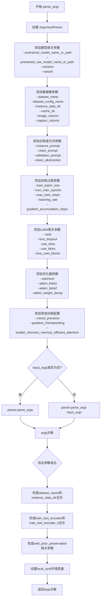

#### 带注释源码

```python
def parse_args(input_args=None):
    """
    解析命令行参数并返回包含所有配置选项的Namespace对象。
    
    该函数创建了一个完整的ArgumentParser，定义了SDXL LoRA DreamBooth训练所需的所有参数，
    包括模型配置、数据集配置、训练超参数、LoRA设置、优化器配置等。
    
    参数:
        input_args (Optional[List[str]]): 可选的参数列表，用于测试目的。
            当为None时，从sys.argv解析；否则解析提供的列表。
    
    返回:
        argparse.Namespace: 包含所有解析后命令行参数的命名空间对象。
    """
    
    # 创建ArgumentParser实例，设置脚本描述
    # 这是训练脚本的标准入口点
    parser = argparse.ArgumentParser(description="Simple example of a training script.")
    
    # ==================== 模型相关参数 ====================
    # 预训练模型路径或模型标识符（必需）
    parser.add_argument(
        "--pretrained_model_name_or_path",
        type=str,
        default=None,
        required=True,
        help="Path to pretrained model or model identifier from huggingface.co/models.",
    )
    
    # 预训练VAE模型路径（可选，用于更好的数值稳定性）
    parser.add_argument(
        "--pretrained_vae_model_name_or_path",
        type=str,
        default=None,
        help="Path to pretrained VAE model with better numerical stability. More details: https://github.com/huggingface/diffusers/pull/4038.",
    )
    
    # 模型版本修订号
    parser.add_argument(
        "--revision",
        type=str,
        default=None,
        required=False,
        help="Revision of pretrained model identifier from huggingface.co/models.",
    )
    
    # 模型文件变体（如fp16）
    parser.add_argument(
        "--variant",
        type=str,
        default=None,
        help="Variant of the model files of the pretrained model identifier from huggingface.co/models, 'e.g.' fp16",
    )
    
    # ==================== 数据集相关参数 ====================
    # 数据集名称（来自HuggingFace Hub）
    parser.add_argument(
        "--dataset_name",
        type=str,
        default=None,
        help=(
            "The name of the Dataset (from the HuggingFace hub) containing the training data of instance images (could be your own, possibly private,"
            " dataset). It can also be a path pointing to a local copy of a dataset in your filesystem,"
            " or to a folder containing files that 🤗 Datasets can understand.To load the custom captions, the training set directory needs to follow the structure of a "
            "datasets ImageFolder, containing both the images and the corresponding caption for each image. see: "
            "https://huggingface.co/docs/datasets/image_dataset for more information"
        ),
    )
    
    # 数据集配置名称
    parser.add_argument(
        "--dataset_config_name",
        type=str,
        default=None,
        help="The config of the Dataset. In some cases, a dataset may have more than one configuration (for example "
        "if it contains different subsets of data within, and you only wish to load a specific subset - in that case specify the desired configuration using --dataset_config_name. Leave as "
        "None if there's only one config.",
    )
    
    # 本地实例数据目录
    parser.add_argument(
        "--instance_data_dir",
        type=str,
        default=None,
        help="A path to local folder containing the training data of instance images. Specify this arg instead of "
        "--dataset_name if you wish to train using a local folder without custom captions. If you wish to train with custom captions please specify "
        "--dataset_name instead.",
    )

    # 缓存目录
    parser.add_argument(
        "--cache_dir",
        type=str,
        default=None,
        help="The directory where the downloaded models and datasets will be stored.",
    )

    # 数据集图像列名
    parser.add_argument(
        "--image_column",
        type=str,
        default="image",
        help="The column of the dataset containing the target image. By "
        "default, the standard Image Dataset maps out 'file_name' "
        "to 'image'.",
    )
    
    # 数据集描述列名
    parser.add_argument(
        "--caption_column",
        type=str,
        default=None,
        help="The column of the dataset containing the instance prompt for each image",
    )

    # 训练数据重复次数
    parser.add_argument("--repeats", type=int, default=1, help="How many times to repeat the training data.")

    # 类别数据目录（用于先验保留）
    parser.add_argument(
        "--class_data_dir",
        type=str,
        default=None,
        required=False,
        help="A folder containing the training data of class images.",
    )
    
    # ==================== 提示词相关参数 ====================
    # 实例提示词（必需）
    parser.add_argument(
        "--instance_prompt",
        type=str,
        default=None,
        required=True,
        help="The prompt with identifier specifying the instance, e.g. 'photo of a TOK dog', 'in the style of TOK'",
    )
    
    # 令牌抽象标识符
    parser.add_argument(
        "--token_abstraction",
        type=str,
        default="TOK",
        help="identifier specifying the instance(or instances) as used in instance_prompt, validation prompt, "
        "captions - e.g. TOK. To use multiple identifiers, please specify them in a comma separated string - e.g. "
        "'TOK,TOK2,TOK3' etc.",
    )

    # 每个令牌抽象的新令牌数量
    parser.add_argument(
        "--num_new_tokens_per_abstraction",
        type=int,
        default=2,
        help="number of new tokens inserted to the tokenizers per token_abstraction identifier when "
        "--train_text_encoder_ti = True. By default, each --token_abstraction (e.g. TOK) is mapped to 2 new "
        "tokens - <si><si+1> ",
    )

    # 类别提示词
    parser.add_argument(
        "--class_prompt",
        type=str,
        default=None,
        help="The prompt to specify images in the same class as provided instance images.",
    )
    
    # 验证提示词
    parser.add_argument(
        "--validation_prompt",
        type=str,
        default=None,
        help="A prompt that is used during validation to verify that the model is learning.",
    )
    
    # 验证图像数量
    parser.add_argument(
        "--num_validation_images",
        type=int,
        default=4,
        help="Number of images that should be generated during validation with `validation_prompt`.",
    )
    
    # 验证执行周期
    parser.add_argument(
        "--validation_epochs",
        type=int,
        default=50,
        help=(
            "Run dreambooth validation every X epochs. Dreambooth validation consists of running the prompt"
            " `args.validation_prompt` multiple times: `args.num_validation_images`."
        ),
    )
    
    # ==================== 训练过程控制参数 ====================
    # EDM风格训练标志
    parser.add_argument(
        "--do_edm_style_training",
        default=False,
        action="store_true",
        help="Flag to conduct training using the EDM formulation as introduced in https://huggingface.co/papers/2206.00364.",
    )
    
    # 先验保留标志
    parser.add_argument(
        "--with_prior_preservation",
        default=False,
        action="store_true",
        help="Flag to add prior preservation loss.",
    )
    
    # 先验保留损失权重
    parser.add_argument("--prior_loss_weight", type=float, default=1.0, help="The weight of prior preservation loss.")
    
    # 最小类别图像数量
    parser.add_argument(
        "--num_class_images",
        type=int,
        default=100,
        help=(
            "Minimal class images for prior preservation loss. If there are not enough images already present in"
            " class_data_dir, additional images will be sampled with class_prompt."
        ),
    )
    
    # 输出目录
    parser.add_argument(
        "--output_dir",
        type=str,
        default="lora-dreambooth-model",
        help="The output directory where the model predictions and checkpoints will be written.",
    )
    
    # 随机种子
    parser.add_argument("--seed", type=int, default=None, help="A seed for reproducible training.")
    
    # 输入图像分辨率
    parser.add_argument(
        "--resolution",
        type=int,
        default=1024,
        help=(
            "The resolution for input images, all the images in the train/validation dataset will be resized to this"
            " resolution"
        ),
    )
    
    # 中心裁剪标志
    parser.add_argument(
        "--center_crop",
        default=False,
        action="store_true",
        help=(
            "Whether to center crop the input images to the resolution. If not set, the images will be randomly"
            " cropped. The images will be resized to the resolution first before cropping."
        ),
    )
    
    # 随机水平翻转标志
    parser.add_argument(
        "--random_flip",
        action="store_true",
        help="whether to randomly flip images horizontally",
    )
    
    # 训练文本编码器标志
    parser.add_argument(
        "--train_text_encoder",
        action="store_true",
        help="Whether to train the text encoder. If set, the text encoder should be float32 precision.",
    )
    
    # 训练批次大小
    parser.add_argument(
        "--train_batch_size", type=int, default=4, help="Batch size (per device) for the training dataloader."
    )
    
    # 采样批次大小
    parser.add_argument(
        "--sample_batch_size", type=int, default=4, help="Batch size (per device) for sampling images."
    )
    
    # 训练轮数
    parser.add_argument("--num_train_epochs", type=int, default=1)
    
    # 最大训练步数
    parser.add_argument(
        "--max_train_steps",
        type=int,
        default=None,
        help="Total number of training steps to perform.  If provided, overrides num_train_epochs.",
    )
    
    # 检查点保存间隔
    parser.add_argument(
        "--checkpointing_steps",
        type=int,
        default=500,
        help=(
            "Save a checkpoint of the training state every X updates. These checkpoints can be used both as final"
            " checkpoints in case they are better than the last checkpoint, and are also suitable for resuming"
            " training using `--resume_from_checkpoint`."
        ),
    )
    
    # 检查点总数限制
    parser.add_argument(
        "--checkpoints_total_limit",
        type=int,
        default=None,
        help=("Max number of checkpoints to store."),
    )
    
    # 从检查点恢复训练
    parser.add_argument(
        "--resume_from_checkpoint",
        type=str,
        default=None,
        help=(
            "Whether training should be resumed from a previous checkpoint. Use a path saved by"
            ' `--checkpointing_steps`, or `"latest"` to automatically select the last available checkpoint.'
        ),
    )
    
    # 梯度累积步数
    parser.add_argument(
        "--gradient_accumulation_steps",
        type=int,
        default=1,
        help="Number of updates steps to accumulate before performing a backward/update pass.",
    )
    
    # 梯度检查点标志
    parser.add_argument(
        "--gradient_checkpointing",
        action="store_true",
        help="Whether or not to use gradient checkpointing to save memory at the expense of slower backward pass.",
    )
    
    # 学习率
    parser.add_argument(
        "--learning_rate",
        type=float,
        default=1e-4,
        help="Initial learning rate (after the potential warmup period) to use.",
    )
    
    # CLIP跳过层数
    parser.add_argument(
        "--clip_skip",
        type=int,
        default=None,
        help="Number of layers to be skipped from CLIP while computing the prompt embeddings. A value of 1 means that "
        "the output of the pre-final layer will be used for computing the prompt embeddings.",
    )

    # 文本编码器学习率
    parser.add_argument(
        "--text_encoder_lr",
        type=float,
        default=5e-6,
        help="Text encoder learning rate to use.",
    )
    
    # 学习率缩放标志
    parser.add_argument(
        "--scale_lr",
        action="store_true",
        default=False,
        help="Scale the learning rate by the number of GPUs, gradient accumulation steps, and batch size.",
    )
    
    # 学习率调度器类型
    parser.add_argument(
        "--lr_scheduler",
        type=str,
        default="constant",
        help=(
            'The scheduler type to use. Choose between ["linear", "cosine", "cosine_with_restarts", "polynomial",'
            ' "constant", "constant_with_warmup"]'
        ),
    )

    # SNR Gamma参数
    parser.add_argument(
        "--snr_gamma",
        type=float,
        default=None,
        help="SNR weighting gamma to be used if rebalancing the loss. Recommended value is 5.0. "
        "More details here: https://huggingface.co/papers/2303.09556.",
    )
    
    # 学习率预热步数
    parser.add_argument(
        "--lr_warmup_steps", type=int, default=500, help="Number of steps for the warmup in the lr scheduler."
    )
    
    # 学习率余弦重启次数
    parser.add_argument(
        "--lr_num_cycles",
        type=int,
        default=1,
        help="Number of hard resets of the lr in cosine_with_restarts scheduler.",
    )
    
    # 多项式调度器幂次
    parser.add_argument("--lr_power", type=float, default=1.0, help="Power factor of the polynomial scheduler.")
    
    # 数据加载工作进程数
    parser.add_argument(
        "--dataloader_num_workers",
        type=int,
        default=0,
        help=(
            "Number of subprocesses to use for data loading. 0 means that the data will be loaded in the main process."
        ),
    )

    # ==================== 文本反演训练参数 ====================
    # 文本反演训练标志
    parser.add_argument(
        "--train_text_encoder_ti",
        action="store_true",
        help=("Whether to use textual inversion"),
    )

    # 文本反演训练轮数比例
    parser.add_argument(
        "--train_text_encoder_ti_frac",
        type=float,
        default=0.5,
        help=("The percentage of epochs to perform textual inversion"),
    )

    # 文本编码器训练轮数比例
    parser.add_argument(
        "--train_text_encoder_frac",
        type=float,
        default=1.0,
        help=("The percentage of epochs to perform text encoder tuning"),
    )

    # ==================== 优化器参数 ====================
    # 优化器类型
    parser.add_argument(
        "--optimizer",
        type=str,
        default="AdamW",
        help=('The optimizer type to use. Choose between ["AdamW", "prodigy"]'),
    )

    # 8位Adam标志
    parser.add_argument(
        "--use_8bit_adam",
        action="store_true",
        help="Whether or not to use 8-bit Adam from bitsandbytes. Ignored if optimizer is not set to AdamW",
    )

    # Adam Beta1参数
    parser.add_argument(
        "--adam_beta1", type=float, default=0.9, help="The beta1 parameter for the Adam and Prodigy optimizers."
    )
    
    # Adam Beta2参数
    parser.add_argument(
        "--adam_beta2", type=float, default=0.999, help="The beta2 parameter for the Adam and Prodigy optimizers."
    )
    
    # Prodigy Beta3参数
    parser.add_argument(
        "--prodigy_beta3",
        type=float,
        default=None,
        help="coefficients for computing the Prodigy stepsize using running averages. If set to None, "
        "uses the value of square root of beta2. Ignored if optimizer is adamW",
    )
    
    # Prodigy解耦权重衰减
    parser.add_argument("--prodigy_decouple", type=bool, default=True, help="Use AdamW style decoupled weight decay")
    
    # UNet权重衰减
    parser.add_argument("--adam_weight_decay", type=float, default=1e-04, help="Weight decay to use for unet params")
    
    # 文本编码器权重衰减
    parser.add_argument(
        "--adam_weight_decay_text_encoder", type=float, default=None, help="Weight decay to use for text_encoder"
    )

    # Adam Epsilon值
    parser.add_argument(
        "--adam_epsilon",
        type=float,
        default=1e-08,
        help="Epsilon value for the Adam optimizer and Prodigy optimizers.",
    )

    # Prodigy偏置校正
    parser.add_argument(
        "--prodigy_use_bias_correction",
        type=bool,
        default=True,
        help="Turn on Adam's bias correction. True by default. Ignored if optimizer is adamW",
    )
    
    # Prodigy预热保护
    parser.add_argument(
        "--prodigy_safeguard_warmup",
        type=bool,
        default=True,
        help="Remove lr from the denominator of D estimate to avoid issues during warm-up stage. True by default. "
        "Ignored if optimizer is adamW",
    )
    
    # 最大梯度范数
    parser.add_argument("--max_grad_norm", default=1.0, type=float, help="Max gradient norm.")
    
    # ==================== 分布式训练与监控参数 ====================
    # 推送到Hub标志
    parser.add_argument("--push_to_hub", action="store_true", help="Whether or not to push the model to the Hub.")
    
    # Hub令牌
    parser.add_argument("--hub_token", type=str, default=None, help="The token to use to push to the Model Hub.")
    
    # Hub模型ID
    parser.add_argument(
        "--hub_model_id",
        type=str,
        default=None,
        help="The name of the repository to keep in sync with the local `output_dir`.",
    )
    
    # 日志目录
    parser.add_argument(
        "--logging_dir",
        type=str,
        default="logs",
        help=(
            "[TensorBoard](https://www.tensorflow.org/tensorboard) log directory. Will default to"
            " *output_dir/runs/**CURRENT_DATETIME_HOSTNAME***."
        ),
    )
    
    # TF32允许标志
    parser.add_argument(
        "--allow_tf32",
        action="store_true",
        help=(
            "Whether or not to allow TF32 on Ampere GPUs. Can be used to speed up training. For more information, see"
            " https://pytorch.org/docs/stable/notes/cuda.html#tensorfloat-32-tf32-on-ampere-devices"
        ),
    )
    
    # 报告目标
    parser.add_argument(
        "--report_to",
        type=str,
        default="tensorboard",
        help=(
            'The integration to report the results and logs to. Supported platforms are `"tensorboard"`'
            ' (default), `"wandb"` and `"comet_ml"`. Use `"all"` to report to all integrations.'
        ),
    )
    
    # 混合精度类型
    parser.add_argument(
        "--mixed_precision",
        type=str,
        default=None,
        choices=["no", "fp16", "bf16"],
        help=(
            "Whether to use mixed precision. Choose between fp16 and bf16 (bfloat16). Bf16 requires PyTorch >="
            " 1.10.and an Nvidia Ampere GPU.  Default to the value of accelerate config of the current system or the"
            " flag passed with the `accelerate.launch` command. Use this argument to override the accelerate config."
        ),
    )
    
    # 先验生成精度
    parser.add_argument(
        "--prior_generation_precision",
        type=str,
        default=None,
        choices=["no", "fp32", "fp16", "bf16"],
        help=(
            "Choose prior generation precision between fp32, fp16 and bf16 (bfloat16). Bf16 requires PyTorch >="
            " 1.10.and an Nvidia Ampere GPU.  Default to  fp16 if a GPU is available else fp32."
        ),
    )
    
    # 本地排名（分布式训练）
    parser.add_argument("--local_rank", type=int, default=-1, help="For distributed training: local_rank")
    
    # ==================== LoRA与注意力优化参数 ====================
    # xFormers高效注意力标志
    parser.add_argument(
        "--enable_xformers_memory_efficient_attention", action="store_true", help="Whether or not to use xformers."
    )
    
    # 噪声偏移量
    parser.add_argument("--noise_offset", type=float, default=0, help="The scale of noise offset.")
    
    # LoRA秩维度
    parser.add_argument(
        "--rank",
        type=int,
        default=4,
        help=("The dimension of the LoRA update matrices."),
    )

    # LoRA dropout
    parser.add_argument("--lora_dropout", type=float, default=0.0, help="Dropout probability for LoRA layers")

    # DoRA训练标志
    parser.add_argument(
        "--use_dora",
        action="store_true",
        default=False,
        help=(
            "Whether to train a DoRA as proposed in- DoRA: Weight-Decomposed Low-Rank Adaptation https://huggingface.co/papers/2402.09353. "
            "Note: to use DoRA you need to install peft from main, `pip install git+https://github.com/huggingface/peft.git`"
        ),
    )
    
    # 指定LoRA训练的UNet块
    parser.add_argument(
        "--lora_unet_blocks",
        type=str,
        default=None,
        help=(
            "the U-net blocks to tune during training. please specify them in a comma separated string, e.g. `unet.up_blocks.0.attentions.0,unet.up_blocks.0.attentions.1` etc."
            "NOTE: By default (if not specified) - regular LoRA training is performed. "
            "if --use_blora is enabled, this arg will be ignored, since in B-LoRA training, targeted U-net blocks are `unet.up_blocks.0.attentions.0` and `unet.up_blocks.0.attentions.1`"
        ),
    )
    
    # B-LoRA训练标志
    parser.add_argument(
        "--use_blora",
        action="store_true",
        help=(
            "Whether to train a B-LoRA as proposed in- Implicit Style-Content Separation using B-LoRA https://huggingface.co/papers/2403.14572. "
        ),
    )
    
    # 缓存潜在变量标志
    parser.add_argument(
        "--cache_latents",
        action="store_true",
        default=False,
        help="Cache the VAE latents",
    )
    
    # 图像插值模式
    parser.add_argument(
        "--image_interpolation_mode",
        type=str,
        default="lanczos",
        choices=[
            f.lower() for f in dir(transforms.InterpolationMode) if not f.startswith("__") and not f.endswith("__")
        ],
        help="The image interpolation method to use for resizing images.",
    )

    # ==================== 参数解析 ====================
    # 解析参数
    if input_args is not None:
        args = parser.parse_args(input_args)
    else:
        args = parser.parse_args()

    # ==================== 参数验证 ====================
    # 验证数据集参数：dataset_name和instance_data_dir必须指定其一，但不能同时指定
    if args.dataset_name is None and args.instance_data_dir is None:
        raise ValueError("Specify either `--dataset_name` or `--instance_data_dir`")

    if args.dataset_name is not None and args.instance_data_dir is not None:
        raise ValueError("Specify only one of `--dataset_name` or `--instance_data_dir`")

    # 验证文本编码器训练参数：train_text_encoder和train_text_encoder_ti不能同时启用
    if args.train_text_encoder and args.train_text_encoder_ti:
        raise ValueError(
            "Specify only one of `--train_text_encoder` or `--train_text_encoder_ti. "
            "For full LoRA text encoder training check --train_text_encoder, for textual "
            "inversion training check `--train_text_encoder_ti`"
        )
    
    # 验证B-LoRA和lora_unet_blocks不能同时使用
    if args.use_blora and args.lora_unet_blocks:
        warnings.warn(
            "You specified both `--use_blora` and `--lora_unet_blocks`, for B-LoRA training, target unet blocks are: `unet.up_blocks.0.attentions.0` and `unet.up_blocks.0.attentions.1`. "
            "If you wish to target different U-net blocks, don't enable `--use_blora`"
        )

    # 从环境变量获取LOCAL_RANK并覆盖local_rank参数
    env_local_rank = int(os.environ.get("LOCAL_RANK", -1))
    if env_local_rank != -1 and env_local_rank != args.local_rank:
        args.local_rank = env_local_rank

    # 验证先验保留相关参数
    if args.with_prior_preservation:
        if args.class_data_dir is None:
            raise ValueError("You must specify a data directory for class images.")
        if args.class_prompt is None:
            raise ValueError("You must specify prompt for class images.")
    else:
        # 如果没有启用先验保留但提供了class_data_dir或class_prompt，发出警告
        if args.class_data_dir is not None:
            warnings.warn("You need not use --class_data_dir without --with_prior_preservation.")
        if args.class_prompt is not None:
            warnings.warn("You need not use --class_prompt without --with_prior_preservation.")

    # 返回解析后的参数对象
    return args
```


### `main`

这是SDXL LoRA DreamBooth训练脚本的核心函数，负责执行完整的模型训练流程，包括数据加载、模型初始化、训练循环、验证和模型保存。

参数：

-  `args`：命令行参数对象（argparse.Namespace），包含所有训练配置参数，如模型路径、数据路径、学习率、LoRA配置等。

返回值：无返回值（None），训练完成后直接退出。

#### 流程图

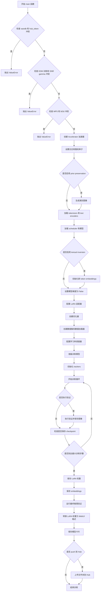

#### 带注释源码

```python
def main(args):
    """
    SDXL LoRA DreamBooth 训练主函数
    
    执行流程:
    1. 参数验证和环境检查
    2. 初始化 Accelerator 分布式训练环境
    3. 加载预训练模型(tokenizer, text encoder, VAE, UNet)
    4. 配置 LoRA 适配器
    5. 创建数据集和数据加载器
    6. 配置优化器和学习率调度器
    7. 执行训练循环(包括前向传播、损失计算、反向传播、参数更新)
    8. 执行验证和模型保存
    """
    
    # -------------------------
    # 1. 参数验证
    # -------------------------
    # 检查 wandb 和 hub_token 不能同时使用(安全风险)
    if args.report_to == "wandb" and args.hub_token is not None:
        raise ValueError(
            "You cannot use both --report_to=wandb and --hub_token due to a security risk of exposing your token."
            " Please use `hf auth login` to authenticate with the Hub."
        )

    # EDM 风格训练不支持 SNR gamma 加权
    if args.do_edm_style_training and args.snr_gamma is not None:
        raise ValueError("Min-SNR formulation is not supported when conducting EDM-style training.")

    # MPS 不支持 bfloat16 混合精度
    if torch.backends.mps.is_available() and args.mixed_precision == "bf16":
        raise ValueError(
            "Mixed precision training with bfloat16 is not supported on MPS. Please use fp16 (recommended) or fp32 instead."
        )

    # -------------------------
    # 2. 初始化 Accelerator
    # -------------------------
    logging_dir = Path(args.output_dir, args.logging_dir)
    accelerator_project_config = ProjectConfiguration(project_dir=args.output_dir, logging_dir=logging_dir)
    kwargs = DistributedDataParallelKwargs(find_unused_parameters=True)
    accelerator = Accelerator(
        gradient_accumulation_steps=args.gradient_accumulation_steps,
        mixed_precision=args.mixed_precision,
        log_with=args.report_to,
        project_config=accelerator_project_config,
        kwargs_handlers=[kwargs],
    )

    # MPS 禁用 AMP
    if torch.backends.mps.is_available():
        accelerator.native_amp = False

    # 检查 wandb 可用性
    if args.report_to == "wandb":
        if not is_wandb_available():
            raise ImportError("Make sure to install wandb if you want to use it for logging during training.")

    # -------------------------
    # 3. 日志配置
    # -------------------------
    logging.basicConfig(
        format="%(asctime)s - %(levelname)s - %(name)s - %(message)s",
        datefmt="%m/%d/%Y %H:%M:%S",
        level=logging.INFO,
    )
    logger.info(accelerator.state, main_process_only=False)
    
    # 主进程设置详细日志,其他进程只显示错误
    if accelerator.is_local_main_process:
        transformers.utils.logging.set_verbosity_warning()
        diffusers.utils.logging.set_verbosity_info()
    else:
        transformers.utils.logging.set_verbosity_error()
        diffusers.utils.logging.set_verbosity_error()

    # 设置随机种子
    if args.seed is not None:
        set_seed(args.seed)

    # -------------------------
    # 4. Prior Preservation 类别图像生成
    # -------------------------
    if args.with_prior_preservation:
        class_images_dir = Path(args.class_data_dir)
        if not class_images_dir.exists():
            class_images_dir.mkdir(parents=True)
        cur_class_images = len(list(class_images_dir.iterdir()))

        # 如果类别图像不足,使用扩散模型生成
        if cur_class_images < args.num_class_images:
            # 确定数值精度
            has_supported_fp16_accelerator = torch.cuda.is_available() or torch.backends.mps.is_available()
            torch_dtype = torch.float16 if has_supported_fp16_accelerator else torch.float32
            if args.prior_generation_precision == "fp32":
                torch_dtype = torch.float32
            elif args.prior_generation_precision == "fp16":
                torch_dtype = torch.float16
            elif args.prior_generation_precision == "bf16":
                torch_dtype = torch.bfloat16
            
            # 加载推理用 pipeline
            pipeline = StableDiffusionXLPipeline.from_pretrained(
                args.pretrained_model_name_or_path,
                torch_dtype=torch_dtype,
                revision=args.revision,
                variant=args.variant,
            )
            pipeline.set_progress_bar_config(disable=True)

            num_new_images = args.num_class_images - cur_class_images
            logger.info(f"Number of class images to sample: {num_new_images}.")

            # 创建采样数据集和数据加载器
            sample_dataset = PromptDataset(args.class_prompt, num_new_images)
            sample_dataloader = torch.utils.data.DataLoader(
                sample_dataset, 
                batch_size=args.sample_batch_size
            )
            sample_dataloader = accelerator.prepare(sample_dataloader)
            pipeline.to(accelerator.device)

            # 生成类别图像
            for example in tqdm(
                sample_dataloader, 
                desc="Generating class images", 
                disable=not accelerator.is_local_main_process
            ):
                images = pipeline(example["prompt"]).images

                for i, image in enumerate(images):
                    hash_image = insecure_hashlib.sha1(image.tobytes()).hexdigest()
                    image_filename = class_images_dir / f"{example['index'][i] + cur_class_images}-{hash_image}.jpg"
                    image.save(image_filename)

            del pipeline
            if torch.cuda.is_available():
                torch.cuda.empty_cache()

    # -------------------------
    # 5. 创建输出目录和 Hub 仓库
    # -------------------------
    if accelerator.is_main_process:
        if args.output_dir is not None:
            os.makedirs(args.output_dir, exist_ok=True)

        model_id = args.hub_model_id or Path(args.output_dir).name
        repo_id = None
        if args.push_to_hub:
            repo_id = create_repo(repo_id=model_id, exist_ok=True, token=args.hub_token).repo_id

    # -------------------------
    # 6. 加载 tokenizers
    # -------------------------
    tokenizer_one = AutoTokenizer.from_pretrained(
        args.pretrained_model_name_or_path,
        subfolder="tokenizer",
        revision=args.revision,
        variant=args.variant,
        use_fast=False,
    )
    tokenizer_two = AutoTokenizer.from_pretrained(
        args.pretrained_model_name_or_path,
        subfolder="tokenizer_2",
        revision=args.revision,
        variant=args.variant,
        use_fast=False,
    )

    # 获取 text encoder 类
    text_encoder_cls_one = import_model_class_from_model_name_or_path(
        args.pretrained_model_name_or_path, args.revision
    )
    text_encoder_cls_two = import_model_class_from_model_name_or_path(
        args.pretrained_model_name_or_path, args.revision, subfolder="text_encoder_2"
    )

    # -------------------------
    # 7. 加载 scheduler 和模型
    # -------------------------
    scheduler_type = determine_scheduler_type(args.pretrained_model_name_or_path, args.revision)
    
    # 根据 scheduler 类型选择噪声调度器
    if "EDM" in scheduler_type:
        args.do_edm_style_training = True
        noise_scheduler = EDMEulerScheduler.from_pretrained(
            args.pretrained_model_name_or_path, 
            subfolder="scheduler"
        )
        logger.info("Performing EDM-style training!")
    elif args.do_edm_style_training:
        noise_scheduler = EulerDiscreteScheduler.from_pretrained(
            args.pretrained_model_name_or_path, 
            subfolder="scheduler"
        )
        logger.info("Performing EDM-style training!")
    else:
        noise_scheduler = DDPMScheduler.from_pretrained(
            args.pretrained_model_name_or_path, 
            subfolder="scheduler"
        )

    # 加载 text encoders
    text_encoder_one = text_encoder_cls_one.from_pretrained(
        args.pretrained_model_name_or_path, 
        subfolder="text_encoder", 
        revision=args.revision, 
        variant=args.variant
    )
    text_encoder_two = text_encoder_cls_two.from_pretrained(
        args.pretrained_model_name_or_path, 
        subfolder="text_encoder_2", 
        revision=args.revision, 
        variant=args.variant
    )
    
    # 加载 VAE
    vae_path = (
        args.pretrained_model_name_or_path
        if args.pretrained_vae_model_name_or_path is None
        else args.pretrained_vae_model_name_or_path
    )
    vae = AutoencoderKL.from_pretrained(
        vae_path,
        subfolder="vae" if args.pretrained_vae_model_name_or_path is None else None,
        revision=args.revision,
        variant=args.variant,
    )
    
    # 获取 VAE 的 latents 统计信息
    latents_mean = latents_std = None
    if hasattr(vae.config, "latents_mean") and vae.config.latents_mean is not None:
        latents_mean = torch.tensor(vae.config.latents_mean).view(1, 4, 1, 1)
    if hasattr(vae.config, "latents_std") and vae.config.latents_std is not None:
        latents_std = torch.tensor(vae.config.latents_std).view(1, 4, 1, 1)

    # 加载 UNet
    unet = UNet2DConditionModel.from_pretrained(
        args.pretrained_model_name_or_path, 
        subfolder="unet", 
        revision=args.revision, 
        variant=args.variant
    )

    # -------------------------
    # 8. Textual Inversion 配置
    # -------------------------
    if args.train_text_encoder_ti:
        # 解析 token 抽象标识符
        token_abstraction_list = "".join(args.token_abstraction.split()).split(",")
        logger.info(f"list of token identifiers: {token_abstraction_list}")

        # 创建 token 到新 embedding 的映射
        token_abstraction_dict = {}
        token_idx = 0
        for i, token in enumerate(token_abstraction_list):
            token_abstraction_dict[token] = [
                f"<s{token_idx + i + j}>" for j in range(args.num_new_tokens_per_abstraction)
            ]
            token_idx += args.num_new_tokens_per_abstraction - 1

        # 替换 prompt 中的 token
        for token_abs, token_replacement in token_abstraction_dict.items():
            args.instance_prompt = args.instance_prompt.replace(token_abs, "".join(token_replacement))
            if args.with_prior_preservation:
                args.class_prompt = args.class_prompt.replace(token_abs, "".join(token_replacement))
            if args.validation_prompt:
                args.validation_prompt = args.validation_prompt.replace(token_abs, "".join(token_replacement))
        
        # 初始化新的 token embeddings
        embedding_handler = TokenEmbeddingsHandler(
            [text_encoder_one, text_encoder_two], 
            [tokenizer_one, tokenizer_two]
        )
        inserting_toks = []
        for new_tok in token_abstraction_dict.values():
            inserting_toks.extend(new_tok)
        embedding_handler.initialize_new_tokens(inserting_toks=inserting_toks)

    # -------------------------
    # 9. 冻结非训练参数
    # -------------------------
    vae.requires_grad_(False)
    text_encoder_one.requires_grad_(False)
    text_encoder_two.requires_grad_(False)
    unet.requires_grad_(False)

    # 确定混合精度数据类型
    weight_dtype = torch.float32
    if accelerator.mixed_precision == "fp16":
        weight_dtype = torch.float16
    elif accelerator.mixed_precision == "bf16":
        weight_dtype = torch.bfloat16

    # MPS 检查
    if torch.backends.mps.is_available() and weight_dtype == torch.bfloat16:
        raise ValueError(
            "Mixed precision training with bfloat16 is not supported on MPS. Please use fp16 (recommended) or fp32 instead."
        )

    # -------------------------
    # 10. 模型移至设备并转换数据类型
    # -------------------------
    unet.to(accelerator.device, dtype=weight_dtype)
    vae.to(accelerator.device, dtype=torch.float32)  # VAE 始终使用 float32
    text_encoder_one.to(accelerator.device, dtype=weight_dtype)
    text_encoder_two.to(accelerator.device, dtype=weight_dtype)

    # -------------------------
    # 11. xFormers 优化注意力
    # -------------------------
    if args.enable_xformers_memory_efficient_attention:
        if is_xformers_available():
            import xformers
            xformers_version = version.parse(xformers.__version__)
            if xformers_version == version.parse("0.0.16"):
                logger.warning(
                    "xFormers 0.0.16 cannot be used for training in some GPUs. If you observe problems during training, "
                    "please update xFormers to at least 0.0.17."
                )
            unet.enable_xformers_memory_efficient_attention()
        else:
            raise ValueError("xformers is not available.")

    # -------------------------
    # 12. Gradient Checkpointing
    # -------------------------
    if args.gradient_checkpointing:
        unet.enable_gradient_checkpointing()
        if args.train_text_encoder:
            text_encoder_one.gradient_checkpointing_enable()
            text_encoder_two.gradient_checkpointing_enable()

    # -------------------------
    # 13. 配置 LoRA 适配器
    # -------------------------
    # 确定目标模块
    if args.use_blora:
        target_modules = get_unet_lora_target_modules(unet, use_blora=True)
    elif args.lora_unet_blocks:
        target_blocks_list = "".join(args.lora_unet_blocks.split()).split(",")
        logger.info(f"list of unet blocks to train: {target_blocks_list}")
        target_modules = get_unet_lora_target_modules(
            unet, 
            use_blora=False, 
            target_blocks=target_blocks_list
        )
    else:
        target_modules = ["to_k", "to_q", "to_v", "to_out.0"]

    # UNet LoRA 配置
    unet_lora_config = LoraConfig(
        r=args.rank,
        use_dora=args.use_dora,
        lora_alpha=args.rank,
        lora_dropout=args.lora_dropout,
        init_lora_weights="gaussian",
        target_modules=target_modules,
    )
    unet.add_adapter(unet_lora_config)

    # Text Encoder LoRA 配置
    if args.train_text_encoder:
        text_lora_config = LoraConfig(
            r=args.rank,
            use_dora=args.use_dora,
            lora_alpha=args.rank,
            lora_dropout=args.lora_dropout,
            init_lora_weights="gaussian",
            target_modules=["q_proj", "k_proj", "v_proj", "out_proj"],
        )
        text_encoder_one.add_adapter(text_lora_config)
        text_encoder_two.add_adapter(text_lora_config)

    # Textual Inversion 参数配置
    elif args.train_text_encoder_ti:
        text_lora_parameters_one = []
        for name, param in text_encoder_one.named_parameters():
            if "token_embedding" in name:
                param.data = param.to(dtype=torch.float32)
                param.requires_grad = True
                text_lora_parameters_one.append(param)
            else:
                param.requires_grad = False
        
        text_lora_parameters_two = []
        for name, param in text_encoder_two.named_parameters():
            if "token_embedding" in name:
                param.data = param.to(dtype=torch.float32)
                param.requires_grad = True
                text_lora_parameters_two.append(param)
            else:
                param.requires_grad = False

    # 辅助函数: 解包模型
    def unwrap_model(model):
        model = accelerator.unwrap_model(model)
        model = model._orig_mod if is_compiled_module(model) else model
        return model

    # -------------------------
    # 14. 自定义模型保存/加载 Hooks
    # -------------------------
    def save_model_hook(models, weights, output_dir):
        """保存模型时的钩子函数"""
        if accelerator.is_main_process:
            unet_lora_layers_to_save = None
            text_encoder_one_lora_layers_to_save = None
            text_encoder_two_lora_layers_to_save = None

            for model in models:
                if isinstance(model, type(unwrap_model(unet))):
                    unet_lora_layers_to_save = convert_state_dict_to_diffusers(
                        get_peft_model_state_dict(model)
                    )
                elif isinstance(model, type(unwrap_model(text_encoder_one))):
                    if args.train_text_encoder:
                        text_encoder_one_lora_layers_to_save = convert_state_dict_to_diffusers(
                            get_peft_model_state_dict(model)
                        )
                elif isinstance(model, type(unwrap_model(text_encoder_two))):
                    if args.train_text_encoder:
                        text_encoder_two_lora_layers_to_save = convert_state_dict_to_diffusers(
                            get_peft_model_state_dict(model)
                        )
                else:
                    raise ValueError(f"unexpected save model: {model.__class__}")
                weights.pop()

            StableDiffusionXLPipeline.save_lora_weights(
                output_dir,
                unet_lora_layers=unet_lora_layers_to_save,
                text_encoder_lora_layers=text_encoder_one_lora_layers_to_save,
                text_encoder_2_lora_layers=text_encoder_two_lora_layers_to_save,
            )
        
        # 保存 textual inversion embeddings
        if args.train_text_encoder_ti:
            embedding_handler.save_embeddings(
                f"{args.output_dir}/{Path(args.output_dir).name}_emb.safetensors"
            )

    def load_model_hook(models, input_dir):
        """加载模型时的钩子函数"""
        unet_ = None
        text_encoder_one_ = None
        text_encoder_two_ = None

        while len(models) > 0:
            model = models.pop()
            if isinstance(model, type(unwrap_model(unet))):
                unet_ = model
            elif isinstance(model, type(unwrap_model(text_encoder_one))):
                text_encoder_one_ = model
            elif isinstance(model, type(unwrap_model(text_encoder_two))):
                text_encoder_two_ = model
            else:
                raise ValueError(f"unexpected save model: {model.__class__}")

        # 加载 LoRA 状态字典
        lora_state_dict, network_alphas = StableDiffusionLoraLoaderMixin.lora_state_dict(input_dir)

        # 转换并加载 UNet LoRA
        unet_state_dict = {
            f"{k.replace('unet.', '')}": v 
            for k, v in lora_state_dict.items() 
            if k.startswith("unet.")
        }
        unet_state_dict = convert_unet_state_dict_to_peft(unet_state_dict)
        incompatible_keys = set_peft_model_state_dict(unet_, unet_state_dict, adapter_name="default")

        # 加载 Text Encoder LoRA
        if args.train_text_encoder:
            _set_state_dict_into_text_encoder(
                lora_state_dict, 
                prefix="text_encoder.", 
                text_encoder=text_encoder_one_
            )
            _set_state_dict_into_text_encoder(
                lora_state_dict, 
                prefix="text_encoder_2.", 
                text_encoder=text_encoder_two_
            )

        # 确保可训练参数为 float32
        if args.mixed_precision == "fp16":
            models = [unet_]
            if args.train_text_encoder:
                models.extend([text_encoder_one_, text_encoder_two_])
            cast_training_params(models)

    accelerator.register_save_state_pre_hook(save_model_hook)
    accelerator.register_load_state_pre_hook(load_model_hook)

    # -------------------------
    # 15. TF32 和学习率缩放
    # -------------------------
    if args.allow_tf32 and torch.cuda.is_available():
        torch.backends.cuda.matmul.allow_tf32 = True

    if args.scale_lr:
        args.learning_rate = (
            args.learning_rate 
            * args.gradient_accumulation_steps 
            * args.train_batch_size 
            * accelerator.num_processes
        )

    # 确保可训练参数为 float32
    if args.mixed_precision == "fp16":
        models = [unet]
        if args.train_text_encoder:
            models.extend([text_encoder_one, text_encoder_two])
        cast_training_params(models, dtype=torch.float32)

    # -------------------------
    # 16. 收集可训练参数
    # -------------------------
    unet_lora_parameters = list(filter(lambda p: p.requires_grad, unet.parameters()))

    if args.train_text_encoder:
        text_lora_parameters_one = list(filter(lambda p: p.requires_grad, text_encoder_one.parameters()))
        text_lora_parameters_two = list(filter(lambda p: p.requires_grad, text_encoder_two.parameters()))

    freeze_text_encoder = not (args.train_text_encoder or args.train_text_encoder_ti)

    # -------------------------
    # 17. 配置优化器参数
    # -------------------------
    unet_lora_parameters_with_lr = {"params": unet_lora_parameters, "lr": args.learning_rate}
    
    if not freeze_text_encoder:
        text_lora_parameters_one_with_lr = {
            "params": text_lora_parameters_one,
            "weight_decay": args.adam_weight_decay_text_encoder
            if args.adam_weight_decay_text_encoder
            else args.adam_weight_decay,
            "lr": args.text_encoder_lr if args.text_encoder_lr else args.learning_rate,
        }
        text_lora_parameters_two_with_lr = {
            "params": text_lora_parameters_two,
            "weight_decay": args.adam_weight_decay_text_encoder
            if args.adam_weight_decay_text_encoder
            else args.adam_weight_decay,
            "lr": args.text_encoder_lr if args.text_encoder_lr else args.learning_rate,
        }
        params_to_optimize = [
            unet_lora_parameters_with_lr,
            text_lora_parameters_one_with_lr,
            text_lora_parameters_two_with_lr,
        ]
    else:
        params_to_optimize = [unet_lora_parameters_with_lr]

    # -------------------------
    # 18. 创建优化器
    # -------------------------
    if not (args.optimizer.lower() == "prodigy" or args.optimizer.lower() == "adamw"):
        logger.warning(f"Unsupported optimizer: {args.optimizer}. Defaulting to adamW")
        args.optimizer = "adamw"

    if args.optimizer.lower() == "adamw":
        if args.use_8bit_adam:
            try:
                import bitsandbytes as bnb
            except ImportError:
                raise ImportError("To use 8-bit Adam, please install bitsandbytes.")
            optimizer_class = bnb.optim.AdamW8bit
        else:
            optimizer_class = torch.optim.AdamW

        optimizer = optimizer_class(
            params_to_optimize,
            betas=(args.adam_beta1, args.adam_beta2),
            weight_decay=args.adam_weight_decay,
            eps=args.adam_epsilon,
        )
    elif args.optimizer.lower() == "prodigy":
        try:
            import prodigyopt
        except ImportError:
            raise ImportError("To use Prodigy, please install prodigyopt.")
        
        optimizer_class = prodigyopt.Prodigy
        optimizer = optimizer_class(
            params_to_optimize,
            betas=(args.adam_beta1, args.adam_beta2),
            beta3=args.prodigy_beta3,
            weight_decay=args.adam_weight_decay,
            eps=args.adam_epsilon,
            decouple=args.prodigy_decouple,
            use_bias_correction=args.prodigy_use_bias_correction,
            safeguard_warmup=args.prodigy_safeguard_warmup,
        )

    # -------------------------
    # 19. 创建数据集和数据加载器
    # -------------------------
    train_dataset = DreamBoothDataset(
        instance_data_root=args.instance_data_dir,
        instance_prompt=args.instance_prompt,
        class_prompt=args.class_prompt,
        train_text_encoder_ti=args.train_text_encoder_ti,
        class_data_root=args.class_data_dir if args.with_prior_preservation else None,
        token_abstraction_dict=token_abstraction_dict if args.train_text_encoder_ti else None,
        class_num=args.num_class_images,
        size=args.resolution,
        repeats=args.repeats,
        center_crop=args.center_crop,
    )

    train_dataloader = torch.utils.data.DataLoader(
        train_dataset,
        batch_size=args.train_batch_size,
        shuffle=True,
        collate_fn=lambda examples: collate_fn(examples, args.with_prior_preservation),
        num_workers=args.dataloader_num_workers,
    )

    # 计算 time ids 的辅助函数
    def compute_time_ids(crops_coords_top_left, original_size=None):
        target_size = (args.resolution, args.resolution)
        add_time_ids = list(original_size + crops_coords_top_left + target_size)
        add_time_ids = torch.tensor([add_time_ids])
        add_time_ids = add_time_ids.to(accelerator.device, dtype=weight_dtype)
        return add_time_ids

    # 文本嵌入计算函数
    if not args.train_text_encoder:
        tokenizers = [tokenizer_one, tokenizer_two]
        text_encoders = [text_encoder_one, text_encoder_two]

        def compute_text_embeddings(prompt, text_encoders, tokenizers, clip_skip):
            with torch.no_grad():
                prompt_embeds, pooled_prompt_embeds = encode_prompt(
                    text_encoders, tokenizers, prompt, clip_skip
                )
                prompt_embeds = prompt_embeds.to(accelerator.device)
                pooled_prompt_embeds = pooled_prompt_embeds.to(accelerator.device)
            return prompt_embeds, pooled_prompt_embeds

    # 预先编码 prompts(如果不需要训练 text encoder)
    if freeze_text_encoder and not train_dataset.custom_instance_prompts:
        instance_prompt_hidden_states, instance_pooled_prompt_embeds = compute_text_embeddings(
            args.instance_prompt, text_encoders, tokenizers, args.clip_skip
        )

    if args.with_prior_preservation:
        if freeze_text_encoder:
            class_prompt_hidden_states, class_pooled_prompt_embeds = compute_text_embeddings(
                args.class_prompt, text_encoders, tokenizers
            )

    # 释放不需要的内存
    if freeze_text_encoder and not train_dataset.custom_instance_prompts:
        del tokenizers, text_encoders
        gc.collect()
        if torch.cuda.is_available():
            torch.cuda.empty_cache()

    # 预处理 prompts 供后续使用
    add_special_tokens = True if args.train_text_encoder_ti else False

    if not train_dataset.custom_instance_prompts:
        if freeze_text_encoder:
            prompt_embeds = instance_prompt_hidden_states
            unet_add_text_embeds = instance_pooled_prompt_embeds
            if args.with_prior_preservation:
                prompt_embeds = torch.cat([prompt_embeds, class_prompt_hidden_states], dim=0)
                unet_add_text_embeds = torch.cat([unet_add_text_embeds, class_pooled_prompt_embeds], dim=0)
        else:
            tokens_one = tokenize_prompt(tokenizer_one, args.instance_prompt, add_special_tokens)
            tokens_two = tokenize_prompt(tokenizer_two, args.instance_prompt, add_special_tokens)
            if args.with_prior_preservation:
                class_tokens_one = tokenize_prompt(tokenizer_one, args.class_prompt, add_special_tokens)
                class_tokens_two = tokenize_prompt(tokenizer_two, args.class_prompt, add_special_tokens)
                tokens_one = torch.cat([tokens_one, class_tokens_one], dim=0)
                tokens_two = torch.cat([tokens_two, class_tokens_two], dim=0)

    # -------------------------
    # 20. Latents 缓存(可选)
    # -------------------------
    if args.cache_latents:
        latents_cache = []
        vae_scaling_factor = vae.config.scaling_factor
        for batch in tqdm(train_dataloader, desc="Caching latents"):
            with torch.no_grad():
                batch["pixel_values"] = batch["pixel_values"].to(
                    accelerator.device, 
                    non_blocking=True, 
                    dtype=torch.float32
                )
                latents_cache.append(vae.encode(batch["pixel_values"]).latent_dist)

        if args.validation_prompt is None:
            del vae
            if torch.cuda.is_available():
                torch.cuda.empty_cache()
    else:
        vae_scaling_factor = vae.config.scaling_factor

    # -------------------------
    # 21. 学习率调度器配置
    # -------------------------
    num_warmup_steps_for_scheduler = args.lr_warmup_steps * accelerator.num_processes
    
    if args.max_train_steps is None:
        len_train_dataloader_after_sharding = math.ceil(
            len(train_dataloader) / accelerator.num_processes
        )
        num_update_steps_per_epoch = math.ceil(
            len_train_dataloader_after_sharding / args.gradient_accumulation_steps
        )
        num_training_steps_for_scheduler = (
            args.num_train_epochs 
            * num_update_steps_per_epoch 
            * accelerator.num_processes
        )
    else:
        num_training_steps_for_scheduler = args.max_train_steps * accelerator.num_processes

    lr_scheduler = get_scheduler(
        args.lr_scheduler,
        optimizer=optimizer,
        num_warmup_steps=num_warmup_steps_for_scheduler,
        num_training_steps=num_training_steps_for_scheduler,
        num_cycles=args.lr_num_cycles,
        power=args.lr_power,
    )

    # -------------------------
    # 22. 准备训练
    # -------------------------
    if not freeze_text_encoder:
        unet, text_encoder_one, text_encoder_two, optimizer, train_dataloader, lr_scheduler = accelerator.prepare(
            unet, text_encoder_one, text_encoder_two, optimizer, train_dataloader, lr_scheduler
        )
    else:
        unet, optimizer, train_dataloader, lr_scheduler = accelerator.prepare(
            unet, optimizer, train_dataloader, lr_scheduler
        )

    # 重新计算训练步数
    num_update_steps_per_epoch = math.ceil(
        len(train_dataloader) / args.gradient_accumulation_steps
    )
    if args.max_train_steps is None:
        args.max_train_steps = args.num_train_epochs * num_update_steps_per_epoch
        if num_training_steps_for_scheduler != args.max_train_steps * accelerator.num_processes:
            logger.warning("Inconsistency in dataloader length and LR scheduler.")
    
    args.num_train_epochs = math.ceil(args.max_train_steps / num_update_steps_per_epoch)

    # 初始化 trackers
    if accelerator.is_main_process:
        tracker_name = (
            "dreambooth-lora-sd-xl"
            if "playground" not in args.pretrained_model_name_or_path
            else "dreambooth-lora-playground"
        )
        accelerator.init_trackers(tracker_name, config=vars(args))

    # -------------------------
    # 23. 训练循环
    # -------------------------
    total_batch_size = (
        args.train_batch_size 
        * accelerator.num_processes 
        * args.gradient_accumulation_steps
    )

    logger.info("***** Running training *****")
    logger.info(f"  Num examples = {len(train_dataset)}")
    logger.info(f"  Num batches each epoch = {len(train_dataloader)}")
    logger.info(f"  Num Epochs = {args.num_train_epochs}")
    logger.info(f"  Instantaneous batch size per device = {args.train_batch_size}")
    logger.info(f"  Total train batch size = {total_batch_size}")
    logger.info(f"  Gradient Accumulation steps = {args.gradient_accumulation_steps}")
    logger.info(f"  Total optimization steps = {args.max_train_steps}")

    global_step = 0
    first_epoch = 0

    # 从 checkpoint 恢复
    if args.resume_from_checkpoint:
        if args.resume_from_checkpoint != "latest":
            path = os.path.basename(args.resume_from_checkpoint)
        else:
            dirs = os.listdir(args.output_dir)
            dirs = [d for d in dirs if d.startswith("checkpoint")]
            dirs = sorted(dirs, key=lambda x: int(x.split("-")[1]))
            path = dirs[-1] if len(dirs) > 0 else None

        if path is None:
            accelerator.print(f"Checkpoint '{args.resume_from_checkpoint}' does not exist.")
            args.resume_from_checkpoint = None
            initial_global_step = 0
        else:
            accelerator.print(f"Resuming from checkpoint {path}")
            accelerator.load_state(os.path.join(args.output_dir, path))
            global_step = int(path.split("-")[1])
            initial_global_step = global_step
            first_epoch = global_step // num_update_steps_per_epoch
    else:
        initial_global_step = 0

    progress_bar = tqdm(
        range(0, args.max_train_steps),
        initial=initial_global_step,
        desc="Steps",
        disable=not accelerator.is_local_main_process,
    )

    # EDM 风格训练的 sigma 计算函数
    def get_sigmas(timesteps, n_dim=4, dtype=torch.float32):
        sigmas = noise_scheduler.sigmas.to(device=accelerator.device, dtype=dtype)
        schedule_timesteps = noise_scheduler.timesteps.to(accelerator.device)
        timesteps = timesteps.to(accelerator.device)
        step_indices = [(schedule_timesteps == t).nonzero().item() for t in timesteps]
        sigma = sigmas[step_indices].flatten()
        while len(sigma.shape) < n_dim:
            sigma = sigma.unsqueeze(-1)
        return sigma

    # Text encoder 训练配置
    if args.train_text_encoder:
        num_train_epochs_text_encoder = int(
            args.train_text_encoder_frac * args.num_train_epochs
        )
    elif args.train_text_encoder_ti:
        num_train_epochs_text_encoder = int(
            args.train_text_encoder_ti_frac * args.num_train_epochs
        )

    pivoted = False
    
    # 训练主循环
    for epoch in range(first_epoch, args.num_train_epochs):
        unet.train()
        
        # Text encoder 训练控制
        if args.train_text_encoder or args.train_text_encoder_ti:
            if epoch == num_train_epochs_text_encoder:
                print("PIVOT HALFWAY", epoch)
                pivoted = True
            else:
                text_encoder_one.train()
                text_encoder_two.train()
                if args.train_text_encoder:
                    accelerator.unwrap_model(
                        text_encoder_one
                    ).text_model.embeddings.requires_grad_(True)
                    accelerator.unwrap_model(
                        text_encoder_two
                    ).text_model.embeddings.requires_grad_(True)

        # 批处理循环
        for step, batch in enumerate(train_dataloader):
            if pivoted:
                optimizer.param_groups[1]["lr"] = 0.0
                optimizer.param_groups[2]["lr"] = 0.0

            with accelerator.accumulate(unet):
                prompts = batch["prompts"]
                
                # 编码自定义 prompts
                if train_dataset.custom_instance_prompts:
                    if freeze_text_encoder:
                        prompt_embeds, unet_add_text_embeds = compute_text_embeddings(
                            prompts, text_encoders, tokenizers, args.clip_skip
                        )
                    else:
                        tokens_one = tokenize_prompt(tokenizer_one, prompts, add_special_tokens)
                        tokens_two = tokenize_prompt(tokenizer_two, prompts, add_special_tokens)

                # 获取 latents
                if args.cache_latents:
                    model_input = latents_cache[step].sample()
                else:
                    pixel_values = batch["pixel_values"].to(dtype=vae.dtype)
                    model_input = vae.encode(pixel_values).latent_dist.sample()

                # 缩放 latents
                if latents_mean is None and latents_std is None:
                    model_input = model_input * vae_scaling_factor
                    if args.pretrained_vae_model_name_or_path is None:
                        model_input = model_input.to(weight_dtype)
                else:
                    latents_mean = latents_mean.to(
                        device=model_input.device, 
                        dtype=model_input.dtype
                    )
                    latents_std = latents_std.to(
                        device=model_input.device, 
                        dtype=model_input.dtype
                    )
                    model_input = (model_input - latents_mean) * vae_scaling_factor / latents_std
                    model_input = model_input.to(dtype=weight_dtype)

                # 添加噪声
                noise = torch.randn_like(model_input)
                if args.noise_offset:
                    noise += args.noise_offset * torch.randn(
                        (model_input.shape[0], model_input.shape[1], 1, 1),
                        device=model_input.device
                    )

                bsz = model_input.shape[0]

                # 采样 timesteps
                if not args.do_edm_style_training:
                    timesteps = torch.randint(
                        0, 
                        noise_scheduler.config.num_train_timesteps, 
                        (bsz,), 
                        device=model_input.device
                    )
                    timesteps = timesteps.long()
                else:
                    indices = torch.randint(
                        0, 
                        noise_scheduler.config.num_train_timesteps, 
                        (bsz,)
                    )
                    timesteps = noise_scheduler.timesteps[indices].to(
                        device=model_input.device
                    )

                # 前向扩散过程
                noisy_model_input = noise_scheduler.add_noise(
                    model_input, 
                    noise, 
                    timesteps
                )

                # EDM 预处理
                if args.do_edm_style_training:
                    sigmas = get_sigmas(
                        timesteps, 
                        len(noisy_model_input.shape), 
                        noisy_model_input.dtype
                    )
                    if "EDM" in scheduler_type:
                        inp_noisy_latents = noise_scheduler.precondition_inputs(
                            noisy_model_input, 
                            sigmas
                        )
                    else:
                        inp_noisy_latents = noisy_model_input / ((sigmas**2 + 1) ** 0.5)

                # Time IDs
                add_time_ids = torch.cat(
                    [
                        compute_time_ids(
                            original_size=s, 
                            crops_coords_top_left=c
                        )
                        for s, c in zip(
                            batch["original_sizes"], 
                            batch["crop_top_lefts"]
                        )
                    ]
                )

                # 确定 text embeddings 重复次数
                if not train_dataset.custom_instance_prompts:
                    elems_to_repeat_text_embeds = (
                        bsz // 2 
                        if args.with_prior_preservation 
                        else bsz
                    )
                else:
                    elems_to_repeat_text_embeds = 1

                # UNet 预测
                if freeze_text_encoder:
                    unet_added_conditions = {
                        "time_ids": add_time_ids,
                        "text_embeds": unet_add_text_embeds.repeat(
                            elems_to_repeat_text_embeds, 
                            1
                        ),
                    }
                    prompt_embeds_input = prompt_embeds.repeat(
                        elems_to_repeat_text_embeds, 
                        1, 
                        1
                    )
                    model_pred = unet(
                        inp_noisy_latents 
                        if args.do_edm_style_training 
                        else noisy_model_input,
                        timesteps,
                        prompt_embeds_input,
                        added_cond_kwargs=unet_added_conditions,
                        return_dict=False,
                    )[0]
                else:
                    unet_added_conditions = {"time_ids": add_time_ids}
                    prompt_embeds, pooled_prompt_embeds = encode_prompt(
                        text_encoders=[text_encoder_one, text_encoder_two],
                        tokenizers=None,
                        prompt=None,
                        text_input_ids_list=[tokens_one, tokens_two],
                        clip_skip=args.clip_skip,
                    )
                    unet_added_conditions.update(
                        {"text_embeds": pooled_prompt_embeds.repeat(elems_to_repeat_text_embeds, 1)}
                    )
                    prompt_embeds_input = prompt_embeds.repeat(
                        elems_to_repeat_text_embeds, 
                        1, 
                        1
                    )
                    model_pred = unet(
                        inp_noisy_latents 
                        if args.do_edm_style_training 
                        else noisy_model_input,
                        timesteps,
                        prompt_embeds_input,
                        added_cond_kwargs=unet_added_conditions,
                        return_dict=False,
                    )[0]

                # 预测类型处理
                weighting = None
                if args.do_edm_style_training:
                    if "EDM" in scheduler_type:
                        model_pred = noise_scheduler.precondition_outputs(
                            noisy_model_input, 
                            model_pred, 
                            sigmas
                        )
                    else:
                        if noise_scheduler.config.prediction_type == "epsilon":
                            model_pred = model_pred * (-sigmas) + noisy_model_input
                        elif noise_scheduler.config.prediction_type == "v_prediction":
                            model_pred = model_pred * (-sigmas / (sigmas**2 + 1) ** 0.5) + (
                                noisy_model_input / (sigmas**2 + 1)
                            )
                    if "EDM" not in scheduler_type:
                        weighting = (sigmas**-2.0).float()

                # 确定目标
                if noise_scheduler.config.prediction_type == "epsilon":
                    target = model_input if args.do_edm_style_training else noise
                elif noise_scheduler.config.prediction_type == "v_prediction":
                    target = (
                        model_input
                        if args.do_edm_style_training
                        else noise_scheduler.get_velocity(model_input, noise, timesteps)
                    )
                else:
                    raise ValueError(
                        f"Unknown prediction type {noise_scheduler.config.prediction_type}"
                    )

                # Prior preservation loss
                if args.with_prior_preservation:
                    model_pred, model_pred_prior = torch.chunk(model_pred, 2, dim=0)
                    target, target_prior = torch.chunk(target, 2, dim=0)

                    if weighting is not None:
                        prior_loss = torch.mean(
                            (weighting.float() * (model_pred_prior.float() - target_prior.float()) ** 2).reshape(
                                target_prior.shape[0], -1
                            ),
                            1,
                        )
                        prior_loss = prior_loss.mean()
                    else:
                        prior_loss = F.mse_loss(
                            model_pred_prior.float(), 
                            target_prior.float(), 
                            reduction="mean"
                        )

                # 计算主损失
                if args.snr_gamma is None:
                    if weighting is not None:
                        loss = torch.mean(
                            (weighting.float() * (model_pred.float() - target.float()) ** 2).reshape(
                                target.shape[0], -1
                            ),
                            1,
                        )
                        loss = loss.mean()
                    else:
                        loss = F.mse_loss(
                            model_pred.float(), 
                            target.float(), 
                            reduction="mean"
                        )
                else:
                    # SNR weighted loss
                    if args.with_prior_preservation:
                        snr_timesteps, _ = torch.chunk(timesteps, 2, dim=0)
                    else:
                        snr_timesteps = timesteps

                    snr = compute_snr(noise_scheduler, snr_timesteps)
                    base_weight = (
                        torch.stack(
                            [snr, args.snr_gamma * torch.ones_like(snr_timesteps)], 
                            dim=1
                        ).min(dim=1)[0] / snr
                    )

                    if noise_scheduler.config.prediction_type == "v_prediction":
                        mse_loss_weights = base_weight + 1
                    else:
                        mse_loss_weights = base_weight

                    loss = F.mse_loss(
                        model_pred.float(), 
                        target.float(), 
                        reduction="none"
                    )
                    loss = loss.mean(dim=list(range(1, len(loss.shape)))) * mse_loss_weights
                    loss = loss.mean()

                # 添加 prior loss
                if args.with_prior_preservation:
                    loss = loss + args.prior_loss_weight * prior_loss

                # 反向传播
                accelerator.backward(loss)
                
                # 梯度裁剪
                if accelerator.sync_gradients:
                    params_to_clip = (
                        itertools.chain(
                            unet_lora_parameters, 
                            text_lora_parameters_one, 
                            text_lora_parameters_two
                        )
                        if (args.train_text_encoder or args.train_text_encoder_ti)
                        else unet_lora_parameters
                    )
                    accelerator.clip_grad_norm_(params_to_clip, args.max_grad_norm)
                
                optimizer.step()
                lr_scheduler.step()
                optimizer.zero_grad()

                # Textual inversion embeddings 重置
                if args.train_text_encoder_ti:
                    embedding_handler.retract_embeddings()

            # 保存 checkpoint
            if accelerator.sync_gradients:
                progress_bar.update(1)
                global_step += 1

                if accelerator.is_main_process:
                    if global_step % args.checkpointing_steps == 0:
                        # 检查 checkpoint 数量限制
                        if args.checkpoints_total_limit is not None:
                            checkpoints = os.listdir(args.output_dir)
                            checkpoints = [
                                d for d in checkpoints if d.startswith("checkpoint")
                            ]
                            checkpoints = sorted(
                                checkpoints, 
                                key=lambda x: int(x.split("-")[1])
                            )

                            if len(checkpoints) >= args.checkpoints_total_limit:
                                num_to_remove = (
                                    len(checkpoints) 
                                    - args.checkpoints_total_limit 
                                    + 1
                                )
                                removing_checkpoints = checkpoints[0:num_to_remove]

                                logger.info(
                                    f"Removing {len(removing_checkpoints)} checkpoints"
                                )

                                for removing_checkpoint in removing_checkpoints:
                                    shutil.rmtree(
                                        os.path.join(
                                            args.output_dir, 
                                            removing_checkpoint
                                        )
                                    )

                        save_path = os.path.join(
                            args.output_dir, 
                            f"checkpoint-{global_step}"
                        )
                        accelerator.save_state(save_path)
                        logger.info(f"Saved state to {save_path}")

                logs = {
                    "loss": loss.detach().item(), 
                    "lr": lr_scheduler.get_last_lr()[0]
                }
                progress_bar.set_postfix(**logs)
                accelerator.log(logs, step=global_step)

                if global_step >= args.max_train_steps:
                    break

        # 验证
        if accelerator.is_main_process:
            if args.validation_prompt is not None and epoch % args.validation_epochs == 0:
                # 创建 pipeline
                if freeze_text_encoder:
                    text_encoder_one = text_encoder_cls_one.from_pretrained(
                        args.pretrained_model_name_or_path,
                        subfolder="text_encoder",
                        revision=args.revision,
                        variant=args.variant,
                    )
                    text_encoder_two = text_encoder_cls_two.from_pretrained(
                        args.pretrained_model_name_or_path,
                        subfolder="text_encoder_2",
                        revision=args.revision,
                        variant=args.variant,
                    )
                
                pipeline = StableDiffusionXLPipeline.from_pretrained(
                    args.pretrained_model_name_or_path,
                    vae=vae,
                    tokenizer=tokenizer_one,
                    tokenizer_2=tokenizer_two,
                    text_encoder=accelerator.unwrap_model(text_encoder_one),
                    text_encoder_2=accelerator.unwrap_model(text_encoder_two),
                    unet=accelerator.unwrap_model(unet),
                    revision=args.revision,
                    variant=args.variant,
                    torch_dtype=weight_dtype,
                )
                pipeline_args = {"prompt": args.validation_prompt}

                images = log_validation(
                    pipeline,
                    args,
                    accelerator,
                    pipeline_args,
                    epoch,
                )

    # -------------------------
    # 24. 保存最终模型
    # -------------------------
    accelerator.wait_for_everyone()
    
    if accelerator.is_main_process:
        # 保存 LoRA 权重
        unet = unwrap_model(unet)
        unet = unet.to(torch.float32)
        unet_lora_layers = convert_state_dict_to_diffusers(
            get_peft_model_state_dict(unet)
        )

        if args.train_text_encoder:
            text_encoder_one = unwrap_model(text_encoder_one)
            text_encoder_lora_layers = convert_state_dict_to_diffusers(
                get_peft_model_state_dict(text_encoder_one.to(torch.float32))
            )
            text_encoder_two = unwrap_model(text_encoder_two)
            text_encoder_2_lora_layers = convert_state_dict_to_diffusers(
                get_peft_model_state_dict(text_encoder_two.to(torch.float32))
            )
        else:
            text_encoder_lora_layers = None
            text_encoder_2_lora_layers = None

        StableDiffusionXLPipeline.save_lora_weights(
            save_directory=args.output_dir,
            unet_lora_layers=unet_lora_layers,
            text_encoder_lora_layers=text_encoder_lora_layers,
            text_encoder_2_lora_layers=text_encoder_2_lora_layers,
        )

        # 保存 textual inversion embeddings
        if args.train_text_encoder_ti:
            embeddings_path = (
                f"{args.output_dir}/{args.output_dir}_emb.safetensors"
            )
            embedding_handler.save_embeddings(embeddings_path)

        # 最终推理验证
        vae = AutoencoderKL.from_pretrained(
            vae_path,
            subfolder="vae" if args.pretrained_vae_model_name_or_path is None else None,
            revision=args.revision,
            variant=args.variant,
            torch_dtype=weight_dtype,
        )
        pipeline = StableDiffusionXLPipeline.from_pretrained(
            args.pretrained_model_name_or_path,
            vae=vae,
            revision=args.revision,
            variant=args.variant,
            torch_dtype=weight_dtype,
        )

        pipeline.load_lora_weights(args.output_dir)

        # 运行推理
        images = []
        if args.validation_prompt and args.num_validation_images > 0:
            pipeline_args = {
                "prompt": args.validation_prompt, 
                "num_inference_steps": 25
            }
            images = log_validation(
                pipeline,
                args,
                accelerator,
                pipeline_args,
                epoch,
                is_final_validation=True,
            )

        # 转换为 WebUI 格式
        lora_state_dict = load_file(
            f"{args.output_dir}/pytorch_lora_weights.safetensors"
        )
        peft_state_dict = convert_all_state_dict_to_peft(lora_state_dict)
        kohya_state_dict = convert_state_dict_to_kohya(peft_state_dict)
        save_file(
            kohya_state_dict, 
            f"{args.output_dir}/{Path(args.output_dir).name}.safetensors"
        )

        # 保存模型卡片
        save_model_card(
            model_id if not args.push_to_hub else repo_id,
            use_dora=args.use_dora,
            images=images,
            base_model=args.pretrained_model_name_or_path,
            train_text_encoder=args.train_text_encoder,
            train_text_encoder_ti=args.train_text_encoder_ti,
            token_abstraction_dict=train_dataset.token_abstraction_dict,
            instance_prompt=args.instance_prompt,
            validation_prompt=args.validation_prompt,
            repo_folder=args.output_dir,
            vae_path=args.pretrained_vae_model_name_or_path,
        )

        # 上传到 Hub
        if args.push_to_hub:
            upload_folder(
                repo_id=repo_id,
                folder_path=args.output_dir,
                commit_message="End of training",
                ignore_patterns=["step_*", "epoch_*"],
            )

    accelerator.end_training()
```


### `determine_scheduler_type`

该函数用于从预训练模型的 `model_index.json` 配置文件中确定所使用的调度器（scheduler）类型。它首先检查模型路径是本地目录还是远程仓库，然后读取相应的 `model_index.json` 文件，解析其中的 `scheduler` 字段并返回调度器类型。

参数：

- `pretrained_model_name_or_path`：`str`，预训练模型的名称（如 "stabilityai/stable-diffusion-xl-base-1.0"）或本地目录路径
- `revision`：`str`，远程模型仓库的特定修订版本号（commit hash、branch name 或 tag）

返回值：`str`，调度器类型的字符串标识符（如 "DDPM", "DPMSolverMultistepScheduler", "EulerDiscreteScheduler" 等）

#### 流程图

```mermaid
flowchart TD
    A[开始] --> B{判断路径类型}
    B -->|本地目录| C[构建本地 model_index.json 路径]
    B -->|远程仓库| D[从 HuggingFace Hub 下载 model_index.json]
    C --> E[打开并读取 JSON 文件]
    D --> E
    E --> F[解析 JSON: json.load&#40;f&#41;&#91;'scheduler'&#93;&#91;1&#93;]
    F --> G[返回 scheduler_type]
    G --> H[结束]
```

#### 带注释源码

```python
def determine_scheduler_type(pretrained_model_name_or_path, revision):
    """
    从模型的 model_index.json 配置文件中确定调度器类型
    
    参数:
        pretrained_model_name_or_path: 预训练模型名称或本地路径
        revision: HuggingFace Hub 上的修订版本
    返回:
        调度器类型字符串
    """
    # 模型索引文件名
    model_index_filename = "model_index.json"
    
    # 判断是本地目录还是远程模型
    if os.path.isdir(pretrained_model_name_or_path):
        # 本地路径：直接拼接路径
        model_index = os.path.join(pretrained_model_name_or_path, model_index_filename)
    else:
        # 远程仓库：使用 huggingface_hub 下载
        model_index = hf_hub_download(
            repo_id=pretrained_model_name_or_path, 
            filename=model_index_filename, 
            revision=revision
        )

    # 读取并解析 JSON 配置文件
    # scheduler 字段格式示例: ["diffusers", "DDPMScheduler"]
    # 取索引 [1] 获取调度器类名
    with open(model_index, "r") as f:
        scheduler_type = json.load(f)["scheduler"][1]
    
    return scheduler_type
```


### `save_model_card`

该函数用于生成并保存 SDXL LoRA DreamBooth 模型的模型卡片（Model Card），包括模型描述、使用说明、触发词、许可证信息等，并将其上传至 HuggingFace Hub。

参数：

- `repo_id`：`str`，HuggingFace Hub 上的仓库 ID，用于标识模型仓库
- `use_dora`：`bool`，是否使用 DoRA（权重分解的低秩适应）训练方式
- `images`：`list`，验证阶段生成的图像列表，默认为 None
- `base_model`：`str`，基础预训练模型的名称或路径，默认为 None
- `train_text_encoder`：`bool`，是否训练文本编码器的 LoRA，默认为 False
- `train_text_encoder_ti`：`bool`，是否启用文本反转（Textual Inversion）训练，默认为 False
- `token_abstraction_dict`：`dict`，Token 抽象字典，用于文本反转训练时的 token 映射，默认为 None
- `instance_prompt`：`str`，实例提示词，用于标识训练主体，默认为 None
- `validation_prompt`：`str`，验证提示词，用于验证时生成图像，默认为 None
- `repo_folder`：`str`，本地仓库文件夹路径，用于保存图像和权重，默认为 None
- `vae_path`：`str`，VAE 模型的路径，默认为 None

返回值：`None`，该函数无返回值，直接操作模型卡片对象并保存至 Hub

#### 流程图

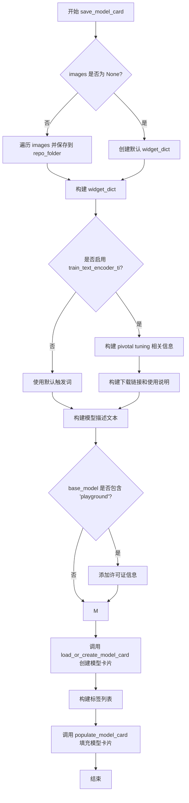

#### 带注释源码

```python
def save_model_card(
    repo_id: str,
    use_dora: bool,
    images: list = None,
    base_model: str = None,
    train_text_encoder=False,
    train_text_encoder_ti=False,
    token_abstraction_dict=None,
    instance_prompt: str = None,
    validation_prompt: str = None,
    repo_folder=None,
    vae_path=None,
):
    # 根据是否使用 DoRA 决定 LoRA 类型标签
    lora = "lora" if not use_dora else "dora"

    # 初始化 widget 字典，用于 HuggingFace Hub 上的交互式展示
    widget_dict = []
    if images is not None:
        # 遍历图像列表，保存到本地并构建 widget 字典
        for i, image in enumerate(images):
            image.save(os.path.join(repo_folder, f"image_{i}.png"))
            widget_dict.append(
                {"text": validation_prompt if validation_prompt else " ", "output": {"url": f"image_{i}.png"}}
            )
    else:
        # 无图像时添加默认 widget
        widget_dict.append({"text": instance_prompt})
    
    # 处理文本反转的 embedding 文件名
    embeddings_filename = f"{repo_folder}_emb"
    # 清理 instance_prompt 中的特殊 token 标记
    instance_prompt_webui = re.sub(r"<s\d+>", "", re.sub(r"<s\d+>", embeddings_filename, instance_prompt, count=1))
    # 提取所有特殊 token 标识符
    ti_keys = ", ".join(f'"{match}"' for match in re.findall(r"<s\d+>", instance_prompt))
    # 构建 WebUI 使用示例句子
    if instance_prompt_webui != embeddings_filename:
        instance_prompt_sentence = f"For example, `{instance_prompt_webui}`"
    else:
        instance_prompt_sentence = ""
    
    # 默认触发词字符串
    trigger_str = f"You should use {instance_prompt} to trigger the image generation."
    diffusers_imports_pivotal = ""
    diffusers_example_pivotal = ""
    webui_example_pivotal = ""
    license = ""
    
    # 检查是否为 playground 模型，添加许可证信息
    if "playground" in base_model:
        license = """\n
    ## License

    Please adhere to the licensing terms as described [here](https://huggingface.co/playgroundai/playground-v2.5-1024px-aesthetic/blob/main/LICENSE.md).
    """

    # 如果启用了文本反转训练，构建 pivotal tuning 相关信息
    if train_text_encoder_ti:
        trigger_str = (
            "To trigger image generation of trained concept(or concepts) replace each concept identifier "
            "in you prompt with the new inserted tokens:\n"
        )
        # 构建 diffusers 导入代码示例
        diffusers_imports_pivotal = """from huggingface_hub import hf_hub_download
from safetensors.torch import load_file
        """
        # 构建 diffusers 使用代码示例
        diffusers_example_pivotal = f"""embedding_path = hf_hub_download(repo_id='{repo_id}', filename='{embeddings_filename}.safetensors', repo_type="model")
state_dict = load_file(embedding_path)
pipeline.load_textual_inversion(state_dict["clip_l"], token=[{ti_keys}], text_encoder=pipeline.text_encoder, tokenizer=pipeline.tokenizer)
pipeline.load_textual_inversion(state_dict["clip_g"], token=[{ti_keys}], text_encoder=pipeline.text_encoder_2, tokenizer=pipeline.tokenizer_2)
        """
        # 构建 WebUI 使用说明
        webui_example_pivotal = f"""- *Embeddings*: download **[`{embeddings_filename}.safetensors` here 💾](/{repo_id}/blob/main/{embeddings_filename}.safetensors)**.
    - Place it on it on your `embeddings` folder
    - Use it by adding `{embeddings_filename}` to your prompt. {instance_prompt_sentence}
    (you need both the LoRA and the embeddings as they were trained together for this LoRA)
    """
        # 如果有 token 抽象字典，遍历构建每个概念的触发说明
        if token_abstraction_dict:
            for key, value in token_abstraction_dict.items():
                tokens = "".join(value)
                trigger_str += f"""
to trigger concept `{key}` → use `{tokens}` in your prompt \n
"""

    # 构建完整的模型描述
    model_description = f"""
# SDXL LoRA DreamBooth - {repo_id}

<Gallery />

## Model description

### These are {repo_id} LoRA adaption weights for {base_model}.

## Download model

### Use it with UIs such as AUTOMATIC1111, Comfy UI, SD.Next, Invoke

- **LoRA**: download **[`{repo_folder}.safetensors` here 💾](/{repo_id}/blob/main/{repo_folder}.safetensors)**.
    - Place it on your `models/Lora` folder.
    - On AUTOMATIC1111, load the LoRA by adding `<lora:{repo_folder}:1>` to your prompt. On ComfyUI just [load it as a regular LoRA](https://comfyanonymous.github.io/ComfyUI_examples/lora/).
{webui_example_pivotal}

## Use it with the [🧨 diffusers library](https://github.com/huggingface/diffusers)

```py
from diffusers import AutoPipelineForText2Image
import torch
{diffusers_imports_pivotal}
pipeline = AutoPipelineForText2Image.from_pretrained('stabilityai/stable-diffusion-xl-base-1.0', torch_dtype=torch.float16).to('cuda')
pipeline.load_lora_weights('{repo_id}', weight_name='pytorch_lora_weights.safetensors')
{diffusers_example_pivotal}
image = pipeline('{validation_prompt if validation_prompt else instance_prompt}').images[0]
```

For more details, including weighting, merging and fusing LoRAs, check the [documentation on loading LoRAs in diffusers](https://huggingface.co/docs/diffusers/main/en/using-diffusers/loading_adapters)

## Trigger words

{trigger_str}

## Details
All [Files & versions](/{repo_id}/tree/main).

The weights were trained using [🧨 diffusers Advanced Dreambooth Training Script](https://github.com/huggingface/diffusers/blob/main/examples/advanced_diffusion_training/train_dreambooth_lora_sdxl_advanced.py).

LoRA for the text encoder was enabled. {train_text_encoder}.

Pivotal tuning was enabled: {train_text_encoder_ti}.

Special VAE used for training: {vae_path}.

{license}
"""
    # 加载或创建模型卡片
    model_card = load_or_create_model_card(
        repo_id_or_path=repo_id,
        from_training=True,
        license="openrail++",
        base_model=base_model,
        prompt=instance_prompt,
        model_description=model_description,
        widget=widget_dict,
    )
    # 构建标签列表
    tags = [
        "text-to-image",
        "stable-diffusion-xl",
        "stable-diffusion-xl-diffusers",
        "text-to-image",
        "diffusers",
        lora,
        "template:sd-lora",
    ]
    # 填充模型卡片标签
    model_card = populate_model_card(model_card, tags=tags)
```


### `log_validation`

该函数用于在训练过程中运行验证，通过指定的验证提示词生成图像，并将生成的图像记录到训练跟踪器（如 TensorBoard 或 WandrB）中，以监控模型在验证集上的表现。

参数：

-  `pipeline`：`StableDiffusionXLPipeline`，用于生成图像的扩散流水线对象
-  `args`：命令行参数对象，包含 `num_validation_images`（验证图像数量）、`validation_prompt`（验证提示词）、`seed`（随机种子）、`do_edm_style_training`（是否使用 EDM 风格训练）、`pretrained_model_name_or_path`（预训练模型路径）等配置
-  `accelerator`：`Accelerator`，Hugging Face Accelerate 库提供的分布式训练加速器，用于设备管理和自动混合精度等
-  `pipeline_args`：`dict`，传递给流水线的额外参数字典，如 `prompt` 等
-  `epoch`：`int`，当前训练的轮次编号，用于记录图像的轮次信息
-  `is_final_validation`：`bool`，标识是否为最终验证的布尔值，默认为 `False`；若为 `True`，则记录阶段名称为 `"test"`，否则为 `"validation"`

返回值：`List[Image]`，返回生成的图像列表，每个元素为 PIL Image 对象。

#### 流程图

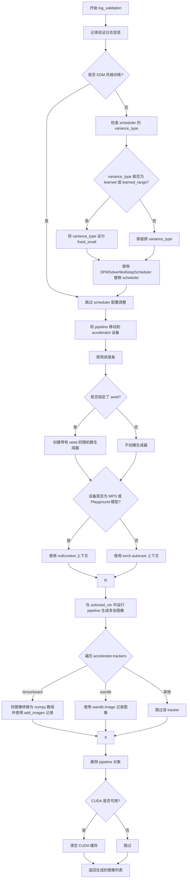

#### 带注释源码

```python
def log_validation(
    pipeline,          # StableDiffusionXLPipeline: 用于生成图像的扩散模型流水线
    args,              # Namespace: 包含训练和验证配置的命令行参数对象
    accelerator,       # Accelerator: HuggingFace Accelerate 加速器对象
    pipeline_args,    # dict: 传递给 pipeline 的额外参数，如 prompt 等
    epoch,             # int: 当前训练的轮次编号
    is_final_validation=False,  # bool: 标识是否为最终验证的标志
):
    # 记录验证日志，输出要生成的验证图像数量和使用的提示词
    logger.info(
        f"Running validation... \n Generating {args.num_validation_images} images with prompt:"
        f" {args.validation_prompt}."
    )

    # 用于配置 scheduler 的参数字典
    # 如果进行的是简化学习目标的训练（非 EDM 风格），需要处理 scheduler 的方差类型
    scheduler_args = {}

    # 仅在非 EDM 风格训练时调整 scheduler 配置
    if not args.do_edm_style_training:
        # 检查当前 scheduler 配置中是否存在 variance_type 参数
        if "variance_type" in pipeline.scheduler.config:
            variance_type = pipeline.scheduler.config.variance_type]

            # 如果方差类型为 learned 或 learned_range，替换为 fixed_small 以避免训练问题
            if variance_type in ["learned", "learned_range"]:
                variance_type = "fixed_small"

            # 将调整后的方差类型添加到 scheduler 参数中
            scheduler_args["variance_type"] = variance_type

        # 使用 DPMSolverMultistepScheduler 替换当前的 scheduler
        pipeline.scheduler = DPMSolverMultistepScheduler.from_config(pipeline.scheduler.config, **scheduler_args)

    # 将模型流水线移动到加速器所在的设备上（CPU/GPU）
    pipeline = pipeline.to(accelerator.device)
    # 禁用流水线的进度条显示
    pipeline.set_progress_bar_config(disable=True)

    # 创建随机数生成器：如果指定了 seed 则使用该 seed，否则为 None
    generator = torch.Generator(device=accelerator.device).manual_seed(args.seed) if args.seed is not None else None
    
    # 判断是否使用自动混合精度上下文：
    # 如果设备是 MPS（Apple Silicon）或模型名称包含 "playground"，则不使用 autocast
    # 否则根据 accelerator 设备类型使用 torch.autocast
    if torch.backends.mps.is_available() or "playground" in args.pretrained_model_name_or_path:
        autocast_ctx = nullcontext()
    else:
        autocast_ctx = torch.autocast(accelerator.device.type)

    # 在自动混合精度上下文中运行推理生成多张验证图像
    with autocast_ctx:
        # 循环生成指定数量的验证图像
        images = [pipeline(**pipeline_args, generator=generator).images[0] for _ in range(args.num_validation_images)]

    # 遍历所有注册的 tracker（TensorBoard 或 W&B）并记录生成的图像
    for tracker in accelerator.trackers:
        # 根据是否为最终验证确定阶段名称
        phase_name = "test" if is_final_validation else "validation"
        
        # 如果是 TensorBoard tracker，将图像转为 numpy 数组并添加图像
        if tracker.name == "tensorboard":
            np_images = np.stack([np.asarray(img) for img in images])
            tracker.writer.add_images(phase_name, np_images, epoch, dataformats="NHWC")
        
        # 如果是 W&B tracker，记录图像并添加标题
        if tracker.name == "wandb":
            tracker.log(
                {
                    phase_name: [
                        wandb.Image(image, caption=f"{i}: {args.validation_prompt}") for i, image in enumerate(images)
                    ]
                }
            )

    # 删除 pipeline 对象以释放显存
    del pipeline
    # 如果 CUDA 可用，清空 CUDA 缓存
    if torch.cuda.is_available():
        torch.cuda.empty_cache()

    # 返回生成的图像列表
    return images
```


### `import_model_class_from_model_name_or_path`

该函数用于根据预训练模型的配置信息动态导入并返回对应的文本编码器类（CLIPTextModel 或 CLIPTextModelWithProjection），支持从 HuggingFace Hub 或本地路径加载模型配置。

参数：

- `pretrained_model_name_or_path`：`str`，预训练模型的名称（如 "stabilityai/stable-diffusion-xl-base-1.0"）或本地路径
- `revision`：`str`，模型版本号（如 "main" 或 "v1.0"）
- `subfolder`：`str`，模型子文件夹路径，默认为 "text_encoder"（用于指定加载 text_encoder 还是 text_encoder_2）

返回值：`type`（`CLIPTextModel` 或 `CLIPTextModelWithProjection` 类），返回对应的文本编码器类对象

#### 流程图

```mermaid
flowchart TD
    A[开始] --> B[调用 PretrainedConfig.from_pretrained 加载配置]
    B --> C[获取 text_encoder_config.architectures[0]]
    C --> D{判断 model_class}
    D -->|CLIPTextModel| E[从 transformers 导入 CLIPTextModel]
    D -->|CLIPTextModelWithProjection| F[从 transformers 导入 CLIPTextModelWithProjection]
    D -->|其他| G[抛出 ValueError 异常]
    E --> H[返回 CLIPTextModel 类]
    F --> I[返回 CLIPTextModelWithProjection 类]
```

#### 带注释源码

```python
def import_model_class_from_model_name_or_path(
    pretrained_model_name_or_path: str, revision: str, subfolder: str = "text_encoder"
):
    """
    从预训练模型配置中导入对应的文本编码器类。
    
    参数:
        pretrained_model_name_or_path: 预训练模型名称或本地路径
        revision: Git revision ID
        subfolder: 模型子文件夹（text_encoder 或 text_encoder_2）
    
    返回:
        CLIPTextModel 或 CLIPTextModelWithProjection 类
    """
    # 加载预训练模型的文本编码器配置文件
    text_encoder_config = PretrainedConfig.from_pretrained(
        pretrained_model_name_or_path, subfolder=subfolder, revision=revision
    )
    
    # 从配置中获取模型架构名称
    model_class = text_encoder_config.architectures[0]

    # 根据架构名称返回对应的类
    if model_class == "CLIPTextModel":
        # 标准 CLIP 文本编码器
        from transformers import CLIPTextModel
        return CLIPTextModel
    elif model_class == "CLIPTextModelWithProjection":
        # 带投影的 CLIP 文本编码器（用于 SDXL）
        from transformers import CLIPTextModelWithProjection
        return CLIPTextModelWithProjection
    else:
        # 不支持的模型架构
        raise ValueError(f"{model_class} is not supported.")
```


### `is_belong_to_blocks`

这是一个全局函数，用于检查给定的键（通常是UNet的注意力处理器名称）是否属于指定的块集合。它通过遍历块列表并检查每个块是否出现在键中来实现匹配功能。

参数：

- `key`：`str`，需要检查的字符串，通常是注意力处理器（attention processor）的名称
- `blocks`：`List[str]`，块名称列表，用于检查key是否属于这些块

返回值：`bool`，如果key属于任何一个块则返回True，否则返回False

#### 流程图

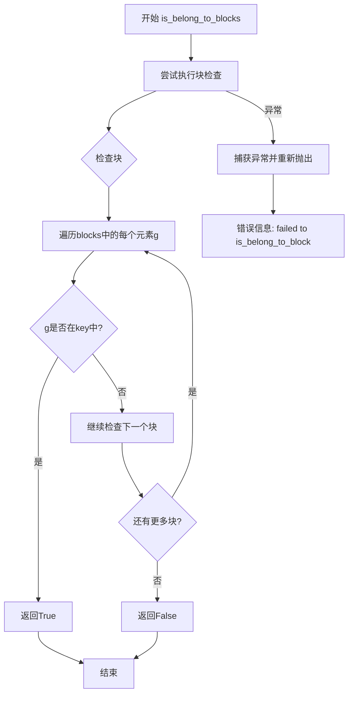

#### 带注释源码

```python
# Taken (and slightly modified) from B-LoRA repo https://github.com/yardenfren1996/B-LoRA/blob/main/blora_utils.py
def is_belong_to_blocks(key, blocks):
    """
    检查给定的键是否属于指定的块集合。
    
    参数:
        key: str - 需要检查的字符串，通常是注意力处理器名称
        blocks: List[str] - 块名称列表
    
    返回:
        bool - 如果key属于任何一个块返回True，否则返回False
    """
    try:
        # 遍历所有指定的块
        for g in blocks:
            # 检查当前块是否出现在键中
            if g in key:
                # 如果找到匹配，立即返回True
                return True
        # 遍历完所有块都没有匹配，返回False
        return False
    except Exception as e:
        # 捕获异常并添加上下文信息后重新抛出
        raise type(e)(f"failed to is_belong_to_block, due to: {e}")
```


### `get_unet_lora_target_modules`

该函数用于获取 UNet 模型中适用于 LoRA（Low-Rank Adaptation）训练的目标注意力模块。它支持两种模式：一种是 B-LoRA（Block LoRA）模式，自动定位特定的注意力块；另一种是通过自定义 `target_blocks` 参数指定要训练的模块。函数会解析这些模块路径，并生成对应的 LoRA 目标模块名称列表（如 `to_k`、`to_q`、`to_v`、`to_out.0` 等）。

参数：

- `unet`：`UNet2DConditionModel`，需要获取 LoRA 目标模块的 UNet 模型实例
- `use_blora`：`bool`，是否使用 B-LoRA 模式；若为 `True`，则自动使用预定义的 content 和 style 块
- `target_blocks`：`Optional[List[str]]`，可选参数，用户指定的 UNet 块路径列表（例如 `"unet.up_blocks.0.attentions.0"`）

返回值：`List[str]`，返回 LoRA 目标模块的完整路径列表，例如 `["up_blocks.0.attentions.0.to_k", "up_blocks.0.attentions.0.to_q", ...]`

#### 流程图

```mermaid
flowchart TD
    A[开始: get_unet_lora_target_modules] --> B{use_blora == True?}
    B -- 是 --> C[设置 content_b_lora_blocks = 'unet.up_blocks.0.attentions.0']
    C --> D[设置 style_b_lora_blocks = 'unet.up_blocks.0.attentions.1']
    D --> E[target_blocks = [content_b_lora_blocks, style_b_lora_blocks]]
    B -- 否 --> F[使用传入的 target_blocks 参数]
    E --> G[提取 blocks: 去除 'unet.' 前缀]
    F --> G
    G --> H[遍历 unet.attn_processors]
    H --> I{is_belong_to_blocks attn_processor_name?}
    I -- 是 --> J[提取 attn 基础路径]
    I -- 否 --> H
    J --> K[收集匹配的 attns]
    K --> L[生成 target_modules: 每attn × 4个矩阵]
    L --> M[返回 target_modules 列表]
    
    G -.-> |异常| N[捕获异常]
    N --> O[抛出自定义错误信息]
```

#### 带注释源码

```python
def get_unet_lora_target_modules(unet, use_blora, target_blocks=None):
    """
    获取 UNet 模型中适用于 LoRA 训练的目标注意力模块。
    
    参数:
        unet: UNet2DConditionModel 实例
        use_blora: 是否使用 B-LoRA 模式
        target_blocks: 可选的块路径列表
    返回:
        LoRA 目标模块路径列表
    """
    
    # 如果使用 B-LoRA 模式，设置预定义的 content 和 style 块
    if use_blora:
        content_b_lora_blocks = "unet.up_blocks.0.attentions.0"
        style_b_lora_blocks = "unet.up_blocks.0.attentions.1"
        target_blocks = [content_b_lora_blocks, style_b_lora_blocks]
    
    try:
        # 处理目标块列表，去除 'unet.' 前缀
        # 例如 "unet.up_blocks.0.attentions.0" -> "up_blocks.0.attentions.0"
        blocks = [(".").join(blk.split(".")[1:]) for blk in target_blocks]

        # 遍历 UNet 的注意力处理器，筛选出属于目标块的处理器
        attns = [
            attn_processor_name.rsplit(".", 1)[0]  # 提取路径的最后一部分作为基础路径
            for attn_processor_name, _ in unet.attn_processors.items()
            if is_belong_to_blocks(attn_processor_name, blocks)
        ]

        # 为每个注意力基础路径生成 4 个 LoRA 目标模块
        # to_k, to_q, to_v, to_out.0 是 LoRA 常见的注入位置
        target_modules = [
            f"{attn}.{mat}" 
            for mat in ["to_k", "to_q", "to_v", "to_out.0"] 
            for attn in attns
        ]
        return target_modules
    
    except Exception as e:
        # 捕获异常并添加上下文信息，帮助用户定位问题
        raise type(e)(
            f"failed to get_target_modules, due to: {e}. "
            f"Please check the modules specified in --lora_unet_blocks are correct"
        )
```


### `tokenize_prompt`

该函数是文本提示的标记化工具函数，用于将文本提示转换为模型可处理的 token ID 张量。它使用提供的分词器对提示进行填充、截断，并返回 PyTorch 张量格式的输入 ID 序列。

参数：

- `tokenizer`：`transformers.AutoTokenizer` 或类似的分词器对象，用于将文本转换为 token ID
- `prompt`：`str`，需要标记化的文本提示
- `add_special_tokens`：`bool`，默认为 False，控制是否在标记序列中添加特殊 token（如 [CLS]、[SEP] 等）

返回值：`torch.Tensor`，形状为 (1, max_length) 的标记 ID 张量，包含标记化后的输入 ID

#### 流程图

```mermaid
graph TD
    A[开始 tokenize_prompt] --> B[接收 tokenizer, prompt, add_special_tokens]
    B --> C{调用 tokenizer]
    C --> D[padding='max_length']
    C --> E[max_length=tokenizer.model_max_length]
    C --> F[truncation=True]
    C --> G[add_special_tokens=add_special_tokens]
    C --> H[return_tensors='pt']
    D --> I[tokenizer 返回包含 input_ids 的字典]
    I --> J[提取 text_inputs.input_ids]
    J --> K[返回 text_input_ids 张量]
    K --> L[结束]
```

#### 带注释源码

```python
def tokenize_prompt(tokenizer, prompt, add_special_tokens=False):
    """
    将文本提示标记化为 token ID 张量
    
    参数:
        tokenizer: 分词器对象（如 AutoTokenizer）
        prompt: 需要标记化的文本字符串
        add_special_tokens: 是否添加特殊 token（如 [CLS], [SEP]）
    
    返回:
        标记化后的 token ID 张量
    """
    # 使用分词器对提示进行编码
    # padding="max_length": 填充到最大长度
    # max_length=tokenizer.model_max_length: 使用分词器的最大长度限制
    # truncation=True: 如果超过最大长度则截断
    # add_special_tokens: 控制是否添加特殊 token（如句子开头/结束标记）
    # return_tensors="pt": 返回 PyTorch 张量格式
    text_inputs = tokenizer(
        prompt,
        padding="max_length",
        max_length=tokenizer.model_max_length,
        truncation=True,
        add_special_tokens=add_special_tokens,
        return_tensors="pt",
    )
    
    # 从分词器返回的字典中提取 input_ids
    text_input_ids = text_inputs.input_ids
    
    # 返回标记化后的 token ID 张量
    return text_input_ids
```


### `encode_prompt`

该函数用于将文本提示编码为嵌入向量，支持SDXL模型的双文本编码器架构。它遍历所有文本编码器，对提示进行分词和编码，提取隐藏状态并根据clip_skip参数选择特定层，最后将所有编码器的嵌入拼接在一起返回。

参数：

- `text_encoders`：List[CLIPTextModel/CLIPTextModelWithProjection]，文本编码器列表（通常为两个，CLIP ViT-L/14和CLIP ViT-G/14）
- `tokenizers`：List[PreTrainedTokenizer]/None，用于对提示进行分词的tokenizer列表
- `prompt`：str，要编码的文本提示
- `text_input_ids_list`：List[Tensor]/None，预分词的token IDs列表，当tokenizers为None时使用
- `clip_skip`：int/None，要跳过的CLIP层数，None时使用倒数第二层

返回值：`Tuple[Tensor, Tensor]`，返回提示嵌入（prompt_embeds）和池化提示嵌入（pooled_prompt_embeds）

#### 流程图

```mermaid
flowchart TD
    A[开始 encode_prompt] --> B[初始化空列表 prompt_embeds_list]
    B --> C{遍历 text_encoders}
    C --> D{tokenizers is not None}
    D -->|Yes| E[使用 tokenizers[i] 对 prompt 分词]
    D -->|No| F[使用 text_input_ids_list[i]]
    E --> G[调用 text_encoder 编码 text_input_ids]
    F --> G
    G --> H[提取 pooled_prompt_embeds = prompt_embeds[0]]
    H --> I{clip_skip is None}
    I -->|Yes| J[提取倒数第二层 hidden_states]
    I -->|No| K[提取倒数第 clip_skip+2 层]
    J --> L[重塑 prompt_embeds]
    K --> L
    L --> M[将当前编码器结果加入 prompt_embeds_list]
    M --> C
    C --> N{所有编码器处理完毕}
    N --> O[拼接所有 prompt_embeds]
    O --> P[重塑 pooled_prompt_embeds]
    P --> Q[返回 prompt_embeds 和 pooled_prompt_embeds]
```

#### 带注释源码

```python
def encode_prompt(text_encoders, tokenizers, prompt, text_input_ids_list=None, clip_skip=None):
    """
    将文本提示编码为嵌入向量，支持SDXL双文本编码器架构

    参数:
        text_encoders: 文本编码器列表（通常为两个：CLIP ViT-L/14 和 CLIP ViT-G/14）
        tokenizers: tokenizer列表，为None时使用text_input_ids_list
        prompt: 要编码的文本提示
        text_input_ids_list: 预分词的token IDs列表
        clip_skip: 跳过的CLIP层数，None时使用倒数第二层
    """
    prompt_embeds_list = []

    # 遍历所有文本编码器（SDXL有两个：clip_l和clip_g）
    for i, text_encoder in enumerate(text_encoders):
        # 根据是否有tokenizers决定分词方式
        if tokenizers is not None:
            tokenizer = tokenizers[i]
            # 调用tokenize_prompt进行分词
            text_input_ids = tokenize_prompt(tokenizer, prompt)
        else:
            # 使用预分词的token IDs
            assert text_input_ids_list is not None
            text_input_ids = text_input_ids_list[i]

        # 通过文本编码器获取嵌入，输出隐藏状态
        prompt_embeds = text_encoder(
            text_input_ids.to(text_encoder.device), 
            output_hidden_states=True, 
            return_dict=False
        )

        # 获取池化的提示嵌入（第一个元素）
        # SDXL总是使用最后一个文本编码器的池化输出
        pooled_prompt_embeds = prompt_embeds[0]
        
        # 根据clip_skip参数选择隐藏层
        if clip_skip is None:
            # 默认使用倒数第二层（SDXL的常见做法）
            prompt_embeds = prompt_embeds[-1][-2]
        else:
            # 根据clip_skip值选择层，+2是因为SDXL总是从倒数第二层开始索引
            prompt_embeds = prompt_embeds[-1][-(clip_skip + 2)]
        
        # 获取批次大小、序列长度和隐藏维度
        bs_embed, seq_len, _ = prompt_embeds.shape
        # 重塑为 (batch_size, seq_len, hidden_size)
        prompt_embeds = prompt_embeds.view(bs_embed, seq_len, -1)
        prompt_embeds_list.append(prompt_embeds)

    # 沿最后一个维度拼接所有文本编码器的嵌入
    prompt_embeds = torch.concat(prompt_embeds_list, dim=-1)
    # 重塑池化嵌入为 (batch_size, hidden_size)
    pooled_prompt_embeds = pooled_prompt_embeds.view(bs_embed, -1)
    
    return prompt_embeds, pooled_prompt_embeds
```


### `collate_fn`

该函数是 PyTorch DataLoader 的数据整理函数，用于将多个样本批次整理成模型训练所需的格式。它从数据集中提取图像、提示文本和相关的微调信息（如原始尺寸和裁剪坐标），并在启用先验保留时合并类别图像和提示。

参数：

- `examples`：`List[Dict]`，从 `DreamBoothDataset` 返回的样本列表，每个样本包含实例图像、提示、原始尺寸和裁剪坐标等键
- `with_prior_preservation`：`bool`，是否启用先验保留（prior preservation）模式，用于在训练时同时保留类别先验分布

返回值：`Dict`，包含以下键值对的批次字典：
- `pixel_values`：`torch.Tensor`，形状为 `(batch_size, channels, height, width)` 的图像张量
- `prompts`：`List[str]`，实例图像对应的提示文本列表
- `original_sizes`：`List[Tuple[int, int]]`，每个实例图像的原始尺寸列表
- `crop_top_lefts`：`List[Tuple[int, int]]`，每个实例图像的裁剪左上角坐标列表

#### 流程图

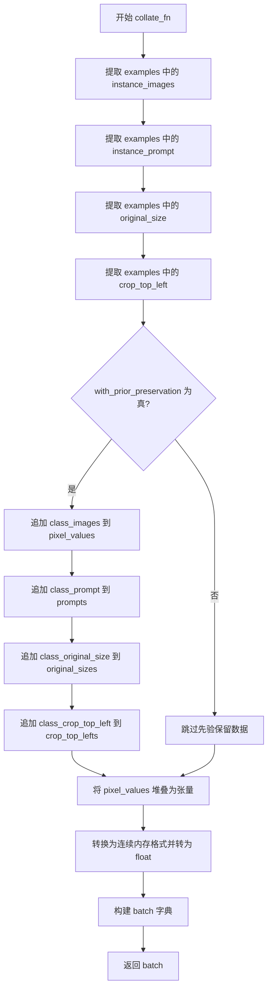

#### 带注释源码

```python
def collate_fn(examples, with_prior_preservation=False):
    """
    将数据集中的样本整理成模型训练所需的批次格式。
    
    参数:
        examples: 从 DreamBoothDataset 返回的样本列表，每个样本是一个字典
        with_prior_preservation: 是否在批次中包含类别图像用于先验保留损失
    """
    # 从每个样本中提取实例图像、提示、原始尺寸和裁剪坐标
    pixel_values = [example["instance_images"] for example in examples]
    prompts = [example["instance_prompt"] for example in examples]
    original_sizes = [example["original_size"] for example in examples]
    crop_top_lefts = [example["crop_top_left"] for example in examples]

    # 如果启用先验保留，将类别图像和提示也添加到批次中
    # 这样可以避免进行两次前向传播来分别计算实例损失和先验损失
    if with_prior_preservation:
        pixel_values += [example["class_images"] for example in examples]
        prompts += [example["class_prompt"] for example in examples]
        original_sizes += [example["class_original_size"] for example in examples]
        crop_top_lefts += [example["class_crop_top_left"] for example in examples]

    # 将像素值列表堆叠为 PyTorch 张量，并确保内存连续后转为 float 类型
    pixel_values = torch.stack(pixel_values)
    pixel_values = pixel_values.to(memory_format=torch.contiguous_format).float()

    # 构建并返回批次字典
    batch = {
        "pixel_values": pixel_values,
        "prompts": prompts,
        "original_sizes": original_sizes,
        "crop_top_lefts": crop_top_lefts,
    }
    return batch
```


### `TokenEmbeddingsHandler.initialize_new_tokens`

该方法用于在文本编码器（Text Encoder）和分词器（Tokenizer）中初始化新插入的特殊标记（Token），为文本反转（Textual Inversion）训练做准备。它会为每个新标记分配基于原始嵌入标准差的随机初始化嵌入向量，并保存原始嵌入设置以便后续恢复。

参数：

- `inserting_toks`：`List[str]`，需要插入到分词器的新特殊标记列表，例如 `["<s0>", "<s1>"]`

返回值：`None`，该方法直接修改对象的内部状态，不返回任何值

#### 流程图

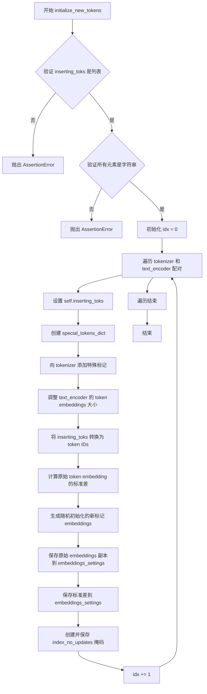

#### 带注释源码

```python
def initialize_new_tokens(self, inserting_toks: List[str]):
    """
    初始化新标记的 embeddings，用于文本反转训练。
    
    参数:
        inserting_toks: 需要插入的新特殊标记列表
    """
    idx = 0  # 用于跟踪当前处理的 text_encoder 索引
    
    # 遍历所有的 tokenizer 和 text_encoder 对（通常是两个：CLIP ViT-L/14 和 CLIP ViT-G/14）
    for tokenizer, text_encoder in zip(self.tokenizers, self.text_encoders):
        # 参数验证：确保 inserting_toks 是字符串列表
        assert isinstance(inserting_toks, list), "inserting_toks should be a list of strings."
        assert all(isinstance(tok, str) for tok in inserting_toks), (
            "All elements in inserting_toks should be strings."
        )

        # 保存插入的标记列表到实例变量
        self.inserting_toks = inserting_toks
        
        # 创建特殊标记字典，添加额外特殊标记
        special_tokens_dict = {"additional_special_tokens": self.inserting_toks}
        tokenizer.add_special_tokens(special_tokens_dict)
        
        # 调整 text_encoder 的 token embeddings 维度以匹配新的 tokenizer 大小
        text_encoder.resize_token_embeddings(len(tokenizer))

        # 将新标记字符串转换为对应的 token IDs
        self.train_ids = tokenizer.convert_tokens_to_ids(self.inserting_toks)

        # 获取原始 token embeddings 的标准差，用于保持初始化分布的一致性
        std_token_embedding = text_encoder.text_model.embeddings.token_embedding.weight.data.std()

        print(f"{idx} text encoder's std_token_embedding: {std_token_embedding}")

        # 为新插入的标记生成随机初始化的 embeddings
        # 使用原始 embeddings 的标准差进行缩放，保持与原始嵌入相似的分布
        text_encoder.text_model.embeddings.token_embedding.weight.data[self.train_ids] = (
            torch.randn(len(self.train_ids), text_encoder.text_model.config.hidden_size)
            .to(device=self.device)  # 使用 property 获取设备
            .to(dtype=self.dtype)    # 使用 property 获取数据类型
            * std_token_embedding
        )
        
        # 保存原始 embeddings 的副本，用于后续可能的恢复操作
        self.embeddings_settings[f"original_embeddings_{idx}"] = (
            text_encoder.text_model.embeddings.token_embedding.weight.data.clone()
        )
        
        # 保存标准差，用于后续 embeddings 的归一化处理
        self.embeddings_settings[f"std_token_embedding_{idx}"] = std_token_embedding

        # 创建布尔掩码：标记哪些位置不需要更新（新增的 token 位置设为 False）
        inu = torch.ones((len(tokenizer),), dtype=torch.bool)
        inu[self.train_ids] = False

        # 保存哪些 embeddings 不应该被更新的索引
        self.embeddings_settings[f"index_no_updates_{idx}"] = inu

        # 打印索引形状用于调试
        print(self.embeddings_settings[f"index_no_updates_{idx}"].shape)

        idx += 1
```


### `TokenEmbeddingsHandler.save_embeddings`

该方法用于将训练后的新 token 嵌入（token embeddings）保存到指定文件。它从文本编码器的 token embedding 层提取新添加 token 的嵌入向量，并使用 safetensors 格式保存为兼容的键名（"clip_l" 和 "clip_g"），以便与 diffusers 生态系统兼容。

**参数：**

- `file_path`：`str`，保存嵌入向量的目标文件路径（.safetensors 格式）

**返回值：** 无返回值（`None`），该方法直接写入文件

#### 流程图

```mermaid
flowchart TD
    A[开始 save_embeddings] --> B{检查 train_ids 是否已初始化}
    B -->|未初始化| C[抛出断言错误]
    B -->|已初始化| D[创建空字典 tensors]
    E[遍历 text_encoders 列表] --> F{idx < len(text_encoders)}
    F -->|是| G[验证 tokenizer 长度一致性]
    G --> H[从当前 text_encoder 提取新 token 的嵌入向量]
    H --> I[根据 idx_to_text_encoder_name 映射键名]
    I --> J[将嵌入向量存入 tensors 字典]
    J --> F
    F -->|否| K[使用 save_file 保存 tensors 到 file_path]
    K --> L[结束]
```

#### 带注释源码

```python
def save_embeddings(self, file_path: str):
    # 断言检查：确保在保存嵌入之前已经初始化了新 token
    # 如果未调用 initialize_new_tokens 方法，直接调用此方法会报错
    assert self.train_ids is not None, "Initialize new tokens before saving embeddings."
    
    # 创建字典用于存储所有文本编码器的新 token 嵌入
    tensors = {}
    
    # 建立索引到文本编码器名称的映射：
    # text_encoder_0 对应 CLIP ViT-L/14 (clip_l)
    # text_encoder_1 对应 CLIP ViT-G/14 (clip_g)
    idx_to_text_encoder_name = {0: "clip_l", 1: "clip_g"}
    
    # 遍历所有文本编码器（通常为 2 个：CLIP-L 和 CLIP-G）
    for idx, text_encoder in enumerate(self.text_encoders):
        # 验证所有 tokenizer 的词汇表大小一致
        assert text_encoder.text_model.embeddings.token_embedding.weight.data.shape[0] == len(
            self.tokenizers[0]
        ), "Tokenizers should be the same."
        
        # 从文本编码器的 token embedding 权重中提取新添加 token 的嵌入向量
        # self.train_ids 存储了新 token 在词汇表中的索引
        new_token_embeddings = text_encoder.text_model.embeddings.token_embedding.weight.data[self.train_ids]

        # 为每个文本编码器的新 token 分配键名：
        # - text_encoder 0 的嵌入保存为 "clip_l"
        # - text_encoder 1 的嵌入保存为 "clip_g"
        # 使用生态系统兼容的命名约定，以便其他工具（如 WebUI）加载
        tensors[idx_to_text_encoder_name[idx]] = new_token_embeddings

    # 使用 safetensors 格式将所有嵌入向量保存到指定文件
    # 这是一种高效的张量序列化格式，支持内存映射
    save_file(tensors, file_path)
```


### `TokenEmbeddingsHandler.retract_embeddings`

该方法用于在文本反转（Textual Inversion）训练过程中恢复文本编码器的token嵌入。它将非训练标记的嵌入恢复为原始值，并对训练标记的嵌入进行标准化调整，以确保嵌入的统计特性与训练前保持一致。

参数：

- 该方法没有显式参数（隐式使用 `self`）

返回值：`None`，该方法直接修改对象的内部状态

#### 流程图

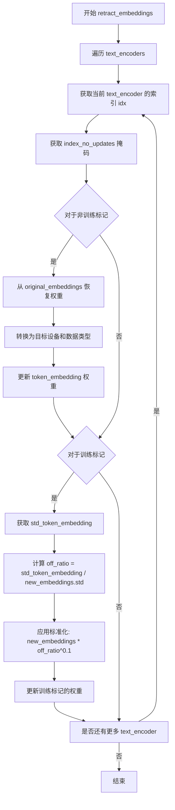

#### 带注释源码

```python
@torch.no_grad()
def retract_embeddings(self):
    """
    恢复文本编码器的token嵌入到训练前的状态。
    对于非训练标记：恢复为原始嵌入
    对于训练标记：应用标准化以保持与原始嵌入相同的标准差
    """
    # 遍历所有文本编码器（通常有两个：CLIP ViT-L/14 和 CLIP ViT-G/14）
    for idx, text_encoder in enumerate(self.text_encoders):
        # 获取非训练标记的索引掩码（这些标记的嵌入不应被更新）
        index_no_updates = self.embeddings_settings[f"index_no_updates_{idx}"]
        
        # 恢复非训练标记的嵌入为原始值
        text_encoder.text_model.embeddings.token_embedding.weight.data[index_no_updates] = (
            self.embeddings_settings[f"original_embeddings_{idx}"][index_no_updates]
            .to(device=text_encoder.device)
            .to(dtype=text_encoder.dtype)
        )

        # 获取训练前嵌入的标准差
        # 用于对训练标记的嵌入进行标准化
        std_token_embedding = self.embeddings_settings[f"std_token_embedding_{idx}"]

        # 获取训练标记的索引（index_no_updates的补集）
        index_updates = ~index_no_updates
        
        # 获取训练标记的当前嵌入
        new_embeddings = text_encoder.text_model.embeddings.token_embedding.weight.data[index_updates]
        
        # 计算缩放比率：原始标准差 / 当前标准差
        off_ratio = std_token_embedding / new_embeddings.std()

        # 应用标准化调整（使用0.1次方进行平滑处理）
        new_embeddings = new_embeddings * (off_ratio**0.1)
        
        # 更新训练标记的嵌入权重
        text_encoder.text_model.embeddings.token_embedding.weight.data[index_updates] = new_embeddings
```


### `DreamBoothDataset.__init__`

该方法是 `DreamBoothDataset` 类的构造函数，用于初始化 DreamBooth 训练数据集。它负责加载实例图像和类别图像，进行图像预处理（包括大小调整、裁剪、翻转等），并为 SD-XL 模型准备微调所需的各种条件信息（如原始尺寸、裁剪坐标等）。

参数：

- `instance_data_root`：`str`，实例图像所在的根目录路径或 HuggingFace 数据集名称
- `instance_prompt`：`str`，用于描述实例图像的提示词
- `class_prompt`：`str`，用于描述类别图像的提示词（用于先验保留损失）
- `train_text_encoder_ti`：`bool`，是否训练文本编码器的文本反转（Textual Inversion）
- `class_data_root`：`Optional[str]`，类别图像所在的根目录路径，默认为 None
- `class_num`：`Optional[int]`，类别图像的最大数量，默认为 None
- `token_abstraction_dict`：`Optional[Dict[str, List[str]]]`，文本反转的 token 映射字典，默认为 None
- `size`：`int`，图像的目标分辨率，默认为 1024
- `repeats`：`int`，每个图像重复的次数，默认为 1
- `center_crop`：`bool`，是否使用中心裁剪，默认为 False

返回值：`None`（构造函数无返回值）

#### 流程图

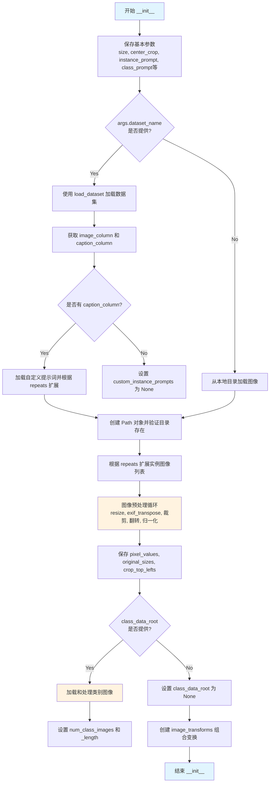

#### 带注释源码

```python
def __init__(
    self,
    instance_data_root,
    instance_prompt,
    class_prompt,
    train_text_encoder_ti,
    class_data_root=None,
    class_num=None,
    token_abstraction_dict=None,  # token mapping for textual inversion
    size=1024,
    repeats=1,
    center_crop=False,
):
    # 保存基本参数
    self.size = size  # 图像目标分辨率
    self.center_crop = center_crop  # 是否中心裁剪

    # 保存提示词相关参数
    self.instance_prompt = instance_prompt  # 实例图像提示词
    self.custom_instance_prompts = None  # 自定义提示词（从数据集加载）
    self.class_prompt = class_prompt  # 类别图像提示词
    self.token_abstraction_dict = token_abstraction_dict  # token 映射字典
    self.train_text_encoder_ti = train_text_encoder_ti  # 是否训练文本反转

    # 根据数据来源选择加载方式
    # 如果提供了 --dataset_name，则使用 HuggingFace datasets 库加载
    if args.dataset_name is not None:
        try:
            from datasets import load_dataset
        except ImportError:
            raise ImportError(
                "You are trying to load your data using the datasets library. If you wish to train using custom "
                "captions please install the datasets library: `pip install datasets`. If you wish to load a "
                "local folder containing images only, specify --instance_data_dir instead."
            )
        
        # 下载并加载数据集
        dataset = load_dataset(
            args.dataset_name,
            args.dataset_config_name,
            cache_dir=args.cache_dir,
        )
        
        # 获取数据集列名
        column_names = dataset["train"].column_names

        # 确定图像列名（默认使用第一列）
        if args.image_column is None:
            image_column = column_names[0]
            logger.info(f"image column defaulting to {image_column}")
        else:
            image_column = args.image_column
            if image_column not in column_names:
                raise ValueError(
                    f"`--image_column` value '{args.image_column}' not found in dataset columns. Dataset columns are: {', '.join(column_names)}"
                )
        
        # 获取实例图像
        instance_images = dataset["train"][image_column]

        # 处理提示词列
        if args.caption_column is None:
            logger.info(
                "No caption column provided, defaulting to instance_prompt for all images. If your dataset "
                "contains captions/prompts for the images, make sure to specify the "
                "column as --caption_column"
            )
            self.custom_instance_prompts = None
        else:
            if args.caption_column not in column_names:
                raise ValueError(
                    f"`--caption_column` value '{args.caption_column}' not found in dataset columns. Dataset columns are: {', '.join(column_names)}"
                )
            # 加载自定义提示词
            custom_instance_prompts = dataset["train"][args.caption_column]
            # 根据 repeats 扩展提示词列表
            self.custom_instance_prompts = []
            for caption in custom_instance_prompts:
                self.custom_instance_prompts.extend(itertools.repeat(caption, repeats))
    else:
        # 从本地目录加载图像
        self.instance_data_root = Path(instance_data_root)
        if not self.instance_data_root.exists():
            raise ValueError("Instance images root doesn't exists.")

        # 打开目录中的所有图像文件
        instance_images = [Image.open(path) for path in list(Path(instance_data_root).iterdir())]
        self.custom_instance_prompts = None

    # 根据 repeats 扩展实例图像列表
    self.instance_images = []
    for img in instance_images:
        self.instance_images.extend(itertools.repeat(img, repeats))

    # ==================== 图像预处理 ====================
    self.original_sizes = []  # 存储原始图像尺寸
    self.crop_top_lefts = []   # 存储裁剪左上角坐标
    self.pixel_values = []    # 存储处理后的像素值

    # 获取插值模式
    interpolation = getattr(transforms.InterpolationMode, args.image_interpolation_mode.upper(), None)
    if interpolation is None:
        raise ValueError(f"Unsupported interpolation mode {interpolation=}.")
    
    # 创建变换操作
    train_resize = transforms.Resize(size, interpolation=interpolation)  # 调整大小
    train_crop = transforms.CenterCrop(size) if center_crop else transforms.RandomCrop(size)  # 裁剪
    train_flip = transforms.RandomHorizontalFlip(p=1.0)  # 水平翻转
    train_transforms = transforms.Compose([
        transforms.ToTensor(),           # 转换为张量
        transforms.Normalize([0.5], [0.5]),  # 归一化到 [-1, 1]
    ])

    # 判断是否为单图像（B-LoRA 场景）
    single_image = len(self.instance_images) < 2

    # 处理每张实例图像
    for image in self.instance_images:
        # EXIF  transpose（处理手机拍摄的照片方向问题）
        if not single_image:
            image = exif_transpose(image)
        
        # 转换为 RGB 模式
        if not image.mode == "RGB":
            image = image.convert("RGB")
        
        # 保存原始尺寸（用于 SD-XL 条件）
        self.original_sizes.append((image.height, image.width))
        
        # 调整图像大小
        image = train_resize(image)

        # 随机翻转
        if not single_image and args.random_flip and random.random() < 0.5:
            image = train_flip(image)

        # 裁剪处理
        if args.center_crop or single_image:
            y1 = max(0, int(round((image.height - args.resolution) / 2.0)))
            x1 = max(0, int(round((image.width - args.resolution) / 2.0)))
            image = train_crop(image)
        else:
            y1, x1, h, w = train_crop.get_params(image, (args.resolution, args.resolution))
            image = crop(image, y1, x1, h, w)
        
        # 保存裁剪坐标
        crop_top_left = (y1, x1)
        self.crop_top_lefts.append(crop_top_left)
        
        # 应用变换并保存
        image = train_transforms(image)
        self.pixel_values.append(image)

    # 保存实例图像数量并设置数据集长度
    self.num_instance_images = len(self.instance_images)
    self._length = self.num_instance_images

    # ==================== 处理类别图像（先验保留） ====================
    if class_data_root is not None:
        self.class_data_root = Path(class_data_root)
        self.class_data_root.mkdir(parents=True, exist_ok=True)
        self.class_images_path = list(self.class_data_root.iterdir())

        # 初始化类别图像相关列表
        self.original_sizes_class_imgs = []
        self.crop_top_lefts_class_imgs = []
        self.pixel_values_class_imgs = []
        
        # 加载类别图像
        self.class_images = [Image.open(path) for path in self.class_images_path]
        
        # 处理每张类别图像
        for image in self.class_images:
            image = exif_transpose(image)
            if not image.mode == "RGB":
                image = image.convert("RGB")
            self.original_sizes_class_imgs.append((image.height, image.width))
            image = train_resize(image)
            if args.random_flip and random.random() < 0.5:
                image = train_flip(image)
            if args.center_crop:
                y1 = max(0, int(round((image.height - args.resolution) / 2.0)))
                x1 = max(0, int(round((image.width - args.resolution) / 2.0)))
                image = train_crop(image)
            else:
                y1, x1, h, w = train_crop.get_params(image, (args.resolution, args.resolution))
                image = crop(image, y1, x1, h, w)
            crop_top_left = (y1, x1)
            self.crop_top_lefts_class_imgs.append(crop_top_left)
            image = train_transforms(image)
            self.pixel_values_class_imgs.append(image)

        # 确定类别图像数量
        if class_num is not None:
            self.num_class_images = min(len(self.class_images_path), class_num)
        else:
            self.num_class_images = len(self.class_images_path)
        
        # 更新数据集长度（取实例和类别图像数量的最大值）
        self._length = max(self.num_class_images, self.num_instance_images)
    else:
        self.class_data_root = None

    # 创建图像变换组合（用于验证/推理）
    self.image_transforms = transforms.Compose([
        transforms.Resize(size, interpolation=interpolation),
        transforms.CenterCrop(size) if center_crop else transforms.RandomCrop(size),
        transforms.ToTensor(),
        transforms.Normalize([0.5], [0.5]),
    ])
```


### DreamBoothDataset.__len__

返回数据集的样本数量，用于 PyTorch DataLoader 确定迭代次数。

参数：该方法没有显式参数（使用隐式的 `self` 参数）

返回值：`int`，返回数据集包含的样本总数

#### 流程图

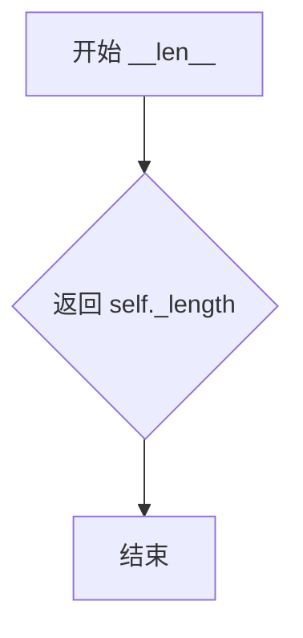

#### 带注释源码

```python
def __len__(self):
    """
    返回数据集的样本数量。
    
    返回值:
        int: 数据集中可用的样本总数。该值在 __init__ 方法中计算：
             - 如果只使用实例图像：_length = num_instance_images
             - 如果使用类别先验保存：_length = max(num_class_images, num_instance_images)
             这样可以确保在训练时每个epoch都能完整遍历所有类别图像和实例图像
    """
    return self._length
```


### `DreamBoothDataset.__getitem__`

该方法是 DreamBooth 数据集类的核心索引方法，负责根据给定的索引返回训练样本。它从预处理后的图像缓冲区中检索图像数据，处理自定义提示词（如需进行文本反转则替换 token），并返回包含图像、提示词及元数据的完整训练样本字典。

**参数：**

- `self`：`DreamBoothDataset`，数据集实例本身
- `index`：`int`，请求的样本索引

**返回值：** `dict`，包含以下键值的字典：
- `instance_images`：`torch.Tensor`，实例图像的像素值
- `instance_prompt`：`str`，实例提示词
- `original_size`：`tuple`，原始图像尺寸 (height, width)
- `crop_top_left`：`tuple`，裁剪左上角坐标 (y, x)
- `class_prompt`：`str`（如启用 prior preservation），类别提示词
- `class_images`：`torch.Tensor`（如启用 prior preservation），类别图像像素值
- `class_original_size`：`tuple`（如启用 prior preservation），类别图像原始尺寸
- `class_crop_top_left`：`tuple`（如启用 prior preservation），类别图像裁剪坐标

#### 流程图

```mermaid
flowchart TD
    A[开始 __getitem__] --> B[创建空 example 字典]
    B --> C[获取实例图像: pixel_values[index % num_instance_images]]
    C --> D[获取原始尺寸: original_sizes[index % num_instance_images]]
    D --> E[获取裁剪坐标: crop_top_lefts[index % num_instance_images]]
    E --> F{是否有自定义提示词?}
    F -->|是| G{提示词非空?}
    G -->|是| H{是否训练文本编码器TI?}
    H -->|是| I[替换 token_abstraction 为新 token]
    I --> J[设置 instance_prompt]
    G -->|否| K[使用默认 instance_prompt]
    H -->|否| J
    F -->|否| K
    K --> L{是否有 class_data_root?}
    L -->|是| M[添加 class_prompt]
    M --> N[添加 class_images 及其元数据]
    N --> O[返回 example]
    L -->|否| O
```

#### 带注释源码

```python
def __getitem__(self, index):
    """
    获取指定索引的训练样本。
    
    该方法从预处理后的数据中检索单个训练样本，包括：
    - 实例图像及其元数据（原始尺寸、裁剪坐标）
    - 实例提示词（支持自定义提示词和 token abstraction 替换）
    - 类别图像及其元数据（如果启用了 prior preservation）
    
    参数:
        index (int): 样本索引，用于从数据集中检索数据
        
    返回:
        dict: 包含以下键的字典:
            - instance_images: 实例图像的像素值 (Tensor)
            - instance_prompt: 实例提示词 (str)
            - original_size: 原始图像尺寸 (tuple: (height, width))
            - crop_top_left: 裁剪左上角坐标 (tuple: (y, x))
            - class_prompt: 类别提示词（如启用 prior preservation）
            - class_images: 类别图像（如启用 prior preservation）
            - class_original_size: 类别图像原始尺寸（如启用 prior preservation）
            - class_crop_top_left: 类别图像裁剪坐标（如启用 prior preservation）
    """
    # 初始化空字典用于存储样本数据
    example = {}
    
    # --- 1. 检索实例图像及其元数据 ---
    # 使用模运算实现数据循环（当索引超过实例数量时循环使用）
    example["instance_images"] = self.pixel_values[index % self.num_instance_images]
    example["original_size"] = self.original_sizes[index % self.num_instance_images]
    example["crop_top_left"] = self.crop_top_lefts[index % self.num_instance_images]

    # --- 2. 处理实例提示词 ---
    if self.custom_instance_prompts:
        # 如果存在自定义提示词（从数据集元数据或外部文件加载）
        caption = self.custom_instance_prompts[index % self.num_instance_images]
        
        if caption:
            # 如果当前索引对应的提示词非空
            if self.train_text_encoder_ti:
                # 如果启用文本反转训练，进行 token abstraction 替换
                # 将提示词中的抽象 token（如 "TOK"）替换为实际学习的新 token（如 "<s0><s1>"）
                for token_abs, token_replacement in self.token_abstraction_dict.items():
                    caption = caption.replace(token_abs, "".join(token_replacement))
            
            # 使用处理后的自定义提示词
            example["instance_prompt"] = caption
        else:
            # 如果自定义提示词为空，使用类级别的默认实例提示词
            example["instance_prompt"] = self.instance_prompt
    else:
        # 没有自定义提示词，使用类级别的默认实例提示词
        example["instance_prompt"] = self.instance_prompt

    # --- 3. 处理类别图像（prior preservation）---
    if self.class_data_root:
        # 如果配置了类别数据目录（用于 prior preservation loss）
        example["class_prompt"] = self.class_prompt
        example["class_images"] = self.pixel_values_class_imgs[index % self.num_class_images]
        example["class_original_size"] = self.original_sizes_class_imgs[index % self.num_class_images]
        example["class_crop_top_left"] = self.crop_top_lefts_class_imgs[index % self.num_class_images]

    # --- 4. 返回完整样本 ---
    return example
```


### `PromptDataset.__len__`

返回数据集中包含的样本数量，用于 DataLoader 确定迭代次数。

参数：
- （无，除了隐式的 `self`）

返回值：`int`，返回 `num_samples` 的值，即数据集中要生成的样本总数。

#### 流程图

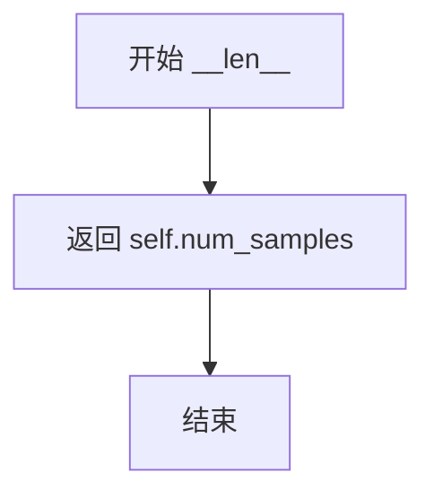

#### 带注释源码

```python
def __len__(self):
    """
    返回数据集中样本的数量。
    
    该方法被 DataLoader 调用，以确定遍历整个数据集所需的步数。
    当使用 prior preservation（先验保留）时，DreamBoothDataset 会根据
    实例图像数量和类别图像数量计算最终长度，但 PromptDataset 的
    长度直接由初始化时传入的 num_samples 参数决定。
    
    Returns:
        int: 数据集中要生成的提示词样本数量
    """
    return self.num_samples
```


### `PromptDataset.__getitem__`

该方法用于根据给定索引返回数据集中的单个样本，包含对应的提示词和索引值。

参数：

- `index`：`int`，要获取的样本索引

返回值：`Dict[str, Any]`，包含提示词和索引的字典对象

#### 流程图

```mermaid
flowchart TD
    A[开始 __getitem__] --> B[创建空字典 example]
    B --> C[设置 example['prompt'] = self.prompt]
    C --> D[设置 example['index'] = index]
    D --> E[返回 example 字典]
```

#### 带注释源码

```python
def __getitem__(self, index):
    """
    根据索引获取数据集中的单个样本。
    
    参数:
        index: int - 样本的索引位置
        
    返回:
        dict - 包含 'prompt' 和 'index' 键的字典
    """
    # 初始化空字典用于存储样本数据
    example = {}
    
    # 将数据集初始化时保存的提示词赋值给样本
    example["prompt"] = self.prompt
    
    # 保存当前样本的索引值，用于后续追踪生成的类别图像
    example["index"] = index
    
    # 返回包含提示词和索引的字典
    return example
```

## 关键组件


### 张量索引与惰性加载

在训练循环中通过`cache_latents`参数实现。当启用时，VAE编码的latents会被缓存到内存中，避免每个训练步骤都重复执行VAE编码操作，显著减少训练计算开销。

### 反量化支持

通过`TokenEmbeddingsHandler`类的`retract_embeddings`方法实现。该方法在每个训练步骤后，将非更新的token embeddings恢复为原始值，同时对更新的embeddings进行归一化处理以保持与原始embeddings相同的标准差。

### 量化策略

代码支持多种混合精度训练策略，包括FP16、BF16和FP32。通过`weight_dtype`变量控制，VAE始终保持在float32以避免NaN损失，而LoRA参数在混合精度训练时会Cast到float32进行优化器更新。

### LoRA变体支持

支持三种LoRA训练模式：标准LoRA、DoRA（权重分解低秩适应）和B-LoRA（隐式风格-内容分离）。通过`use_dora`和`use_blora`参数控制，B-LoRA会自动锁定目标块为`unet.up_blocks.0.attentions.0`和`unet.up_blocks.0.attentions.1`。

### 文本反演训练

通过`TokenEmbeddingsHandler`类实现，支持在文本编码器中插入新的特殊token（默认为`<s0>`, `<s1>`等），并对这些token的embeddings进行随机初始化和训练，实现概念学习。

### 先验保持损失

通过`with_prior_preservation`参数启用，在训练时同时使用实例图像和类别图像进行训练，通过`prior_loss_weight`参数控制类别先验损失的权重，防止模型过拟合到特定实例。

### EDM风格训练

支持EDM（Elucidating the Design Space of Diffusion Models）训练格式，通过`do_edm_style_training`参数启用，使用EDMEulerScheduler或EulerDiscreteScheduler，并对噪声预测进行特殊的预处理和后处理。

### 分布式训练支持

使用Accelerator实现分布式数据并行训练，支持梯度累积、混合精度、梯度检查点等多种优化技术，通过`DistributedDataParallelKwargs`处理未使用参数的情况。

### 验证与检查点管理

`log_validation`函数在验证期间生成样本图像并记录到TensorBoard或WandB，检查点管理包括自动清理旧检查点以控制存储空间，支持从任意检查点恢复训练。

### 模型卡片生成

`save_model_card`函数自动生成HuggingFace模型卡片，包含LoRA使用方法、触发词、训练细节等信息，并支持WebUI和diffusers两种使用方式的说明。


## 问题及建议


### 已知问题

- **超长主函数**: `main()` 函数超过 2000 行，包含大量功能逻辑，违反单一职责原则，难以维护和测试。
- **过度使用 assert**: 代码中多处使用 `assert` 进行参数验证，在生产环境中应使用 `raise ValueError` 替代。
- **魔法数字和硬编码**: 存在多处硬编码值（如 `rank=4`、学习率默认值等），缺乏统一的配置管理。
- **不一致的变量命名**: 存在 `tokenizer` 与 `tokenizers`、`text_encoder` 与 `text_encoders` 混用的情况，易造成混淆。
- **异常处理不完善**: `is_belong_to_blocks` 函数中的异常处理仅是简单的重新抛出，未增加实际价值。
- **类型提示不足**: 大量函数缺少参数和返回值的类型注解，影响代码可读性和 IDE 支持。
- **资源管理问题**: `latents_cache` 在内存中累积大量 latent，未实现分批处理或流式处理。
- **验证逻辑重复**: 训练结束时的验证代码与训练循环中的验证代码存在重复。
- **潜在空指针风险**: `args.dataset_name` 等参数在使用前未进行完整的空值检查。
- **日志输出不一致**: 混用 `logger.info`、`print` 和 `warnings.warn`，日志级别不统一。

### 优化建议

- **重构 main() 函数**: 将其拆分为多个独立函数，如 `setup_models()`、`prepare_dataset()`、`training_loop()`、`save_checkpoint()` 等。
- **引入配置类**: 使用 dataclass 或 Pydantic 定义训练配置，统一管理超参数和默认值。
- **增强错误处理**: 将 assert 替换为显式的参数验证，提供具体的错误信息。
- **添加类型注解**: 为所有函数添加完整的类型提示，包括泛型支持。
- **优化内存管理**: 实现 latent cache 的分块处理或使用生成器模式减少内存占用。
- **统一日志系统**: 全面使用 `logger` 进行日志记录，减少 `print` 语句的使用。
- **提取重复逻辑**: 将文本编码逻辑、验证逻辑等重复代码抽取为独立函数或工具类。
- **增加输入验证**: 对文件路径、模型 ID 等关键输入进行更严格的验证。
- **优化数据加载**: 考虑使用 `IterableDataset` 或增加 `num_workers` 的默认值以提升数据加载效率。
- **添加性能监控**: 在关键路径添加显存使用、训练时间等监控指标。

## 其它


### 设计目标与约束

本代码实现Stable Diffusion XL (SDXL) 的 DreamBooth LoRA 训练脚本，核心目标是将指定概念（人物、物体或风格）通过LoRA（Low-Rank Adaptation）技术微调到SDXL模型中，同时支持Prior Preservation（先验保持）以防止过拟合。支持的训练模式包括：标准LoRA训练、DoRA（Weight-Decomposed Low-Rank Adaptation）、B-LoRA（隐式风格-内容分离）、Textual Inversion（文本反转）以及Text Encoder微调。主要约束包括：需要至少16GB显存的GPU（推荐24GB）、支持FP16/BF16混合精度训练（BF16需Ampere架构GPU）、不支持MPS后端的BF16训练、以及LoRA rank默认值为4。

### 错误处理与异常设计

代码采用多层错误处理机制：1) 参数解析阶段通过`parse_args()`函数进行输入验证，如互斥参数检查（dataset_name与instance_data_dir不能同时指定、train_text_encoder与train_text_encoder_ti互斥）、必要参数检查（instance_prompt必填）、以及使用prior preservation时的条件检查；2) 依赖检查通过`check_min_version()`验证diffusers最低版本，通过`is_wandb_available()`和`is_xformers_available()`检查可选依赖；3) 运行时异常处理包括ImportError捕获（如datasets、bitsandbytes、prodigyopt库的缺失提示安装方法）、ValueError异常（如不支持的optimizer类型、混合精度配置错误）、以及Warning警告（如B-LoRA与lora_unet_blocks同时指定、class_data_dir与prior_preservation未同时使用）；4) GPU内存管理通过`gc.collect()`和`torch.cuda.empty_cache()`在关键节点释放显存。

### 数据流与状态机

训练数据流经过以下阶段：1) 数据集加载阶段：从HuggingFace Hub下载dataset或从本地目录读取instance images，同时支持class images生成（prior preservation模式）；2) 图像预处理阶段：执行Resize、CenterCrop/RandomCrop、RandomHorizontalFlip、ToTensor、Normalize操作；3) Tokenization阶段：将instance_prompt和class_prompt编码为token ids，支持Textual Inversion时的新token插入；4) VAE编码阶段：将像素值编码为latent representations，可选缓存以加速训练；5) 噪声调度阶段：采样随机timestep并添加噪声（forward diffusion process）；6) UNet预测阶段：根据预测类型（epsilon/v_prediction）计算噪声残差或速度；7) 损失计算阶段：计算MSE损失，支持SNR weighting和prior preservation loss；8) 反向传播与优化阶段：执行梯度累积、梯度裁剪、optimizer step和lr scheduler更新。状态机包括：训练循环（epoch→step）、优化器切换状态（训练text encoder到只训练UNET的pivot点）、以及检查点保存/加载状态。

### 外部依赖与接口契约

核心依赖包括：1) `diffusers>=0.37.0.dev0`：提供StableDiffusionXLPipeline、UNet2DConditionModel、AutoencoderKL、噪声调度器等；2) `transformers>=4.41.2`：提供CLIPTextModel、CLIPTextModelWithProjection、AutoTokenizer；3) `torch>=2.0.0`：深度学习框架；4) `accelerate>=0.31.0`：分布式训练加速；5) `peft>=0.11.1`：LoRA/DoRA实现；6) `safetensors`：模型权重安全序列化；7) `huggingface_hub`：模型下载上传；8) `pillow`：图像处理；9) `numpy`：数值计算；10) `tensorboard`/`wandb`：训练可视化。可选依赖：xformers（高效注意力）、bitsandbytes（8-bit Adam）、datasets（自定义数据集）、prodigyopt（Prodigy优化器）。接口契约包括：数据集需遵循ImageFolder结构（含image和caption列）或本地目录结构；模型需符合SDXL架构（含tokenizer、tokenizer_2、text_encoder、text_encoder_2、unet、vae、scheduler组件）；LoRA权重保存为safetensors格式并兼容WebUI格式转换。

### 性能优化策略

代码实现多项性能优化：1) 混合精度训练：支持FP16和BF16，通过`weight_dtype`控制非训练参数精度以节省显存；2) 梯度检查点（gradient_checkpointing）：以计算换内存，降低UNet和Text Encoder的显存占用；3) xFormers Memory Efficient Attention：当可用时启用以加速注意力计算；4) Latent缓存：`cache_latents`选项预计算VAE latents避免重复编码；5) 分布式训练：支持DDP（DistributedDataParallel）和多GPU训练，通过`accelerator`统一管理；6) TF32加速：Ampere GPU上启用TF32矩阵运算；7) 梯度累积：支持多步累积以实现更大有效batch size；8) 优化器选择：支持AdamW、8-bit Adam、Prodigy等高效优化器；9) 文本编码冻结：默认冻结text encoder仅训练LoRA adapter；10) 异步数据加载：通过`dataloader_num_workers`配置多进程数据加载。

### 安全性考虑

代码涉及以下安全考量：1) Hub Token安全：检测到同时使用`--report_to=wandb`和`--hub_token`时抛出安全风险警告，建议使用`hf auth login`认证；2) 权重精度管理：确保LoRA参数在FP32下训练以避免数值不稳定；3) 模型下载安全：使用huggingface_hub的`hf_hub_download`进行安全下载；4) 文件系统安全：检查点保存前验证目录权限，清理旧检查点防止磁盘溢出；5) 分布式训练安全：使用`accelerator`的安全模型解包（unwrap_model）处理编译模型。

### 配置管理

所有训练参数通过`argparse`统一管理，分为以下类别：1) 模型配置：pretrained_model_name_or_path、pretrained_vae_model_name_or_path、revision、variant；2) 数据配置：dataset_name、instance_data_dir、class_data_dir、instance_prompt、class_prompt、resolution、center_crop、random_flip；3) 训练配置：train_batch_size、num_train_epochs、max_train_steps、learning_rate、gradient_accumulation_steps、gradient_checkpointing；4) LoRA配置：rank、lora_dropout、use_dora、use_blora、lora_unet_blocks；5) Text Encoder配置：train_text_encoder、train_text_encoder_ti、token_abstraction、num_new_tokens_per_abstraction、text_encoder_lr；6) 优化器配置：optimizer、use_8bit_adam、adam_beta1/beta2、adam_weight_decay、adam_epsilon；7) 调度器配置：lr_scheduler、lr_warmup_steps、lr_num_cycles、lr_power；8) 验证配置：validation_prompt、num_validation_images、validation_epochs；9) 输出配置：output_dir、checkpointing_steps、checkpoints_total_limit、resume_from_checkpoint；10) 监控配置：report_to、logging_dir、logging_steps。参数通过`accelerator.init_trackers`记录到TensorBoard或WandB。

### 版本兼容性

代码对以下版本有明确要求：1) diffusers>=0.37.0.dev0：最小版本检查通过`check_min_version`；2) torch>=2.0.0：支持TF32和BF16；3) transformers>=4.41.2：支持CLIPTextModelWithProjection；4) peft>=0.11.1：支持LoRA配置；5) Python版本：建议3.8+；6) CUDA版本：建议11.0+以支持TF32；7) 特殊硬件：BF16需要NVIDIA Ampere GPU（RTX 30xx/A100）；8) MPS限制：macOS MPS后端不支持BF16和某些AMP特性。代码通过`packaging.version`解析xformers版本并进行兼容性检查。

### 检查点与恢复机制

检查点系统实现如下：1) 保存机制：通过`accelerator.save_state`保存完整训练状态（包含optimizer、lr_scheduler、随机种子、LoRA权重等），保存在`output_dir/checkpoint-{global_step}`目录；2) 加载机制：通过`resume_from_checkpoint`参数指定恢复路径，支持"latest"自动选择最新检查点；3) 限制策略：通过`checkpoints_total_limit`参数限制最大保存检查点数量，超出时自动删除最旧的检查点；4) 权重独立保存：LoRA权重同时独立保存为safetensors文件，支持推理时直接加载；5) Textual Inversion embedding：保存到`{output_dir}_emb.safetensors`；6) 恢复时处理：重新加载VAE、Text Encoder（按需）、UNet的LoRA权重，并处理incompatible keys警告。

### 多GPU与分布式训练支持

代码通过`accelerate`库全面支持分布式训练：1) 自动设备分配：模型自动分配到正确设备（cuda/mps/cpu）；2) DDP支持：通过`DistributedDataParallelKwargs`配置，支持find_unused_parameters处理可选模块；3) 混合精度协调：主进程协调各进程的AMP（Automatic Mixed Precision）状态；4) 进程同步：使用`accelerator.sync_gradients`同步梯度更新；5) 验证流程：仅在主进程执行validation避免重复；6) 检查点管理：仅主进程执行检查点保存和模型上传；7) 日志记录：通过`accelerator.log`聚合各进程日志；8) 随机种子：使用`set_seed`确保各进程初始状态一致；9) 动态batch size：支持根据GPU数量自动调整有效batch size。

### 模型保存与导出格式

代码支持多种模型输出格式：1) Diffusers格式：通过`StableDiffusionXLPipeline.save_lora_weights`保存，包含`pytorch_lora_weights.safetensors`和`pytorch_lora_weights.bin`；2) Kohya/WebUI格式：通过`convert_state_dict_to_kohya`转换并保存为`{output_dir}.safetensors`；3) PEFT格式：内部使用PEFT的`get_peft_model_state_dict`获取状态字典；4) Textual Inversion格式：保存为`{output_dir}_emb.safetensors`，包含clip_l和clip_g的embedding；5) Model Card：自动生成HuggingFace模型卡片，包含使用说明、示例代码、Trigger words等；6) VAE可选保存：支持保存训练时使用的自定义VAE；7) 安全序列化：优先使用safetensors格式避免pickle安全风险。

### 验证与评估流程

验证机制设计如下：1) 触发条件：每`validation_epochs`个epoch执行一次validation；2) 生成配置：使用`validation_prompt`生成`num_validation_images`张图像；3) 调度器处理：对于非EDM训练，处理variance_type以适配学习目标；4) 推理设备：根据设备类型选择autocast上下文（MPS和playground模型使用nullcontext）；5) 随机性控制：使用固定seed确保可复现；6) 日志记录：TensorBoard记录图像到"validation"或"test"（最终验证）tag，WandB记录并添加caption；7) 最终验证：训练结束后执行一次完整验证用于生成展示图像；8) 图像保存：验证图像保存到output_dir并可选择上传到Hub。

### 日志记录与监控

日志系统采用多层架构：1) 基础日志：使用`accelerate.logging.get_logger`创建模块级logger，设置format和level；2) 进程区分：主进程输出完整INFO级别日志，其他进程输出ERROR级别；3) 第三方库日志：transformers和diffusers的日志级别根据进程类型分别设置；4) 训练指标：通过`accelerator.log`记录loss、learning rate等指标；5. 进度条：使用tqdm显示训练进度，支持分布式环境下的进程隔离；6) Checkpoint日志：详细记录检查点保存/删除操作；7) 验证日志：记录生成图像数量和使用的prompt；8) TensorBoard集成：支持图像、标量的综合可视化；9) WandB集成：支持图像、指标的云端可视化；10. 命令行输出：关键操作（如EDM训练模式启用、LoRA模块加载）通过logger.info输出。
</think>

该脚本支持多种自定义配置，包括混合精度训练（fp16/bf16）、梯度检查点、xFormers高效注意力、Latent缓存、分布式训练、TF32加速等优化手段。检查点系统支持自动恢复训练和磁盘空间管理，模型可导出为Diffusers格式和Kohya/WebUI兼容格式，同时自动生成模型卡片用于Hub展示。验证流程在训练期间定期执行，最终验证生成展示图像。日志系统集成了TensorBoard和WandB，支持分布式环境下的进程管理和指标追踪。


### 设计目标与约束

本代码实现Stable Diffusion XL (SDXL) 的 DreamBooth LoRA 训练脚本，核心目标是将指定概念（人物、物体或风格）通过LoRA（Low-Rank Adaptation）技术微调到SDXL模型中，同时支持Prior Preservation（先验保持）以防止过拟合。支持的训练模式包括：标准LoRA训练、DoRA（Weight-Decomposed Low-Rank Adaptation）、B-LoRA（隐式风格-内容分离）、Textual Inversion（文本反转）以及Text Encoder微调。主要约束包括：需要至少16GB显存的GPU（推荐24GB）、支持FP16/BF16混合精度训练（BF16需Ampere架构GPU）、不支持MPS后端的BF16训练、以及LoRA rank默认值为4。

### 错误处理与异常设计

代码采用多层错误处理机制：1) 参数解析阶段通过`parse_args()`函数进行输入验证，如互斥参数检查（dataset_name与instance_data_dir不能同时指定、train_text_encoder与train_text_encoder_ti互斥）、必要参数检查（instance_prompt必填）、以及使用prior preservation时的条件检查；2) 依赖检查通过`check_min_version()`验证diffusers最低版本，通过`is_wandb_available()`和`is_xformers_available()`检查可选依赖；3) 运行时异常处理包括ImportError捕获（如datasets、bitsandbytes、prodigyopt库的缺失提示安装方法）、ValueError异常（如不支持的optimizer类型、混合精度配置错误）、以及Warning警告（如B-LoRA与lora_unet_blocks同时指定、class_data_dir与prior_preservation未同时使用）；4) GPU内存管理通过`gc.collect()`和`torch.cuda.empty_cache()`在关键节点释放显存。

### 数据流与状态机

训练数据流经过以下阶段：1) 数据集加载阶段：从HuggingFace Hub下载dataset或从本地目录读取instance images，同时支持class images生成（prior preservation模式）；2) 图像预处理阶段：执行Resize、CenterCrop/RandomCrop、RandomHorizontalFlip、ToTensor、Normalize操作；3) Tokenization阶段：将instance_prompt和class_prompt编码为token ids，支持Textual Inversion时的新token插入；4) VAE编码阶段：将像素值编码为latent representations，可选缓存以加速训练；5) 噪声调度阶段：采样随机timestep并添加噪声（forward diffusion process）；6) UNet预测阶段：根据预测类型（epsilon/v_prediction）计算噪声残差或速度；7) 损失计算阶段：计算MSE损失，支持SNR weighting和prior preservation loss；8) 反向传播与优化阶段：执行梯度累积、梯度裁剪、optimizer step和lr scheduler更新。状态机包括：训练循环（epoch→step）、优化器切换状态（训练text encoder到只训练UNET的pivot点）、以及检查点保存/加载状态。

### 外部依赖与接口契约

核心依赖包括：1) `diffusers>=0.37.0.dev0`：提供StableDiffusionXLPipeline、UNet2DConditionModel、AutoencoderKL、噪声调度器等；2) `transformers>=4.41.2`：提供CLIPTextModel、CLIPTextModelWithProjection、AutoTokenizer；3) `torch>=2.0.0`：深度学习框架；4) `accelerate>=0.31.0`：分布式训练加速；5) `peft>=0.11.1`：LoRA/DoRA实现；6) `safetensors`：模型权重安全序列化；7) `huggingface_hub`：模型下载上传；8) `pillow`：图像处理；9) `numpy`：数值计算；10) `tensorboard`/`wandb`：训练可视化。可选依赖：xformers（高效注意力）、bitsandbytes（8-bit Adam）、datasets（自定义数据集）、prodigyopt（Prodigy优化器）。接口契约包括：数据集需遵循ImageFolder结构（含image和caption列）或本地目录结构；模型需符合SDXL架构（含tokenizer、tokenizer_2、text_encoder、text_encoder_2、unet、vae、scheduler组件）；LoRA权重保存为safetensors格式并兼容WebUI格式转换。

### 性能优化策略

代码实现多项性能优化：1) 混合精度训练：支持FP16和BF16，通过`weight_dtype`控制非训练参数精度以节省显存；2) 梯度检查点（gradient_checkpointing）：以计算换内存，降低UNet和Text Encoder的显存占用；3) xFormers Memory Efficient Attention：当可用时启用以加速注意力计算；4) Latent缓存：`cache_latents`选项预计算VAE latents避免重复编码；5) 分布式训练：支持DDP（DistributedDataParallel）和多GPU训练，通过`accelerator`统一管理；6) TF32加速：Ampere GPU上启用TF32矩阵运算；7) 梯度累积：支持多步累积以实现更大有效batch size；8) 优化器选择：支持AdamW、8-bit Adam、Prodigy等高效优化器；9) 文本编码冻结：默认冻结text encoder仅训练LoRA adapter；10) 异步数据加载：通过`dataloader_num_workers`配置多进程数据加载。

### 安全性考虑

代码涉及以下安全考量：1) Hub Token安全：检测到同时使用`--report_to=wandb`和`--hub_token`时抛出安全风险警告，建议使用`hf auth login`认证；2) 权重精度管理：确保LoRA参数在FP32下训练以避免数值不稳定；3) 模型下载安全：使用huggingface_hub的`hf_hub_download`进行安全下载；4) 文件系统安全：检查点保存前验证目录权限，清理旧检查点防止磁盘溢出；5) 分布式训练安全：使用`accelerator`的安全模型解包（unwrap_model）处理编译模型。

### 配置管理

所有训练参数通过`argparse`统一管理，分为以下类别：1) 模型配置：pretrained_model_name_or_path、pretrained_vae_model_name_or_path、revision、variant；2) 数据配置：dataset_name、instance_data_dir、class_data_dir、instance_prompt、class_prompt、resolution、center_crop、random_flip；3) 训练配置：train_batch_size、num_train_epochs、max_train_steps、learning_rate、gradient_accumulation_steps、gradient_checkpointing；4) LoRA配置：rank、lora_dropout、use_dora、use_blora、lora_unet_blocks；5) Text Encoder配置：train_text_encoder、train_text_encoder_ti、token_abstraction、num_new_tokens_per_abstraction、text_encoder_lr；6) 优化器配置：optimizer、use_8bit_adam、adam_beta1/beta2、adam_weight_decay、adam_epsilon；7) 调度器配置：lr_scheduler、lr_warmup_steps、lr_num_cycles、lr_power；8) 验证配置：validation_prompt、num_validation_images、validation_epochs；9) 输出配置：output_dir、checkpointing_steps、checkpoints_total_limit、resume_from_checkpoint；10) 监控配置：report_to、logging_dir、logging_steps。参数通过`accelerator.init_trackers`记录到TensorBoard或WandB。

### 版本兼容性

代码对以下版本有明确要求：1) diffusers>=0.37.0.dev0：最小版本检查通过`check_min_version`；2) torch>=2.0.0：支持TF32和BF16；3) transformers>=4.41.2：支持CLIPTextModelWithProjection；4) peft>=0.11.1：支持LoRA配置；5) Python版本：建议3.8+；6) CUDA版本：建议11.0+以支持TF32；7) 特殊硬件：BF16需要NVIDIA Ampere GPU（RTX 30xx/A100）；8) MPS限制：macOS MPS后端不支持BF16和某些AMP特性。代码通过`packaging.version`解析xformers版本并进行兼容性检查。

### 检查点与恢复机制

检查点系统实现如下：1) 保存机制：通过`accelerator.save_state`保存完整训练状态（包含optimizer、lr_scheduler、随机种子、LoRA权重等），保存在`output_dir/checkpoint-{global_step}`目录；2) 加载机制：通过`resume_from_checkpoint`参数指定恢复路径，支持"latest"自动选择最新检查点；3) 限制策略：通过`checkpoints_total_limit`参数限制最大保存检查点数量，超出时自动删除最旧的检查点；4) 权重独立保存：LoRA权重同时独立保存为safetensors文件，支持推理时直接加载；5) Textual Inversion embedding：保存到`{output_dir}_emb.safetensors`；6) 恢复时处理：重新加载VAE、Text Encoder（按需）、UNet的LoRA权重，并处理incompatible keys警告。

### 多GPU与分布式训练支持

代码通过`accelerate`库全面支持分布式训练：1) 自动设备分配：模型自动分配到正确设备（cuda/mps/cpu）；2) DDP支持：通过`DistributedDataParallelKwargs`配置，支持find_unused_parameters处理可选模块；3) 混合精度协调：主进程协调各进程的AMP（Automatic Mixed Precision）状态；4) 进程同步：使用`accelerator.sync_gradients`同步梯度更新；5) 验证流程：仅在主进程执行validation避免重复；6) 检查点管理：仅主进程执行检查点保存和模型上传；7) 日志记录：通过`accelerator.log`聚合各进程日志；8) 随机种子：使用`set_seed`确保各进程初始状态一致；9) 动态batch size：支持根据GPU数量自动调整有效batch size。

### 模型保存与导出格式

代码支持多种模型输出格式：1) Diffusers格式：通过`StableDiffusionXLPipeline.save_lora_weights`保存，包含`pytorch_lora_weights.safetensors`和`pytorch_lora_weights.bin`；2) Kohya/WebUI格式：通过`convert_state_dict_to_kohya`转换并保存为`{output_dir}.safetensors`；3) PEFT格式：内部使用PEFT的`get_peft_model_state_dict`获取状态字典；4) Textual Inversion格式：保存为`{output_dir}_emb.safetensors`，包含clip_l和clip_g的embedding；5) Model Card：自动生成HuggingFace模型卡片，包含使用说明、示例代码、Trigger words等；6) VAE可选保存：支持保存训练时使用的自定义VAE；7) 安全序列化：优先使用safetensors格式避免pickle安全风险。

### 验证与评估流程

验证机制设计如下：1) 触发条件：每`validation_epochs`个epoch执行一次validation；2) 生成配置：使用`validation_prompt`生成`num_validation_images`张图像；3) 调度器处理：对于非EDM训练，处理variance_type以适配学习目标；4) 推理设备：根据设备类型选择autocast上下文（MPS和playground模型使用nullcontext）；5) 随机性控制：使用固定seed确保可复现；6) 日志记录：TensorBoard记录图像到"validation"或"test"（最终验证）tag，WandB记录并添加caption；7) 最终验证：训练结束后执行一次完整验证用于生成展示图像；8) 图像保存：验证图像保存到output_dir并可选择上传到Hub。

### 日志记录与监控

日志系统采用多层架构：1) 基础日志：使用`accelerate.logging.get_logger`创建模块级logger，设置format和level；2) 进程区分：主进程输出完整INFO级别日志，其他进程输出ERROR级别；3) 第三方库日志：transformers和diffusers的日志级别根据进程类型分别设置；4) 训练指标：通过`accelerator.log`记录loss、learning rate等指标；5) 进度条：使用tqdm显示训练进度，支持分布式环境下的进程隔离；6) Checkpoint日志：详细记录检查点保存/删除操作；7) 验证日志：记录生成图像数量和使用的prompt；8) TensorBoard集成：支持图像、标量的综合可视化；9) WandB集成：支持图像、指标的云端可视化；10) 命令行输出：关键操作（如EDM训练模式启用、LoRA模块加载）通过logger.info输出。


    