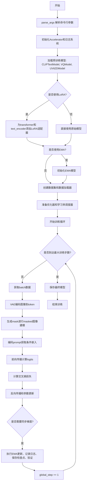
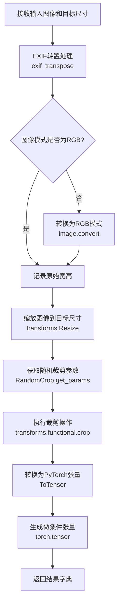
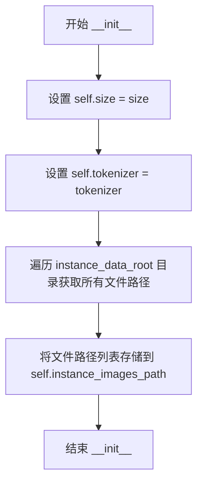
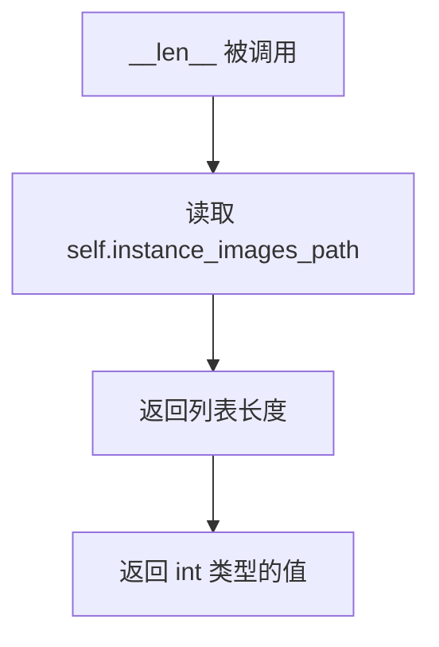
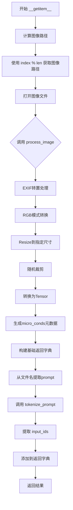
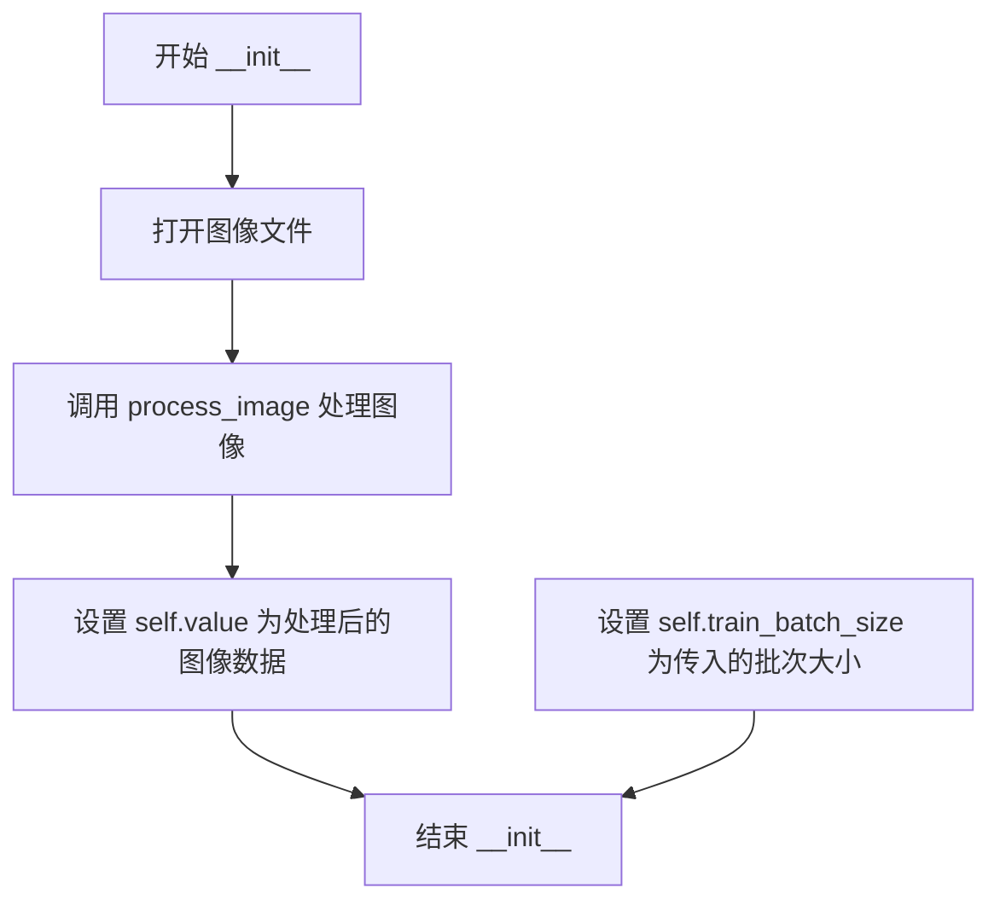
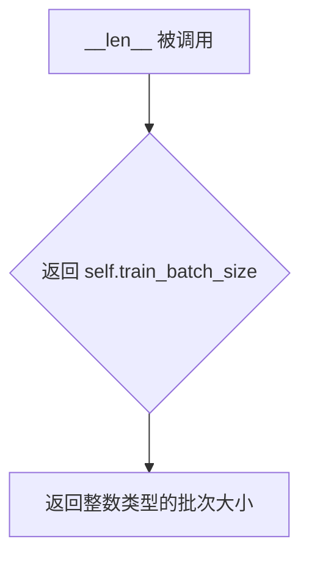
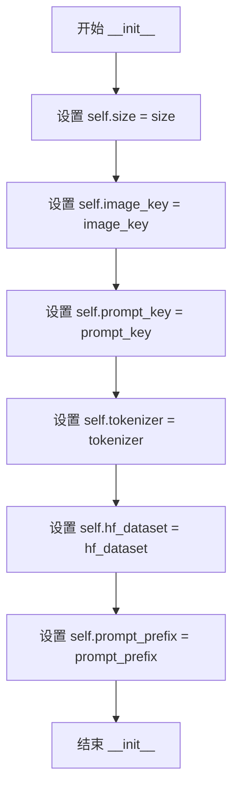
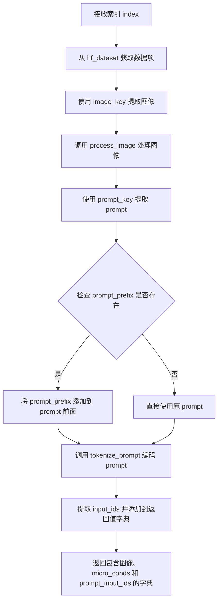

```mermaid
flowchart TD
    A[开始 main] --> B[允许TF32计算]
    B --> C[配置Accelerator加速器]
    C --> D[设置日志和随机种子]
    D --> E[加载预训练模型<br/>CLIPTextModel + CLIPTokenizer + VQModel]
    E --> F{是否训练Text Encoder?}
    F -->|是| G[配置LoRA并设置train模式]
    F -->|否| H[设置eval模式]
    G --> I[加载UVit2DModel transformer]
    H --> I
    I --> J{是否使用LoRA?}
    J -->|是| K[添加LoRA适配器]
    J -->|否| L[启用Gradient Checkpointing]
    K --> L
    L --> M{是否使用EMA?}
    M -->|是| N[初始化EMA模型]
    M -->|否| O[配置优化器参数组]
    N --> O
    O --> P[构建数据加载器]
    P --> Q[配置学习率调度器]
    Q --> R[使用Accelerator准备模型和优化器]
    R --> S{是否训练Text Encoder?}
    S -->|是| T[准备所有模型包括text_encoder]
    S -->|否| U[仅准备transformer]
    T --> V[设置权重数据类型]
    U --> V
    V --> W[预计算空文本embedding]
    W --> X{是否单图像训练?}
    X -->|是| Y[预计算单图像prompt embedding]
    X -->|否| Z[计算训练步数与轮次]
    Y --> Z
    Z --> AA[加载checkpoint如需恢复]
    AA --> AB[外层循环: epoch]
    AB --> AC[内层循环: batch]
    AC --> AD[VAE编码图像到token]
    AD --> AE[生成随机mask]
    AE --> AF{是否有prompt输入?}
    AF -->|是| AG[编码prompt得到hidden states]
    AF -->|否| AH[使用预计算的embedding]
    AG --> AI
    AH --> AI
    AI[前向传播计算logits] --> AJ[计算交叉熵损失]
    AJ --> AK[Accelerator反向传播]
    AK --> AL{达到梯度同步点?}
    AL -->|是| AM[梯度裁剪如需]
    AL -->|否| AR
    AM --> AN[优化器更新参数]
    AN --> AO[学习率调度器更新]
    AO --> AP[清零梯度]
    AP --> AQ{达到logging步骤?}
    AQ -->|是| AR[记录日志]
    AQ -->|否| AS
    AR --> AS{达到checkpoint步骤?}
    AS -->|是| AT[保存checkpoint]
    AS -->|否| AU
    AT --> AU{达到validation步骤且主进程?}
    AU -->|是| AV[执行验证生成图像]
    AU -->|否| AW[步数+1]
    AV --> AW
    AW --> AX{达到最大训练步数?}
    AX -->|否| AC
    AX -->|是| AY[等待所有进程]
    AY --> AZ[保存最终checkpoint]
    AZ --> BA[保存最终模型]
    BA --> BB[结束训练]
```

# `diffusers\examples\amused\train_amused.py` 详细设计文档

这是一个用于微调Amused/MUSE文本到图像生成模型的训练脚本，支持从目录、单张图片或HuggingFace数据集加载训练数据，使用LoRA进行高效微调，同时支持EMA、梯度检查点、混合精度训练、条件dropout等高级训练技术，可实现自定义图像生成模型的微调与部署。

## 整体流程



## 类结构

```
Dataset (抽象基类)
├── InstanceDataRootDataset (从目录加载图像)
├── InstanceDataImageDataset (从单张图片加载)
└── HuggingFaceDataset (从HuggingFace数据集加载)
```

## 全局变量及字段


### `logger`
    
日志记录器对象，用于输出训练过程中的信息

类型：`logging.Logger`
    


### `InstanceDataRootDataset.self.size`
    
图像分辨率大小

类型：`int`
    


### `InstanceDataRootDataset.self.tokenizer`
    
CLIP分词器

类型：`CLIPTokenizer`
    


### `InstanceDataRootDataset.self.instance_images_path`
    
图像文件路径列表

类型：`list[Path]`
    


### `InstanceDataImageDataset.self.value`
    
处理后的图像数据

类型：`dict`
    


### `InstanceDataImageDataset.self.train_batch_size`
    
训练批次大小

类型：`int`
    


### `HuggingFaceDataset.self.size`
    
图像分辨率大小

类型：`int`
    


### `HuggingFaceDataset.self.image_key`
    
数据集中图像字段名

类型：`str`
    


### `HuggingFaceDataset.self.prompt_key`
    
数据集中文本字段名

类型：`str`
    


### `HuggingFaceDataset.self.tokenizer`
    
CLIP分词器

类型：`CLIPTokenizer`
    


### `HuggingFaceDataset.self.hf_dataset`
    
HuggingFace数据集对象

类型：`Dataset`
    


### `HuggingFaceDataset.self.prompt_prefix`
    
prompt前缀

类型：`str | None`
    
    

## 全局函数及方法


### `parse_args`

该函数是训练脚本的入口配置函数。它使用 `argparse` 库定义并解析所有命令行参数，包括模型路径、数据源、优化器设置、日志配置等，并在解析后进行一系列逻辑校验（如检查 WandB 是否安装、数据源互斥性、文件路径有效性等），最终返回一个包含所有配置信息的 `Namespace` 对象。

参数：
- (注：此函数本身无 Python 函数签名的输入参数，其作用是解析系统命令行输入。以下为该函数定义和解析的所有命令行参数列表，这些参数构成了训练配置的主体。)
- `pretrained_model_name_or_path`：`str`，预训练模型的路径或 HuggingFace 模型标识符（必需）。
- `revision`：`str`，预训练模型标识符的 Git 版本号。
- `variant`：`str`，模型文件的变体（例如 fp16）。
- `instance_data_dataset`：`str`，Hugging Face 数据集名称，包含训练图像和文本。
- `instance_data_dir`：`str`，本地训练图像文件夹路径。
- `instance_data_image`：`str`，单张训练图像的路径。
- `use_8bit_adam`：`bool`，是否使用 bitsandbytes 的 8-bit Adam 优化器。
- `dataloader_num_workers`：`int`，数据加载的子进程数，0 表示在主进程加载。
- `allow_tf32`：`bool`，是否允许在 Ampere GPU 上使用 TF32 以加速训练。
- `use_ema`：`bool`，是否使用指数移动平均（EMA）模型。
- `ema_decay`：`float`，EMA 衰减率，默认为 0.9999。
- `adam_beta1`：`float`，Adam 优化器的 beta1 参数，默认为 0.9。
- `adam_beta2`：`float`，Adam 优化器的 beta2 参数，默认为 0.999。
- `adam_weight_decay`：`float`，权重衰减率，默认为 0.01。
- `adam_epsilon`：`float`，Adam 优化器的 epsilon 值，默认为 1e-08。
- `output_dir`：`str`，输出目录，用于写入模型预测和检查点，默认为 "muse_training"。
- `seed`：`int`，随机种子，用于保证实验可复现性。
- `logging_dir`：`str`，日志目录，默认为 "logs"。
- `max_train_steps`：`int`，总训练步数。
- `checkpointing_steps`：`int`，保存检查点的步数间隔，默认为 500。
- `logging_steps`：`int`，记录日志的步数间隔，默认为 50。
- `checkpoints_total_limit`：`int`，最多保存的检查点数量。
- `resume_from_checkpoint`：`str`，从指定路径或 "latest" 恢复训练。
- `train_batch_size`：`int`，训练批次大小，默认为 16。
- `gradient_accumulation_steps`：`int`，梯度累积步数，默认为 1。
- `learning_rate`：`float`，初始学习率，默认为 0.0003。
- `scale_lr`：`bool`，是否根据 GPU/累积/批次大小自动缩放学习率。
- `lr_scheduler`：`str`，学习率调度器类型（linear, cosine, constant 等）。
- `lr_warmup_steps`：`int`，学习率预热步数，默认为 500。
- `validation_steps`：`int`，验证的步数间隔，默认为 100。
- `mixed_precision`：`str`，混合精度类型（"fp16" 或 "bf16"）。
- `report_to`：`str`，日志记录平台（"wandb", "tensorboard" 等）。
- `validation_prompts`：`List[str]`，用于验证的提示词列表。
- `resolution`：`int`，输入图像的分辨率，默认为 512。
- `split_vae_encode`：`int`，VAE 编码的分块大小，用于显存优化。
- `min_masking_rate`：`float`，最小的掩码率。
- `cond_dropout_prob`：`float`，条件丢弃概率。
- `max_grad_norm`：`float`，梯度裁剪的最大范数。
- `use_lora`：`bool`，是否使用 LoRA 微调。
- `text_encoder_use_lora`：`bool`，是否对文本编码器使用 LoRA。
- `lora_r`：`int`，LoRA 的秩，默认为 16。
- `lora_alpha`：`int`，LoRA 的 alpha 值，默认为 32。
- `lora_target_modules`：`List[str]`，LoRA 应用的模块，默认为 ["to_q", "to_k", "to_v"]。
- `text_encoder_lora_r`：`int`，文本编码器 LoRA 的秩。
- `text_encoder_lora_alpha`：`int`，文本编码器 LoRA 的 alpha 值。
- `text_encoder_lora_target_modules`：`List[str]`，文本编码器 LoRA 应用的模块。
- `train_text_encoder`：`bool`，是否训练文本编码器。
- `image_key`：`str`，HuggingFace 数据集中图像的键名。
- `prompt_key`：`str`，HuggingFace 数据集中文本提示的键名。
- `gradient_checkpointing`：`bool`，是否开启梯度检查点以节省显存。
- `prompt_prefix`：`str`，提示词的前缀。

返回值：`args` (`argparse.Namespace`)，返回一个命名空间对象，其中包含所有解析后的命令行参数属性，供主训练流程 `main(args)` 使用。

#### 流程图

```mermaid
flowchart TD
    A([开始 parse_args]) --> B[创建 ArgumentParser 对象]
    B --> C[批量添加命令行参数<br>add_argument(...)]
    C --> D{调用 parser.parse_args()}
    D --> E[解析 sys.argv 生成 args 对象]
    E --> F{检查日志系统配置<br>if args.report_to == 'wandb'}
    F -->|是| G[校验 wandb 库是否安装]
    F -->|否| H[校验数据源互斥性]
    G --> H
    H --> I{检查数据源数量 == 1}
    I -->|否| J[抛出 ValueError: 只能选择一种数据源]
    I -->|是| K[校验 instance_data_dir 路径]
    K --> L{检查路径是否存在}
    L -->|否| M[抛出 ValueError: 路径不存在]
    L -->|是| N[校验 instance_data_dataset 的键名]
    N --> O{检查 image_key 和 prompt_key}
    O -->|否| P[抛出 ValueError: 缺少键名]
    O -->|是| Q([返回 args 对象])
    
    style C fill:#f9f,stroke:#333,stroke-width:2px
    style E fill:#ff9,stroke:#333,stroke-width:2px
    style Q fill:#9f9,stroke:#333,stroke-width:2px
    style J fill:#f99,stroke:#333,stroke-width:2px
    style M fill:#f99,stroke:#333,stroke-width:2px
    style P fill:#f99,stroke:#333,stroke-width:2px
```

#### 带注释源码

```python
def parse_args():
    """
    解析命令行参数，定义训练所需的所有配置项。
    """
    # 1. 初始化 ArgumentParser
    parser = argparse.ArgumentParser()
    
    # 2. 添加模型相关参数
    parser.add_argument(
        "--pretrained_model_name_or_path",
        type=str,
        default=None,
        required=True,
        help="Path to pretrained model or model identifier from huggingface.co/models.",
    )
    # ... (此处添加大量参数，包括 Revision, Variant, 数据集路径, 优化器参数, LoRA 配置等) ...

    # 3. 解析参数
    # 内部调用 sys.argv 进行解析
    args = parser.parse_args()

    # 4. 运行时环境校验
    # 如果指定使用 wandb，确保库已安装
    if args.report_to == "wandb":
        if not is_wandb_available():
            raise ImportError("Make sure to install wandb if you want to use it for logging during training.")

    # 5. 数据源逻辑校验
    # 检查是否仅提供了一种数据源（互斥）
    num_datasources = sum(
        [x is not None for x in [args.instance_data_dir, args.instance_data_image, args.instance_data_dataset]]
    )

    if num_datasources != 1:
        raise ValueError(
            "provide one and only one of `--instance_data_dir`, `--instance_data_image`, or `--instance_data_dataset`"
        )

    # 6. 文件/目录存在性校验
    if args.instance_data_dir is not None:
        if not os.path.exists(args.instance_data_dir):
            raise ValueError(f"Does not exist: `--args.instance_data_dir` {args.instance_data_dir}")

    if args.instance_data_image is not None:
        if not os.path.exists(args.instance_data_image):
            raise ValueError(f"Does not exist: `--args.instance_data_image` {args.instance_data_image}")

    # 7. 数据集键名校验
    # 如果使用 HuggingFace 数据集，必须指定图像和文本的键名
    if args.instance_data_dataset is not None and (args.image_key is None or args.prompt_key is None):
        raise ValueError("`--instance_data_dataset` requires setting `--image_key` and `--prompt_key`")

    # 8. 返回配置对象
    return args
```


### `process_image`

对输入图像进行预处理，包括EXIF转置、RGB模式转换、图像缩放、随机裁剪和转换为张量，同时生成包含原始尺寸和裁剪位置信息的微条件张量。

**参数：**

- `image`：`PIL.Image`，输入的原始图像对象
- `size`：`int`，目标输出图像的尺寸（宽度和高度）

**返回值：**`dict`，包含以下键值对：
- `"image"`：`torch.Tensor`，处理后的图像张量，形状为 (C, H, W)
- `"micro_conds`：`torch.Tensor`，微条件张量，包含 [原始宽度, 原始高度, 裁剪顶部坐标, 裁剪左侧坐标, 6.0]

#### 流程图



#### 带注释源码

```python
def process_image(image, size):
    """
    对输入图像进行预处理，生成模型所需格式的图像数据和微条件信息
    
    处理流程：
    1. EXIF转置：修正图像方向（根据EXIF Orientation标签）
    2. RGB转换：确保图像为RGB模式
    3. 缩放调整：将图像缩放到目标尺寸
    4. 随机裁剪：从缩放后的图像中随机裁剪出目标尺寸
    5. 张量转换：将PIL图像转换为PyTorch张量
    6. 微条件生成：记录原始尺寸和裁剪位置信息
    
    参数:
        image: PIL.Image - 输入的PIL图像对象
        size: int - 目标输出尺寸
    
    返回:
        dict: 包含处理后的图像张量和微条件信息
    """
    # Step 1: EXIF转置处理
    # 根据图像的EXIF Orientation信息自动旋转/翻转图像
    # 解决手机拍照等场景下图像方向不正确的问题
    image = exif_transpose(image)

    # Step 2: RGB模式转换
    # 确保图像为RGB模式，转换为后续处理所需的格式
    if not image.mode == "RGB":
        image = image.convert("RGB")

    # Step 3: 记录原始图像尺寸
    # 保存原始宽高信息，用于后续微条件计算
    orig_height = image.height
    orig_width = image.width

    # Step 4: 图像缩放
    # 使用双线性插值将图像缩放到目标尺寸
    image = transforms.Resize(size, interpolation=transforms.InterpolationMode.BILINEAR)(image)

    # Step 5: 随机裁剪参数获取
    # 获取随机裁剪的位置参数（top, left, height, width）
    # 这里只使用top和left坐标，height和width由size决定
    c_top, c_left, _, _ = transforms.RandomCrop.get_params(image, output_size=(size, size))
    
    # Step 6: 执行裁剪操作
    # 从指定位置裁剪出目标尺寸的图像区域
    image = transforms.functional.crop(image, c_top, c_left, size, size)

    # Step 7: 转换为PyTorch张量
    # 将PIL图像转换为shape为(C, H, W)的张量，像素值归一化到[0, 1]
    image = transforms.ToTensor()(image)

    # Step 8: 生成微条件张量
    # 包含原始宽度、原始高度、裁剪顶部坐标、裁剪左侧坐标
    # 6.0是一个固定值，可能用于表示某种缩放因子或版本信息
    micro_conds = torch.tensor(
        [orig_width, orig_height, c_top, c_left, 6.0],
    )

    # Step 9: 返回结果字典
    # image: 处理后的图像张量，用于模型输入
    # micro_conds: 包含图像尺寸和裁剪位置信息，用于条件生成
    return {"image": image, "micro_conds": micro_conds}
```


### `tokenize_prompt`

使用 tokenizer 将文本 prompt 转换为模型可处理的 input_ids 张量，支持截断和最长长度限制。

参数：

- `tokenizer`：`CLIPTokenizer`，用于对文本进行分词处理的 tokenizer 实例
- `prompt`：`str`，需要进行分词处理的文本提示

返回值：`torch.Tensor`，形状为 (1, 77) 的 token 化后的输入 ID 张量

#### 流程图

```mermaid
flowchart TD
    A[开始 tokenize_prompt] --> B[输入: tokenizer 和 prompt]
    B --> C[调用 tokenizer 处理 prompt]
    C --> D[设置 truncation=True 启用截断]
    C --> E[设置 padding='max_length' 填充到最大长度]
    C --> F[设置 max_length=77]
    C --> G[设置 return_tensors='pt' 返回 PyTorch 张量]
    D --> H[提取 .input_ids]
    H --> I[输出: torch.Tensor (1, 77)]
    I --> J[结束]
```

#### 带注释源码

```python
def tokenize_prompt(tokenizer, prompt):
    """
    使用 tokenizer 将文本 prompt 转换为 input_ids 张量
    
    参数:
        tokenizer: CLIPTokenizer 实例，用于对文本进行分词
        prompt: str，需要进行分词处理的文本提示
    
    返回:
        torch.Tensor: 形状为 (1, 77) 的 token 化后的输入 ID 张量
    """
    return tokenizer(
        prompt,                    # 待分词的文本提示
        truncation=True,           # 启用截断，超过最大长度的部分将被截断
        padding="max_length",      # 填充到最大长度，确保输出形状一致
        max_length=77,             # 最大序列长度，与 CLIPTokenizer 默认值匹配
        return_tensors="pt",      # 返回 PyTorch 张量格式
    ).input_ids                    # 提取 input_ids 部分
```


### `encode_prompt`

该函数是文本编码的核心逻辑，接收预训练的文本编码器（text_encoder）和分词后的ID张量（input_ids），通过调用模型的前向传播获取文本的深度表示。它专门提取倒数第二层的隐藏状态（encoder_hidden_states）作为细粒度特征，以及模型输出的首个元素作为池化后的全局条件嵌入（cond_embeds），供后续的图像生成模型使用。

参数：

- `text_encoder`：`CLIPTextModelWithProjection`，HuggingFace Transformers 库中的文本编码器模型，负责将文本token转换为向量。
- `input_ids`：`torch.Tensor`，经过 tokenizer 处理后的文本token ID张量，形状通常为 `(batch_size, seq_len)`。

返回值：

- `encoder_hidden_states`：`torch.Tensor`，文本编码器倒数第二层的隐藏状态，提供了丰富的文本细节特征。
- `cond_embeds`：`torch.Tensor`，文本编码器的池化输出（Pooled Output），代表文本的全局语义信息。

#### 流程图

```mermaid
graph LR
    A[输入: text_encoder, input_ids] --> B[调用: text_encoder.forward]
    B --> C{获取模型输出}
    C --> D[提取: outputs.hidden_states[-2]]
    C --> E[提取: outputs[0]]
    D --> F[返回: (encoder_hidden_states, cond_embeds)]
    E --> F
```

#### 带注释源码

```python
def encode_prompt(text_encoder, input_ids):
    """
    使用文本编码器对输入的token序列进行编码，以获取用于条件生成的特征向量。

    参数:
        text_encoder (CLIPTextModelWithProjection): 预训练的CLIP文本编码器模型。
        input_ids (torch.Tensor): 已分词的输入ID张量。

    返回:
        tuple: 包含两个张量的元组:
            - encoder_hidden_states (torch.Tensor): 倒数第二层的隐藏状态。
            - cond_embeds (torch.Tensor): 池化后的文本嵌入。
    """
    # 执行文本编码器的前向传播
    # return_dict=True: 让模型返回结果的字典格式而非元组
    # output_hidden_states=True: 请求模型返回所有隐藏状态层
    outputs = text_encoder(input_ids, return_dict=True, output_hidden_states=True)
    
    # 提取倒数第二层的隐藏状态
    # hidden_states 是一个元组，索引0是embedding层，之后是每一层的输出
    # [-2] 通常指最后一个Transformer层之前的那一层，用于平衡信息量和语义
    encoder_hidden_states = outputs.hidden_states[-2]
    
    # 提取模型输出的第一个元素，即池化后的文本向量 (Pooled Output)
    # 这通常是一个经过池化处理的向量，代表整个文本序列的语义
    cond_embeds = outputs[0]
    
    return encoder_hidden_states, cond_embeds
```


### `main`

主训练函数，负责Amused图像生成模型的完整训练流程，包括模型加载与配置、数据准备、训练循环、验证推理与检查点保存。

参数：

- `args`：命名空间对象，包含所有训练超参数（如模型路径、学习率、批次大小、LoRA/EMA配置等）

返回值：`None`，函数执行完成后直接退出

#### 流程图



#### 带注释源码

```python
def main(args):
    """Amused模型主训练函数
    
    包含完整训练流程:
    1. 初始化设置 - 加速器、日志、随机种子
    2. 模型加载 - TextEncoder, VQVAE, Transformer
    3. LoRA/EMA配置
    4. 优化器与学习率调度器设置
    5. 数据加载器准备
    6. 训练循环 - 前向、损失计算、反向传播、优化
    7. 验证生成与检查点保存
    
    Args:
        args: 包含所有训练配置的命令行参数命名空间对象
            关键参数包括:
            - pretrained_model_name_or_path: 预训练模型路径
            - learning_rate: 学习率 (默认0.0003)
            - train_batch_size: 训练批次大小 (默认16)
            - max_train_steps: 最大训练步数
            - use_lora: 是否使用LoRA微调
            - use_ema: 是否使用指数移动平均
            - gradient_accumulation_steps: 梯度累积步数
            - mixed_precision: 混合精度训练模式(fp16/bf16)
    """
    
    # ========== 1. 基础环境配置 ==========
    
    # 允许TF32计算以提升Ampere GPU性能
    if args.allow_tf32:
        torch.backends.cuda.matmul.allow_tf32 = True

    # 构建日志目录路径
    logging_dir = Path(args.output_dir, args.logging_dir)

    # 配置Accelerator项目参数
    accelerator_project_config = ProjectConfiguration(
        project_dir=args.output_dir, 
        logging_dir=logging_dir
    )

    # 初始化Accelerator - 分布式训练与混合精度管理的核心
    accelerator = Accelerator(
        gradient_accumulation_steps=args.gradient_accumulation_steps,
        mixed_precision=args.mixed_precision,
        log_with=args.report_to,
        project_config=accelerator_project_config,
    )
    
    # MPS后端禁用原生AMP
    if torch.backends.mps.is_available():
        accelerator.native_amp = False

    # 主进程创建输出目录
    if accelerator.is_main_process:
        os.makedirs(args.output_dir, exist_ok=True)

    # 配置日志格式
    logging.basicConfig(
        format="%(asctime)s - %(levelname)s - %(name)s - %(message)s",
        datefmt="%m/%d/%Y %H:%M:%S",
        level=logging.INFO,
    )
    logger.info(accelerator.state, main_process_only=False)

    # 初始化训练追踪器(WandB/TensorBoard)
    if accelerator.is_main_process:
        accelerator.init_trackers("amused", config=vars(copy.deepcopy(args)))

    # 设置随机种子保证可复现性
    if args.seed is not None:
        set_seed(args.seed)

    # ========== 2. 加载预训练模型 ==========
    
    # 加载CLIP文本编码器 - 用于将文本prompt转为embedding
    text_encoder = CLIPTextModelWithProjection.from_pretrained(
        args.pretrained_model_name_or_path, 
        subfolder="text_encoder", 
        revision=args.revision, 
        variant=args.variant
    )
    
    # 加载CLIP分词器
    tokenizer = CLIPTokenizer.from_pretrained(
        args.pretrained_model_name_or_path, 
        subfolder="tokenizer", 
        revision=args.revision, 
        variant=args.variant
    )
    
    # 加载VQVAE模型 - 将图像编码为离散token
    vq_model = VQModel.from_pretrained(
        args.pretrained_model_name_or_path, 
        subfolder="vqvae", 
        revision=args.reision, 
        variant=args.variant
    )

    # ========== 3. Text Encoder 训练配置 ==========
    
    if args.train_text_encoder:
        # 是否使用LoRA微调text encoder
        if args.text_encoder_use_lora:
            lora_config = LoraConfig(
                r=args.text_encoder_lora_r,
                lora_alpha=args.text_encoder_lora_alpha,
                target_modules=args.text_encoder_lora_target_modules,
            )
            text_encoder.add_adapter(lora_config)
        
        # 设置为训练模式
        text_encoder.train()
        text_encoder.requires_grad_(True)
    else:
        # 评估模式，不参与训练
        text_encoder.eval()
        text_encoder.requires_grad_(False)

    # VQ模型冻结，不参与训练
    vq_model.requires_grad_(False)

    # ========== 4. 加载Transformer主模型 ==========
    
    model = UVit2DModel.from_pretrained(
        args.pretrained_model_name_or_path,
        subfolder="transformer",
        revision=args.revision,
        variant=args.variant,
    )

    # LoRA配置应用于transformer
    if args.use_lora:
        lora_config = LoraConfig(
            r=args.lora_r,
            lora_alpha=args.lora_alpha,
            target_modules=args.lora_target_modules,
        )
        model.add_adapter(lora_config)

    # 设置为训练模式
    model.train()

    # ========== 5. Gradient Checkpointing 配置 ==========
    
    if args.gradient_checkpointing:
        # 内存优化：用计算时间换显存
        model.enable_gradient_checkpointing()
        if args.train_text_encoder:
            text_encoder.gradient_checkpointing_enable()

    # ========== 6. EMA (指数移动平均) 配置 ==========
    
    if args.use_ema:
        ema = EMAModel(
            model.parameters(),
            decay=args.ema_decay,
            update_after_step=args.ema_update_after_step,
            model_cls=UVit2DModel,
            model_config=model.config,
        )

    # ========== 7. 自定义模型保存/加载钩子 ==========
    
    def save_model_hook(models, weights, output_dir):
        """保存模型时的钩子函数
        
        处理LoRA权重和EMA模型的保存
        
        Args:
            models: Accelerator管理的模型列表
            weights: 权重列表
            output_dir: 输出目录
        """
        if accelerator.is_main_process:
            transformer_lora_layers_to_save = None
            text_encoder_lora_layers_to_save = None

            for model_ in models:
                # 保存transformer或LoRA权重
                if isinstance(model_, type(accelerator.unwrap_model(model))):
                    if args.use_lora:
                        transformer_lora_layers_to_save = get_peft_model_state_dict(model_)
                    else:
                        model_.save_pretrained(os.path.join(output_dir, "transformer"))
                # 保存text encoder或LoRA权重
                elif isinstance(model_, type(accelerator.unwrap_model(text_encoder))):
                    if args.text_encoder_use_lora:
                        text_encoder_lora_layers_to_save = get_peft_model_state_dict(model_)
                    else:
                        model_.save_pretrained(os.path.join(output_dir, "text_encoder"))
                else:
                    raise ValueError(f"unexpected save model: {model_.__class__}")

                # 弹出权重避免重复保存
                weights.pop()

            # 保存LoRA权重
            if transformer_lora_layers_to_save is not None or text_encoder_lora_layers_to_save is not None:
                AmusedLoraLoaderMixin.save_lora_weights(
                    output_dir,
                    transformer_lora_layers=transformer_lora_layers_to_save,
                    text_encoder_lora_layers=text_encoder_lora_layers_to_save,
                )

            # 保存EMA模型
            if args.use_ema:
                ema.save_pretrained(os.path.join(output_dir, "ema_model"))

    def load_model_hook(models, input_dir):
        """加载模型时的钩子函数
        
        处理从checkpoint恢复模型权重
        
        Args:
            models: Accelerator管理的模型列表
            input_dir: 输入目录
        """
        transformer = None
        text_encoder_ = None

        while len(models) > 0:
            model_ = models.pop()

            if isinstance(model_, type(accelerator.unwrap_model(model))):
                if args.use_lora:
                    transformer = model_
                else:
                    load_model = UVit2DModel.from_pretrained(os.path.join(input_dir, "transformer"))
                    model_.load_state_dict(load_model.state_dict())
                    del load_model
            elif isinstance(model, type(accelerator.unwrap_model(text_encoder))):
                if args.text_encoder_use_lora:
                    text_encoder_ = model_
                else:
                    load_model = CLIPTextModelWithProjection.from_pretrained(
                        os.path.join(input_dir, "text_encoder")
                    )
                    model_.load_state_dict(load_model.state_dict())
                    del load_model
            else:
                raise ValueError(f"unexpected save model: {model.__class__}")

        # 加载LoRA权重
        if transformer is not None or text_encoder_ is not None:
            lora_state_dict, network_alphas = AmusedLoraLoaderMixin.lora_state_dict(input_dir)
            AmusedLoraLoaderMixin.load_lora_into_text_encoder(
                lora_state_dict, network_alphas=network_alphas, text_encoder=text_encoder_
            )
            AmusedLoraLoaderMixin.load_lora_into_transformer(
                lora_state_dict, network_alphas=network_alphas, transformer=transformer
            )

        # 加载EMA模型
        if args.use_ema:
            load_from = EMAModel.from_pretrained(os.path.join(input_dir, "ema_model"), model_cls=UVit2DModel)
            ema.load_state_dict(load_from.state_dict())
            del load_from

    # 注册钩子
    accelerator.register_load_state_pre_hook(load_model_hook)
    accelerator.register_save_state_pre_hook(save_model_hook)

    # ========== 8. 优化器配置 ==========
    
    # 缩放学习率（考虑分布式和梯度累积）
    if args.scale_lr:
        args.learning_rate = (
            args.learning_rate * args.train_batch_size * accelerator.num_processes * args.gradient_accumulation_steps
        )

    # 选择优化器：8-bit Adam或标准AdamW
    if args.use_8bit_adam:
        try:
            import bitsandbytes as bnb
        except ImportError:
            raise ImportError(
                "Please install bitsandbytes to use 8-bit Adam. You can do so by running `pip install bitsandbytes`"
            )
        optimizer_cls = bnb.optim.AdamW8bit
    else:
        optimizer_cls = torch.optim.AdamW

    # 不对bias、layernorm和embedding进行权重衰减
    no_decay = ["bias", "layer_norm.weight", "mlm_ln.weight", "embeddings.weight"]
    optimizer_grouped_parameters = [
        {
            "params": [p for n, p in model.named_parameters() if not any(nd in n for nd in no_decay)],
            "weight_decay": args.adam_weight_decay,
        },
        {
            "params": [p for n, p in model.named_parameters() if any(nd in n for nd in no_decay)],
            "weight_decay": 0.0,
        },
    ]

    # 包含text encoder参数（如需训练）
    if args.train_text_encoder:
        optimizer_grouped_parameters.append(
            {"params": text_encoder.parameters(), "weight_decay": args.adam_weight_decay}
        )

    # 创建优化器
    optimizer = optimizer_cls(
        optimizer_grouped_parameters,
        lr=args.learning_rate,
        betas=(args.adam_beta1, args.adam_beta2),
        weight_decay=args.adam_weight_decay,
        eps=args.adam_epsilon,
    )

    logger.info("Creating dataloaders and lr_scheduler")

    # ========== 9. 数据加载器配置 ==========
    
    total_batch_size = args.train_batch_size * accelerator.num_processes * args.gradient_accumulation_steps

    # 根据数据源类型选择数据集类
    if args.instance_data_dir is not None:
        # 目录形式：多个图像文件
        dataset = InstanceDataRootDataset(
            instance_data_root=args.instance_data_dir,
            tokenizer=tokenizer,
            size=args.resolution,
        )
    elif args.instance_data_image is not None:
        # 单图像形式
        dataset = InstanceDataImageDataset(
            instance_data_image=args.instance_data_image,
            train_batch_size=args.train_batch_size,
            size=args.resolution,
        )
    elif args.instance_data_dataset is not None:
        # HuggingFace数据集形式
        dataset = HuggingFaceDataset(
            hf_dataset=load_dataset(args.instance_data_dataset, split="train"),
            tokenizer=tokenizer,
            image_key=args.image_key,
            prompt_key=args.prompt_key,
            prompt_prefix=args.prompt_prefix,
            size=args.resolution,
        )
    else:
        assert False

    # 创建DataLoader
    train_dataloader = DataLoader(
        dataset,
        batch_size=args.train_batch_size,
        shuffle=True,
        num_workers=args.dataloader_num_workers,
        collate_fn=default_collate,
    )
    train_dataloader.num_batches = len(train_dataloader)

    # ========== 10. 学习率调度器 ==========
    
    lr_scheduler = diffusers.optimization.get_scheduler(
        args.lr_scheduler,
        optimizer=optimizer,
        num_training_steps=args.max_train_steps * accelerator.num_processes,
        num_warmup_steps=args.lr_warmup_steps * accelerator.num_processes,
    )

    logger.info("Preparing model, optimizer and dataloaders")

    # ========== 11. 使用Accelerator准备所有组件 ==========
    
    if args.train_text_encoder:
        model, optimizer, lr_scheduler, train_dataloader, text_encoder = accelerator.prepare(
            model, optimizer, lr_scheduler, train_dataloader, text_encoder
        )
    else:
        model, optimizer, lr_scheduler, train_dataloader = accelerator.prepare(
            model, optimizer, lr_scheduler, train_dataloader
        )

    train_dataloader.num_batches = len(train_dataloader)

    # 确定权重数据类型
    weight_dtype = torch.float32
    if accelerator.mixed_precision == "fp16":
        weight_dtype = torch.float16
    elif accelerator.mixed_precision == "bf16":
        weight_dtype = torch.bfloat16

    # 将模型移到对应设备
    if not args.train_text_encoder:
        text_encoder.to(device=accelerator.device, dtype=weight_dtype)

    vq_model.to(device=accelerator.device)

    if args.use_ema:
        ema.to(accelerator.device)

    # ========== 12. 预计算空文本embedding ==========
    
    with nullcontext() if args.train_text_encoder else torch.no_grad():
        # 空字符串的embedding用于classifier-free guidance
        empty_embeds, empty_clip_embeds = encode_prompt(
            text_encoder, tokenize_prompt(tokenizer, "").to(text_encoder.device, non_blocking=True)
        )

        # 单图像训练时预计算prompt embedding
        if args.instance_data_image is not None:
            prompt = os.path.splitext(os.path.basename(args.instance_data_image))[0]
            encoder_hidden_states, cond_embeds = encode_prompt(
                text_encoder, tokenize_prompt(tokenizer, prompt).to(text_encoder.device, non_blocking=True)
            )
            # 重复以匹配batch size
            encoder_hidden_states = encoder_hidden_states.repeat(args.train_batch_size, 1, 1)
            cond_embeds = cond_embeds.repeat(args.train_batch_size, 1)

    # ========== 13. 计算训练参数 ==========
    
    # 重新计算训练步数（dataloader大小可能变化）
    num_update_steps_per_epoch = math.ceil(train_dataloader.num_batches / args.gradient_accumulation_steps)
    num_train_epochs = math.ceil(args.max_train_steps / num_update_steps_per_epoch)

    # ========== 14. 恢复checkpoint（如有）==========
    
    logger.info("***** Running training *****")
    logger.info(f"  Num training steps = {args.max_train_steps}")
    logger.info(f"  Instantaneous batch size per device = {args.train_batch_size}")
    logger.info(f"  Total train batch size (w. parallel, distributed & accumulation) = {total_batch_size}")
    logger.info(f"  Gradient Accumulation steps = {args.gradient_accumulation_steps}")

    resume_from_checkpoint = args.resume_from_checkpoint
    if resume_from_checkpoint:
        if resume_from_checkpoint == "latest":
            # 获取最新的checkpoint
            dirs = os.listdir(args.output_dir)
            dirs = [d for d in dirs if d.startswith("checkpoint")]
            dirs = sorted(dirs, key=lambda x: int(x.split("-")[1]))
            if len(dirs) > 0:
                resume_from_checkpoint = os.path.join(args.output_dir, dirs[-1])
            else:
                resume_from_checkpoint = None

        if resume_from_checkpoint is None:
            accelerator.print(
                f"Checkpoint '{args.resume_from_checkpoint}' does not exist. Starting a new training run."
            )
        else:
            accelerator.print(f"Resuming from checkpoint {resume_from_checkpoint}")

    # 初始化训练状态
    if resume_from_checkpoint is None:
        global_step = 0
        first_epoch = 0
    else:
        accelerator.load_state(resume_from_checkpoint)
        global_step = int(os.path.basename(resume_from_checkpoint).split("-")[1])
        first_epoch = global_step // num_update_steps_per_epoch

    # ========== 15. 训练循环 ==========
    
    for epoch in range(first_epoch, num_train_epochs):
        for batch in train_dataloader:
            # ----- 15.1 数据预处理 (VAE编码 + Mask生成) -----
            with torch.no_grad():
                # 移动数据到设备
                micro_conds = batch["micro_conds"].to(accelerator.device, non_blocking=True)
                pixel_values = batch["image"].to(accelerator.device, non_blocking=True)

                batch_size = pixel_values.shape[0]

                # VAE编码图像为离散token（支持分块编码节省显存）
                split_batch_size = args.split_vae_encode if args.split_vae_encode is not None else batch_size
                num_splits = math.ceil(batch_size / split_batch_size)
                image_tokens = []
                for i in range(num_splits):
                    start_idx = i * split_batch_size
                    end_idx = min((i + 1) * split_batch_size, batch_size)
                    bs = pixel_values.shape[0]
                    image_tokens.append(
                        vq_model.quantize(vq_model.encode(pixel_values[start_idx:end_idx]).latents)[2][2].reshape(
                            bs, -1
                        )
                    )
                image_tokens = torch.cat(image_tokens, dim=0)

                batch_size, seq_len = image_tokens.shape

                # ----- 15.2 生成随机mask -----
                # 使用时间步相关的mask概率（cosine调度）
                timesteps = torch.rand(batch_size, device=image_tokens.device)
                mask_prob = torch.cos(timesteps * math.pi * 0.5)
                mask_prob = mask_prob.clip(args.min_masking_rate)

                # 计算每个样本需要mask的token数量
                num_token_masked = (seq_len * mask_prob).round().clamp(min=1)
                batch_randperm = torch.rand(batch_size, seq_len, device=image_tokens.device).argsort(dim=-1)
                mask = batch_randperm < num_token_masked.unsqueeze(-1)

                # ----- 15.3 构建输入和标签 -----
                # 使用特殊token替换被mask的位置
                mask_id = accelerator.unwrap_model(model).config.vocab_size - 1
                input_ids = torch.where(mask, mask_id, image_tokens)
                # mask位置标签为-100（忽略计算损失）
                labels = torch.where(mask, image_tokens, -100)

                # ----- 15.4 条件dropout (Classifier-free guidance) -----
                if args.cond_dropout_prob > 0.0:
                    assert encoder_hidden_states is not None

                    batch_size = encoder_hidden_states.shape[0]

                    mask = (
                        torch.zeros((batch_size, 1, 1), device=encoder_hidden_states.device).float().uniform_(0, 1)
                        < args.cond_dropout_prob
                    )

                    # 随机替换为空的embedding
                    empty_embeds_ = empty_embeds.expand(batch_size, -1, -1)
                    encoder_hidden_states = torch.where(
                        (encoder_hidden_states * mask).bool(), encoder_hidden_states, empty_embeds_
                    )

                    empty_clip_embeds_ = empty_clip_embeds.expand(batch_size, -1)
                    cond_embeds = torch.where((cond_embeds * mask.squeeze(-1)).bool(), cond_embeds, empty_clip_embeds_)

                # ----- 15.5 重塑输入 -----
                bs = input_ids.shape[0]
                vae_scale_factor = 2 ** (len(vq_model.config.block_out_channels) - 1)
                resolution = args.resolution // vae_scale_factor
                input_ids = input_ids.reshape(bs, resolution, resolution)

            # ----- 15.6 编码prompt -----
            if "prompt_input_ids" in batch:
                with nullcontext() if args.train_text_encoder else torch.no_grad():
                    encoder_hidden_states, cond_embeds = encode_prompt(
                        text_encoder, batch["prompt_input_ids"].to(accelerator.device, non_blocking=True)
                    )

            # ----- 15.7 前向传播与训练 -----
            with accelerator.accumulate(model):
                codebook_size = accelerator.unwrap_model(model).config.codebook_size

                # Transformer前向传播
                logits = (
                    model(
                        input_ids=input_ids,
                        encoder_hidden_states=encoder_hidden_states,
                        micro_conds=micro_conds,
                        pooled_text_emb=cond_embeds,
                    )
                    .reshape(bs, codebook_size, -1)
                    .permute(0, 2, 1)
                    .reshape(-1, codebook_size)
                )

                # 计算交叉熵损失
                loss = F.cross_entropy(
                    logits,
                    labels.view(-1),
                    ignore_index=-100,
                    reduction="mean",
                )

                # 收集所有进程的loss用于日志
                avg_loss = accelerator.gather(loss.repeat(args.train_batch_size)).mean()
                avg_masking_rate = accelerator.gather(mask_prob.repeat(args.train_batch_size)).mean()

                # 反向传播
                accelerator.backward(loss)

                # 梯度裁剪
                if args.max_grad_norm is not None and accelerator.sync_gradients:
                    accelerator.clip_grad_norm_(model.parameters(), args.max_grad_norm)

                # 优化器更新
                optimizer.step()
                lr_scheduler.step()

                # 清零梯度
                optimizer.zero_grad(set_to_none=True)

            # ----- 15.8 同步后的操作 -----
            if accelerator.sync_gradients:
                # EMA更新
                if args.use_ema:
                    ema.step(model.parameters())

                # 记录日志
                if (global_step + 1) % args.logging_steps == 0:
                    logs = {
                        "step_loss": avg_loss.item(),
                        "lr": lr_scheduler.get_last_lr()[0],
                        "avg_masking_rate": avg_masking_rate.item(),
                    }
                    accelerator.log(logs, step=global_step + 1)

                    logger.info(
                        f"Step: {global_step + 1} "
                        f"Loss: {avg_loss.item():0.4f} "
                        f"LR: {lr_scheduler.get_last_lr()[0]:0.6f}"
                    )

                # 保存checkpoint
                if (global_step + 1) % args.checkpointing_steps == 0:
                    save_checkpoint(args, accelerator, global_step + 1)

                # 验证生成
                if (global_step + 1) % args.validation_steps == 0 and accelerator.is_main_process:
                    # 切换到EMA权重用于验证
                    if args.use_ema:
                        ema.store(model.parameters())
                        ema.copy_to(model.parameters())

                    with torch.no_grad():
                        logger.info("Generating images...")

                        model.eval()
                        if args.train_text_encoder:
                            text_encoder.eval()

                        # 加载scheduler创建推理pipeline
                        scheduler = AmusedScheduler.from_pretrained(
                            args.pretrained_model_name_or_path,
                            subfolder="scheduler",
                            revision=args.revision,
                            variant=args.variant,
                        )

                        # 创建推理pipeline
                        pipe = AmusedPipeline(
                            transformer=accelerator.unwrap_model(model),
                            tokenizer=tokenizer,
                            text_encoder=text_encoder,
                            vqvae=vq_model,
                            scheduler=scheduler,
                        )

                        # 生成验证图像
                        pil_images = pipe(prompt=args.validation_prompts).images
                        wandb_images = [
                            wandb.Image(image, caption=args.validation_prompts[i])
                            for i, image in enumerate(pil_images)
                        ]

                        wandb.log({"generated_images": wandb_images}, step=global_step + 1)

                        # 恢复训练模式
                        model.train()
                        if args.train_text_encoder:
                            text_encoder.train()

                    # 恢复原始权重
                    if args.use_ema:
                        ema.restore(model.parameters())

                global_step += 1

            # 检查是否达到最大步数
            if global_step >= args.max_train_steps:
                break

    # ========== 16. 训练结束 ==========
    
    accelerator.wait_for_everyone()

    # 保存最终checkpoint
    save_checkpoint(args, accelerator, global_step)

    # 保存最终模型
    if accelerator.is_main_process:
        model = accelerator.unwrap_model(model)
        if args.use_ema:
            ema.copy_to(model.parameters())
        model.save_pretrained(args.output_dir)

    accelerator.end_training()
```


### `save_checkpoint`

保存训练检查点，包含模型状态、优化器状态、学习率调度器状态等，用于后续训练恢复或推理。

参数：

- `args`：`argparse.Namespace`，命令行参数集合，包含 `output_dir`（检查点输出目录）和 `checkpoints_total_limit`（最多保留的检查点数量）等配置
- `accelerator`：`Accelerator`，HuggingFace Accelerate 库提供的分布式训练 Accelerator 对象，用于保存和加载训练状态
- `global_step`：`int`，当前训练的全局步数，用于生成检查点目录名称

返回值：`None`，该函数不返回任何值，仅执行检查点保存操作

#### 流程图

```mermaid
flowchart TD
    A[开始保存检查点] --> B{检查是否是主进程且设置了检查点数量限制?}
    B -->|是| C[获取输出目录中所有现有检查点]
    C --> D[按步数排序检查点]
    E{检查点数量是否超过限制?}
    E -->|是| F[计算需要删除的检查点数量]
    F --> G[删除最旧的检查点]
    E -->|否| H[跳过删除]
    B -->|否| H
    G --> H
    H --> I[构建检查点保存路径: checkpoint-{global_step}]
    I --> J[调用 accelerator.save_state 保存状态]
    J --> K[记录日志: 已保存状态到指定路径]
    K --> L[结束]
```

#### 带注释源码

```python
def save_checkpoint(args, accelerator, global_step):
    """
    保存训练检查点，包含模型状态、优化器状态等
    
    参数:
        args: 命令行参数集合，包含输出目录和检查点限制配置
        accelerator: Accelerate库的 Accelerator 对象，用于状态保存
        global_step: 当前训练的全局步数
    """
    # 获取输出目录路径
    output_dir = args.output_dir

    # _before_ saving state, check if this save would set us over the `checkpoints_total_limit`
    # 在保存状态前，检查是否会超过检查点总数限制
    if accelerator.is_main_process and args.checkpoints_total_limit is not None:
        # 列出输出目录中所有以"checkpoint"开头的文件夹
        checkpoints = os.listdir(output_dir)
        checkpoints = [d for d in checkpoints if d.startswith("checkpoint")]
        # 按检查点编号排序（提取数字部分进行排序）
        checkpoints = sorted(checkpoints, key=lambda x: int(x.split("-")[1]))

        # before we save the new checkpoint, we need to have at _most_ `checkpoints_total_limit - 1` checkpoints
        # 保存新检查点前，需要确保最多保留 checkpoints_total_limit - 1 个旧检查点
        if len(checkpoints) >= args.checkpoints_total_limit:
            # 计算需要删除的检查点数量
            num_to_remove = len(checkpoints) - args.checkpoints_total_limit + 1
            # 获取需要删除的最旧的检查点列表
            removing_checkpoints = checkpoints[0:num_to_remove]

            logger.info(
                f"{len(checkpoints)} checkpoints already exist, removing {len(removing_checkpoints)} checkpoints"
            )
            logger.info(f"removing checkpoints: {', '.join(removing_checkpoints)}")

            # 逐个删除最旧的检查点目录
            for removing_checkpoint in removing_checkpoints:
                removing_checkpoint = os.path.join(output_dir, removing_checkpoint)
                shutil.rmtree(removing_checkpoint)

    # 构建检查点保存路径，格式为: output_dir/checkpoint-{global_step}
    save_path = Path(output_dir) / f"checkpoint-{global_step}"
    # 调用 Accelerator 的 save_state 方法保存完整训练状态
    accelerator.save_state(save_path)
    # 记录日志信息
    logger.info(f"Saved state to {save_path}")
```


### `InstanceDataRootDataset.__init__`

初始化 InstanceDataRootDataset 类，用于从本地目录加载实例图像数据。

参数：

- `self`：Dataset，隐式的实例对象本身
- `instance_data_root`：`str`，实例数据根目录的路径，包含所有训练图像
- `tokenizer`：`CLIPTokenizer`，HuggingFace 的 CLIP 分词器，用于将提示词转换为 token ID
- `size`：`int`，可选参数（默认值 512），图像的目标分辨率大小

返回值：`None`，该方法为构造函数，不返回任何值

#### 流程图



#### 带注释源码

```python
def __init__(
    self,
    instance_data_root,
    tokenizer,
    size=512,
):
    """
    初始化数据集对象
    
    参数:
        instance_data_root: 包含训练图像的目录路径
        tokenizer: 用于编码提示词的 CLIPTokenizer 实例
        size: 输出图像的尺寸，默认为 512
    """
    # 设置图像的目标尺寸
    self.size = size
    # 保存分词器实例，用于后续对提示词进行 tokenize
    self.tokenizer = tokenizer
    # 列出 instance_data_root 目录下的所有文件（包括子目录内容）
    # Path.iterdir() 返回一个迭代器，包含该路径下的所有文件和目录
    # list() 将其转换为列表，便于后续通过索引访问
    self.instance_images_path = list(Path(instance_data_root).iterdir())
```


### `InstanceDataRootDataset.__len__`

返回数据集大小，即实例图像的数量。

参数：

- `self`：隐式参数，`InstanceDataRootDataset` 实例本身

返回值：`int`，返回数据集中存储的实例图像路径列表的长度

#### 流程图



#### 带注释源码

```python
def __len__(self):
    """
    返回数据集中实例图像的数量。
    
    该方法是 Python 数据集协议的核心部分，使得 DataLoader 
    能够确定数据集的大小以便进行批量数据加载。
    
    Returns:
        int: 实例图像路径列表的长度，代表数据集中的样本总数。
    """
    return len(self.instance_images_path)
```


### `InstanceDataRootDataset.__getitem__`

获取指定索引的图像和对应的prompt，用于训练数据加载。

参数：

- `self`：隐式参数，实例方法的标准参数
- `index`：`int`，要获取的图像索引

返回值：`dict`，包含处理后的图像 tensor、micro_conditions（包含原始尺寸和裁剪参数）以及 tokenized prompt 的 input IDs

#### 流程图



#### 带注释源码

```python
def __getitem__(self, index):
    """
    获取指定索引的图像和对应的prompt
    
    参数:
        index: int - 数据集索引
        
    返回:
        dict: 包含以下键的字典:
            - 'image': torch.Tensor - 处理后的图像tensor
            - 'micro_conds': torch.Tensor - 原始尺寸和裁剪参数
            - 'prompt_input_ids': torch.Tensor - tokenized后的prompt
    """
    # 使用模运算实现循环遍历，当index超出图像数量时回到开头
    image_path = self.instance_images_path[index % len(self.instance_images_path)]
    
    # 使用PIL打开图像文件
    instance_image = Image.open(image_path)
    
    # process_image处理流程:
    # 1. exif_transpose: 修正EXIF方向信息
    # 2. 转换为RGB模式(如果是RGBA等)
    # 3. Resize到指定size
    # 4. 随机裁剪到目标尺寸
    # 5. 转换为torch.Tensor
    # 6. 生成micro_conds = [orig_width, orig_height, c_top, c_left, 6.0]
    rv = process_image(instance_image, self.size)

    # 从图像文件名提取prompt(去掉扩展名)
    prompt = os.path.splitext(os.path.basename(image_path))[0]
    
    # tokenize_prompt将文本prompt转换为token ids
    # tokenizer返回dict包含input_ids等，取[0]获取batch中第一个
    rv["prompt_input_ids"] = tokenize_prompt(self.tokenizer, prompt)[0]
    
    return rv
```


### `InstanceDataImageDataset.__init__`

初始化 InstanceDataImageDataset 类，加载单个训练图像并对其进行预处理（调整大小、随机裁剪等），同时设置训练批次大小以确保 DataLoader 能够返回完整批次的数据。

参数：

- `self`：Dataset 实例本身
- `instance_data_image`：`str`，训练图像的文件路径
- `train_batch_size`：`int`，训练批次大小，用于设置数据集长度以返回完整批次
- `size`：`int`（默认值 512），图像处理的目标尺寸

返回值：`None`，`__init__` 方法不返回值，仅初始化实例属性

#### 流程图



#### 带注释源码

```python
def __init__(
    self,
    instance_data_image,   # str: 训练图像的文件路径
    train_batch_size,       # int: 训练批次大小
    size=512,               # int: 图像目标尺寸，默认为512
):
    # 使用 PIL 打开图像文件，并通过 process_image 函数进行处理
    # process_image 会执行：EXIF校正 -> RGB转换 -> Resize -> RandomCrop -> ToTensor
    # 同时生成微条件（micro_conds）包含原始尺寸和裁剪参数
    self.value = process_image(Image.open(instance_data_image), size)
    
    # 保存训练批次大小，这个值用于设置 __len__ 方法的返回值
    # 这样 DataLoader 可以返回一个完整批次的数据，而不是单个样本
    self.train_batch_size = train_batch_size
```


### `InstanceDataImageDataset.__len__`

该方法返回数据集的长度，即训练批次大小（train_batch_size）。这是为了确保 DataLoader 能够返回完整批次的训练数据，而不是大小为 1 的批次。当使用单张图像进行训练时，需要通过此方法让 DataLoader 知道需要返回多少个样本。

参数：

- `self`：隐式参数，Dataset 实例本身

返回值：`int`，返回训练批次大小（train_batch_size），用于 DataLoader 确定每个 epoch 中的批次数

#### 流程图



#### 带注释源码

```python
def __len__(self):
    # Needed so a full batch of the data can be returned. Otherwise will return
    # batches of size 1
    # 需要返回完整的批次大小，否则DataLoader只会返回大小为1的批次
    return self.train_batch_size
```

#### 设计意图说明

此方法的设计具有特定目的：
1. **单图像数据集**：当用户通过 `--instance_data_image` 指定单张训练图像时，该类会将该图像处理后存储在 `self.value` 中
2. **批次模拟**：由于只有一张图像，Dataset 的实际长度应为 1，但训练通常需要批次（batch）
3. **解决方案**：通过将 `__len__` 返回值设置为 `train_batch_size`，DataLoader 会认为数据集有 `train_batch_size` 个样本，每次迭代都会返回相同的图像数据，从而模拟完整的批次训练


### `InstanceDataImageDataset.__getitem__`

该方法用于从数据集中检索指定索引的处理后图像数据。由于该数据集设计为处理单张训练图像，方法会忽略索引参数，直接返回预先处理好的图像张量和微条件信息，确保数据加载器能够按批次大小返回完整数据。

参数：

- `self`：`InstanceDataImageDataset`，Dataset 实例本身，包含预处理后的图像数据
- `index`：`int`，数据索引，用于从数据集中获取单个样本（在该实现中被忽略，因为只存储了一张图像）

返回值：`Dict[str, torch.Tensor]`，返回包含以下键的字典：
- `"image"`：`torch.Tensor`，处理后的图像张量，形状为 (C, H, W)，值为 [0, 1] 范围的浮点数
- `"micro_conds"`：`torch.Tensor`，图像的微条件信息，包含原始宽度、高度、裁剪顶部位置、左侧位置和缩放因子

#### 流程图

```mermaid
graph TD
    A[__getitem__ 被调用] --> B{接收 index 参数}
    B --> C[忽略 index 参数]
    C --> D[直接返回 self.value]
    D --> E[返回 Dict: {image, micro_conds}]
    
    style A fill:#e1f5fe
    style E fill:#e8f5e8
```

#### 带注释源码

```python
def __getitem__(self, index):
    """
    从数据集中获取指定索引的样本。
    
    由于该数据集类设计用于处理单张训练图像（instance_data_image），
    无论请求的索引是多少，都返回预先处理好的同一图像数据。
    这种设计确保了当 DataLoader 按批次加载数据时，能够返回正确数量的样本。
    
    参数:
        index: int 数据集中样本的索引。在当前实现中被忽略，
              因为所有批次都返回相同的预加载图像。
    
    返回:
        dict: 包含处理后图像和微条件信息的字典，结构如下:
            - 'image': torch.Tensor, 形状为 (C, H, W) 的图像张量
            - 'micro_conds': torch.Tensor, 包含 [orig_width, orig_height, c_top, c_left, 6.0] 的张量
    """
    return self.value
```


### `HuggingFaceDataset.__init__`

初始化 HuggingFaceDataset 数据集对象，用于从 HuggingFace 数据集中加载图像和文本数据进行处理。

参数：

- `self`：隐式参数，类的实例本身
- `hf_dataset`：`datasets.Dataset`，HuggingFace 数据集对象，包含训练数据
- `tokenizer`：`CLIPTokenizer`，用于将文本提示编码为 token ID
- `image_key`：`str`，数据集中图像字段的键名
- `prompt_key`：`str`，数据集中文本提示字段的键名
- `prompt_prefix`：`str`，可选的提示前缀，用于在每个提示前添加指定文本
- `size`：`int`，图像目标尺寸，默认为 512

返回值：`None`，该方法为构造函数，不返回任何值

#### 流程图



#### 带注释源码

```python
class HuggingFaceDataset(Dataset):
    def __init__(
        self,
        hf_dataset,
        tokenizer,
        image_key,
        prompt_key,
        prompt_prefix=None,
        size=512,
    ):
        # 设置图像的目标尺寸，用于后续图像预处理
        self.size = size
        # 保存数据集中图像字段的键名，用于 __getitem__ 中获取图像数据
        self.image_key = image_key
        # 保存数据集中文本提示字段的键名，用于 __getitem__ 中获取文本数据
        self.prompt_key = prompt_key
        # 保存分词器实例，用于将文本提示转换为 token ID
        self.tokenizer = tokenizer
        # 保存 HuggingFace 数据集对象，提供数据访问接口
        self.hf_dataset = hf_dataset
        # 保存可选的提示前缀，可在训练时为所有提示添加统一前缀
        self.prompt_prefix = prompt_prefix
```


### `HuggingFaceDataset.__len__`

该方法返回 HuggingFace 数据集的大小，使 DataLoader 能够确定可迭代的数据项总数。

参数：无（仅包含 `self` 隐式参数）

返回值：`int`，返回底层 HuggingFace 数据集（`hf_dataset`）的长度

#### 流程图

```mermaid
flowchart TD
    A[开始 __len__] --> B[返回 len(self.hf_dataset)]
    B --> C[结束]
```

#### 带注释源码

```python
def __len__(self):
    """
    返回 HuggingFace 数据集的大小。
    
    该方法使 DataLoader 能够确定数据集的规模，
    从而正确划分数据批次。
    
    Returns:
        int: 底层 HuggingFace 数据集（hf_dataset）的长度
    """
    return len(self.hf_dataset)
```


### `HuggingFaceDataset.__getitem__`

获取指定索引的图像和编码后的prompt

参数：

-  `index`：`int`，数据集中的索引

返回值：`Dict`，包含处理后的图像张量、微调条件信息和编码后的prompt input ids的字典

#### 流程图



#### 带注释源码

```python
def __getitem__(self, index):
    """
    获取指定索引的数据项
    
    参数:
        index: 数据集中的索引位置
        
    返回:
        包含以下键的字典:
        - 'image': 处理后的图像张量
        - 'micro_conds': 微调条件信息 (原始宽高、裁剪位置等)
        - 'prompt_input_ids': 编码后的 prompt token ids
    """
    # 从 HuggingFace 数据集获取原始数据项
    item = self.hf_dataset[index]
    
    # 使用 image_key 从数据项中提取图像并进行处理
    # process_image 会进行: EXIF校正 -> RGB转换 ->  resize -> 随机裁剪 -> ToTensor
    # 返回包含 'image' 和 'micro_conds' 的字典
    rv = process_image(item[self.image_key], self.size)
    
    # 使用 prompt_key 从数据项中提取文本 prompt
    prompt = item[self.prompt_key]
    
    # 如果提供了 prompt_prefix，则将其添加到 prompt 前面
    # 例如: prefix="a photo of " + "cat" -> "a photo of cat"
    if self.prompt_prefix is not None:
        prompt = self.prompt_prefix + prompt
    
    # 使用 tokenizer 对 prompt 进行编码
    # tokenize_prompt 返回 tokenizer 的输出字典，取 [0] 获取 input_ids
    # input_ids 形状为 [77]，符合模型要求的最大长度
    rv["prompt_input_ids"] = tokenize_prompt(self.tokenizer, prompt)[0]
    
    # 返回包含图像、条件和编码后 prompt 的字典
    return rv
```

## 关键组件


### 张量索引与惰性加载

代码中通过`split_vae_encode`参数实现分批VAE编码，将大批次图像分割成多个小批次进行处理，避免内存溢出。使用索引切片`pixel_values[start_idx:end_idx]`进行数据划分，最后通过`torch.cat`合并结果。

### 反量化支持

使用`vq_model.quantize()`方法对VAE编码后的潜在表示进行量化，提取码本索引。代码中通过`vq_model.encode().latents`获取潜在向量，然后调用`quantize()`方法返回量化结果，取索引`[2][2]`获取码本ID。

### 量化策略

采用基于余弦调度的mask概率策略，使用`timesteps * math.pi * 0.5`计算mask概率，通过`mask_prob.clip(args.min_masking_rate)`设置最小mask率。随机选择需要mask的token位置，使用`torch.rand().argsort()`实现无偏置的随机采样。

### 条件dropout机制

实现Classifier-Free Guidance的条件dropout，通过`cond_dropout_prob`参数控制条件嵌入的丢弃概率。当触发dropout时，将文本嵌入替换为空嵌入`empty_embeds`，实现无条件生成能力的训练。

### LoRA适配器支持

代码支持为Transformer和Text Encoder分别添加LoRA适配器，通过`LoraConfig`配置`lora_r`、`lora_alpha`、`lora_target_modules`等参数，使用`get_peft_model_state_dict()`和`add_adapter()`方法实现低秩微调。

### EMA指数移动平均

提供可选的EMA机制维护模型参数的指数移动平均，通过`EMAModel`类实现，设置`ema_decay`和`ema_update_after_step`参数，在每个同步步骤后调用`ema.step()`更新EMA权重。

### 检查点管理

实现多层次检查点保存策略，包括定期保存训练状态、限制检查点总数、自动恢复训练功能。使用`accelerator.save_state()`和`load_state()`管理分布式训练状态，支持从最新检查点恢复。


## 问题及建议


### 已知问题

-   **变量名错误bug**：`load_model_hook`函数中存在变量名错误，第367行使用了`model`而不是`model_`（`elif isinstance(model, type(accelerator.unwrap_model(text_encoder)))`），这会导致LoRA加载时类型检查失败
-   **Dataset索引逻辑问题**：`InstanceDataRootDataset`的`__getitem__`中使用`index % len(self.instance_images_path)`，当数据集大小不是batch_size倍数时会导致数据顺序不均匀；`InstanceDataImageDataset`的`__len__`返回`train_batch_size`而非实际数据量，不符合Dataset规范
-   **VQ编码未禁用梯度**：当`train_text_encoder=True`时，VQ模型的encode操作没有包裹在`torch.no_grad()`中，会产生不必要的梯度计算和内存消耗
-   **Magic Number硬编码**：tokenizer的max_length=77、codebook_size访问、图像预处理参数等存在多处硬编码值，缺乏常量定义
-   **函数职责过于集中**：`parse_args()`和`main()`函数分别超过200行和400行，耦合度过高，难以维护和测试
-   **TODO未完成**：代码中存在TODO注释`# TODO - will have to fix loading if training text_encoder`，表明文本编码器加载存在问题但未修复
-   **类型提示缺失**：整个代码库没有使用类型提示（type hints），降低代码可读性和IDE支持
-   **LoRA保存逻辑重复**：transformer和text_encoder的LoRA保存代码有重复逻辑，可抽象为通用函数
-   **错误处理不足**：缺少对模型加载失败、文件系统错误、参数校验失败等场景的详细异常处理
-   **checkpoint恢复计算可能不准确**：从checkpoint恢复时，`first_epoch = global_step // num_update_steps_per_epoch`的计算假设dataloader大小不变，但实际可能变化

### 优化建议

-   修复`load_model_hook`中的变量名bug，将`model`改为`model_`
-   重构Dataset类，使用标准的`__len__`实现，并考虑支持`torch.utils.data.Subset`来实现batch对齐
-   为VQ编码操作添加条件性的`torch.no_grad()`上下文，或创建专门的encode函数处理不同训练模式
-   提取magic numbers为模块级常量，如`DEFAULT_MAX_LENGTH = 77`、`CODEBOOK_VOCAB_SIZE_KEY`等
-   将`parse_args()`拆分为参数定义文件和参数验证函数，将`main()`拆分为模型准备、训练准备、训练循环、验证保存等独立函数
-   完成TODO标记的文本编码器加载修复，并添加完整的类型提示
-   提取LoRA相关的保存/加载逻辑为独立的mixin类或工具函数
-   添加更完善的异常处理和参数校验，特别是对模型路径、数据路径的有效性检查
-   考虑使用`dataclass`或`pydantic`定义配置对象，替代dict传递参数的方式
-   将条件dropout、条件编码等逻辑封装为独立的辅助函数，提高代码可读性

## 其它


### 设计目标与约束

本训练脚本的设计目标是为Amused图像生成模型提供灵活的训练框架，支持单GPU和多GPU分布式训练。主要约束包括：1) 需指定预训练模型路径；2) 训练数据只能通过三种方式之一提供（目录、图片或HuggingFace数据集）；3) 文本编码器训练与LoRA不可同时启用；4) 混合精度训练仅支持fp16和bf16；5) 最大训练步数需明确指定。

### 错误处理与异常设计

代码采用多层错误处理机制。在参数解析阶段，通过数值校验确保数据源唯一性（num_datasources == 1）、目录存在性、必需参数完整性。ImportError用于捕获可选依赖缺失（如wandb、bitsandbytes）。运行时异常包括：ValueError处理意外的模型类型、checkpoint目录不存在时自动新建训练、EMA/LoRA状态保存加载的类型校验。训练循环中的梯度同步检查、GPU内存溢出防护通过max_grad_norm和梯度累积实现。

### 数据流与状态机

训练数据流经三个阶段：数据加载→VAE编码→模型训练。状态机包含：初始化态（模型加载、优化器构建）、训练态（梯度计算与更新）、验证态（图像生成）、保存态（checkpoint写入）。数据增强流程：图像读取→EXIF转正→RGB转换→Resize→随机裁剪→ToTensor。条件嵌入流：prompt→tokenize→encode→条件dropout（可选）→与空嵌入混合（训练文本编码器时）。

### 外部依赖与接口契约

核心依赖包括：PyTorch 2.0+、Transformers（CLIPTextModelWithProjection、CLIPTokenizer）、Diffusers（AmusedPipeline、UVit2DModel、VQModel、AmusedScheduler）、Peft（LoraConfig）、Accelerate（分布式训练）、Datasets（HuggingFace数据集加载）、Pillow（图像处理）、Wandb（可选日志）。接口契约：数据集需实现__len__和__getitem__；模型需支持from_pretrained和gradient_checkpointing；tokenizer返回input_ids；text_encoder输出hidden_states和pooled_output。

### 性能考虑与优化空间

性能优化措施：梯度累积减少通信开销、混合精度训练（fp16/bf16）、梯度检查点技术降低显存、TF32加速（Ampere GPU）、EMA延迟更新（update_after_step）、VAE分块编码（split_vae_encode）。优化空间：1) 当前VAE编码在no_grad中执行，可考虑CUDA图优化；2) 数据加载workers默认为0，多GPU时应增加；3) 验证时重复加载scheduler，可缓存；4) checkpoint删除采用线性扫描，目录大时效率低。

### 安全性与权限设计

模型与数据安全：所有路径参数未做路径遍历校验（需防../攻击）；HuggingFace数据集加载无签名校验；checkpoint包含完整模型权重，需控制目录权限。训练安全：gradient_accumulation_steps为1时单步梯度即为最终梯度；ema参数默认0.9999更新平滑；断点续训需验证checkpoint完整性。

### 配置管理与超参数

超参数分类管理：模型类（pretrained_model_name_or_path、variant、revision）、训练类（max_train_steps、learning_rate、train_batch_size）、优化器类（adam_beta1/2、adam_weight_decay、use_8bit_adam）、正则化类（gradient_checkpointing、use_ema、ema_decay、cond_dropout_prob）、LoRA类（lora_r/alpha/target_modules）、数据类（instance_data_dir/image/dataset、resolution、image_key/prompt_key）。所有超参数可通过命令行覆盖，支持从args对象序列化到wandb配置。

### 资源管理与生命周期

GPU资源：text_encoder、vq_model、ema模型均需显式.to(device)；混合精度时权重类型切换（weight_dtype）；训练结束显式调用accelerator.end_training()。内存优化：使用nullcontext替代无梯度时的空上下文管理器；optimizer.zero_grad(set_to_none=True)释放张量；LoRA状态加载后删除临时load_model对象。分布式资源：accelerator.prepare()封装模型与优化器；save_state/load_state自动处理分布式检查点；wait_for_everyone()同步各进程。

### 日志与监控设计

日志分层：accelerate.get_logger()（INFO级别）、Python logging.basicConfig（所有进程）、wandb（实验跟踪）。监控指标：step_loss、lr、avg_masking_rate；checkpoint保存时记录路径；验证时生成图像并记录到wandb。输出控制：仅主进程执行验证、打印、目录创建；日志格式包含时间戳、进程名、级别、消息。

### 版本兼容性与边界条件

Python版本：需3.8+（typing、pathlib）；PyTorch版本：TF32需1.10+；CUDA版本：Ampere架构支持TF32；Accelerate版本：register_load_state_pre_hook需0.21+。边界条件：instance_data_image训练时batch_size重复返回同一图像；empty_embeds在训练文本编码器时预计算；resume_from_checkpoint="latest"时无checkpoint则忽略。

### 扩展性与插件设计

扩展点：1) 新数据集类型需继承Dataset并实现__len__/__getitem__；2) 自定义lr_scheduler需符合diffusers.optimization.get_scheduler接口；3) LoRA目标模块可配置（默认to_q/to_k/to_v）；4) 验证prompt支持多条件（nargs="*"）；5) report_to可扩展至tensorboard/comet_ml。插件化设计：save_model_hook/load_model_hook注册到accelerator；EMA/LoRA逻辑与主训练循环解耦。


    