# `diffusers\examples\cogvideo\train_cogvideox_image_to_video_lora.py` 详细设计文档

这是一个用于 CogVideoX 图像到视频 (Image-to-Video) 模型的 LoRA 训练脚本，利用 HuggingFace Diffusers 库和 PEFT 框架，在自定义视频数据集上微调 LoRA 权重，以实现特定风格的视频生成。

## 整体流程

```mermaid
graph TD
    Start[开始] --> ParseArgs[解析参数 get_args]
    ParseArgs --> InitAcc[初始化 Accelerator]
    InitAcc --> LoadModels[加载模型 (Tokenizers, T5, Transformer, VAE, Scheduler)]
    LoadModels --> SetupLora[配置 LoRA (LoraConfig, add_adapter)]
    SetupLora --> LoadData[加载数据集 VideoDataset & DataLoader]
    LoadData --> Preprocess[预处理数据 (视频编码, 提示词编码)]
    Preprocess --> TrainingLoop{训练循环}
    TrainingLoop -- For each step --> Forward[前向传播: 添加噪声, Transformer推理]
    Forward --> Loss[计算损失: MSE between pred and target]
    Loss --> Backward[反向传播 & 优化器更新]
    Backward --> Checkpoint[检查点保存 (可选)]
    Checkpoint --> Validation{验证?}
    Validation -- 是 --> RunVal[运行验证 log_validation]
    RunVal --> EndLoop
    Validation -- 否 --> EndLoop
    EndLoop -- 训练未结束 --> TrainingLoop
    EndLoop -- 训练结束 --> SaveLora[保存 LoRA 权重 & Model Card]
    SaveLora --> End[结束]
```

## 类结构

```
VideoDataset (继承自 Dataset)
├── __init__
├── __len__
├── __getitem__
├── _load_dataset_from_hub
├── _load_dataset_from_local_path
└── _preprocess_data
```

## 全局变量及字段


### `logger`
    
用于记录训练过程中的日志信息

类型：`logging.Logger`
    


### `transformers (import)`
    
Hugging Face Transformers库，用于加载T5文本编码器和分词器

类型：`module`
    


### `diffusers (import)`
    
Hugging Face Diffusers库，用于加载CogVideoX模型和管道

类型：`module`
    


### `peft (import)`
    
PEFT库，用于管理和加载LoRA适配器

类型：`module`
    


### `torch (import)`
    
PyTorch深度学习框架核心库

类型：`module`
    


### `accelerator`
    
Hugging Face Accelerate库实例，用于管理分布式训练和混合精度

类型：`Accelerator`
    


### `tokenizer`
    
T5文本分词器，用于将文本转换为模型输入的token IDs

类型：`T5Tokenizer`
    


### `text_encoder`
    
T5文本编码器模型，用于将文本提示编码为嵌入向量

类型：`T5EncoderModel`
    


### `transformer`
    
CogVideoX 3D变换器模型，是图像到视频生成的核心扩散模型

类型：`CogVideoXTransformer3DModel`
    


### `vae`
    
CogVideoX变分自编码器，用于将视频编码到潜在空间和解码回视频

类型：`AutoencoderKLCogVideoX`
    


### `scheduler`
    
DPM调度器，用于扩散模型的噪声调度和去噪过程

类型：`CogVideoXDPMScheduler`
    


### `optimizer`
    
模型优化器，用于更新模型参数以最小化损失函数

类型：`torch.optim.Optimizer`
    


### `train_dataloader`
    
训练数据加载器，用于批量加载和预处理训练视频数据

类型：`DataLoader`
    


### `lr_scheduler`
    
学习率调度器，用于在训练过程中动态调整学习率

类型：`_LRScheduler`
    


### `weight_dtype`
    
模型权重的数据类型（float16/bfloat16/float32），用于混合精度训练

类型：`torch.dtype`
    


### `VideoDataset.instance_data_root`
    
本地训练数据根目录路径

类型：`Path | None`
    


### `VideoDataset.dataset_name`
    
HuggingFace Hub上的数据集名称

类型：`str | None`
    


### `VideoDataset.caption_column`
    
数据集中包含文本描述的列名

类型：`str`
    


### `VideoDataset.video_column`
    
数据集中包含视频路径的列名

类型：`str`
    


### `VideoDataset.height`
    
输入视频帧的目标高度（像素）

类型：`int`
    


### `VideoDataset.width`
    
输入视频帧的目标宽度（像素）

类型：`int`
    


### `VideoDataset.fps`
    
视频的每秒帧数采样率

类型：`int`
    


### `VideoDataset.max_num_frames`
    
每个训练视频最多使用的帧数

类型：`int`
    


### `VideoDataset.instance_prompts`
    
所有训练视频对应的文本提示列表

类型：`List[str]`
    


### `VideoDataset.instance_video_paths`
    
所有训练视频文件的路径列表

类型：`List[Path]`
    


### `VideoDataset.instance_videos`
    
预处理后的视频张量列表，用于训练输入

类型：`List[Tensor]`
    


### `VideoDataset.num_instance_videos`
    
训练数据集中视频的总数

类型：`int`
    
    

## 全局函数及方法


### `get_args`

该函数是CogVideoX模型训练脚本的命令行参数解析器，通过argparse模块定义并收集所有训练相关的配置参数，包括模型路径、数据集配置、训练超参数、优化器设置、验证选项等，最终返回一个包含所有命令行参数的Namespace对象。

参数：
- 无显式参数（函数不接受任何输入参数）

返回值：`Namespace`（argparse.Namespace类型），包含所有解析后的命令行参数对象，每个参数通过属性名（如args.learning_rate）访问。

#### 流程图

```mermaid
flowchart TD
    A[开始] --> B[创建ArgumentParser]
    B --> C[添加模型信息参数<br/>--pretrained_model_name_or_path<br/>--revision<br/>--variant<br/>--cache_dir]
    C --> D[添加数据集信息参数<br/>--dataset_name<br/>--dataset_config_name<br/>--instance_data_root<br/>--video_column<br/>--caption_column<br/>--id_token<br/>--dataloader_num_workers]
    D --> E[添加验证参数<br/>--validation_prompt<br/>--validation_images<br/>--validation_prompt_separator<br/>--num_validation_videos<br/>--validation_epochs<br/>--guidance_scale<br/>--use_dynamic_cfg]
    E --> F[添加训练信息参数<br/>--seed<br/>--rank<br/>--lora_alpha<br/>--mixed_precision<br/>--output_dir<br/>--height<br/>--width<br/>--fps<br/>--max_num_frames<br/>--skip_frames_start<br/>--skip_frames_end<br/>--random_flip<br/>--train_batch_size<br/>--num_train_epochs<br/>--max_train_steps<br/>--checkpointing_steps<br/>--checkpoints_total_limit<br/>--resume_from_checkpoint<br/>--gradient_accumulation_steps<br/>--gradient_checkpointing<br/>--learning_rate<br/>--scale_lr<br/>--lr_scheduler<br/>--lr_warmup_steps<br/>--lr_num_cycles<br/>--lr_power<br/>--enable_slicing<br/>--enable_tiling<br/>--noised_image_dropout]
    F --> G[添加优化器参数<br/>--optimizer<br/>--use_8bit_adam<br/>--adam_beta1<br/>--adam_beta2<br/>--prodigy_beta3<br/>--prodigy_decouple<br/>--adam_weight_decay<br/>--adam_epsilon<br/>--max_grad_norm<br/>--prodigy_use_bias_correction<br/>--prodigy_safeguard_warmup]
    G --> H[添加其他信息参数<br/>--tracker_name<br/>--push_to_hub<br/>--hub_token<br/>--hub_model_id<br/>--logging_dir<br/>--allow_tf32<br/>--report_to<br/>--nccl_timeout]
    H --> I[调用parser.parse_args<br/>解析命令行参数]
    I --> J[返回Namespace对象]
    J --> K[结束]
```

#### 带注释源码

```python
def get_args():
    """
    解析CogVideoX训练脚本的命令行参数
    
    该函数使用argparse模块定义并解析所有训练相关的命令行参数，
    包括模型配置、数据集设置、训练超参数、优化器选项、验证设置等。
    
    Returns:
        argparse.Namespace: 包含所有解析后命令行参数的命名空间对象
    """
    # 创建参数解析器，添加脚本描述
    parser = argparse.ArgumentParser(description="Simple example of a training script for CogVideoX.")

    # ========================================
    # 模型信息参数 (Model information)
    # ========================================
    
    # 预训练模型路径或模型标识符 (HuggingFace Hub)
    parser.add_argument(
        "--pretrained_model_name_or_path",
        type=str,
        default=None,
        required=True,
        help="Path to pretrained model or model identifier from huggingface.co/models.",
    )
    
    # 预训练模型的版本号
    parser.add_argument(
        "--revision",
        type=str,
        default=None,
        required=False,
        help="Revision of pretrained model identifier from huggingface.co/models.",
    )
    
    # 模型文件的变体 (如fp16)
    parser.add_argument(
        "--variant",
        type=str,
        default=None,
        help="Variant of the model files of the pretrained model identifier from huggingface.co/models, 'e.g.' fp16",
    )
    
    # 模型和数据集的缓存目录
    parser.add_argument(
        "--cache_dir",
        type=str,
        default=None,
        help="The directory where the downloaded models and datasets will be stored.",
    )

    # ========================================
    # 数据集信息参数 (Dataset information)
    # ========================================
    
    # HuggingFace Hub上的数据集名称
    parser.add_argument(
        "--dataset_name",
        type=str,
        default=None,
        help="The name of the Dataset (from the HuggingFace hub) containing the training data...",
    )
    
    # 数据集配置名称
    parser.add_argument(
        "--dataset_config_name",
        type=str,
        default=None,
        help="The config of the Dataset, leave as None if there's only one config.",
    )
    
    # 本地训练数据根目录
    parser.add_argument(
        "--instance_data_root",
        type=str,
        default=None,
        help="A folder containing the training data.",
    )
    
    # 数据集中视频列的名称
    parser.add_argument(
        "--video_column",
        type=str,
        default="video",
        help="The column of the dataset containing videos...",
    )
    
    # 数据集中文本描述列的名称
    parser.add_argument(
        "--caption_column",
        type=str,
        default="text",
        help="The column of the dataset containing the instance prompt for each video...",
    )
    
    # 附加在每个提示开头标识符
    parser.add_argument(
        "--id_token", type=str, default=None, 
        help="Identifier token appended to the start of each prompt if provided."
    )
    
    # 数据加载的子进程数
    parser.add_argument(
        "--dataloader_num_workers",
        type=int,
        default=0,
        help="Number of subprocesses to use for data loading...",
    )

    # ========================================
    # 验证参数 (Validation)
    # ========================================
    
    # 验证时使用的提示词
    parser.add_argument(
        "--validation_prompt",
        type=str,
        default=None,
        help="One or more prompt(s) that is used during validation to verify that the model is learning...",
    )
    
    # 验证时使用的图像路径
    parser.add_argument(
        "--validation_images",
        type=str,
        default=None,
        help="One or more image path(s) that is used during validation...",
    )
    
    # 多个验证提示词的分隔符
    parser.add_argument(
        "--validation_prompt_separator",
        type=str,
        default=":::",
        help="String that separates multiple validation prompts",
    )
    
    # 每次验证生成的视频数量
    parser.add_argument(
        "--num_validation_videos",
        type=int,
        default=1,
        help="Number of videos that should be generated during validation per `validation_prompt`.",
    )
    
    # 验证执行的周期数
    parser.add_argument(
        "--validation_epochs",
        type=int,
        default=50,
        help="Run validation every X epochs...",
    )
    
    # 采样验证视频时的引导比例
    parser.add_argument(
        "--guidance_scale",
        type=float,
        default=6,
        help="The guidance scale to use while sampling validation videos.",
    )
    
    # 是否使用动态CFG
    parser.add_argument(
        "--use_dynamic_cfg",
        action="store_true",
        default=False,
        help="Whether or not to use the default cosine dynamic guidance schedule when sampling validation videos.",
    )

    # ========================================
    # 训练信息参数 (Training information)
    # ========================================
    
    # 随机种子，用于可重复训练
    parser.add_argument("--seed", type=int, default=None, help="A seed for reproducible training.")
    
    # LoRA更新矩阵的维度
    parser.add_argument(
        "--rank",
        type=int,
        default=128,
        help="The dimension of the LoRA update matrices.",
    )
    
    # LoRA权重更新的缩放因子
    parser.add_argument(
        "--lora_alpha",
        type=float,
        default=128,
        help="The scaling factor to scale LoRA weight update. The actual scaling factor is `lora_alpha / rank`",
    )
    
    # 是否使用混合精度训练
    parser.add_argument(
        "--mixed_precision",
        type=str,
        default=None,
        choices=["no", "fp16", "bf16"],
        help="Whether to use mixed precision...",
    )
    
    # 输出目录
    parser.add_argument(
        "--output_dir",
        type=str,
        default="cogvideox-i2v-lora",
        help="The output directory where the model predictions and checkpoints will be written.",
    )
    
    # 输入视频调整后的高度
    parser.add_argument(
        "--height",
        type=int,
        default=480,
        help="All input videos are resized to this height.",
    )
    
    # 输入视频调整后的宽度
    parser.add_argument(
        "--width",
        type=int,
        default=720,
        help="All input videos are resized to this width.",
    )
    
    # 输入视频使用的帧率
    parser.add_argument("--fps", type=int, default=8, help="All input videos will be used at this FPS.")
    
    # 输入视频被截断的最大帧数
    parser.add_argument(
        "--max_num_frames", type=int, default=49, help="All input videos will be truncated to these many frames."
    )
    
    # 从每个输入视频开头跳过的帧数
    parser.add_argument(
        "--skip_frames_start",
        type=int,
        default=0,
        help="Number of frames to skip from the beginning of each input video...",
    )
    
    # 从每个输入视频结尾跳过的帧数
    parser.add_argument(
        "--skip_frames_end",
        type=int,
        default=0,
        help="Number of frames to skip from the end of each input video...",
    )
    
    # 是否随机水平翻转视频
    parser.add_argument(
        "--random_flip",
        action="store_true",
        help="whether to randomly flip videos horizontally",
    )
    
    # 训练数据加载器的批大小
    parser.add_argument(
        "--train_batch_size", type=int, default=4, help="Batch size (per device) for the training dataloader."
    )
    
    # 训练轮数
    parser.add_argument("--num_train_train_epochs", type=int, default=1)
    
    # 总训练步数
    parser.add_argument(
        "--max_train_steps",
        type=int,
        default=None,
        help="Total number of training steps to perform. If provided, overrides `--num_train_epochs`.",
    )
    
    # 保存检查点的步数间隔
    parser.add_argument(
        "--checkpointing_steps",
        type=int,
        default=500,
        help="Save a checkpoint of the training state every X updates...",
    )
    
    # 存储的最大检查点数量
    parser.add_argument(
        "--checkpoints_total_limit",
        type=int,
        default=None,
        help="Max number of checkpoints to store.",
    )
    
    # 从检查点恢复训练
    parser.add_argument(
        "--resume_from_checkpoint",
        type=str,
        default=None,
        help="Whether training should be resumed from a previous checkpoint...",
    )
    
    # 梯度累积步数
    parser.add_argument(
        "--gradient_accumulation_steps",
        type=int,
        default=1,
        help="Number of updates steps to accumulate before performing a backward/update pass.",
    )
    
    # 是否使用梯度检查点
    parser.add_argument(
        "--gradient_checkpointing",
        action="store_true",
        help="Whether or not to use gradient checkpointing to save memory at the expense of slower backward pass.",
    )
    
    # 初始学习率
    parser.add_argument(
        "--learning_rate",
        type=float,
        default=1e-4,
        help="Initial learning rate (after the potential warmup period) to use.",
    )
    
    # 是否按GPU数、梯度累积步数和批大小缩放学习率
    parser.add_argument(
        "--scale_lr",
        action="store_true",
        default=False,
        help="Scale the learning rate by the number of GPUs, gradient accumulation steps, and batch size.",
    )
    
    # 学习率调度器类型
    parser.add_argument(
        "--lr_scheduler",
        type=str,
        default="constant",
        help='The scheduler type to use. Choose between ["linear", "cosine", "cosine_with_restarts", "polynomial", "constant", "constant_with_warmup"]',
    )
    
    # 学习率预热步数
    parser.add_argument(
        "--lr_warmup_steps", type=int, default=500, help="Number of steps for the warmup in the lr scheduler."
    )
    
    # 余弦调度器的硬重置次数
    parser.add_argument(
        "--lr_num_cycles",
        type=int,
        default=1,
        help="Number of hard resets of the lr in cosine_with_restarts scheduler.",
    )
    
    # 多项式调度器的幂因子
    parser.add_argument("--lr_power", type=float, default=1.0, help="Power factor of the polynomial scheduler.")
    
    # 是否启用VAE切片
    parser.add_argument(
        "--enable_slicing",
        action="store_true",
        default=False,
        help="Whether or not to use VAE slicing for saving memory.",
    )
    
    # 是否启用VAE平铺
    parser.add_argument(
        "--enable_tiling",
        action="store_true",
        default=False,
        help="Whether or not to use VAE tiling for saving memory.",
    )
    
    # 噪声图像dropout概率
    parser.add_argument(
        "--noised_image_dropout",
        type=float,
        default=0.05,
        help="Image condition dropout probability.",
    )

    # ========================================
    # 优化器参数 (Optimizer)
    # ========================================
    
    # 优化器类型
    parser.add_argument(
        "--optimizer",
        type=lambda s: s.lower(),
        default="adam",
        choices=["adam", "adamw", "prodigy"],
        help="The optimizer type to use.",
    )
    
    # 是否使用8位Adam
    parser.add_argument(
        "--use_8bit_adam",
        action="store_true",
        help="Whether or not to use 8-bit Adam from bitsandbytes...",
    )
    
    # Adam优化器的beta1参数
    parser.add_argument(
        "--adam_beta1", type=float, default=0.9, help="The beta1 parameter for the Adam and Prodigy optimizers."
    )
    
    # Adam优化器的beta2参数
    parser.add_argument(
        "--adam_beta2", type=float, default=0.95, help="The beta2 parameter for the Adam and Prodigy optimizers."
    )
    
    # Prodigy优化器的beta3系数
    parser.add_argument(
        "--prodigy_beta3",
        type=float,
        default=None,
        help="Coefficients for computing the Prodigy optimizer's stepsize using running averages...",
    )
    
    # 是否使用AdamW风格的解耦权重衰减
    parser.add_argument("--prodigy_decouple", action="store_true", help="Use AdamW style decoupled weight decay")
    
    # Unet参数使用的权重衰减
    parser.add_argument("--adam_weight_decay", type=float, default=1e-04, help="Weight decay to use for unet params")
    
    # Adam优化器的epsilon值
    parser.add_argument(
        "--adam_epsilon",
        type=float,
        default=1e-08,
        help="Epsilon value for the Adam optimizer and Prodigy optimizers.",
    )
    
    # 最大梯度范数
    parser.add_argument("--max_grad_norm", default=1.0, type=float, help="Max gradient norm.")
    
    # 是否启用Adam的偏置校正
    parser.add_argument("--prodigy_use_bias_correction", action="store_true", help="Turn on Adam's bias correction.")
    
    # 是否保护预热阶段
    parser.add_argument(
        "--prodigy_safeguard_warmup",
        action="store_true",
        help="Remove lr from the denominator of D estimate to avoid issues during warm-up stage.",
    )

    # ========================================
    # 其他信息参数 (Other information)
    # ========================================
    
    # 项目跟踪器名称
    parser.add_argument("--tracker_name", type=str, default=None, help="Project tracker name")
    
    # 是否将模型推送到Hub
    parser.add_argument("--push_to_hub", action="store_true", help="Whether or not to push the model to the Hub.")
    
    # 用于推送到模型Hub的令牌
    parser.add_argument("--hub_token", type=str, default=None, help="The token to use to push to the Model Hub.")
    
    # Hub上的模型仓库ID
    parser.add_argument(
        "--hub_model_id",
        type=str,
        default=None,
        help="The name of the repository to keep in sync with the local `output_dir`.",
    )
    
    # 日志存储目录
    parser.add_argument(
        "--logging_dir",
        type=str,
        default="logs",
        help="Directory where logs are stored.",
    )
    
    # 是否允许TF32
    parser.add_argument(
        "--allow_tf32",
        action="store_true",
        help="Whether or not to allow TF32 on Ampere GPUs. Can be used to speed up training...",
    )
    
    # 报告结果和日志的目标平台
    parser.add_argument(
        "--report_to",
        type=str,
        default=None,
        help='The integration to report the results and logs to. Supported platforms are "tensorboard", "wandb" and "comet_ml"...',
    )
    
    # NCCL后端超时时间
    parser.add_argument("--nccl_timeout", type=int, default=600, help="NCCL backend timeout in seconds.")

    # 解析命令行参数并返回
    return parser.parse_args()
```


### `main`

该函数是CogVideoX图像到视频LoRA训练脚本的核心入口函数，负责协调整个训练流程，包括模型加载、数据集准备、训练循环执行、验证、模型保存以及可选的Hub推送等关键步骤。

参数：

-  `args`：Namespace，来自`get_args()`解析的命令行参数，包含模型路径、数据集配置、训练超参数、优化器设置、验证配置等所有训练所需的配置项。

返回值：无返回值（None），该函数执行完整的训练流程并最终结束进程。

#### 流程图

```mermaid
flowchart TD
    A[开始 main 函数] --> B{检查 wandb 和 hub_token 安全性}
    B --> C{MPS + bf16 检查}
    C --> D[创建 Accelerator 加速器]
    D --> E[设置日志和日志级别]
    E --> F{设置随机种子}
    F --> G[创建输出目录]
    G --> H{push_to_hub}
    H --> |是| I[创建 Hub 仓库]
    H --> |否| J[跳过]
    I --> K[加载预训练模型和分词器]
    J --> K
    K --> L[加载 T5 文本编码器]
    L --> M[加载 CogVideoX Transformer]
    M --> N[加载 VAE 和调度器]
    N --> O{启用 VAE slicing/tiling}
    O --> P[冻结非训练参数]
    P --> Q[设置权重精度]
    Q --> R[启用梯度检查点]
    R --> S[添加 LoRA 适配器]
    S --> T[注册保存/加载钩子]
    T --> U[设置学习率缩放]
    U --> V[转换训练参数为 FP32]
    V --> W[创建优化器]
    W --> X[创建数据集和 DataLoader]
    X --> Y[创建学习率调度器]
    Y --> Z[使用 Accelerator 准备模型]
    Z --> AA[计算总训练步数]
    AA --> AB[初始化跟踪器]
    AB --> AC[训练循环开始]
    AC --> AD{检查恢复检查点}
    AD --> |是| AE[加载检查点状态]
    AD --> |否| AF[从初始步开始]
    AE --> AG[主训练循环]
    AF --> AG
    AG --> AH{遍历每个 batch}
    AH --> |是| AI[累积模型梯度]
    AI --> AJ[前向传播]
    AJ --> AK[计算损失]
    AK --> AL[反向传播]
    AL --> AM[梯度裁剪和优化器更新]
    AM --> AN[更新学习率]
    AN --> AO{同步梯度}
    AO --> |是| AP[检查点保存]
    AO --> |否| AQ[继续训练]
    AP --> AR{超过检查点限制}
    AR --> |是| AS[删除旧检查点]
    AR --> |否| AT[保存检查点]
    AS --> AT
    AT --> AU[记录日志]
    AU --> AV{达到最大训练步数}
    AV --> |否| AH
    AV --> |是| AW{验证配置}
    AW --> |是| AX[执行验证]
    AW --> |否| AY[跳过验证]
    AX --> AY
    AY --> AZ[保存最终 LoRA 权重]
    AZ --> BA{推送至 Hub}
    BA --> |是| BB[生成模型卡片并上传]
    BA --> |否| BC[结束训练]
    BB --> BC
```

#### 带注释源码

```python
def main(args):
    """
    CogVideoX 图像到视频 LoRA 训练的主函数。
    
    执行完整的训练流程：模型加载、数据准备、训练循环、验证和模型保存。
    """
    
    # ============================================
    # 阶段 1: 基础配置验证和初始化
    # ============================================
    
    # 安全性检查：不能同时使用 wandb 和 hub_token
    if args.report_to == "wandb" and args.hub_token is not None:
        raise ValueError(
            "You cannot use both --report_to=wandb and --hub_token due to a security risk of exposing your token."
            " Please use `hf auth login` to authenticate with the Hub."
        )

    # MPS 设备不支持 bf16 混合精度
    if torch.backends.mps.is_available() and args.mixed_precision == "bf16":
        raise ValueError(
            "Mixed precision training with bfloat16 is not supported on MPS. Please use fp16 (recommended) or fp32 instead."
        )

    # ============================================
    # 阶段 2: Accelerator 初始化
    # ============================================
    
    # 配置日志目录
    logging_dir = Path(args.output_dir, args.logging_dir)

    # 创建 Accelerator 项目配置
    accelerator_project_config = ProjectConfiguration(
        project_dir=args.output_dir, 
        logging_dir=logging_dir
    )
    
    # 分布式训练配置
    ddp_kwargs = DistributedDataParallelKwargs(find_unused_parameters=True)
    init_kwargs = InitProcessGroupKwargs(
        backend="nccl", 
        timeout=timedelta(seconds=args.nccl_timeout)
    )
    
    # 初始化分布式训练加速器
    accelerator = Accelerator(
        gradient_accumulation_steps=args.gradient_accumulation_steps,
        mixed_precision=args.mixed_precision,
        log_with=args.report_to,
        project_config=accelerator_project_config,
        kwargs_handlers=[ddp_kwargs, init_kwargs],
    )

    # MPS 设备禁用原生 AMP
    if torch.backends.mps.is_available():
        accelerator.native_amp = False

    # wandb 可用性检查
    if args.report_to == "wandb":
        if not is_wandb_available():
            raise ImportError("Make sure to install wandb if you want to use it for logging during training.")

    # ============================================
    # 阶段 3: 日志配置
    # ============================================
    
    # 配置日志格式
    logging.basicConfig(
        format="%(asctime)s - %(levelname)s - %(name)s - %(message)s",
        datefmt="%m/%d/%Y %H:%M:%S",
        level=logging.INFO,
    )
    
    # 记录分布式状态
    logger.info(accelerator.state, main_process_only=False)
    
    # 根据进程角色设置日志级别
    if accelerator.is_local_main_process:
        transformers.utils.logging.set_verbosity_warning()
        diffusers.utils.logging.set_verbosity_info()
    else:
        transformers.utils.logging.set_verbosity_error()
        diffusers.utils.logging.set_verbosity_error()

    # 设置随机种子以确保可复现性
    if args.seed is not None:
        set_seed(args.seed)

    # ============================================
    # 阶段 4: 输出目录和仓库创建
    # ============================================
    
    if accelerator.is_main_process:
        if args.output_dir is not None:
            os.makedirs(args.output_dir, exist_ok=True)

        # 如果需要推送到 Hub，创建远程仓库
        if args.push_to_hub:
            repo_id = create_repo(
                repo_id=args.hub_model_id or Path(args.output_dir).name,
                exist_ok=True,
            ).repo_id

    # ============================================
    # 阶段 5: 预训练模型加载
    # ============================================
    
    # 加载分词器
    tokenizer = AutoTokenizer.from_pretrained(
        args.pretrained_model_name_or_path, 
        subfolder="tokenizer", 
        revision=args.revision
    )

    # 加载 T5 文本编码器
    text_encoder = T5EncoderModel.from_pretrained(
        args.pretrained_model_name_or_path, 
        subfolder="text_encoder", 
        revision=args.revision
    )

    # 根据模型版本选择加载精度
    # CogVideoX-2b 使用 float16，CogVideoX-5b 使用 bfloat16
    load_dtype = (
        torch.bfloat16 
        if "5b" in args.pretrained_model_name_or_path.lower() 
        else torch.float16
    )
    
    # 加载 3D Transformer 模型
    transformer = CogVideoXTransformer3DModel.from_pretrained(
        args.pretrained_model_name_or_path,
        subfolder="transformer",
        torch_dtype=load_dtype,
        revision=args.revision,
        variant=args.variant,
    )

    # 加载 VAE
    vae = AutoencoderKLCogVideoX.from_pretrained(
        args.pretrained_model_name_or_path, 
        subfolder="vae", 
        revision=args.revision, 
        variant=args.variant
    )

    # 加载噪声调度器
    scheduler = CogVideoXDPMScheduler.from_pretrained(
        args.pretrained_model_name_or_path, 
        subfolder="scheduler"
    )

    # 启用 VAE 优化选项
    if args.enable_slicing:
        vae.enable_slicing()
    if args.enable_tiling:
        vae.enable_tiling()

    # ============================================
    # 阶段 6: 冻结参数和精度设置
    # ============================================
    
    # 只训练 LoRA 适配器，冻结其他所有参数
    text_encoder.requires_grad_(False)
    transformer.requires_grad_(False)
    vae.requires_grad_(False)

    # 确定权重精度
    weight_dtype = torch.float32
    
    if accelerator.state.deepspeed_plugin:
        # DeepSpeed 配置的精度设置
        deepspeed_config = accelerator.state.deepspeed_plugin.deepspeed_config
        if "fp16" in deepspeed_config and deepspeed_config["fp16"]["enabled"]:
            weight_dtype = torch.float16
        if "bf16" in deepspeed_config and deepspeed_config["bf16"]["enabled"]:
            weight_dtype = torch.float16
    else:
        # Accelerator 混合精度配置
        if accelerator.mixed_precision == "fp16":
            weight_dtype = torch.float16
        elif accelerator.mixed_precision == "bf16":
            weight_dtype = torch.bfloat16

    # MPS 设备的 bf16 检查
    if torch.backends.mps.is_available() and weight_dtype == torch.bfloat16:
        raise ValueError(
            "Mixed precision training with bfloat16 is not supported on MPS. Please use fp16 (recommended) or fp32 instead."
        )

    # 将模型移动到设备并转换精度
    text_encoder.to(accelerator.device, dtype=weight_dtype)
    transformer.to(accelerator.device, dtype=weight_dtype)
    vae.to(accelerator.device, dtype=weight_dtype)

    # ============================================
    # 阶段 7: 梯度检查点和 LoRA 配置
    # ============================================
    
    # 启用梯度检查点以节省显存
    if args.gradient_checkpointing:
        transformer.enable_gradient_checkpointing()

    # 配置 LoRA 适配器
    transformer_lora_config = LoraConfig(
        r=args.rank,
        lora_alpha=args.lora_alpha,
        init_lora_weights=True,
        target_modules=["to_k", "to_q", "to_v", "to_out.0"],
    )
    transformer.add_adapter(transformer_lora_config)

    # ============================================
    # 阶段 8: 模型保存/加载钩子注册
    # ============================================
    
    # 用于解包模型的辅助函数
    def unwrap_model(model):
        model = accelerator.unwrap_model(model)
        model = model._orig_mod if is_compiled_module(model) else model
        return model

    # 保存模型状态的钩子
    def save_model_hook(models, weights, output_dir):
        if accelerator.is_main_process:
            transformer_lora_layers_to_save = None

            for model in models:
                if isinstance(model, type(unwrap_model(transformer))):
                    transformer_lora_layers_to_save = get_peft_model_state_dict(model)
                else:
                    raise ValueError(f"unexpected save model: {model.__class__}")
                weights.pop()

            # 保存 LoRA 权重
            CogVideoXImageToVideoPipeline.save_lora_weights(
                output_dir,
                transformer_lora_layers=transformer_lora_layers_to_save,
            )

    # 加载模型状态的钩子
    def load_model_hook(models, input_dir):
        transformer_ = None

        while len(models) > 0:
            model = models.pop()
            if isinstance(model, type(unwrap_model(transformer))):
                transformer_ = model
            else:
                raise ValueError(f"Unexpected save model: {model.__class__}")

        # 加载 LoRA 状态字典
        lora_state_dict = CogVideoXImageToVideoPipeline.lora_state_dict(input_dir)
        
        # 转换状态字典格式
        transformer_state_dict = {
            f"{k.replace('transformer.', '')}": v 
            for k, v in lora_state_dict.items() 
            if k.startswith("transformer.")
        }
        transformer_state_dict = convert_unet_state_dict_to_peft(transformer_state_dict)
        
        # 设置 PEFT 模型状态
        incompatible_keys = set_peft_model_state_dict(
            transformer_, 
            transformer_state_dict, 
            adapter_name="default"
        )
        
        # 检查不兼容的键
        if incompatible_keys is not None:
            unexpected_keys = getattr(incompatible_keys, "unexpected_keys", None)
            if unexpected_keys:
                logger.warning(
                    f"Loading adapter weights from state_dict led to unexpected keys not found in the model: {unexpected_keys}."
                )

        # 确保可训练参数为 FP32
        if args.mixed_precision == "fp16":
            cast_training_params([transformer_])

    # 注册钩子
    accelerator.register_save_state_pre_hook(save_model_hook)
    accelerator.register_load_state_pre_hook(load_model_hook)

    # ============================================
    # 阶段 9: TF32 和学习率配置
    # ============================================
    
    # 启用 TF32 以加速 Ampere GPU 训练
    if args.allow_tf32 and torch.cuda.is_available():
        torch.backends.cuda.matmul.allow_tf32 = True

    # 根据 GPU 数量、梯度累积和批量大小缩放学习率
    if args.scale_lr:
        args.learning_rate = (
            args.learning_rate 
            * args.gradient_accumulation_steps 
            * args.train_batch_size 
            * accelerator.num_processes
        )

    # 确保 LoRA 参数为 FP32
    if args.mixed_precision == "fp16":
        cast_training_params([transformer], dtype=torch.float32)

    # ============================================
    # 阶段 10: 优化器创建
    # ============================================
    
    # 收集可训练参数
    transformer_lora_parameters = list(
        filter(lambda p: p.requires_grad, transformer.parameters())
    )

    # 构建优化器参数
    transformer_parameters_with_lr = {
        "params": transformer_lora_parameters, 
        "lr": args.learning_rate
    }
    params_to_optimize = [transformer_parameters_with_lr]

    # 检查 DeepSpeed 配置
    use_deepspeed_optimizer = (
        accelerator.state.deepspeed_plugin is not None
        and "optimizer" in accelerator.state.deepspeed_plugin.deepspeed_config
    )
    use_deepspeed_scheduler = (
        accelerator.state.deepspeed_plugin is not None
        and "scheduler" in accelerator.state.deepspeed_plugin.deepspeed_config
    )

    # 创建优化器
    optimizer = get_optimizer(
        args, 
        params_to_optimize, 
        use_deepspeed=use_deepspeed_optimizer
    )

    # ============================================
    # 阶段 11: 数据集和 DataLoader
    # ============================================
    
    # 创建训练数据集
    train_dataset = VideoDataset(
        instance_data_root=args.instance_data_root,
        dataset_name=args.dataset_name,
        dataset_config_name=args.dataset_config_name,
        caption_column=args.caption_column,
        video_column=args.video_column,
        height=args.height,
        width=args.width,
        fps=args.fps,
        max_num_frames=args.max_num_frames,
        skip_frames_start=args.skip_frames_start,
        skip_frames_end=args.skip_frames_end,
        cache_dir=args.cache_dir,
        id_token=args.id_token,
    )

    # 视频编码函数
    def encode_video(video):
        # 准备视频张量形状 [B, C, F, H, W]
        video = video.to(accelerator.device, dtype=vae.dtype).unsqueeze(0)
        video = video.permute(0, 2, 1, 3, 4)
        
        # 提取第一帧作为条件图像
        image = video[:, :, :1].clone()

        # 编码视频潜在表示
        latent_dist = vae.encode(video).latent_dist

        # 为图像条件添加噪声
        image_noise_sigma = torch.normal(mean=-3.0, std=0.5, size=(1,), device=image.device)
        image_noise_sigma = torch.exp(image_noise_sigma).to(dtype=image.dtype)
        noisy_image = image + torch.randn_like(image) * image_noise_sigma[:, None, None, None, None]
        
        # 编码带噪声的图像
        image_latent_dist = vae.encode(noisy_image).latent_dist

        return latent_dist, image_latent_dist

    # 预计算提示词嵌入和视频潜在表示
    train_dataset.instance_prompts = [
        compute_prompt_embeddings(
            tokenizer,
            text_encoder,
            [prompt],
            transformer.config.max_text_seq_length,
            accelerator.device,
            weight_dtype,
            requires_grad=False,
        )
        for prompt in train_dataset.instance_prompts
    ]
    
    train_dataset.instance_videos = [
        encode_video(video) 
        for video in train_dataset.instance_videos
    ]

    # 批处理整理函数
    def collate_fn(examples):
        videos = []
        images = []
        
        for example in examples:
            latent_dist, image_latent_dist = example["instance_video"]

            # 采样潜在表示并应用缩放因子
            video_latents = latent_dist.sample() * vae.config.scaling_factor
            image_latents = image_latent_dist.sample() * vae.config.scaling_factor
            
            # 调整维度顺序
            video_latents = video_latents.permute(0, 2, 1, 3, 4)
            image_latents = image_latents.permute(0, 2, 1, 3, 4)

            # 为图像潜在表示添加填充
            padding_shape = (
                video_latents.shape[0], 
                video_latents.shape[1] - 1, 
                *video_latents.shape[2:]
            )
            latent_padding = image_latents.new_zeros(padding_shape)
            image_latents = torch.cat([image_latents, latent_padding], dim=1)

            # 图像条件随机丢弃
            if random.random() < args.noised_image_dropout:
                image_latents = torch.zeros_like(image_latents)

            videos.append(video_latents)
            images.append(image_latents)

        # 合并批次
        videos = torch.cat(videos)
        images = torch.cat(images)
        videos = videos.to(memory_format=torch.contiguous_format).float()
        images = images.to(memory_format=torch.contiguous_format).float()

        prompts = [example["instance_prompt"] for example in examples]
        prompts = torch.cat(prompts)

        return {
            "videos": (videos, images),
            "prompts": prompts,
        }

    # 创建 DataLoader
    train_dataloader = DataLoader(
        train_dataset,
        batch_size=args.train_batch_size,
        shuffle=True,
        collate_fn=collate_fn,
        num_workers=args.dataloader_num_workers,
    )

    # ============================================
    # 阶段 12: 学习率调度器
    # ============================================
    
    # 计算每 epoch 的更新步数
    overrode_max_train_steps = False
    num_update_steps_per_epoch = math.ceil(
        len(train_dataloader) / args.gradient_accumulation_steps
    )
    
    # 设置最大训练步数
    if args.max_train_steps is None:
        args.max_train_steps = args.num_train_epochs * num_update_steps_per_epoch
        overrode_max_train_steps = True

    # 创建学习率调度器
    if use_deepspeed_scheduler:
        from accelerate.utils import DummyScheduler

        lr_scheduler = DummyScheduler(
            name=args.lr_scheduler,
            optimizer=optimizer,
            total_num_steps=args.max_train_steps * accelerator.num_processes,
            num_warmup_steps=args.lr_warmup_steps * accelerator.num_processes,
        )
    else:
        lr_scheduler = get_scheduler(
            args.lr_scheduler,
            optimizer=optimizer,
            num_warmup_steps=args.lr_warmup_steps * accelerator.num_processes,
            num_training_steps=args.max_train_steps * accelerator.num_processes,
            num_cycles=args.lr_num_cycles,
            power=args.lr_power,
        )

    # ============================================
    # 阶段 13: 使用 Accelerator 准备组件
    # ============================================
    
    # 准备所有组件进行分布式训练
    transformer, optimizer, train_dataloader, lr_scheduler = accelerator.prepare(
        transformer, optimizer, train_dataloader, lr_scheduler
    )

    # 重新计算总训练步数
    num_update_steps_per_epoch = math.ceil(
        len(train_dataloader) / args.gradient_accumulation_steps
    )
    
    if overrode_max_train_steps:
        args.max_train_steps = args.num_train_epochs * num_update_steps_per_epoch
    
    args.num_train_epochs = math.ceil(
        args.max_train_steps / num_update_steps_per_epoch
    )

    # ============================================
    # 阶段 14: 跟踪器初始化
    # ============================================
    
    if accelerator.is_main_process:
        tracker_name = args.tracker_name or "cogvideox-i2v-lora"
        accelerator.init_trackers(tracker_name, config=vars(args))

    # ============================================
    # 阶段 15: 训练信息日志
    # ============================================
    
    total_batch_size = (
        args.train_batch_size 
        * accelerator.num_processes 
        * args.gradient_accumulation_steps
    )
    num_trainable_parameters = sum(
        param.numel() 
        for model in params_to_optimize 
        for param in model["params"]
    )

    logger.info("***** Running training *****")
    logger.info(f"  Num trainable parameters = {num_trainable_parameters}")
    logger.info(f"  Num examples = {len(train_dataset)}")
    logger.info(f"  Num batches each epoch = {len(train_dataloader)}")
    logger.info(f"  Num epochs = {args.num_train_epochs}")
    logger.info(f"  Instantaneous batch size per device = {args.train_batch_size}")
    logger.info(f"  Total train batch size = {total_batch_size}")
    logger.info(f"  Gradient accumulation steps = {args.gradient_accumulation_steps}")
    logger.info(f"  Total optimization steps = {args.max_train_steps}")

    # ============================================
    # 阶段 16: 检查点恢复
    # ============================================
    
    global_step = 0
    first_epoch = 0

    if not args.resume_from_checkpoint:
        initial_global_step = 0
    else:
        if args.resume_from_checkpoint != "latest":
            path = os.path.basename(args.resume_from_checkpoint)
        else:
            # 获取最新的检查点
            dirs = os.listdir(args.output_dir)
            dirs = [d for d in dirs if d.startswith("checkpoint")]
            dirs = sorted(dirs, key=lambda x: int(x.split("-")[1]))
            path = dirs[-1] if len(dirs) > 0 else None

        if path is None:
            accelerator.print(
                f"Checkpoint '{args.resume_from_checkpoint}' does not exist. Starting a new training run."
            )
            args.resume_from_checkpoint = None
            initial_global_step = 0
        else:
            accelerator.print(f"Resuming from checkpoint {path}")
            accelerator.load_state(os.path.join(args.output_dir, path))
            global_step = int(path.split("-")[1])
            initial_global_step = global_step
            first_epoch = global_step // num_update_steps_per_epoch

    # ============================================
    # 阶段 17: 训练循环
    # ============================================
    
    # 创建进度条
    progress_bar = tqdm(
        range(0, args.max_train_steps),
        initial=initial_global_step,
        desc="Steps",
        disable=not accelerator.is_local_main_process,
    )
    
    # 计算 VAE 空间缩放因子
    vae_scale_factor_spatial = 2 ** (len(vae.config.block_out_channels) - 1)

    # 获取模型配置
    model_config = (
        transformer.module.config 
        if hasattr(transformer, "module") 
        else transformer.config
    )

    # 遍历每个 epoch
    for epoch in range(first_epoch, args.num_train_epochs):
        transformer.train()

        # 遍历每个 batch
        for step, batch in enumerate(train_dataloader):
            models_to_accumulate = [transformer]

            # 梯度累积
            with accelerator.accumulate(models_to_accumulate):
                # 解包批次数据
                video_latents, image_latents = batch["videos"]
                prompt_embeds = batch["prompts"]

                # 转换数据类型
                video_latents = video_latents.to(dtype=weight_dtype)
                image_latents = image_latents.to(dtype=weight_dtype)

                # 获取批次维度信息
                batch_size, num_frames, num_channels, height, width = video_latents.shape

                # 随机采样时间步
                timesteps = torch.randint(
                    0, 
                    scheduler.config.num_train_timesteps, 
                    (batch_size,), 
                    device=video_latents.device
                ).long()

                # 采样噪声
                noise = torch.randn_like(video_latents)

                # 前向扩散过程：添加噪声
                noisy_video_latents = scheduler.add_noise(
                    video_latents, 
                    noise, 
                    timesteps
                )
                
                # 拼接视频和图像潜在表示
                noisy_model_input = torch.cat(
                    [noisy_video_latents, image_latents], 
                    dim=2
                )

                # 准备旋转位置嵌入
                image_rotary_emb = (
                    prepare_rotary_positional_embeddings(
                        height=args.height,
                        width=args.width,
                        num_frames=num_frames,
                        vae_scale_factor_spatial=vae_scale_factor_spatial,
                        patch_size=model_config.patch_size,
                        attention_head_dim=model_config.attention_head_dim,
                        device=accelerator.device,
                    )
                    if model_config.use_rotary_positional_embeddings
                    else None
                )

                # 前向传播：预测噪声残差
                model_output = transformer(
                    hidden_states=noisy_model_input,
                    encoder_hidden_states=prompt_embeds,
                    timestep=timesteps,
                    image_rotary_emb=image_rotary_emb,
                    return_dict=False,
                )[0]
                
                # 获取速度预测
                model_pred = scheduler.get_velocity(
                    model_output, 
                    noisy_video_latents, 
                    timesteps
                )

                # 计算损失权重
                alphas_cumprod = scheduler.alphas_cumprod[timesteps]
                weights = 1 / (1 - alphas_cumprod)
                while len(weights.shape) < len(model_pred.shape):
                    weights = weights.unsqueeze(-1)

                # 计算加权 MSE 损失
                target = video_latents
                loss = torch.mean(
                    (weights * (model_pred - target) ** 2).reshape(batch_size, -1), 
                    dim=1
                )
                loss = loss.mean()

                # 反向传播
                accelerator.backward(loss)

                # 梯度裁剪
                if accelerator.sync_gradients:
                    params_to_clip = transformer.parameters()
                    accelerator.clip_grad_norm_(params_to_clip, args.max_grad_norm)

                # 优化器更新
                if accelerator.state.deepspeed_plugin is None:
                    optimizer.step()
                    optimizer.zero_grad()

                # 学习率调度器更新
                lr_scheduler.step()

            # 检查是否执行了优化步骤
            if accelerator.sync_gradients:
                progress_bar.update(1)
                global_step += 1

                # 检查点保存逻辑
                if (
                    accelerator.is_main_process 
                    or accelerator.distributed_type == DistributedType.DEEPSPEED
                ):
                    if global_step % args.checkpointing_steps == 0:
                        # 检查点数量限制管理
                        if args.checkpoints_total_limit is not None:
                            checkpoints = os.listdir(args.output_dir)
                            checkpoints = [
                                d for d in checkpoints 
                                if d.startswith("checkpoint")
                            ]
                            checkpoints = sorted(
                                checkpoints, 
                                key=lambda x: int(x.split("-")[1])
                            )

                            if len(checkpoints) >= args.checkpoints_total_limit:
                                num_to_remove = (
                                    len(checkpoints) 
                                    - args.checkpoints_total_limit 
                                    + 1
                                )
                                removing_checkpoints = checkpoints[0:num_to_remove]

                                logger.info(
                                    f"{len(checkpoints)} checkpoints already exist, "
                                    f"removing {len(removing_checkpoints)} checkpoints"
                                )

                                for removing_checkpoint in removing_checkpoints:
                                    removing_checkpoint = os.path.join(
                                        args.output_dir, 
                                        removing_checkpoint
                                    )
                                    shutil.rmtree(removing_checkpoint)

                        # 保存检查点
                        save_path = os.path.join(
                            args.output_dir, 
                            f"checkpoint-{global_step}"
                        )
                        accelerator.save_state(save_path)
                        logger.info(f"Saved state to {save_path}")

                # 记录日志
                logs = {
                    "loss": loss.detach().item(), 
                    "lr": lr_scheduler.get_last_lr()[0]
                }
                progress_bar.set_postfix(**logs)
                accelerator.log(logs, step=global_step)

                # 检查是否达到最大训练步数
                if global_step >= args.max_train_steps:
                    break

        # ============================================
        # 阶段 18: 验证
        # ============================================
        
        if (
            accelerator.is_main_process 
            and args.validation_prompt is not None 
            and (epoch + 1) % args.validation_epochs == 0
        ):
            # 创建推理管道
            pipe = CogVideoXImageToVideoPipeline.from_pretrained(
                args.pretrained_model_name_or_path,
                transformer=unwrap_model(transformer),
                scheduler=scheduler,
                revision=args.revision,
                variant=args.variant,
                torch_dtype=weight_dtype,
            )

            # 解析验证提示词和图像
            validation_prompts = args.validation_prompt.split(
                args.validation_prompt_separator
            )
            validation_images = args.validation_images.split(
                args.validation_prompt_separator
            )

            # 为每个验证提示词运行推理
            for validation_image, validation_prompt in zip(
                validation_images, 
                validation_prompts
            ):
                pipeline_args = {
                    "image": load_image(validation_image),
                    "prompt": validation_prompt,
                    "guidance_scale": args.guidance_scale,
                    "use_dynamic_cfg": args.use_dynamic_cfg,
                    "height": args.height,
                    "width": args.width,
                }

                log_validation(
                    pipe=pipe,
                    args=args,
                    accelerator=accelerator,
                    pipeline_args=pipeline_args,
                    epoch=epoch,
                )

    # ============================================
    # 阶段 19: 最终保存和清理
    # ============================================
    
    accelerator.wait_for_everyone()
    
    if accelerator.is_main_process:
        # 解包模型并转换为指定精度
        transformer = unwrap_model(transformer)
        dtype = (
            torch.float16
            if args.mixed_precision == "fp16"
            else torch.bfloat16
            if args.mixed_precision == "bf16"
            else torch.float32
        )
        transformer = transformer.to(dtype)
        
        # 获取 LoRA 权重
        transformer_lora_layers = get_peft_model_state_dict(transformer)

        # 保存 LoRA 权重
        CogVideoXImageToVideoPipeline.save_lora_weights(
            save_directory=args.output_dir,
            transformer_lora_layers=transformer_lora_layers,
        )

        # 释放 Transformer 模型内存
        del transformer
        free_memory()

        # ============================================
        # 阶段 20: 最终推理测试
        # ============================================
        
        # 创建推理管道
        pipe = CogVideoXImageToVideoPipeline.from_pretrained(
            args.pretrained_model_name_or_path,
            revision=args.revision,
            variant=args.variant,
            torch_dtype=weight_dtype,
        )
        
        # 配置调度器
        pipe.scheduler = CogVideoXDPMScheduler.from_config(pipe.scheduler.config)

        # 启用 VAE 优化
        if args.enable_slicing:
            pipe.vae.enable_slicing()
        if args.enable_tiling:
            pipe.vae.enable_tiling()

        # 加载 LoRA 权重
        lora_scaling = args.lora_alpha / args.rank
        pipe.load_lora_weights(
            args.output_dir, 
            adapter_name="cogvideox-i2v-lora"
        )
        pipe.set_adapters(
            ["cogvideox-i2v-lora"], 
            [lora_scaling]
        )

        # 运行最终推理验证
        validation_outputs = []
        if args.validation_prompt and args.num_validation_videos > 0:
            validation_prompts = args.validation_prompt.split(
                args.validation_prompt_separator
            )
            validation_images = args.validation_images.split(
                args.validation_prompt_separator
            )

            for validation_image, validation_prompt in zip(
                validation_images, 
                validation_prompts
            ):
                pipeline_args = {
                    "image": load_image(validation_image),
                    "prompt": validation_prompt,
                    "guidance_scale": args.guidance_scale,
                    "use_dynamic_cfg": args.use_dynamic_cfg,
                    "height": args.height,
                    "width": args.width,
                }

                video = log_validation(
                    pipe=pipe,
                    args=args,
                    accelerator=accelerator,
                    pipeline_args=pipeline_args,
                    epoch=epoch,
                    is_final_validation=True,
                )
                validation_outputs.extend(video)

        # ============================================
        # 阶段 21: 推送到 Hub
        # ============================================
        
        if args.push_to_hub:
            validation_prompt = args.validation_prompt or ""
            validation_prompt = validation_prompt.split(
                args.validation_prompt_separator
            )[0]
            
            # 生成并保存模型卡片
            save_model_card(
                repo_id,
                videos=validation_outputs,
                base_model=args.pretrained_model_name_or_path,
                validation_prompt=validation_prompt,
                repo_folder=args.output_dir,
                fps=args.fps,
            )
            
            # 上传到 Hub
            upload_folder(
                repo_id=repo_id,
                folder_path=args.output_dir,
                commit_message="End of training",
                ignore_patterns=["step_*", "epoch_*"],
            )

    # 结束训练
    accelerator.end_training()
```


### save_model_card

该函数用于生成并保存 CogVideoX LoRA 模型的模型卡片（Model Card），包括模型描述、使用说明、视频演示widget，并将其推送到 HuggingFace Hub。

参数：

- `repo_id`：`str`，HuggingFace Hub 上的仓库 ID，用于标识模型
- `videos`：`Optional[List]`，验证阶段生成的视频列表，用于创建演示 widget
- `base_model`：`Optional[str]`，基础预训练模型的名称或路径
- `validation_prompt`：`Optional[str]`，验证时使用的提示词，用于展示在模型卡片上
- `repo_folder`：`Optional[str]`，本地仓库文件夹路径，用于保存 README.md
- `fps`：`int`，视频帧率，默认为 8

返回值：`None`，该函数无返回值，直接将模型卡片写入文件

#### 流程图

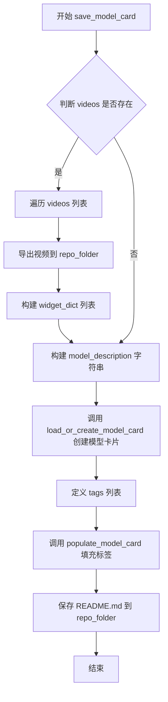

#### 带注释源码

```python
def save_model_card(
    repo_id: str,
    videos=None,
    base_model: str = None,
    validation_prompt=None,
    repo_folder=None,
    fps=8,
):
    """
    生成并保存模型的 Model Card（模型卡片），包含模型描述、使用说明等信息。
    
    参数:
        repo_id: HuggingFace Hub 上的仓库 ID
        videos: 验证阶段生成的视频列表，用于创建演示 widget
        base_model: 基础预训练模型名称或路径
        validation_prompt: 验证提示词
        repo_folder: 本地仓库文件夹路径
        fps: 视频帧率
    """
    
    # 初始化 widget 字典列表，用于在 HuggingFace Hub 上展示视频预览
    widget_dict = []
    
    # 如果有视频，则导出视频并构建 widget 字典
    if videos is not None:
        for i, video in enumerate(videos):
            # 生成视频文件名
            video_path = f"final_video_{i}.mp4"
            
            # 导出视频到指定文件夹
            export_to_video(video, os.path.join(repo_folder, video_path), fps=fps)
            
            # 构建 widget 字典，包含提示词和视频 URL
            widget_dict.append(
                {"text": validation_prompt if validation_prompt else " ", "output": {"url": video_path}},
            )

    # 构建模型描述字符串，包含 Markdown 格式的说明文档
    model_description = f"""
# CogVideoX LoRA - {repo_id}

<Gallery />

## Model description

These are {repo_id} LoRA weights for {base_model}.

The weights were trained using the [CogVideoX Diffusers trainer](https://github.com/huggingface/diffusers/blob/main/examples/cogvideo/train_cogvideox_image_to_video_lora.py).

Was LoRA for the text encoder enabled? No.

## Download model

[Download the *.safetensors LoRA]({repo_id}/tree/main) in the Files & versions tab.

## Use it with the [🧨 diffusers library](https://github.com/huggingface/diffusers)

```py
import torch
from diffusers import CogVideoXImageToVideoPipeline
from diffusers.utils import load_image, export_to_video

pipe = CogVideoXImageToVideoPipeline.from_pretrained("THUDM/CogVideoX-5b", torch_dtype=torch.bfloat16).to("cuda")
pipe.load_lora_weights("{repo_id}", weight_name="pytorch_lora_weights.safetensors", adapter_name=["cogvideox-i2v-lora"])

# The LoRA adapter weights are determined by what was used for training.
# In this case, we assume `--lora_alpha` is 32 and `--rank` is 64.
# It can be made lower or higher from what was used in training to decrease or amplify the effect
# of the LoRA upto a tolerance, beyond which one might notice no effect at all or overflows.
pipe.set_adapters(["cogvideox-i2v-lora"], [32 / 64])

image = load_image("/path/to/image")
video = pipe(image=image, "{validation_prompt}", guidance_scale=6, use_dynamic_cfg=True).frames[0]
export_to_video(video, "output.mp4", fps=8)
```

For more details, including weighting, merging and fusing LoRAs, check the [documentation on loading LoRAs in diffusers](https://huggingface.co/docs/diffusers/main/en/using-diffusers/loading_adapters)

## License

Please adhere to the licensing terms as described [here](https://huggingface.co/THUDM/CogVideoX-5b-I2V/blob/main/LICENSE).
"""
    
    # 加载或创建模型卡片，并填充基础信息
    model_card = load_or_create_model_card(
        repo_id_or_path=repo_id,
        from_training=True,
        license="other",
        base_model=base_model,
        prompt=validation_prompt,
        model_description=model_description,
        widget=widget_dict,
    )
    
    # 定义模型标签，用于在 HuggingFace Hub 上分类
    tags = [
        "image-to-video",
        "diffusers-training",
        "diffusers",
        "lora",
        "cogvideox",
        "cogvideox-diffusers",
        "template:sd-lora",
    ]

    # 填充标签到模型卡片
    model_card = populate_model_card(model_card, tags=tags)
    
    # 保存模型卡片为 README.md 文件
    model_card.save(os.path.join(repo_folder, "README.md"))
```


### `log_validation`

该函数用于在训练过程中执行验证，通过加载训练好的模型并根据指定的验证提示生成视频样本，以评估模型的性能。

参数：

-  `pipe`：`CogVideoXImageToVideoPipeline`，用于执行图像到视频生成推理的扩散管道对象
-  `args`：命名空间对象，包含训练参数配置，如 `num_validation_videos`（每个验证提示生成的视频数量）、`seed`（随机种子）、`output_dir`（输出目录）等
-  `accelerator`：`Accelerator` 对象，用于管理分布式训练和设备分配，提供设备信息 (`accelerator.device`) 和追踪器 (`accelerator.trackers`)
-  `pipeline_args`：字典，包含传递给管道的推理参数，如 `prompt`（验证提示词）、`image`（输入图像）、`guidance_scale`（引导强度）、`use_dynamic_cfg`（是否使用动态CFG）等
-  `epoch`：整数，当前训练轮次编号
-  `is_final_validation`：布尔值，默认为 `False`，标识是否为最终验证阶段（训练结束后的测试）

返回值：列表，包含生成的视频帧序列（`numpy` 数组格式），每个元素对应一个验证视频

#### 流程图

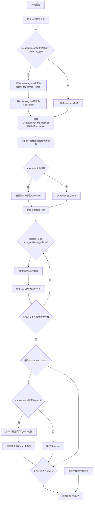

#### 带注释源码

```python
def log_validation(
    pipe,                      # CogVideoXImageToVideoPipeline: 用于推理的扩散管道
    args,                     # Namespace: 训练参数配置对象
    accelerator,              # Accelerator: 分布式训练加速器
    pipeline_args,            # dict: 传递给管道的推理参数
    epoch,                    # int: 当前训练轮次
    is_final_validation: bool = False,  # bool: 是否为最终验证
):
    """
    执行验证生成：在训练过程中根据验证提示生成视频样本
    
    参数:
        pipe: 加载了LoRA权重的CogVideoX图像到视频扩散管道
        args: 包含训练和验证配置的对象（如输出目录、种子、验证视频数量等）
        accelerator: HuggingFace Accelerate库提供的分布式训练工具
        pipeline_args: 字典，包含prompt、image、guidance_scale等推理参数
        epoch: 当前执行的训练轮次编号
        is_final_validation: 标志位，区分中间验证和最终测试验证
    
    返回:
        videos: 生成的视频帧列表，格式为numpy数组
    """
    # 记录验证开始的日志信息，包括要生成的视频数量和使用的提示词
    logger.info(
        f"Running validation... \n Generating {args.num_validation_videos} videos with prompt: {pipeline_args['prompt']}."
    )
    
    # 初始化调度器参数字典
    # 原因：训练时使用简化目标函数，如果之前预测方差，需要让scheduler忽略它
    scheduler_args = {}

    # 检查scheduler配置中是否存在variance_type参数
    if "variance_type" in pipe.scheduler.config:
        variance_type = pipe.scheduler.config.variance_type

        # 如果方差类型是learned或learned_range，将其改为fixed_small
        # 这是因为我们训练的是简化目标，不需要预测方差
        if variance_type in ["learned", "learned_range"]:
            variance_type = "fixed_small"

        scheduler_args["variance_type"] = variance_type

    # 使用新的参数重新配置scheduler，确保与训练目标兼容
    pipe.scheduler = CogVideoXDPMScheduler.from_config(pipe.scheduler.config, **scheduler_args)
    
    # 将管道移至正确的设备（GPU/CPU）
    pipe = pipe.to(accelerator.device)
    # pipe.set_progress_bar_config(disable=True)

    # 创建随机数生成器，用于复现验证结果
    # 如果设置了seed则使用seed初始化生成器，否则为None（随机生成）
    generator = torch.Generator(device=accelerator.device).manual_seed(args.seed) if args.seed is not None else None

    # 存储生成的视频
    videos = []
    
    # 根据配置的验证视频数量循环生成
    for _ in range(args.num_validation_videos):
        # 调用管道进行推理生成
        # output_type="np"表示输出numpy数组格式
        video = pipe(**pipeline_args, generator=generator, output_type="np").frames[0]
        videos.append(video)

    # 遍历所有追踪器（用于日志记录）
    for tracker in accelerator.trackers:
        # 确定阶段名称：最终测试用"test"，中间验证用"validation"
        phase_name = "test" if is_final_validation else "validation"
        
        # 如果使用wandb进行追踪
        if tracker.name == "wandb":
            video_filenames = []
            for i, video in enumerate(videos):
                # 清理提示词中的特殊字符，用于创建有效的文件名
                prompt = (
                    pipeline_args["prompt"][:25]
                    .replace(" ", "_")
                    .replace(" ", "_")
                    .replace("'", "_")
                    .replace('"', "_")
                    .replace("/", "_")
                )
                # 构建输出文件路径
                filename = os.path.join(args.output_dir, f"{phase_name}_video_{i}_{prompt}.mp4")
                # 导出视频到文件
                export_to_video(video, filename, fps=8)
                video_filenames.append(filename)

            # 将生成的视频记录到wandb
            tracker.log(
                {
                    phase_name: [
                        wandb.Video(filename, caption=f"{i}: {pipeline_args['prompt']}")
                        for i, filename in enumerate(video_filenames)
                    ]
                }
            )

    # 清理：删除管道对象并释放显存
    del pipe
    free_memory()

    # 返回生成的视频列表供后续使用
    return videos
```


### `_get_t5_prompt_embeds`

该函数用于将文本提示（prompt）通过 T5Tokenizer 分词后送入 T5EncoderModel 编码器，生成文本嵌入向量（prompt embeddings），并根据 `num_videos_per_prompt` 参数对嵌入进行复制以支持每个提示生成多个视频。

参数：

- `tokenizer`：`T5Tokenizer`，T5 分词器，用于将文本 prompt 转换为 token IDs
- `text_encoder`：`T5EncoderModel`，T5 文本编码器模型，用于生成文本嵌入
- `prompt`：`Union[str, List[str]]`，输入的文本提示，可以是单个字符串或字符串列表
- `num_videos_per_prompt`：`int = 1`，每个提示需要生成的视频数量，用于复制 embeddings
- `max_sequence_length`：`int = 226`，分词的最大序列长度
- `device`：`Optional[torch.device] = None`，计算设备（CPU/CUDA）
- `dtype`：`Optional[torch.dtype] = None`，嵌入向量的数据类型
- `text_input_ids`：可选的预计算 token IDs，当 tokenizer 为 None 时必须提供

返回值：`torch.Tensor`，形状为 `(batch_size * num_videos_per_prompt, seq_len, hidden_dim)` 的文本嵌入张量

#### 流程图

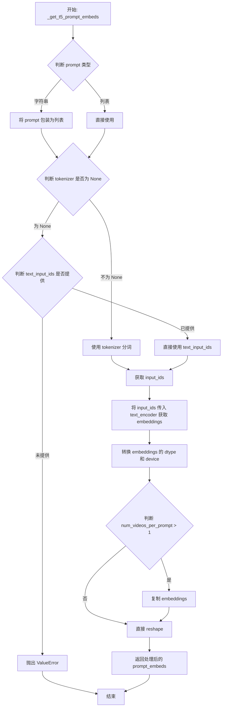

#### 带注释源码

```python
def _get_t5_prompt_embeds(
    tokenizer: T5Tokenizer,                # T5 分词器实例
    text_encoder: T5EncoderModel,           # T5 文本编码器模型
    prompt: Union[str, List[str]],         # 输入的文本提示（单字符串或列表）
    num_videos_per_prompt: int = 1,        # 每个提示生成的视频数量
    max_sequence_length: int = 226,         # 分词最大序列长度
    device: Optional[torch.device] = None, # 目标设备
    dtype: Optional[torch.dtype] = None,   # 目标数据类型
    text_input_ids=None,                   # 可选的预计算 token IDs
):
    # 统一将 prompt 转换为列表形式，便于批处理
    prompt = [prompt] if isinstance(prompt, str) else prompt
    batch_size = len(prompt)  # 记录批处理大小

    # 如果提供了 tokenizer，则使用 tokenizer 进行分词
    if tokenizer is not None:
        text_inputs = tokenizer(
            prompt,
            padding="max_length",           # 填充到最大长度
            max_length=max_sequence_length, # 最大序列长度
            truncation=True,                # 截断超长序列
            add_special_tokens=True,        # 添加特殊 tokens（如 EOS）
            return_tensors="pt",           # 返回 PyTorch 张量
        )
        text_input_ids = text_inputs.input_ids  # 获取 token IDs
    else:
        # 如果没有 tokenizer，则必须提供预计算的 text_input_ids
        if text_input_ids is None:
            raise ValueError("`text_input_ids` must be provided when the tokenizer is not specified.")

    # 将 token IDs 传入 text_encoder 获取文本嵌入
    # text_encoder 返回一个元组，取第一个元素为 embeddings
    prompt_embeds = text_encoder(text_input_ids.to(device))[0]
    
    # 将 embeddings 转换到指定的数据类型和设备
    prompt_embeds = prompt_embeds.to(dtype=dtype, device=device)

    # 复制 text embeddings 以支持每个 prompt 生成多个视频
    # 使用 mps 兼容的方法进行复制
    _, seq_len, _ = prompt_embeds.shape  # 获取序列长度和隐藏维度
    # 复制 embeddings：重复 num_videos_per_prompt 次
    prompt_embeds = prompt_embeds.repeat(1, num_videos_per_prompt, 1)
    # reshape 为 (batch_size * num_videos_per_prompt, seq_len, hidden_dim)
    prompt_embeds = prompt_embeds.view(batch_size * num_videos_per_prompt, seq_len, -1)

    return prompt_embeds  # 返回处理后的文本嵌入
```


### encode_prompt

该函数是 CogVideoX 图像到视频训练脚本中的文本提示编码函数，负责将文本提示转换为 T5 文本编码器可处理的嵌入向量。它首先将单个字符串提示标准化为列表格式，然后委托给内部函数 `_get_t5_prompt_embeds` 执行实际的嵌入计算，并返回生成的提示嵌入向量。

参数：

- `tokenizer`：`T5Tokenizer`，用于对文本提示进行分词处理的 T5 分词器实例
- `text_encoder`：`T5EncoderModel`，用于生成文本嵌入的 T5 编码器模型
- `prompt`：`Union[str, List[str]]`，输入的文本提示，可以是单个字符串或字符串列表
- `num_videos_per_prompt`：`int`，默认为 1，每个提示生成的视频数量，用于复制嵌入向量
- `max_sequence_length`：`int`，默认为 226，文本序列的最大长度，超过该长度将被截断
- `device`：`Optional[torch.device]`，`torch.device` 对象，指定计算设备（CPU/CUDA），若为 None 则使用编码器默认设备
- `dtype`：`Optional[torch.dtype]`，指定嵌入向量的数据类型（如 torch.float32、torch.bfloat16 等），若为 None 则使用编码器默认类型
- `text_input_ids`：可选的预处理文本输入 ID，若提供则跳过 tokenize 步骤直接使用

返回值：`torch.Tensor`，形状为 `(batch_size * num_videos_per_prompt, seq_len, hidden_dim)` 的文本嵌入张量，其中 batch_size 为提示列表长度，seq_len 为序列长度，hidden_dim 为文本编码器的隐藏层维度

#### 流程图

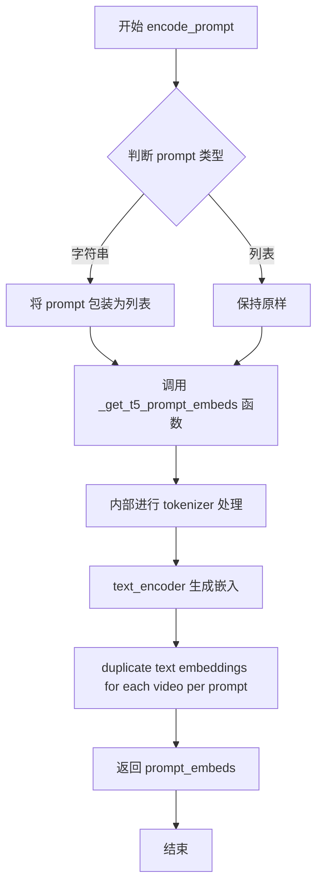

#### 带注释源码

```python
def encode_prompt(
    tokenizer: T5Tokenizer,
    text_encoder: T5EncoderModel,
    prompt: Union[str, List[str]],
    num_videos_per_prompt: int = 1,
    max_sequence_length: int = 226,
    device: Optional[torch.device] = None,
    dtype: Optional[torch.dtype] = None,
    text_input_ids=None,
):
    """
    将文本提示编码为 T5 文本编码器的嵌入向量
    
    参数:
        tokenizer: T5Tokenizer 实例，用于对文本进行分词
        text_encoder: T5EncoderModel 实例，用于生成文本嵌入
        prompt: 输入的文本提示，字符串或字符串列表
        num_videos_per_prompt: 每个提示生成的视频数量，用于复制嵌入
        max_sequence_length: 最大序列长度
        device: 计算设备，若为 None 则使用编码器默认设备
        dtype: 嵌入的数据类型
        text_input_ids: 预处理的文本输入 ID，可选
    
    返回:
        prompt_embeds: 文本嵌入张量
    """
    # 如果 prompt 是单个字符串，转换为列表；如果是列表则保持不变
    # 这样可以统一处理逻辑
    prompt = [prompt] if isinstance(prompt, str) else prompt
    
    # 调用内部函数 _get_t5_prompt_embeds 执行实际的编码操作
    # 该函数会处理 tokenization、编码和嵌入复制
    prompt_embeds = _get_t5_prompt_embeds(
        tokenizer,
        text_encoder,
        prompt=prompt,
        num_videos_per_prompt=num_videos_per_prompt,
        max_sequence_length=max_sequence_length,
        device=device,
        dtype=dtype,
        text_input_ids=text_input_ids,
    )
    
    # 返回编码后的提示嵌入向量
    return prompt_embeds
```


### `compute_prompt_embeddings`

该函数用于将文本提示（prompt）编码为文本嵌入向量（prompt embeddings），供 CogVideoX 图像到视频模型使用。根据 `requires_grad` 参数决定是否需要计算梯度，以支持训练和推理两种场景。

参数：

- `tokenizer`：`T5Tokenizer`，Hugging Face T5 分词器，用于将文本提示转换为 token ID 序列
- `text_encoder`：`T5EncoderModel`，T5 文本编码器模型，将 token 序列编码为向量表示
- `prompt`：`Union[str, List[str]]`，待编码的文本提示，可以是单个字符串或字符串列表
- `max_sequence_length`：`int`，输入序列的最大长度，超出部分将被截断
- `device`：`torch.device`，计算设备（如 CUDA 或 CPU），决定张量存储位置
- `dtype`：`torch.dtype`，张量数据类型（如 float16、bfloat16），影响计算精度和内存占用
- `requires_grad`：`bool`，是否需要计算梯度。`True` 用于训练时反向传播，`False`（默认值）用于推理以节省显存

返回值：`torch.Tensor`，形状为 `[batch_size * num_videos_per_prompt, seq_len, hidden_dim]` 的文本嵌入张量

#### 流程图

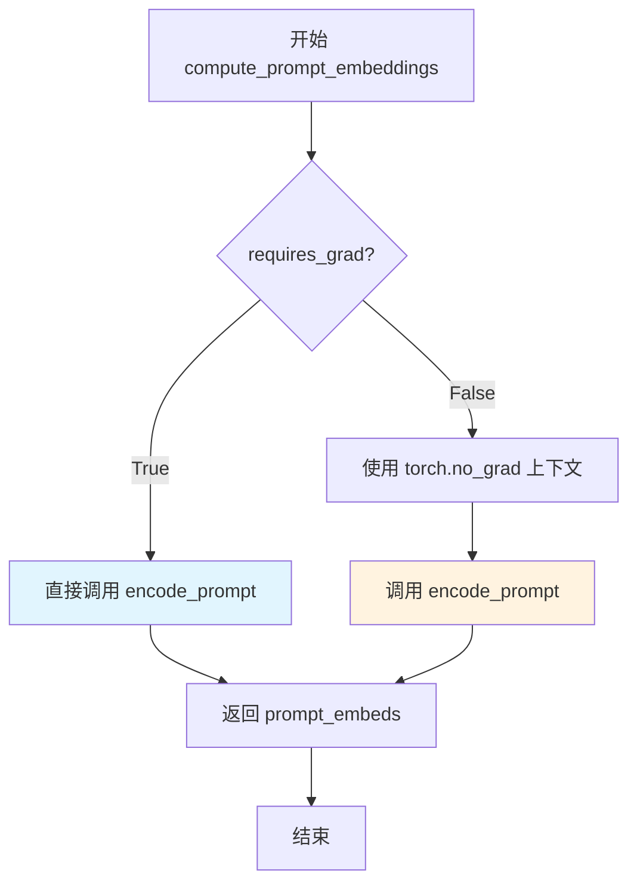

#### 带注释源码

```python
def compute_prompt_embeddings(
    tokenizer, text_encoder, prompt, max_sequence_length, device, dtype, requires_grad: bool = False
):
    """
    将文本提示编码为嵌入向量
    
    参数:
        tokenizer: T5分词器
        text_encoder: T5编码器模型  
        prompt: 输入的文本提示
        max_sequence_length: 最大序列长度
        device: 计算设备
        dtype: 数据类型
        requires_grad: 是否需要计算梯度
    
    返回:
        prompt_embeds: 编码后的文本嵌入
    """
    # 根据requires_grad决定是否启用梯度计算
    if requires_grad:
        # 训练模式：需要计算梯度以支持反向传播
        prompt_embeds = encode_prompt(
            tokenizer,
            text_encoder,
            prompt,
            num_videos_per_prompt=1,  # 每个prompt生成1个嵌入
            max_sequence_length=max_sequence_length,
            device=device,
            dtype=dtype,
        )
    else:
        # 推理模式：使用no_grad()上下文节省显存和计算资源
        with torch.no_grad():
            prompt_embeds = encode_prompt(
                tokenizer,
                text_encoder,
                prompt,
                num_videos_per_prompt=1,
                max_sequence_length=max_sequence_length,
                device=device,
                dtype=dtype,
            )
    return prompt_embeds
```


### `prepare_rotary_positional_embeddings`

该函数用于为 CogVideoX 模型准备 3D 旋转位置嵌入（Rotary Positional Embeddings），通过计算空间网格和时间维度的频率向量，支持动态分辨率的视频/图像输入。

参数：

- `height`：`int`，输入视频/图像的高度（像素）
- `width`：`int`，输入视频/图像的宽度（像素）
- `num_frames`：`int`，输入视频的帧数
- `vae_scale_factor_spatial`：`int`，VAE 的空间缩放因子，默认为 8
- `patch_size`：`int`，补丁大小，默认为 2
- `attention_head_dim`：`int`，注意力头的维度，默认为 64
- `device`：`Optional[torch.device]`，计算设备
- `base_height`：`int`，基础高度（训练时的参考分辨率），默认为 480
- `base_width`：`int`，基础宽度（训练时的参考分辨率），默认为 720

返回值：`Tuple[torch.Tensor, torch.Tensor]`，返回两个张量——`freqs_cos`（余弦频率）和 `freqs_sin`（正弦频率），用于旋转位置编码

#### 流程图

```mermaid
flowchart TD
    A[开始] --> B[计算 grid_height<br/>height / (vae_scale_factor_spatial * patch_size)]
    --> C[计算 grid_width<br/>width / (vae_scale_factor_spatial * patch_size)]
    --> D[计算 base_size_width<br/>base_width / (vae_scale_factor_spatial * patch_size)]
    --> E[计算 base_size_height<br/>base_height / (vae_scale_factor_spatial * patch_size)]
    --> F[调用 get_resize_crop_region_for_grid<br/>获取裁剪坐标]
    --> G[调用 get_3d_rotary_pos_embed<br/>生成 3D 旋转嵌入]
    --> H[返回 freqs_cos 和 freqs_sin]
```

#### 带注释源码

```python
def prepare_rotary_positional_embeddings(
    height: int,                      # 输入高度（像素）
    width: int,                       # 输入宽度（像素）
    num_frames: int,                  # 输入帧数
    vae_scale_factor_spatial: int = 8,  # VAE 空间缩放因子
    patch_size: int = 2,              # 补丁大小
    attention_head_dim: int = 64,    # 注意力头维度
    device: Optional[torch.device] = None,  # 计算设备
    base_height: int = 480,           # 基础高度（参考分辨率）
    base_width: int = 720,            # 基础宽度（参考分辨率）
) -> Tuple[torch.Tensor, torch.Tensor]:
    """
    为 CogVideoX 模型准备 3D 旋转位置嵌入
    
    该函数计算空间网格的尺寸，并将输入分辨率映射到潜在空间网格，
    然后调用 get_3d_rotary_pos_embed 生成用于注意力机制的正弦/余弦频率
    """
    
    # 计算潜在空间中的网格高度（考虑 VAE 缩放和补丁大小）
    grid_height = height // (vae_scale_factor_spatial * patch_size)
    
    # 计算潜在空间中的网格宽度
    grid_width = width // (vae_scale_factor_spatial * patch_size)
    
    # 计算基础分辨率对应的潜在空间网格宽度
    base_size_width = base_width // (vae_scale_factor_spatial * patch_size)
    
    # 计算基础分辨率对应的潜在空间网格高度
    base_size_height = base_height // (vae_scale_factor_spatial * patch_size)

    # 获取调整大小和裁剪区域坐标，用于处理不同分辨率的输入
    grid_crops_coords = get_resize_crop_region_for_grid(
        (grid_height, grid_width),    # 当前输入的网格尺寸
        base_size_width,             # 参考基础宽度
        base_size_height              # 参考基础高度
    )
    
    # 调用底层函数生成 3D 旋转位置嵌入（包含空间和时间维度）
    freqs_cos, freqs_sin = get_3d_rotary_pos_embed(
        embed_dim=attention_head_dim,      # 嵌入维度（注意力头维度）
        crops_coords=grid_crops_coords,    # 裁剪坐标
        grid_size=(grid_height, grid_width),  # 空间网格尺寸
        temporal_size=num_frames,          # 时间维度（帧数）
        device=device,                     # 计算设备
    )

    # 返回余弦和正弦频率，用于旋转位置编码
    return freqs_cos, freqs_sin
```


### `get_optimizer`

该函数根据传入的参数动态创建并返回PyTorch优化器实例，支持Adam、AdamW、Prodigy三种优化器类型，并处理DeepSpeed加速场景。

参数：

- `args`：对象，包含命令行参数集合（如学习率、优化器类型、beta参数、epsilon、权重衰减等）
- `params_to_optimize`：可迭代对象，需要优化的参数列表
- `use_deepspeed`：布尔值，标识是否使用DeepSpeed优化器

返回值：`torch.optim.Optimizer | DummyOptim`，返回配置好的优化器实例

#### 流程图

```mermaid
flowchart TD
    A[开始 get_optimizer] --> B{use_deepspeed?}
    B -->|Yes| C[导入 DummyOptim]
    C --> D[创建并返回 DummyOptim]
    B -->|No| E{optimizer in supported_optimizers?}
    E -->|No| F[警告并默认为 adamw]
    E -->|Yes| G{use_8bit_adam?}
    G -->|Yes| H{optimizer in [adam, adamw]?}
    H -->|No| I[警告 8bit 被忽略]
    H -->|Yes| J[导入 bitsandbytes]
    G -->|No| K{optimizer == adamw?}
    K -->|Yes| L{use_8bit_adam?}
    K -->|No| M{optimizer == adam?}
    L -->|Yes| N[AdamW8bit]
    L -->|No| O[torch.optim.AdamW]
    M -->|Yes| P{use_8bit_adam?}
    P -->|Yes| Q[Adam8bit]
    P -->|No| R[torch.optim.Adam]
    M -->|No| S{optimizer == prodigy?}
    S -->|Yes| T[导入 prodigyopt]
    T --> U[创建 Prodigy 优化器]
    S -->|No| V[返回 None]
    N --> W[创建优化器实例]
    O --> W
    Q --> W
    R --> W
    U --> W
    W --> X[返回优化器]
```

#### 带注释源码

```python
def get_optimizer(args, params_to_optimize, use_deepspeed: bool = False):
    # 如果使用 DeepSpeed 优化器，则创建 DummyOptim 实例
    # DeepSpeed 会自行管理优化器的创建，这里只是返回一个占位符
    if use_deepspeed:
        from accelerate.utils import DummyOptim

        return DummyOptim(
            params_to_optimize,
            lr=args.learning_rate,           # 学习率
            betas=(args.adam_beta1, args.adam_beta2),  # Adam 的 beta 参数
            eps=args.adam_epsilon,          # epsilon 防止除零
            weight_decay=args.adam_weight_decay,  # 权重衰减
        )

    # 定义支持的优化器列表
    supported_optimizers = ["adam", "adamw", "prodigy"]
    
    # 检查优化器类型是否在支持列表中
    if args.optimizer not in supported_optimizers:
        logger.warning(
            f"Unsupported choice of optimizer: {args.optimizer}. Supported optimizers include {supported_optimizers}. Defaulting to AdamW"
        )
        args.optimizer = "adamw"  # 默认使用 AdamW

    # 检查 8bit Adam 的使用条件
    # 只有当 optimizer 为 adam 或 adamw 时，use_8bit_adam 才有效
    if args.use_8bit_adam and args.optimizer.lower() not in ["adam", "adamw"]:
        logger.warning(
            f"use_8bit_adam is ignored when optimizer is not set to 'Adam' or 'AdamW'. Optimizer was "
            f"set to {args.optimizer.lower()}"
        )

    # 如果使用 8bit Adam，需要导入 bitsandbytes 库
    if args.use_8bit_adam:
        try:
            import bitsandbytes as bnb
        except ImportError:
            raise ImportError(
                "To use 8-bit Adam, please install the bitsandbytes library: `pip install bitsandbytes`."
            )

    # 根据优化器类型创建相应的优化器实例
    if args.optimizer.lower() == "adamw":
        # 选择 AdamW 优化器类：8bit 或标准版本
        optimizer_class = bnb.optim.AdamW8bit if args.use_8bit_adam else torch.optim.AdamW

        optimizer = optimizer_class(
            params_to_optimize,
            betas=(args.adam_beta1, args.adam_beta2),  # 动量衰减参数
            eps=args.adam_epsilon,                       # 数值稳定性参数
            weight_decay=args.adam_weight_decay,        # 权重衰减系数
        )
    elif args.optimizer.lower() == "adam":
        # 选择 Adam 优化器类：8bit 或标准版本
        optimizer_class = bnb.optim.Adam8bit if args.use_8bit_adam else torch.optim.Adam

        optimizer = optimizer_class(
            params_to_optimize,
            betas=(args.adam_beta1, args.adam_beta2),
            eps=args.adam_epsilon,
            weight_decay=args.adam_weight_decay,
        )
    elif args.optimizer.lower() == "prodigy":
        # 使用 Prodigy 优化器（自适应学习率优化器）
        try:
            import prodigyopt
        except ImportError:
            raise ImportError("To use Prodigy, please install the prodigyopt library: `pip install prodigyopt`")

        optimizer_class = prodigyopt.Prodigy

        # Prodigy 优化器通常需要较高的学习率（建议 1.0 左右）
        if args.learning_rate <= 0.1:
            logger.warning(
                "Learning rate is too low. When using prodigy, it's generally better to set learning rate around 1.0"
            )

        # 创建 Prodigy 优化器实例，配置更多参数
        optimizer = optimizer_class(
            params_to_optimize,
            betas=(args.adam_beta1, args.adam_beta2),
            beta3=args.prodigy_beta3,                   # Prodigy 特定的 beta3 参数
            weight_decay=args.adam_weight_decay,
            eps=args.adam_epsilon,
            decouple=args.prodigy_decouple,            # 是否使用解耦权重衰减
            use_bias_correction=args.prodigy_use_bias_correction,  # 是否使用偏置校正
            safeguard_warmup=args.prodigy_safeguard_warmup,        # 是否保护预热阶段
        )

    return optimizer
```


### `VideoDataset.__init__`

该方法是 `VideoDataset` 类的初始化方法，负责加载视频数据集。它根据提供的参数（从 HuggingFace Hub 加载或从本地路径加载）读取视频文件和对应的文本提示，并对视频进行预处理（包括尺寸调整、帧采样和格式转换），同时验证视频和提示的数量是否匹配。

参数：

- `instance_data_root`：`str | None`，本地数据集根目录的路径
- `dataset_name`：`str | None`，HuggingFace Hub 上的数据集名称
- `dataset_config_name`：`str | None`，数据集配置名称
- `caption_column`：`str = "text"`，数据集中包含文本提示的列名
- `video_column`：`str = "video"`，数据集中包含视频路径的列名
- `height`：`int = 480`，输入视频的目标高度
- `width`：`int = 720`，输入视频的目标宽度
- `fps`：`int = 8`，输入视频的帧率
- `max_num_frames`：`int = 49`，输入视频的最大帧数
- `skip_frames_start`：`int = 0`，从视频开头跳过的帧数
- `skip_frames_end`：`int = 0`，从视频结尾跳过的帧数
- `cache_dir`：`str | None`，缓存目录路径
- `id_token`：`str | None`，添加到每个提示开头的标识符令牌

返回值：`None`，无返回值（构造函数）

#### 流程图

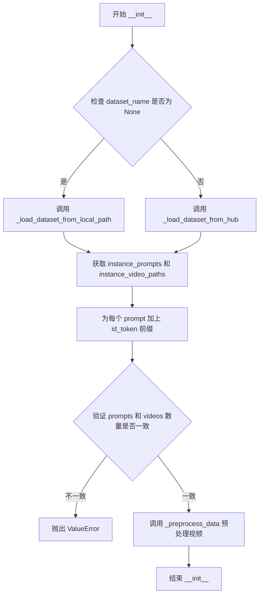

#### 带注释源码

```python
def __init__(
    self,
    instance_data_root: str | None = None,
    dataset_name: str | None = None,
    dataset_config_name: str | None = None,
    caption_column: str = "text",
    video_column: str = "video",
    height: int = 480,
    width: int = 720,
    fps: int = 8,
    max_num_frames: int = 49,
    skip_frames_start: int = 0,
    skip_frames_end: int = 0,
    cache_dir: str | None = None,
    id_token: str | None = None,
) -> None:
    """初始化 VideoDataset 实例，加载视频数据和文本提示。
    
    参数:
        instance_data_root: 本地数据集根目录路径
        dataset_name: HuggingFace Hub 数据集名称
        dataset_config_name: 数据集配置名称
        caption_column: 文本提示列名
        video_column: 视频路径列名
        height: 目标视频高度
        width: 目标视频宽度
        fps: 视频帧率
        max_num_frames: 最大帧数限制
        skip_frames_start: 跳过起始帧数
        skip_frames_end: 跳过结束帧数
        cache_dir: 缓存目录
        id_token: 提示前缀标识符
    """
    super().__init__()  # 调用父类 Dataset 的初始化方法

    # 将实例变量存储为对象属性
    self.instance_data_root = Path(instance_data_root) if instance_data_root is not None else None
    self.dataset_name = dataset_name
    self.dataset_config_name = dataset_config_name
    self.caption_column = caption_column
    self.video_column = video_column
    self.height = height
    self.width = width
    self.fps = fps
    self.max_num_frames = max_num_frames
    self.skip_frames_start = skip_frames_start
    self.skip_frames_end = skip_frames_end
    self.cache_dir = cache_dir
    self.id_token = id_token or ""  # 如果未提供 id_token，使用空字符串

    # 根据数据来源选择加载方式
    if dataset_name is not None:
        # 从 HuggingFace Hub 加载数据集
        self.instance_prompts, self.instance_video_paths = self._load_dataset_from_hub()
    else:
        # 从本地路径加载数据集
        self.instance_prompts, self.instance_video_paths = self._load_dataset_from_local_path()

    # 为每个提示添加标识符前缀
    self.instance_prompts = [self.id_token + prompt for prompt in self.instance_prompts]

    # 获取视频数量并验证与提示数量是否匹配
    self.num_instance_videos = len(self.instance_video_paths)
    if self.num_instance_videos != len(self.instance_prompts):
        raise ValueError(
            f"Expected length of instance prompts and videos to be the same but found {len(self.instance_prompts)=} and {len(self.instance_video_paths)=}. Please ensure that the number of caption prompts and videos match in your dataset."
        )

    # 预处理所有视频数据
    self.instance_videos = self._preprocess_data()
```


### `VideoDataset.__len__`

该方法为 PyTorch Dataset 协议的核心实现之一，用于返回数据集中视频样本的总数量，使得 DataLoader 能够确定迭代的总数。

参数：此方法无显式参数（隐式参数 self 表示实例本身）

返回值：`int`，返回数据集中实例视频的总数

#### 流程图

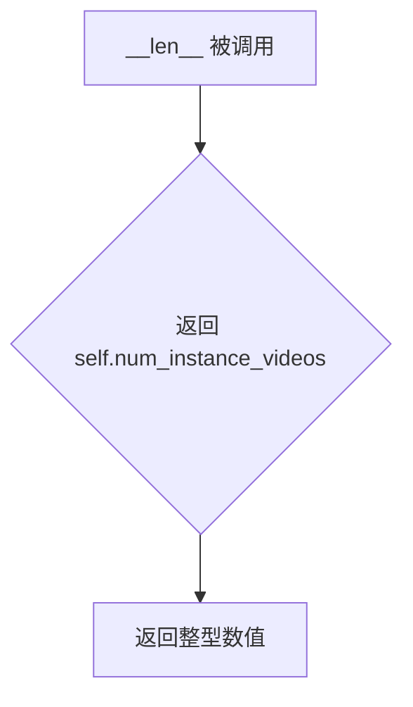

#### 带注释源码

```python
def __len__(self):
    """
    返回数据集中视频样本的数量。
    
    此方法是 PyTorch Dataset 抽象基类的必须实现方法之一，
    使 DataLoader 能够确定迭代的总数和进行分布式训练时的采样。
    
    Returns:
        int: 实例视频的总数，即数据集中的样本数量
    """
    return self.num_instance_videos
```


### `VideoDataset.__getitem__`

该方法根据传入的索引，从预处理后的视频列表和文本提示列表中获取对应的数据，并将其封装成字典格式返回，供 DataLoader 使用。

参数：
- `index`：`int`，表示要检索的数据样本的索引位置。

返回值：`dict`，返回一个字典，包含键 `instance_prompt`（对应的文本提示）和 `instance_video`（预处理后的视频张量）。

#### 流程图

```mermaid
flowchart TD
    A([Start]) --> B[index: int]
    B --> C[读取 self.instance_prompts[index]]
    B --> D[读取 self.instance_videos[index]]
    C --> E{组装字典}
    D --> E
    E --> F[返回 {instance_prompt, instance_video}]
    F --> G([End])
```

#### 带注释源码

```python
def __getitem__(self, index):
    # 根据索引获取对应的文本提示（instance_prompt）
    # 注意：在 main 函数中，该字段可能被替换为预计算的 embedding Tensor
    prompt = self.instance_prompts[index]
    
    # 根据索引获取对应的视频数据（instance_video）
    # 数据已经在初始化时通过 _preprocess_data 转换为 torch.Tensor
    video = self.instance_videos[index]
    
    # 返回标准化的字典格式，供 collate_fn 处理
    return {
        "instance_prompt": prompt,
        "instance_video": video,
    }
```


### VideoDataset._load_dataset_from_hub

该方法负责从HuggingFace Hub加载视频数据集，验证数据集中必需的列（视频列和文本列），并返回实例提示和视频文件路径的元组。

参数：（无额外参数，使用self中的属性）

- `self`：VideoDataset实例，包含dataset_name、dataset_config_name、cache_dir、video_column、caption_column、instance_data_root等属性

返回值：`Tuple[List, List]`，返回包含实例提示列表和视频路径Path对象列表的元组

#### 流程图

```mermaid
flowchart TD
    A[开始 _load_dataset_from_hub] --> B{尝试导入 datasets 库}
    B -->|成功| C[调用 load_dataset 加载数据集]
    B -->|失败| D[抛出 ImportError 提示安装 datasets]
    C --> E[获取训练集列名]
    E --> F{self.video_column 为空?}
    F -->|是| G[使用 column_names[0] 作为默认 video_column]
    F -->|否| H{video_column 在列名中?}
    G --> I[记录默认 video_column 日志]
    H -->|否| J[抛出 ValueError]
    H -->|是| I
    I --> K{caption_column 为空?}
    K -->|是| L[使用 column_names[1] 作为默认 caption_column]
    K -->|否| M{caption_column 在列名中?}
    L --> N[记录默认 caption_column 日志]
    M -->|否| O[抛出 ValueError]
    M -->|是| N
    N --> P[提取 caption_column 列数据作为 prompts]
    P --> Q[构建视频文件路径列表]
    Q --> R[返回 prompts 和 video_paths 元组]
    J --> R
    O --> R
```

#### 带注释源码

```python
def _load_dataset_from_hub(self):
    """
    从HuggingFace Hub加载视频数据集。
    
    Returns:
        Tuple[List, List]: (instance_prompts, instance_video_paths) 元组
    """
    # 尝试导入datasets库，若失败则提示用户安装
    try:
        from datasets import load_dataset
    except ImportError:
        raise ImportError(
            "You are trying to load your data using the datasets library. If you wish to train using custom "
            "captions please install the datasets library: `pip install datasets`. If you wish to load a "
            "local folder containing images only, specify --instance_data_root instead."
        )

    # 使用datasets库从Hub下载并加载数据集
    # 更多自定义图像加载信息见: https://huggingface.co/docs/datasets/v2.0.0/en/dataset_script
    dataset = load_dataset(
        self.dataset_name,          # 数据集名称或路径
        self.dataset_config_name,   # 数据集配置名称
        cache_dir=self.cache_dir,   # 缓存目录
    )
    # 获取训练集的列名
    column_names = dataset["train"].column_names

    # 处理视频列：如果未指定，则默认为第一列
    if self.video_column is None:
        video_column = column_names[0]
        logger.info(f"`video_column` defaulting to {video_column}")
    else:
        video_column = self.video_column
        # 验证指定的视频列是否存在于数据集中
        if video_column not in column_names:
            raise ValueError(
                f"`--video_column` value '{video_column}' not found in dataset columns. Dataset columns are: {', '.join(column_names)}"
            )

    # 处理文本列：如果未指定，则默认为第二列
    if self.caption_column is None:
        caption_column = column_names[1]
        logger.info(f"`caption_column` defaulting to {caption_column}")
    else:
        caption_column = self.caption_column
        # 验证指定的文本列是否存在于数据集中
        if self.caption_column not in column_names:
            raise ValueError(
                f"`--caption_column` value '{self.caption_column}' not found in dataset columns. Dataset columns are: {', '.join(column_names)}"
            )

    # 从数据集提取文本提示
    instance_prompts = dataset["train"][caption_column]
    # 构建视频文件路径列表（相对于instance_data_root）
    instance_videos = [Path(self.instance_data_root, filepath) for filepath in dataset["train"][video_column]]

    # 返回提示和视频路径的元组
    return instance_prompts, instance_videos
```


### `VideoDataset._load_dataset_from_local_path`

该方法用于从本地文件系统路径加载视频数据集。它会检查实例数据根目录、提示词文件和视频路径文件是否存在，并从这些文件中逐行读取提示词和视频文件路径，最后验证所有视频路径都是有效的文件。

参数：无（该方法通过 `self` 访问实例属性）

返回值：`Tuple[List[str], List[Path]]`，返回两个列表——第一个是提示词列表（字符串类型），第二个是视频文件路径列表（Path类型）

#### 流程图

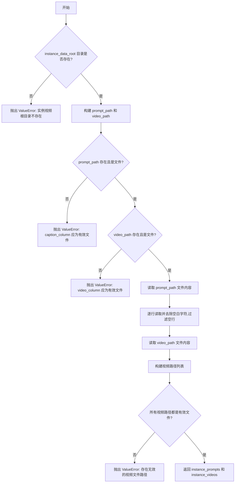

#### 带注释源码

```python
def _load_dataset_from_local_path(self):
    """
    从本地路径加载数据集。
    
    该方法读取本地文件系统中的提示词文件和视频路径文件，
    并返回提示词列表和对应的视频路径列表。
    
    Returns:
        Tuple[List[str], List[Path]]: 
            - instance_prompts: 提示词列表
            - instance_videos: 视频文件路径列表
    
    Raises:
        ValueError: 如果指定的路径不存在或格式不正确
    """
    # 检查实例数据根目录是否存在
    if not self.instance_data_root.exists():
        raise ValueError("Instance videos root folder does not exist")

    # 构建提示词文件路径和视频路径文件的完整路径
    prompt_path = self.instance_data_root.joinpath(self.caption_column)
    video_path = self.instance_data_root.joinpath(self.video_column)

    # 验证提示词文件路径有效
    if not prompt_path.exists() or not prompt_path.is_file():
        raise ValueError(
            "Expected `--caption_column` to be path to a file in `--instance_data_root` containing line-separated text prompts."
        )
    
    # 验证视频路径文件有效
    if not video_path.exists() or not video_path.is_file():
        raise ValueError(
            "Expected `--video_column` to be path to a file in `--instance_data_root` containing line-separated paths to video data in the same directory."
        )

    # 读取提示词文件，每行作为一个提示词，去除首尾空白并过滤空行
    with open(prompt_path, "r", encoding="utf-8") as file:
        instance_prompts = [line.strip() for line in file.readlines() if len(line.strip()) > 0]
    
    # 读取视频路径文件，每行作为一个视频路径，构建完整的绝对路径
    with open(video_path, "r", encoding="utf-8") as file:
        instance_videos = [
            self.instance_data_root.joinpath(line.strip()) for line in file.readlines() if len(line.strip()) > 0
        ]

    # 验证所有视频路径都是有效的文件
    if any(not path.is_file() for path in instance_videos):
        raise ValueError(
            "Expected '--video_column' to be a path to a file in `--instance_data_root` containing line-separated paths to video data but found at least one path that is not a valid file."
        )

    # 返回提示词列表和视频路径列表
    return instance_prompts, instance_videos
```


### VideoDataset._preprocess_data

该方法负责将本地视频文件加载并预处理为模型训练所需的张量格式。它使用 decord 库读取视频，应用跳过帧逻辑，限制帧数，确保帧数符合 VAE 要求，并将像素值归一化到 [-1, 1] 范围。

参数：无（仅使用 `self` 属性）

返回值：`List[torch.Tensor]`，返回预处理后的视频张量列表，每个张量形状为 [F, C, H, W]，其中 F 为帧数，C 为通道数，H 为高度，W 为宽度。

#### 流程图

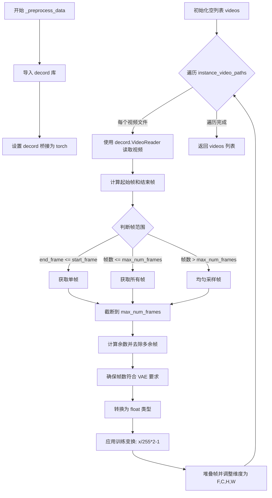

#### 带注释源码

```python
def _preprocess_data(self):
    """
    预处理视频数据，将视频文件加载并转换为训练所需的张量格式
    
    处理流程：
    1. 使用 decord 库读取视频
    2. 根据 skip_frames_start 和 skip_frames_end 跳过指定帧
    3. 限制总帧数不超过 max_num_frames
    4. 调整帧数以符合 VAE 的 4 的倍数要求
    5. 归一化像素值到 [-1, 1] 范围
    6. 转换为 PyTorch 张量并调整维度顺序
    """
    # 导入 decord 库，用于高效读取视频文件
    try:
        import decord
    except ImportError:
        raise ImportError(
            "The `decord` package is required for loading the video dataset. Install with `pip install decord`"
        )

    # 设置 decord 的桥接方式为 torch，以便直接返回 PyTorch 张量
    decord.bridge.set_bridge("torch")

    # 存储所有预处理后的视频
    videos = []
    
    # 定义训练时的图像变换：归一化到 [-1, 1]
    train_transforms = transforms.Compose(
        [
            transforms.Lambda(lambda x: x / 255.0 * 2.0 - 1.0),
        ]
    )

    # 遍历所有视频文件路径
    for filename in self.instance_video_paths:
        # 创建视频读取器，指定目标宽度和高度
        video_reader = decord.VideoReader(uri=filename.as_posix(), width=self.width, height=self.height)
        # 获取视频总帧数
        video_num_frames = len(video_reader)

        # 计算起始帧索引（不超过视频总帧数）
        start_frame = min(self.skip_frames_start, video_num_frames)
        # 计算结束帧索引（从视频末尾跳过指定帧数）
        end_frame = max(0, video_num_frames - self.skip_frames_end)
        
        # 根据不同情况获取帧
        if end_frame <= start_frame:
            # 如果有效帧范围无效，只获取起始帧
            frames = video_reader.get_batch([start_frame])
        elif end_frame - start_frame <= self.max_num_frames:
            # 如果帧数在限制范围内，获取所有帧
            frames = video_reader.get_batch(list(range(start_frame, end_frame)))
        else:
            # 如果帧数超过限制，均匀采样帧
            indices = list(range(start_frame, end_frame, (end_frame - start_frame) // self.max_num_frames))
            frames = video_reader.get_batch(indices)

        # 确保不超过最大帧数限制
        frames = frames[: self.max_num_frames]
        selected_num_frames = frames.shape[0]

        # 选择前 (4k + 1) 帧，因为 VAE 需要这种格式
        # 计算需要去除的帧数余数
        remainder = (3 + (selected_num_frames % 4)) % 4
        if remainder != 0:
            frames = frames[:-remainder]
        selected_num_frames = frames.shape[0]

        # 断言：确保帧数减 1 后是 4 的倍数（VAE 要求）
        assert (selected_num_frames - 1) % 4 == 0

        # 应用训练变换
        # 将帧数据转换为 float 类型
        frames = frames.float()
        # 对每一帧应用归一化变换，并沿时间维度堆叠
        frames = torch.stack([train_transforms(frame) for frame in frames], dim=0)
        # 调整维度顺序：[F, H, W, C] -> [F, C, H, W]，并确保内存连续
        videos.append(frames.permute(0, 3, 1, 2).contiguous())  # [F, C, H, W]

    return videos
```

## 关键组件


### VideoDataset

视频数据集类，负责从本地路径或HuggingFace Hub加载视频数据，并进行预处理（尺寸调整、帧采样、归一化）。支持跳过起始/结束帧、随机翻转等数据增强策略。

### get_args

命令行参数解析函数，定义了大量训练参数，包括模型路径、数据集配置、验证设置、训练超参数（学习率、批次大小、LoRA参数等）、优化器选项、混合精度设置等。

### _get_t5_prompt_embeds

T5文本编码函数，将文本提示转换为嵌入向量。支持批量处理、重复采样、梯度控制，并处理tokenizer和text_encoder的协同工作。

### encode_prompt

封装函数，调用_get_t5_prompt_embeds进行提示编码，提供统一的接口处理字符串或字符串列表输入。

### compute_prompt_embeddings

带梯度控制的提示嵌入计算函数，根据requires_grad参数决定是否启用梯度计算，用于训练时的高效嵌入处理。

### prepare_rotary_positional_embeddings

计算3D旋转位置嵌入的函数，用于CogVideoX的Transformer模型。支持可调整的裁剪区域、网格尺寸和时间维度，与视觉位置编码相关。

### get_optimizer

动态优化器选择函数，支持Adam、AdamW、8-bit Adam和Prodigy优化器。根据参数和DeepSpeed配置选择合适的优化器实现。

### log_validation

验证函数，在训练过程中生成样本视频并记录到追踪器（wandb等）。处理调度器配置、随机种子和输出格式转换。

### encode_video

视频编码函数，将原始视频帧编码为VAE latent表示。同时生成带噪声的图像条件，用于图像到视频的扩散训练。

### collate_fn

数据整理函数，处理批次视频和图像latent。对图像latent进行padding使其与视频latent维度对齐，并支持图像条件dropout。

### save_model_card

生成并保存HuggingFace模型卡片，包含训练配置、使用示例和许可证信息。用于模型发布和共享。

### main

主训练函数， orchestrates 整个训练流程：模型加载、LoRA配置、数据准备、训练循环、验证、模型保存和Hub推送。支持分布式训练、梯度检查点、混合精度和DeepSpeed加速。

### 关键组件补充说明

1. **张量索引与采样**：
   - VideoDataset中使用decord进行视频帧的灵活索引和采样
   - collate_fn中使用张量切片和padding进行维度对齐
   - 训练循环中timestep的随机采样

2. **量化策略**：
   - 混合精度训练支持（fp16/bf16）
   - 动态weight_dtype选择（基于模型版本和DeepSpeed配置）
   - 8-bit Adam优化器支持（bitsandbytes）
   - LoRA参数fp32强制转换以保证训练稳定性

3. **惰性加载与内存优化**：
   - VideoDataset的_preprocess_data在初始化时一次性处理所有视频
   - VAE slicing和tiling选项用于内存优化
   - gradient_checkpointing减少显存占用
   - free_memory()显式释放推理后的模型内存

## 问题及建议


### 已知问题

-   **超长主函数**: `main()` 函数超过1000行，承担了数据加载、模型设置、训练循环、验证、保存等多个职责，违反了单一职责原则，可读性和可维护性差。
-   **数据预处理内存占用**: `VideoDataset._preprocess_data()` 在训练前将所有视频帧预加载到内存，大规模数据集可能导致内存溢出（OOM）。
-   **预计算提示词嵌入**: 所有提示词的嵌入在训练前预先计算并存储，占用大量内存且无法支持动态提示词。
-   **DataLoader默认workers为0**: 默认为0意味着数据加载在主进程进行，可能导致训练效率低下。
-   **重复代码逻辑**: 验证逻辑在训练循环结束后和最终推理时重复出现（`log_validation` 调用两次），存在代码冗余。
-   **DDP使用find_unused_parameters**: `DistributedDataParallelKwargs(find_unused_parameters=True)` 会导致额外的通信开销和性能损失。
-   **魔法数字**: 代码中存在硬编码的魔法数字（如 `226` 用于最大序列长度、`4` 用于帧数处理），缺乏配置化。
-   **checkpoint清理逻辑**: checkpoint数量限制的清理逻辑仅在主进程执行，可能导致分布式环境下的一致性问题。

### 优化建议

-   **拆分主函数**: 将 `main()` 拆分为独立模块，如 `setup_models()`、`prepare_dataset()`、`training_loop()`、`run_validation()` 等，提升代码可读性和可测试性。
-   **实现流式数据加载**: 改为在 `__getitem__` 中实时解码视频帧，或使用流式数据集避免一次性加载所有数据到内存。
-   **动态计算提示词嵌入**: 将 `compute_prompt_embeddings` 移至训练循环内按需计算，支持动态提示词训练场景。
-   **增加DataLoader workers**: 建议默认设置 `dataloader_num_workers` 为4或更高，充分利用多核CPU加速数据预处理。
-   **提取验证函数**: 将重复的验证逻辑合并为单一函数，减少代码冗余。
-   **移除find_unused_parameters**: 若模型无未使用的参数，移除此选项以提升分布式训练性能；若确实存在未使用参数，考虑重构模型架构。
-   **配置化参数**: 将魔法数字提取为命令行参数或配置文件常量，如 `max_sequence_length` 应从模型配置读取。
-   **添加视频文件校验**: 在数据加载时添加try-except捕获并跳过损坏的视频文件，提升训练鲁棒性。
-   **支持DeepSpeedcheckpoint恢复**: 补充 `resume_from_checkpoint` 对DeepSpeed的支持逻辑。

## 其它


### 设计目标与约束

本训练脚本的设计目标是实现CogVideoX图像到视频模型的LoRA微调，支持分布式训练、混合精度训练、梯度累积等技术，能够在多GPU环境下高效训练并生成高质量的视频。约束条件包括：需要PyTorch >= 1.10和Nvidia Ampere GPU才能使用bfloat16混合精度，MPS后端不支持bfloat16必须使用fp16或fp32，DeepSpeed和FSDP分布式训练需要相应的后端支持，模型权重存储格式根据版本不同分为float16（2b模型）和bfloat16（5b模型）。

### 错误处理与异常设计

代码采用多层异常处理机制。在数据加载阶段，VideoDataset类对数据集路径不存在、文件格式错误、提示词与视频数量不匹配等情况进行校验并抛出ValueError；对可选依赖库（datasets、decord、bitsandbytes、prodigyopt、wandb）使用try-except捕获ImportError并提供安装指引。在训练阶段，对无效的优化器类型、降采样率参数冲突、混合精度与MPS不兼容等情况进行运行时检查。日志记录使用get_logger统一管理，关键错误通过logger.warning和logger.error输出，不影响主流程的非致命问题则降级处理后继续执行。

### 数据流与状态机

训练数据流如下：原始视频文件通过VideoDataset的decord.VideoReader读取，经transforms转换为[frames, channels, height, width]格式并归一化到[-1, 1]；encode_video函数将视频帧编码为VAE latent，图像帧单独编码为条件latent；collate_fn将batch内的latent拼接并处理padding；训练循环中从dataloader获取batch后添加噪声、预测噪声残差、计算MSE损失。模型状态机包括：初始化阶段（加载预训练模型、配置LoRA）、训练阶段（transformer设为train模式、vae/text_encoder/vae设为eval模式）、保存阶段（收集LoRA权重并保存为safetensors格式）、推理阶段（Pipeline加载LoRA权重并执行验证）。

### 外部依赖与接口契约

核心依赖包括：transformers提供T5Tokenizer和T5EncoderModel用于文本编码，diffusers提供CogVideoXTransformer3DModel、AutoencoderKLCogVideoX、CogVideoXDPMScheduler及训练工具函数，peft提供LoraConfig和LoRA权重管理，accelerate提供分布式训练和混合精度支持，decord用于视频帧读取，torchvision提供数据增强transforms。模型加载接口遵循HuggingFace标准：from_pretrained加载预训练模型，save_pretrained保存完整模型，save_lora_weights保存LoRA权重。数据集接口支持两种模式：从HuggingFace Hub通过load_dataset加载，或从本地路径通过文件读取。

### 配置管理

配置通过argparse命令行参数管理，分为模型配置（pretrained_model_name_or_path、revision、variant）、数据集配置（dataset_name、instance_data_root、video_column、caption_column）、训练配置（learning_rate、num_train_epochs、max_train_steps、gradient_accumulation_steps）、优化器配置（optimizer、adam_beta1/2、adam_weight_decay）、LoRA配置（rank、lora_alpha、target_modules）、推理配置（validation_prompt、guidance_scale、use_dynamic_cfg）、日志配置（report_to、logging_dir、tracker_name）、保存配置（output_dir、checkpointing_steps、checkpoints_total_limit、push_to_hub）。参数默认值针对CogVideoX-5b进行了优化调整。

### 版本兼容性要求

最低版本约束通过check_min_version("0.37.0.dev0")确保diffusers版本兼容。Python版本建议3.8+。PyTorch版本建议1.10+以支持bfloat16。CUDA版本建议11.0+以支持TF32和Ampere GPU。关键依赖版本对应关系：CogVideoX-2b模型使用fp16权重，CogVideoX-5b及I2V版本使用bfloat16权重。transformers库版本需与diffusers兼容。accelerate库版本需支持DistributedDataParallelKwargs和InitProcessGroupKwargs。

### 安全性设计

Hub令牌处理：report_to和hub_token不能同时使用以防止令牌泄露风险，建议使用hf auth login认证。模型上传采用upload_folder提交至Hub仓库，包含commit_message记录。下载模型时通过cache_dir指定缓存目录避免重复下载。敏感操作仅在主进程执行（accelerator.is_main_process判断），防止多进程冲突。

### 性能优化策略

训练阶段启用gradient_checkpointing以显存换计算；VAE支持slicing和tiling两种内存优化模式；混合精度训练根据硬件自动选择fp16或bf16；梯度累积支持大batch训练；DeepSpeed集成可进一步优化显存和通信效率；TF32在Ampere GPU上自动启用加速矩阵运算；学习率根据GPU数量、梯度累积步数和batch size自动缩放（scale_lr参数）。推理阶段Pipeline复用训练好的LoRA权重进行验证。

### 资源清理与内存管理

训练完成后通过free_memory()显式释放VAE和Pipeline占用的GPU显存；模型权重在保存后及时del删除；使用torch.cuda.empty_cache()清理缓存；accelerator提供register_save_state_pre_hook和register_load_state_pre_hook自定义保存加载逻辑；checkpoints_total_limit限制保存的checkpoint数量，超出后自动删除旧checkpoint；分布式训练使用wait_for_everyone()确保所有进程同步后再执行主进程操作。

### 监控与日志

训练过程通过accelerator.init_trackers初始化监控跟踪器，支持tensorboard、wandb和comet_ml；日志格式统一为"%(asctime)s - %(levelname)s - %(name)s - %(message)s"；关键指标包括loss、learning_rate、epoch进度、checkpoint保存状态；验证阶段生成视频并上传至W&B跟踪器；训练结束时输出最终模型指标和资源使用情况。


    