# `diffusers\examples\cogvideo\train_cogvideox_lora.py` 详细设计文档

这是一个用于微调 CogVideoX 文本到视频扩散模型的训练脚本，采用 LoRA (Low-Rank Adaptation) 技术。脚本主要完成以下工作：解析命令行参数，加载预训练的 CogVideoX 模型（Transformer、VAE、T5 编码器），配置并应用 LoRA 适配器，加载本地或 Hub 上的视频数据集，进行预处理（ resize, crop, VAE encoding），执行扩散模型的标准训练循环（前向传播、加噪、预测噪声、反向传播、优化器步进），并支持周期性验证和检查点保存，最终将训练好的 LoRA 权重保存为 safetensors 格式。

## 整体流程

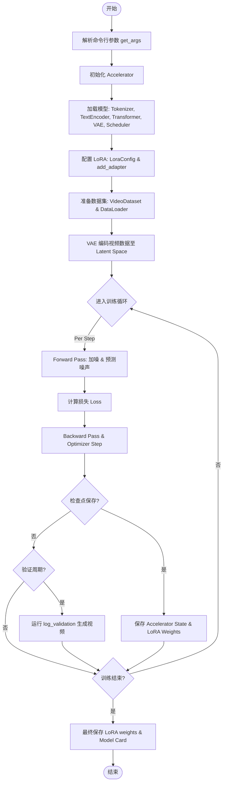

## 类结构

```
torch.utils.data.Dataset (PyTorch 基类)
└── VideoDataset (自定义视频数据集类)
```

## 全局变量及字段


### `logger`
    
日志记录器实例，用于输出训练过程中的日志信息

类型：`logging.Logger`
    


### `VideoDataset.instance_data_root`
    
训练数据根目录

类型：`Path | None`
    


### `VideoDataset.dataset_name`
    
HuggingFace Hub 数据集名称

类型：`str | None`
    


### `VideoDataset.dataset_config_name`
    
数据集配置名

类型：`str | None`
    


### `VideoDataset.caption_column`
    
提示词列名

类型：`str`
    


### `VideoDataset.video_column`
    
视频文件列名

类型：`str`
    


### `VideoDataset.height`
    
目标高度

类型：`int`
    


### `VideoDataset.width`
    
目标宽度

类型：`int`
    


### `VideoDataset.video_reshape_mode`
    
裁剪模式 (center/random/none)

类型：`str`
    


### `VideoDataset.fps`
    
帧率

类型：`int`
    


### `VideoDataset.max_num_frames`
    
最大帧数限制

类型：`int`
    


### `VideoDataset.skip_frames_start`
    
跳过的起始帧数

类型：`int`
    


### `VideoDataset.skip_frames_end`
    
跳过的结束帧数

类型：`int`
    


### `VideoDataset.cache_dir`
    
缓存目录

类型：`str | None`
    


### `VideoDataset.id_token`
    
提示词前缀标识

类型：`str`
    


### `VideoDataset.instance_prompts`
    
实例提示词列表

类型：`List`
    


### `VideoDataset.instance_video_paths`
    
视频文件路径列表

类型：`List`
    


### `VideoDataset.instance_videos`
    
预处理后的视频张量列表

类型：`List`
    


### `VideoDataset.num_instance_videos`
    
视频总数

类型：`int`
    
    

## 全局函数及方法


### `get_args`

该函数是 CogVideoX 训练脚本的命令行参数解析器，使用 Python 的 `argparse` 库定义并收集所有训练所需的配置参数，包括模型路径、数据集配置、训练超参数、优化器设置、验证选项等，最终返回一个包含所有参数的 `Namespace` 对象供 `main` 函数使用。

参数：该函数没有显式参数，但通过 argparse 定义了超过 60 个命令行参数。

返回值：`Namespace`，包含所有解析后的命令行参数对象。

#### 流程图

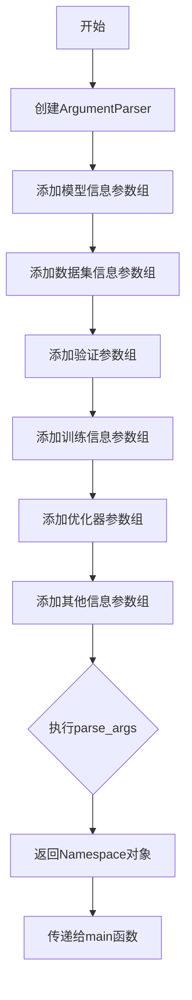

#### 带注释源码

```python
def get_args():
    """
    解析命令行参数，返回包含 CogVideoX 训练所有配置项的 Namespace 对象。
    
    该函数使用 argparse 定义了训练脚本所需的全部命令行参数，涵盖：
    - 模型配置：预训练模型路径、版本、变体、缓存目录
    - 数据集配置：数据集名称、配置、本地路径、列名
    - 验证配置：验证提示词、生成数量、验证频率
    - 训练配置：批次大小、 epochs、学习率、LoRA 参数
    - 优化器配置：优化器类型、Adam/AdamW 参数
    - 其它配置：日志、Hub 推送、混合精度等
    """
    # 创建参数解析器，添加描述信息
    parser = argparse.ArgumentParser(description="Simple example of a training script for CogVideoX.")

    # ==================== 模型信息 ====================
    parser.add_argument(
        "--pretrained_model_name_or_path",
        type=str,
        default=None,
        required=True,
        help="Path to pretrained model or model identifier from huggingface.co/models.",
    )
    parser.add_argument(
        "--revision",
        type=str,
        default=None,
        required=False,
        help="Revision of pretrained model identifier from huggingface.co/models.",
    )
    parser.add_argument(
        "--variant",
        type=str,
        default=None,
        help="Variant of the model files of the pretrained model identifier from huggingface.co/models, 'e.g.' fp16",
    )
    parser.add_argument(
        "--cache_dir",
        type=str,
        default=None,
        help="The directory where the downloaded models and datasets will be stored.",
    )

    # ==================== 数据集信息 ====================
    parser.add_argument(
        "--dataset_name",
        type=str,
        default=None,
        help=(
            "The name of the Dataset (from the HuggingFace hub) containing the training data of instance images (could be your own, possibly private,"
            " dataset). It can also be a path pointing to a local copy of a dataset in your filesystem,"
            " or to a folder containing files that 🤗 Datasets can understand."
        ),
    )
    parser.add_argument(
        "--dataset_config_name",
        type=str,
        default=None,
        help="The config of the Dataset, leave as None if there's only one config.",
    )
    parser.add_argument(
        "--instance_data_root",
        type=str,
        default=None,
        help=("A folder containing the training data."),
    )
    parser.add_argument(
        "--video_column",
        type=str,
        default="video",
        help="The column of the dataset containing videos. Or, the name of the file in `--instance_data_root` folder containing the line-separated path to video data.",
    )
    parser.add_argument(
        "--caption_column",
        type=str,
        default="text",
        help="The column of the dataset containing the instance prompt for each video. Or, the name of the file in `--instance_data_root` folder containing the line-separated instance prompts.",
    )
    parser.add_argument(
        "--id_token", type=str, default=None, help="Identifier token appended to the start of each prompt if provided."
    )
    parser.add_argument(
        "--dataloader_num_workers",
        type=int,
        default=0,
        help=(
            "Number of subprocesses to use for data loading. 0 means that the data will be loaded in the main process."
        ),
    )

    # ==================== 验证配置 ====================
    parser.add_argument(
        "--validation_prompt",
        type=str,
        default=None,
        help="One or more prompt(s) that is used during validation to verify that the model is learning. Multiple validation prompts should be separated by the '--validation_prompt_separator' string.",
    )
    parser.add_argument(
        "--validation_prompt_separator",
        type=str,
        default=":::",
        help="String that separates multiple validation prompts",
    )
    parser.add_argument(
        "--num_validation_videos",
        type=int,
        default=1,
        help="Number of videos that should be generated during validation per `validation_prompt`.",
    )
    parser.add_argument(
        "--validation_epochs",
        type=int,
        default=50,
        help=(
            "Run validation every X epochs. Validation consists of running the prompt `args.validation_prompt` multiple times: `args.num_validation_videos`."
        ),
    )
    parser.add_argument(
        "--guidance_scale",
        type=float,
        default=6,
        help="The guidance scale to use while sampling validation videos.",
    )
    parser.add_argument(
        "--use_dynamic_cfg",
        action="store_true",
        default=False,
        help="Whether or not to use the default cosine dynamic guidance schedule when sampling validation videos.",
    )

    # ==================== 训练信息 ====================
    parser.add_argument("--seed", type=int, default=None, help="A seed for reproducible training.")
    parser.add_argument(
        "--rank",
        type=int,
        default=128,
        help=("The dimension of the LoRA update matrices."),
    )
    parser.add_argument(
        "--lora_alpha",
        type=float,
        default=128,
        help=("The scaling factor to scale LoRA weight update. The actual scaling factor is `lora_alpha / rank`"),
    )
    parser.add_argument(
        "--mixed_precision",
        type=str,
        default=None,
        choices=["no", "fp16", "bf16"],
        help=(
            "Whether to use mixed precision. Choose between fp16 and bf16 (bfloat16). Bf16 requires PyTorch >="
            " 1.10.and an Nvidia Ampere GPU.  Default to the value of accelerate config of the current system or the"
            " flag passed with the `accelerate.launch` command. Use this argument to override the accelerate config."
        ),
    )
    parser.add_argument(
        "--output_dir",
        type=str,
        default="cogvideox-lora",
        help="The output directory where the model predictions and checkpoints will be written.",
    )
    parser.add_argument(
        "--height",
        type=int,
        default=480,
        help="All input videos are resized to this height.",
    )
    parser.add_argument(
        "--width",
        type=int,
        default=720,
        help="All input videos are resized to this width.",
    )
    parser.add_argument(
        "--video_reshape_mode",
        type=str,
        default="center",
        help="All input videos are reshaped to this mode. Choose between ['center', 'random', 'none']",
    )
    parser.add_argument("--fps", type=int, default=8, help="All input videos will be used at this FPS.")
    parser.add_argument(
        "--max_num_frames", type=int, default=49, help="All input videos will be truncated to these many frames."
    )
    parser.add_argument(
        "--skip_frames_start",
        type=int,
        default=0,
        help="Number of frames to skip from the beginning of each input video. Useful if training data contains intro sequences.",
    )
    parser.add_argument(
        "--skip_frames_end",
        type=int,
        default=0,
        help="Number of frames to skip from the end of each input video. Useful if training data contains outro sequences.",
    )
    parser.add_argument(
        "--random_flip",
        action="store_true",
        help="whether to randomly flip videos horizontally",
    )
    parser.add_argument(
        "--train_batch_size", type=int, default=4, help="Batch size (per device) for the training dataloader."
    )
    parser.add_argument("--num_train_epochs", type=int, default=1)
    parser.add_argument(
        "--max_train_steps",
        type=int,
        default=None,
        help="Total number of training steps to perform. If provided, overrides `--num_train_epochs`.",
    )
    parser.add_argument(
        "--checkpointing_steps",
        type=int,
        default=500,
        help=(
            "Save a checkpoint of the training state every X updates. These checkpoints can be used both as final"
            " checkpoints in case they are better than the last checkpoint, and are also suitable for resuming"
            " training using `--resume_from_checkpoint`."
        ),
    )
    parser.add_argument(
        "--checkpoints_total_limit",
        type=int,
        default=None,
        help=("Max number of checkpoints to store."),
    )
    parser.add_argument(
        "--resume_from_checkpoint",
        type=str,
        default=None,
        help=(
            "Whether training should be resumed from a previous checkpoint. Use a path saved by"
            ' `--checkpointing_steps`, or `"latest"` to automatically select the last available checkpoint.'
        ),
    )
    parser.add_argument(
        "--gradient_accumulation_steps",
        type=int,
        default=1,
        help="Number of updates steps to accumulate before performing a backward/update pass.",
    )
    parser.add_argument(
        "--gradient_checkpointing",
        action="store_true",
        help="Whether or not to use gradient checkpointing to save memory at the expense of slower backward pass.",
    )
    parser.add_argument(
        "--learning_rate",
        type=float,
        default=1e-4,
        help="Initial learning rate (after the potential warmup period) to use.",
    )
    parser.add_argument(
        "--scale_lr",
        action="store_true",
        default=False,
        help="Scale the learning rate by the number of GPUs, gradient accumulation steps, and batch size.",
    )
    parser.add_argument(
        "--lr_scheduler",
        type=str,
        default="constant",
        help=(
            'The scheduler type to use. Choose between ["linear", "cosine", "cosine_with_restarts", "polynomial",'
            ' "constant", "constant_with_warmup"]'
        ),
    )
    parser.add_argument(
        "--lr_warmup_steps", type=int, default=500, help="Number of steps for the warmup in the lr scheduler."
    )
    parser.add_argument(
        "--lr_num_cycles",
        type=int,
        default=1,
        help="Number of hard resets of the lr in cosine_with_restarts scheduler.",
    )
    parser.add_argument("--lr_power", type=float, default=1.0, help="Power factor of the polynomial scheduler.")
    parser.add_argument(
        "--enable_slicing",
        action="store_true",
        default=False,
        help="Whether or not to use VAE slicing for saving memory.",
    )
    parser.add_argument(
        "--enable_tiling",
        action="store_true",
        default=False,
        help="Whether or not to use VAE tiling for saving memory.",
    )

    # ==================== 优化器配置 ====================
    parser.add_argument(
        "--optimizer",
        type=lambda s: s.lower(),
        default="adam",
        choices=["adam", "adamw", "prodigy"],
        help=("The optimizer type to use."),
    )
    parser.add_argument(
        "--use_8bit_adam",
        action="store_true",
        help="Whether or not to use 8-bit Adam from bitsandbytes. Ignored if optimizer is not set to AdamW"
    )
    parser.add_argument(
        "--adam_beta1", type=float, default=0.9, help="The beta1 parameter for the Adam and Prodigy optimizers."
    )
    parser.add_argument(
        "--adam_beta2", type=float, default=0.95, help="The beta2 parameter for the Adam and Prodigy optimizers."
    )
    parser.add_argument(
        "--prodigy_beta3",
        type=float,
        default=None,
        help="Coefficients for computing the Prodigy optimizer's stepsize using running averages. If set to None, uses the value of square root of beta2.",
    )
    parser.add_argument("--prodigy_decouple", action="store_true", help="Use AdamW style decoupled weight decay")
    parser.add_argument("--adam_weight_decay", type=float, default=1e-04, help="Weight decay to use for unet params")
    parser.add_argument(
        "--adam_epsilon",
        type=float,
        default=1e-08,
        help="Epsilon value for the Adam optimizer and Prodigy optimizers.",
    )
    parser.add_argument("--max_grad_norm", default=1.0, type=float, help="Max gradient norm.")
    parser.add_argument("--prodigy_use_bias_correction", action="store_true", help="Turn on Adam's bias correction.")
    parser.add_argument(
        "--prodigy_safeguard_warmup",
        action="store_true",
        help="Remove lr from the denominator of D estimate to avoid issues during warm-up stage.",
    )

    # ==================== 其它信息 ====================
    parser.add_argument("--tracker_name", type=str, default=None, help="Project tracker name")
    parser.add_argument("--push_to_hub", action="store_true", help="Whether or not to push the model to the Hub.")
    parser.add_argument("--hub_token", type=str, default=None, help="The token to use to push to the Model Hub.")
    parser.add_argument(
        "--hub_model_id",
        type=str,
        default=None,
        help="The name of the repository to keep in sync with the local `output_dir`.",
    )
    parser.add_argument(
        "--logging_dir",
        type=str,
        default="logs",
        help="Directory where logs are stored.",
    )
    parser.add_argument(
        "--allow_tf32",
        action="store_true",
        help=(
            "Whether or not to allow TF32 on Ampere GPUs. Can be used to speed up training. For more information, see"
            " https://pytorch.org/docs/stable/notes/cuda.html#tensorfloat-32-tf32-on-ampere-devices"
        ),
    )
    parser.add_argument(
        "--report_to",
        type=str,
        default=None,
        help=(
            'The integration to report the results and logs to. Supported platforms are `"tensorboard"`'
            ' (default), `"wandb"` and `"comet_ml"`. Use `"all"` to report to all integrations.'
        ),
    )

    # 解析命令行参数并返回 Namespace 对象
    return parser.parse_args()
```


### `save_model_card`

该函数用于在训练完成后生成并保存模型卡片（Model Card）到指定文件夹，包括模型描述、视频演示、标签信息等，并最终保存为 README.md 文件供 HuggingFace Hub 使用。

参数：

- `repo_id`：`str`，HuggingFace Hub 上的仓库 ID，用于标识模型
- `videos`：`Optional[List]`，验证阶段生成的视频列表，用于添加到模型卡片中展示
- `base_model`：`Optional[str]，基础模型的名称或路径，描述 LoRA 是基于哪个基础模型训练的
- `validation_prompt`：`Optional[str]`，验证时使用的提示词，用于说明模型生成视频的描述
- `repo_folder`：`Optional[str]`，本地文件夹路径，用于保存模型卡片和视频文件
- `fps`：`int`，视频帧率，默认为 8，用于导出验证视频

返回值：`None`，该函数无返回值，主要通过副作用（生成文件）完成功能

#### 流程图

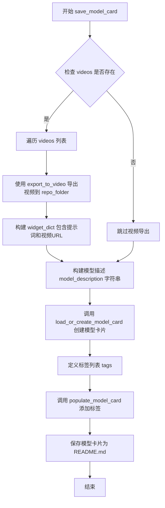

#### 带注释源码

```python
def save_model_card(
    repo_id: str,
    videos=None,
    base_model: str = None,
    validation_prompt=None,
    repo_folder=None,
    fps=8,
):
    """
    生成并保存模型卡片（Model Card），包括模型描述、视频演示和标签信息。
    
    参数:
        repo_id: HuggingFace Hub 上的仓库 ID
        videos: 验证阶段生成的视频列表
        base_model: 基础模型名称或路径
        validation_prompt: 验证提示词
        repo_folder: 本地保存文件夹路径
        fps: 视频帧率
    """
    # 初始化 widget 字典列表，用于 HuggingFace Hub 的视频预览
    widget_dict = []
    
    # 如果有视频，则导出视频并构建 widget 字典
    if videos is not None:
        for i, video in enumerate(videos):
            # 将视频导出为 MP4 格式到指定文件夹
            export_to_video(video, os.path.join(repo_folder, f"final_video_{i}.mp4", fps=fps))
            # 构建 widget 字典，包含提示词和视频 URL
            widget_dict.append(
                {"text": validation_prompt if validation_prompt else " ", "output": {"url": f"video_{i}.mp4"}}
            )

    # 构建详细的模型描述字符串，包含使用方法、许可证等信息
    model_description = f"""
# CogVideoX LoRA - {repo_id}

<Gallery />

## Model description

These are {repo_id} LoRA weights for {base_model}.

The weights were trained using the [CogVideoX Diffusers trainer](https://github.com/huggingface/diffusers/blob/main/examples/cogvideo/train_cogvideox_lora.py).

Was LoRA for the text encoder enabled? No.

## Download model

[Download the *.safetensors LoRA]({repo_id}/tree/main) in the Files & versions tab.

## Use it with the [🧨 diffusers library](https://github.com/huggingface/diffusers)

```py
from diffusers import CogVideoXPipeline
import torch

pipe = CogVideoXPipeline.from_pretrained("THUDM/CogVideoX-5b", torch_dtype=torch.bfloat16).to("cuda")
pipe.load_lora_weights("{repo_id}", weight_name="pytorch_lora_weights.safetensors", adapter_name=["cogvideox-lora"])

# The LoRA adapter weights are determined by what was used for training.
# In this case, we assume `--lora_alpha` is 32 and `--rank` is 64.
# It can be made lower or higher from what was used in training to decrease or amplify the effect
# of the LoRA upto a tolerance, beyond which one might notice no effect at all or overflows.
pipe.set_adapters(["cogvideox-lora"], [32 / 64])

video = pipe("{validation_prompt}", guidance_scale=6, use_dynamic_cfg=True).frames[0]
```

For more details, including weighting, merging and fusing LoRAs, check the [documentation on loading LoRAs in diffusers](https://huggingface.co/docs/diffusers/main/en/using-diffusers/loading_adapters)

## License

Please adhere to the licensing terms as described [here](https://huggingface.co/THUDM/CogVideoX-5b/blob/main/LICENSE) and [here](https://huggingface.co/THUDM/CogVideoX-2b/blob/main/LICENSE).
"""
    
    # 调用工具函数加载或创建模型卡片，并填充基本信息
    model_card = load_or_create_model_card(
        repo_id_or_path=repo_id,
        from_training=True,  # 标记为训练过程创建的模型卡片
        license="other",
        base_model=base_model,
        prompt=validation_prompt,
        model_description=model_description,
        widget=widget_dict,  # 包含视频预览的 widget 配置
    )
    
    # 定义模型标签，用于模型搜索和分类
    tags = [
        "text-to-video",
        "diffusers-training",
        "diffusers",
        "lora",
        "cogvideox",
        "cogvideox-diffusers",
        "template:sd-lora",
    ]

    # 使用标签填充模型卡片
    model_card = populate_model_card(model_card, tags=tags)
    
    # 将模型卡片保存为 README.md 文件
    model_card.save(os.path.join(repo_folder, "README.md"))
```


### `log_validation`

该函数是 CogVideoX 训练脚本中的验证函数，用于在训练过程中生成验证视频并记录到日志系统中。它首先配置调度器参数以处理方差类型，然后使用预训练的 CogVideoX pipeline 生成指定数量的验证视频，最后将生成的视频上传到跟踪器（如 wandb）并释放 GPU 内存。

参数：

- `pipe`：`CogVideoXPipeline`，预加载的 CogVideoX 推理 pipeline，用于生成验证视频
- `args`：`Namespace`，命令行参数对象，包含 `num_validation_videos`、`seed`、`output_dir`、`guidance_scale`、`use_dynamic_cfg` 等验证相关配置
- `accelerator`：`Accelerator`，HuggingFace Accelerate 库提供的分布式训练加速器，用于设备管理和日志记录
- `pipeline_args`：`dict`，传递给 pipeline 的推理参数字典，包含 `prompt`、`guidance_scale`、`use_dynamic_cfg`、`height`、`width` 等生成参数
- `epoch`：`int`，当前训练的 epoch 编号（用于日志记录）
- `is_final_validation`：`bool`，可选参数，默认为 `False`，标识是否为最终验证（影响日志中的 phase 名称为 "test" 还是 "validation"）

返回值：`List[List[PIL.Image]]`，返回包含所有验证视频帧的列表，外层列表长度为 `num_validation_videos`，内层列表为每个视频的 PIL Image 帧序列

#### 流程图

```mermaid
flowchart TD
    A[开始 log_validation] --> B[记录验证日志信息]
    B --> C{pipe.scheduler.config 中是否存在 variance_type}
    C -->|是| D[获取 variance_type]
    C -->|否| E[跳过方差类型处理]
    D --> F{variance_type in ['learned', 'learned_range']}
    F -->|是| G[variance_type 设为 'fixed_small']
    F -->|否| H[保持原有 variance_type]
    G --> I[构建 scheduler_args]
    H --> I
    E --> I
    I --> J[使用 CogVideoXDPMScheduler 重新配置调度器]
    J --> K[将 pipeline 移动到 accelerator.device]
    K --> L[创建随机数生成器]
    L --> M[循环生成 num_validation_videos 个视频]
    M --> N[调用 pipe 生成视频帧]
    N --> O[将 pt 格式转换为 numpy 再转为 PIL]
    O --> P[将视频添加到 videos 列表]
    P --> M
    M --> Q{遍历 accelerator.trackers}
    Q --> R{tracker.name == 'wandb'}
    R -->|是| S[处理 prompt 字符串生成文件名]
    S --> T[导出视频到 MP4 文件]
    T --> U[使用 wandb 记录视频]
    R -->|否| V[跳过该 tracker]
    Q --> W[删除 pipeline 对象]
    W --> X[调用 free_memory 释放 GPU 内存]
    X --> Y[返回 videos 列表]
```

#### 带注释源码

```python
def log_validation(
    pipe,                       # CogVideoXPipeline: 预加载的推理 pipeline
    args,                       # Namespace: 包含验证相关配置的命令行参数
    accelerator,                # Accelerator: HuggingFace Accelerate 加速器
    pipeline_args,             # dict: 传递给 pipeline 的生成参数（如 prompt）
    epoch,                     # int: 当前训练的 epoch 编号
    is_final_validation: bool = False,  # bool: 是否为最终验证
):
    """
    在训练过程中运行验证，生成指定数量的视频并记录到日志系统
    
    该函数执行以下主要步骤：
    1. 配置调度器以处理方差预测（如果需要）
    2. 使用 CogVideoX pipeline 生成验证视频
    3. 将视频记录到跟踪器（如 wandb）
    4. 清理 GPU 内存
    """
    # 记录验证开始信息，包括生成视频数量和 prompt
    logger.info(
        f"Running validation... \n Generating {args.num_validation_videos} videos with prompt: {pipeline_args['prompt']}."
    )
    
    # 初始化调度器参数字典
    # 我们使用简化的学习目标，如果之前预测方差，需要让调度器忽略它
    scheduler_args = {}

    # 检查调度器配置中是否存在 variance_type 参数
    if "variance_type" in pipe.scheduler.config:
        variance_type = pipe.scheduler.config.variance_type

        # 如果方差类型是 learned 或 learned_range，将其改为 fixed_small
        # 这是因为我们使用简化的训练目标，不预测方差
        if variance_type in ["learned", "learned_range"]:
            variance_type = "fixed_small"

        # 将处理后的方差类型添加到调度器参数中
        scheduler_args["variance_type"] = variance_type

    # 使用处理后的参数重新配置调度器
    # CogVideoXDPMScheduler 是专为 CogVideoX 设计的离散多步调度器
    pipe.scheduler = CogVideoXDPMScheduler.from_config(pipe.scheduler.config, **scheduler_args)
    
    # 将 pipeline 移动到加速器设备（通常是 GPU）
    pipe = pipe.to(accelerator.device)
    # pipe.set_progress_bar_config(disable=True)

    # 创建随机数生成器，用于确保生成结果可复现
    # 如果 args.seed 为 None，则 generator 也为 None，使用完全随机生成
    generator = torch.Generator(device=accelerator.device).manual_seed(args.seed) if args.seed is not None else None

    # 初始化视频列表，用于存储所有生成的视频
    videos = []
    
    # 循环生成指定数量的验证视频
    for _ in range(args.num_validation_videos):
        # 调用 pipeline 生成视频
        # output_type="pt" 表示返回 PyTorch 张量格式的帧
        pt_images = pipe(**pipeline_args, generator=generator, output_type="pt").frames[0]
        
        # 将生成的帧堆叠成张量 [F, C, H, W]
        pt_images = torch.stack([pt_images[i] for i in range(pt_images.shape[0])])

        # 使用 VaeImageProcessor 将 PyTorch 张量转换为 PIL Images
        # 步骤1: pt -> numpy
        image_np = VaeImageProcessor.pt_to_numpy(pt_images)
        # 步骤2: numpy -> PIL Image
        image_pil = VaeImageProcessor.numpy_to_pil(image_np)

        # 将转换后的 PIL 图像添加到视频列表
        videos.append(image_pil)

    # 遍历所有注册的跟踪器（如 tensorboard、wandb 等）
    for tracker in accelerator.trackers:
        # 根据是否为最终验证确定 phase 名称
        phase_name = "test" if is_final_validation else "validation"
        
        # 仅处理 wandb 跟踪器
        if tracker.name == "wandb":
            video_filenames = []
            for i, video in enumerate(videos):
                # 清理 prompt 字符串，移除特殊字符用于文件名
                prompt = (
                    pipeline_args["prompt"][:25]
                    .replace(" ", "_")
                    .replace(" ", "_")
                    .replace("'", "_")
                    .replace('"', "_")
                    .replace("/", "_")
                )
                # 构建输出文件名
                filename = os.path.join(args.output_dir, f"{phase_name}_video_{i}_{prompt}.mp4")
                # 导出视频为 MP4 格式，使用指定的帧率
                export_to_video(video, filename, fps=8)
                video_filenames.append(filename)

            # 使用 wandb 记录生成的视频
            # 每个视频都有对应的 caption 显示其 prompt
            tracker.log(
                {
                    phase_name: [
                        wandb.Video(filename, caption=f"{i}: {pipeline_args['prompt']}")
                        for i, filename in enumerate(video_filenames)
                    ]
                }
            )

    # 删除 pipeline 对象以释放 GPU 内存
    del pipe
    # 调用 free_memory 进一步清理未使用的 GPU 内存
    free_memory()

    # 返回生成的视频列表
    return videos
```


### `_get_t5_prompt_embeds`

该函数是 CogVideoX 训练脚本中用于将文本提示（prompt）转换为 T5 文本编码器嵌入向量的核心函数。它接受分词器和文本编码器模型，将输入的文本提示编码为高维向量表示，以便后续用于视频生成模型的训练。此外，该函数支持批量处理和为每个提示生成多个视频副本的功能。

参数：

- `tokenizer`：`T5Tokenizer`，T5 分词器，用于将文本提示转换为 token IDs
- `text_encoder`：`T5EncoderModel`，T5 文本编码器模型，用于将 token IDs 编码为嵌入向量
- `prompt`：`Union[str, List[str]]`，输入的文本提示，可以是单个字符串或字符串列表
- `num_videos_per_prompt`：`int = 1`，每个提示生成的视频数量，用于复制文本嵌入
- `max_sequence_length`：`int = 226`，文本序列的最大长度，超过该长度的文本将被截断
- `device`：`Optional[torch.device] = None`，计算设备，用于将数据移动到指定设备
- `dtype`：`Optional[torch.dtype] = None`，数据类型，用于指定张量的数据类型
- `text_input_ids`：可选的输入，当 tokenizer 为 None 时必须提供预计算的文本输入 IDs

返回值：`torch.Tensor`，返回形状为 `(batch_size * num_videos_per_prompt, seq_len, hidden_dim)` 的文本嵌入张量，其中 batch_size 是提示的批量大小，seq_len 是序列长度，hidden_dim 是文本编码器的隐藏层维度。

#### 流程图

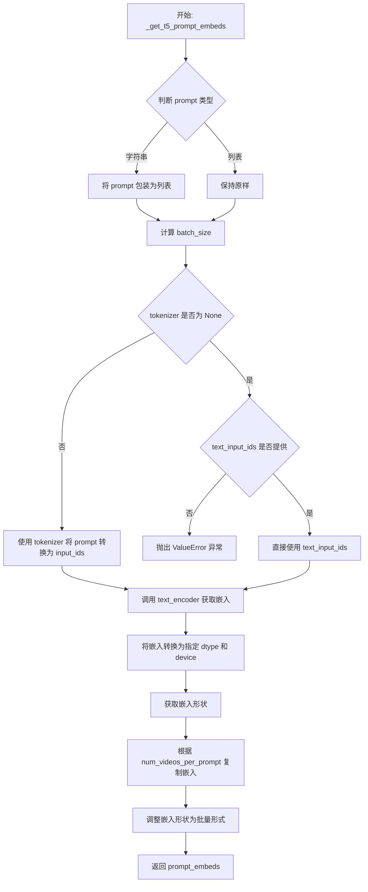

#### 带注释源码

```python
def _get_t5_prompt_embeds(
    tokenizer: T5Tokenizer,
    text_encoder: T5EncoderModel,
    prompt: Union[str, List[str]],
    num_videos_per_prompt: int = 1,
    max_sequence_length: int = 226,
    device: Optional[torch.device] = None,
    dtype: Optional[torch.dtype] = None,
    text_input_ids=None,
):
    # 将单个字符串转换为列表，保持输入格式一致性
    prompt = [prompt] if isinstance(prompt, str) else prompt
    # 计算批量大小
    batch_size = len(prompt)

    # 如果提供了 tokenizer，则使用它将文本转换为 token IDs
    if tokenizer is not None:
        text_inputs = tokenizer(
            prompt,
            padding="max_length",  # 填充到最大长度
            max_length=max_sequence_length,  # 最大序列长度
            truncation=True,  # 截断超长序列
            add_special_tokens=True,  # 添加特殊 tokens（如 start/end tokens）
            return_tensors="pt",  # 返回 PyTorch 张量
        )
        text_input_ids = text_inputs.input_ids
    else:
        # 如果没有 tokenizer，则必须提供预计算的 text_input_ids
        if text_input_ids is None:
            raise ValueError("`text_input_ids` must be provided when the tokenizer is not specified.")

    # 使用文本编码器获取文本嵌入，选取第一个输出元素（hidden states）
    prompt_embeds = text_encoder(text_input_ids.to(device))[0]
    # 将嵌入转换为指定的 dtype 和 device
    prompt_embeds = prompt_embeds.to(dtype=dtype, device=device)

    # 复制文本嵌入以适配每个提示生成多个视频的场景
    # 使用 MPS 友好的方法进行复制
    _, seq_len, _ = prompt_embeds.shape
    # 在序列维度上重复 num_videos_per_prompt 次
    prompt_embeds = prompt_embeds.repeat(1, num_videos_per_prompt, 1)
    # 调整形状为 (batch_size * num_videos_per_prompt, seq_len, hidden_dim)
    prompt_embeds = prompt_embeds.view(batch_size * num_videos_per_prompt, seq_len, -1)

    return prompt_embeds
```


### `encode_prompt`

该函数是 CogVideoX 训练流程中的提示编码核心函数，负责将文本提示转换为 T5 文本编码器生成的嵌入向量，供后续视频生成模型使用。

参数：

- `tokenizer`：`T5Tokenizer`，用于对文本提示进行分词处理的 T5 分词器
- `text_encoder`：`T5EncoderModel`，用于生成文本嵌入的 T5 编码器模型
- `prompt`：`Union[str, List[str]]`，要编码的文本提示，可以是单个字符串或字符串列表
- `num_videos_per_prompt`：`int = 1`，每个提示要生成的视频数量，用于复制嵌入向量
- `max_sequence_length`：`int = 226`，文本编码的最大序列长度
- `device`：`Optional[torch.device] = None`，执行计算的目标设备
- `dtype`：`Optional[torch.dtype] = None`，计算使用的数据类型（如 float16、bfloat16）
- `text_input_ids`：可选的预分词文本输入 ID，若提供则跳过分词步骤

返回值：`torch.Tensor`，形状为 `(batch_size * num_videos_per_prompt, seq_len, hidden_dim)` 的文本嵌入张量

#### 流程图

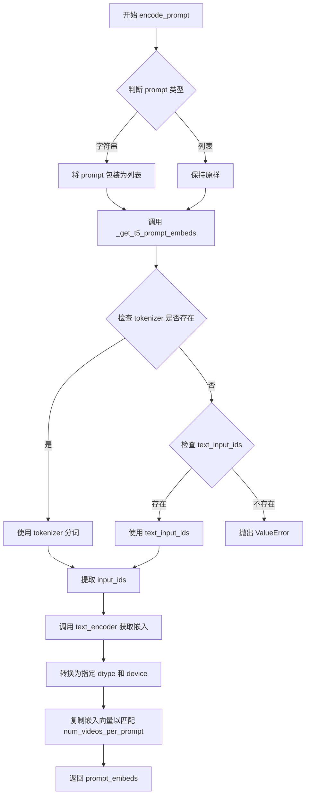

#### 带注释源码

```python
def encode_prompt(
    tokenizer: T5Tokenizer,
    text_encoder: T5EncoderModel,
    prompt: Union[str, List[str]],
    num_videos_per_prompt: int = 1,
    max_sequence_length: int = 226,
    device: Optional[torch.device] = None,
    dtype: Optional[torch.dtype] = None,
    text_input_ids=None,
):
    # 将字符串提示转换为列表，确保统一处理
    prompt = [prompt] if isinstance(prompt, str) else prompt
    
    # 调用内部函数 _get_t5_prompt_embeds 进行实际的编码处理
    # 该函数处理分词、编码、复制等逻辑
    prompt_embeds = _get_t5_prompt_embeds(
        tokenizer,
        text_encoder,
        prompt=prompt,
        num_videos_per_prompt=num_videos_per_prompt,
        max_sequence_length=max_sequence_length,
        device=device,
        dtype=dtype,
        text_input_ids=text_input_ids,
    )
    
    # 返回编码后的提示嵌入向量
    return prompt_embeds
```


### `compute_prompt_embeddings`

该函数是 CogVideoX 训练流程中的核心组成部分，负责将文本提示（Prompt）转换为模型可理解的嵌入向量（Embeddings）。它根据 `requires_grad` 参数决定是否需要构建计算图（用于梯度更新）。在 CogVideoX LoRA 训练场景中，文本编码器通常被冻结，因此默认使用 `torch.no_grad()` 来节省显存并加速推理。

参数：

-  `tokenizer`：`T5Tokenizer`，用于将文本 token 化。
-  `text_encoder`：`T5EncoderModel`，用于将 token IDs 转换为嵌入向量。
-  `prompt`：`Union[str, List[str]]`，需要编码的文本提示。
-  `max_sequence_length`：`int`，文本序列的最大长度。
-  `device`：`torch.device`，计算设备（如 CUDA 或 CPU）。
-  `dtype`：`torch.dtype`，张量的数据类型（如 float16 或 bfloat16）。
-  `requires_grad`：`bool`，是否需要计算梯度。如果为 `True`，则保留计算图以支持反向传播；通常在训练文本编码器时使用，但在 CogVideoX 训练中默认关闭。

返回值：`torch.Tensor`，编码后的文本嵌入向量，形状通常为 `(batch_size, seq_len, hidden_size)`。

#### 流程图

```mermaid
flowchart TD
    A([开始]) --> B{requires_grad?}
    B -- True --> C[调用 encode_prompt<br/>计算梯度]
    B -- False --> D[使用 torch.no_grad()<br/>调用 encode_prompt]
    C --> E([返回 prompt_embeds])
    D --> E
```

#### 带注释源码

```python
def compute_prompt_embeddings(
    tokenizer, 
    text_encoder, 
    prompt, 
    max_sequence_length, 
    device, 
    dtype, 
    requires_grad: bool = False
):
    """
    计算文本提示的嵌入向量。

    参数:
        tokenizer: T5 分词器实例。
        text_encoder: T5 文本编码器模型。
        prompt: 文本提示或提示列表。
        max_sequence_length: 最大序列长度。
        device: 计算设备。
        dtype: 计算数据类型。
        requires_grad: 是否需要计算梯度。
    """
    
    # 检查是否需要计算梯度
    if requires_grad:
        # 如果需要梯度（例如在训练文本编码器时），直接调用编码函数
        # 这将保留计算图，允许反向传播
        prompt_embeds = encode_prompt(
            tokenizer,
            text_encoder,
            prompt,
            num_videos_per_prompt=1,
            max_sequence_length=max_sequence_length,
            device=device,
            dtype=dtype,
        )
    else:
        # 如果不需要梯度（例如 CogVideoX 训练中通常冻结 text_encoder），
        # 使用 no_grad 上下文管理器来禁用梯度计算，节省显存并提高速度
        with torch.no_grad():
            prompt_embeds = encode_prompt(
                tokenizer,
                text_encoder,
                prompt,
                num_videos_per_prompt=1,
                max_sequence_length=max_sequence_length,
                device=device,
                dtype=dtype,
            )
            
    # 返回编码后的嵌入向量
    return prompt_embeds
```


### `prepare_rotary_positional_embeddings`

该函数用于计算 CogVideoX 视频生成模型的旋转位置嵌入（Rotary Positional Embeddings），根据输入视频的空间维度（高度、宽度）和时间维度（帧数）生成余弦和正弦频率张量，用于 Transformer 模型中的旋转位置编码。

参数：

- `height`：`int`，输入视频的高度（像素）
- `width`：`int`，输入视频的宽度（像素）
- `num_frames`：`int`，输入视频的帧数
- `vae_scale_factor_spatial`：`int`，VAE 的空间缩放因子，默认为 8
- `patch_size`：`int`，Transformer 的 patch 大小，默认为 2
- `attention_head_dim`：`int`，注意力头的维度，默认为 64
- `device`：`Optional[torch.device]`，计算设备，默认为 None
- `base_height`：`int`，基础参考高度，默认为 480
- `base_width`：`int`，基础参考宽度，默认为 720

返回值：`Tuple[torch.Tensor, torch.Tensor]`，返回两个张量，分别是旋转位置嵌入的余弦（freqs_cos）和正弦（freqs_sin）部分

#### 流程图

```mermaid
flowchart TD
    A[开始: prepare_rotary_positional_embeddings] --> B[计算 grid_height = height // (vae_scale_factor_spatial * patch_size)]
    B --> C[计算 grid_width = width // (vae_scale_factor_spatial * patch_size)]
    C --> D[计算 base_size_width = base_width // (vae_scale_factor_spatial * patch_size)]
    D --> E[计算 base_size_height = base_height // (vae_scale_factor_spatial * patch_size)]
    E --> F[调用 get_resize_crop_region_for_grid 获取裁剪坐标]
    F --> G[调用 get_3d_rotary_pos_embed 生成3D旋转位置嵌入]
    G --> H[返回 freqs_cos 和 freqs_sin]
```

#### 带注释源码

```python
def prepare_rotary_positional_embeddings(
    height: int,                    # 输入视频高度（像素）
    width: int,                     # 输入视频宽度（像素）
    num_frames: int,                # 输入视频帧数
    vae_scale_factor_spatial: int = 8,   # VAE空间缩放因子，用于计算latent空间尺寸
    patch_size: int = 2,            # Transformer中patch的大小
    attention_head_dim: int = 64,   # 注意力头维度，决定旋转嵌入的维度
    device: Optional[torch.device] = None,  # 计算设备
    base_height: int = 480,         # 基础参考高度（默认训练分辨率）
    base_width: int = 720,          # 基础参考宽度（默认训练分辨率）
) -> Tuple[torch.Tensor, torch.Tensor]:
    """
    准备旋转位置嵌入（Rotary Positional Embeddings）
    
    该函数将输入视频的空间和时间维度转换为旋转位置编码，
    用于 CogVideoX Transformer 模型中的自注意力机制。
    """
    
    # 计算 latent 空间下的网格高度（将像素空间转换为 latent 空间）
    grid_height = height // (vae_scale_factor_spatial * patch_size)
    
    # 计算 latent 空间下的网格宽度
    grid_width = width // (vae_scale_factor_spatial * patch_size)
    
    # 计算基础分辨率对应的 latent 空间宽度
    base_size_width = base_width // (vae_scale_factor_spatial * patch_size)
    
    # 计算基础分辨率对应的 latent 空间高度
    base_size_height = base_height // (vae_scale_factor_spatial * patch_size)
    
    # 获取网格裁剪坐标，用于处理不同分辨率的输入
    # 这确保模型能处理非标准尺寸的视频
    grid_crops_coords = get_resize_crop_region_for_grid(
        (grid_height, grid_width),  # 当前输入的网格尺寸
        base_size_width,             # 基础宽度
        base_size_height             # 基础高度
    )
    
    # 调用底层函数生成3D旋转位置嵌入
    # 包含空间两个维度和时间一个维度
    freqs_cos, freqs_sin = get_3d_rotary_pos_embed(
        embed_dim=attention_head_dim,      # 嵌入维度
        crops_coords=grid_crops_coords,    # 裁剪坐标
        grid_size=(grid_height, grid_width), # 空间网格尺寸
        temporal_size=num_frames,          # 时间维度（帧数）
        device=device,                     # 计算设备
    )
    
    # 返回余弦和正弦形式的旋转位置嵌入
    return freqs_cos, freqs_sin
```


### `get_optimizer`

`get_optimizer` 函数负责根据传入的参数动态选择并实例化深度学习优化器。该函数支持多种优化器（Adam、AdamW、Prodigy），并集成了 DeepSpeed 优化器以及 8-bit Adam 优化器，能够根据训练配置灵活创建适合 CogVideoX 模型训练的优化器实例。

参数：

- `args`：对象，包含所有训练参数的配置对象（如学习率、beta 值、epsilon、权重衰减等）
- `params_to_optimize`：可迭代对象，需要优化的参数列表
- `use_deepspeed`：布尔值，默认为 False，指示是否使用 DeepSpeed 优化器

返回值：`torch.optim.Optimizer` 或 `DummyOptim`，返回配置好的优化器实例

#### 流程图

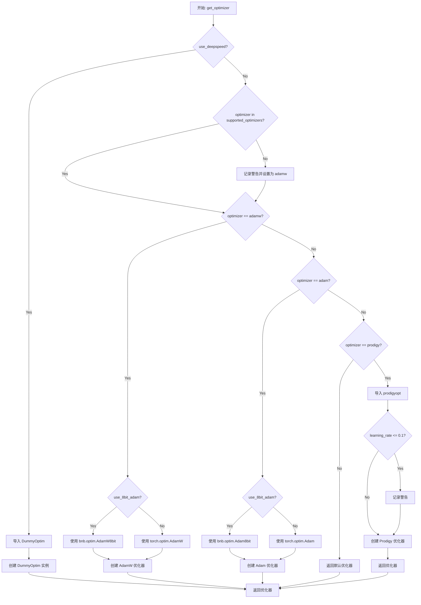

#### 带注释源码

```python
def get_optimizer(args, params_to_optimize, use_deepspeed: bool = False):
    """
    根据参数配置创建并返回相应的优化器实例。
    
    参数:
        args: 包含优化器配置的对象，包括学习率、beta、epsilon、权重衰减等参数
        params_to_optimize: 需要优化的参数列表
        use_deepspeed: 是否使用 DeepSpeed 优化器
        
    返回:
        配置好的优化器实例
    """
    # 使用 DeepSpeed 优化器的路径
    if use_deepspeed:
        from accelerate.utils import DummyOptim

        return DummyOptim(
            params_to_optimize,
            lr=args.learning_rate,
            betas=(args.adam_beta1, args.adam_beta2),
            eps=args.adam_epsilon,
            weight_decay=args.adam_weight_decay,
        )

    # 支持的优化器列表
    supported_optimizers = ["adam", "adamw", "prodigy"]
    
    # 验证优化器类型是否支持，不支持则默认使用 AdamW
    if args.optimizer not in supported_optimizers:
        logger.warning(
            f"Unsupported choice of optimizer: {args.optimizer}. Supported optimizers include {supported_optimizers}. Defaulting to AdamW"
        )
        args.optimizer = "adamw"

    # 8-bit Adam 仅对 Adam 和 AdamW 有效，检查配置一致性
    if args.use_8bit_adam and args.optimizer.lower() not in ["adam", "adamw"]:
        logger.warning(
            f"use_8bit_adam is ignored when optimizer is not set to 'Adam' or 'AdamW'. Optimizer was "
            f"set to {args.optimizer.lower()}"
        )

    # 动态导入 bitsandbytes 以支持 8-bit Adam
    if args.use_8bit_adam:
        try:
            import bitsandbytes as bnb
        except ImportError:
            raise ImportError(
                "To use 8-bit Adam, please install the bitsandbytes library: `pip install bitsandbytes`."
            )

    # 根据配置创建 AdamW 优化器
    if args.optimizer.lower() == "adamw":
        optimizer_class = bnb.optim.AdamW8bit if args.use_8bit_adam else torch.optim.AdamW

        optimizer = optimizer_class(
            params_to_optimize,
            betas=(args.adam_beta1, args.adam_beta2),
            eps=args.adam_epsilon,
            weight_decay=args.adam_weight_decay,
        )
    # 根据配置创建 Adam 优化器
    elif args.optimizer.lower() == "adam":
        optimizer_class = bnb.optim.Adam8bit if args.use_8bit_adam else torch.optim.Adam

        optimizer = optimizer_class(
            params_to_optimize,
            betas=(args.adam_beta1, args.adam_beta2),
            eps=args.adam_epsilon,
            weight_decay=args.adam_weight_decay,
        )
    # 根据配置创建 Prodigy 优化器
    elif args.optimizer.lower() == "prodigy":
        try:
            import prodigyopt
        except ImportError:
            raise ImportError("To use Prodigy, please install the prodigyopt library: `pip install prodigyopt`")

        optimizer_class = prodigyopt.Prodigy

        # Prodigy 优化器通常需要较高的学习率
        if args.learning_rate <= 0.1:
            logger.warning(
                "Learning rate is too low. When using prodigy, it's generally better to set learning rate around 1.0"
            )

        optimizer = optimizer_class(
            params_to_optimize,
            betas=(args.adam_beta1, args.adam_beta2),
            beta3=args.prodigy_beta3,
            weight_decay=args.adam_weight_decay,
            eps=args.adam_epsilon,
            decouple=args.prodigy_decouple,
            use_bias_correction=args.prodigy_use_bias_correction,
            safeguard_warmup=args.prodigy_safeguard_warmup,
        )

    return optimizer
```


### `main`

该函数是 CogVideoX LoRA 训练脚本的核心入口，负责加载模型和数据集、配置训练环境、执行训练循环（包括前向传播、损失计算、反向传播、梯度裁剪）、保存检查点、运行验证推理以及将训练好的 LoRA 权重推送至 HuggingFace Hub。

参数：

- `args`：`argparse.Namespace`，通过 `get_args()` 解析的命令行参数对象，包含模型路径、数据集配置、训练超参数（如学习率、批量大小、LoRA rank 等）、验证设置和输出选项等所有训练配置。

返回值：`None`，该函数无返回值，主要通过副作用（如保存模型权重、输出日志）完成训练流程。

#### 流程图

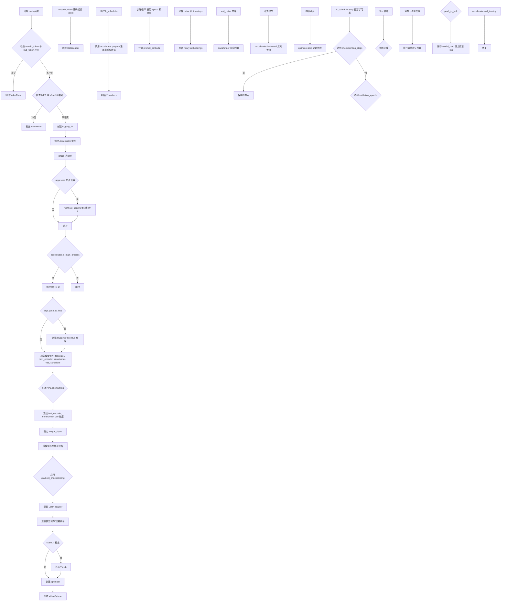

#### 带注释源码

```python
def main(args):
    """
    CogVideoX LoRA 训练主函数
    
    该函数执行完整的训练流程:
    1. 环境验证与配置
    2. 模型加载与 LoRA 配置
    3. 数据集准备与编码
    4. 训练循环执行
    5. 检查点保存与验证
    6. 模型推送至 Hub
    """
    
    # ============ 1. 环境验证 ============
    # 检查 wandb 与 hub_token 的安全冲突
    if args.report_to == "wandb" and args.hub_token is not None:
        raise ValueError(
            "You cannot use both --report_to=wandb and --hub_token due to a security risk of exposing your token."
            " Please use `hf auth login` to authenticate with the Hub."
        )

    # 检查 MPS 后端与 bfloat16 的兼容性
    if torch.backends.mps.is_available() and args.mixed_precision == "bf16":
        raise ValueError(
            "Mixed precision training with bfloat16 is not supported on MPS. Please use fp16 (recommended) or fp32 instead."
        )

    # ============ 2. 初始化 Accelerator ============
    logging_dir = Path(args.output_dir, args.logging_dir)
    accelerator_project_config = ProjectConfiguration(project_dir=args.output_dir, logging_dir=logging_dir)
    kwargs = DistributedDataParallelKwargs(find_unused_parameters=True)
    accelerator = Accelerator(
        gradient_accumulation_steps=args.gradient_accumulation_steps,
        mixed_precision=args.mixed_precision,
        log_with=args.report_to,
        project_config=accelerator_project_config,
        kwargs_handlers=[kwargs],
    )

    # MPS 后端禁用原生 AMP
    if torch.backends.mps.is_available():
        accelerator.native_amp = False

    # 验证 wandb 可用性
    if args.report_to == "wandb":
        if not is_wandb_available():
            raise ImportError("Make sure to install wandb if you want to use it for logging during training.")

    # ============ 3. 日志配置 ============
    logging.basicConfig(
        format="%(asctime)s - %(levelname)s - %(name)s - %(message)s",
        datefmt="%m/%d/%Y %H:%M:%S",
        level=logging.INFO,
    )
    logger.info(accelerator.state, main_process_only=False)
    
    # 主进程设置 verbose 日志，其他进程设置 error 日志
    if accelerator.is_local_main_process:
        transformers.utils.logging.set_verbosity_warning()
        diffusers.utils.logging.set_verbosity_info()
    else:
        transformers.utils.logging.set_verbosity_error()
        diffusers.utils.logging.set_verbosity_error()

    # 设置随机种子
    if args.seed is not None:
        set_seed(args.seed)

    # ============ 4. 创建输出目录和 Hub 仓库 ============
    if accelerator.is_main_process:
        if args.output_dir is not None:
            os.makedirs(args.output_dir, exist_ok=True)

        if args.push_to_hub:
            repo_id = create_repo(
                repo_id=args.hub_model_id or Path(args.output_dir).name,
                exist_ok=True,
            ).repo_id

    # ============ 5. 加载模型组件 ============
    tokenizer = AutoTokenizer.from_pretrained(
        args.pretrained_model_name_or_path, subfolder="tokenizer", revision=args.revision
    )

    text_encoder = T5EncoderModel.from_pretrained(
        args.pretrained_model_name_or_path, subfolder="text_encoder", revision=args.revision
    )

    # 根据模型版本选择 dtype: 5b 用 bfloat16, 2b 用 float16
    load_dtype = torch.bfloat16 if "5b" in args.pretrained_model_name_or_path.lower() else torch.float16
    transformer = CogVideoXTransformer3DModel.from_pretrained(
        args.pretrained_model_name_or_path,
        subfolder="transformer",
        torch_dtype=load_dtype,
        revision=args.revision,
        variant=args.variant,
    )

    vae = AutoencoderKLCogVideoX.from_pretrained(
        args.pretrained_model_name_or_path, subfolder="vae", revision=args.revision, variant=args.variant
    )

    scheduler = CogVideoXDPMScheduler.from_pretrained(args.pretrained_model_name_or_path, subfolder="scheduler")

    # VAE 内存优化: slicing 和 tiling
    if args.enable_slicing:
        vae.enable_slicing()
    if args.enable_tiling:
        vae.enable_tiling()

    # 冻结非训练参数 - 只训练 LoRA
    text_encoder.requires_grad_(False)
    transformer.requires_grad_(False)
    vae.requires_grad_(False)

    # ============ 6. 确定权重精度 ============
    weight_dtype = torch.float32
    if accelerator.state.deepspeed_plugin:
        # DeepSpeed 配置优先级最高
        if (
            "fp16" in accelerator.state.deepspeed_plugin.deepspeed_config
            and accelerator.state.deepspeed_plugin.deepspeed_config["fp16"]["enabled"]
        ):
            weight_dtype = torch.float16
        if (
            "bf16" in accelerator.state.deepspeed_plugin.deepspeed_config
            and accelerator.state.deepspeed_plugin.deepspeed_config["bf16"]["enabled"]
        ):
            weight_dtype = torch.float16
    else:
        # 使用 accelerate 配置
        if accelerator.mixed_precision == "fp16":
            weight_dtype = torch.float16
        elif accelerator.mixed_precision == "bf16":
            weight_dtype = torch.bfloat16

    # MPS 与 bfloat16 兼容性检查
    if torch.backends.mps.is_available() and weight_dtype == torch.bfloat16:
        raise ValueError(
            "Mixed precision training with bfloat16 is not supported on MPS. Please use fp16 (recommended) or fp32 instead."
        )

    # 将模型移至设备并设置精度
    text_encoder.to(accelerator.device, dtype=weight_dtype)
    transformer.to(accelerator.device, dtype=weight_dtype)
    vae.to(accelerator.device, dtype=weight_dtype)

    # 梯度检查点以节省显存
    if args.gradient_checkpointing:
        transformer.enable_gradient_checkpointing()

    # ============ 7. 配置 LoRA ============
    transformer_lora_config = LoraConfig(
        r=args.rank,
        lora_alpha=args.lora_alpha,
        init_lora_weights=True,
        target_modules=["to_k", "to_q", "to_v", "to_out.0"],
    )
    transformer.add_adapter(transformer_lora_config)

    def unwrap_model(model):
        """解包加速器包装的模型"""
        model = accelerator.unwrap_model(model)
        model = model._orig_mod if is_compiled_module(model) else model
        return model

    # 注册模型保存/加载钩子 - 处理 LoRA 权重序列化
    def save_model_hook(models, weights, output_dir):
        if accelerator.is_main_process:
            transformer_lora_layers_to_save = None

            for model in models:
                if isinstance(model, type(unwrap_model(transformer))):
                    transformer_lora_layers_to_save = get_peft_model_state_dict(model)
                else:
                    raise ValueError(f"unexpected save model: {model.__class__}")

                weights.pop()

            CogVideoXPipeline.save_lora_weights(
                output_dir,
                transformer_lora_layers=transformer_lora_layers_to_save,
            )

    def load_model_hook(models, input_dir):
        transformer_ = None

        while len(models) > 0:
            model = models.pop()

            if isinstance(model, type(unwrap_model(transformer))):
                transformer_ = model
            else:
                raise ValueError(f"Unexpected save model: {model.__class__}")

        lora_state_dict = CogVideoXPipeline.lora_state_dict(input_dir)

        transformer_state_dict = {
            f"{k.replace('transformer.', '')}": v for k, v in lora_state_dict.items() if k.startswith("transformer.")
        }
        transformer_state_dict = convert_unet_state_dict_to_peft(transformer_state_dict)
        incompatible_keys = set_peft_model_state_dict(transformer_, transformer_state_dict, adapter_name="default")
        if incompatible_keys is not None:
            unexpected_keys = getattr(incompatible_keys, "unexpected_keys", None)
            if unexpected_keys:
                logger.warning(
                    f"Loading adapter weights from state_dict led to unexpected keys not found in the model: "
                    f" {unexpected_keys}. "
                )

        # 确保 LoRA 参数为 float32
        if args.mixed_precision == "fp16":
            cast_training_params([transformer_])

    accelerator.register_save_state_pre_hook(save_model_hook)
    accelerator.register_load_state_pre_hook(load_model_hook)

    # ============ 8. 优化器配置 ============
    # 启用 TF32 加速
    if args.allow_tf32 and torch.cuda.is_available():
        torch.backends.cuda.matmul.allow_tf32 = True

    # 扩展学习率
    if args.scale_lr:
        args.learning_rate = (
            args.learning_rate * args.gradient_accumulation_steps * args.train_batch_size * accelerator.num_processes
        )

    # 确保 LoRA 参数为 float32
    if args.mixed_precision == "fp16":
        cast_training_params([transformer], dtype=torch.float32)

    transformer_lora_parameters = list(filter(lambda p: p.requires_grad, transformer.parameters()))

    transformer_parameters_with_lr = {"params": transformer_lora_parameters, "lr": args.learning_rate}
    params_to_optimize = [transformer_parameters_with_lr]

    use_deepspeed_optimizer = (
        accelerator.state.deepspeed_plugin is not None
        and "optimizer" in accelerator.state.deepspeed_plugin.deepspeed_config
    )
    use_deepspeed_scheduler = (
        accelerator.state.deepspeed_plugin is not None
        and "scheduler" in accelerator.state.deepspeed_plugin.deepspeed_config
    )

    optimizer = get_optimizer(args, params_to_optimize, use_deepspeed=use_deepspeed_optimizer)

    # ============ 9. 数据集准备 ============
    train_dataset = VideoDataset(
        instance_data_root=args.instance_data_root,
        dataset_name=args.dataset_name,
        dataset_config_name=args.dataset_config_name,
        caption_column=args.caption_column,
        video_column=args.video_column,
        height=args.height,
        width=args.width,
        video_reshape_mode=args.video_reshape_mode,
        fps=args.fps,
        max_num_frames=args.max_num_frames,
        skip_frames_start=args.skip_frames_start,
        skip_frames_end=args.skip_frames_end,
        cache_dir=args.cache_dir,
        id_token=args.id_token,
    )

    # 视频编码函数 - 将原始视频编码为 latent
    def encode_video(video, bar):
        bar.update(1)
        video = video.to(accelerator.device, dtype=vae.dtype).unsqueeze(0)
        video = video.permute(0, 2, 1, 3, 4)  # [B, C, F, H, W]
        latent_dist = vae.encode(video).latent_dist
        return latent_dist

    # 预编码所有视频 latent
    progress_encode_bar = tqdm(
        range(0, len(train_dataset.instance_videos)),
        desc="Loading Encode videos",
    )
    train_dataset.instance_videos = [
        encode_video(video, progress_encode_bar) for video in train_dataset.instance_videos
    ]
    progress_encode_bar.close()

    # 批处理整理函数
    def collate_fn(examples):
        videos = [example["instance_video"].sample() * vae.config.scaling_factor for example in examples]
        prompts = [example["instance_prompt"] for example in examples]

        videos = torch.cat(videos)
        videos = videos.permute(0, 2, 1, 3, 4)
        videos = videos.to(memory_format=torch.contiguous_format).float()

        return {
            "videos": videos,
            "prompts": prompts,
        }

    train_dataloader = DataLoader(
        train_dataset,
        batch_size=args.train_batch_size,
        shuffle=True,
        collate_fn=collate_fn,
        num_workers=args.dataloader_num_workers,
    )

    # ============ 10. 学习率调度器 ============
    overrode_max_train_steps = False
    num_update_steps_per_epoch = math.ceil(len(train_dataloader) / args.gradient_accumulation_steps)
    if args.max_train_steps is None:
        args.max_train_steps = args.num_train_epochs * num_update_steps_per_epoch
        overrode_max_train_steps = True

    if use_deepspeed_scheduler:
        from accelerate.utils import DummyScheduler

        lr_scheduler = DummyScheduler(
            name=args.lr_scheduler,
            optimizer=optimizer,
            total_num_steps=args.max_train_steps * accelerator.num_processes,
            num_warmup_steps=args.lr_warmup_steps * accelerator.num_processes,
        )
    else:
        lr_scheduler = get_scheduler(
            args.lr_scheduler,
            optimizer=optimizer,
            num_warmup_steps=args.lr_warmup_steps * accelerator.num_processes,
            num_training_steps=args.max_train_steps * accelerator.num_processes,
            num_cycles=args.lr_num_cycles,
            power=args.lr_power,
        )

    # ============ 11. 准备模型与数据 ============
    transformer, optimizer, train_dataloader, lr_scheduler = accelerator.prepare(
        transformer, optimizer, train_dataloader, lr_scheduler
    )

    # 重新计算训练步数
    num_update_steps_per_epoch = math.ceil(len(train_dataloader) / args.gradient_accumulation_steps)
    if overrode_max_train_steps:
        args.max_train_steps = args.num_train_epochs * num_update_steps_per_epoch
    args.num_train_epochs = math.ceil(args.max_train_steps / num_update_steps_per_epoch)

    # 初始化 trackers
    if accelerator.is_main_process:
        tracker_name = args.tracker_name or "cogvideox-lora"
        accelerator.init_trackers(tracker_name, config=vars(args))

    # ============ 12. 训练循环 ============
    total_batch_size = args.train_batch_size * accelerator.num_processes * args.gradient_accumulation_steps
    num_trainable_parameters = sum(param.numel() for model in params_to_optimize for param in model["params"])

    logger.info("***** Running training *****")
    logger.info(f"  Num trainable parameters = {num_trainable_parameters}")
    logger.info(f"  Num examples = {len(train_dataset)}")
    logger.info(f"  Num batches each epoch = {len(train_dataloader)}")
    logger.info(f"  Num epochs = {args.num_train_epochs}")
    logger.info(f"  Instantaneous batch size per device = {args.train_batch_size}")
    logger.info(f"  Total train batch size (w. parallel, distributed & accumulation) = {total_batch_size}")
    logger.info(f"  Gradient accumulation steps = {args.gradient_accumulation_steps}")
    logger.info(f"  Total optimization steps = {args.max_train_steps}")
    global_step = 0
    first_epoch = 0

    # 恢复检查点
    if not args.resume_from_checkpoint:
        initial_global_step = 0
    else:
        if args.resume_from_checkpoint != "latest":
            path = os.path.basename(args.resume_from_checkpoint)
        else:
            dirs = os.listdir(args.output_dir)
            dirs = [d for d in dirs if d.startswith("checkpoint")]
            dirs = sorted(dirs, key=lambda x: int(x.split("-")[1]))
            path = dirs[-1] if len(dirs) > 0 else None

        if path is None:
            accelerator.print(
                f"Checkpoint '{args.resume_from_checkpoint}' does not exist. Starting a new training run."
            )
            args.resume_from_checkpoint = None
            initial_global_step = 0
        else:
            accelerator.print(f"Resuming from checkpoint {path}")
            accelerator.load_state(os.path.join(args.output_dir, path))
            global_step = int(path.split("-")[1])

            initial_global_step = global_step
            first_epoch = global_step // num_update_steps_per_epoch

    progress_bar = tqdm(
        range(0, args.max_train_steps),
        initial=initial_global_step,
        desc="Steps",
        disable=not accelerator.is_local_main_process,
    )
    vae_scale_factor_spatial = 2 ** (len(vae.config.block_out_channels) - 1)

    model_config = transformer.module.config if hasattr(transformer, "module") else transformer.config

    # 遍历每个 epoch
    for epoch in range(first_epoch, args.num_train_epochs):
        transformer.train()

        for step, batch in enumerate(train_dataloader):
            models_to_accumulate = [transformer]

            with accelerator.accumulate(models_to_accumulate):
                model_input = batch["videos"].to(dtype=weight_dtype)  # [B, F, C, H, W]
                prompts = batch["prompts"]

                # 编码 prompts
                prompt_embeds = compute_prompt_embeddings(
                    tokenizer,
                    text_encoder,
                    prompts,
                    model_config.max_text_seq_length,
                    accelerator.device,
                    weight_dtype,
                    requires_grad=False,
                )

                # 采样噪声
                noise = torch.randn_like(model_input)
                batch_size, num_frames, num_channels, height, width = model_input.shape

                # 随机采样 timestep
                timesteps = torch.randint(
                    0, scheduler.config.num_train_timesteps, (batch_size,), device=model_input.device
                )
                timesteps = timesteps.long()

                # 准备旋转位置编码
                image_rotary_emb = (
                    prepare_rotary_positional_embeddings(
                        height=args.height,
                        width=args.width,
                        num_frames=num_frames,
                        vae_scale_factor_spatial=vae_scale_factor_spatial,
                        patch_size=model_config.patch_size,
                        attention_head_dim=model_config.attention_head_dim,
                        device=accelerator.device,
                    )
                    if model_config.use_rotary_positional_embeddings
                    else None
                )

                # 前向扩散过程: 加噪
                noisy_model_input = scheduler.add_noise(model_input, noise, timesteps)

                # 预测噪声残差
                model_output = transformer(
                    hidden_states=noisy_model_input,
                    encoder_hidden_states=prompt_embeds,
                    timestep=timesteps,
                    image_rotary_emb=image_rotary_emb,
                    return_dict=False,
                )[0]
                
                # 计算速度 (velocity)
                model_pred = scheduler.get_velocity(model_output, noisy_model_input, timesteps)

                # 计算加权 MSE 损失
                alphas_cumprod = scheduler.alphas_cumprod[timesteps]
                weights = 1 / (1 - alphas_cumprod)
                while len(weights.shape) < len(model_pred.shape):
                    weights = weights.unsqueeze(-1)

                target = model_input

                loss = torch.mean((weights * (model_pred - target) ** 2).reshape(batch_size, -1), dim=1)
                loss = loss.mean()
                accelerator.backward(loss)

                # 梯度裁剪
                if accelerator.sync_gradients:
                    params_to_clip = transformer.parameters()
                    accelerator.clip_grad_norm_(params_to_clip, args.max_grad_norm)

                # 更新参数
                if accelerator.state.deepspeed_plugin is None:
                    optimizer.step()
                    optimizer.zero_grad()

                lr_scheduler.step()

            # 检查并保存检查点
            if accelerator.sync_gradients:
                progress_bar.update(1)
                global_step += 1

                if accelerator.is_main_process or accelerator.distributed_type == DistributedType.DEEPSPEED:
                    if global_step % args.checkpointing_steps == 0:
                        # 检查点数量限制
                        if args.checkpoints_total_limit is not None:
                            checkpoints = os.listdir(args.output_dir)
                            checkpoints = [d for d in checkpoints if d.startswith("checkpoint")]
                            checkpoints = sorted(checkpoints, key=lambda x: int(x.split("-")[1]))

                            if len(checkpoints) >= args.checkpoints_total_limit:
                                num_to_remove = len(checkpoints) - args.checkpoints_total_limit + 1
                                removing_checkpoints = checkpoints[0:num_to_remove]

                                logger.info(
                                    f"{len(checkpoints)} checkpoints already exist, removing {len(removing_checkpoints)} checkpoints"
                                )
                                logger.info(f"Removing checkpoints: {', '.join(removing_checkpoints)}")

                                for removing_checkpoint in removing_checkpoints:
                                    removing_checkpoint = os.path.join(args.output_dir, removing_checkpoint)
                                    shutil.rmtree(removing_checkpoint)

                        save_path = os.path.join(args.output_dir, f"checkpoint-{global_step}")
                        accelerator.save_state(save_path)
                        logger.info(f"Saved state to {save_path}")

                logs = {"loss": loss.detach().item(), "lr": lr_scheduler.get_last_lr()[0]}
                progress_bar.set_postfix(**logs)
                accelerator.log(logs, step=global_step)

                if global_step >= args.max_train_steps:
                    break

        # 验证
        if accelerator.is_main_process:
            if args.validation_prompt is not None and (epoch + 1) % args.validation_epochs == 0:
                # 创建 pipeline
                pipe = CogVideoXPipeline.from_pretrained(
                    args.pretrained_model_name_or_path,
                    transformer=unwrap_model(transformer),
                    text_encoder=unwrap_model(text_encoder),
                    scheduler=scheduler,
                    revision=args.revision,
                    variant=args.variant,
                    torch_dtype=weight_dtype,
                )

                validation_prompts = args.validation_prompt.split(args.validation_prompt_separator)
                for validation_prompt in validation_prompts:
                    pipeline_args = {
                        "prompt": validation_prompt,
                        "guidance_scale": args.guidance_scale,
                        "use_dynamic_cfg": args.use_dynamic_cfg,
                        "height": args.height,
                        "width": args.width,
                    }

                    validation_outputs = log_validation(
                        pipe=pipe,
                        args=args,
                        accelerator=accelerator,
                        pipeline_args=pipeline_args,
                        epoch=epoch,
                    )

    # ============ 13. 保存最终模型 ============
    accelerator.wait_for_everyone()
    if accelerator.is_main_process:
        transformer = unwrap_model(transformer)
        dtype = (
            torch.float16
            if args.mixed_precision == "fp16"
            else torch.bfloat16
            if args.mixed_precision == "bf16"
            else torch.float32
        )
        transformer = transformer.to(dtype)
        transformer_lora_layers = get_peft_model_state_dict(transformer)

        CogVideoXPipeline.save_lora_weights(
            save_directory=args.output_dir,
            transformer_lora_layers=transformer_lora_layers,
        )

        # 清理训练模型
        del transformer
        free_memory()

        # 最终测试推理
        pipe = CogVideoXPipeline.from_pretrained(
            args.pretrained_model_name_or_path,
            revision=args.revision,
            variant=args.variant,
            torch_dtype=weight_dtype,
        )
        pipe.scheduler = CogVideoXDPMScheduler.from_config(pipe.scheduler.config)

        if args.enable_slicing:
            pipe.vae.enable_slicing()
        if args.enable_tiling:
            pipe.vae.enable_tiling()

        # 加载 LoRA 权重
        lora_scaling = args.lora_alpha / args.rank
        pipe.load_lora_weights(args.output_dir, adapter_name="cogvideox-lora")
        pipe.set_adapters(["cogvideox-lora"], [lora_scaling])

        # 执行验证推理
        validation_outputs = []
        if args.validation_prompt and args.num_validation_videos > 0:
            validation_prompts = args.validation_prompt.split(args.validation_prompt_separator)
            for validation_prompt in validation_prompts:
                pipeline_args = {
                    "prompt": validation_prompt,
                    "guidance_scale": args.guidance_scale,
                    "use_dynamic_cfg": args.use_dynamic_cfg,
                    "height": args.height,
                    "width": args.width,
                }

                video = log_validation(
                    pipe=pipe,
                    args=args,
                    accelerator=accelerator,
                    pipeline_args=pipeline_args,
                    epoch=epoch,
                    is_final_validation=True,
                )
                validation_outputs.extend(video)

        # 推送到 Hub
        if args.push_to_hub:
            save_model_card(
                repo_id,
                videos=validation_outputs,
                base_model=args.pretrained_model_name_or_path,
                validation_prompt=args.validation_prompt,
                repo_folder=args.output_dir,
                fps=args.fps,
            )
            upload_folder(
                repo_id=repo_id,
                folder_path=args.output_dir,
                commit_message="End of training",
                ignore_patterns=["step_*", "epoch_*"],
            )

    accelerator.end_training()
```


### VideoDataset.__init__

该方法是 `VideoDataset` 类的构造函数，负责初始化视频数据集的所有配置参数、加载提示词和视频路径，并进行数据预处理。

参数：

- `instance_data_root`：`str | None`，本地数据集根目录路径
- `dataset_name`：`str | None`，HuggingFace Hub 上的数据集名称
- `dataset_config_name`：`str | None`，数据集配置名称
- `caption_column`：`str = "text"`，数据集中包含提示词的列名
- `video_column`：`str = "video"`，数据集中包含视频路径的列名
- `height`：`int = 480`，视频帧的目标高度
- `width`：`int = 720`，视频帧的目标宽度
- `video_reshape_mode`：`str = "center"`，视频reshape模式（center/random/none）
- `fps`：`int = 8`，视频帧率
- `max_num_frames`：`int = 49`，最大帧数限制
- `skip_frames_start`：`int = 0`，跳过的起始帧数
- `skip_frames_end`：`int = 0`，跳过的结束帧数
- `cache_dir`：`str | None`，模型和数据缓存目录
- `id_token`：`str | None`，追加到每个提示词开头的标识符

返回值：`None`，该方法无返回值

#### 流程图

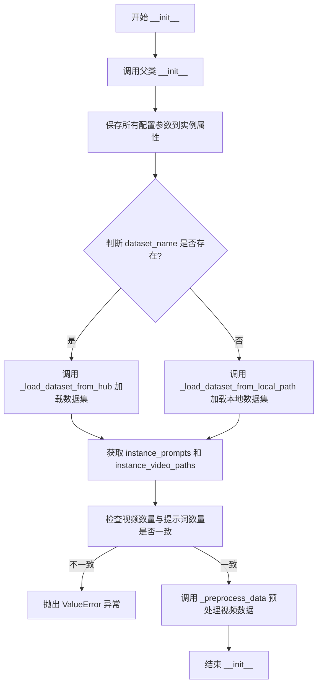

#### 带注释源码

```python
def __init__(
    self,
    instance_data_root: str | None = None,
    dataset_name: str | None = None,
    dataset_config_name: str | None = None,
    caption_column: str = "text",
    video_column: str = "video",
    height: int = 480,
    width: int = 720,
    video_reshape_mode: str = "center",
    fps: int = 8,
    max_num_frames: int = 49,
    skip_frames_start: int = 0,
    skip_frames_end: int = 0,
    cache_dir: str | None = None,
    id_token: str | None = None,
) -> None:
    """初始化 VideoDataset 实例
    
    参数:
        instance_data_root: 本地数据集根目录路径
        dataset_name: HuggingFace Hub 数据集名称
        dataset_config_name: 数据集配置名称
        caption_column: 提示词列名
        video_column: 视频路径列名
        height: 目标视频高度
        width: 目标视频宽度
        video_reshape_mode: 视频reshape模式
        fps: 视频帧率
        max_num_frames: 最大帧数
        skip_frames_start: 跳过起始帧数
        skip_frames_end: 跳过结束帧数
        cache_dir: 缓存目录
        id_token: 提示词前缀标识符
    """
    # 调用父类 Dataset 的初始化方法
    super().__init__()

    # 保存实例数据根目录，转换为 Path 对象
    self.instance_data_root = Path(instance_data_root) if instance_data_root is not None else None
    # 保存数据集相关配置
    self.dataset_name = dataset_name
    self.dataset_config_name = dataset_config_name
    self.caption_column = caption_column
    self.video_column = video_column
    # 保存视频处理参数
    self.height = height
    self.width = width
    self.video_reshape_mode = video_reshape_mode
    self.fps = fps
    self.max_num_frames = max_num_frames
    self.skip_frames_start = skip_frames_start
    self.skip_frames_end = skip_frames_end
    # 保存缓存目录和标识符
    self.cache_dir = cache_dir
    self.id_token = id_token or ""  # 确保 id_token 不为 None

    # 根据数据来源选择加载方式
    if dataset_name is not None:
        # 从 HuggingFace Hub 加载数据集
        self.instance_prompts, self.instance_video_paths = self._load_dataset_from_hub()
    else:
        # 从本地路径加载数据集
        self.instance_prompts, self.instance_video_paths = self._load_dataset_from_local_path()

    # 获取视频数量
    self.num_instance_videos = len(self.instance_video_paths)
    
    # 校验提示词数量与视频数量是否匹配
    if self.num_instance_videos != len(self.instance_prompts):
        raise ValueError(
            f"Expected length of instance prompts and videos to be the same but found {len(self.instance_prompts)=} and {len(self.instance_video_paths)=}. Please ensure that the number of caption prompts and videos match in your dataset."
        )

    # 预处理所有视频数据（解码、resize、裁剪等）
    self.instance_videos = self._preprocess_data()
```


### `VideoDataset.__len__`

返回数据集中视频实例的数量，使数据集能够被 Python 的 `len()` 函数使用，并在创建 DataLoader 时确定数据集大小。

参数：

- `self`：`VideoDataset`，隐式的当前实例参数

返回值：`int`，返回数据集中视频实例的数量

#### 流程图

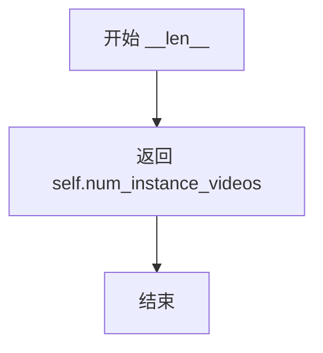

#### 带注释源码

```python
def __len__(self):
    """
    返回数据集中视频实例的数量。
    
    这是 Python 的特殊方法（dunder method），使 VideoDataset 可以被 len() 函数调用。
    DataLoader 在初始化时会调用此方法确定数据集的大小，以便进行 batch 划分和迭代。
    此方法返回的是在初始化时加载到内存中的视频数量（self.num_instance_videos），
    而非磁盘上原始视频文件的数量。
    
    Returns:
        int: 数据集中视频实例的数量，等于初始化时加载的视频数量
    """
    return self.num_instance_videos
```


### VideoDataset.__getitem__

该方法是 PyTorch Dataset 类的核心接口，用于通过索引获取数据集中的单个样本。它根据传入的索引返回对应的视频数据和提示词，供训练流程使用。

参数：

- `index`：`int`，数据集中样本的索引值，用于从预处理后的视频和提示词列表中检索对应数据

返回值：`Dict[str, Union[str, torch.Tensor]]`，返回包含 "instance_prompt" 和 "instance_video" 两个键的字典，分别对应样本的提示词和预处理后的视频数据

#### 流程图

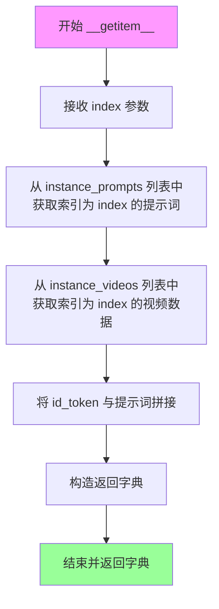

#### 带注释源码

```python
def __getitem__(self, index):
    """
    根据索引获取数据集中的单个样本。
    
    该方法是 PyTorch Dataset 类的标准接口，在 DataLoader 迭代时由框架自动调用。
    它通过索引从预处理好的视频列表和提示词列表中检索对应数据。
    
    参数:
        index: int，数据集中样本的索引值
        
    返回:
        dict: 包含以下键的字典:
            - instance_prompt: str，拼接了 id_token 的提示词文本
            - instance_video: torch.Tensor，预处理后的视频张量 [F, C, H, W]
    """
    return {
        # 将标识 token 附加到提示词开头，形成完整的输入提示
        "instance_prompt": self.id_token + self.instance_prompts[index],
        # 直接返回预处理好的视频数据（已Resize和裁剪）
        "instance_video": self.instance_videos[index],
    }
```


### `VideoDataset._load_dataset_from_hub`

该方法是 `VideoDataset` 类的核心数据加载逻辑之一，负责从 Hugging Face Hub 获取训练数据。它通过 `datasets` 库下载远程数据集，验证必要的列（视频列和标题列）是否存在，并将远程文件路径转换为本地文件系统路径。

参数（隐式于 `self`）：

- `self.dataset_name`：`str | None`，要加载的 Hugging Face 数据集名称。
- `self.dataset_config_name`：`str | None`，数据集的配置文件名。
- `self.cache_dir`：`str | None`，数据集的缓存目录。
- `self.video_column`：`str`，数据集中视频文件路径或视频数据所在的列名。
- `self.caption_column`：`str`，数据集中文本描述所在的列名。
- `self.instance_data_root`：`Path | None`，用于拼接视频文件路径的根目录。

返回值：`Tuple[List[str], List[Path]]`，返回一个元组，包含从数据集中提取的文本提示列表（`instance_prompts`）和本地视频文件路径列表（`instance_videos`）。

#### 流程图

```mermaid
flowchart TD
    A([Start _load_dataset_from_hub]) --> B{导入 datasets 库}
    B -- 失败 --> C[抛出 ImportError: 请安装 datasets 库]
    B -- 成功 --> D[调用 load_dataset 下载并加载数据集]
    D --> E[获取数据集 'train' 分裂的列名]
    E --> F{video_column 是否指定且存在于列名中?}
    F -- 是 --> G[使用指定的 video_column]
    F -- 否 --> H[默认使用第一列, 记录日志警告]
    G --> I
    H --> I
    I --> J{caption_column 是否指定且存在于列名中?}
    J -- 是 --> K[使用指定的 caption_column]
    J -- 否 --> L[默认使用第二列, 记录日志警告]
    K --> M
    L --> M
    M[提取 caption_column 对应的文本数据] --> N[提取 video_column 对应的文件路径]
    N --> O[将文件路径与 instance_data_root 拼接]
    O --> P([返回 (prompts, video_paths)_tuple])
```

#### 带注释源码

```python
def _load_dataset_from_hub(self):
    # 1. 尝试导入 Hugging Face datasets 库
    try:
        from datasets import load_dataset
    except ImportError:
        # 如果未安装，抛出明确的错误提示，指导用户安装
        raise ImportError(
            "You are trying to load your data using the datasets library. If you wish to train using custom "
            "captions please install the datasets library: `pip install datasets`. If you wish to load a "
            "local folder containing images only, specify --instance_data_root instead."
        )

    # 2. 使用提供的参数从 Hub 加载数据集
    # 这里是一个阻塞操作，会下载数据集（如果未缓存）
    dataset = load_dataset(
        self.dataset_name,
        self.dataset_config_name,
        cache_dir=self.cache_dir,
    )
    
    # 3. 获取训练集的列名元数据
    column_names = dataset["train"].column_names

    # 4. 验证并确定视频列
    # 逻辑：优先使用用户指定的列名，如果未指定或不存在，则回退到第一列
    if self.video_column is None:
        video_column = column_names[0]
        logger.info(f"`video_column` defaulting to {video_column}")
    else:
        video_column = self.video_column
        if video_column not in column_names:
            # 如果指定的列名不存在，抛出具体的错误信息
            raise ValueError(
                f"`--video_column` value '{video_column}' not found in dataset columns. Dataset columns are: {', '.join(column_names)}"
            )

    # 5. 验证并确定标题列
    # 逻辑：同上，回退到第二列（假设第一列是视频）
    if self.caption_column is None:
        caption_column = column_names[1]
        logger.info(f"`caption_column` defaulting to {caption_column}")
    else:
        caption_column = self.caption_column
        if self.caption_column not in column_names:
            raise ValueError(
                f"`--caption_column` value '{self.caption_column}' not found in dataset columns. Dataset columns are: {', '.join(column_names)}"
            )

    # 6. 提取数据
    # 提取文本描述列表
    instance_prompts = dataset["train"][caption_column]
    
    # 提取视频文件名/路径列表，并将其转换为本地绝对路径
    # 注意：这里只是构建 Path 对象，实际文件访问可能在 _preprocess_data 中进行
    instance_videos = [Path(self.instance_data_root, filepath) for filepath in dataset["train"][video_column]]

    # 7. 返回提取的提示词和视频路径
    return instance_prompts, instance_videos
```

#### 潜在的技术债务与优化空间

1.  **硬编码的 Split 名称**：代码硬编码了 `dataset["train"]`，假设数据集总是有 "train" split。如果数据集只有 "test" 或自定义 split，会导致 `KeyError`。
2.  **列名回退逻辑脆弱**：默认取 `column_names[0]` 和 `column_names[1]` 是非常脆弱的假设。如果数据集只有一列，或者视频和文本的顺序不同，会导致数据对应错误。
3.  **路径拼接假设**：假设 `video_column` 中的数据是相对路径，并直接与 `instance_data_root` 拼接。如果 `video_column` 存储的已经是绝对路径，或者数据结构不同（如包含 URL），会导致路径错误。
4.  **缺乏数据校验**：该方法只负责加载元数据（路径和文本），并不校验视频文件是否真的存在于磁盘上。这个校验被留给了后续的 `_preprocess_data` 或 `__init__` 流程，如果文件大量缺失，直到训练时才会发现，会造成资源浪费。


### `VideoDataset._load_dataset_from_local_path`

该方法用于从本地文件系统中加载视频数据集。它通过读取指定的提示文件和视频路径文件来获取训练数据，支持逐行读取文本提示和视频文件路径，并返回所有提示和对应的视频路径列表。

参数：无显式参数（使用实例属性 `self.instance_data_root`、`self.caption_column` 和 `self.video_column`）

返回值：`Tuple[List[str], List[Path]]`，返回两个列表——第一个是文本提示列表，第二个是对应的视频路径对象列表

#### 流程图

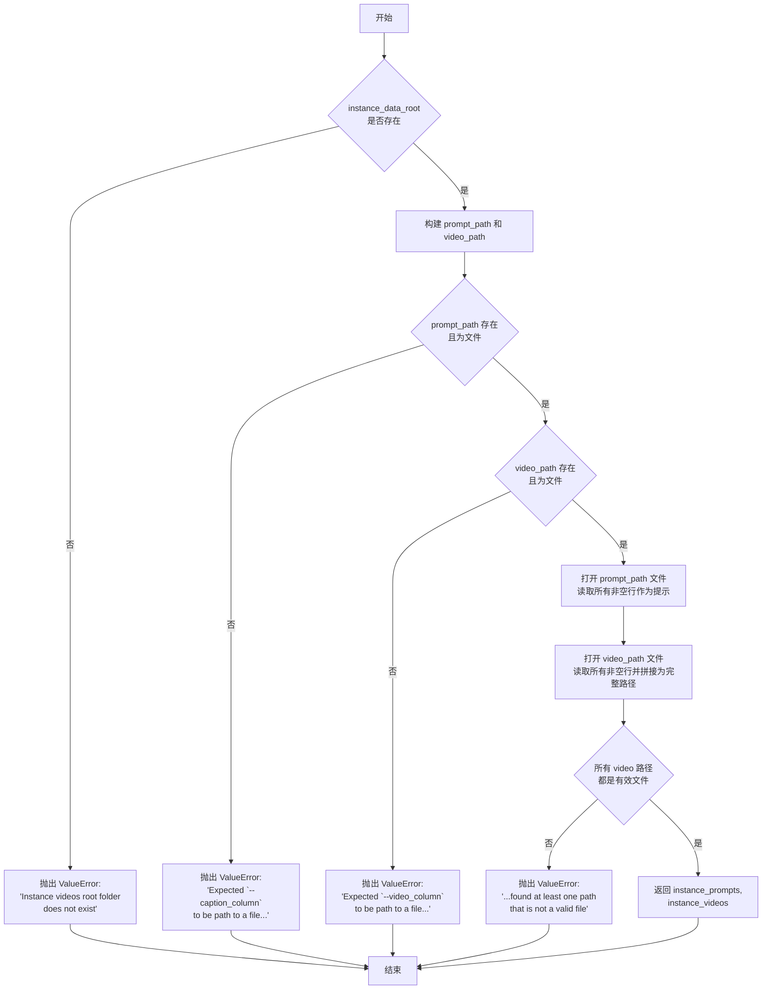

#### 带注释源码

```python
def _load_dataset_from_local_path(self):
    # 检查实例数据根目录是否存在
    if not self.instance_data_root.exists():
        raise ValueError("Instance videos root folder does not exist")

    # 根据 caption_column 和 video_column 构建提示文件和视频文件的完整路径
    prompt_path = self.instance_data_root.joinpath(self.caption_column)
    video_path = self.instance_data_root.joinpath(self.video_column)

    # 验证提示文件是否存在且为文件类型
    if not prompt_path.exists() or not prompt_path.is_file():
        raise ValueError(
            "Expected `--caption_column` to be path to a file in `--instance_data_root` containing line-separated text prompts."
        )
    
    # 验证视频路径文件是否存在且为文件类型
    if not video_path.exists() or not video_path.is_file():
        raise ValueError(
            "Expected `--video_column` to be path to a file in `--instance_data_root` containing line-separated paths to video data in the same directory."
        )

    # 读取提示文件，逐行读取并去除空白字符，过滤空行
    with open(prompt_path, "r", encoding="utf-8") as file:
        instance_prompts = [line.strip() for line in file.readlines() if len(line.strip()) > 0]
    
    # 读取视频路径文件，将每行路径与 instance_data_root 拼接成完整路径，过滤空行
    with open(video_path, "r", encoding="utf-8") as file:
        instance_videos = [
            self.instance_data_root.joinpath(line.strip()) for line in file.readlines() if len(line.strip()) > 0
        ]

    # 验证所有视频路径是否指向有效文件
    if any(not path.is_file() for path in instance_videos):
        raise ValueError(
            "Expected '--video_column' to be a path to a file in `--instance_data_root` containing line-separated paths to video data but found at least one path that is not a valid file."
        )

    # 返回提示列表和视频路径列表
    return instance_prompts, instance_videos
```


### VideoDataset._resize_for_rectangle_crop

该方法负责将视频帧数组调整为指定的矩形尺寸并执行裁剪操作，确保输出符合模型训练所需的目标分辨率（height×width），同时支持中心裁剪和随机裁剪两种模式。

参数：

- `self`：VideoDataset 类实例本身，包含数据集的配置信息
- `arr`：`torch.Tensor`，形状为 [F, C, H, W] 的视频帧数组，其中 F 为帧数，C 为通道数，H 和 W 分别为帧的高度和宽度

返回值：`torch.Tensor`，裁剪后的视频帧数组，形状为 [F, C, height, width]，其中 height 和 width 分别为目标高度和宽度

#### 流程图

```mermaid
flowchart TD
    A[开始: _resize_for_rectangle_crop] --> B[获取目标尺寸 image_size = (self.height, self.width)]
    B --> C[获取重塑模式 reshape_mode = self.video_reshape_mode]
    C --> D{判断宽高比: arr.shape[3]/arr.shape[2] > image_size[1]/image_size[0]?}
    D -->|Yes| E[按高度resize: size=[height, int width * height / orig_width]]
    D -->|No| F[按宽度resize: size=[int height * width / orig_height, width]]
    E --> G[使用双线性插值 InterpolationMode.BICUBIC 执行resize]
    F --> G
    G --> H[获取resize后尺寸: h=arr.shape[2], w=arr.shape[3]]
    H --> I[移除批次维度: arr = arr.squeeze0]
    I --> J[计算裁剪偏移: delta_h = h - height, delta_w = w - width]
    J --> K{reshape_mode?}
    K -->|random| L[随机裁剪: top=randint0-delta_h, left=randint0-delta_w]
    K -->|none| L
    K -->|center| M[中心裁剪: top=delta_h//2, left=delta_w//2]
    K -->|其他| N[抛出NotImplementedError异常]
    L --> O[执行裁剪: TT.functional.crop]
    M --> O
    O --> P[返回裁剪后的数组]
```

#### 带注释源码

```python
def _resize_for_rectangle_crop(self, arr):
    """
    对视频帧进行矩形裁剪以匹配目标尺寸
    
    Args:
        arr: torch.Tensor, 形状为 [F, C, H, W] 的视频帧数组
        
    Returns:
        torch.Tensor: 裁剪后的视频帧数组，形状为 [F, C, height, width]
    """
    # 获取目标尺寸（从实例属性中读取训练配置的目标高度和宽度）
    image_size = self.height, self.width
    # 获取重塑模式（center、random 或 none）
    reshape_mode = self.video_reshape_mode
    
    # 计算输入帧的宽高比与目标尺寸宽高比的比值
    # arr.shape[3] 是宽度 W，arr.shape[2] 是高度 H
    if arr.shape[3] / arr.shape[2] > image_size[1] / image_size[0]:
        # 如果输入帧更宽，则以高度为基准进行缩放，保持纵横比
        # 计算新的宽度：原宽度 * (目标高度 / 原高度)
        arr = resize(
            arr,
            size=[image_size[0], int(arr.shape[3] * image_size[0] / arr.shape[2])],
            interpolation=InterpolationMode.BICUBIC,  # 使用双三次插值保证质量
        )
    else:
        # 如果输入帧更高，则以宽度为基准进行缩放
        # 计算新的高度：原高度 * (目标宽度 / 原宽度)
        arr = resize(
            arr,
            size=[int(arr.shape[2] * image_size[1] / arr.shape[3]), image_size[1]],
            interpolation=InterpolationMode.BICUBIC,
        )

    # 获取resize后的实际高度和宽度
    h, w = arr.shape[2], arr.shape[3]
    # 移除批次维度（squeeze操作将形状为[1, C, H, W]的数组变为[C, H, W]）
    # 注意：此处假设arr的批次维度始终为1
    arr = arr.squeeze(0)

    # 计算需要裁剪的像素数量
    delta_h = h - image_size[0]  # 高度方向多余的像素
    delta_w = w - image_size[1]  # 宽度方向多余的像素

    # 根据reshape_mode确定裁剪起始位置
    if reshape_mode == "random" or reshape_mode == "none":
        # 随机模式：在允许的范围内随机选择裁剪起始位置
        # np.random.randint生成[0, delta_h+1)范围内的整数
        top = np.random.randint(0, delta_h + 1)
        left = np.random.randint(0, delta_w + 1)
    elif reshape_mode == "center":
        # 中心模式：计算中心点作为裁剪起始位置
        top, left = delta_h // 2, delta_w // 2
    else:
        # 不支持的模式抛出异常
        raise NotImplementedError
    
    # 执行实际的裁剪操作，从(top, left)位置开始裁剪出指定高度和宽度的区域
    arr = TT.functional.crop(arr, top=top, left=left, height=image_size[0], width=image_size[1])
    return arr
```


### `VideoDataset._preprocess_data`

该方法负责将视频文件加载到内存中并进行预处理，包括视频帧采样、归一化、尺寸调整和裁剪，以适配 CogVideoX 模型的训练需求。

参数：无（仅使用 `self` 实例属性）

返回值：`list[torch.Tensor]`，返回预处理后的视频帧列表，每个元素为 `[F, C, H, W]` 形状的张量

#### 流程图

```mermaid
flowchart TD
    A[开始 _preprocess_data] --> B{导入 decord 库}
    B -->|成功| C[设置 decord 桥接为 torch]
    B -->|失败| D[抛出 ImportError]
    D --> Z[结束]
    
    C --> E[初始化 tqdm 进度条和空视频列表]
    
    F[遍历 instance_video_paths] --> G[使用 decord 读取视频]
    G --> H[计算起始帧和结束帧]
    H --> I{判断帧数范围}
    I -->|end_frame <= start_frame| J[获取单帧]
    I -->|帧数 <= max_num_frames| K[获取连续帧]
    I -->|帧数 > max_num_frames| L[均匀采样帧]
    
    J --> M[截断到 max_num_frames]
    K --> M
    L --> M
    
    M --> N[调整帧数以满足 4k+1 要求]
    N --> O[归一化帧值到 -1, 1]
    O --> P[转换维度顺序为 [F, C, H, W]]
    P --> Q[调用 _resize_for_rectangle_crop 裁剪]
    Q --> R[追加到视频列表并更新进度条]
    R --> F
    
    F --> S[关闭进度条]
    S --> T[返回视频列表]
    T --> Z
```

#### 带注释源码

```python
def _preprocess_data(self):
    """
    预处理视频数据：加载、采样、归一化、调整尺寸和裁剪
    
    Returns:
        videos: 预处理后的视频帧列表，每个元素形状为 [F, C, H, W]
    """
    # 1. 导入并检查 decord 库（用于视频加载）
    try:
        import decord
    except ImportError:
        raise ImportError(
            "The `decord` package is required for loading the video dataset. Install with `pip install decord`"
        )

    # 2. 设置 decord 使用 torch 作为桥接（返回 torch.Tensor）
    decord.bridge.set_bridge("torch")

    # 3. 初始化进度条
    progress_dataset_bar = tqdm(
        range(0, len(self.instance_video_paths)),
        desc="Loading progress resize and crop videos",
    )
    videos = []

    # 4. 遍历每个视频文件进行预处理
    for filename in self.instance_video_paths:
        # 4.1 使用 decord 读取视频
        video_reader = decord.VideoReader(uri=filename.as_posix())
        video_num_frames = len(video_reader)

        # 4.2 计算起始和结束帧（考虑跳过帧数配置）
        start_frame = min(self.skip_frames_start, video_num_frames)
        end_frame = max(0, video_num_frames - self.skip_frames_end)
        
        # 4.3 根据帧数范围选择采样策略
        if end_frame <= start_frame:
            # 只有一个有效帧
            frames = video_reader.get_batch([start_frame])
        elif end_frame - start_frame <= self.max_num_frames:
            # 帧数足够，直接获取连续帧
            frames = video_reader.get_batch(list(range(start_frame, end_frame)))
        else:
            # 帧数过多，均匀采样到 max_num_frames
            indices = list(range(start_frame, end_frame, (end_frame - start_frame) // self.max_num_frames))
            frames = video_reader.get_batch(indices)

        # 4.4 确保不超过最大帧数限制
        frames = frames[: self.max_num_frames]
        selected_num_frames = frames.shape[0]

        # 4.5 VAE 要求：选择 (4k + 1) 帧（k>=0，即 1, 5, 9, 13...）
        # 计算需要截断的余数，使帧数满足 4k+1 格式
        remainder = (3 + (selected_num_frames % 4)) % 4
        if remainder != 0:
            frames = frames[:-remainder]
        selected_num_frames = frames.shape[0]

        # 4.6 验证帧数符合 VAE 要求
        assert (selected_num_frames - 1) % 4 == 0

        # 4.7 训练变换：归一化到 [-1, 1]
        frames = (frames - 127.5) / 127.5
        
        # 4.8 转换维度顺序：从 [F, H, W, C] 变为 [F, C, H, W]
        frames = frames.permute(0, 3, 1, 2)  # [F, C, H, W]
        
        # 4.9 更新进度条描述
        progress_dataset_bar.set_description(
            f"Loading progress Resizing video from {frames.shape[2]}x{frames.shape[3]} to {self.height}x{self.width}"
        )
        
        # 4.10 调整尺寸并裁剪到目标分辨率
        frames = self._resize_for_rectangle_crop(frames)
        
        # 4.11 确保内存连续并添加到列表
        videos.append(frames.contiguous())  # [F, C, H, W]
        progress_dataset_bar.update(1)

    # 5. 关闭进度条并返回结果
    progress_dataset_bar.close()
    return videos
```

## 关键组件


### VideoDataset

视频数据加载与预处理类，负责从本地路径或Hub加载视频数据，并进行尺寸调整、裁剪、帧数选择等预处理操作。

### get_args

命令行参数解析函数，定义了大量用于配置模型、数据集、训练过程、验证、Optimizer等各方面的参数。

### log_validation

验证函数，在训练过程中定期运行验证，生成视频样本并记录到tracker（如wandb）中。

### _get_t5_prompt_embeds

T5文本编码函数，将文本提示转换为embedding向量，支持批量处理和每个提示多个视频的复制。

### encode_prompt

提示编码封装函数，调用_get_t5_prompt_embeds完成实际的编码工作。

### compute_prompt_embeddings

计算提示嵌入的函数，支持是否需要梯度的模式，用于训练时获取文本嵌入。

### prepare_rotary_positional_embeddings

准备旋转位置嵌入的函数，用于3D视频的时空位置编码，计算网格尺寸和频率。

### get_optimizer

优化器工厂函数，支持Adam、AdamW、8-bit Adam和Prodigy等多种优化器，并处理DeepSpeed场景。

### main

主训练函数，涵盖模型加载、LoRA配置、数据准备、训练循环、验证、模型保存等完整流程。

### save_model_card

保存模型卡片的函数，生成包含模型描述、使用方法和许可证信息的README文件。

### VideoDataset._preprocess_data

视频预处理核心方法，使用decord读取视频，进行帧采样、归一化、尺寸调整和裁剪。

### VideoDataset._resize_for_rectangle_crop

矩形裁剪调整函数，根据视频形状和目标尺寸进行resize和center/random裁剪。


## 问题及建议


### 已知问题

-   **内存爆炸风险**：`VideoDataset._preprocess_data()` 在初始化时将所有视频预处理并加载到内存，对于大规模训练数据集可能导致内存不足
-   **串行视频编码**：视频的VAE编码过程在主进程中串行执行，没有利用分布式训练的优势，编码效率低下
-   **主函数过于庞大**：`main()` 函数超过600行，混合了数据准备、模型加载、训练循环、验证等多种职责，缺乏模块化设计
-   **重复代码**：`log_validation` 函数在训练循环中和训练结束后被调用，代码逻辑重复，可提取为通用模块
- **缺乏视频完整性检查**：视频加载时没有检查文件是否损坏或为空，可能导致运行时错误
- **硬编码配置值**：多处使用硬编码值（如 `max_sequence_length=226`），缺乏配置灵活性
- **LoRA目标模块固定**：LoRA配置的 `target_modules` 硬编码为 `["to_k", "to_q", "to_v", "to_out.0"]`，不支持灵活配置
- **checkpoint管理缺陷**：checkpoint清理逻辑在每个checkpoint步骤都执行全量扫描，效率较低

### 优化建议

-   **实现流式视频加载**：将视频预处理改为按需加载（lazy loading），或使用内存映射、迭代器模式处理大规模视频数据
-   **分布式视频编码**：利用 `accelerator` 的分布式能力对视频进行并行编码，或使用 `torch.utils.data.DataLoader` 的 `prefetch_factor`
-   **模块化重构**：将 `main()` 函数拆分为独立函数，如 `prepare_models()`, `setup_dataset()`, `training_loop()`, `run_validation()`
-   **添加视频验证**：在 `VideoDataset` 中添加视频完整性检查和异常处理机制
-   **配置参数化**：将硬编码值提取为命令行参数或配置文件
-   **动态LoRA配置**：允许通过参数配置LoRA的目标模块
-   **优化checkpoint管理**：使用双向链表或日志记录方式管理checkpoint，避免每次全量扫描
-   **添加数据类型验证**：增强参数校验逻辑，确保关键参数的有效性

## 其它


### 设计目标与约束

**设计目标**：使用 LoRA（Low-Rank Adaptation）技术对 CogVideoX 文本到视频扩散模型进行微调训练，实现针对特定领域或风格的视频生成能力。

**约束条件**：
- 基础模型仅支持 CogVideoX-2b（float16）或 CogVideoX-5b（bfloat16）权重
- 仅训练 LoRA 适配器层，保持原始模型参数不变
- 训练数据必须是视频格式，支持本地路径或 HuggingFace Hub 数据集
- 需要 GPU 显存至少 16GB（fp16）或 24GB（bfloat16）
- 不支持 Apple MPS 平台的 bfloat16 混合精度训练

### 错误处理与异常设计

**导入错误处理**：
- `datasets` 库缺失时提示安装：`pip install datasets`
- `decord` 库缺失时提示安装：`pip install decord`
- `bitsandbytes` 库缺失时提示安装（使用 8-bit Adam 时）：`pip install bitsandbytes`
- `prodigyopt` 库缺失时提示安装（使用 Prodigy 优化器时）：`pip install prodigyopt`

**数据加载错误处理**：
- 视频数量与提示词数量不匹配时抛出 `ValueError`
- 数据集列名不存在时抛出 `ValueError` 并列出可用列名
- 本地路径不存在或文件无效时抛出 `ValueError`

**运行时错误处理**：
- bfloat16 在 MPS 上不支持时抛出 `ValueError`
- wandb 和 hub_token 同时使用时抛出 `ValueError`（安全风险）
- 断点续训时路径不存在则开始新训练

### 数据流与状态机

**训练主流程状态机**：
```
初始化 → 加载数据 → 预处理视频 → 编码提示词 → 
主循环（epoch → step → 前向传播 → 反向传播 → 优化器更新） →
验证（可选） → 保存检查点 → 最终验证 → 保存模型 → 推送到Hub（可选）
```

**关键数据流**：
1. 原始视频 → VideoDataset._preprocess_data() → 预处理后的张量
2. 预处理视频 → vae.encode() → 潜在空间表示
3. 文本提示 → T5EncoderModel → 提示嵌入向量
4. 潜在表示 + 噪声 + 时间步 → Transformer → 噪声预测
5. 噪声预测 → 损失计算 → 反向传播 → 参数更新

### 外部依赖与接口契约

**核心依赖**：
- `diffusers >= 0.37.0.dev0`：扩散模型框架
- `transformers`：T5 文本编码器
- `accelerate`：分布式训练加速
- `peft`：LoRA 适配器管理
- `torch`：深度学习框架
- `torchvision`：视频变换
- `numpy`：数值计算
- `decord`：视频解码（必需）
- `tqdm`：进度条

**模型接口**：
- 输入：视频文件路径/URL、文本提示、训练超参数
- 输出：LoRA 权重文件、训练日志、验证视频
- HuggingFace Hub：支持模型卡片自动生成和推送

### 性能优化策略

**显存优化**：
- VAE slicing（`--enable_slicing`）：分片编码潜在表示
- VAE tiling（`--enable_tiling`）：分片解码
- 梯度检查点（`--gradient_checkpointing`）：以时间换显存

**训练加速**：
- 混合精度（fp16/bf16）：减少显存和加速计算
- TF32 on Ampere GPU：矩阵乘法加速
- DeepSpeed 支持：分布式训练和优化器卸载

### 安全性与合规性

**安全检查**：
- wandb 和 hub_token 不能同时使用（防止 token 泄露）
- 敏感信息不写入日志

**合规性**：
- 遵循 Apache 2.0 许可证
- CogVideoX 模型需遵守特定许可条款
- 生成的模型卡片包含许可证信息

### 可扩展性设计

**LoRA 配置扩展**：
- 可配置的目标模块（默认：`to_k, to_q, to_v, to_out.0`）
- 支持多个 LoRA 适配器叠加

**数据源扩展**：
- 支持 HuggingFace Hub 数据集
- 支持本地文件系统
- 可扩展支持其他视频加载后端

### 部署与运维

**检查点管理**：
- 自动保存检查点（`--checkpointing_steps`）
- 自动清理旧检查点（`--checkpoints_total_limit`）
- 支持从最新检查点恢复训练

**监控与日志**：
- 支持 TensorBoard、WandB、CometML
- 训练指标实时记录（loss、learning rate）
- 验证过程生成示例视频
    