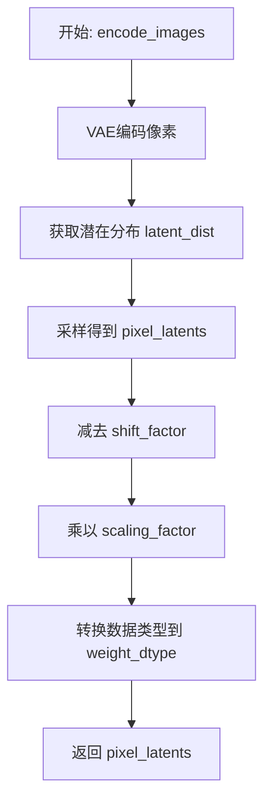
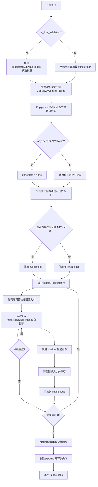
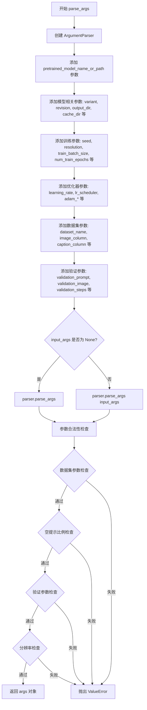
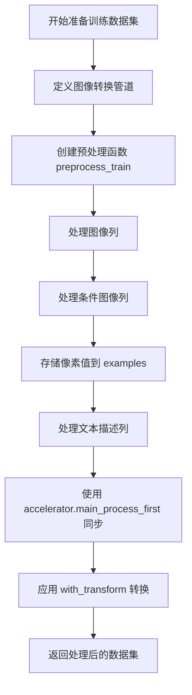
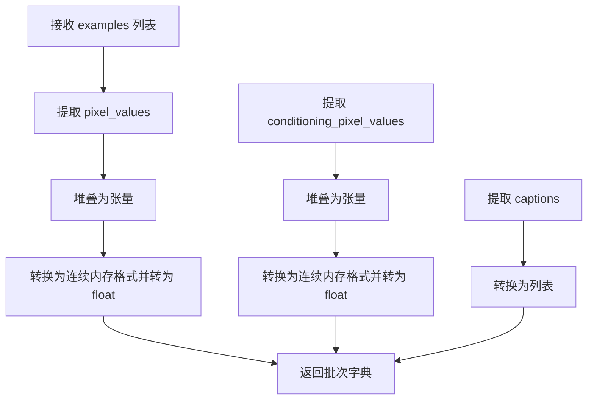

```mermaid
flowchart TD
    A[开始 main 函数] --> B[验证参数: wandb + hub_token]
    B --> C[创建日志输出目录]
    C --> D{MPS + bf16 检查}
    D -->|是| E[报错: 不支持 bf16]
    D -->|否| F[初始化 Accelerator]
    F --> G[配置日志级别]
    G --> H[设置随机种子]
    H --> I{主进程?}
    I -->|是| J[创建输出目录]
    I -->|否| K[跳过]
    J --> K
    K --> L[加载 VAE 模型]
    L --> M[加载 CogView4Transformer2DModel]
    M --> N[加载 FlowMatchEulerDiscreteScheduler]
    N --> O[配置模型: 修改 patch_embed 支持控制图像]
    O --> P{启用 gradient_checkpointing?}
    P -->|是| Q[启用梯度检查点]
    P -->|否| R[跳过]
    Q --> R
    R --> S{使用 8-bit Adam?}
    S -->|是| T[使用 bnb.optim.AdamW8bit]
    S -->|否| U[使用 torch.optim.AdamW]
    T --> V[创建优化器]
    U --> V
    V --> W[获取训练数据集]
    W --> X[准备数据集: 图像变换]
    X --> Y[创建 DataLoader]
    Y --> Z[创建学习率调度器]
    Z --> AA[使用 accelerator.prepare 准备模型/优化器/数据]
    AA --> AB{从检查点恢复?}
    AB -->|是| AC[加载检查点状态]
    AB -->|否| AD[初始化训练步骤]
    AC --> AD
    AD --> AE[初始化跟踪器]
    AE --> AF[开始训练循环: for epoch in range]
    AF --> AG[遍历训练数据: for step, batch in enumerate]
    AG --> AH[accumulate 上下文]
    AH --> AI[编码图像到 latent 空间]
    AI --> AJ[采样时间步]
    AJ --> AK[添加噪声]
    AK --> AL[编码文本 prompt]
    AL --> AM[前向传播: transformer]
    AM --> AN[计算 flow-matching 损失]
    AN --> AO[反向传播: accelerator.backward]
    AO --> AP{同步梯度?}
    AP -->|是| AQ[梯度裁剪]
    AP -->|否| AR[跳过]
    AQ --> AS[优化器步骤]
    AS --> AT[学习率调度器步骤]
    AT --> AU[优化器清零梯度]
    AU --> AV{达到最大训练步数?}
    AV -->|否| AG
    AV -->|是| AW[等待所有进程: accelerator.wait_for_everyone]
    AW --> AX{主进程?}
    AX -->|否| AY[结束训练]
    AX -->|是| AZ[保存最终模型]
    AZ --> BA[执行最终验证]
    BA --> BB{推送到 Hub?}
    BB -->|是| BC[保存模型卡片并上传]
    BB -->|否| AY
    BC --> AY
```

# `diffusers\examples\cogview4-control\train_control_cogview4.py` 详细设计文档

这是一个用于训练CogView4控制模型的脚本，通过使用控制图像（conditioning image）来控制文本到图像的生成过程。脚本支持多种训练参数配置，包括学习率调度、梯度累积、混合精度训练、模型检查点保存以及验证流程，最终保存训练好的transformer模型并可选择推送到HuggingFace Hub。

## 整体流程

```mermaid
graph TD
    A[开始] --> B[parse_args 解析命令行参数]
    B --> C[main 函数入口]
    C --> D{检查WandB和Hub Token}
    D --> E[创建Accelerator加速器]
    E --> F[加载预训练模型: VAE + CogView4Transformer]
    F --> G[加载噪声调度器FlowMatchEulerDiscreteScheduler]
    G --> H[配置权重数据类型fp16/bf16]
    H --> I[修改patch_embed以支持双通道输入]
    I --> J[准备优化器AdamW]
    J --> K[获取并准备训练数据集]
    K --> L[创建DataLoader]
    L --> M[获取学习率调度器]
    M --> N[accelerator.prepare 准备所有组件]
    N --> O{是否有checkpoint需要恢复}
    O -- 是 --> P[加载checkpoint状态]
    O -- 否 --> Q[初始化训练步数]
    P --> R[开始训练循环]
    Q --> R
    R --> S{遍历每个epoch}
    S --> T[遍历每个batch]
    T --> U[encode_images编码图像和条件图像]
    U --> V[采样随机timestep]
    V --> W[添加噪声到潜在表示]
    W --> X[编码文本prompts]
    X --> Y[cogview4_transformer前向传播]
    Y --> Z[计算flow-matching损失]
    Z --> AA[accelerator.backward反向传播]
    AA --> AB[梯度裁剪和优化器更新]
    AB --> AC{检查是否需要保存checkpoint}
    AC -- 是 --> AD[保存checkpoint]
    AC -- 否 --> AE{检查是否需要验证}
    AE -- 是 --> AF[log_validation运行验证]
    AE -- 否 --> AG[更新进度条]
    AD --> AG
    AF --> AG
    AG --> AH{是否达到最大训练步数}
    AH -- 否 --> T
    AH -- 是 --> AI[训练结束]
    AI --> AJ[保存最终模型]
    AJ --> AK[运行最终验证]
    AK --> AL{是否push_to_hub}
    AL -- 是 --> AM[保存model card并上传]
    AL -- 否 --> AN[结束]
```



## 类结构

```
train_cogview4_control.py (主脚本模块)
├── 全局变量
│   ├── logger (logging.get_logger)
│   └── NORM_LAYER_PREFIXES (列表)
├── 全局函数
│   ├── encode_images (图像编码)
│   ├── log_validation (验证流程)
│   ├── save_model_card (保存模型卡片)
│   ├── parse_args (参数解析)
│   ├── get_train_dataset (获取数据集)
│   ├── prepare_train_dataset (准备数据集)
│   ├── collate_fn (数据整理)
│   └── main (主训练函数)
└── 外部依赖模块
    ├── diffusers (AutoencoderKL, CogView4ControlPipeline, CogView4Transformer2DModel, FlowMatchEulerDiscreteScheduler)
    ├── transformers (tokenizer等)
    ├── accelerate (Accelerator, 分布式训练)
    ├── datasets (load_dataset)
    └── torch (神经网络基础)
```

## 全局变量及字段


### `logger`
    
用于记录训练过程中各类日志信息的日志记录器对象，通过accelerate库的get_logger创建

类型：`logging.Logger`
    


### `NORM_LAYER_PREFIXES`
    
包含规范层前缀名称的列表，用于在训练过程中识别和处理特定的规范化层

类型：`List[str]`
    


    

## 全局函数及方法


### `encode_images`

该函数负责将输入的像素图像编码到潜空间（latent space），通过VAE编码器提取特征并进行缩放处理，以适配后续扩散模型的潜空间表示。

参数：

- `pixels`：`torch.Tensor`，输入的像素图像张量，通常为经过归一化处理的图像数据
- `vae`：`torch.nn.Module`，变分自编码器（VAE）模型，用于将像素空间映射到潜空间
- `weight_dtype`：`torch.dtype`（隐式参数），目标数据类型，用于指定输出潜变量的精度（如float16、bfloat16等）

返回值：`torch.Tensor`，编码后的潜变量张量，已完成缩放和类型转换

#### 流程图



#### 带注释源码

```python
def encode_images(pixels: torch.Tensor, vae: torch.nn.Module, weight_dtype):
    # 使用VAE编码器将像素图像编码到潜空间
    # encode方法返回潜空间分布（latent_dist），包含mean和logvar参数
    pixel_latents = vae.encode(pixels.to(vae.dtype)).latent_dist.sample()
    
    # 应用VAE配置中的缩放因子进行归一化处理
    # 这确保了潜空间数值范围与扩散模型的期望一致
    pixel_latents = (pixel_latents - vae.config.shift_factor) * vae.config.scaling_factor
    
    # 将潜变量转换到指定的权重数据类型（如fp16/bf16）以节省显存
    return pixel_latents.to(weight_dtype)
```


### `log_validation`

该函数负责在训练过程中运行验证流程，通过加载 CogView4ControlPipeline 并使用训练好的 transformer 模型生成验证图像，同时将生成的图像记录到 TensorBoard 或 WandB 等跟踪工具中。

参数：

- `cogview4_transformer`：`CogView4Transformer2DModel`，训练中的 transformer 模型，用于非最终验证时进行推理
- `args`：`argparse.Namespace`，包含所有训练参数（如模型路径、分辨率、推理步数等）
- `accelerator`：`Accelerator`，HuggingFace Accelerate 库提供的分布式训练加速器，用于模型管理和设备操作
- `weight_dtype`：`torch.dtype`，模型权重的数据类型（fp16/bf16/fp32）
- `step`：`int`，当前训练步数，用于记录到跟踪器
- `is_final_validation`：`bool`，标志位，True 表示训练结束后的最终验证，会从输出目录加载模型

返回值：`List[Dict]`，验证日志列表，每个元素包含 `validation_image`（条件图像）、`images`（生成的图像列表）和 `validation_prompt`（验证提示词）

#### 流程图



#### 带注释源码

```python
def log_validation(cogview4_transformer, args, accelerator, weight_dtype, step, is_final_validation=False):
    """
    在训练过程中运行验证，生成并记录验证图像。
    
    参数:
        cogview4_transformer: 训练中的 CogView4Transformer2DModel 实例
        args: 包含训练和验证配置的参数对象
        accelerator: Accelerate 库的训练加速器
        weight_dtype: 模型权重数据类型
        step: 当前训练步数
        is_final_validation: 是否为训练结束后的最终验证
    """
    logger.info("Running validation... ")

    # 根据是否为最终验证选择不同的模型加载方式
    if not is_final_validation:
        # 非最终验证：从 accelerator 获取解包后的模型
        cogview4_transformer = accelerator.unwrap_model(cogview4_transformer)
        # 从预训练模型路径加载完整的 pipeline，使用传入的 transformer
        pipeline = CogView4ControlPipeline.from_pretrained(
            args.pretrained_model_name_or_path,
            transformer=cogview4_transformer,
            torch_dtype=weight_dtype,
        )
    else:
        # 最终验证：从输出目录加载已训练的 transformer
        transformer = CogView4Transformer2DModel.from_pretrained(args.output_dir, torch_dtype=weight_dtype)
        pipeline = CogView4ControlPipeline.from_pretrained(
            args.pretrained_model_name_or_path,
            transformer=transformer,
            torch_dtype=weight_dtype,
        )

    # 将 pipeline 移动到训练设备并禁用进度条显示
    pipeline.to(accelerator.device)
    pipeline.set_progress_bar_config(disable=True)

    # 根据是否设置种子来决定是否使用确定性生成
    if args.seed is None:
        generator = None
    else:
        # 使用指定种子创建生成器以确保可复现性
        generator = torch.Generator(device=accelerator.device).manual_seed(args.seed)

    # 验证图像和提示词的配对逻辑处理
    # 支持三种情况：数量相等、只有一张图像、只有一张提示词
    if len(args.validation_image) == len(args.validation_prompt):
        validation_images = args.validation_image
        validation_prompts = args.validation_prompt
    elif len(args.validation_image) == 1:
        # 单张图像配多张提示词，复制图像
        validation_images = args.validation_image * len(args.validation_prompt)
        validation_prompts = args.validation_prompt
    elif len(args.validation_prompt) == 1:
        # 单张提示词配多张图像，复制提示词
        validation_images = args.validation_image
        validation_prompts = args.validation_prompt * len(args.validation_image)
    else:
        raise ValueError(
            "number of `args.validation_image` and `args.validation_prompt` should be checked in `parse_args`"
        )

    # 初始化验证日志列表
    image_logs = []
    
    # 选择合适的 autocast 上下文：MPS 设备或最终验证时使用 nullcontext
    # 否则使用 torch.autocast 进行混合精度推理
    if is_final_validation or torch.backends.mps.is_available():
        autocast_ctx = nullcontext()
    else:
        autocast_ctx = torch.autocast(accelerator.device.type, weight_dtype)

    # 遍历每个验证提示词和条件图像对
    for validation_prompt, validation_image in zip(validation_prompts, validation_images):
        # 加载验证图像并调整到指定分辨率
        validation_image = load_image(validation_image)
        # 可能需要在 1024 分辨率上推理以获得更好的图像质量
        validation_image = validation_image.resize((args.resolution, args.resolution))

        images = []

        # 生成多张验证图像
        for _ in range(args.num_validation_images):
            with autocast_ctx:
                # 调用 pipeline 进行图像生成
                image = pipeline(
                    prompt=validation_prompt,
                    control_image=validation_image,
                    num_inference_steps=50,
                    guidance_scale=args.guidance_scale,
                    max_sequence_length=args.max_sequence_length,
                    generator=generator,
                    height=args.resolution,
                    width=args.resolution,
                ).images[0]
            # 调整生成图像的大小
            image = image.resize((args.resolution, args.resolution))
            images.append(image)
        
        # 将本次验证的图像和提示词添加到日志
        image_logs.append(
            {"validation_image": validation_image, "images": images, "validation_prompt": validation_prompt}
        )

    # 根据是否为最终验证选择跟踪器键名
    tracker_key = "test" if is_final_validation else "validation"
    
    # 遍历所有注册的跟踪器（TensorBoard、WandB 等）记录图像
    for tracker in accelerator.trackers:
        if tracker.name == "tensorboard":
            # TensorBoard 图像记录逻辑
            for log in image_logs:
                images = log["images"]
                validation_prompt = log["validation_prompt"]
                validation_image = log["validation_image"]
                formatted_images = []
                # 首先添加条件图像
                formatted_images.append(np.asarray(validation_image))
                # 然后添加所有生成的图像
                for image in images:
                    formatted_images.append(np.asarray(image))
                # 堆叠图像数组
                formatted_images = np.stack(formatted_images)
                # 写入 TensorBoard，格式为 NHWC
                tracker.writer.add_images(validation_prompt, formatted_images, step, dataformats="NHWC")

        elif tracker.name == "wandb":
            # WandB 图像记录逻辑
            formatted_images = []
            for log in image_logs:
                images = log["images"]
                validation_prompt = log["validation_prompt"]
                validation_image = log["validation_image"]
                # 添加条件图像（带标题）
                formatted_images.append(wandb.Image(validation_image, caption="Conditioning"))
                # 添加每张生成的图像
                for image in images:
                    image = wandb.Image(image, caption=validation_prompt)
                    formatted_images.append(image)

            # 记录到 WandB
            tracker.log({tracker_key: formatted_images})
        else:
            # 其他跟踪器发出警告
            logger.warning(f"image logging not implemented for {tracker.name}")

        # 清理 pipeline 释放 GPU 内存
        del pipeline
        free_memory()
        # 返回验证日志供其他函数使用
        return image_logs
```


### `save_model_card`

该函数用于在训练完成后生成并保存HuggingFace Hub的模型卡片（Model Card），包括训练元数据、示例图像、描述信息以及标签，并将其保存为README.md文件到指定的输出目录。

参数：

- `repo_id`：`str`，HuggingFace Hub仓库标识符，用于指定模型在Hub上的唯一ID
- `image_logs`：`list` 或 `None`，验证过程中生成的图像日志列表，包含验证图像和生成的图像，默认为None
- `base_model`：`str`，基础预训练模型的名称或路径，用于说明模型是基于哪个模型微调训练的
- `repo_folder`：`str` 或 `None`，本地仓库文件夹路径，用于保存模型卡片和示例图像的目录

返回值：`None`，该函数不返回任何值，直接将模型卡片写入文件

#### 流程图

```mermaid
flowchart TD
    A[开始 save_model_card] --> B{image_logs 是否为 None?}
    B -->|否| C[构建示例图像说明字符串]
    B -->|是| D[img_str 保持为空字符串]
    C --> E[遍历 image_logs]
    E --> F[保存验证图像到 repo_folder/image_control.png]
    F --> G[构建图像网格并保存到 repo_folder/images_{i}.png]
    G --> H[添加图像 Markdown 链接到 img_str]
    H --> I[继续遍历或结束]
    I --> J[构建模型描述字符串 model_description]
    J --> K[调用 load_or_create_model_card 创建模型卡片]
    K --> L[定义标签列表 tags]
    L --> M[调用 populate_model_card 添加标签]
    M --> N[保存模型卡片到 repo_folder/README.md]
    N --> O[结束]
```

#### 带注释源码

```python
def save_model_card(repo_id: str, image_logs=None, base_model=str, repo_folder=None):
    """
    生成并保存HuggingFace Hub模型卡片
    
    参数:
        repo_id: HuggingFace Hub仓库标识符
        image_logs: 验证过程中生成的图像日志列表
        base_model: 基础预训练模型名称或路径
        repo_folder: 本地仓库文件夹路径
    """
    # 初始化图像说明字符串
    img_str = ""
    
    # 如果存在图像日志，处理示例图像
    if image_logs is not None:
        # 添加示例图像说明标题
        img_str = "You can find some example images below.\n\n"
        
        # 遍历每个图像日志
        for i, log in enumerate(image_logs):
            images = log["images"]
            validation_prompt = log["validation_prompt"]
            validation_image = log["validation_image"]
            
            # 保存验证/控制图像
            validation_image.save(os.path.join(repo_folder, "image_control.png"))
            
            # 添加验证提示词说明
            img_str += f"prompt: {validation_prompt}\n"
            
            # 将验证图像与生成的图像合并为网格
            images = [validation_image] + images
            # 创建图像网格并保存
            make_image_grid(images, 1, len(images)).save(os.path.join(repo_folder, f"images_{i}.png"))
            
            # 添加Markdown格式的图像链接
            img_str += f"\n"

    # 构建完整的模型描述
    model_description = f"""
# cogview4-control-{repo_id}

These are Control weights trained on {base_model} with new type of conditioning.
{img_str}

## License

Please adhere to the licensing terms as described [here](https://huggingface.co/THUDM/CogView4-6b/blob/main/LICENSE.md)
"""

    # 加载或创建模型卡片
    model_card = load_or_create_model_card(
        repo_id_or_path=repo_id,
        from_training=True,          # 标记为训练过程创建
        license="other",              # 使用自定义许可证
        base_model=base_model,         # 设置基础模型
        model_description=model_description,  # 设置模型描述
        inference=True,               # 启用推理标记
    )

    # 定义模型标签
    tags = [
        "cogview4",
        "cogview4-diffusers",
        "text-to-image",
        "diffusers",
        "control",
        "diffusers-training",
    ]
    
    # 填充模型卡片的标签
    model_card = populate_model_card(model_card, tags=tags)

    # 保存模型卡片为README.md
    model_card.save(os.path.join(repo_folder, "README.md"))
```


### `parse_args`

该函数是 CogView4 Control 训练脚本的命令行参数解析器，通过 argparse 定义了约 50 个训练相关参数（如模型路径、数据集配置、优化器设置、验证设置等），并对参数进行合法性验证，最终返回解析后的参数对象。

参数：

- `input_args`：`Optional[List[str]]`，可选参数列表，用于测试目的。当传入该参数时，函数会解析该列表而非 sys.argv

返回值：`Namespace`，返回包含所有命令行参数的 argparse.Namespace 对象

#### 流程图



#### 带注释源码

```
def parse_args(input_args=None):
    """
    解析命令行参数，构建 CogView4 Control 训练脚本的配置。
    
    参数:
        input_args: 可选的参数列表，用于测试目的。若为 None，则从 sys.argv 解析。
    
    返回:
        包含所有命令行参数的 Namespace 对象。
    """
    # 创建 ArgumentParser，设置脚本描述
    parser = argparse.ArgumentParser(
        description="Simple example of a CogView4 Control training script."
    )
    
    # ==================== 模型相关参数 ====================
    # 预训练模型路径或模型标识符（必需）
    parser.add_argument(
        "--pretrained_model_name_or_path",
        type=str,
        default=None,
        required=True,
        help="Path to pretrained model or model identifier from huggingface.co/models.",
    )
    # 模型文件变体（如 fp16）
    parser.add_argument(
        "--variant",
        type=str,
        default=None,
        help="Variant of the model files of the pretrained model identifier from huggingface.co/models, 'e.g.' fp16",
    )
    # 预训练模型版本号
    parser.add_argument(
        "--revision",
        type=str,
        default=None,
        required=False,
        help="Revision of pretrained model identifier from huggingface.co/models.",
    )
    # 模型预测和检查点的输出目录
    parser.add_argument(
        "--output_dir",
        type=str,
        default="cogview4-control",
        help="The output directory where the model predictions and checkpoints will be written.",
    )
    # 下载模型和数据集的缓存目录
    parser.add_argument(
        "--cache_dir",
        type=str,
        default=None,
        help="The directory where the downloaded models and datasets will be stored.",
    )
    
    # ==================== 训练基本参数 ====================
    # 可复现训练的随机种子
    parser.add_argument("--seed", type=int, default=None, help="A seed for reproducible training.")
    # 输入图像分辨率
    parser.add_argument(
        "--resolution",
        type=int,
        default=1024,
        help=(
            "The resolution for input images, all the images in the train/validation dataset will be resized to this"
            " resolution"
        ),
    )
    # 提示的最大序列长度
    parser.add_argument(
        "--max_sequence_length", type=int, default=128, help="The maximum sequence length for the prompt."
    )
    # 训练数据加载器的批次大小（每设备）
    parser.add_argument(
        "--train_batch_size", type=int, default=4, help="Batch size (per device) for the training dataloader."
    )
    # 训练轮数
    parser.add_argument("--num_train_epochs", type=int, default=1)
    # 要执行的总训练步数（若提供，则覆盖 num_train_epochs）
    parser.add_argument(
        "--max_train_steps",
        type=int,
        default=None,
        help="Total number of training steps to perform.  If provided, overrides num_train_epochs.",
    )
    # 保存检查点的步数间隔
    parser.add_argument(
        "--checkpointing_steps",
        type=int,
        default=500,
        help=(
            "Save a checkpoint of the training state every X updates. Checkpoints can be used for resuming training via `--resume_from_checkpoint`. "
            "In the case that the checkpoint is better than the final trained model, the checkpoint can also be used for inference."
            "Using a checkpoint for inference requires separate loading of the original pipeline and the individual checkpointed model components."
            "See https://huggingface.co/docs/diffusers/main/en/training/dreambooth#performing-inference-using-a-saved-checkpoint for step by step"
            "instructions."
        ),
    )
    # 存储的最大检查点数量
    parser.add_argument(
        "--checkpoints_total_limit",
        type=int,
        default=None,
        help=("Max number of checkpoints to store."),
    )
    # 是否从之前的检查点恢复训练
    parser.add_argument(
        "--resume_from_checkpoint",
        type=str,
        default=None,
        help=(
            "Whether training should be resumed from a previous checkpoint. Use a path saved by"
            ' `--checkpointing_steps`, or `"latest"` to automatically select the last available checkpoint.'
        ),
    )
    # 被替换为空字符串的图像提示比例
    parser.add_argument(
        "--proportion_empty_prompts",
        type=float,
        default=0,
        help="Proportion of image prompts to be replaced with empty strings. Defaults to 0 (no prompt replacement).",
    )
    # 梯度累积步数
    parser.add_argument(
        "--gradient_accumulation_steps",
        type=int,
        default=1,
        help="Number of updates steps to accumulate before performing a backward/update pass.",
    )
    # 是否使用梯度检查点以节省内存
    parser.add_argument(
        "--gradient_checkpointing",
        action="store_true",
        help="Whether or not to use gradient checkpointing to save memory at the expense of slower backward pass.",
    )
    
    # ==================== 学习率与优化器参数 ====================
    # 初始学习率
    parser.add_argument(
        "--learning_rate",
        type=float,
        default=5e-6,
        help="Initial learning rate (after the potential warmup period) to use.",
    )
    # 是否根据 GPU 数量、梯度累积步数和批次大小缩放学习率
    parser.add_argument(
        "--scale_lr",
        action="store_true",
        default=False,
        help="Scale the learning rate by the number of GPUs, gradient accumulation steps, and batch size.",
    )
    # 学习率调度器类型
    parser.add_argument(
        "--lr_scheduler",
        type=str,
        default="constant",
        help=(
            'The scheduler type to use. Choose between ["linear", "cosine", "cosine_with_restarts", "polynomial",'
            ' "constant", "constant_with_warmup"]'
        ),
    )
    # 学习率预热步数
    parser.add_argument(
        "--lr_warmup_steps", type=int, default=500, help="Number of steps for the warmup in the lr scheduler."
    )
    # cosine_with_restarts 调度器中学习率的硬重置次数
    parser.add_argument(
        "--lr_num_cycles",
        type=int,
        default=1,
        help="Number of hard resets of the lr in cosine_with_restarts scheduler.",
    )
    # 多项式调度器的幂因子
    parser.add_argument("--lr_power", type=float, default=1.0, help="Power factor of the polynomial scheduler.")
    # 是否使用 8-bit Adam
    parser.add_argument(
        "--use_8bit_adam", action="store_true", help="Whether or not to use 8-bit Adam from bitsandbytes."
    )
    
    # ==================== 数据加载参数 ====================
    # 数据加载使用的子进程数量
    parser.add_argument(
        "--dataloader_num_workers",
        type=int,
        default=0,
        help=(
            "Number of subprocesses to use for data loading. 0 means that the data will be loaded in the main process."
        ),
    )
    
    # ==================== Adam 优化器参数 ====================
    parser.add_argument("--adam_beta1", type=float, default=0.9, help="The beta1 parameter for the Adam optimizer.")
    parser.add_argument("--adam_beta2", type=float, default=0.999, help="The beta2 parameter for the Adam optimizer.")
    parser.add_argument("--adam_weight_decay", type=float, default=1e-2, help="Weight decay to use.")
    parser.add_argument("--adam_epsilon", type=float, default=1e-08, help="Epsilon value for the Adam optimizer")
    parser.add_argument("--max_grad_norm", default=1.0, type=float, help="Max gradient norm.")
    
    # ==================== Hub 相关参数 ====================
    parser.add_argument("--push_to_hub", action="store_true", help="Whether or not to push the model to the Hub.")
    parser.add_argument("--hub_token", type=str, default=None, help="The token to use to push to the Model Hub.")
    parser.add_argument(
        "--hub_model_id",
        type=str,
        default=None,
        help="The name of the repository to keep in sync with the local `output_dir`.",
    )
    
    # ==================== 日志与监控参数 ====================
    # TensorBoard 日志目录
    parser.add_argument(
        "--logging_dir",
        type=str,
        default="logs",
        help=(
            "[TensorBoard](https://www.tensorflow.org/tensorboard) log directory. Will default to"
            " *output_dir/runs/**CURRENT_DATETIME_HOSTNAME***."
        ),
    )
    # 是否允许在 Ampere GPU 上使用 TF32
    parser.add_argument(
        "--allow_tf32",
        action="store_true",
        help=(
            "Whether or not to allow TF32 on Ampere GPUs. Can be used to speed up training. For more information, see"
            " https://pytorch.org/docs/stable/notes/cuda.html#tensorfloat-32-tf32-on-ampere-devices"
        ),
    )
    # 报告结果和日志的集成目标
    parser.add_argument(
        "--report_to",
        type=str,
        default="tensorboard",
        help=(
            'The integration to report the results and logs to. Supported platforms are `"tensorboard"`'
            ' (default), `"wandb"` and `"comet_ml"`. Use `"all"` to report to all integrations.'
        ),
    )
    # 是否使用混合精度
    parser.add_argument(
        "--mixed_precision",
        type=str,
        default=None,
        choices=["no", "fp16", "bf16"],
        help=(
            "Whether to use mixed precision. Choose between fp16 and bf16 (bfloat16). Bf16 requires PyTorch >="
            " 1.10.and an Nvidia Ampere GPU.  Default to the value of accelerate config of the current system or the"
            " flag passed with the `accelerate.launch` command. Use this argument to override the accelerate config."
        ),
    )
    
    # ==================== 数据集参数 ====================
    # 数据集名称（来自 HuggingFace Hub 或本地路径）
    parser.add_argument(
        "--dataset_name",
        type=str,
        default=None,
        help=(
            "The name of the Dataset (from the HuggingFace hub) to train on (could be your own, possibly private,"
            " dataset). It can also be a path pointing to a local copy of a dataset in your filesystem,"
            " or to a folder containing files that 🤗 Datasets can understand."
        ),
    )
    # 数据集配置名称
    parser.add_argument(
        "--dataset_config_name",
        type=str,
        default=None,
        help="The config of the Dataset, leave as None if there's only one config.",
    )
    # 包含目标图像的列名
    parser.add_argument(
        "--image_column", type=str, default="image", help="The column of the dataset containing the target image."
    )
    # 包含控制条件图像的列名
    parser.add_argument(
        "--conditioning_image_column",
        type=str,
        default="conditioning_image",
        help="The column of the dataset containing the control conditioning image.",
    )
    # 包含标题或标题列表的列名
    parser.add_argument(
        "--caption_column",
        type=str,
        default="text",
        help="The column of the dataset containing a caption or a list of captions.",
    )
    # 是否记录数据集样本
    parser.add_argument("--log_dataset_samples", action="store_true", help="Whether to log somple dataset samples.")
    # 截断训练样本数量（用于调试或加速训练）
    parser.add_argument(
        "--max_train_samples",
        type=int,
        default=None,
        help=(
            "For debugging purposes or quicker training, truncate the number of training examples to this "
            "value if set."
        ),
    )
    # 训练数据的 JSONL 文件路径
    parser.add_argument(
        "--jsonl_for_train",
        type=str,
        default=None,
        help="Path to the jsonl file containing the training data.",
    )
    
    # ==================== 验证参数 ====================
    # 验证提示
    parser.add_argument(
        "--validation_prompt",
        type=str,
        default=None,
        nargs="+",
        help=(
            "A set of prompts evaluated every `--validation_steps` and logged to `--report_to`."
            " Provide either a matching number of `--validation_image`s, a single `--validation_image`"
            " to be used with all prompts, or a single prompt that will be used with all `--validation_image`s."
        ),
    )
    # 验证图像路径
    parser.add_argument(
        "--validation_image",
        type=str,
        default=None,
        nargs="+",
        help=(
            "A set of paths to the control conditioning image be evaluated every `--validation_steps`"
            " and logged to `--report_to`. Provide either a matching number of `--validation_prompt`s, a"
            " a single `--validation_prompt` to be used with all `--validation_image`s, or a single"
            " `--validation_image` that will be used with all `--validation_prompt`s."
        ),
    )
    # 每个验证图像/提示对生成的图像数量
    parser.add_argument(
        "--num_validation_images",
        type=int,
        default=1,
        help="Number of images to be generated for each `--validation_image`, `--validation_prompt` pair",
    )
    # 运行验证的步数间隔
    parser.add_argument(
        "--validation_steps",
        type=int,
        default=100,
        help=(
            "Run validation every X steps. Validation consists of running the prompt"
            " `args.validation_prompt` multiple times: `args.num_validation_images`"
            " and logging the images."
        ),
    )
    
    # ==================== 训练追踪器参数 ====================
    # 传递给 Accelerator.init_trackers 的 project_name 参数
    parser.add_argument(
        "--tracker_project_name",
        type=str,
        default="cogview4_train_control",
        help=(
            "The `project_name` argument passed to Accelerator.init_trackers for"
            " more information see https://huggingface.co/docs/accelerate/v0.17.0/en/package_reference/accelerator#accelerate.Accelerator"
        ),
    )
    
    # ==================== CogView4 特定参数 ====================
    # 是否仅训练 transformer 块和输入层
    parser.add_argument(
        "--only_target_transformer_blocks",
        action="store_true",
        help="If we should only target the transformer blocks to train along with the input layer (`x_embedder`).",
    )
    # transformer 使用的引导比例
    parser.add_argument(
        "--guidance_scale",
        type=float,
        default=3.5,
        help="the guidance scale used for transformer.",
    )
    # 是否在保存前将训练层转换为 float32
    parser.add_argument(
        "--upcast_before_saving",
        action="store_true",
        help=(
            "Whether to upcast the trained transformer layers to float32 before saving (at the end of training). "
            "Defaults to precision dtype used for training to save memory"
        ),
    )
    # 加权方案
    parser.add_argument(
        "--weighting_scheme",
        type=str,
        default="none",
        choices=["sigma_sqrt", "logit_normal", "mode", "cosmap", "none"],
        help=('We default to the "none" weighting scheme for uniform sampling and uniform loss'),
    )
    # logit_normal 加权方案的均值
    parser.add_argument(
        "--logit_mean", type=float, default=0.0, help="mean to use when using the `'logit_normal'` weighting scheme."
    )
    # logit_normal 加权方案的标准差
    parser.add_argument(
        "--logit_std", type=float, default=1.0, help="std to use when using the `'logit_normal'` weighting scheme."
    )
    # mode 加权方案的比例因子
    parser.add_argument(
        "--mode_scale",
        type=float,
        default=1.29,
        help="Scale of mode weighting scheme. Only effective when using the `'mode'` as the `weighting_scheme`.",
    )
    # 是否在不使用时将 VAE 和文本编码器卸载到 CPU
    parser.add_argument(
        "--offload",
        action="store_true",
        help="Whether to offload the VAE and the text encoders to CPU when they are not used.",
    )
    
    # ==================== 解析参数 ====================
    if input_args is not None:
        args = parser.parse_args(input_args)
    else:
        args = parser.parse_args()
    
    # ==================== 参数合法性验证 ====================
    # 检查数据集参数：必须指定 dataset_name 或 jsonl_for_train 之一
    if args.dataset_name is None and args.jsonl_for_train is None:
        raise ValueError("Specify either `--dataset_name` or `--jsonl_for_train`")
    
    # 不能同时指定两者
    if args.dataset_name is not None and args.jsonl_for_train is not None:
        raise ValueError("Specify only one of `--dataset_name` or `--jsonl_for_train`")
    
    # 空提示比例必须在 [0, 1] 范围内
    if args.proportion_empty_prompts < 0 or args.proportion_empty_prompts > 1:
        raise ValueError("`--proportion_empty_prompts` must be in the range [0, 1].")
    
    # 验证提示和验证图像必须同时设置
    if args.validation_prompt is not None and args.validation_image is None:
        raise ValueError("`--validation_image` must be set if `--validation_prompt` is set")
    
    if args.validation_prompt is None and args.validation_image is not None:
        raise ValueError("`--validation_prompt` must be set if `--validation_image` is set")
    
    # 验证图像和验证提示的数量关系检查
    if (
        args.validation_image is not None
        and args.validation_prompt is not None
        and len(args.validation_image) != 1
        and len(args.validation_prompt) != 1
        and len(args.validation_image) != len(args.validation_prompt)
    ):
        raise ValueError(
            "Must provide either 1 `--validation_image`, 1 `--validation_prompt`,"
            " or the same number of `--validation_prompt`s and `--validation_image`s"
        )
    
    # 分辨率必须能被 8 整除
    if args.resolution % 8 != 0:
        raise ValueError(
            "`--resolution` must be divisible by 8 for consistently sized encoded images between the VAE and the cogview4 transformer."
        )
    
    return args
```


### `get_train_dataset`

该函数负责根据命令行参数加载训练数据集，支持从HuggingFace Hub加载或从本地JSONL文件加载，并对数据集进行必要的预处理和验证，返回可用于训练的数据集对象。

参数：

- `args`：`argparse.Namespace`，包含所有命令行参数的配置对象，包含dataset_name、jsonl_for_train、image_column、caption_column、conditioning_image_column、cache_dir、max_train_samples、seed等字段
- `accelerator`：`Accelerator`，HuggingFace Accelerate库提供的分布式训练加速器对象，用于处理分布式环境下的主进程同步等操作

返回值：`datasets.Dataset`，经过预处理和验证的训练数据集对象，包含image、conditioning_image和caption字段

#### 流程图

```mermaid
flowchart TD
    A[开始] --> B{args.dataset_name是否为空}
    B -->|是| C{args.jsonl_for_train是否为空}
    B -->|否| D[调用load_dataset从Hub加载数据集]
    D --> H
    C -->|是| E[抛出异常: 必须指定dataset_name或jsonl_for_train]
    C -->|否| F[调用load_dataset加载JSONL文件]
    F --> G[调用flatten_indices展平索引]
    G --> H
    H[获取dataset的train split列名] --> I{args.image_column是否为空}
    I -->|是| J[使用column_names[0]作为image_column]
    I -->|否| K{image_column是否在column_names中}
    K -->|否| L[抛出ValueError]
    K -->|是| M[使用args.image_column]
    J --> N
    M --> N
    N{args.caption_column是否为空} --> |是| O[使用column_names[1]作为caption_column]
    N --> |否| P{caption_column是否在column_names中}
    P -->|否| Q[抛出ValueError]
    P -->|是| R[使用args.caption_column]
    O --> S
    R --> S
    S{args.conditioning_image_column是否为空} --> |是| T[使用column_names[2]作为conditioning_image_column]
    S --> |否| U{conditioning_image_column是否在column_names中}
    U -->|否| V[抛出ValueError]
    U -->|是| W[使用args.conditioning_image_column]
    T --> X
    W --> X
    X[使用accelerator.main_process_first上下文] --> Y[打乱train数据集]
    Y --> Z{max_train_samples是否设置}
    Z -->|是| AA[截取指定数量的样本]
    Z -->|否| AB
    AA --> AB
    AB[返回train_dataset]
```

#### 带注释源码

```python
def get_train_dataset(args, accelerator):
    """
    加载并预处理训练数据集。
    
    根据args.dataset_name从HuggingFace Hub加载数据集，或根据args.jsonl_for_train从本地JSONL文件加载。
    验证必要的列名（image_column, caption_column, conditioning_image_column）是否存在，
    并对数据集进行打乱和可选的样本数量限制。
    
    参数:
        args: 包含数据集配置的命令行参数对象
        accelerator: Accelerate库提供的分布式训练加速器
    
    返回:
        训练数据集对象
    """
    dataset = None
    # 检查是否指定了HuggingFace Hub数据集名称
    if args.dataset_name is not None:
        # Downloading and loading a dataset from the hub.
        # 从Hub下载并加载数据集
        dataset = load_dataset(
            args.dataset_name,
            args.dataset_config_name,
            cache_dir=args.cache_dir,
        )
    # 检查是否指定了本地JSONL训练文件
    if args.jsonl_for_train is not None:
        # load from json
        # 从JSON文件加载数据集
        dataset = load_dataset("json", data_files=args.jsonl_for_train, cache_dir=args.cache_dir)
        # 展平数据集索引以便更高效地访问
        dataset = dataset.flatten_indices()
    
    # Preprocessing the datasets.
    # We need to tokenize inputs and targets.
    # 获取训练集的列名
    column_names = dataset["train"].column_names

    # 6. Get the column names for input/target.
    # 确定图像列名：如果未指定则使用第一列
    if args.image_column is None:
        image_column = column_names[0]
        logger.info(f"image column defaulting to {image_column}")
    else:
        image_column = args.image_column
        if image_column not in column_names:
            raise ValueError(
                f"`--image_column` value '{args.image_column}' not found in dataset columns. Dataset columns are: {', '.join(column_names)}"
            )

    # 确定caption列名：如果未指定则使用第二列
    if args.caption_column is None:
        caption_column = column_names[1]
        logger.info(f"caption column defaulting to {caption_column}")
    else:
        caption_column = args.caption_column
        if caption_column not in column_names:
            raise ValueError(
                f"`--caption_column` value '{args.caption_column}' not found in dataset columns. Dataset columns are: {', '.join(column_names)}"
            )

    # 确定conditioning图像列名：如果未指定则使用第三列
    if args.conditioning_image_column is None:
        conditioning_image_column = column_names[2]
        logger.info(f"conditioning image column defaulting to {conditioning_image_column}")
    else:
        conditioning_image_column = args.conditioning_image_column
        if conditioning_image_column not in column_names:
            raise ValueError(
                f"`--conditioning_image_column` value '{args.conditioning_image_column}' not found in dataset columns. Dataset columns are: {', '.join(column_names)}"
            )

    # 在主进程上首先执行数据集操作，确保所有进程同步
    with accelerator.main_process_first():
        # 打乱训练数据
        train_dataset = dataset["train"].shuffle(seed=args.seed)
        # 如果设置了最大训练样本数，则截取指定数量的样本
        if args.max_train_samples is not None:
            train_dataset = train_dataset.select(range(args.max_train_samples))
    return train_dataset
```


### `prepare_train_dataset`

该函数负责准备训练数据集，包括定义图像转换管道、预处理函数，并将数据集转换为适合模型训练的格式。

参数：

- `dataset`：要准备的数据集对象（通常是 Hugging Face 的 Dataset 对象），需要经过预处理和转换
- `accelerator`：Accelerator 对象，用于处理分布式训练和同步操作

返回值：`Dataset`，返回经过转换后的数据集对象，已应用图像预处理和增强

#### 流程图



#### 带注释源码

```python
def prepare_train_dataset(dataset, accelerator):
    """
    准备训练数据集，包括图像转换和预处理
    
    参数:
        dataset: HuggingFace Dataset 对象
        accelerator: accelerate 库的 Accelerator 对象
    
    返回:
        处理后的数据集对象
    """
    
    # 定义图像转换管道：将图像调整大小、转换为张量、并归一化到 [-1, 1]
    image_transforms = transforms.Compose(
        [
            # 将图像调整为目标分辨率，使用双线性插值
            transforms.Resize((args.resolution, args.resolution), interpolation=transforms.InterpolationMode.BILINEAR),
            # 将 PIL 图像转换为张量
            transforms.ToTensor(),
            # 将像素值从 [0, 1] 映射到 [-1, 1]
            transforms.Lambda(lambda x: x * 2 - 1),
        ]
    )

    def preprocess_train(examples):
        """
        预处理单个批次的训练样本
        
        参数:
            examples: 包含一个批次样本的字典
        
        返回:
            添加了 pixel_values 和 conditioning_pixel_values 的 examples 字典
        """
        
        # 处理主图像列：支持 PIL 图像对象或图像路径字符串
        images = [
            (image.convert("RGB") if not isinstance(image, str) else Image.open(image).convert("RGB"))
            for image in examples[args.image_column]
        ]
        # 应用图像转换管道
        images = [image_transforms(image) for image in images]

        # 处理条件图像列（控制图像）
        conditioning_images = [
            (image.convert("RGB") if not isinstance(image, str) else Image.open(image).convert("RGB"))
            for image in examples[args.conditioning_image_column]
        ]
        # 应用相同的图像转换管道
        conditioning_images = [image_transforms(image) for image in conditioning_images]
        
        # 将处理后的图像存储到 examples 中
        examples["pixel_values"] = images
        examples["conditioning_pixel_values"] = conditioning_images

        # 处理文本描述列：支持单个字符串或字符串列表
        is_caption_list = isinstance(examples[args.caption_column][0], list)
        if is_caption_list:
            # 如果是列表，选择最长的描述作为 caption
            examples["captions"] = [max(example, key=len) for example in examples[args.caption_column]]
        else:
            # 否则直接转换为列表
            examples["captions"] = list(examples[args.caption_column])

        return examples

    # 确保主进程首先完成数据集转换，避免分布式训练中的竞争条件
    with accelerator.main_process_first():
        # 应用预处理转换函数到数据集
        dataset = dataset.with_transform(preprocess_train)

    return dataset
```


### `collate_fn`

该函数是 PyTorch DataLoader 的回调函数，负责将数据集中的多个样本合并成一个批次。它从每个样本中提取像素值、条件像素值和文本描述，进行堆栈和格式转换后返回批次字典。

参数：

- `examples`：`List[Dict]`，来自数据集的样本列表，每个字典包含 `pixel_values`（目标图像像素值）、`conditioning_pixel_values`（控制条件图像像素值）和 `captions`（文本描述）字段

返回值：`Dict`，包含三个键值对：
  - `pixel_values`：`torch.Tensor`，形状为 (batch_size, C, H, W) 的目标图像张量
  - `conditioning_pixel_values`：`torch.Tensor`，形状为 (batch_size, C, H, W) 的控制条件图像张量
  - `captions`：`List[str]`，文本描述列表

#### 流程图



#### 带注释源码

```python
def collate_fn(examples):
    """
    自定义批处理函数，用于将多个数据样本合并成一个批次。
    该函数作为 DataLoader 的 collate_fn 参数使用。
    
    参数:
        examples: 数据集中的样本列表，每个样本是一个字典，
                 包含 'pixel_values', 'conditioning_pixel_values', 'captions' 键
                 
    返回:
        包含批次数据的字典，分别有 'pixel_values', 'conditioning_pixel_values', 'captions' 三个键
    """
    # 从每个样本中提取 pixel_values 并沿新维度堆叠
    # torch.stack 会增加一个新的维度，用于保存批次中各个样本
    pixel_values = torch.stack([example["pixel_values"] for example in examples])
    
    # 转换为连续内存布局并确保为 float 类型
    # contiguous_format 确保张量在内存中是连续存储的，有利于后续计算效率
    pixel_values = pixel_values.to(memory_format=torch.contiguous_format).float()
    
    # 同样方式处理条件图像像素值
    conditioning_pixel_values = torch.stack([example["conditioning_pixel_values"] for example in examples])
    conditioning_pixel_values = conditioning_pixel_values.to(memory_format=torch.contiguous_format).float()
    
    # 提取所有样本的文本描述，保留为列表形式
    captions = [example["captions"] for example in examples]
    
    # 返回批次字典，供模型训练使用
    return {
        "pixel_values": pixel_values, 
        "conditioning_pixel_values": conditioning_pixel_values, 
        "captions": captions
    }
```


### `main`

该函数是 CogView4 Control 模型训练的主入口，负责初始化accelerator、加在预训练模型、准备数据集、执行训练循环（包括前向传播、损失计算、反向传播、参数更新）、定期保存检查点、执行验证，以及在训练完成后保存最终模型并推送到Hub。

参数：

- `args`：从 `parse_args()` 返回的命名空间对象，包含所有训练参数（如模型路径、输出目录、学习率、批次大小等）

返回值：`None`，该函数不返回任何值，仅执行训练流程并保存模型

#### 流程图



#### 带注释源码

```python
def main(args):
    """
    CogView4 Control 模型训练的主入口函数。
    负责模型加载、数据准备、训练循环、检查点保存和验证。
    """
    # 1. 参数验证：不能同时使用 wandb 和 hub_token（安全风险）
    if args.report_to == "wandb" and args.hub_token is not None:
        raise ValueError(
            "You cannot use both --report_to=wandb and --hub_token due to a security risk of exposing your token."
            " Please use `hf auth login` to authenticate with the Hub."
        )

    # 2. 创建日志输出目录
    logging_out_dir = Path(args.output_dir, args.logging_dir)

    # 3. 检查 MPS + bf16 兼容性（PyTorch #99272）
    if torch.backends.mps.is_available() and args.mixed_precision == "bf16":
        raise ValueError(
            "Mixed precision training with bfloat16 is not supported on MPS. Please use fp16 (recommended) or fp32 instead."
        )

    # 4. 初始化 Accelerator（分布式训练、混合精度等）
    accelerator_project_config = ProjectConfiguration(project_dir=args.output_dir, logging_dir=str(logging_out_dir))

    accelerator = Accelerator(
        gradient_accumulation_steps=args.gradient_accumulation_steps,
        mixed_precision=args.mixed_precision,
        log_with=args.report_to,
        project_config=accelerator_project_config,
    )

    # 5. MPS 设备上禁用 AMP
    if torch.backends.mps.is_available():
        logger.info("MPS is enabled. Disabling AMP.")
        accelerator.native_amp = False

    # 6. 配置日志格式
    logging.basicConfig(
        format="%(asctime)s - %(levelname)s - %(name)s - %(message)s",
        datefmt="%m/%d/%Y %H:%M:%S",
        level=logging.INFO,
    )
    logger.info(accelerator.state, main_process_only=False)

    # 7. 设置第三方库的日志级别
    if accelerator.is_local_main_process:
        transformers.utils.logging.set_verbosity_warning()
        diffusers.utils.logging.set_verbosity_info()
    else:
        transformers.utils.logging.set_verbosity_error()
        diffusers.utils.logging.set_verbosity_error()

    # 8. 设置随机种子（可复现性）
    if args.seed is not None:
        set_seed(args.seed)

    # 9. 创建输出目录和 Hub 仓库（如果是主进程）
    if accelerator.is_main_process:
        if args.output_dir is not None:
            os.makedirs(args.output_dir, exist_ok=True)

        if args.push_to_hub:
            repo_id = create_repo(
                repo_id=args.hub_model_id or Path(args.output_dir).name, exist_ok=True, token=args.hub_token
            ).repo_id

    # 10. 加载预训练模型：VAE 和 Transformer
    vae = AutoencoderKL.from_pretrained(
        args.pretrained_model_name_or_path,
        subfolder="vae",
        revision=args.revision,
        variant=args.variant,
    )
    cogview4_transformer = CogView4Transformer2DModel.from_pretrained(
        args.pretrained_model_name_or_path,
        subfolder="transformer",
        revision=args.revision,
        variant=args.variant,
    )
    logger.info("All models loaded successfully")

    # 11. 加载噪声调度器
    noise_scheduler = FlowMatchEulerDiscreteScheduler.from_pretrained(
        args.pretrained_model_name_or_path,
        subfolder="scheduler",
    )
    noise_scheduler_copy = copy.deepcopy(noise_scheduler)

    # 12. 设置模型参数是否需要梯度
    if not args.only_target_transformer_blocks:
        cogview4_transformer.requires_grad_(True)
    vae.requires_grad_(False)

    # 13. 确定权重数据类型（fp16/bf16/fp32）
    weight_dtype = torch.float32
    if accelerator.mixed_precision == "fp16":
        weight_dtype = torch.float16
    elif accelerator.mixed_precision == "bf16":
        weight_dtype = torch.bfloat16

    # VAE 保持 fp32
    vae.to(dtype=torch.float32)

    # 14. 修改 patch_embed 层以支持控制图像（输入通道翻倍）
    with torch.no_grad():
        patch_size = cogview4_transformer.config.patch_size
        initial_input_channels = cogview4_transformer.config.in_channels * patch_size**2
        new_linear = torch.nn.Linear(
            cogview4_transformer.patch_embed.proj.in_features * 2,
            cogview4_transformer.patch_embed.proj.out_features,
            bias=cogview4_transformer.patch_embed.proj.bias is not None,
            dtype=cogview4_transformer.dtype,
            device=cogview4_transformer.device,
        )
        # 复制原始权重到新层的前半部分
        new_linear.weight.zero_()
        new_linear.weight[:, :initial_input_channels].copy_(cogview4_transformer.patch_embed.proj.weight)
        if cogview4_transformer.patch_embed.proj.bias is not None:
            new_linear.bias.copy_(cogview4_transformer.patch_embed.proj.bias)
        cogview4_transformer.patch_embed.proj = new_linear

    # 更新模型配置
    cogview4_transformer.register_to_config(
        in_channels=cogview4_transformer.config.in_channels * 2, out_channels=cogview4_transformer.config.in_channels
    )

    # 15. 可选：只训练 transformer 块
    if args.only_target_transformer_blocks:
        cogview4_transformer.patch_embed.proj.requires_grad_(True)
        for name, module in cogview4_transformer.named_modules():
            if "transformer_blocks" in name:
                module.requires_grad_(True)
            else:
                module.requirs_grad_(False)

    # 辅助函数：解包模型
    def unwrap_model(model):
        model = accelerator.unwrap_model(model)
        model = model._orig_mod if is_compiled_module(model) else model
        return model

    # 16. 注册模型保存/加载钩子（支持分布式训练）
    if version.parse(accelerate.__version__) >= version.parse("0.16.0"):

        def save_model_hook(models, weights, output_dir):
            if accelerator.is_main_process:
                for model in models:
                    if isinstance(unwrap_model(model), type(unwrap_model(cogview4_transformer))):
                        model = unwrap_model(model)
                        model.save_pretrained(os.path.join(output_dir, "transformer"))
                    else:
                        raise ValueError(f"unexpected save model: {model.__class__}")
                    if weights:
                        weights.pop()

        def load_model_hook(models, input_dir):
            transformer_ = None

            if not accelerator.distributed_type == DistributedType.DEEPSPEED:
                while len(models) > 0:
                    model = models.pop()

                    if isinstance(unwrap_model(model), type(unwrap_model(cogview4_transformer))):
                        transformer_ = model
                    else:
                        raise ValueError(f"unexpected save model: {unwrap_model(model).__class__}")

            else:
                transformer_ = CogView4Transformer2DModel.from_pretrained(input_dir, subfolder="transformer")

        accelerator.register_save_state_pre_hook(save_model_hook)
        accelerator.register_load_state_pre_hook(load_model_hook)

    # 17. 启用梯度检查点（节省显存）
    if args.gradient_checkpointing:
        cogview4_transformer.enable_gradient_checkpointing()

    # 18. 启用 TF32 加速（Ampere GPU）
    if args.allow_tf32:
        torch.backends.cuda.matmul.allow_tf32 = True

    # 19. 学习率缩放（根据 GPU 数量、批次大小等）
    if args.scale_lr:
        args.learning_rate = (
            args.learning_rate * args.gradient_accumulation_steps * args.train_batch_size * accelerator.num_processes
        )

    # 20. 选择优化器（8-bit Adam 或标准 AdamW）
    if args.use_8bit_adam:
        try:
            import bitsandbytes as bnb
        except ImportError:
            raise ImportError(
                "To use 8-bit Adam, please install the bitsandbytes library: `pip install bitsandbytes`."
            )

        optimizer_class = bnb.optim.AdamW8bit
    else:
        optimizer_class = torch.optim.AdamW

    # 21. 创建优化器
    optimizer = optimizer_class(
        cogview4_transformer.parameters(),
        lr=args.learning_rate,
        betas=(args.adam_beta1, args.adam_beta2),
        weight_decay=args.adam_weight_decay,
        eps=args.adam_epsilon,
    )

    # 22. 准备数据集和 DataLoader
    train_dataset = get_train_dataset(args, accelerator)
    train_dataset = prepare_train_dataset(train_dataset, accelerator)
    train_dataloader = torch.utils.data.DataLoader(
        train_dataset,
        shuffle=True,
        collate_fn=collate_fn,
        batch_size=args.train_batch_size,
        num_workers=args.dataloader_num_workers,
    )

    # 23. 计算训练步数和创建学习率调度器
    if args.max_train_steps is None:
        len_train_dataloader_after_sharding = math.ceil(len(train_dataloader) / accelerator.num_processes)
        num_update_steps_per_epoch = math.ceil(len_train_dataloader_after_sharding / args.gradient_accumulation_steps)
        num_training_steps_for_scheduler = (
            args.num_train_epochs * num_update_steps_per_epoch * accelerator.num_processes
        )
    else:
        num_training_steps_for_scheduler = args.max_train_steps * accelerator.num_processes

    lr_scheduler = get_scheduler(
        args.lr_scheduler,
        optimizer=optimizer,
        num_warmup_steps=args.lr_warmup_steps * accelerator.num_processes,
        num_training_steps=args.max_train_steps * accelerator.num_processes,
        num_cycles=args.lr_num_cycles,
        power=args.lr_power,
    )

    # 24. 使用 accelerator 准备所有组件
    cogview4_transformer, optimizer, train_dataloader, lr_scheduler = accelerator.prepare(
        cogview4_transformer, optimizer, train_dataloader, lr_scheduler
    )

    # 25. 重新计算训练步数（DataLoader 大小可能因分布式而变化）
    num_update_steps_per_epoch = math.ceil(len(train_dataloader) / args.gradient_accumulation_steps)
    if args.max_train_steps is None:
        args.max_train_steps = args.num_train_epochs * num_update_steps_per_epoch
        if num_training_steps_for_scheduler != args.max_train_steps * accelerator.num_processes:
            logger.warning(
                f"The length of the 'train_dataloader' after 'accelerator.prepare' ({len(train_dataloader)}) does not match "
                f"the expected length ({len_train_dataloader_after_sharding}) when the learning rate scheduler was created. "
                f"This inconsistency may result in the learning rate scheduler not functioning properly."
            )
    args.num_train_epochs = math.ceil(args.max_train_steps / num_update_steps_per_epoch)

    # 26. 初始化跟踪器（TensorBoard/WandB）
    if accelerator.is_main_process:
        tracker_config = dict(vars(args))
        tracker_config.pop("validation_prompt")
        tracker_config.pop("validation_image")
        accelerator.init_trackers(args.tracker_project_name, config=tracker_config)

    # 27. 打印训练信息
    total_batch_size = args.train_batch_size * accelerator.num_processes * args.gradient_accumulation_steps

    logger.info("***** Running training *****")
    logger.info(f"  Num examples = {len(train_dataset)}")
    logger.info(f"  Num batches each epoch = {len(train_dataloader)}")
    logger.info(f"  Num Epochs = {args.num_train_epochs}")
    logger.info(f"  Instantaneous batch size per device = {args.train_batch_size}")
    logger.info(f"  Total train batch size (w. parallel, distributed & accumulation) = {total_batch_size}")
    logger.info(f"  Gradient Accumulation steps = {args.gradient_accumulation_steps}")
    logger.info(f"  Total optimization steps = {args.max_train_steps}")

    global_step = 0
    first_epoch = 0

    # 28. 创建文本编码 Pipeline
    text_encoding_pipeline = CogView4ControlPipeline.from_pretrained(
        args.pretrained_model_name_or_path, transformer=None, vae=None, torch_dtype=weight_dtype
    )
    tokenizer = text_encoding_pipeline.tokenizer

    # 29. 从检查点恢复训练（可选）
    if args.resume_from_checkpoint:
        if args.resume_from_checkpoint != "latest":
            path = os.path.basename(args.resume_from_checkpoint)
        else:
            dirs = os.listdir(args.output_dir)
            dirs = [d for d in dirs if d.startswith("checkpoint")]
            dirs = sorted(dirs, key=lambda x: int(x.split("-")[1]))
            path = dirs[-1] if len(dirs) > 0 else None

        if path is None:
            logger.info(f"Checkpoint '{args.resume_from_checkpoint}' does not exist. Starting a new training run.")
            args.resume_from_checkpoint = None
            initial_global_step = 0
        else:
            logger.info(f"Resuming from checkpoint {path}")
            accelerator.load_state(os.path.join(args.output_dir, path))
            global_step = int(path.split("-")[1])
            initial_global_step = global_step
            first_epoch = global_step // num_update_steps_per_epoch
    else:
        initial_global_step = 0

    # 30. 记录数据集样本（如果使用 WandB）
    if accelerator.is_main_process and args.report_to == "wandb" and args.log_dataset_samples:
        # ... 记录数据集样本的代码 ...

    # 31. 创建进度条
    progress_bar = tqdm(
        range(0, args.max_train_steps),
        initial=initial_global_step,
        desc="Steps",
        disable=not accelerator.is_local_main_process,
    )

    # 32. 训练主循环
    for epoch in range(first_epoch, args.num_train_epochs):
        cogview4_transformer.train()
        for step, batch in enumerate(train_dataloader):
            with accelerator.accumulate(cogview4_transformer):
                # 编码图像到 latent 空间
                prompts = batch["captions"]
                attention_mask = tokenizer(
                    prompts,
                    padding="longest",
                    max_length=args.max_sequence_length,
                    truncation=True,
                    add_special_tokens=True,
                    return_tensors="pt",
                ).attention_mask.float()

                pixel_latents = encode_images(batch["pixel_values"], vae.to(accelerator.device), weight_dtype)
                control_latents = encode_images(
                    batch["conditioning_pixel_values"], vae.to(accelerator.device), weight_dtype
                )
                if args.offload:
                    vae.cpu()

                # 采样随机时间步
                bsz = pixel_latents.shape[0]
                noise = torch.randn_like(pixel_latents, device=accelerator.device, dtype=weight_dtype)
                u = compute_density_for_timestep_sampling(
                    weighting_scheme=args.weighting_scheme,
                    batch_size=bsz,
                    logit_mean=args.logit_mean,
                    logit_std=args.logit_std,
                    mode_scale=args.mode_scale,
                )

                # 为 CogView4 添加噪声
                indices = (u * noise_scheduler_copy.config.num_train_timesteps).long()
                timesteps = noise_scheduler_copy.timesteps[indices].to(device=pixel_latents.device)
                sigmas = noise_scheduler_copy.sigmas[indices].to(device=pixel_latents.device)
                captions = batch["captions"]
                image_seq_lens = torch.tensor(
                    pixel_latents.shape[2] * pixel_latents.shape[3] // patch_size**2,
                    dtype=pixel_latents.dtype,
                    device=pixel_latents.device,
                )
                mu = torch.sqrt(image_seq_lens / 256)
                mu = mu * 0.75 + 0.25
                scale_factors = mu / (mu + (1 / sigmas - 1) ** 1.0).to(
                    dtype=pixel_latents.dtype, device=pixel_latents.device
                )
                scale_factors = scale_factors.view(len(batch["captions"]), 1, 1, 1)
                noisy_model_input = (1.0 - scale_factors) * pixel_latents + scale_factors * noise
                concatenated_noisy_model_input = torch.cat([noisy_model_input, control_latents], dim=1)
                text_encoding_pipeline = text_encoding_pipeline.to("cuda")

                # 编码文本 prompt
                with torch.no_grad():
                    (
                        prompt_embeds,
                        pooled_prompt_embeds,
                    ) = text_encoding_pipeline.encode_prompt(captions, "")

                # 准备尺寸信息
                original_size = (args.resolution, args.resolution)
                original_size = torch.tensor([original_size], dtype=prompt_embeds.dtype, device=prompt_embeds.device)
                target_size = (args.resolution, args.resolution)
                target_size = torch.tensor([target_size], dtype=prompt_embeds.dtype, device=prompt_embeds.device)
                target_size = target_size.repeat(len(batch["captions"]), 1)
                original_size = original_size.repeat(len(batch["captions"]), 1)
                crops_coords_top_left = torch.tensor([(0, 0)], dtype=prompt_embeds.dtype, device=prompt_embeds.device)
                crops_coords_top_left = crops_coords_top_left.repeat(len(batch["captions"]), 1)

                # 空 prompt 处理
                if args.proportion_empty_prompts and random.random() < args.proportion_empty_prompts:
                    prompt_embeds = pooled_prompt_embeds
                if args.offload:
                    text_encoding_pipeline = text_encoding_pipeline.to("cpu")

                # 前向传播：Transformer 预测噪声
                noise_pred_cond = cogview4_transformer(
                    hidden_states=concatenated_noisy_model_input,
                    encoder_hidden_states=prompt_embeds,
                    timestep=timesteps,
                    original_size=original_size,
                    target_size=target_size,
                    crop_coords=crops_coords_top_left,
                    return_dict=False,
                    attention_mask=attention_mask,
                )[0]

                # 计算损失权重
                weighting = compute_loss_weighting_for_sd3(weighting_scheme=args.weighting_scheme, sigmas=sigmas)
                # Flow-matching 目标
                target = noise - pixel_latents

                weighting = weighting.view(len(batch["captions"]), 1, 1, 1)
                loss = torch.mean(
                    (weighting.float() * (noise_pred_cond.float() - target.float()) ** 2).reshape(target.shape[0], -1),
                    1,
                )
                loss = loss.mean()

                # 反向传播
                accelerator.backward(loss)

                # 梯度裁剪
                if accelerator.sync_gradients:
                    params_to_clip = cogview4_transformer.parameters()
                    accelerator.clip_grad_norm_(params_to_clip, args.max_grad_norm)

                # 优化器步骤
                optimizer.step()
                lr_scheduler.step()
                optimizer.zero_grad()

            # 检查是否执行了优化步骤
            if accelerator.sync_gradients:
                progress_bar.update(1)
                global_step += 1

                # 保存检查点
                if accelerator.distributed_type == DistributedType.DEEPSPEED or accelerator.is_main_process:
                    if global_step % args.checkpointing_steps == 0:
                        # 检查并清理旧检查点
                        if args.checkpoints_total_limit is not None:
                            checkpoints = os.listdir(args.output_dir)
                            checkpoints = [d for d in checkpoints if d.startswith("checkpoint")]
                            checkpoints = sorted(checkpoints, key=lambda x: int(x.split("-")[1]))

                            if len(checkpoints) >= args.checkpoints_total_limit:
                                num_to_remove = len(checkpoints) - args.checkpoints_total_limit + 1
                                removing_checkpoints = checkpoints[0:num_to_remove]

                                for removing_checkpoint in removing_checkpoints:
                                    removing_checkpoint = os.path.join(args.output_dir, removing_checkpoint)
                                    shutil.rmtree(removing_checkpoint)

                        save_path = os.path.join(args.output_dir, f"checkpoint-{global_step}")
                        accelerator.save_state(save_path)
                        logger.info(f"Saved state to {save_path}")

                    # 运行验证
                    if args.validation_prompt is not None and global_step % args.validation_steps == 0:
                        image_logs = log_validation(
                            cogview4_transformer=cogview4_transformer,
                            args=args,
                            accelerator=accelerator,
                            weight_dtype=weight_dtype,
                            step=global_step,
                        )

                # 记录日志
                logs = {"loss": loss.detach().item(), "lr": lr_scheduler.get_last_lr()[0]}
                progress_bar.set_postfix(**logs)
                accelerator.log(logs, step=global_step)

                # 检查是否达到最大训练步数
                if global_step >= args.max_train_steps:
                    break

    # 33. 训练完成：保存最终模型
    accelerator.wait_for_everyone()
    if accelerator.is_main_process:
        cogview4_transformer = unwrap_model(cogview4_transformer)
        if args.upcast_before_saving:
            cogview4_transformer.to(torch.float32)
        cogview4_transformer.save_pretrained(args.output_dir)

        # 释放内存
        del cogview4_transformer
        del text_encoding_pipeline
        del vae
        free_memory()

        # 最终验证
        image_logs = None
        if args.validation_prompt is not None:
            image_logs = log_validation(
                cogview4_transformer=None,
                args=args,
                accelerator=accelerator,
                weight_dtype=weight_dtype,
                step=global_step,
                is_final_validation=True,
            )

        # 推送到 Hub
        if args.push_to_hub:
            save_model_card(
                repo_id,
                image_logs=image_logs,
                base_model=args.pretrained_model_name_or_path,
                repo_folder=args.output_dir,
            )
            upload_folder(
                repo_id=repo_id,
                folder_path=args.output_dir,
                commit_message="End of training",
                ignore_patterns=["step_*", "epoch_*", "checkpoint-*"],
            )

    accelerator.end_training()
```

## 关键组件


### 张量索引与惰性加载

代码中实现了高效的张量索引机制和惰性加载策略。在训练循环中，通过 `compute_density_for_timestep_sampling` 函数进行非均匀时间步采样，使用索引 `indices = (u * noise_scheduler_copy.config.num_train_timesteps).long()` 从预计算的调度器中获取对应的时间步和噪声水平。此外，VAE 编码采用惰性执行模式，仅在需要时将 VAE 移至设备 (`vae.to(accelerator.device)`)，并在 `args.offload` 选项启用时将 VAE 和文本编码流水线卸载至 CPU 以节省显存。

### 反量化支持

代码全面支持混合精度训练的反量化操作。训练器根据 `accelerator.mixed_precision` 配置动态选择权重数据类型：`fp16` 时使用 `torch.float16`，`bf16` 时使用 `torch.bfloat16`，默认使用 `torch.float32`。在验证阶段，通过 `torch.autocast` 上下文管理器自动管理精度转换，确保在 MPS 设备上使用 `nullcontext()` 避免不兼容问题。

### 量化策略

代码实现了多层次的量化训练策略。优化器层面支持 8-bit Adam (`bnb.optim.AdamW8bit`) 以显著降低显存占用，需通过 `bitsandbytes` 库实现。模型层面，VAE 始终保持 float32 精度以确保数值稳定，而 transformer 模型则根据训练精度进行前向传播。此外，代码提供了 `upcast_before_saving` 选项，允许在保存模型前将权重转换为 float32 以确保兼容性。

### 梯度检查点与累积

代码使用 `gradient_checkpointing` 技术以时间换空间，通过 `cogview4_transformer.enable_gradient_checkpointing()` 启用。梯度累积通过 `gradient_accumulation_steps` 参数控制，在每个累积步骤中执行前向传播，仅在同步点执行反向传播和参数更新。

### 分布式训练支持

代码基于 `Accelerator` 抽象实现了多后端分布式训练支持，包括 DeepSpeed、单机多卡和 MPS 后端。通过 `accelerator.prepare()` 统一管理模型、优化器、数据加载器和学习率调度器，并注册了自定义的模型保存/加载钩子以支持分布式环境下的检查点管理。

### 条件图像处理管道

`CogView4ControlPipeline` 封装了完整的推理流程，支持条件图像（control image）输入。训练脚本通过修改 `patch_embed.proj` 层将输入通道数翻倍，实现了原模型到控制模型的平滑迁移，同时保留了预训练权重。

### 损失加权与流匹配

代码实现了多种采样加权方案 (`weighting_scheme`)，包括 `sigma_sqrt`、`logit_normal`、`mode` 和 `cosmap`，通过 `compute_loss_weighting_for_sd3` 函数计算各时间步的损失权重。训练目标采用流匹配 (Flow Matching) 方法，预测噪声与潜在表示的差值。


## 问题及建议


### 已知问题

-   **严重Bug - 变量作用域错误**: `prepare_train_dataset` 函数中使用了 `args.resolution`，但该函数没有接收 `args` 参数，会导致 `NameError`。
-   **拼写错误**: `module.requirs_grad_(False)` 应该是 `module.requires_grad_(False)`，会导致属性错误。
-   **逻辑错误 - 提前返回**: `log_validation` 函数中 `return image_logs` 放在 for tracker 循环内部，会导致只为第一个 tracker 执行日志记录。
-   **数据加载逻辑缺陷**: `get_train_dataset` 函数中 `if args.dataset_name is not None` 分支没有 `return`，若同时指定 `jsonl_for_train` 会导致只使用 jsonl 数据而忽略 dataset_name 的潜在意图。
-   **变量未使用**: `load_model_hook` 中 `transformer_` 被赋值但从未使用。
-   **VAE 设备管理低效**: 在每个训练步骤中 `vae.to(accelerator.device)` 和 `vae.cpu()` 频繁调用，造成不必要的设备数据传输开销。
-   **text_encoding_pipeline 设备管理问题**: 在循环内部 `text_encoding_pipeline.to("cuda")` 应使用 `accelerator.device` 以支持多设备训练。

### 优化建议

-   **修复变量作用域**: 为 `prepare_train_dataset` 函数添加 `args` 参数，或将 `args.resolution` 作为参数传入。
-   **修复拼写错误**: 将 `module.requirs_grad_(False)` 更正为 `module.requires_grad_(False)`。
-   **修复逻辑流程**: 将 `log_validation` 中的 `return image_logs` 移至 for 循环之外。
-   **优化设备管理**: 在训练循环外预先将 VAE 移至设备，使用 `torch.no_grad()` 上下文管理而非频繁移动；使用 `accelerator.device` 替代硬编码 "cuda"。
-   **减少设备转移**: 考虑使用 `accelerator.do_layer_offload` 或手动管理大模型的 CPU offload，而非在每个 step 中显式转移 VAE。
-   **重构数据加载**: 明确 `dataset_name` 和 `jsonl_for_train` 的优先级逻辑，或在两者同时指定时抛出明确的错误。
-   **预分配张量**: 将循环内重复创建的 tensor（如 `original_size`、`target_size`、`crops_coords_top_left`）移至循环外或使用缓存。
-   **添加类型注解**: 为关键函数添加参数和返回值的类型注解，提升代码可读性和可维护性。

## 其它


### 设计目标与约束

本代码旨在实现CogView4控制图像生成模型的微调训练，核心目标是通过引入控制图像(conditioning image)来指导文本到图像生成过程，实现精确的图像生成控制。设计约束包括：必须使用FlowMatchEulerDiscreteScheduler作为噪声调度器；输入分辨率必须被8整除以确保VAE和Transformer之间的编码图像尺寸一致；仅支持fp16或bf16混合精度训练(不支持MPS设备上的bf16)；训练过程中Transformer梯度默认冻结，仅训练指定模块。

### 错误处理与异常设计

代码包含多层次错误处理机制。在参数解析阶段，通过parse_args函数进行严格校验：dataset_name和jsonl_for_train必须二选一；proportion_empty_prompts必须在[0,1]范围内；validation_prompt和validation_image必须成对出现且数量匹配；resolution必须能被8整除。训练阶段主要依赖Accelerator的异常捕获机制。对于混合精度，若检测到MPS设备且使用bf16会直接抛出ValueError异常。模型加载失败时 Accelerator会抛出相应异常。

### 数据流与状态机

训练数据流经过以下阶段：首先通过get_train_dataset从HuggingFace Hub或本地JSONL文件加载数据集；然后在prepare_train_dataset中执行图像预处理(Resize+ToTensor+归一化)；接着通过collate_fn组装批次数据；训练循环中，每个batch依次经过VAE编码为latent表示、噪声调度器采样时间步、计算加权损失、执行梯度反向传播与参数更新。模型状态在训练/验证模式间切换(checkpoint保存时使用eval模式)。

### 外部依赖与接口契约

主要依赖包括：diffusers>=0.37.0.dev0提供AutoencoderKL、CogView4Transformer2DModel、FlowMatchEulerDiscreteScheduler等核心组件；transformers>=4.0提供tokenizer和文本编码能力；accelerate>=0.16.0提供分布式训练和混合精度支持；datasets用于数据加载；PIL和torchvision用于图像处理；wandb和tensorboard用于实验追踪。关键接口契约：模型必须包含patch_embed.proj属性用于扩展输入通道；transformer必须支持hidden_states、encoder_hidden_states、timestep等标准参数。

### 配置参数详解

关键训练参数包括：learning_rate默认5e-6；train_batch_size默认4；gradient_accumulation_steps默认1；max_train_steps可覆盖num_train_epochs；gradient_checkpointing可节省显存；mixed_precision支持fp16/bf16；checkpointing_steps控制保存频率；validation_steps控制验证频率；weighting_scheme支持sigma_sqrt/logit_normal/mode/cosmap/none采样策略。模型相关参数：resolution默认1024；guidance_scale默认3.5；max_sequence_length默认128。

### 性能优化策略

代码采用多种性能优化策略。显存优化：gradient_checkpointing减少中间激活值存储；vae和text_encoder在推理间隙可offload到CPU；使用torch.float32保持VAE稳定性同时将主要计算转换为低精度。计算优化：enable_tf32加速Ampere GPU矩阵运算；使用accelerator.accumulate实现梯度累积；启用TF32计算。数据加载优化：dataloader_num_workers支持多进程数据加载；使用torch.contiguous_format确保内存连续性。

### 模型架构与训练策略

模型架构采用双分支设计：pixel_values分支编码原始图像latent，conditioning_pixel_values分支编码控制图像latent，二者在channel维度拼接后输入Transformer。patch_embed.proj层被扩展为支持双倍输入通道(原始in_channels*2)。训练策略：默认冻结整个Transformer，通过only_target_transformer_blocks参数可选择仅训练transformer_blocks和patch_embed；使用Flow Matching损失函数进行训练；支持基于时间步加权的损失计算(compute_loss_weighting_for_sd3)。

### 资源管理

内存管理通过以下机制实现：free_memory()函数在验证后释放pipeline显存；vae在非必要时刻可offload至CPU；checkpoint保存时通过weights.pop()避免重复保存；训练结束后显式删除cogview4_transformer、text_encoding_pipeline、vae并调用free_memory()。计算资源管理：使用Accelerator统一管理多GPU/DDP/DeepSpeed分布式训练；mixed_precision自动选择fp16/bf16；MPS设备禁用AMP以保证稳定性。

### 日志与监控

日志系统采用分层设计：logger使用Python标准logging模块记录训练过程；Accelerator.trackers支持多后端(tensorboard/wandb/comet_ml)；通过report_to参数指定日志目标。关键监控指标：loss值、learning rate、训练步数、epoch进度；validation阶段记录生成的图像用于可视化对比；dataset_samples可记录训练数据样本(需wandb)。日志输出包含时间戳、进程信息、消息级别，便于分布式环境调试。

### 测试与验证

验证机制包括：每validation_steps执行一次log_validation，生成num_validation_images张图像；支持final_validation在训练结束后运行；validation_images和validation_prompt可灵活配置(1对1、1对多、多对1)；自动生成图像网格用于对比控制图像与生成结果；验证结果通过tracker记录至tensorboard或wandb。模型保存时执行upcast_before_saving可选操作，确保保存的权重精度一致。

### 潜在技术债务与优化空间

当前代码存在以下可优化点：text_encoding_pipeline在每个训练step中重复移至CUDA和CPU，可优化为一次性移动到设备；patch_embed.proj权重拷贝使用硬编码索引(initial_input_channels)，缺乏灵活性；compute_density_for_timestep_sampling和compute_loss_weighting_for_sd3的调用可封装为独立函数提高可读性；validation阶段重复创建pipeline实例造成开销，可考虑缓存；仅支持单VAE分支，未来可扩展为多控制条件支持。

### 其它项目

**Tokenizer使用注意事项**：tokenizer采用padding="longest"而非max_length，可能导致attention_mask长度不一致；add_special_tokens=True确保特殊token正确添加。**Checkpoint恢复逻辑**：resume_from_checkpoint支持指定路径或"latest"自动选择，需注意checkpoint目录命名格式(checkpoint-{global_step})。**分布式训练兼容性**：DeepSpeed特殊处理save/load hook；MPS设备禁用AMP；TF32仅在CUDA设备启用。


    