# `diffusers\examples\community\adaptive_mask_inpainting.py` 详细设计文档

这是一个基于Stable Diffusion的自适应蒙版图像修复（Adaptive Mask Inpainting）管道，通过集成PointRend分割模型实现对修复区域的智能自适应，在去噪过程中动态调整蒙版以获得更好的修复效果。

## 整体流程

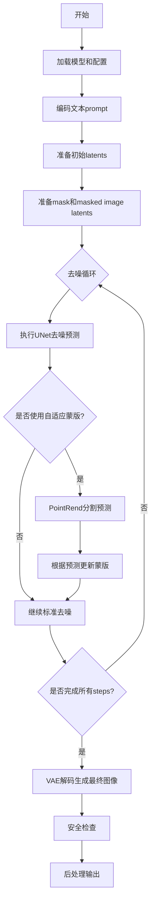

## 类结构

```
AdaptiveMaskInpaintPipeline (主修复管道)
├── PointRendPredictor (分割模型预测器)
├── MaskDilateScheduler (蒙版膨胀调度器)
├── ProvokeScheduler (触发调度器)
└── 辅助函数
    ├── download_file
    ├── generate_video_from_imgs
    └── prepare_mask_and_masked_image
```

## 全局变量及字段


### `logger`
    
模块级日志记录器，用于输出调试和信息日志

类型：`logging.Logger`
    


### `AMI_INSTALL_MESSAGE`
    
包含Adaptive Mask Inpainting环境配置指南的安装说明字符串

类型：`str`
    


### `EXAMPLE_DOC_STRING`
    
展示Stable Diffusion图像修复pipeline用法的示例代码文档字符串

类型：`str`
    


### `AdaptiveMaskInpaintPipeline.vae`
    
变分自编码器模型，用于将图像编码到潜在空间并从潜在空间解码重建图像

类型：`Union[AutoencoderKL, AsymmetricAutoencoderKL]`
    


### `AdaptiveMaskInpaintPipeline.text_encoder`
    
冻结的CLIP文本编码器，用于将文本提示转换为文本嵌入向量

类型：`CLIPTextModel`
    


### `AdaptiveMaskInpaintPipeline.tokenizer`
    
CLIP分词器，用于将文本字符串分词为token序列

类型：`CLIPTokenizer`
    


### `AdaptiveMaskInpaintPipeline.unet`
    
条件UNet2D模型，用于在潜在空间中根据文本嵌入去噪图像

类型：`UNet2DConditionModel`
    


### `AdaptiveMaskInpaintPipeline.scheduler`
    
Karras扩散调度器，控制去噪过程中的噪声调度和时间步

类型：`KarrasDiffusionSchedulers`
    


### `AdaptiveMaskInpaintPipeline.safety_checker`
    
安全检查器模块，用于检测并过滤可能存在问题的生成图像

类型：`StableDiffusionSafetyChecker`
    


### `AdaptiveMaskInpaintPipeline.feature_extractor`
    
CLIP图像特征提取器，用于从图像中提取特征供安全检查器使用

类型：`CLIPImageProcessor`
    


### `AdaptiveMaskInpaintPipeline.vae_scale_factor`
    
VAE缩放因子，用于计算潜在空间的降采样分辨率

类型：`int`
    


### `AdaptiveMaskInpaintPipeline.image_processor`
    
VAE图像处理器，用于图像的预处理和后处理操作

类型：`VaeImageProcessor`
    


### `AdaptiveMaskInpaintPipeline.adaptive_mask_model`
    
自适应掩码预测模型，使用PointRend进行人体分割以动态调整修复区域

类型：`PointRendPredictor`
    


### `AdaptiveMaskInpaintPipeline.adaptive_mask_settings`
    
自适应掩码设置字典，包含膨胀调度器和触发调度器的配置参数

类型：`EasyDict`
    


### `AdaptiveMaskInpaintPipeline.final_offload_hook`
    
模型CPU卸载的钩子引用，用于在推理完成后将最后一个模型卸载到CPU

类型：`Any`
    


### `PointRendPredictor.cat_id_to_focus`
    
目标类别ID，指定分割任务要关注的物体类别（默认0表示人物）

类型：`int`
    


### `PointRendPredictor.coco_metadata`
    
COCO数据集的元数据目录，用于获取类别名称和颜色信息

类型：`MetadataCatalog`
    


### `PointRendPredictor.cfg`
    
Detectron2配置对象，包含模型结构和推理参数设置

类型：`CfgNode`
    


### `PointRendPredictor.pointrend_seg_model`
    
PointRend分割预测器，用于对输入图像进行实例分割

类型：`DefaultPredictor`
    


### `PointRendPredictor.use_visualizer`
    
可视化开关，控制是否生成分割结果的可视化图像

类型：`bool`
    


### `PointRendPredictor.merge_mode`
    
掩码合并模式，指定如何合并多个分割实例（merge或max-confidence）

类型：`str`
    


### `MaskDilateScheduler.max_dilate_num`
    
最大膨胀迭代次数，限制掩码膨胀操作的最大膨胀范围

类型：`int`
    


### `MaskDilateScheduler.schedule`
    
膨胀调度列表，定义每个推理步骤的膨胀迭代次数

类型：`List[int]`
    


### `ProvokeScheduler.is_zero_indexing`
    
零索引标志，指定调度列表是否使用零索引

类型：`bool`
    


### `ProvokeScheduler.schedule`
    
触发调度列表，定义哪些推理步骤需要触发自适应掩码

类型：`List[int]`
    
    

## 全局函数及方法


### `download_file`

该函数是一个文件下载工具函数，用于从指定的URL下载文件到本地。它支持断点续传功能（通过exist_ok参数控制），并使用流式下载和进度条显示来高效处理大文件。

参数：

- `url`：`str`，要下载的文件的URL地址
- `output_file`：`str`，下载文件保存的本地路径
- `exist_ok`：`bool`，如果为True且文件已存在，则跳过下载；否则重新下载

返回值：`None`，该函数没有返回值

#### 流程图

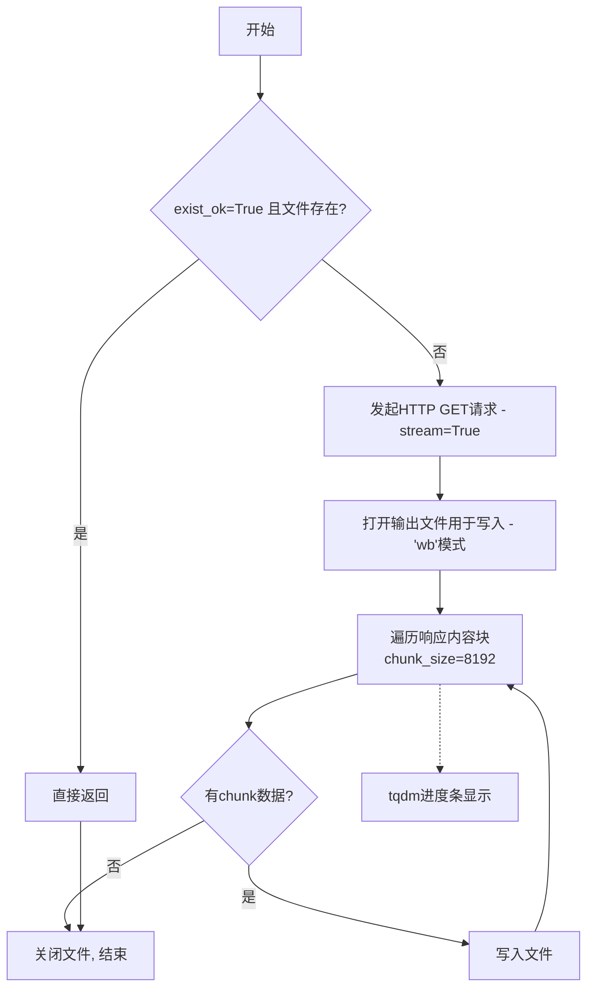

#### 带注释源码

```python
def download_file(url, output_file, exist_ok: bool):
    """
    从URL下载文件到指定路径
    
    Args:
        url: 要下载的文件的URL地址
        output_file: 下载文件保存的本地路径
        exist_ok: 是否允许文件已存在（True则跳过下载）
    """
    
    # 如果 exist_ok=True 且文件已存在，则直接返回，不进行下载
    if exist_ok and os.path.exists(output_file):
        return

    # 发起HTTP GET请求，使用stream=True以流式方式下载（适合大文件）
    response = requests.get(url, stream=True)

    # 以二进制写入模式打开输出文件
    with open(output_file, "wb") as file:
        # 遍历响应内容，每次读取8192字节（8KB）的块
        # tqdm用于显示下载进度，desc设置进度条描述
        for chunk in tqdm(response.iter_content(chunk_size=8192), desc=f"Downloading '{output_file}'..."):
            # 确保chunk非空（某些响应可能会发送空块）
            if chunk:
                # 将块写入文件
                file.write(chunk)
```


### `generate_video_from_imgs`

该函数接收一个图像保存目录，将目录中的PNG图像帧按顺序合成MP4视频，并使用FFmpeg将视频转码为HTML5兼容的格式（H.264编码），最后根据参数决定是否清理临时图像文件和中间视频文件。

参数：

- `images_save_directory`：`str`，图像文件所在的目录路径，函数将从该目录读取PNG图像并生成同名视频文件
- `fps`：`float`，生成视频的帧率，默认为15.0帧/秒
- `delete_dir`：`bool`，是否在生成视频后删除原始图像目录和中间处理视频，默认为True（删除）

返回值：`None`，该函数不返回任何值，仅执行视频生成和文件清理操作

#### 流程图

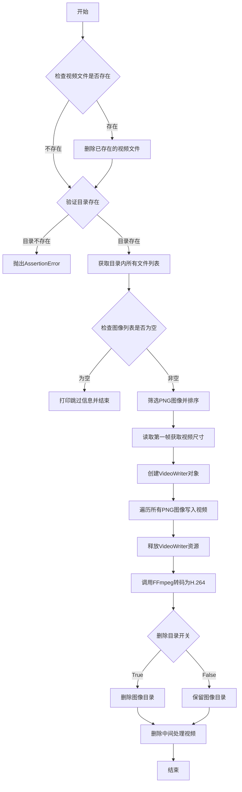

#### 带注释源码

```python
def generate_video_from_imgs(images_save_directory, fps=15.0, delete_dir=True):
    """
    将指定目录中的PNG图像帧合成MP4视频
    
    参数:
        images_save_directory (str): 包含图像帧的目录路径
        fps (float): 视频帧率，默认15.0
        delete_dir (bool): 是否在生成视频后删除原始图像目录，默认True
    
    返回:
        None
    """
    # 检查并删除已存在的目标视频文件（如果存在）
    if os.path.exists(f"{images_save_directory}.mp4"):
        os.remove(f"{images_save_directory}.mp4")
    # 检查并删除已存在的中间处理视频文件（如果存在）
    if os.path.exists(f"{images_save_directory}_before_process.mp4"):
        os.remove(f"{images_save_directory}_before_process.mp4")

    # 断言确保输入路径是一个有效的目录
    assert os.path.isdir(images_save_directory)
    # 获取目录中所有文件路径并排序以保证帧顺序
    ImgPaths = sorted(glob(f"{images_save_directory}/*"))

    # 检查是否有图像可供处理
    if len(ImgPaths) == 0:
        print("\tSkipping, since there must be at least one image to create mp4\n")
    else:
        # 设置中间视频文件路径（转码前）
        video_path = images_save_directory + "_before_process.mp4"

        # 从文件列表中筛选PNG格式图像并按文件名排序
        images = sorted([ImgPath.split("/")[-1] for ImgPath in ImgPaths if ImgPath.endswith(".png")])
        # 读取第一帧图像以获取视频的宽度、高度和通道数
        frame = cv2.imread(os.path.join(images_save_directory, images[0]))
        height, width, channels = frame.shape

        # 创建VideoWriter对象，使用mp4v编解码器
        fourcc = cv2.VideoWriter_fourcc(*"mp4v")
        video = cv2.VideoWriter(video_path, fourcc, fps, (width, height))
        
        # 逐帧读取图像并写入视频
        for image in images:
            video.write(cv2.imread(os.path.join(images_save_directory, image)))
        
        # 关闭所有OpenCV窗口并释放VideoWriter资源
        cv2.destroyAllWindows()
        video.release()

        # 使用FFmpeg将视频转码为HTML5兼容的H.264编码格式
        # 这样生成的视频可以在浏览器中直接播放
        os.system(
            f'ffmpeg -i "{images_save_directory}_before_process.mp4" -vcodec libx264 -f mp4 "{images_save_directory}.mp4" '
        )

    # 根据delete_dir参数决定是否清理临时文件
    # 删除原始图像目录（如果delete_dir为True）
    if delete_dir and os.path.exists(images_save_directory):
        shutil.rmtree(images_save_directory)
    
    # 删除中间处理视频文件
    if os.path.exists(f"{images_save_directory}_before_process.mp4"):
        os.remove(f"{images_save_directory}_before_process.mp4")
```


### `prepare_mask_and_masked_image`

该函数用于将图像和掩码预处理为Stable Diffusion修复管道所需的格式。它将输入的图像和掩码转换为具有批次维度的PyTorch张量，并对图像进行归一化（范围[-1, 1]），对掩码进行二值化处理（阈值0.5）。

参数：

- `image`：`Union[np.array, PIL.Image, torch.Tensor]`，待修复的图像，可以是PIL.Image、height×width×3的np.array、channels×height×width的torch.Tensor或batch×channels×height×width的torch.Tensor
- `mask`：`Union[PIL.Image.Image, np.ndarray, torch.Tensor]`，要应用于图像的掩码，表示修复区域，可以是PIL.Image、height×width的np.array、1×height×width的torch.Tensor或batch×1×height×width的torch.Tensor
- `height`：`int`，输出图像的高度（像素）
- `width`：`int`，输出图像的宽度（像素）
- `return_image`：`bool`，可选参数，默认为False，是否返回原始处理后的图像（用于兼容性）

返回值：`Union[tuple[torch.Tensor], torch.Tensor]`，当return_image=False时返回(mask, masked_image)的元组；当return_image=True时返回(mask, masked_image, image)的三元组。所有张量均为4D张量，形状为batch×channels×height×width。

#### 流程图

```mermaid
flowchart TD
    A[开始: prepare_mask_and_masked_image] --> B{image is None?}
    B -->|Yes| C[抛出ValueError: image输入不能为undefined]
    B -->|No| D{mask is None?}
    D -->|Yes| E[抛出ValueError: mask输入不能为undefined]
    D -->|No| F{image是torch.Tensor?}
    
    F -->|Yes| G{mask是torch.Tensor?}
    F -->|No| H{mask是torch.Tensor?}
    
    G -->|No| I[抛出TypeError: image是tensor但mask不是]
    G -->|Yes| J[处理torch.Tensor输入]
    H -->|Yes| K[抛出TypeError: mask是tensor但image不是]
    H -->|No| L[处理PIL/NumPy输入]
    
    J --> M[调整tensor维度到4D]
    J --> N{验证image范围[-1,1]?}
    J --> O{验证mask范围[0,1]?}
    J --> P[二值化mask: mask<0.5设为0, >=0.5设为1]
    J --> Q[转换image为float32]
    
    L --> R[预处理image: 调整大小/转换数组/归一化到[-1,1]]
    L --> S[预处理mask: 调整大小/转换为灰度/二值化]
    L --> T[转换为torch.Tensor]
    
    M --> U{return_image=True?}
    N --> U
    O --> U
    P --> U
    Q --> U
    R --> U
    T --> U
    
    U -->|Yes| V[返回mask, masked_image, image]
    U -->|No| W[返回mask, masked_image]
    
    Q --> X[计算masked_image: image × (mask < 0.5)]
    T --> X
    
    X --> Y[结束]
    V --> Y
    W --> Y
```

#### 带注释源码

```
# 复制自diffusers.pipelines.stable_diffusion.pipeline_stable_diffusion_inpaint.prepare_mask_and_masked_image
def prepare_mask_and_masked_image(image, mask, height, width, return_image=False):
    """
    准备一对（图像，掩码）供Stable Diffusion管道使用。这意味着这些输入将被转换为形状为
    batch x channels x height x width的torch.Tensor，其中image的channels为3，mask的channels为1。
    
    image将被转换为torch.float32并归一化到[-1, 1]范围。mask将被二值化（mask > 0.5）并
    转换为torch.float32。

    参数:
        image: 要修复的图像。可以是PIL.Image、height x width x 3的np.array、
               channels x height x width的torch.Tensor或batch x channels x height x width的torch.Tensor。
        mask: 要应用于图像的掩码，即要修复的区域。可以是PIL.Image、height x width的np.array、
             1 x height x width的torch.Tensor或batch x 1 x height x width的torch.Tensor。

    异常:
        ValueError: torch.Tensor类型的image应在[-1, 1]范围内。
        ValueError: torch.Tensor类型的mask应在[0, 1]范围内。
        ValueError: mask和image应具有相同的空间维度。
        TypeError: mask是torch.Tensor但image不是（反之亦然）。

    返回:
        tuple[torch.Tensor]: (mask, masked_image)对，作为4维torch.Tensor:
            batch x channels x height x width。
    """

    # 检查image和mask是否已定义
    if image is None:
        raise ValueError("`image`输入不能为undefined。")

    if mask is None:
        raise ValueError("`mask_image`输入不能为undefined。")

    # 处理torch.Tensor类型的输入
    if isinstance(image, torch.Tensor):
        # 确保mask也是torch.Tensor类型，否则抛出类型错误
        if not isinstance(mask, torch.Tensor):
            raise TypeError(f"`image`是torch.Tensor但`mask`（类型：{type(mask)}）不是")

        # 批量单张图像：如果image是3维的，添加批次维度
        # 3维图像应该是(3, H, W)形状
        if image.ndim == 3:
            assert image.shape[0] == 3, "批次外的图像应该是(3, H, W)形状"
            image = image.unsqueeze(0)  # (3, H, W) -> (1, 3, H, W)

        # 批量单张掩码并为单张掩码添加通道维度
        # 2维掩码应该是(H, W)形状
        if mask.ndim == 2:
            mask = mask.unsqueeze(0).unsqueeze(0)  # (H, W) -> (1, 1, H, W)

        # 批量单张掩码或添加通道维度
        # 3维掩码可能是(1, H, W)或(H, W)
        if mask.ndim == 3:
            # 单个带批次的掩码，没有通道维度，或单个掩码带通道维度
            if mask.shape[0] == 1:
                mask = mask.unsqueeze(0)  # (1, H, W) -> (1, 1, H, W)
            # 批量掩码没有通道维度
            else:
                mask = mask.unsqueeze(1)  # (N, H, W) -> (N, 1, H, W)

        # 验证维度：image和mask都必须是4维
        assert image.ndim == 4 and mask.ndim == 4, "图像和掩码必须是4维"
        # 验证空间维度一致
        assert image.shape[-2:] == mask.shape[-2:], "图像和掩码必须具有相同的空间维度"
        # 验证批次大小一致
        assert image.shape[0] == mask.shape[0], "图像和掩码必须具有相同的批次大小"

        # 检查image是否在[-1, 1]范围内
        if image.min() < -1 or image.max() > 1:
            raise ValueError("图像应在[-1, 1]范围内")

        # 检查mask是否在[0, 1]范围内
        if mask.min() < 0 or mask.max() > 1:
            raise ValueError("掩码应在[0, 1]范围内")

        # 二值化掩码：小于0.5设为0，大于等于0.5设为1
        mask[mask < 0.5] = 0
        mask[mask >= 0.5] = 1

        # 将image转换为float32类型
        image = image.to(dtype=torch.float32)
    
    # 如果mask是torch.Tensor但image不是，抛出类型错误
    elif isinstance(mask, torch.Tensor):
        raise TypeError(f"`mask`是torch.Tensor但`image`（类型：{type(image)}）不是")
    
    # 处理PIL.Image或np.ndarray类型的输入
    else:
        # 预处理图像
        if isinstance(image, (PIL.Image.Image, np.ndarray)):
            image = [image]  # 转换为列表以便统一处理
        
        if isinstance(image, list) and isinstance(image[0], PIL.Image.Image):
            # 根据传入的高度和宽度调整所有图像大小
            image = [i.resize((width, height), resample=PIL.Image.LANCZOS) for i in image]
            # 转换为RGB数组并添加批次维度
            image = [np.array(i.convert("RGB"))[None, :] for i in image]
            # 在批次维度上拼接
            image = np.concatenate(image, axis=0)
        elif isinstance(image, list) and isinstance(image[0], np.ndarray):
            # 为每个数组添加批次维度然后拼接
            image = np.concatenate([i[None, :] for i in image], axis=0)

        # 转换维度顺序：从(H, W, C)转换为(C, H, W)
        image = image.transpose(0, 3, 1, 2)
        # 转换为torch.Tensor并归一化到[-1, 1]
        # (0, 255) -> (0, 2) -> (-1, 1): 除以127.5再减1
        image = torch.from_numpy(image).to(dtype=torch.float32) / 127.5 - 1.0

        # 预处理掩码
        if isinstance(mask, (PIL.Image.Image, np.ndarray)):
            mask = [mask]

        if isinstance(mask, list) and isinstance(mask[0], PIL.Image.Image):
            # 调整大小并转换为灰度
            mask = [i.resize((width, height), resample=PIL.Image.LANCZOS) for i in mask]
            # 转换为灰度数组并添加批次和通道维度
            mask = np.concatenate([np.array(m.convert("L"))[None, None, :] for m in mask], axis=0)
            # 归一化到[0, 1]
            mask = mask.astype(np.float32) / 255.0
        elif isinstance(mask, list) and isinstance(mask[0], np.ndarray):
            # 为每个数组添加批次和通道维度然后拼接
            mask = np.concatenate([m[None, None, :] for m in mask], axis=0)

        # 二值化掩码
        mask[mask < 0.5] = 0
        mask[mask >= 0.5] = 1
        # 转换为torch.Tensor
        mask = torch.from_numpy(mask)

    # 计算被掩码覆盖的图像区域
    # 被掩码覆盖的区域（mask >= 0.5）在masked_image中为0
    masked_image = image * (mask < 0.5)

    # 确保向后兼容性：旧函数不返回图像
    if return_image:
        return mask, masked_image, image

    return mask, masked_image
```


### `seg2bbox`

将二进制分割掩码转换为轴对齐的边界框（Bounding Box）。

参数：

- `seg_mask`：`np.ndarray`，输入的二进制分割掩码，通常是分割模型输出的单通道掩码

返回值：`np.ndarray`，边界框坐标，格式为 `[min_j, min_i, max_j + 1, max_i + 1]`，其中 (min_i, min_j) 为左上角坐标，(max_i, max_j) 为右下角坐标

#### 流程图

```mermaid
graph TD
    A[输入: seg_mask 分割掩码] --> B[调用 nonzero 获取非零像素行列索引]
    B --> C[计算行列索引的最小最大值]
    C --> D[构建边界框坐标数组]
    D --> E[返回: 边界框 [min_j, min_i, max_j+1, max_i+1]]
```

#### 带注释源码

```python
def seg2bbox(seg_mask: np.ndarray):
    """
    将二进制分割掩码转换为边界框坐标
    
    Args:
        seg_mask: 输入的二进制分割掩码，0表示背景，非0表示目标区域
        
    Returns:
        边界框坐标 [min_j, min_i, max_j + 1, max_i + 1]
        - min_j: 左边界 (列方向)
        - min_i: 上边界 (行方向)
        - max_j + 1: 右边界 + 1 (OpenCV格式)
        - max_i + 1: 下边界 + 1 (OpenCV格式)
    """
    # 获取掩码中所有非零像素的行列索引
    nonzero_i, nonzero_j = seg_mask.nonzero()
    
    # 计算行索引的范围（上下边界）
    min_i, max_i = nonzero_i.min(), nonzero_i.max()
    
    # 计算列索引的范围（左右边界）
    min_j, max_j = nonzero_j.min(), nonzero_j.max()
    
    # 返回边界框坐标，使用OpenCV格式 [x1, y1, x2, y2]
    # x对应列(j)，y对应行(i)
    return np.array([min_j, min_i, max_j + 1, max_i + 1])
```


### `merge_bbox`

该函数用于将多个边界框（bounding box）合并为一个包围所有输入框的最小外接矩形。函数通过计算所有边界框在x和y方向上的最小最大值来确定合并后的边界框。

参数：

- `bboxes`：`list`，边界框列表，每个边界框应为包含4个元素的数组（格式为 `[x_min, y_min, x_max, y_max]`）

返回值：`np.ndarray`，合并后的边界框，格式为 `[x_min, y_min, x_max, y_max]`

#### 流程图

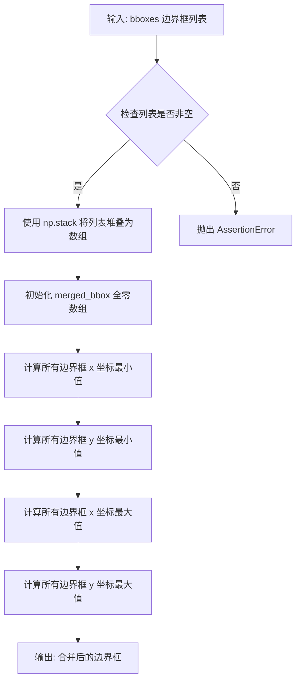

#### 带注释源码

```python
def merge_bbox(bboxes: list):
    """
    将多个边界框合并为一个最小的外接矩形边界框。
    
    该函数通过计算所有输入边界框在x和y方向上的最小最大值，
    得到一个能够完全包围所有输入框的合并边界框。
    
    Args:
        bboxes (list): 边界框列表，每个边界框应为包含4个元素的数组/列表，
                      格式为 [x_min, y_min, x_max, y_max]
    
    Returns:
        np.ndarray: 合并后的边界框，格式为 [x_min, y_min, x_max, y_max]
    
    Raises:
        AssertionError: 当输入列表为空时抛出
    
    Example:
        >>> bboxes = [[10, 20, 50, 60], [30, 40, 70, 80]]
        >>> merge_bbox(bboxes)
        array([10, 20, 70, 80])
    """
    # 断言确保输入列表非空
    assert len(bboxes) > 0

    # 将边界框列表堆叠为numpy数组，形状为 (N_bbox, 4)
    # N_bbox 为边界框数量，4 表示每个边界框的坐标数量
    all_bboxes = np.stack(bboxes, axis=0)  # shape: N_bbox X 4
    
    # 创建与单个边界框形状相同的零数组，用于存储合并结果
    merged_bbox = np.zeros_like(all_bboxes[0])  # shape: 4,

    # 计算所有边界框中 x 坐标的最小值 (左边界)
    merged_bbox[0] = all_bboxes[:, 0].min()
    
    # 计算所有边界框中 y 坐标的最小值 (上边界)
    merged_bbox[1] = all_bboxes[:, 1].min()
    
    # 计算所有边界框中 x 坐标的最大值 (右边界)
    merged_bbox[2] = all_bboxes[:, 2].max()
    
    # 计算所有边界框中 y 坐标的最大值 (下边界)
    merged_bbox[3] = all_bboxes[:, 3].max()

    # 返回合并后的边界框
    return merged_bbox
```


### AdaptiveMaskInpaintPipeline.__init__

该方法是 `AdaptiveMaskInpaintPipeline` 类的构造函数，负责初始化整个自适应掩码修复管道。它接收多个核心组件（VAE、文本编码器、UNet等），进行配置验证和兼容性检查，注册自适应掩码模型和设置，并完成管道的整体初始化。

参数：

- `vae`：`Union[AutoencoderKL, AsymmetricAutoencoderKL]`，变分自编码器模型，用于编码和解码图像到潜在表示
- `text_encoder`：`CLIPTextModel`，冻结的文本编码器（clip-vit-large-patch14），用于将文本提示转换为嵌入向量
- `tokenizer`：`CLIPTokenizer`，CLIP分词器，用于对文本进行分词
- `unet`：`UNet2DConditionModel`，UNet2D条件模型，用于对编码的图像潜在表示进行去噪
- `scheduler`：`KarrasDiffusionSchedulers`，调度器，与UNet结合使用来对编码的图像潜在表示进行去噪
- `safety_checker`：`任意类型`，安全检查器模块，用于评估生成的图像是否被认为具有攻击性或有害
- `feature_extractor`：`CLIPImageProcessor`，CLIP图像处理器，用于从生成的图像中提取特征，作为安全检查器的输入
- `requires_safety_checker`：`bool`，默认为True，是否需要安全检查器

返回值：`None`，构造函数无返回值

#### 流程图

```mermaid
flowchart TD
    A[开始 __init__] --> B[调用 super().__init__]
    B --> C[register_adaptive_mask_model]
    C --> D[register_adaptive_mask_settings]
    D --> E{scheduler.config.steps_offset != 1?}
    E -->|是| F[警告并修复 steps_offset]
    E -->|否| G{scheduler.config.skip_prk_steps == False?}
    F --> G
    G -->|是| H[警告并设置 skip_prk_steps=True]
    G -->|否| I{safety_checker is None<br/>且 requires_safety_checker=True?}
    H --> I
    I -->|是| J[警告安全检查器被禁用]
    I -->|否| K{safety_checker is not None<br/>且 feature_extractor is None?}
    J --> L
    K -->|是| M[抛出 ValueError]
    K -->|否| L{unet版本<0.9.0<br/>且 sample_size<64?}
    M --> N[结束]
    L -->|是| O[警告并修复 sample_size=64]
    L -->|否| P[记录unet输入通道数]
    O --> P
    P --> Q[register_modules<br/>注册所有模块]
    Q --> R[计算 vae_scale_factor]
    R --> S[创建 VaeImageProcessor]
    S --> T[register_to_config<br/>注册配置]
    T --> U[结束 __init__]
```

#### 带注释源码

```python
def __init__(
    self,
    vae: Union[AutoencoderKL, AsymmetricAutoencoderKL],
    text_encoder: CLIPTextModel,
    tokenizer: CLIPTokenizer,
    unet: UNet2DConditionModel,
    scheduler: KarrasDiffusionSchedulers,
    # safety_checker: StableDiffusionSafetyChecker,  # 注释掉的类型提示
    safety_checker,  # 安全检查器，可为None
    feature_extractor: CLIPImageProcessor,
    requires_safety_checker: bool = True,
):
    # 调用父类DiffusionPipeline的初始化方法
    super().__init__()

    # 注册自适应掩码模型（用于图像分割）
    self.register_adaptive_mask_model()
    # 注册自适应掩码设置（dilate和provoke调度器）
    self.register_adaptive_mask_settings()

    # ========== 调度器配置兼容性检查 ==========
    # 检查scheduler的steps_offset配置是否为1（默认值）
    if scheduler is not None and getattr(scheduler.config, "steps_offset", 1) != 1:
        deprecation_message = (
            f"The configuration file of this scheduler: {scheduler} is outdated. `steps_offset`"
            f" should be set to 1 instead of {scheduler.config.steps_offset}. Please make sure "
            "to update the config accordingly as leaving `steps_offset` might led to incorrect results"
            " in future versions. If you have downloaded this checkpoint from the Hugging Face Hub,"
            " it would be very nice if you could open a Pull request for the `scheduler/scheduler_config.json`"
            " file"
        )
        # 发出废弃警告并修复配置
        deprecate("steps_offset!=1", "1.0.0", deprecation_message, standard_warn=False)
        new_config = dict(scheduler.config)
        new_config["steps_offset"] = 1
        scheduler._internal_dict = FrozenDict(new_config)

    # 检查scheduler是否设置了skip_prk_steps
    if scheduler is not None and getattr(scheduler.config, "skip_prk_steps", True) is False:
        deprecation_message = (
            f"The configuration file of this scheduler: {scheduler} has not set the configuration"
            " `skip_prk_steps`. `skip_prk_steps` should be set to True in the configuration file. Please make"
            " sure to update the config accordingly as not setting `skip_prk_steps` in the config might lead to"
            " incorrect results in future versions. If you have downloaded this checkpoint from the Hugging Face"
            " Hub, it would be very nice if you could open a Pull request for the"
            " `scheduler/scheduler_config.json` file"
        )
        deprecate("skip_prk_steps not set", "1.0.0", deprecation_message, standard_warn=False)
        new_config = dict(scheduler.config)
        new_config["skip_prk_steps"] = True
        scheduler._internal_dict = FrozenDict(new_config)

    # ========== 安全检查器验证 ==========
    # 如果safety_checker为None但requires_safety_checker为True，发出警告
    if safety_checker is None and requires_safety_checker:
        logger.warning(
            f"You have disabled the safety checker for {self.__class__} by passing `safety_checker=None`. Ensure"
            " that you abide to the conditions of the Stable Diffusion license and do not expose unfiltered"
            " results in services or applications open to the public. Both the diffusers team and Hugging Face"
            " strongly recommend to keep the safety filter enabled in all public facing circumstances, disabling"
            " it only for use-cases that involve analyzing network behavior or auditing its results. For more"
            " information, please have a look at https://github.com/huggingface/diffusers/pull/254 ."
        )

    # 如果提供了safety_checker但没有feature_extractor，抛出错误
    if safety_checker is not None and feature_extractor is None:
        raise ValueError(
            "Make sure to define a feature extractor when loading {self.__class__} if you want to use the safety"
            " checker. If you do not want to use the safety checker, you can pass `'safety_checker=None'` instead."
        )

    # ========== UNet配置兼容性检查 ==========
    # 检查UNet版本和sample_size
    is_unet_version_less_0_9_0 = (
        unet is not None
        and hasattr(unet.config, "_diffusers_version")
        and version.parse(version.parse(unet.config._diffusers_version).base_version) < version.parse("0.9.0.dev0")
    )
    is_unet_sample_size_less_64 = (
        unet is not None and hasattr(unet.config, "sample_size") and unet.config.sample_size < 64
    )
    # 如果UNet版本较旧且sample_size小于64，发出警告并修复
    if is_unet_version_less_0_9_0 and is_unet_sample_size_less_64:
        deprecation_message = (
            "The configuration file of the unet has set the default `sample_size` to smaller than"
            " 64 which seems highly unlikely .If you're checkpoint is a fine-tuned version of any of the"
            " following: \n- CompVis/stable-diffusion-v1-4 \n- CompVis/stable-diffusion-v1-3 \n-"
            " CompVis/stable-diffusion-v1-2 \n- CompVis/stable-diffusion-v1-1 \n- stable-diffusion-v1-5/stable-diffusion-v1-5"
            " \n- stable-diffusion-v1-5/stable-diffusion-inpainting \n you should change 'sample_size' to 64 in the"
            " configuration file. Please make sure to update the config accordingly as leaving `sample_size=32`"
            " in the config might lead to incorrect results in future versions. If you have downloaded this"
            " checkpoint from the Hugging Face Hub, it would be very nice if you could open a Pull request for"
            " the `unet/config.json` file"
        )
        deprecate("sample_size<64", "1.0.0", deprecation_message, standard_warn=False)
        new_config = dict(unet.config)
        new_config["sample_size"] = 64
        unet._internal_dict = FrozenDict(new_config)

    # 检查UNet输入通道数（Stable Diffusion Inpainting期望9个通道）
    if unet is not None and unet.config.in_channels != 9:
        logger.info(f"You have loaded a UNet with {unet.config.in_channels} input channels which.")

    # ========== 注册所有模块 ==========
    self.register_modules(
        vae=vae,
        text_encoder=text_encoder,
        tokenizer=tokenizer,
        unet=unet,
        scheduler=scheduler,
        safety_checker=safety_checker,
        feature_extractor=feature_extractor,
    )

    # 计算VAE的缩放因子（基于block_out_channels的数量）
    self.vae_scale_factor = 2 ** (len(self.vae.config.block_out_channels) - 1) if getattr(self, "vae", None) else 8
    
    # 创建VAE图像处理器
    self.image_processor = VaeImageProcessor(vae_scale_factor=self.vae_scale_factor)
    
    # 将requires_safety_checker注册到配置中
    self.register_to_config(requires_safety_checker=requires_safety_checker)

    """ Preparation for Adaptive Mask inpainting """
```


### `AdaptiveMaskInpaintPipeline.enable_model_cpu_offload`

该方法用于将所有模型（text_encoder、unet、vae、safety_checker）卸载到CPU以减少显存占用，同时保持较好的性能。模型在调用 `forward` 方法时才被加载到GPU，执行完毕后保留在GPU上直到下一个模型运行。

参数：

- `gpu_id`：`int`，指定要使用的GPU设备ID，默认为0

返回值：无返回值（`None`）

#### 流程图

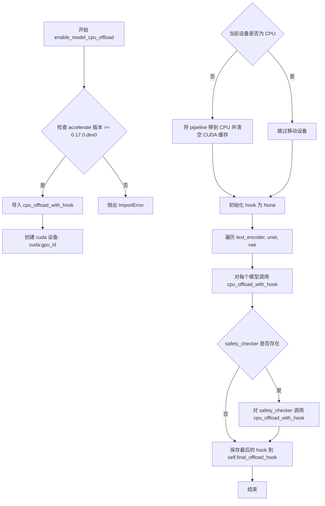

#### 带注释源码

```python
def enable_model_cpu_offload(self, gpu_id=0):
    r"""
    Offload all models to CPU to reduce memory usage with a low impact on performance. Moves one whole model at a
    time to the GPU when its `forward` method is called, and the model remains in GPU until the next model runs.
    Memory savings are lower than using `enable_sequential_cpu_offload`, but performance is much better due to the
    iterative execution of the `unet`.
    """
    # 检查 accelerate 库版本是否满足要求 (>= 0.17.0.dev0)
    if is_accelerate_available() and is_accelerate_version(">=", "0.17.0.dev0"):
        # 导入加速库提供的 CPU offload 功能
        from accelerate import cpu_offload_with_hook
    else:
        # 版本不满足时抛出导入错误
        raise ImportError("`enable_model_cpu_offload` requires `accelerate v0.17.0` or higher.")

    # 根据 gpu_id 创建对应的 CUDA 设备
    device = torch.device(f"cuda:{gpu_id}")

    # 如果当前设备不是 CPU，则将整个 pipeline 移到 CPU 并清空 CUDA 缓存
    # 这样可以确保正确计算显存节省
    if self.device.type != "cpu":
        self.to("cpu", silence_dtype_warnings=True)
        torch.cuda.empty_cache()  # otherwise we don't see the memory savings (but they probably exist)

    # 初始化 hook，用于链接各个模型的 offload 行为
    hook = None
    # 遍历需要 offload 的核心模型：text_encoder, unet, vae
    for cpu_offloaded_model in [self.text_encoder, self.unet, self.vae]:
        # 将每个模型注册 CPU offload hook，并获取新的 hook 用于下一个模型
        _, hook = cpu_offload_with_hook(cpu_offloaded_model, device, prev_module_hook=hook)

    # 如果 safety_checker 存在，也将其 offload 到 CPU
    if self.safety_checker is not None:
        _, hook = cpu_offload_with_hook(self.safety_checker, device, prev_module_hook=hook)

    # 保存最后一个 hook，用于后续手动 offload 最后一个模型
    self.final_offload_hook = hook
```


### `AdaptiveMaskInpaintPipeline._encode_prompt`

该方法用于将文本提示（prompt）编码为文本编码器的隐藏状态（text encoder hidden states）。它是Stable Diffusion系列管道中的核心方法之一，支持文本提示的tokenization、embedding生成、LoRA权重应用，以及用于classifier-free guidance的无条件embedding生成。

参数：

- `prompt`：`str` 或 `List[str]`，要编码的提示文本
- `device`：`torch.device`，torch设备
- `num_images_per_prompt`：`int`，每个提示要生成的图像数量
- `do_classifier_free_guidance`：`bool`，是否使用classifier-free guidance
- `negative_prompt`：`str` 或 `List[str]`，用于引导图像生成的反向提示词，如果不使用guidance则被忽略
- `prompt_embeds`：`Optional[torch.FloatTensor]`，预生成的文本embeddings，可用于调整文本输入
- `negative_prompt_embeds`：`Optional[torch.FloatTensor]`，预生成的负向文本embeddings
- `lora_scale`：`Optional[float]`，要应用于文本编码器所有LoRA层的LoRA缩放因子

返回值：`torch.FloatTensor`，编码后的文本embeddings，形状为 `(batch_size * num_images_per_prompt, seq_len, hidden_size)`

#### 流程图

```mermaid
flowchart TD
    A[开始 _encode_prompt] --> B{检查 lora_scale}
    B -->|lora_scale is not None| C[设置 self._lora_scale]
    B -->|lora_scale is None| D[跳过设置]
    C --> E{确定 batch_size}
    D --> E
    E --> F{prompt_embeds 是否为 None}
    F -->|Yes| G[检查 TextualInversionLoaderMixin]
    F -->|No| L[直接使用 prompt_embeds]
    G -->|Yes| H[maybe_convert_prompt 处理多向量token]
    G -->|No| I[直接tokenize]
    H --> I
    I --> J[tokenizer 处理: padding, max_length, truncation, return_tensors]
    J --> K[检查 use_attention_mask]
    K -->|Yes| M[获取 attention_mask]
    K -->|No| N[attention_mask = None]
    M --> O[text_encoder 前向传播]
    N --> O
    O --> P[获取 prompt_embeds[0]]
    P --> Q{确定 prompt_embeds_dtype}
    Q -->|text_encoder 存在| R[使用 text_encoder.dtype]
    Q -->|unet 存在| S[使用 unet.dtype]
    Q -->|其他| T[使用 prompt_embeds 原有 dtype]
    R --> U
    S --> U
    T --> U
    U[转换 prompt_embeds dtype 和 device] --> V[重复 embed 以匹配 num_images_per_prompt]
    V --> W{do_classifier_free_guidance 为 True 且 negative_prompt_embeds 为 None?}
    W -->|Yes| X[处理 negative_prompt]
    W -->|No| Y[直接返回或连接 embed]
    X --> Z[确定 uncond_tokens]
    Z --> AA[maybe_convert_prompt 处理]
    AA --> AB[tokenizer 处理 uncond_tokens]
    AB --> AC[text_encoder 编码获取 negative_prompt_embeds]
    AC --> AD[重复 negative_prompt_embeds]
    AD --> AE[连接 negative_prompt_embeds 和 prompt_embeds]
    AE --> Y
    Y --> AF[返回最终 embeddings]
```

#### 带注释源码

```python
def _encode_prompt(
    self,
    prompt,
    device,
    num_images_per_prompt,
    do_classifier_free_guidance,
    negative_prompt=None,
    prompt_embeds: Optional[torch.FloatTensor] = None,
    negative_prompt_embeds: Optional[torch.FloatTensor] = None,
    lora_scale: Optional[float] = None,
):
    r"""
    Encodes the prompt into text encoder hidden states.

    Args:
         prompt (`str` or `List[str]`, *optional*):
            prompt to be encoded
        device: (`torch.device`):
            torch device
        num_images_per_prompt (`int`):
            number of images that should be generated per prompt
        do_classifier_free_guidance (`bool`):
            whether to use classifier free guidance or not
        negative_prompt (`str` or `List[str]`, *optional*):
            The prompt or prompts not to guide the image generation. If not defined, one has to pass
            `negative_prompt_embeds` instead. Ignored when not using guidance (i.e., ignored if `guidance_scale` is
            less than `1`).
        prompt_embeds (`torch.FloatTensor`, *optional*):
            Pre-generated text embeddings. Can be used to easily tweak text inputs, *e.g.* prompt weighting. If not
            provided, text embeddings will be generated from `prompt` input argument.
        negative_prompt_embeds (`torch.FloatTensor`, *optional*):
            Pre-generated negative text embeddings. Can be used to easily tweak text inputs, *e.g.* prompt
            weighting. If not provided, negative_prompt_embeds will be generated from `negative_prompt` input
            argument.
        lora_scale (`float`, *optional*):
            A lora scale that will be applied to all LoRA layers of the text encoder if LoRA layers are loaded.
    """
    # set lora scale so that monkey patched LoRA
    # function of text encoder can correctly access it
    # 如果传入了 lora_scale 且当前pipeline支持LoraLoaderMixin，则设置self._lora_scale
    # 这样text encoder的LoRA patch函数可以正确访问该值
    if lora_scale is not None and isinstance(self, LoraLoaderMixin):
        self._lora_scale = lora_scale

    # 确定batch_size：根据prompt类型或prompt_embeds的形状
    if prompt is not None and isinstance(prompt, str):
        batch_size = 1
    elif prompt is not None and isinstance(prompt, list):
        batch_size = len(prompt)
    else:
        batch_size = prompt_embeds.shape[0]

    # 如果没有提供prompt_embeds，则需要从prompt生成
    if prompt_embeds is None:
        # textual inversion: procecss multi-vector tokens if necessary
        # 如果支持TextualInversionLoaderMixin，转换prompt（处理多向量token）
        if isinstance(self, TextualInversionLoaderMixin):
            prompt = self.maybe_convert_prompt(prompt, self.tokenizer)

        # 使用tokenizer将prompt转换为模型输入格式
        text_inputs = self.tokenizer(
            prompt,
            padding="max_length",
            max_length=self.tokenizer.model_max_length,
            truncation=True,
            return_tensors="pt",
        )
        text_input_ids = text_inputs.input_ids
        # 获取未截断的输入ID（用于检测是否发生了截断）
        untruncated_ids = self.tokenizer(prompt, padding="longest", return_tensors="pt").input_ids

        # 检查是否发生了截断，并记录警告信息
        if untruncated_ids.shape[-1] >= text_input_ids.shape[-1] and not torch.equal(
            text_input_ids, untruncated_ids
        ):
            removed_text = self.tokenizer.batch_decode(
                untruncated_ids[:, self.tokenizer.model_max_length - 1 : -1]
            )
            logger.warning(
                "The following part of your input was truncated because CLIP can only handle sequences up to"
                f" {self.tokenizer.model_max_length} tokens: {removed_text}"
            )

        # 检查text_encoder配置是否需要attention_mask
        if hasattr(self.text_encoder.config, "use_attention_mask") and self.text_encoder.config.use_attention_mask:
            attention_mask = text_inputs.attention_mask.to(device)
        else:
            attention_mask = None

        # 将token IDs传入text_encoder获取embeddings
        prompt_embeds = self.text_encoder(
            text_input_ids.to(device),
            attention_mask=attention_mask,
        )
        # 获取第一项（通常是一个tuple的最后一个元素是hidden states）
        prompt_embeds = prompt_embeds[0]

    # 确定embeddings的数据类型，优先使用text_encoder或unet的dtype
    if self.text_encoder is not None:
        prompt_embeds_dtype = self.text_encoder.dtype
    elif self.unet is not None:
        prompt_embeds_dtype = self.unet.dtype
    else:
        prompt_embeds_dtype = prompt_embeds.dtype

    # 将prompt_embeds转换为正确的dtype和device
    prompt_embeds = prompt_embeds.to(dtype=prompt_embeds_dtype, device=device)

    # 获取embeddings的形状信息
    bs_embed, seq_len, _ = prompt_embeds.shape
    # duplicate text embeddings for each generation per prompt, using mps friendly method
    # 为每个prompt生成多张图像而复制embeddings
    prompt_embeds = prompt_embeds.repeat(1, num_images_per_prompt, 1)
    prompt_embeds = prompt_embeds.view(bs_embed * num_images_per_prompt, seq_len, -1)

    # get unconditional embeddings for classifier free guidance
    # 如果使用classifier-free guidance且没有提供negative_prompt_embeds，则生成无条件embeddings
    if do_classifier_free_guidance and negative_prompt_embeds is None:
        uncond_tokens: List[str]
        # 处理negative_prompt为空的情况
        if negative_prompt is None:
            uncond_tokens = [""] * batch_size
        # 检查negative_prompt和prompt的类型是否一致
        elif prompt is not None and type(prompt) is not type(negative_prompt):
            raise TypeError(
                f"`negative_prompt` should be the same type to `prompt`, but got {type(negative_prompt)} !="
                f" {type(prompt)}."
            )
        # 处理字符串类型的negative_prompt
        elif isinstance(negative_prompt, str):
            uncond_tokens = [negative_prompt]
        # 检查batch_size是否匹配
        elif batch_size != len(negative_prompt):
            raise ValueError(
                f"`negative_prompt`: {negative_prompt} has batch size {len(negative_prompt)}, but `prompt`:"
                f" {prompt} has batch size {batch_size}. Please make sure that passed `negative_prompt` matches"
                " the batch size of `prompt`."
            )
        else:
            uncond_tokens = negative_prompt

        # textual inversion: procecss multi-vector tokens if necessary
        # 处理TextualInversion的多向量token
        if isinstance(self, TextualInversionLoaderMixin):
            uncond_tokens = self.maybe_convert_prompt(uncond_tokens, self.tokenizer)

        # 获取prompt_embeds的序列长度，用于tokenize negative_prompt
        max_length = prompt_embeds.shape[1]
        uncond_input = self.tokenizer(
            uncond_tokens,
            padding="max_length",
            max_length=max_length,
            truncation=True,
            return_tensors="pt",
        )

        # 处理attention_mask
        if hasattr(self.text_encoder.config, "use_attention_mask") and self.text_encoder.config.use_attention_mask:
            attention_mask = uncond_input.attention_mask.to(device)
        else:
            attention_mask = None

        # 编码negative_prompt获取embeddings
        negative_prompt_embeds = self.text_encoder(
            uncond_input.input_ids.to(device),
            attention_mask=attention_mask,
        )
        negative_prompt_embeds = negative_prompt_embeds[0]

    # 如果使用classifier-free guidance
    if do_classifier_free_guidance:
        # duplicate unconditional embeddings for each generation per prompt, using mps friendly method
        seq_len = negative_prompt_embeds.shape[1]

        # 转换negative_prompt_embeds的dtype和device
        negative_prompt_embeds = negative_prompt_embeds.to(dtype=prompt_embeds_dtype, device=device)

        # 复制embeddings以匹配num_images_per_prompt
        negative_prompt_embeds = negative_prompt_embeds.repeat(1, num_images_per_prompt, 1)
        negative_prompt_embeds = negative_prompt_embeds.view(batch_size * num_images_per_prompt, seq_len, -1)

        # For classifier free guidance, we need to do two forward passes.
        # Here we concatenate the unconditional and text embeddings into a single batch
        # to avoid doing two forward passes
        # 将无条件embeddings和文本embeddings连接起来，便于一次前向传播完成
        prompt_embeds = torch.cat([negative_prompt_embeds, prompt_embeds])

    return prompt_embeds
```


### `AdaptiveMaskInpaintPipeline.run_safety_checker`

该方法用于在图像生成完成后执行安全检查（NSFW检测），通过 `safety_checker` 判断生成的图像是否包含不当内容，并返回过滤后的图像及检测结果。

参数：

- `image`：`Union[torch.Tensor, np.ndarray, PIL.Image]`（实际传入时通常是 `torch.Tensor`），待检测的图像
- `device`：`torch.device`，用于将特征提取器输入移动到指定设备（如 CUDA 或 CPU）
- `dtype`：`torch.dtype`，用于将特征提取器输入转换为指定数据类型（通常为 float16）

返回值：`Tuple[Union[torch.Tensor, PIL.Image], Optional[torch.Tensor]]`，返回经过安全检查器处理后的图像和 NSFW 检测结果。如果 `safety_checker` 为 `None`，则返回原始图像和 `None`。

#### 流程图

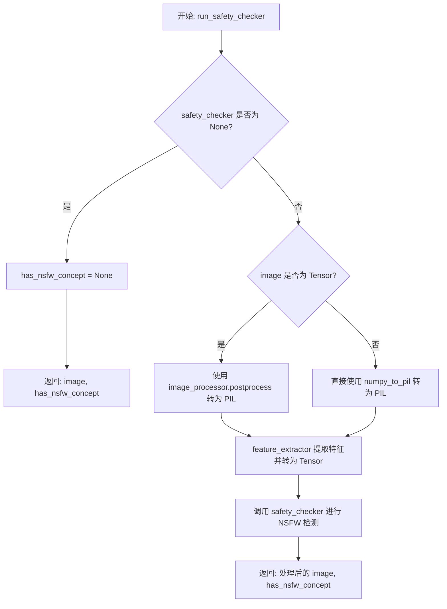

#### 带注释源码

```python
def run_safety_checker(self, image, device, dtype):
    """
    运行安全检查器，对生成的图像进行 NSFW（不适合在工作场所查看的内容）检测。
    
    参数:
        image: 生成的图像，可以是 torch.Tensor、np.ndarray 或 PIL.Image
        device: 运行安全检查的设备 (cuda 或 cpu)
        dtype: 安全检查器输入的数据类型 (如 torch.float16)
    
    返回:
        tuple: (处理后的图像, NSFW 检测结果)
            - 图像: 经过安全检查器处理后的图像
            - NSFW 检测结果: 如果检测到 NSFW 内容则为包含 True/False 的 Tensor，否则为 None
    """
    # 如果没有配置安全检查器，直接返回原图像和 None
    if self.safety_checker is None:
        has_nsfw_concept = None
    else:
        # 根据图像类型选择合适的后处理方式
        if torch.is_tensor(image):
            # 将 Tensor 格式的图像转换为 PIL Image 列表
            feature_extractor_input = self.image_processor.postprocess(image, output_type="pil")
        else:
            # 将 numpy 数组格式的图像转换为 PIL Image
            feature_extractor_input = self.image_processor.numpy_to_pil(image)
        
        # 使用特征提取器提取图像特征，并转换为指定设备上的 Tensor
        safety_checker_input = self.feature_extractor(feature_extractor_input, return_tensors="pt").to(device)
        
        # 调用安全检查器进行 NSFW 检测
        # 参数:
        #   - images: 待检测的图像
        #   - clip_input: 特征提取器提取的 CLIP 特征
        image, has_nsfw_concept = self.safety_checker(
            images=image, clip_input=safety_checker_input.pixel_values.to(dtype)
        )
    
    # 返回处理后的图像和 NSFW 检测结果
    return image, has_nsfw_concept
```


### `AdaptiveMaskInpaintPipeline.prepare_extra_step_kwargs`

该方法用于为调度器（scheduler）的 `step` 函数准备额外的关键字参数。由于不同的调度器具有不同的签名，该方法通过反射检查调度器的 `step` 方法是否支持 `eta` 和 `generator` 参数，并将支持的参数添加到返回的字典中供后续去噪循环使用。

参数：

- `generator`：`Optional[Union[torch.Generator, List[torch.Generator]]]`，用于确保生成过程确定性的随机数生成器
- `eta`：`float`，DDIM 调度器的参数 η（对应 DDIM 论文中的 η），取值范围为 [0, 1]

返回值：`Dict[str, Any]`，包含调度器额外参数的字典，可能包含 `eta` 和/或 `generator` 键

#### 流程图

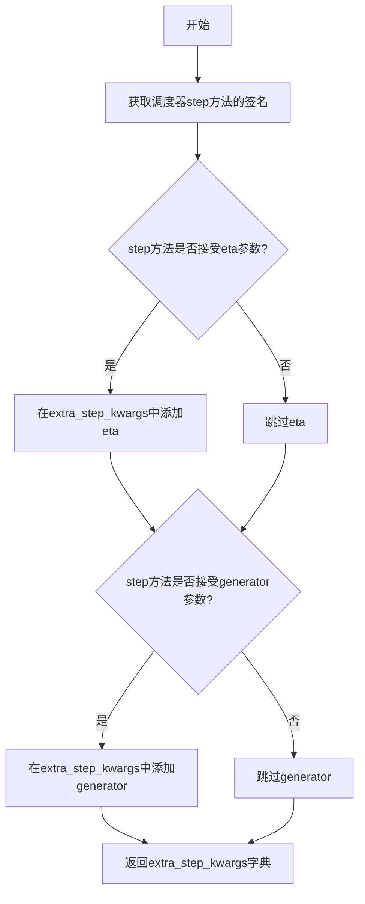

#### 带注释源码

```python
def prepare_extra_step_kwargs(self, generator, eta):
    """
    准备调度器步骤所需的额外关键字参数。

    不同的调度器有不同的签名，该方法通过检查调度器的 step 方法签名，
    动态确定哪些参数可以被传递。
    
    参数:
        generator: torch.Generator 或其列表，用于生成确定性随机数
        eta: float，对应 DDIM 论文中的 η 参数，仅 DDIMScheduler 使用
    
    返回:
        dict: 包含调度器额外参数的字典
    """
    # 通过 inspect 模块检查调度器的 step 方法是否接受 eta 参数
    # eta (η) 仅用于 DDIMScheduler，其他调度器会忽略此参数
    # eta 对应 DDIM 论文 https://huggingface.co/papers/2010.02502 中的 η，取值范围 [0, 1]
    accepts_eta = "eta" in set(inspect.signature(self.scheduler.step).parameters.keys())
    
    # 初始化空字典用于存储额外参数
    extra_step_kwargs = {}
    
    # 如果调度器接受 eta 参数，则将其添加到 extra_step_kwargs
    if accepts_eta:
        extra_step_kwargs["eta"] = eta

    # 检查调度器是否接受 generator 参数
    accepts_generator = "generator" in set(inspect.signature(self.scheduler.step).parameters.keys())
    
    # 如果调度器接受 generator 参数，则将其添加到 extra_step_kwargs
    if accepts_generator:
        extra_step_kwargs["generator"] = generator
    
    # 返回包含调度器所需额外参数的字典
    return extra_step_kwargs
```


### `AdaptiveMaskInpaintPipeline.check_inputs`

该方法负责验证传入图像修复流水线（Pipeline）的各类输入参数。它确保 `prompt` 与 `prompt_embeds` 不同时传递、`strength` 在 [0, 1] 范围内、图像尺寸符合模型要求（能被 8 整除）以及 `callback_steps` 为正整数等。如果参数不符合要求，该方法会抛出 `ValueError` 异常，以阻止流水线继续执行。

参数：

- `self`：`AdaptiveMaskInpaintPipeline`，当前的流水线实例。
- `prompt`：`Union[str, List[str]]`，用于指导图像生成的正向提示词。如果传递了 `prompt_embeds`，则此项应设为 `None`。
- `height`：`int`，生成图像的高度（像素），必须能被 8 整除。
- `width`：`int`，生成图像的宽度（像素），必须能被 8 整除。
- `strength`：`float`，噪声强度，决定了从原始图像到完全噪声的混合比例，必须在 [0.0, 1.0] 之间。
- `callback_steps`：`int`，回调函数的调用频率（步数），必须为正整数。
- `negative_prompt`：`Optional[Union[str, List[str]]]`，用于指导不希望出现的元素的负向提示词。如果传递了 `negative_prompt_embeds`，则此项应设为 `None`。
- `prompt_embeds`：`Optional[torch.FloatTensor]`，预生成的文本嵌入（Text Embeddings）。如果传递了 `prompt`，则此项应设为 `None`。
- `negative_prompt_embeds`：`Optional[torch.FloatTensor]`，预生成的负向文本嵌入。

返回值：`None`。该函数不返回任何值，仅通过抛出异常来处理错误。

#### 流程图

```mermaid
flowchart TD
    A([开始]) --> B{strength 在 [0, 1]?}
    B -- 否 --> C[抛出 ValueError]
    B -- 是 --> D{height 和 width\n能被 8 整除?}
    D -- 否 --> E[抛出 ValueError]
    D -- 是 --> F{callback_steps 是\n正整数?}
    F -- 否 --> G[抛出 ValueError]
    F -- 是 --> H{prompt 和 prompt_embeds\n都传了?}
    H -- 是 --> I[抛出 ValueError]
    H -- 否 --> J{prompt 和 prompt_embeds\n都没传?}
    J -- 是 --> K[抛出 ValueError]
    J -- 否 --> L{prompt 类型正确?\nstr 或 list}
    L -- 否 --> M[抛出 ValueError]
    L -- 是 --> N{negative_prompt 和\nnegative_prompt_embeds\n都传了?}
    N -- 是 --> O[抛出 ValueError]
    N -- 否 --> P{prompt_embeds 和\nnegative_prompt_embeds\n形状一致?}
    P -- 否 --> Q[抛出 ValueError]
    P -- 是 --> R([结束])
    
    C --> Z
    E --> Z
    G --> Z
    I --> Z
    K --> Z
    M --> Z
    O --> Z
    Q --> Z
```

#### 带注释源码

```python
def check_inputs(
    self,
    prompt,
    height,
    width,
    strength,
    callback_steps,
    negative_prompt=None,
    prompt_embeds=None,
    negative_prompt_embeds=None,
):
    # 1. 检查 strength (强度) 是否在有效范围内 [0.0, 1.0]
    if strength < 0 or strength > 1:
        raise ValueError(f"The value of strength should in [0.0, 1.0] but is {strength}")

    # 2. 检查图像尺寸 height 和 width 是否能被 8 整除
    # Stable Diffusion 的 VAE 和 UNet 通常要求尺寸为 8 的倍数
    if height % 8 != 0 or width % 8 != 0:
        raise ValueError(f"`height` and `width` have to be divisible by 8 but are {height} and {width}.")

    # 3. 检查 callback_steps 是否为正整数
    if (callback_steps is None) or (
        callback_steps is not None and (not isinstance(callback_steps, int) or callback_steps <= 0)
    ):
        raise ValueError(
            f"`callback_steps` has to be a positive integer but is {callback_steps} of type"
            f" {type(callback_steps)}."
        )

    # 4. 检查 prompt 和 prompt_embeds 的互斥关系
    # 不能同时传递原始文本和预计算的 embedding
    if prompt is not None and prompt_embeds is not None:
        raise ValueError(
            f"Cannot forward both `prompt`: {prompt} and `prompt_embeds`: {prompt_embeds}. Please make sure to"
            " only forward one of the two."
        )
    # 至少要提供其中一个
    elif prompt is None and prompt_embeds is None:
        raise ValueError(
            "Provide either `prompt` or `prompt_embeds`. Cannot leave both `prompt` and `prompt_embeds` undefined."
        )
    # 如果提供了 prompt，检查其类型是否为 str 或 list
    elif prompt is not None and (not isinstance(prompt, str) and not isinstance(prompt, list)):
        raise ValueError(f"`prompt` has to be of type `str` or `list` but is {type(prompt)}")

    # 5. 检查 negative_prompt 和 negative_prompt_embeds 的互斥关系
    if negative_prompt is not None and negative_prompt_embeds is not None:
        raise ValueError(
            f"Cannot forward both `negative_prompt`: {negative_prompt} and `negative_prompt_embeds`:"
            f" {negative_prompt_embeds}. Please make sure to only forward one of the two."
        )

    # 6. 如果同时提供了两种 embedding，检查它们的形状是否一致
    if prompt_embeds is not None and negative_prompt_embeds is not None:
        if prompt_embeds.shape != negative_prompt_embeds.shape:
            raise ValueError(
                "`prompt_embeds` and `negative_prompt_embeds` must have the same shape when passed directly, but"
                f" got: `prompt_embeds` {prompt_embeds.shape} != `negative_prompt_embeds`"
                f" {negative_prompt_embeds.shape}."
            )
```


### AdaptiveMaskInpaintPipeline.prepare_latents

该方法用于在图像修复pipeline中准备初始的潜在变量（latents）。它根据batch大小、图像尺寸等参数生成或处理噪声潜在变量，支持纯噪声初始化或图像+噪声混合初始化，并根据is_strength_max参数决定是否使用调度器的初始噪声sigma进行缩放。

参数：

- `self`：隐式参数，指向AdaptiveMaskInpaintPipeline实例本身
- `batch_size`：`int`，批量大小，决定生成潜在变量的数量
- `num_channels_latents`：`int`，潜在变量的通道数，通常为4（对应VAE的latent_channels）
- `height`：`int`，目标图像的高度（像素）
- `width`：`int`，目标图像的宽度（像素）
- `dtype`：`torch.dtype`，生成张量的数据类型
- `device`：`torch.device`，生成张量的设备（CPU/CUDA）
- `generator`：`torch.Generator` 或 `List[torch.Generator]`，可选，用于生成确定性随机数的生成器
- `latents`：`torch.FloatTensor`，可选，预先生成的噪声潜在变量，如果为None则自动生成
- `image`：`torch.FloatTensor`，可选，用于图像修复的输入图像
- `timestep`：`torch.Tensor`，可选，噪声时间步，用于将图像潜在变量与噪声混合
- `is_strength_max`：`bool`，默认为True，表示是否使用最大强度（即纯噪声初始化）
- `return_noise`：`bool`，默认为False，是否返回生成的噪声
- `return_image_latents`：`bool`，默认为False，是否返回编码后的图像潜在变量

返回值：`tuple`，包含以下元素：

- `latents`：`torch.FloatTensor`，处理后的潜在变量
- `noise`：`torch.FloatTensor`，（可选）生成的噪声，当return_noise=True时返回
- `image_latents`：`torch.FloatTensor`，（可选）编码后的图像潜在变量，当return_image_latents=True时返回

#### 流程图

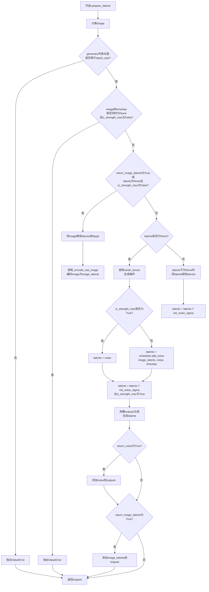

#### 带注释源码

```python
def prepare_latents(
    self,
    batch_size,
    num_channels_latents,
    height,
    width,
    dtype,
    device,
    generator,
    latents=None,
    image=None,
    timestep=None,
    is_strength_max=True,
    return_noise=False,
    return_image_latents=False,
):
    # 计算潜在变量的shape: batch_size x num_channels_latents x (height/vae_scale_factor) x (width/vae_scale_factor)
    # VAE的scale_factor通常为8，所以latent空间大小是像素空间的1/8
    shape = (batch_size, num_channels_latents, height // self.vae_scale_factor, width // self.vae_scale_factor)
    
    # 检查generator列表长度是否与batch_size匹配
    if isinstance(generator, list) and len(generator) != batch_size:
        raise ValueError(
            f"You have passed a list of generators of length {len(generator)}, but requested an effective batch"
            f" size of {batch_size}. Make sure the batch size matches the length of the generators."
        )

    # 当strength < 1时，需要同时提供image和timestep来混合图像与噪声
    if (image is None or timestep is None) and not is_strength_max:
        raise ValueError(
            "Since strength < 1. initial latents are to be initialised as a combination of Image + Noise."
            "However, either the image or the noise timestep has not been provided."
        )

    # 当需要返回图像latents或需要混合图像与噪声时，先将图像编码为latent空间
    if return_image_latents or (latents is None and not is_strength_max):
        image = image.to(device=device, dtype=dtype)
        # 调用VAE encoder将图像编码为latent表示
        image_latents = self._encode_vae_image(image=image, generator=generator)

    # 如果没有提供latents，则需要初始化
    if latents is None:
        # 使用randn_tensor生成标准正态分布的噪声
        noise = randn_tensor(shape, generator=generator, device=device, dtype=dtype)
        
        # 根据strength决定初始化方式：
        # is_strength_max=True: 完全使用噪声初始化
        # is_strength_max=False: 将图像latent与噪声混合
        latents = noise if is_strength_max else self.scheduler.add_noise(image_latents, noise, timestep)
        
        # 如果是完全噪声模式，还需要乘以scheduler的初始噪声sigma进行缩放
        # 这是Diffusion scheduler的标准做法
        latents = latents * self.scheduler.init_noise_sigma if is_strength_max else latents
    else:
        # 如果提供了latents，仍然需要按照scheduler的方式进行处理
        noise = latents.to(device)
        latents = noise * self.scheduler.init_noise_sigma

    # 构建返回值元组
    outputs = (latents,)

    # 根据参数决定是否返回额外信息
    if return_noise:
        outputs += (noise,)

    if return_image_latents:
        outputs += (image_latents,)

    return outputs
```


### `AdaptiveMaskInpaintPipeline._encode_vae_image`

该方法负责将输入图像编码为 VAE 潜在空间中的表示（latent representation）。它支持批量处理和单个图像的处理，并根据是否提供单个或多个随机生成器来选择不同的采样策略，最后应用 VAE 配置中的缩放因子对潜在表示进行缩放。

参数：

- `self`：隐式参数，指向 `AdaptiveMaskInpaintPipeline` 实例本身。
- `image`：`torch.Tensor`，要编码的输入图像张量，形状通常为 `(B, C, H, W)`，其中 B 是批次大小，C 是通道数，H 和 W 是高度和宽度。
- `generator`：`torch.Generator`，用于生成随机数的 PyTorch 生成器。如果是一个列表，则假设其长度与批次大小匹配，用于对批次中的每个图像独立采样潜在表示；如果不是列表，则用于整个批次的采样。

返回值：`torch.Tensor`，编码后的图像潜在表示，形状为 `(B, latent_channels, H//vae_scale_factor, W//vae_scale_factor)`，其中 `latent_channels` 通常为 4，`vae_scale_factor` 通常为 8。

#### 流程图

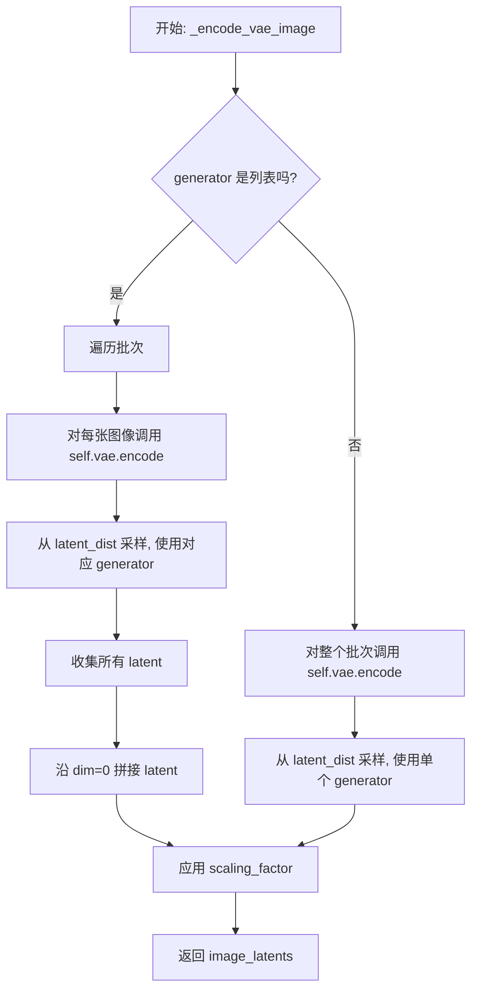

#### 带注释源码

```python
def _encode_vae_image(self, image: torch.Tensor, generator: torch.Generator):
    """
    将图像编码为 VAE 潜在空间表示。

    参数:
        image (torch.Tensor): 要编码的输入图像张量，形状为 (B, C, H, W)。
        generator (torch.Generator): 用于生成随机数的 PyTorch 生成器，支持单个或列表。

    返回:
        torch.Tensor: 编码后的潜在表示，形状为 (B, latent_channels, H//scale, W//scale)。
    """
    # 检查 generator 是否为列表，以确定是逐个处理还是批量处理
    if isinstance(generator, list):
        # 逐个处理批次中的每个图像
        image_latents = [
            # 对当前图像切片进行编码，并从潜在分布中采样
            # 使用对应的 generator[i] 确保每个图像的采样可复现
            self.vae.encode(image[i : i + 1]).latent_dist.sample(generator=generator[i])
            for i in range(image.shape[0])
        ]
        # 将所有单独编码的潜在表示沿批次维度拼接
        image_latents = torch.cat(image_latents, dim=0)
    else:
        # 整个批次作为整体编码，使用单个 generator
        image_latents = self.vae.encode(image).latent_dist.sample(generator=generator)

    # 应用 VAE 配置中的缩放因子，将潜在表示从 [-1, 1] 范围缩放到正确的潜伏空间
    # 这是 Stable Diffusion 等模型中常见的做法
    image_latents = self.vae.config.scaling_factor * image_latents

    return image_latents
```


### AdaptiveMaskInpaintPipeline.prepare_mask_latents

该方法用于准备掩码和掩码图像的潜在变量，将掩码调整到与潜在变量相同的尺寸，并使用VAE编码掩码图像，最后根据是否使用无分类器自由引导来复制掩码和掩码图像潜在变量以匹配批次大小。

参数：

- `self`：`AdaptiveMaskInpaintPipeline` 实例本身
- `mask`：`torch.Tensor`，输入的掩码张量，表示需要修复的区域
- `masked_image`：`torch.Tensor`，被掩码覆盖的图像张量
- `batch_size`：`int`，批处理大小
- `height`：`int`，生成图像的高度
- `width`：`int`，生成图像的宽度
- `dtype`：`torch.dtype`，张量的数据类型
- `device`：`torch.device`，计算设备
- `generator`：`torch.Generator`，随机数生成器，用于确保可重复性
- `do_classifier_free_guidance`：`bool`，是否使用无分类器自由引导

返回值：`Tuple[torch.Tensor, torch.Tensor]`，返回处理后的掩码和掩码图像潜在变量

#### 流程图

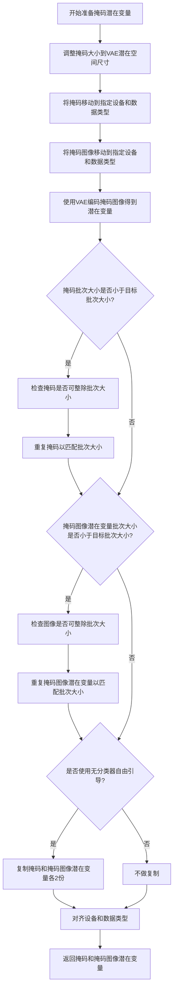

#### 带注释源码

```python
def prepare_mask_latents(
    self,
    mask: torch.Tensor,
    masked_image: torch.Tensor,
    batch_size: int,
    height: int,
    width: int,
    dtype: torch.dtype,
    device: torch.device,
    generator: torch.Generator,
    do_classifier_free_guidance: bool,
):
    """
    准备掩码和掩码图像的潜在变量用于图像修复。
    
    该方法执行以下步骤:
    1. 将掩码调整到与VAE潜在空间相同的尺寸
    2. 使用VAE编码掩码图像
    3. 根据批次大小复制掩码和掩码图像潜在变量
    4. 如果使用无分类器自由引导,则复制为双份(一份条件,一份无条件)
    """
    # 步骤1: 调整掩码大小到潜在空间尺寸
    # 我们在转换dtype之前执行此操作,以避免在使用cpu_offload和半精度时出现问题
    mask = torch.nn.functional.interpolate(
        mask, 
        size=(height // self.vae_scale_factor, width // self.vae_scale_factor)
    )
    # 将掩码移动到目标设备和数据类型
    mask = mask.to(device=device, dtype=dtype)

    # 步骤2: 处理掩码图像并编码为潜在变量
    masked_image = masked_image.to(device=device, dtype=dtype)
    masked_image_latents = self._encode_vae_image(masked_image, generator=generator)

    # 步骤3: 为每个prompt复制掩码和掩码图像潜在变量
    # 使用MPS友好的方法进行复制
    if mask.shape[0] < batch_size:
        # 检查掩码数量是否能整除批次大小
        if not batch_size % mask.shape[0] == 0:
            raise ValueError(
                "The passed mask and the required batch size don't match. Masks are supposed to be duplicated to"
                f" a total batch size of {batch_size}, but {mask.shape[0]} masks were passed. Make sure the number"
                " of masks that you pass is divisible by the total requested batch size."
            )
        # 重复掩码以匹配批次大小
        mask = mask.repeat(batch_size // mask.shape[0], 1, 1, 1)
    
    if masked_image_latents.shape[0] < batch_size:
        # 检查图像数量是否能整除批次大小
        if not batch_size % masked_image_latents.shape[0] == 0:
            raise ValueError(
                "The passed images and the required batch size don't match. Images are supposed to be duplicated"
                f" to a total batch size of {batch_size}, but {masked_image_latents.shape[0]} images were passed."
                " Make sure the number of images that you pass is divisible by the total requested batch size."
            )
        # 重复掩码图像潜在变量以匹配批次大小
        masked_image_latents = masked_image_latents.repeat(batch_size // masked_image_latents.shape[0], 1, 1, 1)

    # 步骤4: 处理无分类器自由引导
    # 如果启用,则将掩码和潜在变量复制为2份(concatenated)
    # 第一份用于无条件输入,第二份用于条件输入
    mask = torch.cat([mask] * 2) if do_classifier_free_guidance else mask
    masked_image_latents = (
        torch.cat([masked_image_latents] * 2) if do_classifier_free_guidance else masked_image_latents
    )

    # 对齐设备和数据类型以防止连接时出现设备错误
    masked_image_latents = masked_image_latents.to(device=device, dtype=dtype)
    
    # 返回处理后的掩码和掩码图像潜在变量
    return mask, masked_image_latents
```


### `AdaptiveMaskInpaintPipeline.get_timesteps`

该方法用于根据给定的推理步骤数量和强度（strength）参数计算并返回适当的时间步序列。这是图像到图像扩散模型中的常见操作，用于控制图像变换的程度。

参数：

- `num_inference_steps`：`int`，总推理步骤数，表示去噪过程的迭代次数
- `strength`：`float`，强度参数，范围 0 到 1 之间，指示图像变换的程度，值越大变换越显著
- `device`：`torch.device`，计算设备（CPU 或 CUDA）

返回值：`Tuple[torch.Tensor, int]`，返回两个元素：
- 第一个元素是 `torch.Tensor`，调整后的时间步序列，用于去噪迭代
- 第二个元素是 `int`，实际执行的推理步骤数（经过强度调整后）

#### 流程图

```mermaid
flowchart TD
    A[开始] --> B[计算初始时间步数: init_timestep = min(int(num_inference_steps * strength), num_inference_steps)]
    B --> C[计算起始索引: t_start = max(num_inference_steps - init_timestep, 0)]
    C --> D[从调度器获取时间步序列: timesteps = scheduler.timesteps[t_start * scheduler.order:]
    D --> E[计算实际推理步骤数: actual_steps = num_inference_steps - t_start]
    E --> F[返回 timesteps 和 actual_steps]
```

#### 带注释源码

```python
# Copied from diffusers.pipelines.stable_diffusion.pipeline_stable_diffusion_img2img.StableDiffusionImg2ImgPipeline.get_timesteps
def get_timesteps(self, num_inference_steps, strength, device):
    """
    根据推理步骤数和强度参数计算适当的时间步序列。
    
    参数:
        num_inference_steps (int): 总推理步骤数
        strength (float): 强度参数，范围 [0, 1]，决定图像变换程度
        device (torch.device): 计算设备
    
    返回:
        tuple: (timesteps, 实际推理步骤数)
    """
    # get the original timestep using init_timestep
    # 根据强度参数计算需要使用的初始时间步数
    # 例如：50步 * 0.8强度 = 40步
    init_timestep = min(int(num_inference_steps * strength), num_inference_steps)

    # 计算从哪个时间步开始去噪
    # 如果strength=1.0，则t_start=0，从完整的timesteps开始
    # 如果strength=0.5，则t_start=25，从后25个timesteps开始
    t_start = max(num_inference_steps - init_timestep, 0)
    
    # 从调度器获取时间步序列
    # scheduler.order 表示调度器的阶数（用于多步调度器）
    timesteps = self.scheduler.timesteps[t_start * self.scheduler.order :]

    # 返回时间步序列和实际需要执行的推理步骤数
    return timesteps, num_inference_steps - t_start
```


### AdaptiveMaskInpaintPipeline.__call__

这是自适应掩码图像修复管道的主方法，通过结合文本提示、输入图像和自适应掩码技术，使用Stable Diffusion模型生成修复后的图像。该方法在去噪过程中动态调整掩码，以更准确地处理图像中的人物或物体区域。

参数：

- `prompt`：`Union[str, List[str]]`，用于指导图像生成的文本提示，如果不定义则需要传递`prompt_embeds`
- `image`：`Union[torch.FloatTensor, PIL.Image.Image]`，要修复的图像批次，白色像素区域将被`default_mask_image`遮罩并根据`prompt`重新绘制
- `default_mask_image`：`Union[torch.FloatTensor, PIL.Image.Image]`，遮罩图像，白色像素表示需要重新绘制的区域，黑色像素表示保留区域
- `height`：`Optional[int]`，生成图像的高度，默认为`self.unet.config.sample_size * self.vae_scale_factor`
- `width`：`Optional[int]`，生成图像的宽度，默认为`self.unet.config.sample_size * self.vae_scale_factor`
- `strength`：`float`，指示对参考图像的转换程度，值必须在0到1之间，1表示最大噪声添加
- `num_inference_steps`：`int`，去噪步数，默认为50，步数越多通常图像质量越高
- `guidance_scale`：`float`，引导尺度值，默认为7.5，高于1时启用分类器自由引导
- `negative_prompt`：`Optional[Union[str, List[str]]]`，不希望出现在图像中的内容提示
- `num_images_per_prompt`：`int`，每个提示生成的图像数量，默认为1
- `eta`：`float`，DDIM调度器的eta参数，默认为0.0
- `generator`：`Optional[Union[torch.Generator, List[torch.Generator]]]`，用于生成确定性结果的随机生成器
- `latents`：`Optional[torch.FloatTensor]`，预生成的噪声潜在变量，用于图像生成
- `prompt_embeds`：`Optional[torch.FloatTensor]`，预生成的文本嵌入，用于轻松调整文本输入
- `negative_prompt_embeds`：`Optional[torch.FloatTensor]`，预生成的负面文本嵌入
- `output_type`：`str | None`，输出格式，默认为"pil"，可选"pil"或"np.array"
- `return_dict`：`bool`，是否返回`StableDiffusionPipelineOutput`而不是元组，默认为True
- `callback`：`Optional[Callable[[int, int, torch.FloatTensor], None]]`，每`callback_steps`步调用的回调函数
- `callback_steps`：`int`，回调函数被调用的频率，默认为1
- `cross_attention_kwargs`：`Optional[Dict[str, Any]]`，传递给注意力处理器的kwargs字典
- `use_adaptive_mask`：`bool`，是否使用自适应掩码，默认为True
- `enforce_full_mask_ratio`：`float`，强制使用完整掩码的比例，默认为0.5
- `human_detection_thres`：`float`，人物检测阈值，默认为0.008
- `visualization_save_dir`：`str`，可视化结果保存目录

返回值：`Union[StableDiffusionPipelineOutput, Tuple]`，如果`return_dict`为True，返回`StableDiffusionPipelineOutput`，包含生成的图像列表和NSFW内容检测标志；否则返回元组

#### 流程图

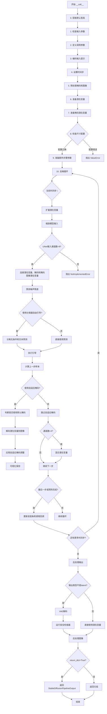

#### 带注释源码

```python
@torch.no_grad()
def __call__(
    self,
    prompt: Union[str, List[str]] = None,
    image: Union[torch.FloatTensor, PIL.Image.Image] = None,
    default_mask_image: Union[torch.FloatTensor, PIL.Image.Image] = None,
    height: Optional[int] = None,
    width: Optional[int] = None,
    strength: float = 1.0,
    num_inference_steps: int = 50,
    guidance_scale: float = 7.5,
    negative_prompt: Optional[Union[str, List[str]]] = None,
    num_images_per_prompt: Optional[int] = 1,
    eta: float = 0.0,
    generator: Optional[Union[torch.Generator, List[torch.Generator]]] = None,
    latents: Optional[torch.FloatTensor] = None,
    prompt_embeds: Optional[torch.FloatTensor] = None,
    negative_prompt_embeds: Optional[torch.FloatTensor] = None,
    output_type: str | None = "pil",
    return_dict: bool = True,
    callback: Optional[Callable[[int, int, torch.FloatTensor], None]] = None,
    callback_steps: int = 1,
    cross_attention_kwargs: Optional[Dict[str, Any]] = None,
    use_adaptive_mask: bool = True,
    enforce_full_mask_ratio: float = 0.5,
    human_detection_thres: float = 0.008,
    visualization_save_dir: str = None,
):
    r"""
    The call function to the pipeline for generation.
    """
    # 0. Default height and width to unet
    width, height = image.size  # 从输入图像获取尺寸
    
    # 1. Check inputs
    # 验证所有输入参数的合法性
    self.check_inputs(
        prompt, height, width, strength, callback_steps,
        negative_prompt, prompt_embeds, negative_prompt_embeds,
    )

    # 2. Define call parameters
    # 根据prompt类型确定批处理大小
    if prompt is not None and isinstance(prompt, str):
        batch_size = 1
    elif prompt is not None and isinstance(prompt, list):
        batch_size = len(prompt)
    else:
        batch_size = prompt_embeds.shape[0]

    device = self._execution_device  # 获取执行设备
    do_classifier_free_guidance = guidance_scale > 1.0  # 判断是否使用分类器自由引导

    # 3. Encode input prompt
    # 编码文本提示为嵌入向量
    text_encoder_lora_scale = (
        cross_attention_kwargs.get("scale", None) if cross_attention_kwargs is not None else None
    )
    prompt_embeds = self._encode_prompt(
        prompt, device, num_images_per_prompt, do_classifier_free_guidance,
        negative_prompt, prompt_embeds=prompt_embeds,
        negative_prompt_embeds=negative_prompt_embeds,
        lora_scale=text_encoder_lora_scale,
    )

    # 4. set timesteps
    # 设置扩散调度器的时间步
    self.scheduler.set_timesteps(num_inference_steps, device=device)
    timesteps, num_inference_steps = self.get_timesteps(
        num_inference_steps=num_inference_steps, strength=strength, device=device
    )
    
    # 验证推理步数有效性
    if num_inference_steps < 1:
        raise ValueError(...)
    
    # 创建初始噪声时间步
    latent_timestep = timesteps[:1].repeat(batch_size * num_images_per_prompt)
    is_strength_max = strength == 1.0  # 判断是否最大强度

    # 5. Preprocess mask and image
    # 预处理掩码和图像
    mask, masked_image, init_image = prepare_mask_and_masked_image(
        image, default_mask_image, height, width, return_image=True
    )
    default_mask_image_np = np.array(default_mask_image).astype(np.uint8) / 255
    mask_condition = mask.clone()

    # 6. Prepare latent variables
    # 准备潜在变量
    num_channels_latents = self.vae.config.latent_channels
    num_channels_unet = self.unet.config.in_channels
    return_image_latents = num_channels_unet == 4

    latents_outputs = self.prepare_latents(
        batch_size * num_images_per_prompt, num_channels_latents,
        height, width, prompt_embeds.dtype, device, generator, latents,
        image=init_image, timestep=latent_timestep,
        is_strength_max=is_strength_max, return_noise=True,
        return_image_latents=return_image_latents,
    )

    if return_image_latents:
        latents, noise, image_latents = latents_outputs
    else:
        latents, noise = latents_outputs

    # 7. Prepare mask latent variables
    # 准备掩码潜在变量
    mask, masked_image_latents = self.prepare_mask_latents(
        mask, masked_image, batch_size * num_images_per_prompt,
        height, width, prompt_embeds.dtype, device, generator,
        do_classifier_free_guidance,
    )

    # 8. Check that sizes of mask, masked image and latents match
    # 检查UNet输入通道配置
    if num_channels_unet == 9:
        num_channels_mask = mask.shape[1]
        num_channels_masked_image = masked_image_latents.shape[1]
        if num_channels_latents + num_channels_mask + num_channels_masked_image != self.unet.config.in_channels:
            raise ValueError(...)
    elif num_channels_unet != 4:
        raise ValueError(...)

    # 9. Prepare extra step kwargs
    # 准备调度器额外参数
    extra_step_kwargs = self.prepare_extra_step_kwargs(generator, eta)

    # 10. Denoising loop
    # 去噪主循环
    mask_image_np = default_mask_image_np
    num_warmup_steps = len(timesteps) - num_inference_steps * self.scheduler.order
    with self.progress_bar(total=num_inference_steps) as progress_bar:
        for i, t in enumerate(timesteps):
            # 扩展潜在变量用于分类器自由引导
            latent_model_input = torch.cat([latents] * 2) if do_classifier_free_guidance else latents

            # 缩放模型输入
            latent_model_input = self.scheduler.scale_model_input(latent_model_input, t)

            if num_channels_unet == 9:
                # 连接潜在变量、掩码和掩码图像潜在变量
                latent_model_input = torch.cat([latent_model_input, mask, masked_image_latents], dim=1)
            else:
                raise NotImplementedError

            # 预测噪声残差
            noise_pred = self.unet(
                latent_model_input, t, encoder_hidden_states=prompt_embeds,
                cross_attention_kwargs=cross_attention_kwargs, return_dict=False,
            )[0]

            # 执行分类器自由引导
            if do_classifier_free_guidance:
                noise_pred_uncond, noise_pred_text = noise_pred.chunk(2)
                noise_pred = noise_pred_uncond + guidance_scale * (noise_pred_text - noise_pred_uncond)

            # 计算上一步样本
            outputs = self.scheduler.step(noise_pred, t, latents, **extra_step_kwargs, return_dict=True)
            latents = outputs["prev_sample"]
            pred_orig_latents = outputs["pred_original_sample"]

            # 自适应掩码处理
            if use_adaptive_mask:
                # 判断是否使用默认掩码
                if enforce_full_mask_ratio > 0.0:
                    use_default_mask = t < self.scheduler.config.num_train_timesteps * enforce_full_mask_ratio
                elif enforce_full_mask_ratio == 0.0:
                    use_default_mask = False
                else:
                    raise NotImplementedError

                # 解码潜在变量到图像
                pred_orig_image = self.decode_to_npuint8_image(pred_orig_latents)
                
                # 获取自适应掩码调度参数
                dilate_num = self.adaptive_mask_settings.dilate_scheduler(i)
                do_adapt_mask = self.adaptive_mask_settings.provoke_scheduler(i)
                
                if do_adapt_mask:
                    # 应用自适应掩码
                    mask, masked_image_latents, mask_image_np, vis_np = self.adapt_mask(
                        init_image, pred_orig_image, default_mask_image_np,
                        dilate_num=dilate_num, use_default_mask=use_default_mask,
                        height=height, width=width, batch_size=batch_size,
                        num_images_per_prompt=num_images_per_prompt,
                        prompt_embeds=prompt_embeds, device=device,
                        generator=generator, do_classifier_free_guidance=do_classifier_free_guidance,
                        i=i, human_detection_thres=human_detection_thres,
                        mask_image_np=mask_image_np,
                    )

                # 可视化保存
                if self.adaptive_mask_model.use_visualizer:
                    import matplotlib.pyplot as plt
                    os.makedirs(visualization_save_dir, exist_ok=True)
                    plt.axis("off")
                    plt.subplot(1, 2, 1)
                    plt.imshow(mask_image_np)
                    plt.subplot(1, 2, 2)
                    plt.imshow(pred_orig_image)
                    plt.savefig(f"{visualization_save_dir}/{i:05}.png", bbox_inches="tight")
                    plt.close("all")

            # 混合潜在变量
            if num_channels_unet == 4:
                init_latents_proper = image_latents[:1]
                init_mask = mask[:1]

                if i < len(timesteps) - 1:
                    noise_timestep = timesteps[i + 1]
                    init_latents_proper = self.scheduler.add_noise(
                        init_latents_proper, noise, torch.tensor([noise_timestep])
                    )

                latents = (1 - init_mask) * init_latents_proper + init_mask * latents

            # 调用回调函数
            if i == len(timesteps) - 1 or ((i + 1) > num_warmup_steps and (i + 1) % self.scheduler.order == 0):
                progress_bar.update()
                if callback is not None and i % callback_steps == 0:
                    callback(i, t, latents)

    # 后处理输出
    if not output_type == "latent":
        condition_kwargs = {}
        if isinstance(self.vae, AsymmetricAutoencoderKL):
            init_image = init_image.to(device=device, dtype=masked_image_latents.dtype)
            init_image_condition = init_image.clone()
            init_image = self._encode_vae_image(init_image, generator=generator)
            mask_condition = mask_condition.to(device=device, dtype=masked_image_latents.dtype)
            condition_kwargs = {"image": init_image_condition, "mask": mask_condition}
        
        # VAE解码
        image = self.vae.decode(latents / self.vae.config.scaling_factor, return_dict=False, **condition_kwargs)[0]
        
        # 运行安全检查器
        image, has_nsfw_concept = self.run_safety_checker(image, device, prompt_embeds.dtype)
    else:
        image = latents
        has_nsfw_concept = None

    # 去归一化处理
    if has_nsfw_concept is None:
        do_denormalize = [True] * image.shape[0]
    else:
        do_denormalize = [not has_nsfw for has_nsfw in has_nsfw_concept]

    # 后处理图像
    image = self.image_processor.postprocess(image, output_type=output_type, do_denormalize=do_denormalize)

    # 卸载最后一个模型到CPU
    if hasattr(self, "final_offload_hook") and self.final_offload_hook is not None:
        self.final_offload_hook.offload()

    # 生成视频
    if self.adaptive_mask_model.use_visualizer:
        generate_video_from_imgs(images_save_directory=visualization_save_dir, fps=10, delete_dir=True)

    # 返回结果
    if not return_dict:
        return (image, has_nsfw_concept)

    return StableDiffusionPipelineOutput(images=image, nsfw_content_detected=has_nsfw_concept)
```


### `AdaptiveMaskInpaintPipeline.decode_to_npuint8_image`

该方法将 VAE 潜在表示（latents）解码为可视化图像，经过后处理转换为 NumPy uint8 格式（0~255 范围），用于自适应掩码的图像处理和分割预测。

参数：

- `latents`：`torch.FloatTensor`，去噪过程中生成的 VAE 潜在表示，形状为 (batch_size, channels, height, width)，数值范围在 [-1, 1] 之间

返回值：`np.ndarray`，解码后的图像，类型为 NumPy uint8 数组，形状为 (height, width, channels)，数值范围 0~255

#### 流程图

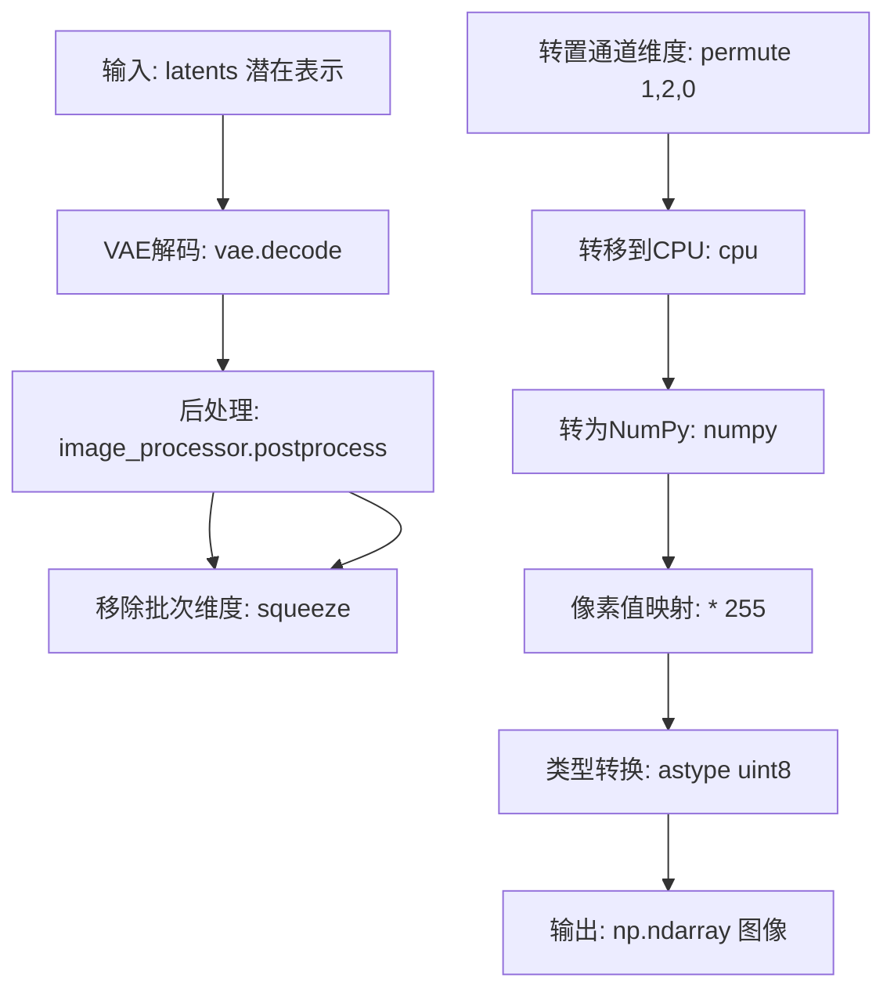

#### 带注释源码

```python
def decode_to_npuint8_image(self, latents):
    # Step 1: 使用 VAE 解码器将潜在表示解码为图像
    # 输入: latents (Float32, 范围 -1~1)
    # 输出: image (Float32, 范围 -1~1)
    image = self.vae.decode(latents / self.vae.config.scaling_factor, return_dict=False, **{})[
        0
    ]  # torch, float32, -1.~1.
    
    # Step 2: 后处理图像，进行去归一化操作
    # 将图像从 [-1, 1] 范围转换到 [0, 1] 范围
    # output_type="pt" 表示输出为 torch.Tensor
    image = self.image_processor.postprocess(image, output_type="pt", do_denormalize=[True] * image.shape[0])
    
    # Step 3: 转换为 NumPy uint8 格式
    # - squeeze(): 移除批次维度，获取单张图像
    # - permute(1, 2, 0): 将通道维度从 CHW 转换为 HWC 格式
    # - detach(): 分离计算图，脱离梯度追踪
    # - cpu(): 将数据从 GPU 转移到 CPU
    # - numpy(): 转换为 NumPy 数组
    # - * 255: 将像素值从 [0, 1] 映射到 [0, 255]
    # - astype(np.uint8): 转换为无符号 8 位整数类型
    image = (image.squeeze().permute(1, 2, 0).detach().cpu().numpy() * 255).astype(np.uint8)  # np, uint8, 0~255
    
    return image
```


### AdaptiveMaskInpaintPipeline.register_adaptive_mask_settings

该方法用于注册自适应掩码（Adaptive Mask）的相关配置参数，包括掩码膨胀调度器（dilate_scheduler）、膨胀核（dilate_kernel）和触发调度器（provoke_scheduler），为图像修复过程中的自适应掩码生成提供参数支持。

参数：无

返回值：无（直接在实例属性 `self.adaptive_mask_settings` 上设置配置）

#### 流程图

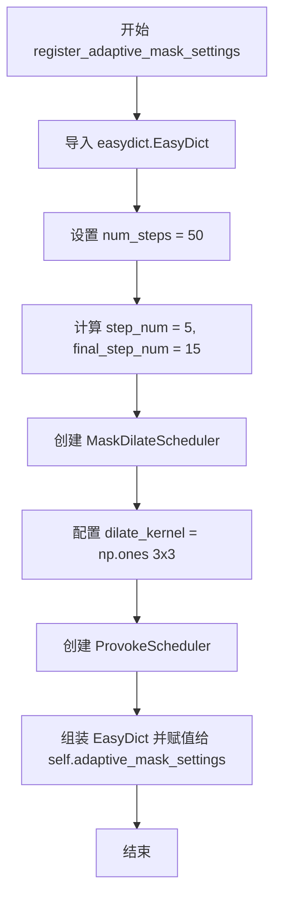

#### 带注释源码

```python
def register_adaptive_mask_settings(self):
    """
    注册自适应掩码设置参数。
    
    该方法初始化并配置自适应掩码所需的调度器和核函数参数，
    包括掩码膨胀调度器、膨胀核和触发调度器，用于控制图像修复过程中
    自适应掩码的生成和行为。
    """
    # 导入EasyDict用于创建动态字典结构
    from easydict import EasyDict

    # 定义推理步骤总数为50步
    num_steps = 50

    # 计算每个阶段的步数：前10%的步数用于早期阶段
    step_num = int(num_steps * 0.1)  # step_num = 5
    # 计算最后阶段剩余的步数
    final_step_num = num_steps - step_num * 7  # final_step_num = 15
    
    # 构建自适应掩码设置字典
    self.adaptive_mask_settings = EasyDict(
        # 掩码膨胀调度器：控制掩码在推理过程中如何膨胀
        dilate_scheduler=MaskDilateScheduler(
            max_dilate_num=20,  # 最大膨胀次数
            num_inference_steps=num_steps,  # 推理步数
            # 膨胀调度计划：早期高膨胀，逐渐降低
            schedule=[20] * step_num       # 0-4步:  膨胀20次
            + [10] * step_num               # 5-9步:  膨胀10次
            + [5] * step_num                # 10-14步: 膨胀5次
            + [4] * step_num                # 15-19步: 膨胀4次
            + [3] * step_num                # 20-24步: 膨胀3次
            + [2] * step_num                # 25-29步: 膨胀2次
            + [1] * step_num                # 30-34步: 膨胀1次
            + [0] * final_step_num,         # 35-49步: 不膨胀
        ),
        # 膨胀核：用于掩码形态学操作的3x3全1矩阵
        dilate_kernel=np.ones((3, 3), dtype=np.uint8),
        
        # 触发调度器：控制何时激活自适应掩码机制
        provoke_scheduler=ProvokeScheduler(
            num_inference_steps=num_steps,
            # 触发步数列表：[2,4,6,8,10,12,14,...,40] + [45]
            schedule=list(range(2, 10 + 1, 2)) + list(range(12, 40 + 1, 2)) + [45],
            is_zero_indexing=False,  # 使用1-based索引
        ),
    )
```


### `AdaptiveMaskInpaintPipeline.register_adaptive_mask_model`

该方法用于在AdaptiveMaskInpaintPipeline中注册并初始化自适应掩码模型（PointRendPredictor），该模型用于在图像修复过程中进行分割掩码的自适应调整，以实现更精确的人体或特定目标的掩码生成。

参数：

- 无显式参数（仅包含`self`）

返回值：`None`，该方法无返回值，通过设置实例属性`self.adaptive_mask_model`来存储初始化后的分割预测模型

#### 流程图

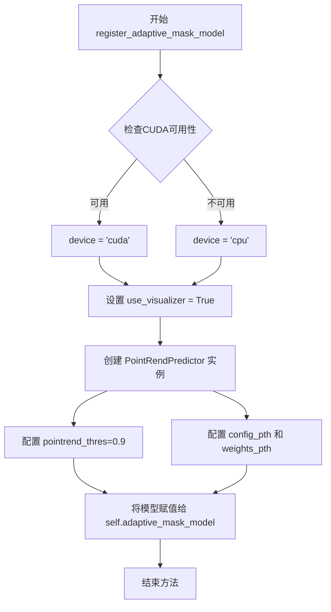

#### 带注释源码

```python
def register_adaptive_mask_model(self):
    # 声明用于掩码适配的分割模型
    # 设置可视化标志为True，用于生成调试可视化图像
    use_visualizer = True
    
    # 注意：如果计划使用可视化功能，请谨慎使用
    # 它会创建包含图像和掩码的目录，用于合并成视频
    # 该过程会删除图像目录，因此如果设置目录错误
    # 可能会导致其他重要文件被删除
    
    # 创建PointRendPredictor实例并赋值给self.adaptive_mask_model
    # 该分割模型用于在去噪过程中生成自适应掩码
    self.adaptive_mask_model = PointRendPredictor(
        # pointrend_thres=0.2,  # 注释掉的较低阈值
        pointrend_thres=0.9,   # 分割预测的置信度阈值，设置为0.9以减少误检
        device="cuda" if torch.cuda.is_available() else "cpu",  # 根据CUDA可用性选择设备
        use_visualizer=use_visualizer,  # 是否启用可视化功能
        config_pth="pointrend_rcnn_R_50_FPN_3x_coco.yaml",  # PointRend模型配置文件路径
        weights_pth="model_final_edd263.pkl",  # 预训练模型权重路径
    )
```


### `AdaptiveMaskInpaintPipeline.adapt_mask`

该方法是自适应掩码修复流程的核心组件，负责在去噪迭代过程中根据当前预测的原始图像动态调整修复掩码。它通过分割模型检测人体区域，对掩码进行膨胀操作，并与默认掩码进行交集运算，最终生成用于下一次迭代的掩码和掩码图像潜在表示。

参数：

- `init_image`：`torch.FloatTensor`，原始输入图像，用于生成被掩码覆盖的图像
- `pred_orig_image`：`np.ndarray`，去噪网络预测的原始图像（从潜在空间解码得到），用于分割模型检测人体区域
- `default_mask_image`：`np.ndarray`，用户提供的默认掩码，定义初始修复区域
- `dilate_num`：`int`，掩码膨胀迭代次数，用于扩展检测到的人体区域
- `use_default_mask`：`bool`，是否强制使用默认掩码，忽略分割结果
- `**kwargs`：包含`batch_size`、`num_images_per_prompt`、`prompt_embeds`、`device`、`generator`、`do_classifier_free_guidance`、`human_detection_thres`、`height`、`width`等运行时参数

返回值：`(torch.FloatTensor, torch.FloatTensor)`，第一个为调整后的二值掩码（形状`[B*C, 1, H, W]`），第二个为掩码图像的潜在表示（形状`[B*C, 4, H, W]`）

#### 流程图

```mermaid
flowchart TD
    A[adapt_mask 调用] --> B[调用 adaptive_mask_model 对 pred_orig_image 进行分割]
    B --> C{检测到的人体区域是否足够大<br/>或 use_default_mask 为 True?}
    C -->|是| D[使用 default_mask_image 作为掩码]
    C -->|否| E[对检测到的掩码进行膨胀操作 dilate_num 次]
    E --> F[将膨胀后的掩码与 default_mask_image 进行逻辑与运算]
    D --> G[将掩码转换为 PyTorch 张量并移动到指定设备]
    F --> G
    G --> H[调用 prepare_mask_and_masked_image 准备掩码和被掩码覆盖的图像]
    H --> I[调用 prepare_mask_latents 生成掩码潜在表示]
    I --> J[返回 mask, masked_image_latents]
```

#### 带注释源码

```python
def adapt_mask(self, init_image, pred_orig_image, default_mask_image, dilate_num, use_default_mask, **kwargs):
    """
    自适应调整修复掩码的核心方法
    
    参数:
        init_image: 原始输入图像
        pred_orig_image: 从去噪网络预测的原始图像（x_0）
        default_mask_image: 用户提供的默认掩码
        dilate_num: 膨胀迭代次数
        use_default_mask: 是否强制使用默认掩码
        **kwargs: 包含 batch_size, num_images_per_prompt, prompt_embeds, device, generator, 
                  do_classifier_free_guidance, human_detection_thres, height, width
    """
    
    # Step 1: 使用分割模型（PointRend）对预测的原图进行人体区域分割
    # adaptive_mask_model 是 PointRendPredictor 实例，用于检测人体等对象
    # 返回的 mask 是二值掩码（HxW），vis 是可视化结果（如果启用）
    adapt_output = self.adaptive_mask_model(pred_orig_image)  # vis can be None if 'use_visualizer' is False
    mask = adapt_output["mask"]
    vis = adapt_output["vis"]

    # Step 2: 判断是否使用默认掩码
    # 条件1: use_default_mask 为 True（强制使用默认掩码）
    # 条件2: 检测到的掩码面积小于阈值（512x512分辨率下 human_detection_thres=0.005 约等于 1307 像素）
    if use_default_mask or mask.sum() < 512 * 512 * kwargs["human_detection_thres"]:  # 0.005
        # 设置掩码为用户提供的默认掩码
        mask = default_mask_image  # HxW

    else:
        # Step 3: 对检测到的掩码进行膨胀操作以覆盖更大区域
        # 膨胀操作使用 3x3 的全1核结构
        mask = cv2.dilate(
            mask, self.adaptive_mask_settings.dilate_kernel, iterations=dilate_num
        )  # dilate_kernel: np.ones((3,3), np.uint8)
        
        # Step 4: 将膨胀后的掩码与默认掩码进行交集运算
        # 确保修复区域不会超出用户指定的默认掩码范围
        mask = np.logical_and(mask, default_mask_image)  # HxW

    # Step 5: 将掩码转换为 PyTorch 张量格式
    # 形状从 HxW 变为 1x1xHxW，并移动到指定设备
    mask = torch.tensor(mask, dtype=torch.float32).to(kwargs["device"])[None, None]  # 1 x 1 x H x W
    
    # Step 6: 调用工具函数准备掩码和被掩码覆盖的图像
    # prepare_mask_and_masked_image 会进行标准化和维度调整
    mask, masked_image = prepare_mask_and_masked_image(
        init_image.to(kwargs["device"]), mask, kwargs["height"], kwargs["width"], return_image=False
    )

    # 保存掩码的 numpy 副本用于可视化或后续处理
    mask_image_np = mask.clone().squeeze().detach().cpu().numpy()

    # Step 7: 准备掩码 latent 表示
    # prepare_mask_latents 会调整掩码大小、编码被掩码的图像为 latent 空间表示
    # 并处理 classifier-free guidance 的批量复制
    mask, masked_image_latents = self.prepare_mask_latents(
        mask,
        masked_image,
        kwargs["batch_size"] * kwargs["num_images_per_prompt"],
        kwargs["height"],
        kwargs["width"],
        kwargs["prompt_embeds"].dtype,
        kwargs["device"],
        kwargs["generator"],
        kwargs["do_classifier_free_guidance"],
    )

    # 返回调整后的掩码和对应的 latent 表示
    # 这些将用于下一次去噪迭代
    return mask, masked_image_latents, mask_image_np, vis
```


### `PointRendPredictor.__init__`

该方法是`PointRendPredictor`类的构造函数，用于初始化基于PointRend的图像分割预测器。它设置了类别过滤、COCO元数据、模型配置、分割模型以及可视化器等关键组件，使预测器能够对图像进行实例分割并可选地可视化结果。

参数：

- `cat_id_to_focus`：`int`，要聚焦的类别ID（默认为0，对应人类）
- `pointrend_thres`：`float`，PointRend的分数阈值（默认为0.9）
- `device`：`str`，模型运行的设备（默认为"cuda"）
- `use_visualizer`：`bool`，是否使用可视化器（默认为False）
- `merge_mode`：`str`，掩码合并模式（默认为"merge"，可选"max-confidence"）
- `config_pth`：`str`，PointRend模型配置文件路径
- `weights_pth`：`str`，PointRend模型权重文件路径

返回值：`None`，该方法为构造函数，不返回任何值

#### 流程图

```mermaid
flowchart TD
    A[开始 __init__] --> B[设置 cat_id_to_focus]
    B --> C[获取COCO元数据 MetadataCatalog.get]
    C --> D[创建detectron2配置 get_cfg]
    D --> E[添加PointRend配置 point_rend.add_pointrend_config]
    E --> F[合并模型配置文件 cfg.merge_from_file]
    F --> G[设置模型权重路径 MODEL.WEIGHTS]
    G --> H[设置分数阈值 ROI_HEADS.SCORE_THRESH_TEST]
    H --> I[设置设备 MODEL.DEVICE]
    I --> J[创建分割模型 DefaultPredictor]
    J --> K[设置可视化器标志 use_visualizer]
    K --> L[验证merge_mode有效性]
    L --> M[设置merge_mode属性]
    M --> N[结束 __init__]
```

#### 带注释源码

```python
def __init__(
    self,
    cat_id_to_focus=0,
    pointrend_thres=0.9,
    device="cuda",
    use_visualizer=False,
    merge_mode="merge",
    config_pth=None,
    weights_pth=None,
):
    """
    初始化PointRend预测器，用于图像实例分割
    
    参数:
        cat_id_to_focus: 要聚焦的COCO类别ID，0表示人类
        pointrend_thres: 检测阈值，高于此分数的实例才被保留
        device: 运行设备的标识符
        use_visualizer: 是否启用分割结果可视化
        merge_mode: 多实例掩码合并策略
        config_pth: PointRend模型配置文件路径
        weights_pth: 预训练模型权重路径
    """
    super().__init__()

    # category id to focus (default: 0, which is human)
    # 设置要检测的类别，0对应COCO数据集中的人类类别
    self.cat_id_to_focus = cat_id_to_focus

    # setup coco metadata
    # 从detectron2的元数据目录获取COCO数据集的元数据，用于可视化
    self.coco_metadata = MetadataCatalog.get("coco_2017_val")
    self.cfg = get_cfg()

    # get segmentation model config
    # 添加PointRend项目特定配置到基础配置中
    point_rend.add_pointrend_config(self.cfg)  # --> Add PointRend-specific config
    # 从配置文件加载完整的模型配置
    self.cfg.merge_from_file(config_pth)
    # 设置预训练权重路径
    self.cfg.MODEL.WEIGHTS = weights_pth
    # 设置实例检测的分数阈值，只保留高于此分数的检测结果
    self.cfg.MODEL.ROI_HEADS.SCORE_THRESH_TEST = pointrend_thres
    # 指定模型运行设备（CPU或GPU）
    self.cfg.MODEL.DEVICE = device

    # get segmentation model
    # 使用配置创建detectron2的默认预测器，用于执行推理
    self.pointrend_seg_model = DefaultPredictor(self.cfg)

    # settings for visualizer
    # 保存可视化标志，在推理时可选择生成可视化结果
    self.use_visualizer = use_visualizer

    # mask-merge mode
    # 验证合并模式的有效性，支持两种策略：
    # 1. merge: 任意实例的掩码合并（并运算）
    # 2. max-confidence: 保留最高置信度实例的掩码
    assert merge_mode in ["merge", "max-confidence"], f"'merge_mode': {merge_mode} not implemented."
    self.merge_mode = merge_mode
```


### `PointRendPredictor.merge_mask`

该方法用于将多个分割掩码合并为一个掩码，支持两种合并模式：通过逻辑或运算合并所有掩码，或选择置信度最高的掩码。

参数：

- `masks`：`np.ndarray`，要合并的分割掩码数组，形状为 (N, H, W)，其中 N 是掩码数量，H 和 W 是图像高度和宽度
- `scores`：`np.ndarray`（可选），每个掩码对应的置信度分数，用于“最大置信度”合并模式

返回值：`np.ndarray`，合并后的二值掩码，形状为 (H, W)

#### 流程图

```mermaid
flowchart TD
    A[开始 merge_mask] --> B{merge_mode == 'merge'?}
    B -- 是 --> C[使用 np.any 合并掩码]
    B -- 否 --> D{merge_mode == 'max-confidence'?}
    D -- 是 --> E[找到最高分数的索引]
    E --> F[选择该索引对应的掩码]
    D -- 否 --> G[返回空掩码]
    C --> H[返回合并后的掩码]
    F --> H
    G --> H
```

#### 带注释源码

```python
def merge_mask(self, masks, scores=None):
    """
    合并多个分割掩码为单个掩码。
    
    根据 merge_mode 属性选择不同的合并策略：
    - 'merge': 使用逻辑或运算合并所有掩码
    - 'max-confidence': 选择置信度最高的掩码
    
    Args:
        masks (np.ndarray): 分割掩码数组，形状为 (N, H, W)
        scores (np.ndarray, optional): 掩码对应的置信度分数
    
    Returns:
        np.ndarray: 合并后的二值掩码，形状为 (H, W)
    """
    # 如果合并模式为 'merge'，则使用逻辑或运算合并所有掩码
    # np.any(masks, axis=0) 沿着第一维（掩码数量）进行逻辑或操作
    # 结果是对于每个像素位置，只要任意一个掩码为 True 则结果为 True
    if self.merge_mode == "merge":
        mask = np.any(masks, axis=0)
    
    # 如果合并模式为 'max-confidence'，则选择置信度最高的掩码
    # np.argmax(scores) 找到分数最高的掩码索引
    elif self.merge_mode == "max-confidence":
        mask = masks[np.argmax(scores)]
    
    return mask
```


### `PointRendPredictor.vis_seg_on_img`

该方法用于将分割掩码可视化叠加到原始图像上，使用 Detectron2 的 Visualizer 类绘制实例分割结果，支持将掩码转换为 Instances 对象并生成可视化图像。

参数：

- `image`：图像数据（numpy array 或 PIL.Image），作为可视化背景的原始输入图像
- `mask`：分割掩码（numpy array 或 torch.Tensor），待可视化的预测分割掩码，支持单通道或批量格式

返回值：`numpy.ndarray`，可视化后的图像数据，包含叠加在原始图像上的分割结果

#### 流程图

```mermaid
flowchart TD
    A[开始 vis_seg_on_img] --> B{判断 mask 类型}
    B -->|mask 是 numpy.ndarray| C[将 mask 转换为 torch.Tensor]
    B -->|mask 已是 Tensor| D[跳过转换]
    C --> E[创建 Visualizer 实例]
    D --> E
    E --> F[创建 Instances 对象]
    F --> G[调用 draw_instance_predictions 绘制实例预测]
    G --> H[获取可视化图像]
    H --> I[返回可视化结果]
    
    E -.->|参数| E1[image: 原始图像]
    E -.->|参数| E2[coco_metadata: COCO 数据集元数据]
    E -.->|参数| E3[scale: 0.5]
    E -.->|参数| E4[instance_mode: ColorMode.IMAGE_BW]
    
    F -.->|参数| F1[image_size: 图像尺寸]
    F -.->|参数| F2[pred_masks: 预测掩码]
```

#### 带注释源码

```python
def vis_seg_on_img(self, image, mask):
    """
    在图像上可视化分割掩码
    
    Args:
        image: 原始输入图像，用于作为可视化背景
        mask: 预测的分割掩码，可以是 numpy array 或 torch.Tensor 格式
    
    Returns:
        numpy.ndarray: 可视化后的图像，包含叠加的分割结果
    """
    # 如果掩码是 numpy 数组，转换为 PyTorch 张量
    # 以便与 Detectron2 的 Instances 兼容
    if type(mask) == np.ndarray:
        mask = torch.tensor(mask)
    
    # 创建 Detectron2 的 Visualizer 对象
    # 参数说明:
    #   - image: 输入图像作为背景
    #   - self.coco_metadata: COCO 数据集的元数据，用于类别名称映射
    #   - scale=0.5: 可视化缩放因子
    #   - instance_mode=ColorMode.IMAGE_BW: 实例可视化模式为黑白背景
    v = Visualizer(image, self.coco_metadata, scale=0.5, instance_mode=ColorMode.IMAGE_BW)
    
    # 构建 Instances 对象用于存储实例分割预测
    # 如果 mask 为 3D 张量则直接使用，否则在第 0 维增加批次维度
    # image_size 参数指定图像的空间尺寸 (H, W)
    instances = Instances(
        image_size=image.shape[:2], 
        pred_masks=mask if len(mask.shape) == 3 else mask[None]
    )
    
    # 调用 Visualizer 的绘制方法，传入 Instances 对象
    # .to('cpu') 确保在 CPU 上执行可视化
    # .get_image() 获取绘制后的图像数据
    vis = v.draw_instance_predictions(instances.to("cpu")).get_image()
    
    return vis
```


### `PointRendPredictor.__call__`

对输入图像进行实例分割预测，并将指定类别的分割掩码合并后返回。

参数：

- `image`：`numpy.ndarray`，输入的图像数据，用于进行分割预测

返回值：`Dict[str, Optional[numpy.ndarray]]`，返回包含分割掩码和可视化结果的字典，包含以下键：
- `"asset_mask"`：始终为 `None`
- `"mask"`：合并后的分割掩码，`numpy.ndarray` 类型
- `"vis"`：可视化结果，仅当 `use_visualizer=True` 时存在，否则为 `None`

#### 流程图

```mermaid
flowchart TD
    A[输入图像] --> B[运行分割模型]
    B --> C[获取分割结果 instances]
    C --> D{筛选目标类别}
    D -->|是| E[获取目标类别掩码]
    D -->|否| F[返回空掩码]
    E --> G[合并多个实例掩码]
    G --> H[转换为numpy数组]
    H --> I{是否启用可视化}
    I -->|是| J[生成可视化图像]
    I -->|否| K[可视化设为None]
    J --> L[构建返回字典]
    K --> L
    L --> M[返回结果字典]
    F --> M
```

#### 带注释源码

```python
def __call__(self, image):
    """
    对输入图像进行实例分割预测
    
    参数:
        image: 输入图像，numpy数组格式
        
    返回:
        字典，包含:
            - asset_mask: 始终为None
            - mask: 合并后的分割掩码，uint8类型
            - vis: 可视化图像（如果启用）
    """
    # 使用PointRend分割模型对图像进行预测
    outputs = self.pointrend_seg_model(image)
    instances = outputs["instances"]  # 获取分割结果实例

    # 筛选指定类别的实例（例如人物类别）
    is_class = instances.pred_classes == self.cat_id_to_focus
    # 获取所有目标类别的分割掩码
    masks = instances.pred_masks[is_class]
    # 将掩码从tensor转换为numpy数组，形状为[N, img_size, img_size]
    masks = masks.detach().cpu().numpy()
    # 合并多个实例的掩码（使用any或max-confidence方式）
    mask = self.merge_mask(masks, scores=instances.scores[is_class])

    # 构建返回字典
    return {
        "asset_mask": None,  # 保留字段，当前未使用
        "mask": mask.astype(np.uint8),  # 转换为uint8类型
        "vis": self.vis_seg_on_img(image, mask) if self.use_visualizer else None,  # 可视化结果
    }
```


### `MaskDilateScheduler.__init__`

这是 `MaskDilateScheduler` 类的构造函数，用于初始化掩码膨胀调度器。该调度器用于在图像修复过程中自适应地控制掩码的膨胀程度，支持自定义调度计划或使用默认的线性递减调度策略。

参数：

- `max_dilate_num`：`int`，最大膨胀迭代次数，默认为 15，用于限制掩码膨胀的上限
- `num_inference_steps`：`int`，扩散模型的推理步数，默认为 50，用于确定调度列表的长度
- `schedule`：`Optional[List[int]]`，自定义的膨胀调度列表，默认为 None；当为 None 时，自动生成从 num_inference_steps 递减到 1 的列表

返回值：`None`，构造函数不返回任何值，仅初始化对象状态

#### 流程图

```mermaid
flowchart TD
    A[开始 __init__] --> B{schedule 是否为 None?}
    B -->|是| C[生成默认调度列表]
    B -->|否| D[使用传入的 schedule]
    C --> E[schedule = [num_inference_steps - i for i in range(num_inference_steps)]]
    D --> F[直接使用传入的 schedule]
    E --> G{验证 schedule 长度}
    F --> G
    G -->|长度等于 num_inference_steps| H[设置实例属性]
    G -->|长度不等| I[抛出 AssertionError]
    H --> J[self.max_dilate_num = max_dilate_num]
    H --> K[self.schedule = schedule]
    J --> L[结束 __init__]
    K --> L
    I --> L
```

#### 带注释源码

```python
class MaskDilateScheduler:
    def __init__(self, max_dilate_num=15, num_inference_steps=50, schedule=None):
        """
        掩码膨胀调度器的初始化方法。
        
        该调度器用于在自适应掩码修复过程中，根据当前推理步骤动态调整
        掩码的膨胀程度。膨胀操作可以使掩码边界更加平滑，改善修复效果。
        
        参数:
            max_dilate_num (int): 最大膨胀迭代次数，限制单次膨胀的最大值，
                                  防止掩码过度膨胀导致修复区域过大。默认值为 15。
            num_inference_steps (int): 扩散模型的推理总步数，用于确定调度
                                        列表的长度。默认值为 50。
            schedule (Optional[List[int]]): 自定义的膨胀调度列表，每个元素表示
                                            对应推理步骤的膨胀迭代次数。如果为
                                            None，则自动生成线性递减的调度列表。
                                            默认值为 None。
        
        返回值:
            None: 构造函数不返回任何值，仅初始化对象状态。
        
        示例:
            >>> # 使用默认调度
            >>> scheduler = MaskDilateScheduler()
            >>> # 使用自定义调度
            >>> scheduler = MaskDilateScheduler(max_dilate_num=20, num_inference_steps=50, 
            ...                                 schedule=[20, 15, 10, 5, 0] * 10)
        """
        # 调用父类构造函数，保持类继承链的完整性
        super().__init__()
        
        # 设置最大膨胀迭代次数属性
        self.max_dilate_num = max_dilate_num
        
        # 调度列表初始化逻辑：
        # 如果未提供 schedule，则生成默认的线性递减调度列表
        # 列表长度等于推理步数，值从 num_inference_steps-1 递减到 0
        # 例如：num_inference_steps=5 时，schedule = [4, 3, 2, 1, 0]
        if schedule is None:
            self.schedule = [num_inference_steps - i for i in range(num_inference_steps)]
        else:
            self.schedule = schedule
        
        # 断言验证：确保传入的 schedule 长度与推理步数匹配
        # 这是保证调度器正常工作的前提条件
        assert len(self.schedule) == num_inference_steps
```


### `MaskDilateScheduler.__call__`

该方法实现了调度器接口，使 `MaskDilateScheduler` 实例可像函数一样调用。它根据当前推理步骤索引 `i` 从预定义的调度表中获取对应的膨胀迭代次数，并确保返回值不超过最大膨胀次数 `max_dilate_num`，从而实现随去噪进程逐渐减小掩码膨胀范围的渐进式掩码控制。

参数：

- `i`：`int`，当前推理步骤的索引（从 0 开始），用于从调度表中查找对应的膨胀值

返回值：`int`，返回当前步骤应该使用的掩码膨胀迭代次数，值为 `schedule[i]` 和 `max_dilate_num` 中的较小值

#### 流程图

```mermaid
flowchart TD
    A[开始 __call__] --> B[输入当前步骤索引 i]
    B --> C{验证索引有效性}
    C -->|有效| D[从 self.schedule 获取 schedule[i]]
    C -->|无效| E[抛出索引越界异常]
    D --> F[计算返回值: min(self.max_dilate_num, schedule[i])]
    F --> G[返回膨胀迭代次数]
```

#### 带注释源码

```python
def __call__(self, i):
    """
    调度器调用接口，根据当前推理步骤返回掩码膨胀迭代次数。
    
    该方法实现了可调用对象接口，使类的实例可以像函数一样被调用。
    在自适应掩码修复pipeline中，此调度器控制随去噪进程推进，掩码膨胀
    迭代次数如何变化。通常在去噪早期使用较大的膨胀次数以获得更宽松的
    修复区域，随着去噪进行逐渐减小膨胀次数，使修复区域收敛到原始掩码范围。
    
    Args:
        i (int): 当前推理步骤的索引，从0开始。
                 用于从self.schedule列表中查找对应的膨胀值。
    
    Returns:
        int: 返回当前步骤应使用的掩码膨胀迭代次数。
             返回值 = min(self.max_dilate_num, self.schedule[i])
             这样设计确保返回值不会超过预设的最大膨胀次数，
             同时允许调度表中的值根据去噪进程动态调整。
    
    Example:
        >>> scheduler = MaskDilateScheduler(max_dilate_num=20, num_inference_steps=50)
        >>> # 在推理早期可能返回较大的膨胀值
        >>> dilate_num = scheduler(0)  # 假设schedule[0]=20, 返回20
        >>> # 在推理后期返回较小的膨胀值
        >>> dilate_num = scheduler(40)  # 假设schedule[40]=1, 返回1
    """
    return min(self.max_dilate_num, self.schedule[i])
```


### `ProvokeScheduler.__init__`

用于初始化ProvokeScheduler类，该类是一个调度器，用于管理自适应掩码在扩散模型推理过程中的触发时机。

参数：

- `num_inference_steps`：`int`，推理过程中的总步数，默认值为50
- `schedule`：`Optional[List[int]]`，需要触发自适应掩码的步骤列表，默认为None
- `is_zero_indexing`：`bool`，是否为从0开始的索引方式，默认值为False

返回值：无返回值（`None`），作为构造函数初始化对象状态

#### 流程图

```mermaid
flowchart TD
    A[开始 __init__] --> B{schedule 长度 > 0?}
    B -->|是| C{is_zero_indexing 为真?}
    B -->|否| D[设置 is_zero_indexing 和 schedule 属性]
    C -->|是| E[断言 max schedule <= num_inference_steps - 1]
    C -->|否| F[断言 max schedule <= num_inference_steps]
    E --> D
    F --> D
    D --> G[结束 __init__]
```

#### 带注释源码

```python
class ProvokeScheduler:
    def __init__(self, num_inference_steps=50, schedule=None, is_zero_indexing=False):
        """
        初始化ProvokeScheduler调度器
        
        Args:
            num_inference_steps: 推理过程中的总步数，默认为50
            schedule: 需要触发自适应掩码的步骤列表，默认为None
            is_zero_indexing: 是否使用从0开始的索引方式，默认为False
        """
        super().__init__()
        
        # 如果提供了schedule，则验证其有效性
        if len(schedule) > 0:
            if is_zero_indexing:
                # 零索引模式下，schedule中的值应小于总步数
                assert max(schedule) <= num_inference_steps - 1
            else:
                # 一索引模式下，schedule中的值应小于等于总步数
                assert max(schedule) <= num_inference_steps

        # 将参数注册为实例属性
        self.is_zero_indexing = is_zero_indexing
        self.schedule = schedule
```


### `ProvokeScheduler.__call__`

该方法是`ProvokeScheduler`类的核心调用接口，用于在扩散模型推理过程中判断当前步骤是否需要触发自适应掩码适配（provoke）。它根据推理步骤索引和预定义的调度计划，决定是否对当前生成的掩码进行自适应调整。

参数：

-  `i`：`int`，推理过程的当前步骤索引（从0开始的整数）

返回值：`bool`，返回`True`表示当前步骤需要触发自适应掩码适配，返回`False`表示不需要触发

#### 流程图

```mermaid
flowchart TD
    A[开始 __call__] --> B{self.is_zero_indexing?}
    B -->|True| C{检查 i 是否在 self.schedule 中}
    B -->|False| D{检查 i+1 是否在 self.schedule 中}
    C --> E[返回 i in self.schedule]
    D --> F[返回 i+1 in self.schedule]
    E --> G[结束]
    F --> G
```

#### 带注释源码

```python
def __call__(self, i):
    """
    判断给定推理步骤是否需要触发自适应掩码适配
    
    参数:
        i: int, 推理过程的当前步骤索引
        
    返回:
        bool: True表示当前步骤需要触发自适应掩码适配,False表示不需要
    """
    # 如果使用零索引方式，直接检查步骤索引是否在调度计划中
    if self.is_zero_indexing:
        return i in self.schedule
    # 如果使用一索引方式，需要将步骤索引加1后检查
    else:
        return i + 1 in self.schedule
```

#### 设计说明

该调度器实现了`__call__`方法，使`ProvokeScheduler`实例可以像函数一样被调用。在扩散模型的推理循环中，通过`self.adaptive_mask_settings.provoke_scheduler(i)`判断第`i`步是否需要应用自适应掩码策略。

- 当`is_zero_indexing=False`（默认）时，`i`从0开始计数，`schedule`中的值表示**步骤编号**（从1开始），例如schedule=[2,4,6]表示在第2、4、6步触发
- 当`is_zero_indexing=True`时，`schedule`中的值直接表示**索引位置**（从0开始）

## 关键组件


### AdaptiveMaskInpaintPipeline

主管道类，继承自DiffusionPipeline，实现文本引导的图像修复功能。核心特点是在去噪循环中动态更新掩码，通过PointRend分割模型预测人类/对象区域，并使用自适应膨胀调度器调整掩码范围，以获得更好的修复效果。

### PointRendPredictor

基于Detectron2的PointRend模型的对象分割预测器，用于在推理过程中实时分割图像中的特定类别对象（如人类），生成精细的分割掩码。该组件支持可视化模式，可输出分割结果的可视化图像。

### MaskDilateScheduler

掩码膨胀调度器类，根据推理步骤动态控制掩码膨胀迭代次数。通过预定义的调度表，在不同去噪阶段应用不同的膨胀程度，使掩码能够自适应地扩展以包含更多相关区域。

### ProvokeScheduler

自适应掩码触发调度器，决定在哪些推理步骤触发掩码更新。通过调度列表控制何时调用分割模型进行新的掩码预测，实现时间步自适应的掩码更新策略，平衡计算效率和修复质量。

### prepare_mask_and_masked_image

图像和掩码预处理函数，将PIL图像、NumPy数组或PyTorch张量格式的图像和掩码统一转换为批处理张量格式（batch x channels x height x width），并对图像进行归一化到[-1,1]范围，掩码二值化到[0,1]范围。

### adapt_mask

自适应掩码更新方法，在去噪循环的特定步骤调用分割模型预测对象掩码，根据检测阈值和掩码面积决定使用默认掩码还是预测掩码，并对预测掩码进行膨胀操作后与默认掩码取交集，生成最终用于下一步去噪的掩码。

### decode_to_npuint8_image

潜在表示解码函数，将VAE解码后的浮点张量图像转换为NumPy uint8格式（0-255范围），用于分割模型预测和可视化。

### generate_video_from_imgs

视频生成工具函数，将推理过程中保存的掩码和图像可视化帧合成为MP4视频，便于观察自适应掩码的动态变化过程。

### Adaptive Mask机制（核心创新）

集成在去噪循环中的自适应掩码策略，包括：1）张量索引与惰性加载：按需加载和更新掩码；2）分割模型集成：使用PointRend进行实时对象检测；3）调度器控制：通过MaskDilateScheduler和ProvokeScheduler控制掩码更新时机和膨胀程度；4）与默认掩码融合：结合分割结果与初始掩码形成最终掩码。


## 问题及建议


### 已知问题

-   **硬编码配置值**：多处硬编码的配置值如 `num_steps = 50`、`pointrend_thres=0.9`、`human_detection_thres=0.008` 等，应该通过参数化或配置文件管理
-   **未清理的注释代码**：存在多处被注释掉的代码（如 `use_visualizer` 的断言、`safety_checker` 参数等），增加了代码维护负担
-   **不完整的类型注解**：部分函数参数缺少类型注解，如 `default_mask_image`、`mask` 参数在某些方法中
-   **使用已废弃API**：`deprecate` 函数的使用表明代码需要兼容旧版本API，这增加了维护复杂度
-   **外部依赖管理脆弱**：代码依赖特定版本的detectron2、pytorch、diffusers等库，且需要手动下载外部模型权重（pointrend的config和weights）
-   **资源管理问题**：使用 `os.system` 调用ffmpeg生成视频，不够优雅且难以捕获错误；临时文件和目录的清理逻辑分散
-   **错误处理不足**：缺少对网络请求失败、文件下载失败、模型加载失败等情况的健壮处理
-   **潜在的内存泄漏**：在 `__call__` 方法中大量的tensor操作没有显式释放，可能导致显存累积
-   **魔数使用**：代码中多处使用魔数如 `512 * 512`、`0.005` 等，缺乏常量定义
-   **违反单一职责**：视频生成函数 `generate_video_from_imgs` 与核心pipeline逻辑强耦合

### 优化建议

-   **配置外部化**：将硬编码的配置值提取到配置类或YAML/JSON配置文件中，便于调整和版本管理
-   **清理技术债务**：移除所有注释掉的代码，简化代码库；使用版本检查替代已废弃的deprecation机制
-   **完善类型注解**：为所有函数参数和返回值添加完整的类型注解，提高代码可读性和IDE支持
-   **依赖版本管理**：使用 `requirements.txt` 或 `pyproject.toml` 明确声明依赖版本范围；考虑使用Docker容器化部署
-   **改进资源管理**：封装ffmpeg调用为独立函数或使用Python库（如moviepy）替代os.system；统一管理临时文件和目录的生命周期
-   **增强错误处理**：为网络请求、文件操作、模型加载等添加try-except包装和重试机制；提供有意义的错误信息
-   **内存优化**：在循环中显式调用 `torch.cuda.empty_cache()`；使用 `with torch.no_grad()` 上下文管理器
-   **常量提取**：定义常量类或枚举来管理魔数，如 `MIN_DETECTION_AREA = 512 * 512`
-   **模块化重构**：将视频生成、图像处理等辅助功能提取为独立模块或工具类，降低耦合度
-   **添加单元测试**：为核心功能添加测试用例，特别是边界条件和异常情况


## 其它


### 设计目标与约束

本管道的设计目标是实现一种自适应蒙版图像修复方法，通过动态调整修复过程中的蒙版区域来更好地保留图像中的人物区域。该方法基于"Beyond the Contact: Discovering Comprehensive Affordance for 3D Objects from Pre-trained 2D Diffusion Models"论文（ECCV-2024 Oral）。主要约束包括：需要使用Stable Diffusion v1.5作为基础模型；依赖detectron2框架的PointRend模型进行人体分割；输入图像尺寸必须能被8整除；仅支持Linux和CUDA环境。

### 错误处理与异常设计

代码中包含多种错误处理机制。在`check_inputs`方法中验证输入参数合法性，包括强度值范围、图像尺寸、回调步数等。在`prepare_mask_and_masked_image`函数中检查图像和蒙版的维度匹配性、像素值范围。管道初始化时检查safety_checker与feature_extractor的配套使用。对于模型版本兼容性，通过deprecation_warning提示过时的配置参数。主要异常类型包括：ValueError（参数不合法）、TypeError（类型不匹配）、ImportError（依赖缺失）、RuntimeError（推理过程中的错误）。

### 数据流与状态机

管道执行流程分为以下主要阶段：1)输入验证与参数准备；2)文本编码（_encode_prompt）；3)图像与蒙版预处理；4)潜在变量初始化；5)去噪循环（核心推理阶段）；6)VAE解码与后处理。在去噪循环中，管道会根据`use_adaptive_mask`参数动态调整蒙版，通过PointRend模型预测当前生成结果中的人物区域，并使用膨胀调度器（MaskDilateScheduler）和触发调度器（ProvokeScheduler）控制蒙版演化。状态转换由`scheduler.step()`控制，遵循扩散模型的采样调度流程。

### 外部依赖与接口契约

核心依赖包括：diffusers（扩散模型框架）、transformers（CLIP文本编码器）、detectron2（PointRend分割模型）、opencv-python（图像处理）、numpy、PIL、torch。管道继承自DiffusionPipeline，实现了TextualInversionLoaderMixin、LoraLoaderMixin和FromSingleFileMixin接口以支持LoRA和Textual Inversion。输入接口要求prompt（字符串或列表）、image（PIL.Image或Tensor）、default_mask_image（蒙版图像）。输出返回StableDiffusionPipelineOutput，包含生成的图像列表和NSFW检测标志。

### 性能考虑与优化空间

管道支持模型CPU卸载（enable_model_cpu_offload）以降低显存占用。支持混合精度推理（torch.float16）。提供了visualization_save_dir参数用于生成过程可视化。当前潜在优化方向包括：1)PointRend模型推理可考虑使用TensorRT加速；2)蒙版调整逻辑可异步执行避免阻塞去噪循环；3)视频生成功能使用GPU加速的ffmpeg；4)可添加批处理支持以提高吞吐量。

### 安全性考虑

代码包含NSFW内容检测模块（safety_checker），可选择启用或禁用。当safety_checker被禁用时会输出警告信息。建议在公开服务中保持安全过滤器启用。生成的图像会经过后处理以检测不当内容。模型下载来源于HuggingFace Hub，需验证模型完整性。

### 兼容性考虑

代码针对Stable Diffusion v1.5和inpainting变体设计。对UNet配置有版本检查，提示sample_size小于64的配置更新建议。调度器配置要求steps_offset为1，skip_prk_steps为True。依赖版本约束：detectron2==0.6、diffusers==0.20.2、accelerate、transformers、opencv-python、numpy==1.24.1。仅支持CUDA 11.3和PyTorch 1.10.1环境。

### 测试策略建议

建议测试场景包括：1)标准图像修复功能验证；2)自适应蒙版开关对比测试；3)不同strength参数对结果影响；4)多GPU环境下的模型卸载功能；5)边界情况处理（空蒙版、全蒙版、超大图像）；6)LoRA权重加载与推理；7)视频生成功能完整性；8)NSFW检测功能验证。

    