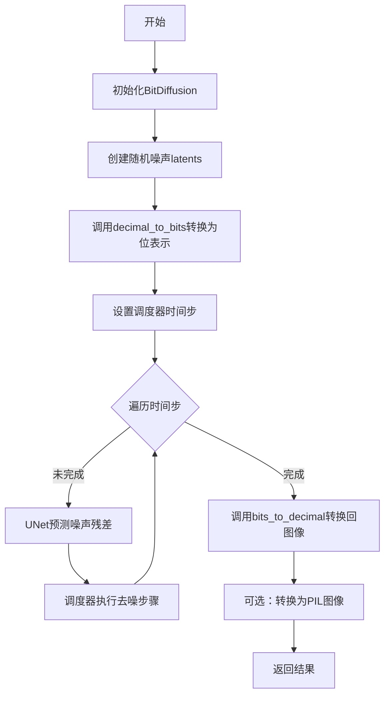
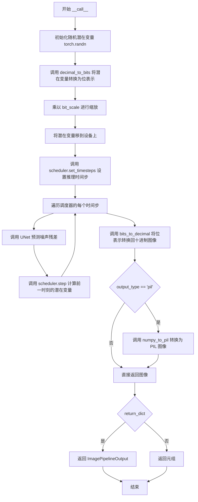

# `diffusers\examples\community\bit_diffusion.py` 详细设计文档

BitDiffusion是一种位扩散模型实现，通过将图像转换为位表示（bit representation）并在位空间执行扩散过程来实现图像生成，支持DDIM和DDPMScheduler两种调度策略，并提供了位与十进制之间的转换功能。

## 整体流程



## 类结构

```
BitDiffusion (继承自DiffusionPipeline)
├── 全局函数
│   ├── decimal_to_bits
│   ├── bits_to_decimal
│   ├── ddim_bit_scheduler_step
│   └── ddpm_bit_scheduler_step
```

## 全局变量及字段


### `BITS`
    
Number of bits used for bit representation (default 8 bits)

类型：`int`
    


### `BitDiffusion.unet`
    
The UNet2DConditionModel used for predicting noise in the diffusion process

类型：`UNet2DConditionModel`
    


### `BitDiffusion.scheduler`
    
The diffusion scheduler for controlling the denoising process steps

类型：`Union[DDIMScheduler, DDPMScheduler]`
    


### `BitDiffusion.bit_scale`
    
Scaling factor for bit representations, used to clamp predicted x_0 values

类型：`float`
    
    

## 全局函数及方法


### `decimal_to_bits`

将图像张量从 0-1 范围转换为位表示形式（-1 到 1 范围）。该函数将每个像素的 8 位值提取为单独的特征通道，使得扩散模型能够在位级别处理图像信息。

参数：

- `x`：`torch.Tensor`，输入的图像张量，值范围在 0 到 1 之间
- `bits`：`int`，每个通道的位数，默认为 8（即 BITS 全局变量）

返回值：`torch.Tensor`，位张量，值范围在 -1 到 1 之间，通道数变为原来的 bits 倍

#### 流程图

```mermaid
flowchart TD
    A[开始: 输入张量 x ∈ [0, 1]] --> B[获取设备信息: device = x.device]
    B --> C[量化到 0-255 范围: x = (x * 255).int().clamp(0, 255)]
    C --> D[创建位掩码: mask = 2 ** torch.arange(bits - 1, -1, -1, device=device)]
    D --> E[重排掩码维度: mask → (bits, 1, 1)]
    E --> F[重排输入张量: x → (b, c, 1, h, w)]
    F --> G[位提取: bits = ((x & mask) != 0).float()]
    G --> H[重排位张量: bits → (b, c*bits, h, w)]
    H --> I[缩放到 [-1, 1]: bits = bits * 2 - 1]
    I --> J[返回: 位表示张量 ∈ [-1, 1]]
```

#### 带注释源码

```python
def decimal_to_bits(x, bits=BITS):
    """expects image tensor ranging from 0 to 1, outputs bit tensor ranging from -1 to 1"""
    # 步骤1: 获取输入张量所在的设备（CPU/CUDA）
    device = x.device

    # 步骤2: 将 0-1 范围的浮点数转换为 0-255 范围的整数
    # 乘以 255 放大范围，转换为整数类型，然后 clamp 到 [0, 255]
    x = (x * 255).int().clamp(0, 255)

    # 步骤3: 创建位掩码，用于提取每个位平面
    # 例如当 bits=8 时，生成 [128, 64, 32, 16, 8, 4, 2, 1]
    # 从最高位到最低位排列
    mask = 2 ** torch.arange(bits - 1, -1, -1, device=device)
    
    # 步骤4: 重排掩码维度以便进行广播操作
    # 从 (d,) 变为 (d, 1, 1)
    mask = rearrange(mask, "d -> d 1 1")
    
    # 步骤5: 重排输入张量以适应位提取
    # 从 (b, c, h, w) 变为 (b, c, 1, h, w)，在通道维度后添加一个维度
    x = rearrange(x, "b c h w -> b c 1 h w")

    # 步骤6: 使用位掩码提取每个位
    # (x & mask) 进行按位与操作，!= 0 判断该位是否为 1
    # 结果转换为浮点数，得到 0.0 或 1.0
    bits = ((x & mask) != 0).float()
    
    # 步骤7: 重排位张量，将位维度合并到通道维度
    # 从 (b, c, d, h, w) 变为 (b, c*d, h, w)
    # 例如 3 通道图像变成 24 通道 (3 * 8)
    bits = rearrange(bits, "b c d h w -> b (c d) h w")
    
    # 步骤8: 将位值从 [0, 1] 缩放到 [-1, 1]
    # 0 -> -1, 1 -> 1
    bits = bits * 2 - 1
    
    return bits
```


### `bits_to_decimal`

将位表示（-1 到 1）转换回十进制图像张量（0 到 1）。该函数接收包含位信息的张量，通过将 -1/1 表示转换为 0/1 二进制位，然后使用位掩码加权求和得到十进制值，最后归一化到 [0, 1] 范围。

参数：

- `x`：`torch.Tensor`，输入张量，包含从 -1 到 1 的位表示
- `bits`：`int`（默认值 `BITS=8`），每个通道的位数

返回值：`torch.Tensor`，返回归一化到 0 到 1 范围内的图像张量

#### 流程图

```mermaid
flowchart TD
    A[开始: 输入位张量 x] --> B[获取设备信息<br/>device = x.device]
    C[将位表示转换为二进制<br/>x = (x > 0).int()]
    B --> C
    D[创建位掩码<br/>mask = 2 ** torch.arange(bits-1, -1, -1, device=device, dtype=torch.int32)]
    C --> D
    E[重排掩码维度<br/>mask = rearrange(mask, 'd -> d 1 1')]
    D --> F[重排输入张量<br/>x = rearrange(x, 'b (c d) h w -> b c d h w', d=8)]
    E --> F
    G[逐位加权求和<br/>dec = reduce(x * mask, 'b c d h w -> b c h w', 'sum')]
    F --> H[归一化到0-1范围<br/>return (dec / 255).clamp(0.0, 1.0)]
    G --> H
    H --> I[结束: 输出图像张量]
```

#### 带注释源码

```python
def bits_to_decimal(x, bits=BITS):
    """
    将位表示（-1 到 1）转换为十进制图像张量（0 到 1）
    
    参数:
        x: 输入张量，包含从 -1 到 1 的位表示
        bits: 每个通道的位数，默认为 8
    
    返回:
        归一化到 0 到 1 范围内的图像张量
    """
    # 步骤1: 获取输入张量所在的设备（CPU或GPU）
    device = x.device

    # 步骤2: 将位表示转换为二进制
    # 将 -1 到 1 的表示转换为 0/1 二进制:
    # x > 0 的位置为 True (转为 1)，否则为 False (转为 0)
    x = (x > 0).int()

    # 步骤3: 创建位掩码，用于位权重的计算
    # 对于 8 位，生成 [128, 64, 32, 16, 8, 4, 2, 1] 的掩码
    # 这些值对应二进制位的权重 (2^7, 2^6, ..., 2^0)
    mask = 2 ** torch.arange(bits - 1, -1, -1, device=device, dtype=torch.int32)

    # 步骤4: 重排掩码维度以便进行广播操作
    # 将一维掩码 [d] 重排为 [d, 1, 1]，便于与四维张量相乘
    mask = rearrange(mask, "d -> d 1 1")

    # 步骤5: 重排输入张量，将通道和位维度分离
    # 从 [b, (c*d), h, w] 重排为 [b, c, d, h, w]
    # 其中 d=8 是位数，将位维度从通道维度中分离出来
    x = rearrange(x, "b (c d) h w -> b c d h w", d=8)

    # 步骤6: 逐位加权求和
    # 将每位乘以其权重（掩码），然后在位维度上求和
    # 结果: [b, c, d, h, w] * [d, 1, 1] -> 对 d 维度求和 -> [b, c, h, w]
    dec = reduce(x * mask, "b c d h w -> b c h w", "sum")

    # 步骤7: 归一化并限制范围
    # 除以 255 将值从 [0, 255] 映射到 [0, 1]
    # clamp 确保输出严格在 [0.0, 1.0] 范围内
    return (dec / 255).clamp(0.0, 1.0)
```


### `ddim_bit_scheduler_step`

该函数是DDIMScheduler的修改版本，专门用于Bit Diffusion模型。它通过反转SDE（随机微分方程）来预测前一个时间步的样本，核心创新在于将预测的x_0裁剪到[-bit_scale, bit_scale]范围内，以适应bit级别的表示。

参数：

- `self`：`DDIMScheduler` 实例，调度器对象，包含扩散过程的状态和配置
- `model_output`：`torch.Tensor`，扩散模型的直接输出（预测噪声）
- `timestep`：`int`，当前离散时间步在扩散链中的位置
- `sample`：`torch.Tensor`，扩散过程中当前正在创建的样本
- `eta`：`float`，默认为0.0，扩散步骤中添加噪声的权重（0为确定性，1为完全随机）
- `use_clipped_model_output`：`bool`，默认为True，是否使用裁剪后的x_0重新派生model_output
- `generator`：随机数生成器，用于可重现的采样
- `return_dict`：`bool`，默认为True，是否返回DDIMSchedulerOutput对象而非元组

返回值：`Union[DDIMSchedulerOutput, Tuple]`，当return_dict为True时返回DDIMSchedulerOutput对象（包含prev_sample和pred_original_sample），否则返回元组（第一个元素为prev_sample）

#### 流程图

```mermaid
flowchart TD
    A[开始 ddim_bit_scheduler_step] --> B{num_inference_steps 是否为 None?}
    B -->|是| C[抛出 ValueError 异常]
    B -->|否| D[计算 prev_timestep = timestep - num_train_timesteps // num_inference_steps]
    
    D --> E[获取 alpha_prod_t 和 alpha_prod_t_prev]
    E --> F[计算 beta_prod_t = 1 - alpha_prod_t]
    
    F --> G[计算 pred_original_sample = (sample - sqrt(beta_prod_t) * model_output) / sqrt(alpha_prod_t)]
    
    G --> H[从配置获取 bit_scale]
    H --> I{clip_sample 为 True?}
    I -->|是| J[裁剪 pred_original_sample 到 [-bit_scale, bit_scale]]
    I -->|否| K[不裁剪]
    
    J --> L[计算方差 variance 和 std_dev_t]
    K --> L
    
    L --> M{use_clipped_model_output 为 True?}
    M -->|是| N[重新计算 model_output = (sample - sqrt(alpha_prod_t) * pred_original_sample) / sqrt(beta_prod_t)]
    M -->|否| O[使用原始 model_output]
    
    N --> P[计算 pred_sample_direction]
    O --> P
    
    P --> Q[计算 prev_sample = sqrt(alpha_prod_t_prev) * pred_original_sample + pred_sample_direction]
    
    Q --> R{eta > 0?}
    R -->|是| S[生成随机噪声并添加到 variance]
    R -->|否| T[不添加噪声]
    
    S --> U[prev_sample = prev_sample + variance]
    T --> V{return_dict 为 True?}
    
    U --> V
    K --> V
    
    V -->|是| W[返回 DDIMSchedulerOutput 对象]
    V -->|否| X[返回元组 (prev_sample,)]
    
    W --> Y[结束]
    X --> Y
```

#### 带注释源码

```python
def ddim_bit_scheduler_step(
    self,
    model_output: torch.Tensor,
    timestep: int,
    sample: torch.Tensor,
    eta: float = 0.0,
    use_clipped_model_output: bool = True,
    generator=None,
    return_dict: bool = True,
) -> Union[DDIMSchedulerOutput, Tuple]:
    """
    通过反转SDE（随机微分方程）预测前一个时间步的样本。这是将扩散过程从学习到的模型输出（通常是预测噪声）向前推进的核心函数。
    
    参数:
        model_output (torch.Tensor): 学习到的扩散模型的直接输出
        timestep (int): 扩散链中当前的离散时间步
        sample (torch.Tensor): 扩散过程中当前正在创建的样本实例
        eta (float): 扩散步骤中添加噪声的权重
        use_clipped_model_output (bool): 是否使用裁剪后的x_0重新派生model_output
        generator: 随机数生成器
        return_dict (bool): 是否返回DDIMSchedulerOutput类而非元组
    
    返回:
        DDIMSchedulerOutput或tuple: 当return_dict为True时返回DDIMSchedulerOutput，否则返回元组
    """
    # 检查是否已设置推理步数，若未设置则抛出异常
    if self.num_inference_steps is None:
        raise ValueError(
            "Number of inference steps is 'None', you need to run 'set_timesteps' after creating the scheduler"
        )

    # 参考DDIM论文 https://huggingface.co/papers/2010.02502 的公式(12)和(16)
    # 符号说明:
    # - pred_noise_t -> e_theta(x_t, t) 预测噪声
    # - pred_original_sample -> f_theta(x_t, t) 或 x_0 预测原始样本
    # - std_dev_t -> sigma_t 标准差
    # - eta -> η
    # - pred_sample_direction -> "指向x_t的方向"
    # - pred_prev_sample -> "x_t-1"

    # 步骤1: 获取前一个时间步值 (= t-1)
    prev_timestep = timestep - self.config.num_train_timesteps // self.num_inference_steps

    # 步骤2: 计算alphas和betas
    alpha_prod_t = self.alphas_cumprod[timestep]  # 累积alpha值
    # 如果prev_timestep >= 0则使用累积alpha，否则使用最终累积alpha
    alpha_prod_t_prev = self.alphas_cumprod[prev_timestep] if prev_timestep >= 0 else self.final_alpha_cumprod

    beta_prod_t = 1 - alpha_prod_t  # beta的累积乘积

    # 步骤3: 从预测噪声计算预测原始样本（公式12中的x_0）
    # pred_original_sample = (sample - sqrt(beta_prod_t) * model_output) / sqrt(alpha_prod_t)
    pred_original_sample = (sample - beta_prod_t ** (0.5) * model_output) / alpha_prod_t ** (0.5)

    # 步骤4: 裁剪"预测的x_0" - 这是Bit Diffusion的关键修改
    scale = self.bit_scale  # 获取bit缩放因子
    if self.config.clip_sample:
        # 将预测的原始样本裁剪到 [-bit_scale, bit_scale] 范围内
        pred_original_sample = torch.clamp(pred_original_sample, -scale, scale)

    # 步骤5: 计算方差 "sigma_t(η)" - 参见公式(16)
    # σ_t = sqrt((1 − α_t−1)/(1 − α_t)) * sqrt(1 − α_t/α_t−1)
    variance = self._get_variance(timestep, prev_timestep)
    std_dev_t = eta * variance ** (0.5)

    # 如果使用裁剪后的输出，重新派生model_output（参考Glide实现）
    if use_clipped_model_output:
        # model_output始终从裁剪后的x_0重新派生
        model_output = (sample - alpha_prod_t ** (0.5) * pred_original_sample) / beta_prod_t ** (0.5)

    # 步骤6: 计算公式(12)中的"指向x_t的方向"
    pred_sample_direction = (1 - alpha_prod_t_prev - std_dev_t**2) ** (0.5) * model_output

    # 步骤7: 计算不含"随机噪声"的x_t（公式12）
    prev_sample = alpha_prod_t_prev ** (0.5) * pred_original_sample + pred_sample_direction

    # 如果eta > 0，添加随机噪声（DDIM的随机性来源）
    if eta > 0:
        # randn_like不支持generator https://github.com/pytorch/pytorch/issues/27072
        device = model_output.device if torch.is_tensor(model_output) else "cpu"
        noise = torch.randn(model_output.shape, dtype=model_output.dtype, generator=generator).to(device)
        variance = self._get_variance(timestep, prev_timestep) ** (0.5) * eta * noise
        prev_sample = prev_sample + variance

    # 根据return_dict决定返回格式
    if not return_dict:
        return (prev_sample,)

    return DDIMSchedulerOutput(prev_sample=prev_sample, pred_original_sample=pred_original_sample)
```


### `ddpm_bit_scheduler_step`

该函数是 DDPM 调度器的位扩散（Bit Diffusion）改进版本，核心功能是通过反转扩散过程，根据模型预测的噪声或样本计算前一个时间步的样本，并在预测原始样本阶段进行位缩放（bit_scale） clamping 操作，以支持位级扩散模型的采样。

参数：

- `self`：`Any`，调度器实例本身，包含调度器的配置和状态
- `model_output`：`torch.Tensor`，学习到的扩散模型的直接输出，通常是预测的噪声或样本
- `timestep`：`int`，扩散链中的当前离散时间步
- `sample`：`torch.Tensor`，扩散过程中正在创建的当前样本实例
- `prediction_type`：`str`，默认值为 `"epsilon"`，指示模型预测的是噪声（epsilon）还是样本（sample）
- `generator`：随机数生成器，用于可重现的采样
- `return_dict`：`bool`，默认值为 `True`，是否返回 DDPMSchedulerOutput 对象而非元组

返回值：`Union[DDPMSchedulerOutput, Tuple]`，当 `return_dict` 为 True 时返回 DDPMSchedulerOutput 对象，包含 `prev_sample`（前一步样本）和 `pred_original_sample`（预测的原始样本）；否则返回元组，第一个元素是样本张量

#### 流程图

```mermaid
flowchart TD
    A[开始: ddpm_bit_scheduler_step] --> B[接收 model_output, timestep, sample]
    B --> C{检查 model_output 维度}
    C -->|维度匹配| D[predicted_variance = None]
    C -->|维度不匹配| E[拆分 model_output]
    E --> D
    D --> F[计算 alpha_prod_t, alpha_prod_t_prev, beta_prod_t]
    F --> G{判断 prediction_type}
    G -->|epsilon| H[pred_original_sample = (sample - sqrt(beta_prod_t) * model_output) / sqrt(alpha_prod_t)]
    G -->|sample| I[pred_original_sample = model_output]
    G -->|其他| J[抛出 ValueError]
    H --> K[获取 bit_scale]
    K --> L{config.clip_sample 是否为 True}
    L -->|是| M[pred_original_sample = clamp pred_original_sample 到 [-scale, scale]]
    L -->|否| N[跳过 clamping]
    M --> O
    N --> O
    O --> P[计算 pred_original_sample_coeff 和 current_sample_coeff]
    P --> Q[计算 pred_prev_sample = coeff1 * pred_original_sample + coeff2 * sample]
    Q --> R{当前时间步 t > 0?}
    R -->|是| S[生成随机噪声并计算 variance]
    S --> T[prev_sample = pred_prev_sample + variance]
    R -->|否| U[prev_sample = pred_prev_sample]
    T --> V
    U --> V
    V{return_dict?}
    V -->|True| W[返回 DDPMSchedulerOutput]
    V -->|False| X[返回元组 (prev_sample,)]
    W --> Y[结束]
    X --> Y
```

#### 带注释源码

```python
def ddpm_bit_scheduler_step(
    self,
    model_output: torch.Tensor,
    timestep: int,
    sample: torch.Tensor,
    prediction_type="epsilon",
    generator=None,
    return_dict: bool = True,
) -> Union[DDPMSchedulerOutput, Tuple]:
    """
    Predict the sample at the previous timestep by reversing the SDE. Core function to propagate the diffusion
    process from the learned model outputs (most often the predicted noise).
    Args:
        model_output (`torch.Tensor`): direct output from learned diffusion model.
        timestep (`int`): current discrete timestep in the diffusion chain.
        sample (`torch.Tensor`):
            current instance of sample being created by diffusion process.
        prediction_type (`str`, default `epsilon`):
            indicates whether the model predicts the noise (epsilon), or the samples (`sample`).
        generator: random number generator.
        return_dict (`bool`): option for returning tuple rather than DDPMSchedulerOutput class
    Returns:
        [`~schedulers.scheduling_utils.DDPMSchedulerOutput`] or `tuple`:
        [`~schedulers.scheduling_utils.DDPMSchedulerOutput`] if `return_dict` is True, otherwise a `tuple`. When
        returning a tuple, the first element is the sample tensor.
    """
    t = timestep  # 当前时间步简写

    # 1. 处理模型输出的方差预测（如果模型同时预测噪声和方差）
    # 检查 model_output 通道数是否为 sample 通道数的两倍，且方差类型为 learned 或 learned_range
    if model_output.shape[1] == sample.shape[1] * 2 and self.variance_type in ["learned", "learned_range"]:
        # 将 model_output 拆分为预测噪声和预测方差两部分
        model_output, predicted_variance = torch.split(model_output, sample.shape[1], dim=1)
    else:
        # 否则不预测方差
        predicted_variance = None

    # 2. 计算 alphas 和 betas
    # alpha_prod_t: 累积 alpha 值，用于计算当前时间步的采样
    alpha_prod_t = self.alphas_cumprod[t]
    # alpha_prod_t_prev: 前一个时间步的累积 alpha 值，如果是第一步则设为 1
    alpha_prod_t_prev = self.alphas_cumprod[t - 1] if t > 0 else self.one
    # beta_prod_t: 1 - alpha_prod_t
    beta_prod_t = 1 - alpha_prod_t
    # beta_prod_t_prev: 1 - alpha_prod_t_prev
    beta_prod_t_prev = 1 - alpha_prod_t_prev

    # 3. 根据预测类型计算预测的原始样本（predicted x_0）
    # 原始样本 x_0 是从噪声样本 x_t 反向推导的干净图像
    if prediction_type == "epsilon":
        # 当模型预测噪声 epsilon 时，使用 DDPM 论文公式 (15) 反推 x_0
        # x_0 = (x_t - sqrt(beta_t) * epsilon) / sqrt(alpha_t)
        pred_original_sample = (sample - beta_prod_t ** (0.5) * model_output) / alpha_prod_t ** (0.5)
    elif prediction_type == "sample":
        # 当模型直接预测样本时，预测的原始样本就是模型输出
        pred_original_sample = model_output
    else:
        # 不支持的预测类型，抛出错误
        raise ValueError(f"Unsupported prediction_type {prediction_type}.")

    # 4. 对预测的原始样本进行 Clipping（位扩散的特殊处理）
    # 获取位缩放因子，用于限制 x_0 的范围
    scale = self.bit_scale
    if self.config.clip_sample:
        # 将预测的 x_0 限制在 [-bit_scale, bit_scale] 范围内
        # 这是位扩散模型的关键修改，支持位级表示
        pred_original_sample = torch.clamp(pred_original_sample, -scale, scale)

    # 5. 计算 pred_original_sample 和 current sample 的系数
    # 使用 DDPM 论文公式 (7) 计算加权系数
    # 这些系数用于组合预测的原始样本和当前样本
    pred_original_sample_coeff = (alpha_prod_t_prev ** (0.5) * self.betas[t]) / beta_prod_t
    current_sample_coeff = self.alphas[t] ** (0.5) * beta_prod_t_prev / beta_prod_t

    # 6. 计算预测的前一个样本（predicted previous sample）µ_t
    # 根据公式 (7) 组合原始样本和当前样本
    pred_prev_sample = pred_original_sample_coeff * pred_original_sample + current_sample_coeff * sample

    # 7. 添加噪声（反向扩散过程中的随机性）
    variance = 0  # 初始方差为 0
    if t > 0:
        # 生成与 model_output 相同形状的随机噪声
        noise = torch.randn(
            model_output.size(), dtype=model_output.dtype, layout=model_output.layout, generator=generator
        ).to(model_output.device)
        # 计算方差：sqrt(variance) * noise
        variance = (self._get_variance(t, predicted_variance=predicted_variance) ** 0.5) * noise

    # 将方差加到预测的前一个样本上
    pred_prev_sample = pred_prev_sample + variance

    # 8. 返回结果
    if not return_dict:
        # 如果不返回字典形式，则返回元组
        return (prev_sample,)

    # 返回 DDPMSchedulerOutput 对象，包含前一步样本和预测的原始样本
    return DDPMSchedulerOutput(prev_sample=pred_prev_sample, pred_original_sample=pred_original_sample)
```


### BitDiffusion.__init__

`BitDiffusion.__init__` 是 BitDiffusion 类的构造函数，负责初始化位扩散管道，包括设置位缩放因子、替换调度器的步骤函数以支持位级别操作，以及注册 UNet 和调度器模块。

参数：

- `self`：实例方法，Python 类实例本身的引用
- `unet`：`UNet2DConditionModel`，用于去噪的 UNet 条件模型，接收带噪声的位表示并预测噪声
- `scheduler`：`Union[DDIMScheduler, DDPMScheduler]`，
- `bit_scale`：`Optional[float]`，位缩放因子，用于在推理过程中对预测的原始样本进行裁剪，默认为 1.0

返回值：无（`__init__` 方法不返回值，主要通过修改实例属性来初始化对象）

#### 流程图

```mermaid
flowchart TD
    A[开始 __init__] --> B[调用 super().__init__ 初始化基类]
    B --> C[设置 self.bit_scale = bit_scale]
    C --> D{判断 scheduler 类型}
    D -->|DDIMScheduler| E[替换为 ddim_bit_scheduler_step]
    D -->|DDPMScheduler| F[替换为 ddpm_bit_scheduler_step]
    E --> G[调用 register_modules 注册 unet 和 scheduler]
    F --> G
    G --> H[结束 __init__]
```

#### 带注释源码

```python
def __init__(
    self,
    unet: UNet2DConditionModel,
    scheduler: Union[DDIMScheduler, DDPMScheduler],
    bit_scale: Optional[float] = 1.0,
):
    """
    初始化 BitDiffusion 管道实例。
    
    Args:
        unet: 用于去噪的 UNet2DConditionModel 模型
        scheduler: 扩散调度器，支持 DDIMScheduler 或 DDPMScheduler
        bit_scale: 位缩放因子，用于在调度器步骤中裁剪预测的原始样本
    """
    # 调用父类 DiffusionPipeline 的初始化方法
    # 继承基础管道功能，如设备管理、模块注册等
    super().__init__()
    
    # 存储位缩放因子，用于后续推理时对预测样本进行裁剪
    # 防止预测的 x_0 超出位表示的范围 [-bit_scale, bit_scale]
    self.bit_scale = bit_scale
    
    # 根据调度器类型动态替换调度器的 step 方法
    # 使用自定义的位级别调度器步骤函数替代默认实现
    # ddim_bit_scheduler_step 和 ddpm_bit_scheduler_step 包含了
    # 对预测原始样本进行位级别裁剪的逻辑
    self.scheduler.step = (
        ddim_bit_scheduler_step if isinstance(scheduler, DDIMScheduler) else ddpm_bit_scheduler_step
    )
    
    # 将 unet 和 scheduler 注册为管道的可追踪模块
    # 使得管道可以正确保存/加载权重，并支持 device_map 等高级功能
    self.register_modules(unet=unet, scheduler=scheduler)
```


### `BitDiffusion.__call__`

该方法是 BitDiffusion 扩散管道的核心推理接口，通过接收生成参数（如图像尺寸、推理步数、批次大小等），初始化随机潜在变量并将其转换为位表示，然后利用 UNet 模型和调度器迭代执行去噪过程，最后将位表示的潜在变量转换回十进制图像并返回。

#### 参数

- `height`：`Optional[int]`，输出图像的高度，默认为 256
- `width`：`Optional[int]`，输出图像的宽度，默认为 256
- `num_inference_steps`：`Optional[int]`，扩散模型的推理步数，默认为 50
- `generator`：`torch.Generator | None`，用于控制随机性的生成器，默认为 None
- `batch_size`：`Optional[int]`，生成的批次大小，默认为 1
- `output_type`：`str | None`，输出格式，可为 "pil" 或其他格式，默认为 "pil"
- `return_dict`：`bool`，是否以字典形式返回结果，默认为 True
- `**kwargs`：其他可选参数

#### 返回值

`Union[Tuple, ImagePipelineOutput]`，当 `return_dict` 为 True 时返回 ImagePipelineOutput 对象（包含生成的图像），否则返回元组（图像，）

#### 流程图



#### 带注释源码

```python
@torch.no_grad()
def __call__(
    self,
    height: Optional[int] = 256,
    width: Optional[int] = 256,
    num_inference_steps: Optional[int] = 50,
    generator: torch.Generator | None = None,
    batch_size: Optional[int] = 1,
    output_type: str | None = "pil",
    return_dict: bool = True,
    **kwargs,
) -> Union[Tuple, ImagePipelineOutput]:
    # 1. 初始化随机潜在变量，形状为 (batch_size, unet_in_channels, height, width)
    latents = torch.randn(
        (batch_size, self.unet.config.in_channels, height, width),
        generator=generator,
    )
    
    # 2. 将潜在变量从十进制（0-1范围）转换为位表示（-1到1范围）
    # 公式：先将 0-1 映射到 0-255，再转换为位表示，最后映射到 -1 到 1
    latents = decimal_to_bits(latents) * self.bit_scale
    
    # 3. 将潜在变量移到模型设备上（CPU/GPU）
    latents = latents.to(self.device)

    # 4. 设置调度器的推理时间步数量
    self.scheduler.set_timesteps(num_inference_steps)

    # 5. 迭代去噪过程：遍历每个时间步
    for t in self.progress_bar(self.scheduler.timesteps):
        # 5.1 使用 UNet 模型预测噪声残差
        # 输入：当前潜在变量和时间步 t
        # 输出：预测的噪声
        noise_pred = self.unet(latents, t).sample

        # 5.2 调用调度器的 step 方法计算前一时刻的潜在变量
        # 这会根据扩散算法（如 DDIM 或 DDPMScheduler）计算 x_{t-1}
        latents = self.scheduler.step(noise_pred, t, latents).prev_sample

    # 6. 将位表示的潜在变量转换回十进制图像（0-1范围）
    image = bits_to_decimal(latents)

    # 7. 根据 output_type 处理输出图像格式
    if output_type == "pil":
        # 将 numpy 数组转换为 PIL 图像
        image = self.numpy_to_pil(image)

    # 8. 根据 return_dict 决定返回格式
    if not return_dict:
        # 返回元组形式 (image,)
        return (image,)

    # 返回 ImagePipelineOutput 对象，包含生成的图像
    return ImagePipelineOutput(images=image)
```

## 关键组件


### BitDiffusion 类

核心扩散管道类，集成 UNet2DConditionModel 和调度器，支持比特缩放功能，通过 `torch.no_grad()` 实现惰性加载以优化内存使用。

### 张量索引与比特重排

使用 einops 库的 `rearrange` 和 `reduce` 函数进行高效的张量索引和维度重排，支持从图像张量到比特表示的批量转换，包含惰性求值优化。

### decimal_to_bits 函数

将范围在 [0, 1] 的图像张量转换为范围在 [-1, 1] 的比特张量表示，使用位掩码操作提取每个像素的比特位，实现量化策略。

### bits_to_decimal 函数

将范围在 [-1, 1] 的比特张量转换回范围在 [0, 1] 的图像张量，通过位掩码求和实现反量化，支持 8 比特深度。

### ddim_bit_scheduler_step 函数

修改后的 DDIM 调度器步骤函数，在预测 x_0 阶段引入比特缩放限制（bit_scale），通过 `torch.clamp` 将预测样本限制在 [-scale, scale] 范围内。

### ddpm_bit_scheduler_step 函数

修改后的 DDPM 调度器步骤函数，同样支持比特缩放约束，实现基于 epsilon 或 sample 的预测类型，支持方差学习和预测。

### 比特缩放机制

通过 `bit_scale` 参数控制比特表示的缩放范围，在调度器步骤中强制裁剪预测的原始样本，确保数值稳定性。

## 问题及建议


### 已知问题

-   **硬编码的bits参数**：在`bits_to_decimal`函数中，第98行将x重新排列时硬编码了`d=8`，而应该使用传入的`bits`参数，这会导致当`BITS`不是8时出现错误
-   **Monkey Patching设计模式**：通过直接赋值`self.scheduler.step`来替换调度器方法，这不是良好的面向对象设计，修改了第三方库对象的行为，难以追踪和调试
-   **设备管理不一致**：在`__call__`方法中，latents先在CPU上创建然后移到device，但`self.unet`和`self.scheduler`可能已经在不同的设备上，没有明确确保它们在同一设备上
-   **缺少输入验证**：没有验证`height`和`width`参数是否与UNet模型的输入兼容性，可能导致运行时错误
-   **类型注解兼容性**：`generator: torch.Generator | None = None`使用了Python 3.10+的联合类型语法，缺少`from __future__ import annotations`会导致在更低版本Python上失败
-   **重复创建tensor**：在`decimal_to_bits`函数中，每次调用都重新创建`mask` tensor，没有缓存或预计算
-   **使用了已废弃的API**：使用`torch.int()`等已废弃的方法，应该使用`to(torch.int)`或`int()`函数
- **noise device处理问题**：在`ddim_bit_scheduler_step`中，device的获取逻辑在噪声生成前，但噪声生成后才使用device，应该提前获取

### 优化建议

-   修复`bits_to_decimal`中的硬编码`d=8`为`d=bits`
-   使用组合模式或子类化调度器来替代monkey patching
-   在pipeline初始化时添加设备检查和一致性处理，确保所有组件在同一设备上
-   添加输入参数验证函数，检查height/width与unet config的兼容性
-   添加`from __future__ import annotations`或使用`Optional[torch.Generator]`以兼容Python 3.9
-   将`mask`作为模块级常量或类属性缓存，避免每次调用时重新创建
-   将`torch.int()`替换为`to(torch.int32)`或`to(dtype=torch.int32)`
-   将`@torch.no_grad()`替换为`@torch.inference_mode()`以获得更好的性能
-   添加更完善的错误处理和异常信息
-   考虑将bit_scale作为可配置的调度器参数而不是pipeline参数


## 其它


### 设计目标与约束

本代码实现了一个BitDiffusion（位扩散）pipeline，其核心设计目标是将图像转换为位（bit）表示形式，在位空间中进行扩散过程，然后再转换回图像。这种方法借鉴了bit-diffusion的思想，使用8位表示法来编码图像信息。设计约束包括：1）仅支持DDIMScheduler和DDPMScheduler两种调度器；2）图像输入范围必须为0-1；3）位深度固定为8位；4）需要配合UNet2DConditionModel使用。

### 错误处理与异常设计

代码中的错误处理主要包含以下几个方面：1）在ddim_bit_scheduler_step中检查num_inference_steps是否为None，若为None则抛出ValueError并提示需要先运行set_timesteps；2）在ddpm_bit_scheduler_step中对不支持的prediction_type抛出ValueError；3）在BitDiffusion.__call__方法中，虽然没有显式的参数验证，但依赖diffusers库的底层验证。潜在改进：可增加对height/width尺寸的验证、batch_size有效性检查、generator设备兼容性检查等。

### 数据流与状态机

数据流主要分为三个阶段：第一阶段是编码阶段（decimal_to_bits），将0-1范围的图像张量转换为-1到1范围的位表示张量；第二阶段是扩散过程，通过循环遍历调度器的时间步，在每个时间步调用UNet预测噪声，然后通过调度器的step方法更新latents；第三阶段是解码阶段（bits_to_decimal），将位表示转换回0-1范围的图像张量。状态机方面，DiffusionPipeline内部维护了unet和scheduler两个关键组件的状态，其中scheduler通过timesteps管理扩散过程的进度。

### 外部依赖与接口契约

代码依赖以下外部包：1）torch - 张量计算和深度学习基础；2）einops - 张量重排操作（rearrange, reduce）；3）diffusers - 扩散模型基础架构，包括DiffusionPipeline、UNet2DConditionModel、各类Scheduler和ImagePipelineOutput；4）diffusers.schedulers中的DDIMSchedulerOutput和DDPMSchedulerOutput。接口契约方面：unet需为UNet2DConditionModel实例；scheduler需为DDIMScheduler或DDPMScheduler实例；bit_scale默认为1.0；__call__方法返回Union[Tuple, ImagePipelineOutput]。

### 性能考虑与优化空间

性能方面的主要考虑：1）decimal_to_bits和bits_to_decimal中的张量重排操作会带来一定开销；2）位掩码计算使用torch.arange在每次调用时重新生成，可考虑缓存；3）扩散循环中的逐步推理是计算密集型操作。优化空间：1）可使用torch.jit.script编译热点函数；2）位掩码可预计算并缓存；3）可考虑使用xformers等优化库加速UNet推理；4）可实现批处理优化以提高GPU利用率；5）可考虑使用torch.cuda.amp进行混合精度计算。

### 安全性与隐私考虑

本代码主要涉及图像生成任务，不涉及用户数据处理或敏感信息。安全性考虑：1）代码不保存或传输任何数据；2）随机数生成器（generator参数）可确保可复现性；3）不涉及网络通信或文件I/O操作。隐私方面：由于是本地执行的图像生成模型，不存在数据泄露风险。

### 测试策略

建议的测试策略包括：1）单元测试：针对decimal_to_bits和bits_to_decimal的转换准确性进行测试，验证输入输出范围和形状；2）调度器测试：验证修改后的scheduler_step函数输出形状和数值合理性；3）集成测试：使用小尺寸图像和较少推理步数验证完整流程；4）回归测试：确保修改调度器后生成图像的质量无明显下降；5）边界条件测试：测试极端参数值（如num_inference_steps=1、batch_size=最大等）。

### 配置与参数说明

关键配置参数说明：1）BITS=8 - 位深度，定义每通道使用的位数，当前固定为8；2）bit_scale（构造函数参数，默认为1.0）- 位缩放因子，用于在调度器中clamp预测的x_0；3）num_inference_steps（__call__参数，默认为50）- 推理时的扩散步数；4）height/width（__call__参数，默认为256）- 生成图像的尺寸；5）output_type（__call__参数，默认为"pil"）- 输出格式，可为"pil"、"numpy"等；6）eta（调度器参数）- DDIM中的噪声权重；7）prediction_type（DDPM调度器参数）- 预测类型，可为"epsilon"或"sample"。

### 使用示例与用例

基本使用示例：首先加载预训练的UNet模型和调度器，然后创建BitDiffusion实例，最后调用生成图像。典型用例：1）艺术图像生成 - 利用位扩散的特性产生独特的艺术效果；2）图像修复与编辑 - 在位空间中操作图像特征；3）研究与实验 - 探索位表示对扩散模型的影响。注意事项：1）需要足够的GPU内存支持高分辨率生成；2）推理时间与num_inference_steps成正比；3）bit_scale参数需要根据具体模型调优。

### 已知问题与限制

当前代码的限制：1）位深度固定为8，无法灵活调整；2）仅支持方形图像生成（height==width时可保证最佳效果）；3）调度器修改通过直接赋值self.scheduler.step实现，可能影响其他使用该调度器的场景；4）未实现类成员变量的设备转移，依赖diffusers的默认行为；5）进度条显示依赖progress_bar方法，但未显式导入；6）缺少对输入参数的类型检查和边界验证。

### 未来扩展与改进

建议的扩展方向：1）支持可配置的位深度（将BITS参数化）；2）添加更多调度器支持（如DDIM、DDPM以外的调度器）；3）实现图像到图像的任务支持（如img2img、inpainting）；4）添加文本条件支持（利用UNet2DConditionModel的条件输入）；5）优化位转换操作的效率；6）添加模型权重保存和加载功能；7）支持分布式推理；8）添加更丰富的后处理选项。

### 并发与线程安全

代码本身是单线程执行的，不涉及多线程问题。但在并发使用场景下需要注意：1）BitDiffusion实例包含内部状态（unet、scheduler），不建议在多线程间共享同一实例；2）generator参数可用于确保多线程环境下的可复现性；3）如需并发生成多个图像，建议创建多个BitDiffusion实例或在实例级加锁。PyTorch的CUDA操作本身不是线程安全的，但在单流（single-stream）情况下通常可以安全使用。


    