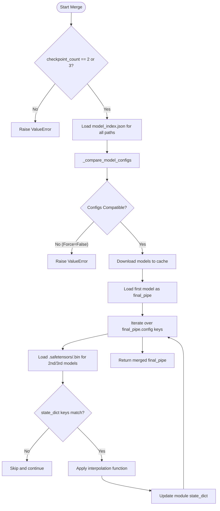
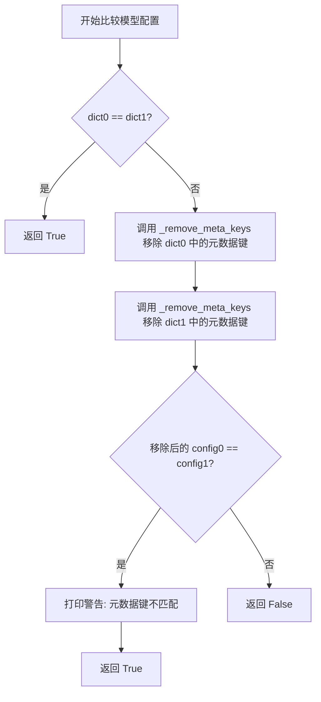
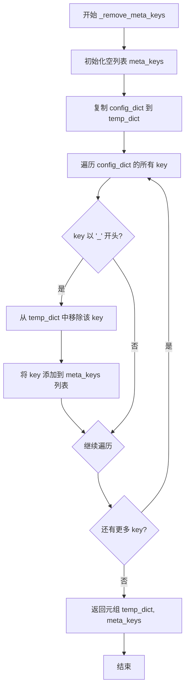
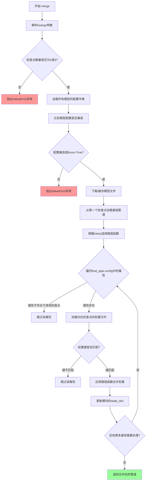

```mermaid
flowchart TD
    A[开始 inv_sigmoid] --> B[导入 math 模块]
    B --> C[计算 alpha 变换: alpha = 0.5 - math.sin&#40;math.asin&#40;1.0 - 2.0 * alpha&#41; / 3.0&#41;]
    C --> D[计算权重差值: theta1 - theta0]
    D --> E[计算插值增量: &#40;theta1 - theta0&#41; * alpha]
    E --> F[计算最终结果: theta0 + &#40;theta1 - theta0&#41; * alpha]
    F --> G[返回合并后的张量]
```

# `diffusers\examples\community\checkpoint_merger.py` 详细设计文档

A custom Hugging Face Diffusers pipeline that enables merging two or three pre-trained diffusion model checkpoints into a single unified model using configurable interpolation algorithms (weighted sum, sigmoid, inverse sigmoid, add difference).

## 整体流程



## 类结构

```
DiffusionPipeline (Base Class from diffusers)
└── CheckpointMergerPipeline (Custom Implementation)
```

## 全局变量及字段


### `CheckpointMergerPipeline.self.device`
    
Inherited from DiffusionPipeline, used for moving the pipeline to the appropriate compute device (e.g., CUDA)

类型：`torch.device`
    


### `CheckpointMergerPipeline.self.config`
    
Inherited from DiffusionPipeline, contains the pipeline configuration dictionary used for iteration and attribute access

类型：`Dict`
    
    

## 全局函数及方法


### `CheckpointMergerPipeline.__init__`

这是 `CheckpointMergerPipeline` 类的构造函数，用于初始化合并检查点管道。该方法继承自 `DiffusionPipeline`，通过调用 `register_to_config()` 注册配置，然后调用父类的 `__init__` 完成基础管道的初始化设置。

参数：

- 该方法无显式参数（`self` 为隐式参数）

返回值：`None`，无返回值（构造函数）

#### 流程图

```mermaid
flowchart TD
    A[开始 __init__] --> B[调用 self.register_to_config]
    B --> C[调用 super().__init__]
    C --> D[结束]
```

#### 带注释源码

```python
def __init__(self):
    """
    初始化 CheckpointMergerPipeline 实例。
    
    该构造函数执行以下操作：
    1. 调用 register_to_config() 方法注册当前配置到管道
    2. 调用父类 DiffusionPipeline 的初始化方法
    """
    # 注册配置到管道，这是 DiffusionPipeline 的标准初始化步骤
    self.register_to_config()
    
    # 调用父类 DiffusionPipeline 的 __init__ 方法
    # 完成基础pipeline组件的初始化
    super().__init__()
```


### `CheckpointMergerPipeline._compare_model_configs`

该方法用于比较两个模型配置文件（字典），判断它们是否兼容。在比较过程中，会先移除以 `_` 开头的元数据键（meta keys），然后再进行比对。如果两个配置在移除元数据键后相同，但原始键不完全一致，则会输出警告信息。这主要用于在合并多个扩散模型检查点之前，验证它们的配置是否匹配。

参数：

- `dict0`：`Dict`，第一个模型的配置字典
- `dict1`：`Dict`，第二个模型的配置字典

返回值：`bool`，如果两个配置兼容（相等或仅在元数据键上有差异）返回 `True`，否则返回 `False`

#### 流程图



#### 带注释源码

```python
def _compare_model_configs(self, dict0, dict1):
    """
    比较两个模型配置字典是否兼容。
    
    比较逻辑：
    1. 首先检查两个字典是否完全相等
    2. 如果不相等，移除以 '_' 开头的元数据键后再比较
    3. 如果移除后相等，说明只是元数据不同，返回 True 并打印警告
    4. 如果移除后仍不相等，返回 False
    
    参数:
        dict0: 第一个模型的配置字典
        dict1: 第二个模型的配置字典
    
    返回:
        bool: 配置兼容返回 True，不兼容返回 False
    """
    # 步骤1: 首先进行完整的字典比较
    if dict0 == dict1:
        # 如果两个字典完全相等，直接返回 True
        return True
    else:
        # 步骤2: 如果不相等，移除以 '_' 开头的元数据键后进行比较
        config0, meta_keys0 = self._remove_meta_keys(dict0)
        config1, meta_keys1 = self._remove_meta_keys(dict1)
        
        # 步骤3: 比较移除元数据键后的配置
        if config0 == config1:
            # 配置本身相同，只是元数据键不同，打印警告信息
            print(f"Warning !: Mismatch in keys {meta_keys0} and {meta_keys1}.")
            return True
    
    # 步骤4: 移除元数据键后仍不相等，返回 False
    return False
```


### `CheckpointMergerPipeline._remove_meta_keys`

该方法用于从配置字典中移除所有以双下划线 "_" 开头的元数据键（meta keys），返回清理后的配置字典和被移除的元键列表，主要用于模型配置比较时忽略内部元信息。

参数：

- `self`：CheckpointerMergerPipeline 实例，方法所属的类实例
- `config_dict`：`Dict`，输入的配置字典，待处理的原始配置

返回值：`Tuple[Dict, List[str]]`，返回一个元组，包含移除 meta keys 后的配置字典和被移除的 meta keys 列表

#### 流程图



#### 带注释源码

```python
def _remove_meta_keys(self, config_dict: Dict):
    """
    从配置字典中移除以双下划线 '_' 开头的元数据键
    
    参数:
        config_dict: Dict - 输入的配置字典
        
    返回:
        Tuple[Dict, List[str]] - 移除 meta keys 后的字典和被移除的键列表
    """
    # 用于存储被移除的 meta keys
    meta_keys = []
    # 创建配置字典的副本，避免修改原始字典
    temp_dict = config_dict.copy()
    # 遍历原始配置字典的所有键
    for key in config_dict.keys():
        # 检查键是否以双下划线开头（内部元数据键）
        if key.startswith("_"):
            # 从临时字典中移除该键
            temp_dict.pop(key)
            # 将被移除的键记录到列表中
            meta_keys.append(key)
    # 返回处理后的字典和被移除的键列表
    return (temp_dict, meta_keys)
```


### `CheckpointMergerPipeline.merge`

该方法用于合并多个预训练的扩散模型检查点（checkpoints），通过指定的插值方法（加权求和、Smoothstep、Inverse Smoothstep或差值相加）将两个或三个模型的权重按照alpha参数进行融合，返回一个包含合并后权重的新DiffusionPipeline对象。

参数：

- `pretrained_model_name_or_path_list`：`List[Union[str, os.PathLike]]`，包含2到3个预训练模型名称或本地路径的列表
- `**kwargs`：
  - `alpha`：`float`，插值参数，范围0到1，控制模型权重融合比例
  - `interp`：`str`，插值方法，支持"sigmoid"、"inv_sigmoid"、"add_diff"或None（默认加权求和）
  - `force`：`bool`，是否忽略模型配置不匹配的警告，默认为False
  - `cache_dir`：`str`，模型缓存目录
  - `force_download`：`bool`，是否强制重新下载
  - `proxies`：`dict`，代理服务器配置
  - `local_files_only`：`bool`，是否仅使用本地文件
  - `token`：`str`，HuggingFace认证令牌
  - `revision`：`str`，模型版本修订
  - `torch_dtype`：`torch.dtype`，模型权重数据类型
  - `device_map`：`dict`，设备映射配置
  - `variant`：`str`，模型变体（如"fp16"）

返回值：`DiffusionPipeline`，返回包含合并后权重的新管道对象

#### 流程图



#### 带注释源码

```python
@torch.no_grad()
@validate_hf_hub_args
def merge(self, pretrained_model_name_or_path_list: List[Union[str, os.PathLike]], **kwargs):
    """
    返回一个新的DiffusionPipeline对象，包含传入的检查点列表(pretrained_model_name_or_path_list)中模型的合并权重。
    
    参数:
        pretrained_model_name_or_path_list: HuggingFace Hub上的预训练模型名称列表或本地存储模型的路径
        
        **kwargs:
            支持所有默认的DiffusionPipeline.get_config_dict参数:
            cache_dir, force_download, proxies, local_files_only, token, revision, torch_dtype, device_map
            
            alpha: 插值参数，范围0-1，决定检查点合并的比例
            interp: 合并使用的插值方法，支持"sigmoid", "inv_sigmoid", "add_diff"或None
            force: 是否忽略model_config.json的不匹配，默认为False
            variant: 要加载的预训练模型变体，如"fp16"
    """
    
    # 从kwargs中提取DiffusionPipeline的默认参数
    cache_dir = kwargs.pop("cache_dir", None)
    force_download = kwargs.pop("force_download", False)
    proxies = kwargs.pop("proxies", None)
    local_files_only = kwargs.pop("local_files_only", False)
    token = kwargs.pop("token", None)
    variant = kwargs.pop("variant", None)
    revision = kwargs.pop("revision", None)
    torch_dtype = kwargs.pop("torch_dtype", torch.float32)
    device_map = kwargs.pop("device_map", None)

    # 验证torch_dtype是否为有效的torch.dtype类型
    if not isinstance(torch_dtype, torch.dtype):
        torch_dtype = torch.float32
        print(f"Passed `torch_dtype` {torch_dtype} is not a `torch.dtype`. Defaulting to `torch.float32`.")

    # 提取合并特定的参数
    alpha = kwargs.pop("alpha", 0.5)
    interp = kwargs.pop("interp", None)

    print("Received list", pretrained_model_name_or_path_list)
    print(f"Combining with alpha={alpha}, interpolation mode={interp}")

    checkpoint_count = len(pretrained_model_name_or_path_list)
    
    # force参数决定是否忽略模型配置不匹配
    force = kwargs.pop("force", False)

    # 验证检查点数量：必须为2或3个
    if checkpoint_count > 3 or checkpoint_count < 2:
        raise ValueError(
            "Received incorrect number of checkpoints to merge. Ensure that either 2 or 3 checkpoints are being"
            " passed."
        )

    print("Received the right number of checkpoints")
    
    # 步骤1: 加载模型配置并比较检查点
    # 首先比较model_index.json，忽略以下划线开头的键
    config_dicts = []
    for pretrained_model_name_or_path in pretrained_model_name_or_path_list:
        config_dict = DiffusionPipeline.load_config(
            pretrained_model_name_or_path,
            cache_dir=cache_dir,
            force_download=force_download,
            proxies=proxies,
            local_files_only=local_files_only,
            token=token,
            revision=revision,
        )
        config_dicts.append(config_dict)

    # 比较所有配置字典的兼容性
    comparison_result = True
    for idx in range(1, len(config_dicts)):
        comparison_result &= self._compare_model_configs(config_dicts[idx - 1], config_dicts[idx])
        if not force and comparison_result is False:
            raise ValueError("Incompatible checkpoints. Please check model_index.json for the models.")
    print("Compatible model_index.json files found")
    
    # 步骤2: 基础验证成功，下载模型并保存到本地文件
    cached_folders = []
    for pretrained_model_name_or_path, config_dict in zip(pretrained_model_name_or_path_list, config_dicts):
        # 过滤允许的文件模式
        folder_names = [k for k in config_dict.keys() if not k.startswith("_")]
        allow_patterns = [os.path.join(k, "*") for k in folder_names]
        allow_patterns += [
            WEIGHTS_NAME,
            SCHEDULER_CONFIG_NAME,
            CONFIG_NAME,
            ONNX_WEIGHTS_NAME,
            DiffusionPipeline.config_name,
        ]
        requested_pipeline_class = config_dict.get("_class_name")
        user_agent = {"diffusers": __version__, "pipeline_class": requested_pipeline_class}

        # 如果是本地目录直接使用，否则下载
        cached_folder = (
            pretrained_model_name_or_path
            if os.path.isdir(pretrained_model_name_or_path)
            else snapshot_download(
                pretrained_model_name_or_path,
                cache_dir=cache_dir,
                proxies=proxies,
                local_files_only=local_files_only,
                token=token,
                revision=revision,
                allow_patterns=allow_patterns,
                user_agent=user_agent,
            )
        )
        print("Cached Folder", cached_folder)
        cached_folders.append(cached_folder)

    # 步骤3:
    # 将第一个检查点作为基础扩散管道并原地修改其模块state_dict
    final_pipe = DiffusionPipeline.from_pretrained(
        cached_folders[0],
        torch_dtype=torch_dtype,
        device_map=device_map,
        variant=variant,
    )
    final_pipe.to(self.device)

    checkpoint_path_2 = None
    if len(cached_folders) > 2:
        checkpoint_path_2 = os.path.join(cached_folders[2])

    # 根据interp参数选择插值函数
    if interp == "sigmoid":
        theta_func = CheckpointMergerPipeline.sigmoid
    elif interp == "inv_sigmoid":
        theta_func = CheckpointMergerPipeline.inv_sigmoid
    elif interp == "add_diff":
        theta_func = CheckpointMergerPipeline.add_difference
    else:
        theta_func = CheckpointMergerPipeline.weighted_sum

    # 遍历每个模块的state dict
    for attr in final_pipe.config.keys():
        if not attr.startswith("_"):
            # 构建检查点路径
            checkpoint_path_1 = os.path.join(cached_folders[1], attr)
            if os.path.exists(checkpoint_path_1):
                # 查找权重文件(.safetensors或.bin格式)
                files = [
                    *glob.glob(os.path.join(checkpoint_path_1, "*.safetensors")),
                    *glob.glob(os.path.join(checkpoint_path_1, "*.bin")),
                ]
                checkpoint_path_1 = files[0] if len(files) > 0 else None
            
            # 处理第三个检查点（如果存在）
            if len(cached_folders) < 3:
                checkpoint_path_2 = None
            else:
                checkpoint_path_2 = os.path.join(cached_folders[2], attr)
                if os.path.exists(checkpoint_path_2):
                    files = [
                        *glob.glob(os.path.join(checkpoint_path_2, "*.safetensors")),
                        *glob.glob(os.path.join(checkpoint_path_2, "*.bin")),
                    ]
                    checkpoint_path_2 = files[0] if len(files) > 0 else None
            
            # 如果属性在第2或第3个模型中都不存在，则跳过
            if checkpoint_path_1 is None and checkpoint_path_2 is None:
                print(f"Skipping {attr}: not present in 2nd or 3d model")
                continue
            
            try:
                module = getattr(final_pipe, attr)
                # 忽略requires_safety_checker布尔值
                if isinstance(module, bool):
                    continue
                
                # 获取基础模块的state_dict
                theta_0 = getattr(module, "state_dict")
                theta_0 = theta_0()

                # 获取load_state_dict方法用于后续更新
                update_theta_0 = getattr(module, "load_state_dict")
                
                # 加载第二个检查点的权重
                theta_1 = (
                    safetensors.torch.load_file(checkpoint_path_1)
                    if (checkpoint_path_1.endswith(".safetensors"))
                    else torch.load(checkpoint_path_1, map_location="cpu")
                )
                
                # 加载第三个检查点的权重（如果存在）
                theta_2 = None
                if checkpoint_path_2:
                    theta_2 = (
                        safetensors.torch.load_file(checkpoint_path_2)
                        if (checkpoint_path_2.endswith(".safetensors"))
                        else torch.load(checkpoint_path_2, map_location="cpu")
                    )

                # 验证权重键是否匹配
                if not theta_0.keys() == theta_1.keys():
                    print(f"Skipping {attr}: key mismatch")
                    continue
                if theta_2 and not theta_1.keys() == theta_2.keys():
                    print(f"Skipping {attr}:y mismatch")
            except Exception as e:
                print(f"Skipping {attr} do to an unexpected error: {str(e)}")
                continue
            
            print(f"MERGING {attr}")

            # 对每个权重键应用插值函数进行合并
            for key in theta_0.keys():
                if theta_2:
                    # 三个模型合并
                    theta_0[key] = theta_func(theta_0[key], theta_1[key], theta_2[key], alpha)
                else:
                    # 两个模型合并
                    theta_0[key] = theta_func(theta_0[key], theta_1[key], None, alpha)

            # 释放不再需要的内存
            del theta_1
            del theta_2
            # 更新模块的state_dict
            update_theta_0(theta_0)

            del theta_0
    
    # 返回合并后的管道
    return final_pipe
```


### `CheckpointMergerPipeline.weighted_sum`

该函数是一个静态方法，使用加权求和的方式对两个或三个模型的参数（tensor）进行插值合并，返回合并后的新参数。

参数：

- `theta0`：`torch.Tensor`，第一个模型的参数/权重张量
- `theta1`：`torch.Tensor`，第二个模型的参数/权重张量
- `theta2`：`torch.Tensor` 或 `None`，第三个模型的参数/权重张量（可选）
- `alpha`：`float`，插值参数，范围从 0 到 1，控制两个模型权重之间的混合比例

返回值：`torch.Tensor`，返回合并后的参数张量

#### 流程图

```mermaid
flowchart TD
    A[开始 weighted_sum] --> B[输入 theta0, theta1, theta2, alpha]
    B --> C{theta2 是否为 None?}
    C -->|是| D[计算加权求和: (1-alpha) * theta0 + alpha * theta1]
    C -->|否| E[注意: weighted_sum 不处理3个模型的情况]
    D --> F[返回合并后的 Tensor]
    E --> F
```

#### 带注释源码

```python
@staticmethod
def weighted_sum(theta0, theta1, theta2, alpha):
    """
    使用加权求和的方式合并两个模型的参数
    
    参数:
        theta0: 第一个模型的参数张量 (torch.Tensor)
        theta1: 第二个模型的参数张量 (torch.Tensor)
        theta2: 第三个模型的参数张量, 在此函数中未使用 (torch.Tensor 或 None)
        alpha: 插值系数, 范围 0-1 (float)
        
    返回:
        合并后的参数张量 (torch.Tensor)
        
    注意: 
        - 当 alpha=0 时, 结果完全返回 theta0
        - 当 alpha=1 时, 结果完全返回 theta1
        - 当 alpha=0.5 时, 两个模型权重各占 50%
    """
    # 加权求和公式: (1 - alpha) * theta0 + alpha * theta1
    # 即: theta0 * (1 - alpha) + theta1 * alpha
    return ((1 - alpha) * theta0) + (alpha * theta1)
```


### `CheckpointMergerPipeline.sigmoid`

该方法实现了基于Smoothstep（平滑阶梯）函数的权重插值算法，用于在模型合并时对两个或三个模型的权重进行非线性插值。通过使用Smoothstep曲线，该方法能够在保留原始模型特征的同时，实现更平滑的权重过渡效果。

参数：

- `theta0`：`torch.Tensor`，第一个模型的权重张量（基础模型权重）
- `theta1`：`torch.Tensor`，第二个模型的权重张量（待合并的模型权重）
- `theta2`：`torch.Tensor` 或 `None`，第三个模型的权重张量（可选，用于三模型合并场景）
- `alpha`：`float`，插值参数，范围从0到1，控制两个模型权重合并的比例

返回值：`torch.Tensor`，合并后的权重张量

#### 流程图

```mermaid
flowchart TD
    A[开始 sigmoid 方法] --> B[输入: theta0, theta1, theta2, alpha]
    B --> C[计算 Smoothstep 曲线: alpha = α² × (3 - 2α)]
    C --> D[计算权重差: theta1 - theta0]
    D --> E[计算插值增量: (theta1 - theta0) × alpha]
    E --> F[计算最终结果: theta0 + 增量]
    F --> G[返回合并后的权重张量]
```

#### 带注释源码

```python
@staticmethod
def sigmoid(theta0, theta1, theta2, alpha):
    """
    使用 Smoothstep 曲线进行权重插值
    
    Smoothstep 函数是一种常用的平滑过渡函数，类似于 sigmoid 但具有更好的数学性质。
    它在 0-1 范围内呈现 S 形曲线，但在两端更加平缓，能够更好地保留原始模型的特征。
    
    参考: https://en.wikipedia.org/wiki/Smoothstep
    """
    # 第一步：将 alpha 从线性空间映射到 Smoothstep 曲线
    # Smoothstep 公式: f(x) = 3x² - 2x³
    # 这里将其应用于插值参数 alpha
    # 当 alpha=0 时，结果为 0；当 alpha=1 时，结果为 1
    # 中间值呈现 S 形曲线，比线性插值更平滑
    alpha = alpha * alpha * (3 - (2 * alpha))
    
    # 第二步：计算合并后的权重
    # 公式: theta0 + (theta1 - theta0) * smooth_alpha
    # 这等价于: (1 - smooth_alpha) * theta0 + smooth_alpha * theta1
    # 其中 smooth_alpha 是经过 Smoothstep 变换后的值
    return theta0 + ((theta1 - theta0) * alpha)
```


### `CheckpointMergerPipeline.inv_sigmoid`

这是一个静态方法，实现了 Inverse Smoothstep（逆平滑步）插值算法。该方法用于在合并多个扩散模型检查点时，对模型参数进行非线性插值计算。通过 Inverse Smoothstep 函数，可以使参数插值更加平滑，避免线性插值可能带来的权重分布不均问题。

参数：

- `theta0`：`torch.Tensor`，第一个模型的参数（基础模型权重）
- `theta1`：`torch.Tensor`，第二个模型的参数（要合并的模型权重）
- `theta2`：`torch.Tensor` 或 `None`，第三个模型的参数（可选，用于三模型合并）
- `alpha`：`float`，插值参数，范围从 0 到 1，控制两个模型权重合并的比例

返回值：`torch.Tensor`，返回合并计算后的张量结果

#### 流程图



#### 带注释源码

```python
@staticmethod
def inv_sigmoid(theta0, theta1, theta2, alpha):
    """
    Inverse Smoothstep 插值方法
    
    该方法是 CheckpointMergerPipeline 的静态方法，实现了 Inverse Smoothstep（逆平滑步）算法。
    它通过数学变换将原始的 alpha 值映射到新的插值权重，使得参数合并过程更加平滑。
    
    算法原理：
    - 使用三角函数（asin, sin）对 alpha 进行非线性变换
    - 变换公式: alpha' = 0.5 - sin(asin(1 - 2*alpha) / 3)
    - 这种变换使得权重在两端（接近0和1时）变化更缓慢，在中间变化更快
    
    参数:
        theta0: 第一个模型的权重张量（基础/原始模型）
        theta1: 第二个模型的权重张量（要合并的模型）
        theta2: 第三个模型的权重张量（可选，用于三模型合并，此参数在此方法中未使用）
        alpha: 插值系数，范围0-1，0表示完全使用theta0，1表示完全使用theta1
    
    返回:
        合并后的权重张量
    """
    import math

    # 对 alpha 进行 Inverse Smoothstep 变换
    # 原始 alpha 范围 [0, 1]
    # 变换后的 alpha' 同样在 [0, 1] 范围内，但分布更加平滑
    # 公式来源: https://en.wikipedia.org/wiki/Smoothstep
    alpha = 0.5 - math.sin(math.asin(1.0 - 2.0 * alpha) / 3.0)
    
    # 执行线性插值计算: theta = theta0 + (theta1 - theta0) * alpha'
    # 这里的 alpha' 是经过 Inverse Smoothstep 变换后的值
    return theta0 + ((theta1 - theta0) * alpha)
```


### `CheckpointMergerPipeline.add_difference`

该函数是一个静态方法，用于在合并三个检查点时执行"差值相加"的插值计算。它通过从第二个模型的参数中减去第三个模型的参数，然后将结果乘以(1.0 - alpha)后加到第一个模型参数上，实现基于差异的模型融合。

参数：

- `theta0`：`torch.Tensor`，第一个模型的参数张量（基础模型参数）
- `theta1`：`torch.Tensor`，第二个模型的参数张量（要被添加差异的模型参数）
- `theta2`：`torch.Tensor`，第三个模型的参数张量（作为差异参照的模型参数），可以为 None
- `alpha`：`float`，插值参数，范围 0 到 1，控制融合程度

返回值：`torch.Tensor`，返回合并后的参数张量

#### 流程图

```mermaid
flowchart TD
    A[开始 add_difference] --> B[输入 theta0, theta1, theta2, alpha]
    B --> C[计算差异: theta1 - theta2]
    C --> D[计算权重: (1.0 - alpha)]
    D --> E[计算加权差异: (theta1 - theta2) * (1.0 - alpha)]
    E --> F[合并参数: theta0 + 加权差异]
    F --> G[返回合并后的张量]
```

#### 带注释源码

```python
@staticmethod
def add_difference(theta0, theta1, theta2, alpha):
    """
    执行基于差异的模型参数合并（add_diff 插值方法）。
    
    该方法主要用于合并三个检查点，其公式为：
    result = theta0 + (theta1 - theta2) * (1.0 - alpha)
    
    当 alpha = 0 时，完全使用 theta0 + (theta1 - theta2)，即完全应用差异
    当 alpha = 1 时，仅使用 theta0，不应用任何差异
    当 alpha = 0.5 时，使用 theta0 + 0.5 * (theta1 - theta2)
    
    参数:
        theta0: 第一个模型的参数张量（通常是基础/第一个检查点）
        theta1: 第二个模型的参数张量（差异的来源）
        theta2: 第三个模型的参数张量（差异的参照，可为 None）
        alpha: 插值参数，范围 0 到 1
        
    返回:
        合并后的参数张量
    """
    # 计算两个模型之间的差异 (theta1 - theta2)
    difference = theta1 - theta2
    
    # 计算权重系数 (1.0 - alpha)
    # alpha 越大，最终结果越接近 theta0
    weight = 1.0 - alpha
    
    # 将差异乘以权重后加到基础参数上
    # 当 alpha=0 时，完全添加差异
    # 当 alpha=1 时，不添加差异
    return theta0 + difference * weight
```

## 关键组件


### 张量索引与惰性加载

使用glob动态查找模型权重文件（.safetensors或.bin），通过getattr获取模块并调用state_dict()实现惰性加载，避免一次性加载所有权重到内存。

### 反量化支持

通过torch_dtype参数支持不同精度（fp16/fp32等），同时支持加载safetensors.torch和torch.load两种格式，实现跨格式的模型权重合并。

### 量化策略

通过alpha参数（0-1范围）和interp插值方法（sigmoid/inv_sigmoid/add_diff/weighted_sum）控制多个模型权重的合并比例和融合方式。

### 配置验证与元数据处理

_compare_model_configs方法比较模型配置，_remove_meta_keys移除以"_"开头的元数据键，确保合并的模型具有兼容性配置。

### 模型下载与缓存管理

使用snapshot_download从HuggingFace Hub下载模型，结合allow_patterns过滤相关文件，支持本地缓存和代理设置。

### 多模块状态字典合并

遍历final_pipe.config中的每个模块属性，动态加载对应检查点文件，按键匹配后通过插值函数合并权重，最后调用load_state_dict更新模型。

### 插值融合算法

提供四种权重合并算法：weighted_sum（加权求和）、sigmoid（Smoothstep）、inv_sigmoid（反平滑步）、add_diff（差值叠加），支持2-3个检查点的灵活融合。

### 错误容忍与跳过机制

使用try-except捕获异常并跳过问题模块，通过键匹配检查过滤不兼容的权重，支持force参数忽略配置不匹配。


## 问题及建议


### 已知问题

-   **错误处理不足**：在`merge`方法中，大量使用`try-except`捕获异常但仅打印错误后继续执行，这可能导致隐藏问题，难以调试，且部分错误（如key mismatch）被静默跳过而不抛出异常。
-   **违反单一职责原则**：`merge`方法承担了过多职责（加载配置、下载模型、合并权重、处理文件等），代码过长（超过200行），难以维护和测试。
-   **代码重复**：加载`theta_1`和`theta_2`检查点的逻辑重复（safetensors和bin文件处理），以及多次使用`glob.glob`查找文件。
-   **初始化问题**：`__init__`方法中调用`self.register_to_config()`和`super().__init__()`但未传递任何参数，可能导致基类初始化不完整或配置缺失。
-   **类型提示不完整**：部分方法缺少参数和返回值的类型提示（如`_compare_model_configs`、`_remove_meta_keys`），且`merge`方法的`**kwargs`没有严格类型验证。
-   **配置比较逻辑缺陷**：`_compare_model_configs`方法在配置不同时仅打印警告但返回`True`，可能导致不兼容的模型被合并，产生运行时错误。
- **资源管理**：使用`torch.load`加载检查点后未显式释放内存，且在循环中重复创建大型张量，可能导致内存占用过高。
- **硬编码和魔法值**：如`torch.float32`默认值、允许的模型数量（2或3）等硬编码在逻辑中，缺乏灵活性。
- **调试打印语句**：使用`print`语句进行调试和日志输出，应替换为标准的`logging`模块以便控制日志级别。
- **未使用的导入和变量**：导入了`__version__`但未使用，代码中还有注释掉的旧代码（如`# chkpt0, chkpt1 = ...`）未清理。
- **潜在的文件覆盖风险**：合并后的模型直接修改`final_pipe`的状态字典，如果合并失败，可能导致原始模型状态不可恢复。
- **不支持动态数量的模型**：代码仅支持2或3个模型的合并，且对3个模型仅支持"add_diff"插值方法，但未在文档中明确强制此限制（虽然代码逻辑如此）。

### 优化建议

-   **重构`merge`方法**：将`merge`方法拆分为多个独立方法，如`_load_configs`、`_download_models`、`_merge_checkpoints`等，每个方法负责单一职责，提高可读性和可测试性。
-   **改进错误处理**：对关键步骤（如配置比较、权重合并）应抛出异常而非静默跳过，并提供详细的错误信息；对非关键步骤可使用日志记录警告。
-   **添加类型提示**：为所有方法参数和返回值添加完整的类型提示，并使用`mypy`进行静态类型检查。
-   **使用日志模块**：替换所有`print`语句为`logging`模块，支持配置日志级别（如DEBUG、INFO、WARNING）。
-   **优化文件查找**：预先构建文件路径映射，避免在循环中重复调用`glob.glob`和`os.path.exists`。
-   **增强配置验证**：在比较模型配置时，不仅检查键是否匹配，还应验证关键参数（如模型类型、层数）的一致性，不兼容时应抛出明确异常。
-   **清理代码**：移除未使用的导入、注释掉的代码和不必要的变量声明。
-   **添加资源管理**：使用上下文管理器或显式删除不再需要的大对象（如`theta_1`、`theta_2`），并考虑使用`torch.cuda.empty_cache()`清理GPU缓存。
-   **文档完善**：为所有方法添加完整的文档字符串，说明参数、返回值和可能的异常。
-   **支持配置驱动**：将硬编码的默认值（如允许的模型数量、插值方法）提取为类或模块级常量，提高灵活性。
-   **考虑备份机制**：在合并前保存原始模型配置的副本，以便在失败时恢复。
-   **单元测试**：为关键方法（如插值函数、配置比较）编写单元测试，确保边界情况被覆盖。


## 其它


### 设计目标与约束

本代码的设计目标是实现一个能够合并2-3个扩散模型检查点的Pipeline类，支持多种插值方法（sigmoid、inv_sigmoid、add_diff、weighted_sum），允许用户通过权重混合生成新的微调模型。主要约束包括：仅支持2个或3个检查点合并（不超过3个且不少于2个）；仅支持"sigmoid"、"inv_sigmoid"、"add_diff"和None（默认weighted_sum）四种插值方法；要求被合并的检查点具有兼容的模型配置（model_index.json匹配，忽略下划线开头的元数据键）；add_diff插值方法仅在合并三个检查点时可用；所有操作在torch.no_grad()上下文执行以节省显存。

### 错误处理与异常设计

代码采用多层错误处理机制。在merge方法入口处，对检查点数量进行验证：若数量超过3或小于2，则抛出ValueError并提示"Received incorrect number of checkpoints to merge"。在配置比较阶段，若检查点配置不匹配且force参数为False，则抛出ValueError提示"Incompatible checkpoints"。在遍历模型属性时，使用try-except捕获异常并打印错误信息后continue，确保单个模块的加载失败不会中断整个合并流程。异常处理覆盖了文件不存在、键不匹配、状态字典加载失败等场景，并通过print语句记录跳过的模块信息。此外，代码对torch_dtype参数进行了类型验证，非torch.dtype类型会被强制转换为torch.float32并打印警告。

### 数据流与状态机

整体数据流遵循以下状态转换：1）初始化状态（Initial）：接收pretrained_model_name_or_path_list和kwargs；2）配置加载状态（Config Loading）：遍历列表加载各检查点的model_config.json；3）配置验证状态（Config Validation）：调用_compare_model_configs比较配置，忽略下划线开头的元数据键；4）缓存获取状态（Cache Retrieval）：从HuggingFace Hub下载或从本地读取检查点文件；5）基础模型加载状态（Base Model Loading）：使用第一个检查点作为基础Pipeline；6）权重合并状态（Weight Merging）：遍历final_pipe.config中的属性，加载对应检查点的权重文件，应用插值函数合并；7）完成状态（Complete）：返回包含合并权重的final_pipe。状态转换依赖于检查点数量验证和配置兼容性验证两个关键决策节点。

### 外部依赖与接口契约

主要外部依赖包括：diffusers库（提供DiffusionPipeline基类和相关配置常量）、torch（张量运算和模型状态管理）、huggingface_hub的snapshot_download（模型下载）和validate_hf_hub_args（参数验证装饰器）、safetensors.torch（安全张量格式加载）。接口契约方面，merge方法接收List[Union[str, os.PathLike]]类型的检查点路径列表，支持HuggingFace Hub模型ID或本地目录路径；kwargs支持DiffusionPipeline.get_config_dict的所有参数（cache_dir、force_download、proxies、local_files_only、token、revision、torch_dtype、device_map），以及自定义参数alpha（插值系数，0-1浮点数）、interp（插值方法字符串）、force（强制合并布尔值）、variant（模型变体字符串）。输出返回DiffusionPipeline类型的合并后模型对象。

### 性能优化与资源管理

当前实现存在以下优化空间：1）显存优化：加载theta_1和theta_2后立即进行合并计算，随后立即del并调用gc.collect()，但未使用torch.cuda.empty_cache()显式释放GPU缓存；2）并发加载：检查点文件串行加载，可考虑使用ThreadPoolExecutor并行加载多个检查点的权重；3）缓存策略：每次调用merge都会重新下载检查点，可添加缓存层复用已下载的模型；4）内存映射：对于大模型文件，可使用torch.load的mmap选项减少内存占用；5）中间张量释放：merge循环中可显式设置theta_0=None以加速GC。关键性能瓶颈在于需要同时在内存中持有多个检查点的state_dict，对于超大模型可能导致OOM。

### 版本兼容性说明

本代码依赖于diffusers库的特定结构和常量：CONFIG_NAME（"config.json"）、WEIGHTS_NAME（"diffusion_pytorch_model.bin"）、ONNX_WEIGHTS_NAME（"model.onnx"）、SCHEDULER_CONFIG_NAME（"scheduler_config.json"）。代码使用__version__获取diffusers版本号用于user_agent。兼容的diffusers版本应大于等于代码中import的版本。由于直接访问final_pipe.config.keys()和module.state_dict()，该代码对DiffusionPipeline的内部结构有耦合，若diffusers库重大更新（改变config结构或状态字典访问方式），代码可能需要适配。建议在文档中明确依赖的diffusers最小版本要求。

### 使用示例与最佳实践

基础用法示例：使用CompVis/stable-diffusion-v1-4作为基础模型，合并prompthero/openjourney检查点，alpha=0.8表示第二个模型权重占比80%。高级插值场景：使用sigmoid插值可获得更平滑的权重过渡曲线，inv_sigmoid适用于需要更激进混合的场景。三模型合并：仅支持add_diff方法，用于在两个模型之间添加第三个模型的差异向量。force参数使用：仅在明确知晓模型配置存在微小差异（如训练元数据不同）但权重结构兼容时使用。变体加载：通过variant参数指定"fp16"等变体可减少显存占用。建议在合并前验证各检查点的分词器和调度器配置兼容性，合并后的pipeline可能需要手动调整调度器配置。

### 安全性考虑

代码在下载模型时使用huggingface_hub的allow_patterns限制可下载文件类型，防止恶意文件注入。但代码未对加载的权重进行签名验证或完整性校验，存在加载被篡改模型的风险。模型合并后应避免直接保存到共享目录，以防权重污染。user_agent中包含pipeline_class信息可能泄露使用场景。建议在生产环境中对下载的模型文件进行hash校验，并考虑实现模型来源的可信度评估机制。对于包含敏感信息的检查点，合并操作应在隔离环境中执行。


    